import Guide from '@/components/Guide.astro';
import Knowledge from '@/components/Knowledge.astro';
import Example from '@/components/Example.astro';
import Analysis from '@/components/Analysis.astro';
import Solution from '@/components/Solution.astro';
import Variant from '@/components/Variant.astro';
import Note from '@/components/Note.astro';
import Block from '@/components/Block.astro';
import Method from '@/components/Method.astro';

从这一节开始,我们分别讲解各类积分的计算法.为了得出二重积分的计算公式,先介绍二重积分的几何意义.

## 2.1 二重积分的几何意义

设 $(\sigma) \subseteq \mathbf{R}^2$ 是有界闭区域, $f \in C((\sigma))$ . 由定义, $f$ 在 $(\sigma)$ 上的二重积分就是下列和式的极限:

$$

\iint_ {(\sigma)} f (x, y) \mathrm{d} \sigma = \lim _ {d \rightarrow 0} \sum_ {k = 1} ^ {n} f (\xi_ {k}, \eta_ {k}) \Delta \sigma_ {k}.

$$

下面,我们根据这个和式极限的结构来说明二重积分的几何意义.为方便起见,设 $f(x,y)\geqslant0$ .于是二元函数 $z=f(x,y)$ 在几何上就表示位于域( $\sigma$ )上方的曲面(S)(图6.3(a)),它在xOy坐标平面上的投影就是闭域( $\sigma$ ).以( $\sigma$ )的边界为准线作母线平行于z轴的柱面,便得一以( $\sigma$ )为底、曲面(S)为顶的曲顶柱体.现在我们来说明:若f在( $\sigma$ )上非负,则二重积分 $\iint_{(\sigma)}f(x,y)\mathrm{d}\sigma$ 的值等于以( $\sigma$ )为底,(S)为顶的曲顶柱体的体积.想一想:

此曲顶柱体的体积在域( $\sigma$ )上是非均匀分布的量,其原因在于此柱体的高在变化.若高不变,这个平顶柱体的体积在( $\sigma$ )上是均匀分布的(图6.3(b)),它可以简单地利用乘法:底面积×高得到.为了利用已知的这个均匀分布的体积公式来求此非均匀分布的体积,我们可以像本章第一节1.1段中那样,采用“分”“匀”“合”“精”四个步骤来完成.

(1) 若在域 $(\sigma)$ 上 $f(x,y) \leqslant 0$ , $\iint_{\sigma}f(x,y)\mathrm{d}\sigma$ 的几何意义是什么？

(2) 若在域 $(\sigma)$ 上 $f(x,y)$ 变号，怎样用二重积分表示曲面 $z = f(x,y)$ 在 $(\sigma)$ 上与 xOy 平面以及由 $(\sigma)$ 边界为准线的柱面所围成的立体体积？

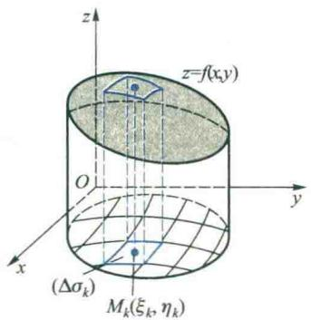  

(a)

  

图6.3  

(b)

分 把区域( $\sigma$ )任意划分成n个子域( $\Delta\sigma_{k}$ )( $k=1,2,\cdots,n$ ),( $\Delta\sigma_{k}$ )的面积记为 $\Delta\sigma_{k}$ .以每一子域( $\Delta\sigma_{k}$ )的边界为准线,作母线平行于z轴的柱面,这样,就把整个曲顶柱体划分成n个小曲顶柱体.

匀 由于子域 $(\Delta \sigma_{k})$ 很小，以它为底的小曲顶柱体的高变化不大，可以近似地看作不变，即看作是 $(\Delta \sigma_{k})$ 内任一点 $M_{k}(\xi_{k},\eta_{k})$ 处的函数值 $f(\xi_k,\eta_k)$ （图6.3(a)).从而这一小曲顶柱体的体积 $\Delta V_{k}$ 可以近似地表示为

$$

\Delta V _ {k} \approx f (\xi_ {k}, \eta_ {k}) \Delta \sigma_ {k}.

$$

合 把各小曲顶柱体体积的近似值加起来, 就得到整个曲顶柱体体积 V 的近似值

$$

V \approx \sum_ {k = 1} ^ {n} f (\xi_ {k}, \eta_ {k}) \Delta \sigma_ {k}.

$$

精 令各子域 $(\Delta\sigma_{k})$ 直径的最大值 $d\rightarrow0$ ，取极限便得到体积V的精确值

$$

V = \lim _ {d \rightarrow 0} \sum_ {k = 1} ^ {n} f (\xi_ {k}, \eta_ {k}) \Delta \sigma_ {k} = \iint_ {(\sigma)} f (x, y) \mathrm{d} \sigma .

$$

这就说明了二重积分的几何意义.

## 2.2 直角坐标系下二重积分的计算法

下面,我们利用二重积分的几何意义来讨论它的计算方法.设 $f\in C((\sigma))$ ，为简单起见,我们仍假设在 $(\sigma)$ 上 $f(x,y)\geqslant0$ .以下就积分域 $(\sigma)$ 可能出现的三种类型来分别讨论二重积分的计算方法.

（1）设 $(\sigma) = \{(x, y) \mid a \leqslant x \leqslant b, y_1(x) \leqslant y \leqslant y_2(x)\}$ ，其中 $y_1(x)$ 与 $y_2(x)$ 均在 $[a, b]$ 上连续。这一区域 $(\sigma)$ 的特点是：过 $[a, b]$ 上任一点 $x_1$ ，作与 $y$ 轴平行同向的直线，与 $(\sigma)$ 的边界至多相交于两点 $(x_1, y_1(x_1))$ 与 $(x_1, y_2(x_1))$ （在区间端点 $a, b$ 处所分别对应的两点可能重合）（图6.4）。为方便起见，称这种类型的区域 $(\sigma)$ 为 $x$ 型区域。由几何意义可知，二重积分 $\iint_{(\sigma)} f(x, y) \mathrm{d}\sigma$ 的值等于以 $(\sigma)$ 为底、 $z = f(x, y)$ 为顶的曲顶柱体的体积 $V$ （图6.5）。在定积分应用中，我们知道这一体积 $V$ 也可用已知平行截面面积求体积的方法来计算。为此，将此曲顶柱体用平行于坐标平面 $yOz$ 的平面来切割。为了求其平行截面的面积，在 $[a, b]$ 上任意固定一点 $x_1$ ，考虑曲顶柱体与平面 $x = x_1$ 的截面面积 $S(x_1)$ 。由图6.5易见，这一截面是由曲线 $\left\{ \begin{array}{l} z = f(x, y), \\ x = x_1 \end{array} \right.$ 在区间 $[y_1(x_1), y_2(x_1)]$ 上所形成的曲边梯形，它的面积 $S(x_1)$ 可用定积分表示为

$$

S (x _ {1}) = \int_ {y _ {1} (x _ {1})} ^ {y _ {2} (x _ {1})} f (x _ {1}, y) \mathrm{d} y.

$$

  

图6.4

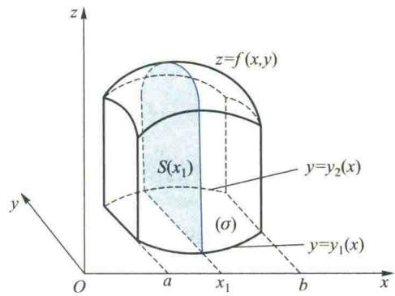  

图6.5

改记 $x_{1}$ 为 $x$ ，并让它在 $a$ 与 $b$ 之间变动，这时截面积 $S(x)$ 也将随之而变动，即

$$

S (x) = \int_ {y _ {1} (x)} ^ {y _ {2} (x)} f (x, y) \mathrm{d} y.

$$

值得注意的是,在求上述积分时,x应看作是常量,积分变量是y.求得 $S(x)$ 之后,再利用定积分的微元法,便可得所求曲顶柱体的体积

$$

V = \int_ {a} ^ {b} S (x) \mathrm{d} x = \int_ {a} ^ {b} \left[ \int_ {y _ {1} (x)} ^ {y _ {2} (x)} f (x, y) \mathrm{d} y \right] \mathrm{d} x.

$$

另一方面，根据二重积分的几何意义，又有

$$

V = \iint_ {(\sigma)} f (x, y) \mathrm{d} \sigma ,

$$

所以

$$

V = \iint_ {(\sigma)} f (x, y) \mathrm{d} \sigma = \int_ {a} ^ {b} \left[ \int_ {y _ {1} (x)} ^ {y _ {2} (x)} f (x, y) \mathrm{d} y \right] \mathrm{d} x.\tag{2.1}

$$

这样一来,二重积分的计算,化成了接连两次计算一元函数的定积分:先固定x,把函数 $f(x,y)$ 看作是关于y的一元函数,对y从区域( $\sigma$ )的边界 $y_{1}(x)$ 至 $y_{2}(x)$ 作定积分;再将积分后所得的一元函数 $S(x)$ ,在区间 $[a,b]$ 上关于x作定积分.这样,就把二重积分化成了由接连两次定积分所构成的累次积分,或称为二次积分,也可把其中

的方括号去掉写成

$$

\int_ {a} ^ {b} \int_ {y _ {1} (x)} ^ {y _ {2} (x)} f (x, y)   \mathrm{d} y \mathrm{d} x \quad \text {或} \quad \int_ {a} ^ {b} \mathrm{d} x \int_ {y _ {1} (x)} ^ {y _ {2} (x)} f (x, y)   \mathrm{d} y.

$$

(2) 设 $(\sigma) = \{(x, y) \mid x_1(y) \leqslant x \leqslant x_2(y), c \leqslant y \leqslant d\}$ , 其中 $x_1(y)$ 与 $x_2(y)$ 均在 $[c, d]$ 上连续（图6.6). 这一区域 $(\sigma)$ 的特点是: 过 $[c, d]$ 上任一点 $y_1$ 作与 $x$ 轴平行同向的直线, 与域 $(\sigma)$ 的边界至多相交于两点 $(x_{1}(y_{1}),y_{1})$ 与 $(x_{2}(y_{1}),y_{1})$ .这类区域称为 $y$ 型区域.对于这种 $y$ 型区域 $(\sigma)$ ，我们用平行于坐标平面 $xOz$ 的平面去切割此曲顶柱体.先计算由曲线 $\left\{ \begin{array}{l}z = f(x,y)\\ y = y_{1} \end{array} \right.$ ，在区间 $[x_1(y_1),x_2(y_1)] (c\leqslant y_1\leqslant d)$ 上所形成的曲边梯形的面积，再在区间 $[c,d]$ 上利用定积分的微元法可得

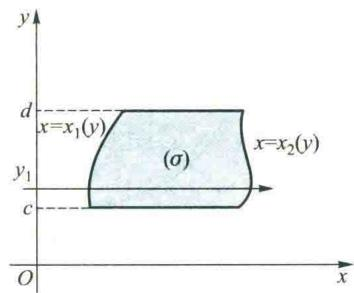  

图6.6

$$

\iint_ {(\sigma)} f (x, y) \mathrm{d} \sigma = \int_ {c} ^ {d} \int_ {x _ {1} (y)} ^ {x _ {2} (y)} f (x, y) \mathrm{d} x \mathrm{d} y = \int_ {c} ^ {d} \mathrm{d} y \int_ {x _ {1} (y)} ^ {x _ {2} (y)} f (x, y) \mathrm{d} x.\tag{2.2}

$$

在这里的累次积分是先固定 y 对 x 计算由 $x_{1}(y)$ 到 $x_{2}(y)$ 的定积分, 其中 $x_{1}(y)$ 与 $x_{2}(y)$ 分别表示 $(\sigma)$ 的左段边界与右段边界上的点对应于 y 的横坐标, 然后再将积分后所得的函数对 y 在区间 $[c, d]$ 上求定积分.

如果积分域 $(\sigma)$ 既是 $x$ 型区域又是 $y$ 型区域，那么，由等式(2.1)与(2.2)可知

$$

\int_ {a} ^ {b} \int_ {y _ {1} (x)} ^ {y _ {2} (x)} f (x, y) \mathrm{d} y \mathrm{d} x = \int_ {c} ^ {d} \int_ {x _ {1} (y)} ^ {x _ {2} (y)} f (x, y) \mathrm{d} x \mathrm{d} y.\tag{2.3}

$$

(2.3)式表明:当 $f(x,y)$ 在积分域( $\sigma$ )上连续时,累次积分可以交换积分顺序.

（3）设积分域( $\sigma$ )既非x型又非y型区域(图6.7).这时我们可以把( $\sigma$ )先分成若干子域,使每一注意:一般来说,在交换累次积分的积分顺序时,积分上、下限将随之改变.

子域成为 x 型区域或 y 型区域, 从而每一子域上的二重积分都可通过累次积分算出, 再根据本章第一节 1.3 段中的性质 2, 在域 $(\sigma)$ 上的二重积分值就等于这些子域上二重积分值之和.

<Example title="例 2.1">
求二重积分

$$

I = \iint_ {(\sigma)} f (x, y) \mathrm{d} \sigma ,

$$

其中 $f(x,y) = 1 - \frac{x}{3} -\frac{y}{4},(\sigma) = \{(x,y)\mid -1\leqslant x\leqslant 1, - 2\leqslant y\leqslant 2\}$ 是一矩形域（图6.8）.

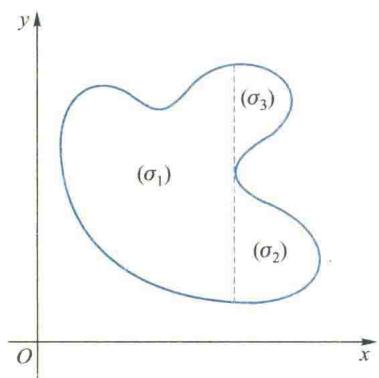  

图6.7

  

图6.8

<Solution title="解">
法一 由于 $(\sigma)$ 是一 $x$ 型区域，它在 $x$ 轴上的投影为区间[-1,1]，这就是累次积分中对 $x$ 的积分区间.在区间[-1,1]上任取一点 $x$ ，作与 $y$ 轴平行同向的直线穿过积分域 $(\sigma)$ ，过 $(\sigma)$ 边界穿入、穿出点的纵坐标分别为 $y = -2$ 与 $y = 2$ .[-2,2]便是对 $y$ 的积分区间.固定 $x$ 先对 $y$ 积分，再对 $x$ 积分得

$$

\begin{array}{r l} I & = \int_ {- 1} ^ {1} \int_ {- 2} ^ {2} \left(1 - \frac {x}{3} - \frac {y}{4}\right) \mathrm{d} y \mathrm{d} x = \int_ {- 1} ^ {1} \left(y - \frac {x y}{3} - \frac {y ^ {2}}{8}\right) \Bigg | _ {- 2} ^ {2} \mathrm{d} x \\ & = \int_ {- 1} ^ {1} \left(4 - \frac {4}{3} x\right) \mathrm{d} x = 8. \end{array}

$$

法二 由于 $(\sigma)$ 也是一 $y$ 型区域，它在 $y$ 轴上的投影为区间[-2,2]，在区间[-2,2]上任取一点 $y$ ，作与 $x$ 轴平行同向的直线，穿入、穿出 $(\sigma)$ 点的横坐标分别为 $x = -1$ 与 $x = 1.$ 固定 $y$ 先对 $x$ 积分，再对 $y$ 积分得

$$

\begin{array}{r l} I & = \int_ {- 2} ^ {2} \int_ {- 1} ^ {1} \left(1 - \frac {x}{3} - \frac {y}{4}\right) \mathrm{d} x \mathrm{d} y \\ & = \int_ {- 2} ^ {2} \left(x - \frac {x ^ {2}}{6} - \frac {x y}{4}\right) \Big | _ {- 1} ^ {1} \mathrm{d} y \\ & = \int_ {- 2} ^ {2} \left(2 - \frac {y}{2}\right) \mathrm{d} y = 8. \end{array}

$$
</Solution>
</Example>

<Note>
解法一与解法二中的累次积分交换了积分顺序, 但是它们对 x 与对 y 的积分上、下限均未发生变化. 这种情况仅对矩形域才会出现.
</Note>

<Example title="例 2.2">
计算 $\iint_{(\sigma)}(x^{2}+y^{2})\mathrm{d}\sigma$ ，其中 $(\sigma)$ 为直线 x=1, y=0 及抛物线 $y=x^{2}$ 所围成的区域.

<Solution title="解">
法一 画出积分域 $(\sigma)$ 如图6.9所示.将 $(\sigma)$ 视为 $x$ 型区域.它在 $x$ 轴上的投影为[0,1]. $\forall x\in [0,1]$ 作与 $y$ 轴平行同向的直线，与 $(\sigma)$ 的下边界和上边界交点的纵坐标分别为 $y = 0$ 与 $y = x^{2}$ .先对 $y$ 后对 $x$ 积分得

  

图6.9

$$

\begin{array}{r l} \iint_ {(\sigma)} (x ^ {2} + y ^ {2}) \mathrm{d} \sigma & = \int_ {0} ^ {1} \mathrm{d} x \int_ {0} ^ {x ^ {2}} (x ^ {2} + y ^ {2}) \mathrm{d} y \\ & = \int_ {0} ^ {1} \left(x ^ {2} y + \frac {y ^ {3}}{3}\right) \Bigg | _ {0} ^ {x ^ {2}} \mathrm{d} x = \int_ {0} ^ {1} \left(x ^ {4} + \frac {x ^ {6}}{3}\right) \mathrm{d} x = \frac {2 6}{1 0 5}. \end{array}

$$

法二 将 $(\sigma)$ 视为 $y$ 型区域. 它在 $y$ 轴上的投影为 $[0,1]$ . $\forall y \in [0,1]$ , 作与 $x$ 轴平行同向的直线, 它与 $(\sigma)$ 的左边界和右边界交点的横坐标分别为 $x = \sqrt{y}$ 与 $x = 1$ . 先对 $x$ 后对 $y$ 积分得

$$

\iint_ {(\sigma)} (x ^ {2} + y ^ {2}) \mathrm{d} \sigma = \int_ {0} ^ {1} \mathrm{d} y \int_ {\sqrt {y}} ^ {1} (x ^ {2} + y ^ {2}) \mathrm{d} x

$$

$$

= \int_ {0} ^ {1} \left(\frac {1}{3} + y ^ {2} - \frac {1}{3} y ^ {\frac {3}{2}} - y ^ {\frac {5}{2}}\right) \mathrm{d} y = \frac {2 6}{1 0 5}.

$$
</Solution>
</Example>

<Example title="例 2.3">
计算 $\iint_{(\sigma)} xy \, \mathrm{d}\sigma$ ，其中 $(\sigma)$ 为抛物线 $y^{2} = x$ 与直线 y = x - 2 所围成的区域.

<Solution title="解">
画出积分域 $(\sigma)$ 如图6.10所示.将 $(\sigma)$ 视为 $y$ 型区域，为向 $y$ 轴投影，先求出直线与抛物线的交点，它们是 $A(4,2)$ 与 $B(1, - 1)$ ，于是 $(\sigma)$ 在 $y$ 轴上的投影为区间[-1,2]. $\forall y\in [-1,2]$ ，作与 $x$ 轴平行同向的直线，穿入、穿出 $(\sigma)$ 边界点的横坐标分别为 $x = y^{2}$ 与 $x = y+$ 2.于是先对 $x$ 后对 $y$ 积分得

  

二维码6.2.1在直角坐标系下计算二重积分的一般步骤.

$$

\begin{array}{r l} \iint_ {(\sigma)} x y \mathrm{d} \sigma & = \int_ {- 1} ^ {2} \mathrm{d} y \int_ {y ^ {2}} ^ {y + 2} x y \mathrm{d} x \\ & = \frac {1}{2} \int_ {- 1} ^ {2} y [ (y + 2) ^ {2} - y ^ {4} ] \mathrm{d} y = 5 \frac {5}{8}. \end{array}

$$

如果将 $(\sigma)$ 看成是 $x$ 型区域，它在 $x$ 轴的投影为区间[0,4].由于当 $x\in [0,1]$ 与 $x\in [1,4]$ 时，与 $y$ 轴平行同向的直线穿入 $(\sigma)$ 的边界曲线有不同的方程，故必须用直线 $x = 1$ 将 $(\sigma)$ 分成两部分（图6.10），把 $(\sigma)$ 看作是 $(\sigma_{1})$ 与 $(\sigma_{2})$ 两个 $x$ 型区域的并.分别先对 $y$ 后对 $x$ 积分，得

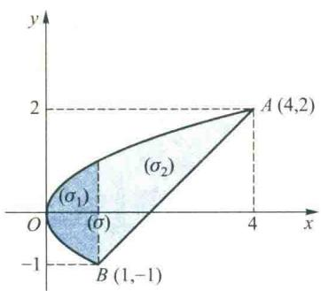

$$

\iint_ {(\sigma)} x y \mathrm{d} \sigma = \int_ {0} ^ {1} \mathrm{d} x \int_ {- \sqrt {x}} ^ {\sqrt {x}} x y \mathrm{d} y + \int_ {1} ^ {4} \mathrm{d} x \int_ {x - 2} ^ {\sqrt {x}} x y \mathrm{d} y.

$$

图6.10

由上式可以算得同样结果,但用这种方法计算显然要麻烦一些.

如果利用对称性就会方便一些.由于 $(\sigma_{1})$ 关于 $x$ 轴对称，而被积函数是关于 $y$ 的奇函数，所以 $\iint_{(\sigma_1)} xy \, \mathrm{d}\sigma = 0$ ，于是

  

二维码6.2.2如何利用对称性简化二重积分的计算.  

二维码6.2.3关于积分域轮换对称性结论的证明及其应用.

$$

\begin{array}{r l} \iint_ {(\sigma)} x y \mathrm{d} \sigma & = \iint_ {(\sigma_ {2})} x y \mathrm{d} \sigma = \int_ {1} ^ {4} \mathrm{d} x \int_ {x - 2} ^ {\sqrt {x}} x y \mathrm{d} y \\ & = 5 \frac {5}{8}. \end{array}

$$
</Solution>
</Example>

<Example title="例 2.4">
计算 $\iint_{(\sigma)}\frac{\sin x}{x}\mathrm{d}\sigma$ ，其中 $(\sigma)$ 为直线 y = x 与抛物线 $y = x^{2}$ 所围成的区域.

<Solution title="解">
画出积分域( $\sigma$ )如图6.11所示.先对y后对x积分,得

$$

\begin{array}{r l} \iint_ {(\sigma)} \frac {\sin x}{x} \mathrm{d} \sigma & = \int_ {0} ^ {1} \mathrm{d} x \int_ {x ^ {2}} ^ {x} \frac {\sin x}{x} \mathrm{d} y \\ & = \int_ {0} ^ {1} \frac {\sin x}{x} (x - x ^ {2}) \mathrm{d} x = 1 - \sin 1. \end{array}

$$
</Solution>
</Example>

<Note>
这里被积函数在点 $(0,0)$ 无定义,但由于当 $x\rightarrow0$ 时其极限存在,而改变被积函数在个别点的值不影响其积分值,故此时可理解为对此被积函数在点 $(0,0)$ 用极限值补充定义后再讨论.

  

图6.11

如果先对 x 后对 y 积分, 则有注意:由例 2.3 和例 2.4 可以看到,计算二重积分时,选取适当的积分顺序是一个值得注意的问题.如果积分顺序选取不当,不仅可能引起计算上的麻烦,而且可能导致积分无法算出.

$$

\iint_ {(\sigma)} \frac {\sin x}{x} \mathrm{d} \sigma = \int_ {0} ^ {1} \mathrm{d} y \int_ {y} ^ {\sqrt {y}} \frac {\sin x}{x} \mathrm{d} x.

$$

由于 $\frac{\sin x}{x}$ 的原函数不能用初等函数表示,因而无法继续进行计算.
</Note>

<Example title="例 2.5">
计算 $\iint_{(\sigma)}(x^{2}y^{2}+xy^{3}\mathrm{e}^{x^{2}+y^{2}})\mathrm{d}\sigma$ ，其中 $(\sigma)$ 为直线 y=x, y=-1 与 x=1 所围成的区域.

<Solution title="解">
画出积分域( $\sigma$ )如图6.12所示的三角形ABC.由于被积函数比较复杂,直接计算是比较费时的,为了利用对称性,作辅助线y=-x,将( $\sigma$ )划分为由OAB所构成的三角形域( $\sigma_{1}$ )与由OBC所构成的( $\sigma_{2}$ ),它们分别关于y轴和x轴对称.将所给积分拆开,有

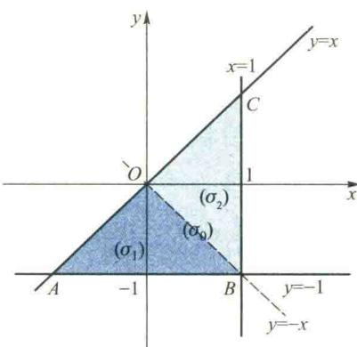  

图6.12

$$

\begin{array}{r l} \iint_ {(\sigma)} (x ^ {2} y ^ {2} + x y ^ {3} \mathrm{e} ^ {x ^ {2} + y ^ {2}}) \mathrm{d} \sigma & = \iint_ {(\sigma)} x ^ {2} y ^ {2} \mathrm{d} \sigma + \iint_ {(\sigma)} x y ^ {3} \mathrm{e} ^ {x ^ {2} + y ^ {2}} \mathrm{d} \sigma \\ & = \iint_ {(\sigma)} x ^ {2} y ^ {2} \mathrm{d} \sigma + \iint_ {(\sigma_ {1})} x y ^ {3} \mathrm{e} ^ {x ^ {2} + y ^ {2}} \mathrm{d} \sigma + \iint_ {(\sigma_ {2})} x y ^ {3} \mathrm{e} ^ {x ^ {2} + y ^ {2}} \mathrm{d} \sigma , \end{array}

$$

由于 $(\sigma_{1})$ 关于y轴对称，而被积函数 $xy^{3}e^{x^{2}+y^{2}}$ 是x的奇函数，由对称性可知

$$

\iint_ {(\sigma_ {1})} x y ^ {3} \mathrm{e} ^ {x ^ {2} + y ^ {2}} \mathrm{d} \sigma = 0;

$$

由于 $(\sigma_{2})$ 关于x轴对称,而被积函数也是y的奇函数,所以

$$

\iint_ {(\sigma_ {2})} x y ^ {3} \mathrm{e} ^ {x ^ {2} + y ^ {2}} \mathrm{d} \sigma = 0.

$$

再注意到 $x^{2}y^{2}$ 关于 $x$ 与 $y$ 都是偶函数，将由 $x$ 轴、 $y$ 轴、 $x = 1, y = -1$ 所围成的正方形域记作 $(\sigma_{0})$ ，于是分别利用关于 $y$ 轴和 $x$ 轴的对称性可知

$$

\iint_ {(\sigma)} x ^ {2} y ^ {2} \mathrm{d} \sigma = 2 \iint_ {(\sigma_ {0})} x ^ {2} y ^ {2} \mathrm{d} \sigma = 2 \int_ {0} ^ {1} x ^ {2} \mathrm{d} x \int_ {- 1} ^ {0} y ^ {2} \mathrm{d} y = \frac {2}{9}.

$$

综上可知,所求二重积分的值等于 $\frac{2}{9}$ .
</Solution>
</Example>

<Example title="例 2.6">
交换累次积分

$$

I = \int_ {- 2} ^ {0} \mathrm{d} x \int_ {0} ^ {\frac {2 + x}{2}} f (x, y) \mathrm{d} y + \int_ {0} ^ {2} \mathrm{d} x \int_ {0} ^ {\frac {2 - x}{2}} f (x, y) \mathrm{d} y

$$

的积分顺序.
</Example>

<Note>
交换累次积分的顺序时,先要根据累次积分的积分限画出相应二重积分的积分域,再根据积分域的特性化为另一顺序的累次积分.
</Note>

<Solution title="解">
首先,由此累次积分来确定(相应二重积分的)积分域( $\sigma$ ).由所给的上、下限可知,x,y的变化范围是

$$

0 \leqslant y \leqslant \frac {2 + x}{2}, - 2 \leqslant x \leqslant 0;

$$

$$

0 \leqslant y \leqslant \frac {2 - x}{2}, 0 \leqslant x \leqslant 2.

$$

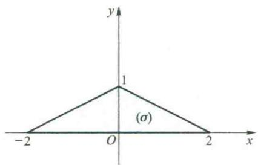

由这些不等式可画出积分域( $\sigma$ )如图6.13所示.然后将原积分化为先对x后对y的累次积分,得

图6.13

$$

I = \int_ {0} ^ {1} \mathrm{d} y \int_ {2 y - 2} ^ {2 - 2 y} f (x, y) \mathrm{d} x. \quad \text {Ⅱ}

$$

下面,我们对二重积分化为累次积分的公式(2.2)给出一种粗略的但却更为形象的解释.在被积函数 $f\in C((\sigma))$ 的条件下,我们用平行于x轴和y轴的直线,分别对积分域( $\sigma$ )进行等距离分割(图6.14),所得的子域中除了边缘上一些不规则的以外,均为矩形,其面积为 $\Delta\sigma=\Delta x\Delta y$ .在每一小矩形中均取其左下角点 $(x,y)$ 为积分和式中的点.可以证明(从略),当$d \to 0$ 时, 全部子域上的和式 $\sum_{(\sigma)} f(x, y) \Delta \sigma$ 与仅计算矩形子域上的和式 $\sum_{(\sigma)} f(x, y) \Delta x \Delta y$ 的极限值是相等的, 即

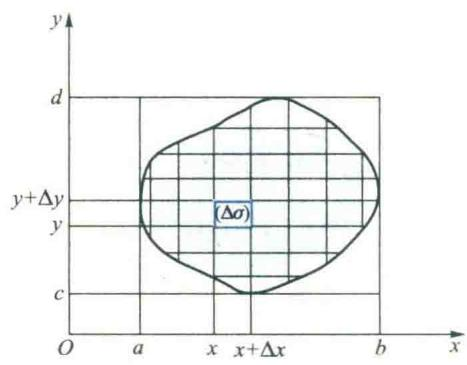  

图6.14

$$

\iint_ {(\sigma)} f (x, y) \mathrm{d} \sigma = \lim _ {d \rightarrow 0} \sum_ {(\sigma)} f (x, y) \Delta \sigma = \lim _ {d \rightarrow 0} \sum_ {(\sigma)} f (x, y) \Delta x \Delta y.

$$

我们把最后的和式极限记作 $\iint_{(\sigma)} f(x, y) \mathrm{d}x \mathrm{~d}y$ ，其中 $\mathrm{d}x \mathrm{~d}y$ 称为直角坐标的面积微元.

在上述求和式极限的过程中,随着 $d \to 0$ , 和式的项数将无限地增加.为形象化起见,我们把求和式极限的过程通俗地称为“无限累加”.设想 $f(x, y)$ 是分布在区域 $(\sigma)$ 上物质的面密度,在把每一个子域上的乘积 $f(x, y) \Delta y \Delta x$ 累加时,先关于 y“无限累加”就相当于先把分布在这些小矩形上的质量分别累加成一些平行于 y 轴的竖长条的质量;再关于 x“无限累加”相当于把这些竖长条的质量再累加成 $(\sigma)$ 上的质量.把 $f(x, y) \Delta y \Delta x$ 关于 y“无限累加”得 $\int_{y_1(x)}^{y_2(x)} f(x, y) \, dy \Delta x$ ,关于 x 再“无限累加”即得

$$

V = \iint_ {(\sigma)} f (x, y) \mathrm{d} x \mathrm{d} y = \int_ {a} ^ {b} \int_ {y _ {1} (x)} ^ {y _ {2} (x)} f (x, y) \mathrm{d} y \mathrm{d} x.

$$

类似地,如果先关于 x“无限累加”,再关于 y“无限累加”,便得

$$

\iint_ {(\sigma)} f (x, y) \mathrm{d} x \mathrm{d} y = \int_ {c} ^ {d} \int_ {x _ {1} (y)} ^ {x _ {2} (y)} f (x, y) \mathrm{d} x \mathrm{d} y.

$$
</Solution>

## 2.3 极坐标系下二重积分的计算法

在定积分的计算中,换元法发挥了重要的作用,我们常可通过变量变换把一个难算的定积分化为容易计算的.二重积分的计算中也有类似的换元法,不过二重积分计算中的困难不仅出现在被积函数上,更多地表现在积分域的形状上.

对于二重积分

$$

\iint_ {(\sigma)} f (x, y) \mathrm{d} \sigma = \lim _ {d \to 0} \sum_ {(\sigma)} f (x, y) \Delta \sigma ,

$$

设被积函数在积分域上连续.若积分域( $\sigma$ )与被积函数 $f(x,y)$ 用极坐标表示更为简便,则应考虑将其化为极坐标系下的二重积分来计算.为此,建立极坐标系,令极点与xOy直角坐标系的原点重合,x轴取为极轴.利用直角坐标与极坐标的转换公式

$$

x = \rho \cos \theta , y = \rho \sin \theta (0 \leqslant \rho <   + \infty , 0 \leqslant \theta \leqslant 2 \pi)

$$

二维码6.2.4 关于二重积分极坐标变换的补充说明.

(2.4)

把 $(\sigma)$ 的边界曲线方程化成极坐标,并将被积函数变换为

$$

f (x, y) = f (\rho \cos \theta , \rho \sin \theta).

$$

为了把面积微元 $d\sigma$ 用极坐标表出, 我们用极坐标曲线网

$$

\rho = \text { 常数 }, \theta = \text { 常数 }

$$

来划分积分域( $\sigma$ )(图6.15).容易看出,规则子域( $\Delta\sigma$ )的面积为

$$

\begin{array}{r l} \Delta \sigma & = \frac {1}{2} \big [ (\rho + \Delta \rho) ^ {2} \Delta \theta - \rho^ {2} \Delta \theta \big ] \\ & = \rho \Delta \rho \Delta \theta + \frac {1}{2} (\Delta \rho) ^ {2} \Delta \theta . \end{array}

$$

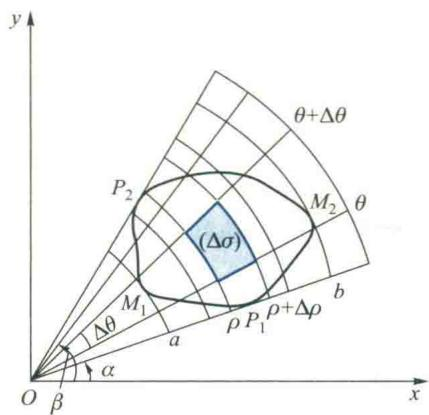  

图6.15

当 $\Delta\rho$ 与 $\Delta\theta$ 均充分小时, 略去高阶项 $\frac{1}{2}(\Delta\rho)^{2}\Delta\theta$ , 得

$$

\Delta \sigma \approx \rho \Delta \rho \Delta \theta .

$$

从而

$$

\lim _ {d \to 0} \sum_ {(\sigma)} f (x, y) \Delta \sigma = \lim _ {d \to 0} \sum_ {(\sigma)} f (\rho \cos \theta , \rho \sin \theta) \rho \Delta \rho \Delta \theta ,

$$

即

$$

\iint_ {(\sigma)} f (x, y) \mathrm{d} \sigma = \iint_ {(\sigma)} f (\rho \cos \theta , \rho \sin \theta) \rho \mathrm{d} \rho \mathrm{d} \theta .\tag{2.5}

$$

可见在极坐标系下的面积微元为

$$

\mathrm{d} \sigma = \rho \mathrm{d} \rho \mathrm{d} \theta ,

$$

<Note>
将直角坐标系下的二重积分化为极坐标计算时要注意三点:

而(2.5)式右端的积分就是极坐标系下的二重积分，其中 $(\sigma)$ 的边界曲线由极坐标方程给出.

1. 将积分域的边界曲线用极坐标表示；

为了把极坐标系下的二重积分 $\iint_{(\sigma)} f(\rho \cos \theta, \rho \sin \theta) \rho \mathrm{d}\rho \mathrm{d}\theta$ 化成累次积分，我们应用“无限累加”的思想。由图6.15可见，当我们用射线 $\theta = C$ 切割区域（ $\sigma$ ）时，开始于 $\theta = \alpha$ ，终止于 $\theta = \beta$ ，而当 $\theta \in [\alpha, \beta]$

2. 将被积函数变换为极坐标形式；

3. 将积分微元转换成极坐标形式, 即

$$

\mathrm{d} \sigma = \rho \mathrm{d} \rho \mathrm{d} \theta .

$$

时， $(\sigma)$ 的边界曲线被分成了关于 $\rho$ 的两个单值支 $\widehat{P_1M_1P_2}$ 与 $\widehat{P_1M_2P_2}$ ，其方程分别记为 $\rho = \rho_{1}(\theta)$ 与 $\rho = \rho_{2}(\theta)(\alpha \leqslant \theta \leqslant \beta)$ . [α,β] 就是 $\theta$ 的变化区间， $\forall \theta \in (\alpha, \beta)$ ，作从坐标原点出发的射线，穿入、穿出 $(\sigma)$ 边界点的 $\rho$ 坐标分别为 $\rho_{1}(\theta), \rho_{2}(\theta)$ . 于是 $[\rho_{1}(\theta), \rho_{2}(\theta)]$ 便是 $\rho$ 的变化区间. 我们对子域 $(\Delta \sigma)$ 上的乘积 $f(\rho \cos \theta, \rho \sin \theta) \rho \Delta \rho \Delta \theta$ “无限累加”时，先关于 $\rho$ 无限累加成一些扇形状长条得 $\int_{\rho_{1}(\theta)}^{\rho_{2}(\theta)} f(\rho \cos \theta, \rho \sin \theta) \rho d\rho \Delta \theta$ ，然后

再关于 $\theta$ 在 $[\alpha, \beta]$ 上无限累加，便得

$$

\begin{array}{r l} \iint_ {(\sigma)} f (x, y) \mathrm{d} \sigma & = \iint_ {(\sigma)} f (\rho \cos \theta , \rho \sin \theta) \rho \mathrm{d} \rho \mathrm{d} \theta \\ & = \int_ {\alpha} ^ {\beta} \mathrm{d} \theta \int_ {\rho_ {1} (\theta)} ^ {\rho_ {2} (\theta)} f (\rho \cos \theta , \rho \sin \theta) \rho \mathrm{d} \rho . \end{array}\tag{2.6}

$$

二维码6.2.5极坐标下二重积分化为累次积分公式的导出.

当用同心圆 $\rho = C$ 切割 $(\sigma)$ 时，开始于 $\rho = a$ ，终止于 $\rho = b$ （图6.15).[ $a,b]$ 就是对 $\rho$ 的变化区间.这时， $(\sigma)$ 的边界曲线被分成关于 $\theta$ 的两个单值支 $\widehat{M_1P_1M_2}$ 与 $\widehat{M_1P_2M_2}$ ，分别记为 $\theta = \theta_{1}(\rho)$ 与 $\theta = \theta_{2}(\rho)$ $\forall \rho \in (a,b)$ ，用以原点为圆心， $\rho$ 为半径的圆周逆时针方向穿过（ $\sigma$ )，穿入、穿出( $\sigma$ )边界点的 $\theta$ 坐标分别为 $\theta_{1}(\rho)$ 与 $\theta_{2}(\rho)$ .于是[ $\theta_{1}(\rho)$ ， $\theta_{2}(\rho)]$ 便是 $\theta$ 的变化区间.对子域( $\Delta \sigma$ )上的乘积先关于 $\theta$ “无限累加”，再关于 $\rho$ “无限累加”，得

$$

\begin{array}{r l} \iint_ {(\sigma)} f (x, y) \mathrm{d} \sigma & = \iint_ {(\sigma)} f (\rho \cos \theta , \rho \sin \theta) \rho \mathrm{d} \rho \mathrm{d} \theta \\ & = \int_ {a} ^ {b} \mathrm{d} \rho \int_ {\theta_ {1} (\rho)} ^ {\theta_ {2} (\rho)} f (\rho \cos \theta , \rho \sin \theta) \rho \mathrm{d} \theta . \end{array}\tag{2.7}

$$
</Note>

<Example title="例 2.7">
计算 $I=\iint_{(\sigma)}(x^{2}+y^{2})\mathrm{d}\sigma$ ，其中 $(\sigma)$ 为不等式 $a^{2}\leqslant x^{2}+y^{2}\leqslant b^{2}$ 所确定的区域（图 6.16）.

二维码 6.2.6

在极坐标系下

如何将二重积分化为累次积分.

<Solution title="解">
把 $(\sigma)$ 用极坐标表示为 $a \leqslant \rho \leqslant b, 0 \leqslant \theta \leqslant 2\pi$ ，将被积式化为极坐标形式，根据上述定限方法容易得到

$$

I = \iint_ {(\sigma)} \rho^ {2} \cdot \rho \mathrm{d} \rho \mathrm{d} \theta = \int_ {0} ^ {2 \pi} \mathrm{d} \theta \int_ {a} ^ {b} \rho^ {3} \mathrm{d} \rho = \frac {\pi}{2} (b ^ {4} - a ^ {4}).

$$

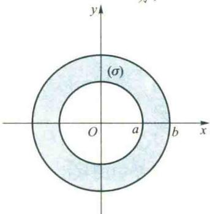

读者不难看出,如果用直角坐标来计算上例中的积分 I, 将要麻烦得多.
</Solution>
</Example>

<Example title="例 2.8">
计算由不等式

$$

x ^ {2} + y ^ {2} + z ^ {2} \leqslant 4 a ^ {2} \text {与} x ^ {2} + y ^ {2} \leqslant 2 a y

$$

所确定的立体的体积.

<Solution title="解">
这两个不等式表示位于球面及柱面内公共部分的立体,其图形在 xOy 平面上方的部分如图 6.17 所示.由对称性可知,所求立体的体积是它在第一卦限中那部分体积的四倍.第一卦限内的这个立体是以球面 $z = \sqrt{4a^2 - x^2 - y^2}$ 为顶，以 $xOy$ 平面上的半圆域 $(\sigma) = \{(x,y) | x^2 + y^2 \leqslant 2ay, x \geqslant 0\}$ 为底的曲顶柱体，把域 $(\sigma)$ 用极坐标表示为

图6.16  

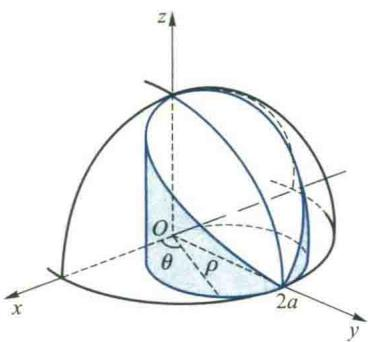  

图6.17

$$

\left\{(\rho , \theta) \mid 0 \leqslant \rho \leqslant 2 a \sin \theta , 0 \leqslant \theta \leqslant \frac {\pi}{2} \right\}

$$

(图 6.18). 应用公式(2.5)得所求立体的体积为

$$

\begin{array}{r l} V & = 4 \iint_ {(\sigma)} \sqrt {4 a ^ {2} - x ^ {2} - y ^ {2}} \mathrm{d} \sigma \\ & = 4 \iint_ {(\sigma)} \sqrt {4 a ^ {2} - \rho^ {2}} \rho \mathrm{d} \rho \mathrm{d} \theta . \end{array}

$$

为将它化为先对 $\rho$ 后对 $\theta$ 积分的累次积分, 用射线 $\theta = c$ (常数) 切割域 $(\sigma)$ (图 6.18), 由 $\theta = 0$ 到 $\theta = \frac{\pi}{2}$ 切割完毕. 对 $\left[0, \frac{\pi}{2}\right]$ 的每一确定的 $\theta$ 值, $\rho$ 的变化由 $\rho = 0$ 到 $\rho = 2a\sin\theta$ , 所以有

  

图6.18

$$

\begin{array}{r l} V & = 4 \int_ {0} ^ {\frac {\pi}{2}} \mathrm{d} \theta \int_ {0} ^ {2 a \sin \theta} \sqrt {4 a ^ {2} - \rho^ {2}} \rho \mathrm{d} \rho \\ & = 4 \int_ {0} ^ {\frac {\pi}{2}} \left[ - \frac {1}{3} (4 a ^ {2} - \rho^ {2}) ^ {\frac {1}{2}} \bigg | _ {0} ^ {2 a \sin \theta} \right] \mathrm{d} \theta \\ & = \frac {3 2 a ^ {3}}{3} \int_ {0} ^ {\frac {\pi}{2}} (1 - \cos^ {3} \theta) \mathrm{d} \theta = \frac {1 6}{9} a ^ {3} (3 \pi - 4). \end{array}

$$
</Solution>
</Example>

<Example title="例 2.9">
将累次积分

$$

I = \int_ {0} ^ {1} \mathrm{d} x \int_ {1 - x} ^ {\sqrt {1 - x ^ {2}}} f (x ^ {2} + y ^ {2}) \mathrm{d} y

$$

化成极坐标系中的累次积分.

<Solution title="解">
在直角坐标系中 I 的积分域为

$$

(\sigma) = \{(x, y) \mid 1 - x \leqslant y \leqslant \sqrt {1 - x ^ {2}}, 0 \leqslant x \leqslant 1 \},

$$

它是由圆弧 $y=\sqrt{1-x^{2}}$ 与直线 y=1-x 所围成, 如图 6.19 所示. 它们的极坐标方程分别为

$$

\rho = 1   \text {与}   \rho = \frac {1}{\sin   \theta + \cos   \theta},

$$

应用与例2.8类似的方法可得

$$

\begin{array}{r l} I & = \iint_ {(\sigma)} f (x ^ {2} + y ^ {2}) \mathrm{d} y \mathrm{d} x = \iint_ {(\sigma)} f (\rho^ {2}) \rho \mathrm{d} \rho \mathrm{d} \theta \\ & = \int_ {0} ^ {\frac {\pi}{2}} \mathrm{d} \theta \int_ {\frac {1}{\sin \theta + \cos \theta}} ^ {1} f (\rho^ {2}) \rho \mathrm{d} \rho . \end{array}

$$

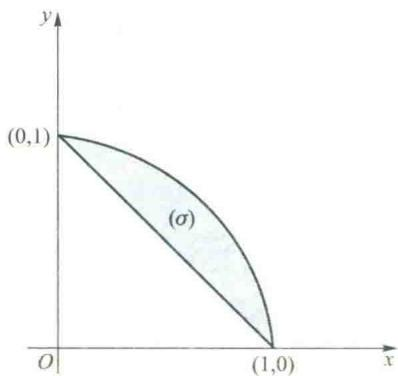  

图6.19
</Solution>
</Example>

<Example title="例 2.10">
计算 $\iint_{(\sigma)}\mathrm{e}^{-(x^{2}+y^{2})}\mathrm{d}\sigma$ ，其中 $(\sigma)$ 为圆域 $x^{2}+y^{2}\leqslant R^{2}$ .

<Solution title="解">
采用极坐标,则积分域

$$

(\sigma) = \left\{\left(\rho , \theta\right) \mid 0 \leqslant \rho \leqslant R, 0 \leqslant \theta \leqslant 2 \pi \right\},

$$

于是

$$

\begin{array}{r l} \iint_ {(\sigma)} \mathrm{e} ^ {- (x ^ {2} + y ^ {2})} \mathrm{d} \sigma & = \iint_ {(\sigma)} \mathrm{e} ^ {- \rho^ {2}} \rho \mathrm{d} \rho \mathrm{d} \theta = \int_ {0} ^ {2 \pi} \mathrm{d} \theta \int_ {0} ^ {R} \mathrm{e} ^ {- \rho^ {2}} \rho \mathrm{d} \rho \\ & = \int_ {0} ^ {2 \pi} \frac {1}{2} (1 - \mathrm{e} ^ {- R ^ {2}}) \mathrm{d} \theta = (1 - \mathrm{e} ^ {- R ^ {2}}) \pi . \end{array}

$$

读者容易看出，由于 $\int \mathrm{e}^{-x^2}\mathrm{d}x$ 不能用初等函数表示，故在 $xOy$ 直角坐标系下，这个二重积分是无法求出的.
</Solution>
</Example>

<Example title="例 2.11">
计算 $\iint_{(\sigma)} x^{2} \, d\sigma$ ，其中 $(\sigma)$ 是由圆周 $x^{2} + y^{2} = R^{2}$ 与直线 y = -x 所围成的右上半圆域 $(\sigma)$ （图 6.20）.

<Solution title="解">
本题可以直接化为极坐标计算,但运算稍显复杂.注意到积分域( $\sigma$ )关于x与y具有轮换对称性,即关于直线y=x对称,于是

  

图6.20

$$

\iint_ {(\sigma)} x ^ {2} \mathrm{d} \sigma = \iint_ {(\sigma)} y ^ {2} \mathrm{d} \sigma = \frac {1}{2} \iint_ {(\sigma)} (x ^ {2} + y ^ {2}) \mathrm{d} \sigma .

$$

又由于被积函数 $x^{2}+y^{2}$ 关于 x 和 y 都是偶函数,由积分域的部分对称性可知

$$

\iint_ {(\sigma)} (x ^ {2} + y ^ {2}) \mathrm{d} \sigma = 2 \iint_ {(\sigma_ {0})} (x ^ {2} + y ^ {2}) \mathrm{d} \sigma ,

$$

其中 $(\sigma_0)$ 是圆 $x^{2} + y^{2}\leqslant R^{2}$ 在第一象限部分，于是

$$

\iint_ {(\sigma)} x ^ {2} \mathrm{d} \sigma = \iint_ {(\sigma_ {0})} (x ^ {2} + y ^ {2}) \mathrm{d} \sigma = \int_ {0} ^ {\frac {\pi}{2}} \int_ {0} ^ {R} \rho^ {2} \rho \mathrm{d} \rho \mathrm{d} \theta = \frac {1}{8} \pi R ^ {4}.

$$

二维码6.2.7积分域边界曲线由参数方程给出时二重积分的计算法.
</Solution>
</Example>

## 2.4 曲线坐标下二重积分的计算法

在 2.3 段中我们看到,运用极坐标变换有时可使二重积分的计算简化.但是,极坐标只是一种特殊的坐标变换,有时为简化二重积分的计算,需要使用其他形式的坐标变换.

<Example title="例 2.12">
在如图 6.21 所示的区域( $\sigma$ )上计算重积分

$$

\iint_ {(\sigma)} (y - x) \mathrm{d} \sigma .

$$

二维码6.2.8利用二重积分证明不等式举例.

由图可见,无论将(σ)作为x或y型区域都需要把(σ)分成三个子域来计算.颇为麻烦,而且此积分域(σ)也不宜于化为极坐标.

下面,我们来介绍在一般形式的坐标变换下计算二重积分 $\iint_{(\sigma)}f(x,y)\mathrm{d}\sigma$ （其中 f 在 $(\sigma)$ 上连续）的方法,也就是二重积分的一般换元法.

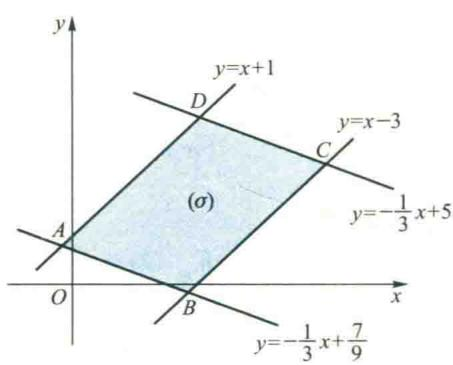  

图6.21

作变换

$$

T: \left\{ \begin{array}{l l} u = u (x, y), & (x, y) \in (\sigma), \\ v = v (x, y), & (u, v) \in (\sigma^ {\prime}), \end{array} \right.

$$

其中 $(\sigma)$ 与 $(\sigma')$ 均为平面有界区域. 若以下三个条件满足

(1) 函数 $u, v \in C^{(1)}((\sigma))$ ;

(2) Jacobi 行列式 $\frac{\partial(u,v)}{\partial(x,y)}=\left|\begin{matrix}u_{x}&u_{y}\\ v_{x}&v_{y}\end{matrix}\right|\neq0,\forall(x,y)\in(\sigma);$

（3）此变换将 $xOy$ 直角坐标平面中的域 $(\sigma)$ 一一对应地映射为 $uOv$ 直角坐标平面中的 $(\sigma')$ （图6.22），

则称变换 T 为一正则变换. 可以证明（从略），在正则变换 T 下，存在唯一的逆变换

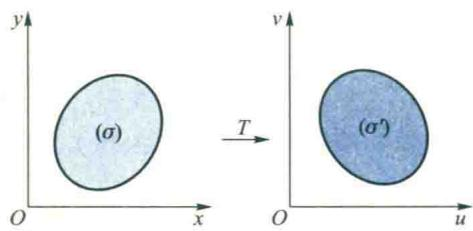  

图6.22

$$

T ^ {- 1}: \quad \left\{ \begin{array}{l l} x = x (u, v), \\ y = y (u, v), \end{array} \right. \quad (u, v) \in (\sigma^ {\prime}),

$$

它将 $(\sigma')$ 变为 $(\sigma)$ ，也是正则的，而且保持将 $(\sigma')$ 的内部变为 $(\sigma)$ 的内部，外部变为外部，边界变为边界.

现在,对于二重积分 $\iint_{(\sigma)}f(x,y)\mathrm{d}\sigma$ ,我们用变换 T 将 xOy 直角坐标平面中的积分域 $(\sigma)$ 映射为 uOv 直角坐标平面中的域 $(\sigma')$ .为了计算变换到 uOv 平面中 $(\sigma')$ 上的二重积分,我们用坐标线 $u=c_{1},v=c_{2}$ 来划分区域 $(\sigma')$ ,其中 $c_{1}$ 与 $c_{2}$ 均为常数.显然,在 uOv 直角坐标平面上,子域 $(\Delta\sigma')$ 的面积 $\Delta\sigma'=\Delta u\cdot\Delta v$ .(图 6.23(a))为了建立二重积分在这两个直角坐标系下的关系,我们利用 T 的逆变换 $T^{-1}$ 把 $(\Delta\sigma')$ 变回 xOy 平面(图 6.23(b)).

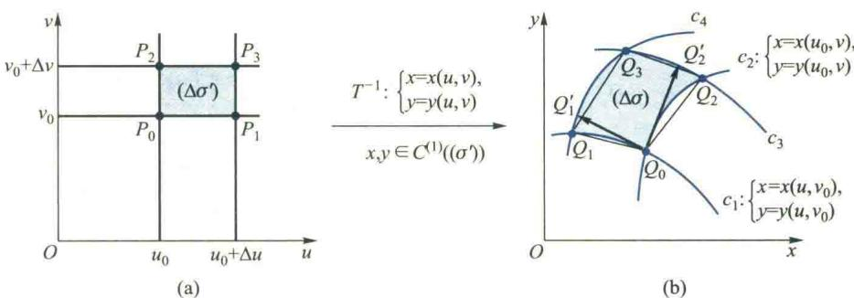  

图6.23

由逆变换 $T^{-1}$ 的表达式可见， $T^{-1}$ 将直线 $v=v_{0}$ 映射为 xOy 平面上的曲线 $c_{1}\left\{\begin{aligned}&x=x(u,v_{0}),\\ &y=y(u,v_{0})\end{aligned}\right.$ 写成向量形式为 $\boldsymbol{r}=(x(u,v_{0}),y(u,v_{0}))=\boldsymbol{r}(u,v_{0})$ ；将 uOv 平面上的直线 $v=v_{0}+\Delta v$ 映射为曲线

$$

c _ {3}: \left\{ \begin{array}{l l} x = x (u, v _ {0} + \Delta v), \\ y = y (u, v _ {0} + \Delta v), \end{array} \right. \text {或} r = r (u, v _ {0} + \Delta v).

$$
</Example>

<Note>
之所以 $(\Delta\sigma)$ 可以近似地看成是所述的平行四边形,是因为容易证明舍去高阶无穷小后, $\overrightarrow{Q_{0}Q_{1}}=\overrightarrow{Q_{2}Q_{3}}$ .事实上,

同理，直线 $u = u_0$ 与 $u = u_0 + \Delta u$ ，将分别被映射为 $c_{2}$ ： $\pmb {r} = \pmb {r}(u_0,v)$ 与 $c_{4}: \pmb {r} = \pmb {r}(u_0 + \Delta u,v)$

$$

\begin{array}{r l} \overrightarrow {Q _ {0} Q _ {1}} & = r (u _ {0} + \Delta u, v _ {0}) - r (u _ {0}, v _ {0}) \\ & = r _ {u} (u _ {0}, v _ {0}) \Delta u + o (\Delta u), \\ \overrightarrow {Q _ {2} Q _ {3}} & = r (u _ {0} + \Delta u, v _ {0} + \Delta v) - \\ & \quad r (u _ {0}, v _ {0} + \Delta v) \\ & = r _ {u} (u _ {0}, v _ {0} + \Delta v) \Delta u + o (\Delta u), \end{array}

$$

于是 uOv 平面上的子域 $(\Delta\sigma')$ 将被 $T^{-1}$ 映射为 xOy 平面上以 $Q_{0}$ 、 $Q_{1}$ 、 $Q_{3}$ 、 $Q_{2}$ 为顶点的曲边四边形域 $(\Delta\sigma)$ （图 6.23(b)）。由于 $\Delta u$ 与 $\Delta v$ 很小，所以 $(\Delta\sigma)$ 的面积 $\Delta\sigma$ 可近似地看作是由直线段 $\overline{Q_{0}Q_{1}}$ 、 $\overline{Q_{1}Q_{3}}$ 、 $\overline{Q_{3}Q_{2}}$ 、 $\overline{Q_{2}Q_{0}}$ 所围成的平行四边形面积，即

由于变换 $T^{-1}$ 的表达式中函数 x， $y \in C^{(1)}((\sigma'))$ ，故 $r_{u}(u_{0}, v_{0} + \Delta v)$ 在 $(u_{0},v_{0})$ 连续.于是

$$

\Delta \sigma \approx \| \overrightarrow {Q _ {0} Q _ {1}} \times \overrightarrow {Q _ {0} Q _ {2}} \|.

$$

$$

\begin{array}{r l} \overrightarrow {Q _ {2} Q _ {3}} & = (\boldsymbol {r} _ {u} (u _ {0}, v _ {0}) + \boldsymbol {o} (\Delta v)) \Delta u + \\ & \boldsymbol {o} (\Delta u) \\ & = \boldsymbol {r} _ {u} (u _ {0}, v _ {0}) \Delta u + \boldsymbol {o} (\rho), \end{array}

$$

取其线性主部,于是
</Note>

<Note>
到向量

$$

\begin{array}{r l} \overrightarrow {Q _ {0} Q _ {1}} & = \boldsymbol {r} (u _ {0} + \Delta u, v _ {0}) - \boldsymbol {r} (u _ {0}, v _ {0}) \\ & = \boldsymbol {r} _ {u} (u _ {0}, v _ {0}) \Delta u + \boldsymbol {o} (\Delta u), \\ \overrightarrow {Q _ {0} Q _ {2}} & = \boldsymbol {r} (u _ {0}, v _ {0} + \Delta v) - \boldsymbol {r} (u _ {0}, v _ {0}) \\ & = \boldsymbol {r} _ {v} (u _ {0}, v _ {0}) \Delta v + \boldsymbol {o} (\Delta v), \end{array}

$$

$$

\Delta \sigma \approx \left\| \boldsymbol {r} _ {u} \times \boldsymbol {r} _ {v} \right\| _ {(u _ {0}, v _ {0})} \cdot \Delta u \Delta v

$$

其中 $\rho=\sqrt{\left(\Delta u\right)^{2}+\left(\Delta v\right)^{2}}$ ，可见舍去 $\rho$ 的高阶无穷小后有

$$

\overrightarrow {Q _ {0} Q _ {1}} = \overrightarrow {Q _ {2} Q _ {3}}.

$$

$$

\begin{array}{l} = \left\| \left| \begin{array}{c c c} \boldsymbol {i} & \boldsymbol {j} & \boldsymbol {k} \\ x _ {u} & y _ {u} & 0 \\ x _ {v} & y _ {v} & 0 \end{array} \right| _ {(u _ {0}, v _ {0})} \right\| \Delta u \Delta v \\ = \left| \left| \begin{array}{c c} x _ {u} & y _ {u} \\ x _ {v} & y _ {v} \end{array} \right| _ {(u _ {0}, v _ {0})} \right| \Delta u \Delta v \\ = \left| \frac {\partial (x , y)}{\partial (u , v)} \right| _ {(u _ {0}, v _ {0})} \Delta u \Delta v. \end{array}

$$

由于 $(u_{0},v_{0})$ 是 $(\sigma)$ 中的任一点,故可将下标省去.所以

$$

\mathrm{d} \sigma = \left| \frac {\partial (x , y)}{\partial (u , v)} \right| \mathrm{d} u \mathrm{d} v = \left| \frac {\partial (x , y)}{\partial (u , v)} \right| \mathrm{d} \sigma^ {\prime},\tag{2.8}

$$

其中 $\mathrm{d}\sigma' = \mathrm{d}u\mathrm{d}v$ 是 $uOv$ 直角坐标平面上的面积微元. (2.8)式表明, 映射 $T$ 将 $xOy$ 平面上的面积微元 $\mathrm{d}\sigma$ 映射成 $uOv$ 平面上的面积微元 $\mathrm{d}\sigma'$ , 使面积产生了伸缩, 伸缩系数为 $\left|\frac{\partial(x,y)}{\partial(u,v)}\right|$ . 于是, 在映射 $T$ 的作用下, $xOy$ 坐标系下的二重积分与 $uOv$ 坐标系下二重积分之间的关系为
</Note>

<Note>
这里实际上是用一元向量值函数 $r(u,v_{0})$ 在 $u=u_{0}$ 处的向量微分 $r_{u}(u_{0},v_{0})\Delta u$ 近似替代了向量 $\overrightarrow{Q_{0}Q_{1}}$ .由向量值函数导数的几何意义可知,向量微分 $r_{u}(u_{0},v_{0})\Delta u$ 位于曲线 $(c_{1})$ 在 $(u_{0},v_{0})$ 的切线上与 $\Delta u$ 同向,其模是弧段 $\widehat{Q_{0}Q_{1}}$ 在点 $Q_{0}$ 处的弧微分,也就是 $\widehat{Q_{0}Q_{1}}$ 弧长的线性主部(不难证明它也是弦长 $Q_{0}Q_{1}$ 的线性主部),于是微分向量 $r_{u}(u_{0},v_{0})\Delta u$ 就是切向量 $\overrightarrow{Q_{0}Q_{1}^{\prime}}$ .可见,从几何上看,我们是用切线上的向量 $\overrightarrow{Q_{0}Q_{1}^{\prime}}$ 与 $\overrightarrow{Q_{0}Q_{2}^{\prime}}$ 所构成的平行四边形的面积作为( $\Delta\sigma$ )面积的近似值.即

$$

\Delta \sigma \approx \| \overrightarrow {Q _ {0} Q _ {1} ^ {\prime}} \times \overrightarrow {Q _ {0} Q _ {2} ^ {\prime}} \|.

$$

$$

\iint_ {(\sigma)} f (x, y) \mathrm{d} \sigma = \iint_ {(\sigma^ {\prime})} f [ x (u, v), y (u, v) ] \left| \frac {\partial (x , y)}{\partial (u , v)} \right| \mathrm{d} \sigma^ {\prime}.\tag{2.9}

$$

对于 uOv 直角坐标系下由(2.9)右端所表示的二重积分应用公式(2.2)或(2.3)，便可将其化为对变量 u 与 v 的累次积分.

应当指出,如果 Jacobi 行列式 $\frac{\partial(x,y)}{\partial(u,v)}$ 在域 $(\sigma')$ 上的个别点或一条曲线上为零,而在其他点上不为零,那么公式(2.9)仍然成立.

现在,我们利用公式(2.9)来计算例2.12中的二重积分 $\iint_{(\sigma)}(y-x)\mathrm{d}\sigma$ ，其中 $(\sigma)$ 如图6.21所示.
</Note>

<Solution title="解">
注意到 $(\sigma)$ 的边界是由直线族 $y - x = c_{1}$ 中的两条平行直线（对应于 $c_{1} = 1$ 与 $c_{1} = -3$ ）以及直线族 $y + \frac{1}{3} x = c_{2}$ 中的两条平行直线（对应于 $c_{2} = \frac{7}{9}$ 与 $c_{2} = 5$ ）所围成，这就启发我们去作变换

$$

u = y - x, \quad v = y + \frac {1}{3} x,\tag{2.10}

$$

变换(2.10)将 xOy 平面上的区域( $\sigma$ )映射成 uOv 直角坐标平面上的( $\sigma'$ )(图 6.24).

由于(见第五章公式(5.47))

$$

\frac {\partial (x , y)}{\partial (u , v)} = \frac {1}{\frac {\partial (u , v)}{\partial (x , y)}} = \frac {1}{\left| \begin{array}{l l} - 1 & 1 \\ \frac {1}{3} & 1 \end{array} \right|} = - \frac {3}{4},

$$

由(2.10)式注意到 y-x=u，于是由公式(2.9)可得

$$

\begin{array}{r l} I & = \iint_ {(\sigma)} (y - x) \mathrm{d} \sigma = \iint_ {(\sigma^ {\prime})} u \left| \frac {\partial (x , y)}{\partial (u , v)} \right| \mathrm{d} \sigma^ {\prime} \\ & = \frac {3}{4} \iint_ {(\sigma^ {\prime})} u \mathrm{d} u \mathrm{d} v = \frac {3}{4} \int_ {\frac {7}{9}} ^ {5} \mathrm{d} v \int_ {- 3} ^ {1} u \mathrm{d} u = - \frac {3 8}{3}. \end{array}

$$

图6.24

值得指出,由于变换(2.10)在xOy平面上的几何意义比较明显,我们也可以直接在xOy平面上利用“无限累加”的思想通过变换把二重积分化为累次积分,而不必把域( $\sigma$ )映射到uOv直角坐标平面上去计算.这时,利用 $u=y-x=c_{1},v=y+\frac{1}{3}x=c_{2}$ 分割域( $\sigma$ ),就是用与( $\sigma$ )边界直线相平行的直线族分割( $\sigma$ ).由公式(2.8)可知,面积微元

$$

\mathrm{d} \sigma = \left| \frac {\partial (x , y)}{\partial (u , v)} \right| \mathrm{d} u \mathrm{d} v = \frac {3}{4} \mathrm{d} u \mathrm{d} v,

$$

从而，在 $xOy$ 平面上有

$$

\iint_ {(\sigma)} (y - x) \mathrm{d} \sigma = \iint_ {(\sigma)} u \left| \frac {\partial (x , y)}{\partial (u , v)} \right| \mathrm{d} u \mathrm{d} v = \frac {3}{4} \iint_ {(\sigma)} u \mathrm{d} u \mathrm{d} v.

$$

在 $(\sigma)$ 上“无限累加”乘积项 u d u dv 时, 先沿 u 增加方向累加, 再沿 v 增加方向累加, 由图 6.24 直接可得

$$

I = \frac {3}{4} \iint_ {(\sigma)} u \mathrm{d} u \mathrm{d} v = \frac {3}{4} \int_ {\frac {7}{9}} ^ {5} \mathrm{d} v \int_ {- 3} ^ {1} u \mathrm{d} u = - \frac {3 8}{3}.

$$

事实上,在2.3段中对于极坐标换元法,我们所采用的主要方法就是把二重积分在xOy平面上通过变换化成极坐标的累次积分去计算的.
</Solution>

<Example title="例 2.13">
计算 $\iint_{(\sigma)}\sqrt{xy}\mathrm{d}\sigma$ ，其中 $(\sigma)$ 为由曲线 xy=1, xy=2, y=x, y=4x (x>0, y>0) 所围成的区域.

<Solution title="解">
由图 6.25 可见, 如果我们用直角坐标直接计算此积分, 必须将积分域 ( $\sigma$ ) 分成三个子域来进行, 比较麻烦. 为了使所给积分容易计算, 我们采用曲线坐标变换:

$$

u = x y, \quad v = \frac {y}{x}.\tag{2.11}

$$

在此变换下 $(\sigma)$ 的边界曲线映射成uOv直角坐标平面上的矩形域

$$

\left(\sigma^ {\prime}\right) = \{(u, v) \mid 1 \leqslant u \leqslant 2, 1 \leqslant v \leqslant 4 \},

$$

为了求得积分微元的变换式,我们求出

$$

\frac {\partial (u , v)}{\partial (x , y)} = \left| \begin{array}{c c} y & x \\ - \frac {y}{x ^ {2}} & \frac {1}{x} \end{array} \right| = 2 \frac {y}{x},

$$

从而

$$

\frac {\partial (x , y)}{\partial (u , v)} = \frac {1}{\frac {\partial (u , v)}{\partial (x , y)}} = \frac {1}{2 v},

$$

图6.25

于是，由(2.9)式得

$$

\iint_ {(\sigma)} \sqrt {x y} \mathrm{d} \sigma = \iint_ {(\sigma^ {\prime})} \sqrt {u} \frac {1}{2 v} \mathrm{d} u \mathrm{d} v = \frac {1}{2} \int_ {1} ^ {4} \frac {1}{v} \mathrm{d} v \int_ {1} ^ {2} \sqrt {u} \mathrm{d} u = \frac {2}{3} (2 \sqrt {2} - 1) \ln 2.

$$
</Solution>
</Example>

<Example title="例 2.14">
计算 $I = \iint_{(\sigma)} x^{2} \, \mathrm{d}\sigma$ ，其中 $(\sigma)$ 为椭圆 $\frac{x^{2}}{4} + \frac{y^{2}}{9} = 1$ 的内部.

<Solution title="解">
由于积分域是椭圆,如果采用极坐标变换,积分域的边界曲线方程变得比较复杂,使积分难以计算.为简化积分域的边界曲线方程,我们运用曲线坐标变换

$$

\frac {x ^ {2}}{4} = \rho^ {2} \cos^ {2} \theta , \quad \frac {y ^ {2}}{9} = \rho^ {2} \sin^ {2} \theta ,

$$

即

$$

x = 2 \rho \cos \theta , \quad y = 3 \rho \sin \theta (0 \leqslant \rho <   + \infty , 0 \leqslant \theta \leqslant 2 \pi).\tag{2.12}

$$

此变换的逆变换将 $xOy$ 平面上所给的椭圆映射成 $\theta O\rho$ 直角坐标平面上的矩形域 $(\sigma^{\prime}) = \{(\theta ,\rho)\mid 0\leqslant \theta$ $\leqslant 2\pi ,0\leqslant \rho \leqslant 1\}$ .由于

$$

\mathrm{d} \sigma = \left| \frac {\partial (x , y)}{\partial (\theta , \rho)} \right| \mathrm{d} \rho \mathrm{d} \theta = 6 \rho \mathrm{d} \rho \mathrm{d} \theta ,

$$
</Solution>
</Example>

<Note>
变换(2.12)在 $\rho=0$ 与射线 $\theta=2\pi$ 上不满足正则变换的条件.这时参照二维码6.2.4中对极坐标的处理方法可知公式(2.9)仍然成立.

从而

$$

I = \iint_ {(\sigma^ {\prime})} 4 \rho^ {2} \cos^ {2} \theta \cdot 6 \rho \mathrm{d} \rho \mathrm{d} \theta = 2 4 \int_ {0} ^ {2 \pi} \cos^ {2} \theta \mathrm{d} \theta \int_ {0} ^ {1} \rho^ {3} \mathrm{d} \rho = 6 \int_ {0} ^ {2 \pi} \cos^ {2} \theta \mathrm{d} \theta = 6 \pi .

$$

形如例2.12中所用的变换

$$

x = a \rho \cos \theta , \quad y = b \rho \sin \theta (0 \leqslant \rho <   + \infty , 0 \leqslant \theta \leqslant 2 \pi)

$$

称为广义极坐标变换.容易看出,在此变换下,面积微元 $d\sigma=ab\rho d\rho d\theta$ .

当 a=b=1 时, 广义极坐标变换就是极坐标变换. 这时通过 Jacobi 行列式算得的

面积微元就是 $d\sigma=\rho d\rho d\theta$ ，与 2.3 段中所得一致。
</Note>

<Block title="习题6.2">
(A)

1. 设有一母线平行于 z 轴的柱体，它与 xOy 平面的交线为一闭曲线，此闭曲线所围区域为 $(\sigma)$ ，柱体的顶部和底部分别由曲面 $z=f_{2}(x,y)$ 与 $z=f_{1}(x,y)$ 构成。试用二重积分表示此柱体的体积。

2. 试用二重积分的几何意义说明：

(1) $\iint_{(\sigma)} k \mathrm{d}\sigma = k \sigma, k \in \mathbf{R}_{+}$ 为常数, $\sigma$ 表示区域 $(\sigma)$ 的面积;

(2) $\iint_{(\sigma)} \sqrt{R^2 - x^2 - y^2} \, \mathrm{d}\sigma = \frac{2}{3} \pi R^3, (\sigma)$ 是以原点为中心，半径为 $R$ 的圆；

(3) 若积分域关于 y 轴对称, 则

i) 当 $f(x, y)$ 是 $x$ 的奇函数时，二重积分 $\iint_{(\sigma)} f(x, y) \mathrm{d}\sigma = 0$

ii) 当 $f(x, y)$ 是 $x$ 的偶函数时，有

$$

\iint_ {(\sigma)} f (x, y) \mathrm{d} \sigma = 2 \iint_ {(\sigma_ {1})} f (x, y) \mathrm{d} \sigma ,

$$

其中 $(\sigma_{1})$ 为 $(\sigma)$ 在右半平面 $x\geqslant0$ 中的部分区域；

(4) 若积分域关于 x 轴对称, 被积函数 $f(x, y)$ 分别具有怎样的对称性时有

$$

\iint_ {(\sigma)} f (x, y) \mathrm{d} \sigma = 0, \quad \iint_ {(\sigma)} f (x, y) \mathrm{d} \sigma = 2 \iint_ {(\sigma_ {1})} f (x, y) \mathrm{d} \sigma ,

$$

其中 $(\sigma_{1})$ 为 $(\sigma)$ 在上半平面 $y\geqslant0$ 中的部分区域.

3. 计算下列二重积分：

(1) $\iint_{(\sigma)} x^{2} y \, \mathrm{d}\sigma, (\sigma)$ 是由 $x = 0, y = 1$ 与 $x = \sqrt{y}$ 所围成的区域；

(2) $\iint_{(\sigma)} \frac{x^2}{y^2} \mathrm{d}\sigma, (\sigma)$ 是由 $xy = 1, y = x$ 与 $x = 2$ 所围成的区域；

(3) $\iint_{(\sigma)} xy \, \mathrm{d}\sigma, (\sigma) = \{(x, y) \mid 0 \leqslant y \leqslant x \leqslant 1\}$ ;

(4) $\iint_{(\sigma)} (x + y)^2 \mathrm{d}\sigma, (\sigma)$ 是由 $|x| + |y| = 1$ 所围成的区域；

(5) $\iint_{\langle \sigma \rangle} \frac{x}{y} \sqrt{1 - \sin^2 y} \, \mathrm{d}\sigma, (\sigma) = \{(x, y) | - \sqrt{y} \leqslant x \leqslant \sqrt{3y}, \frac{\pi}{2} \leqslant y \leqslant 2\pi\}$ ;

(6) $\iint_{(\sigma)}\mathrm{e}^{-y^2}\mathrm{d}\sigma ,(\sigma) = \{(x,y)\mid 0\leqslant x\leqslant y\leqslant 1\}$

(7) $\iint_{(\sigma)} (y + xf(x^2 + y^2)) \, \mathrm{d}\sigma$ , ( $\sigma$ ) 是由 $y = x^2$ 和 $y = 1$ 所围成的区域;

(8) $\iint_{(\sigma)} (x^2 + y^2) \, \mathrm{d}\sigma, (\sigma)$ 是正方形区域: $-1 \leqslant x \leqslant 1, -1 \leqslant y \leqslant 1$ ;

(9) $\iint_{\{(\sigma)} (x \sin y + y \cos x) \, \mathrm{d}\sigma, (\sigma)$ 是以 $(1,1), (-1,1)$ 和 $(-1,-1)$ 为顶点的三角形区域；  

(10) $\iint_{\{(\sigma)} x \ln (y + \sqrt{1 + y^2}) \, \mathrm{d}\sigma, (\sigma)$ 是由 $y = 4 - x^2, y = -3x$ 和 $x = 1$ 所围成的区域.

4. 把二重积分 $I = \iint_{(\sigma)} f(x, y) \, \mathrm{d}\sigma$ 在直角坐标系中分别以两种不同的次序化为累次积分，其中 $(\sigma)$ 为

(1) $\{(x,y)\mid y^{2}\leqslant x,x+y\leqslant2\}$ ; (2) $x=\sqrt{y}, y=x-1, y=0$ 与 y=1 所围成的区域.

5. 交换下列累次积分的顺序：

(1) $\int_{-1}^{1}\mathrm{d}x\int_{x^{2}+x}^{x+1}f(x,y)\mathrm{d}y;$ (2) $\int_{0}^{2}\mathrm{d}x\int_{x^{2}}^{1}f(x,y)\mathrm{d}y;$ (3) $\int_{0}^{2}\mathrm{d}x\int_{0}^{x}f(x,y)\mathrm{d}y+\int_{2}^{\sqrt{8}}\mathrm{d}x\int_{0}^{\sqrt{8-x^{2}}}f(x,y)\mathrm{d}y;$ (4) $\int_{0}^{1}\mathrm{d}y\int_{0}^{2y}f(x,y)\mathrm{d}x+\int_{1}^{3}\mathrm{d}y\int_{0}^{2y^{2}}f(x,y)\mathrm{d}x.$

6. 利用极坐标计算下列二重积分：

(1) $\iint_{(\sigma)} \mathrm{e}^{x^2 + y^2} \, \mathrm{d}\sigma, (\sigma) = \{(x, y) | a^2 \leqslant x^2 + y^2 \leqslant b^2\}$ , 其中 $a > 0, b > 0$ ;

(2) $\iint_{(\sigma)} \sqrt{x^2 + y^2} \, \mathrm{d}\sigma, (\sigma) = \{(x, y) \mid 2x \leqslant x^2 + y^2 \leqslant 4, x \geqslant 0, y \geqslant 0\}$ ;

(3) $\iint_{(\sigma)} (x + y)^2 \, \mathrm{d}\sigma, (\sigma) = \{(x, y) | (x^2 + y^2)^2 \leqslant 2a(x^2 - y^2), a > 0\}$ ;

(4) $\iint_{(\sigma)} \arctan \frac{y}{x} \mathrm{d}\sigma, (\sigma)$ 为圆域 $x^{2} + y^{2} \leqslant 1$ 在第一象限部分；

(5) $\iint_{(\sigma)} \sqrt{R^2 - x^2 - y^2} \, \mathrm{d}\sigma, (\sigma)$ 为圆域 $x^2 + y^2 \leqslant Rx$ 在第一象限部分；

(6) $\iint_{(\sigma)} (x + y)^2 \mathrm{d}\sigma, (\sigma)$ 是圆域 $x^2 + y^2 \leqslant a^2$ .

7. 把下列累次积分化为极坐标的累次积分, 并计算其值:

(1) $\int_{0}^{2}\mathrm{d}x\int_{0}^{\sqrt{2x-x^{2}}}(x^{2}+y^{2})\mathrm{d}y;$ (2) $\int_{0}^{1}\mathrm{d}x\int_{1-x}^{\sqrt{1-x^{2}}}(x^{2}+y^{2})^{-3/2}\mathrm{d}y;$

$$

\int_ {1} ^ {2} \mathrm{d} y \int_ {0} ^ {y} \frac {x \sqrt {x ^ {2} + y ^ {2}}}{y} \mathrm{d} x.

$$

8. 求下列各组曲线所围成平面图形的面积：

(1) $xy = a^{2}, x + y = \frac{5}{2}a (a > 0);$

(2) $(x^{2}+y^{2})^{2}=2a^{2}(x^{2}-y^{2}),x^{2}+y^{2}=a^{2}(x^{2}+y^{2}\geqslant a^{2},a>0);$

(3) $\rho=a(1+\sin\theta)(a\geqslant0)$ .

9. 求下列各组曲面所围成立体的体积：

(1) $z = x^{2} + y^{2},x + y = 4,x = 0,y = 0,z = 0;$ (2） $z = \sqrt{x^2 + y^2},x^2 +y^2 = 2ax(a > 0),z = 0;$

(3) $x^{2} + y^{2} = a^{2},y^{2} + z^{2} = a^{2}$ $(a > 0)$

10. 一金属叶片形如心脏线 $\rho=a(1+\cos\theta)$ ，如果它在任一点的密度与原点到该点的距离成正比，求它的全部质量.

11. 以半径为 $4 \, cm$ 的铜球的直径为中心轴, 钻通一个半径为 $1 \, cm$ 的圆孔, 问损失掉的铜的体积是多少?

12. 在一个形状为旋转抛物面 $z = x^{2} + y^{2}$ 的容器中，盛有 $8\pi \, cm^{3}$ 的水，今再灌入 $120\pi \, cm^{3}$ 的水，问液面将升高多少？

13. 利用适当的变换计算下列二重积分：

(1) $\iint_{(\sigma)} \sqrt{1 - \frac{x^2}{a^2} - \frac{y^2}{b^2}} \mathrm{d}\sigma, (\sigma) = \left\{(x, y) \mid \frac{x^2}{a^2} + \frac{y^2}{b^2} \leqslant 1\right\}$ , 其中 $a > 0, b > 0$ ;

(2) $\iint_{(\sigma)}\mathrm{e}^{y / y + x}\mathrm{d}\sigma ,(\sigma)$ 是以 $(0,0),(1,0)$ 和 $(0,1)$ 为顶点的三角形内部；

(3) $\iint_{(\sigma)} xy \, \mathrm{d}\sigma, (\sigma)$ 由曲线 $xy = 1, xy = 2, y = x, y = 4x$ ( $x > 0, y > 0$ ) 所围成.

14. 求下列曲线所围成的平面图形的面积：

(1) $(x-y)^{2}+x^{2}=a^{2}(a>0)$ ;

(2) $x + y = a, x + y = b, y = \alpha x, y = \beta x$ (0 &lt; a &lt; b, 0 &lt; $\alpha < \beta$ );

(3) $xy = a^2, xy = 2a^2, y = x, y = 2x$ $(x > 0, y > 0)$ ;

(4) $y^{2} = 2px, y^{2} = 2qx, x^{2} = 2ry, x^{2} = 2sy \quad (0 < p < q, 0 < r < s).$

**（B）**

1. 计算下列二重积分：

(1) $\iint_{(\sigma)} \sqrt{|y - x^2|} \, \mathrm{d}\sigma, (\sigma) = \{(x, y) | x | \leqslant 1, 0 \leqslant y \leqslant 2\}$ ;

(2) $\iint_{(\sigma)} (x + y) \, \mathrm{d}\sigma, (\sigma) = \{(x, y) | x^2 + y^2 \leqslant x + y\}$ ;

(3) $\iint_{\{\sigma\}} y^2 \mathrm{d}\sigma, (\sigma)$ 是 $x$ 轴与摆线的一拱 $\left\{ \begin{array}{l} x = a(t - \sin t) \\ y = a(1 - \cos t) \end{array} \right.$ , $(0 \leqslant t \leqslant 2\pi, a > 0)$ 所围成的区域.

## 2. 计算累次积分

$$

\int_ {1 / 4} ^ {1 / 2} \mathrm{d} y \int_ {1 / 2} ^ {\sqrt {y}} \mathrm{e} ^ {y / x} \mathrm{d} x + \int_ {1 / 2} ^ {1} \mathrm{d} y \int_ {y} ^ {\sqrt {y}} \mathrm{e} ^ {y / x} \mathrm{d} x.

$$

3. 设 $f(x, y) = \begin{cases} 2x, & 0 \leqslant x \leqslant 1, 0 \leqslant y \leqslant 1, \\ 0, & \text{其他}, \end{cases}$ $F(t) = \iint_{x + y \leqslant t} f(x, y) \, \mathrm{d}\sigma$ , 求 $F(t)$ .

4. 计算 $\iint_{(\sigma)} x[1 + yf(x^2 + y^2)] \mathrm{d}\sigma$ ，其中 $(\sigma)$ 是由 $y = x^3, y = 1, x = -1$ 所围成的区域， $f(x^2 + y^2)$ 是 $(\sigma)$ 上的连续函数.

5. 设函数 $f(x)$ 在区间 $[0,1]$ 上连续，并设 $\int_0^1 f(x)\mathrm{d}x = A$ ，求 $\int_0^1\mathrm{d}x\int_x^1 f(x)f(y)\mathrm{d}y.$

6. 证明Dirichlet公式 $\int_0^a\mathrm{d}x\int_0^x f(x,y)\mathrm{d}y = \int_0^a\mathrm{d}y\int_y^a f(x,y)\mathrm{d}x (a > 0)$ ，并由此证明 $\int_0^a\mathrm{d}y\int_0^y f(x)\mathrm{d}x = \int_0^a (a - x)f(x)\mathrm{d}x$ ，其中 $f$ 连续.

7. 设 $f(x)$ 在 $[a, b]$ 上连续，试利用二重积分证明：

$$

\left[ \int_ {a} ^ {b} f (x) \mathrm{d} x \right] ^ {2} \leqslant (b - a) \int_ {a} ^ {b} f ^ {2} (x) \mathrm{d} x.

$$

8. 试求曲线 $(a_{1}x + b_{1}y + c_{1})^{2} + (a_{2}x + b_{2}y + c_{2})^{2} = 1$ ( $a_{1}b_{2} - a_{2}b_{1} \neq 0$ ) 所围平面图形的面积.

9. 求抛物面 $z=1+x^{2}+y^{2}$ 的一个切平面, 使得它与该抛物面及圆柱面 $(x-1)^{2}+y^{2}=1$ 围成的体积最小, 试写出切平面方程并求出最小的体积.

10. 设 $f(t)$ 是连续的奇函数, 试利用适当的正交变换证明 $\iint_{(\sigma)} f(ax + by + c) \, \mathrm{d}\sigma = 0$ , 其中 $(\sigma)$ 关于直线 $ax + by + c = 0$ 对称, 且 $a^2 + b^2 \neq 0$ .

11. 设有一半径为 R，高为 H 的圆柱形容器，盛有 $\frac{2}{3}H$ 高的水，放在离心机上高速旋转。因受离心力的作用，水面呈抛物面形状，问当水刚要溢出容器时，水面的最低点在何处？

12. 设 $a > 0, b > 0$ 为常数， $(\sigma)$ 为椭圆域 $\frac{x^2}{a^2} + \frac{y^2}{b^2} \leqslant 1, f(t)$ 是连续函数，且 $f(t) \neq 0$ ，证明：

$$

\iint_ {(\sigma)} \frac {(b + 1) f \left(\frac {x}{a}\right) + (a - 1) f \left(\frac {y}{b}\right)}{f \left(\frac {x}{a}\right) + f \left(\frac {y}{b}\right)} \mathrm{d} \sigma = \frac {\pi}{2} a b (a + b).

$$

13. 设函数 $f(t)$ 在 $[0, +\infty)$ 连续，且满足方程

$$

f (t) = \mathrm{e} ^ {4 \pi t ^ {2}} + \iint_ {x ^ {2} + y ^ {2} \leqslant 4 t ^ {2}} f \left(\frac {1}{2} \sqrt {x ^ {2} + y ^ {2}}\right) \mathrm{d} \sigma ,

$$

求 $f(t)$ .
</Block>
