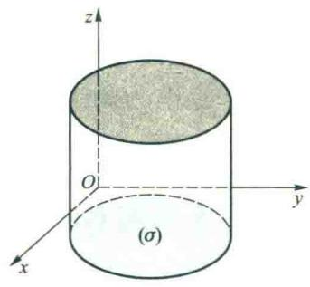
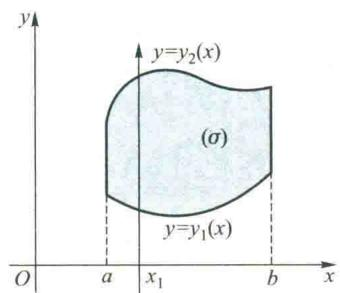
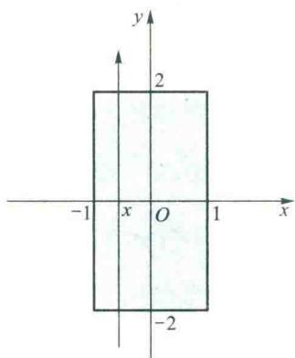
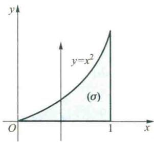
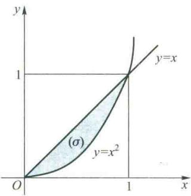
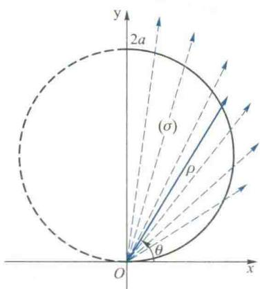
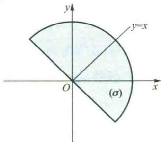
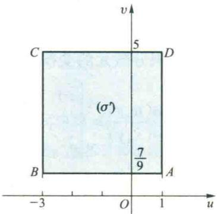
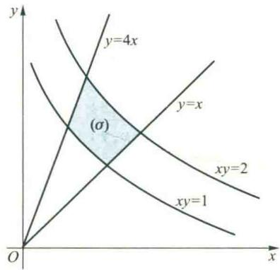

import ExerciseTrigger from '@/components/exercises/ExerciseTrigger.astro';
import QRCodeVideo from '@/components/QRCodeVideo.astro';

import Guide from '@/components/Guide.astro';
import Knowledge from '@/components/Knowledge.astro';
import Example from '@/components/Example.astro';
import Analysis from '@/components/Analysis.astro';
import Solution from '@/components/Solution.astro';
import Variant from '@/components/Variant.astro';
import Note from '@/components/Note.astro';
import SideNote from '@/components/SideNote.astro';
import Block from '@/components/Block.astro';
import Method from '@/components/Method.astro';
import Exercise from '@/components/Exercise.astro';

从本节开始，我们分别讲解各种多元函数积分的计算方法。为了导出二重积分的计算公式，首先介绍二重积分在直角坐标与极坐标下的计算。

### 第二节 二重积分的计算

从这一节开始，我们将分别讲解各类积分的算法。为了得出二重积分的计算公式，先介绍二重积分的几何意义。

#### 2.1 二重积分的几何意义

设 $(\sigma) \subseteq \mathbf{R}^2$ 是有界闭区域，$f \in C((\sigma))$。由定义，$f$ 在 $(\sigma)$ 上的二重积分就是下列式的极限：

$$

\iint_{(\sigma)} f(x, y) \mathrm{d}\sigma = \lim_{d \to 0} \sum_{k=1}^{n} f(\xi_k, \eta_k) \Delta \sigma_k \tag{6.1}

$$

下面，我们根据这个式极限的结构来说明二重积分的几何意义。为方便起见，设 $f(x, y) \geqslant 0$ 是二元函数 $z = f(x, y)$ 在几何上就表示位于区域 $(\sigma)$ 上方的曲面 $(S)$（图 6.3(a)），它在 $xOy$ 坐标平面上的投影就是闭域 $(\sigma)$。以 $(\sigma)$ 的边界为准线作母线平行于 $z$ 轴的柱面，便得以 $(\sigma)$ 为底，曲面 $(S)$ 为顶的曲顶柱体。现在我们来说明：若 $f$ 在 $(\sigma)$ 上非负，则二重积分 $\iint_{(\sigma)} f(x, y) \mathrm{d}\sigma$ 的值等于以 $(\sigma)$ 为底，$(S)$ 为顶的曲顶柱体的体积。

<SideNote title="想一想">
(1) 若在区域 $(\sigma)$ 上 $f(x, y) \leqslant 0$，$\iint_{(\sigma)} f(x, y) \mathrm{d}\sigma$ 的几何意义是什么？

(2) 若在区域 $(\sigma)$ 上 $f(x, y)$ 变号，怎样用二重积分表示曲面 $z = f(x, y)$ 在 $(\sigma)$ 上与 $xOy$ 平面以及由 $(\sigma)$ 边界为准线的柱面所围成的立体体积？
</SideNote>

此曲顶柱体的体积在域 $(\sigma)$ 上是非均匀分布的量，其原因在于此柱体的高在变化。若高不变，这个平顶柱体的体积在 $(\sigma)$ 上是均匀分布的（图 6.3(b)），它可以简单地利用乘法：底面积 $\times$ 高得到。为了利用已知的这个均匀分布的体积公式来求此非均匀分布的体积，我们可以像本章第一节 1.1 段那样，采用“分”“匀”“合”“精”四个步骤来完成。

1. **分**：把区域 $(\sigma)$ 任意划分成 $n$ 个子域 $(\Delta \sigma_k) (k = 1, 2, \cdots, n)$，$(\Delta \sigma_k)$ 的面积记为 $\Delta \sigma_k$。以每一子域 $(\Delta \sigma_k)$ 的边界为准线，作母线平行于 $z$ 轴的柱面，这样，就把整个曲顶柱体划分成 $n$ 个小曲顶柱体。

2. **匀**：由于子域 $(\Delta \sigma_k)$ 很小，以它为底的小曲顶柱体的高变化不大，可以近似地看作不变，即看作是 $(\Delta \sigma_k)$ 内任一点 $M_k(\xi_k, \eta_k)$ 处的函数值 $f(\xi_k, \eta_k)$（图 6.3(a)）。从而这一小曲顶柱体的体积 $\Delta V_k$ 可以近似地表示为

$$

\Delta V_k \approx f(\xi_k, \eta_k) \Delta \sigma_k \tag{6.2}

$$

3. **合**：把各小曲顶柱体体积的近似值加起来，就得到整个曲顶柱体体积 $V$ 的近似值

$$

V \approx \sum_{k=1}^{n} f(\xi_k, \eta_k) \Delta \sigma_k \tag{6.3}

$$

4. **精**：令各子域 $(\Delta \sigma_k)$ 直径的最大值 $d \to 0$，取极限便得到体积 $V$ 的精确值

$$

V = \lim_{d \to 0} \sum_{k=1}^{n} f(\xi_k, \eta_k) \Delta \sigma_k = \iint_{(\sigma)} f(x, y) \mathrm{d}\sigma \tag{6.4}

$$

这就说明了二重积分的几何意义。

<figure class="vp-figure">
  
  <figcaption>图 6.3 二重积分的几何意义示意图</figcaption>
</figure>

#### 2.2 直角坐标系下二重积分的计算法

下面，我们利用二重积分的几何意义来讨论它的计算方法。设 $f \in C((\sigma))$，为简单起见，我们仍假设在 $(\sigma)$ 上 $f(x, y) \geqslant 0$。以下就积分域 $(\sigma)$ 可能出现的三种类型来分别讨论二重积分的计算方法。

(1) 设 $(\sigma) = \{(x, y) \mid a \leqslant x \leqslant b, y_1(x) \leqslant y \leqslant y_2(x)\}$，其中 $y_1(x)$ 与 $y_2(x)$ 均在 $[a, b]$ 上连续。这一区域 $(\sigma)$ 的特点是：过 $[a, b]$ 上任一点 $x_1$，作与 $y$ 轴平行同向的直线，与 $(\sigma)$ 的边界至多相交于两点 $(x_1, y_1(x_1))$ 与 $(x_1, y_2(x_1))$（在区间端点 $a, b$ 处所对应的两点可能重合）（图 6.4）。为方便起见，称这种类型的区域 $(\sigma)$ 为 **$x$ 型区域**。

由几何意义可知，二重积分 $\iint_{(\sigma)} f(x, y) \mathrm{d}\sigma$ 的值等于以 $(\sigma)$ 为底，$z = f(x, y)$ 为顶的曲顶柱体的体积 $V$（图 6.5）。在定积分应用中，我们知道这一体积 $V$ 也可用已知平行截面面积求体积的方法来计算。为此，将此曲顶柱体用平行于坐标平面 $yOz$ 的平面来切割。为了求其平行截面的面积，在 $[a, b]$ 上任意固定一点 $x_1$，考虑曲顶柱体与平面 $x = x_1$ 的截面面积 $S(x_1)$。由图 6.5 易见，这一截面是由曲线

$$

\begin{cases} z = f(x, y) \\ x = x_1 \end{cases}

$$

在区间 $[y_1(x_1), y_2(x_1)]$ 上所形成的曲边梯形，它的面积 $S(x_1)$ 可用定积分表示为

$$

S(x_1) = \int_{y_1(x_1)}^{y_2(x_1)} f(x_1, y) \mathrm{d}y \tag{6.5}

$$

<figure class="vp-figure">
  
  <figcaption>图 6.4 $x$ 型区域示意图</figcaption>
</figure>

<figure class="vp-figure">
  
  <figcaption>图 6.5 曲顶柱体的截面面积示意图</figcaption>
</figure>

改记 $x_1$ 为 $x$，并让它在 $a$ 与 $b$ 之间变动，这时截面积 $S(x)$ 也将随之而变动，即

$$

S(x) = \int_{y_1(x)}^{y_2(x)} f(x, y) \mathrm{d}y \tag{6.6}

$$

值得注意的是，在上述积分时，$x$ 应看作是常量，积分变量是 $y$。求得 $S(x)$ 之后，再利用定积分的微元法，便可得到所求曲顶柱体的体积

$$

V = \int_{a}^{b} S(x) \mathrm{d}x = \int_{a}^{b} \left[ \int_{y_1(x)}^{y_2(x)} f(x, y) \mathrm{d}y \right] \mathrm{d}x \tag{6.7}

$$

另一方面，根据二重积分的几何意义，又有

$$

V = \iint_{(\sigma)} f(x, y) \mathrm{d}\sigma \tag{6.8}

$$

所以

$$

\iint_{(\sigma)} f(x, y) \mathrm{d}\sigma = \int_{a}^{b} \left[ \int_{y_1(x)}^{y_2(x)} f(x, y) \mathrm{d}y \right] \mathrm{d}x \tag{2.1}

$$

这样来，二重积分的计算，变成了连接两次计算一元函数的积分：先固定 $x$，把函数 $f(x, y)$ 看作是关于 $y$ 的一元函数，对 $y$ 从区域 $(\sigma)$ 的边界 $y_1(x)$ 至 $y_2(x)$ 作定积分；再将积分所得的一元函数 $S(x)$，在区间 $[a, b]$ 上关于 $x$ 作定积分。这样，就把二重积分化成了由连接两次定积分所构成的累次积分，或称为**二次积分**，也可将其中的括号去掉写成

$$

\int_{a}^{b} \int_{y_1(x)}^{y_2(x)} f(x, y) \mathrm{d}y \mathrm{d}x \quad \text{或} \quad \int_{a}^{b} \mathrm{d}x \int_{y_1(x)}^{y_2(x)} f(x, y) \mathrm{d}y \tag{6.9}

$$

(2) 设 $(\sigma) = \{(x, y) \mid x_1(y) \leqslant x \leqslant x_2(y), c \leqslant y \leqslant d\}$，其中 $x_1(y)$ 与 $x_2(y)$ 均在 $[c, d]$ 上连续（图 6.6）。这一区域 $(\sigma)$ 的特点是：过 $[c, d]$ 上任一点 $y_1$，作与 $x$ 轴平行同向的直线，与域 $(\sigma)$ 的边界至多相交于两点 $(x_1(y_1), y_1)$ 与 $(x_2(y_1), y_1)$。这类区域称为 **$y$ 型区域**。对于这种 $y$ 型区域 $(\sigma)$，我们用平行于坐标平面 $xOz$ 的平面去切割此曲顶柱体。先计算由曲线

$$

\begin{cases} z = f(x, y) \\ y = y_1 \end{cases}

$$

在区间 $[x_1(y_1), x_2(y_1)]$ ($c \leqslant y_1 \leqslant d$) 上所形成的曲边梯形的面积，再在区间 $[c, d]$ 上利用定积分的微元法可得

$$

\iint_{(\sigma)} f(x, y) \mathrm{d}\sigma = \int_{c}^{d} \int_{x_1(y)}^{x_2(y)} f(x, y) \mathrm{d}x \mathrm{d}y = \int_{c}^{d} \mathrm{d}y \int_{x_1(y)}^{x_2(y)} f(x, y) \mathrm{d}x \tag{2.2}

$$

在这里的累次积分是先固定 $y$ 对 $x$ 计算由 $x_1(y)$ 到 $x_2(y)$ 的定积分，其中 $x_1(y)$ 与 $x_2(y)$ 分别表示 $(\sigma)$ 的左段边界与右段边界上的点对应于 $y$ 的横坐标，然后再将积分后的函数对 $y$ 在区间 $[c, d]$ 上求定积分。

如果积分域 $(\sigma)$ 既是 $x$ 型区域又是 $y$ 型区域，那么，由等式 (2.1) 与 (2.2) 可知

$$

\int_{a}^{b} \int_{y_1(x)}^{y_2(x)} f(x, y) \mathrm{d}y \mathrm{d}x = \int_{c}^{d} \int_{x_1(y)}^{x_2(y)} f(x, y) \mathrm{d}x \mathrm{d}y \tag{2.3}

$$

(2.3) 式表明：当 $f(x, y)$ 在积分域 $(\sigma)$ 上连续时，累次积分可以交换积分顺序。

<SideNote title="注意">
一般来说，在交换累次积分的积分顺序时，积分上、下限将随之改变。
</SideNote>

(3) 设积分域 $(\sigma)$ 既非 $x$ 型又非 $y$ 型区域（图 6.7）。这时我们可以把 $(\sigma)$ 先分成若干子域，使每一子域成为 $x$ 型区域或 $y$ 型区域，从而每一子域上的二重积分都可以通过累次积分算出，再根据本章第一节 1.3 段中的性质 2，在域 $(\sigma)$ 上的二重积分值就等于这些子域上二重积分值之和。

<figure class="vp-figure">
  
  <figcaption>图 6.6 $y$ 型区域示意图</figcaption>
</figure>

<figure class="vp-figure">
  
  <figcaption>图 6.7 非 $x$ 型且非 $y$ 型区域示意图</figcaption>
</figure>

<Example title="例 2.1 求二重积分">
求 $I = \iint_{(\sigma)} f(x, y) \mathrm{d}\sigma$，其中 $f(x, y) = 1 - \frac{x}{3} - \frac{y}{4}$，$(\sigma) = \{(x, y) \mid -1 \leqslant x \leqslant 1, -2 \leqslant y \leqslant 2\}$ 是一个矩形域（图 6.8）。
</Example>

<figure class="vp-figure">
  
  <figcaption>图 6.8 矩形区域示意图</figcaption>
</figure>

<Solution title="解">
**解法一**：由于 $(\sigma)$ 是一 $x$ 型区域，它在 $x$ 轴上的投影为区间 $[-1, 1]$，这就是累次积分中对 $x$ 的积分区间。在区间 $[-1, 1]$ 上任取一点 $x$，作与 $y$ 轴平行同向的直线穿过积分域 $(\sigma)$，过 $(\sigma)$ 边界穿入、穿出的纵坐标分别为 $y = -2$ 与 $y = 2$。$[-2, 2]$ 便是对 $y$ 的积分区间。固定 $x$ 先对 $y$ 积分，再对 $x$ 积分可得

$$

I = \int_{-1}^{1} \int_{-2}^{2} \left( 1 - \frac{x}{3} - \frac{y}{4} \right) \mathrm{d}y \mathrm{d}x = \int_{-1}^{1} \left( y - \frac{xy}{3} - \frac{y^2}{8} \right) \bigg|_{-2}^{2} \mathrm{d}x

$$

$$
= \int_{-1}^{1} \left( 4 - \frac{4}{3} \right) \mathrm{d}x = 8.

$$

**解法二**：由于 $(\sigma)$ 也是一 $y$ 型区域，它在 $y$ 轴上的投影为区间 $[-2, 2]$，在区间 $[-2, 2]$ 上任取一点 $y$，作与 $x$ 轴平行同向的直线，穿入、穿出 $(\sigma)$ 点的横坐标分别为 $x = -1$ 与 $x = 1$。固定 $y$ 先对 $x$ 积分，再对 $y$ 积分可得

$$

I = \int_{-2}^{2} \int_{-1}^{1} \left( 1 - \frac{x}{3} - \frac{y}{4} \right) \mathrm{d}x \mathrm{d}y

$$

$$
= \int_{-2}^{2} \left( x - \frac{x^2}{6} - \frac{xy}{4} \right) \bigg|_{-1}^{1} \mathrm{d}y

$$

$$
= \int_{-2}^{2} \left( 2 - \frac{y}{2} \right) \mathrm{d}y = 8.

$$

<SideNote title="注意">
解法一与解法二中的累次积分交换了积分顺序，但是它们对 $x$ 与对 $y$ 的积分上、下限均未发生变化。这种情况仅对矩形域才会出现。
</SideNote>
</Solution>

<Example title="例 2.2 计算 $\iint_{(\sigma)} (x^2 + y^2) \mathrm{d}\sigma$">
其中 $(\sigma)$ 为直线 $x = 1, y = 0$ 及抛物线 $y = x^2$ 所围成的区域。
</Example>

<figure class="vp-figure">
  
  <figcaption>图 6.9 积分区域示意图</figcaption>
</figure>

<Solution title="解">
**解法一**：画出积分域 $(\sigma)$ 如图 6.9 所示。将 $(\sigma)$ 视为 $x$ 型区域。它在 $x$ 轴上的投影为 $[0, 1]$。$\forall x \in [0, 1]$，作与 $y$ 轴平行同向的直线，与 $(\sigma)$ 的下边界和上边界交点的纵坐标分别为 $y = 0$ 与 $y = x^2$。先对 $y$ 后对 $x$ 积分可得

$$

\iint_{(\sigma)} (x^2 + y^2) \mathrm{d}\sigma = \int_{0}^{1} \mathrm{d}x \int_{0}^{x^2} (x^2 + y^2) \mathrm{d}y

$$

$$
= \int_{0}^{1} \left( x^2y + \frac{y^3}{3} \right) \bigg|_{0}^{x^2} \mathrm{d}x = \int_{0}^{1} \left( x^4 + \frac{x^6}{3} \right) \mathrm{d}x = \frac{26}{105}.

$$

**解法二**：将 $(\sigma)$ 视为 $y$ 型区域。它在 $y$ 轴上的投影为 $[0, 1]$。$\forall y \in [0, 1]$，作与 $x$ 轴平行同向的直线，它与 $(\sigma)$ 的左边界和右边界交点的横坐标分别为 $x = \sqrt{y}$ 与 $x = 1$。先对 $x$ 后对 $y$ 积分可得

$$

\iint_{(\sigma)} (x^2 + y^2) \mathrm{d}\sigma = \int_{0}^{1} \mathrm{d}y \int_{\sqrt{y}}^{1} (x^2 + y^2) \mathrm{d}x

$$

$$
= \int_{0}^{1} \left( \frac{1}{3} + y^2 - \frac{1}{3}y^{3/2} - y^{5/2} \right) \mathrm{d}y = \frac{26}{105}.

$$

</Solution>

<Example title="例 2.3 计算 $\iint_{(\sigma)} xy \mathrm{d}\sigma$">
其中 $(\sigma)$ 为抛物线 $y^2 = x$ 与直线 $y = x - 2$ 所围成的区域。
</Example>

<figure class="vp-figure">
  
  <figcaption>图 6.10 积分区域示意图</figcaption>
</figure>

<Solution title="解">
画出积分域 $(\sigma)$ 如图 6.10 所示。将 $(\sigma)$ 视为 $y$ 型区域，为向 $y$ 轴投影，先求出直线与抛物线的交点，它们是 $A(4, 2)$ 与 $B(1, -1)$，于是 $(\sigma)$ 在 $y$ 轴上的投影为区间 $[-1, 2]$。$\forall y \in [-1, 2]$，作与 $x$ 轴平行同向的直线，穿入、穿出 $(\sigma)$ 边界点的横坐标分别为 $x = y^2$ 与 $x = y + 2$。于是先对 $x$ 后对 $y$ 积分可得

$$

\iint_{(\sigma)} xy \mathrm{d}\sigma = \int_{-1}^{2} \mathrm{d}y \int_{y^2}^{y+2} xy \mathrm{d}x

$$

$$
= \frac{1}{2} \int_{-1}^{2} y \left[ (y + 2)^2 - y^4 \right] \mathrm{d}y = 5\frac{5}{8}.

$$

如果将 $(\sigma)$ 看作 $x$ 型区域，它在 $x$ 轴上的投影为区间 $[0, 4]$。由于当 $x \in [0, 1]$ 与 $x \in [1, 4]$ 时，与 $y$ 轴平行同向的直线穿入 $(\sigma)$ 的边界曲线有不同的方程，故必须用直线 $x = 1$ 将 $(\sigma)$ 分成两部分（图 6.10），把 $(\sigma)$ 看作是 $(\sigma_1)$ 与 $(\sigma_2)$ 两个 $x$ 型区域的并。分别先对 $y$ 后对 $x$ 积分，得

$$

\iint_{(\sigma)} xy \mathrm{d}\sigma = \int_{0}^{1} \mathrm{d}x \int_{-\sqrt{x}}^{\sqrt{x}} xy \mathrm{d}y + \int_{1}^{4} \mathrm{d}x \int_{x-2}^{\sqrt{x}} xy \mathrm{d}y.

$$

由上式可以算出得到同样结果，但这种方法计算显然麻烦一些。

如果利用对称性就会方便一些。由于 $(\sigma_1)$ 关于 $x$ 轴对称，而被积函数是关于 $y$ 的奇函数，所以

$$

\iint_{(\sigma_1)} xy \mathrm{d}\sigma = 0, \text{ 于是 }

$$

$$
\iint_{(\sigma)} xy \mathrm{d}\sigma = \iint_{(\sigma_2)} xy \mathrm{d}\sigma = \int_{1}^{4} \mathrm{d}x \int_{x-2}^{\sqrt{x}} xy \mathrm{d}y = 5\frac{5}{8}.

$$

</Solution>

<QRCodeVideo id="6.2.1" title="在直角坐标系下计算二重积分的一般步骤" url="#" />

<Example title="例 2.4 计算 $\iint_{(\sigma)} \frac{\sin x}{x} \mathrm{d}\sigma$">
其中 $(\sigma)$ 为直线 $y = x$ 与抛物线 $y = x^2$ 所围成的区域。
</Example>

<figure class="vp-figure">
  
  <figcaption>图 6.11 积分区域示意图</figcaption>
</figure>

<Solution title="解">
画出积分域 $(\sigma)$ 如图 6.11 所示。先对 $y$ 后对 $x$ 积分，得

$$

\iint_{(\sigma)} \frac{\sin x}{x} \mathrm{d}\sigma = \int_{0}^{1} \mathrm{d}x \int_{x^2}^{x} \frac{\sin x}{x} \mathrm{d}y

$$

$$
= \int_{0}^{1} \frac{\sin x}{x} (x - x^2) \mathrm{d}x = 1 - \sin 1.

$$

<SideNote title="注">
这里被积函数在点 $(0, 0)$ 无定义，但由于当 $x \to 0$ 时其极限存在，而改变被积函数在个别点的值不影响其积分值，故此时可理解为对此时被积函数在点 $(0, 0)$ 用极限值补充定义后再讨论。
</SideNote>

如果先对 $x$ 后对 $y$ 积分，则有

$$

\iint_{(\sigma)} \frac{\sin x}{x} \mathrm{d}\sigma = \int_{0}^{1} \mathrm{d}y \int_{y}^{\sqrt{y}} \frac{\sin x}{x} \mathrm{d}x.

$$

由于 $\frac{\sin x}{x}$ 的原函数不能用初等函数表示，因而无法继续进行计算。
</Solution>

<SideNote title="注意">
由例 2.3 和例 2.4 可以看到，计算二重积分时，选取适当的积分顺序是一个值得注意的问题。如果积分顺序选取不当，不仅可能引起计算上的麻烦，而且可能导致积分无法算出。
</SideNote>

<Example title="例 2.5 计算 $\iint_{(\sigma)} (x^2y^2 + xy^3e^{x^2+y^2}) \mathrm{d}\sigma$">
其中 $(\sigma)$ 为直线 $y = x, y = -1$ 与 $x = 1$ 所围成的区域。
</Example>

<figure class="vp-figure">
  
  <figcaption>图 6.12 积分区域示意图</figcaption>
</figure>

<Solution title="解">
画出积分域 $(\sigma)$ 如图 6.12 所示的三角形 $ABC$。由于被积函数比较复杂，直接计算是比较耗时的，为了利用对称性，作辅助线 $y = -x$，将 $(\sigma)$ 划分为由 $OAB$ 所构成的三角形域 $(\sigma_1)$ 与由 $OBC$ 所构成的 $(\sigma_2)$，它们分别关于 $y$ 轴和 $x$ 轴对称。将所给积分拆开，有

$$

\iint_{(\sigma)} (x^2y^2 + xy^3e^{x^2+y^2}) \mathrm{d}\sigma = \iint_{(\sigma_1)} x^2y^2 \mathrm{d}\sigma + \iint_{(\sigma_1)} xy^3e^{x^2+y^2} \mathrm{d}\sigma + \iint_{(\sigma_2)} x^2y^2 \mathrm{d}\sigma + \iint_{(\sigma_2)} xy^3e^{x^2+y^2} \mathrm{d}\sigma,

$$

由于 $(\sigma_1)$ 关于 $y$ 轴对称，而被积函数 $xy^3e^{x^2+y^2}$ 是 $x$ 的奇函数，由对称性可知

$$

\iint_{(\sigma_1)} xy^3e^{x^2+y^2} \mathrm{d}\sigma = 0;

$$

由于 $(\sigma_2)$ 关于 $x$ 轴对称，而被积函数也是 $y$ 的奇函数，所以

$$

\iint_{(\sigma_2)} xy^3e^{x^2+y^2} \mathrm{d}\sigma = 0.

$$

再注意 $x^2y^2$ 关于 $x$ 与 $y$ 都是偶函数，将由 $x$ 轴、$y$ 轴、$x = 1, y = -1$ 所围成的正方形域记作 $(\sigma_0)$，于是分别利用关于 $y$ 轴和 $x$ 轴的对称性可知

$$

\iint_{(\sigma)} x^2y^2 \mathrm{d}\sigma = 2 \iint_{(\sigma_0)} x^2y^2 \mathrm{d}\sigma = 2 \int_{0}^{1} x^2 \mathrm{d}x \int_{-1}^{1} y^2 \mathrm{d}y = \frac{2}{9}.

$$

综上可知，所求二重积分的值等于 $\frac{2}{9}$.
</Solution>

<Example title="例 2.6 交换累次积分">
交换累次积分

$$

I = \int_{-2}^{0} \mathrm{d}x \int_{0}^{\frac{2+x}{2}} f(x, y) \mathrm{d}y + \int_{0}^{2} \mathrm{d}x \int_{0}^{\frac{2-x}{2}} f(x, y) \mathrm{d}y

$$

的积分顺序。
</Example>

<figure class="vp-figure">
  
  <figcaption>图 6.13 积分区域示意图</figcaption>
</figure>

<Solution title="解">
首先，由此累次积分来确定（相应二重积分的）积分域 $(\sigma)$。由所给的上、下限可知，$x, y$ 的变化范围是

$$

0 \leqslant y \leqslant \frac{2+x}{2}, \quad -2 \leqslant x \leqslant 0;

$$

$$
0 \leqslant y \leqslant \frac{2-x}{2}, \quad 0 \leqslant x \leqslant 2.

$$

由这些不等式可画出积分域 $(\sigma)$ 如图 6.13 所示。然后将原积分化为先对 $x$ 后对 $y$ 的累次积分，得

$$

I = \int_{0}^{1} \mathrm{d}y \int_{2y-2}^{2-2y} f(x, y) \mathrm{d}x.

$$

</Solution>

<SideNote title="注意">
交换累次积分的顺序时，先要根据累次积分的积分限画出相应二重积分的积分域，再根据积分域的特性化为另一顺序的累次积分。
</SideNote>

#### 2.3 极坐标系下二重积分的计算法

在定积分的计算中，换元法发挥了重要的作用，我们常常可通过变量变换把一个难算的定积分化为容易计算的。二重积分的计算中也有类似的有换元法，不过二重积分计算的困难不仅出现在被积函数上，更多地体现在积分域的形状上。

对于二重积分

$$

\iint_{(\sigma)} f(x, y) \mathrm{d}\sigma = \lim_{d \to 0} \sum_{(\sigma)} f(x, y) \Delta \sigma,

$$

设被积函数在积分域上连续。若积分域 $(\sigma)$ 与被积函数 $f(x, y)$ 用极坐标表示更为简便，则应考虑将其化为极坐标系下的二重积分来计算。为此，建立极坐标系，令极点与 $xOy$ 直角坐标系的原点重合，$x$ 轴取为极轴。利用直角坐标与极坐标的转换公式

$$

x = \rho \cos \theta, \quad y = \rho \sin \theta \quad (0 \leqslant \rho < +\infty, 0 \leqslant \theta \leqslant 2\pi) \tag{2.4}

$$

把 $(\sigma)$ 的边界曲线方程化为极坐标，并将被积函数转换为

$$

f(x, y) = f(\rho \cos \theta, \rho \sin \theta).

$$

为了把面积微元 $\mathrm{d}\sigma$ 用极坐标表出，我们用极坐标曲线网

$$

\rho = \text{常数}, \theta = \text{常数}

$$

来划分积分域 $(\sigma)$（图 6.15）。容易看出，规则子域 $(\Delta \sigma)$ 的面积为

$$

\Delta \sigma = \frac{1}{2} \left[ (\rho + \Delta \rho)^2 \Delta \theta - \rho^2 \Delta \theta \right]

$$

$$
= \rho \Delta \rho \Delta \theta + \frac{1}{2} (\Delta \rho)^2 \Delta \theta.

$$

当 $\Delta \rho$ 与 $\Delta \theta$ 均充分小时，略去高项 $\frac{1}{2} (\Delta \rho)^2 \Delta \theta$，得

$$

\Delta \sigma \approx \rho \Delta \rho \Delta \theta.

$$

从而

$$

\lim_{d \to 0} \sum_{(\sigma)} f(x, y) \Delta \sigma = \lim_{d \to 0} \sum_{(\sigma)} f(\rho \cos \theta, \rho \sin \theta) \rho \Delta \rho \Delta \theta,

$$

即

$$

\iint_{(\sigma)} f(x, y) \mathrm{d}\sigma = \iint_{(\sigma)} f(\rho \cos \theta, \rho \sin \theta) \rho \mathrm{d}\rho \mathrm{d}\theta \tag{2.5}

$$

可见在极坐标系下的面积微元为

$$

\mathrm{d}\sigma = \rho \mathrm{d}\rho \mathrm{d}\theta,

$$

而 (2.5) 式右端的积分就是极坐标系下的二重积分，其中 $(\sigma)$ 的边界曲线由极坐标方程给出。

<figure class="vp-figure">
  
  <figcaption>图 6.15 极坐标曲线网示意图</figcaption>
</figure>

<SideNote title="注意">
将直角坐标系下的二重积分化为极坐标计算时要注意三点：
1. 将积分域的边界曲线用极坐标表示；
2. 将被积函数转换为极坐标形式；
3. 将积分微元转换成极坐标形式，即 $\mathrm{d}\sigma = \rho \mathrm{d}\rho \mathrm{d}\theta$。
</SideNote>

为了把极坐标系下的二重积分 $\iint_{(\sigma)} f(\rho \cos \theta, \rho \sin \theta) \rho \mathrm{d}\rho \mathrm{d}\theta$ 化成累次积分，我们应用“无限累加”的思想。由图 6.15 可见，当我们用射线 $\theta = C$ 切割区域 $(\sigma)$ 时，开始于 $\theta = \alpha$，终止于 $\theta = \beta$，而当 $\theta \in [\alpha, \beta]$ 时，$(\sigma)$ 的边界曲线被分成关于 $\rho$ 的两个单值支 $M_1P_1P_2$ 与 $P_1M_2P_2$，其方程分别为 $\rho = \rho_1(\theta)$ 与 $\rho = \rho_2(\theta)$ ($\alpha \leqslant \theta \leqslant \beta$)。$[\alpha, \beta]$ 就是 $\theta$ 的变化区间，$\forall \theta \in (\alpha, \beta)$，作从坐标原点出发的射线，穿入、穿出 $(\sigma)$ 边界点的 $\rho$ 坐标分别为 $\rho_1(\theta), \rho_2(\theta)$。于是 $[\rho_1(\theta), \rho_2(\theta)]$ 便是 $\rho$ 的变化区间。我们对子域 $(\Delta \sigma)$ 上的乘积 $f(\rho \cos \theta, \rho \sin \theta) \rho \Delta \rho \Delta \theta$ “无限累加”时，先关于 $\rho$ 无限累加一些扇形状长条得 $\int_{\rho_1(\theta)}^{\rho_2(\theta)} f(\rho \cos \theta, \rho \sin \theta) \rho \mathrm{d}\rho \Delta \theta$，然后再关于 $\theta$ 在 $[\alpha, \beta]$ 上无限累加，便得

$$

\iint_{(\sigma)} f(x, y) \mathrm{d}\sigma = \iint_{(\sigma)} f(\rho \cos \theta, \rho \sin \theta) \rho \mathrm{d}\rho \mathrm{d}\theta

$$

$$
= \int_{\alpha}^{\beta} \mathrm{d}\theta \int_{\rho_1(\theta)}^{\rho_2(\theta)} f(\rho \cos \theta, \rho \sin \theta) \rho \mathrm{d}\rho \tag{2.6}

$$

当用同心圆 $\rho = C$ 切割 $(\sigma)$ 时，开始于 $\rho = a$，终止于 $\rho = b$（图 6.15）。$[a, b]$ 就是对 $\rho$ 的变化区间。这时，$(\sigma)$ 的边界曲线被分成关于 $\theta$ 的两个单值支 $M_1P_1M_2$ 与 $M_1P_2M_2$，分别记为 $\theta = \theta_1(\rho)$ 与 $\theta = \theta_2(\rho)$。$\forall \rho \in (a, b)$，用以原点为圆心，$\rho$ 为半径的圆逆时针方向穿过 $(\sigma)$，穿入、穿出 $(\sigma)$ 边界点的 $\theta$ 坐标分别为 $\theta_1(\rho)$ 与 $\theta_2(\rho)$。于是 $[\theta_1(\rho), \theta_2(\rho)]$ 便是 $\theta$ 的变化区间。对子域 $(\Delta \sigma)$ 上的乘积关于 $\theta$ “无限累加”，再关于 $\rho$ “无限累加”，得

$$

\iint_{(\sigma)} f(x, y) \mathrm{d}\sigma = \iint_{(\sigma)} f(\rho \cos \theta, \rho \sin \theta) \rho \mathrm{d}\rho \mathrm{d}\theta

$$

$$
= \int_{a}^{b} \mathrm{d}\rho \int_{\theta_1(\rho)}^{\theta_2(\rho)} f(\rho \cos \theta, \rho \sin \theta) \rho \mathrm{d}\theta \tag{2.7}

$$

<QRCodeVideo id="6.2.5" title="极坐标下二重积分化为累次积分公式的导出" url="#" />

<Example title="例 2.7 计算 $I = \iint_{(\sigma)} (x^2 + y^2) \mathrm{d}\sigma$">
其中 $(\sigma)$ 为不等式 $a^2 \leqslant x^2 + y^2 \leqslant b^2$ 所确定的区域（图 6.16）。
</Example>

<figure class="vp-figure">
  
  <figcaption>图 6.16 环形区域示意图</figcaption>
</figure>

<Solution title="解">
把 $(\sigma)$ 用极坐标表示为 $a \leqslant \rho \leqslant b, 0 \leqslant \theta \leqslant 2\pi$，将被积式化为极坐标形式，根据上述定法容易得到

$$

I = \iint_{(\sigma)} \rho^2 \cdot \rho \mathrm{d}\rho \mathrm{d}\theta = \int_{0}^{2\pi} \mathrm{d}\theta \int_{a}^{b} \rho^3 \mathrm{d}\rho = \frac{\pi}{2} (b^4 - a^4).

$$

</Solution>

<Example title="例 2.8 柱面与球面相交立体的体积计算">
计算由不等式 $x^2 + y^2 + z^2 \leqslant 4a^2$ 与 $x^2 + y^2 \leqslant 2ay$ 所确定的立体的体积。
</Example>

<figure class="vp-figure">
  
  <figcaption>图 6.17 立体图形示意图</figcaption>
</figure>

<SideNote title="思路分析">
通过极坐标变换简化二重积分的计算，特别是当积分区域 $\sigma$ 与圆或圆弧相关时。
</SideNote>

<Solution title="解">
这两个不等式表示位于球面与柱面内公共部分的立体，其图形在 $xOy$ 平面上方的部分如图 6.17 所示。由对称性可知，所求立体的体积是它在第一卦限中那部分体积的四倍。第一卦限内的这个立体是以球面 $z=\sqrt{4a^2-x^2-y^2}$ 为顶，以 $xOy$ 平面上的半圆域 $(\sigma) = \{(x,y) \mid x^2+y^2 \leqslant 2ay, x \geqslant 0\}$ 为底的曲顶柱体，把域 $(\sigma)$ 用极坐标表示为

$$

\{(\rho, \theta) \mid 0 \leqslant \rho \leqslant 2a \sin \theta, 0 \leqslant \theta \leqslant \frac{\pi}{2}\} \tag{6.18}

$$

(图 6.18). 应用公式 (2.5) 得所求立体的体积为

$$

\begin{aligned}
V &= 4 \iint_{(\sigma)} \sqrt{4a^2-x^2-y^2} \,\mathrm{d}\sigma \\
&= 4 \iint_{(\sigma)} \sqrt{4a^2-\rho^2} \,\rho \,\mathrm{d}\rho \mathrm{d}\theta
\end{aligned}

$$

<figure class="vp-figure">
  
  <figcaption>图 6.18 积分区域 $\sigma$ 的极坐标表示</figcaption>
</figure>

为将它化为先对 $\rho$ 后对 $\theta$ 积分的累次积分，用射线 $\theta=c$ (常数) 切割区域 $(\sigma)$ (图 6.18)，由 $\theta=0$ 到 $\theta=\frac{\pi}{2}$ 切割完毕。对 $[0, \frac{\pi}{2}]$ 的每一确定 $\theta$ 值，$\rho$ 的变化由 $\rho=0$ 到 $\rho=2a \sin \theta$，所以有

$$

\begin{aligned}
V &= 4 \int_{0}^{\frac{\pi}{2}} \mathrm{d}\theta \int_{0}^{2a \sin \theta} \sqrt{4a^2-\rho^2} \,\rho \,\mathrm{d}\rho \\
&= 4 \int_{0}^{\frac{\pi}{2}} \left[ -\frac{1}{3}(4a^2-\rho^2)^{\frac{3}{2}} \bigg|_{0}^{2a \sin \theta} \right] \mathrm{d}\theta \\
&= \frac{32a^3}{3} \int_{0}^{\frac{\pi}{2}} (1-\cos^3 \theta) \,\mathrm{d}\theta = \frac{16}{9}a^3(3\pi-4).
\end{aligned}

$$

</Solution>

<Example title="例 2.9 将累次积分化为极坐标系中的累次积分">
计算 $I = \int_{0}^{1} \mathrm{d}x \int_{1-x}^{\sqrt{1-x^2}} f(x^2+y^2) \,\mathrm{d}y$。
</Example>

<Solution title="解">
在直角坐标系中 $I$ 的积分域为

$$

(\sigma) = \{(x,y) \mid 1-x \leqslant y \leqslant \sqrt{1-x^2}, 0 \leqslant x \leqslant 1\}

$$

它是由圆弧 $y=\sqrt{1-x^2}$ 与直线 $y=1-x$ 所围成，如图 6.19 所示。它们的极坐标方程分别为

$$

\rho=1 \text{ 与 } \rho = \frac{1}{\sin \theta + \cos \theta}

$$

应用与例 2.8 类似的方法可得

$$

\begin{aligned}
I &= \iint_{(\sigma)} f(x^2+y^2) \,\mathrm{d}y \mathrm{d}x = \iint_{(\sigma)} f(\rho^2) \,\rho \,\mathrm{d}\rho \mathrm{d}\theta \\
&= \int_{0}^{\frac{\pi}{2}} \mathrm{d}\theta \int_{\frac{1}{\sin \theta + \cos \theta}}^{1} f(\rho^2) \,\rho \,\mathrm{d}\rho.
\end{aligned}

$$

</Solution>

<figure class="vp-figure">
  
  <figcaption>图 6.19 积分区域 $\sigma$ 的几何形状</figcaption>
</figure>

<Example title="例 2.10 计算 $\iint_{(\sigma)} e^{-(x^2+y^2)} \,\mathrm{d}\sigma$">
其中 $(\sigma)$ 为圆域 $x^2+y^2 \leqslant R^2$。
</Example>

<Solution title="解">
采用极坐标，则积分域

$$

(\sigma) = \{(\rho, \theta) \mid 0 \leqslant \rho \leqslant R, 0 \leqslant \theta \leqslant 2\pi\}

$$

于是

$$

\begin{aligned}
\iint_{(\sigma)} e^{-(x^2+y^2)} \,\mathrm{d}\sigma &= \iint_{(\sigma)} e^{-\rho^2} \,\rho \,\mathrm{d}\rho \mathrm{d}\theta = \int_{0}^{2\pi} \mathrm{d}\theta \int_{0}^{R} e^{-\rho^2} \,\rho \,\mathrm{d}\rho \\
&= \int_{0}^{2\pi} \frac{1}{2}(1-e^{-R^2}) \,\mathrm{d}\theta = (1-e^{-R^2})\pi.
\end{aligned}

$$

</Solution>

<SideNote title="注意">
读者容易看出，由于 $\int e^{-x^2} \,\mathrm{d}x$ 不能用初等函数表示，故在 $xOy$ 直角坐标系下，这个二重积分是无法求出的。
</SideNote>

<Example title="例 2.11 计算 $\iint_{(\sigma)} x^2 \,\mathrm{d}\sigma$">
其中 $(\sigma)$ 是由圆周 $x^2+y^2=R^2$ 与直线 $y=-x$ 所围成的右上半圆域 (图 6.20)。
</Example>

<Solution title="解">
本题可以直接化为极坐标计算，但运算显得复杂。注意到积分域 $(\sigma)$ 关于 $x$ 与 $y$ 具有轮换对称性，即关于直线 $y=x$ 对称，于是

$$

\iint_{(\sigma)} x^2 \,\mathrm{d}\sigma = \iint_{(\sigma)} y^2 \,\mathrm{d}\sigma = \frac{1}{2} \iint_{(\sigma)} (x^2+y^2) \,\mathrm{d}\sigma.

$$

又由于被积函数 $x^2+y^2$ 关于 $x$ 和 $y$ 都是偶函数，由积分域的部分对称性可知

$$

\iint_{(\sigma)} (x^2+y^2) \,\mathrm{d}\sigma = 2 \iint_{(\sigma_0)} (x^2+y^2) \,\mathrm{d}\sigma,

$$

其中 $(\sigma_0)$ 是圆 $x^2+y^2 \leqslant R^2$ 在第一象限部分，于是

$$

\iint_{(\sigma)} x^2 \,\mathrm{d}\sigma = \iint_{(\sigma_0)} (x^2+y^2) \,\mathrm{d}\sigma = \int_{0}^{\frac{\pi}{2}} \int_{0}^{R} \rho^2 \cdot \rho \,\mathrm{d}\rho \mathrm{d}\theta = \frac{1}{8}\pi R^4.

$$

</Solution>

<figure class="vp-figure">
  
  <figcaption>图 6.20 积分区域 $\sigma$ 的分布</figcaption>
</figure>

<QRCodeVideo id="6.2.7" title="积分域边界曲线由参数方程给出时二重积分的算法" url="#" />

### 2.4 曲线坐标下二重积分的计算方法

在 2.3 段中我们看到，运用极坐标变换有时可使二重积分的计算简化，但是，极坐标只是一种特殊的坐标变换，有时需要使用其他形式的坐标变换。

<Example title="例 2.12 在区域 $(\sigma)$ 上计算重积分">
计算 $\iint_{(\sigma)} (y-x) \,\mathrm{d}\sigma$，其中区域 $(\sigma)$ 如图 6.21 所示。
</Example>

<figure class="vp-figure">
  
  <figcaption>图 6.21 积分区域 $\sigma$ 的边界直线方程</figcaption>
</figure>

由图可见，无论将 $(\sigma)$ 作为 $x$ 或 $y$ 型区域都需要把 $(\sigma)$ 分成三个子域来计算，颇为麻烦，而且此积分域 $(\sigma)$ 也不宜于化为极坐标。

下面，我们介绍在一般形式的坐标变换下计算二重积分 $\iint_{(\sigma)} f(x,y) \,\mathrm{d}\sigma$（其中 $f$ 在 $(\sigma)$ 上连续）的方法，也就是二重积分的一般换元法。

**作变换**

$$

T: \begin{cases} u = u(x,y), & (x,y) \in (\sigma), \\ v = v(x,y), & (u,v) \in (\sigma'), \end{cases}

$$

其中 $(\sigma)$ 与 $(\sigma')$ 均为平面有界区域。若以下三个条件满足：

(1) 函数 $u, v \in C^{(1)}((\sigma))$;

(2) Jacobi 行列式 $\displaystyle \frac{\partial(u,v)}{\partial(x,y)} = \begin{vmatrix} u_x & u_y \\ v_x & v_y \end{vmatrix} \neq 0, \forall (x,y) \in (\sigma)$;

(3) 此变换将 $xOy$ 直角坐标平面中的域 $(\sigma)$ ——对应地映射为 $uOv$ 直角坐标平面中的 $(\sigma')$ (图 6.22)，

则称变换 $T$ 为一**正则变换**。可以证明（从略），在正则变换 $T$ 下，存在唯一的逆变换

$$

T^{-1}: \begin{cases} x = x(u,v), \\ y = y(u,v), \end{cases} \quad (u,v) \in (\sigma'),

$$

它将 $(\sigma')$ 变为 $(\sigma)$，也是正则的，而且保持将 $(\sigma')$ 的内部变为 $(\sigma)$ 的内部，外部变为外部，边界变为边界。

现在，对于二重积分 $\iint_{(\sigma)} f(x,y) \,\mathrm{d}\sigma$，我们用变换 $T$ 将 $xOy$ 直角坐标平面中的积分域 $(\sigma)$ 映射为 $uOv$ 直角坐标平面中的域 $(\sigma')$。为了计算变换到 $uOv$ 平面中 $(\sigma')$ 上的二重积分，我们用坐标线 $u=c_1, v=c_2$ 来划分区域 $(\sigma')$，其中 $c_1$ 与 $c_2$ 均为常数。显然，在 $uOv$ 直角坐标平面上，子域 $(\Delta \sigma')$ 的面积 $\Delta \sigma' = \Delta u \cdot \Delta v$ (图 6.23 (a))。为了建立二重积分在 这两个直角坐标系下的关系，我们利用 $T$ 的逆变换 $T^{-1}$ 把 $(\Delta \sigma')$ 变回 $xOy$ 平面 (图 6.23 (b))。

<figure class="vp-figure">
  
  <figcaption>图 6.22 变换 $T$ 的映射关系</figcaption>
</figure>

<figure class="vp-figure">
  
  <figcaption>图 6.23 面积微元的变换推导</figcaption>
</figure>

<SideNote title="注意">
之所以 $(\Delta \sigma)$ 可以近似地看成所述的平行四边形，是因为容易证明含去高阶无穷小后，$Q_0 \vec{Q}_1 = Q_2 \vec{Q}_3$。事实上，

$$

\vec{Q_0 Q_1} = r(u_0 + \Delta u, v_0) - r(u_0, v_0) = r_u(u_0, v_0) \Delta u + o(\Delta u),

$$

$$
\vec{Q_0 Q_2} = r(u_0, v_0 + \Delta v) - r(u_0, v_0) = r_v(u_0, v_0) \Delta v + o(\Delta v),

$$

取其线性主部，于是

$$

\Delta \sigma \approx \|\vec{Q_0 Q_1} \times \vec{Q_0 Q_2}\| \approx \|r_u \times r_v\|_{(u_0, v_0)} \cdot \Delta u \Delta v.

$$

</SideNote>

由逆变换 $T^{-1}$ 的表达式可见，$T^{-1}$ 将直线 $v=v_0$ 映射为 $xOy$ 平面上的曲线 $c_1$:

$$

c_1: \begin{cases} x = x(u, v_0), \\ y = y(u, v_0), \end{cases}

$$

写成向量形为 $\boldsymbol{r} = (x(u, v_0), y(u, v_0)) = \boldsymbol{r}(u, v_0)$；将 $uOv$ 平面上的直线 $v = v_0 + \Delta v$ 映射为曲线

$$

c_3: \begin{cases} x = x(u, v_0 + \Delta v), \\ y = y(u, v_0 + \Delta v), \end{cases} \quad \text{或 } \boldsymbol{r} = \boldsymbol{r}(u, v_0 + \Delta v).

$$

同理，直线 $u=u_0$ 与 $u=u_0+\Delta u$，将分别被映射为 $c_2$: $\boldsymbol{r} = \boldsymbol{r}(u_0, v)$ 与 $c_4: \boldsymbol{r} = \boldsymbol{r}(u_0 + \Delta u, v)$。

于是 $uOv$ 平面上的子域 $(\Delta \sigma')$ 将 $T^{-1}$ 映射为 $xOy$ 平面上以 $Q_0, Q_1, Q_3, Q_2$ 为顶点的曲线四边形 $(\Delta \sigma)$ (图 6.23 (b))。由于 $\Delta u$ 与 $\Delta v$ 很小，所以 $(\Delta \sigma)$ 的面积 $\Delta \sigma$ 可近似地看作是由直线段 $Q_0 Q_1, Q_1 Q_3, Q_3 Q_2, Q_2 Q_0$ 所围成的平行四边形面积，即

$$

\Delta \sigma \approx \|\vec{Q_0 Q_1} \times \vec{Q_0 Q_2}\|.

$$

<SideNote title="注意">
这里实际上是用一元向量函数 $\boldsymbol{r}(u, v_0)$ 在 $u=u_0$ 处的向量微分 $\boldsymbol{r}_u(u_0, v_0) \Delta u$ 近似代替了向量 $\vec{Q_0 Q_1}$。由向量微分 $\boldsymbol{r}_u(u_0, v_0) \Delta u$ 位于曲线 $(c_1)$ 在 $(u_0, v_0)$ 处的切线上，与 $\Delta u$ 同向，其模是弧微分 $\vec{Q_0 Q_1}$ 在点 $Q_0$ 处的弧微分，也就是 $\vec{Q_0 Q_1}$ 弧长的线性主部。
</SideNote>

由此可得面积微元的变换关系：

$$

\begin{aligned}
= \begin{vmatrix} i & j & k \\ x_u & y_u & 0 \\ x_v & y_v & 0 \end{vmatrix}_{(u_0, v_0)} \Delta u \Delta v \\
= \left| \frac{\partial(x,y)}{\partial(u,v)} \right|_{(u_0, v_0)} \Delta u \Delta v.
\end{aligned}

$$

由于 $(u_0, v_0)$ 是 $(\sigma)$ 中的任一点，故可将下标省去。所以

$$

\mathrm{d}\sigma = \left| \frac{\partial(x,y)}{\partial(u,v)} \right| \mathrm{d}u \mathrm{d}v = \left| \frac{\partial(x,y)}{\partial(u,v)} \right| \mathrm{d}\sigma', \tag{2.8}

$$

其中 $\mathrm{d}\sigma' = \mathrm{d}u \mathrm{d}v$ 是 $uOv$ 直角坐标平面上的面积微元。 (2.8) 式表明，映射 $T$ 将 $xOy$ 平面上的面积微元 $\mathrm{d}\sigma$ 映射成 $uOv$ 平面上的面积微元 $\mathrm{d}\sigma'$，使面积产生了伸缩，伸缩系数为 $\left| \frac{\partial(x,y)}{\partial(u,v)} \right|$。于是，在映射 $T$ 的作用下，$xOy$ 坐标系下的二重积分与 $uOv$ 坐标系下二重积分之间的关系为

$$

\iint_{(\sigma)} f(x,y) \,\mathrm{d}\sigma = \iint_{(\sigma')} f[x(u,v), y(u,v)] \left| \frac{\partial(x,y)}{\partial(u,v)} \right| \,\mathrm{d}\sigma'. \tag{2.9}

$$

对于 $uOv$ 直角坐标系下由 (2.9) 右端所表示的二重积分应用公式 (2.2) 或 (2.3)，便可将其化为对变量 $u$ 与 $v$ 的累次积分。

应当指出，如果 Jacobi 行列式 $\frac{\partial(x,y)}{\partial(u,v)}$ 在域 $(\sigma')$ 上的个别点或一条曲线上为零，而在其他点上不为零，那么公式 (2.9) 仍然成立。

现在，我们利用公式 (2.9) 来计算例 2.12 中的二重积分 $\iint_{(\sigma)} (y-x) \,\mathrm{d}\sigma$，其中 $(\sigma)$ 如图 6.21 所示。

<Solution title="解">
注意到 $(\sigma)$ 的边界是由直线族 $y-x=c_1$ 中的两条平行直线（对应于 $c_1=1$ 与 $c_1=-3$）以及直线族 $y+\frac{1}{3}x=c_2$ 中的两条平行直线（对应于 $c_2=\frac{7}{9}$ 与 $c_2=5$）所围成，这就启发我们去做变换

$$

u = y-x, \quad v = y+\frac{1}{3}x. \tag{2.10}

$$

变换 (2.10) 将 $xOy$ 平面上的区域 $(\sigma)$ 映射成 $uOv$ 直角坐标平面上的 $(\sigma')$ (图 6.24)。由于（见第五章公式 (5.47)）

$$

\frac{\partial(x,y)}{\partial(u,v)} = \frac{1}{\frac{\partial(u,v)}{\partial(x,y)}} = \frac{1}{\begin{vmatrix} -1 & 1 \\ \frac{1}{3} & 1 \end{vmatrix}} = \frac{1}{-\frac{4}{3}} = -\frac{3}{4}.

$$

由 (2.10) 式注意到 $y-x=u$，于是由公式 (2.9) 可得

$$

\begin{aligned}
I &= \iint_{(\sigma)} (y-x) \,\mathrm{d}\sigma = \int_{(\sigma')} u \left| \frac{\partial(x,y)}{\partial(u,v)} \right| \,\mathrm{d}\sigma' \\
&= \frac{3}{4} \iint_{(\sigma')} u \,\mathrm{d}u \mathrm{d}v = \frac{3}{4} \int_{c_2} \mathrm{d}v \int_{c_1} u \,\mathrm{d}u = -\frac{38}{3}.
\end{aligned}

$$

</Solution>

<figure class="vp-figure">
  
  <figcaption>图 6.24 变换后的矩形区域 $\sigma'$</figcaption>
</figure>

值得指出，由于变换 (2.10) 在 $xOy$ 平面上的几何意义比较明显，我们也可以直接在 $xOy$ 平面上利用“无限累加”的思想通过变换把二重积分化为累次积分，而不必把域 $(\sigma)$ 映射到 $uOv$ 直角坐标平面上去计算。这时，利用 $u=y-x=c_1, v=y+\frac{1}{3}x=c_2$ 分割域 $(\sigma)$，就是用与 $(\sigma)$ 边界直线相平行的直线族分割 $(\sigma)$。由公式 (2.8) 可知，面积微元

$$

\mathrm{d}\sigma = \left| \frac{\partial(x,y)}{\partial(u,v)} \right| \mathrm{d}u \mathrm{d}v = \frac{3}{4} \mathrm{d}u \mathrm{d}v,

$$

从而，在 $xOy$ 平面上有

$$

\iint_{(\sigma)} (y-x) \,\mathrm{d}\sigma = \iint_{(\sigma)} u \left| \frac{\partial(x,y)}{\partial(u,v)} \right| \,\mathrm{d}u \mathrm{d}v = \frac{3}{4} \iint_{(\sigma)} u \,\mathrm{d}u \mathrm{d}v.

$$

在 $(\sigma)$ 上“无限累加”乘积项 $\mathrm{d}u \mathrm{d}v$ 时，先沿 $u$ 增加方向累加，再沿 $v$ 增加方向累加，由图 6.24 直接可得

$$

I = \frac{3}{4} \iint_{(\sigma)} u \,\mathrm{d}u \mathrm{d}v = \frac{3}{4} \int_{c_2} \mathrm{d}v \int_{c_1} u \,\mathrm{d}u = -\frac{38}{3}.

$$

事实上，在 2.3 段中对于极坐标换元法，我们所采用的主要方法就是把二重积分在 $xOy$ 平面上通过变换化成极坐标的累次积分去计算的。

<Example title="例 2.13 计算 $\iint_{(\sigma)} \sqrt{xy} \,\mathrm{d}\sigma$">
其中 $(\sigma)$ 为由曲线 $xy=1, xy=2, y=x, y=4x$ ($x>0, y>0$) 所围成的区域。
</Example>

<Solution title="解">
由图 6.25 可见，如果我们将直角坐标直接计算此积分，必须把积分域 $(\sigma)$ 分成三个子域来进行，比较麻烦。为了使所给积分容易计算，我们采用曲线坐标变换：

$$

u = xy, \quad v = \frac{y}{x}. \tag{2.11}

$$

<figure class="vp-figure">
  
  <figcaption>图 6.25 积分区域 $\sigma$ 的边界曲线</figcaption>
</figure>

在此变换下 $(\sigma)$ 的边界曲线映射成 $uOv$ 直角坐标平面上的矩形域

$$

(\sigma') = \{(u,v) \mid 1 \leqslant u \leqslant 2, 1 \leqslant v \leqslant 4\},

$$

为了求得积分微元的变换式，我们求出

$$

\frac{\partial(u,v)}{\partial(x,y)} = \begin{vmatrix} y & x \\ -\frac{y}{x^2} & \frac{1}{x} \end{vmatrix} = \frac{y}{x} + \frac{y}{x} = 2\frac{y}{x},

$$

从而

$$

\frac{\partial(x,y)}{\partial(u,v)} = \frac{1}{\frac{\partial(u,v)}{\partial(x,y)}} = \frac{1}{2v},

$$

于是，由 (2.9) 式得

$$

\iint_{(\sigma)} \sqrt{xy} \,\mathrm{d}\sigma = \iint_{(\sigma')} \sqrt{u} \frac{1}{2v} \,\mathrm{d}u \mathrm{d}v = \frac{1}{2} \int_{1}^{4} \frac{1}{v} \mathrm{d}v \int_{1}^{2} \sqrt{u} \,\mathrm{d}u = \frac{2}{3}(2\sqrt{2}-1)\ln 2.

$$

</Solution>

<Example title="例 2.14 计算 $I = \iint_{(\sigma)} x^2 \,\mathrm{d}\sigma$">
其中 $(\sigma)$ 为椭圆 $\frac{x^2}{4} + \frac{y^2}{9} = 1$ 的内部。
</Example>

<Solution title="解">
由于积分域是椭圆，如果采用极坐标变换，积分域的边界曲线方程变得比较复杂，使积分难以计算。为简化积分域的边界曲线方程，我们运用曲线坐标变换

$$

\frac{x^2}{4} = \rho^2 \cos^2 \theta, \quad \frac{y^2}{9} = \rho^2 \sin^2 \theta,

$$

即

$$

x = 2\rho \cos \theta, \quad y = 3\rho \sin \theta \quad (0 \leqslant \rho < +\infty, 0 \leqslant \theta \leqslant 2\pi). \tag{2.12}

$$

此变换的逆变换将 $xOy$ 平面上所给的椭圆映射成 $\theta O\rho$ 直角坐标平面上的矩形域 $(\sigma') = \{(\theta, \rho) \mid 0 \leqslant \theta \leqslant 2\pi, 0 \leqslant \rho \leqslant 1\}$。由于

$$

\mathrm{d}\sigma = \left| \frac{\partial(x,y)}{\partial(\theta, \rho)} \right| \mathrm{d}\rho \mathrm{d}\theta = 6\rho \,\mathrm{d}\rho \mathrm{d}\theta,

$$

从而

$$

I = \iint_{(\sigma')} 4\rho^2 \cos^2 \theta \cdot 6\rho \,\mathrm{d}\rho \mathrm{d}\theta = 24 \int_{0}^{2\pi} \cos^2 \theta \,\mathrm{d}\theta \int_{0}^{1} \rho^3 \,\mathrm{d}\rho = 6\pi.

$$

<SideNote title="注意">
变换 (2.12) 在 $\rho=0$ 与射线 $\theta=2\pi$ 上不满足正则变换的条件。这时参照二维码 6.2.4 中对极坐标的处理方法可知公式 (2.9) 仍然成立。
</SideNote>

形如例 2.12 中所用的变换

$$

x = a\rho \cos \theta, \quad y = b\rho \sin \theta \quad (0 \leqslant \rho < +\infty, 0 \leqslant \theta \leqslant 2\pi)

$$

称为**广义极坐标变换**。容易看出，在此变换下，面积微元 $\mathrm{d}\sigma = ab\rho \,\mathrm{d}\rho \mathrm{d}\theta$。当 $a=b=1$ 时，广义极坐标变换就是极坐标变换。这时通过 Jacobi 行列式算得的面积微元就是 $\mathrm{d}\sigma = \rho \,\mathrm{d}\rho \mathrm{d}\theta$，与 2.3 段中所得一致。
</Solution>

<ExerciseTrigger chapter={6} section="6.2" title="6.2 二重积分的计算 课后真题与自测练习" />
