import ExerciseTrigger from '@/components/exercises/ExerciseTrigger.astro';
import QRCodeVideo from '@/components/QRCodeVideo.astro';

import Guide from '@/components/Guide.astro';
import Knowledge from '@/components/Knowledge.astro';
import Example from '@/components/Example.astro';
import Analysis from '@/components/Analysis.astro';
import Solution from '@/components/Solution.astro';
import Variant from '@/components/Variant.astro';
import Note from '@/components/Note.astro';
import Block from '@/components/Block.astro';
import Method from '@/components/Method.astro';
import Exercise from '@/components/Exercise.astro';

## 3.1 化三重积分为单积分与二重积分的累次积分

在本章第一节中我们已知道,三元函数 $u=f(x,y,z)$ 在空间区域(V)上的三重积分就是下列和式极限:

$$
\iiint_ {(V)} f (x, y, z) \mathrm{d} V = \lim _ {d \rightarrow 0} \sum_ {k = 1} ^ {n} f (\xi_ {k}, \eta_ {k}, \zeta_ {k}) \Delta V _ {k}.
$$

而且当 $f\in C((V))$ 时，其三重积分一定存在，今后我们总假定被积函数 $f\in C((V))$ .
设积分域 $(V)=\{(x,y,z)\mid z_{1}(x,y)\leqslant z\leqslant z_{2}(x,y),(x,y)\in(\sigma)\subseteq\mathbf{R}^{2}\}$ ，其中 $z_{1}\in C((\sigma)),z_{2}\in C((\sigma)),(\sigma)$ 是(V)在xOy平面的投影区域(图6.26).

我们已经知道单(定)积分和二重积分的计算法,因此,如果能把三重积分化成单积分和二重积分的累次积分,那么它的计算问题也就得到了解决.为此,先把(V)在xOy平面上的投影区域( $\sigma$ )分成若干子域( $\Delta\sigma$ ),以每一子域( $\Delta\sigma$ )的边界曲线为准线,作母线平行于z轴的柱面把域(V)分割成了若干竖长条,再用平行于xOy平面的平面把这些竖长条切割成若干小柱台（图6.26），于是这些小柱台 $(\Delta V)$ 的体积为

$$
\Delta V = \Delta z \Delta \sigma .
$$

在 $(\Delta V)$ 内任取一点 $P(x,y,z)$ ，它在xOy平面的投影点 $M(x,y,0)$ 必在 $(\Delta\sigma)$ 内，于是由三重积分定义可知，

$$
\iiint_ {(V)} f (x, y, z) \mathrm{d} V = \lim _ {d \rightarrow 0} \sum_ {(V)} f (x, y, z) \Delta z \Delta \sigma .
$$

如果我们在把乘积项 $f(x,y,z)\Delta z\Delta \sigma$ “无限累加”时，先固定 $(x,y)$ 和 $\Delta \sigma$ ，沿竖长条（即沿 $z$ 轴方向）进行，并把相同的公因式 $\Delta \sigma$ 提出，然后再把 $(\sigma)$ 上各竖长条中求得的和“无限累加”，那么便有

<figure class="vp-figure">
  
  <figcaption>图6.26</figcaption>
</figure>

$$
\lim _ {d \to 0} \sum_ {(V)} f (x, y, z) \Delta z \Delta \sigma = \lim _ {d ^ {\prime} \to 0} \sum_ {(\sigma)} \left(\lim _ {\max \Delta z \to 0} \sum_ {z} f (x, y, z) \Delta z\right) \Delta \sigma ,
$$

其中 $d'$ 是 $(\sigma)$ 中各 $(\Delta\sigma)$ 的直径中最大者，由定积分与二重积分的概念知

$$
\lim _ {\max \Delta z \rightarrow 0} \sum_ {z} f (x, y, z) \Delta z = \int_ {z _ {1} (x, y)} ^ {z _ {2} (x, y)} f (x, y, z) \mathrm{d} z \stackrel {\text {def}} {=} \Phi (x, y),
$$

$$
\lim _ {d ^ {\prime} \to 0} \sum_ {(\sigma)} \Phi (x, y) \Delta \sigma = \iint_ {(\sigma)} \Phi (x, y) \mathrm{d} \sigma ,
$$

于是得

$$
\iiint_ {(V)} f (x, y, z) \mathrm{d} V = \iint_ {(\sigma)} \left[ \int_ {z _ {1} (x, y)} ^ {z _ {2} (x, y)} f (x, y, z) \mathrm{d} z \right] \mathrm{d} \sigma .\tag{3.1}
$$

这样,就把三重积分化成了单积分与二重积分的累次积分,这种积分顺序简称为“先单后重”.

在计算(3.1)式中内层的定积分时，x 与 y 视为常数，积分变量是 z。求出原函数后根据 Newton-Leibniz 公式，把 z 用上下限代入，从而得到一个二元函数 $\Phi(x,y)$ ，然后再按本章第二节中所讲的方法计算二重积分 $\iint_{(\sigma)}\Phi(x,y)\mathrm{d}\sigma$ 。

<Example title="例 3.1">
计算 $I=\iiint_{(V)}xyz\,dV$ ，其中 $(V)$ 由三个坐标面 x=0, y=0, z=0 和平面 $x+y+z=1$ 所围成.

<Solution title="解">
首先画出积分域(V)如图6.27所示.容易看出(V)在xOy平面上的投影区域( $\sigma$ )为三角形区域:

$$
(\sigma) = \{(x, y) | x + y \leqslant 1, x \geqslant 0, y \geqslant 0 \}.
$$

于是由(3.1)式得

$$
\begin{array}{r l} I & = \iint_ {(\sigma)} \left(\int_ {0} ^ {1 - x - y} x y z \mathrm{d} z\right) \mathrm{d} \sigma \\ & = \frac {1}{2} \iint_ {(\sigma)} x y z ^ {2} \Big | _ {0} ^ {1 - x - y} \mathrm{d} \sigma \\ & = \frac {1}{2} \iint_ {(\sigma)} x y (1 - x - y) ^ {2} \mathrm{d} \sigma \\ & = \frac {1}{2} \int_ {0} ^ {1} \mathrm{d} x \int_ {0} ^ {1 - x} x y (1 - x - y) ^ {2} \mathrm{d} y \\ & = \frac {1}{7 2 0}. \end{array}
$$

<figure class="vp-figure">
  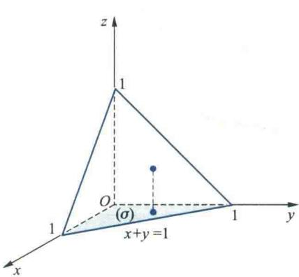
  <figcaption>图6.27</figcaption>
</figure>

这个三重积分也可以先化成如下三个单积分的累次积分后再逐步计算：
</Solution>
</Example>

右端的累次积分应理解为

$$
I = \iint_ {(\sigma)} \left[ \int_ {0} ^ {1 - x - y} x y z \mathrm{d} z \right] \mathrm{d} \sigma = \int_ {0} ^ {1} \mathrm{d} x \int_ {0} ^ {1 - x} \mathrm{d} y \int_ {0} ^ {1 - x - y} x y z \mathrm{d} z.
$$

$$
\int_ {0} ^ {1} \left[ \int_ {0} ^ {1 - x} \left[ x y \int_ {0} ^ {1 - x - y} z \mathrm{d} z \right] \mathrm{d} y \right] \mathrm{d} x.
$$

<Example title="例 3.2">
计算 $I = \iiint_{(V)} z \, dV$ ，其中 $(V)$ 是以原点为中心，R 为半径的上半球体.

<Solution title="解">
因为 $(V) = \{(x, y, z) \mid x^2 + y^2 \leqslant R^2, 0 \leqslant z \leqslant \sqrt{R^2 - x^2 - y^2}\}$ , 它在 $xOy$ 平面的投影区域 $(\sigma) = \{(x, y) \mid x^2 + y^2 \leqslant R^2\}$ (图6.28). 于是

$$
\begin{array}{r l} I & = \iint_ {(\sigma)} \left(\int_ {0} ^ {\sqrt {R ^ {2} - x ^ {2} - y ^ {2}}} z \mathrm{d} z\right) \mathrm{d} \sigma \\ & = \frac {1}{2} \iint_ {(\sigma)} (R ^ {2} - x ^ {2} - y ^ {2}) \mathrm{d} \sigma . \end{array}
$$

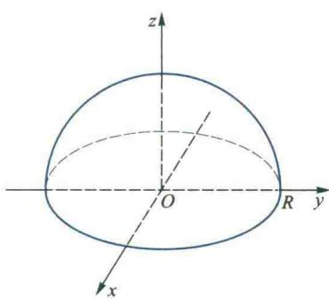

对这个二重积分,显然用极坐标计算比较方便,
从而

图6.28

$$
\begin{array}{r l} I & = \frac {1}{2} \iint_ {(\sigma)} (R ^ {2} - \rho^ {2}) \rho \mathrm{d} \rho \mathrm{d} \theta = \frac {1}{2} \int_ {0} ^ {2 \pi} \mathrm{d} \theta \int_ {0} ^ {R} (R ^ {2} - \rho^ {2}) \rho \mathrm{d} \rho \\ & = \frac {1}{2} \int_ {0} ^ {2 \pi} \left(\frac {R ^ {4}}{2} - \frac {R ^ {4}}{4}\right) \mathrm{d} \theta = \frac {\pi R ^ {4}}{4}. \end{array}
$$

如果我们把积分域(V)被平行于xOy平面的平面所截出的平面区域记作 $(\sigma_{z})$ ，并将z的变化范围设为 $[a,b]$ 。由三重积分定义，在“无限累加”乘积项 $f(x,y,z)\Delta z\Delta\sigma$ 时，先固定z和 $\Delta z$ ，在以 $(\sigma_{z})$ 为底、厚度为 $\Delta z$ 的薄层上“无限累加”（参见图6.26），把公因式 $\Delta z$ 提出；然后再在区间 $[a,b]$ 上把各薄层所求得的和“无限累加”，那么便有

$$
\lim _ {d \rightarrow 0} \sum_ {(V)} f (x, y, z) \Delta z \Delta \sigma = \lim _ {\max \Delta z \rightarrow 0} \sum_ {z} \left(\lim _ {d ^ {\prime} \rightarrow 0} \sum_ {(\sigma_ {z})} f (x, y, z) \Delta \sigma\right) \Delta z,
$$

其中 $d'$ 为 $(\sigma_{z})$ 中各 $(\Delta\sigma)$ 的直径中的最大者.于是得

$$
\iiint_ {(V)} f (x, y, z) \mathrm{d} V = \int_ {a} ^ {b} \left[ \iint_ {(\sigma_ {z})} f (x, y, z) \mathrm{d} \sigma \right] \mathrm{d} z,\tag{3.2}
$$

这种积分顺序简称为“先重后单”.
</Solution>
</Example>

<Example title="例 3.3">
计算

$$
I = \iiint_ {(V)} z ^ {2} \mathrm{d} V, (V) = \left\{(x, y, z) \left| \frac {x ^ {2}}{a ^ {2}} + \frac {y ^ {2}}{b ^ {2}} + \frac {z ^ {2}}{c ^ {2}} \leqslant 1 \right. \right\}.
$$

<QRCodeVideo id="6.3.1" title="在直角坐标系下计算三重积分的一般步骤." url="HTTP://2D.HEP.CN/1254052/20" />

<Solution title="解">
由于被积函数仅是 z 的函数, 所以为计算方便, 我们采用先重后单的积分顺序, 利用(3.2)式得

$$
I = \int_ {- c} ^ {c} \left(\iint_ {(\sigma_ {z})} z ^ {2} \mathrm{d} \sigma\right) \mathrm{d} z = \int_ {- c} ^ {c} \left(z ^ {2} \iint_ {(\sigma_ {z})} \mathrm{d} \sigma\right) \mathrm{d} z,
$$

其中 $(\sigma_{z})$ 为椭球体(V)被平行于xOy平面的平面所截出的截面(图6.29)，它就是平面z=z上的椭圆域

$$
(\sigma_ {z}) = \left\{(x, y) \left| \frac {x ^ {2}}{a ^ {2} \left(1 - \frac {z ^ {2}}{c ^ {2}}\right)} + \frac {y ^ {2}}{b ^ {2} \left(1 - \frac {z ^ {2}}{c ^ {2}}\right)} \leqslant 1, | z | \leqslant c \right. \right\}.
$$

<figure class="vp-figure">
  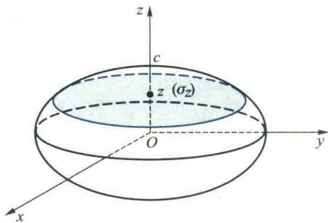
  <figcaption>图6.29</figcaption>
</figure>

由于椭圆域 $(\sigma_z)$ 的面积为

$$
\iint_ {(\sigma_ {z})} \mathrm{d} \sigma = \pi a b \left(1 - \frac {z ^ {2}}{c ^ {2}}\right),
$$

所以

$$
I = \int_ {- c} ^ {c} \pi a b \left(1 - \frac {z ^ {2}}{c ^ {2}}\right) z ^ {2} \mathrm{d} z = \frac {4}{1 5} \pi a b c ^ {3}. \quad \text {   I   }
$$
</Solution>
</Example>

<Example title="例 3.4">
计算

$$
I = \iiint_ {(V)} (x + y + z) \mathrm{d} V, (V) = \{(x, y, z) | x ^ {2} + y ^ {2} \leqslant z \leqslant \sqrt {2 - x ^ {2} - y ^ {2}} \}.
$$

<Solution title="解">
易见积分域(V)是由上半球面 $z=\sqrt{2-x^{2}-y^{2}}$ 与旋转抛物面 $z=x^{2}+y^{2}$ 所围成, 如图6.30所示. 由图可见, (V) 在 xOy 坐标平面上的投影( $\sigma$ ) 就是两曲面交线

$$
\left\{ \begin{array}{l} z = \sqrt {2 - x ^ {2} - y ^ {2}}, \\ z = x ^ {2} + y ^ {2} \end{array} \right.\tag{3.3}
$$

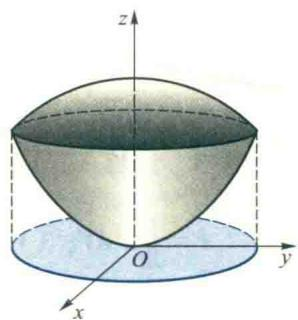

在 $xOy$ 平面上的投影. 由(3.3)式可解得 $z = 1$ . 于是交线(3.3)也可表示为

$$
\left\{ \begin{array}{l} z = x ^ {2} + y ^ {2}, \\ z = 1. \end{array} \right.
$$

所以投影区域 $(\sigma) = \{(x, y) | x^2 + y^2 \leqslant 1\}$ .
</Solution>
</Example>

意到积分域(V)关于 xOz 平面对称,而 y 关于 y 是奇函数,从而

图6.30  
<QRCodeVideo url="HTTP://2D.HEP.CN/1254052/21" />

$$
\iiint_ {(V)} y \mathrm{d} V = 0.
$$

同理,由对称性可知

$$
\iint_ {(V)} x \mathrm{d} V = 0.
$$

于是

$$
\begin{array}{r l} I & = \iiint_ {(V)} x \mathrm{d} V + \iiint_ {(V)} y \mathrm{d} V + \iiint_ {(V)} z \mathrm{d} V = \iiint_ {(V)} z \mathrm{d} V \\ & = \iint_ {(\sigma)} \mathrm{d} \sigma \int_ {x ^ {2} + y ^ {2}} ^ {\sqrt {2 - x ^ {2} - y ^ {2}}} z \mathrm{d} z = \frac {1}{2} \iint_ {(\sigma)} [ (2 - x ^ {2} - y ^ {2}) - (x ^ {2} + y ^ {2}) ^ {2} ] \mathrm{d} \sigma . \end{array}
$$

将上式右端的二重积分化为极坐标计算得

$$
I = \frac {1}{2} \int_ {0} ^ {2 \pi} \mathrm{d} \theta \int_ {0} ^ {1} (2 - \rho^ {2} - \rho^ {4}) \rho \mathrm{d} \rho = \frac {7}{1 2} \pi .
$$

<QRCodeVideo id="6.3.2" title="如何利用对称性简化三重积分的计算." url="HTTP://2D.HEP.CN/1254052/22" />
利用对称性简化三重积分计算举例.

## 3.2 柱面与球面坐标下三重积分的计算法

### 1. 曲线坐标下的三重积分

与二重积分一样,三重积分也可通过换元法来计算.对于在 Oxyz 直角坐标系下给出的三重积分 $\iiint_{(V)} f(x,y,z) \, \mathrm{d}V$ ,作正则变换:

$$
\begin{array}{r l} u = u (x, y, z), \quad v = v (x, y, z), \quad w = w (x, y, z), \\ (x, y, z) \in (V), \quad (u, v, w) \in (V ^ {\prime}), \end{array}\tag{3.4}
$$

其中 $(V)$ 与 $(V^{\prime})$ 均为 $\mathbf{R}^3$ 中的有界闭域，函数 $u,v,w\in C^{(1)}((V))$ ；Jacobi行列式 $\frac{\partial(u,v,w)}{\partial(x,y,z)}\neq 0,\forall (x,y,z)\in (V)$ ；而且此变换将域 $(V)$ 一一对应地映射为 $(V^{\prime})$ 。与二元函数类似，这时也存在唯一的逆变换

$$
x = x (u, v, w), y = y (u, v, w), z = z (u, v, w), (u, v, w) \in (V ^ {\prime}),\tag{3.5}
$$

它将 $(V')$ 变为 $(V)$ ，它也是正则的且保持内部变成内部，外部变成外部，边界变成边界。

在变换(3.4)下，Oxyz 直角坐标空间中，点 $P_{0}(x_{0},y_{0},z_{0})$ 也可以用三片曲面

$$
\begin{array}{r l} u (x, y, z) & = u (x _ {0}, y _ {0}, z _ {0}) = u _ {0}, \quad v (x, y, z) = v (x _ {0}, y _ {0}, z _ {0}) = v _ {0}, \\ w (x, y, z) & = w (x _ {0}, y _ {0}, z _ {0}) = w _ {0} \end{array}
$$

的交点来确定. $(u_{0},v_{0},w_{0})$ 称为空间点 $P_{0}$ 的曲线坐标.

在 Ouvw 直角坐标空间, 用坐标面族 $u = c_{1}, v = c_{2}, w = c_{3}$ 来划分积分域 $(V')$ , 可得体积微元 $dV' = du dv dw$ . 它在 Oxyz 空间上对应于由曲面族

$$
u (x, y, z) = c _ {1}, \quad v (x, y, z) = c _ {2}, \quad w (x, y, z) = c _ {3}
$$

划分区域(V)所得的体积微元 dV. 像二重积分一样可以证明(从略)dV 与 dV'有如下关系:

$$
\mathrm{d} V = \left| \frac {\partial (x , y , z)}{\partial (u , v , w)} \right| \mathrm{d} V ^ {\prime} = \left| \frac {\partial (x , y , z)}{\partial (u , v , w)} \right| \mathrm{d} u \mathrm{d} v \mathrm{d} w,\tag{3.6}
$$

其中

$$
\frac {\partial (x , y , z)}{\partial (u , v , w)} = \left| \begin{array}{c c c} x _ {u} & x _ {v} & x _ {w} \\ y _ {u} & y _ {v} & y _ {w} \\ z _ {u} & z _ {v} & z _ {w} \end{array} \right|
$$

是变换(3.5)的Jacobi行列式.从而

$$
\begin{array}{l} \iiint_ {(V)} f (x, y, z) \mathrm{d} V \\ = \iiint_ {(V)} f [ x (u, v, w), y (u, v, w), z (u, v, w) ] \left| \frac {\partial (x , y , z)}{\partial (u , v , w)} \right| \mathrm{d} u \mathrm{d} v \mathrm{d} w, \end{array}\tag{3.7}
$$

其中积分域 $(V')$ 是积分域 $(V)$ 通过变换(3.4)在Ouvw平面上的像.(3.7)式右端的积分称为曲线坐标下的三重积分.可以仿照二重积分化为累次积分的思想,把它化成累次(三次)积分.

类似于二重积分,当变换(3.4)在 Oxyz 空间内的几何意义比较明显时,我们也可通过此变换,在 Oxyz 空间利用“无限累加”的思想把三重积分直接化成累次积分.这时公式(3.7)可写成

$$
\iiint_ {(V)} f (x, y, z) \mathrm{d} V = \iiint_ {(V)} f [ x (u, v, w), y (u, v, w), z (u, v, w) ] \left| \frac {\partial (x , y , z)}{\partial (u , v , w)} \right| \mathrm{d} u \mathrm{d} v \mathrm{d} w,\tag{3.8}
$$

其中右端积分区域(V)的边界曲面应当用相应的曲线坐标表示.

正像极坐标是常见而且重要的一种平面曲线坐标那样,空间曲线坐标也有两种常见的重要类型,我们分述如下.

### 2. 柱面坐标及柱面坐标下三重积分的计算法

作变换

$$
x = \rho \cos \theta , y = \rho \sin \theta , z = z (\rho \geqslant 0, 0 \leqslant \theta \leqslant 2 \pi , - \infty <   z <   + \infty)\tag{3.9}
$$

由于

$$
\frac {\partial (x , y , z)}{\partial (\rho , \theta , z)} = \left| \begin{array}{c c c} \cos \theta & - \rho \sin \theta & 0 \\ \sin \theta & \rho \cos \theta & 0 \\ 0 & 0 & 1 \end{array} \right| = \rho ,\tag{3.10}
$$

从而当 $\rho \neq 0,0\leqslant \theta < 2\pi$ 时，(3.9)为一正则变换，其逆变换由表达式

$$
\rho = \sqrt {x ^ {2} + y ^ {2}}, \cos \theta = \frac {x}{\sqrt {x ^ {2} + y ^ {2}}}, \sin \theta = \frac {y}{\sqrt {x ^ {2} + y ^ {2}}}, z = z (x ^ {2} + y ^ {2} \neq 0)
$$

所确定.于是空间中点 $P_{0}(x_{0},y_{0},z_{0})$ 也可用坐标 $(\rho_0,\theta_0,z_0)$ 表示，它是圆柱面 $x^{2} + y^{2} = \rho_{0}^{2}$ （即 $\rho = \rho_0$ ），过 $z$ 轴且对 $xOz$ 平面的转角为 $\theta = \theta_0$ 的半平面 $y = x\tan \theta_0$ （即 $\theta = \theta_0$ ），以及平面 $z = z_0$ 的交点，称为点 $P_{0}$ 的柱面坐标（图6.31）.

用曲面族

$$
\rho = c _ {1}, \quad \theta = c _ {2}, \quad z = c _ {3}
$$

划分积分域(V)，由(3.10)与(3.17)式可知，柱面坐标下的体积微元为

$$
\mathrm{d} V = \rho \mathrm{d} \rho \mathrm{d} \theta \mathrm{d} z,
$$

从而

$$
\iiint_ {(V)} f (x, y, z) \mathrm{d} V = \iiint_ {(V)} f (\rho \cos \theta , \rho \sin \theta , z) \rho \mathrm{d} \rho \mathrm{d} \theta \mathrm{d} z,\tag{3.11}
$$

<figure class="vp-figure">
  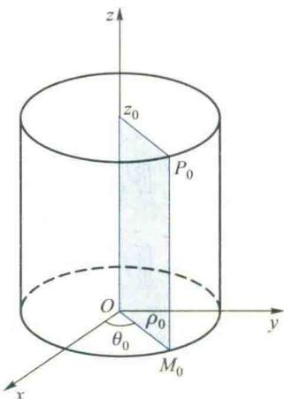
  <figcaption>图6.31</figcaption>
</figure>

其中 $(V)$ 的边界曲面由柱面坐标表示.

如果积分域(V)在xOy平面上的投影区域为 $(\sigma)$ ，且(V)的边界曲面可关于z被分成两个单值曲面 $z=z_{1}(x,y)$ ， $z=z_{2}(x,y)$ ， $(x,y)\in(\sigma)$ ，如图6.26所示，那么把(3.11)式右端在柱面坐标下的三重积分化成对z的定积分与关于 $(\sigma)$ 的二重积分的累次积分得

$$
\begin{array}{l} \iiint_ {(V)} f (\rho \cos \theta , \rho \sin \theta , z) \rho \mathrm{d} \rho \mathrm{d} \theta \mathrm{d} z \\ = \iint_ {(\sigma)} \rho \mathrm{d} \rho \mathrm{d} \theta \int_ {z _ {1} (\rho \cos \theta , \rho \sin \theta)} ^ {z _ {2} (\rho \cos \theta , \rho \sin \theta)} f (\rho \cos \theta , \rho \sin \theta , z) \mathrm{d} z. \end{array}
$$

<Example title="例 3.5">
计算 $I=\iiint_{(V)}z\mathrm{d}V$ ，(V) 是由旋转抛物面 z=x²+y²，圆柱面 $x^{2}+y^{2}=2y$ 与平面 z=0 所围区域位于抛物面之外、xOy 平面之上部分.

<Solution title="解">
由图6.33可见,积分域(V)在xOy平面上的投影区域( $\sigma$ )的边界曲线为圆周 $x^{2}+y^{2}=2y$ .因此,用柱面坐标计算比较方便.利用直角坐标与柱面坐标的关系(3.9),将积分域的边界曲面方程化成柱面坐标得

$$
z = \rho^ {2}, \quad \rho = 2 \sin \theta , \quad z = 0,
$$

从而

$$
\begin{array}{r l} & I = \iiint_ {(V)} z \mathrm{d} V = \iint_ {(\sigma)} \rho \mathrm{d} \rho \mathrm{d} \theta \int_ {0} ^ {\rho^ {2}} z \mathrm{d} z, \\ & (\sigma) = \left\{\left(\rho , \theta\right) \mid 0 \leqslant \rho \leqslant 2 \sin \theta , 0 \leqslant \theta \leqslant \pi \right\}. \end{array}
$$
</Solution>
</Example>

意到 $(\sigma)$ 关于y轴的对称性,可知注: 柱面坐标的体积微元也容易从图 6.32 中直接得到.

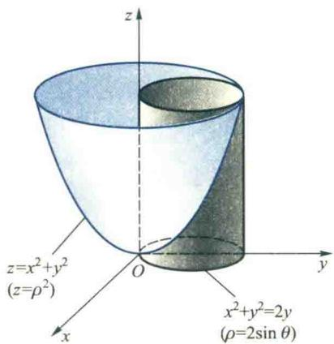

<figure class="vp-figure">
  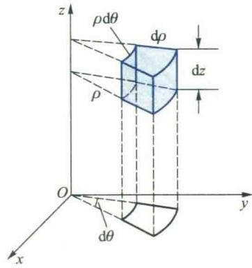
  <figcaption>图6.33</figcaption>
</figure>
图6.32

$$
\begin{array}{r l} & \iiint_ {(1)} f (x, y, z) \mathrm{d} V \\ & = \iint_ {(\sigma)} \mathrm{d} \sigma \int_ {z _ {1} (x, y)} ^ {z _ {2} (x, y)} f (x, y, z) \mathrm{d} z \\ & = \iint_ {(\sigma)} \Phi (x, y) \mathrm{d} \sigma \\ & = \iint_ {(1)} \Phi (\rho \cos \theta , \rho \sin \theta) \rho \mathrm{d} \rho \mathrm{d} \theta , \end{array}
$$

在柱面坐标下计算三重积分, 其实就是先对 z 求定积分, 再在 $(\sigma)$ 上用极坐标计算二重积分. 事实上, 由 (3.1) 式,

其中 $\Phi(x,y)=\int_{z_{1}(x,y)}^{z_{2}(x,y)}f(x,y,z)\mathrm{d}z.$

$$
I = \int_ {0} ^ {\frac {\pi}{2}} \mathrm{d} \theta \int_ {0} ^ {2 \sin \theta} \rho^ {5} \mathrm{d} \rho = \frac {6 4}{6} \int_ {0} ^ {\frac {\pi}{2}} \sin^ {6} \theta \mathrm{d} \theta = \frac {5}{3} \pi .
$$

<Example title="例 3.6">
计算 $I = \iiint_{(V)} (x^{3}y^{2} + z) \, \mathrm{d}V$ ，其中 $(V)$ 由曲面 $z = x^{2} + y^{2}$ 与平面 z = 4 所围成.

<Solution title="解">
积分域(V)如图6.34所示.由于被积函数中 $x^{3}y^{2}$ 是x的奇函数,而积分域(V)关于yOz坐标平面对称,从而

于是

$$
\iiint_ {(V)} x ^ {3} y ^ {2} \mathrm{d} V = 0,
$$

$$
I = \iiint_ {(V)} x ^ {3} y ^ {2} \mathrm{d} V + \iiint_ {(V)} z \mathrm{d} V = \iiint_ {(V)} z \mathrm{d} V.
$$

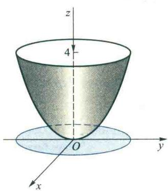

易见(V)在xOy平面的投影区域为

图6.34

$$
(\sigma) = \{(x, y) | x ^ {2} + y ^ {2} \leqslant 4 \},
$$

为了利用柱面坐标计算,将积分域(V)的边界曲面化为柱面坐标方程得

$$
\left\{ \begin{array}{l} z = \rho^ {2}, \\ z = 4, \end{array} \right.
$$

于是

$$
I = \iiint_ {(V)} z \rho \mathrm{d} z \mathrm{d} \rho \mathrm{d} \theta = \iint_ {(\sigma)} \rho \mathrm{d} \rho \mathrm{d} \theta \int_ {\rho^ {2}} ^ {4} z \mathrm{d} z = \int_ {0} ^ {2 \pi} \mathrm{d} \theta \int_ {0} ^ {2} \rho \mathrm{d} \rho \int_ {\rho^ {2}} ^ {4} z \mathrm{d} z = \frac {6 4}{3} \pi .
$$
</Solution>
</Example>

<Example title="例 3.7">
计算 $I = \iiint_{(V)}\sqrt{x^2 + z^2}\mathrm{d}V,(V)$ 是由 $y = x^{2} + z^{2}$ 与 $y = 4$ 所围成的区域.

<Solution title="解">
由图 6.35 可见, 若将积分域 (V) 向 xOy 平面投影, 则必须将旋转抛物面分成两个单值支 $z = \pm \sqrt{y - x^{2}}$ , 这必将导致积分运算的繁难. 注意到 (V) 向 xOz 平面投影是一圆域 $(\sigma) = \{(x, y) | x^{2} + z^{2} \leqslant 4\}$ 以及被积函数的表达式, 利用柱面坐标, 或先对 y 作定积分再在 xOz 平面上利用极坐标计算二重积分将会方便得多. 为此, 令

<figure class="vp-figure">
  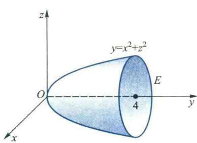
  <figcaption>图6.35</figcaption>
</figure>

得

$$
x = \rho \cos \theta , \quad z = \rho \sin \theta , \quad y = y,
$$

$$
I = \iint_ {(\sigma)} \rho \mathrm{d} \rho \mathrm{d} \theta \int_ {\rho^ {2}} ^ {4} \rho \mathrm{d} y = \iint_ {(\sigma)} \rho^ {2} (4 - \rho^ {2}) \mathrm{d} \rho \mathrm{d} \theta = 4 \int_ {0} ^ {\frac {\pi}{2}} \mathrm{d} \theta \int_ {0} ^ {2} \rho^ {2} (4 - \rho^ {2}) \mathrm{d} \rho = \frac {1 2 8}{1 5} \pi .
$$
</Solution>
</Example>

### 3. 球面坐标及球面坐标下三重积分的计算法

空间中的点 $P(x,y,z)$ 还可以用以下三个曲面的交点来表示: 半径为 r 的球面, 顶点在原点 O、对称轴为 z 轴且半顶角为 $\varphi$ 的圆锥面, 通过 z 轴且对 xOz 坐标平面的转角为 $\theta$ 的半平面(图 6.36). 数组 $(r,\varphi,\theta)$ 称为点 P 的球面坐标. 由图 6.36 易见, 直角坐标到球面坐标的变换公式为

$$
\begin{array}{r l} & x = r \sin \varphi \cos \theta , \quad y = r \sin \varphi \sin \theta , \\ & z = r \cos \varphi \\ & (r \geqslant 0, 0 \leqslant \varphi \leqslant \pi , 0 \leqslant \theta \leqslant 2 \pi). \end{array}
$$

<figure class="vp-figure">
  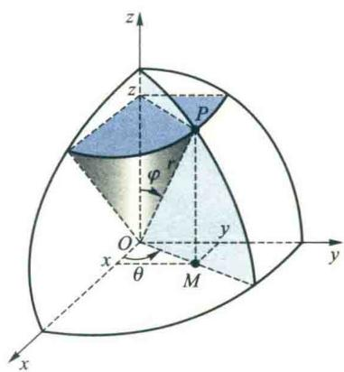
  <figcaption>图6.36</figcaption>
</figure>

(3.12)

用曲面族

$$
r = c _ {1}, \quad \varphi = c _ {2}, \quad \theta = c _ {3}
$$

划分积分域(V)，由于注:容易看出,如果把 r 固定,那么(3.12)式就是第五章例 6.6 所建立的半径为 r 的球面的参数方程.

$$
\frac {\partial (x , y , z)}{\partial (r , \varphi , \theta)} = \left| \begin{array}{c c c} \sin \varphi \cos \theta & r \cos \varphi \cos \theta & - r \sin \varphi \sin \theta \\ \sin \varphi \sin \theta & r \cos \varphi \sin \theta & r \sin \varphi \cos \theta \\ \cos \varphi & - r \sin \varphi & 0 \end{array} \right| = r ^ {2} \sin \varphi ,
$$

由(3.6)与(3.7)式可知,在球面坐标下的体积微元为

$$
\mathrm{d} V = r ^ {2} \sin \varphi \mathrm{d} r \mathrm{d} \varphi \mathrm{d} \theta ,\tag{3.13}
$$

实际上,球面坐标下的体积微元(3.13)也可利用图6.37,从几何上直接得到.于是

$$
\begin{array}{r l} & \iiint_ {(V)} f (x, y, z) \mathrm{d} V \\ & = \iiint_ {(V)} f (r \sin \varphi \cos \theta , r \sin \varphi \sin \theta , r \cos \varphi) r ^ {2} \sin \varphi \mathrm{d} r \mathrm{d} \varphi \mathrm{d} \theta , \end{array}\tag{3.14}
$$

其中 $(V)$ 的边界曲面由球面坐标表示.

为了把(3.14)右端的三重积分化成累次积分,我们在把诸子域上的乘积项 $f(r\sin\varphi\cos\theta,r\sin\varphi\sin\theta,r\cos\varphi)r^{2}\sin\varphi$ “无限累加”时,先固定 $\varphi,\theta,\Delta\varphi,\Delta\theta$ ,沿r方向“无限累加”,把公因式 $\Delta\varphi\Delta\theta$ 提出(图6.38);然后固定 $\theta$ 与 $\Delta\theta$ ,把各锥形条上“无限累加”所得的结果沿 $\varphi$ 方向“无限累加”,把公因式 $\Delta\theta$ 提出,这样就在各“橘瓣”形上得到结果;最后再把这些结果沿 $\theta$ 方向“无限累加”.这样,就把(3.14)式右端的三重积分化成了先对 r、后对 $\varphi$ 再对 $\theta$ 的累次(三次)积分.

<figure class="vp-figure">
  
  <figcaption>图6.37</figcaption>
</figure>

<figure class="vp-figure">
  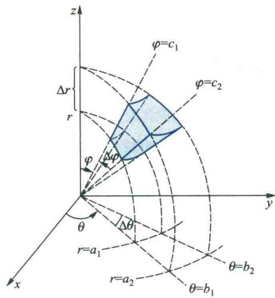
  <figcaption>图6.38</figcaption>
</figure>

<Example title="例 3.8">
设(V)为球面 $x^{2}+y^{2}+z^{2}=2az$ (a>0) 和锥面(以 z 轴为对称轴,顶角为 $2\alpha$ ) 所围的空间区域,求(V)的体积.

<Solution title="解">
由于区域(V)由球面和锥面围成(图6.39)，因此，使用球面坐标比较方便。在球面坐标下，所给球面的方程为

$$
r = 2 a \cos \varphi ,
$$

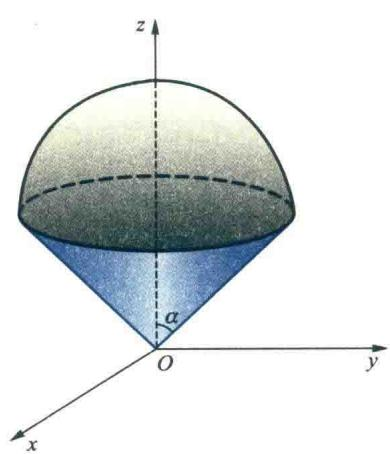

所给圆锥面的方程为

$$
\varphi = \alpha ,
$$

容易看出,对所给区域(V)来说, $r,\varphi,\theta$ 的变化范围为

图6.39

$$
0 \leqslant r \leqslant 2 a \cos \varphi , 0 \leqslant \varphi \leqslant \alpha , 0 \leqslant \theta <   2 \pi .
$$

于是

$$
\begin{array}{r l} V & = \iiint_ {(V)} \mathrm{d} V = \iiint_ {(V)} r ^ {2} \sin \varphi \mathrm{d} r \mathrm{d} \varphi \mathrm{d} \theta = \int_ {0} ^ {2 \pi} \mathrm{d} \theta \int_ {0} ^ {\alpha} \sin \varphi \mathrm{d} \varphi \int_ {0} ^ {2 a \cos \varphi} r ^ {2} \mathrm{d} r \\ & = \frac {1 6}{3} \pi a ^ {3} \int_ {0} ^ {\alpha} \cos^ {3} \varphi \sin \varphi \mathrm{d} \varphi = \frac {4 \pi a ^ {3}}{3} (1 - \cos^ {4} \alpha). \end{array}
$$
</Solution>
</Example>

<Example title="例 3.9">
计算 $I = \iiint_{(V)} z^{2} \, dV$ ，其中

$$
(V) = \{(x, y, z) | x ^ {2} + y ^ {2} + z ^ {2} \leqslant R ^ {2}, x ^ {2} + y ^ {2} + (z - R) ^ {2} \leqslant R ^ {2} \}.
$$

<Solution title="解法一">
利用柱面坐标. 把(V)的边界曲面方程化成柱面坐标(图6.40), 得

$$
z = \sqrt {R ^ {2} - \rho^ {2}}, \quad z = R - \sqrt {R ^ {2} - \rho^ {2}}.
$$

它们的交线在 $xOy$ 平面上的投影方程为

$$
\left\{ \begin{array}{l} \rho = \frac {\sqrt {3}}{2} R, \\ z = 0. \end{array} \right.
$$

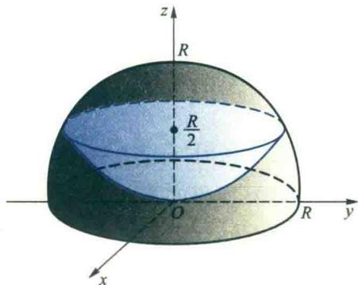

于是

图6.40

$$
\begin{array}{l} I = \iiint_ {(V)} z ^ {2} \rho \mathrm{d} z \mathrm{d} \rho \mathrm{d} \theta = \int_ {0} ^ {2 \pi} \mathrm{d} \theta \int_ {0} ^ {\frac {\sqrt {3}}{2} R} \rho \mathrm{d} \rho \int_ {R - \sqrt {R ^ {2} - \rho^ {2}}} ^ {\sqrt {R ^ {2} - \rho^ {2}}} z ^ {2} \mathrm{d} z \\ = \frac {2 \pi}{3} \int_ {0} ^ {\frac {\sqrt {3}}{2} R} \rho [ (R ^ {2} - \rho^ {2}) ^ {\frac {3}{2}} - (R - \sqrt {R ^ {2} - \rho^ {2}}) ^ {3} ] \mathrm{d} \rho \\ = - \frac {2 \pi}{3} \left[ \frac {2}{5} (R ^ {2} - \rho^ {2}) ^ {\frac {5}{2}} + 2 R ^ {3} \rho^ {2} - \frac {3}{4} R \rho^ {4} + R ^ {2} (R ^ {2} - \rho^ {2}) ^ {\frac {3}{2}} \right] \Bigg | _ {0} ^ {\frac {\sqrt {3}}{2} R} \\ = \frac {5 9}{4 8 0} \pi R ^ {5}. \end{array}
$$
</Solution>

<Solution title="解法二">
利用球面坐标. 把(V)的边界曲面方程化成球面坐标, 得

$$
r = R, \quad r = 2 R \cos \varphi ,
$$

它们的交线为圆

$$
\left\{ \begin{array}{l} r = R, \\ \varphi = \frac {\pi}{3}. \end{array} \right.
$$

因此， $(V)$ 的边界曲面由

$$
r = 2 R \cos \varphi \left(\frac {\pi}{3} \leqslant \varphi \leqslant \frac {\pi}{2}\right)
$$

$$
r = R \quad \left(0 \leqslant \varphi \leqslant \frac {\pi}{3}\right)
$$
</Solution>
</Example>

将直角坐标下的三重积分化为球面坐标下三重积分的步骤:

1. 将积分域(V)的边界曲面利用关系式(3.12)用球面坐标表示；

2. 将被积函数通过(3.12)式用球面坐标表示；

3. 将体积微元变换成球面坐标下的体积微元

组成(图 6.40).于是

$$
\mathrm{d} V = \rho^ {2} \sin \varphi \mathrm{d} r \mathrm{d} \varphi \mathrm{d} \theta .
$$

$$
\begin{array}{r l} I & = \iiint_ {(V)} r ^ {2} \cos^ {2} \varphi r ^ {2} \sin \varphi \mathrm{d} r \mathrm{d} \varphi \mathrm{d} \theta \\ & = \int_ {0} ^ {2 \pi} \mathrm{d} \theta \int_ {0} ^ {\frac {\pi}{3}} \cos^ {2} \varphi \sin \varphi \mathrm{d} \varphi \int_ {0} ^ {R} r ^ {4} \mathrm{d} r + \int_ {0} ^ {2 \pi} \mathrm{d} \theta \int_ {\frac {\pi}{3}} ^ {\frac {\pi}{2}} \cos^ {2} \varphi \sin \varphi \mathrm{d} \varphi \int_ {0} ^ {2 R \cos \varphi} r ^ {4} \mathrm{d} r \\ & = \frac {2 \pi}{5} R ^ {5} \left(- \frac {1}{3} \cos^ {3} \varphi\right) \Big | _ {0} ^ {\frac {\pi}{3}} + \frac {2 \pi}{5} (2 R) ^ {5} \left(- \frac {1}{8} \cos^ {8} \varphi\right) \Big | _ {\frac {\pi}{3}} ^ {\frac {\pi}{2}} = \frac {5 9}{4 8 0} \pi R ^ {5}. \end{array}
$$

<Solution title="解法三">
利用“先重后单”的方法. 用平行于 $xOy$ 的平面 $z = c$ 去横截区域 $(V)$ , 所得的圆域记为 $(\sigma_z)$ , 由图6.40可见, 为了在 $z$ 的变化区间上给出 $(\sigma_z)$ 的表达式, 必须求得两球面交线处 $z$ 的值. 为此求解方程组 $\left\{ \begin{array}{l} x^2 + y^2 + z^2 = k^2, \\ x^2 + y^2 + (z - R)^2 = R^2, \end{array} \right.$ 可得 $z = \frac{R}{2}$ . 于是

<QRCodeVideo id="6.3.4" url="HTTP://2D.HEP.CN/1254052/23" />

$$
(\sigma_ {z}) = \left\{ \begin{array}{l l} \{(x, y) | x ^ {2} + y ^ {2} \leqslant R ^ {2} - (z - R) ^ {2} \}, & 0 \leqslant z \leqslant \frac {R}{2}, \\ \{(x, y) | x ^ {2} + y ^ {2} \leqslant R ^ {2} - z ^ {2} \}, & \frac {R}{2} \leqslant z \leqslant R. \end{array} \right.
$$

在计算三重积分 $\iiint_{(V)}f(x,y,z)\mathrm{d}V$

因此

时如何选用柱面坐标或球面坐标.

$$
I = \int_ {0} ^ {\frac {R}{2}} z ^ {2} \mathrm{d} z \iint_ {(\sigma_ {z})} \mathrm{d} \sigma + \int_ {\frac {R}{2}} ^ {R} z ^ {2} \mathrm{d} z \iint_ {(\sigma_ {z})} \mathrm{d} \sigma .
$$

在平面 z=z 上直接运用截圆面积公式可得

$$
\begin{array}{r l} I & = \int_ {0} ^ {\frac {R}{2}} z ^ {2} \pi [ R ^ {2} - (z - R) ^ {2} ] \mathrm{d} z + \int_ {\frac {R}{2}} ^ {R} z ^ {2} \pi (R ^ {2} - z ^ {2}) \mathrm{d} z \\ & = \pi \left[ \left(\frac {2 R}{4} z ^ {4} - \frac {1}{5} z ^ {5}\right) \Bigg | _ {0} ^ {\frac {R}{2}} + \left(\frac {R ^ {2}}{3} z ^ {3} - \frac {1}{5} z ^ {5}\right) \Bigg | _ {\frac {R}{2}} ^ {R} \right] = \frac {5 9}{4 8 0} \pi R ^ {5}. \end{array}
$$
</Solution>

<Example title="例 3.10">
计算 $I = \iiint_{(V)} (x + y + z) \cos (x + y + z)^2 \, \mathrm{d}V$ ，其中

$$
(V) = \{(x, y, z) | 0 \leqslant x - y \leqslant 1, 0 \leqslant x - z \leqslant 1, 0 \leqslant x + y + z \leqslant 1 \}.
$$

<Solution title="解">
为了使积分域(V)变得简单,我们利用坐标变换

$$
x - y = u, \quad x - z = v, \quad x + y + z = w,
$$

由于

$$
\frac {\partial (u , v , w)}{\partial (x , y , z)} = \left| \begin{array}{c c c} 1 & - 1 & 0 \\ 1 & 0 & - 1 \\ 1 & 1 & 1 \end{array} \right| = 3,
$$

所以

$$
\frac {\partial (x , y , z)}{\partial (u , v , w)} = \frac {1}{3}.
$$

于是由(3.8)式得

$$
I = \iiint_ {(V)} w \cos w ^ {2} \left| \frac {\partial (x , y , z)}{\partial (u , v , w)} \right| \mathrm{d} u \mathrm{d} v \mathrm{d} w = \frac {1}{3} \iiint_ {(V)} w \cos w ^ {2} \mathrm{d} u \mathrm{d} v \mathrm{d} w.
$$

再用 u, v, w 表示 (V), 得

$$
(V) = \{(u, v, w) | 0 \leqslant u \leqslant 1, 0 \leqslant v \leqslant 1, 0 \leqslant w \leqslant 1 \},
$$

因此，

$$
I = \int_ {0} ^ {1} \mathrm{d} u \int_ {0} ^ {1} \mathrm{d} v \int_ {0} ^ {1} \frac {1}{3} w \cos w ^ {2} \mathrm{d} w = \frac {1}{6} \sin 1.
$$
</Solution>
</Example>

<ExerciseTrigger chapter={6} section="6.3" title="6.3 三重积分的计算 课后真题与自测练习" />
