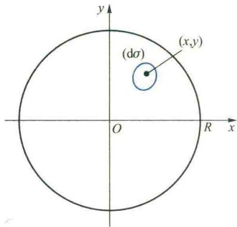

import Guide from '@/components/Guide.astro';
import Knowledge from '@/components/Knowledge.astro';
import Example from '@/components/Example.astro';
import Analysis from '@/components/Analysis.astro';
import Solution from '@/components/Solution.astro';
import Variant from '@/components/Variant.astro';
import Note from '@/components/Note.astro';
import Block from '@/components/Block.astro';
import Method from '@/components/Method.astro';

在第三章定积分应用一节中已经看到,求一个非均匀连续分布在区间 $[a,b]$ 上的可加量Q,可以通过“分”“匀”“合”“精”四步来建立积分式得到,这四步中的关键是“匀”,也即是建立积分微元.我们还看到,如果把分布在子区间 $[a,x]\quad(x\in[a,b])$ 上的量记作 $Q(x)$ ,那么在通常情况下,这个积分微元就是 $Q(x)$ 的微分,它通常可以在微小子区间 $[x,x+dx]$ 上,通过处理相应均匀量的乘法公式得到.

如果所求量 Q 是非均匀地连续分布在平面或空间的某一区域 $(\Omega)$ 上, 那么要计算它就要建立相应的二重或三重积分. 和定积分情形一样, 建立积分式的关键在于求得积分微元, 下面我们就来阐述这一问题.

## 5.1 重积分的微元法

## 1. 区域函数及其对域的导数

让我们以求连续分布在平面区域 $(\sigma)$ 上的质量 $m$ 这一问题来说明有关概念. 把由区域 $(\sigma)$ 的所有可能的子区域 $(\Delta \sigma)$ 所构成的集合记作 $\Omega_{\sigma}, \Omega_{\sigma}$ 中的任一元素 $(\Delta \sigma)$ 对应着确定的质量, 因而质量 $m$ 可以看作是定义在 $\Omega_{\sigma}$ 上的一个函数, 记作

$$

m = F ((\Delta \sigma)), (\Delta \sigma) \in \Omega_ {\sigma}.

$$

为了研究物质在 $(\sigma)$ 上分布的疏密情况,人们引入了面密度的概念.当物质均匀分布时,面密度

$$

\mu = \frac {F ((\Delta \sigma))}{\Delta \sigma} (\Delta \sigma \text {是域} (\Delta \sigma) \text {的面积});

$$

当物质非均匀分布时,若 $(\Delta\sigma)$ 收缩为其中一点 $(x,y)$ 时上述比值的极限存在,则将此极限值规定为此平面物体在点 $(x,y)$ 处的面密度,即

$$

\mu = \lim _ {(\Delta \sigma) \rightarrow (x, y)} \frac {F ((\Delta \sigma))}{\Delta \sigma} = f (x, y), (x, y) \in (\Delta \sigma).

$$

显然面密度 $\mu$ 是点 $(x,y)$ 的函数.

容易看出,在点 M 处的面密度实际上就是质量函数 F 在点 M 处对区域面积的变化率.

一般地, 把由平面区域( $\sigma$ ) 中一切子区域( $\Delta\sigma$ ) 构成的集合记作 $\Omega_{\sigma}$ , 则映射 F: $\Omega_{\sigma} \rightarrow R$ 称为区域函数, 记作

$$

F = F ((\Delta \sigma)), (\Delta \sigma) \in \Omega_ {\sigma},

$$

其中 $\Omega_{\sigma}$ 称为其定义域.

为了研究此区域函数 F 对区域面积的变化率, 相应于面密度, 我们引入如下定义:

<Knowledge title="定义 5.1">
设 $F$ 是定义于 $\Omega_{\sigma}$ 上的区域函数, $M(x,y)$ 是 $(\sigma)$ 中的一点. 在 $(\sigma)$ 内任作一包含点 $M$ 的子域 $(\Delta \sigma), (\Delta \sigma) \in \Omega_{\sigma}$ , 其面积记为 $\Delta \sigma$ . 若保持 $M$ 点不动, 当 $(\Delta \sigma)$ 的直径 $d \to 0$ (即 $(\Delta \sigma) \to M$ ) 时比式 $\frac{F((\Delta \sigma))}{\Delta \sigma}$ 的极限存在, 记作 $f(M)$ , 则称此极限值 $f(M)$ 为区域函数 $F$ 在点 $M$ 处对区域面积的导数或对区域 $(\sigma)$ 的导数, 简称为区域函数 $F$ 在点 $M$ 处的导数. 记作

$$

\frac {\mathrm{d} F}{\mathrm{d} \sigma} = \lim _ {d \rightarrow 0} \frac {F ((\Delta \sigma))}{\Delta \sigma} = f (M),\tag{5.1}

$$

或
</Knowledge>

<Note>
$$

\frac {\mathrm{d} F}{\mathrm{d} \sigma} = f (x, y).

$$

能将（5.1）式中的 $d\to 0$ 改为 $\Delta \sigma \rightarrow 0$ 吗？

并称 $f(x,y)\mathrm{d}\sigma$ 为区域函数F在点 $M(x,y)$ 处对区域(σ)的微分,简称为区域函数F在点M处的微分.记作

$$

\mathrm{d} F = f (x, y) \mathrm{d} \sigma .

$$

由(5.1)式可见

$$

\frac {F ((\Delta \sigma))}{\Delta \sigma} - f (M) = \alpha (\Delta \sigma),

$$

其中 $\alpha(\Delta\sigma)$ 是关于 $\Delta\sigma$ 的无穷小量.于是,

$$

F ((\Delta \sigma)) = f (x, y) \Delta \sigma + \alpha (\Delta \sigma) \cdot \Delta \sigma .

$$

令 $\Delta\sigma=\mathrm{d}\sigma$ ，注意到 $\alpha(\Delta\sigma)\Delta\sigma$ 是 $\Delta\sigma$ 的高阶无穷小。可见，区域函数 $F((\Delta\sigma))$ 的微分 $\mathrm{d}F=f(x,y)\mathrm{d}\sigma$ 是此区域函数 $F((\Delta\sigma))$ 关于 $\Delta\sigma$ 的线性主部。这与一元函数的微分类似。

区域函数及其导数与微分的概念,不难推广到空间区域.
</Note>

<Note>
这种导数概念与第五章中所讲的偏导数、全导数是不同的概念.它在物理、力学及其他科学中同样有重要的地位.例如,平面在点M的压强 $p(M)$ 是力函数 $P((\Delta\sigma))$ 在点M对区域( $\sigma$ )的导数

$$

p (M) = \frac {\mathrm{d} P}{\mathrm{d} \sigma} \Bigg | _ {M} = \lim _ {(\Delta \sigma) \rightarrow M} \frac {P ((\Delta \sigma))}{\Delta \sigma}.

$$
</Note>

## 2. 变域上的重积分对域的导数

在定积分中我们知道,变上限积分 $\int_{a}^{x}f(t)\,\mathrm{d}t$ 是上限x的函数.由微积分学第一基本定理可知,当 $f(x)$ 连续时,有

$$

\frac {\mathrm{d}}{\mathrm{d} x} \int_ {a} ^ {x} f (t) \mathrm{d} t = f (x).

$$

在重积分中也有类似的结论,下面以二重积分为例来加以说明,三重积分完全类似.

设被积函数 $f \in C((\sigma))$ ， $M(x, y)$ 为域 $(\sigma)$ 内任一点，任作一包含点M的子域 $(\Delta\sigma) \subseteq (\sigma)$ ，那么当被积函数f给定后，二重积分 $\iint_{(\Delta\sigma)} f(M) \, \mathrm{d}\sigma$ 的值将随 $(\Delta\sigma)$ 而变，是区域 $(\Delta\sigma)$ 的函数，记作

$$

\Phi ((\Delta \sigma)) = \iint_ {(\Delta \sigma)} f (M) \mathrm{d} \sigma , \quad M \in (\Delta \sigma) \subseteq (\sigma).

$$

<Note>
到 $f \in C((\sigma))$ ，由积分中值定理可知

$$

\Phi ((\Delta \sigma)) = \iint_ {(\Delta \sigma)} f (M) \mathrm{d} \sigma = f (\overline {{{x}}}, \overline {{{y}}}) \Delta \sigma ,

$$

其中点 $(\bar{x},\bar{y})\in(\Delta\sigma)$ ， $\Delta\sigma$ 是 $(\Delta\sigma)$ 的面积，于是

$$

\frac {\Phi ((\Delta \sigma))}{\Delta \sigma} = f (\bar {x}, \bar {y}).

$$

固定 M, 令子域 $(\Delta\sigma)$ 的直径 $d \to 0$ , 即令 $(\Delta\sigma)$ 收缩到点 $M(x, y)$ , 从而 $(\bar{x}, \bar{y}) \to (x, y)$ , 由 $f(x, y)$ 的连续性和区域函数导数的定义可得

$$

\frac {\mathrm{d} \Phi}{\mathrm{d} \sigma} = \lim _ {d \rightarrow 0} \frac {\Phi ((\Delta \sigma))}{\Delta \sigma} = f (x, y).\tag{5.2}

$$

(5.2)式表明：连续函数在变域上的二重积分作为区域函数，它在点 $(x,y)$ 处对区域的导数等于被积函数在该点的值.

由(5.2)式可知

$$

\Phi ((\Delta \sigma)) = f (M) \Delta \sigma + o (\Delta \sigma),\tag{5.3}

$$

其中 $o(\Delta\sigma)$ 当 $(\Delta\sigma)\rightarrow M$ 点时是 $\Delta\sigma$ 的高阶无穷小.

令 $\Delta \sigma = \mathrm{d}\sigma$ ，可见，当 $f$ 在（ $\sigma$ ）上连续时，二重积分 $\iint_{(\sigma)} f(M) \, \mathrm{d}\sigma$ 中的被积表达式 $f(M) \, \mathrm{d}\sigma$ 实际上就是注：由(5.2)与(5.3)式可见，尽管区域函数不能用平面坐标直接给出，但它的线性主部以及变化率均可通过二元函数表出.

区域函数 $\Phi((\Delta\sigma))$ 对区域的微分. 也就是区域函数 $\Phi((\Delta\sigma))$ 关于 $\Delta\sigma$ 的线性主部.
</Note>

## 3. 微元法

由(5.3)式可知,如果把一个在域( $\sigma$ )上关于区域具有可加性的量 $\Phi$ 视为一定义在 $\Omega_{\sigma}$ 上的区域函数在区域 $(\sigma)$ 上的值，并且能把它用二重积分 $\iint_{(\sigma)} f(x,y) \, \mathrm{d}\sigma$ 来表示，那么当 $f(x,y)$ 在 $(\sigma)$ 上连续时，积分微元 $f(x,y) \, \mathrm{d}\sigma$ 就是这一区域函数 $\Phi$ 对区域

的微分.因此,在建立 $\Phi$ 的积分表达式时,寻找积分微元就是寻找区域函数 $\Phi$ 的微分 d $\Phi$ ,也就是寻找区域函数 $\Phi((\Delta\sigma))$ 的线性主部.在处理实际问题中,与定积分类似,通常在微小区域(d $\sigma$ )中把非均匀分布的量 $\Phi$ 视为均匀分布,或者将微小区域(d $\sigma$ )看作一点,然后利用已知的几何或物理公式,通过处理相应均匀量所用的乘法得到的近似值往往就是所求的注意: 求积分微元时, 首先分析造成所求量 $\Phi$ 非均匀分布的原因. 它往往是由于某一相关量 f 变化所引起的. 将此量看作不变, 用处理相应均匀分布的乘法, 得出的乘积 $f \cdot d\sigma$ 往往就是所求的微元

$$

\mathrm{d} \phi = f \cdot \mathrm{d} \sigma .

$$

微分 $\mathrm{d}\Phi$ ，也就是我们要寻求的积分微元.求得了积分微元 $\mathrm{d}\Phi$ 后，立即可写出计算 $\Phi$ 的二重积分表达式.这种方法称为重积分的微元法.下面我们以液体的静压力为例来具体说明.

  

图6.41

<Example title="例 5.1">
设有一水平放置的半径为 R 的圆管道（图 6.41）内部充满液体，已知液体在管道的横截面上的压强 $p=f(x,y)$ 为一连续函数，求液体对管道闸门（垂直于管道的轴）的静压力 P.

<Solution title="解">
在管道闸门上建立平面直角坐标系,取圆心为坐标原点.由于压强随点而变,所以闸门上静压力的分布是非均匀的,并且关于区域具有可加性,因此,这显然是在圆域( $\sigma$ ): $x^{2}+y^{2}\leqslant R^{2}$ 上的二重积分问题.

为寻找压力微元,我们在微小区域 $(\mathrm{d}\sigma)$ 上,把非均匀分布的压力看作是均匀的,即把变动的压强p看作是不变的,等于 $(\mathrm{d}\sigma)$ 上一点 $(x,y)$ 处压强的值 $f(x,y)$ .记 $(\mathrm{d}\sigma)$ 的面积为 $d\sigma$ ,于是有压力微元

$$

\mathrm{d} P = f (x, y) \mathrm{d} \sigma ,\tag{5.4}

$$

从而

$$

P = \iint_ {(\sigma)} f (x, y) \mathrm{d} \sigma .

$$

比如,设水平管道中充满水(水的密度为 $\mu$ ),则点 $(x,y)$ 处的压强

$$

p = \mu g (R - y),

$$

即 $f(x,y)=(R-y)\mu g$ ，其中 g 为重力加速度，从而水对闸门的静压力为

$$

P = \iint_ {(\sigma)} \mu g (R - y) \mathrm{d} \sigma = \mu g \int_ {0} ^ {2 \pi} \mathrm{d} \theta \int_ {0} ^ {R} (R - \rho \sin \theta) \rho \mathrm{d} \rho = \mu g \pi R ^ {3}.

$$

若把压力 P 视为区域函数, 则

$$

\frac {\mathrm{d} P}{\mathrm{d} \sigma} = p = f (x, y),

$$

因而(5.4)式中的 $f(x,y)\mathrm{d}\sigma$ 就是这个区域函数P对区域的微分.

二维码6.5.1
</Solution>
</Example>

## 5.2 应用举例

<Example title="例 5.2">
求物质均匀分布, 半径为 a 的半球体的质心.

用微元法建立

重积分表达式

的思想剖析.

<Solution title="解">
我们先回顾一下质点系质心的计算. 设空间内有 n 个质点 $P_{1}, P_{2}, \cdots, P_{n}, P_{i}$ 的质量为 $m_{i}$ ; 坐标为 $(x_{i}, y_{i}, z_{i}) (i = 1, 2, \cdots, n)$ 的质点

$P_{i}$ 对 xOy 坐标平面的静矩为 $m_{i}z_{i}$ . 由于质点系对各坐标平面的静矩具有可加性, 因而上述质点系对 xOy, yOz, zOx 坐标平面的静矩分别为

$$

M _ {x y} = \sum_ {i = 1} ^ {n} m _ {i} z _ {i}, \quad M _ {y z} = \sum_ {i = 1} ^ {n} m _ {i} x _ {i}, \quad M _ {z x} = \sum_ {i = 1} ^ {n} m _ {i} y _ {i}.

$$

由物理学知道,如果把质点系的质量集中在这样一点 P,使得集中的质量在点 P 对各坐标平面的静矩分别等于质点系对同一坐标平面的静矩,那么点 P 就称为该质点系的质心.于是可求得质心 $P(\bar{x}, \bar{y}, \bar{z})$ 的坐标为

$$

\overline {{{x}}} = \frac {M _ {y z}}{m}, \quad \overline {{{y}}} = \frac {M _ {z x}}{m}, \quad \overline {{{z}}} = \frac {M _ {x y}}{m}, \quad m = \sum_ {i = 1} ^ {n} m _ {i}.

$$

现在来计算上述半球体的质心.建立坐标系如图6.42所示,由对称性可知质心应在z轴上,从而

$$

\bar {x} = 0, \bar {y} = 0.

$$

为求 $\bar{z}$ ，我们首先需要求此半球体对 xOy 平面的静矩。由于半球体上各点到 xOy 平面的距离不尽相同，因而上半球体对 xOy 平面的静矩是一个非均匀分布的可加量。容易看出，这是一个三重积分问题。将半球体所在的区域（V）划分成若干子域，把微

  

图6.42

小子域(dV)近似地看作是一个质点 $(x,y,z)$ ，(dV)中的质量都集中于此点，(dV)的体积记作dV.这样一来，就把半球体离散化而看作是一个质点系.容易看出，(dV)上的质量对xOy平面的静矩近似地等于

$$

\mathrm{d} M _ {x y} = K z \mathrm{d} V,

$$

它就是此半球体对 xOy 平面的静矩微元, 其中常数 K 是半球体的体密度. 从而

$$

M _ {x y} = \iiint_ {(V)} K z \mathrm{d} V,

$$

其中 $(V)$ 为 $0 \leqslant z \leqslant \sqrt{a^{2}-x^{2}-y^{2}}$ . 利用柱面坐标可求得

$$

M _ {x y} = \int_ {0} ^ {2 \pi} \mathrm{d} \theta \int_ {0} ^ {a} \rho \mathrm{d} \rho \int_ {0} ^ {\sqrt {a ^ {2} - \rho^ {2}}} K z \mathrm{d} z = \frac {K \pi}{4} a ^ {4}.

$$

又容易求得半球体的质量为

$$

m = \iiint_ {(V)} K \mathrm{d} V = \int_ {0} ^ {2 \pi} \mathrm{d} \theta \int_ {0} ^ {a} \rho \mathrm{d} \rho \int_ {0} ^ {\sqrt {a ^ {2} - \rho^ {2}}} K \mathrm{d} z = \frac {2 K \pi}{3} a ^ {3},

$$

于是 $\bar{z}=\frac{M_{xy}}{m}=\frac{3}{8}a$ ，故所求质心为 $P\left(0,0,\frac{3}{8}a\right)$ .

$$

\pi \left(a ^ {2} - z ^ {2}\right)

$$

成是不变的,均等于z,于是可立即得到此薄片对xOy平面的静矩

$$

\mathrm{d} M _ {x y} = z \cdot K \pi (a ^ {2} - z ^ {2}) \mathrm{d} z,

$$
</Solution>
</Example>

<Note>
读者不难看出,这种作法其实就相当于在柱面坐标下,对三重积分利用“先重后单”的思想化成累次积分来计算的方法.

从而

$$

M _ {x y} = \int_ {0} ^ {a} K \pi z (a ^ {2} - z ^ {2}) \mathrm{d} z = \frac {K \pi}{4} a ^ {4}. \quad \text {Ⅰ}

$$
</Note>

<Example title="例 5.3">
求半径为 R、质量均匀分布的圆盘对于其中心轴的转动惯量 $I_{0}$ 和对其直径的转动惯量 $I_{D}$ .

<Solution title="解">
先回顾一下转动惯量的概念. 设有一质量为 m 的质点, 它到一已知轴 L 的垂直距离为 r, 绕轴 L 旋转的角速度为 $\omega$ . 由于质点转动时的切线速度为 $v = r\omega$ , 因而它的动能为

$$

\frac {1}{2} m v ^ {2} = \frac {1}{2} (m r ^ {2}) \omega^ {2}.\tag{5.5}

$$

如果此质点平动,则动能为

$$

E _ {\kappa} = \frac {1}{2} m v ^ {2},\tag{5.6}

$$

其中质量 m 为平动惯性大小的度量. 将(5.5)式与(5.6)式比较可见, $mr^{2}$ 相当于平动时的质量 m, 它是质点转动时惯性大小的度量, 称为质点对轴 L 的转动惯量. 由力学可知, 质点系对同一轴的转动惯量也具有可加性, 即质点系对轴 L 的转动惯量等于各质点对 L 转动惯量之和.

现在回到我们的问题.设圆盘的面密度为常数 $\mu$ ，取圆盘的中心为坐标原点， $z$ 轴为中心轴，则圆盘上各点到 $z$ 轴的距离 $r = \sqrt{x^2 + y^2}$ ，它随点的位置而异，圆盘对其中心轴的转动惯量在圆盘上是非均匀分布的，并且具有可加性，因此需要用二重积分来计算。设圆盘所在区域为 $(\sigma)$ ，把 $(\sigma)$ 任意划分成若干小区域，首先求点 $(x, y)$ 处的质量微元 $\mathrm{dm} = \mu \mathrm{d}\sigma$ 对中心轴的转动惯量，即转动惯量微元

$$

\mathrm{d} I _ {0} = r ^ {2} \mathrm{d} m = \mu (x ^ {2} + y ^ {2}) \mathrm{d} \sigma ,

$$

从而

$$

I _ {0} = \iint_ {(\sigma)} \mu (x ^ {2} + y ^ {2}) \mathrm{d} \sigma = \mu \int_ {0} ^ {2 \pi} \mathrm{d} \theta \int_ {0} ^ {R} \rho^ {3} \mathrm{d} \rho = \frac {\pi \mu R ^ {4}}{2}.

$$

因为圆盘的质量 $m = \mu \pi R^2$ ，故 $I_0$ 也可写作

$$

I _ {o} = \frac {m R ^ {2}}{2}.

$$
</Solution>
</Example>

<Note>
由对称性可知

(1) 试用圆心在原点的同心圆划分圆盘. 通过半径为 $\rho$ 与 $\rho + \mathrm{d}\rho$ 的圆周所围成圆环的转动惯量来求圆盘的转动惯量.

$$

I _ {D} = I _ {x} = I _ {y},

$$

由上面计算可知，

$$

I _ {0} = I _ {x} + I _ {y},

$$

(2) 这样计算与例 5.3 计算法有何关系?

故

$$

I _ {D} = \frac {1}{2} I _ {0} = \frac {m R ^ {2}}{4}. \quad \text {   Ⅱ   }

$$
</Note>

<Example title="例 5.4">
设有一圆板, 半径为 R, 密度为一常数 $\mu$ , 在板的中心垂线上有一质量为 1 的质点 $P'$ , 求板对该质点的引力.

<Solution title="解">
设质点 $P'$ 与圆心的距离为 h，取坐标系如图 6.43 所示。由 Newton 万有引力定律可知，若有质量分别为 m 与 $m'$ 的质点 P 与 $P'$ ，则 P 对 $P'$ 的引力为

  

图6.43

$$

\boldsymbol {F} = G \frac {m m ^ {\prime}}{r ^ {2}} \boldsymbol {e} _ {r},

$$

其中 r 为 P 与 $P'$ 两点间的距离, $e_{r}$ 为由 $P'$ 指向 P 的单位向量, G 为万有引力常量. 现在, 点 $P'$ 到圆板内各点的距离不尽相同, 方向也随圆板内点的不同而改变. 因此, 我们需要将圆板划分成小块, 运用积分的思想来求其引力. 将圆板所占区域 ( $\sigma$ ) 任意划分, 把微元 ( $\Delta\sigma$ ) 看作一质点 P, 它对质点 $P'$ 的引力即引力微元可应用 Newton 万有引力公式得到:

$$

\mathrm{d} \boldsymbol {F} = G \frac {\boldsymbol {e} _ {r}}{r ^ {2}} \mu \mathrm{d} \sigma = G \frac {\boldsymbol {r}}{r ^ {3}} \mu \mathrm{d} \sigma .

$$

由于 dF 为一向量, 没有可加性, 要把它在 $(\sigma)$ 内无限累加, 只能对其分量分别进行. 由图 6.43 可见

$$

\boldsymbol {r} = \overrightarrow {P ^ {\prime} P} = (x, y, - h),

$$

从而

$$

\mathrm{d} \boldsymbol {F} = \left(\frac {G \mu x}{\left(x ^ {2} + y ^ {2} + h ^ {2}\right) ^ {3 / 2}} \mathrm{d} \sigma , \frac {G \mu y}{\left(x ^ {2} + y ^ {2} + h ^ {2}\right) ^ {3 / 2}} \mathrm{d} \sigma , \frac {- G \mu h}{\left(x ^ {2} + y ^ {2} + h ^ {2}\right) ^ {3 / 2}} \mathrm{d} \sigma\right).

$$

因此,要求引力,一般说来需要计算三个二重积分.然而,对于我们现在的问题,由对称性易见,引力F在x轴和y轴上的分量 $F_{x}$ 与 $F_{y}$ 必因相互抵消而为零,即 $F_{x}=F_{y}=0$ ,于是只需计算 $F_{z}$ .采用极坐标得
</Solution>
</Example>

<Note>
若用同心圆划分圆盘,通过半径 $\rho$ 与 $\rho+\mathrm{d}\rho$ 所围圆环对点 $P'$ 的引力来求圆盘对点P的引力,应如何求?

$$

\begin{array}{r l} F _ {z} & = \iint_ {(\sigma)} \frac {- G \mu h}{(x ^ {2} + y ^ {2} + h ^ {2}) ^ {3 / 2}} \mathrm{d} \sigma = \int_ {0} ^ {2 \pi} \mathrm{d} \theta \int_ {0} ^ {R} \frac {- G \mu h}{(h ^ {2} + \rho^ {2}) ^ {3 / 2}} \rho \mathrm{d} \rho \\ & = - 2 \pi \mu h G \int_ {0} ^ {R} \frac {\rho}{(h ^ {2} + \rho^ {2}) ^ {3 / 2}} \mathrm{d} \rho = - 2 \pi \mu G \left(1 - \frac {h}{\sqrt {h ^ {2} + R ^ {2}}}\right), \end{array}\tag{5.7}

$$

所以引力为

$$

\boldsymbol {F} = - 2 \pi \mu G \left(1 - \frac {h}{\sqrt {h ^ {2} + R ^ {2}}}\right) \boldsymbol {k}.

$$

值得指出,在 $R \gg h$ 的情况下,可以把半径为 R 的圆域( $\sigma$ )视为全平面,即将( $\sigma$ )视为一无界区域,这时引力 F 在 z 轴上的投影可作为无界区域( $\sigma$ )上的反常三重积分计算,

$$

F _ {z} = \iint_ {(\sigma)} \frac {- G \mu h}{\left(x ^ {2} + y ^ {2} + h ^ {2}\right) ^ {3 / 2}} \mathrm{d} \sigma = \lim _ {n \rightarrow + \infty} \iint_ {(\sigma_ {n})} \frac {- G \mu h}{\left(x ^ {2} + y ^ {2} + h ^ {2}\right) ^ {3 / 2}} \mathrm{d} \sigma ,

$$

其中 $(\sigma_{n})$ 是半径为 $R_{n}$ 的圆域，当 $n\to+\infty$ 时 $R_{n}\to+\infty$ ，于是由(5.7)式可得：

$$

F _ {z} = \lim _ {n \to + \infty} \left[ - 2 \pi \mu G \left(1 - \frac {h}{\sqrt {h ^ {2} + R _ {n} ^ {2}}}\right) \right] = - 2 \pi \mu G,

$$

从而引力

$$

\boldsymbol {F} = - 2 \pi \mu G \boldsymbol {k}.

$$
</Note>

<Block title="习题6.5">
(A)

1. 求由下列曲线所围成的均匀薄板的质心坐标：

(1) $ay = x^{2}, x + y = 2a \quad (a > 0)$ ;

(2) $x=a(t-\sin t),y=a(1-\cos t)(0\leqslant t\leqslant2\pi,a>0)$ 与x轴；

(3) $\rho=a(1+\cos\theta)(a>0)$ .

2. 求边界为下列曲面的均匀物体的质心：

(1) $z = c\sqrt{1 - \frac{x^2}{a^2} - \frac{y^2}{b^2}}$ $, z = 0 (a > 0, b > 0, c > 0)$ ;

(2) $z = \sqrt{3a^2 - x^2 - y^2}, x^2 + y^2 = 2az (a > 0)$ ;

(3) $z=x^{2}+y^{2},x+y=a,x=0,y=0,z=0(a>0).$

3. 设一薄板由 $y=e^{x}, y=0, x=0, x=2$ 所围成，其面密度 $\mu(x,y)=xy$ ，求薄板对两个坐标轴的转动惯量 $I_{x}$ 和 $I_{y}$ .

4. 求物质均匀分布的物体： $x^{2}+y^{2}+z^{2}\leqslant2,x^{2}+y^{2}\geqslant z^{2}$ 对 z 轴的转动惯量.

5. 求物质均匀分布的底半径为 R，高为 H 的正圆柱体对于底的直径的转动惯量.

6. 求物质均匀分布的高为 H，半顶角为 $\alpha$ ，体密度为 $\mu$ 的圆锥体对位于其顶点的一单位质量质点的引力.

7. 如果一个底半径为 R，高为 H 的正圆柱体上的任一点的密度在数量上等于自圆柱体的底面圆中心到该点距离的平方，试求该圆柱体的质量.

(B)

1. 一个火山的形状可以用曲面 $z = h\mathrm{e}^{-\sqrt{x^2 + y^2 / (4h)}}$ ( $z > 0$ ) 来表示. 在一次爆发之后, 有体积为 $V$ 的熔岩附着在山上, 使它具有和原来一样的形状. 求火山高度 $h$ 变化的百分比.

2. 在某一生产过程中,要在半圆形的直径上添上一个边与直径等长的矩形,使整个平面图形的质心落在圆心上,试求矩形的另一边长.

3. 一个物质均匀分布的圆柱体, 全部质量为 M, 占有的区域是 $x^{2} + y^{2} \leqslant a^{2}, 0 \leqslant z \leqslant h$ , 求它对位于点 $(0,0,b)$ 且质量为 $M'$ 的一个质点的引力, 其中 b > h.

4. 设物体对轴 L 的转动惯量为 $I_{L}$ ，对通过质心 C 平行于 L 的轴 $L_{C}$ 的转动惯量为 $I_{C}, L_{C}$ 与 L 的距离为 a，试证： $I_{L}=I_{C}+ma^{2}$ ，其中 m 为物体的质量。这一公式称为平行轴定理。

5. 利用平行轴定理求半径为 R 的球体对于任一条切线 T 的转动惯量 $I_{T}$ .
</Block>
