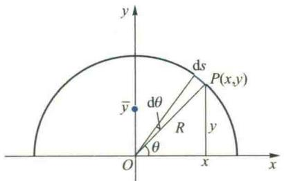
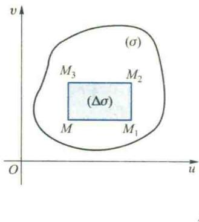
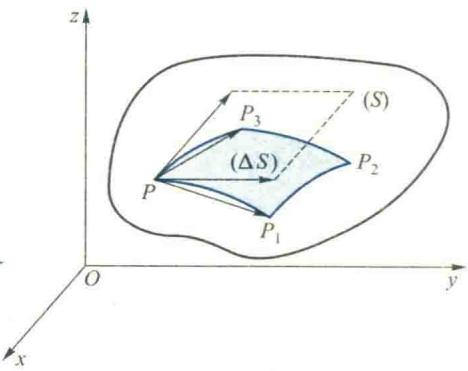
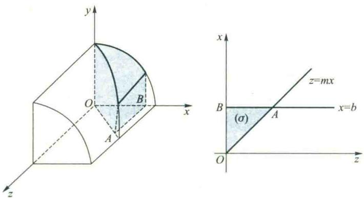

import QRCodeVideo from '@/components/QRCodeVideo.astro';

import Guide from '@/components/Guide.astro';
import Knowledge from '@/components/Knowledge.astro';
import Example from '@/components/Example.astro';
import Analysis from '@/components/Analysis.astro';
import Solution from '@/components/Solution.astro';
import Variant from '@/components/Variant.astro';
import Note from '@/components/Note.astro';
import Block from '@/components/Block.astro';
import Method from '@/components/Method.astro';
import Exercise from '@/components/Exercise.astro';

## 6.1 第一型线积分

在本章第一节中我们已通过和式的极限式(1.4)给出了点函数 $f(M)$ 在形体 $(\Omega)$ 上积分的定义.当 $(\Omega)$ 是平面或空间的可求长曲线段(C)时,相应的积分就分别是平面或空间曲线积分,即

$$
\int_ {(C)} f (x, y) \mathrm{d} s = \lim _ {d \rightarrow 0} \sum_ {k = 1} ^ {n} f (\xi_ {k}, \eta_ {k}) \Delta s _ {k},
$$

或

$$
\int_ {(C)} f (x, y, z) \mathrm{d} s = \lim _ {d \rightarrow 0} \sum_ {k = 1} ^ {n} f (\xi_ {k}, \eta_ {k}, \zeta_ {k}) \Delta s _ {k}.\tag{6.1}
$$

这里弧段长 $\Delta s_{k}$ 始终是正的, 换句话说, 曲线积分的值与积分路径 (C) 的方向无关, 我们把这种曲线积分称为对弧长的线积分, 也称为第一型线积分.

第一型线积分的计算公式 设有一有界的简单光滑空间曲线(C)，其参数方程为

$$
x = x (t), y = y (t), z = z (t) \quad (\alpha \leqslant t \leqslant \beta).\tag{6.2}
$$

若函数 $f(x,y,z)$ 在(C)上连续，则

$$
\int_ {(C)} f (x, y, z) \mathrm{d} s = \int_ {\alpha} ^ {\beta} f [ x (t), y (t), z (t) ] \sqrt {\dot {x} ^ {2} (t) + \dot {y} ^ {2} (t) + \dot {z} ^ {2} (t)} \mathrm{d} t.\tag{6.3}
$$

<Solution title="证明">
把区间 $[\alpha, \beta]$ 任意划分

$$
\alpha = t _ {0} <   t _ {1} <   t _ {2} <   \dots <   t _ {n} = \beta ,
$$

曲线(C)相应地被分割成 n 个小弧段, 设 $\left[t_{k-1}, t_{k}\right]$ 对应的小弧段为 $(\Delta s_{k})$ , 其弧长为 $\Delta s_{k}$ . 由弧长的计算公式可知

$$
\Delta s _ {k} = \int_ {t _ {k - 1}} ^ {t _ {k}} \sqrt {\dot {x} ^ {2} (t) + \dot {y} ^ {2} (t) + \dot {z} ^ {2} (t)} \mathrm{d} t.
$$

由于曲线 $(C)$ 光滑, 故被积函数 $\sqrt{\dot{x}^{2}(t)+\dot{y}^{2}(t)+\dot{z}^{2}(t)}$ 连续, 应用积分中值定理, 得

$$
\Delta s _ {k} = \sqrt {\dot {x} ^ {2} (\tau_ {k}) + \dot {y} ^ {2} (\tau_ {k}) + \dot {z} ^ {2} (\tau_ {k})} \Delta t _ {k}, \quad t _ {k - 1} \leqslant \tau_ {k} \leqslant t _ {k}.\tag{6.4}
$$

令

$$
x (\tau_ {k}) = \xi_ {k}, \quad y (\tau_ {k}) = \eta_ {k}, \quad z (\tau_ {k}) = \zeta_ {k},\tag{6.5}
$$

显然，点 $M_{k}(\xi_{k},\eta_{k},\zeta_{k})$ 应位于小弧段 $(\Delta s_k)$ 上，作和式

$$
\begin{array}{l} \sum_ {k = 1} ^ {n} f (\xi_ {k}, \eta_ {k}, \zeta_ {k}) \Delta s _ {k} \\ = \sum_ {k = 1} ^ {n} f [ x (\tau_ {k}), y (\tau_ {k}), z (\tau_ {k}) ] \sqrt {\dot {x} ^ {2} (\tau_ {k}) + \dot {y} ^ {2} (\tau_ {k}) + \dot {z} ^ {2} (\tau_ {k})} \Delta t _ {k}, \end{array}\tag{6.6}
$$

由于被积函数f在积分路径(C)上连续,故第一型线积分 $\int_{(C)}f(x,y,z)\mathrm{d}s$ 存在,即无论对(C)如何划分,无论点 $M_{k}$ 在 $(\Delta s_{k})$ 上如何选取,当 $(\Delta s_{k})(k=1,2,\cdots)$ 的直径的最大者 $d\to0$ 时,(6.6)式左端和式都趋于同一值.因而对用(6.5)式特别选取的点 $M_{k}$ ,也必有

$$
\int_ {(C)} f (x, y, z) \mathrm{d} s = \lim _ {d \to 0} \sum_ {k = 1} ^ {n} f (\xi_ {k}, \eta_ {k}, \zeta_ {k}) \Delta s _ {k}.
$$

另一方面，由于 $f[x(t),y(t),z(t)]\cdot \sqrt{\dot{x}^2(t) + \dot{y}^2(t) + \dot{z}^2(t)}$ 在区间 $[\alpha ,\beta ]$ 上连续，由定积分的定义和存在定理可知

$\lim_{d\to 0}\sum_{k = 1}^{n}f[x(\tau_k),y(\tau_k),z(\tau_k)]\cdot$ $\sqrt{\dot{x}^2(\tau_k) + \dot{y}^2(\tau_k) + \dot{z}^2(\tau_k)}\Delta t_k$ $= \int_{\alpha}^{\beta}f[x(t),y(t),z(t)]\sqrt{\dot{x}^2(t) + \dot{y}^2(t) + \dot{z}^2(t)}\mathrm{d}t.$ 所以公式(6.3)成立.

公式(6.3)表明,在计算第一型线积分 $\int_{(C)}f(x,y,z)ds$ 时,可以把弧长微元ds看作是弧微分,把弧微分公式与积分路径(C)的参数方程代入被积表达式,然后去计算所得的定积分即可.由于弧长 $\Delta s_{k}$ 总是正的,所以定积分的上限必须大于下限.
</Solution>

<Example title="例 6.1">
计算线积分 $I=\int_{(C)}\left(x^{2}+y^{2}+z^{2}\right)\mathrm{d}s$ ，其中 $(C)$ 为螺旋线 $x=a\cos t, y=a\sin t, z=kt$ 上相应于 $0 \leqslant t \leqslant 2\pi$ 的一段弧.

<Solution title="解">
由公式(6.3)得注意:为了把(6.1)式右端化成定积分,我们利用积分中值定理,将(6.1)中的 $\Delta s_{k}$ 化为(6.4)式.点 $(\xi_{k},\eta_{k},\zeta_{k})$ 在曲线(C)上,应由(C)的参数方程(6.2)中的参数 $t_{k}$ 来确定.将它们代入(6.1)式右端后,为了使所得的关于t的定积分和式中的 $t_{k}$ 与积分中值定理所确定的 $\tau_{k}$ 一致,我们由(6.5)式将 $(\xi_{k},\eta_{k},\zeta_{k})$ 选取为由 $\tau_{k}$ 在(C)上所确定的特殊点.然而这样一来就破坏了线积分定义中所要求 $(\xi_{k},\eta_{k},\zeta_{k})$ 的任意性,以及定积分定义中要求 $\tau_{k}$ 的任意性.但是由于函数f的连续性和曲线(C)的光滑性,得证了线积分与定积分均存在.因此,这种特殊选取是合理的.
</Solution>
</Example>

<Note>
在第一型线积分的定义(6.1)中,ds最初仅是一个记号,并无明确的含义.在证明了计算公式(6.3)后才看到,可以把ds作为积分路径(C)的弧微分.

$$
I = \int_ {0} ^ {2 \pi} (a ^ {2} + k ^ {2} t ^ {2}) \sqrt {a ^ {2} + k ^ {2}} \mathrm{d} t = \frac {2}{3} \pi \sqrt {a ^ {2} + k ^ {2}} (3 a ^ {2} + 4 \pi^ {2} k ^ {2}).
$$
</Note>

<Example title="例 6.2">
求 $I=\int_{(C)}y\mathrm{d}s$ ，其中 $(C)$ 为抛物线 $y^{2}=2x$ 上介于 $(2,-2)$ 与 $(2,2)$ 两点间的线段.

<Solution title="解">
I 是平面上的第一型线积分,选择 y 为积分变量,把积分路径的方程 $y^{2}=2x$ 看作是以 y 为参数的参数方程: $x=\frac{1}{2}y^{2}, y=y$ . 由公式(6.3)得
</Solution>
</Example>

<Note>
实际上,注意到积分路径(C)是关于x轴对称的,而被积函数又是y的奇函数,立即可知题中线积分之值为零.

$$
I = \int_ {- 2} ^ {2} y \sqrt {1 + \left(\frac {\mathrm{d} x}{\mathrm{d} y}\right) ^ {2}} \mathrm{d} y = \int_ {- 2} ^ {2} y \sqrt {1 + y ^ {2}} \mathrm{d} y = 0.
$$
</Note>

<Example title="例 6.3">
计算线积分 $I = \oint_{(C)} (x^2 + y^2 + 2z) \, \mathrm{d}s$ ，其中 $(C)$ 为

$$
\left\{ \begin{array}{l} x ^ {2} + y ^ {2} + z ^ {2} = a ^ {2}, \\ x + y + z = 0. \end{array} \right.
$$

<Solution title="解">
由于曲线(C)的方程具有轮换对称性,故

$$
\oint_ {(C)} x ^ {2} \mathrm{d} s = \oint_ {(C)} y ^ {2} \mathrm{d} s = \oint_ {(C)} z ^ {2} \mathrm{d} s,
$$
</Solution>
</Example>

<Note>
对于第一型线积分,与重积分类似,同样可利用对称性简化其计算.

从而

$$
\oint_ {(C)} \left(x ^ {2} + y ^ {2}\right) \mathrm{d} s = \frac {2}{3} \oint_ {(C)} \left(x ^ {2} + y ^ {2} + z ^ {2}\right) \mathrm{d} s = \frac {2}{3} \oint_ {(C)} a ^ {2} \mathrm{d} s = \frac {2}{3} a ^ {2} \cdot 2 \pi a = \frac {4}{3} \pi a ^ {3}.
$$

又由于 $(C)$ 关于坐标原点对称，而 $\oint_{(C)} 2z\mathrm{d}s$ 中的被积函数关于 $x, y$ 和 $z$ 为奇函数，故

$$
\oint_ {(C)} 2 z \mathrm{d} s = 0,
$$

于是

$$
I = \frac {4}{3} \pi a ^ {3}. \quad \text {   II   }
$$
</Note>

<Example title="例 6.4 柱面的侧面积">
设椭圆柱面 $\frac{x^{2}}{5} + \frac{y^{2}}{9} = 1$ 被平面 z = y 与 z = 0 所截, 求位于第一、二卦限内所截下部分的侧面积 A (图 6.44).

<Solution title="解">
此椭圆柱面的准线是 xOy 平面上的半个椭圆(C):

$$
\frac {x ^ {2}}{5} + \frac {y ^ {2}}{9} = 1 (y \geqslant 0).
$$

对(C)进行划分,运用积分的微元法,在弧微元 ds 上的一小片柱面面积可近似地看作是以 ds 为底,以截线 L 上点 M 的竖坐标 z=y 为高的长方形面积,从而得侧面积微元

  
图6.44

$$
\mathrm{d} A = y \mathrm{d} s,
$$

于是所求侧面积为

$$
A = \int_ {(C)} y \mathrm{d} s.
$$

把 $(C)$ 的方程化成参数方程

$$
x = \sqrt {5} \cos t, y = 3 \sin t (0 \leqslant t \leqslant \pi),
$$

所以

$$
\begin{array}{r l} A & = \int_ {(C)} y \mathrm{d} s = \int_ {0} ^ {\pi} 3 \sin t \sqrt {5 \sin^ {2} t + 9 \cos^ {2} t} \mathrm{d} t \\ & = - 3 \int_ {0} ^ {\pi} \sqrt {5 + 4 \cos^ {2} t} \mathrm{d} (\cos t) = 9 + \frac {1 5}{4} \ln 5. \end{array}
$$
</Solution>
</Example>

<Example title="例 6.5">
设有一半圆形的金属丝,物质均匀分布,求它的质心和对直径的转动惯量.

  
图6.45

<Solution title="解">
选取坐标系如图 6.45 所示. 设圆半径为 R, 金属丝线密度为 $\mu$ , 由对称性可知质心的横坐标 $\bar{x}=0$ . 任意划分半圆弧 (C), 易见, 弧微元 ds 所对应的金属丝对 x 轴的静矩微元为

$$
\mathrm{d} M _ {x} = y \mathrm{d} m = \mu y \mathrm{d} s,
$$

从而

$$
M _ {x} = \int_ {(C)} \mu y \mathrm{d} s.
$$

(C)以极角 $\theta$ 为参数的参数方程为

$$
x = R \cos \theta , \quad y = R \sin \theta \quad (0 \leqslant \theta \leqslant \pi),
$$

于是

$$
M _ {x} = \mu \int_ {0} ^ {\pi} R ^ {2} \sin \theta \mathrm{d} \theta = 2 \mu R ^ {2}.
$$

半圆的质量显然为 $m=\pi R\mu$ ，所以质心的纵坐标为

$$
\overline {{{y}}} = \frac {M _ {x}}{m} = \frac {2 \mu R ^ {2}}{\pi R \mu} = \frac {2 R}{\pi}.
$$
</Solution>
</Example>

<Note>
这里 ds 可通过(C)的参数方程计算弧微分得到

$$
\mathrm{d} s = \sqrt {R ^ {2} (- \sin \theta) ^ {2} + R ^ {2} \cos^ {2} \theta} \mathrm{d} \theta = R \mathrm{d} \theta ,
$$

ds 段金属丝对直径(即 x 轴)的转动惯量, 即转动惯量微元为

也可以更简单地利用求圆弧的公式直接从图 6.45 得到.

$$
\mathrm{d} I _ {x} = y ^ {2} \mathrm{d} m = \mu y ^ {2} \mathrm{d} s,
$$

从而金属丝对其直径的转动惯量为

$$
I _ {x} = \mu \int_ {(C)} y ^ {2} \mathrm{d} s = \mu \int_ {0} ^ {\pi} R ^ {3} \sin^ {2} \theta \mathrm{d} \theta = \frac {\mu \pi R ^ {3}}{2} = \frac {m}{2} R ^ {2},
$$

其中 $m=\mu\pi R$ 是金属丝的质量.
</Note>

## 6.2 第一型面积分

正像线积分要以弧长为基础一样,面积分需要以曲面面积为基础.

1. 曲面的面积

设在 $R^{3}$ 空间有一曲面(S)，其参数方程为

$$
\boldsymbol {r} = \boldsymbol {r} (u, v) = (x (u, v), y (u, v), z (u, v)), (u, v) \in (\sigma) \subseteq \mathbf {R} ^ {2}.\tag{6.7}
$$

从几何上看,曲面(S)是uOv参数平面上的区域( $\sigma$ )在映射r下的像.

我们用微元法来讨论曲面的面积.设向量值函数 $r(u,v)$ 在 $(\sigma)$ 上连续可微，且

$$
\boldsymbol {r} _ {u} \times \boldsymbol {r} _ {v} \neq 0.
$$

在 uOv 参数平面上, 用坐标线 $u=c_{1}$ 和 $v=c_{2}$ 把域 ( $\sigma$ ) 划分成若干小矩形, 考察其中一个以点 $M(u,v)$ , $M_{1}(u+\Delta u,v)$ , $M_{2}(u+\Delta u,v+\Delta v)$ , $M_{3}(u,v+\Delta v)$ 为顶点的小矩形 ( $\Delta\sigma$ ) ( $\Delta u>0, \Delta v>0$ ) (图 6.46(a)). 设在映射注：所设条件保证了在 $(\sigma)$ 上曲面 $S$ 的光滑性，即有连续转动的切平面；同时，也保证了 $r_{ij}$ 与 $r_i$ 均在 $(\sigma)$ 上是处处非零的向量.

r 下, $M, M_{1}, M_{2}, M_{3}$ 的像点分别为曲面 S 上的点 $P, P_{1}, P_{2}, P_{3}$ ，于是映射 r 把 $(\Delta\sigma)$ 映射成由曲面上的曲边四边形 $PP_{1}P_{2}P_{3}$ 所围成的 $(\Delta S)$ （图 6.46(b)）。容易看出，向量

$$
\begin{array}{r l} & \overrightarrow {P P _ {1}} = r (u + \Delta u, v) - r (u, v) = r _ {u} \Delta u + o (\rho) \approx r _ {u} \Delta u, \\ & \overrightarrow {P P _ {3}} = r (u, v + \Delta v) - r (u, v) = r _ {v} \Delta v + o (\rho) \approx r _ {v} \Delta v, \end{array}
$$

  
(a)

  
图6.46  
(b)

其中 $\rho=\sqrt{\Delta u^{2}+\Delta v^{2}}.r_{u}\Delta u$ 与 $r_{v}\Delta v$ 分别为曲面 S 上过点 $P(u,v)$ 的弧段 $\widehat{PP}_{1}$ 和弧段 $\widehat{PP}_{3}$ 相应的切向量，它们都位于曲面 S 在点 P 的切平面上。当 $\Delta u$ 与 $\Delta v$ 都很小时，以此两切向量为邻边所构成的平行四边形面积显然可作为 $(\Delta S)$ 面积 $\Delta S$ 的近似值，即

<Note>
容易看出, $\|r_{u}\Delta u\|$ 就是 $\|\overrightarrow{PP_{1}}\|$ 关于 $\Delta u$ 的线性主部,而且通过求弧长 $\widehat{PP_{1}}$ 的公式,利用积分中值定理和被积函数的连续性,不难证明它也是弧长 $\widehat{PP_{1}}$ 的线性主部.

$$
\Delta S \approx \| \boldsymbol {r} _ {u} \Delta u \times \boldsymbol {r} _ {u} \Delta v \| = \| \boldsymbol {r} _ {u} \times \boldsymbol {r} _ {v} \| \Delta u \Delta v.
$$

由此可知曲面面积微元

$$
\mathrm{d} S = \left\| \boldsymbol {r} _ {u} \times \boldsymbol {r} _ {v} \right\| \mathrm{d} u \mathrm{d} v,\tag{6.8}
$$

从而曲面(S)的面积为

$$
S = \iint_ {(\sigma)} \| \boldsymbol {r} _ {u} \times \boldsymbol {r} _ {v} \| \mathrm{d} u \mathrm{d} v.\tag{6.9}
$$
</Note>

<Example title="例 6.6">
求半径为 a 的球面面积.

<Solution title="解">
由第五章例 6.6 可知, 此球面的参数方程为

$$
\begin{array}{r l} \boldsymbol {r} (\varphi , \theta) & = (a \sin \varphi \cos \theta , a \sin \varphi \sin \theta , a \cos \varphi), \\ (\varphi , \theta) & \in D = [ 0, \pi ] \times [ 0, 2 \pi ]. \end{array}
$$

<QRCodeVideo id="6.6.1" title="曲面面积微元与微分的关系." url="HTTP://2D.HEP.CN/1254052/25" />

由于

$$
\begin{array}{l} {\pmb {r} _ {\varphi} = (a \cos \varphi \cos \theta , a \cos \varphi \sin \theta , - a \sin \varphi),} \\ {\pmb {r} _ {\theta} = (- a \sin \varphi \sin \theta , a \sin \varphi \cos \theta , 0).} \end{array}
$$

经计算可知

$$
\left\| \boldsymbol {r} _ {\varphi} \times \boldsymbol {r} _ {\theta} \right\| = a ^ {2} \sin \varphi .
$$

于是由公式(6.9)可知

$$
S = \iint_ {(\sigma)} a ^ {2} \sin \varphi \mathrm{d} \varphi \mathrm{d} \theta = \int_ {0} ^ {2 \pi} \mathrm{d} \theta \int_ {0} ^ {\pi} a ^ {2} \sin \varphi \mathrm{d} \varphi = 4 \pi a ^ {2}. \quad I
$$

若曲面 S 的方程由直角坐标给出: $z = z(x, y)$ , $(x, y) \in (\sigma)$ ，将 x 与 y 视为参数，此曲面的向量方程可写成

$$
\boldsymbol {r} = \boldsymbol {r} (x, y) = (x, y, f (x, y)),
$$

从而

$$
\boldsymbol {r} _ {x} = (1, 0, f _ {x}), \quad \boldsymbol {r} _ {y} = (0, 1, f _ {y}),
$$

而

$$
\mathrm{d} S = \left\| \boldsymbol {r} _ {x} \times \boldsymbol {r} _ {y} \right\| \mathrm{d} x \mathrm{d} y = \left\| \left| \begin{array}{c c c} \boldsymbol {i} & \boldsymbol {j} & \boldsymbol {k} \\ 1 & 0 & f _ {x} \\ 0 & 1 & f _ {y} \end{array} \right| \right\| \mathrm{d} x \mathrm{d} y = \sqrt {1 + f _ {x} ^ {2} + f _ {y} ^ {2}} \mathrm{d} x \mathrm{d} y,\tag{6.10}
$$

代入公式(6.9)，得

$$
S = \iint_ {(\sigma)} \| \boldsymbol {r} _ {x} \times \boldsymbol {r} _ {y} \| \mathrm{d} x \mathrm{d} y = \iint_ {(\sigma)} \sqrt {1 + f _ {x} ^ {2} + f _ {y} ^ {2}} \mathrm{d} x \mathrm{d} y.\tag{6.11}
$$
</Solution>
</Example>

<Note>
意到 $n=r_{x}\times r_{y}=-f_{x}i-f_{y}j+k$ 是曲面(S)在点 $P_{0}$ 处的一个法向量,它的第三方向余弦为

$$
\cos \gamma = \frac {1}{\sqrt {1 + f _ {x} ^ {2} + f _ {y} ^ {2}}},
$$

其中 $\gamma$ 是 n 与 z 轴的夹角, 于是由 (6.10) 式可知

$$
\mathrm{d} S \cdot \frac {1}{\sqrt {1 + f _ {x} ^ {2} + f _ {y} ^ {2}}} = \mathrm{d} S \cdot \cos \gamma = \mathrm{d} x \mathrm{d} y = \mathrm{d} \sigma_ {x y}.\tag{6.12}
$$

所以,我们说面积微元 $\mathrm{d}x\mathrm{d}y(=\mathrm{d}\sigma_{xy})$ 就是曲面面积微元 dS 在 xOy 坐标面上的投影.或者说,曲面面积微元 dS 是位于曲面 S 的切平面上,且它在 xOy 平面上的投影为 $\mathrm{d}\sigma_{xy}$ 的那一块面积.
</Note>

<Note>
公式(6.11)仅适用于由函数 $z=f(x,y)$ 所表示的曲面, 即这时曲面在 $(\sigma_{xy})$ 上关于 z 是单值的. 而公式(6.9)所适用的曲面具有一般性.

当曲面 $S$ 可用方程

$$
y = f (z, x)  , (z, x)   \in   (\sigma_ {z x}) \quad \text {或} \quad x = f (y, z)  , (y, z)   \in   (\sigma_ {y z})
$$

表示时,相应的曲面面积公式分别为

$$
S = \iint_ {(\sigma_ {z})} \sqrt {1 + f _ {z} ^ {2} + f _ {x} ^ {2}}   \mathrm{d} z \mathrm{d} x \quad \text {或} \quad S = \iint_ {(\sigma_ {z})} \sqrt {1 + f _ {y} ^ {2} + f _ {z} ^ {2}}   \mathrm{d} y \mathrm{d} z.\tag{6.13}
$$
</Note>

<Example title="例 6.7">
求圆柱面 $x^{2}+y^{2}=a^{2}$ 在第一卦限中被平面 z=0, z=mx (m>0), x=b (b&lt;a) 所截下部分的面积(图 6.47).

  
图6.47

<Solution title="解">
将所求部分曲面向 xOz 平面投影, 曲面的方程可写成

$$
y = \sqrt {a ^ {2} - x ^ {2}}, (x, z) \in (\sigma),
$$

其中 $(\sigma) = \{(x,z) | 0 \leqslant x \leqslant b, 0 \leqslant z \leqslant mx\}$ . 于是

$$
\sqrt {1 + y _ {x} ^ {2} + y _ {z} ^ {2}} = \sqrt {1 + \left(\frac {- x}{y}\right) ^ {2}} = a (a ^ {2} - x ^ {2}) ^ {- 1 / 2},
$$

从而由公式(6.13)，得

$$
\begin{array}{r l} S & = \iint_ {(\sigma)} a (a ^ {2} - x ^ {2}) ^ {- 1 / 2} \mathrm{d} z \mathrm{d} x = \int_ {0} ^ {b} \mathrm{d} x \int_ {0} ^ {m x} a (a ^ {2} - x ^ {2}) ^ {- 1 / 2} \mathrm{d} z \\ & = \int_ {0} ^ {b} a m x (a ^ {2} - x ^ {2}) ^ {- 1 / 2} \mathrm{d} x = a ^ {2} m - a m \sqrt {a ^ {2} - b ^ {2}}. \end{array}
$$
</Solution>
</Example>

### 2. 第一型面积分的计算

现在,在曲面面积的基础上来解决第一型面积分的计算问题.在本章第一节中我们已经知道,当几何形体( $\Omega$ )为一曲面(S)时,相应的积分就是第一型面积分,即

$$
\iint_ {(S)} f (x, y, z) \mathrm{d} S = \lim _ {d \rightarrow 0} \sum_ {k = 1} ^ {n} f (\xi_ {k}, \eta_ {k}, \zeta_ {k}) \Delta S _ {k}.
$$

用类似于第一型线积分计算公式的证明方法，可以证明：如果 $f(x,y,z)$ 在有界光滑曲面(S)上连续，(S)的方程为注：容易看出当曲面(S)是坐标平面上一块平面时，第一型的积分就退化为二重积分.

$$
\boldsymbol {r} = \boldsymbol {r} (u, v) = x (u, v) \boldsymbol {i} + y (u, v) \boldsymbol {j} + z (u, v) \boldsymbol {k}, \quad (u, v) \in (\sigma),
$$

那么 $f$ 在 $(S)$ 上的第一型面积分的计算公式为

$$
\iint_ {(S)} f (x, y, z) \mathrm{d} S = \iint_ {(\sigma)} f [ x (u, v), y (u, v), z (u, v) ] \| \boldsymbol {r} _ {u} \times \boldsymbol {r} _ {v} \| \mathrm{d} u \mathrm{d} v.\tag{6.14}
$$

公式(6.14)可以这样来理解：由于被积函数f沿曲面(S)变化，因而积分变量x,y,z应受曲面(S)方程的约束。把dS视为曲面面积微元，将曲面参数方程(6.7)与微元表达式(6.8)代入(6.14)式的左端，注意到当点 $(x,y,z)$ 在(S)上变化时，参数 $(u,v)$ 相应的变化区域为 $(\sigma)$ ，便可得到公式(6.14)的右端。

<Note>
与第一型线积分类似,第一型面积分定义中的dS最初只是一个记号,并无明确的含义.仅当导出了计算公式(6.14)之后,才看到可以把dS看作是曲面面积微元,即 $dS=\|\boldsymbol{r}_{u}\times\boldsymbol{r}_{v}\| \mathrm{d}u\mathrm{d}v$ .

若(S)的方程为 $z=z(x,y),(x,y)\in(\sigma)$ ，则(6.14)式可写成

$$
\iint_ {(S)} f (x, y, z) \mathrm{d} S = \iint_ {(\sigma)} f [ x, y, z (x, y) ] \sqrt {1 + z _ {x} ^ {2} + z _ {y} ^ {2}} \mathrm{d} x \mathrm{d} y.\tag{6.15}
$$
</Note>

<Example title="例 6.8">
计算 $\iint_{(S)} z \, \mathrm{d}S$ ，其中曲面 (S) 是圆锥面 $z = \sqrt{x^{2} + y^{2}}$ 上介于平面 z = 1 与 z = 2 间的部分.

<Solution title="解">
容易看出曲面(S)在 xOy 平面上的投影区域为

$$
(\sigma) = \{(x, y) | 1 \leqslant x ^ {2} + y ^ {2} \leqslant 4 \},
$$

于是由公式(6.15)可知

$$
\begin{array}{r l} \iint_ {(S)} z \mathrm{d} S & = \iint_ {(\sigma)} \sqrt {x ^ {2} + y ^ {2}} \sqrt {1 + \frac {x ^ {2}}{x ^ {2} + y ^ {2}} + \frac {y ^ {2}}{x ^ {2} + y ^ {2}}} \mathrm{d} x \mathrm{d} y \\ & = \sqrt {2} \iint_ {(\sigma)} \rho \cdot \rho \mathrm{d} \rho \mathrm{d} \theta = \sqrt {2} \int_ {0} ^ {2 \pi} \mathrm{d} \theta \int_ {1} ^ {2} \rho^ {2} \mathrm{d} \rho = \frac {1 4}{3} \sqrt {2} \pi . \end{array}
$$
</Solution>
</Example>

<Example title="例 6.9">
计算面积分 $I = \iint_{(S)} (ax + by + cz + d)^2 \, \mathrm{d}S$ ，其中(S)为球面 $x^2 + y^2 + z^2 = a^2$ .

<Solution title="解">
为了利用对称性,将被积函数展开,得

$$
\begin{array}{r l} I & = a ^ {2} \iint_ {(S)} x ^ {2} \mathrm{d} S + b ^ {2} \iint_ {(S)} y ^ {2} \mathrm{d} S + c ^ {2} \iint_ {(S)} z ^ {2} \mathrm{d} S + 2 a b \iint_ {(S)} x y \mathrm{d} S + 2 b c \iint_ {(S)} y z \mathrm{d} S + \\ & 2 a c \iint_ {(S)} z x \mathrm{d} S + 2 a d \iint_ {(S)} x \mathrm{d} S + 2 b d \iint_ {(S)} y \mathrm{d} S + 2 c d \iint_ {(S)} z \mathrm{d} S + \iint_ {(S)} d ^ {2} \mathrm{d} S. \end{array}
$$

由于球面关于 $xOy$ 平面对称，而上式右端第五、六、九三个积分中的被积函数关于 $z$ 为奇函数，从而这三个积分的值均为零；又由于球面也关于 $zOx$ 平面对称，而上式右端第四、八两个积分的被积函数关于 $y$ 为奇函数，从而这两个积分的值也为零。再利用球面关于 $yOz$ 平面对称可知第七个积分的值也为零。于是

$$
I = a ^ {2} \iint_ {(S)} x ^ {2} \mathrm{d} S + b ^ {2} \iint_ {(S)} y ^ {2} \mathrm{d} S + c ^ {2} \iint_ {(S)} z ^ {2} \mathrm{d} S + d ^ {2} \iint_ {(S)} \mathrm{d} S.
$$

由于球面(S)具有轮换对称性,可知

$$
\iint_ {(S)} x ^ {2} \mathrm{d} S = \iint_ {(S)} y ^ {2} \mathrm{d} S = \iint_ {(S)} z ^ {2} \mathrm{d} S = \frac {1}{3} \iint_ {(S)} (x ^ {2} + y ^ {2} + z ^ {2}) \mathrm{d} S,
$$

于是

$$
\begin{array}{r l} a ^ {2} \iint_ {(S)} x ^ {2} \mathrm{d} S + b ^ {2} \iint_ {(S)} y ^ {2} \mathrm{d} S + c ^ {2} \iint_ {(S)} z ^ {2} \mathrm{d} S & = \frac {1}{3} (a ^ {2} + b ^ {2} + c ^ {2}) \iint_ {(S)} (x ^ {2} + y ^ {2} + z ^ {2}) \mathrm{d} S \\ & = \frac {1}{3} (a ^ {2} + b ^ {2} + c ^ {2}) a ^ {2} \iint_ {(S)} \mathrm{d} S = \frac {1}{3} (a ^ {2} + b ^ {2} + c ^ {2}) 4 \pi a ^ {4}, \end{array}
$$

易见

$$
d ^ {2} \iint_ {(S)} \mathrm{d} S = 4 \pi a ^ {2} d ^ {2},
$$

因此

$$
I = \frac {4}{3} \pi a ^ {4} (a ^ {2} + b ^ {2} + c ^ {2}) + 4 \pi a ^ {2} d ^ {2}.
$$
</Solution>
</Example>

<Example title="例 6.10">
物质均匀分布且半径为 R 的球缺面如图 6.48 所示, 求其质心坐标.

<Solution title="解">
为了将球面用参数方程表示,选取 $\varphi$ 与 $\theta$ 为参数,则所给球缺面的参数方程

$$
\begin{array}{l} {x = R \sin \varphi \cos \theta , \quad y = R \sin \varphi \sin \theta ,} \\ {z = R \cos \varphi , \quad 0 \leqslant \varphi \leqslant \frac {3 \pi}{4}, \quad 0 \leqslant \theta \leqslant 2 \pi ,} \end{array}
$$

或

$$
\boldsymbol {r} = \boldsymbol {r} (\varphi , \theta) = (R \sin \varphi \cos \theta , R \sin \varphi \sin \theta , R \cos \varphi),
$$

图6.48

$$
0 \leqslant \varphi \leqslant \frac {3 \pi}{4}, 0 \leqslant \theta \leqslant 2 \pi .
$$

由对称性可知,质心应位于z轴上.在所给球缺面上任取一点 $P(x,y,z)$ ，含点P的曲面面积微元dS上的质量关于xOy平面的静矩微分

$$
\mathrm{d} M _ {x y} = z \mu \mathrm{d} S,
$$

其中常数 $\mu$ 是面密度.于是所给球缺面对 xOy 平面的静矩为

$$
M _ {x y} = \mu \iint_ {(S)} z \mathrm{d} S = \mu \iint_ {(\sigma)} R \cos \varphi \| \boldsymbol {r} _ {\varphi} \times \boldsymbol {r} _ {\theta} \| \mathrm{d} \varphi \mathrm{d} \theta ,
$$

其中参数 $(\varphi,\theta)$ 的变化区域为

$$
(\sigma) = \left\{(\varphi , \theta) \mid 0 \leqslant \varphi \leqslant \frac {3 \pi}{4}, 0 \leqslant \theta \leqslant 2 \pi \right\}.
$$

容易算得

$$
\left\| \boldsymbol {r} _ {\varphi} \times \boldsymbol {r} _ {\theta} \right\| = R ^ {2} \sin \varphi ,
$$

于是

$$
M _ {x y} = \mu \iint_ {(\sigma)} R ^ {3} \sin \varphi \cos \varphi \mathrm{d} \varphi \mathrm{d} \theta = \mu R ^ {3} \int_ {0} ^ {2 \pi} \mathrm{d} \theta \int_ {0} ^ {\frac {3 \pi}{4}} \sin \varphi \cos \varphi \mathrm{d} \varphi = \frac {\pi}{2} \mu R ^ {3}.
$$

由公式(6.9)可得此球缺面的质量为

$$
M = \mu \iint_ {(\sigma)} R ^ {2} \sin \varphi \mathrm{d} \varphi \mathrm{d} \theta = \mu R ^ {2} \int_ {0} ^ {2 \pi} \mathrm{d} \theta \int_ {0} ^ {\frac {3 \pi}{4}} \sin \varphi \mathrm{d} \varphi = (2 + \sqrt {2}) \pi \mu R ^ {2}.
$$

所以球缺面质心的 z 坐标为

$$
\bar {z} = \frac {M _ {x y}}{M} = \frac {R}{2 (2 + \sqrt {2})},
$$

从而得知质心的坐标为 $\left(0,0,\frac{R}{2(2 + \sqrt{2})}\right)$
</Solution>
</Example>

<Block title="习题6.6">
**（A）**

1. 计算下列第一型线积分：

(1) $\int_{(C)} y \mathrm{~ds}, (C)$ 为抛物线 $y^{2} = 2x$ 上由点 $(0,0)$ 到点 $(2,2)$ 的弧段；

(2) $\int_{(C)} (x^2 + y^2)^n \, \mathrm{d}s, (C)$ 为圆周 $x^2 + y^2 = a^2$ ( $a > 0$ );

(3) $\int_{(C)} z \mathrm{d}s, (C)$ 为圆锥螺线 $x = t \cos t, y = t \sin t, z = t$ ( $0 \leqslant t \leqslant t_0$ );

(4) $\int_{(C)}(x+y)\mathrm{d}s,(C)$ 为以 $(0,0),(1,0)$ 和 $(0,1)$ 为顶点的三角形的边界；

(5) $\oint_{(C)} x^{2} \mathrm{d}s, (C)$ 为圆周 $\left\{ \begin{array}{l} x^{2} + y^{2} + z^{2} = 4, \\ z = \sqrt{3}; \end{array} \right.$

(6) $\oint_{(C)} |y| \, \mathrm{d}s, (C)$ 为球面 $x^{2} + y^{2} + z^{2} = 2$ 与平面 $x = y$ 的交线.

2. 试导出用极坐标方程 $\rho = \rho (\theta)(\alpha \leqslant \theta \leqslant \beta)$ 表示的曲线（C）的线积分计算公式：

$$
\int_ {(C)} f (x, y) \mathrm{d} s = \int_ {\alpha} ^ {\beta} f (\rho (\theta) \cos \theta , \rho (\theta) \sin \theta) \sqrt {\rho^ {2} (\theta) + \rho^ {\prime 2} (\theta)} \mathrm{d} \theta .
$$

3. 计算下列线积分：

(1) $\int_{(C)} \sqrt{x} \mathrm{d}s, (C)$ 为抛物线 $y = \sqrt{x}$ 上从点 $(0,0)$ 到点 $(1,1)$ 的一段弧；

(2) $\oint_{(C)} \sqrt{x^2 + y^2} \, \mathrm{d}s$ , (C) 为圆周 $x^2 + y^2 = ax$ ( $a > 0$ );

(3) $\oint_{(C)} |y| \, \mathrm{d}s, (C)$ 为双纽线 $(x^2 + y^2)^2 = a^2(x^2 - y^2) (a > 0)$ .

4. 有一铁丝成半圆形 $x = a\cos t, y = a\sin t$ ( $0 \leqslant t \leqslant \pi$ ), 其上每一点的密度等于该点的纵坐标, 求铁丝的质量.

5. 计算圆柱面 $x^{2}+y^{2}=R^{2}$ 介于 xOy 平面及柱面 $z=R+\frac{x^{2}}{R}$ 之间的一块面积, 其中 R>0.

6. 设螺旋线 $x = a\cos \theta, y = a\sin \theta, z = k\theta$ （ $0 \leqslant \theta \leqslant 2\pi$ ）上物质的线密度为 $\rho(x, y, z) = x^2 + y^2 + z^2$ ，求：

(1) 它关于 z 轴的转动惯量；

(2) 它的质心.

7. 求曲面 $z = \sqrt{x^{2} + y^{2}}$ 包含在圆柱面 $x^{2} + y^{2} = 2x$ 内那一部分的面积.

8. 求地球上由经线 $\varphi=30^{\circ},\varphi=60^{\circ}$ 和纬线 $\theta=45^{\circ},\theta=60^{\circ}$ 所围那部分的面积（把地球近似看成是半径 $R=6.4\times10^{6}$ m 的球）.

9. 求下列平面曲线所构成的旋转面的面积：

(1) 星形线 $x^{2/3} + y^{2/3} = a^{2/3}$ 绕 y 轴；

(2) 圆周 $x^{2}+y^{2}=a^{2}$ 被直线 $y=\frac{a}{\sqrt{2}}$ 截下的劣弧绕 $y=\frac{a}{\sqrt{2}}$ .

10. 计算下列第一型面积分：

(1) $\iint_{(S)}\left(2x + \frac{4}{3} y + z\right)\mathrm{d}S,(S)$ 为平面 $\frac{x}{2} +\frac{y}{3} +\frac{z}{4} = 1(x\geqslant 0,y\geqslant 0,z\geqslant 0);$

(2) $\iint_{(S)} (x^2 + y^2) \, \mathrm{d}S, (S)$ 为区域 $(G) = \{(x, y, z) | \sqrt{x^2 + y^2} \leqslant z \leqslant 1\}$ 的边界曲面；

(3) $\iint_{(S)} (x + y + z) \mathrm{d} S, (S)$ 为上半球面 $z = \sqrt{a^2 - x^2 - y^2}$ ;

(4) $\iint_{(S)} \sqrt{R^2 - x^2 - y^2} \, \mathrm{d}S$ , (S) 为上半球面 $z = \sqrt{R^2 - x^2 - y^2}$ ;

(5) $\iint_{(S)} \frac{\mathrm{d} S}{r^2}, (S)$ 为圆柱面 $x^{2} + y^{2} = R^{2}$ 介于平面 $z = 0$ 及 $z = H (H > 0)$ 之间的部分, $r$ 为 $(S)$ 上的点到原点的距离;

(6) $\oiint_{(S)} \frac{1}{(1 + x + y)^2} \mathrm{d}S, (S)$ 是以 $(0,0,0), (1,0,0), (0,1,0), (0,0,1)$ 为顶点的四面体的边界面；

(7) $\iint_{(S)} |xyz| \, \mathrm{d}S, (S)$ 为曲面 $z = x^2 + y^2$ 在平面 $z = 1$ 下面的部分；

(8) $\iint_{(S)} (xy + yz + zx) \, \mathrm{d}S$ , (S) 为锥面 $z = \sqrt{x^2 + y^2}$ 被曲面 $x^2 + y^2 = 2ax$ ( $a > 0$ ) 所截得的部分；

(9) $\iint_{(S)} z \, \mathrm{d}S, (S)$ 为螺旋面: $x = \mu \cos \theta, y = \mu \sin \theta, z = \theta$ 的一部分, 其中 $0 \leqslant \mu \leqslant a, 0 \leqslant \theta \leqslant 2\pi;$

(10) $\iint_{(S)} z^2 \mathrm{d}S, (S)$ 为圆锥面: $x = r \cos \varphi \sin \alpha, y = r \sin \varphi \sin \alpha, z = r \cos \alpha$ 的一部分, 其中 $0 \leqslant r \leqslant a, 0 \leqslant \varphi \leqslant 2\pi, \alpha$ ( $0 < \alpha < \frac{\pi}{2}$ ) 为常数.

11. 设形如悬链线 $y=\frac{a}{2}\left(\mathrm{e}^{x/a}+\mathrm{e}^{-x/a}\right)$ 的物质曲线上每一点的密度与该点的纵坐标成反比，且在点 $(0,a)$ 的密度等于 $\mu$ ，试求该物质曲线在横坐标 $x_{1}=0$ 及 $x_{2}=a$ 间一段的质量 m.

12. 设球面三角形为 $x^{2}+y^{2}+z^{2}=a^{2}, x \geqslant 0, y \geqslant 0, z \geqslant 0$ ，求：

(1) 其周界的形心坐标(即密度为 1 的质心坐标);

(2) 此球面三角形的形心坐标.

13. 求密度为常数 $\mu$ 的均匀锥面 $\frac{x^{2}}{a^{2}} + \frac{y^{2}}{a^{2}} - \frac{z^{2}}{b^{2}} = 0 (0 \leqslant z \leqslant b)$ 对 z 轴的转动惯量.

14. 求高为 2h，半径为 R，物质均匀分布的正圆柱面对(1)中心轴线；(2)中央横截面的一条直径；(3)底面的一条直径的转动惯量.

**（B）**

1. 求平面 $x + y = 1$ 上被坐标面与曲面 z = xy 截下的在第一卦限部分的面积.

2. 求平面光滑曲线 $y=f(x)$ ( $a \leqslant x \leqslant b, f(x) > 0$ ) 绕 x 轴旋转所得旋转曲面的面积.

3. 求曲线 $x=a(t-\sin t)$ , $y=a(1-\cos t)(0\leqslant t\leqslant2\pi)$ (1) 绕 x 轴; (2) 绕 y 轴; (3) 绕直线 y=2a 旋转所成旋转曲面的面积, 其中 a>0.

4. 求平面曲线 $x^{2}+(y-b)^{2}=a^{2}$ ( $b\geqslant a$ ) 绕 x 轴所构成的环(轮胎)面的面积.

5. 证明：由平面上一已知弧段，绕这平面上一条不穿过这弧段的直线旋转而成的旋转曲面的面积，等于这弧段的长度与这弧段的形心旋转一周时所经路程的长度的乘积.

6. 求物质均匀分布, 半径为 R 的球面对距球心为 a (a > R) 处的单位质量的质点 A 的引力.

7. 计算 $\oint_{(C)} x^2 \mathrm{d}s, (C)$ 为球面 $x^2 + y^2 + z^2 = 1$ 被平面 $x + y + z = 0$ 所截出的圆周.

8. 设半径为 R 的球面(S)，其球心位于定球面 $x^{2}+y^{2}+z^{2}=a^{2}$ (a>0) 上，问 R 取何值时，球面(S) 在定球面内部的那部分面积最大？

9. 设(S)为椭球面 $\frac{x^{2}}{2}+\frac{y^{2}}{2}+z^{2}=1$ 的上半部分，点 $P(x,y,z)\in(S)$ ， $\pi$ 为(S)在点P处的切平面， $\rho(x,y,z)$ 为点O(0,0,0)到平面 $\pi$ 的距离，求 $\iint_{(S)}\frac{z}{\rho(x,y,z)}\mathrm{d}S.$

10. 一个体积为 $V$ ，外表面积为 $S$ 的雪堆，融化的速度是 $\frac{\mathrm{d}V}{\mathrm{d}t} = -\alpha S$ ，其中 $\alpha$ 是一个常数。假设在融化期间雪堆的形状保持为 $z = h - \frac{x^2 + y^2}{h}, z > 0$ ，其中 $h = h(t)$ 。问一个高度为 $h_0$ 的雪堆全部融化需要多长时间？
</Block>
