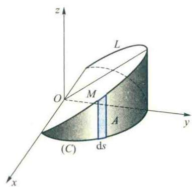
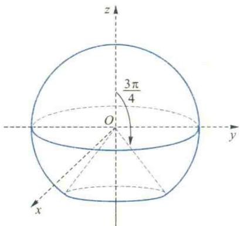

import ExerciseTrigger from '@/components/exercises/ExerciseTrigger.astro';
import QRCodeVideo from '@/components/QRCodeVideo.astro';

import Guide from '@/components/Guide.astro';
import Knowledge from '@/components/Knowledge.astro';
import Example from '@/components/Example.astro';
import Analysis from '@/components/Analysis.astro';
import Solution from '@/components/Solution.astro';
import Variant from '@/components/Variant.astro';
import Note from '@/components/Note.astro';
import SideNote from '@/components/SideNote.astro';
import Block from '@/components/Block.astro';
import Method from '@/components/Method.astro';
import Exercise from '@/components/Exercise.astro';

本节讨论第一型曲线积分与第一型曲面积分的概念、性质与计算方法。

### 第六节 第一型线积分与面积分

### 6.1 第一型线积分

在本书第一章中，我们已经通过极限定义给出了点函数 $f(M)$ 在形体 $(\Omega)$ 上积分的定义。当 $(\Omega)$ 是平面或空间的可求长曲线段 $(C)$ 时，相应的积分就分别为平面或空间曲线积分，即：

$$

\int_{(C)} f(x, y) \mathrm{d}s = \lim_{d \to 0} \sum_{k=1}^{n} f(\xi_k, \eta_k) \Delta s_k,

$$

或

$$

\int_{(C)} f(x, y, z) \mathrm{d}s = \lim_{d \to 0} \sum_{k=1}^{n} f(\xi_k, \eta_k, \zeta_k) \Delta s_k. \tag{6.1}

$$

这里弧段 $\Delta s_k$ 始终是正的，换句话说，曲线积分的值与积分路径 $(C)$ 的方向无关，我们把这种曲线积分称为对弧长的线积分，也称为第一型线积分。

#### 第一型线积分的计算公式

设有有一界的简单光滑空间曲线 $(C)$，其参数方程为

$$

x = x(t), y = y(t), z = z(t) \quad (\alpha \leqslant t \leqslant \beta). \tag{6.2}

$$

若函数 $f(x, y, z)$ 在 $(C)$ 上连续，则

$$

\int_{(C)} f(x, y, z) \mathrm{d}s = \int_{\alpha}^{\beta} f[x(t), y(t), z(t)] \sqrt{\dot{x}^2(t) + \dot{y}^2(t) + \dot{z}^2(t)} \, \mathrm{d}t. \tag{6.3}

$$

<Solution title="证明">
把区间 $[\alpha, \beta]$ 任意划分：

$$

\alpha = t_0 < t_1 < t_2 < \dots < t_n = \beta,

$$

曲线 $(C)$ 相应地被分割成 $n$ 个小弧段，设 $[t_{k-1}, t_k]$ 对应的小弧段为 $(\Delta s_k)$，其弧长为 $\Delta s_k$。由弧长的计算公式可知：

$$

\Delta s_k = \int_{t_{k-1}}^{t_k} \sqrt{\dot{x}^2(t) + \dot{y}^2(t) + \dot{z}^2(t)} \, \mathrm{d}t.

$$

由于曲线 $(C)$ 光滑，故被积函数 $\sqrt{\dot{x}^2(t) + \dot{y}^2(t) + \dot{z}^2(t)}$ 连续，应用积分中值定理，得

$$

\Delta s_k = \sqrt{\dot{x}^2(\tau_k) + \dot{y}^2(\tau_k) + \dot{z}^2(\tau_k)} \Delta t_k, \quad t_{k-1} \leqslant \tau_k \leqslant t_k. \tag{6.4}

$$

令

$$

x(\tau_k) = \xi_k, \quad y(\tau_k) = \eta_k, \quad z(\tau_k) = \zeta_k. \tag{6.5}

$$

显然，点 $M_k(\xi_k, \eta_k, \zeta_k)$ 应位于小弧段 $(\Delta s_k)$ 上，作和式

$$

\sum_{k=1}^{n} f(\xi_k, \eta_k, \zeta_k) \Delta s_k = \sum_{k=1}^{n} f[x(\tau_k), y(\tau_k), z(\tau_k)] \sqrt{\dot{x}^2(\tau_k) + \dot{y}^2(\tau_k) + \dot{z}^2(\tau_k)} \Delta t_k. \tag{6.6}

$$

由于被积函数 $f$ 在积分路径 $(C)$ 上连续，故第一型线积分 $\int_{(C)} f(x, y, z) \mathrm{d}s$ 存在，即无论对 $(C)$ 如何划分，无论点 $M_k$ 在 $(\Delta s_k)$ 上如何选取，当 $(\Delta s_k) (k=1, 2, \dots)$ 的直径的最大者 $d \to 0$ 时，(6.6) 式左端和右端都趋于同一值。因此对用 (6.5) 式特别选取的点 $M_k$，也必有

$$

\int_{(C)} f(x, y, z) \mathrm{d}s = \lim_{d \to 0} \sum_{k=1}^{n} f[x(\tau_k), y(\tau_k), z(\tau_k)] \sqrt{\dot{x}^2(\tau_k) + \dot{y}^2(\tau_k) + \dot{z}^2(\tau_k)} \Delta t_k.

$$

另一方面，由于 $f[x(t), y(t), z(t)] \cdot \sqrt{\dot{x}^2(t) + \dot{y}^2(t) + \dot{z}^2(t)}$ 在区间 $[\alpha, \beta]$ 上连续，由定积分的定义和存在定理可知

$$

\lim_{d \to 0} \sum_{k=1}^{n} f[x(\tau_k), y(\tau_k), z(\tau_k)] \cdot \sqrt{\dot{x}^2(\tau_k) + \dot{y}^2(\tau_k) + \dot{z}^2(\tau_k)} \Delta t_k = \int_{\alpha}^{\beta} f[x(t), y(t), z(t)] \sqrt{\dot{x}^2(t) + \dot{y}^2(t) + \dot{z}^2(t)} \, \mathrm{d}t.

$$

所以公式 (6.3) 成立。
</Solution>

<SideNote title="注意">
公式 (6.3) 表明，在计算第一型线积分 $\int_{(C)} f(x, y, z) \mathrm{d}s$ 时，可以把弧微元 $\mathrm{d}s$ 看作弧微分，把弧微分公式与积分路径 $(C)$ 的参数方程代入被积表达式，然后去计算所得的定积分即可。由于弧长 $\Delta s_k$ 总是正的，所以定积分的上限必须大于下限。
</SideNote>

<Example title="例 6.1 计算线积分 $I = \int_{(C)} (x^2 + y^2 + z^2) \mathrm{d}s$">
其中 $(C)$ 为螺旋线 $x = a \cos t, y = a \sin t, z = kt$ 上相应于 $0 \leqslant t \leqslant 2\pi$ 的一段弧。
</Example>

<Solution title="解">
由公式 (6.3) 得

$$

I = \int_{0}^{2\pi} (a^2 + k^2 t^2) \sqrt{a^2 + k^2} \, \mathrm{d}t = \frac{2}{3} \pi \sqrt{a^2 + k^2} (3a^2 + 4\pi^2 k^2).

$$

</Solution>

<Example title="例 6.2 求 $I = \int_{(C)} y \mathrm{d}s$">
其中 $(C)$ 为抛物线 $y^2 = 2x$ 上介于 $(2, -2)$ 与 $(2, 2)$ 两点间的线段。
</Example>

<Solution title="解">
$I$ 是平面上的第一型线积分，选择 $y$ 为积分变量，把积分路径的方程 $y^2 = 2x$ 看作是以 $y$ 为参数的参数方程：$x = \frac{1}{2} y^2, y = y$。由公式 (6.3) 得

$$

I = \int_{-2}^{2} y \sqrt{1 + \left(\frac{\mathrm{d}x}{\mathrm{d}y}\right)^2} \, \mathrm{d}y = \int_{-2}^{2} y \sqrt{1 + y^2} \, \mathrm{d}y = 0.

$$

</Solution>

<SideNote title="注意">
实际上，注意到积分路径 $(C)$ 是关于 $x$ 轴对称的，而被积函数又是 $y$ 的奇函数，即刻可知中线积分之值为零。
</SideNote>

<Example title="例 6.3 计算线积分 $I = \oint_{(C)} (x^2 + y^2 + 2z) \mathrm{d}s$">
其中 $(C)$ 为：

$$

\begin{cases} 
x^2 + y^2 + z^2 = a^2 \\ 
x + y + z = 0 
\end{cases}

$$

</Example>

<Solution title="解">
由于曲线 $(C)$ 的方程具有轮换对称性，故

$$

\oint_{(C)} x^2 \mathrm{d}s = \oint_{(C)} y^2 \mathrm{d}s = \oint_{(C)} z^2 \mathrm{d}s,

$$

从而

$$

\oint_{(C)} (x^2 + y^2) \mathrm{d}s = \frac{2}{3} \oint_{(C)} (x^2 + y^2 + z^2) \mathrm{d}s = \frac{2}{3} \oint_{(C)} a^2 \mathrm{d}s = \frac{2}{3} a^2 \cdot 2\pi a = \frac{4}{3} \pi a^3.

$$

又由于 $(C)$ 关于坐标原点对称，而 $\oint_{(C)} 2z \mathrm{d}s$ 中的被积函数关于 $x, y$ 和 $z$ 为奇函数，故

$$

\oint_{(C)} 2z \mathrm{d}s = 0,

$$

于是

$$

I = \frac{4}{3} \pi a^3.

$$

</Solution>

<SideNote title="注意">
对于第一型线积分，与重积分类似，同样可利用对称性简化其计算。
</SideNote>

<Example title="例 6.4 (柱面的侧面积)">
设椭圆柱面 $\frac{x^2}{5} + \frac{y^2}{9} = 1$ 被平面 $z = y$ 与 $z = 0$ 所截，位于第一、二卦限内所截下部分的侧面积 $A$（图 6.44）。
</Example>

<figure class="vp-figure">
  
  <figcaption>图 6.44 椭圆柱面侧面积示意图</figcaption>
</figure>

<Solution title="解">
此椭圆柱面的准线是 $xOy$ 平面上的半个椭圆 $(C)$：

$$

\frac{x^2}{5} + \frac{y^2}{9} = 1 \quad (y \geqslant 0).

$$

对 $(C)$ 进行划分，运用积分的微元法，在弧微元 $\mathrm{d}s$ 上的一小片柱面面积可近似地看作是以 $\mathrm{d}s$ 为底，以截线 $L$ 上点 $M$ 的竖坐标 $z = y$ 为高的长方形面积，从而得到侧面积微元

$$

\mathrm{d}A = y \mathrm{d}s,

$$

于是所求侧面积为

$$

A = \int_{(C)} y \mathrm{d}s.

$$

把 $(C)$ 的方程化成参数方程

$$

x = \sqrt{5} \cos t, y = 3 \sin t \quad (0 \leqslant t \leqslant \pi),

$$

所以

$$

A = \int_{(C)} y \mathrm{d}s = \int_{0}^{\pi} 3 \sin t \sqrt{5 \sin^2 t + 9 \cos^2 t} \, \mathrm{d}t = -3 \int_{0}^{\pi} \sqrt{5 + 4 \cos^2 t} \, \mathrm{d}(\cos t) = 9 + \frac{15}{4} \ln 5.

$$

</Solution>

<SideNote title="注意">
这里 $\mathrm{d}s$ 可通过 $(C)$ 的参数方程计算弧微分得到：$\mathrm{d}s = \sqrt{R^2(-\sin \theta)^2 + R^2 \cos^2 \theta} \, \mathrm{d}\theta = R \mathrm{d}\theta$，也可以更简单地利用求圆弧的公式直接从图 6.45 得到。
</SideNote>

<Example title="例 6.5 计算半圆形金属丝的质心与转动惯量">
设有半圆形的金属丝，物质均匀分布，求它的质心和对直径的转动惯量。
</Example>

<figure class="vp-figure">
  
  <figcaption>图 6.45 半圆形金属丝几何模型</figcaption>
</figure>

<Solution title="解">
选取坐标系如图 6.45 所示。设圆半径为 $R$，金属丝线密度为 $\mu$，由对称性可知质心的横坐标 $\bar{x} = 0$。任意划分半圆弧 $(C)$，易见，弧微元 $\mathrm{d}s$ 所对应的金属丝对 $x$ 轴的静矩微元为

$$

\mathrm{d}M_x = y \mathrm{d}m = \mu y \mathrm{d}s,

$$

从而

$$

M_x = \int_{(C)} \mu y \mathrm{d}s.

$$

$(C)$ 以极角 $\theta$ 为参数的参数方程为

$$

x = R \cos \theta, \quad y = R \sin \theta \quad (0 \leqslant \theta \leqslant \pi),

$$

于是

$$

M_x = \mu \int_{0}^{\pi} R^2 \sin \theta \mathrm{d}\theta = 2\mu R^2.

$$

半圆的质量显然为 $m = \pi R \mu$，所以质心的纵坐标为

$$

\bar{y} = \frac{M_x}{m} = \frac{2\mu R^2}{\pi R \mu} = \frac{2R}{\pi}.

$$

$\mathrm{d}s$ 段金属丝对直径（即 $x$ 轴）的转动惯量，即转动惯量微元为

$$

\mathrm{d}I_x = y^2 \mathrm{d}m = \mu y^2 \mathrm{d}s,

$$

从而金属丝对其直径的转动惯量为

$$

I_x = \mu \int_{(C)} y^2 \mathrm{d}s = \mu \int_{0}^{\pi} R^3 \sin^2 \theta \mathrm{d}\theta = \frac{\mu \pi R^3}{2} = \frac{m}{2} R^2,

$$

其中 $m = \mu \pi R$ 是金属丝的质量。
</Solution>

### 6.2 第一型面积分

正像线积分要以弧长为基础一样，面积积分需要以曲面积为基础。

#### 1. 曲面的面积

设在 $\mathbf{R}^3$ 空间有一曲面 $(S)$，其参数方程为

$$

\mathbf{r} = \mathbf{r}(u, v) = (x(u, v), y(u, v), z(u, v)), \quad (u, v) \in (\sigma) \subseteq \mathbf{R}^2. \tag{6.7}

$$

从几何上看，曲面 $(S)$ 是 $uOv$ 参数平面上的区域 $(\sigma)$ 在映射 $\mathbf{r}$ 下的像。

我们用微元法来讨论曲面的面积。设向量值函数 $\mathbf{r}(u, v)$ 在 $(\sigma)$ 上连续可微，且 $\mathbf{r}_u \times \mathbf{r}_v \neq \mathbf{0}$。

在 $uOv$ 参数平面上，用坐标线 $u = c_1$ 和 $v = c_2$ 把域 $(\sigma)$ 划分成若干小矩形，考察其中一个以点 $M(u, v), M_1(u + \Delta u, v), M_2(u + \Delta u, v + \Delta v), M_3(u, v + \Delta v)$ 为顶点的小矩形 $(\Delta \sigma) (\Delta u > 0, \Delta v > 0)$（图 6.46(a)）。设在映射 $\mathbf{r}$ 下，$M, M_1, M_2, M_3$ 的像点分别为曲面 $S$ 上的点 $P, P_1, P_2, P_3$，于是映射 $\mathbf{r}$ 把 $(\Delta \sigma)$ 映射成由曲面上的曲边四边形 $PP_1P_2P_3$ 所围成的 $(\Delta S)$（图 6.46(b)）。容易看出，向量

$$

\overrightarrow{PP_1} = \mathbf{r}(u + \Delta u, v) - \mathbf{r}(u, v) = \mathbf{r}_u \Delta u + o(\rho) \approx \mathbf{r}_u \Delta u,

$$

$$
\overrightarrow{PP_3} = \mathbf{r}(u, v + \Delta v) - \mathbf{r}(u, v) = \mathbf{r}_v \Delta v + o(\rho) \approx \mathbf{r}_v \Delta v,

$$

其中 $\rho = \sqrt{\Delta u^2 + \Delta v^2}$。$\mathbf{r}_u \Delta u$ 与 $\mathbf{r}_v \Delta v$ 分别为曲面 $S$ 经过点 $P(u, v)$ 的弧段 $\overrightarrow{PP_1}$ 和弧段 $\overrightarrow{PP_3}$ 相应的切向量，它们都位于曲面 $S$ 在点 $P$ 的切平面上。当 $\Delta u$ 与 $\Delta v$ 都很小时，此两切向量为邻边所构成的平行四边形面积显然可作为 $(\Delta S)$ 面积 $\Delta S$ 的近似值，即

$$

\Delta S \approx \|\mathbf{r}_u \Delta u \times \mathbf{r}_v \Delta v\| = \|\mathbf{r}_u \times \mathbf{r}_v\| \Delta u \Delta v.

$$

由此可知曲面积微元

$$

\mathrm{d}S = \|\mathbf{r}_u \times \mathbf{r}_v\| \mathrm{d}u \mathrm{d}v, \tag{6.8}

$$

从而曲面 $(S)$ 的面积为

$$

S = \iint_{(\sigma)} \|\mathbf{r}_u \times \mathbf{r}_v\| \mathrm{d}u \mathrm{d}v. \tag{6.9}

$$

<figure class="vp-figure">
  
  <figcaption>图 6.46 参数平面区域与曲面微元映射关系</figcaption>
</figure>

<SideNote title="注意">
所设条件保证了在 $(\sigma)$ 上曲面 $S$ 的光滑性，即有连续转动的切平面；同时，也保证了 $\mathbf{r}_u$ 与 $\mathbf{r}_v$ 均在 $(\sigma)$ 上是处处非零的向量。
</SideNote>

<Example title="例 6.6 求半径为 $a$ 的球面面积">
</Example>

<Solution title="解">
由第五章例 6.6 可知，此球面的参数方程为

$$

\mathbf{r}(\varphi, \theta) = (a \sin \varphi \cos \theta, a \sin \varphi \sin \theta, a \cos \varphi), \quad (\varphi, \theta) \in D = [0, \pi] \times [0, 2\pi].

$$

由于

$$

\mathbf{r}_\varphi = (a \cos \varphi \cos \theta, a \cos \varphi \sin \theta, -a \sin \varphi),

$$

$$
\mathbf{r}_\theta = (-a \sin \varphi \sin \theta, a \sin \varphi \cos \theta, 0).

$$

经计算可知

$$

\|\mathbf{r}_\varphi \times \mathbf{r}_\theta\| = a^2 \sin \varphi.

$$

于是由公式 (6.9) 可知

$$

S = \iint_{(\sigma)} a^2 \sin \varphi \mathrm{d}\varphi \mathrm{d}\theta = \int_{0}^{2\pi} \mathrm{d}\theta \int_{0}^{\pi} a^2 \sin \varphi \mathrm{d}\varphi = 4\pi a^2.

$$

</Solution>

<QRCodeVideo id="6.6.1" title="曲面积微元与微分的关系" url="#" />

若曲面 $S$ 的方程由直角坐标给出：$z = z(x, y), (x, y) \in (\sigma)$，将 $x$ 与 $y$ 视为参数，此曲面的向量方程可写成

$$

\mathbf{r} = \mathbf{r}(x, y) = (x, y, f(x, y)),

$$

从而

$$

\mathbf{r}_x = (1, 0, f_x), \quad \mathbf{r}_y = (0, 1, f_y),

$$

而

$$

\mathrm{d}S = \|\mathbf{r}_x \times \mathbf{r}_y\| \mathrm{d}x \mathrm{d}y = \left\| \begin{vmatrix} \mathbf{i} & \mathbf{j} & \mathbf{k} \\ 1 & 0 & f_x \\ 0 & 1 & f_y \end{vmatrix} \right\| \mathrm{d}x \mathrm{d}y = \sqrt{1 + f_x^2 + f_y^2} \mathrm{d}x \mathrm{d}y, \tag{6.10}

$$

代入公式 (6.9)，得

$$

S = \iint_{(\sigma)} \|\mathbf{r}_x \times \mathbf{r}_y\| \mathrm{d}x \mathrm{d}y = \iint_{(\sigma)} \sqrt{1 + f_x^2 + f_y^2} \mathrm{d}x \mathrm{d}y. \tag{6.11}

$$

<SideNote title="注意">
注意到 $\mathbf{n} = \mathbf{r}_x \times \mathbf{r}_y = -f_x \mathbf{i} - f_y \mathbf{j} + \mathbf{k}$ 是曲面 $(S)$ 在点 $P_0$ 处的一个法向量，它的第三方向余弦为

$$

\cos \gamma = \frac{1}{\sqrt{1 + f_x^2 + f_y^2}},

$$

其中 $\gamma$ 是 $\mathbf{n}$ 与 $z$ 轴的夹角，于是由 (6.10) 式可知

$$

\mathrm{d}S \cdot \frac{1}{\sqrt{1 + f_x^2 + f_y^2}} = \mathrm{d}S \cdot \cos \gamma = \mathrm{d}x \mathrm{d}y = \mathrm{d}\sigma_{xy}. \tag{6.12}

$$

</SideNote>

所以，我们说面积微元 $\mathrm{d}x\mathrm{d}y (= \mathrm{d}\sigma_{xy})$ 就是曲面面积微元 $\mathrm{d}S$ 在 $xOy$ 坐标面上的投影。或者说，曲面面积微元 $\mathrm{d}S$ 是位于曲面 $S$ 的切平面上，且它在 $xOy$ 平面上的投影为 $\mathrm{d}\sigma_{xy}$ 的那一块面积。

<SideNote title="注意">
公式 (6.11) 仅适用于由函数 $z=f(x,y)$ 表示的曲面，即这时曲面在 $(\sigma_{xy})$ 上关于 $z$ 是单值的。而公式 (6.9) 所适用的曲面具有一般性。
</SideNote>

当曲面 $S$ 可用方程

$$

y=f(z,x), (z,x) \in (\sigma_{xz}) \quad \text{或} \quad x=f(y,z), (y,z) \in (\sigma_{yz})

$$

表示时，相应的曲面面积公式分别为

$$

S = \iint_{(\sigma_{xz})} \sqrt{1+f_z^2+f_x^2} \mathrm{d}z\mathrm{d}x \quad \text{或} \quad S = \iint_{(\sigma_{yz})} \sqrt{1+f_y^2+f_z^2} \mathrm{d}y\mathrm{d}z \tag{6.13}

$$

<Example title="例 6.7 求圆柱面面积">
求圆柱面 $x^2+y^2=a^2$ 在第一卦限中被平面 $z=0, z=mx (m>0), x=b (b<a)$ 所截下部分的面积（图 6.47）。
</Example>

<figure class="vp-figure">
  
  <figcaption>图 6.47 圆柱面截取部分的几何示意图</figcaption>
</figure>

<Solution title="解">
将所求部分曲面向 $xOz$ 平面投影，曲面的方程可写成

$$

y = \sqrt{a^2-x^2}, (x,z) \in (\sigma),

$$

其中 $(\sigma) = \{ (x,z) \mid 0 \le x \le b, 0 \le z \le mx \}$。于是

$$

\sqrt{1+y_x^2+y_z^2} = \sqrt{1 + \left( \frac{-x}{y} \right)^2} = a(a^2-x^2)^{-1/2},

$$

从而由公式 (6.13)，得

$$

\begin{aligned}
S &= \iint_{(\sigma)} a(a^2-x^2)^{-1/2} \mathrm{d}z\mathrm{d}x = \int_0^b \mathrm{d}x \int_0^{mx} a(a^2-x^2)^{-1/2} \mathrm{d}z \\
&= \int_0^b amx(a^2-x^2)^{-1/2} \mathrm{d}x = a^2m - am\sqrt{a^2-b^2}.
\end{aligned}

$$

</Solution>

### 2. 第一型面积积分的计算

<Knowledge title="第一型面积积分的定义">
用类似于第一型线积分计算公式的证明方法，可以证明：如果 $f(x,y,z)$ 在有界光滑曲面 $(S)$ 上连续，$(S)$ 的方程为

$$

\boldsymbol{r} = \boldsymbol{r}(u,v) = x(u,v)\boldsymbol{i} + y(u,v)\boldsymbol{j} + z(u,v)\boldsymbol{k}, \quad (u,v) \in (\sigma),

$$

那么 $f$ 在 $(S)$ 上的第一型面积积分的计算公式为

$$

\iint_{(S)} f(x,y,z) \mathrm{d}S = \iint_{(\sigma)} f[x(u,v), y(u,v), z(u,v)] \|\boldsymbol{r}_u \times \boldsymbol{r}_v\| \mathrm{d}u\mathrm{d}v \tag{6.14}

$$

</Knowledge>

<SideNote title="几何解释">
容易看出当曲面 $(S)$ 是坐标平面上的一块平面时，第一型的积分就退化为二重积分。
</SideNote>

<SideNote title="思路分析">
与第一型线积分类似，第一型面积积分定义中的 $\mathrm{d}S$ 最初只是一个记号，并没有明确的含义。仅当导出了计算公式 (6.14) 之后，才看到可以把 $\mathrm{d}S$ 看作是曲面面积微元，即 $\mathrm{d}S = \|\boldsymbol{r}_u \times \boldsymbol{r}_v\| \mathrm{d}u\mathrm{d}v$。
</SideNote>

公式 (6.14) 可以这样理解：由于被积函数 $f$ 沿曲面 $(S)$ 变化，因而积分变量 $x,y,z$ 应受曲面 $(S)$ 方程的约束。把 $\mathrm{d}S$ 视为曲面面积微元，将曲面参数方程 (6.7) 与微元表达式 (6.8) 代入 (6.14) 式的左端，注意到当点 $(x,y,z)$ 在 $(S)$ 上变化时，参数 $(u,v)$ 相应变化区域为 $(\sigma)$，便可得到公式 (6.14) 的右端。

若 $(S)$ 的方程为 $z=z(x,y), (x,y) \in (\sigma)$，则 (6.14) 式可写成

$$

\iint_{(S)} f(x,y,z) \mathrm{d}S = \iint_{(\sigma)} f[x, y, z(x,y)] \sqrt{1+z_x^2+z_y^2} \mathrm{d}x\mathrm{d}y \tag{6.15}

$$

<Example title="例 6.8 计算 $\iint_{(S)} z \mathrm{d}S$">
其中曲面 $(S)$ 是圆锥面 $z=\sqrt{x^2+y^2}$ 上于平面 $z=1$ 与 $z=2$ 间的部分。
</Example>

<Solution title="解">
容易看出曲面 $(S)$ 在 $xOy$ 平面上的投影区域为

$$

(\sigma) = \{ (x,y) \mid 1 \le x^2+y^2 \le 4 \},

$$

于是由公式 (6.15) 可知

$$

\begin{aligned}
\iint_{(S)} z \mathrm{d}S &= \iint_{(\sigma)} \sqrt{x^2+y^2} \sqrt{1 + \frac{x^2}{x^2+y^2} + \frac{y^2}{x^2+y^2}} \mathrm{d}x\mathrm{d}y \\
&= \sqrt{2} \iint_{(\sigma)} \rho \cdot \rho \mathrm{d}\rho \mathrm{d}\theta = \sqrt{2} \int_0^{2\pi} \mathrm{d}\theta \int_1^2 \rho^2 \mathrm{d}\rho = \frac{14}{3}\sqrt{2}\pi.
\end{aligned}

$$

</Solution>

<Example title="例 6.9 计算面积分 $I = \iint_{(S)} (ax+by+cz+d)^2 \mathrm{d}S$">
其中 $(S)$ 为球面 $x^2+y^2+z^2=a^2$。
</Example>

<Solution title="解">
为了利用对称性，将被积函数展开，得

$$

\begin{aligned}
I = &a^2 \iint_{(S)} x^2 \mathrm{d}S + b^2 \iint_{(S)} y^2 \mathrm{d}S + c^2 \iint_{(S)} z^2 \mathrm{d}S + 2ab \iint_{(S)} xy \mathrm{d}S + 2bc \iint_{(S)} yz \mathrm{d}S + \\
&2ac \iint_{(S)} xz \mathrm{d}S + 2ad \iint_{(S)} x \mathrm{d}S + 2bd \iint_{(S)} y \mathrm{d}S + 2cd \iint_{(S)} z \mathrm{d}S + \iint_{(S)} d^2 \mathrm{d}S.
\end{aligned}

$$

由于球面关于 $xOy$ 平面对称，而上式右端第五、六、九三个积分中的被积函数关于 $z$ 为奇函数，从而这三个积分的值均为零；又由于球面也关于 $zOx$ 平面对称，而上式右端第四、八两个积分的被积函数关于 $y$ 为奇函数，从而这两个积分的值也为零。再利用球面关于 $yOz$ 平面对称可知第七个积分的值也为零。于是

$$

I = a^2 \iint_{(S)} x^2 \mathrm{d}S + b^2 \iint_{(S)} y^2 \mathrm{d}S + c^2 \iint_{(S)} z^2 \mathrm{d}S + d^2 \iint_{(S)} \mathrm{d}S.

$$

由于球面 $(S)$ 具有轮换对称性，可知

$$

\iint_{(S)} x^2 \mathrm{d}S = \iint_{(S)} y^2 \mathrm{d}S = \iint_{(S)} z^2 \mathrm{d}S = \frac{1}{3} \iint_{(S)} (x^2+y^2+z^2) \mathrm{d}S,

$$

于是

$$

\begin{aligned}
a^2 \iint_{(S)} x^2 \mathrm{d}S + b^2 \iint_{(S)} y^2 \mathrm{d}S + c^2 \iint_{(S)} z^2 \mathrm{d}S &= \frac{1}{3}(a^2+b^2+c^2) \iint_{(S)} (x^2+y^2+z^2) \mathrm{d}S \\
&= \frac{1}{3}(a^2+b^2+c^2) a^2 \iint_{(S)} \mathrm{d}S \\
&= \frac{1}{3}(a^2+b^2+c^2) a^2 (4\pi a^2) = \frac{4}{3}\pi a^4(a^2+b^2+c^2),
\end{aligned}

$$

易见

$$

d^2 \iint_{(S)} \mathrm{d}S = 4\pi a^2 d^2,

$$

因此

$$

I = \frac{4}{3}\pi a^4(a^2+b^2+c^2) + 4\pi a^2 d^2.

$$

</Solution>

<Example title="例 6.10 物质均匀分布的球缺面质心问题">
物质均匀分布且半径为 $R$ 的球缺面如图 6.48 所示，求其质心坐标。
</Example>

<figure class="vp-figure">
  
  <figcaption>图 6.48 球缺面几何模型</figcaption>
</figure>

<Solution title="解">
为了将球面用参数方程表示，选取 $\varphi$ 与 $\theta$ 为参数，则给球缺面的参数方程为

$$

x = R \sin \varphi \cos \theta, \quad y = R \sin \varphi \sin \theta, \quad z = R \cos \varphi, \quad 0 \le \varphi \le \frac{3\pi}{4}, \quad 0 \le \theta \le 2\pi,

$$

或

$$

\boldsymbol{r} = \boldsymbol{r}(\varphi, \theta) = (R \sin \varphi \cos \theta, R \sin \varphi \sin \theta, R \cos \varphi), \quad 0 \le \varphi \le \frac{3\pi}{4}, \quad 0 \le \theta \le 2\pi.

$$

由对称性可知，质心应位于 $z$ 轴上。在所给球缺面上任取一点 $P(x,y,z)$，含点 $P$ 的曲面面积微元 $\mathrm{d}S$ 上的质量关于 $xOy$ 平面的静矩微分

$$

\mathrm{d}M_{xy} = z \mu \mathrm{d}S,

$$

其中常数 $\mu$ 是面密度。于是所给球缺面对 $xOy$ 平面的静矩为

$$

M_{xy} = \mu \iint_{(S)} z \mathrm{d}S = \mu \iint_{(\sigma)} R \cos \varphi \|\boldsymbol{r}_\varphi \times \boldsymbol{r}_\theta\| \mathrm{d}\varphi \mathrm{d}\theta,

$$

其中参数 $(\varphi, \theta)$ 的变化区域为

$$

(\sigma) = \{ (\varphi, \theta) \mid 0 \le \varphi \le \frac{3\pi}{4}, 0 \le \theta \le 2\pi \}.

$$

容易算得

$$
\|\boldsymbol{r}_\varphi \times \boldsymbol{r}_\theta\| = R^2 \sin\varphi,
$$

于是

$$
M_{xy} = \mu \iint_{(\sigma)} R^3 \sin\varphi\cos\varphi \, \mathrm{d}\varphi\mathrm{d}\theta = \mu R^3 \int_0^{2\pi} \mathrm{d}\theta \int_0^{\frac{3\pi}{4}} \sin\varphi\cos\varphi \, \mathrm{d}\varphi = \frac{\pi}{2}\mu R^3.
$$

由公式 (6.9) 可得此球缺面的质量为

$$
M = \mu \iint_{(\sigma)} R^2 \sin\varphi \, \mathrm{d}\varphi\mathrm{d}\theta = \mu R^2 \int_0^{2\pi} \mathrm{d}\theta \int_0^{\frac{3\pi}{4}} \sin\varphi \, \mathrm{d}\varphi = (2 + \sqrt{2})\pi\mu R^2.
$$

所以球缺面质心的 $z$ 坐标为

$$
\bar{z} = \frac{M_{xy}}{M} = \frac{R}{2(2 + \sqrt{2})},
$$

从而得知质心的坐标为 $\left(0, 0, \frac{R}{2(2 + \sqrt{2})}\right)$。
</Solution>

<ExerciseTrigger chapter={6} section="6.6" title="6.6 第一型线积分与面积分 课后真题与自测练习" />
