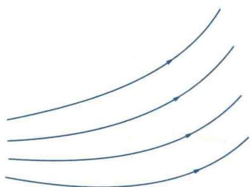
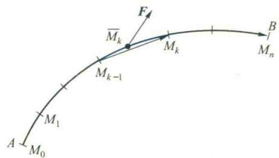
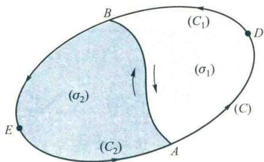
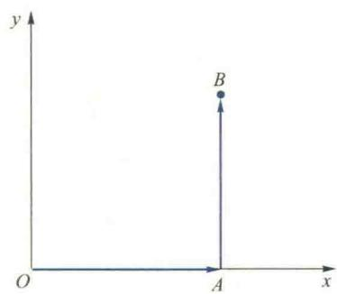
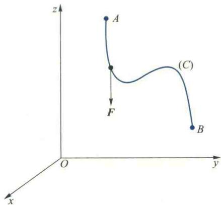
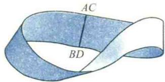
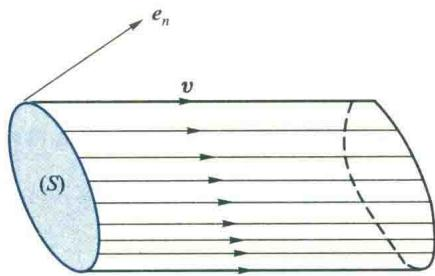
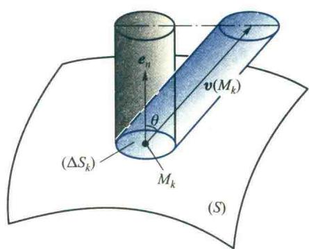
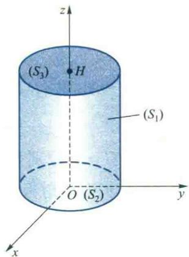

import Guide from '@/components/Guide.astro';
import Knowledge from '@/components/Knowledge.astro';
import Example from '@/components/Example.astro';
import Analysis from '@/components/Analysis.astro';
import Solution from '@/components/Solution.astro';
import Variant from '@/components/Variant.astro';
import Note from '@/components/Note.astro';
import Block from '@/components/Block.astro';
import Method from '@/components/Method.astro';

从这一节开始,我们将介绍多元函数积分中的第二大类型,包括第二型的线积分与面积分.在第一型线积分与面积分中,积分曲线(C)与积分曲面(S)是不考虑方向的,从而相应的弧长微元ds与曲面面积微元dS都总是取正值.对于第二型线积分与面积分,积分曲线与积分曲面将必须考虑方向,而且被积表达式由两向量的点积构成.这是两大类型线积分与面积分的差异.

第二型线、面积分概念也是为满足实际问题的需要而引入的，特别是研究各种物理场的需要。因此，本节先介绍场的概念，然后从实例出发分别介绍这两种第二型积分的概念、性质、计算方法以及与第一型积分的关系，它们在场论中的应用将放在第八节中专门介绍。

## 7.1 场的概念

在物理等学科中我们常常研究各种各样的场,如温度场、高度场、电位场、力场、电场强度场、磁场、流速场,等等.一般地,我们把分布着某种物理量的平面或空间区域称为场,在数学上表现为定义在某一区域上的数量值函数或向量值函数.当这个函数为数量值函数时,称为数量场;当这个函数为向量值函数时,称为向量场.例如上述几种场中,温度场、高度场、电位场是数量场,其余的都是向量场.

从数学的观点来看,给定了一个函数,就相当于给定了一个场.若此函数是一数量值函数 $u(M)(M \in (G) \subseteq \mathbf{R}^{3})$ , 则为数量场; 若是一向量值函数 $A(M)(M \in (G) \subseteq \mathbf{R}^{3})$ , 则为向量场. 此函数也称为场函数, (G) 称为场域.

如果场中的物理量仅与点 M 的位置有关, 不随时间变化, 那么这种场称为定常场或稳定场, 视场是数量场或向量场分别记作 $u(M)$ 或 $A(M)$ ; 若场不仅与点 M 的位置有关, 而且也与时间 t 有关, 则称其为非定常场或时变场, 分别记作 $u(M, t)$ 或 $A(M, t)$ . 本节中仅讨论定常场.

无论是数量场还是向量场,我们都需要从宏观和微观两个方面去研究它们,既要掌握场中物理量的总体分布情况,也要揭示物理量在场中各点的变化规律.

场的几何描述 场的几何描述可以帮助我们直观地了解场中物理量的总体分布情况.我们知道给定一个场,在数学上也就是给定了一个函数.对于一个平面或空间的数量场: $u=u(M)=u(x,y),(x,y)\in(D)\subseteq\mathbf{R}^{2}$ 或 $u=u(M)=u(x,y,z),(x,y,z)\in(G)\subseteq\mathbf{R}^{3}$ ,相应的二元函数 $u(x,y)$ 和三元函数 $u(x,y,z)$ 可以分别通过等值线 $u(x,y)=C$ 和等值面 $u(x,y,z)=C$ 来几何表示(见第五章4.3节),而等值线(面)的形状和疏密程度可以从宏观上反映出该物理量在场内的分布情况.

<Example title="例 7.1">
高度场的等高线.

设 $h = h(x,y)((x,y)\in (D))$ 是在域 $(D)$ 内的一个高度场，等值线 $h(x,y) = C$ 就是其等高线.这些等高线能清晰地反映出场中地势的高低分布情况.例如考察 $h(x,y) = C_{i}$ （ $i = 1,$ 2,3）， $C_1 <   C_2 <   C_3$ ，如图6.49所示.由

  

图6.49

这些等高线不难看出,该地区(D)内东西两边各有一个小山包,西边的山较高,东边的较低,西边的山靠东侧比较陡,靠西侧比较平缓,我们通常见到的地形图就是利用等高线绘制的.
</Example>

<Example title="例 7.2">
电位场的等值面.

设有一带电量为 q 的点电荷, 在空间形成一个电位场. 若建立坐标系, 并将此点电荷所在位置取作坐标原点, 则电位场可表示为

$$

u = \frac {q}{4 \pi \varepsilon r} (r \neq 0),

$$

其中 $\varepsilon$ 为介电系数, $r=\sqrt{x^{2}+y^{2}+z^{2}}$ .

该电位场的等值面 u=C 的方程为

$$

x ^ {2} + y ^ {2} + z ^ {2} = R ^ {2} \quad \left(R = \frac {q}{4 \pi \varepsilon C}\right),

$$

它是一族以坐标原点为球心的球面.由此可见,在每一球面上电位均相同,而且半径R越大的球面上电位的值C越小.

对于数量场 $u(x,y,z)((x,y,z)\in (G))$ ，容易看出，场 $(G)$ 内任一点 $(x_0,y_0,z_0)$ 必位于等值面 $u(x,y,z) = u(x_0,y_0,z_0)$ 上；又由于 $u$ 为单值函数，因而任意两个不同等值面不会相交.

等值线(面)是宏观了解数量场分布的一种方法,对数量场微观的研究主要是研究函数 $u=u(M)$ 在各点的性态和变化情况,沿各个方向变化的快慢程度,以及沿什么方向变化最大等,这就是第五章第三节中所讨论过的方向导数和梯度.

对于一个空间的向量场 $A = A(M) = A(x, y, z), (x, y, z) \in (G) \subseteq \mathbb{R}^{3}$ ，域 $(G)$ 内任一点都确定着一个向量。我们把 $(G)$ 内这样的曲线称为向量线，它上面每一点处切向量的方向，正好与场在此点所确定向量的方向吻合（图 6.50）。例如，若图 6.50 中的向量场是一段河流中的流速场，则向量线就是这段河流中水的流线，它反映了此向量场中水流动方向的总体分布。

  

图6.50

对于向量场 $A(M)$ ，无论宏观和微观的研究都还有一些重要的问题需要讨论。例如，对于河流中的流速场，如果河床不断地有水渗入或渗出，那么我们一方面需要从总体上了解单位时间内通过某一截面水流量的多少，另一方面也需要从微观上考察河床每一点渗水的强度。又如，在具有旋涡的流速场中，我们既要研究沿某一闭合曲线的环流量，也要研究场中各点旋转趋势的大小和方向。为了对向量场进行这些比较深入的研究，需要首先介绍第二型线积分和第二型面积分。
</Example>

## 7.2 第二型线积分

## 1. 第二型线积分的概念

首先我们讨论下面一个具体问题.

力场做功问题 我们知道,质点在力场中运动,力场将会对其做功.如果力场 F 的大小和方向始终不变,且质点沿直线运动.那么,质点每运动一单位长度,力场所做的功均相同,换句话说,功是随质点运动均匀变化的.这时,当质点从点 A 沿直线运动到点 B 时,力场所做的功 W 可通过向量点积公式得到

$$

W = \boldsymbol {F} \cdot \overrightarrow {A B}.\tag{7.1}

$$

现在考察质点 M 沿曲线 $\widehat{AB}$ 运动, 且力场 $F(M)$ 随点 M 的位置不同而变化, 显然, F 所做的功是非均匀变化的. 为了利用均匀变化的公式 (7.1) 来处理此非均匀变化问题, 我们仍可通过“分”“匀”“合”“精”的步骤来实现.

分 从点 A 到点 B 依次插入 n-1 个分点 $M_{1}, M_{2}, \cdots, M_{n-1}$ ，把曲线段 $\widehat{AB}$ 分成 n 个有向小弧段，并把点 A 与 B 分别记作 $M_{0}$ 与 $M_{n}$ （图 6.51）.

匀 由于各小段有向弧 $\widehat{M_{k - 1}M_k}$ 很短，可以近似地看作是弦向量 $\overline{M_{k - 1}M_k}$ ，而且 $F(M)$ 在其上变化也不大，可以近似地用 $\widehat{M_{k - 1}M_k}$ 上任一点 $\overline{M}_k$ 处的力 $F(\overline{M}_k)$ 代替，于是当质点从点 $M_{k - 1}$ 沿 $\widehat{M_{k - 1}M_k}$ 移动到点 $M_{k}$ 时，力场 $F$ 所做的功便可以近似地用均匀变

化的公式(7.1)来求,即

$$

\Delta W _ {k} \approx F (\overline {{{M}}} _ {k}) \cdot \overrightarrow {M _ {k - 1} M _ {k}}, k = 1, 2, \dots , n.

$$

合 把沿各有向小弧段上所做的功相加,便得到所求功的近似值

$$

W = \sum_ {k = 1} ^ {n} \Delta W _ {k} \approx \sum_ {k = 1} ^ {n} \mathbf {F} (\overline {{{M}}} _ {k}) \cdot \overrightarrow {M _ {k - 1} M _ {k}}.

$$

图6.51

精 当各小段弧长的最大值 $d \rightarrow 0$ 时，

便得到所求功的精确值

$$

W = \lim _ {d \rightarrow 0} \sum_ {k = 1} ^ {n} F (\overline {{{M}}} _ {k}) \cdot \overrightarrow {M _ {k - 1} M _ {k}}.

$$

将上述和式极限抽象化就得到第二型线积分的定义.

<Knowledge title="定义 7.1">
(第二型线积分) 设 $(C)$ 是向量场 $A(M)$ 所在区域中的一条以 A 为起点、B 为终点且可求长的有向曲线， $A(M)$ 在 $(C)$ 上有界.

在(C)上自起点A（记作 $M_{0}$ ）到终点B（记作 $M_{n}$ ）依次任意插入n-1个分点 $M_{1},M_{2},\cdots,M_{n-1}$ ，把(C)分成n个有向小弧段.

在每一有向小弧段 $\widehat{M_{k-1}M_k}$ 上任取一点 $\overline{M}_{k}$ ，作点积

$$

\boldsymbol {A} \left(\overline {{M}} _ {k}\right) \cdot \overrightarrow {M _ {k - 1} M _ {k}}, \quad k = 1, 2, \dots , n.

$$

将各小弧段所对应的点积相加得和式

$$

\sum_ {k = 1} ^ {\bar {n}} \boldsymbol {A} (\overline {{M}} _ {k}) \cdot \overrightarrow {M _ {k - 1} M _ {k}}.

$$
</Knowledge>

<Note>
第二型与第一型线积分的主要差别在于: 第一型线积分中, 积分微元 $f(M) \, ds$ 是两数量的乘积, 积分路径没有方向性, ds 是弧微分, 它始终为正; 第二型线积分中, 积分微元 $A(M) \cdot ds$ 是两向量的点积, 积分路径 (C) 具有方向性, 沿 $(\widehat{AB})$ 积分与沿 $(\widehat{BA})$ 积分, 由于其中分点的顺序相反, 向量 $\overrightarrow{M_{k-1}M_k}$ 反向, 从而积分的值反号.

如果无论(C)被怎样划分,点 $\overline{M}_{k}$ 在 $\widehat{M_{k-1}M_{k}}$ 上被

怎样选取,当所有小弧段的最大长度 $d \to 0$ 时上述和式都趋于同一常数,则称此极限值为向量值函数(或向量场) $A(M)$ 沿有向曲线(C)的第二型曲线积分,简称为第二型线积分,记作

$$

\int_ {(C)} \boldsymbol {A} (M) \cdot \mathbf {d s} = \lim _ {d \rightarrow 0} \sum_ {k = 1} ^ {n} \boldsymbol {A} (\overline {{M}} _ {k}) \cdot \overrightarrow {M _ {k - 1} M _ {k}}.\tag{7.2}

$$

此时,称向量值函数 $A(M)$ 在曲线(C)上可积.

可以证明(从略), 当 $A(M)$ 在有向光滑(或分段光滑)曲线(C)上连续时, $A(M)$ 在(C)上一定可积.

当需要注明曲线 $(C)$ 的起点 $A$ 与终点 $B$ 时，将 $\int_{(C)} A(M) \cdot ds$ 记为 $\int_{(AB)} A(M) \cdot ds$ .

这个定义是第二型线积分的向量形式.在直角坐标系下,也可以把它表示为坐标形式.

设(C)为空间曲线,在直角坐标系下, $A(M)=(P(x,y,z),Q(x,y,z),R(x,y,z))$ .把各小段的弦向量 $\overrightarrow{M_{k-1}M_k}$ 写成分量形式

$$

\overrightarrow {M _ {k - 1} M _ {k}} = (\Delta x _ {k}, \Delta y _ {k}, \Delta z _ {k}),

$$

其中 $\Delta x_{k},\Delta y_{k},\Delta z_{k}$ 分别为 $\overrightarrow{M_{k - 1}M_k}$ 在 $x,y,z$ 三个坐标轴上的投影.将点 $\overline{M}_k$ 的坐标记为 $(\xi_k,\eta_k,\zeta_k)$ ，于是定义中的和式极限可写成
</Note>

<Note>
定积分 $\int_{a}^{b}f(x)\mathrm{d}x$ 可以看作是积分路径在 $Ox$ 轴上线段 $\overline{ab}$ 的线积分.它在由曲边梯形面积等问题引入时，由于不具备路径的方向性.故应属于第一型线积分.但当补充定义 $\int_{a}^{b}f(x)\mathrm{d}x = -\int_{b}^{a}f(x)\mathrm{d}x$ 后，意味着赋予了路径 $\overline{ab}$ 的方向.这时它应属于第二型线积分.

$$

\lim _ {d \rightarrow 0} \sum_ {k = 1} ^ {n} \left\{P \left(\xi_ {k}, \eta_ {k}, \zeta_ {k}\right) \Delta x _ {k} + Q \left(\xi_ {k}, \eta_ {k}, \zeta_ {k}\right) \Delta y _ {k} + R \left(\xi_ {k}, \eta_ {k}, \zeta_ {k}\right) \Delta z _ {k} \right\},

$$

这个极限相应地记作

$$

\int_ {(C)} P (x, y, z) \mathrm{d} x + Q (x, y, z) \mathrm{d} y + R (x, y, z) \mathrm{d} z,\tag{7.3}

$$
</Note>

<Note>
(7.3)式中的积分实际上是三个积分的组合,它们也可以单独出现,例如

就是第二型线积分的坐标形式. 因此, 第二型线积分也称为对坐标的线积分.

$$

\begin{array}{l}\int_ {(C)} P (x, y, z) \mathrm{d} x\\= \lim _ {i \rightarrow 0} \sum_ {k = 1} ^ {n} P (\xi_ {k}, \eta_ {k}, \zeta_ {k}) \Delta x _ {k}.\end{array}

$$

由第二型线积分的定义可知,力场 F 将质点由点 A 沿曲线(C)移至点 B 时所做的功为

这时，被积式可理解为

$$

(P, 0, 0) \cdot (\mathrm{d} x, \mathrm{d} y, \mathrm{d} z).

$$

$$

W = \int_ {(C)} \boldsymbol {F} \cdot \mathrm{d} \boldsymbol {s} = \int_ {(C)} P (x, y, z) \mathrm{d} x + Q (x, y, z) \mathrm{d} y + R (x, y, z) \mathrm{d} z,

$$

其中 $F=(P,Q,R)$ .
</Note>

## 2. 第二型线积分的性质

设以下所讨论的第二型线积分均存在.

<Knowledge title="性质 1">
如果把积分路径 $(C)$ 的方向反过来(记作 $(-C)$ ),那么积分的值将改变符号,即

$$

\int_ {(C)} \boldsymbol {A} (M) \cdot \mathbf {d s} = - \int_ {(- C)} \boldsymbol {A} (M) \cdot \mathbf {d s}.

$$
</Knowledge>

<Knowledge title="性质 2">
设 A, B, P 为曲线 (C) 上任意三点, 则

$$

\int_ {(\widehat {A B})} \boldsymbol {A} (M) \cdot \mathbf {d s} = \int_ {(\widehat {A P})} \boldsymbol {A} (M) \cdot \mathbf {d s} + \int_ {(\widehat {P B})} \boldsymbol {A} (M) \cdot \mathbf {d s}.

$$
</Knowledge>

<Knowledge title="性质 3">
如果由闭合曲线 $(C)$ 所围成的平面区域被划分为两个无公共内点的区域 $(\sigma_{1})$ 和 $(\sigma_{2})$ ，它们的边界分别记作 $(C_1)$ 和 $(C_2)$ （图6.52），那么沿闭合曲线 $(C)$ 的第二型线积分 $\oint_{(C)}P(x,y)\mathrm{d}x + Q(x,y)\mathrm{d}y$ 等于按同一方向闭合曲线 $(C_1)$ 和 $(C_2)$ 的第二型线积分之和，即

  

图6.52

$$

\oint_ {(C)} P \mathrm{d} x + Q \mathrm{d} y = \oint_ {(C _ {1})} P \mathrm{d} x + Q \mathrm{d} y + \oint_ {(C _ {2})} P \mathrm{d} x + Q \mathrm{d} y,

$$

其中曲线 $(C)$ ， $(C_{1})$ ， $(C_{2})$ 或者都取正向，或者都取负向 $^{①}$ .

事实上,若三个积分路径都取正向,如图6.52所示,则由性质1与2可得

$$

\begin{array}{r l} & \oint_ {(+ C _ {1})} A (M) \cdot \mathbf {d s} + \oint_ {(+ C _ {2})} A (M) \cdot \mathbf {d s} \\ & = \int_ {(\widehat {A D B A})} A (M) \cdot \mathbf {d s} + \int_ {(\widehat {A B E A})} A (M) \cdot \mathbf {d s} \\ & = \int_ {(\widehat {A D B})} A (M) \cdot \mathbf {d s} + \int_ {(\widehat {B A})} A (M) \cdot \mathbf {d s} + \int_ {(\widehat {A B})} A (M) \cdot \mathbf {d s} + \int_ {(\widehat {B E A})} A (M) \cdot \mathbf {d s} \\ & = \int_ {(\widehat {A D B})} A (M) \cdot \mathbf {d s} + \int_ {(\widehat {B E A})} A (M) \cdot \mathbf {d s} = \oint_ {(+ C)} A (M) \cdot \mathbf {d s}. \end{array}

$$

将上式两端同乘-1,并利用性质1就有

$$

\oint_ {(- C _ {1})} \boldsymbol {A} (M) \cdot \mathbf {d s} + \oint_ {(- C _ {2})} \boldsymbol {A} (M) \cdot \mathbf {d s} = \oint_ {(- C)} \boldsymbol {A} (M) \cdot \mathbf {d s}.

$$
</Knowledge>

## 3. 第二型线积分的计算

设光滑有向曲线(C)的参数方程是

$$

\boldsymbol {r} = \boldsymbol {r} (t) = (x (t), y (t), z (t)) \quad (\alpha \leqslant t \leqslant \beta),

$$

$t=\alpha$ 对应于 $(C)$ 的起点 A, $t=\beta$ 对应于 $(C)$ 的终点 B. 又设向量值函数

$$

\boldsymbol {A} = \boldsymbol {A} (x, y, z) = (P (x, y, z), Q (x, y, z), R (x, y, z))

$$

在曲线 $(C)$ 上连续，这时第二型线积分 $\int_{(C)} A(M) \cdot \mathrm{d}s$ 存在，于是可以通过和式极限，用与推导第一型线积分计算公式类似的方法得

$$

\begin{array}{r l} \int_ {(C)} A (M) \cdot \mathbf {d} s & = \int_ {(C)} (P (x, y, z), Q (x, y, z), R (x, y, z)) \cdot (\mathrm{d} x, \mathrm{d} y, \mathrm{d} z) \\ & = \int_ {(C)} P (x, y, z) \mathrm{d} x + Q (x, y, z) \mathrm{d} y + R (x, y, z) \mathrm{d} z, \end{array}

$$

其中

$$

\begin{array}{r l} & \int_ {(C)} P (x, y, z) \mathrm{d} x = \int_ {\alpha} ^ {\beta} P [ x (t), y (t), z (t) ] \dot {x} (t) \mathrm{d} t, \\ & \int_ {(C)} Q (x, y, z) \mathrm{d} y = \int_ {\alpha} ^ {\beta} Q [ x (t), y (t), z (t) ] \dot {y} (t) \mathrm{d} t, \\ & \int_ {(C)} R (x, y, z) \mathrm{d} z = \int_ {\alpha} ^ {\beta} R [ x (t), y (t), z (t) ] \dot {z} (t) \mathrm{d} t. \end{array}\tag{7.4}

$$

由此可见，计算第二型线积分 $\int_{(C)} A(M) \cdot \mathrm{d}s$ ，只要将 $\mathrm{d}s$ 看作是向量 $(\mathrm{d}x, \mathrm{d}y, \mathrm{d}z)$ ，把积分路径 $(C)$ 的参数式代入 $A(M) \cdot \mathrm{d}s$ 中，然后计算(7.4)式右端三个定积分之和就行了。

<Example title="例 7.3">
计算 $I=\int_{(C)}yz\mathrm{d}x-xz\mathrm{d}y+2z^{2}\mathrm{d}z$ ，其中 $(C)$ 是螺旋线 $x=a\cos t, y=a\sin t, z=kt$ 上对应于从 t=0 到 $t=\pi$ 的有向弧.

<Solution title="解">
由计算公式(7.4)可知，

二维码6.7.1第二型线积分 $\int_{(C)}A(M)\cdot ds$ 中ds的几何意义.

$$

I = \int_ {0} ^ {\pi} (- a ^ {2} k t \sin^ {2} t - a ^ {2} k t \cos^ {2} t + 2 k ^ {3} t ^ {2}) \mathrm{d} t = k \pi^ {2} \left(\frac {2}{3} k ^ {2} \pi - \frac {a ^ {2}}{2}\right)

$$
</Solution>
</Example>

<Example title="例 7.4">
计算 $I = \int_{(C)} 6x^{2}y \, dx + 10xy^{2} \, dy$ ，其中 (C) 是曲线 $y = x^{3}$ 从点 (2,8) 至 (1,1) 的一段.

<Solution title="解">
把曲线(C)的方程写成以 x 为参数的参数方程: $x = x, y = x^{3}$ , 注意到积分路径的方向, 得

$$

I = \int_ {2} ^ {1} (6 x ^ {2} x ^ {3} + 1 0 x (x ^ {3}) ^ {2} \cdot 3 x ^ {2}) \mathrm{d} x = - 3 1 3 2.

$$
</Solution>
</Example>

<Example title="例 7.5">
计算

$$

I = \int_ {(C)} 2 y x ^ {3} \mathrm{d} y + 3 x ^ {2} y ^ {2} \mathrm{d} x,

$$

其中起点和终点分别为 $O(0,0)$ 和 $B(1,1)$ 的积分路径 (C) 为

(1) 抛物线 $y=x^{2}$ ; (2) 直线段 y=x;

（3）依次联结 $O(0,0)$ , $A(1,0)$ , $B(1,1)$ 的有向折线, 如图 6.53 所示.

<Solution title="解">
（1）把 $x$ 看作参变量，则有

$$

I = \int_ {0} ^ {1} (4 x ^ {6} + 3 x ^ {6}) \mathrm{d} x = 1;

$$

  

图6.53

(2) 以 x 为参变量, 得

$$

I = \int_ {0} ^ {1} (2 x ^ {4} + 3 x ^ {4}) \mathrm{d} x = 1;

$$

$$

I = \int_ {(C)} 2 y x ^ {3} \mathrm{d} y + 3 x ^ {2} y ^ {2} \mathrm{d} x = \int_ {(\overrightarrow {O A})} 2 y x ^ {3} \mathrm{d} y + 3 x ^ {2} y ^ {2} \mathrm{d} x + \int_ {(\overrightarrow {A B})} 2 y x ^ {3} \mathrm{d} y + 3 x ^ {2} y ^ {2} \mathrm{d} x, \tag {3}

$$

在 $\overrightarrow{OA}$ 上以 $x$ 为参变量，其方程为 $y = 0$ ；在 $\overrightarrow{AB}$ 上以 $y$ 为参变量，其方程为 $x = 1$ ，从而

$$

I = \int_ {0} ^ {1} 3 x ^ {2} \cdot 0 \mathrm{d} x + \int_ {0} ^ {1} 2 y \mathrm{d} y = 1.

$$
</Solution>
</Example>

<Example title="例 7.5">
的结果显示, 对于某些第二型线积分, 其积分值仅取决于起点和终点, 而与积分路径无关, 这是一个重要而有趣的性质. 怎样的第二型线积分具有这一重要性质呢? 我们将在 8.2 节中进行讨论.
</Example>

<Example title="例 7.6">
质量为 m 的质点,从空间一点 A 沿某光滑曲线 (C) 移动到另一点 B,求重力所做的功 W.

<Solution title="解">
建立空间直角坐标系,取铅直向上的方向为 z 轴(图 6.54),则质点在任一点 M 处所受的重力为 $F(M)=(0,0,-mg)$ .

设点 A 与 B 的坐标分别为 $(x_{0}, y_{0}, z_{0})$ 与 $(x_{1}, y_{1}, z_{1})$ ，从而

$$

\begin{array}{r l} W & = \int_ {(C)} \boldsymbol {F} \cdot \mathbf {d s} = - m g \int_ {(C)} \mathrm{d} z \\ & = - m g \int_ {z _ {0}} ^ {z _ {1}} \mathrm{d} z = m g (z _ {0} - z _ {1}). \end{array}

$$
</Solution>
</Example>

## 4. 两类线积分的联系

由公式(7.4)可知,第二型线积分中的微元向量 $\mathbf{d}s = (\mathrm{d}x, \mathrm{d}y, \mathrm{d}z)$ 就是有向积分路径

图6.54

(C)在点 M 的切向量,且

$$

\| \mathbf {d} s \| = \sqrt {(\mathrm{d} x) ^ {2} + (\mathrm{d} y) ^ {2} + (\mathrm{d} z) ^ {2}} = \mathrm{d} s.

$$

如果我们用 $e_{\tau}$ 表示与有向路径 (C) 的方向一致的单位切向量, 那么 ds 可用弧微分 ds 和 $e_{\tau}$ 的乘积表示, 即

$$

\mathrm{d} s = e _ {\tau} \mathrm{d} s,

$$

于是

$$

\int_ {(C)} \boldsymbol {A} (M) \cdot \mathbf {d s} = \int_ {(C)} \boldsymbol {A} (M) \cdot \boldsymbol {e} _ {\tau} \mathrm{d} s.\tag{7.5}

$$

(7.5)式表达了两类线积分的联系,它的右端是数量值函数 $A(M)\cdot e_{\tau}$ 的第一型线积分.

现在把(7.5)式用坐标表示.设有向曲线(C)在点M处切向量的方向余弦为 $\cos\alpha,\cos\beta,\cos\gamma,$ 并设

$$

\boldsymbol {A} (M) = \left(P (x, y, z), Q (x, y, z), R (x, y, z)\right),

$$

则(7.5)式的坐标表达式为注意: 在(7.6)式中, 方向余弦 $\cos\alpha,\cos\beta,\cos\gamma$ 都是 x,y,z 的函数, 一般情况下, 它们的形式比较复杂. 所以除了一些特殊情况外, 计算第二型线积分不必化为第一型线积分而直接计算更为简便.

$$

\int_ {(C)} P \mathrm{d} x + Q \mathrm{d} y + R \mathrm{d} z = \int_ {(C)} (P \cos \alpha + Q \cos \beta + R \cos \gamma) \mathrm{d} s.\tag{7.6}

$$

由(7.5)或(7.6)式我们看到,在把有方向的第二型线积分化为无方向的第一型线积分时,曲线的方向已通过 $e_{\tau}=(\cos\alpha,\cos\beta,\cos\gamma)$ 被包含在第一型线积分的被积函数中了.

<Note>
也存在单侧曲面.例如,将一长方
</Note>

## 7.3 第二型面积分

## 1. 第二型面积分的概念

与第二型线积分一样,为了研究第二型面积分,首先要给曲面确定方向.通常遇到的曲面都有两侧之分.如果是闭合曲面,有内侧与外侧之分;如果不闭合,有上侧与下侧、左侧与右侧、前侧与后侧之分.这种曲面称为双侧曲面,它的特征是:规定此曲面在一点P处法向量的指向之后,当点在曲面上连续移动而不越过其边界再回到原来位置时,法向量的指向注:也存在单侧曲面.例如,将一长方形纸条ABCD先扭转一次,再把两对边AB与CD粘合起来,这样构成的曲面称为Möbius带(图6.55).如果用颜色来涂这张曲面,可以不越过曲面的边缘而涂遍这条纸带,因而它不能分开两侧,此曲面就是一张单侧曲面.

  

图6.55

不变.本书只限于讨论这种双侧曲面.对于双侧曲面,其法向量的两个指向可以根据需要任意确定,我们把确定了法向量指向的曲面称为有向曲面,而且用法向量的指向来确定曲面的方向,或者说确定曲面的侧.例如,有上、下侧之分的曲面(S),上侧是指其法向量朝上的一侧;对于闭合曲面,外侧是指其法向量朝外的一侧.

流量问题 设有不可压缩的流体(即流体的密度是不变的)在一空间流速场 $v(M)(M\in(G)\subseteq\mathbf{R}^{3})$ 中流动,(S)为(G)中一有向曲面,求流体流向曲面(S)指定一侧的流量(即单位时间内通过曲面(S)的流体的体积).

设 $e_{n}$ 为曲面 (S) 指向给定侧的单位法向量. 如果流速场中各点的流速 $v(M)$ 均相同, 即 v 是一常向量, (S) 是一平面, 如图 6.56 所示, 那么通过 (S) 的流量 Q 等于图中斜柱体的体积, 它在 (S) 上显然是均匀分布的, 可通过两向量的点积得到, 即

$$

Q = \boldsymbol {v} \cdot \boldsymbol {e} _ {n} S,\tag{7.7}

$$

  

图6.56

其中 S 为平面(S)的面积.

容易看出, 当 v 与 $e_{n}$ 的夹角为锐角时, 由于 $v \cdot e_{n} > 0$ , 这时流量 Q 就是以 (S) 为底、 $|v|$ 为斜高的斜柱体的体积 V; 当 $v \perp e_{n}$ 时, 流量 Q = 0; 当 v 与 $e_{n}$ 的夹角为钝角时, $v \cdot e_{n} < 0$ , 从而流量 $Q = v \cdot e_{n} S = -V < 0$ , 这里负号表示流体实际上是流向与 $e_{n}$ 反向的一侧.

如果流速场不是常向量场,而(S)是一片有向曲面,这时流量在(S)上是非均匀分布的,要计算流向曲面一侧的流量就需要运用积分的方法.

分 把曲面(S)任意分成 n 个子片( $\Delta S_{k}$ ), $k=1,2,\cdots,n$ . 用 $\Delta S_{k}$ 表示( $\Delta S_{k}$ )的面积.

匀 在各小片曲面 $(\Delta S_{k})$ 上，任取一点 $M_{k}$ ，把 $(\Delta S_{k})$ 上各点的流速视为常向量 $\pmb{v}(M_k)$ ，且把 $(\Delta S_{k})$ 视为一平面，于是通过 $(\Delta S_{k})$ 流向 $\pmb{e}_n$ 所指向一侧的流量 $\Delta Q_{k}$ 可用公式(7.7)近似表示，即

$$

\Delta Q _ {k} \approx \boldsymbol {v} (M _ {k}) \cdot \boldsymbol {e} _ {n} \Delta S _ {k}, k = 1, 2, \dots , n.

$$

当 $\boldsymbol{v}(M_{k}) \cdot \boldsymbol{e}_{n} > 0$ 时, 这个近似值就是以 $(\Delta S_{k})$ 为底以 $\boldsymbol{v}(M_{k})$ 为斜高的小柱体体积 (图 6.57).

图6.57

合 将流过各小片曲面流量的近似值相加, 得所求流量 Q 的近似值

$$

Q = \sum_ {k = 1} ^ {n} \Delta Q _ {k} \approx \sum_ {k = 1} ^ {n} \pmb {v} (M _ {k}) \cdot \pmb {e} _ {n} \Delta S _ {k}.

$$

精 当所有小曲面直径的最大值 $d \rightarrow 0$ 时, 上述和式的极限就规定为所求流量的精确值

$$

Q = \lim _ {d \rightarrow 0} \sum_ {k = 1} ^ {n} \boldsymbol {v} (M _ {k}) \cdot \boldsymbol {e} _ {n} \Delta S _ {k}.

$$

把上述和式的极限加以抽象,便得到第二型面积分的下述定义:

<Knowledge title="定义 7.2">
(第二型面积分) 设在向量场 A(M) 的场域中有一可求面积的有向曲面(S)，指定它的一侧.

把曲面(S)任意划分成 n 小片 $(\Delta S_{1}),(\Delta S_{2}),\cdots,(\Delta S_{n})$ .

任取一点 $M_{k}\in (\Delta S_{k})$ ，作点积

$$

\boldsymbol {A} \left(M _ {k}\right) \cdot \boldsymbol {e} _ {n} \left(M _ {k}\right) \Delta S _ {k} (k = 1, 2, \dots , n),

$$

其中 $\boldsymbol{e}_{n}(M_{k})$ 是曲面在点 $M_{k}$ 处指向给定侧的单位法向量, $\Delta S_{k}$ 表示 ( $\Delta S_{k}$ ) 的面积.

作和式

$$

\sum_ {k = 1} ^ {n} \boldsymbol {A} (M _ {k}) \cdot \boldsymbol {e} _ {n} (M _ {k}) \Delta S _ {k}.

$$

如果不论曲面(S)怎样划分,点 $M_{k}$ 在 $(\Delta S_{k})$ 上怎样选取,当各小曲面 $(\Delta S_{k})$ 直径的最大值 $d\to0$ 时上述和式都趋于同一常数,则称此极限值为向量场A(M)沿有向曲面(S)的第二型曲面积分,简称为第二型面积分,记作
</Knowledge>

<Note>
(7.8)式的右端中, $A(M_{k})\cdot e_{n}(M_{k})$ 是一个标量,所以这个和式极限实际上是一个第一型曲面积分 $\iint_{(S)}[A(M)\cdot e_{n}]dS$ ,但其被积函数中包含着积分曲面(S)的法线方向,此方向确定了积分值的符号.我们把这个含有曲面法线方向的第一型曲面积分称为第二型曲面积分.

$$

\iint_ {(S)} \boldsymbol {A} (M) \cdot \mathbf {d} \boldsymbol {S} = \lim _ {d \rightarrow 0} \sum_ {k = 1} ^ {n} \boldsymbol {A} \left(M _ {k}\right) \cdot \boldsymbol {e} _ {n} \left(M _ {k}\right) \Delta S _ {k}.\tag{7.8}

$$

其中 $dS=e_{n}dS$ 称为曲面面积微元向量.

这是第二型面积分的向量形式.在直角坐标系下,也可以把此定义用坐标形式给出.设

$$

\begin{array}{r l} & {\pmb {A} (M) = (P (x, y, z), Q (x, y, z), R (x, y, z)),} \\ & {\pmb {e} _ {n} (M) = (\cos \alpha , \cos \beta , \cos \gamma), M _ {k} = (\xi_ {k}, \eta_ {k}, \zeta_ {k}),} \end{array}

$$

则有

$$

\begin{array}{r l} & \iint_ {(S)} A (M) \cdot d S \\ & = \lim _ {d \to 0} \sum_ {k = 1} ^ {n} A (M _ {k}) \cdot e _ {n} (M _ {k}) \Delta S _ {k} \\ & = \lim _ {d \to 0} \sum_ {k = 1} ^ {n} [ P (\xi_ {k}, \eta_ {k}, \zeta_ {k}) \Delta S _ {k} \cos \alpha_ {k} + Q (\xi_ {k}, \eta_ {k}, \zeta_ {k}) \Delta S _ {k} \cos \beta_ {k} + \\ & R (\xi_ {k}, \eta_ {k}, \zeta_ {k}) \Delta S _ {k} \cos \gamma_ {k} ] \\ & = \iint_ {(S)} P (x, y, z) \cos \alpha d S + Q (x, y, z) \cos \beta d S + R (x, y, z) \cos \gamma d S, \end{array}\tag{7.9}

$$

其中 $\mathrm{d}S = \| \mathbf{d}\mathbf{S}\|$ .类似于本章(6.12)式可知， $\cos \alpha \mathrm{d}S,\cos \beta \mathrm{d}S,\cos \gamma \mathrm{d}S$ 分别是曲面面积微元向量 $\mathbf{d}S$ 在 $yOz,zOx,xOy$ 坐标平面上的有向投影，把它们分别记成 $\mathrm{dy}\wedge \mathrm{dz},\mathrm{dz}\wedge \mathrm{dx},\mathrm{dx}\wedge \mathrm{dy}^{①}$ ，即

$$

\mathbf {d} \boldsymbol {S} = (\mathrm{d} y \wedge \mathrm{d} z, \mathrm{d} z \wedge \mathrm{d} x, \mathrm{d} x \wedge \mathrm{d} y),

$$

或

$$

\mathrm{d} S \cos \alpha = \mathrm{d} y \wedge \mathrm{d} z, \quad \mathrm{d} S \cos \beta = \mathrm{d} z \wedge \mathrm{d} x, \quad \mathrm{d} S \cos \gamma = \mathrm{d} x \wedge \mathrm{d} y.\tag{7.10}

$$

于是(7.9)式可写成

$$

\begin{array}{r l} & \iint_ {(S)} A (M) \cdot d S \\ & = \iint_ {(S)} P (x, y, z) d y \wedge d z + Q (x, y, z) d z \wedge d x + R (x, y, z) d x \wedge d y. \end{array}\tag{7.11}

$$

上式右端就是第二型面积分的坐标形式,因此第二型面积分也称为对坐标的面积分.

应当指出,第二型面积分与第一型面积分的主要区别在于第一型面积分的积分微元 $f(M)\mathrm{d}S$ 是两个数量的乘积,积分曲面没有方向性,dS在各坐标面上的投影 $d\sigma\geqslant0$ ;而第二型面积分的积分微元 $A(M)\cdot\mathrm{d}S$ 是两个向量的点积,曲面有两侧之分,在坐标表达式注:与第二型线积分一样,由(7.11)式可见,第二型面积分实际上也是三个积分的组合.它们也可以单独出现.例如:

$$

A (M) = (0, 0, R (x, y, z))

$$

$$

\iint_ {(S)} \boldsymbol {A} (M) \cdot \mathrm{d} \boldsymbol {S} = \iint_ {(S)} R (x, y, z) \mathrm{d} x \wedge \mathrm{d} y.

$$

(7.11)中, $dy\wedge dz$ , $dz\wedge dx$ , $dx\wedge dy$ 是向量 dS 在相应坐标平面上的有向投影, 其正负取决于法向量 n 的方向. 例如, 当 (S) 在点 M 的法向量 n 与 z 轴正向交角为锐角时, $dx\wedge dy = d\sigma_{xy}$ 为正; 为钝角时 $dx\wedge dy = -d\sigma_{xy}$ 为负; 为直角时为零, 其中 $d\sigma_{xy}$ 是 (dS) 在 xOy 坐标平面上投影区域的面积, 在不致混淆时也简记为 $d\sigma$ .

由上述定义可知,流体通过曲面(S)流向 $e_{n}$ 所指向一侧的总流量Q为流速场 $v(M)$ 在(S)上的第二型面积分

$$

Q = \iint_ {(S)} \boldsymbol {v} (M) \cdot \mathbf {d S}.

$$

此外,电位移向量 D 分布的电场与磁感应强度 B 分布的磁场,对有向曲面(S)的电通量和磁通量都可分别用第二型面积分表示为

$$

\Phi_ {D} = \iint_ {(S)} \boldsymbol {D} \cdot \mathbf {d S}, \quad \Phi_ {B} = \iint_ {(S)} \boldsymbol {B} \cdot \mathbf {d S}.

$$

一般地, 把向量场 A 在有向曲面 (S) 上的第二型面积分 $\Phi = \iint_{(S)} A \cdot dS$ 称为场 A 对 (S) 的通量.
</Note>

## 2. 两种面积分的联系

由(7.9)式可见，

$$

\iint_ {(S)} \boldsymbol {A} (M) \cdot \mathbf {d} \boldsymbol {S} = \iint_ {(S)} [ P (x, y, z) \cos \alpha + Q (x, y, z) \cos \beta + R (x, y, z) \cos \gamma ] \mathrm{d} S.

$$

上式表明了第二型面积分与第一型面积分的联系,因为上式右端就是被积函数

$$

\boldsymbol {A} (M) \cdot \boldsymbol {e} _ {n} = P (x, y, z) \cos \alpha + Q (x, y, z) \cos \beta + R (x, y, z) \cos \gamma

$$

在(S)上的第一型面积分.

读者看到,与线积分类似,在把有方向性的第二型面积分 $\iint_{(S)}A(M)\cdot\mathrm{d}S$ 化成无方向性的第一型面积分时,曲面(S)指定侧的法线方向已通过 $(\cos\alpha,\cos\beta,\cos\gamma)$ 被包含在第一型面积分的被积函数中了.

  

二维码 6.7.3

在应用线(面)积分时怎样选用第一型或第二型.

## 3. 第二型面积分的性质

与第二型线积分类似,第二型面积分有以下性质:

<Knowledge title="性质 1">
若改变积分曲面的侧,则积分的值反号,即

$$

\iint_ {(\pm S)} \boldsymbol {A} \cdot \mathbf {d} \boldsymbol {S} = - \iint_ {(- S)} \boldsymbol {A} \cdot \mathbf {d} \boldsymbol {S}.

$$
</Knowledge>

<Knowledge title="性质 2">
若把曲面(S)分成 $(S_{1})$ 与 $(S_{2})$ 两块, $(S)=(S_{1})\cup(S_{2})$ ,则

$$

\iint_ {(S)} \boldsymbol {A} \cdot \mathbf {d} \boldsymbol {S} = \iint_ {(S _ {1})} \boldsymbol {A} \cdot \mathbf {d} \boldsymbol {S} + \iint_ {(S _ {2})} \boldsymbol {A} \cdot \mathbf {d} \boldsymbol {S},

$$

其中等式两端的积分曲面同侧.
</Knowledge>

<Knowledge title="性质 3">
若有向闭曲面 $(S)$ 所围空间区域 $(V)$ 被想一想：另一位于 $(V)$ 内部的曲面分成了两个区域 $(V_{1})$ ， $(V_{2})$ ，其边界曲面分别记作 $(S_{1}),(S_{2})$ ，则试用第二型线积分性质的证明方法，证明第二型面积分的性质.

$$

\oiint_ {(S)} \boldsymbol {A} \cdot \mathbf {d} \boldsymbol {S} = \oiint_ {(S _ {1})} \boldsymbol {A} \cdot \mathbf {d} \boldsymbol {S} + \oiint_ {(S _ {2})} \boldsymbol {A} \cdot \mathbf {d} \boldsymbol {S},

$$

其中等式两端曲面或者均取外侧,或者均取内侧.
</Knowledge>

## 4. 第二型面积分的计算

为简单起见,我们仅讨论积分曲面可用显式方程 $z=z(x,y)$ (或 $x=x(y,z)$ , $y=y(z,x)$ ) 表出的情形.

设有向曲面(S)的方程为 $z=z(x,y)$ ，(S)在xOy坐标平面上的投影区域为 $(\sigma_{xy})$ 。于是由(7.9)式与(7.11)式可知

$$

\iint_ {(S)} R (x, y, z) \mathrm{d} x \wedge \mathrm{d} y = \iint_ {(S)} R (x, y, z) \cos \gamma \mathrm{d} S.

$$

<Note>
到 $\cos\gamma dS=\pm d\sigma_{xy}$ ，把上式右端的第一型面积分化成二重积分得

$$

\iint_ {(S)} R (x, y, z) \cos \gamma \mathrm{d} S = \pm \iint_ {(\sigma_ {y})} R [ x, y, z (x, y) ] \mathrm{d} \sigma_ {x y}.

$$

用直角坐标网来划分积分域 $(\sigma_{xy})$ ，有

$$

\mathrm{d} \sigma_ {x y} = \mathrm{d} x \mathrm{d} y,

$$

于是得

$$

\iint_ {(S)} R (x, y, z) \mathrm{d} x \wedge \mathrm{d} y = \pm \iint_ {(\sigma_ {n})} R [ x, y, z (x, y) ] \mathrm{d} x \mathrm{d} y.\tag{7.12}

$$

(7.12)式右端为函数 $R[x,y,z(x,y)]$ 在平面区域 $(\sigma_{xy})$ 上的二重积分.当沿曲面的上侧(即n与z轴正向夹角为锐角)积分时,(7.12)式右端积分前的符号取正号,沿下侧积分时取负号.

同理, 当(S)的方程可用 $x=x(y,z)$ 或 $y=y(z,x)$ 表出时, 分别有

$$

\iint_ {(S)} P (x, y, z) \mathrm{d} y \wedge \mathrm{d} z = \pm \iint_ {(\sigma_ {n})} P [ x (y, z), y, z ] \mathrm{d} y \mathrm{d} z,\tag{7.13}

$$

$$

\iint_ {(S)} Q (x, y, z) \mathrm{d} z \wedge \mathrm{d} x = \pm \iint_ {(\sigma_ {n})} Q [ x, y (z, x), z ] \mathrm{d} z \mathrm{d} x,\tag{7.14}

$$

其中 $(\sigma_{yz})$ 与 $(\sigma_{zx})$ 分别为(S)在yOz与zOx平面上的投影区域.当沿曲面(S)的前侧(即n与x轴正向夹角为锐角)积分时,(7.13)式右端的符号取“+”,沿后侧时取“-”;当沿(S)的右侧(即n与y轴正向夹角为锐角)积分时,(7.14)式右端的符号取“+”,沿左侧时取“-”.

对于闭合的或不能直接用显式表出的有向曲面(S)，应先将它关于某一坐标平面分片表示成显式，然后运用以上公式化为相应的二重积分来计算.
</Note>

<Example title="例 7.7">
计算面积分 $I = \oiint_{(S)} z \, dx \wedge dy$ ，其中 $(S)$ 为球面 $x^{2} + y^{2} + z^{2} = R^{2}$ 在第一卦限的

部分与各坐标面所围成立体表面的外侧.

<Solution title="解">
把(S)分成四部分:球面部分记作 $(S_{1})$ ;xOy平面、yOz平面以及zOx平面上三个四分之一的圆域,分别记作 $(S_{2})$ , $(S_{3})$ 和 $(S_{4})$ ,它们的法向量均指向所围立体表面的外侧(图6.58).

曲面 $(S_{1})$ 的方程为

$$

z = \sqrt {R ^ {2} - x ^ {2} - y ^ {2}},

$$

图6.58

它在 $xOy$ 平面上的投影区域为 $(\sigma_{xy}) = \{(x,y)$

$\left|x^{2}+y^{2}\leqslant R^{2},x\geqslant0,y\geqslant0\right|$ ，注意到 $(S_{1})$ 的法向量指向上方，它与z轴正向的夹角为锐

角,应用公式(7.12)得

$$

\iint_ {(S _ {1})} z \mathrm{d} x \wedge \mathrm{d} y = \iint_ {(\sigma_ {n})} \sqrt {R ^ {2} - x ^ {2} - y ^ {2}} \mathrm{d} x \mathrm{d} y = \frac {1}{6} \pi R ^ {3}.

$$

$(S_{2})$ 的方程为 z=0，其投影区域仍为 $(\sigma_{xy})$ ，这时，由题意法向量指向下方，于是

$$

\iint_ {(S _ {2})} z \mathrm{d} x \wedge \mathrm{d} y = - \iint_ {(\sigma_ {x})} 0 \mathrm{d} x \mathrm{d} y = 0.

$$

由于 $(S_{3})$ 与 $(S_{4})$ 的法向量n均与z轴垂直,故它们在xOy平面上的投影均为零,即dxdy=0,从而沿这两片曲面上的面积分均为零.因此

$$

I = \frac {1}{6} \pi R ^ {3}. \quad \text {   Ⅱ   }

$$
</Solution>
</Example>

<Example title="例 7.8">
计算 $I=\oiint_{(S)}(x^{2}+y^{2})\mathrm{d}y\wedge\mathrm{d}z+z\mathrm{d}x\wedge\mathrm{d}y$ ，其中 $(S)$ 为柱面 $x^{2}+y^{2}=R^{2}$ 与 z=0, z=H (H>0) 所围柱体表面的外侧.

<Solution title="解">
法一 把(S)分成三部分:柱面部分 $(S_{1})$ ，下底面 $(S_{2})$ ，上底面 $(S_{3})$ （图6.59）.

先计算积分 $\oiint_{(S)} (x^2 + y^2) \, \mathrm{d}y \wedge \mathrm{d}z$ ，这里微元 $\mathrm{d}y \wedge \mathrm{d}z$ 表示要求（ $S$ ）向 $yOz$ 平面投影，故需把柱面（ $S_1$ ）分成前后两片分别记作（ $S_{11}$ ）和（ $S_{12}$ ），它们的方程分别为

图6.59

$$

x = \sqrt {R ^ {2} - y ^ {2}}, \quad x = - \sqrt {R ^ {2} - y ^ {2}}, \quad | y | \leqslant R,

$$

这两片柱面在 yOz 平面的投影区域为

$$

\left(\sigma_ {y z}\right) = \{(y, z) | | y | \leqslant R, 0 \leqslant z \leqslant H \}.

$$

据题意可知 $(S_{11})$ 与 $(S_{12})$ 的法向量和x轴正向的夹角分别为锐角与钝角,再注意到 $(S_{2})$ 与 $(S_{3})$ 的法向量均垂直于x轴,可得

$$

\begin{array}{l} \iint_ {(S)} (x ^ {2} + y ^ {2}) \mathrm{d} y \wedge \mathrm{d} z \\ = \iint_ {(S _ {1 1})} (x ^ {2} + y ^ {2}) \mathrm{d} y \wedge \mathrm{d} z + \iint_ {(S _ {1 2})} (x ^ {2} + y ^ {2}) \mathrm{d} y \wedge \mathrm{d} z + \iint_ {(S _ {2})} (x ^ {2} + y ^ {2}) \mathrm{d} y \wedge \mathrm{d} z + \\ \iint_ {(S _ {3})} (x ^ {2} + y ^ {2}) \mathrm{d} y \wedge \mathrm{d} z \\ = \iint_ {(\sigma_ {z})} [ (R ^ {2} - y ^ {2}) + y ^ {2} ] \mathrm{d} y \mathrm{d} z - \iint_ {(\sigma_ {z})} [ (R ^ {2} - y ^ {2}) + y ^ {2} ] \mathrm{d} y \mathrm{d} z = 0. \end{array}

$$

再计算第二个积分 $\oiint_{(S)} z \mathrm{d}x \wedge \mathrm{d}y$ .

由于柱面 $(S_{1})$ 在 $xOy$ 平面的投影为圆周，面积为零， $(S_{2})$ 与 $(S_{3})$ 在 $xOy$ 面上的投影区域均为 $(\sigma_{xy}) = \{(x,y) | x^{2} + y^{2} \leqslant R^{2}\}$ ，注意到法向量的指向，可得

$$

\oiint_ {(S)} z \mathrm{d} x \wedge \mathrm{d} y = \iint_ {(S _ {2})} z \mathrm{d} x \wedge \mathrm{d} y + \iint_ {(S _ {1})} z \mathrm{d} x \wedge \mathrm{d} y = - \iint_ {(\sigma_ {,})} 0 \mathrm{d} x \mathrm{d} y + \iint_ {(\sigma_ {,})} H \mathrm{d} x \mathrm{d} y = \pi R ^ {2} H,

$$

因此

$$

I = \pi R ^ {2} H.

$$

法二 在计算第二型面积分 $\iint_{(S_1)} (x^2 + y^2) \, \mathrm{d}y \wedge \mathrm{d}z$ 时，利用对称性更为简便。由于柱面 $(S_1): x^2 + y^2 = R^2$ 关于 $yOz$ 坐标平面对称，而被积函数是 $x$ 的偶函数。从而立即可以断定 $\iint_{(S_1)} (x^2 + y^2) \, \mathrm{d}y \wedge \mathrm{d}z = 0$ 。事实上由于 $(S_1)$ 关于 $yOz$ 平面对称，故将曲面 $(S_1)$ 剖成前后两片后，它们在 $yOz$ 平面上的投影都是同一区域 $(\sigma_{yz})$ ，但前片的投影 $\mathrm{d}y \wedge \mathrm{d}z = +(\sigma_{yz})$ ，后片的投影 $\mathrm{d}y \wedge \mathrm{d}z = -(\sigma_{yz})$ 。当将此面积分化为二重积分时，需要分别将被积函数中的 $x$ 用 $(S_1)$ 前后两片一正一负的方程代入。但由于被积函数是 $x$ 的偶函数，故其值不变。所以两片曲面积分化为二重积分后其值相互抵消。

其余部分的计算与解法一相同,于是同样可得

$$

I = \pi R ^ {2} H. \quad \parallel

$$
</Solution>
</Example>

<Example title="例 7.9">
计算向量 $r=(x,y,z)$ 对有向曲面 (S) 的通量, 其中

(1) (S) 为球面 $x^{2} + y^{2} + z^{2} = 1$ 的外侧；

(2) (S) 为锥面 $z = \sqrt{x^2 + y^2}$ 与平面 $z = 1$ 所围成锥体表面的外侧.

<Solution title="解">
这里我们直接利用向量的运算来计算更为方便.由通量定义可知

二维码6.7.4

怎样利用对称性计算第二型线（面）积分.

$$

\Phi = \oiint_ {(S)} \boldsymbol {r} \cdot \mathrm{d} S = \oiint_ {(S)} \boldsymbol {r} \cdot \boldsymbol {e} _ {n} \mathrm{d} S.

$$

(1) 当(S)为球面时,由于r与 $e_{n}$ 平行同向,故

$$

\boldsymbol {r} \cdot \boldsymbol {e} _ {n} = | \boldsymbol {r} | = 1,

$$

从而

$$

\Phi = \oiint_ {(S)} \mathrm{d} S = 4 \pi .

$$

（2）把锥体表面分成锥面部分 $(S_{1})$ 和底平面部分 $(S_{2})$ （图6.60）。在锥面 $(S_{1})$ 上，由于 $r\perp e_{n}$ ，从而 $r\cdot e_{n}=0$ ，故

$$

\iint_ {(S _ {1})} \boldsymbol {r} \cdot \mathrm{d} S = \iint_ {(S _ {1})} \boldsymbol {r} \cdot \boldsymbol {e} _ {n} \mathrm{d} S = 0.

$$

在底平面 $(S_{2})$ 上,由于

$$

\boldsymbol {r} \cdot \boldsymbol {e} _ {n} = (x, y, 1) \cdot (0, 0, 1) = 1,

$$

从而

$$

\iint_ {(S _ {2})} \boldsymbol {r} \cdot \mathrm{d} S = \iint_ {(S _ {2})} \mathrm{d} S = \pi ,

$$

图6.60

所以

$$

\Phi = \oiint_ {(S)} \boldsymbol {r} \cdot \mathbf {d S} = \pi .

$$
</Solution>
</Example>

<Block title="习题6.7">
(A)

1. 分别从概念和数值上说明下列积分的异同：

(1) $\int_{(C)} (x^2 + y^2) \, \mathrm{d}S, \int_{(C)} (x^2 + y^2) \, \mathrm{d}x, \int_0^{-1} x^2 \, \mathrm{d}x$ , (C) 为 $Ox$ 轴上从 $x = 0$ 到 $x = -1$ 的线段；

(2) $\iint_{(\sigma)} (x^2 + y^2) \, \mathrm{d}\sigma, \iint_{(S)} (x^2 + y^2) \, \mathrm{d}S, \iint_{(S)} (x^2 + y^2) \, \mathrm{d}x \wedge \mathrm{d}y,$ ( $\sigma$ ) 为 $xOy$ 坐标平面上的一闭区域，(S) 为所占区域为 $(\sigma)$ 的一块平面，且其正法线方向朝下.

2. 计算下列线积分：

(1) $\int_{(C)} (x^2 - 2xy) \, \mathrm{d}x + (y^2 - 2xy) \, \mathrm{d}y$ , (C) 为抛物线 $y = x^2$ 上对应于 $x$ 由-1增加到1的那一段；

(2) $\int_{(C)} xy \, \mathrm{d}x + (y - x) \, \mathrm{d}y$ ，其中（C）分别为（I）直线 $y = x$ ，（II）抛物线 $y^2 = x$ ，（III）立方抛物线 $y = x^3$ 上从点(0,0)到点(1,1)的那一段；

(3) $\oint_{(C)} y \mathrm{d}x - x \mathrm{d}y$ , (C) 为正向椭圆 $\frac{x^2}{a^2} + \frac{y^2}{b^2} = 1$ ;

(4) $\int_{(C)}x\mathrm{d}x+y\mathrm{d}y+(x+y-1)\mathrm{d}z,(C)$ 为由点 $(1,1,1)$ 到点 $(1,3,4)$ 的直线段；

(5) $\int_{(C)} (y^2 - z^2) \, \mathrm{d}x + 2yz \, \mathrm{d}y - x^2 \, \mathrm{d}z$ , (C) 为弧段 $x = t, y = t^2, z = t^3$ ( $0 \leqslant t \leqslant 1$ ) 依 $t$ 增加方向.

(6) $\oint_{(C)} (z - y) \mathrm{d}x + (x - z) \mathrm{d}y + (x - y) \mathrm{d}z, (C)$ 为椭圆 $\left\{ \begin{array}{l} x^2 + y^2 = 1, \\ x - y + z = 2, \end{array} \right.$ 且从 $z$ 轴正向往 $z$ 轴负向看

去，(C)取顺时针方向.

3. 计算 $\int_{(C)} F \cdot ds$ ，其中 $F = -yi + xj$ .

(1) (C) 为从 A(R,0) 到 B(-R,0) 的半径为 R 的上半圆；

(2) (C) 为由 $A(R,0)$ 到 $B(-R,0)$ 的直线段.

4. 把第二型线积分 $\int_{(C)} P(x, y) \mathrm{d}x + Q(x, y) \mathrm{d}y$ 化为第一型线积分，其中 (C) 为

(1) 从点 $(1,0)$ 到点 $(0,1)$ 的直线段；

(2) 从点 $(1,0)$ 到点 $(0,1)$ 的上半圆周 $x^{2}+y^{2}=1$ ;

(3) 从点 $(1,0)$ 到点 $(0,1)$ 的下半圆周 $(x-1)^{2}+(y-1)^{2}=1$ .

5. 设 $(C)$ 为曲线 $x = t, y = t^2, z = t^3$ 上从点 $(1,1,1)$ 到点 $(0,0,0)$ 的一段弧，把第二型线积分 $\int_{(C)} P(x,y,z) \mathrm{d}x + Q(x,y,z) \mathrm{d}y + R(x,y,z) \mathrm{d}z$ 化为第一型线积分.

6. 设有平面力场 $F = \left(\frac{y}{x^2 + y^2}, \frac{-x}{x^2 + y^2}\right)$ ，(C) 为圆周 $x = a\cos t, y = a\sin t$ ( $0 \leqslant t \leqslant 2\pi$ )，设一质点沿 (C) 逆时针方向运动一周，求力场所做的功，其中 $a > 0$ .

7. 设在椭圆 $x = a \cos t, y = b \sin t$ 上每一点 M 都有作用力 F，其大小等于从 M 到椭圆中心的距离，而方向指向椭圆中心。今有一质量为 m 的质点 P 在椭圆上沿正向移动，求：

(1) 点 P 历经第一象限中的椭圆弧段时, F 所做的功;

(2) 点 P 走遍全椭圆时, F 所做的功.

8. 将下列各曲面(S)上的第二型面积分化为累次积分：

(1) $\iint_{(S)} \frac{\mathrm{e}^z}{\sqrt{x^2 + y^2}} \, \mathrm{d}x \wedge \mathrm{d}y$ ，(S) 为锥面 $z = \sqrt{x^2 + y^2}$ 被平面 $z = 1$ 与 $z = 2$ 所截下部分曲面的外侧；

(2) $\oiint_{(S)} (x + y + z) \mathrm{d}x \wedge \mathrm{d}y + (y - z) \mathrm{d}y \wedge \mathrm{d}z$ , (S) 为三坐标面及平面 $x = 1, y = 1, z = 1$ 所围成正方体表面的外侧.

9. 试证明第二型线积分的性质 2 和第二型面积分的性质 3.

10. 计算下列线积分：

(1) $\oint_{(C)} (y^2 - z^2) \, \mathrm{d}x + (z^2 - x^2) \, \mathrm{d}y + (x^2 - y^2) \, \mathrm{d}z$ , (C) 为球面 $x^2 + y^2 + z^2 = R^2$ 在第一卦限部分的边界曲线, 方向与球面在第一卦限的外法线方向构成右手系;

(2) $\int_{(C)} F \cdot ds, F = (3x^2 - 3yz + 2xz)i + (3y^2 - 3xz + z^2)j + (3z^2 - 3xy + x^2 + 2yz)k,$ (C)为曲线 $\left\{\begin{aligned}x^{2}+y^{2}&=1,\\ z&=0,\end{aligned}\right.$ 取其正向.

11. 设 $F = (y, -x, z^2)$ , (S) 是锥面 $z = \sqrt{x^2 + y^2}$ 上满足 $0 \leqslant x \leqslant 1$ 且 $0 \leqslant y \leqslant 1$ 部分的下侧, 求 $\iint_{(S)} F \cdot \mathrm{d}S$ .

12. 计算下列面积分：

(1) $\iint_{(S)} (x + 1)^2 \mathrm{d}x \wedge \mathrm{d}y, (S)$ 为半球面 $x^2 + y^2 + z^2 = R^2 (z \geqslant 0)$ 的上侧；

(2) $\oiint_{(S)} xy \, \mathrm{d}y \wedge \mathrm{d}z + yz \, \mathrm{d}z \wedge \mathrm{d}x + zx \, \mathrm{d}x \wedge \mathrm{d}y$ , (S) 为由平面 $x = 0, y = 0, z = 0, x + y + z = 1$ 所围成的四面体表面的外侧；

(3) $\iint_{(S)} (z^2 + x) \, \mathrm{d}y \wedge \mathrm{d}z - z \, \mathrm{d}x \wedge \mathrm{d}y$ , (S) 是 $z = \frac{1}{2} (x^2 + y^2)$ 介于平面 $z = 0$ 与 $z = 2$ 之间部分的下侧；

(4) $\iint_{(S)} - y\mathrm{d}z\wedge \mathrm{d}x + (z + 1)\mathrm{d}x\wedge \mathrm{d}y,$ (S)是柱面 $x^{2} + y^{2} = 4$ 被平面 $z = 0, x + z = 2$ 所截下部分的外侧；

(5) $\iint_{(S)} (y - z) \, \mathrm{d}y \wedge \mathrm{d}z + (z - x) \, \mathrm{d}z \wedge \mathrm{d}x + (x - y) \, \mathrm{d}x \wedge \mathrm{d}y$ , (S) 为锥面 $z^2 = x^2 + y^2$ ( $0 \leqslant z \leqslant b$ ) 的外侧；

(6) $\iint_{(S)} z^{2} \mathrm{d}x \wedge \mathrm{d}y, (S)$ 为球面 $x^{2} + y^{2} + z^{2} = 2z$ 的外侧；

(7) $\iint_{(S)} [f(x, y, z) + x] \mathrm{d}y \wedge \mathrm{d}z + [2f(x, y, z) + y] \mathrm{d}z \wedge \mathrm{d}x + [f(x, y, z) + z] \mathrm{d}x \wedge \mathrm{d}y$ , (S) 为 $x - y + z = 1$ 在第四卦限部分的上侧, $f$ 为连续函数.

13. 求向量场 $r = (x, y, z)$ 穿过下列曲面的通量：

（1）圆柱 $x^{2} + y^{2}\leqslant a^{2}$ （ $0\leqslant z\leqslant h$ ）的侧表面的外侧；

(2) 上述圆柱的全表面的外侧.

14. 计算 $\iint_{(S)} F \cdot \mathrm{d}S$ ，其中 $F = xi + yj + zk$ ， $(S)$ 是球面 $x^{2} + y^{2} + z^{2} = a^{2}$ 的外侧.

15. 把第二型面积分 $\iint_{(S)} P(x, y, z) \mathrm{d}y \wedge \mathrm{d}z + Q(x, y, z) \mathrm{d}z \wedge \mathrm{d}x + R(x, y, z) \mathrm{d}x \wedge \mathrm{d}y$ 化为第一型面积分，其中

(1) (S) 是平面 $3x + 2y + 2\sqrt{3}z = 6$ 在第一卦限部分的上侧；

(2) (S) 是抛物面 $z=8-(x^{2}+y^{2})$ 在 xOy 平面上方部分的下侧.

(B)

1. 利用线积分的定义证明第二型线积分的计算公式

$$

\int_ {(C)} P (x, y, z) \mathrm{d} x = \int_ {\alpha} ^ {\beta} P [ x (t), y (t), z (t) ] \dot {x} (t) \mathrm{d} t,

$$

其中 $(C)$ 的方程为 $r=(x(t),y(t),z(t)),\alpha\leqslant t\leqslant\beta.$

2. 计算线积分 $\oint_{(C)} y^2 \mathrm{d}x + z^2 \mathrm{d}y + x^2 \mathrm{d}z$ ， $(C)$ 为球面 $x^2 + y^2 + z^2 = R^2$ 与柱面 $x^2 + y^2 = Rx$ ( $z \geqslant 0, R > 0$ ) 的交线，其方向是面对着正 $x$ 轴看去是逆时针的。

3. 在过点 $O(0,0)$ 和点 $A(\pi,0)$ 的曲线段 $y = a\sin x (a > 0)$ 中，求一条曲线 $(C)$ ，使得沿该曲线 $(C)$ 从点 $O$ 到点 $A$ 的第二型线积分 $\int_{(C)} (1 + y^3) \mathrm{d}x + (2x + y) \mathrm{d}y$ 的值最小.

4. 在变力 $F = yzi + xzj + xyk$ 的作用下，质点由原点沿直线运动到椭球面 $\frac{x^2}{a^2} + \frac{y^2}{b^2} + \frac{z^2}{c^2} = 1$ 上第一卦限中的点 $M(\xi, \eta, \zeta)$ ，问当 $\xi, \eta, \zeta$ 取何值时，力 F 所做的功 W 最大？并求出 W 的最大值.

5. 计算下列面积分：

$$

\iint_ {(S)} \frac {x \mathrm{d} y \wedge \mathrm{d} z + z ^ {2} \mathrm{d} x \wedge \mathrm{d} y}{x ^ {2} + y ^ {2} + z ^ {2}},

$$

其中(S)是由曲面 $x^{2}+y^{2}=R^{2}$ 及平面 z=R, z=-R (R>0) 所围成立体的表面外侧.

6. 计算 $\iint_{(S)} F \cdot dS$ ，其中 $F = \frac{x i + y j + z k}{x^2 + y^2 + z^2}$ ， $(S)$ 是上半球面 $z = \sqrt{R^2 - x^2 - y^2}$ 的下侧.

7. 设 $P(x,y,z)$ , $Q(x,y,z)$ , $R(x,y,z)$ 是连续函数, M 是 $\sqrt{P^{2}+Q^{2}+R^{2}}$ 在 (S) 上的最大值, 其中 (S) 是一光滑曲面, 其面积记为 S, 证明:

$$

\left| \iint_ {(S)} P (x, y, z) \mathrm{d} y \wedge \mathrm{d} z + Q (x, y, z) \mathrm{d} z \wedge \mathrm{d} x + R (x, y, z) \mathrm{d} x \wedge \mathrm{d} y \right| \leqslant M S.

$$
</Block>
