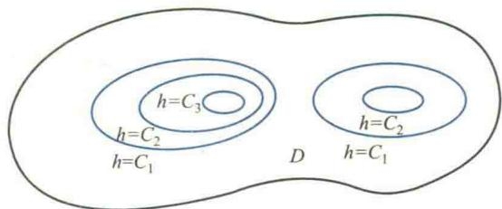
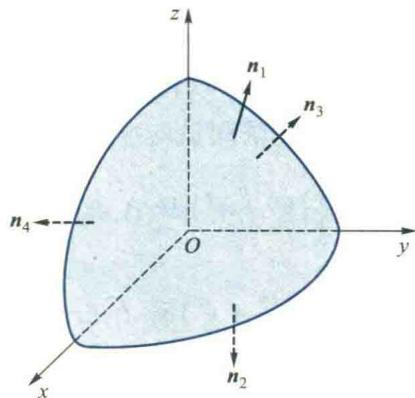
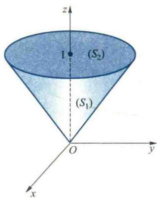

import ExerciseTrigger from '@/components/exercises/ExerciseTrigger.astro';
import QRCodeVideo from '@/components/QRCodeVideo.astro';

import Guide from '@/components/Guide.astro';
import Knowledge from '@/components/Knowledge.astro';
import Example from '@/components/Example.astro';
import Analysis from '@/components/Analysis.astro';
import Solution from '@/components/Solution.astro';
import Variant from '@/components/Variant.astro';
import Note from '@/components/Note.astro';
import SideNote from '@/components/SideNote.astro';
import Block from '@/components/Block.astro';
import Method from '@/components/Method.astro';
import Exercise from '@/components/Exercise.astro';

从这一节开始，我们将介绍多元函数积分中的第二大类型，包括第二型的线积分与面积分。在第一型线积分与面积分中，积分曲线 $(C)$ 与积分曲面 $(S)$ 是不考虑方向的，从而相应的弧长微元 $\mathrm{d}s$ 与曲面积元 $\mathrm{d}S$ 都总是取正值。对于第二型线积分与面积分，积分曲线与积分曲面将必须考虑方向，而且被表达式由两向量的点积构成。这是两类线积分与面积分的差异。

第二型线、面积概念也是为了满足实际问题的需要而引入的，特别是研究各种物理场的需要。因此，本节先介绍场的概念，然后从实例出发分别介绍这两种第二型积分的概念、性质、计算方法以及与第一型积分的关系，它们在场论中的应用将放在第八节中专门介绍。

### 7.1 场的概念

在物理等学科中我们常常研究各种各样的场，如温度场、高度场、电位场、力场、电场强度场、磁场、流速场，等等。一般地，我们把分布着某种物理量的平面或空间区域称为场，在数学上表现为定义在某一区域上的数量值函数或向量值函数。当这个函数为数量值函数时，称为数量场；当这个函数为向量值函数时，称为向量场。例如上述几种场中，温度场、高度场、电位场是数量场，其余的都是向量场。

从数学的观点来看，给定了一个函数，就相当于给定了一个场。若此函数是一数量值函数 $u(M) (M \in (G) \subseteq \mathbf{R}^3)$，则为数量场；若是一向量值函数 $\mathbf{A}(M) (M \in (G) \subseteq \mathbf{R}^3)$，则为向量场。此函数也称为场函数，$(G)$ 称为场域。

如果场中的物理量仅与点 $M$ 的位置有关，不随时间变化，那么这种场称为定常场或稳定场，视场是数量场或向量场分别记作 $u(M)$ 或 $\mathbf{A}(M)$；若场不仅与点 $M$ 的位置有关，而且与时间 $t$ 有关，则称为非定常场或时变场，分别记作 $u(M, t)$ 或 $\mathbf{A}(M, t)$。本节中只讨论定常场。

无论数量场还是向量场，我们都需要从宏观和微观两个方面去研究它们，既要掌握场中物理量的总体分布情况，也要揭示物理量在场中各点的变化规律。

#### 场的几何描述

场的几何描述可以帮助我们直观地解场中物理量的总体分布情况。我们知道给定一个场，在数学上也就是给定了一个函数。对于一个平面或空间的数量场：$u=u(M)=u(x,y), (x,y) \in (D) \subseteq \mathbf{R}^2$ 或 $u=u(M)=u(x,y,z), (x,y,z) \in (G) \subseteq \mathbf{R}^3$，相应的二元函数 $u(x,y)$ 和三元函数 $u(x,y,z)$ 可以分别通过等值线 $u(x,y)=C$ 和等值面 $u(x,y,z)=C$ 来几何表示（见第五章 4.3 节），而等值线（面）的形状和疏密程度可以从宏观上反映该物理量在场内的分布情况。

<Example title="例 7.1 高度场的等高线">
设 $h=h(x,y) ((x,y) \in (D))$ 是在域 $(D)$ 内的一个高度场，等值线 $h(x,y)=C$ 就是其等高线。这些等高线能清晰地反映出场中地势的高低分布情况。例如考察 $h(x,y)=C_i \ (i=1,2,3), C_1 < C_2 < C_3$，如图 6.49 所示。由这些等高线不难看出，该地区 $(D)$ 内东西两边各有一个小山包，西边的山较高，东边较低，西边的山靠东侧比较陡峭，靠西侧比较平缓，我们通常见到的地形图就是利用等高线绘制的。
</Example>

<figure class="vp-figure">
  
  <figcaption>图 6.49 高度场的等高线示意图</figcaption>
</figure>

<Example title="例 7.2 电位场的等值面">
设有一带电量为 $q$ 的点电荷，在空间形成一个电位场。若建立坐标系，并将此点电荷所在位置取作坐标原点，则电位场可表示为

$$

u = \frac{q}{4\pi\varepsilon r} \quad (r \neq 0), \tag{7.1}

$$

其中 $\varepsilon$ 为介电系数，$r=\sqrt{x^2+y^2+z^2}$。该电位场的等值面 $u=C$ 的方程为

$$

x^2 + y^2 + z^2 = R^2 \quad \left(R = \frac{q}{4\pi\varepsilon C}\right), \tag{7.2}

$$

它是一族以坐标原点为球心的球面。由此可见，在每一球面上电位均相同，而且半径 $R$ 越大的球面上电位的值 $C$ 越小。
</Example>

对于数量场 $u(x,y,z) ((x,y,z) \in (G))$，容易看出，场 $(G)$ 内任一点 $(x_0, y_0, z_0)$ 必位于等值面 $u(x,y,z)=u(x_0, y_0, z_0)$ 上；又由于 $u$ 为单值函数，因而任意两个不同等值面不会相交。

等值线（面）是宏观了解数量场分布的一种方法，对数量场微观的研究主要是研究函数 $u=u(M)$ 在各点的性质和变化情况，沿各个方向变化的快慢程度，以及沿何方向变化最大等，这就是第五章第三节中讨论过的方向导数和梯度。

对于一个空间的向量场 $\mathbf{A}=\mathbf{A}(M)=\mathbf{A}(x,y,z), (x,y,z) \in (G) \subseteq \mathbf{R}^3$，域 $(G)$ 内任一点都确定着一个向量。我们把 $(G)$ 内这样的曲线称为向量线，它上面每一点切向量的方向，正好与场在此点所确定向量的方向吻合（图 6.50）。例如，若图 6.50 中的向量场是一段河流中的流速场，则向量线就是这段河流中的水的流线，它反映了此向量场中水流动方向的总体分布。

<figure class="vp-figure">
  
  <figcaption>图 6.50 向量场与向量线</figcaption>
</figure>

对于向量场 $\mathbf{A}(M)$，无论宏观和微观的研究都还有一些重要的问题需要讨论。例如，对于河流中的流速场，如果河床不断地有水渗入或渗出，那么我们一方面需要从总体上了解单位时间内通过某一截面水流量的多少，另一方面也需要从微观上考察河床每一点渗入的强度。又如，在具有漩涡的流速场中，我们既要研究沿某一闭合曲线的环流量，也要研究场中各点旋转趋势的大小和方向。为了对向量场进行这些比较深入的研究，需要首先介绍第二型线积分和第二型面积分。

### 7.2 第二型线积分

#### 1. 第二型线积分的概念

首先我们讨论下面一个具体问题。

**力场做功问题** 我们知道，质点在力场中运动，力场将会对其做功。如果力场 $\mathbf{F}$ 的大小和方向始终不变，且质点沿直线运动。那么，质点每运动单位长度，力场所做的功均相同，换句话说，功是随质点运动均匀变化的。这时，当质点从点 $A$ 沿直线运动到点 $B$ 时，力场所做的功 $W$ 可通过向量点积公式得到

$$

W = \mathbf{F} \cdot \overrightarrow{AB}. \tag{7.1}

$$

现在考察质点 $M$ 沿曲线 $\overline{AB}$ 运动，且力场 $\mathbf{F}(M)$ 随点 $M$ 的位置不同而变化，显然，$\mathbf{F}$ 所做的功是非均匀变化的。为了利用均匀变化的公式 (7.1) 来处理此非均匀变化问题，我们仍可通过“分”“匀”“合”“精”的步骤来实现。

**分** 从点 $A$ 到点 $B$ 依次插入 $n-1$ 个点 $M_1, M_2, \cdots, M_{n-1}$，把曲线段 $\overline{AB}$ 分成 $n$ 个有向小弧段，并把点 $A$ 与 $B$ 分别记作 $M_0$ 与 $M_n$（图 6.51）。

**匀** 由于各小段有向弧 $\overline{M_{k-1}M_k}$ 很短，可以近似地看作是弦向量 $\overrightarrow{M_{k-1}M_k}$，而且 $\mathbf{F}(M)$ 在其上变化不大，可以近似地用地 $\overline{M_{k-1}M_k}$ 上任一点 $\overline{M_k}$ 处的力 $\mathbf{F}(\overline{M_k})$ 代替，于是当质点从 $\overline{M_{k-1}M_k}$ 移动到点 $\overline{M_k}$ 时，力场 $\mathbf{F}$ 所做的功便可以近似地用地均匀变化的公式 (7.1) 来求，即

$$

\Delta W_k \approx \mathbf{F}(\overline{M_k}) \cdot \overrightarrow{M_{k-1}M_k}, \quad k=1, 2, \cdots, n.

$$

**合** 把沿各有向小弧段上所做的功相加，便得到所求功的近似值

$$

W = \sum_{k=1}^n \Delta W_k \approx \sum_{k=1}^n \mathbf{F}(\overline{M_k}) \cdot \overrightarrow{M_{k-1}M_k}.

$$

**精** 当各小段弧长的最大值 $d \to 0$ 时，便得到所求功的精确值

$$

W = \lim_{d \to 0} \sum_{k=1}^n \mathbf{F}(\overline{M_k}) \cdot \overrightarrow{M_{k-1}M_k}.

$$

将上述和式极限抽象化就得到第二型线积分的定义。

<Knowledge title="定义 7.1 (第二型线积分)">
设 $(C)$ 是向量场 $\mathbf{A}(M)$ 所在区域中的一条以 $A$ 为起点、$B$ 为终点且可求长的有向曲线，$\mathbf{A}(M)$ 在 $(C)$ 上有界。
在 $(C)$ 上自起点 $A$ (记作 $M_0$) 到终点 $B$ (记作 $M_n$) 依次任意插入 $n-1$ 个点 $M_1, M_2, \cdots, M_{n-1}$，把 $(C)$ 分成 $n$ 个有向小弧段。
在每一有向小弧段 $\overline{M_{k-1}M_k}$ 上任取一点 $\overline{M_k}$，作点积

$$

\mathbf{A}(\overline{M_k}) \cdot \overrightarrow{M_{k-1}M_k}, \quad k=1, 2, \cdots, n.

$$

将各小弧段所对应的点积相加得和式

$$

\sum_{k=1}^n \mathbf{A}(\overline{M_k}) \cdot \overrightarrow{M_{k-1}M_k}.

$$

如果无论 $(C)$ 被怎样划分，点 $\overline{M_k}$ 在 $\overline{M_{k-1}M_k}$ 上被怎样选取，当所有小弧段的最大长度 $d \to 0$ 时上述和式都趋于同一常数，则此极限值为向量值函数 (或向量场) $\mathbf{A}(M)$ 沿有向曲线 $(C)$ 的第二型曲线积分，简称为第二型线积分，记作

$$

\int_{(C)} \mathbf{A}(M) \cdot \mathrm{d}\mathbf{s} = \lim_{d \to 0} \sum_{k=1}^n \mathbf{A}(\overline{M_k}) \cdot \overrightarrow{M_{k-1}M_k}. \tag{7.2}

$$

此时，称向量值函数 $\mathbf{A}(M)$ 在曲线 $(C)$ 上可积。
</Knowledge>

<SideNote title="注意">
第二型与第一型线积分的主要差别在于：第一型线积分中，积分微元 $f(M)\mathrm{d}s$ 是两数量的乘积，积分路径没有方向性，$\mathrm{d}s$ 是弧微分，它始终为正；第二型线积分中，积分微元 $\mathbf{A}(M) \cdot \mathrm{d}\mathbf{s}$ 是两向量的点积，积分路径 $(C)$ 具有方向性，沿 $(AB)$ 积分与沿 $(BA)$ 积分，由于其中分点的顺序相反，向量 $\overrightarrow{M_{k-1}M_k}$ 反向，从而积分的值变号。
</SideNote>

当需要注明曲线 $(C)$ 的起点 $A$ 与终点 $B$ 时，将 $\int_{(C)} \mathbf{A}(M) \cdot \mathrm{d}\mathbf{s}$ 记为 $\int_{(AB)} \mathbf{A}(M) \cdot \mathrm{d}\mathbf{s}$。

这个定义是第二型线积分的向量形式。在直角坐标系下，也可以把它表示为坐标形式。

设 $(C)$ 为空间曲线，在直角坐标系下，$\mathbf{A}(M) = (P(x,y,z), Q(x,y,z), R(x,y,z))$。把各小段的弦向量 $\overrightarrow{M_{k-1}M_k}$ 写成分量形式

$$

\overrightarrow{M_{k-1}M_k} = (\Delta x_k, \Delta y_k, \Delta z_k),

$$

其中 $\Delta x_k, \Delta y_k, \Delta z_k$ 分别为 $\overrightarrow{M_{k-1}M_k}$ 在 $x, y, z$ 三个坐标轴上的投影。将点 $\overline{M_k}$ 的坐标标记为 $(\xi_k, \eta_k, \zeta_k)$，于是定义中的和式极限可写成

$$

\lim_{d \to 0} \sum_{k=1}^n [P(\xi_k, \eta_k, \zeta_k) \Delta x_k + Q(\xi_k, \eta_k, \zeta_k) \Delta y_k + R(\xi_k, \eta_k, \zeta_k) \Delta z_k],

$$

这个极限相应地记作

$$

\int_{(C)} P(x,y,z) \mathrm{d}x + Q(x,y,z) \mathrm{d}y + R(x,y,z) \mathrm{d}z, \tag{7.3}

$$

就是第二型线积分的坐标形式。因此，第二型线积分也称为对坐标的线积分。

由第二型线积分的定义可知，力场 $\mathbf{F}$ 将质点由点 $A$ 沿曲线 $(C)$ 移至点 $B$ 时所做的功为

$$

W = \int_{(C)} \mathbf{F} \cdot \mathrm{d}\mathbf{s} = \int_{(C)} P(x,y,z) \mathrm{d}x + Q(x,y,z) \mathrm{d}y + R(x,y,z) \mathrm{d}z,

$$

其中 $\mathbf{F} = (P, Q, R)$。

#### 2. 第二型线积分的性质

设以下所讨论的第二型线积分均存在。

**性质 1** 如果把积分路径 $(C)$ 的方向反过来 (记作 $(-C)$)，那么积分的值将改变符号，即

$$

\int_{(C)} \mathbf{A}(M) \cdot \mathrm{d}\mathbf{s} = -\int_{(-C)} \mathbf{A}(M) \cdot \mathrm{d}\mathbf{s}.

$$

**性质 2** 设 $A, B, P$ 为曲线 $(C)$ 上任意三点，则

$$

\int_{(AB)} \mathbf{A}(M) \cdot \mathrm{d}\mathbf{s} = \int_{(AP)} \mathbf{A}(M) \cdot \mathrm{d}\mathbf{s} + \int_{(PB)} \mathbf{A}(M) \cdot \mathrm{d}\mathbf{s}.

$$

**性质 3** 如果由闭合曲线 $(C)$ 所围成的平面区域被划分为两个无公共内点的区域 $(\sigma_1)$ 和 $(\sigma_2)$，它们的边界分别记作 $(C_1)$ 和 $(C_2)$（图 6.52），那么沿闭合曲线 $(C)$ 的第二型线积分 $\oint_{(C)} P\mathrm{d}x + Q\mathrm{d}y$ 等于按同一方向闭合曲线 $(C_1)$ 和 $(C_2)$ 的第二型线积分之和，即

$$

\oint_{(C)} P\mathrm{d}x + Q\mathrm{d}y = \oint_{(C_1)} P\mathrm{d}x + Q\mathrm{d}y + \oint_{(C_2)} P\mathrm{d}x + Q\mathrm{d}y,

$$

其中曲线 $(C), (C_1), (C_2)$ 或者都取正向，或者都取负向 $\textcircled{1}$。

<figure class="vp-figure">
  
  <figcaption>图 6.52 闭合曲线分割区域示意图</figcaption>
</figure>

<SideNote title="注">
$\textcircled{1}$ 闭合曲线 $(C)$ 的正向如下确定：沿闭合曲线 $(C)$ 行走使 $(C)$ 所围的区域始终位于人的左侧，反之为负向。
</SideNote>

事实上，若三个积分路径都取正向，如图 6.52 所示，则由性质 1 与 2 可得

$$

\oint_{(+C_1)} \mathbf{A}(M) \cdot \mathrm{d}\mathbf{s} + \oint_{(+C_2)} \mathbf{A}(M) \cdot \mathrm{d}\mathbf{s}

$$

$$
= \int_{(ADBA)} \mathbf{A}(M) \cdot \mathrm{d}\mathbf{s} + \int_{(ABEA)} \mathbf{A}(M) \cdot \mathrm{d}\mathbf{s}

$$

$$
= \int_{(ADB)} \mathbf{A}(M) \cdot \mathrm{d}\mathbf{s} + \int_{(BA)} \mathbf{A}(M) \cdot \mathrm{d}\mathbf{s} + \int_{(AB)} \mathbf{A}(M) \cdot \mathrm{d}\mathbf{s} + \int_{(BEA)} \mathbf{A}(M) \cdot \mathrm{d}\mathbf{s}

$$

$$
= \int_{(ADB)} \mathbf{A}(M) \cdot \mathrm{d}\mathbf{s} + \int_{(BEA)} \mathbf{A}(M) \cdot \mathrm{d}\mathbf{s} = \oint_{(+C)} \mathbf{A}(M) \cdot \mathrm{d}\mathbf{s}.

$$

将上式两端同乘以 $-1$，并利用性质 1 就有

$$

\oint_{(-C_1)} \mathbf{A}(M) \cdot \mathrm{d}\mathbf{s} + \oint_{(-C_2)} \mathbf{A}(M) \cdot \mathrm{d}\mathbf{s} = \oint_{(-C)} \mathbf{A}(M) \cdot \mathrm{d}\mathbf{s}.

$$

#### 3. 第二型线积分的计算

设光滑有向曲线 $(C)$ 的参数方程是

$$

\mathbf{r} = \mathbf{r}(t) = (x(t), y(t), z(t)) \quad (\alpha \le t \le \beta),

$$

$t=\alpha$ 对应于 $(C)$ 的起点 $A$，$t=\beta$ 对应于 $(C)$ 的终点 $B$。又设向量值函数

$$

\mathbf{A} = \mathbf{A}(x,y,z) = (P(x,y,z), Q(x,y,z), R(x,y,z))

$$

在曲线 $(C)$ 上连续，这时第二型线积分 $\int_{(C)} \mathbf{A}(M) \cdot \mathrm{d}\mathbf{s}$ 存在，于是可以通过和式极限，用推导第一型线积分计算公式类似的方法

$$

\begin{aligned}
\int_{(C)} P(x,y,z) \, \mathrm{d}x &= \int_{\alpha}^{\beta} P[x(t), y(t), z(t)] \dot{x}(t) \, \mathrm{d}t, \\
\int_{(C)} Q(x,y,z) \, \mathrm{d}y &= \int_{\alpha}^{\beta} Q[x(t), y(t), z(t)] \dot{y}(t) \, \mathrm{d}t, \\
\int_{(C)} R(x,y,z) \, \mathrm{d}z &= \int_{\alpha}^{\beta} R[x(t), y(t), z(t)] \dot{z}(t) \, \mathrm{d}t.
\end{aligned}

$$

从而有

$$

\int_{(C)} P\,\mathrm{d}x + Q\,\mathrm{d}y + R\,\mathrm{d}z = \int_{\alpha}^{\beta} \{P[x(t), y(t), z(t)]\dot{x}(t) + Q[x(t), y(t), z(t)]\dot{y}(t) + R[x(t), y(t), z(t)]\dot{z}(t)\} \, \mathrm{d}t. \tag{7.5}

$$

<Knowledge title="定义 7.2 (第二型曲面积分)">
设在向量场 $\boldsymbol{A}(M)$ 的场域中有一可求面积的有向曲面 $(S)$，指定它的一侧。
把曲面 $(S)$ 任意划分成 $n$ 小片 $(\Delta S_1), (\Delta S_2), \cdots, (\Delta S_n)$。
任取一点 $M_k \in (\Delta S_k)$，作点积

$$

\boldsymbol{A}(M_k) \cdot \boldsymbol{e}_n(M_k)\Delta S_k \quad (k = 1, 2, \cdots, n),

$$

其中 $\boldsymbol{e}_n(M_k)$ 是曲面在点 $M_k$ 处指向给定侧的单位法向量，$\Delta S_k$ 表示 $(\Delta S_k)$ 的面积。
作和式

$$

\sum_{k=1}^n \boldsymbol{A}(M_k) \cdot \boldsymbol{e}_n(M_k)\Delta S_k.

$$

如果不论曲面 $(S)$ 怎样划分，点 $M_k$ 在 $(\Delta S_k)$ 上怎样选取，当各小曲面 $(\Delta S_k)$ 直径的最大值 $d \to 0$ 时上述和式都趋于同一常数，则此极限值为向量场 $\boldsymbol{A}(M)$ 沿有向曲面 $(S)$ 的**第二型曲面积分**，简称为**第二型面积分**，记作

$$

\iint_{(S)} \boldsymbol{A}(M) \cdot \mathrm{d}\boldsymbol{S} = \lim_{d \to 0} \sum_{k=1}^n \boldsymbol{A}(M_k) \cdot \boldsymbol{e}_n(M_k)\Delta S_k. \tag{7.8}

$$

其中 $\mathrm{d}\boldsymbol{S} = \boldsymbol{e}_n \mathrm{d}S$ 称为曲面面积微向量。
</Knowledge>

<SideNote title="注意">
(7.8) 式的右端 $\boldsymbol{A}(M_k) \cdot \boldsymbol{e}_n(M_k)$ 是一个标量，所以这个和式和极限实际上是一个第一型曲面积分 $\iint_{(S)} \boldsymbol{A}(M) \cdot \boldsymbol{e}_n \mathrm{d}S$，但其被积函数中包含着积分曲面 $(S)$ 的法线方向，此方向确定了积分值的符号。我们把这个含有曲面法线方向的第一型曲面积分称为第二型曲面积分。
</SideNote>

<QRCodeVideo id="6.7.2" title="第二型曲面积分中 $\mathrm{d}\boldsymbol{S}$ 的几何意义" url="#" />

### 坐标形式与计算公式

在直角坐标系下，也可以把此定义用坐标形式给出。设

$$

\boldsymbol{A}(M) = (P(x, y, z), Q(x, y, z), R(x, y, z)), \quad \boldsymbol{e}_n(M) = (\cos\alpha, \cos\beta, \cos\gamma), \quad M_k = (\xi_k, \eta_k, \zeta_k),

$$

则有

$$

\begin{aligned}
\iint_{(S)} \boldsymbol{A}(M) \cdot \mathrm{d}\boldsymbol{S} &= \lim_{d \to 0} \sum_{k=1}^n \boldsymbol{A}(M_k) \cdot \boldsymbol{e}_n(M_k)\Delta S_k \\
&= \lim_{d \to 0} \sum_{k=1}^n [P(\xi_k, \eta_k, \zeta_k)\Delta S_k\cos\alpha + Q(\xi_k, \eta_k, \zeta_k)\Delta S_k\cos\beta + R(\xi_k, \eta_k, \zeta_k)\Delta S_k\cos\gamma] \\
&= \iint_{(S)} [P(x, y, z)\cos\alpha\,\mathrm{d}S + Q(x, y, z)\cos\beta\,\mathrm{d}S + R(x, y, z)\cos\gamma\,\mathrm{d}S], \tag{7.9}
\end{aligned}

$$

其中 $\mathrm{d}S = \|\mathrm{d}\boldsymbol{S}\|$。类似于本章 (6.12) 式可知，$\cos\alpha\,\mathrm{d}S, \cos\beta\,\mathrm{d}S, \cos\gamma\,\mathrm{d}S$ 分别是曲面面积微向量 $\mathrm{d}\boldsymbol{S}$ 在 $yoz, zox, xoy$ 坐标平面上的有向投影，把它们分别记成 $\mathrm{dy} \wedge \mathrm{dz}, \mathrm{dz} \wedge \mathrm{dx}, \mathrm{dx} \wedge \mathrm{dy}$，即

$$

\mathrm{d}\boldsymbol{S} = (\mathrm{dy} \wedge \mathrm{dz}, \mathrm{dz} \wedge \mathrm{dx}, \mathrm{dx} \wedge \mathrm{dy}),

$$

或

$$

\mathrm{d}S\cos\alpha = \mathrm{dy} \wedge \mathrm{dz}, \quad \mathrm{d}S\cos\beta = \mathrm{dz} \wedge \mathrm{dx}, \quad \mathrm{d}S\cos\gamma = \mathrm{dx} \wedge \mathrm{dy}. \tag{7.10}

$$

于是 (7.9) 式可写成

$$

\iint_{(S)} \boldsymbol{A}(M) \cdot \mathrm{d}\boldsymbol{S} = \iint_{(S)} P(x, y, z)\,\mathrm{dy} \wedge \mathrm{dz} + Q(x, y, z)\,\mathrm{dz} \wedge \mathrm{dx} + R(x, y, z)\,\mathrm{dx} \wedge \mathrm{dy}. \tag{7.11}

$$

上式右端就是第二型曲面积分的坐标形式，因此第二型曲面积分也称为对坐标的面积分。

<SideNote title="注">
与第二型线积分一样，由 (7.11) 式可见，第二型面积分实际上也是三个积分的组合，它们也可以单独出现。例如：
若 $\boldsymbol{A}(M) = (0, 0, R(x, y, z))$，则

$$

\iint_{(S)} \boldsymbol{A}(M) \cdot \mathrm{d}\boldsymbol{S} = \iint_{(S)} R(x, y, z)\,\mathrm{dx} \wedge \mathrm{dy}.

$$

</SideNote>

### 3. 第二型面积分的性质

与第二型线积分类似，第二型面积分有以下性质：

- **性质 1** 若改变积分曲面的侧，则积分的值反号，即
  $$

  \iint_{(+S)} \boldsymbol{A} \cdot \mathrm{d}\boldsymbol{S} = -\iint_{(-S)} \boldsymbol{A} \cdot \mathrm{d}\boldsymbol{S}.
  $$

- **性质 2** 若把曲面 $(S)$ 分成 $(S_1)$ 与 $(S_2)$ 两块，$(S) = (S_1) \cup (S_2)$，则
  $$

  \iint_{(S)} \boldsymbol{A} \cdot \mathrm{d}\boldsymbol{S} = \iint_{(S_1)} \boldsymbol{A} \cdot \mathrm{d}\boldsymbol{S} + \iint_{(S_2)} \boldsymbol{A} \cdot \mathrm{d}\boldsymbol{S},
  $$

  其中等式两端的积分曲面同侧。
- **性质 3** 若有向闭曲面 $(S)$ 所围空间区域 $(V)$ 被另一位于 $(V)$ 内部的曲面分成了两个区域 $(V_1), (V_2)$，其边界曲面分别记作 $(S_1), (S_2)$，则
  $$

  \oint_{(S)} \boldsymbol{A} \cdot \mathrm{d}\boldsymbol{S} = \oint_{(S_1)} \boldsymbol{A} \cdot \mathrm{d}\boldsymbol{S} + \oint_{(S_2)} \boldsymbol{A} \cdot \mathrm{d}\boldsymbol{S},
  $$

  其中等式两端曲面或者均取外侧，或者均取内侧。

<SideNote title="想一想">
试用第二型线积分性质的证明方法，证明第二型面积分的性质。
</SideNote>

---

### 4. 第二型面积分的计算

为简单起见，我们仅讨论积分曲面可用显式方程 $z = z(x, y)$ （或 $x = x(y, z), y = y(z, x)$）表出的情形。

设有向曲面 $(S)$ 的方程为 $z = z(x, y)$，$(S)$ 在 $xoy$ 坐标平面上的投影区域为 $(\sigma_{xy})$。于是由 (7.9) 式与 (7.11) 式可知

$$

\iint_{(S)} R(x, y, z)\,\mathrm{dx} \wedge \mathrm{dy} = \iint_{(S)} R(x, y, z)\cos\gamma\,\mathrm{d}S.

$$

注意到 $\cos\gamma\,\mathrm{d}S = \pm \mathrm{d}\sigma_{xy}$，把上式右端的第一型曲面积分化成二重积分得

$$

\iint_{(S)} R(x, y, z)\cos\gamma\,\mathrm{d}S = \pm \iint_{(\sigma_{xy})} R[x, y, z(x, y)]\,\mathrm{d}\sigma_{xy}.

$$

用直角坐标网来划分积分分域 $(\sigma_{xy})$，有 $\mathrm{d}\sigma_{xy} = \mathrm{dx}\mathrm{dy}$，于是得

$$

\iint_{(S)} R(x, y, z)\,\mathrm{dx} \wedge \mathrm{dy} = \pm \iint_{(\sigma_{xy})} R[x, y, z(x, y)]\,\mathrm{dx}\mathrm{dy}. \tag{7.12}

$$

(7.12) 式右端为函数 $R[x, y, z(x, y)]$ 在平面区域 $(\sigma_{xy})$ 上的二重积分。当沿曲面的上侧（即 $\boldsymbol{n}$ 与 $z$ 轴正向夹角为锐角）积分时，(7.12) 式右端积分前的符号取正号，沿下侧积分时取负号。

同理，当 $(S)$ 的方程可用 $x = x(y, z)$ 或 $y = y(z, x)$ 表出时，分别有

$$

\iint_{(S)} P(x, y, z)\,\mathrm{dy} \wedge \mathrm{dz} = \pm \iint_{(\sigma_{yz})} P[x(y, z), y, z]\,\mathrm{dydz}, \tag{7.13}

$$

$$
\iint_{(S)} Q(x, y, z)\,\mathrm{dz} \wedge \mathrm{dx} = \pm \iint_{(\sigma_{zx})} Q[x, z(x, z), z]\,\mathrm{dzdx}, \tag{7.14}

$$

其中 $(\sigma_{yz})$ 与 $(\sigma_{zx})$ 分别为 $(S)$ 在 $yoz$ 与 $zox$ 平面上的投影区域。当沿曲面 $(S)$ 的前侧（即 $\boldsymbol{n}$ 与 $x$ 轴正向夹角为锐角）积分时，(7.13) 式右端的符号取“$+$”，沿后侧时取“$-$”；当沿 $(S)$ 的右侧（即 $\boldsymbol{n}$ 与 $y$ 轴正向夹角为锐角）积分时，(7.14) 式右端的符号取“$+$”，沿左侧时取“$-$”。

---

<Example title="例 7.7 计算面积分 $\iint_{(S)} z\,\mathrm{dx} \wedge \mathrm{dy}$">
其中 $(S)$ 为球面 $x^2 + y^2 + z^2 = R^2$ 在第一卦限的部分与各坐标面所围成立体表面的外侧。
</Example>

<Solution title="解">
把 $(S)$ 分成四部分：球面部分记作 $(S_1)$；$xoy$ 平面、$yoz$ 平面以及 $zox$ 平面上三个四分之一的圆域，分别记作 $(S_2), (S_3)$ 和 $(S_4)$，它们的法向量均指向所围立体表面的外侧（图 6.58）。

<figure class="vp-figure">
  
  <figcaption>图 6.58 例 7.7 示意图</figcaption>
</figure>

曲面 $(S_1)$ 的方程为

$$

z = \sqrt{R^2 - x^2 - y^2},

$$

它在 $xoy$ 平面上的投影区域为 $(\sigma_{xy}) = \{(x, y) \mid x^2 + y^2 \le R^2, x \ge 0, y \ge 0\}$。注意到 $(S_1)$ 的法向量指向上方，它与 $z$ 轴正向的夹角为锐角，应用公式 (7.12) 得

$$

\iint_{(S_1)} z\,\mathrm{dx} \wedge \mathrm{dy} = \iint_{(\sigma_{xy})} \sqrt{R^2 - x^2 - y^2}\,\mathrm{dx}\mathrm{dy} = \frac{1}{6}\pi R^3.

$$

$(S_2)$ 的方程为 $z = 0$，其投影区域仍为 $(\sigma_{xy})$，这时由意法向量指向下方，于是

$$

\iint_{(S_2)} z\,\mathrm{dx} \wedge \mathrm{dy} = -\iint_{(\sigma_{xy})} 0\,\mathrm{dx}\mathrm{dy} = 0.

$$

由于 $(S_3)$ 与 $(S_4)$ 的法向量 $\boldsymbol{n}$ 均与 $z$ 轴垂直，故它们在 $xoy$ 平面上的投影均为零，即 $\mathrm{dx}\mathrm{dy} = 0$，从而沿这两片曲面上的面积分均为零。因此

$$

I = \frac{1}{6}\pi R^3.

$$

</Solution>

---

<Example title="例 7.8">

例 7.8 计算 $I = \oint_{(S)} (x^2 + y^2)\,\mathrm{dy} \wedge \mathrm{dz} + z\,\mathrm{dx} \wedge \mathrm{dy}$

其中 $(S)$ 为柱面 $x^2 + y^2 = R^2$ 与 $z = 0, z = H \ (H > 0)$ 所围柱体表面的外侧。
</Example>

<Solution title="解法一">
把 $(S)$ 分成三部分：柱面部分 $(S_1)$，下底面 $(S_2)$，上底面 $(S_3)$（图 6.59）。

<figure class="vp-figure">
  
  <figcaption>图 6.59 例 7.8 示意图</figcaption>
</figure>

先计算积分 $\oint_{(S)} (x^2 + y^2)\,\mathrm{dy} \wedge \mathrm{dz}$，这里微元 $\mathrm{dy} \wedge \mathrm{dz}$ 表示要求 $(S)$ 向 $yoz$ 平面投影，故把柱面 $(S_1)$ 分成前后两片分别记作 $(S_{11})$ 和 $(S_{12})$，它们的方程分别为

$$

x = \sqrt{R^2 - y^2}, \quad x = -\sqrt{R^2 - y^2}, \quad |y| \le R,

$$

这两片柱面在 $yoz$ 平面的投影区域为

$$

(\sigma_{yz}) = \{(y, z) \mid |y| \le R, 0 \le z \le H\}.

$$

据题意可知 $(S_{11})$ 与 $(S_{12})$ 的法向量和 $x$ 轴正向的夹角分别为锐角与钝角，再注意到 $(S_2)$ 与 $(S_3)$ 的法向量均垂直于 $x$ 轴，可得

$$

\begin{aligned}
&\oint_{(S)} (x^2 + y^2)\,\mathrm{dy} \wedge \mathrm{dz} \\
&= \iint_{(S_{11})} (x^2 + y^2)\,\mathrm{dy} \wedge \mathrm{dz} + \iint_{(S_{12})} (x^2 + y^2)\,\mathrm{dy} \wedge \mathrm{dz} + \iint_{(S_2)} (x^2 + y^2)\,\mathrm{dy} \wedge \mathrm{dz} + \iint_{(S_3)} (x^2 + y^2)\,\mathrm{dy} \wedge \mathrm{dz} \\
&= \iint_{(\sigma_{yz})} [(R^2 - y^2) + y^2]\,\mathrm{dydz} - \iint_{(\sigma_{yz})} [(R^2 - y^2) + y^2]\,\mathrm{dydz} = 0.
\end{aligned}

$$

再计算第二个积分 $\oint_{(S)} z\,\mathrm{dx} \wedge \mathrm{dy}$。
由于柱面 $(S_1)$ 在 $xoy$ 平面的投影为圆周，面积为零，$(S_2)$ 与 $(S_3)$ 在 $xoy$ 面上的投影区域均为 $(\sigma_{xy}) = \{(x, y) \mid x^2 + y^2 \le R^2\}$，注意到法向量的指向，可得

$$

\oint_{(S)} z\,\mathrm{dx} \wedge \mathrm{dy} = \iint_{(S_2)} z\,\mathrm{dx} \wedge \mathrm{dy} + \iint_{(S_3)} z\,\mathrm{dx} \wedge \mathrm{dy} = -\iint_{(\sigma_{xy})} 0\,\mathrm{dx}\mathrm{dy} + \iint_{(\sigma_{xy})} H\mathrm{dx}\mathrm{dy} = \pi R^2 H,

$$

因此

$$

I = \pi R^2 H.

$$

</Solution>

<Solution title="解法二">
在计算第二型面积分 $\iint_{(S)} (x^2 + y^2)\,\mathrm{dy} \wedge \mathrm{dz}$ 时，利用对称性更为简便。由于柱面 $(S_1) : x^2 + y^2 = R^2$ 关于 $yoz$ 坐标平面对称，而被积函数是 $x$ 的偶函数，从而可以断定 $\iint_{(S_1)} (x^2 + y^2)\,\mathrm{dy} \wedge \mathrm{dz} = 0$。

其余部分的计算与解法一相同，于同样可得 $I = \pi R^2 H$。
</Solution>

<QRCodeVideo id="6.7.4" title="怎样利用对称性计算第二型线(面)积分" url="#" />

---

<Example title="例 7.9 计算向量 $\boldsymbol{r} = (x, y, z)$ 对有向曲面 $(S)$ 的通量">
(1) $(S)$ 为球面 $x^2 + y^2 + z^2 = 1$ 的外侧；
(2) $(S)$ 为锥面 $z = \sqrt{x^2 + y^2}$ 与平面 $z = 1$ 所围成锥体表面的外侧。
</Example>

<Solution title="解">
这里我们直接利用向量的运算来计算更为方便。由通量定义可知

$$

\Phi = \oint_{(S)} \boldsymbol{r} \cdot \mathrm{d}\boldsymbol{S} = \oint_{(S)} \boldsymbol{r} \cdot \boldsymbol{e}_n \mathrm{d}S.

$$

(1) 当 $(S)$ 为球面时，由于 $\boldsymbol{r}$ 与 $\boldsymbol{e}_n$ 平行同向，故

$$

\boldsymbol{r} \cdot \boldsymbol{e}_n = |\boldsymbol{r}| = 1,

$$

从而

$$

\Phi = \oint_{(S)} \mathrm{d}S = 4\pi.

$$

<figure class="vp-figure">
  
  <figcaption>图 6.60 例 7.9 示意图</figcaption>
</figure>

(2) 把锥体表面分成锥面部分 $(S_1)$ 和底平面部分 $(S_2)$（图 6.60）。在锥面 $(S_1)$ 上，由于 $\boldsymbol{r} \perp \boldsymbol{e}_n$，从而 $\boldsymbol{r} \cdot \boldsymbol{e}_n = 0$，故

$$

\iint_{(S_1)} \boldsymbol{r} \cdot \mathrm{d}\boldsymbol{S} = \iint_{(S_1)} \boldsymbol{r} \cdot \boldsymbol{e}_n \mathrm{d}S = 0.

$$

在底平面 $(S_2)$ 上，由于

$$

\boldsymbol{r} \cdot \boldsymbol{e}_n = (x, y, 1) \cdot (0, 0, 1) = 1,

$$

从而

$$

\iint_{(S_2)} \boldsymbol{r} \cdot \mathrm{d}\boldsymbol{S} = \iint_{(S_2)} \mathrm{d}S = \pi,

$$

所以

$$

\Phi = \oint_{(S)} \boldsymbol{r} \cdot \mathrm{d}\boldsymbol{S} = \pi.

$$

</Solution>

<ExerciseTrigger chapter={6} section="6.7" title="6.7 第二型线积分与面积分 课后真题与自测练习" />
