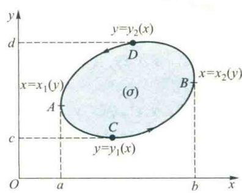
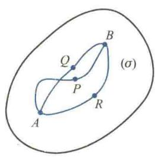
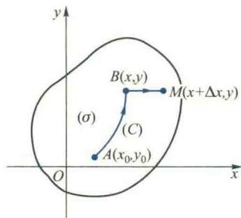
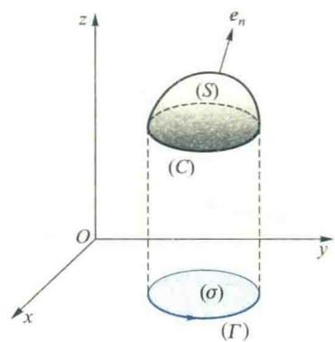
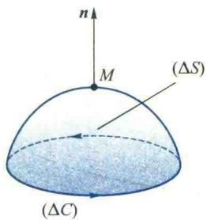
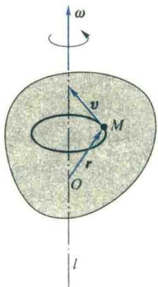
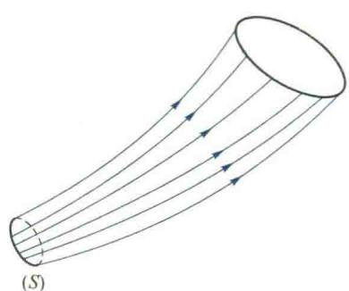

import ExerciseTrigger from '@/components/exercises/ExerciseTrigger.astro';
import QRCodeVideo from '@/components/QRCodeVideo.astro';

import Guide from '@/components/Guide.astro';
import Knowledge from '@/components/Knowledge.astro';
import Example from '@/components/Example.astro';
import Analysis from '@/components/Analysis.astro';
import Solution from '@/components/Solution.astro';
import Variant from '@/components/Variant.astro';
import Note from '@/components/Note.astro';
import SideNote from '@/components/SideNote.astro';
import Block from '@/components/Block.astro';
import Method from '@/components/Method.astro';
import Exercise from '@/components/Exercise.astro';

在多元微积分中，我们已经学习了重积分、曲线积分与曲面积分。本节探讨这些积分之间的内在联系（Green 公式、Gauss 公式、Stokes 公式），并建立场论基础（梯度、散度、旋度）。

第八节 各种积分的联系及其在场论中的应用

在多元函数积分中，我们已经学过二重积分、三重积分、两种线积分和两种面积分。本节，我们首先要建立这些积分之间的联系，并利用这些积分及其联系对场作进一步的研究。

## 8.1 Green 公式

Green 公式反映了第二型平面线积分与二重积分的联系。

在讲解这个定理之前，需要对平面区域作些进一步的说明。若区域 $(\sigma)$ 内任意一条闭曲线的内部全部属于 $(\sigma)$，或者说 $(\sigma)$ 内任一闭曲线均可在 $(\sigma)$ 内连续变形缩小成 $(\sigma)$ 内的一点，则称 $(\sigma)$ 是**单连通域**；否则称为**复连通域**。例如，图 6.61 中所示的两个区域 $(\sigma)$ 首都复连通域。

<figure class="vp-figure">
  
  <figcaption>图 6.61</figcaption>
</figure>

<SideNote title="注意">
由一条分段光滑的简单闭曲线所围成的区域一定是单连通域。
</SideNote>

<Knowledge title="定理 8.1 (Green 公式)">
设平面有界闭域 $(\sigma)$ 由一条分段光滑的简单闭曲线所围成，$(\sigma)$ 的边界曲线记为 $(C)$，函数 $P, Q \in C^{(1)}((\sigma))$。则下述的 Green 公式成立：

$$

\iint_{(\sigma)} \left( \frac{\partial Q}{\partial x} - \frac{\partial P}{\partial y} \right) \mathrm{d}\sigma = \oint_{(+C)} P(x, y)\,\mathrm{d}x + Q(x, y)\,\mathrm{d}y \tag{8.1}

$$

其中 $(+C)$ 表示 $(C)$ 为正向。
</Knowledge>

<Solution title="证明">
公式 $(8.1)$ 左端是一个二重积分，右端是一个第二型线积分。在所给的条件下，它们都可以化为定积分。因此，要证明等式 $(8.1)$ 成立，只需把它们都化为定积分加以验证即可。

首先，设积分域 $(\sigma)$ 既是 $x$ 型区域又是 $y$ 型区域，即 $(\sigma)$ 既可表示为

$$

y_1(x) \leqslant y \leqslant y_2(x) \quad (a \leqslant x \leqslant b),

$$

也可以表示为

$$

x_1(y) \leqslant x \leqslant x_2(y) \quad (c \leqslant y \leqslant d).

$$

其中曲线 $y = y_i(x)$ 与 $x = x_i(y)$ ($i = 1, 2$) 如图 6.62 所示。

<figure class="vp-figure">
  
  <figcaption>图 6.62</figcaption>
</figure>

由二重积分的计算法得

$$

-\iint_{(\sigma)} \frac{\partial P}{\partial y} \mathrm{d}\sigma = \int_a^b \mathrm{d}x \int_{y_1(x)}^{y_2(x)} -\frac{\partial P}{\partial y} \mathrm{d}y = \int_a^b \left[ P(x, y_2(x)) - P(x, y_1(x)) \right] \mathrm{d}x.

$$

另一方面，由第二型线积分的计算法得

$$

\begin{aligned}
\oint_{(+C)} P(x, y)\,\mathrm{d}x &= \int_{(ACB)} P\,\mathrm{d}x + \int_{(BDA)} P\,\mathrm{d}x \\
&= \int_a^b P[x, y_1(x)]\,\mathrm{d}x + \int_b^a P[x, y_2(x)]\,\mathrm{d}x \\
&= -\int_a^b \left[ P(x, y_2(x)) - P(x, y_1(x)) \right] \mathrm{d}x,
\end{aligned}

$$

所以

$$

-\iint_{(\sigma)} \frac{\partial P}{\partial y} \mathrm{d}\sigma = \oint_{(+C)} P(x, y)\,\mathrm{d}x.

$$

同理，由 $(\sigma)$ 的表达式 $x_1(y) \leqslant x \leqslant x_2(y)$ ($c \leqslant y \leqslant d$)，可证得

$$

\iint_{(\sigma)} \frac{\partial Q}{\partial x} \mathrm{d}\sigma = \oint_{(+C)} Q\,\mathrm{d}y.

$$

于是，Green 公式 $(8.1)$ 成立。

其次，当 $(\sigma)$ 并非上述“既是 $x$ 型又是 $y$ 型区域”时, 可以把它分割成若干个上述类型的区域。如图 6.63 中的区域 $(\sigma)$ 可分成三个上述类型的子域 $(\sigma_1), (\sigma_2)$ 和 $(\sigma_3)$，在每个子域上 Green 公式均成立，即

$$

\iint_{(\sigma_i)} \left( \frac{\partial Q}{\partial x} - \frac{\partial P}{\partial y} \right) \mathrm{d}\sigma = \oint_{(+C_i)} P(x, y)\,\mathrm{d}x + Q(x, y)\,\mathrm{d}y, \quad i = 1, 2, 3,

$$

其中 $(+C_i)$ 是子域 $(\sigma_i)$ 的正向边界曲线。从而

<figure class="vp-figure">
  
  <figcaption>图 6.63</figcaption>
</figure>

$$

\sum_{i=1}^3 \iint_{(\sigma_i)} \left( \frac{\partial Q}{\partial x} - \frac{\partial P}{\partial y} \right) \mathrm{d}\sigma = \sum_{i=1}^3 \oint_{(+C_i)} P(x, y)\,\mathrm{d}x + Q(x, y)\,\mathrm{d}y.

$$

注意到右端线积分相加时，相邻两域的公共边界上的线积分要在相反方向各取一次，从而对应的积分值相互抵消，所以 Green 公式 $(8.1)$ 仍然成立。因此 Green 公式 $(8.1)$ 对单连通域均成立。
</Solution>

<QRCodeVideo id="6.8.1" title="Green 公式的两种表示形式及其物理意义" url="#" />

应当指出，Green 公式还可以推广到 $(\sigma)$ 是由有限条分段光滑的闭曲线所围成的复连通域的情形。此时，我们可以用切割的方法把 $(\sigma)$ 切割成单连通域。例如，在图 6.64(a) 中，域 $(\sigma)$ 的正向边界曲线 $(+C)$ 由正向的闭曲线 $(+C_1)$ 与负向的闭曲线 $(-C_2)$ 所组成，即 $(+C) = (+C_1) \cup (-C_2)$。为了将它切割成单连通域，任作割线 $\overline{AB}$，将被割开后的域 $(\sigma)$ 的边界看作是由

$$

(\bar{C}) = (C_1) \cup \overline{AB} \cup (-C_2) \cup \overline{BA}

$$

围成，$(\bar{C})$ 的正向如图 6.64(a) 所示。这样一来，$(\sigma)$ 就可以看作是一个以曲线 $(+C)$ 为正向边界的单连通域。应用公式 $(8.1)$ 得

<figure class="vp-figure">
  
  <figcaption>图 6.64</figcaption>
</figure>

<SideNote title="注意">
用切割方法将复连通域化单连通域，这时此域的边界曲线已非简单闭曲线，因为在切割边处曲线自相交。因此它不是简单闭曲线。这时由图 6.64(a) 所示区域 $(\sigma)$ 的边界实际上是由正向闭曲线 $(C_1)$ 和负向闭曲线 $(C_2)$ 两条闭曲线所围成。
</SideNote>

$$

\begin{aligned}
\iint_{(\sigma)} \left( \frac{\partial Q}{\partial x} - \frac{\partial P}{\partial y} \right) \mathrm{d}\sigma &= \oint_{(\bar{C})} P\,\mathrm{d}x + Q\,\mathrm{d}y \\
&= \int_{(+C_1)} P\,\mathrm{d}x + Q\,\mathrm{d}y + \int_{\overline{AB}} P\,\mathrm{d}x + Q\,\mathrm{d}y + \int_{\overline{BA}} P\,\mathrm{d}x + Q\,\mathrm{d}y + \int_{(-C_2)} P\,\mathrm{d}x + Q\,\mathrm{d}y \\
&= \int_{(+C_1)} P\,\mathrm{d}x + Q\,\mathrm{d}y + \int_{(-C_2)} P\,\mathrm{d}x + Q\,\mathrm{d}y \\
&= \oint_{(+C)} P\,\mathrm{d}x + Q\,\mathrm{d}y,
\end{aligned}

$$

因此 Green 公式对复连通域 $(\sigma)$ 仍然成立。对于具有多个“洞”的复连通域（图 6.64(b)）可以类似地处理。

<SideNote title="注">
回顾 Newton-Leibniz 公式 $\int_a^b F'(x)\,\mathrm{d}x = F(b) - F(a)$，它将数量值函数 $F(x)$ 在区间 $[a, b]$ 上变化率 $F'(x)$ 的积分，用其原函数 $F(x)$ 在区间边界 $a$ 与 $b$ 上的值来计算。与类似，Green 公式，将向量值函数 $\boldsymbol{A} = (P, Q)$ 在 $(\sigma)$ 上某种变化率 $\frac{\partial Q}{\partial x} - \frac{\partial P}{\partial y}$ 的二重积分通过其原函数 $\boldsymbol{A}$ 在 $(\sigma)$ 边界 $(C)$ 的线积分来计算。
</SideNote>

Green 公式建立了平面区域 $(\sigma)$ 上的二重积分与沿 $(\sigma)$ 边界曲线 $(C)$ 的第二型线积分之间的联系，它不仅有重要的理论意义，而且也可用于第二型线积分的计算。

<Example title="例 8.1">

例 8.1 求 $\oint_{(C)} x^2\mathrm{d}y - y^2\mathrm{d}x$，其中 (1) $(C)$ 为圆周 $x^2+y^2=R^2$ 的正向；(2) $(C)$ 为上半圆周 $y=\sqrt{R^2-x^2}$，方向从 $A(R, 0)$ 到 $B(-R, 0)$。

<Solution title="解">
(1) 对所给线积分，我们当然可以通过将圆周的参数方程代入被积式化成定积分来计算，但应用 Green 公式更为方便。

$$

\begin{aligned}
\oint_{(C)} x^2\mathrm{d}y - y^2\mathrm{d}x &= \iint_{(\sigma)} (y^2 + x^2)\mathrm{d}\sigma \\
&= \int_0^{2\pi} \mathrm{d}\theta \int_0^R \rho^3 \mathrm{d}\rho = \frac{\pi R^4}{2}.
\end{aligned}

$$

(2) $(C)$ 不是闭曲线，不能直接利用 Green 公式，我们先补上有向直线段 $\overline{BA}$ 使其封闭且保持正向（图 6.65），从而

<figure class="vp-figure">
  
  <figcaption>图 6.65</figcaption>
</figure>

<SideNote title="注意">
若直接计算此线积分，由于积分变量在积分曲线 $(C)$ 上变化，故可将圆周的参数方程代入计算；但利用 Green 公式将它转化为二重积分后，积分变量在圆内变化，绝不能再将 $x^2+y^2=R^2$ 代入被积函数，而必须用二重积分的算法去计算。
</SideNote>

$$

\int_{(C)} x^2\mathrm{d}y - y^2\mathrm{d}x = \oint_{(C \cup \overline{BA})} (x^2\mathrm{d}y - y^2\mathrm{d}x) - \int_{\overline{BA}} (x^2\mathrm{d}y - y^2\mathrm{d}x).

$$

应用 Green 公式得

$$

\oint_{(C \cup \overline{BA})} x^2\mathrm{d}y - y^2\mathrm{d}x = \iint_{(\sigma)} (y^2 + x^2)\mathrm{d}\sigma = \frac{\pi R^4}{4},

$$

而

$$

\int_{\overline{BA}} x^2\mathrm{d}y - y^2\mathrm{d}x = \int_{-R}^{R} 0\,\mathrm{d}x = 0,

$$

所以

$$

\int_{(C)} x^2\mathrm{d}y - y^2\mathrm{d}x = \frac{\pi R^4}{4}.

$$

</Solution>
</Example>

<Example title="例 8.2">

例 8.2 证明：由一条分段光滑的简单闭曲线 $(C)$ 所围成平面区域 $(\sigma)$ 的面积为 $A = \frac{1}{2}\oint_{(+C)} x\mathrm{d}y - y\mathrm{d}x$。

<SideNote title="注意">
添补线段让积分曲线封闭是利用 Green 公式简化第二型线积分计算的一种常用方法。在添加线段时应当注意：①与原曲线的走向一致；②在所围区域内，保证被积函数连续，且二重积分计算简便；③在所添加线段上线积分的计算简便；④在积分的计算结果中要将所补线积分的值减去。
</SideNote>
<Solution title="证明">
由 Green 公式知

$$

\frac{1}{2}\oint_{(+C)} x\mathrm{d}y - y\mathrm{d}x = \frac{1}{2}\iint_{(\sigma)} [1 - (-1)]\mathrm{d}\sigma = \iint_{(\sigma)} \mathrm{d}\sigma = A.

$$

</Solution>
</Example>

<Example title="例 8.3">

例 8.3 设 $(C)$ 为不通过原点的任一分段光滑的正向简单闭曲线，计算积分

$$

I = \oint_{(C)} \frac{x\mathrm{d}y - y\mathrm{d}x}{x^2 + y^2}.

$$

<Solution title="解">
记 $P(x, y) = \frac{-y}{x^2+y^2}, Q(x, y) = \frac{x}{x^2+y^2}$。由假设，$(C)$ 不通过原点，因此原点可能在 $(C)$ 内也可能在 $(C)$ 外，现分别加以讨论。

(1) 设 $(C)$ 的内部不包含原点 $O(0, 0)$。这时由于 $P, Q$ 及其偏导数 $\frac{\partial P}{\partial y}, \frac{\partial Q}{\partial x}$ 均在 $(C)$ 所围区域 $(\sigma)$ 内连续，应用 Green 公式，因 $\frac{\partial P}{\partial y} = \frac{\partial Q}{\partial x}$ 均在 $(\sigma)$ 内连续，从而有

$$

I = \iint_{(\sigma)} \left( \frac{\partial Q}{\partial x} - \frac{\partial P}{\partial y} \right) \mathrm{d}\sigma = 0.

$$

(2) 若 $(C)$ 的内部包含原点 $O(0, 0)$。这时由于 $P, Q$ 均在点 $O$ 无定义，故不能直接利用 Green 公式。现取 $\varepsilon > 0$ 足够小，作以 $O$ 为中心、半径为 $\varepsilon$ 的圆周 $(C_\varepsilon)$，使 $(C_\varepsilon)$ 全部于 $(C)$ 的内部（图 6.66）。于是 $P, Q$ 及 $\frac{\partial P}{\partial y}, \frac{\partial Q}{\partial x}$ 均在由 $(+C)$ 与 $(-C_\varepsilon)$ 所围成的复连通域 $(\sigma)$ 上连续，应用 Green 公式得

<figure class="vp-figure">
  
  <figcaption>图 6.66</figcaption>
</figure>

$$

\iint_{(\sigma)} \left( \frac{\partial Q}{\partial x} - \frac{\partial P}{\partial y} \right) \mathrm{d}\sigma = 0,

$$

即

$$

\int_{(+C)} \frac{x\mathrm{d}y - y\mathrm{d}x}{x^2+y^2} = \int_{(+C_\varepsilon)} \frac{x\mathrm{d}y - y\mathrm{d}x}{x^2+y^2}.

$$

这样我们就把沿一简单闭曲线 $(C)$ 的线积分化成了沿圆周 $(C_\varepsilon)$ 的线积分。现用第二型线积分的计算法来求上式右端的积分。因为 $(C_\varepsilon)$ 的参数方程为

$$

x = \varepsilon\cos t, \quad y = \varepsilon\sin t \quad (0 \leqslant t \leqslant 2\pi),

$$

于是

$$

\int_{(+C_\varepsilon)} \frac{x\mathrm{d}y - y\mathrm{d}x}{x^2+y^2} = \int_0^{2\pi} \frac{\varepsilon^2(\cos^2 t + \sin^2 t)}{\varepsilon^2}\mathrm{d}t = 2\pi,

$$

故 $I = 2\pi$。
</Solution>
</Example>

## 8.2 平面线积分与路径无关的条件

一般来说，沿路径 $(C)$ 从点 $A$ 到点 $B$ 的线积分

$$

\int_{(C)} \boldsymbol{A}(M) \cdot \mathrm{d}\boldsymbol{s} = \int_{(C)} P(x, y)\mathrm{d}x + Q(x, y)\mathrm{d}y

$$

的值应与向量场 $\boldsymbol{A}(M)$ 的分布、起点 $A$ 和终点 $B$ 的位置以及积分路径 $(C)$ 三者有关。然而在本章例 7.5 中，我们已经看到，有些第二型线积分的值与积分路径无关，这种情况在物理学中经常碰到。例如，如果 $\boldsymbol{F}(M)$ 表示重力场，当质点从点 $A$ 移到点 $B$ 时，重力场所做的功 $W = \int_{(C)} \boldsymbol{F}(M) \cdot \mathrm{d}\boldsymbol{s}$ 只取决于力场 $\boldsymbol{F}$ 以及起点和终点，而与积分路径无关（例 7.6）。一般地，当线积分 $\int_{(C)} \boldsymbol{A}(M) \cdot \mathrm{d}\boldsymbol{s}$ 的值与积分路径无关时，称 $\boldsymbol{A}(M)$ 为一**保守场**。所以重力场是一保守场。这时，可以略去积分路径 $(C)$ 不写而把线积分用起点 $A$ 和终点 $B$ 表示为 $\int_{(A)}^{(B)} \boldsymbol{A}(M) \cdot \mathrm{d}\boldsymbol{s}$。

由保守场的定义可见，判断一个场是否保守场，从数学上看，就是判断此场的第二型线积分是否与路径无关。下面我们先介绍这一命题的几个等价命题，然后讨论命题成立的条件。

<Knowledge title="定理 8.2">
设区域 $(\sigma) \subseteq \mathbf{R}^2, P, Q \in C^{(1)}((\sigma)), A, B \in (\sigma)$，则下列三个命题等价：

(1) 沿 $(\sigma)$ 内任一分段光滑的简单闭曲线 $(C)$，线积分

$$

\oint_{(C)} P\mathrm{d}x + Q\mathrm{d}y = 0;

$$

(2) 线积分

$$

\int_{(A)}^{(B)} P\mathrm{d}x + Q\mathrm{d}y

$$

的值在 $(\sigma)$ 内与积分路径无关；

(3) 被积表达式 $P\mathrm{d}x + Q\mathrm{d}y$ 在 $(\sigma)$ 内是某个二元函数 $u(x, y)$ 的全微分，即 $\mathrm{d}u = P\mathrm{d}x + Q\mathrm{d}y$。
</Knowledge>

<SideNote title="注">
采用向量形式，定理 8.2 中三个结论可分别写成：
(1) $\oint_{(C)} \boldsymbol{A} \cdot \mathrm{d}\boldsymbol{s} = 0, \boldsymbol{A} = (P, Q)$；
(2) $\int_{(1)}^{(2)} \boldsymbol{A} \cdot \mathrm{d}\boldsymbol{s}$ 的值与积分路径无关；
(3) $\exists$ 可微函数 $U(x, y)$ 使 $\mathrm{grad}\;U = \boldsymbol{A}$ （即 $\nabla U = \boldsymbol{A}$）。
</SideNote>

<Solution title="证明">
我们按 $(1) \Rightarrow (2) \Rightarrow (3) \Rightarrow (1)$ 的顺序，用循环推理法来证明。首先来证 $(1) \Rightarrow (2)$。

设 $(1)$ 成立， $A, B$ 为 $(\sigma)$ 中的任意两点，以 $A$ 为起点 $B$ 为终点，任意联结位于 $(\sigma)$ 内的两条曲线 $\widehat{(APB)}$ 与 $\widehat{(AQB)}$（图 6.67(a)），要证明线积分 $\int_{(A)}^{(B)} P\mathrm{d}x + Q\mathrm{d}y$ 沿这两条路径积分的值相等。如果此两曲线除 $A, B$ 两点外不相交，那么，由于

<figure class="vp-figure">
  
  <figcaption>图 6.67</figcaption>
</figure>

$$

\int_{\widehat{(APB)}} P\mathrm{d}x + Q\mathrm{d}y + \int_{\widehat{(BQA)}} P\mathrm{d}x + Q\mathrm{d}y = \oint_{\widehat{(APBQA)}} P\mathrm{d}x + Q\mathrm{d}y = 0,

$$

所以

$$

\int_{\widehat{(APB)}} P\mathrm{d}x + Q\mathrm{d}y = -\int_{\widehat{(BQA)}} P\mathrm{d}x + Q\mathrm{d}y = \int_{\widehat{(AQB)}} P\mathrm{d}x + Q\mathrm{d}y.

$$

如果 $\widehat{(APB)}$ 与 $\widehat{(AQB)}$ 还有其他交点（图 6.67(b)），那么，在 $(\sigma)$ 内从 $A$ 到 $B$ 再作一条曲线 $\widehat{(ARB)}$，使它与 $\widehat{(APB)}, \widehat{(AQB)}$ 均不再相交，从而

$$

\int_{\widehat{(APB)}} P\mathrm{d}x + Q\mathrm{d}y = \int_{\widehat{(ARB)}} P\mathrm{d}x + Q\mathrm{d}y = \int_{\widehat{(AQB)}} P\mathrm{d}x + Q\mathrm{d}y,

$$

因此，命题 $(2)$ 成立。

其次证明 $(2) \Rightarrow (3)$。

设 $(2)$ 成立，在 $(\sigma)$ 内任取一定点 $A(x_0, y_0)$ 为起点，一动点 $B(x, y)$ 为终点，作变上限积分 $\int_{(x_0, y_0)}^{(x, y)} P\mathrm{d}x + Q\mathrm{d}y$（图 6.68）。由于线积分的值与积分路径无关，它的值将随上限 $(x, y)$ 的确定而唯一确定，因而是上限 $(x, y)$ 的一个二元函数，记作 $u(x, y)$，令

<figure class="vp-figure">
  
  <figcaption>图 6.68</figcaption>
</figure>

<SideNote title="注">
在定积分中，我们知道，变上限积分 $\int_a^x f(t)\mathrm{d}t$ 是上限 $x$ 的函数，当 $f \in C[a, b]$ 时，它对上限 $x$ 的微分，就是被积表达式 $f(x)\mathrm{d}x$。现在对于向量值函数 $\boldsymbol{A} = (P, Q) \in C((\sigma))$ 的变上限积分 $\int_{(x_0, y_0)}^{(x, y)} \boldsymbol{A} \cdot \mathrm{d}\boldsymbol{s} = \int_{(x_0, y_0)}^{(x, y)} P\mathrm{d}x + Q\mathrm{d}y$，若与积分路径无关，自然是上限 $x, y$ 的二元函数，我们希望证明它的全微分也是被积表达式 $P\mathrm{d}x + Q\mathrm{d}y$。
</SideNote>

$$

u(x, y) = \int_{(x_0, y_0)}^{(x, y)} P\mathrm{d}x + Q\mathrm{d}y.

$$

下面证明，这个函数的全微分就正好是被积表达式，即

$$

\mathrm{d}u = P\mathrm{d}x + Q\mathrm{d}y.

$$

为此，只需证明

$$

\frac{\partial u}{\partial x} = P, \quad \frac{\partial u}{\partial y} = Q.

$$

由偏导数定义

$$

\frac{\partial u}{\partial x} = \lim_{\Delta x \to 0} \frac{u(x + \Delta x, y) - u(x, y)}{\Delta x},

$$

而

$$

u(x + \Delta x, y) - u(x, y) = \int_{(x_0, y_0)}^{(x+\Delta x, y)} P\mathrm{d}x + Q\mathrm{d}y - \int_{(x_0, y_0)}^{(x, y)} P\mathrm{d}x + Q\mathrm{d}y.

$$

由于线积分与路径无关，故上式右端的第一个积分等于由点 $A$ 沿曲线 $(C)$ 到点 $B$ 的积分与由点 $B$ 沿水平直线到点 $M$ 的积分之和，即

$$

\int_{(x_0, y_0)}^{(x+\Delta x, y)} P\mathrm{d}x + Q\mathrm{d}y = \int_{(x_0, y_0)}^{(x, y)} P\mathrm{d}x + Q\mathrm{d}y + \int_{(x, y)}^{(x+\Delta x, y)} P\mathrm{d}x + Q\mathrm{d}y,

$$

从而

$$

u(x + \Delta x, y) - u(x, y) = \int_{(x, y)}^{(x+\Delta x, y)} P\mathrm{d}x + Q\mathrm{d}y.

$$

上式右端线积分的积分路径为直线段 $\overline{BM}$，把这个线积分化成定积分并应用积分中值定理，得

$$

\int_{(x, y)}^{(x+\Delta x, y)} P\mathrm{d}x + Q\mathrm{d}y = \int_x^{x+\Delta x} P(x + \theta\Delta x, y)\mathrm{d}x = P(x + \theta\Delta x, y)\Delta x, \quad 0 \leqslant \theta \leqslant 1.

$$

于是，由 $P$ 的连续性得

$$

\frac{\partial u}{\partial x} = \lim_{\Delta x \to 0} \frac{u(x+\Delta x, y) - u(x, y)}{\Delta x} = \lim_{\Delta x \to 0} P(x + \theta\Delta x, y) = P(x, y).

$$

同理可证

$$

\frac{\partial u}{\partial y} = Q(x, y).

$$

由于 $P, Q \in C^{(1)}((\sigma))$，即 $\frac{\partial u}{\partial x}, \frac{\partial u}{\partial y} \in C^{(1)}((\sigma))$，所以 $u(x, y)$ 在 $(\sigma)$ 内可微，且

$$

\mathrm{d}u = \frac{\partial u}{\partial x}\mathrm{d}x + \frac{\partial u}{\partial y}\mathrm{d}y = P\mathrm{d}x + Q\mathrm{d}y.

$$

最后证明：$(3) \Rightarrow (1)$。设 $(3)$ 成立，即在 $(\sigma)$ 内存在可微函数 $u(x, y)$ 使

$$

\mathrm{d}u = P\mathrm{d}x + Q\mathrm{d}y,

$$

从而

$$

\frac{\partial u}{\partial x} = P, \quad \frac{\partial u}{\partial y} = Q,

$$

设 $(C)$ 为 $(\sigma)$ 内任意一条分段光滑的简单闭曲线，要证明沿 $(C)$ 的线积分 $\oint_{(C)} P\mathrm{d}x + Q\mathrm{d}y = 0$。设 $(C)$ 的方程为 $x = x(t), y = y(t)$ ($\alpha \leqslant t \leqslant \beta$)，且 $x(\alpha) = x(\beta), y(\alpha) = y(\beta)$。由线积分的计算法知

$$

\begin{aligned}
\oint_{(C)} P\mathrm{d}x + Q\mathrm{d}y &= \int_\alpha^\beta \{ P[x(t), y(t)]\dot{x}(t) + Q[x(t), y(t)]\dot{y}(t) \} \mathrm{d}t \\
&= \int_\alpha^\beta \left( \frac{\partial u}{\partial x}\frac{\mathrm{d}x}{\mathrm{d}t} + \frac{\partial u}{\partial y}\frac{\mathrm{d}y}{\mathrm{d}t} \right) \mathrm{d}t = \int_\alpha^\beta \left( \frac{\mathrm{d}}{\mathrm{d}t} u[x(t), y(t)] \right)\mathrm{d}t \\
&= u[x(t), y(t)] \Big|_\alpha^\beta = 0,
\end{aligned}

$$

即命题 $(1)$ 成立。
</Solution>

定理 8.2 的三个命题都具有重要的物理意义。如果把向量场 $(P(x, y), Q(x, y))$ 看作是一平面流速场 $\boldsymbol{v}(x, y)$，即 $\boldsymbol{v} = Pi + Qj$，于是

$$

\oint_{(C)} P\mathrm{d}x + Q\mathrm{d}y = \oint_{(C)} \boldsymbol{v}(M) \cdot \mathrm{d}\boldsymbol{s} = \oint_{(C)} \boldsymbol{v}(M) \cdot \boldsymbol{e}_\tau \mathrm{d}s.

$$

由于 $\boldsymbol{v}(M) \cdot \boldsymbol{e}_\tau$ 表示流速场在曲线 $(C)$ 的切线方向的分速度，设流体密度为 $1$，因而积分 $\oint_{(C)} \boldsymbol{v}(M) \cdot \boldsymbol{e}_\tau \mathrm{d}s$ 表示在单位时间内，场 $\boldsymbol{v}$ 沿闭曲线 $(C)$ 流动流体的流量，力学上称为沿 $(C)$ 的**环流量**。它给出了流速场 $\boldsymbol{v}$ 绕曲线 $(C)$ 旋转趋势大小的度量。一般地，对于向量场 $\boldsymbol{A}(M) = Pi + Qj$，我们称沿闭曲线 $(C)$ 的第二型线积分

$$

\oint_{(C)} \boldsymbol{A}(M) \cdot \mathrm{d}\boldsymbol{s} = \oint_{(C)} \boldsymbol{A}(M) \cdot \boldsymbol{e}_\tau \mathrm{d}s

$$

为向量场 $\boldsymbol{A}$ 沿闭曲线 $(C)$ 的环流量。命题 $(1)$ 中，沿 $(\sigma)$ 内任一分段光滑的简单闭曲线 $(C)$，线积分均为零，这表明了向量场 $\boldsymbol{A}(M)$ 在 $(\sigma)$ 内围绕任一点均无旋转趋势，我们

### 8.3 Gauss 公式与散度

#### 1. Gauss 公式

8.1 段中的 Green 公式建立了平面区域 $(\sigma)$ 上的二重积分与 $(\sigma)$ 边界曲线 $(C)$ 上的第二型线积分之间的联系，本段所要介绍的 Gauss 公式，将建立空间区域 $(V)$ 上的三重积分与 $(V)$ 的边界曲面 $(S)$ 上的第二型面积分之间的联系。

<Knowledge title="定理 8.4 (Gauss 公式)">
设空间有界闭区域 $(V)$ 由分片光滑的闭曲面 $(S)$ 所围成，$A(P(x, y, z), Q(x, y, z), R(x, y, z)) \in C^{(1)}((V))$，则

$$

\iiint_{(V)} \left( \frac{\partial P}{\partial x} + \frac{\partial Q}{\partial y} + \frac{\partial R}{\partial z} \right) \mathrm{d}V = \iint_{(S)} P \mathrm{d}y \wedge \mathrm{d}z + Q \mathrm{d}z \wedge \mathrm{d}x + R \mathrm{d}x \wedge \mathrm{d}y \tag{8.7}

$$

其中 $(S)$ 的法向量朝外。
</Knowledge>

<Solution title="证明">
我们只证明

$$

\iiint_{(V)} \frac{\partial R}{\partial z} \mathrm{d}V = \iint_{(S)} R \mathrm{d}x \wedge \mathrm{d}y \tag{8.8}

$$

其他两项的证明类似。

由于 $(8.8)$ 式左端的三重积分和右端的第二型面积分都可以化为二重积分计算，故只需把它们都化为二重积分进行比较即可。

首先设积分域 $(V)$ 是 $xy$ 型区域，即可表示为

$$

z_1(x, y) \le z \le z_2(x, y), \quad (x, y) \in (\sigma_{xy}) \tag{8.9}

$$

把 $(V)$ 的边界曲面 $(S)$ 分成三部分：$(S_1)$，$(S_2)$ 与 $(S_3)$，如图 6.70 所示。

<figure class="vp-figure">
  
  <figcaption>图 6.70</figcaption>
</figure>

将 $(8.8)$ 式左端的三重积分化为累次积分并计算得

$$

\begin{aligned}
\iiint_{(V)} \frac{\partial R}{\partial z} \mathrm{d}V &= \iint_{(\sigma_{xy})} \mathrm{d}\sigma \int_{z_1(x,y)}^{z_2(x,y)} \frac{\partial R}{\partial z} \mathrm{d}z \\
&= \iint_{(\sigma_{xy})} \{ R[x, y, z_2(x, y)] - R[x, y, z_1(x, y)] \} \mathrm{d}\sigma.
\end{aligned}

$$

将 $(8.8)$ 式右端的面积分化为二重积分分得

$$

\begin{aligned}
\iint_{(S)} R \mathrm{d}x \wedge \mathrm{d}y &= \iint_{(S_1)} R \mathrm{d}x \wedge \mathrm{d}y + \iint_{(S_2)} R \mathrm{d}x \wedge \mathrm{d}y + \iint_{(S_3)} R \mathrm{d}x \wedge \mathrm{d}y \\
&= \iint_{(\sigma_{xy})} R[x, y, z_2(x, y)] \mathrm{d}\sigma + 0 + \iint_{(\sigma_{xy})} - R[x, y, z_1(x, y)] \mathrm{d}\sigma \\
&= \iint_{(\sigma_{xy})} \{ R[x, y, z_2(x, y)] - R[x, y, z_1(x, y)] \} \mathrm{d}\sigma.
\end{aligned}

$$

于是公式 $(8.8)$ 对形如图 6.70 的区域 $(V)$ 成立。

<SideNote title="注">
注意到 $A = (P, Q, R)$，而 $\nabla \cdot \boldsymbol{A} = \frac{\partial P}{\partial x} + \frac{\partial Q}{\partial y} + \frac{\partial R}{\partial z}$ 是向量值函数 $\boldsymbol{A}$ 的一种变化率，与 Green 公式类似，Gauss 公式表明：$\boldsymbol{A}$ 在空间区域 $(V)$ 内某种变化率 $\frac{\partial P}{\partial x} + \frac{\partial Q}{\partial y} + \frac{\partial R}{\partial z}$ 的三重积分，可以通过 $\boldsymbol{A}$ 在区域 $(V)$ 的边界曲面上的第二型面积分计算。
</SideNote>

对于其他形状的区域（包括有“洞”的区域），可以利用曲面将其分割成若干子域的并，使每一子域均可用形如 $(8.9)$ 式的不等式表示。类似于 Green 公式的处理，同样可证 $(8.8)$ 式成立。
</Solution>

利用 nabla 算子（第五章第三节），Gauss 公式 $(8.7)$ 可以写成以下向量形式：

$$

\iiint_{(V)} \nabla \cdot \boldsymbol{A} \mathrm{d}V = \iint_{(S)} \boldsymbol{A} \cdot \mathrm{d}\boldsymbol{S} \tag{8.10}

$$

正像 Green 公式常可简化第二型线积分的计算那样，Gauss 公式常可简化第二型面积分的计算。

<Example title="例 8.7 计算面积分">
计算

$$

I = \iint_{(S)} x^3 \mathrm{d}y \wedge \mathrm{d}z + y^3 \mathrm{d}z \wedge \mathrm{d}x + (z^3 + x^2 + y^2) \mathrm{d}x \wedge \mathrm{d}y,

$$

其中：(1) $(S)$ 为球面 $x^2 + y^2 + z^2 = R^2$ 的外侧；
(2) $(S)$ 为上半球面 $z = \sqrt{R^2 - x^2 - y^2}$ 的上侧。
</Example>

<Solution title="解">
(1) 设 $(S)$ 所围区域为 $(V)$，由 Gauss 公式得

$$

I = \iiint_{(V)} 3(x^2 + y^2 + z^2) \mathrm{d}V = 3 \int_{0}^{2\pi} \mathrm{d}\theta \int_{0}^{\pi} \mathrm{d}\varphi \int_{0}^{R} r^4 \sin\varphi \mathrm{d}r = \frac{12}{5} \pi R^5.

$$

(2) 曲面 $(S)$ 不封闭，为了利用 Gauss 公式，我们先补上 $xOy$ 平面上的圆面 $(S_1)$：$x^2 + y^2 \le R^2$，使其法线方向朝下，这样对于由上半球面 $(S)$ 与圆面 $(S_1)$ 所围成的区域 $(V_1)$ 来说，其边界曲面的法线方向朝外，于是应用 Gauss 公式得

$$

\begin{aligned}
I &= \iint_{(S_1)} \dots + \iint_{(S_1 \text{下})} \dots - \iint_{(S_1 \text{下})} \dots \\
&= \iiint_{(V_1)} 3(x^2 + y^2 + z^2) \mathrm{d}V + \iint_{(S_1)} (x^2 + y^2) \mathrm{d}\sigma = \frac{6}{5} \pi R^5 + \frac{\pi R^4}{2}.
\end{aligned}

$$

<SideNote title="注">
与利用 Green 公式计算非闭合曲线的第二型线积分类似，当曲时不闭合，补上简单曲面使其闭合再利用 Gauss 公式计算是简化第二型面积分计算的常用方法。这时除了要考虑使补上的面积和化成的三重积分计算方便外，特别注意选择所补曲面的正法线方向使闭合曲面的正法线均指向外侧，还要注意将所补曲面同侧的面积分的值减去。
</SideNote>
</Solution>

<QRCodeVideo id="6.8.2" title="计算多元函数积分时容易发生混淆的错误" url="#" />

---

#### 2. 通量与通量密度

在本章第七节中，我们知道，$\boldsymbol{A}(M)$ 对曲面 $(S)$ 的第二型面积分 $\iint_{(S)} \boldsymbol{A} \cdot \mathrm{d}\boldsymbol{S}$ 的意义是向量场 $\boldsymbol{A}(M)$ 对曲面 $(S)$ 的通量。设 $\boldsymbol{v}(M) (M \in (G) \subseteq \mathbb{R}^3)$ 表示一不可压缩的定常流速场，$(S)$ 为 $(G)$ 内一闭合曲面，法向量指向外侧，则

$$

Q = \iint_{(S)} \boldsymbol{v} \cdot \mathrm{d}\boldsymbol{S}

$$

表示单位时间内流入闭合曲面 $(S)$ 的流量与流出 $(S)$ 的流量的代数和。如果 $Q > 0$，则表示流入的少而流出的多。这时，在 $(S)$ 所包围的区域 $(V)$ 内必有产生流体的“源”；如果 $Q < 0$，则表示流入的多而流出的少，这时 $(V)$ 内必有吸收流体的“洞”，我们常把“洞”看作负源。因此当 $Q = \iint_{(S)} \boldsymbol{v} \cdot \mathrm{d}\boldsymbol{S} \neq 0$ 时，$(S)$ 所围区域 $(V)$ 内必有源存在。在不同的物理场中，源有着不同的物理意义。例如，对于电场，正源表示存在正电荷，它发出电力线；负源表示存在负电荷，它吸收电力线。又如，对于磁场，正源与负源分别表示磁的正极与负极。因此，一般地研究向量场的源有着重要的实际意义。

对于一个向量场，我们不仅需要研究源的存在，还应该掌握源的强度。如果在 $(S)$ 所围区域 $(V)$ 内向量场 $\boldsymbol{A}(M)$ 的源是离散分布的，那么我们可以对每一个源作一个仅包围此源、在其内部不通过其他源的闭合曲面 $(S_0)$，然后利用通过此闭合曲面的通量

$$

\Phi = \oint_{(S_0)} \boldsymbol{A}(M) \cdot \mathrm{d}\boldsymbol{S}

$$

的正负及其大小来判定 $(S_0)$ 所围区域 $(V)$ 内源的正负及其强弱。如果向量场 $\boldsymbol{A}(M)$ 的源连续分布，那么通量 $\Phi$ 仅能表征区域 $(V)$ 内的总体效应。为了更精确地掌握场中各点处源的正负及其强弱，就必须研究各点处的通量密度。设 $M \in (V)$，在 $M$ 的邻域内作一内部含有点 $M$ 的闭合曲面 $(\Delta S) \subseteq (V)$，$(\Delta S)$ 所围区域记为 $(\Delta V)$，于是

$$

\frac{\Delta \Phi}{\Delta V} = \frac{1}{\Delta V} \oint_{(\Delta S)} \boldsymbol{A}(M) \cdot \mathrm{d}\boldsymbol{S}

$$

是 $(\Delta V)$ 上的平均通量密度，它近似地反映了点 $M$ 处源的强度，而

$$

\lim_{(\Delta V) \to M} \frac{1}{\Delta V} \oint_{(\Delta S)} \boldsymbol{A}(M) \cdot \mathrm{d}\boldsymbol{S}

$$

就精确地反映了 $\boldsymbol{A}$ 在点 $M$ 处源的强度。称为向量场 $\boldsymbol{A}$ 在点 $M$ 处的通量密度，也称为 $\boldsymbol{A}$ 在点 $M$ 的散度。

<Knowledge title="定义 8.1 (散度)">
设有连续向量场 $\boldsymbol{A}(M) (M \in (V) \subseteq \mathbb{R}^3)$，在 $(V)$ 内点 $M$ 的邻域任作一包含点 $M$ 而法向量朝外的闭合曲面 $(\Delta S) \subseteq (V)$，$(\Delta S)$ 所围区域为 $(\Delta V)$，具体积为 $\Delta V$。如果让 $(\Delta S)$ 所围区域 $(\Delta V)$ 以任意方式缩小为点 $M$ 时，比式

$$

\frac{\Delta \Phi}{\Delta V} = \frac{1}{\Delta V} \oint_{(\Delta S)} \boldsymbol{A}(M) \cdot \mathrm{d}\boldsymbol{S}

$$

的极限存在，则此极限值为场 $\boldsymbol{A}$ 在点 $M$ 的散度，记作

$$

\mathrm{div} \, \boldsymbol{A}(M) = \lim_{(\Delta V) \to M} \frac{1}{\Delta V} \oint_{(\Delta S)} \boldsymbol{A}(M) \cdot \mathrm{d}\boldsymbol{S} \tag{8.11}

$$

</Knowledge>

由定义可见，散度就是通量密度，也就是在点 $M$ 处通量对体积的变化率。

应当注意，向量场的散度是一个数量。对于给定的连续向量场 $\boldsymbol{A}(M)$，场域中任一点 $M$ 都对应着一个散度 $\mathrm{div} \, \boldsymbol{A}(M)$，因而形成了一个数量场，称为散度场。它揭示了场 $\boldsymbol{A}$ 内各点源的分布与强弱，当某一点 $M$ 处的散度为正时，向量场 $\boldsymbol{A}$ 在此点有正源；为负时，有负源；为零时，此点处无源，散度的绝对值给出了源强度的大小。

**计算公式** 建立直角坐标系，设

$$

\boldsymbol{A}(M) = (P(x, y, z), Q(x, y, z), R(x, y, z)),

$$

其中 $P, Q, R$ 为 $C^{(1)}$ 类函数。由 Gauss 公式 $(8.10)$，可将 $(8.11)$ 式中的面积分化为三重积分，再应用积分中值定理得

$$

\oint_{(\Delta S)} \boldsymbol{A}(M) \cdot \mathrm{d}\boldsymbol{S} = \iiint_{(\Delta V)} \nabla \cdot \boldsymbol{A} \mathrm{d}V = (\nabla \cdot \boldsymbol{A})\big|_{M'} \Delta V,

$$

其中 $M' \in (\Delta V)$。于是

$$

\mathrm{div} \, \boldsymbol{A}(M) = \lim_{(\Delta V) \to M} \frac{1}{\Delta V} \oint_{(\Delta S)} \boldsymbol{A}(M) \cdot \mathrm{d}\boldsymbol{S} = \lim_{(\Delta V) \to M} (\nabla \cdot \boldsymbol{A})\big|_{M'} = \nabla \cdot \boldsymbol{A}(M),

$$

即

$$

\mathrm{div} \, \boldsymbol{A} = \nabla \cdot \boldsymbol{A} = \frac{\partial P}{\partial x} + \frac{\partial Q}{\partial y} + \frac{\partial R}{\partial z} \tag{8.12}

$$

可见 Gauss 公式 $(8.10)$ 左端的被积函数就是 $\boldsymbol{A}$ 的散度。利用散度可将 Gauss 公式写成下列形式：

$$

\iiint_{(V)} \mathrm{div} \, \boldsymbol{A} \mathrm{d}V = \iint_{(S)} \boldsymbol{A} \cdot \mathrm{d}\boldsymbol{S} \tag{8.13}

$$

<Example title="例 8.8 求由向径 $\boldsymbol{r} = (x, y, z)$ 所构成向量场的散度。">
</Example>

<Solution title="解">
由散度的计算公式 $(8.12)$ 得

$$

\nabla \cdot \boldsymbol{r} = \frac{\partial x}{\partial x} + \frac{\partial y}{\partial y} + \frac{\partial z}{\partial z} = 3.

$$

</Solution>

#### 4. 散度的运算法则和公式

利用公式 $(8.12)$，容易证明下列散度的运算法则：

(1) $\mathrm{div}(C\boldsymbol{A}) = C \, \mathrm{div} \, \boldsymbol{A}$ 或 $\nabla \cdot (C\boldsymbol{A}) = C \, \nabla \cdot \boldsymbol{A}$，其中 $C$ 为常数；

(2) $\mathrm{div}(\boldsymbol{A} \pm \boldsymbol{B}) = \mathrm{div} \, \boldsymbol{A} \pm \mathrm{div} \, \boldsymbol{B}$ 或 $\nabla \cdot (\boldsymbol{A} \pm \boldsymbol{B}) = \nabla \cdot \boldsymbol{A} \pm \nabla \cdot \boldsymbol{B}$；

(3) $\mathrm{div}(u\boldsymbol{A}) = u \, \mathrm{div} \, \boldsymbol{A} + \mathrm{grad} \, u \cdot \boldsymbol{A}$ 或 $\nabla \cdot (u\boldsymbol{A}) = u \, \nabla \cdot \boldsymbol{A} + \nabla u \cdot \boldsymbol{A}$。

<Example title="例 8.9 在位于 $M_0$ 电量为 $q$ 的点电荷所产生的电场中，">
</Example>

(1) 求电位移向量场 $\boldsymbol{D}$ 的散度；

(2) 求 $\boldsymbol{D}$ 穿过场内任一分片光滑闭曲面 $(S)$ 的电通量 $\Phi_s$。

<Solution title="解">
由电学知道，电位移向量

$$

\boldsymbol{D} = \varepsilon \boldsymbol{E} = \frac{q}{4\pi r^2} \boldsymbol{e}_r, \quad r \neq 0,

$$

其中 $r$ 是 $M_0$ 到任一点 $M$ 的距离，$\boldsymbol{e}_r$ 是从 $M_0$ 到点 $M$ 的单位向量。

(1) 由于

$$

\nabla \cdot \boldsymbol{D} = \nabla \cdot \left( \frac{q}{4\pi r^2} \boldsymbol{e}_r \right) = \frac{q}{4\pi} \nabla \cdot \left( \frac{1}{r^2} \boldsymbol{r} \right) = \frac{q}{4\pi} \left( \frac{1}{r^3} \nabla \cdot \boldsymbol{r} + \nabla \frac{1}{r^3} \cdot \boldsymbol{r} \right), \quad r \neq 0

$$

由例 8.10 知，$\nabla \cdot \boldsymbol{r} = 3$，而

$$

\nabla \frac{1}{r^3} = -3 \frac{1}{r^4} \nabla r = -3 \frac{\boldsymbol{r}}{r^5},

$$

所以

$$

\nabla \cdot \boldsymbol{D} = \frac{q}{4\pi} \left( \frac{3}{r^3} - \frac{3}{r^5} \boldsymbol{r} \cdot \boldsymbol{r} \right) = \frac{q}{4\pi} \left( \frac{3}{r^3} - \frac{3}{r^3} \right) = 0.

$$

(2) 分两种情况讨论：

1) 当 $(S)$ 不包含点 $M_0$ 在其内部。
由(1)可知除点电荷 $q$ 所在的点 $M_0 (r = 0)$ 外，在场中处处有 $\nabla \cdot \boldsymbol{D} = 0$。利用 Gauss 公式可得

$$

\iint_{(S)} \boldsymbol{D} \cdot \mathrm{d}\boldsymbol{S} = \iiint_{(V)} \nabla \cdot \boldsymbol{D} \mathrm{d}V = 0.

$$

2) 当 $(S)$ 将点 $M_0$ 包围在其内部，如图 6.71 所示。

<figure class="vp-figure">
  
  <figcaption>图 6.71</figcaption>
</figure>

注意到 Gauss 公式对有“洞”的区域仍然成立。我们可以按照例 8.3 中使用 Green 公式的思想，将穿过任意闭园面的电通量化为穿过以点 $M_0$ 为球心、$R$ 为半径的球面的电通量来计算。为此，适当选择 $R$，在 $(S)$ 内作一以 $M_0$ 为中心半径为 $R$ 且全部包含在 $(S)$ 内的球面 $(S_1)$。在由 $(S)$ 和 $(S_1)$ 所围成的闭区域 $(V)$ 上应用 Gauss 公式，得

$$

\iint_{(S) \cup (S_1 \text{内})} \boldsymbol{D} \cdot \mathrm{d}\boldsymbol{S} = \iiint_{(V)} \nabla \cdot \boldsymbol{D} \mathrm{d}V = \iiint_{(V)} 0 \mathrm{d}V = 0.

$$

从而

$$

\iint_{(S) \text{外}} \boldsymbol{D} \cdot \mathrm{d}\boldsymbol{S} = \iint_{(S_1) \text{外}} \boldsymbol{D} \cdot \mathrm{d}\boldsymbol{S}.

$$

<QRCodeVideo id="6.8.3" title="Gauss 公式是另一形式 Green 公式的推广" url="#" />
</Solution>

### 8.3 Stokes 公式与环流量

<QRCodeVideo id="6.8.4" title="为什么 Stokes 公式与曲线 $(C)$ 上所张曲面无关" url="#" />

#### 1. Stokes 公式

Green 公式给出了平面上沿闭曲线 $(C)$ 的第二型线积分与 $(C)$ 所围平面区域上二重积分之间的关系。现在把它推广到空间，考察空间闭曲线 $(C)$ 的第二型线积分与 $(C)$ 上所张曲面的第二型面积分之间的关系。

<Knowledge title="定理 8.5 (Stokes 公式)">
设区域 $(G) \subseteq \mathbb{R}^3$，$P, Q, R \in C^{(1)}((G))$，$(C)$ 为 $(G)$ 内一条分段光滑的有向简单闭曲线，$(S)$ 是以 $(C)$ 为边界且完全位于 $(G)$ 内的任一分片光滑的有向曲面，$(C)$ 的方向与 $(S)$ 的法向量符合右手螺旋法则，则

$$

\oint_{(C)} P\,\mathrm{d}x + Q\,\mathrm{d}y + R\,\mathrm{d}z = \iint_{(S)} \left( \frac{\partial R}{\partial y} - \frac{\partial Q}{\partial z} \right) \mathrm{d}y \land \mathrm{d}z + \left( \frac{\partial P}{\partial z} - \frac{\partial R}{\partial x} \right) \mathrm{d}z \land \mathrm{d}x + \left( \frac{\partial Q}{\partial x} - \frac{\partial P}{\partial y} \right) \mathrm{d}x \land \mathrm{d}y \tag{8.18}

$$

</Knowledge>

公式 $(8.18)$ 称为 **Stokes 公式**。

设 $\boldsymbol{A} = (P, Q, R)$，利用 nabla 算子 $\nabla$，Stokes 公式可写成向量形式

$$

\oint_{(C)} \boldsymbol{A} \cdot \mathrm{d}\boldsymbol{s} = \iint_{(S)} (\nabla \times \boldsymbol{A}) \cdot \mathrm{d}\boldsymbol{S} = \iint_{(S)} (\nabla \times \boldsymbol{A}) \cdot \boldsymbol{e}_n\,\mathrm{d}S \tag{8.19}

$$

<Solution title="证明">
首先，我们来证明：

$$

\oint_{(C)} P\,\mathrm{d}x = \iint_{(S)} \frac{\partial P}{\partial z}\mathrm{d}z \land \mathrm{d}x - \frac{\partial P}{\partial y}\mathrm{d}x \land \mathrm{d}y \tag{8.20}

$$

<SideNote title="注">
如果 $\boldsymbol{A}$ 为一平面向量场 $(P, Q)$，$(C)$ 为一平面闭曲线，$(C)$ 所围区域为 $(\sigma)$，这时 Stokes 公式 $(8.18)$ 就退化为 Green 公式，可见，Stokes 公式是 Green 公式的推广。
</SideNote>

注意到 $(8.20)$ 右端是一个第二型面积分，它可以化为二重积分，而左端是空间上的第二型线积分，如果我们能把它转换成平面上的线积分，就可以通过 Green 公式也化为二重积分。所以，我们只需将 $(8.20)$ 的两端都设法化为二重积分进行比较，就可以证明此等式。

先设曲面 $(S)$ 与垂直于 $xOy$ 平面的直线至多交于一点，曲面 $(S)$ 的法向量与相应曲线 $(C)$ 的正向由右手螺旋法则确定，如图 $6.72$ 所示。此时，它的方程可以写成 $z = f(x, y)$，其边界记为 $(C)$，$(C)$ 是一空间曲线，为了把它利用平面曲线

<figure class="vp-figure">
  
  <figcaption>图 6.72</figcaption>
</figure>

的方程表示，我们考虑 $(C)$ 在 $xOy$ 平面上的投影曲线，记为 $(\Gamma)$。设 $(\Gamma)$ 的参数方程为

$$

x = x(t), \quad y = y(t) \quad (\alpha \leqslant t \leqslant \beta),

$$

由于 $(C)$ 位于曲面 $(S)$ 上，$(C)$ 点上的 $z$ 坐标应满足曲面方程：$z = f(x, y)$。从而 $(C)$ 的参数方程应是

$$

x = x(t), \quad y = y(t), \quad z = f[x(t), y(t)] \quad (\alpha \leqslant t \leqslant \beta).

$$

设 $t$ 增大的方向对应于 $(C)$ 的正向，故 $(8.20)$ 式

$$

\begin{aligned}
\text{左端} &= \oint_{(C)} P(x, y, z)\,\mathrm{d}x = \int_{\alpha}^{\beta} P\{x(t), y(t), f[x(t), y(t)]\}\dot{x}(t)\,\mathrm{d}t \\
&= \oint_{(\Gamma)} P[x, y, f(x, y)]\,\mathrm{d}x.
\end{aligned}

$$

这样，我们就将沿空间曲线 $(C)$ 的第二型线积分通过 $(C)$ 上所张的曲面 $(S)$ 化成了 $xOy$ 平面上的第二型线积分。为了利用 Green 公式将它化为 $xOy$ 平面上的二重积分，

首先将它写成 $\oint_{(\Gamma)} P[x, y, f(x, y)]\,\mathrm{d}x - 0\mathrm{d}y$，再根据 Green 公式和复合函数求导得

$$

\oint_{(\Gamma)} P[x, y, f(x, y)]\,\mathrm{d}x - 0\mathrm{d}y = -\iint_{(\sigma)} \frac{\partial}{\partial y} P[x, y, f(x, y)]\,\mathrm{d}\sigma = -\iint_{(\sigma)} \left( \frac{\partial P}{\partial y} + \frac{\partial P}{\partial z} \cdot \frac{\partial z}{\partial y} \right)\mathrm{d}\sigma.

$$

因此

$$

\oint_{(C)} P(x, y, z)\,\mathrm{d}x = -\iint_{(\sigma)} \left( \frac{\partial P}{\partial y} + \frac{\partial P}{\partial z} \cdot \frac{\partial z}{\partial y} \right)\mathrm{d}\sigma.

$$

其中 $(\sigma)$ 为 $xOy$ 平面上闭曲线 $(\Gamma)$ 所围成的区域。

下面再来设法将 $(8.20)$ 的右端也化成 $xOy$ 平面上的二重积分，由于它是两个积分的组合，要直接化为二重积分需要将 $(S)$ 分别向 $zOx$ 平面和 $xOy$ 平面投影，为了能与左端化成的二重积分比较，我们仅向 $xOy$ 平面投影，为此，先把它们化为第一型面积分，再转化为二重积分。

设曲面 $(S)$ 的单位法向量为 $(\cos\alpha, \cos\beta, \cos\gamma)$，于是

$$

\begin{aligned}
\iint_{(S)} \frac{\partial P}{\partial z}\mathrm{d}z \land \mathrm{d}x - \frac{\partial P}{\partial y}\mathrm{d}x \land \mathrm{d}y &= \iint_{(S)} \left( \frac{\partial P}{\partial z}\cos\beta - \frac{\partial P}{\partial y}\cos\gamma \right)\mathrm{d}S \\
&= -\iint_{(S)} \left( \frac{\partial P}{\partial y} - \frac{\partial P}{\partial z} \frac{\cos\beta}{\cos\gamma} \right)\cos\gamma\,\mathrm{d}S
\end{aligned}

$$

因为 $(S)$ 的法向量 $\boldsymbol{n}$ 指向上方，由积分曲面 $(S)$ 的方程 $f(x, y) - z = 0$ 可知, $\boldsymbol{n}$ 可取为

$$

\left( -\frac{\partial z}{\partial x}, -\frac{\partial z}{\partial y}, 1 \right),

$$

从而有

$$

\frac{\frac{\partial z}{\partial x}}{\cos\alpha} = \frac{\frac{\partial z}{\partial y}}{\cos\beta} = \frac{1}{\cos\gamma},

$$

于是

$$

\frac{\cos\beta}{\cos\gamma} = \frac{\partial z}{\partial y},

$$

因此，

$$

\iint_{(S)} \frac{\partial P}{\partial z}\mathrm{d}z \land \mathrm{d}x - \frac{\partial P}{\partial y}\mathrm{d}x \land \mathrm{d}y = -\iint_{(S)} \left( \frac{\partial P}{\partial y} + \frac{\partial P}{\partial z} \frac{\partial z}{\partial y} \right)\cos\gamma\,\mathrm{d}S = -\iint_{(\sigma)} \left( \frac{\partial P}{\partial y} + \frac{\partial P}{\partial z} \frac{\partial z}{\partial y} \right)\mathrm{d}\sigma.

$$

所以 $(8.20)$ 式成立。

当曲面 $(S)$ 与垂直于 $xOy$ 平面的直线的交点多于一个时, 可通过分割的方法, 把 $(S)$ 分成几部分，使每一部分均与垂直于 $xOy$ 平面的直线至多交于一点，然后分片讨论，再利用第二型线面积分的性质，同样可证 $(8.20)$ 式成立。

同理可证

$$
\oint_{(C)} Q(x, y, z)\,\mathrm{d}y = \iint_{(S)} \frac{\partial Q}{\partial x}\mathrm{d}x \land \mathrm{d}y - \frac{\partial Q}{\partial z}\mathrm{d}y \land \mathrm{d}z, \tag{8.21}
$$

$$
\oint_{(C)} R(x, y, z)\,\mathrm{d}z = \iint_{(S)} \frac{\partial R}{\partial y}\mathrm{d}y \land \mathrm{d}z - \frac{\partial R}{\partial x}\mathrm{d}z \land \mathrm{d}x. \tag{8.22}
$$

将 $(8.20), (8.21), (8.22)$ 三式两端分别相加即得 Stokes 公式 $(8.18)$。

</Solution>

<QRCodeVideo id="6.8.5" title="Stokes 公式是 Green 公式的推广" url="#" />

---

#### 2. 环量与环流量密度

类似于平面向量场 $\boldsymbol{A}$ 沿平面闭曲线 $(C)$ 的环量，空间向量场 $\boldsymbol{A}$ 沿空间闭曲线 $(C)$ 的线积分

$$

\oint_{(C)} \boldsymbol{A}(x, y, z) \cdot \mathrm{d}\boldsymbol{s} = \oint_{(C)} P(x, y, z)\,\mathrm{d}x + Q(x, y, z)\,\mathrm{d}y + R(x, y, z)\,\mathrm{d}z

$$

称为 $\boldsymbol{A}(x, y, z)$ 沿闭曲线 $(C)$ 的环量，它同样表示了 $\boldsymbol{A}$ 绕 $(C)$ 旋转趋势的大小。

环量是对向量场旋转趋势整体的描述。然而在向量场 $\boldsymbol{A}(M) \, (M \in (G))$ 中，不同点处 $\boldsymbol{A}$ 的旋转趋势一般来说是不相同的，因而尚需对每点处的旋转趋势作局部的考察。例如在一流速场中，在涡旋附近的质点旋转趋势较大，而远离涡旋中心的质点，其旋转趋势就较小。不仅如此，即使在同一点，由于旋转轴的方向不同也会影响其旋转趋势的大小。设想将一微小叶轮放在涡旋附近，当叶轮的中心轴垂直于水面时，转动较快，倾斜放置时，旋转势必减弱。这一事实表明：当我们讨论向量场在一点处旋转趋势大小时，必须同时讨论沿什么方向做旋转，或者说讨论其旋转轴的方向。

现在我们来考察向量场 $\boldsymbol{A}(M)$ 在点 $M$ 处绕方向 $\boldsymbol{n}$ 的旋转趋势。为此，以 $\boldsymbol{n}$ 为法向量，过点 $M$ 任作一微小曲面 $(\Delta S)$，它的边界曲线记为 $(\Delta C)$，并选取 $(\Delta C)$ 的正向使与 $\boldsymbol{n}$ 符合右手螺旋法则（图 $6.73$）。当 $(\Delta S)$ 很小时, $\boldsymbol{A}$ 沿 $(\Delta C)$ 的环量 $\Delta\Gamma$ 与小曲面 $(\Delta S)$ 的面积 $\Delta S$ 之比

<figure class="vp-figure">
  
  <figcaption>图 6.73</figcaption>
</figure>

近似地反映出 $\boldsymbol{A}$ 在点 $M$ 附近绕方向 $\boldsymbol{n}$ 的旋转趋势大小。让小曲面 $(\Delta S)$ 在保持 $\boldsymbol{n}$ 为其法向量的前提下任意缩向点 $M$，若上述比值的极限存在，则称此极限值为 $\boldsymbol{A}$ 在点 $M$ 沿 $\boldsymbol{n}$ 方向的**环流量密度**，记作 $\frac{\mathrm{d}\Gamma}{\mathrm{d}S}$，即

$$

\frac{\mathrm{d}\Gamma}{\mathrm{d}S} = \lim_{(\Delta S) \to M} \frac{\Delta\Gamma}{\Delta S} = \lim_{(\Delta S) \to M} \frac{1}{\Delta S} \oint_{(\Delta C)} \boldsymbol{A} \cdot \mathrm{d}\boldsymbol{s}.

$$

可见，环流量密度也是一种变化率。

---

#### 3. 旋度的定义及其计算公式

我们看到向量场 $\boldsymbol{A}(M)$ 在点 $M$ 沿不同的方向 $\boldsymbol{n}$ 可能有不同的环流量密度，这一情形与方向导数类似。

在第五章 $3.3$ 段中，我们引入了与方向导数密切相关的梯度这一向量，并且看到，一点处梯度的方向是使该点处方向导数最大的方向，它的模是该点处方向导数的最大值。有了梯度后，要求任一方向的方向导数，只需需求梯度在此方向的投影即可。下面完全类似地讨论环流量密度，给出旋度定义。

<Knowledge title="定义 8.2 (旋度)">
若在场 $\boldsymbol{A}(M)$ 中一点 $M$ 处存在这样一个向量，其方向为使 $\boldsymbol{A}$ 在点 $M$ 环流量密度最大的方向，其模等于该点处环流量密度的最大值，则称此向量为场 $\boldsymbol{A}(M)$ 在点 $M$ 的**旋度**，记作 $\mathrm{rot}\,\boldsymbol{A}$。

<SideNote title="注">
与散度场 $\mathrm{div}\,\boldsymbol{A}$ 是数量场不同，旋度场 $\mathrm{rot}\,\boldsymbol{A}$ 是一个向量场，它是由向量场 $\boldsymbol{A}$ 在域 $(G)$ 内所构成的。反映了 $\boldsymbol{A}$ 在 $(G)$ 内每一点处各个不同旋转方向中最大的旋转趋势和此时旋转轴的方向。
</SideNote>

</Knowledge>

##### 计算公式

先推导环流量密度的计算公式。建立直角坐标系，设 $\boldsymbol{A} = (P(x, y, z), Q(x, y, z), R(x, y, z))$ 为区域 $(G) \subseteq \mathbb{R}^3$ 上的 $C^{(1)}$ 函数，$\boldsymbol{e}_n = (\cos\alpha, \cos\beta, \cos\gamma)$。

由环流量的定义及 Stokes 公式的向量形式 $(8.19)$ 可知

$$

\frac{\mathrm{d}\Gamma}{\mathrm{d}S} = \lim_{(\Delta S) \to M} \frac{1}{\Delta S} \oint_{(\Delta C)} \boldsymbol{A} \cdot \mathrm{d}\boldsymbol{s} = \lim_{(\Delta S) \to M} \frac{1}{\Delta S} \iint_{(\Delta S)} (\nabla \times \boldsymbol{A}) \cdot \boldsymbol{e}_n\,\mathrm{d}S.

$$

利用积分中值定理可知

$$

\iint_{(\Delta S)} (\nabla \times \boldsymbol{A}) \cdot \boldsymbol{e}_n\,\mathrm{d}S = [(\nabla \times \boldsymbol{A}) \cdot \boldsymbol{e}_n]_{\bar{M}} \Delta S, \quad \bar{M} \in (\Delta S).

$$

由于 $(\nabla \times \boldsymbol{A}) \cdot \boldsymbol{e}_n$ 在点 $M$ 连续, 从而

$$

\frac{\mathrm{d}\Gamma}{\mathrm{d}S} = \lim_{(\Delta S) \to M} [(\nabla \times \boldsymbol{A}) \cdot \boldsymbol{e}_n]_{\bar{M}} = [(\nabla \times \boldsymbol{A}) \cdot \boldsymbol{e}_n]_M, \tag{8.23}

$$

或

$$

\frac{\mathrm{d}\Gamma}{\mathrm{d}S} = \left( \frac{\partial R}{\partial y} - \frac{\partial Q}{\partial z} \right)\cos\alpha + \left( \frac{\partial P}{\partial z} - \frac{\partial R}{\partial x} \right)\cos\beta + \left( \frac{\partial Q}{\partial x} - \frac{\partial P}{\partial y} \right)\cos\gamma, \tag{8.24}

$$

公式 $(8.23)$ 或 $(8.24)$ 就是环流量密度的计算公式。

由 $(8.23)$ 式可见

$$

\frac{\mathrm{d}\Gamma}{\mathrm{d}S} = \|\nabla \times \boldsymbol{A}\| \|\boldsymbol{e}_n\| \cos\varphi,

$$

其中 $\varphi$ 为向量 $\nabla \times \boldsymbol{A}$ 与 $\boldsymbol{e}_n$ 的夹角，因而当 $\varphi = 0$，即 $\boldsymbol{e}_n$ 与向量 $\nabla \times \boldsymbol{A}$ 同向时，环流量密度 $\frac{\mathrm{d}\Gamma}{\mathrm{d}S}$ 最大，其值为 $\|\nabla \times \boldsymbol{A}\|$。由旋度的定义可知，向量 $\nabla \times \boldsymbol{A}$ 正是场 $\boldsymbol{A}$ 在点 $M$ 的旋度，即

$$

\mathrm{rot}\,\boldsymbol{A} = \nabla \times \boldsymbol{A},

$$

或

$$

\mathrm{rot}\,\boldsymbol{A} =
\begin{vmatrix}
\boldsymbol{i} & \boldsymbol{j} & \boldsymbol{k} \\
\frac{\partial}{\partial x} & \frac{\partial}{\partial y} & \frac{\partial}{\partial z} \\
P & Q & R
\end{vmatrix}
= \left( \frac{\partial R}{\partial y} - \frac{\partial Q}{\partial z} \right)\boldsymbol{i} + \left( \frac{\partial P}{\partial z} - \frac{\partial R}{\partial x} \right)\boldsymbol{j} + \left( \frac{\partial Q}{\partial x} - \frac{\partial P}{\partial y} \right)\boldsymbol{k}, \tag{8.25}

$$

$(8.25)$ 式就是旋度的坐标计算公式。

利用旋度，$(8.23)$ 式可改写为

$$

\frac{\mathrm{d}\Gamma}{\mathrm{d}S} = \mathrm{rot}\,\boldsymbol{A} \cdot \boldsymbol{e}_n = \|\mathrm{rot}\,\boldsymbol{A}\| \cos(\mathrm{rot}\,\boldsymbol{A}, \boldsymbol{e}_n).

$$

因此，有了旋度后，要求向量场 $\boldsymbol{A}$ 沿方向 $\boldsymbol{e}_n$ 的环流量密度，只需求旋度 $\mathrm{rot}\,\boldsymbol{A}$ 在 $\boldsymbol{e}_n$ 方向的投影即可。

应当指出，若 $\boldsymbol{A} = (P, Q, R) \in C^{(1)}((G))$，则 $(G)$ 内任一点均有一旋度与其对应，从而旋度 $\mathrm{rot}\,\boldsymbol{A}$ 也在 $(G)$ 内构成一向量场，称为**旋度场**。

利用旋度还可将 Stokes 公式写成下列形式：

$$

\oint_{(C)} \boldsymbol{A} \cdot \mathrm{d}\boldsymbol{s} = \iint_{(S)} \mathrm{rot}\,\boldsymbol{A} \cdot \mathrm{d}\boldsymbol{S}. \tag{8.26}

$$

<QRCodeVideo id="6.8.6" title="Stokes 公式与 Green 公式的物理理解" url="#" />

在各种不同的物理场中，旋度有着不同的物理意义。例如，对于流速场 $\boldsymbol{v}$，旋度的方向就是使流体在点 $M$ 处环流量密度（旋转趋势）最大的方向，其模就是最大的环流量密度，反映了最大的旋转趋势；在磁场强度 $\boldsymbol{H}$ 构成的磁场中，环流量密度 $\frac{\mathrm{d}\Gamma}{\mathrm{d}S}$ 表示在点 $M$ 处沿所取方向 $\boldsymbol{e}_n$ 的电流密度，而旋度 $\mathrm{rot}\,\boldsymbol{H}$ 称为电流密度向量，它的方向就是该点处电流密度最大的方向，它的模就是最大的电流密度值。

<Example title="例 8.11">

例 8.11 一刚体绕过原点 $O$ 的轴 $l$ 转动（图 $6.74$），其角速度 $\boldsymbol{\omega} = (\omega_1, \omega_2, \omega_3)$ 为常向量，则刚体中各处都有线速度 $\boldsymbol{v}(M)$，构成一线速度场，求此线速度场 $\boldsymbol{v}(M)$ 的旋度。

<figure class="vp-figure">
  
  <figcaption>图 6.74</figcaption>
</figure>

<Solution title="解">
设点 $M$ 的向径为

$$

\boldsymbol{r} = (x, y, z),

$$

则由运动学知，点 $M$ 的线速度场为

$$

\boldsymbol{v} = \boldsymbol{\omega} \times \boldsymbol{r} =
\begin{vmatrix}
\boldsymbol{i} & \boldsymbol{j} & \boldsymbol{k} \\
\omega_1 & \omega_2 & \omega_3 \\
x & y & z
\end{vmatrix}
= (\omega_2 z - \omega_3 y, \omega_3 x - \omega_1 z, \omega_1 y - \omega_2 x).

$$

从而

$$

\nabla \times \boldsymbol{v} =
\begin{vmatrix}
\boldsymbol{i} & \boldsymbol{j} & \boldsymbol{k} \\
\frac{\partial}{\partial x} & \frac{\partial}{\partial y} & \frac{\partial}{\partial z} \\
\omega_2 z - \omega_3 y & \omega_3 x - \omega_1 z & \omega_1 y - \omega_2 x
\end{vmatrix}
= (2\omega_1, 2\omega_2, 2\omega_3) = 2\boldsymbol{\omega}.

$$

可见，在刚体旋转的线速度场中，任一点 $M$ 处的旋度，除去一个常数因子外，恰好就是刚体旋转的角速度。

</Solution>
</Example>

---

#### 4. 旋度的运算法则

利用旋度的计算公式 $(8.25)$ 容易验证下列运算法则：

1. $\mathrm{rot}(C\boldsymbol{A}) = C\mathrm{rot}\,\boldsymbol{A}$ 或 $\nabla \times (C\boldsymbol{A}) = C\nabla \times \boldsymbol{A}$，其中 $C$ 为常数；
2. $\mathrm{rot}(\boldsymbol{A} \pm \boldsymbol{B}) = \mathrm{rot}\,\boldsymbol{A} \pm \mathrm{rot}\,\boldsymbol{B}$ 或 $\nabla \times (\boldsymbol{A} \pm \boldsymbol{B}) = \nabla \times \boldsymbol{A} \pm \nabla \times \boldsymbol{B}$；
3. $\mathrm{rot}(u\boldsymbol{A}) = u\mathrm{rot}\,\boldsymbol{A} + \mathrm{grad}\,u \times \boldsymbol{A}$ 或 $\nabla \times (u\boldsymbol{A}) = u(\nabla \times \boldsymbol{A}) + (\nabla u) \times \boldsymbol{A}$，其中 $u$ 为一数量值函数。

<Example title="例 8.12 在点电荷 $q$ 所产生的静电场中，求电场强度 $\boldsymbol{E}$ 的旋度。">

<Solution title="解">
由电学知

$$

\boldsymbol{E} = \frac{qr}{4\pi\varepsilon r^3}, \quad \|\boldsymbol{r}\| = r \neq 0,

$$

其中 $r$ 为向径。根据旋度的运算法则 (1) 与 (3)，有

$$

\nabla \times \boldsymbol{E} = \nabla \times \left( \frac{qr}{4\pi\varepsilon r^3} \right) = \frac{q}{4\pi\varepsilon} \nabla \times \left( \frac{1}{r^3}\boldsymbol{r} \right) = \frac{q}{4\pi\varepsilon} \left( \frac{1}{r^3} \nabla \times \boldsymbol{r} + \nabla\frac{1}{r^3} \times \boldsymbol{r} \right).

$$

由于

$$

\nabla \times \boldsymbol{r} =
\begin{vmatrix}
\boldsymbol{i} & \boldsymbol{j} & \boldsymbol{k} \\
\frac{\partial}{\partial x} & \frac{\partial}{\partial y} & \frac{\partial}{\partial z} \\
x & y & z
\end{vmatrix}
= 0, \quad \nabla\frac{1}{r^3} = -\frac{3}{r^5}\boldsymbol{r},

$$

从而

$$

\nabla\frac{1}{r^3} \times \boldsymbol{r} = 0,

$$

所以

$$

\nabla \times \boldsymbol{E} = 0.

$$

</Solution>
</Example>

---

#### 5. 场的其他计算公式

此外，在场的讨论中还常用到以下公式，我们把它们列举出来以备读者查用（涉及及高阶偏导数均连续）。

1. $\mathrm{div}(\boldsymbol{A} \times \boldsymbol{B}) = \boldsymbol{B} \cdot \mathrm{rot}\,\boldsymbol{A} - \boldsymbol{A} \cdot \mathrm{rot}\,\boldsymbol{B}$ 或 $\nabla \cdot (\boldsymbol{A} \times \boldsymbol{B}) = \boldsymbol{B} \cdot (\nabla \times \boldsymbol{A}) - \boldsymbol{A} \cdot (\nabla \times \boldsymbol{B})$；
2. $\mathrm{div}(\mathrm{rot}\,\boldsymbol{A}) = 0$ 或 $\nabla \cdot (\nabla \times \boldsymbol{A}) = 0$；
3. $\mathrm{rot}(\mathrm{grad}\,u) = 0$ 或 $\nabla \times (\nabla u) = 0$；
4. $\mathrm{div}(\mathrm{grad}\,u) = \Delta u$ 或 $\nabla \cdot (\nabla u) = \nabla^2 u = \Delta u$，其中 $\Delta = \frac{\partial^2}{\partial x^2} + \frac{\partial^2}{\partial y^2} + \frac{\partial^2}{\partial z^2}$ 称为 **Laplace 算子**，$\Delta u = \frac{\partial^2 u}{\partial x^2} + \frac{\partial^2 u}{\partial y^2} + \frac{\partial^2 u}{\partial z^2}$ 称为 **Laplace 式**；
5. $\mathrm{rot}(\mathrm{rot}\,\boldsymbol{A}) = \mathrm{grad}(\mathrm{div}\,\boldsymbol{A}) - \Delta\boldsymbol{A}$ 或 $\nabla \times (\nabla \times \boldsymbol{A}) = \nabla(\nabla \cdot \boldsymbol{A}) - \nabla^2\boldsymbol{A}$，其中 $\nabla^2\boldsymbol{A} = \Delta\boldsymbol{A} = (\Delta P, \Delta Q, \Delta R), \boldsymbol{A} = (P, Q, R)$。

我们来证明 (5)，其余的证明留给读者。

由于 $\nabla \times \boldsymbol{A} = \left( \frac{\partial R}{\partial y} - \frac{\partial Q}{\partial z}, \frac{\partial P}{\partial z} - \frac{\partial R}{\partial x}, \frac{\partial Q}{\partial x} - \frac{\partial P}{\partial y} \right)$,

$$

\nabla \times (\nabla \times \boldsymbol{A}) =
\begin{vmatrix}
\boldsymbol{i} & \boldsymbol{j} & \boldsymbol{k} \\
\frac{\partial}{\partial x} & \frac{\partial}{\partial y} & \frac{\partial}{\partial z} \\
\frac{\partial R}{\partial y} - \frac{\partial Q}{\partial z} & \frac{\partial P}{\partial z} - \frac{\partial R}{\partial x} & \frac{\partial Q}{\partial x} - \frac{\partial P}{\partial y}
\end{vmatrix},

$$

从而 $\nabla \times (\nabla \times \boldsymbol{A})$ 的第一个分量为

$$

(\nabla \times (\nabla \times \boldsymbol{A}))_x = \frac{\partial}{\partial y}\left( \frac{\partial Q}{\partial x} - \frac{\partial P}{\partial y} \right) - \frac{\partial}{\partial z}\left( \frac{\partial P}{\partial z} - \frac{\partial R}{\partial x} \right) = \frac{\partial}{\partial x}\left( \frac{\partial Q}{\partial y} + \frac{\partial R}{\partial z} \right) - \Delta P.

$$

同理可得

$$

\begin{aligned}
(\nabla \times (\nabla \times \boldsymbol{A}))_y &= \frac{\partial}{\partial y}(\nabla \cdot \boldsymbol{A}) - \Delta Q, \\
(\nabla \times (\nabla \times \boldsymbol{A}))_z &= \frac{\partial}{\partial z}(\nabla \cdot \boldsymbol{A}) - \Delta R.
\end{aligned}

$$

所以

$$

\begin{aligned}
\nabla \times (\nabla \times \boldsymbol{A}) &= \left( \frac{\partial}{\partial x}(\nabla \cdot \boldsymbol{A}) - \Delta P, \frac{\partial}{\partial y}(\nabla \cdot \boldsymbol{A}) - \Delta Q, \frac{\partial}{\partial z}(\nabla \cdot \boldsymbol{A}) - \Delta R \right) \\
&= \left( \frac{\partial}{\partial x}(\nabla \cdot \boldsymbol{A}), \frac{\partial}{\partial y}(\nabla \cdot \boldsymbol{A}), \frac{\partial}{\partial z}(\nabla \cdot \boldsymbol{A}) \right) - (\Delta P, \Delta Q, \Delta R) \\
&= \nabla(\nabla \cdot \boldsymbol{A}) - \Delta\boldsymbol{A}.
\end{aligned}

$$

---

### 8.4 几种重要的特殊向量场

首先，我们需要对空间不同的单连域加以区分。

<Knowledge title="定义 8.3">
如果对于空间区域 $(G)$ 内的任何简单的闭曲线 $(C)$，都可以作出张以 $(C)$ 为边界而完全属于 $(G)$ 的曲面，那么域 $(G)$ 称为**一维单连域**；如果对于 $(G)$ 内任何不自身相交的闭曲面 $(S)$，它所包围的区域全部属于 $(G)$ 中，那么域 $(G)$ 称为**二维单连域**。
</Knowledge>

由定义可见，两个同心球面所围成的区域是一个一维单连域，却不是二维单连域；一个球域挖去一条直径后便不是一维单连域，但它却是一个二维单连域；环面（即轮胎面）所围区域是一个二维单连域，却不是一维单连域。

#### 1. 无旋场

在 $8.2$ 中讨论平面向量场 $\boldsymbol{A}(M)$ 时，我们已经知道，如果沿场内任一简单的闭曲线 $(C)$ 的环量

$$

\oint_{(C)} \boldsymbol{A}(M) \cdot \mathrm{d}\boldsymbol{s} = 0,

$$

那么 $\boldsymbol{A}(M)$ 是一无旋场，与此同时，我们还讨论了保守场和有势场，对于空间向量场而言，情况是类似的，只不过现在我们有了旋度的概念，无旋场可以定义得更为捷。

<Knowledge title="定义 8.4">
设向量场 $\boldsymbol{A}(M) \in C^{(1)}((G)), (G) \subseteq \mathbb{R}^3$。

1. 若线积分 $\int_{(A)}^{(B)} \boldsymbol{A}(M) \cdot \mathrm{d}\boldsymbol{s}$ 的值在 $(G)$ 内与路径无关，则称 $\boldsymbol{A}$ 为**保守场**，其中 $A, B$ 为 $(G)$ 内任意两点；
2. 若在 $(G)$ 内恒有 $\nabla \times \boldsymbol{A} = 0$，则称 $\boldsymbol{A}$ 为**无旋场**；
3. 若存在定义在 $(G)$ 上的函数 $u$，使

$$

\boldsymbol{A} = \nabla u,

$$

则称 $\boldsymbol{A}$ 为**有势场**，并称 $u$ 为 $\boldsymbol{A}$ 的**势函数**或位函数。
</Knowledge>

当 $(G) \subseteq \mathbb{R}^3$ 是一维单连域而 $\boldsymbol{A} \in C^{(1)}((G))$ 时，容易从 Stokes 公式看出，这里无旋场的定义与沿 $(G)$ 内任何闭曲线 $(C)$ 的环量 $\oint_{(C)} \boldsymbol{A} \cdot \mathrm{d}\boldsymbol{s} = 0$ 的定义是等价的（留作习题），类似于定理 $8.2$、定理 $8.3$ 的证明，可以得到：

<Knowledge title="定理 8.6">
设 $(G)$ 是一维单连域，$\boldsymbol{A} = (P, Q, R) \in C^{(1)}((G))$，则下列四个命题等价：

1. $\boldsymbol{A}$ 是一无旋场，即在 $(G)$ 内恒有

$$

\frac{\partial R}{\partial y} = \frac{\partial Q}{\partial z}, \quad \frac{\partial P}{\partial z} = \frac{\partial R}{\partial x}, \quad \frac{\partial Q}{\partial x} = \frac{\partial P}{\partial y},

$$

即

$$

\mathrm{rot}\,\boldsymbol{A} = 0;

$$

2. 沿 $(G)$ 内任一简单的闭曲线 $(C)$ 均有环量

$$

\oint_{(C)} \boldsymbol{A} \cdot \mathrm{d}\boldsymbol{s} = \oint_{(C)} P\,\mathrm{d}x + Q\,\mathrm{d}y + R\,\mathrm{d}z = 0;

$$

3. $\boldsymbol{A}$ 是一保守场，即在 $(G)$ 内线积分 $\int_{(A)}^{(B)} \boldsymbol{A} \cdot \mathrm{d}\boldsymbol{s}$ 与路径无关；
4. $\boldsymbol{A}$ 是一有势场，即在 $(G)$ 内 $P\,\mathrm{d}x + Q\,\mathrm{d}y + R\,\mathrm{d}z$ 为某一函数的全微分。

</Knowledge>

<QRCodeVideo id="6.8.7" title="空间无旋场的宏观表示与微观表示及其相互关系" url="#" />

<Example title="例 8.13">

例 8.13 验证 $\boldsymbol{A} = (x^2 - y^2, y^2 - 2xy, z^2 + 2)$ 在全空间 $\mathbb{R}^3$ 中为有势场，并求其势函数。

<Solution title="解">
由于

$$

\frac{\partial R}{\partial y} = 0 = \frac{\partial Q}{\partial z}, \quad \frac{\partial P}{\partial z} = 0 = \frac{\partial R}{\partial x}, \quad \frac{\partial Q}{\partial x} = -2y = \frac{\partial P}{\partial y},

$$

故 $\mathrm{rot}\,\boldsymbol{A} = 0$，由定理 $8.6$ 知 $\boldsymbol{A}$ 在全空间 $\mathbb{R}^3$ 中为有势场。设其势函数为 $u(x, y, z)$，则

$$

\frac{\partial u}{\partial x} = x^2 - y^2, \quad \frac{\partial u}{\partial y} = y^2 - 2xy, \quad \frac{\partial u}{\partial z} = z^2 + 2.

$$

积分得

$$

u(x, y, z) = \frac{1}{3}x^3 - xy^2 + \frac{1}{3}y^3 + \frac{1}{3}z^3 + 2z + C.

$$

</Solution>
</Example>

对于方程组

$$

\begin{cases}
\dfrac{\partial u}{\partial x} = x^2 - y^2, \\[8pt]
\dfrac{\partial u}{\partial y} = y^2 - 2xy, \\[8pt]
\dfrac{\partial u}{\partial z} = z^2 + 2
\end{cases}
\tag{8.27}

$$

作偏积分，由 $(8.27)$ 式两端对 $x$ 积分，注意到积分常数中可能含有 $y$ 和 $z$，得

$$

u = \frac{1}{3}x^3 - xy^2 + \varphi(y, z).
\tag{8.30}

$$

对 $y$ 求偏导数并与 $(8.28)$ 式比较得

$$

\frac{\partial u}{\partial y} = -2xy + \frac{\partial \varphi}{\partial y} = y^2 - 2xy,

$$

从而

$$

\frac{\partial \varphi}{\partial y} = y^2,

$$

再对 $y$ 作偏积分，得

$$

\varphi(y, z) = \frac{1}{3}y^3 + \psi(z),

$$

代入 $(8.30)$ 式后再对 $z$ 求导数，并与 $(8.29)$ 比较得

$$

\frac{\partial u}{\partial z} = \frac{\partial \varphi}{\partial z} = \psi'(z) = z^2 + 2,

$$

故

$$

\psi(z) = \frac{1}{3}z^3 + 2z + C,

$$

因此

$$

u = \frac{1}{3}x^3 - xy^2 + \frac{1}{3}y^3 + \frac{1}{3}z^3 + 2z + C = \frac{1}{3}(x^3 + y^3 + z^3) - xy^2 + 2z + C.

$$

对于像本例这种比较简单的问题，也可以用凑全微分法去求势函数（留给读者），但当给定的向量场比较复杂时，凑微分法就显得比较困难一些。

当 $\boldsymbol{A} = (P, Q, R)$ 是有势场时，对于空间线积分，也有类似于 Newton-Leibniz 公式的发展：

$$

\int_{(x_0, y_0, z_0)}^{(x_1, y_1, z_1)} P \mathrm{d}x + Q \mathrm{d}y + R \mathrm{d}z = u(x_1, y_1, z_1) - u(x_0, y_0, z_0).

$$

### 2. 无源场

<Knowledge title="定义 8.5 (无源场)">
若在向量场 $\boldsymbol{A}$ 的场域中处处有处

$$

\nabla \cdot \boldsymbol{A} = 0,

$$

则称 $\boldsymbol{A}$ 为无源场。
</Knowledge>

<Knowledge title="定义 8.6 (向量管)">
通过向量场的场域某一块曲面 $(S)$ 的所有向量线构成的一个管状区域称为向量管（图 6.75）。
</Knowledge>

<figure class="vp-figure">
  
  <figcaption>图 6.75 向量管示意图</figcaption>
</figure>

<Knowledge title="定理 8.7">
设 $(G) \subseteq \mathbf{R}^3$ 是二维单连域，$\boldsymbol{A} \in C^{(1)}((G))$，则下列三个命题是等价的：
1. $\boldsymbol{A}$ 是无源场，即在 $(G)$ 内恒有 $\nabla \cdot \boldsymbol{A} = 0$；
2. $\boldsymbol{A}$ 沿 $(G)$ 内任一不自相交闭曲面 $(S)$ 的通量为零，即 $\oint_{(S)} \boldsymbol{A} \cdot \mathrm{d}\boldsymbol{S} = 0$；
3. 在 $(G)$ 内存在一向量函数 $\boldsymbol{B}(M)$，使 $\boldsymbol{A} = \nabla \times \boldsymbol{B}$，即 $\boldsymbol{A}$ 是某向量场 $\boldsymbol{B}$ 的旋度场，其中 $\boldsymbol{B}$ 称为 $\boldsymbol{A}$ 的一个向量势。
</Knowledge>

<Solution title="证明">
首先证明 $(1)$ 与 $(2)$ 等价。

设 $(1)$ 成立，在 $(G)$ 内任作一不自相交的闭曲面 $(S)$。由于 $(G)$ 是二维单连域，所以 $(S)$ 所包围的区域 $(G') \subseteq (G)$，从而由 Gauss 公式得

$$

\oint_{(S)} \boldsymbol{A} \cdot \mathrm{d}\boldsymbol{S} = \iint_{(G')} \nabla \cdot \boldsymbol{A} \mathrm{d}V = 0.

$$

即结论 $(2)$ 成立。

设 $(2)$ 成立，要证明 $(1)$ 成立。用反证法。假定存在一点 $M_0 \in (G)$，使 $\nabla \cdot \boldsymbol{A}(M_0) \neq 0$，不妨设 $\nabla \cdot \boldsymbol{A}(M_0) > 0$。由于 $\nabla \cdot \boldsymbol{A}(M)$ 连续，所以存在 $M_0$ 的一邻域使其其中 $\nabla \cdot \boldsymbol{A} \ge q > 0$。在此邻域内任作一包含点 $M_0$ 且在其内部的闭曲面 $(S)$，其所围区域记为 $(G')$，运用 Gauss 公式得

$$

\oint_{(S)} \boldsymbol{A} \cdot \mathrm{d}\boldsymbol{S} = \iint_{(G')} \nabla \cdot \boldsymbol{A} \mathrm{d}V \ge q \iiint_{(G')} \mathrm{d}V > 0,

$$

与 $(2)$ 矛盾，所以 $\nabla \cdot \boldsymbol{A}(M) = 0, \forall M \in (G)$。

其次，证明 $(1)$ 与 $(3)$ 等价。

设 $(1)$ 成立，要证明存在向量场 $\boldsymbol{B}$ 使 $\nabla \times \boldsymbol{B} = \boldsymbol{A}$。令

$$

\boldsymbol{B} = (X, Y, Z), \quad \boldsymbol{A} = (P, Q, R),

$$

即要从方程组

$$

\begin{cases}
\dfrac{\partial Z}{\partial y} - \dfrac{\partial Y}{\partial z} = P(x, y, z), \\[8pt]
\dfrac{\partial X}{\partial z} - \dfrac{\partial Z}{\partial x} = Q(x, y, z), \\[8pt]
\dfrac{\partial Y}{\partial x} - \dfrac{\partial X}{\partial y} = R(x, y, z)
\end{cases}
\tag{8.31}

$$

中求解 $(X, Y, Z)$。这是一偏微分方程组，求解它的一般方法超出了本书的范围。但是，容易验证

$$

X = \int_{z_0}^{z} Q(x, y, z) \mathrm{d}z - \int_{y_0}^{y} R(x, y, z_0) \mathrm{d}y, \quad Y = -\int_{z_0}^{z} P(x, y, z) \mathrm{d}z, \quad Z = C \ (C \text{为常数})

$$

满足上述偏微分方程组。事实上对于方程 $(8.31)$ 与 $(8.32)$，可将上式代入直接验证；对于 $(8.33)$ 式应用积分号下求导公式得

$$

\frac{\partial Y}{\partial x} - \frac{\partial X}{\partial y} = -\int_{z_0}^{z} \frac{\partial P(x, y, z)}{\partial x} \mathrm{d}z - \int_{y_0}^{y} \frac{\partial Q(x, y, z_0)}{\partial y} \mathrm{d}y + R(x, y, z_0).

$$

由 $(1)$ 知

$$

\nabla \cdot \boldsymbol{A} = \frac{\partial P}{\partial x} + \frac{\partial Q}{\partial y} + \frac{\partial R}{\partial z} \equiv 0,

$$

代入上式得

$$

\begin{aligned}
\frac{\partial Y}{\partial x} - \frac{\partial X}{\partial y} &= -\int_{z_0}^{z} \left( \frac{\partial P(x, y, z)}{\partial x} + \frac{\partial Q(x, y, z)}{\partial y} \right) \mathrm{d}z + R(x, y, z_0) \\
&= \int_{z_0}^{z} \frac{\partial R(x, y, z)}{\partial z} \mathrm{d}z + R(x, y, z_0) = R(x, y, z).
\end{aligned}

$$

设 $(3)$ 成立，即存在 $\boldsymbol{B}$ 使 $\boldsymbol{A} = \nabla \times \boldsymbol{B}$。由场的其他计算公式 $(2)$ 知

$$

\nabla \cdot \boldsymbol{A} = \nabla \cdot (\nabla \times \boldsymbol{B}) = 0.

$$

由于 $(1)$ 与 $(2)$ 等价，又 $(1)$ 与 $(3)$ 等价，所以 $(1)$、$(2)$、$(3)$ 等价。
</Solution>

<Knowledge title="定理 8.8">
在二维单连域 $(G)$ 内，无源场 $\boldsymbol{A}(M)$ 穿过 $(G)$ 内任一向量管的所有断面的通量均相等。
</Knowledge>

<SideNote title="注意">
注意到向量管的定义可知管壁的法向量均与 $\boldsymbol{A}$ 垂直，读者可轻易地给出此定理的证明。
</SideNote>

### 3. 调和场

<Knowledge title="定义 8.7">
既无源又无旋的向量场 $\boldsymbol{A}$ 称为调和场，即在场域内恒有

$$

\nabla \cdot \boldsymbol{A} = 0, \quad \nabla \times \boldsymbol{A} = 0.

$$

</Knowledge>

<QRCodeVideo id="6.8.1" title="空间无源场的宏观表示及微观表示及其相关关系" url="#" />

由于调和场 $\boldsymbol{A}(M)$ 是无旋场，所以也是有势场，即存在势函数 $u(M), M \in (G)$，使

$$

\boldsymbol{A} = \nabla u = \left( \frac{\partial u}{\partial x}, \frac{\partial u}{\partial y}, \frac{\partial u}{\partial z} \right).

$$

又由于 $\boldsymbol{A}$ 是无源场，所以有

$$

\nabla \cdot \boldsymbol{A} = \nabla \cdot (\nabla u) = 0,

$$

即

$$

\Delta u = 0, \text{或 } \frac{\partial^2 u}{\partial x^2} + \frac{\partial^2 u}{\partial y^2} + \frac{\partial^2 u}{\partial z^2} = 0.

$$

上式是一个二阶偏微分方程，称为 **Laplace 方程**。因此，调和场的势函数必定满足 Laplace 方程。

例如，在第五章第三节中我们已知，点电荷 $q$ 所产生静电场的电场强度

$$

E = -\nabla u,

$$

其中 $u = \dfrac{q}{4\pi \varepsilon r} (r \neq 0)$ 是电场的电位，从而

$$

\nabla \times \boldsymbol{E} = -\nabla \times (\nabla u) = 0, \quad \nabla \cdot \boldsymbol{E} = -\nabla \cdot (\nabla u) = 0 \quad (r \neq 0).

$$

即当 $r \neq 0$ 时，$\boldsymbol{E}$ 是无旋场也是无源场，所以是调和场.$u$ 是 $\boldsymbol{E}$ 的势函数，所以 $u$ 必满足 Laplace 方程 $\Delta u = 0$。

又如,若 $\boldsymbol{A}(M)$ 是一无旋场，因而是有势场, $\boldsymbol{A}(M) = \nabla u$, 设 $\boldsymbol{A}$ 有连续分布的源,且源的强度为 $\rho(M)$,即

$$

\rho = \nabla \cdot \boldsymbol{A} = \nabla \cdot (\nabla u).

$$

所以,其势函数 $u$ 满足方程

$$

\Delta u = \rho,

$$

这个方程称为 **Poisson 方程**。例如，当静电场中有连续分布的电荷,其电荷密度为 $\rho$ 时,其电位 $u$ 就满足 Poisson 方程

$$

\Delta u = -\frac{\rho}{\varepsilon},

$$

其中 $\varepsilon$ 为介电系数。

---

*(正文到此结束，接下来的习题 6.8 略)*

<ExerciseTrigger chapter={6} section="6.8" title="6.8 各种积分的联系及其在场论中的应用 课后真题与自测练习" />
