import Guide from '@/components/Guide.astro';
import Knowledge from '@/components/Knowledge.astro';
import Example from '@/components/Example.astro';
import Analysis from '@/components/Analysis.astro';
import Solution from '@/components/Solution.astro';
import Variant from '@/components/Variant.astro';
import Note from '@/components/Note.astro';
import Block from '@/components/Block.astro';
import Method from '@/components/Method.astro';

在多元函数积分中,我们已经学过二重积分、三重积分、两种线积分和两种面积分.本节,我们首先要建立这些积分之间的联系,并利用这些积分及其联系对场作进一步的研究.

## 8.1 Green 公式

Green 公式反映了第二型平面线积分与二重积分的联系.

在讲解这个定理之前,需要对平面区域作些进一步的说明.若区域( $\sigma$ )内任意一条闭曲线的内部全部属于( $\sigma$ ),或者说( $\sigma$ )内任一闭曲线均可在( $\sigma$ )内连续变形缩小成( $\sigma$ )内的一点,则称( $\sigma$ )是一单连通域;否则称为复连通域.例如,图6.61中所示的两个区域( $\sigma$ )都是复连通域.

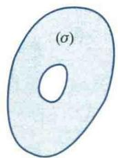

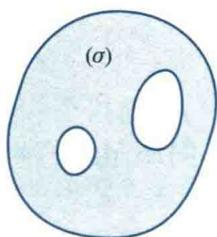  

图6.61

<Knowledge title="定理 8.1">
设平面有界闭域 $(\sigma)$ 由一条分段光滑的简单闭曲线所围成， $(\sigma)$ 的边界曲线记为 $(C)$ ，函数 $P, Q \in C^{(1)}((\sigma))$ . 则下述的 Green 公式成立
</Knowledge>

<Note>
由一条分段光滑的简单闭曲线所围成的区域一定是单连通区域.

$$

\iint_ {(\sigma)} \left(\frac {\partial Q}{\partial x} - \frac {\partial P}{\partial y}\right) \mathrm{d} \sigma = \oint_ {(+ C)} P (x, y) \mathrm{d} x + Q (x, y) \mathrm{d} y,\tag{8.1}

$$

其中 $(+C)$ 表示 $(C)$ 为正向.
</Note>

<Solution title="证明">
公式(8.1)左端是一个二重积分,右端是一个第二型线积分. 在所给定的条件下,它们都可以化为定积分. 因此,要证明等式(8.1)成立,只需把它们都化为定积分加以验证即可.

首先,设积分域( $\sigma$ )既是x型区域又是y型区域,即( $\sigma$ )既可表示为

$$

y _ {1} (x) \leqslant y \leqslant y _ {2} (x) \quad (a \leqslant x \leqslant b),

$$

也可以表示为

$$

x _ {1} (y) \leqslant x \leqslant x _ {2} (y) \quad (c \leqslant y \leqslant d).

$$

其中曲线 $y=y_{i}(x)$ 与 $x=x_{i}(y)$ (i=1,2) 如图 6.62 所示.

  

图6.62

由二重积分的计算法得

$$

\iint_ {(\sigma)} \frac {\partial P}{\partial y} \mathrm{d} \sigma = \int_ {a} ^ {b} \mathrm{d} x \int_ {y _ {1} (x)} ^ {y _ {2} (x)} \frac {\partial P}{\partial y} \mathrm{d} y = \int_ {a} ^ {b} [ P (x, y _ {2} (x)) - P (x, y _ {1} (x)) ] \mathrm{d} x.

$$

另一方面，由第二型线积分的计算法得

$$

\begin{array}{r l} \oint_ {(+ C)} P (x, y) \mathrm{d} x & = \int_ {(\widehat {A C B})} P \mathrm{d} x + \int_ {(\widehat {B D A})} P \mathrm{d} x \\ & = \int_ {a} ^ {b} P [ x, y _ {1} (x) ] \mathrm{d} x + \int_ {b} ^ {a} P [ x, y _ {2} (x) ] \mathrm{d} x \\ & = - \int_ {a} ^ {b} [ P (x, y _ {2} (x)) - P (x, y _ {1} (x)) ] \mathrm{d} x, \end{array}

$$

所以

$$

- \iint_ {(\sigma)} \frac {\partial P}{\partial y} \mathrm{d} \sigma = \oint_ {(+ C)} P (x, y) \mathrm{d} x.

$$

同理,由 $(\sigma)$ 的表达式

$$

x _ {1} (y) \leqslant x \leqslant x _ {2} (y) \quad (c \leqslant y \leqslant d),

$$

可证得

$$

\iint_ {(\sigma)} \frac {\partial Q}{\partial x} \mathrm{d} \sigma = \oint_ {(+ C)} Q \mathrm{d} y.

$$

于是，Green 公式(8.1)成立.

其次，当 $(\sigma)$ 并非上述“既是 $x$ 型又是 $y$ 型区域”时，可以把它分割成若干个上述类型的区域.如图6.63中的区域 $(\sigma)$ 可分成三个上述类型的子域 $(\sigma_{1}), (\sigma_{2})$ 和 $(\sigma_{3})$ ，在每个子域上Green公式均成立，即

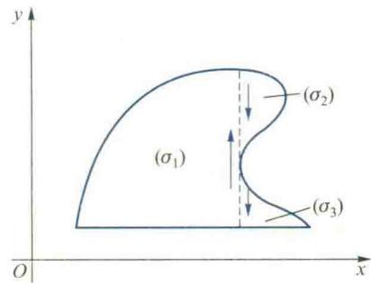  

图6.63

$$

\iint_ {(\sigma_ {i})} \left(\frac {\partial Q}{\partial x} - \frac {\partial P}{\partial y}\right) \mathrm{d} \sigma = \oint_ {(+ G _ {i})} P (x, y) \mathrm{d} x + Q (x, y) \mathrm{d} y, \quad i = 1, 2, 3,

$$

其中 $(+C_{i})$ 是子域 $(\sigma_{i})$ 的正向边界曲线.从而

$$

\sum_ {i = 1} ^ {3} \iint_ {(\sigma_ {i})} \left(\frac {\partial Q}{\partial x} - \frac {\partial P}{\partial y}\right) \mathrm{d} \sigma = \sum_ {i = 1} ^ {3} \oint_ {(+ C _ {i})} P (x, y) \mathrm{d} x + Q (x, y) \mathrm{d} y.

$$
</Solution>

<Note>
到右端线积分相加时,相邻两子域的公共边界上的线积分要在相反方向各取一次,从而对应的积分值相互抵消,所以 Green 公式(8.1)仍然成立.因此 Green 公式(8.1)对单连通域均成立.

二维码 6.8.1

Green 公式的

两种表示形式

及其物理意义.

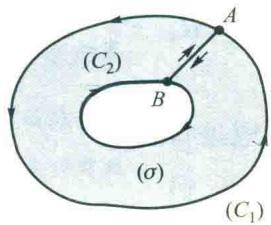  

(a)

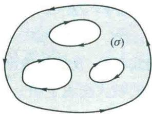  

(b)  

图6.64

应当指出，Green 公式还可以推广到 $(\sigma)$ 是由有限条分段光滑的闭曲线所围成的复连通域的情形。此时，我们可以用切割的方法把 $(\sigma)$ 切割成单连通域。例如，在图 6.64(a) 中，域 $(\sigma)$ 的正向边界曲线 $(+C)$ 由正向的闭曲线 $(+C_{1})$ 与负向的闭曲线 $(-C_{2})$ 所组成，即 $(+C)=(+C_{1})\cup(-C_{2})$ 。为了将它切割成单连通域，任作割线 $\overline{AB}$ ，将被割开后的域 $(\sigma)$ 的边界看作是由

$$

(\overline {{C}}) = (C _ {1}) \cup \overline {{A B}} \cup (- C _ {2}) \cup \overline {{B A}}

$$

围成, $(\overline{C})$ 的正向如图6.64(a)所示.这样一来, $(\sigma)$ 就可以看作是一个以曲线 $(+\overline{C})$ 为正向边界的单连通域.应用公式(8.1)得

$$

\begin{array}{r l} \iint_ {(\sigma)} \left(\frac {\partial Q}{\partial x} - \frac {\partial P}{\partial y}\right) \mathrm{d} \sigma & = \oint_ {(+ C)} P \mathrm{d} x + Q \mathrm{d} y \\ & = \int_ {(+ C _ {1})} P \mathrm{d} x + Q \mathrm{d} y + \int_ {\overline {{A B}}} P \mathrm{d} x + Q \mathrm{d} y + \\ & \quad \int_ {\overline {{B A}}} P \mathrm{d} x + Q \mathrm{d} y + \int_ {(- C _ {2})} P \mathrm{d} x + Q \mathrm{d} y \\ & = \int_ {(+ C _ {1})} P \mathrm{d} x + Q \mathrm{d} y + \int_ {(- C _ {2})} P \mathrm{d} x + Q \mathrm{d} y \\ & = \oint_ {(+ C)} P \mathrm{d} x + Q \mathrm{d} y, \end{array}

$$
</Note>

<Note>
用切割方法将复连通域化成单连通域,这时此域的边界曲线已非简单闭曲线,因为在切割边处曲线自相交.因此它不是简单闭曲线.这时由图6.64(a)所示区域( $\sigma$ )的边界实际上是由正向闭曲线( $C_{1}$ )和负向闭曲线( $C_{2}$ )两条闭曲线所围成.

因此 Green 公式对复连通域( $\sigma$ )仍然成立.对于具有多个“洞”的复连通域(图 6.64(b))可以类似地处理.

Green 公式建立了平面区域( $\sigma$ )上的二重积分与沿( $\sigma$ )边界曲线(C)的第二型线积分之间的联系,它不仅有重要的理论意义,而且也可用于第二型线积分的计算.
</Note>

<Example title="例 8.1">
计算 $\int_{(C)} xy^{2} dy - yx^{2} dx$ ，其中

(1) (C) 为圆周 $x^{2} + y^{2} = R^{2}$ 的正向；

(2) (C) 为上半圆周 $y = \sqrt{R^{2} - x^{2}}$ ，方向从 A(R, 0) 到 B(-R, 0).

<Solution title="解">
（1）对所给线积分,我们当然可以通过将圆周的参数方程代入被积式化成定积分来计算,但应用 Green 公式更为方便.
</Solution>
</Example>

<Note>
回顾 Newton-Leibniz 公式

$$

\int_ {a} ^ {b} F ^ {\prime} (x) \mathrm{d} x = F (b) - F (a),

$$

它将数量值函数 $F(x)$ 在区间 $[a, b]$ 上变化率 $F'(x)$ 的积分，用其原函数 $F(x)$ 在区间边界 a 与 b 上的值来计算。与此类似，Green 公式，将向量值函数 $A = (P, Q)$ 在 $(\sigma)$ 上某种变化率 $\frac{\partial Q}{\partial x} - \frac{\partial P}{\partial y}$ 的二重积分通过其原函数 A 在 $(\sigma)$ 边界 $(C)$ 的线积分来计算。

$$

\begin{array}{r l} \oint_ {(C)} x y ^ {2} \mathrm{d} y - y x ^ {2} \mathrm{d} x & = \iint_ {(\sigma)} (y ^ {2} + x ^ {2}) \mathrm{d} \sigma \\ & = \int_ {0} ^ {2 \pi} \mathrm{d} \theta \int_ {0} ^ {R} \rho^ {3} \mathrm{d} \rho = \frac {\pi R ^ {4}}{2}. \end{array}

$$

(2) (C) 不是闭曲线, 不能直接利用 Green 公式, 我们先补上有向直线段 $\overline{BA}$ 使其封闭且保持正向 (图 6.65), 从而有

$$

\begin{array}{r l} & {\int_ {(C)} x y ^ {2} \mathrm{d} y - y x ^ {2} \mathrm{d} x} \\ & {= \oint_ {(C) \cup \overline {{{B A}}}} (x y ^ {2} \mathrm{d} y - y x ^ {2} \mathrm{d} x) - \int_ {\overline {{{B A}}}} (x y ^ {2} \mathrm{d} y - y x ^ {2} \mathrm{d} x).} \end{array}

$$

应用Green公式得

$$

\oint_ {(C) \cup \overline {{{B A}}}} x y ^ {2} \mathrm{d} y - y x ^ {2} \mathrm{d} x = \iint_ {(\sigma)} (y ^ {2} + x ^ {2}) \mathrm{d} \sigma = \frac {\pi R ^ {4}}{4}.

$$

而

$$

\int_ {(\overline {{{B A}}})} x y ^ {2} \mathrm{d} y - y x ^ {2} \mathrm{d} x = \int_ {- R} ^ {R} 0 \mathrm{d} x = 0,

$$

所以

$$

\int_ {(C)} x y ^ {2} \mathrm{d} y - y x ^ {2} \mathrm{d} x = \frac {\pi R ^ {4}}{4}.

$$

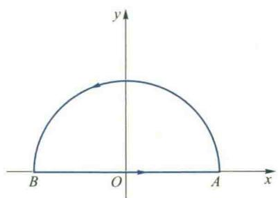  

图6.65
</Note>

<Note>
若直接计算此线积分,由于积分变量在积分曲线(C)上变化.故可将圆周的参数方程代入计算;但利用Green公式将它转化为二重积分后,积分变量在圆内变化,绝不能再将 $x^{2}+y^{2}=R^{2}$ 代入被积函数,而必须用二重积分的计算法去计算.
</Note>

<Example title="例 8.2">
证明: 由一条分段光滑的简单闭曲线 (C) 所围成平面区域 ( $\sigma$ ) 的面积为

$$

A = \frac {1}{2} \oint_ {(+ C)} x \mathrm{d} y - y \mathrm{d} x.

$$

<Solution title="证明">
由 Green 公式知

$$

\begin{array}{r l} \frac {1}{2} \oint_ {(+ C)} x \mathrm{d} y - y \mathrm{d} x & = \frac {1}{2} \iint_ {(\sigma)} [ 1 - (- 1) ] \mathrm{d} \sigma \\ & = \iint_ {(\sigma)} \mathrm{d} \sigma = A. \end{array}

$$
</Solution>
</Example>

<Example title="例 8.3">
设 $(C)$ 为不通过原点的任一分段光滑的正向简单闭曲线, 计算积分
</Example>

<Note>
添补线段让积分曲线封闭是利用 Green 公式简化第二型线积分计算的一种常用方法. 在添加线段时应当注意: ①与原曲线的走向一致; ②在所围区域内, 保证被积函数连续, 且二重积分计算简便; ③在所添加线段上线积分的计算简便; ④在重积分的计算结果中要将所补线积分的值减去.

$$

I = \oint_ {(C)} \frac {x \mathrm{d} y - y \mathrm{d} x}{x ^ {2} + y ^ {2}}.

$$
</Note>

<Solution title="解">
记 $P(x,y) = \frac{-y}{x^2 + y^2}, Q(x,y) = \frac{x}{x^2 + y^2}$ .

由假设， $(C)$ 不通过原点，因此原点可能在 $(C)$ 内也可能在 $(C)$ 外，现分别加以讨论.

（1）设 $(C)$ 的内部不包含原点 $O(0,0)$ . 这时由于 $P, Q$ 及其偏导数 $\frac{\partial P}{\partial y}, \frac{\partial Q}{\partial x}$ 均在 $(C)$ 所围区域 $(\sigma)$ 内连续，应用 Green 公式，因 $\frac{\partial P}{\partial y} - \frac{\partial Q}{\partial x} \equiv 0$ ，从而有

$$

I = \iint_ {(\sigma)} \left(\frac {\partial Q}{\partial x} - \frac {\partial P}{\partial y}\right) \mathrm{d} \sigma = 0.

$$

(2) 若 $(C)$ 的内部包含原点 $O(0,0)$ . 这时由于 $P, Q$ 均在点 $O$ 无定义, 故不能直接利用 Green 公式. 现取 $\varepsilon > 0$ 足够小, 作以 $O$ 为中心、半径为 $\varepsilon$ 的圆周 $(C_{\varepsilon})$ , 使 $(C_{\varepsilon})$ 全部位于 $(C)$ 的内部 (图 6.66). 于是 $P, Q$ 及 $\frac{\partial P}{\partial y}, \frac{\partial Q}{\partial x}$ 均在由 $(+C)$ 与 $(-C_{\varepsilon})$ 所围成的复连通域 $(\sigma)$ 上连续, 应用 Green 公式得

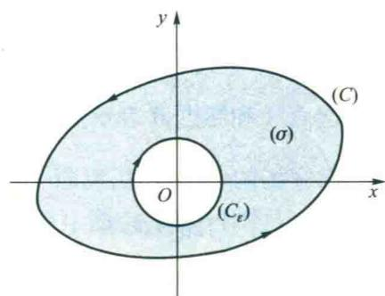  

图6.66

$$

\int_ {(+ C)} \frac {x \mathrm{d} y - y \mathrm{d} x}{x ^ {2} + y ^ {2}} + \int_ {(- C _ {x})} \frac {x \mathrm{d} y - y \mathrm{d} x}{x ^ {2} + y ^ {2}}

$$

$$

= \iint_ {(\sigma)} \left(\frac {\partial Q}{\partial x} - \frac {\partial P}{\partial y}\right) \mathrm{d} \sigma = 0,

$$

即

$$

\int_ {(+ C)} \frac {x \mathrm{d} y - y \mathrm{d} x}{x ^ {2} + y ^ {2}} = \int_ {(+ C _ {x})} \frac {x \mathrm{d} y - y \mathrm{d} x}{x ^ {2} + y ^ {2}}.

$$

这样我们就把沿任一简单闭曲线 $(C)$ 的线积分化成了沿圆周 $(C_{\varepsilon})$ 的线积分. 现在用第二型线积分的计算法来求上式右端的积分. 因为 $(+C_{\varepsilon})$ 的参数方程为

$$

x = \varepsilon \cos t, \quad y = \varepsilon \sin t \quad (0 \leqslant t \leqslant 2 \pi),

$$

于是

$$

\int_ {(+ C _ {e})} \frac {x \mathrm{d} y - y \mathrm{d} x}{x ^ {2} + y ^ {2}} = \int_ {0} ^ {2 \pi} \frac {\varepsilon^ {2} (\cos^ {2} t + \sin^ {2} t)}{\varepsilon^ {2}} \mathrm{d} t = 2 \pi ,

$$

故 $I = 2\pi$
</Solution>

## 8.2 平面线积分与路径无关的条件

一般来讲,沿路径(C)从点A到点B的线积分

$$

\int_ {(C)} \mathbf {A} (M) \cdot \mathbf {d s} = \int_ {(C)} P (x, y) \mathrm{d} x + Q (x, y) \mathrm{d} y

$$

的值应与向量场 $A(M)$ 的分布、起点 $A$ 和终点 $B$ 的位置以及积分路径 $(C)$ 三者有关。然而在本章例7.5中，我们已经看到，有些第二型线积分的值与积分路径无关，这种情况在物理学中也经常碰到。例如，如果 $F(M)$ 表示重力场，当质点从点 $A$ 移到点 $B$ 时，重力场所做的功 $W = \int_{(C)} F(M) \cdot ds$ 只取决于力场 $F$ 以及起点和终点，而与积分路径无关（例7.6）。一般地，当线积分 $\int_{(C)} A(M) \cdot ds$ 的值与积分路径无关时，称场 $A(M)$ 为一保守场。所以重力场是一保守场。这时，可以略去积分路径 $(C)$ 不写而把线积分用起点 $A$ 和终点 $B$ 表示为 $\int_{(A)}^{(B)} A(M) \cdot ds$ 。

由保守场的定义可见,判断一个场是否保守场,从数学上看,就是判断此场的第二型线积分是否与路径无关.下面我们先介绍这一命题的几个等价命题,然后讨论命题成立的条件.

<Knowledge title="定理 8.2">
设区域 $(\sigma) \subseteq \mathbf{R}^{2}, P, Q \in C((\sigma)), A, B \in (\sigma)$ ，则下列三个命题等价：

(1) 沿( $\sigma$ )内任一分段光滑的简单闭曲线(C),线积分

$$

\oint_ {(C)} P \mathrm{d} x + Q \mathrm{d} y = 0;

$$

(2) 线积分

$$

\int_ {(A)} ^ {(B)} P \mathrm{d} x + Q \mathrm{d} y

$$
</Knowledge>

<Note>
采用向量形式,定理8.2中三个结论可分别写成:

的值在 $(\sigma)$ 内与积分路径无关；

(1) $\oint_{(C)}\mathbf{A}\cdot \mathbf{ds} = 0,A = (P,Q)$
</Note>

## (3) 被积表达式

$$

P \mathrm{d} x + Q \mathrm{d} y

$$

在 $(\sigma)$ 内是某个二元函数 $u(x,y)$ 的全微分，即(2) $\int_{(1)}^{(B)}A\cdot ds$ 的值与积分路径无关；

$$

\mathrm{d} u = P \mathrm{d} x + Q \mathrm{d} y.

$$

(3) ∃可微函数 $U(x,y)$ 使

grad U = A

<Solution title="证明">
我们按(1)⇒(2)⇒(3)⇒(1)的顺序，或用循环推证法来证明.首先来证(1)⇒(2). $\nabla U=A$ .

设(1)成立, A, B 为 $(\sigma)$ 中的任意两点, 以 A 为起点 B 为终点, 任意联结位于 $(\sigma)$ 内的两条曲线 $(\widehat{APB})$ 与 $(\widehat{AQB})$ (图 6.67(a)), 要证明线积分 $\int_{(A)}^{(B)} P \, dx + Q \, dy$ 沿这两条路径积分的值相等. 如果此两曲线除 A, B 两点外不相交, 那么, 由于

$$

\int_ {(\widehat {A P B})} P \mathrm{d} x + Q \mathrm{d} y + \int_ {(\widehat {B Q A})} P \mathrm{d} x + Q \mathrm{d} y = \oint_ {(\widehat {A P B Q A})} P \mathrm{d} x + Q \mathrm{d} y = 0,

$$

所以

$$

\int_ {(\widehat {A P B})} P \mathrm{d} x + Q \mathrm{d} y = - \int_ {(\widehat {B Q A})} P \mathrm{d} x + Q \mathrm{d} y = \int_ {(\widehat {A Q B})} P \mathrm{d} x + Q \mathrm{d} y.

$$

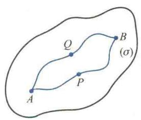  

(a)

  

(b)  

图6.67

如果 $(\widehat{APB})$ 与 $(\widehat{AOB})$ 还有其他交点（图6.67(b))，那么，在 $(\sigma)$ 内从 $A$ 到 $B$ 再作一条曲线 $(\widehat{ARB})$ ，使它与 $(\widehat{APB}),(\widehat{AOB})$ 均不再相交，从而

$$

\int_ {(\widehat {A P B})} P \mathrm{d} x + Q \mathrm{d} y = \int_ {(\widehat {A R B})} P \mathrm{d} x + Q \mathrm{d} y = \int_ {(\widehat {A Q B})} P \mathrm{d} x + Q \mathrm{d} y,

$$

因此,命题(2)成立.

其次证明(2) $\Rightarrow$ (3).

设(2)成立,在 $(\sigma)$ 内任取一定点 $A(x_{0},y_{0})$ 为起点,一动点 $B(x,y)$ 为终点,作变上限积分 $\int_{(x_0,y_0)}^{(x,y)}P\mathrm{d}x + Q\mathrm{d}y$ （图6.68).由于线积分的值与积分路径无关，它的值将随上限 $(x,y)$ 的确定而唯一确定，因而是上限 $(x,y)$ 的一个二元函数，记作 $u(x,y)$ ，令

$$

u (x, y) = \int_ {(x _ {0}, y _ {0})} ^ {(x, y)} P \mathrm{d} x + Q \mathrm{d} y.

$$

下面证明,这个函数的全微分就正好是被积表达式,即

$$

\mathrm{d} u = P \mathrm{d} x + Q \mathrm{d} y.

$$

为此，只需证明

$$

\frac {\partial u}{\partial x} = P, \quad \frac {\partial u}{\partial y} = Q.

$$

由偏导数定义

$$

\frac {\partial u}{\partial x} = \lim _ {\Delta x \rightarrow 0} \frac {u (x + \Delta x , y) - u (x , y)}{\Delta x},

$$

而

$$

\begin{array}{r l} & u (x + \Delta x, y) - u (x, y) \\ & = \int_ {(x _ {0}, y _ {0})} ^ {(x + \Delta x, y)} P \mathrm{d} x + Q \mathrm{d} y - \int_ {(x _ {0}, y _ {0})} ^ {(x, y)} P \mathrm{d} x + Q \mathrm{d} y, \end{array}

$$
</Solution>

<Note>
在定积分中,我们知道,变上限积分 $\int_{a}^{x}f(t)\mathrm{d}t$ 是上限x的函数,当 $f\in C[a,b]$ 时,它对上限x的微分,就是被积表达式 $f(x)\mathrm{d}x$ .现在对于向量值函数 $A=(P,Q)\in C((\sigma))$ 的变上限线积分

$$

\int_ {(x _ {0}, y _ {0})} ^ {(x, y)} \boldsymbol {A} \cdot \mathbf {d s} = \int_ {(x _ {0}, y _ {0})} ^ {(x, y)} P \mathrm{d} x + Q \mathrm{d} y,

$$

若与积分路径无关,自然是上限x,y的二元函数.我们希望证明它的全微分也是被积表达式 $Pdx+Qdy$ .

  

图6.68

由于线积分与路径无关,故上式右端的第一个积分等于由点 A 沿曲线(C)到点 B 的积分与由点 B 沿水平直线到点 M 的积分之和,即

$$

\int_ {(x _ {0}, y _ {0})} ^ {(x + \Delta x, y)} P \mathrm{d} x + Q \mathrm{d} y = \int_ {(x _ {0}, y _ {0})} ^ {(x, y)} P \mathrm{d} x + Q \mathrm{d} y + \int_ {(x, y)} ^ {(x + \Delta x, y)} P \mathrm{d} x + Q \mathrm{d} y,

$$

从而

$$

u (x + \Delta x, y) - u (x, y) = \int_ {(x, y)} ^ {(x + \Delta x, y)} P \mathrm{d} x + Q \mathrm{d} y.

$$

上式右端线积分的积分路径为直线段 BM, 把这个线积分化成定积分并应用积分中值定理, 得

$$

\int_ {(x, y)} ^ {(x + \Delta x, y)} P \mathrm{d} x + Q \mathrm{d} y = \int_ {x} ^ {x + \Delta x} P (x, y) \mathrm{d} x = P (x + \theta \Delta x, y) \Delta x, 0 \leqslant \theta \leqslant 1.

$$

于是,由 P 的连续性得

$$

\frac {\partial u}{\partial x} = \lim _ {\Delta x \rightarrow 0} \frac {u (x + \Delta x , y) - u (x , y)}{\Delta x} = \lim _ {\Delta x \rightarrow 0} P (x + \theta \Delta x, y) = P (x, y).

$$

同理可证

$$

\frac {\partial u}{\partial y} = Q (x, y).

$$

由于 $P, Q \in C((\sigma))$ ，即 $\frac{\partial u}{\partial x}, \frac{\partial u}{\partial y} \in C((\sigma))$ ，所以 $u(x, y)$ 在 $(\sigma)$ 内可微，且

$$

\mathrm{d} u = \frac {\partial u}{\partial x} \mathrm{d} x + \frac {\partial u}{\partial y} \mathrm{d} y = P \mathrm{d} x + Q \mathrm{d} y.

$$

最后证明：(3) $\Rightarrow$ (1).设(3)成立，即在( $\sigma$ )内存在可微函数 $u(x,y)$ ，使

$$

\mathrm{d} u = P \mathrm{d} x + Q \mathrm{d} y,

$$

从而

$$

\frac {\partial u}{\partial x} = P, \quad \frac {\partial u}{\partial y} = Q,

$$

设 $(C)$ 为 $(\sigma)$ 内任意一条分段光滑的简单闭曲线，要证明沿 $(C)$ 的线积分 $\oint_{(C)} P \mathrm{d}x + Q \mathrm{d}y = 0.$ 设 $(C)$ 的方程为 $x = x(t), y = y(t) (\alpha \leqslant t \leqslant \beta)$ ，且 $x(\alpha) = x(\beta)$ ， $y(\alpha) = y(\beta)$ . 由线积分的计算法可知

$$

\begin{array}{r l} \oint_ {(C)} P \mathrm{d} x + Q \mathrm{d} y & = \int_ {\alpha} ^ {\beta} \left\{P [ x (t), y (t) ] \dot {x} (t) + Q [ x (t), y (t) ] \dot {y} (t) \right\} \mathrm{d} t \\ & = \int_ {\alpha} ^ {\beta} \left(\frac {\partial u}{\partial x} \frac {\mathrm{d} x}{\mathrm{d} t} + \frac {\partial u}{\partial y} \frac {\mathrm{d} y}{\mathrm{d} t}\right) \mathrm{d} t = \int_ {\alpha} ^ {\beta} \left(\frac {\mathrm{d}}{\mathrm{d} t} u [ x (t), y (t) ]\right) \mathrm{d} t \\ & = u [ x (t), y (t) ] | _ {\alpha} ^ {\beta} = 0, \end{array}

$$

即命题(1)成立.
</Note>

<Knowledge title="定理 8.2">
的三个命题都具有重要的物理意义. 如果把向量场 $(P(x,y), Q(x,y))$ 看作是一平面流速场 $\boldsymbol{v}(x,y)$ ，即 $v = Pi + Qj$ ，于是

$$

\oint_ {(C)} P \mathrm{d} x + Q \mathrm{d} y = \oint_ {(C)} \boldsymbol {v} (M) \cdot \mathbf {d s} = \oint_ {(C)} \boldsymbol {v} (M) \cdot \boldsymbol {e} _ {\tau} \mathrm{d} s.

$$

由于 $\boldsymbol{v}(M) \cdot \boldsymbol{e}_{\tau}$ 表示流速场在曲线 (C) 的切线方向的分速度, 设流体密度为 1, 因而积分 $\oint_{(C)} \boldsymbol{v}(M) \cdot \boldsymbol{e}_{\tau} ds$ 表示在单位时间内, 场 v 沿闭曲线 (C) 流动流体的流量, 力学上称其为沿 (C) 的环流量. 它给出了流速场 v 绕曲线 (C) 旋转趋势大小的度量. 一般地, 对于向量场 $A(M) = Pi + Qj$ , 我们称沿闭曲线 (C) 的第二型线积分

$$

\oint_ {(C)} \boldsymbol {A} (M) \cdot \mathbf {d s} = \oint_ {(C)} \boldsymbol {A} (M) \cdot \boldsymbol {e} _ {\tau} \mathrm{d} s

$$

为向量场 A 沿闭曲线 $(C)$ 的环量. 命题(1)中, 沿 $(\sigma)$ 内任一分段光滑的简单闭曲线 $(C)$ , 线积分均为零, 这表明了向量场 $A(M)$ 在 $(\sigma)$ 内围绕任一点均无旋转趋势, 我们称其为无旋场.因此,命题(1)表明A是无旋场.

由保守场的定义可知,命题(2)表明向量场 $A(M)$ 是一保守场.

下面我们来阐述命题(3)的物理意义.在第五章第三节中,我们知道,给定一个可微的数量场 $u(x,y)\left((x,y)\in(\sigma)\right)$ ,在 $(\sigma)$ 内每一点就唯一确定了一个梯度 $\nabla u(x,y)=\frac{\partial u}{\partial x}\mathbf{i}+\frac{\partial u}{\partial y}\mathbf{j},(x,y)\in(\sigma)$ .它是在 $(\sigma)$ 内的确定的一个向量场,称为梯度场.现在,我们考虑它的反问题:给定一个连续的向量场 $A(x,y)=P(x,y)\mathbf{i}+Q(x,y)\mathbf{j},(x,y)\in(\sigma)$ ,是否能存在一个可微的数量场 $u(x,y)$ ,使 $\nabla u(x,y)=A(x,y)\left((x,y)\in(\sigma)\right)$ 呢?换句话说,在 $(\sigma)$ 内是否存在可微函数 $u(x,y)$ ,使

$$

\frac {\partial u}{\partial x} = P, \quad \frac {\partial u}{\partial y} = Q, \quad \text {或} \quad \mathrm{d} u = P \mathrm{d} x + Q \mathrm{d} y.

$$

可见,这一反问题实际上就是要问,对于给定的连续向量场 $A(M)=(P,Q)$ , $M\in(\sigma)$ , 表达式 $Pdx+Qdy$ 是否是 $(\sigma)$ 内某个二元函数 u 的全微分? 如果这样的 $u(x,y)$ 存在, 则称 u 是向量场 $A(M)$ 的势函数或位函数, 而称向量场 $A(M)$ 是一有势场. 因此, 命题(3)表明向量场 $A(M)$ 是一有势场.
</Knowledge>

<Knowledge title="定理 8.2">
的结论表明: 对于一个连续的向量场 $A(M)=(P,Q)$ , $M\in(\sigma)$ , $A(M)$ 是无旋场、保守场和有势场三者是相互等价的.

现在,我们来进一步研究在什么条件下定理8.2中的三个命题成立.
</Knowledge>

<Knowledge title="定理 8.3">
设 $(\sigma)$ 为一平面单连通域, P, Q, $\in C^{(1)}((\sigma))$ , 则定理 8.2 中三个命题成立的充要条件是

$$

\frac {\partial P}{\partial y} \equiv \frac {\partial Q}{\partial x}, (x, y) \in (\sigma).\tag{8.2}

$$

<Solution title="证明">
由于上述三个命题的等价性,只需证明条件(8.2)是命题(1)成立的充要条件即可.

充分性 设条件(8.2)成立,在 $(\sigma)$ 内任作一分段光滑的简单闭曲线(C),由于 $(\sigma)$ 是单连通域,所以(C)的内部 $(\sigma_{1})$ 必全部包含在 $(\sigma)$ 内,从而有

$$

\frac {\partial Q}{\partial x} - \frac {\partial P}{\partial y} \equiv 0, (x, y) \in (\sigma_ {1}).

$$

由Green公式得

$$

\oint_ {(+ C)} P \mathrm{d} x + Q \mathrm{d} y = \iint_ {(\sigma_ {1})} \left(\frac {\partial Q}{\partial x} - \frac {\partial P}{\partial y}\right) \mathrm{d} \sigma = 0,

$$
</Solution>
</Knowledge>

<Note>
定理8.2中三个结论成立且等价只需条件 $A=(P,Q)$ 在域( $\sigma$ )上连续,并不要求( $\sigma$ )是单连通域;而定理8.3结论的成立,即条件(8.2)与定理8.2中三个结论等价,必须加强条件,不仅要求 $A=(P,Q)$ 在( $\sigma$ )上偏导数连续,而且还要求域( $\sigma$ )是单连通的.A的偏导数连续的作用,读者在必要性的证明中容易看出;单连通域的要求是因为在充分性的证明时,若域( $\sigma$ )内有洞,则( $\sigma$ )内包围洞的闭曲域(C)的内部不能保证 $\frac{\partial Q}{\partial x}-\frac{\partial P}{\partial y}\equiv0$ 成立.

即命题(1)成立.

必要性 使用反证法. 设沿 $(\sigma)$ 内任一闭曲线 $(C)$ 有 $\oint_{(C)} P \mathrm{d}x + Q \mathrm{d}y = 0$ . 如果条件 (8.2) 不成立, 即至少存在一点 $M_0(x_0, y_0) \in (\sigma)$ , 使

$$

\left(\frac {\partial Q}{\partial x} - \frac {\partial P}{\partial y}\right) \Big | _ {M _ {0}} \neq 0,

$$

不妨设其大于零.由于 $\frac{\partial Q}{\partial x} -\frac{\partial P}{\partial y}$ 连续，故存在点 $M_0$ 的一个 $\delta$ 邻域 $U(M_0,\delta)$ ，使

$$

\frac {\partial Q}{\partial x} - \frac {\partial P}{\partial y} \geqslant q > 0, (x, y) \in U (M _ {0}, \delta).

$$

于是沿 $U(M_0,\delta)$ 的边界曲线 $(C_{\delta})$ 有

$$

\oint_ {(+ C _ {\delta})} P \mathrm{d} x + Q \mathrm{d} y = \iint_ {U (M _ {\delta}, \delta)} \left(\frac {\partial Q}{\partial x} - \frac {\partial P}{\partial y}\right) \mathrm{d} \sigma \geqslant q \Sigma > 0,

$$

其中 $\Sigma$ 为 $U(M_{0},\delta)$ 的面积, 这与假设矛盾.

这样一来,对于向量场 $A=(P,Q)$ , 如果 $P,Q\in C^{(1)}((\sigma))$ 且 $\frac{\partial P}{\partial y}\equiv\frac{\partial Q}{\partial x},(x,y)\in(\sigma)$ , 那么 A 一定是一个有势场. 怎样求得它的势函数呢? 下面就来讨论这个问题.

势函数的求法 给定向量场 $A(M) = (P, Q), M \in (\sigma)$ ，设 $P, Q \in C^{(1)}((\sigma))$ ，且 $\frac{\partial P}{\partial y} \equiv \frac{\partial Q}{\partial x}$ . 求 $A$ 的势函数. 从数学上看就是求一个二元函数 $u$ ，使

$$

\mathrm{d} u = P (x, y) \mathrm{d} x + Q (x, y) \mathrm{d} y.

$$

这种问题也称为是全微分求积问题,所求得的势函数 $u(x,y)$ 也称为是全微分 $Pdx+Qdy$ 的一个原函数.

显然,如果 $u(x,y)$ 是 $Pdx+Qdy$ 的一个原函数,那么 $u(x,y)+C$ (C 为常数)也是其原函数,而且同一元函数一样,容易证明,任意两个原函数仅相差一个常数.
</Note>

<Note>
能否证明与一元函数类似, $Pdx+Qdy$ 的任意两个原函数仅相差一个常数?

下面通过例题说明求势函数的方法.
</Note>

<Example title="例 8.4">
验证向量场 $A=(3x^{2}-6xy,3y^{2}-3x^{2})$ 在全平面上是有势场并求其势函数.

<Solution title="解">
由于在全平面上有 $\frac{\partial}{\partial x} (3y^2 - 3x^2) = -6x, \frac{\partial}{\partial y} (3x^2 - 6xy) = -6x$ ，所以 $A$ 在全平面上为有势场。下面求它的势函数 $u(x, y)$ 。

法一(用线积分求) 由定理 8.2 的证明可知

$$

\Phi = \int_ {(0, 0)} ^ {(x, y)} (3 x ^ {2} - 6 x y) \mathrm{d} x + (3 y ^ {2} - 3 x ^ {2}) \mathrm{d} y

$$

是一势函数,且积分与路径无关.取路径为:先沿x轴从 $O(0,0)$ 到 $M_{0}(x,0)$ ，再沿纵直线从 $M_{0}$ 到 $M(x,y)$ （图6.69）.于是由第二型线积分的计算法得

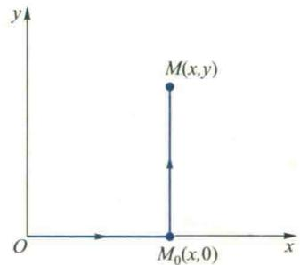  

图6.69

$$

\begin{array}{r l} \Phi & = \int_ {(0, 0)} ^ {(x, 0)} (3 x ^ {2} - 6 x y) \mathrm{d} x + (3 y ^ {2} - 3 x ^ {2}) \mathrm{d} y + \int_ {(x, 0)} ^ {(x, y)} (3 x ^ {2} - 6 x y) \mathrm{d} x + (3 y ^ {2} - 3 x ^ {2}) \mathrm{d} y \\ & = \int_ {0} ^ {x} 3 x ^ {2} \mathrm{d} x + \int_ {0} ^ {y} (3 y ^ {2} - 3 x ^ {2}) \mathrm{d} y = x ^ {3} + y ^ {3} - 3 x ^ {2} y. \end{array}

$$

所以势函数(即原函数)的一般形式为

$$

u (x, y) = x ^ {3} + y ^ {3} - 3 x ^ {2} y + C,

$$

其中 C 为任意常数.

法二(用偏积分 $^{①}$ 求) 要求势函数 $u(x,y)$ ，使 $\nabla u=(3x^{2}-6xy,3y^{2}-3x^{2})$ .

由于 $\nabla u = \left(\frac{\partial u}{\partial x},\frac{\partial u}{\partial y}\right)$ ，故只需求 $u$ ，使

$$

\frac {\partial u}{\partial x} = 3 x ^ {2} - 6 x y,\tag{8.3}

$$

$$

\frac {\partial u}{\partial y} = 3 y ^ {2} - 3 x ^ {2}.\tag{8.4}

$$

(8.3)式两端对 x 积分, 把 y 视为常数, 得

$$

u = x ^ {3} - 3 x ^ {2} y + \varphi (y),\tag{8.5}

$$

由于 y 是被看作常数积分的, 故积分常数 $\varphi$ 中可能含有 y. 再将 (8.5) 式两端对 y 求导并与 (8.4) 式比较得

$$

- 3 x ^ {2} + \varphi^ {\prime} (y) = 3 y ^ {2} - 3 x ^ {2},

$$

从而 $\varphi'(y)=3y^{2}$ ，故

$$

\varphi (y) = y ^ {3} + C.

$$

代入(8.5)式得

$$

u = x ^ {3} - 3 x ^ {2} y + y ^ {3} + C.

$$

法三(用凑全微分法求) 求向量场 $(3x^{2}-6xy,3y^{2}-3x^{2})$ 的势函数,即求一函数 $u(x,y)$ 使其全微分为

$$

\mathrm{d} u = (3 x ^ {2} - 6 x y) \mathrm{d} x + (3 y ^ {2} - 3 x ^ {2}) \mathrm{d} y.

$$

将上式右端诸项重新排列得

$$

\begin{array}{r l} \mathrm{d} u & = 3 x ^ {2} \mathrm{d} x + 3 y ^ {2} \mathrm{d} y - 3 (x ^ {2} \mathrm{d} y + 2 x y \mathrm{d} x) = \mathrm{d} x ^ {3} + \mathrm{d} y ^ {3} - 3 (x ^ {2} \mathrm{d} y + y \mathrm{d} x ^ {2}) \\ & = \mathrm{d} x ^ {3} + \mathrm{d} y ^ {3} - 3 \mathrm{d} (x ^ {2} y) = \mathrm{d} (x ^ {3} + y ^ {3} - 3 x ^ {2} y). \end{array}

$$

于是势函数

$$

u = x ^ {3} + y ^ {3} - 3 x ^ {2} y + C.

$$

读者看到,如果对微分比较熟练,第三种方法是很简便的.
</Solution>
</Example>

<Example title="例 8.5">
计算线积分 $\int_{(C)}\cos (x + y^2)\mathrm{d}x + \left[2y\cos (x + y^2) - \frac{1}{\sqrt{1 + y^4}}\right]\mathrm{d}y$ ，其中(C)为摆线 $x = a(t - \sin t),y = a(1 - \cos t)$ 上由点 $O(0,0)$ 到点 $A(2\pi a,0)$ 的有向弧段.

<Solution title="解">
此题若利用第二型线积分的计算法直接化为定积分去计算是相当麻烦的，但由于在全平面上

$$

\frac {\partial P}{\partial y} = - \sin (x + y ^ {2}) \cdot 2 y = \frac {\partial Q}{\partial x},

$$

所以,此线积分与路径无关.我们取有向直线段OA去代替(C),从而得

$$

\begin{array}{r l} & \int_ {(C)} \cos (x + y ^ {2}) \mathrm{d} x + \left[ 2 y \cos (x + y ^ {2}) - \frac {1}{\sqrt {1 + y ^ {4}}} \right] \mathrm{d} y \\ & = \int_ {\overline {{{O A}}}} \cos (x + y ^ {2}) \mathrm{d} x + \left[ 2 y \cos (x + y ^ {2}) - \frac {1}{\sqrt {1 + y ^ {4}}} \right] \mathrm{d} y \\ & = \int_ {0} ^ {2 \pi a} \cos x \mathrm{d} x = \sin 2 \pi a. \end{array}

$$

应当指出,由于定理8.2中命题(2)与(3)的等价性,我们也可以利用原函数来计算与积分路径无关的线积分.事实上,设 $P,Q\in C((\sigma))$ ,如果线积分

$$

I = \int_ {(x _ {0}, y _ {0})} ^ {(x _ {1}, y _ {1})} P \mathrm{d} x + Q \mathrm{d} y

$$

在 $(\sigma)$ 内与路径无关, 那么在 $(\sigma)$ 内 $P\mathrm{d}x + Q\mathrm{d}y$ 必为某一函数的全微分, 设其原函数为 $F(x,y)$ , 由于

$$

\Phi (x, y) = \int_ {(x _ {0}, y _ {0})} ^ {(x, y)} P \mathrm{d} x + Q \mathrm{d} y

$$

也是被积表达式的一个原函数,所以

$$

\Phi (x, y) = F (x, y) + C.

$$

但 $\Phi(x_{0},y_{0})=0$ , 故

$$

C = - F (x _ {0}, y _ {0}).

$$

于是

$$

\Phi (x, y) = F (x, y) - F (x _ {0}, y _ {0}),

$$

因此在区域 $(\sigma)$ 内

$$

\int_ {(x _ {0}, y _ {0})} ^ {(x _ {1}, y _ {1})} P \mathrm{d} x + Q \mathrm{d} y = F (x _ {1}, y _ {1}) - F (x _ {0}, y _ {0}) = F (x, y) \Bigg | _ {(x _ {0}, y _ {0})} ^ {(x _ {1}, y _ {1})}.\tag{8.6}

$$

公式(8.6)相当于定积分中的 Newton-Leibniz 公式.
</Solution>
</Example>

<Example title="例 8.6">
计算 $\int_{(1,0)}^{(0,1)}\frac{x\mathrm{d}x + y\mathrm{d}y}{\sqrt{x^2 + y^2}}.$

<Solution title="解">
容易看出

$$

\frac {x \mathrm{d} x + y \mathrm{d} y}{\sqrt {x ^ {2} + y ^ {2}}} = \frac {\mathrm{d} (x ^ {2} + y ^ {2})}{2 \sqrt {x ^ {2} + y ^ {2}}} = \mathrm{d} \sqrt {x ^ {2} + y ^ {2}},

$$

所以当 $x^{2} + y^{2}\neq 0$ 时，被积表达式是一全微分，它的一个原函数为 $\sqrt{x^2 + y^2}$ ，从而在不包含原点的任一平面区域内，所给积分与路径无关，且由公式(8.6)可知

$$

\int_ {(1, 0)} ^ {(0, 1)} \frac {x \mathrm{d} x + y \mathrm{d} y}{\sqrt {x ^ {2} + y ^ {2}}} = \sqrt {x ^ {2} + y ^ {2}} \Bigg | _ {(1, 0)} ^ {(0, 1)} = 0.

$$
</Solution>
</Example>

## 8.3 Gauss 公式与散度

## 1. Gauss 公式

8.1 段中的 Green 公式建立了平面区域 $(\sigma)$ 上的二重积分与 $(\sigma)$ 边界曲线 (C) 上的第二型线积分之间的联系, 本段所要介绍的 Gauss 公式, 将建立空间区域 (V) 上的三重积分与 (V) 的边界曲面 (S) 上的第二型面积分之间的联系.

<Knowledge title="定理 8.4">
设空间有界闭区域 $(V)$ 由分片光滑的闭曲面 $(S)$ 所围成， $A(P(x,y,z),Q(x,y,z),R(x,y,z))\in C^{(1)}((V))$ ，则

$$

\iiint_ {(V)} \left(\frac {\partial P}{\partial x} + \frac {\partial Q}{\partial y} + \frac {\partial R}{\partial z}\right) \mathrm{d} V = \iint_ {(S)} P \mathrm{d} y \wedge \mathrm{d} z + Q \mathrm{d} z \wedge \mathrm{d} x + R \mathrm{d} x \wedge \mathrm{d} y,\tag{8.7}

$$

其中(S)的法向量朝外.

<Solution title="证明">
我们只证明

$$

\iiint_ {(V)} \frac {\partial R}{\partial z} \mathrm{d} V = \iint_ {(S)} R \mathrm{d} x \wedge \mathrm{d} y,\tag{8.8}

$$

其他两项的证明类似.

由于(8.8)式左端的三重积分和右端的第二型面积分都可以化为二重积分来计算,故只需把它们都化为二重积分进行比较即可.

首先设积分域(V)是 xy 型区域,即可表示为

$$

z _ {1} (x, y) \leqslant z \leqslant z _ {2} (x, y), \quad (x, y) \in (\sigma_ {x y}),\tag{8.9}

$$

把(V)的边界曲面(S)分成三部分:( $S_{1}$ ), $(S_{2})$ 与 $(S_{3})$ ,如图6.70所示.

将(8.8)式左端的三重积分化为累次积分并计算得

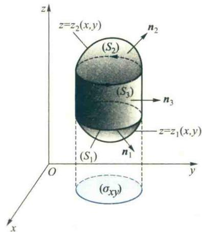

$$

\begin{array}{r l} \iiint_ {(1)} \frac {\partial R}{\partial z} \mathrm{d} V & = \iint_ {(\sigma_ {n})} \mathrm{d} \sigma \int_ {z _ {1} (x, y)} ^ {z _ {2} (x, y)} \frac {\partial R}{\partial z} \mathrm{d} z \\ & = \iint_ {(\sigma_ {n})} \left\{R [ x, y, z _ {2} (x, y) ] - R [ x, y, z _ {1} (x, y) ] \right\} \mathrm{d} \sigma . \end{array}

$$

图6.70

将(8.8)式右端的面积分化为二重积分得

$$

\begin{array}{r l} & {\underset {(S)} {\iint} R \mathrm{d} x \wedge \mathrm{d} y} \\ & {= \underset {(S, \text {上})} {\iint} R \mathrm{d} x \wedge \mathrm{d} y + \underset {(S, \text {外})} {\iint} R \mathrm{d} x \wedge \mathrm{d} y + \underset {(S, \text {下})} {\iint} R \mathrm{d} x \wedge \mathrm{d} y} \\ & {= \underset {(\sigma_ {x})} {\iint} R [ x, y, z _ {2} (x, y) ] \mathrm{d} \sigma + 0 + \underset {(\sigma_ {y})} {\iint} - R [ x, y, z _ {1} (x, y) ] \mathrm{d} \sigma} \\ & {= \underset {(\sigma_ {z})} {\iint} \left\{R [ x, y, z _ {2} (x, y) ] - R [ x, y, z _ {1} (x, y) ] \right\} \mathrm{d} \sigma .} \end{array}

$$

于是公式(8.8)对形如图6.70的区域(V)成立.

对于其他形状的区域(包括有“洞”的区域),可以利用曲面将其分割成若干子域的并,使每一子域均可用形如(8.9)式的不等式表示.类似于Green公式的处理,同样可证(8.8)式成立.

利用 nabla 算子(第五章第三节), Gauss 公式 (8.7) 可以写成以下向量形式:

$$

\iiint_ {(V)} \nabla \cdot \boldsymbol {A} \mathrm{d} V = \oiint_ {(S)} \boldsymbol {A} \cdot \mathbf {d S}.\tag{8.10}

$$
</Solution>
</Knowledge>

<Note>
注意到 $A = (P, Q, R)$ ，而 $\nabla \cdot A = \frac{\partial P}{\partial x} + \frac{\partial Q}{\partial y} + \frac{\partial R}{\partial z}$ 是向量值函数 $A$ 的一种变化率，与Green公式类似，Gauss公式表明： $A$ 在空间区域（V）内某种变化率 $\frac{\partial P}{\partial x} + \frac{\partial Q}{\partial y} + \frac{\partial R}{\partial z}$ 的三重积分，可以通过 $A$ 在区域（V）的边界曲面上的第二型面积分来计算.

正像 Green 公式常可简化第二型线积分的计算那样, Gauss 公式常可简化第二型面积分的计算.

其中(1)(S)为球面 $x^{2}+y^{2}+z^{2}=R^{2}$ 的外侧；

(2) (S) 为上半球面 $z = \sqrt{R^2 - x^2 - y^2}$ 的上侧.
</Note>

<Solution title="解">
（1）设 $(S)$ 所围区域为 $(V)$ ，由Gauss公式得

$$

I = \iiint_ {(V)} 3 (x ^ {2} + y ^ {2} + z ^ {2}) \mathrm{d} V = 3 \int_ {0} ^ {2 \pi} \mathrm{d} \theta \int_ {0} ^ {\pi} \mathrm{d} \varphi \int_ {0} ^ {R} r ^ {4} \sin \varphi \mathrm{d} r = \frac {1 2}{5} \pi R ^ {5}.

$$

二维码6.8.2计算多元函数积分时容易发生混淆的错误.

(2) 曲面(S)不封闭,为了利用 Gauss 公式,我们先补上 xOy 平面上的圆面 $(S_{1})$ :

$x^{2} + y^{2}\leqslant R^{2}$ ，使其法线方向朝下，这样对于由上半球面（ $S$ ）与圆面 $(S_{1})$ 所围成的区域 $(V_{1})$ 来说，其边界曲面的法线方向朝外，于是应用Gauss公式得

$$

\begin{array}{r l} I & = \iint_ {(S _ {\text {上}})} x ^ {3} \mathrm{d} y \mathrm{d} z + y ^ {3} \mathrm{d} z \mathrm{d} x + (z ^ {3} + x ^ {2} + y ^ {2}) \mathrm{d} x \mathrm{d} y + \\ & \quad \iint_ {(S _ {\text {下}})} x ^ {3} \mathrm{d} y \mathrm{d} z + y ^ {3} \mathrm{d} z \mathrm{d} x + (z ^ {3} + x ^ {2} + y ^ {2}) \mathrm{d} x \mathrm{d} y - \\ & \quad \iint_ {(S _ {\text {下}})} x ^ {3} \mathrm{d} y \mathrm{d} z + y ^ {3} \mathrm{d} z \mathrm{d} x + (z ^ {3} + x ^ {2} + y ^ {2}) \mathrm{d} x \mathrm{d} y \\ & = \iint_ {(S \cup S _ {\text {外}})} x ^ {3} \mathrm{d} y \mathrm{d} z + y ^ {3} \mathrm{d} z \mathrm{d} x + (z ^ {3} + x ^ {2} + y ^ {2}) \mathrm{d} x \mathrm{d} y + \\ & \quad \iint_ {(S _ {\text {上}})} x ^ {3} \mathrm{d} y \mathrm{d} z + y ^ {3} \mathrm{d} z \mathrm{d} x + (z ^ {3} + x ^ {2} + y ^ {2}) \mathrm{d} x \mathrm{d} y \\ & = \iiint_ {(V _ {\text {t}})} 3 (x ^ {2} + y ^ {2} + z ^ {2}) \mathrm{d} V + \iint_ {(S _ {\text {t}})} (x ^ {2} + y ^ {2}) \mathrm{d} \sigma = \frac {6}{5} \pi R ^ {5} + \frac {\pi R ^ {4}}{2}. \end{array}

$$
</Solution>

<Note>
与利用 Green 公式计算非闭合曲线的第二型线积分类似,当曲面不闭合时,补上简单曲面使其闭合再利用 Gauss 公式计算是简化第二型面积分计算的常用方法.这时除了要考虑使补上的面积分和化成的三重积分计算方便外,要特别注意选择所补曲面的正法线方向使闭合曲面的正法线均指向外侧,还要注意将所补曲面上同侧的面积分的值减去.
</Note>

## 2. 通量与通量密度

在本章第七节中,我们知道, $A(M)$ 对曲面(S)的第二型面积分 $\iint_{(S)}A\cdot dS$ 的物理意义是向量场 $A(M)$ 对曲面(S)的通量.设想 $v(M)(M\in(G)\subseteq\mathbf{R}^{3})$ 表示一不可压缩的定常流速场,(S)为(G)内一闭合曲面,法向量指向外侧,则

$$

Q = \iint_ {(S)} \boldsymbol {v} \cdot \mathbf {d S}

$$

表示单位时间内流入闭曲面(S)的流量与流出(S)的流量的代数和.如果Q>0,则表示流入的少而流出的多.这时,在(S)所包围的区域(V)内必有产生流体的“源”;如果Q&lt;0,则流入的多而流出的少,这时(V)内必有吸收流体的“洞”,我们常把“洞”看作是负源.因而当 $Q = \iint_{(S)}\pmb {v}\cdot \mathbf{d}\pmb {S}\neq 0$ 时， $(S)$ 所围区域 $(V)$ 内必有源存在.在不同的物理场中，源有着不同的物理意义.例如，对于电场，正源表示存在正电荷，它发出电力线；负源表示存在负电荷，它吸收电力线.又如，对于磁场，正源与负源分别表示磁的正极与负极.因此，一般地研究向量场的源有着重要的实际意义

对于一个向量场,我们不仅需要研究源的存在性,还应该掌握源的强度.如果在(S)所围区域(V)内向量场 $A(M)$ 的源是离散分布的,那么我们可以对每一个源作一个仅包围此源、在其内部且不通过其他源的闭曲面( $S_{0}$ ),然后利用通过此闭曲面的通量

$$

\Phi = \iint_ {(S _ {0})} A (M) \cdot \mathbf {d} S

$$

的正负及其大小来判定 $(S_{0})$ 所围区域(V)内源的正负及其强弱.如果向量场A(M)的源连续分布,那么通量 $\Phi$ 仅能表征区域(V)内源的总体效应.为了更精确地掌握场中各点处源的正负及其强弱,就必须研究各点处的通量密度.设点 $M\in(V)$ ,在M的邻域内作一内部含有点M的闭曲面 $(\Delta S)\subseteq(V)$ , $(\Delta S)$ 所围区域记为 $(\Delta V)$ ,于是

$$

\frac {\Delta \Phi}{\Delta V} = \frac {1}{\Delta V} \oiint_ {(\Delta S)} A (M) \cdot d S

$$

是 $(\Delta V)$ 上的平均通量密度,它近似地反映了点M处源的强度,而

$$

\lim _ {(\Delta V) \rightarrow M} \frac {1}{\Delta V} \oiint_ {(\Delta S)} A (M) \cdot d S

$$

就精确地反映了 A 在点 M 处源的强度. 称为向量场 A 在点 M 处的通量密度, 也称为 A 在点 M 的散度.

## 3. 散度的定义及其计算

<Knowledge title="定义 8.1">
(散度) 设有连续向量场 $A(M)(M \in (V) \subseteq \mathbb{R}^3)$ ，在 $(V)$ 内点 $M$ 的邻域任作一包含点 $M$ 而法向量朝外的闭曲面 $(\Delta S) \subseteq (V)$ ， $(\Delta S)$ 所围区域为 $(\Delta V)$ ，其体积为 $\Delta V$ . 如果让 $(\Delta S)$ 所围区域 $(\Delta V)$ 以任意方式缩小为点 $M$ 时，比式

$$

\frac {\Delta \Phi}{\Delta V} = \frac {1}{\Delta V} \iint_ {(\Delta S)} A (M) \cdot d S

$$

的极限存在,则此极限值称为场 $A(M)$ 在点M的散度,记作

$$

\operatorname{div} \boldsymbol {A} (M) = \lim _ {(\Delta V) \rightarrow M} \frac {1}{\Delta V} \oiint_ {(\Delta S)} \boldsymbol {A} (M) \cdot \mathbf {d} \boldsymbol {S}.\tag{8.11}

$$

由定义可见,散度就是通量密度,也就是在点 M 处通量对体积的变化率.

应当注意,向量场的散度是一个数量.对于给定的连续向量场 $A(M)$ , 场域中任一点 M 都对应着一个散度 div $A(M)$ , 因而散度形成了一个数量场, 称为散度场.它揭示了场 A 内各点源的分布与强弱, 当某一点 M 处的散度为正时, 向量场 A 在此点有正源; 为负时, 有负源; 为零时, 此点处无源, 散度的绝对值给出了源强度的大小.

计算公式 建立直角坐标系,设

$$

\boldsymbol {A} (M) = \left(P (x, y, z), Q (x, y, z), R (x, y, z)\right),

$$
</Knowledge>

<Note>
积分 $\oiint_{(\Delta S)} A(M) \cdot dS$ 随 $(\Delta S)$ 所围区域 $(\Delta V)$ 的改变而变化, 所以它是一个区域函数. 从而 A 在点 M 的通量密度 (散度) 实际上就是此区域函数在点 M 处关于区域的导数.

其中 P, Q, R 为 $C^{(1)}$ 类函数. 由 Gauss 公式 (8.10), 可将 (8.11) 式中的面积分化为三重积分, 再应用积分中值定理得

$$

\oiint_ {(\Delta S)} \boldsymbol {A} (M) \cdot \mathbf {d} \boldsymbol {S} = \iiint_ {(\Delta V)} \nabla \cdot \boldsymbol {A} \mathrm{d} V = (\nabla \cdot \boldsymbol {A}) | _ {M ^ {\prime}} \Delta V,

$$

其中 $M^{\prime}\in (\Delta V)$ .于是

$$

\operatorname{div} \boldsymbol {A} (M) = \lim _ {(\Delta V) \rightarrow M} \frac {1}{\Delta V} \oiint_ {(\Delta S)} \boldsymbol {A} (M) \cdot \mathbf {d} \boldsymbol {S} = \lim _ {(\Delta V) \rightarrow M} (\nabla \cdot \boldsymbol {A}) | _ {M ^ {\prime}} = \nabla \cdot \boldsymbol {A} (M),

$$

即

$$

\operatorname{div} \boldsymbol {A} = \nabla \cdot \boldsymbol {A} = \frac {\partial P}{\partial x} + \frac {\partial Q}{\partial y} + \frac {\partial R}{\partial z}.\tag{8.12}

$$

可见 Gauss 公式(8.10)左端的被积函数就是 A 的散度. 利用散度可将 Gauss 公式写成下列形式

$$

\iiint_ {(V)} \operatorname{div} \boldsymbol {A} \mathrm{d} V = \oiint_ {(S)} \boldsymbol {A} \cdot \mathbf {d S}.\tag{8.13}

$$
</Note>

<Example title="例 8.8">
求由向径 $r=(x,y,z)$ 所构成向量场的散度.

<Solution title="解">
由散度的计算公式(8.12)得

$$

\nabla \cdot \boldsymbol {r} = \frac {\partial x}{\partial x} + \frac {\partial y}{\partial y} + \frac {\partial z}{\partial z} = 3. \quad \text {   I   }

$$
</Solution>
</Example>

## 4. 散度的运算法则和公式

利用公式(8.12)，容易证明下列散度的运算法则：

<Note>
(8.13)所表示的Gauss公式具有明显的物理意义，以流体为例，(8.13)的右端表示流速场A（单位时间内）流出（或流入）闭曲面(S)的流量；注意到div A的定义，可知(8.13)左端被积表达式div AdV是(V)由源在微元(dV)内流出（或流入）的流量。从而 $\iiint_{[V]}divAdV$ 就是(V)内所有源流出和流入流体量的代数和，由于流体不可压缩，剩下部分当然应从(V)的边界曲面(S)流出或流入。这就是Gauss公式所表示的物理意义。

(1) $\operatorname{div}(CA) = C\operatorname{div}A$ 或 $\nabla \cdot (CA) = C\nabla \cdot A$ ，其中 $C$ 为常数；

(2) $\operatorname{div}(A \pm B) = \operatorname{div} A \pm \operatorname{div} B$ 或 $\nabla \cdot (A \pm B) = \nabla \cdot A \pm \nabla \cdot B$ ;

(3) $\operatorname{div}(uA) = u\operatorname{div} A + \operatorname{grad} u \cdot A$ 或 $\nabla \cdot (uA) = u \nabla \cdot A + \nabla u \cdot A$ .
</Note>

<Example title="例 8.9">
在位于 $M_{0}$ 电量为 q 的点电荷所产生的电场中，

(1) 求电位移向量场 D 的散度;

(2) 求 D 穿过场内任一分片光滑闭曲面 (S) 的电通量 $\Phi_{s}$ .

<Solution title="解">
由电学知道,电位移向量

$$

\pmb {D} = \varepsilon \pmb {E} = \frac {q}{4 \pi r ^ {2}} \pmb {e} _ {r}, \quad r \neq 0,

$$

其中 r 是 $M_{0}$ 到任一点 M 的距离, $e_{r}$ 是从 $M_{0}$ 到点 M 的单位向量.

(1) 由于

二维码6.8.3 Gauss公式是另一形式Green 公式的推广.

$$

\nabla \cdot \boldsymbol {D} = \nabla \cdot \left(\frac {q}{4 \pi r ^ {2}} \boldsymbol {e} _ {r}\right) = \frac {q}{4 \pi} \nabla \cdot \left(\frac {1}{r ^ {3}} \boldsymbol {r}\right) = \frac {q}{4 \pi} \left(\frac {1}{r ^ {3}} \nabla \cdot \boldsymbol {r} + \nabla \frac {1}{r ^ {3}} \cdot \boldsymbol {r}\right), r \neq 0

$$

由例8.10知， $\nabla \cdot \boldsymbol {r} = 3$ ，而

$$

\nabla \frac {1}{r ^ {3}} = - 3 \frac {1}{r ^ {4}} \nabla r = - 3 \frac {\boldsymbol {r}}{r ^ {5}},

$$

所以

$$

\nabla \cdot \boldsymbol {D} = \frac {q}{4 \pi} \left(\frac {3}{r ^ {3}} - \frac {3}{r ^ {5}} \boldsymbol {r} \cdot \boldsymbol {r}\right) = \frac {q}{4 \pi} \left(\frac {3}{r ^ {3}} - \frac {3}{r ^ {3}}\right) = 0.

$$

(2) 分两种情况讨论

1）当(S)不包含点 $M_{0}$ 在其内部.

由(1)可知除点电荷 q 所在的点 $M_{0}(r=0)$ 外, 在场中处处有 $\nabla \cdot D = 0$ . 利用 Gauss 公式可得

$$

\oiint_ {(S)} \boldsymbol {D} \cdot \mathbf {d} \boldsymbol {S} = \iiint_ {(V)} \nabla \cdot \boldsymbol {D} \mathrm{d} V = 0.

$$

2）当 $(S)$ 将点 $M_{0}$ 包围在其内部，如图6.71所示.
</Solution>
</Example>

<Note>
到 Gauss 公式对有“洞”的区域仍然成立. 我们可以按照例 8.3 中使用 Green 公式的思想, 将穿过任意闭曲面的电通量化为穿过以点 $M_{0}$ 为球心、R, 为半径的球面的电通量来计算. 为此, 适当选择 R, 在 (S) 内作一以 $M_{0}$ 为中心半径为 R 且全部包含在 (S) 内的球面 ( $S_{1}$ ). 在由 (S) 和 ( $S_{1}$ ) 所围成的闭区域 (V) 上应用 Gauss 公式, 得

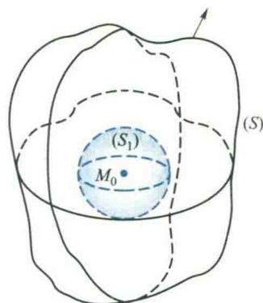  

图6.71

$$

\oiint_ {(S \text {外}) \cup (S _ {1} \text {内})} \pmb {D} \cdot \mathbf {d} \pmb {S} = \iiint_ {(V)} \nabla \cdot \pmb {D} \mathrm{d} V = \iiint_ {(V)} 0 \mathrm{d} V = 0.

$$

从而

$$

\oiint_ {(S \text {外})} D \cdot \mathbf {d} S = \oiint_ {(S _ {1} \text {外})} D \cdot \mathbf {d} S

$$
</Note>

<Note>
到 $e_r = e_n$ ，故有

$$

\oiint_ {(S _ {1})} \boldsymbol {D} \cdot \mathrm{d} \boldsymbol {S} = \oiint_ {(S _ {1})} \frac {q}{4 \pi R ^ {2}} \boldsymbol {e} _ {r} \cdot \boldsymbol {e} _ {n} \mathrm{d} S = \frac {q}{4 \pi R ^ {2}} \oiint_ {(S _ {1})} \mathrm{d} S = q,

$$

即

$$

\Phi_ {S} = \oiint_ {(S)} \boldsymbol {D} \cdot \mathrm{d} \boldsymbol {S} = q. \quad \text {I}

$$

上式表明:由点电荷 q 产生的电位移向量场穿过场中任一包围此点电荷的闭曲面的电通量就是此点电荷 q,这一结论容易被推广到由有限个点电荷所产生的电位移场.

设电位移场 D 是由 n 个分布在不同点上的点电荷 $q_{1}, q_{2}, \cdots, q_{n}$ 产生的. 由电场的叠加原理可知, 电通量是可以叠加的. 若 (S) 是包围这 n 个点电荷的任一分片光滑的闭曲面, 则 D 穿过 (S) 的电通量 $\Phi_{s}$ 应等于各个点电荷 $q_{k}$ 所产生的电位移场 $D_{k}$ 穿过闭曲面 (S) 的电通量的代数和, 即

$$

\Phi_ {S} = \sum_ {k = 1} ^ {n} \oiint_ {(S)} \boldsymbol {D} _ {k} \cdot \mathbf {d S} = \sum_ {k = 1} ^ {n} q _ {k}\tag{8.14}

$$
</Note>

<Example title="例 8.10">
设有一电荷连续分布的带电体(V)，其电荷密度为 $\rho(x,y,z)$ ，求此带电体(V)所产生的电位移向量场 D 的散度.

<Solution title="解">
我们用微元法的思想来解决这一问题.

显然,带电体微元(dV)上的电荷为注:(8.14)式表明:由点电荷 $q_{1},\cdots,q_{n}$ 所产生的电位移向量场D穿过任一分片光滑闭曲面(S)的电通量,等于(S)内部各点电荷的代数和.这就是电学中的Gauss定理.

$$

\mathrm{d} Q = \rho (x, y, z) \mathrm{d} V.

$$

将此电荷看作是一点电荷,由例8.9可知它所产生的电位移向量场穿过场内包含(V)的闭曲面的电通量就是此电荷本身,即为 $\rho(x,y,z)\mathrm{d}V$ .再据电通量的可加性可知,由带电体(V)所产生的电位移向量场D穿过包含(V)在其内部的任一分片光滑闭曲面(S)的电通量为

$$

\Phi_ {S} = \oiint_ {(S)} \boldsymbol {D} \cdot \mathbf {d} \boldsymbol {S} = \iiint_ {(V)} \rho (x, y, z) \mathrm{d} V = Q,\tag{8.15}

$$

其中 Q 为带电体(V)的电荷总量.

而由 Gauss 公式可知

$$

\Phi_ {S} = \oiint_ {(S)} \boldsymbol {D} \cdot \mathbf {d} \boldsymbol {S} = \iiint_ {(V)} \nabla \cdot \boldsymbol {D} \mathrm{d} V,\tag{8.16}

$$

由(8.15)与(8.16)可见

$$

\nabla \cdot D = \rho\tag{8.17}

$$

(8.17)式表明:在静电场中,由带电体所产生的电位移向量场D的散度等于此带电体的电荷密度.
</Solution>
</Example>

## 8.4 Stokes 公式与旋度

## 1. Stokes 公式

Green 公式给出了平面上沿闭曲线 $(C)$ 的第二型线积分与 $(C)$ 所围平面区域上二重积分之间的关系. 现在把它推广到空间, 考察沿空间闭曲线 $(C)$ 的第二型线积分与 $(C)$ 上所张曲面的第二型面积分之间的关系.

二维码6.8.4为什么Stokes公式与曲线(C)上所张定向曲面无关.

<Knowledge title="定理 8.5">
设区域 $(G) \subseteq \mathbf{R}^{3}, P, Q, R \in C^{(1)}((G))$ ， $(C)$ 为 $(G)$ 内一条分段光滑的有向简单闭曲线， $(S)$ 是以 $(C)$ 为边界且完全位于 $(G)$ 内的任一分片光滑的有向曲面， $(C)$ 的方向与 $(S)$ 的法向量符合右手螺旋法则，则

$$

\begin{array}{r l} & \oint_ {(C)} P \mathrm{d} x + Q \mathrm{d} y + R \mathrm{d} z \\ & = \iint_ {(S)} \left(\frac {\partial R}{\partial y} - \frac {\partial Q}{\partial z}\right) \mathrm{d} y \wedge \mathrm{d} z + \left(\frac {\partial P}{\partial z} - \frac {\partial R}{\partial x}\right) \mathrm{d} z \wedge \mathrm{d} x + \left(\frac {\partial Q}{\partial x} - \frac {\partial P}{\partial y}\right) \mathrm{d} x \wedge \mathrm{d} y, \end{array}\tag{8.18}

$$

公式(8.18)称为Stokes公式.

设 $A = (P, Q, R)$ ，利用 nabla 算子 $\nabla$ ，Stokes 公式可写成向量形式

$$

\oint_ {(C)} \boldsymbol {A} \cdot \mathbf {d} \boldsymbol {s} = \iint_ {(S)} (\nabla \times \boldsymbol {A}) \cdot \mathbf {d} \boldsymbol {S} = \iint_ {(S)} (\nabla \times \boldsymbol {A}) \cdot \boldsymbol {e} _ {n} \mathrm{d} S.\tag{8.19}

$$

\*证 首先,我们来证明:

$$

\oint_ {(C)} P \mathrm{d} x = \iint_ {(S)} \frac {\partial P}{\partial z} \mathrm{d} z \wedge \mathrm{d} x - \frac {\partial P}{\partial y} \mathrm{d} x \wedge \mathrm{d} y.\tag{8.20}

$$
</Knowledge>

<Note>
到(8.20)右端是一个第二型面积分,它可以化为二重积分,而左端是空间上的第二型线积分,如果我们能把它转换成平面上的线积分,就可以通过注: 如果 A 为一平面向量场 $(P, Q)$ ， $(C)$ 为一平面闭曲线， $(C)$ 所围区域为 $(\sigma)$ ，这时 Stokes 公式 (8.18) 就退化为 Green 公式，可见，Stokes 公式是 Green 公式的推广。

Green 公式也化为二重积分. 所以, 我们只需将(8.20)的两端都设法化为二重积分进行比较, 就可以证明此等式.

先设曲面(S)与垂直于xOy平面的直线至多交于一点,曲面(S)的法向量与相应曲线(C)的正向由右手螺旋法则确定,如图6.72所示.此时,(S)的方注: 若 $e_{n}$ 朝下, 则由右手螺旋法则 (C) 的方向将相反, 类似以下方法, 同样可证定理成立.

程可以写成 $z = f(x,y)$ ，其边界记为 $(C),(C)$ 是一空间曲线，为了把它利用平面曲线的方程表示,我们考虑(C)在xOy平面上的投影曲线,记为 $(\Gamma)$ .设 $(\Gamma)$ 的参数方程为

$$

x = x (t), \quad y = y (t) \quad (\alpha \leqslant t \leqslant \beta),

$$

由于 $(C)$ 位于曲面 $(S)$ 上， $(C)$ 上点的 $z$ 坐标应满足曲面方程： $z = f(x, y)$ 。从而 $(C)$ 的参数方程应是

$$

\begin{array}{r l} x = & x (t), \quad y = y (t), \quad z = f [ x (t), y (t) ] \\ & (\alpha \leqslant t \leqslant \beta). \end{array}

$$

  

图6.72

设 t 增大的方向对应于 $(C)$ 的正向, 故 $(8.20)$ 式

$$

\begin{array}{r l} \text {左端} & = \oint_ {(C)} P (x, y, z)   \mathrm{d} x = \int_ {\alpha} ^ {\beta} P \{x (t), y (t), f [ x (t), y (t) ] \} \dot {x} (t)   \mathrm{d} t \\ & = \oint_ {(F)} P [ x, y, f (x, y) ]   \mathrm{d} x. \end{array}

$$

这样,我们就将沿空间曲线(C)的第二型线积分通过(C)上所张的曲面(S)化成了xOy平面上的第二型线积分.为了利用Green公式将它化为xOy平面上的二重积分,首先将它写成 $\oint_{(T)}P[x,y,f(x,y)]\mathrm{d}x-0\mathrm{d}y$ ,再根据Green公式和复合函数求导得 $\oint_{(T)}P[x,y,f(x,y)]\mathrm{d}x-0\mathrm{d}y=-\iint_{(\sigma)}\frac{\partial}{\partial y}P[x,y,f(x,y)]\mathrm{d}\sigma=-\iint_{(\sigma)}\left(\frac{\partial P}{\partial y}+\frac{\partial P}{\partial z}\cdot\frac{\partial z}{\partial y}\right)\mathrm{d}\sigma.$ 因此

$$

\oint_ {(C)} P (x, y, z) \mathrm{d} x = - \iint_ {(\sigma)} \left(\frac {\partial P}{\partial y} + \frac {\partial P}{\partial z} \cdot \frac {\partial z}{\partial y}\right) \mathrm{d} \sigma .

$$

其中 $(\sigma)$ 为xOy平面上闭曲线 $(\Gamma)$ 所围成的区域.

下面再来设法将(8.20)的右端也化成xOy平面上的二重积分,由于它是两个积分的组合,要直接化为二重积分需要将(S)分别向zOx平面和xOy平面投影,为了能与左端化成的二重积分比较,我们仅向xOy平面投影,为此,先把它们化为第一型面积分,再转化为二重积分.

设曲面(S)的单位法向量为 $(\cos\alpha,\cos\beta,\cos\gamma)$ ，于是

$$

\begin{array}{r l} \iint_ {(S)} \frac {\partial P}{\partial z} \mathrm{d} z & \wedge \mathrm{d} x - \frac {\partial P}{\partial y} \mathrm{d} x \wedge \mathrm{d} y = \iint_ {(S)} \left(\frac {\partial P}{\partial z} \cos \beta - \frac {\partial P}{\partial y} \cos \gamma\right) \mathrm{d} S \\ & = - \iint_ {(S)} \left(\frac {\partial P}{\partial y} - \frac {\partial P}{\partial z} \cdot \frac {\cos \beta}{\cos \gamma}\right) \cos \gamma \mathrm{d} S \end{array}

$$

因为(S)的法向量n指向上方,由积分曲面(S)的方程: $f(x,y)-z=0$ 可知,n可取为

从而有

$$

\left(- \frac {\partial z}{\partial x}, - \frac {\partial z}{\partial y}, 1\right),

$$

$$

\frac {- \frac {\partial z}{\partial x}}{\cos \alpha} = \frac {- \frac {\partial z}{\partial y}}{\cos \beta} = \frac {1}{\cos \gamma},

$$

于是

$$

\frac {\cos \beta}{\cos \gamma} = - \frac {\partial z}{\partial y},

$$

因此，

$$

\iint_ {(S)} \frac {\partial P}{\partial z} \mathrm{d} z \wedge \mathrm{d} x - \frac {\partial P}{\partial y} \mathrm{d} x \wedge \partial y = - \iint_ {(S)} \left(\frac {\partial P}{\partial y} + \frac {\partial P}{\partial z} \cdot \frac {\partial z}{\partial y}\right) \cos \gamma \mathrm{d} S = - \iint_ {(\sigma)} \left(\frac {\partial P}{\partial y} + \frac {\partial P}{\partial z} \cdot \frac {\partial z}{\partial y}\right) \mathrm{d} \sigma

$$

所以(8.20)式成立.

当曲面(S)与垂直于xOy平面的直线的交点多于一个时,可通过分割的方法,把(S)分成几部分,使每一部分均与垂直于xOy平面的直线至多交于一点,然后分片讨论,再利用第二型线面积分的性质,同样可证(8.20)式成立.

同理可证

$$

\oint_ {(C)} Q (x, y, z) \mathrm{d} y = \iint_ {(S)} \frac {\partial Q}{\partial x} \mathrm{d} x \wedge \mathrm{d} y - \frac {\partial Q}{\partial z} \mathrm{d} y \wedge \mathrm{d} z,\tag{8.21}

$$

  

二维码 6.8.5

Stokes 公式是 Green 公式的推广.

$$

\oint_ {(C)} R (x, y, z) \mathrm{d} z = \iint_ {(S)} \frac {\partial R}{\partial y} \mathrm{d} y \wedge \mathrm{d} z - \frac {\partial R}{\partial x} \mathrm{d} z \wedge \mathrm{d} x,\tag{8.22}

$$

将(8.20)，(8.21)，(8.22)三式两端分别相加即得Stokes公式(8.18).
</Note>

## 2. 环量与环量密度

类似于平面向量场 A 沿平面闭曲线(C)的环量,空间向量场 A 沿空间闭曲线(C)的线积分

$$

\oint_ {(C)} \boldsymbol {A} (x, y, z) \cdot \mathrm{d} s = \oint_ {(C)} P (x, y, z) \mathrm{d} x + Q (x, y, z) \mathrm{d} y + R (x, y, z) \mathrm{d} z

$$

称为 $A(x,y,z)$ 沿闭曲线 (C) 的环量, 它同样表示了 A 绕 (C) 旋转趋势的大小.

环量是对向量场旋转趋势整体的描述.然而在向量场 $A(M)(M\in(G))$ 中,不同点处A的旋转趋势一般说来是不相同的,因而尚需对每点处的旋转趋势作局部的考察.例如在一流速场中,在旋涡附近的质点旋转趋势较大,而远离旋涡中心的质点,其旋转趋势就较小.不仅如此,即使在同一点,由于旋转轴的方向不同也会影响其旋转趋势的大小.设想将一微小叶轮放在旋涡附近,当叶轮的中心轴垂直于水面时,转动较快,倾斜放置时,旋转势必减弱.这一事实表明:当我们讨论向量场在一点处的旋转趋势大小时,必须同时讨论沿什么方向做旋转,或者说讨论其旋转轴的方向.

现在我们来考察向量场 $A(M)$ 在点 $M$ 处绕方向 $\pmb{n}$ 的旋转趋势.为此，以 $\pmb{n}$ 为法向量，过点 $M$ 任作一微小曲面 $(\Delta S)$ ，它的边界曲线记为 $(\Delta C)$ ，并选取 $(\Delta C)$ 的正向使与 $\pmb{n}$ 符合右手螺旋法则(图6.73).当 $(\Delta S)$ 很小时， $A$ 沿 $(\Delta C)$ 的环量 $\Delta \Gamma$ 与小曲面 $(\Delta S)$ 的面积 $\Delta S$ 之比

$$

\frac {\Delta \Gamma}{\Delta S} = \frac {1}{\Delta S} \oint_ {(\Delta C)} \mathbf {A} \cdot \mathbf {d s}

$$

图6.73

近似地反映出 A 在点 M 附近绕方向 n 的旋转趋势大小. 让

小曲面( $\Delta S$ )在保持n为其法向量的前提下任意缩向点M,若上述比值的极限存在,则称此极限值为A在点M沿n方向的环量密度,记作 $\frac{d\Gamma}{dS}$ ,即

$$

\frac {\mathrm{d} \Gamma}{\mathrm{d} S} = \lim _ {(\Delta S) \to M} \frac {\Delta \Gamma}{\Delta S} = \lim _ {(\Delta S) \to M} \frac {1}{\Delta S} \oint_ {(\Delta C)} A \cdot \mathbf {d} s.

$$

可见,环量密度也是一种变化率.

## 3. 旋度的定义及其计算公式

我们看到向量场 $A(M)$ 在点 M 沿不同的方向 n 可能有不同的环量密度, 这一情形与方向导数颇为类似.

在第五章 3.3 段中, 我们引入了与方向导数密切相关的梯度这一向量, 而且看到, 一点处梯度的方向是使该点处方向导数最大的方向, 它的模是该点处方向导数的最大值. 有了梯度后, 要求任一方向的方向导数, 只需求梯度在此方向的投影即可. 下

面完全类似地讨论环量密度,给出旋度定义.

<Knowledge title="定义 8.2">
(旋度) 若在场 A(M) 中一点 M 处存在这样一个向量, 其方向为使 A 在点 M 环量密度最大的方向, 其模等于该点处环量密度的最大值, 则称此向量为场 A(M) 在点 M 的旋度, 记作 rot A.
</Knowledge>

<Note>
与散度场 div A 是数量场不同,旋度场 rot A 是一个向量场,它是由向量场 A 在域(G)内所构成的.反映了 A 在(G)内每一点处沿各个不同旋转轴方向中最大的旋转趋势和此时旋转轴的方向.

计算公式 先推导环量密度的计算公式. 建立直

角坐标系, 设 $A=(P(x,y,z),Q(x,y,z),R(x,y,z))$ 为区域 $(G)\subseteq\mathbf{R}^{3}$ 上的 $C^{(1)}$ 类函数,

$$

\boldsymbol {e} _ {n} = (\cos \alpha , \cos \beta , \cos \gamma)

$$

由环量密度的定义及 Stokes 公式的向量形式(8.19)可知

$$

\frac {\mathrm{d} \varGamma}{\mathrm{d} S} = \lim _ {(\Delta S) \to M} \frac {1}{\Delta S} \oint_ {(\Delta C)} \boldsymbol {A} \cdot \mathbf {d} \boldsymbol {s} = \lim _ {(\Delta S) \to M} \frac {1}{\Delta S} \iint_ {(\Delta S)} (\nabla \times \boldsymbol {A}) \cdot \boldsymbol {e} _ {_ n} \mathrm{d} S.

$$

利用积分中值定理可知

$$

\iint_ {(\Delta S)} (\nabla \times \boldsymbol {A}) \cdot \boldsymbol {e} _ {n} \mathrm{d} S = [ (\nabla \times \boldsymbol {A}) \cdot \boldsymbol {e} _ {n} ] _ {\overline {{{M}}}} \Delta S, \quad \overline {{{M}}} \in (\Delta S).

$$

由于 $(\nabla\times\mathbf{A})\cdot\boldsymbol{e}_{n}$ 在点M连续,从而

$$

\frac {\mathrm{d} \Gamma}{\mathrm{d} S} = \lim _ {(\Delta S) \rightarrow M} \left[ (\nabla \times \boldsymbol {A}) \cdot \boldsymbol {e} _ {n} \right] _ {\overline {{{M}}}} = \left[ (\nabla \times \boldsymbol {A}) \cdot \boldsymbol {e} _ {n} \right] _ {M},\tag{8.23}

$$

或

$$

\frac {\mathrm{d} \Gamma}{\mathrm{d} S} = \left(\frac {\partial R}{\partial y} - \frac {\partial Q}{\partial z}\right) \cos \alpha + \left(\frac {\partial P}{\partial z} - \frac {\partial R}{\partial x}\right) \cos \beta + \left(\frac {\partial Q}{\partial x} - \frac {\partial P}{\partial y}\right) \cos \gamma ,\tag{8.24}

$$

公式(8.23)或(8.24)就是环量密度的计算公式.

由(8.23)式可见

$$

\frac {\mathrm{d} \Gamma}{\mathrm{d} S} = \| \nabla \times \boldsymbol {A} \| \| \boldsymbol {e} _ {n} \| \cos \varphi ,

$$

其中 $\varphi$ 为向量 $\nabla \times A$ 与 $e_n$ 的夹角，因而当 $\varphi = 0$ ，即取 $e_n$ 与向量 $\nabla \times A$ 同向时，环量密度 $\frac{\mathrm{d}\Gamma}{\mathrm{d}S}$ 最大，其值为 $\| \nabla \times A\|$ .由旋度的定义可知，向量 $\nabla \times A$ 正是场 $A$ 在点 $M$ 的旋度，即

$$

\operatorname{rot} A = \nabla \times A,

$$

或

$$

\begin{array}{r l} \text { rot } A & = \left| \begin{array}{c c c} i & j & k \\ \frac {\partial}{\partial x} & \frac {\partial}{\partial y} & \frac {\partial}{\partial z} \\ P & Q & R \end{array} \right| \\ & = \left(\frac {\partial R}{\partial y} - \frac {\partial Q}{\partial z}\right) i + \left(\frac {\partial P}{\partial z} - \frac {\partial R}{\partial x}\right) j + \left(\frac {\partial Q}{\partial x} - \frac {\partial P}{\partial y}\right) k, \end{array}\tag{8.25}

$$

(8.25)式就是旋度的坐标计算公式.

利用旋度，(8.23)式可改写为

$$

\frac {\mathrm{d} \Gamma}{\mathrm{d} S} = \mathbf {r o t} \boldsymbol {A} \cdot \boldsymbol {e} _ {n} = \| \mathbf {r o t} \boldsymbol {A} \| \cos (\mathbf {r o t} \boldsymbol {A}, \boldsymbol {e} _ {n}).

$$

因此,有了旋度后,要求向量场 A 沿方向 $e_{n}$ 的环量密度,只需求旋度 rot A 在 $e_{n}$ 方向的投影即可.

应当指出, 若 $A=(P,Q,R)\in C^{(1)}((G))$ , 则 $(G)$ 内任一点均有一旋度与其对应, 从而旋度 rot A 也在 $(G)$ 内构成一向量场, 称为旋度场.

利用旋度还可将 Stokes 公式写成下列形式：

$$

\oint_ {(C)} \boldsymbol {A} \cdot \mathrm{d} \boldsymbol {s} = \iint_ {(S)} \mathbf {r o t} \boldsymbol {A} \cdot \mathrm{d} S.\tag{8.26}

$$

在各种不同的物理场中,旋度有着不同的物理意义.例如,对于流速场 v, 旋度的方向就是使流体在点 M 处环量密度(旋转趋势)最大的方向,其模就是最大的环量密度,反映了最大的旋转趋势;在磁场强度 H 构成的磁场中,环量密度 $\frac{d\Gamma}{dS}$ 表示在点 M 处沿所取方向 $e_{n}$ 的电流密度,而旋度 rot H 称为电流密度向量,它的方向就是该点处电流密度最大的方向,它的模就是最大的电流密度值.

二维码6.8.6 Stokes公式与Green公式的物理解释.
</Note>

<Example title="例 8.11">
一刚体绕过原点 O 的轴 l 转动(图 6.74)，其角速度 $\omega = (\omega_{1}, \omega_{2}, \omega_{3})$ 为常向量，则刚体中各点处都有线速度 $v(M)$ ，构成一线速度场，求此线速度场 $v(M)$ 的旋度.

<Solution title="解">
设点 $M$ 的向径为

$$

\boldsymbol {r} = (x, y, z),

$$

则由运动学知,点 M 的线速度场为

$$

\boldsymbol {v} = \boldsymbol {\omega} \times \boldsymbol {r} = \left| \begin{array}{c c c} \boldsymbol {i} & \boldsymbol {j} & \boldsymbol {k} \\ \omega_ {1} & \omega_ {2} & \omega_ {3} \\ x & y & z \end{array} \right| = (\omega_ {2} z - \omega_ {3} y, \omega_ {3} x - \omega_ {1} z, \omega_ {1} y - \omega_ {2} x).

$$

  

图6.74

从而

$$

\nabla \times \boldsymbol {v} = \left| \begin{array}{c c c} \boldsymbol {i} & \boldsymbol {j} & \boldsymbol {k} \\ \frac {\partial}{\partial x} & \frac {\partial}{\partial y} & \frac {\partial}{\partial z} \\ \omega_ {2} z - \omega_ {3} y & \omega_ {3} x - \omega_ {1} z & \omega_ {1} y - \omega_ {2} x \end{array} \right| = (2 \omega_ {1}, 2 \omega_ {2}, 2 \omega_ {3}) = 2 \omega .

$$

可见,在刚体旋转的线速度场中,任一点 M 处的旋度,除去一个常数因子外,恰好就是刚体旋转的角速度.
</Solution>
</Example>

## 4. 旋度的运算法则

利用旋度的计算公式(8.25)容易验证下列运算法则：

(1) $\mathbf{rot}(CA) = C\mathbf{rot}A$ 或 $\nabla \times (CA) = C\nabla \times A$ ，其中 $C$ 为常数；

(2) $\operatorname{rot}(A \pm B) = \operatorname{rot} A \pm \operatorname{rot} B$ 或 $\nabla \times (A \pm B) = \nabla \times A \pm \nabla \times B$ ;

(3) $\operatorname{rot}(uA) = u\operatorname{rot} A + \operatorname{grad} u \times A$ 或 $\nabla \times (uA) = u(\nabla \times A) + (\nabla u) \times A$ ，其中 $u$ 为一数量值函数.

<Example title="例 8.12">
在点电荷 q 所产生的静电场中, 求电场强度 E 的旋度.

<Solution title="解">
由电学知

$$

\pmb {E} = \frac {q \pmb {r}}{4 \pi \varepsilon r ^ {3}}, \quad \| \pmb {r} \| = r \neq 0,

$$

其中 r 为向径. 根据旋度的运算法则(1)与(3), 有

$$

\nabla \times \boldsymbol {E} = \nabla \times \left(\frac {q \boldsymbol {r}}{4 \pi \varepsilon r ^ {3}}\right) = \frac {q}{4 \pi \varepsilon} \nabla \times \left(\frac {1}{r ^ {3}} \boldsymbol {r}\right) = \frac {q}{4 \pi \varepsilon} \left(\frac {1}{r ^ {3}} \nabla \times \boldsymbol {r} + \nabla \frac {1}{r ^ {3}} \times \boldsymbol {r}\right).

$$

由于

$$

\nabla \times \boldsymbol {r} = \left| \begin{array}{c c c} \boldsymbol {i} & \boldsymbol {j} & \boldsymbol {k} \\ \frac {\partial}{\partial x} & \frac {\partial}{\partial y} & \frac {\partial}{\partial z} \\ x & y & z \end{array} \right| = \mathbf {0}, \quad \nabla \frac {1}{r ^ {3}} = - \frac {3}{r ^ {5}} \boldsymbol {r},

$$

从而

$$

\nabla \frac {1}{r ^ {3}} \times \boldsymbol {r} = \mathbf {0},

$$

所以

$$

\nabla \times \boldsymbol {E} = \mathbf {0}. \quad \text {   Ⅰ   }

$$
</Solution>
</Example>

## 5. 场的其他计算公式

此外,在场的讨论中还常用到以下公式,我们把它们列举出来以备读者查用(设所涉及高阶偏导数均连续).

(1) $\operatorname{div}(A \times B) = B \cdot \operatorname{rot} A - A \cdot \operatorname{rot} B$ 或

$\nabla\cdot(A\times B)=B\cdot(\nabla\times A)-A\cdot(\nabla\times B)$ ;

(2) $\operatorname{div}(\mathbf{rot}\mathbf{A}) = 0$ 或 $\nabla \cdot (\nabla \times \mathbf{A}) = 0$ ;

(3) rot(grad u)=0 或 $\nabla\times(\nabla u)=0$ ;

(4) $\operatorname{div}(\mathbf{grad} u) = \Delta u$ 或 $\nabla \cdot (\nabla u) = \nabla^2 u = \Delta u,$

其中 $\Delta=\frac{\partial}{\partial x^{2}}+\frac{\partial}{\partial y^{2}}+\frac{\partial}{\partial z^{2}}$ 称为 Laplace 算子， $\Delta u=\frac{\partial^{2}u}{\partial x^{2}}+\frac{\partial^{2}u}{\partial y^{2}}+\frac{\partial^{2}u}{\partial z^{2}}$ 称为 Laplace 式；

(5) $\operatorname{rot}(\operatorname{rot} A) = \operatorname{grad}(\operatorname{div} A) - \Delta A$ 或 $\nabla \times (\nabla \times A) = \nabla (\nabla \cdot A) - \nabla^2 A$ , 其中 $\nabla^2 A = \Delta A = (\Delta P, \Delta Q, \Delta R), A = (P, Q, R)$ .

我们来证明(5)，其余的证明留给读者.

由于 $\nabla \times \mathbf{A} = \left(\frac{\partial R}{\partial y} -\frac{\partial Q}{\partial z},\frac{\partial P}{\partial z} -\frac{\partial R}{\partial x},\frac{\partial Q}{\partial x} -\frac{\partial P}{\partial y}\right),$

$$

\nabla \times (\nabla \times \mathbf {A}) = \left| \begin{array}{c c c} \mathbf {i} & \mathbf {j} & \mathbf {k} \\ \frac {\partial}{\partial x} & \frac {\partial}{\partial y} & \frac {\partial}{\partial z} \\ \frac {\partial R}{\partial y} - \frac {\partial Q}{\partial z} & \frac {\partial P}{\partial z} - \frac {\partial R}{\partial x} & \frac {\partial Q}{\partial x} - \frac {\partial P}{\partial y} \end{array} \right|,

$$

从而 $\nabla \times (\nabla \times A)$ 的第一个分量为

$$

(\nabla \times (\nabla \times \mathbf {A})) _ {x} = \frac {\partial}{\partial y} \left(\frac {\partial Q}{\partial x} - \frac {\partial P}{\partial y}\right) - \frac {\partial}{\partial z} \left(\frac {\partial P}{\partial z} - \frac {\partial R}{\partial x}\right) = \frac {\partial}{\partial x} (\nabla \cdot \mathbf {A}) - \Delta P.

$$

同理可得

$$

(\nabla \times (\nabla \times \boldsymbol {A})) _ {y} = \frac {\partial}{\partial y} (\nabla \cdot \boldsymbol {A}) - \Delta Q,

$$

$$

(\nabla \times (\nabla \times \boldsymbol {A})) _ {z} = \frac {\partial}{\partial z} (\nabla \cdot \boldsymbol {A}) - \Delta R.

$$

所以

$$

\begin{array}{r l} \nabla \times (\nabla \times \boldsymbol {A}) & = \left(\frac {\partial}{\partial x} (\nabla \cdot \boldsymbol {A}) - \Delta P, \frac {\partial}{\partial y} (\nabla \cdot \boldsymbol {A}) - \Delta Q, \frac {\partial}{\partial z} (\nabla \cdot \boldsymbol {A}) - \Delta R\right) \\ & = \left(\frac {\partial}{\partial x} (\nabla \cdot \boldsymbol {A}), \frac {\partial}{\partial y} (\nabla \cdot \boldsymbol {A}), \frac {\partial}{\partial z} (\nabla \cdot \boldsymbol {A})\right) - (\Delta P, \Delta Q, \Delta R) \\ & = \nabla (\nabla \cdot \boldsymbol {A}) - \Delta A. \end{array}

$$

## 8.5 几种重要的特殊向量场

首先,我们需要对空间不同的单连域加以区分.

<Knowledge title="定义 8.3">
如果对于空间区域(G)内的任何简单的闭曲线(C)，都可以作出一张以(C)为边界而完全属于(G)的曲面，那么域(G)称为一维单连域；如果对于(G)内任何不自身相交的闭曲面(S)，它所包围的区域全部属于(G)中，那么域(G)称为二维单连域.

由定义可见,两个同心球面所围成的区域是一个一维单连域,但却不是二维单连域;一个球域挖去一条直径后便不是一维单连域,但它却是一个二维单连域;环面(即轮胎面)所围区域是一个二维单连域,但却不是一维单连域.
</Knowledge>

## 1. 无旋场

在 8.2 中讨论平面向量场 $A(M)$ 时, 我们已经知道, 如果沿场内任一简单的闭曲线 (C) 的环量

$$

\oint_ {(C)} \boldsymbol {A} (M) \cdot \mathbf {d s} = 0,

$$

那么 $A(M)$ 是一无旋场,与此同时,我们还讨论了保守场和有势场,对于空间向量场而言,情况是类似的,只不过现在我们有了旋度的概念,无旋场可以定义得更为简捷.

<Knowledge title="定义 8.4">
设有向量场 $A(M) \in C((G))$ , $(G) \subseteq \mathbf{R}^{3}$ .

（1）若线积分 $\int_{(A)}^{(B)} A(M) \cdot ds$ 的值在 $(G)$ 内与路径无关，则称 $A$ 为保守场，其中 $A, B$ 为 $(G)$ 内任意两点；

(2) 若在(G)内恒有 $\nabla \times A = 0$ ，则称 A 为无旋场；

(3) 若存在定义在 $(G)$ 上的函数 $u$ , 使

$$

\boldsymbol {A} = \nabla u,

$$

则称 A 为有势场, 并称 u 为 A 的势函数或位函数.

当 $(G) \subseteq \mathbf{R}^3$ 是一维单连域而 $A \in C^{(1)}((G))$ 时, 容易从Stokes公式看出, 这里无旋场的定义与沿 $(G)$ 内任何闭曲线 $(C)$ 的环量 $\oint_{(C)} A \cdot ds = 0$ 的定义是等价的 (留作习题), 类似于定理8.2、定理8.3的证明, 可以得到:
</Knowledge>

<Knowledge title="定理 8.6">
设 $(G)$ 是一维单连域, $A = (P, Q, R) \in C^{(1)}((G))$ , 则下列四个命题等价:

(1) A 是一无旋场, 即在 $(G)$ 内恒有

$$

\frac {\partial R}{\partial y} = \frac {\partial Q}{\partial z}, \quad \frac {\partial P}{\partial z} = \frac {\partial R}{\partial x}, \quad \frac {\partial Q}{\partial x} = \frac {\partial P}{\partial y},

$$

即

$$

\operatorname{rot} A = 0;

$$

(2) 沿(G)内任一简单的闭曲线(C)均有环量

$$

\oint_ {(C)} \boldsymbol {A} \cdot \mathbf {d s} = \oint_ {(C)} P \mathrm{d} x + Q \mathrm{d} y + R \mathrm{d} z = 0;

$$

二维码 6.8.7

空间无旋场的

宏观表示与微

观表示及其相

互关系.

(3) A 是一保守场, 即在 $(G)$ 内线积分 $\int_{(A)}^{(B)} A \cdot ds$ 与路径无关;

（4）A 是一有势场，即在 $(G)$ 内 $Pdx + Qdy + Rdz$ 为某一函数的全微分.
</Knowledge>

<Example title="例 8.13">
验证 $A=(x^{2}-y^{2},y^{2}-2xy,z^{2}+2)$ 在全空间 $R^{3}$ 中为有势场，并求其势函数.

<Solution title="解">
由于

$$

\mathbf {r o t} \boldsymbol {A} = \nabla \times \boldsymbol {A} = \left| \begin{array}{c c c} \boldsymbol {i} & \boldsymbol {j} & \boldsymbol {k} \\ \frac {\partial}{\partial x} & \frac {\partial}{\partial y} & \frac {\partial}{\partial z} \\ x ^ {2} - y ^ {2} & y ^ {2} - 2 x y & z ^ {2} + 2 \end{array} \right| = (0, 0, 0),

$$

所以，A 为 $R^{3}$ 中的有势场.

与平面线积分类似,对于空间有势场,我们可以选择一简单的路径通过计算空间线积分去求其势函数,也可利用偏积分法去求势函数(即原函数).前一方法留给读者,这里我们仅介绍偏积分法.

对方程组

$$

\left[ \frac {\partial u}{\partial x} = x ^ {2} - y ^ {2}, \right.\tag{8.27}

$$

$$

\frac {\partial u}{\partial y} = y ^ {2} - 2 x y,\tag{8.28}

$$

$$

\left\lfloor \frac {\partial u}{\partial z} = z ^ {2} + 2 \right.\tag{8.29}

$$

作偏积分,由(8.27)式两端对x积分,注意到积分常数中可能含有y和z,得

$$

u = \frac {1}{3} x ^ {3} - x y ^ {2} + \varphi (y, z).\tag{8.30}

$$

对 $y$ 求偏导数并与(8.28)式比较得

$$

\frac {\partial u}{\partial y} = - 2 x y + \frac {\partial \varphi}{\partial y} = y ^ {2} - 2 x y,

$$

从而

$$

\frac {\partial \varphi}{\partial y} = y ^ {2},

$$

再对 y 作偏积分, 得

$$

\varphi (y, z) = \frac {1}{3} y ^ {3} + \psi (z),

$$

代入(8.30)式后再对z求偏导数,并与(8.29)比较得

$$

\frac {\partial u}{\partial z} = \frac {\partial \varphi}{\partial z} = \psi^ {\prime} (z) = z ^ {2} + 2,

$$

故

$$

\psi (z) = \frac {1}{3} z ^ {3} + 2 z + C,

$$

因此

$$

u = \frac {1}{3} x ^ {3} - x y ^ {2} + \frac {1}{3} y ^ {3} + \frac {1}{3} z ^ {3} + 2 z + C = \frac {1}{3} (x ^ {3} + y ^ {3} + z ^ {3}) - x y ^ {2} + 2 z + C.

$$

对于像本例这种比较简单的问题,也可以用凑全微分法去求势函数(留给读者),但当给定的向量场比较复杂时,凑微分法就显得比较困难一些.

当 $A = (P, Q, R)$ 是有势场时，对于空间线积分，也有类似于Newton-Leibniz公式的公式：

$$

\int_ {(x _ {0}, y _ {0}, z _ {0})} ^ {(x _ {1}, y _ {1}, z _ {1})} P \mathrm{d} x + Q \mathrm{d} y + R \mathrm{d} z = u (x, y, z) \Bigg | _ {(x _ {0}, y _ {0}, z _ {0})} ^ {(x _ {1}, y _ {1}, z _ {1})}.

$$
</Solution>
</Example>

## 2. 无源场

<Knowledge title="定义 8.5">
若在向量场 $A$ 的场域中处处有

$$

\nabla \cdot \boldsymbol {A} = 0,

$$

则称 A 为无源场.
</Knowledge>

<Knowledge title="定义 8.6">
通过向量场的场域某一块曲面(S)的所有向量线构成的一个管状区域称为向量管(图 6.75).
</Knowledge>

<Knowledge title="定理 8.7">
设 $(G) \subseteq \mathbb{R}^{3}$ 是二维单连域, $A \in C^{(1)}((G))$ , 则下列三个命题是等价的:

(1) A 是无源场, 即在 $(G)$ 内恒有 $\nabla \cdot A = 0$ ;

(2) A 沿(G)内任一不自相交闭曲面(S)的通量为零, 即 $\oiint_{(S)} A \cdot dS = 0$ ;

（3）在(G)内存在一向量函数 $B(M)$ ，使 $A=\nabla\times B$ ，即A是某向量场B的旋度场，其中B称为A的一个向量势.

图6.75

\*证 首先证明(1)与(2)等价.

设(1)成立,在(G)内任作一不自身相交的闭曲面(S).由于(G)是二维单连域,所以(S)所包围的区域 $(G')\subseteq(G)$ ,从而由Gauss公式得

$$

\oiint_ {(S)} \mathbf {A} \cdot \mathbf {d} \mathbf {S} = \iiint_ {(G ^ {\prime})} \nabla \cdot \mathbf {A} \mathrm{d} V = 0.

$$

即结论(2)成立.

设(2)成立,要证明(1)成立.用反证法.假定存在一点 $M_{0}\in(G)$ ,使 $\nabla\cdot A(M_{0})\neq0$ ,不妨设 $\nabla\cdot A(M_{0})>0$ .由于 $\nabla\cdot A(M)$ 连续,所以存在 $M_{0}$ 的一邻域使在其中 $\nabla\cdot A\geqslant q>0$ .在此邻域内任作一包含点 $M_{0}$ 且在其内部的闭曲面(S),其所围区域记为 $(G')$ ,运用 Gauss 公式得

$$

\oiint_ {(+ S)} \boldsymbol {A} \cdot \mathbf {d} \boldsymbol {S} = \iiint_ {(G ^ {\prime})} \nabla \cdot \boldsymbol {A} \mathrm{d} V \geqslant q \iiint_ {(G ^ {\prime})} \mathrm{d} V > 0,

$$

与(2)矛盾,所以 $\nabla\cdot\boldsymbol{A}(M)\equiv0,\forall M\in G.$

其次,证明(1)与(3)等价.

设(1)成立,要证明存在向量场 B 使 $\nabla \times B = A$ . 令

$$

\boldsymbol {B} = (X, Y, Z), \quad \boldsymbol {A} = (P, Q, R),

$$

即要从方程组

$$

\left[ \frac {\partial Z}{\partial y} - \frac {\partial Y}{\partial z} = P (x, y, z), \right.\tag{8.31}

$$

$$

\frac {\partial X}{\partial z} - \frac {\partial Z}{\partial x} = Q (x, y, z),\tag{8.32}

$$

$$

\left\lfloor \frac {\partial Y}{\partial x} - \frac {\partial X}{\partial y} = R (x, y, z) \right.\tag{8.33}

$$

中求解 $(X,Y,Z)$ ，这是一偏微分方程组，求解它的一般方法超出了本书的范围。但是，容易验证

$X = \int_{z_0}^{z}Q(x,y,z)\mathrm{d}z - \int_{y_0}^{y}R(x,y,z_0)\mathrm{d}y,\quad Y = -\int_{z_0}^{z}P(x,y,z)\mathrm{d}z,\quad Z = C$

(C 为常数)

满足上述偏微分方程组.事实上对于方程(8.31)与(8.32)，可将上式代入直接验证；对于(8.33)式应用积分号下求导公式得

$$

\frac {\partial Y}{\partial x} - \frac {\partial X}{\partial y} = - \int_ {z _ {0}} ^ {z} \frac {\partial P (x , y , z)}{\partial x} \mathrm{d} z - \int_ {z _ {0}} ^ {z} \frac {\partial Q (x , y , z)}{\partial y} \mathrm{d} z + R (x, y, z _ {0}).

$$

由(1)知

$$

\nabla \cdot \boldsymbol {A} = \frac {\partial P}{\partial x} + \frac {\partial Q}{\partial y} + \frac {\partial R}{\partial z} \equiv 0,

$$

代入上式得

$$

\begin{array}{r l} \frac {\partial Y}{\partial x} - \frac {\partial X}{\partial y} & = - \int_ {z _ {0}} ^ {z} \left(\frac {\partial P (x , y , z)}{\partial x} + \frac {\partial Q (x , y , z)}{\partial y}\right) \mathrm{d} z + R (x, y, z _ {0}) \\ & = \int_ {z _ {0}} ^ {z} \frac {\partial R (x , y , z)}{\partial z} \mathrm{d} z + R (x, y, z _ {0}) = R (x, y, z). \end{array}

$$

设(3)成立,即存在B,使 $A=\nabla\times B$ .由场的其他计算公式(2)知

$$

\nabla \cdot \boldsymbol {A} = \nabla \cdot (\nabla \times \boldsymbol {B}) = 0.

$$

由于(1)与(2)等价,又(1)与(3)等价,所以(1)、(2)、(3)等价.
</Knowledge>

<Knowledge title="定理 8.8">
在二维单连域(G)内,无源场 A(M)穿过(G)内任一向量管的所有断面的通量均相等.
</Knowledge>

<Note>
到向量管的定义可知管壁的法向量均与 A 垂直,读者可容易地给出此定理的证明.
</Note>

## 3. 调和场

<Knowledge title="定义 8.7">
既无源又无旋的向量场 A 称为调和场, 即在场域内恒有

$$

\nabla \cdot \boldsymbol {A} = 0, \quad \nabla \times \boldsymbol {A} = \mathbf {0}.

$$

由于调和场 $A(M)$ 是无旋场，所以也是有势场，即存在势函数 $u(M),M\in (G)$ ，使

二维码 6.8.8

空间无源场的

宏观表示与微

观表示及其相

互关系.

$$

\boldsymbol {A} = \nabla u = \left(\frac {\partial u}{\partial x}, \frac {\partial u}{\partial y}, \frac {\partial u}{\partial z}\right).

$$

又由于 A 是无源场, 所以有

$$

\nabla \cdot \boldsymbol {A} = \nabla \cdot (\nabla u) = 0,

$$

即

$$

\Delta u = 0, \text {或} \frac {\partial^ {2} u}{\partial x ^ {2}} + \frac {\partial^ {2} u}{\partial y ^ {2}} + \frac {\partial^ {2} u}{\partial z ^ {2}} = 0.

$$

上式是一个二阶偏微分方程,称为 Laplace 方程.因此,调和场的势函数必定满足 Laplace 方程.

例如,在第五章第三节中我们已经知道,点电荷 q 所产生静电场的电场强度

$$

\boldsymbol {E} = - \nabla u,

$$

其中 $u = \frac{q}{4\pi\varepsilon r} (r\neq 0)$ 是电场的电位，从而

$$

\nabla \times \boldsymbol {E} = - \nabla \times (\nabla u) = \mathbf {0}, \quad \nabla \cdot \boldsymbol {E} = - \nabla \cdot (\nabla u) = 0 (r \neq 0).

$$

即当 $r \neq 0$ 时, E 是无旋场也是无源场, 所以是调和场. u 是 E 的势函数, 所以 u 必满足 Laplace 方程 $\Delta u = 0$ .

又如, 若 $A(M)$ 是一无旋场, 因而是有势场, $A(M) = \nabla u$ , 设 A 有连续分布的源, 且源的强度为 $\rho(M)$ , 即

$$

\rho = \nabla \cdot \boldsymbol {A} = \nabla \cdot (\nabla u).

$$

所以,其势函数 u 满足方程

$$

\Delta u = \rho ,

$$

这个方程称为 Poisson 方程.例如,当静电场中有连续分布的电荷,其电荷密度为 $\rho$ 时,其电位 u 就满足 Poisson 方程

$$

\Delta u = - \frac {\rho}{\varepsilon},

$$

其中 $\varepsilon$ 为介电系数.
</Knowledge>

<Block title="习题6.8">
(A)

1. 判断下列各题的解法是否正确？若不正确，指出错误原因并给出正确解法：

(1) 求 $\int_{(C)} y \, dx$ ，其中 $(C)$ 为 $(x-1)^{2} + y^{2} = 1$ 上自原点 O 至点 $B(1,1)$ 的一段弧（如图所示）.

解 应用 Green 公式

$$

\int_ {\widehat {O B} \cup \overline {{{B A}}} \cup \overline {{{A O}}}} y \mathrm{d} x = \iint_ {(\sigma)} - 1 \mathrm{d} \sigma = - \frac {\pi}{4},

$$

由于 $\int_{\frac{1}{BA}} y \, \mathrm{d}x = 0, \int_{\frac{1}{AO}} y \, \mathrm{d}x = 0$ ，故 $\int_{(C)} y \, \mathrm{d}x = -\frac{\pi}{4}$ .

(2) 求 $I = \int_{(C)} \frac{-y}{x^{2} + y^{2}} dx + \frac{x}{x^{2} + y^{2}} dy$ ，其中 (C) 是从点 A(0, -1) 沿左半平面的星形线 $x^{2/3} + y^{2/3} = 1$ 到点 D(0, 1) 的曲线段（如图所示）.

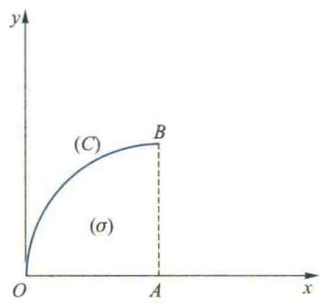  

(第1(1)题图)

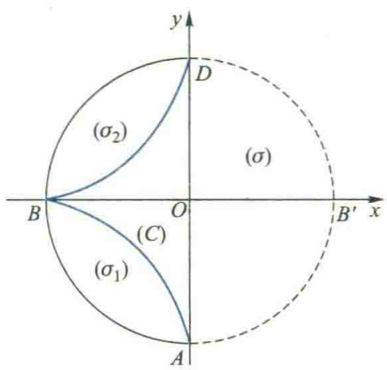  

(第1(2)题图)

解法一 作中心在原点半径为1的圆(如图所示): $\left\{\begin{aligned}x&=\cos t,\\ y&=\sin t,\end{aligned}\right.$ 应用Green公式得

$$

\oint_ {(C) \cup \widehat {D B ^ {\prime} A}} \frac {- y \mathrm{d} x + x \mathrm{d} y}{x ^ {2} + y ^ {2}} = - \iint_ {(\sigma)} 0 \mathrm{d} \sigma = 0,

$$

故

$$

I = \int_ {\widehat {A B ^ {\prime} D}} \frac {- y \mathrm{d} x + x \mathrm{d} y}{x ^ {2} + y ^ {2}} = \int_ {- \pi / 2} ^ {\pi / 2} \frac {\sin^ {2} t + \cos^ {2} t}{\cos^ {2} t + \sin^ {2} t} \mathrm{d} t = \pi .

$$

解法二 设 $\widehat{ABD}$ 为左半圆周, 则

$$

I = \int_ {\widehat {A B D}} \frac {- y \mathrm{d} x + x \mathrm{d} y}{x ^ {2} + y ^ {2}} = \int_ {3 \pi / 2} ^ {\pi / 2} \frac {\sin^ {2} t + \cos^ {2} t}{\cos^ {2} t + \sin^ {2} t} \mathrm{d} t = - \pi .

$$

2. 利用 Green 公式计算下列曲线积分：

(1) $\oint_{(+C)} (1 - x^2)y\mathrm{d}x + x(1 + y^2)\mathrm{d}y, (C)$ 为圆周 $x^2 + y^2 = R^2$ ;

(2) $\oint_{(+C)} (x + y) \, \mathrm{d}x - (x - y) \, \mathrm{d}y$ , (C) 为椭圆 $\frac{x^2}{a^2} + \frac{y^2}{b^2} = 1$ ;

(3) $\oint_{(+C)} (x + y)^2 \mathrm{d}x - (x^2 + y^2) \mathrm{d}y, (C)$ 是顶点为 $A(1,1), B(3,2), C(2,5)$ 的三角形的边界；

(4) $\int_{(C)} \mathrm{e}^{x}[\cos y \mathrm{d}x + (y - \sin y) \mathrm{d}y]$ , (C) 为曲线 $y = \sin x$ 从 $(0,0)$ 到 $(\pi,0)$ 的一段；

(5) $\int_{(C)} (\mathrm{e}^{x}\sin y - my)\mathrm{d}x + (\mathrm{e}^{x}\cos y - m)\mathrm{d}y, (C)$ 为由点 $A(a,0)$ 至点 $O(0,0)$ 的上半圆周 $x^{2} + y^{2} = ax$ （ $m$ 为常数， $a > 0$ ）；

(6) $\int_{(C)} (x^2 + y) \, \mathrm{d}x + (x - y^2) \, \mathrm{d}y, (C)$ 为曲线 $y^3 = x^2$ 由点 $A(0,0)$ 至 $B(1,1)$ 的一段.

3. 利用线积分计算星形线 $x^{2/3} + y^{2/3} = a^{2/3}$ 所围成图形的面积.

4. 求线积分 $\oint_{(C)} [x\cos(x, n) + y\sin(x, n)] \mathrm{d}s$ 的值，其中 $(x, n)$ 为简单闭曲线 $(C)$ 的向外法线向量 $n$ 与 $x$ 轴正向的夹角.

5. 验证下列各式为全微分,并求它们的原函数:

(1) $(x^{2}+2xy-y^{2})\mathrm{d}x+(x^{2}-2xy-y^{2})\mathrm{d}y;$

(2) $(2x\cos y-y^{2}\sin x)\mathrm{d}x+(2y\cos x-x^{2}\sin y)\mathrm{d}y.$

6. 微分方程 $P(x, y) \mathrm{d}x + Q(x, y) \mathrm{d}y = 0$ 当条件 $\frac{\partial Q}{\partial x} \equiv \frac{\partial P}{\partial y}$ 满足时，称为全微分方程。试说明它的通解 $F(x, y) = C$ 与向量场 $(P(x, y), Q(x, y))$ 的势函数之间的关系。

7. 验证下列各方程是全微分方程，并求其通解：

(1) $2xy^{3}dx + 3x^{2}y^{2}dy = 0;$ (2) $(x + 2y)\mathrm{d}x + (2x - y)\mathrm{d}y = 0;$ (3) $(2x\sin y + 3x^{2}y)\mathrm{d}x + (x^{3} + x^{2}\cos y + y^{2})\mathrm{d}y = 0;$ (4) $\frac{\mathrm{d}y}{\mathrm{d}x} = \frac{-2x\sin y}{(x^{2} + 1)\cos y}.$

8. 计算下列线积分：

(1) $\int_{(1,-1)}^{(1,1)}(x-y)(\mathrm{d}x-\mathrm{d}y)$ ; (2) $\int_{(1,0)}^{(6,8)}\frac{x\mathrm{d}x+y\mathrm{d}y}{\sqrt{x^{2}+y^{2}}}$ ，沿不通过原点的路径；

(3) $\int_{(0,0)}^{(1,1)}\frac{2x(1-e^{y})}{(1+x^{2})^{2}}dx+\frac{e^{y}}{(1+x^{2})}dy.$

9. 验证下列场为有势场，并求其势函数：

(1) $A=(2x\cos y-y^{2}\sin x)i+(2y\cos x-x^{2}\sin y)j;$

(2) $A = e^{x} \left[ e^{y}(x - y + 2) + y \right] i + e^{x} \left[ e^{y}(x - y) + 1 \right] j.$

10. 应用 Stokes 公式计算线积分 $\oint_{(C)} y \, dx + z \, dy + x \, dz$ ，(C) 为圆周 $x^{2} + y^{2} + z^{2} = a^{2}$ ， $x + y + z = 0$ ，其方向与平面 $x + y + z = 0$ 的法向量 (1, 1, 1) 符合右手螺旋法则.

11. 应用Stokes公式计算线积分 $\oint_{(C)} (z - y) \, \mathrm{d}x + (x - z) \, \mathrm{d}y + (y - x) \, \mathrm{d}z, (C)$ 是从 $(a, 0, 0)$ 经 $(0, a, 0)$

和 $(0,0,a)$ 回到 $(a,0,0)$ 的三角形.

12. 求向量场 $A=(-y,x,c)$ (c 为常数) 沿下列曲线正方向的环量：

(1) 圆周: $x^{2} + y^{2} = r^{2}, z = 0;$ (2) 圆周: $(x-2)^{2}+y^{2}=R^{2}, z=0.$

13. 求向量场 $A = xyz(i + j + k)$ 在点 $M(1, 3, 2)$ 处的旋度以及在这点沿方向 $n = i + 2j + 2k$ 的环量密度.

14. 求下列场的旋度：

(1) $A = x^{2}i + y^{2}j + z^{2}k;$ (2) $A = yz i + zx j + xy k;$

(3) $A=e^{xy}i+\cos(xy)j+\cos(xz^{2})k$ 在点 $M(0,1,2)$ 处；

(4) $A=(3x^{2}-2yz,y^{3}+yz^{2},xyz-3xz^{2})$ 在点 $M(1,-2,2)$ 处.

15. 已知 $A = 3y i + 2z^{2} j + xy k, B = x^{2} i - 4k$ ，求 $\text{rot}(A \times B)$ .

16. 利用 Gauss 公式计算下列曲面积分：

(1) $\oiint_{(S)} x^{2} \mathrm{d}y \wedge \mathrm{d}z + y^{2} \mathrm{d}z \wedge \mathrm{d}x + z^{2} \mathrm{d}x \wedge \mathrm{d}y, (S)$ 为立方体 $0 \leqslant x \leqslant a, 0 \leqslant y \leqslant a, 0 \leqslant z \leqslant a$ 的外表面；

(2) $\oiint_{(S)} x^{3} \mathrm{d}y \wedge \mathrm{d}z + y^{3} \mathrm{d}z \wedge \mathrm{d}x + z^{3} \mathrm{d}x \wedge \mathrm{d}y, (S)$ 为球面 $x^{2} + y^{2} + z^{2} = R^{2}$ 的外侧；

(3) $\oiint_{(S)} (x^2 - 2xy) \, \mathrm{d}y \wedge \mathrm{d}z + (y^2 - 2yz) \, \mathrm{d}z \wedge \mathrm{d}x + (1 - 2xz) \, \mathrm{d}x \wedge \mathrm{d}y$ , (S) 为球心在坐标原点、半径为 $a$ 的上半球面的上侧；

(4) $\oiint_{(S)} (x^2 \cos \alpha + y^2 \cos \beta + z^2 \cos \gamma) \mathrm{d}S, (S)$ 为锥体 $x^2 + y^2 \leqslant z^2, 0 \leqslant z \leqslant h$ 的表面， $\cos \alpha, \cos \beta, \cos \gamma$ 为此曲面外法线的方向余弦；

(5) $\iint_{(S)} x \, \mathrm{d}y \wedge \mathrm{d}z + y \, \mathrm{d}z \wedge \mathrm{d}x + (x + y + z + 1) \, \mathrm{d}x \wedge \mathrm{d}y$ , (S) 为半椭球面 $z = c \sqrt{1 - \frac{x^2}{a^2} - \frac{y^2}{b^2}}$ 的上侧；

(6) $\iint_{(S)} 4xz\mathrm{d}y \wedge \mathrm{d}z - 2yz\mathrm{d}z \wedge \mathrm{d}x + (1 - z^2)\mathrm{d}x \wedge \mathrm{d}y$ ，其中 $(S)$ 是 $yOz$ 平面上的曲线 $z = \mathrm{e}^{y}$ （ $0 \leqslant y \leqslant a$ ）绕 $z$ 轴旋转成的曲面的下侧.

17. 设(S)为上半球面 $x^{2}+y^{2}+z^{2}=a^{2}\quad(z\geqslant0)$ ，其法向量 n 与 Oz 轴的夹角为锐角，求向量场 r=xi+yj+zk 向 n 所指的一侧穿过(S)的通量.

18. 求 div A 在给定点的值:

(1) $A=x^{3}i+y^{3}j+z^{3}k$ 在 $M(1,0,-1)$ 处；

(2) $A=4xi-2xyj+z^{2}k$ 在 $M(1,1,3)$ 处；

(3) A=xyzr 在 $M(1,3,2)$ 处, 其中 $r=xi+yj+zk$ .

19. 证明下列场为有势场，并求其势函数：

(1) $A = (y \cos xy) i + (x \cos xy) j + \sin zk;$

(2) $A=(2x\cos y-y^{2}\sin x)i+(2y\cos x-x^{2}\sin y)j+zk.$

20. 求下列全微分的原函数：

(1) $\mathrm{du} = (x^{2} - 2yz)\mathrm{dx} + (y^{2} - 2xz)\mathrm{dy} + (z^{2} - 2xy)\mathrm{dz};$

(2) $\mathrm{du} = (3x^{2} + 6xy^{2})\mathrm{dx} + (6x^{2}y + 4y^{3})\mathrm{dy}.$

21. 试证 $Pdx + Qdy$ 在区域 $(\sigma)$ 上的任意两个原函数仅差一个常数.

22. 设 $(G)$ 是一维单连通域, $A(P, Q, R) \in C^{(1)}((G))$ , 试证明在 $(G)$ 内恒有 $\nabla \times A = 0$ 等价于

$\oint_{(C)} A \cdot ds = 0,$ 其中 $(C)$ 为 $(G)$ 中任一分段光滑闭曲线.

23. 设 B 是无源场 A 的向量势, C 是 A 的任一向量势, 证明 $C = B + \text{grad } u$ , 其中 u 为任一数量场.

24. 证明：场 A = -2yi - 2xj 为平面调和场，并求其势函数.

**（B）**

1. 把 Green 公式写成以下两种形式：

$$

\iint_ {(\sigma)} \left(\frac {\partial X}{\partial x} + \frac {\partial Y}{\partial y}\right) \mathrm{d} \sigma = \oint_ {(+ C)} X \mathrm{d} y - Y \mathrm{d} x,

$$

$\iint_{(\sigma)}\left(\frac{\partial X}{\partial x} +\frac{\partial Y}{\partial y}\right)\mathrm{d}\sigma = \oint_{(+C)}[X\cos (x,n) + Y\sin (x,n)]\mathrm{d}s$ ，其中 $(x,n)$ 为正 $x$ 轴到（C）的外法线向量 $n$ 的转角.

2. 设 $u(x, y), v(x, y)$ 是具有二阶连续偏导数的函数，并设 $\Delta u \equiv \frac{\partial^2 u}{\partial x^2} + \frac{\partial^2 u}{\partial y^2}$ . 证明：(1) $\iint_{(\sigma)} \Delta u \mathrm{d}\sigma = \oint_{(c)} \frac{\partial u}{\partial \pmb{n}} \mathrm{d}s$ ；(2) $\iint_{(\sigma)} (u \Delta v - v \Delta u) \mathrm{d}\sigma = -\oint_{(c)} \left(v \frac{\partial u}{\partial \pmb{n}} - u \frac{\partial v}{\partial \pmb{n}}\right) \mathrm{d}s$ ，

其中 $(\sigma)$ 为闭曲线(C)所围的平面域, $\frac{\partial u}{\partial n},\frac{\partial v}{\partial n}$ 分别表示u和v沿(C)的外法线方向的导数.

3. 计算 $\int_{(L)}\frac{xdy-ydx}{4x^{2}+y^{2}}$ ，其中 $(L)$ 是由点 $A(-1,0)$ 经点 $B(1,0)$ 到点 $C(-1,2)$ 的路径， $\widehat{AB}$ 为下半圆周，BC 段是直线.

## 4. 计算曲线积分

$$

I = \int_ {\widehat {A M B}} [ \varphi (y) \cos x - \pi y ] d x + [ \varphi^ {\prime} (y) \sin x - \pi ] d y,

$$

其中 $\widehat{AMB}$ 为联结 $A(\pi,2)$ 及 $B(3\pi,4)$ 两点的光滑曲线，并设 $\widehat{AMB}$ 恒在弦 $\overline{AB}$ 的下方且与 $\overline{AB}$ 围成的弓形域的面积为2.

5. 设函数 $f(x)$ 在 $(- \infty, + \infty)$ 内具有一阶连续导数， $(L)$ 是上半平面 $(y > 0)$ 内的有向分段光滑曲线，其起点为 $(a, b)$ ，终点为 $(c, d)$ . 记 $I = \int_{(L)} \frac{1}{y} [1 + y^2 f(xy)] \mathrm{d}x + \frac{x}{y^2} [y^2 f(xy) - 1] \mathrm{d}y$ .

(1) 证明曲线积分 I 的值与路径(L)无关； (2) 当 ab=cd 时, 求 I 的值.

6. 计算 $\oiint_{(S)} x^3 \mathrm{d}y \wedge \mathrm{d}z + \left[\frac{1}{z} f\left(\frac{y}{z}\right) + y^3\right] \mathrm{d}z \wedge \mathrm{d}x + \left[\frac{1}{y} f\left(\frac{y}{z}\right) + z^3\right] \mathrm{d}x \wedge \mathrm{d}y$ ，其中 $f(u)$ 具有连续的导数，(S)为锥面 $x = \sqrt{y^2 + z^2}$ 与两球面 $x^2 + y^2 + z^2 = 1, x^2 + y^2 + z^2 = 4$ 所围立体的表面外侧.

7. 计算 $\int_{(L)} (y^2 + z^2) \, \mathrm{d}x + (z^2 + x^2) \, \mathrm{d}y + (x^2 + y^2) \, \mathrm{d}z$ ，其中 $(L)$ 是球面 $x^2 + y^2 + z^2 = 4x$ 与柱面 $x^2 + y^2 = 2x$ 的交线，从 $Oz$ 轴正方向看进去为逆时针 ( $z \geqslant 0$ ).

8. 设函数 $F = f\left( xy, \frac{x}{z}, \frac{y}{z} \right)$ 具有连续的二阶偏导数，求 $\operatorname{div}(\operatorname{grad} F)$ .

9. 求 $\operatorname{div}(\mathbf{grad} f(r))$ ，其中 $r = \sqrt{x^2 + y^2 + z^2}$ ，当 $f(r)$ 等于什么时， $\operatorname{div}(\mathbf{grad} f(r)) = 0$ ?

10. 设向量场 F 在空间区域 $G \subseteq R^{3}$ 内有连续的一阶偏导数, 证明对 G 内任何按块光滑的封闭曲面 ( $\Sigma$ ) 有

$$

\iint_ {(\Sigma)} \mathbf {r o t}   F \cdot n \mathrm{d} S = 0.

$$
</Block>
