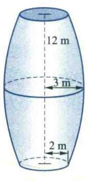
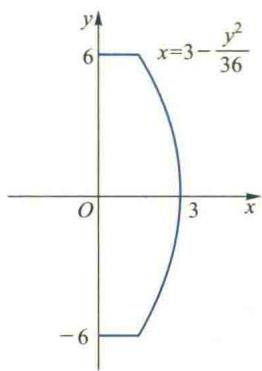
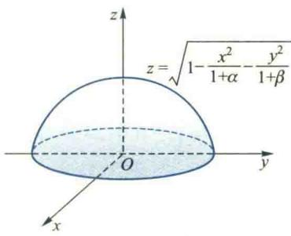

import Guide from '@/components/Guide.astro';
import Knowledge from '@/components/Knowledge.astro';
import Example from '@/components/Example.astro';
import Analysis from '@/components/Analysis.astro';
import Solution from '@/components/Solution.astro';
import Variant from '@/components/Variant.astro';
import Note from '@/components/Note.astro';
import Block from '@/components/Block.astro';
import Method from '@/components/Method.astro';

<Block title="第6章习题">
1. 选择题(在每小题给出的四个选项中只有一个是正确的,试选择正确的选项并说明理由.)

（1）设 $(D)$ 是 $xOy$ 平面上以(1,1)，(-1,1)和(-1,-1)为顶点的三角形区域， $(D_{1})$ 是 $(D)$ 在第一象限的部分，则 $\iint_{(D)} (xy + \cos x\sin y) \mathrm{d}x\mathrm{d}y$ 等于（ ）.  

(A) $2\iint_{(D_{1})}\cos x\sin y\mathrm{d}x\mathrm{d}y$ (B) $2\iint_{(D_{1})} xy\mathrm{d}x\mathrm{d}y$ (C) $4\iint_{(D_{1})}(xy + \cos x\sin y)\mathrm{d}x\mathrm{d}y$ (D) 0

(2) 设 $f(x)$ 为连续函数, $F(t)=\int_{1}^{t}\mathrm{d}y\int_{y}^{t}f(x)\mathrm{d}x$ , 则 $F'(2)$ 等于 ( ). (A) $2f(2)$ (B) $f(2)$ (C) $-f(2)$ (D) 0

(3) 设 $f(x)$ 是连续函数, 已知 $\int_{0}^{1}f(x)\mathrm{d}x = A$ (常数), 则 $\int_{0}^{1}\mathrm{d}x\int_{x}^{1}f(x)f(y)\mathrm{d}y$ 等于 ( ). (A) A (B) $\frac{A}{2}$ (C) $A^{2}$ (D) $\frac{A^{2}}{2}$

（4）设有空间区域 $(\Omega_{1}) = \{(x,y,z)|x^{2} + y^{2} + z^{2}\leqslant R^{2},z\geqslant 0\}$ 及 $(\Omega_2) = \{(x,y,z)|x^2 +y^2 +z^2\leqslant R^2,$ $x\geqslant 0,y\geqslant 0,z\geqslant 0\}$ ，则（ ）.A） $\iiint_{(\Omega_1)}x\mathrm{d}V = 4\iiint_{(\Omega_2)}x\mathrm{d}V$ （B） $\iiint_{(\Omega_1)}y\mathrm{d}V = 4\iiint_{(\Omega_2)}y\mathrm{d}V$ （C） $\iiint_{(\Omega_1)}z\mathrm{d}V = 4\iiint_{(\Omega_2)}z\mathrm{d}V$ （D） $\iiint_{(\Omega_1)}xyz\mathrm{d}V = 4\iiint_{(\Omega_2)}xyz\mathrm{d}V$

(5) 设 $(\Omega) = \{(x, y, z) | x^{2} + y^{2} + z^{2} \leqslant 2y - 2x\}$ ，则 $\iint_{(\Omega)} (x + y + z) \, \mathrm{d}V$ 等于 ( ). 

(A) 0

(B) $\frac{4}{3}\pi$ (C) $-\frac{4}{3}\pi$ (D) $\frac{8}{3}\sqrt{2}\pi$

(6) 设有曲面 $(S) = \{(x, y, z) | x^2 + y^2 + z^2 = a^2 (z \geqslant 0)\}$ , $(S_1)$ 为 $(S)$ 在第一卦限中的部分, 则有 ( ).

(A) $\iint_{(S)} x \mathrm{d}S = 4 \iint_{(S)} x \mathrm{d}S$ (B) $\iint_{(S)} y \mathrm{d}S = 4 \iint_{(S)} x \mathrm{d}S$ (C) $\iint_{(S)} z \mathrm{d}S = 4 \iint_{(S)} z \mathrm{d}S$ (D) $\iint_{(S)} xyz \mathrm{d}S = 4 \iint_{(S)} xyz \mathrm{d}S$

（7）设 D 是第一象限中曲线 2xy=1,4xy=1 与直线 $y=x,y=\sqrt{3}x$ 围成的平面区域，函数 $f(x,y)$ 在 D 上连续，则 $\iint_{D}f(x,y)\mathrm{d}x\mathrm{d}y=(\quad)$ .

(A) $\int_{\pi /4}^{\pi /3}\mathrm{d}\theta \int_{1 / 2\sin 2\theta}^{1 / \sin 2\theta}f(r\cos \theta ,r\sin \theta)r\mathrm{d}r$ (B) $\int_{\pi /4}^{\pi /3}\mathrm{d}\theta \int_{1 / \sqrt{2\sin 2\theta}}^{1 / \sqrt{\sin 2\theta}}f(r\cos \theta ,r\sin \theta)r\mathrm{d}r$ (C) $\int_{\pi /4}^{\pi /3}\mathrm{d}\theta \int_{1 / 2\sin 2\theta}^{1 / \sin 2\theta}f(r\cos \theta ,r\sin \theta)\mathrm{d}r$ (D) $\int_{\pi /4}^{\pi /3}\mathrm{d}\theta \int_{1 / \sqrt{2\sin 2\theta}}^{1 / \sqrt{\sin 2\theta}}f(r\cos \theta ,r\sin \theta)\mathrm{d}r$

2. 计算 $\int_{1}^{2}\mathrm{d}x\int_{\sqrt{x}}^{x}\sin \frac{\pi x}{2y}\mathrm{d}y + \int_{2}^{4}\mathrm{d}x\int_{\sqrt{x}}^{2}\sin \frac{\pi x}{2y}\mathrm{d}y.$

3. 计算 $\int_0^1\mathrm{d}x\int_{x^2}^1\frac{xy}{\sqrt{1 + y^3}}\mathrm{d}y.$

4. 计算 $\iint_{(D)} y \, \mathrm{d}x \, \mathrm{d}y$ ，其中 (D) 由直线 $x = -2, y = 0, y = 2$ 及曲线 $x = -\sqrt{2y - y^2}$ 围成.

5. 计算二重积分 $\iint_{(D)} \mathrm{e}^{\max |x^2, y^2|} \mathrm{d}x \mathrm{d}y$ ，其中 $(D) = \{(x, y) | 0 \leqslant x \leqslant 1, 0 \leqslant y \leqslant 1\}$ .

6. 物质均匀分布的平面薄板由 $x^{2} + y^{2} \leqslant ax$ 和 $x^{2} + y^{2} \leqslant ay$ ( $a > 0$ ) 的公共部分所确定, 求其质心的坐标.

7. 设立体由曲面 $z = 3x^{2} + y^{2}$ 与 $z = 1 - x^{2}$ 围成，求该立体的体积

8. 设函数 $f(x)$ 连续，平面有界闭区域由 $|y| \leqslant |x| \leqslant 1$ 确定，证明：

$$

\iint_ {(D)} f (\sqrt {x ^ {2} + y ^ {2}}) \mathrm{d} x \mathrm{d} y = \pi \int_ {0} ^ {1} x f (x) \mathrm{d} x + \int_ {1} ^ {\sqrt {2}} \left(\pi - 4 \arccos \frac {1}{x}\right) x f (x) \mathrm{d} x.

$$

9. 计算 $\iiint_{(\Omega)} \mathrm{e}^{|z|} \, \mathrm{d}V$ ，其中 $(\Omega)$ 为球体 $x^2 + y^2 + z^2 \leqslant 1$ .

10. 设函数 $f(x)$ 连续且恒大于零，

$$

F (t) = \frac {\iiint_ {D (t)} f (x ^ {2} + y ^ {2} + z ^ {2}) \mathrm{d} V}{\iint_ {D (t)} f (x ^ {2} + y ^ {2}) \mathrm{d} \sigma}, \quad G (t) = \frac {\iint_ {D (t)} f (x ^ {2} + y ^ {2}) \mathrm{d} \sigma}{\int_ {- 1} ^ {t} f (x ^ {2}) \mathrm{d} x}.

$$

其中 $\Omega(t)=\left\{(x,y,z)\left|x^{2}+y^{2}+z^{2}\leqslant t^{2}\right\},D(t)=\left\{(x,y)\left|x^{2}+y^{2}\leqslant t^{2}\right.\right\}.$

(1) 讨论 $F(t)$ 在区间 $(0, +\infty)$ 内的单调性；

(2) 证明当 t>0 时, $F(t)>\frac{2}{\pi}G(t)$ .

11. 指出区域 $(V) = \{(x, y, z) | x^2 + y^2 + z^2 \leqslant 4z\}$ 的形心坐标，并计算 $I = \iiint_{(V)} (x + y + z) \, \mathrm{d}V$ .

12. 计算 $\iiint_{(\Omega)} (x^2 + y^2) \, \mathrm{d}V$ ，其中 $(\Omega)$ 是圆台体，其上、下底半径分别为 $a, b$ （ $0 < a < b$ ），高为 $h$ ，下底为 $xOy$ 面内的圆域 $x^2 + y^2 \leqslant b^2$ .

13. 设空间区域 $(\Omega)$ 由

$$

\sqrt {x ^ {2} + y ^ {2}} \leqslant z \leqslant \sqrt {1 - x ^ {2} - y ^ {2}}, \quad 0 \leqslant x \leqslant y \leqslant \sqrt {3} x

$$

所确定,将三重积分 $I = \iiint_{(\Omega)} f(y, z) \, \mathrm{d}V$ 化为球面坐标下的累次积分.

14. 设 $(L)$ 是椭圆 $\frac{x^2}{4} + \frac{y^2}{3} = 1$ ，其周长记为 $a$ ，求 $\oint_{(L)} (2xy + 3x^2 + 4y^2) \, \mathrm{d}s$ .

15. 计算曲面积分 $\iint_{(\Sigma)} z \mathrm{~d} S$ , 其中 $(\Sigma)$ 为锥面 $z = \sqrt{x^2 + y^2}$ 在柱体 $x^2 + y^2 \leqslant 2x$ 内的部分.

16. 设有一高度为 $h(t)$ (t 为时间) 的雪堆在融化过程中, 其表面满足方程 $z = h(t) - \frac{2(x^{2} + y^{2})}{h(t)}$ (设长度单位为 cm, 时间单位为 h), 已知体积减小的速率与侧面积成正比 (比例系数为 0.9), 问高度为 130 cm 的雪堆全部融化需多少小时?

17. 质点 P 沿着以 AB 为直径的下半圆周, 从点 A(1,2) 运动到点 B(3,4) 的过程中受变力 F 作用, F 的大小等于点 P 到原点 O 之间的距离, 其方向垂直于线段 OP 且与 y 轴正向的夹角小于 $\frac{\pi}{2}$ , 求变力 F 对质点 P 所做的功.

18. 计算曲线积分 $I = \oint_{(L)} \frac{x \, \mathrm{d}y - y \, \mathrm{d}x}{4x^2 + y^2}$ ，其中 (L) 是不经过原点 $O(0,0)$ 的任一分段光滑的简单闭曲线的正向.

19. 求 $I = \int_{(L)} (\mathrm{e}^{x} \sin y - b(x + y)) \, \mathrm{d}x + (\mathrm{e}^{x} \cos y - ax) \, \mathrm{d}y$ ，其中 $a, b$ 为正的常数，(L)为从点 $A(2a,0)$ 沿曲线 $y = \sqrt{2ax - x^2}$ 到点 $O(0,0)$ 的弧.

20. 已知曲线 $L$ 的方程为 $\left\{ \begin{array}{l} z = \sqrt{2 - x^2 - y^2}, \\ z = x, \end{array} \right.$ 起点为 $A(0, \sqrt{2}, 0)$ , 终点为 $B(0, -\sqrt{2}, 0)$ , 计算 $I = \int_{L} (y + z) \mathrm{d}x + (z^2 - x^2 + y) \mathrm{d}y + x^2 y^2 \mathrm{d}z$ .

21. 计算 $\int_{(L)} \frac{y^2}{\sqrt{a^2 + x^2}} \mathrm{d}x + (ax + 2y \ln (x + \sqrt{a^2 + x^2})) \mathrm{d}y$ ，其中（L）是从点 $A(0, R)$ 沿圆周 $x = -\sqrt{R^2 - y^2}$ 到点 $B(0, -R)$ 的有向曲线段，常数 $a > 0$ .

22. 计算 $\int_{(L)}\left(1-\frac{y^{2}}{x^{2}}\cos\frac{y}{x}\right)\mathrm{d}x+\left(\sin\frac{y}{x}+\frac{y}{x}\cos\frac{y}{x}\right)\mathrm{d}y$ ，其中 $(L)$ 是抛物线 $y=4\pi\left(x-\frac{3}{2}\right)^{2}$ 上从点 $A(1,\pi)$ 到点 $B(2,\pi)$ 的有向曲线段.

23. 试确定正常数 $\lambda$ 的值, 使曲线积分

$$

\int_ {(C)} x y ^ {\lambda} \mathrm{d} x + x ^ {\lambda} y \mathrm{d} y

$$

与路径无关，并对所求出的 $\lambda$ ，计算 $\int_{(1,1)}^{(0,2)}xy^{\lambda}\mathrm{d}x + x^{\lambda}y\mathrm{d}y$ 的值.

24. 已知 $u(x, y)$ 是定义在 $(D) = \{(x, y) | x + y > 0\}$ 上的二元函数，且 $\frac{(x + ay) \mathrm{d}x + y \mathrm{d}y}{(x + y)^2}$ 是 $u(x, y)$ 的全微分，试求常数 $a$ 的值及函数 $u(x, y)$ .

25. 设函数 $Q(x,y)$ 在 xOy 平面上具有一阶连续偏导数, 曲线积分 $\int_{(L)} 2xy \, dx + Q(x,y) \, dy$ 与路径无关, 并且对任意 t 恒有

$$

\int_ {(0, 0)} ^ {(t, 1)} 2 x y \mathrm{d} x + Q (x, y) \mathrm{d} y = \int_ {(0, 0)} ^ {(1, t)} 2 x y \mathrm{d} x + Q (x, y) \mathrm{d} y,

$$

求 $Q(x,y)$ .

26. 设函数 $f(x, y)$ 满足 $\frac{\partial f(x, y)}{\partial x} = (2x + 1)e^{2x - y}$ ，且 $f(0, y) = y + 1, L_t$ 是从点 $(0, 0)$ 到点 $(1, t)$ 的光

滑曲线, 计算曲线积分 $I(t) = \int_{(L)} \frac{\partial f(x, y)}{\partial x} \mathrm{d}x + \frac{\partial f(x, y)}{\partial y} \mathrm{d}y$ , 并求 $I(t)$ 的最小值.

27. 设流体的密度为 1, 流速 $v = xz^2 i + \sin xk$ , 曲面 (S) 是由曲线 $\begin{cases} y = \sqrt{1 + z^2} \\ x = 0 \end{cases}$ , $(1 \leqslant z \leqslant 2)$ 绕 $Oz$ 轴旋转一周所形成的旋转面, (S) 正侧的法向量与 $Oz$ 轴正向的夹角为锐角, 求单位时间内流向 (S) 正侧的流量.

## 28. 计算曲面积分

$$

I = \iint_ {(\Sigma)} 2 x ^ {3} \mathrm{d} y \wedge \mathrm{d} z + 2 y ^ {3} \mathrm{d} z \wedge \mathrm{d} x + 3 (z ^ {2} - 1) \mathrm{d} x \wedge \mathrm{d} y,

$$

其中 $(\Sigma)$ 是曲面 $z=1-x^{2}-y^{2}$ （ $z\geqslant0$ ）的上侧.

29. 计算 $I = \oint_{(L)} (y^2 - z^2) \, \mathrm{d}x + (2z^2 - x^2) \, \mathrm{d}y + (3x^2 - y^2) \, \mathrm{d}z$ ，其中（L）是平面 $x + y + z = 2$ 与柱面 $|x| + |y| = 1$ 的交线，从 $z$ 轴正向看去，（L）为逆时针方向.

30. 设薄片型物体 S 是圆锥面 $z = \sqrt{x^{2} + y^{2}}$ 被柱面 $z^{2} = 2x$ 割下的有限部分, 其上任一点的密度为 $\mu = 9\sqrt{x^{2} + y^{2} + z^{2}}$ . 记圆锥面与柱面的交线为 C, (1) 求 C 在 xOy 面上的投影曲线的方程; (2) 求 S 的质量 M.

## 综合练习题

1. 如图所示, 一个对称的地下油库, 它的内部设计是: 横截面为圆, 在中心位置上的半径是 $3 \mathrm{~m}$ , 到底部和顶部的半径减小到 $2 \mathrm{~m}$ ; 底部和顶部相隔 $12 \mathrm{~m}$ (图(a)); 纵截面的两侧是抛物线 $x = 3 - \frac{y^2}{36} (-6 \leqslant y \leqslant 6)$ (图(b)).

  

(a)

  

(b)  

(第1题图)

  

(第2题图)

(1) 求油库的容积;

(2) 为了设计油库的油量标尺,试求出油库中油量分别为 $10 \mathrm{~m}^{3}, 20 \mathrm{~m}^{3}, 30 \mathrm{~m}^{3}, \cdots$ 时油的深度.

2. 某工厂按原设计要对一半球体工件的半球面部分镀上一层稀有金属, 其半球面方程为 $x^{2} + y^{2} + z^{2} = 1$ ( $z \geqslant 0$ ) (如图所示), 该厂按原设计的半球面面积 $2\pi$ 备好电镀材料. 当工件加工好后, 对工件进行了测量, 发现半球面方程为

$$

\frac {x ^ {2}}{1 + \alpha} + \frac {y ^ {2}}{1 + \beta} + z ^ {2} = 1 (z \geqslant 0),

$$

其中 $\left|\alpha\right|$ ， $\left|\beta\right|$ 是很小的正数，在测量了 $\alpha$ 和 $\beta$ 后，工人师傅希望知道，按原准备好的材料电镀后，镀层厚度在什么情况下比原设计的薄？在什么情况下比原设计的厚？
</Block>
