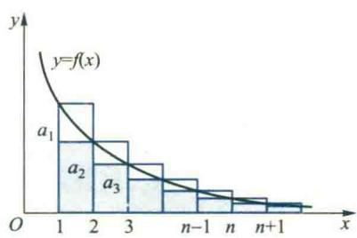
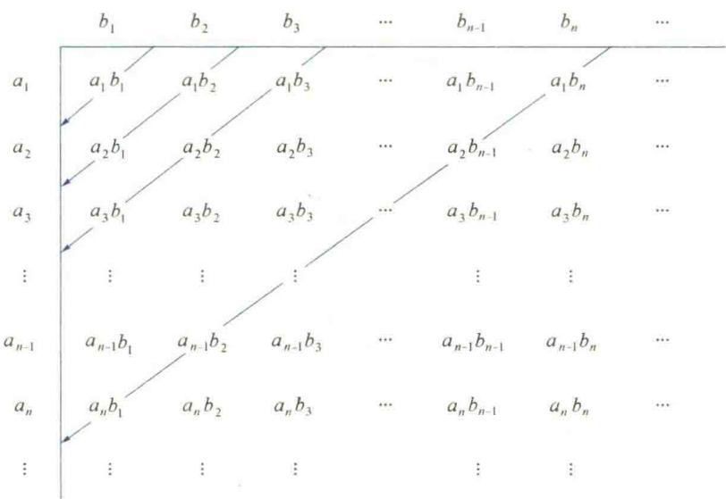

import ExerciseTrigger from '@/components/exercises/ExerciseTrigger.astro';
import QRCodeVideo from '@/components/QRCodeVideo.astro';

import Guide from '@/components/Guide.astro';
import Knowledge from '@/components/Knowledge.astro';
import Example from '@/components/Example.astro';
import Analysis from '@/components/Analysis.astro';
import Solution from '@/components/Solution.astro';
import Variant from '@/components/Variant.astro';
import Note from '@/components/Note.astro';
import Block from '@/components/Block.astro';
import Method from '@/components/Method.astro';
import Exercise from '@/components/Exercise.astro';

本节讨论常数项级数的概念、性质与审敛准则,它们是学习函数项级数的基础.在学习这部分内容的时候,应当注意它与数列极限相应内容之间的关系.

## 1.1 常数项级数的概念、性质与收敛原理

在许多理论与实际问题的研究中，常常会提出无穷多个数“相加”的问题，下面讨论一个有趣的例子.

<Example title="例 1.1">
设有弹性小球自高为 H m 处无初速地下落, 落下后又弹起. 若每次弹起的高度为前次下落高度的一半, 如此往复不已. 问小球是否会停止跳动?

大家知道,弹性小球的跳动次数是无穷的,它是否会停止跳动,关键在于小球完成无穷次跳动所用的时间是否有限.若所用的时间有限,则小球必定停跳,否则不会.下面就来计算每次跳动所用的时间.根据自由落体的运动规律 $h=\frac{1}{2}gt^{2}$ 得

小球从高为 H m 处落到地面所用时间为 $T_{0}=\sqrt{\frac{2H}{g}}$ s,

小球从地面回跳到 $\frac{1}{2}H\ m$ 的高处后再落到地面所用的时间 $T_{1}=2\sqrt{\frac{H}{g}}\ s$ ,
小球第 2 次从地面回跳再落到地面所用时间为 $T_{2}=2\sqrt{\frac{H}{2g}}\ s$ ,

......

小球第 n 次往复跳动所用时间为 $T_{n}=2\sqrt{\frac{H}{2^{n-1}g}}$ s,

于是小球完成无穷多次往复跳动所用的时间为

$$
\begin{array}{r l} T & = \sqrt {\frac {2 H}{g}} + 2 \sqrt {\frac {H}{g}} + 2 \sqrt {\frac {H}{2 g}} + \dots + 2 \sqrt {\frac {H}{2 ^ {n - 1} g}} + \dots \\ & = \sqrt {\frac {2 H}{g}} + 2 \sqrt {\frac {H}{g}} \left(1 + \frac {1}{\sqrt {2}} + \frac {1}{2} + \dots + \frac {1}{\sqrt {2 ^ {n - 1}}} + \dots\right) (\mathrm{s}). \end{array}\tag{1.1}
$$
</Example>

上式右端是由无穷多个数用加号连接起来的一个表达式.为了回答小球是否会停跳,就要研究无穷多个数“相加”的问题.无穷多个数“相加”的含义是什么?能否像有限个数相加那样定义它的“和”呢?显然,我们不能像对有限个数的加法那样对无穷多个数逐一相加,必须科学合理地给出无穷多个数“相加”及其“和”的定义.

通常,将已给数列 $\{a_{n}\}$ 的各项依次用加号连接起来的表达式

$$
a _ {1} + a _ {2} + \dots + a _ {n} + \dots , \text {或} \sum_ {n = 1} ^ {\infty} a _ {n}\tag{1.2}
$$

称为常数项无穷级数,简称为常数项级数或级数, $a_{n}$ 称为该级数的通项.

在第一章中我们曾用极限理论来研究一个无限变化过程,由于级数实际上也是一个无限个数“相加”的无限过程,因此,我们可以通过有限项相加,利用极限来研究它.

<Knowledge title="定义 1.1 级数的收敛性与和">
级数(1.2)的前 $n$ 项之和

$$
S _ {n} = a _ {1} + a _ {2} + \dots + a _ {n} = \sum_ {k = 1} ^ {n} a _ {k} (n = 1, 2, \dots)
$$

称为它的部分和.若部分和数列 $\{S_{n}\}$ 收敛,则称级数(1.2)收敛,并称

$$
S = \lim _ {n \to \infty} S _ {n} = \lim _ {n \to \infty} \sum_ {k = 1} ^ {n} a _ {k}
$$

为它的和,记作 $\sum_{n=1}^{\infty}a_{n}=S$ ; 否则,称级数(1.2)发散.级数(1.2)的收敛与发散统称为敛散性.收敛级数的和与其部分和之差 $R_{n}=S-S_{n}=\sum_{k=n+1}^{\infty}a_{k}$ 称为该级数的余项.
</Knowledge>

<Example title="例 1.2">
讨论等比级数(或几何级数)
</Example>

定义1.1回答了无限多个数“相加”的含义及其“和”的定义这两个重要问题,将无限多个数相加定义为当项数无限增加时其有限项和(即它的部分和)的极限;若极限存在,则将其极限值定义为它的和.这样,就将无穷级数的敛散性及其求和问题转化为它的部分和数列的敛散性与求极限问题.因此,在学习和研究无穷级数的时候,不但需要应用许多数列极限的知识,而且还要用到许多极限理论的思想方法.

$$
\sum_ {n = 0} ^ {\infty} a q ^ {n} = a + a q + a q ^ {2} + \dots + a q ^ {n - 1} + \dots (a \neq 0)
$$

的敛散性.

<Solution title="解">
该级数的部分和为

$$
S _ {n} = a + a q + a q ^ {2} + \dots + a q ^ {n - 1} = \left\{ \begin{array}{c c} \frac {a (1 - q ^ {n})}{1 - q}, & q \neq 1, \\ n a, & q = 1. \end{array} \right.
$$

当 $|q| < 1$ 时，由于

$$
\lim _ {n \to \infty} S _ {n} = \lim _ {n \to \infty} \frac {a (1 - q ^ {n})}{1 - q} = \frac {a}{1 - q},
$$

<QRCodeVideo id="7.1.1" title="研究无穷级数的敛散性与研究数列的敛散性之间的关系." url="HTTP://2D.HEP.CN/1254052/38" />

故该级数收敛,且其和为 $\frac{a}{1-q}$ ;当 $|q|>1$ 时,由于 $\lim_{n\to\infty}q^{n}=\infty$ ,从而 $\lim_{n\to\infty}S_{n}$ 不存在,故该数级发散;当q=1时,显然级数也发散;当q=-1时,级数变为

$$
a - a + a - a + \dots + (- 1) ^ {n - 1} a + \dots ,
$$

由于它的部分和

$$
S _ {n} = \left\{ \begin{array}{l l} 0, & n \text {为偶数，} \\ a, & n \text {为奇数} \end{array} \right.
$$

是一个发散数列,所以该级数发散.
</Solution>

综上所述, 当 $\left|q\right|<1$ 时, 等比级数收敛, 其和为 $\frac{a}{1-q}$ ; 当 $\left|q\right|\geqslant1$ 时, 等比级数发散.

下面,利用例 1.2 的结果来回答例 1.1 中的问题.事实上,该例中的级数(1.1)从第二项以后是公比 $q=\frac{1}{\sqrt{2}}$ 的一个等比级数,所以

$$
T = \sqrt {\frac {2 H}{g}} + 2 \sqrt {\frac {H}{g}} \frac {1}{1 - \frac {1}{\sqrt {2}}} = (4 + 3 \sqrt {2}) \sqrt {\frac {H}{g}} (\mathrm{s}).
$$

这就是说,小球完成无穷次跳动所用的时间 T 是有限的,因此,小球的跳动一定会停止.

<Example title="例 1.3">
证明: 级数

$$
\sum_ {n = 1} ^ {\infty} \frac {1}{n (n + 1)} = \frac {1}{1 \cdot 2} + \frac {1}{2 \cdot 3} + \dots + \frac {1}{n (n + 1)} + \dots
$$

收敛,且其和 S=1.

<Solution title="证明">
由于级数的部分和数列为

$$
S _ {n} = \frac {1}{1 \cdot 2} + \frac {1}{2 \cdot 3} + \dots + \frac {1}{n (n + 1)}, \quad n = 1, 2, \dots ,
$$

根据上册第一章的例 2.6, $\lim_{n\to\infty}S_n=1$ , 故级数收敛, 且其和 S=1.
</Solution>
</Example>

<Example title="例 1.4">
证明: 调和级数

$$
\sum_ {n = 1} ^ {\infty} \frac {1}{n} = 1 + \frac {1}{2} + \frac {1}{3} + \dots + \frac {1}{n} + \dots
$$

是发散的.

<Solution title="证明">
由于该级数的部分和数列为

$$
S _ {n} = 1 + \frac {1}{2} + \frac {1}{3} + \dots + \frac {1}{n} (n \in \mathbf {N} _ {+}),
$$

在上册第一章例 2.12 已经证明它是一个发散数列, 故知调和级数是发散的.
利用数列极限的有关性质, 不难证明级数的下列基本性质.
</Solution>
</Example>

<Knowledge title="性质 1.1">
设 $\sum_{n=1}^{\infty} a_n = S, \sum_{n=1}^{\infty} b_n = \widetilde{S}$ , 其中 $S$ 与 $\widetilde{S}$ 均为有限实数, 则

(1) $\sum_{n=1}^{\infty}(a_n \pm b_n) = \sum_{n=1}^{\infty} a_n \pm \sum_{n=1}^{\infty} b_n = S \pm \widetilde{S}$ ;

(2) $\sum_{n=1}^{\infty} C a_n = C \sum_{n=1}^{\infty} a_n = CS$ , 其中 $C \in \mathbb{R}$ 为常数；

(3) 若 $a_{n} \leqslant b_{n}$ , 则 $\sum_{n=1}^{\infty} a_{n} \leqslant \sum_{n=1}^{\infty} b_{n}$ .
</Knowledge>

<Knowledge title="性质 1.2">
在一个级数中,任意删去、添加或改变有限项不改变该级数的敛散性.

(1) 试用数列极限的有关性质证明级数的性质 1.2, 1.3.
</Knowledge>

<Knowledge title="性质 1.3 1">
设级数 $\sum_{n = 1}^{\infty}a_n$ 收敛，则 $\lim_{n\to \infty}a_n = 0$ (2) 举例说明删去或添加无限项是否改变级数的敛散性?

（2）级数 $\sum_{n = 1}^{\infty}a_n$ 收敛的充要条件为 $\lim_{n\to \infty}R_n = 0.$
</Knowledge>

性质1.3中的(1)是级数收敛的必要条件.由于(1)中条件比较容易验证,因此常被用来证明级数的发散性.就是说,若 $\{a_{n}\}$ 不收敛,或者虽收敛但 $\lim_{n\to\infty}a_{n}\neq0$ ,则级数 $\sum_{n=1}^{\infty}a_{n}$ 必定发散.例如,级数 $\sum_{n=1}^{\infty}(-1)^{n+1}$ 与 $\sum_{n=1}^{\infty}\frac{1}{\sqrt[n]{2}}$ 都是发散的.

<Knowledge title="性质 1.4">
若 $\sum_{n=1}^{\infty} a_n$ 为收敛级数, 则不改变它的各项次序任意加入括号后所得到的新级数仍收敛, 并且和不变.

<Solution title="证明">
设 $\sum_{n=1}^{\infty} a_n = S$ ，部分和数列为 $\{S_n\}$ 。在该级数中任意加入括号，便得一新级数

$$
\begin{array}{r l} & (a _ {1} + a _ {2} + \dots + a _ {n _ {1}}) + (a _ {n _ {1} + 1} + a _ {n _ {1} + 2} + \dots + a _ {n _ {2}}) \\ & \quad + \dots + (a _ {n _ {k - 1} + 1} + a _ {n _ {k - 1} + 2} + \dots + a _ {n _ {k}}) + \dots , \end{array}
$$

记它的部分和数列为 $\{\widetilde{S}_k\}$ ，则

$$
\widetilde {S} _ {1} = S _ {n _ {1}}, \quad \widetilde {S} _ {2} = S _ {n _ {2}}, \quad \dots , \quad \widetilde {S} _ {k} = S _ {n _ {k}}, \dots .
$$

因此 $\{\widetilde{S}_k\}$ 为原级数部分和数列 $\{S_n\}$ 的一个子列 $\{S_{n_k}\}$ ，根据数列极限的归并原理知新级数收敛，且

$$
\lim _ {k \to \infty} \widetilde {S} _ {k} = \lim _ {k \to \infty} S _ {n _ {k}} = S. \quad i
$$

与数列类似,对于级数也要研究两个基本问题:第一,判别敛散性问题;第二,收敛级数的求和问题.第二个问题比较困难,但第一个问题更重要.因为如果级数发散,那么它无和可求;如果级数收敛,即使无法求出其和的精确值,也可利用部分和求出它的近似值.而且根据性质1.3的(2),近似值可以达到任意的精确度,从而满足实际问题的需要.因此,判断敛散性是级数理论的首要问题,也是我们研究的重点.

将判断数列收敛性的 Cauchy 原理转化到级数中来,容易得到判断级数敛散性的一个基本原理.
</Solution>
</Knowledge>

性质 1.4 说明, 任何收敛的级数都满足有限个数加法的结合性, 即加括号后仍收敛且和不变. 但与有限项加法不同的是, 它的逆命题不一定成立, 就是说, 添加括号后得到的级数收敛不能保证原级数收敛. 例如, 级数

$$
\begin{array}{r l} (1 - 1) + (1 - 1) + \dots + \\ (1 - 1) + \dots \end{array}
$$

是收敛的,但未加括号的级数 1-1+1-1+ $\cdots$ +1-1+ $\cdots$ 却发散.

对发散级数而言,加括号后不仅可能收敛,而且用不同方式加括号可能收敛于不同的极限.例如上述发散级数 $\sum_{n=1}^{\infty}(-1)^{n+1}$ , 相邻两项加括号后易得其和为 0, 即收敛于 0, 但若用下述方法加括号 $1-(1-1)-(1-1)-\cdots-(1-1)-\cdots$ ,

<Knowledge title="定理 1.1 Cauchy收敛原理">
级数 $\sum_{n = 1}^{\infty}a_n$ 收敛的充要条件是
</Knowledge>

则收敛于1.

$\forall \varepsilon > 0, \exists N \in \mathbf{N}_{+}$ , 使得 $\forall p \in \mathbf{N}_{+}$ , 当 $n > N$ 时, 恒有 $\left|\sum_{k=n+1}^{n+p} a_k\right| < \varepsilon$ . (1.3)

<Example title="例 1.5">
利用 Cauchy 收敛原理证明 级数 $\sum_{n=1}^{\infty}\frac{1}{n^{2}}$ 想一想：
写出利用 Cauchy 收敛原理证明级
收敛.

<Solution title="证明">
在第一章的例 2.11 中, 已经证得: $\forall n$ , $p \in \mathbf{N}_{+}$ ,

写出利用 Cauchy 收敛原理证明级数 $\sum_{n=1}^{\infty} a_{n}$ 发散的条件, 并用它证明调和级数 $\sum_{n=1}^{\infty} \frac{1}{n}$ 发散.

$$
\frac {1}{(n + 1) ^ {2}} + \frac {1}{(n + 2) ^ {2}} + \dots + \frac {1}{(n + p) ^ {2}} <   \frac {1}{n},
$$

因此， $\forall \varepsilon > 0$ ，只要取 $N = \left[\frac{1}{\varepsilon}\right]$ ，则当 $n > N$ 时，

$$
0 <   \frac {1}{(n + 1) ^ {2}} + \frac {1}{(n + 2) ^ {2}} + \dots + \frac {1}{(n + p) ^ {2}} <   \frac {1}{n} <   \varepsilon ,
$$

故由定理1.1知级数 $\sum_{n=1}^{\infty} \frac{1}{n^2}$ 收敛.
</Solution>
</Example>

## 1.2 正项级数的审敛准则

若 $a_{n} \geqslant 0 (n = 1,2,\dots)$ , 则称级数 $\sum_{n=1}^{\infty} a_{n}$ 为正项级数. 正项级数的一个重要特点是它的部分和数列 $\{S_{n}\}$ 单调增, 因此, 根据判定数列收敛的单调有界准则, 不难得到下述判定正项级数敛散性的基本定理.

<Knowledge title="定理 1.2">
正项级数 $\sum_{n=1}^{\infty}a_{n}$ 收敛的充要条件是它的部分和数列有上界.
</Knowledge>

<Knowledge title="定理 1.2">
虽然可以用来判别正项级数的敛散性,但是它的主要价值是证明正项级数的下列常用审敛准则.
</Knowledge>

<Knowledge title="定理 1.3 比较准则I">
设 $\sum_{n = 1}^{\infty}a_n$ 与 $\sum_{n = 1}^{\infty}b_n$ 是两个正项级数，并且 $\forall n\in \mathbf{N}_{+}$ $a_{n}\leqslant b_{n}$

(1) 若 $\sum_{n=1}^{\infty}b_{n}$ 收敛, 则 $\sum_{n=1}^{\infty}a_{n}$ 收敛; (2) 若 $\sum_{n=1}^{\infty}a_{n}$ 发散, 则 $\sum_{n=1}^{\infty}b_{n}$ 发散.

<Solution title="证明">
证明的基本思路与第三章中无穷积分的比较准则 I 相同.由于(2)是(1)的逆否命题,因此只要证明(1).由已知, $\forall n\in N_{+},a_{n}\leqslant b_{n}$ ,所以

$$
S _ {n} = \sum_ {k = 1} ^ {n} a _ {k} \leqslant \sum_ {k = 1} ^ {n} b _ {k} = \widetilde {S} _ {n}.
$$

又因为 $\sum_{n=1}^{\infty} b_n$ 收敛, 所以 $\{\widetilde{S}_n\}$ 有上界, 从而 $\{S_n\}$ 也有上界, 故由定理 1.2, 级数 $\sum_{n=1}^{\infty} a_n$ 必收敛.
</Solution>
</Knowledge>

根据性质1.2，定理1.3中的条件“ $\forall n\in \mathbf{N}_{+},a_{n}\leqslant b_{n}^{\prime}$ 可改为“ $\exists N$ $\in \mathbf{N}_{+},\forall n > N$ ，恒有 $a_{n}\leqslant b_{n}$ ”

<Example title="例 1.6">
讨论下列级数的敛散性：

(1) $\sum_{n=1}^{\infty} \sin \frac{\pi}{2^n}$ ; (2) $\sum_{n=3}^{\infty} \frac{n+1}{n^2 - n-3}$ .

<Solution title="解">
（1）利用比较准则I.由于 $\sin \frac{\pi}{2^n} < \frac{\pi}{2^n}$ ，且 $\sum_{n = 1}^{\infty}\frac{\pi}{2^n}$ 是收敛级数，所以级数 $\sum_{n = 1}^{\infty}\sin \frac{\pi}{2^n}$ 也收敛.

(2) 由于

$$
a _ {n} = \frac {n + 1}{n ^ {2} - n - 3} > \frac {n + 1}{n ^ {2} - n - 2} = \frac {1}{n - 2} (n > 2),
$$

而调和级数 $\sum_{n=3}^{\infty} \frac{1}{n-2}$ 发散, 所以 $\sum_{n=3}^{\infty} \frac{n+1}{n^{2}-n-3}$ 也发散.

由例1.6易见，用比较准则I来判定正项级数 $\sum_{n = 1}^{\infty}a_n$ 的敛散性时，关键是选择敛散性已知或容易确定的比较级数 $\sum_{n = 1}^{\infty}b_n$ .在选择比较级数时，常常需要对 $\sum_{n = 1}^{\infty}a_n$ 的通项 $a_{n}$ 作适当地放大或缩小.因此，需要不断地总结经验，研究不等式放缩的方向和技巧，选择恰当的比较级数.为了减少这两个方面的困难，下面再介绍另一种比较准则，实际上，它是上述准则的极限形式
</Solution>
</Example>

<Knowledge title="定理 1.4 比较准则Ⅱ">
设 $\sum_{n=1}^{\infty} a_n$ 与 $\sum_{n=1}^{\infty} b_n$ 是两个正项级数，并且 $\forall n \in \mathbf{N}_+$ ， $b_n > 0$
</Knowledge>

$\lim_{n\to\infty}\frac{a_{n}}{b_{n}}=\lambda$ （有限正数或 $+\infty$ ）.

读者试利用上册第三章中无穷积分的比较准则Ⅱ的证明思路完成定理1.4的证明.

(1) 若 $\lambda > 0$ ，则两个级数同时收敛或同时发散；

(2) 若 $\lambda=0$ ，且 $\sum_{n=1}^{\infty}b_{n}$ 收敛，则 $\sum_{n=1}^{\infty}a_{n}$ 收敛；

(3) 若 $\lambda = +\infty$ ，且 $\sum_{n=1}^{\infty} b_{n}$ 发散，则 $\sum_{n=1}^{\infty} a_{n}$ 发散.

下面利用比较准则Ⅱ来判别例1.6中两个级数的敛散性.事实上,由于

$$
\lim _ {n \rightarrow \infty} \left(\sin \frac {\pi}{2 ^ {n}} / \frac {\pi}{2 ^ {n}}\right) = 1, \quad \lim _ {n \rightarrow \infty} \left(\frac {n + 1}{n ^ {2} - n - 3} / \frac {1}{n}\right) = 1,
$$

而 $\sum_{n=1}^{\infty} \frac{\pi}{2^n}$ 收敛, $\sum_{n=1}^{n} \frac{1}{n}$ 发散, 故由准则 II 得知 (1) 中级数收敛, (2) 中级数发散.

根据性质1.3,在讨论级数敛散性时,首先应考察通项 $a_{n}$ 是否为无穷小量(当 $n\to\infty$ 时).若 $a_{n}$ 不是无穷小,则级数必发散;若 $a_{n}$ 是无穷小,则按照比较准则Ⅱ,应分析 $a_{n}$ 的无穷小阶数.如果比较级数的通项 $b_{n}$ 为与 $a_{n}$ 同阶(等价)或比 $a_{n}$ 低阶的无穷小,那么当 $\sum_{n=1}^{\infty}b_{n}$ 收敛时, $\sum_{n=1}^{\infty}a_{n}$ 必收敛;如果 $b_{n}$ 是与 $a_{n}$ 同阶(等价)或比 $a_{n}$ 高阶的无穷小,那么当 $\sum_{n=1}^{\infty}b_{n}$ 发散时, $\sum_{n=1}^{\infty}a_{n}$ 也发散.性质1.3和比较准则Ⅱ为我们选取比较级数指明了方向.因此,只要熟悉无穷小阶的判别方法,并且 $\sum_{n=1}^{\infty}b_{n}$ 的敛散性已知或容易确定,法则Ⅱ比法则Ⅰ更方便一些.

<Example title="例 1.7">
判别下列级数的敛散性：

(1) $\sum_{n=1}^{\infty} \frac{1}{\sqrt{n^2 + 2n - 5}}$ ; (2) $\sum_{n=1}^{\infty} \left[\frac{1}{n} - \ln \left(1 + \frac{1}{n}\right)\right]$ .

<Solution title="解">
（1）由于该级数的通项 $a_{n}$ 是无穷小 $(n\to \infty)$ ，且

$$
a _ {n} = \frac {1}{\sqrt {n ^ {2} + 2 n - 5}} = \frac {1}{n} \cdot \frac {1}{\sqrt {1 + \frac {2}{n} - \frac {5}{n ^ {2}}}} \sim \frac {1}{n} (n \rightarrow \infty),
$$

而级数 $\sum_{n=1}^{\infty} \frac{1}{n}$ 发散, 故原级数 $\sum_{n=1}^{\infty} a_n$ 也发散.

（2）易见，该级数的通项 $a_{n}$ 是 $n\to \infty$ 时的无穷小，为了分析它的阶数，利用函数 $\ln (1 + x)$ 在 $x = 0$ 处的二阶Taylor公式将 $a_{n}$ 表示成

$$
\frac {1}{n} - \ln \left(1 + \frac {1}{n}\right) = \frac {1}{n} - \left[ \frac {1}{n} - \frac {1}{2 n ^ {2}} + o \left(\frac {1}{n ^ {2}}\right) \right] = \frac {1}{2 n ^ {2}} + o \left(\frac {1}{n ^ {2}}\right)
$$

所以,它与 $\frac{1}{n^{2}}$ 是同阶无穷小 $(n\rightarrow\infty)$ .而级数 $\sum_{n=1}^{\infty}\frac{1}{n^{2}}$ 收敛,故原级数也收敛.

前面我们已经看到,判定无穷级数敛散性的两个比较准则与第三章中判定无穷积分敛散性的两个比较准则不仅形式类似,而且证明思路也相同.这反映了无穷级数与无穷积分之间有着密切的联系.之所以如此,根本原因在于二者都是无穷项之和,不同点仅在于前者是“离散和”而后者是“连续和”.由此启示我们利用无穷积分敛散性来判别无穷级数敛散性.
</Solution>
</Example>

<Knowledge title="定理 1.5 积分准则">
设 $\sum_{n=1}^{\infty} a_n$ 为一正项级数。若存在一个单调减的非负连续函数 $f: [1, +\infty) \to (0, +\infty)$ ，使 $f(n) = a_n$ ，则级数 $\sum_{n=1}^{\infty} a_n$ 与无穷积分 $\int_{1}^{+\infty} f(x) \, \mathrm{d}x$ 同时收敛或同时发散。

积分准则的正确性仅从几何直观上加以说明.

我们知道,无穷积分 $\int_{1}^{+\infty}f(x)dx$ 在几何上表示以曲线 $y=f(x)$ 为曲边的无限开口的曲边三角形的面积,而无穷级数的通项 $a_{n}=f(n)$ 在数值上等于以 $f(n)$ 为高、宽度

为1的矩形面积.该矩形既可看作区间 $[n,n+1]$ $(n\geqslant1)$ 上以 $y=f(x)$ 为曲边的小曲边梯形外包的矩形,也可看作区间 $[n-1,n]$ $(n\geqslant2)$ 上以 $y=f(x)$ 为曲边的小曲边梯形内含的矩形(如图7.1所示).若记区间 $[k,k+1]$ $(k=1,2,\cdots,n)$ 上诸外包矩形面积之和为 $S_{n}$ ,诸内含矩形面积之和为 $s_{n}$ ,则有

<figure class="vp-figure">
  
  <figcaption>图7.1</figcaption>
</figure>

$$
a _ {1} + s _ {n - 1} = \sum_ {k = 1} ^ {n} a _ {k} = S _ {n}.
$$

因此,根据上述几何解释易见:

若 $\int_{1}^{+\infty}f(x)\mathrm{d}x$ 收敛，则 $\{s_n\}$ 有界，故 $\sum_{n = 1}^{\infty}a_n$ 收敛；若 $\int_1^{+\infty}f(x)\mathrm{d}x$ 发散，则 $\{S_n\}$ 必无界，从而 $\sum_{n = 1}^{\infty}a_n$ 发散.
</Knowledge>

<Example title="例 1.8">
讨论 p 级数 $\sum_{n=1}^{\infty}\frac{1}{n^{p}}$ 的敛散性 $(p>0)$ .

<Solution title="解">
取 $f(x) = \frac{1}{x^p} (1 \leqslant x < +\infty)$ ，则 $f$ 是定义在 $[1, +\infty)$ 上的非负连续的单调减函数。由于 $p$ 积分 $\int_{1}^{+\infty} \frac{1}{x^p} \mathrm{d}x$ 当 $p > 1$ 时收敛，当 $p \leqslant 1$ 时发散，因此，根据定理 1.5， $p$ 级数 $\sum_{n=1}^{\infty} \frac{1}{n^p}$ 当 $p > 1$ 时收敛，当 $p \leqslant 1$ 时发散。注意：定理 1.5 中用来作比较的无穷积分也可换成 $f$ 在无穷区间 $[N, +\infty)$ 上的积分，其中 $N$ 是任意的正整数。
</Solution>
</Example>

<Example title="例 1.9">
讨论级数 $\sum_{n=2}^{\infty}\frac{1}{n(\ln n)^{p}}\quad(p>0)$ 的敛散性.

<Solution title="解">
取 $f(x) = \frac{1}{x(\ln x)^p} (p > 0)$ ，则 $f$ 在 $[2, +\infty)$ 上满足积分准则的条件. 当 $p = 1$ 时，无穷积分

$$
\int_ {2} ^ {+ \infty} \frac {\mathrm{d} x}{x \ln x} = \ln \ln x \Bigg | _ {2} ^ {+ \infty} = + \infty ,
$$

是发散的;当 $p\neq1$ 时,

$$
\int_ {2} ^ {+ \infty} \frac {\mathrm{d} x}{x (\ln x) ^ {p}} = \frac {1}{1 - p} (\ln x) ^ {1 - p} \Bigg | _ {2} ^ {+ \infty} = \left\{ \begin{array}{l l} \frac {(\ln 2) ^ {1 - p}}{p - 1}, & p > 1, \\ + \infty , & p <   1. \end{array} \right.
$$

因此,级数 $\sum_{n=2}^{\infty}\frac{1}{n(\ln n)^{p}}$ 当 p > 1 时收敛, 当 $0 < p \leqslant 1$ 时发散.

无论是比较准则,还是积分准则,在使用的时候都必须借助于敛散性已知的级数或反常积分,因此有时很不方便,甚至非常困难.下面介绍的另外两个审敛准则,都是利用已知级数本身所构成的条件来判断该级数敛散性的,并且所构成的条件是受到正项几何级数 $\sum_{n=0}^{\infty}q^{n}\quad(q>0)$ 的敛散性由公比 q 是否小于 1 完全确定的启示而得到的.设几何级数的通项为 $a_{n}$ , 则 $\frac{a_{n+1}}{a_{n}}=q,\sqrt[n]{a_{n}}=q$ 都是常数,且 $\frac{a_{n+1}}{a_{n}}<1\quad(\geqslant1),\sqrt[n]{a_{n}}<1$ (≥1) 收敛(发散). 然而, 对一般的正项级数 $\sum_{n=0}^{\infty} a_n, \frac{a_{n+1}}{a_n}$ 与 $\sqrt[n]{a_n}$ 不一定是常数. 研究发现, 若 $\lim_{n \to \infty} \frac{a_{n+1}}{a_n}$ 或 $\lim_{n \to \infty} \sqrt[n]{a_n}$ 存在, 则可证明下面两个在应用中很方便的准则.
</Solution>
</Example>

<Knowledge title="定理 1.6 D'Alembert 准则">
设 $\sum_{n=1}^{\infty}a_{n}$ 为正项级数, $a_{n}>0$ , 并且 $\lim_{n\to\infty}\frac{a_{n+1}}{a_n}=\lambda$ （有限或 $+\infty$ ）.

(1) 若 $\lambda<1$ ，则 $\sum_{n=1}^{\infty}a_{n}$ 收敛；

(2) 若 $\lambda > 1$ （含 $\lambda = +\infty$ ），则 $\sum_{n=1}^{\infty} a_{n}$ 发散.

<Solution title="证明">
（1）因为 $\lim_{n\to \infty}\frac{a_{n + 1}}{a_n} = \lambda < 1$ ，故可选取 $q\in \mathbf{R}$ ，使 $\lambda < q < 1.$ 由极限的保号性，必 $\exists N\in \mathbf{N}_+$ ，使得当 $n > N$ 时，恒有 $\frac{a_{n + 1}}{a_n} < q$ ，从而
</Solution>
</Knowledge>

定理1.6和定理1.7实际上是利用已知条件构造一个几何级数作为比较级数,通过比较准则来证明的,所以就其本质而言,可以看作比较准则的特例.

$$
a _ {n + 1} <   a _ {n} q <   a _ {n - 1} q ^ {2} <   \dots <   a _ {N + 1} q ^ {n - N}.
$$

由于等比级数 $\sum_{n = N + 1}^{\infty}q^{n - N}$ 是收敛的，故级数 $\sum_{n = 1}^{\infty}a_n$ 必定收敛

（2）因为 $\lim_{n\to \infty}\frac{a_{n + 1}}{a_n} = \lambda >1$ （含 $\lambda = +\infty$ ），故可选取 $q\in \mathbf{R}$ ，使 $\lambda >q > 1.$ 利用极限的保号性，必 $\exists N\in \mathbf{N}_{+}$ ，使得 $\forall n > N,\frac{a_{n + 1}}{a_n} >q > 1$ ，从而有 $a_{n}\not\to 0(n\rightarrow \infty)$ ，故级数 $\sum_{n = 1}^{\infty}a_n$ 发散.

用类似的方法不难证明(由读者自己完成):

<Knowledge title="定理 1.7 Cauchy准则">
设 $\sum_{n = 1}^{\infty}a_n$ 为正项级数， $\lim_{n\to \infty}\sqrt[n]{a_n} = \lambda$ （有限或 $+\infty$ ）.
</Knowledge>

无论是检比法还是检根法,当 $\lambda=1$ 时,对级数的敛散性都不能得到确定的结论.此时应采用其他方法来判断.例如,对于 p 级数,对任何 p>0,都有

(1) 若 $\lambda<1$ ，则 $\sum_{n=1}^{\infty}a_{n}$ 收敛；

(2) 若 $\lambda > 1$ (含 $\lambda = +\infty$ ), 则 $\sum_{n=1}^{\infty} a_{n}$ 发散.

$$
\lim _ {n \rightarrow \infty} \frac {a _ {n + 1}}{a _ {n}} = \lim _ {n \rightarrow \infty} \left(\frac {n}{n + 1}\right) ^ {p} = 1,
$$

D'Alembert 准则与 Cauchy 准则又分别称为检比法与检根法.

$$
\lim _ {n \to \infty} \sqrt [ n ]{a _ {n}} = \lim _ {n \to \infty} \frac {1}{(\sqrt [ n ]{n}) ^ {p}} = 1,
$$

<Example title="例 1.10">
用适当的方法判定下列正项级数的敛散性：

例 1.8 中已用积分准则给出了肯定的结论,说明当 $\lambda=1$ 时它们对于 p 级数敛散性不能判定.

(1) $\sum_{n=1}^{\infty} \frac{x^n}{n!} (x > 0)$ ; (2) $\sum_{n=1}^{\infty} \frac{1}{2^n} \left(1 + \frac{1}{n}\right)^{n^2}$ ; (3) $\sum_{n=1}^{\infty} 2^n \sin \frac{\pi}{3^n}$ ; (4) $\sum_{n=1}^{\infty} \frac{2 + (-1)^n}{2^n}$ .

<Solution title="解">
（1）用检比法.由于

$$
\lim _ {n \to \infty} \frac {a _ {n + 1}}{a _ {n}} = \lim _ {n \to \infty} \frac {x ^ {n + 1}}{(n + 1) !} \cdot \frac {n !}{x ^ {n}} = \lim _ {n \to \infty} \frac {x}{n + 1} = 0 <   1,
$$

故该级数收敛.
</Solution>
</Example>

### (2) 用检根法.由于

$$
\lim _ {n \to \infty} \sqrt [ n ]{a _ {n}} = \lim _ {n \to \infty} \frac {1}{2} \left(1 + \frac {1}{n}\right) ^ {n} = \frac {\mathrm{e}}{2} > 1,
$$

故该级数发散.

(3) 用比较准则Ⅱ.由于

$$
\lim _ {n \rightarrow \infty} \frac {2 ^ {n} \sin \frac {\pi}{3 ^ {n}}}{\left(\frac {2}{3}\right) ^ {n}} = \pi ,
$$

而级数 $\sum_{n=1}^{\infty}\left(\frac{2}{3}\right)^n$ 收敛, 故该级数也收敛.

(4) 用比较准则 I. 由于

$$
0 <   a _ {n} = \frac {2 + (- 1) ^ {n}}{2 ^ {n}} \leqslant \frac {3}{2 ^ {n}},
$$

又级数 $\sum_{n=1}^{\infty} \frac{3}{2^n}$ 是收敛的, 故该级数也收敛.

上面介绍了判别正项级数敛散性的五个审敛准则,它们都是充分条件.如果用其

中某一个准则不能判定所给级数的敛散性,那么就要尝试用其他准则或者用级数敛散性的定义、收敛级数的性质等去判别.除了这五个准则之外,还有一些更精细的判别方法,有兴趣的读者可参阅有关的书籍.但这几种方法对于判别常见级数的敛散性已经够用了,读者应通过练习不断总结各种方法的优劣及适用范围,熟练而灵活地使用它们.

<QRCodeVideo id="7.1.2" title="判定正项级数敛散性的检比法与检根法各有什么优点." url="HTTP://2D.HEP.CN/1254052/39" />

若级数中每一项都是负数,则称该级数是负项级数.由于对负项级数中每一项都乘-1就变成正项级数,因此,正项级数的所有审敛准则都可用于负项级数.正项级数与负项级数统称为同号级数.

## 1.3 变号级数的审敛准则

若级数中有无穷多项为正,无穷多项为负,则称此类级数为变号级数.变号级数中最简单的是所谓交错级数,即各项的正负号交替变化的级数,它可以表示成如下形式:

$$
\sum_ {n = 1} ^ {\infty} (- 1) ^ {n - 1} a _ {n} = a _ {1} - a _ {2} + a _ {3} - a _ {4} + \dots + (- 1) ^ {n - 1} a _ {n} + \dots ,\tag{1.4}
$$

其中 $a_{n}>0\ (n\in\mathbf{N}_{+})$ .

对于交错级数,常用如下的准则来判断其收敛性.

<Knowledge title="定理 1.8 Leibniz 准则">
设 $\forall n \in N_{+}, a_{n} \geqslant a_{n+1}$ ，并且 $\lim_{n \to \infty} a_{n} = 0$ ，则交错级数 (1.4) 收敛，并且其和 $S \leqslant a_{1}$ ，部分和 $S_{n}$ 与和 S 的绝对误差

$$
\mid S - S _ {n} \mid \leqslant a _ {n + 1} (\forall n \in \mathbf {N} _ {+}).\tag{1.5}
$$

<Solution title="证明">
为了证明级数(1.4)收敛,首先证明它的部分和数列 $\{S_{n}\}$ 的偶数项子列 $\{S_{2k}\}$ 是单调增、有上界的.事实上,

$$
S _ {2 k} = \left(a _ {1} - a _ {2}\right) + \left(a _ {3} - a _ {4}\right) + \dots + \left(a _ {2 k - 1} - a _ {2 k}\right)
$$
</Solution>
</Knowledge>

绝对误差估计式(1.5)在近似计算中是很有用的.它告诉我们,对于满足Leibniz准则条件的交错级数,如果用其部分和 $S_{n}$ 作为和的近似值,那么绝对误差不超过余项中第一项的绝对值.

由于已知 $\{a_{n}\}$ 是单调减的,上式中每个括号内的数都是非负的,故 $\{S_{2k}\}$ 是单调增的.又

$$
S _ {2 k} = a _ {1} - \left(a _ {2} - a _ {3}\right) - \left(a _ {4} - a _ {5}\right) - \dots - \left(a _ {2 k - 2} - a _ {2 k - 1}\right) - a _ {2 k},
$$

所以 $S_{2k} < a_1$ ，即 $\{S_{2k}\}$ 有上界，从而得知 $\{S_{2k}\}$ 是收敛数列，设 $\lim_{k\to \infty} S_{2k} = S.$ 又因为 $\lim_{k\to \infty} S_{2k+1} = \lim_{k\to \infty} (S_{2k} + a_{2k+1}) = \lim_{k\to \infty} S_{2k} = S$ ，根据第一章习题1.2(A)第9题， $\{S_n\}$ 收敛于 $S$ ，故知级数(1.4)收敛.

上面已经证得 $0 < S_{2k} \leqslant a_1$ ，两边取极限，得

$$
0 \leqslant S \leqslant a _ {1}.
$$

就是说,若交替级数满足 Leibniz 准则的条件,则其和 S 不超过它的首项 $a_{1}$ . 将这个结论应用于余项级数

$$
S - S _ {n} = (- 1) ^ {n} (a _ {n + 1} - a _ {n + 2} + \dots)
$$

(右端括号内也是一个满足 Leibniz 准则的交错级数), 便得

$$
\mid S - S _ {n} \mid \leqslant a _ {n + 1}. \quad \text {I}
$$

<Example title="例 1.11">
研究级数 $\sum_{n=1}^{\infty} (-1)^{n-1} \frac{1}{n^p} (p > 0)$ 的敛散性.

<Solution title="解">
显然,该级数满足 Leibniz 准则的条件,因此,当 p>0 时收敛.特别地,当 p=1 时,级数 $\sum_{n=1}^{\infty}\frac{(-1)^{n-1}}{n}$ 也是收敛的.

下面证明,交错级数 $\sum_{n=1}^{\infty}\frac{(-1)^{n-1}}{n}$ 之和为 $\ln2$ , 并利用(1.5)式来估计用该级数的部分和近似代替和所产生的误差.

在 $\ln(1+x)$ 的 Maclaurin 公式(见第二章第五节)中取 x=1, 则有

$$
\ln 2 = 1 - \frac {1}{2} + \frac {1}{3} - \frac {1}{4} + \dots + (- 1) ^ {n - 1} \frac {1}{n} + (- 1) ^ {n} \frac {1}{(n + 1) (1 + \theta) ^ {n + 1}} \quad (0 <   \theta <   1)
$$

易见上式右端的前 $n$ 项之和就是级数 $\sum_{n=1}^{\infty} \frac{(-1)^{n-1}}{n}$ 的部分和 $S_n$ , 并且

$$
\mid S _ {n} - \ln 2 \mid <   \frac {1}{n + 1},
$$

故级数 $\sum_{n=1}^{\infty} \frac{(-1)^{n-1}}{n}$ 的和 $S = \lim_{n \to \infty} S_n = \ln 2$ . 根据估计式(1.5)，若用 $S_n$ 作为 $\ln 2$ 的近似值，则绝对误差不超过 $\frac{1}{n+1}$ . 因此，只要取 $n$ 足够大，就可求得 $\ln 2$ 的满足任何精度要求的近似值.

由于 Leibniz 准则只是判别交错级数收敛的一个充分条件,所以不能解决所有交错级数的审敛问题,更不能判别一般的变号级数的敛散性.判别变号级数敛散性的一个常用方法是下面的所谓绝对收敛准则.
</Solution>
</Example>

<Knowledge title="定理 1.9 绝对收敛准则">
若级数 $\sum_{n=1}^{\infty}|a_n|$ 收敛，则级数 $\sum_{n=1}^{\infty}a_n$ 收敛.

<Solution title="证明">
因为级数 $\sum_{n=1}^{\infty}|a_n|$ 收敛, 根据级数的 Cauchy 收敛原理, $\forall \varepsilon > 0$ , $\exists N \in \mathbf{N}_+$ , 使得 $\forall n, p \in \mathbf{N}_+$ , 当 $n > N$ 时, 恒有 $\sum_{k=n+1}^{n+p}|a_k| < \varepsilon$ . 从而有

$$
\left| \sum_ {k = n + 1} ^ {n + p} a _ {k} \right| \leqslant \sum_ {k = n + 1} ^ {n + p} | a _ {k} | <   \varepsilon ,
$$

故级数 $\sum_{n=1}^{\infty} a_n$ 收敛.

若级数 $\sum_{n=1}^{\infty} a_n$ 的绝对值级数 $\sum_{n=1}^{\infty} |a_n|$ 收敛, 则
例如, 级数 $\sum_{n=1}^{\infty} \frac{(-1)^{n-1}}{n}$ 收敛, 但
称级数 $\sum_{n=1}^{\infty} a_n$ 绝对收敛; 若级数 $\sum_{n=1}^{\infty} a_n$ 收敛, 但其绝对
其绝对值级数 $\sum_{n=1}^{\infty} \frac{1}{n}$ 发散.
值级数 $\sum_{n=1}^{\infty} |a_n|$ 发散, 则称 $\sum_{n=1}^{\infty} a_n$ 条件收敛. 级数 $\sum_{n=1}^{\infty} \frac{(-1)^{n-1}}{n}$ 是条件收敛的.

绝对收敛准则将判定变号级数 $\sum_{n=1}^{\infty} a_n$ 的绝对收敛性转化为判定正项级数 $\sum_{n=1}^{\infty} |a_n|$ 的收敛性. 若 $\sum_{n=1}^{\infty} |a_n|$ 不收敛, 再设法讨论 $\sum_{n=1}^{\infty} a_n$ 是否条件收敛.
</Solution>
</Knowledge>

<Example title="例 1.12">
讨论下列级数的敛散性. 若收敛, 是绝对收敛还是条件收敛?

(1) $\sum_{n=1}^{\infty} \frac{\sin(n!)}{n^2}$ ; (2) $\sum_{n=1}^{\infty} \frac{x^n}{n!} (x \in \mathbf{R})$ ;

(3) $\sum_{n=1}^{\infty} (-1)^{n-1} \ln \left(1 + \frac{1}{n}\right)$ .

<Solution title="解">
（1）由于

$$
\left| \frac {\sin (n !)}{n ^ {2}} \right| \leqslant \frac {1}{n ^ {2}},
$$

而 $\sum_{n=1}^{\infty} \frac{1}{n^2}$ 收敛, 故 $\sum_{n=1}^{\infty} \left| \frac{\sin(n!)}{n^2} \right|$ 也收敛, 因此, 原级数绝对收敛.

（2）由例1.10(1)知，级数 $\sum_{n=1}^{\infty} \frac{|x|^n}{n!}$ 对任何 $x \neq 0$ 都收敛，当 $x = 0$ 时级数显然也是绝对收敛的，因而对于任何 $x \in \mathbb{R}$ ，级数 $\sum_{n=1}^{\infty} \frac{x^n}{n!}$ 都绝对收敛。

(3) 由于

$$
\left| (- 1) ^ {n - 1} \ln \left(1 + \frac {1}{n}\right)\right| = \ln \left(1 + \frac {1}{n}\right) \sim \frac {1}{n} (n \rightarrow \infty),
$$

且级数 $\sum_{n=1}^{\infty} \frac{1}{n}$ 发散, 所以, 原级数的绝对值级数 $\sum_{n=1}^{\infty} \ln\left(1 + \frac{1}{n}\right)$ 是发散的. 但是, 因为 $\ln\left(1 + \frac{1}{n}\right) > \ln\left(1 + \frac{1}{n+1}\right) (\forall n \in \mathbf{N}_{+})$

并且 $\lim_{n\to \infty}\ln \left(1 + \frac{1}{n}\right) = 0$ ，由Leibniz准则知 $\sum_{n = 1}^{\infty}(-1)^{n - 1}\ln \left(1 + \frac{1}{n}\right)$ 收敛，因而是条件收敛的.
</Solution>
</Example>

<Example title="例 1.13">
讨论级数 $\sum_{n=1}^{\infty} \frac{(-1)^{n-1}}{n^p + (-1)^{n-1}} (p \geqslant 1)$ 的敛散性.

<Solution title="解">
由于

$$
\left| \frac {(- 1) ^ {n - 1}}{n ^ {p} + (- 1) ^ {n - 1}} \right| = \frac {1}{n ^ {p} + (- 1) ^ {n - 1}} \sim \frac {1}{n ^ {p}} (n \rightarrow \infty),
$$

所以当 $p > 1$ 时，原级数绝对收敛；当 $p = 1$ 时，由上式易见原级数的绝对值级数发散.又因为

$$
\frac {(- 1) ^ {n - 1}}{n + (- 1) ^ {n - 1}} = \frac {(- 1) ^ {n - 1}}{n} - \frac {1}{n [ n + (- 1) ^ {n - 1} ]},
$$

并且级数 $\sum_{n=1}^{\infty} \frac{(-1)^{n-1}}{n}$ 与 $\sum_{n=1}^{\infty} \frac{1}{n[n + (-1)^{n-1}]} \text{均收敛, 故级数} \sum_{n=1}^{\infty} \frac{(-1)^{n-1}}{n + (-1)^{n-1}}$ 也收敛. 从而知当 $p = 1$ 时原级数是条件收敛的.

为什么级数 $\sum_{n=1}^{\infty}\frac{1}{n\left[n+(-1)^{n-1}\right]}$ 收敛?

绝对收敛级数与条件收敛级数有着很大的差异,这主要表现在关于有限和的某些运算性质对条件收敛的级数不成立,但对绝对收敛级数成立.例如,绝对收敛级数具有可交换性,并且两个绝对收敛级数的乘积也绝对收敛.下面给出相应的两个定理.
</Solution>
</Example>

<Knowledge title="定理 1.10">
如果级数 $\sum_{n=1}^{\infty} a_n$ 绝对收敛, 那么任意交换它的各项次序所得到的级数 $\sum_{n=1}^{\infty} \widetilde{a}_n$ (称它为 $\sum_{n=1}^{\infty} a_n$ 的一个重排) 也绝对收敛, 而且它们的和相等.

<QRCodeVideo id="7.1.3" title="加法运算的结合律与交换律能否推广到无穷级数." url="HTTP://2D.HEP.CN/1254052/40" />

<Solution title="证明">
（1）先证 $\sum_{n=1}^{\infty} \widetilde{a}_n$ 绝对收敛，并且绝对值级数 $\sum_{n=1}^{\infty} |a_n|$ 与 $\sum_{n=1}^{\infty} |\widetilde{a}_n|$ 的和相等. 设 $\forall k \in \mathbf{N}_+$ ，

$$
\widetilde {a} _ {1} = a _ {n _ {1}}, \quad \widetilde {a} _ {2} = a _ {n _ {2}}, \quad \dots , \quad \widetilde {a} _ {k} = a _ {n _ {k}},
$$

令 $N=\max\left\{n_{1},n_{2},\cdots,n_{k}\right\}$ ，则

$$
\sum_ {i = 1} ^ {k} \mid \widetilde {a} _ {i} \mid \leqslant \sum_ {i = 1} ^ {N} \mid a _ {i} \mid \leqslant \sum_ {n = 1} ^ {\infty} \mid a _ {n} \mid .\tag{1.6}
$$

即 $\sum_{n=1}^{\infty} |\widetilde{a}_n|$ 的部分和有上界. 根据定理 1.2, 级数 $\sum_{n=1}^{\infty} \widetilde{a}_n$ 绝对收敛. 设级数 $\sum_{n=1}^{\infty} |a_n|$ 的和为 $S$ , $\sum_{n=1}^{\infty} |\widetilde{a}_n|$ 的和为 $\widetilde{S}$ , 由不等式 (1.6) 得知 $\widetilde{S} \leqslant S$ . 另一方面, 由于 $\sum_{n=1}^{\infty} a_n$ 也可以看作是 $\sum_{n=1}^{\infty} \widetilde{a}_n$ 的一个重排, 按照上面的证明, 又有 $S \leqslant \widetilde{S}$ , 故 $S = \widetilde{S}$ .

（2）再证级数 $\sum_{n=1}^{\infty} a_n$ 与 $\sum_{n=1}^{\infty} \widetilde{a}_n$ 的和相等. 根据本章习题7.1(A)第22题, 任一绝对收敛的级数 $\sum_{n=1}^{\infty} a_n$ 都可以表示为两个收敛的正项级数之差, 故有

$$
\sum_ {n = 1} ^ {\infty} a _ {n} = \sum_ {n = 1} ^ {\infty} a _ {n} ^ {+} - \sum_ {n = 1} ^ {\infty} a _ {n} ^ {-} = S ^ {+} - S ^ {-},
$$

其中 $S^{+}$ 与 $S^{-}$ 分别为 $\sum_{n=1}^{\infty} a_{n}^{+}$ 与 $\sum_{n=1}^{\infty} a_{n}^{-}$ 的和. 由(1)知 $\sum_{n=1}^{\infty} \widetilde{a}_{n}$ 绝对收敛, 故亦有

$$
\sum_ {n = 1} ^ {\infty} \widetilde {a} _ {n} = \sum_ {n = 1} ^ {\infty} \widetilde {a} _ {n} ^ {+} - \sum_ {n = 1} ^ {\infty} \widetilde {a} _ {n} ^ {-},
$$

并且 $\sum_{n=1}^{\infty} \widetilde{a}_n^+$ 与 $\sum_{n=1}^{\infty} \widetilde{a}_n^-$ 分别是 $\sum_{n=1}^{\infty} a_n^+$ 与 $\sum_{n=1}^{\infty} a_n^-$ 的重排. 由 (1) 又有

$$
\sum_ {n = 1} ^ {\infty} \widetilde {a} _ {n} ^ {+} = S ^ {+}, \quad \sum_ {n = 1} ^ {\infty} \widetilde {a} _ {n} ^ {-} = S ^ {-}.
$$

从而得知

$$
\sum_ {n = 1} ^ {\infty} \widetilde {a} _ {n} = \sum_ {n = 1} ^ {\infty} \widetilde {a} _ {n} ^ {+} - \sum_ {n = 1} ^ {\infty} \widetilde {a} _ {n} ^ {-} = S ^ {+} - S ^ {-} = \sum_ {n = 1} ^ {\infty} a _ {n}. \quad \text {I}
$$
</Solution>
</Knowledge>

定理 1.10 表明, 绝对收敛级数具有可交换性. 又由性质 1.4, 它还具有可结合性. 绝对收敛级数同时具有这两个性质, 为计算它的和带来了很大的方便.

\* 对于条件收敛的级数来说,可交换性不一定成立.就是说,它的重排不一定收敛,即使收敛,其和也不一定等于原级数的和.例如,我们已经知道,级数 $\sum_{n=1}^{\infty} \frac{(-1)^{n-1}}{n}$ 是条件收敛的,它的和 $S=\ln 2$ .显然,级数

$$
\sum_ {n = 1} ^ {\infty} \widetilde {a} _ {n} = 1 - \frac {1}{2} - \frac {1}{4} + \frac {1}{3} - \frac {1}{6} - \frac {1}{8} + \dots + \frac {1}{2 n - 1} - \frac {1}{4 n - 2} - \frac {1}{4 n} + \dots
$$

是它的一个重排.由于

$$
\frac {1}{2 n - 1} - \frac {1}{4 n - 2} - \frac {1}{4 n} = \frac {1}{2} \left(\frac {1}{2 n - 1} - \frac {1}{2 n}\right),
$$

所以 $\sum_{n=1}^{\infty} \widetilde{a}_n$ 的前 $3n$ 项部分和

$$
\begin{array}{r l} \widetilde {S} _ {3 n} & = \left(1 - \frac {1}{2} - \frac {1}{4}\right) + \left(\frac {1}{3} - \frac {1}{6} - \frac {1}{8}\right) + \dots + \left(\frac {1}{2 n - 1} - \frac {1}{4 n - 2} - \frac {1}{4 n}\right) \\ & = \frac {1}{2} \left[ \left(1 - \frac {1}{2}\right) + \left(\frac {1}{3} - \frac {1}{4}\right) + \dots + \left(\frac {1}{2 n - 1} - \frac {1}{2 n}\right) \right] \\ & = \frac {1}{2} \left(1 - \frac {1}{2} + \frac {1}{3} - \frac {1}{4} + \dots + \frac {1}{2 n - 1} - \frac {1}{2 n}\right) = \frac {1}{2} S _ {2 n}, \end{array}
$$

其中 $S_{2n}$ 为原级数的前 2n 项部分和.从而得

$$
\lim _ {n \to \infty} \widetilde {S} _ {3 n} = \frac {1}{2} \lim _ {n \to \infty} S _ {2 n} = \frac {1}{2} \ln 2.
$$

又

$$
\lim _ {n \rightarrow \infty} \widetilde {S} _ {3 n - 1} = \lim _ {n \rightarrow \infty} \left(\widetilde {S} _ {3 n} + \frac {1}{4 n}\right) = \frac {1}{2} \ln 2, \lim _ {n \rightarrow \infty} \widetilde {S} _ {3 n - 2} = \lim _ {n \rightarrow \infty} \left(\widetilde {S} _ {3 n} + \frac {1}{4 n - 2} + \frac {1}{4 n}\right) = \frac {1}{2} \ln 2,
$$

因此这个重排级数的和 $\widetilde{S}=\frac{1}{2}\ln2.$

<Knowledge title="定理 1.11">
设级数 $\sum_{n=1}^{\infty}a_{n}$ 与 $\sum_{n=1}^{\infty}b_{n}$ 都绝对收敛, 它们的和分别为 A 与 B, 那么, 它们各项相乘得到的所有可能的乘积项 $a_{n}b_{m}$ 按任何次序排列所得的级数 $\sum_{n=1}^{\infty}c_{n}$ 也绝对收敛, 并且其和为 AB.

定理的证明从略.我们知道,两个级数相乘,如果所有的乘积项排列次序不同,那么,得到的乘积级数也不尽相同.最常用的一种是按对角线方法排列,即将下列方阵中位于同一对角线上各乘积项相加作为乘积级数的一项:

这样得到的乘积级数 $\sum_{n=1}^{\infty} c_n$ 的通项为

$$
c _ {n} = a _ {1} b _ {n} + a _ {2} b _ {n - 1} + \dots + a _ {n} b _ {1}.
$$

例如,我们知道,当 $|x|<1$ 时,级数 $\sum_{n=0}^{\infty}x^{n}$ 绝对收敛,且其和为 $\frac{1}{1-x}$ .将该级数与自己相乘,并按对角线方法排列可得

$$
\frac {1}{(1 - x) ^ {2}} = \left(\sum_ {n = 0} ^ {\infty} x ^ {n}\right) \left(\sum_ {n = 0} ^ {\infty} x ^ {n}\right) = 1 + 2 x + 3 x ^ {2} + \dots + n x ^ {n - 1} + \dots = \sum_ {n = 1} ^ {\infty} n x ^ {n - 1}.
$$

根据定理1.11, 当 $|x| < 1$ 时, 级数 $\sum_{n=1}^{\infty} nx^{n-1}$ 绝对收敛, 并且它的和为 $\frac{1}{(1 - x)^2}$ .
</Knowledge>

<ExerciseTrigger chapter={7} section="7.1" title="7.1 常数项级数 课后真题与自测练习" />
