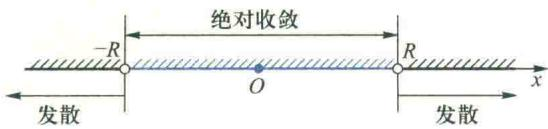

import QRCodeVideo from '@/components/QRCodeVideo.astro';

import Guide from '@/components/Guide.astro';
import Knowledge from '@/components/Knowledge.astro';
import Example from '@/components/Example.astro';
import Analysis from '@/components/Analysis.astro';
import Solution from '@/components/Solution.astro';
import Variant from '@/components/Variant.astro';
import Note from '@/components/Note.astro';
import Block from '@/components/Block.astro';
import Method from '@/components/Method.astro';
import Exercise from '@/components/Exercise.astro';

在本节和下一节中将研究两类常用的函数项级数——幂级数与 Fourier 级数. 本节研究幂级数的收敛性、幂级数在收敛区间内的性质以及函数展开为幂级数的问题.

## 3.1 幂级数及其收敛半径

形如

$$
\sum_ {n = 0} ^ {\infty} a _ {n} x ^ {n} = a _ {0} + a _ {1} x + a _ {2} x ^ {2} + \dots + a _ {n} x ^ {n} + \dots ,\tag{3.1}
$$

或者

$$
\sum_ {n = 0} ^ {\infty} a _ {n} (x - x _ {0}) ^ {n} = a _ {0} + a _ {1} (x - x _ {0}) + a _ {2} (x - x _ {0}) ^ {2} + \dots + a _ {n} (x - x _ {0}) ^ {n} + \dots\tag{3.2}
$$

的函数项级数称为幂级数,其中 $x_{0}$ 与系数 $a_{n}$ ( $n=0,1,2,\cdots$ ) 都是实常数.在级数(3.2)中,令 $u=x-x_{0}$ ,它就变成(3.1)式的形式.因此,只要讨论形如(3.1)的幂级数就行了.

幂级数是常用的一类函数项级数,它除了具有函数项级数的共同性质外,由于它的通项是幂函数,因此,还有一些特殊的性质.例如,幂级数(3.1)的部分和 $S_{n}(x)=\sum_{k=0}^{n}a_{k}x^{k}$ 是一个关于x的n次多项式.如果在集合 $D\subseteq R$ 上, $\{S_{n}\}$ 处处收敛于和函数S,那么,

$$
\forall x \in D, S (x) = \lim _ {n \to \infty} S _ {n} (x) = \sum_ {n = 0} ^ {\infty} a _ {n} x ^ {n}.
$$

这样,就像第二章第五节中所指出的那样,可以用 n 次多项式 $S_{n}(x)$ 任意逼近和函数 $S(x)$ ,在函数逼近理论和近似计算中,这是一件很有意义的事.

首先研究幂级数的收敛性有些什么特点.

显然, 当 x=0 时, 幂级数(3.1)必定收敛, 就是说, 幂级数的收敛域是非空的. 进一步的研究发现幂级数的收敛性还有一些重要性质. 例如, 由例 2.1 知道, 作为一个简单幂级数的等比级数, 它的收敛域是以 x=0 为中心的对称区间 $(-1,1)$ . 试问, 是否任何幂级数的收敛域都具有这个特点呢? 下面来讨论这个问题.

<Knowledge title="定理 3.1 Abel 定理">
对于幂级数(3.1), 下列命题成立:

(1) 若它在点 $x_{0} \neq 0$ 处收敛, 则当 $|x| < |x_{0}|$ 时, 该级数绝对收敛;

(2) 若它在点 $\widetilde{x}_{0} \neq 0$ 处发散, 则当 $|x| > |\widetilde{x}_{0}|$ 时, 该级数发散.

<Solution title="证明">
（1）由已知，级数 $\sum_{n=0}^{\infty} a_n x_0^n$ 收敛，故 $\lim_{n \to \infty} a_n x_0^n = 0.$ 因此，数列 $\{a_n x_0^n\}$ 有界，即 $\exists M > 0$ ，使得 $\forall n \in \mathbf{N}_+$ ，恒有 $|a_n x_0^n| \leqslant M.$ 于是有

$$
\mid a _ {n} x ^ {n} \mid = \mid a _ {n} x _ {0} ^ {n} \mid \cdot \left| \frac {x}{x _ {0}} \right| ^ {n} \leqslant M \left| \frac {x}{x _ {0}} \right| ^ {n}.
$$

当 $|x| < |x_0|$ 时，由于 $\left|\frac{x}{x_0}\right| < 1$ ，所以等比级数 $\sum_{n=0}^{\infty} M \left|\frac{x}{x_0}\right|^n$ 收敛. 根据比较准则，当 $|x| < |x_0|$ 时，级数(3.1)绝对收敛.

（2）用反证法.假定存在 $x_{1}$ （ $\mid x_1\mid >\mid \widetilde{x}_0\mid$ ），使级数 $\sum_{n = 0}^{\infty}a_nx_1^n$ 收敛，由(1)得知，级数(3.1)在 $\widetilde{x}_0$ 处绝对收敛，这与假设相矛盾.

从 Abel 定理可以看到, 若存在 $x_{0} \neq 0$ , 使级数 (3.1) 在 $x_{0}$ 处收敛, 则它在开区间$(-\left|x_{0}\right|, \left|x_{0}\right|)$ 内绝对收敛；若存在 $\widetilde{x}_{0} \neq 0$ ，使该级数在 $\widetilde{x}_{0}$ 发散，则它在开区间 $(- \infty, -\left|\widetilde{x}_{0}\right|)$ 与 $(\left|\widetilde{x}_{0}\right|, + \infty)$ 内发散.

为了进一步讨论幂级数收敛域的情况,令

$$
D = \left\{\mid x \mid \Big | \sum_ {n = 0} ^ {\infty} a _ {n} x ^ {n} \text {收敛} \right\},
$$

则 $D \neq \emptyset$ ，且 $D$ 有且仅有以下三种情况：

(1) D 无上界. 此时, $\forall x \in R$ , $\exists x_{0} (|x_{0}| \in D)$ , 使 $|x| < |x_{0}|$ . 由于级数 (3.1) 在 $x_{0}$ 处收敛, 根据 Abel 定理, 它在 x 处绝对收敛. 因此, 级数 (3.1) 在任何 $x \in R$ 处都绝对收敛.

（2）D 有上界. 此时 D 必有上确界, 设 $\sup D = R$ . 如果 R = 0, 即 $D = \{0\}$ , 那么, 该级数的收敛域仅由 x = 0 组成.

（3）D 有上界，且 R>0 。在这种情况下，由 Abel 定理，当 $\left|x\right|>R$ 时，级数发散；当 $\left|x\right|<R$ 时，级数必绝对收敛。事实上，取 $\varepsilon=R-\left|x\right|$ ，由上确界的定义，必存在 $x_{0}\left(\left|x_{0}\right|\in D\right)$ ，使 $\left|x_{0}\right|>R-\varepsilon=\left|x\right|$ 。由于级数（3.1）在 $x_{0}$ 处收敛，根据 Abel 定理，它在 x 处绝对收敛。

由以上讨论可得：
</Solution>
</Knowledge>

<Knowledge title="定理 3.2">
幂级数(3.1)的收敛性有且仅有三种可能：

(1) 对于任何 $x \in R$ 都收敛, 并且绝对收敛;

(2) 仅在 x=0 点收敛；

(3) 存在一个正数 R, 当 $\left|x\right| < R$ 时绝对收敛, 当 $\left|x\right| > R$ 时发散.

由此,我们引入如下定义:
</Knowledge>

<Knowledge title="定义 3.1">
定理 3.2 中的正数 R 称为幂级数 (3.1) 的收敛半径, 对应的开区间 $(-R, R)$ 称为它的收敛区间.

由定理3.2,幂级数(3.1)在收敛区间 $(-R,R)$ 内绝对收敛,在收敛区间之外发散(图7.4).为统一起见,对于定理3.2中的情况(1),我们说级数(3.1)的收敛半径 $R = +\infty$ ,收敛区间为 $(-\infty , + \infty)$ ;对于情况(2), $R = 0$ ,收敛域 $D = \{0\}$ ;对于情况(3),收敛区间为 $(-R,R)$ .至于在两个端点 $x = \pm R$ 处级数的敛散注意:不要把收敛区间与收敛域混为一谈.对幂级数而言,收敛区间是指开区间 $(-R,R)$ ,收敛域可能是包含收敛区间端点的闭区间或半开(半闭)区间,甚至可能是仅由x=0构成的单点集.

性如何,定理 3.2 没有给出任何结论,需要对给定的幂级数作具体分析.

由上面的讨论得知,任何幂级数(3.1)的收敛区间都是以 x=0 为对称中心的开区间.收敛区间为开区间 $(-R,R)(R\neq0,$ 但 R 可以为 $+\infty)$ 是幂级数收敛性的一大优点.要求幂级数的收敛区间,只要求它的收敛半径.如何计算幂级数的收敛半径呢?

  
图7.4

下面介绍两个常用的方法.
</Knowledge>

<Knowledge title="定理 3.3">
设有幂级数 $\sum_{n=0}^{\infty} a_n x^n$ ，若 $a_n \neq 0$ ，并且 $\lim_{n \to \infty} \left| \frac{a_n}{a_{n+1}} \right|$ 存在或为 $+\infty$ ，则它的收敛半径为

$$
R = \lim _ {n \rightarrow \infty} \left| \frac {a _ {n}}{a _ {n + 1}} \right|.\tag{3.3}
$$

<Solution title="证明">
设 $\lim_{n\to \infty}\left|\frac{a_n}{a_{n + 1}}\right| = L$ ，利用正项级数的检比法，得

$$
\lim _ {n \rightarrow \infty} \left| \frac {u _ {n + 1} (x)}{u _ {n} (x)} \right| = \lim _ {n \rightarrow \infty} \left| \frac {a _ {n + 1} x ^ {n + 1}}{a _ {n} x ^ {n}} \right| = | x | \lim _ {n \rightarrow \infty} \left| \frac {a _ {n + 1}}{a _ {n}} \right|.\tag{3.4}
$$

（1）若 $0 < L < +\infty$ ，则 $\forall x \neq 0$ ，(3.4)式的右端等于 $\frac{|x|}{L}$ ，故当 $|x| < L$ 时，级数 $\sum_{n=1}^{\infty} a_n x^n$ 绝对收敛；当 $|x| > L$ 时，该级数的绝对值级数发散。但由于此时 $|u_{n+1}(x)| > |u_n(x)|$ ，故当 $n \to \infty$ 时， $u_n(x) \not\to 0$ ，所以该级数发散，因此 $R = L$ 。

（2）若 L=0，则 $\forall x\neq0,(3.4)$ 式右端等于 $+\infty$ ，因此除 x=0 外，该级数都发散，故 R=0=L。

（3）若 $L=+\infty$ ，则 $\forall x\in(-\infty,+\infty)$ ，(3.4) 式右端等于 0。因此，级数在 $(-∞,+∞)$ 上绝对收敛，故 $R=+\infty=L$ 。
</Solution>
</Knowledge>

<Knowledge title="定理 3.4">
设有幂级数 $\sum_{n=0}^{\infty} a_n x^n$ ，若 $a_n \neq 0$ ，且 $\lim_{n \to \infty} \frac{1}{\sqrt[n]{|a_n|}}$ 存在或为 $+\infty$ ，则它的收敛半径为
</Knowledge>

<Note>
试用与证明定理3.3类似的方法
证明定理3.4.

$$
R = \lim _ {n \rightarrow \infty} \frac {1}{\sqrt [ n ]{| a _ {n} |}}.\tag{3.5}
$$
</Note>

<Example title="例 3.1">
求下列幂级数的收敛区间与收敛域：

(1) $\sum_{n=0}^{\infty} \frac{x^n}{(n+2)3^n}$ ; (2) $\sum_{n=0}^{\infty} \frac{x^n}{n!}$ ;

(3) $\sum_{n=1}^{\infty} \frac{3^n + (-2)^n}{n} (x - 1)^n.$

<Solution title="解">
（1）由于

$$
R = \lim _ {n \to \infty} \left| \frac {a _ {n}}{a _ {n + 1}} \right| = \lim _ {n \to \infty} \frac {(n + 3) 3 ^ {n + 1}}{(n + 2) 3 ^ {n}} = 3,
$$

所以它的收敛区间为 $(-3,3)$ . 又在 $x=\pm3$ 处, 该级数分别变为两个常数项级数:

$$
\sum_ {n = 0} ^ {\infty} \frac {1}{n + 2} = \frac {1}{2} + \frac {1}{3} + \dots + \frac {1}{n + 2} + \dots ,
$$

$$
\sum_ {n = 0} ^ {\infty} \frac {(- 1) ^ {n}}{n + 2} = \frac {1}{2} - \frac {1}{3} + \dots + \frac {(- 1) ^ {n}}{n + 2} + \dots ,
$$

并且前者发散,后者收敛.所以原级数的收敛域为 $[-3,3)$ .

(2) 由于

$$
R = \lim _ {n \to \infty} \left| \frac {a _ {n}}{a _ {n + 1}} \right| = \lim _ {n \to \infty} \frac {(n + 1) !}{n !} = \lim _ {n \to \infty} (n + 1) = + \infty ,
$$

所以该级数的收敛区间与收敛域都是 $(-∞,+∞)$ .

(3) 由于

$$
\begin{array}{r l} R & = \lim _ {n \to \infty} \left| \frac {a _ {n}}{a _ {n + 1}} \right| = \lim _ {n \to \infty} \frac {3 ^ {n} + (- 2) ^ {n}}{n} \cdot \frac {n + 1}{3 ^ {n + 1} + (- 2) ^ {n + 1}} \\ & = \lim _ {n \to \infty} \frac {n + 1}{n} \frac {1 + \left(- \frac {2}{3}\right) ^ {n}}{3 + \left(- \frac {2}{3}\right) ^ {n} (- 2)} = \frac {1}{3}, \end{array}
$$

所以该级数的收敛区间为 $\left(\frac{2}{3},\frac{4}{3}\right)$ .

在 $x=\frac{2}{3}$ 处,该级数变为

$$
\sum_ {n = 1} ^ {\infty} \frac {3 ^ {n} + (- 2) ^ {n}}{n} \left(\frac {- 1}{3}\right) ^ {n} = \sum_ {n = 1} ^ {\infty} \frac {(- 1) ^ {n} + \left(\frac {2}{3}\right) ^ {n}}{n}.
$$

由于级数 $\sum_{n=1}^{\infty} \frac{(-1)^n}{n}$ 收敛, $\sum_{n=1}^{\infty} \frac{\left(\frac{2}{3}\right)^n}{n}$ 也收敛(利用检比法), 故原级数在 $x = \frac{2}{3}$ 处收敛.

在 $x = \frac{4}{3}$ 处，级数变为

$$
\sum_ {n = 1} ^ {\infty} \frac {3 ^ {n} + (- 2) ^ {n}}{n} \left(\frac {1}{3}\right) ^ {n} = \sum_ {n = 1} ^ {\infty} \frac {1 + \left(- \frac {2}{3}\right) ^ {n}}{n},
$$

它可以看成是发散级数 $\sum_{n=0}^{\infty} \frac{1}{n}$ 与收敛级数 $\sum_{n=1}^{\infty} (-1)^n \frac{\left(\frac{2}{3}\right)^n}{n}$ 之和, 所以发散.
</Solution>
</Example>

<Note>
例 3.1 中哪些级数的收敛半径可用公式(3.5)求出?

因此,原级数的收敛域为 $\left[\frac{2}{3},\frac{4}{3}\right)$ .

在定理 3.3 与定理 3.4 中, 要求所给级数所有项的系数 $a_{n} \neq 0$ (至多有限项系数为 0). 若其中有无穷多项的系数 $a_{n} = 0$ , 则称它为缺项级数. 此时, 收敛半径 R 不能用公式 (3.3) 与 (3.5) 来求, 而要用常数项级数中的检比法或检根法直接来求.
</Note>

<Example title="例 3.2">
求级数 $\sum_{n=0}^{\infty}\frac{x^{2n}}{4^{n}(n+1)^{2}}$ 的收敛区间与收敛域.

<Solution title="解">
该级数仅含偶次幂项, 而 $a_{2k-1} = 0 (k = 1, 2, \cdots)$ , 是一个缺项级数. 记 $u_n(x) = \frac{x^{2n}}{4^n (n+1)^2}$ , 由于

$$
\begin{array}{r l} \lim _ {n \to \infty} \left| \frac {u _ {n + 1} (x)}{u _ {n} (x)} \right| & = \lim _ {n \to \infty} \left| \frac {x ^ {2 n + 2}}{4 ^ {n + 1} (n + 2) ^ {2}} \cdot \frac {4 ^ {n} (n + 1) ^ {2}}{x ^ {2 n}} \right| \\ & = \lim _ {n \to \infty} \left(\frac {n + 1}{n + 2}\right) ^ {2} \frac {| x | ^ {2}}{4} = \frac {| x | ^ {2}}{4}, \end{array}
$$

根据检比法, 当 $\left|x\right|<2$ 时, 级数绝对收敛; 当 $\left|x\right|>2$ 时, $\left|u_{n+1}(x)\right|>\left|u_{n}(x)\right|$ , 故当 $n\to\infty$ 时, $u_{n}(x)\neq0$ , 所以该级数发散. 因此, 它的收敛半径 R=2, 收敛区间为 $(-2,2)$ . 注意: 由上面两例可见, 幂级数的收敛区间与收敛域不一定相同, 一般来说, 收敛域不小于收敛区间.

又在 $x = \pm 2$ 处，原级数变为 $\sum_{n=0}^{\infty} \frac{1}{(n+1)^2}$ ，由于它是收敛的，所以原级数收敛域为 $[-2,2]$ .
</Solution>
</Example>

## 3.2 幂级数的运算性质

根据常数项级数的性质 1.1 和定理 1.11, 易得幂级数下面的代数运算性质.

<Knowledge title="定理 3.5">
设幂级数 $\sum_{n=0}^{\infty} a_n x^n$ 与 $\sum_{n=0}^{\infty} b_n x^n$ 的收敛半径分别为 $R_1$ 与 $R_2$ , 令 $R = \min \{R_1, R_2\}$ , 则在它们公共的收敛区间 $(-R, R)$ 内, 有

（1）级数 $\alpha \sum_{n = 0}^{\infty}a_nx^n +\beta \sum_{n = 0}^{\infty}b_nx^n$ 收敛，并且

$$
\alpha \sum_ {n = 0} ^ {\infty} a _ {n} x ^ {n} + \beta \sum_ {n = 0} ^ {\infty} b _ {n} x ^ {n} = \sum_ {n = 0} ^ {\infty} (\alpha a _ {n} + \beta b _ {n}) x ^ {n} \quad (\text {其中} \alpha , \beta \in \mathbf {R});
$$

(2) 它们的乘积级数收敛,并且

$$
\left(\sum_ {n = 0} ^ {\infty} a _ {n} x ^ {n}\right) \left(\sum_ {n = 0} ^ {\infty} b _ {n} x ^ {n}\right) = \sum_ {n = 0} ^ {\infty} c _ {n} x ^ {n},
$$

其中 $c_{n}=a_{0}b_{n}+a_{1}b_{n-1}+\cdots+a_{n-1}b_{1}+a_{n}b_{0}.$

为了研究幂级数的分析性质(连续性、可积性与可导性等),先证明幂级数的一致收敛性定理.
</Knowledge>

<Knowledge title="定理 3.6 内闭一致收敛性">
设幂级数 $\sum_{n=0}^{\infty}a_{n}x^{n}$ 的收敛半径为 $R,0<R\leqslant+\infty$ ，则它在收敛区间 $(-R,R)$ 内的任何闭子区间 $[a,b]$ 上都是一致收敛的.
</Knowledge>

<Note>
两个收敛幂级数的相加减或相乘得到的幂级数,其收敛半径 $\geqslant\min\left\{R_{1},R_{2}\right\}$ .例如,幂级数 $\sum_{n=0}^{\infty}(1+2^{n})x^{n}$ 与 $\sum_{n=0}^{\infty}(1-2^{n})x^{n}$ 的收敛半径分别为

$$
R _ {1} = \lim _ {n \rightarrow \infty} \frac {1 + 2 ^ {n}}{1 + 2 ^ {n + 1}} = \frac {1}{2},
$$

$$
R _ {2} = \lim _ {n \rightarrow + \infty} \frac {1 - 2 ^ {n}}{1 - 2 ^ {n + 1}} = \frac {1}{2}.
$$
</Note>

<Solution title="证明">
令 $r = \max \{|a|, |b|\}$ , 由于 $[a, b] \subsetneq (-R, R)$ , 所以 $0 < r < R$ . 根据定理3.2, 级数 $\sum_{n=0}^{\infty} a_n r^n$ 绝对收敛, 即 $\sum_{n=0}^{\infty} |a_n| r^n$ 收敛. 又当 $|x| \leqslant r$ 时, $|a_n x^n| \leqslant |a_n| r^n (n = 0, 1, 2, \cdots)$ . 由 $M$ 判别准则, 级数 $\sum_{n=0}^{\infty} a_n x^n$ 在 $[-r, r]$ 上一致收敛. 因为 $-r \leqslant a < b \leqslant r$ , 所以它在 $[a, b]$ 上一致收敛.

它们相加得到的级数为

$\sum_{n=0}^{\infty}\left[(1+2^{n})+(1-2^{n})\right]x^{n}$ $= 2\sum_{n=0}^{\infty}x^{n},$ 收敛半径 $R=1$ , 故 $R>\min\{R_{1}, R_{2}\}$ .
</Solution>

<Knowledge title="定理 3.7">
设幂级数 $\sum_{n=0}^{\infty} a_n x^n$ 的和函数为 $S(x)$ , 收敛半径为 $R$ , 则有

(1) $S(x)$ 在收敛区间 $(-R,R)$ 内是连续的,即 $S(x)\in C(-R,R)$ ;

(2) $S(x)$ 在收敛区间 $(-R, R)$ 内有连续的导数，并且可以逐项求导，即 $\forall x \in (-R, R)$ ，有

$$
S ^ {\prime} (x) = \left(\sum_ {n = 0} ^ {\infty} a _ {n} x ^ {n}\right) ^ {\prime} = \sum_ {n = 0} ^ {\infty} \left(a _ {n} x ^ {n}\right) ^ {\prime} = \sum_ {n = 0} ^ {\infty} n a _ {n} x ^ {n - 1},\tag{3.6}
$$

求导后所得幂级数(3.6)与原级数有相同的收敛半径；

(3) $S(x)$ 在收敛区间 $(-R, R)$ 内可积，并且可以逐项积分，即 $\forall x \in (-R, R)$ ，有

$$
\int_ {0} ^ {x} S (t) \mathrm{d} t = \int_ {0} ^ {x} \left(\sum_ {n = 0} ^ {\infty} a _ {n} t ^ {n}\right) \mathrm{d} t = \sum_ {n = 0} ^ {\infty} \int_ {0} ^ {x} a _ {n} t ^ {n} \mathrm{d} t = \sum_ {n = 0} ^ {\infty} \frac {a _ {n}}{n + 1} x ^ {n + 1},\tag{3.7}
$$

积分后所得幂级数(3.7)与原级数有相同的收敛半径.

<Solution title="证明">
仅证明(1)，关于(2)与(3)的证明，可参看参考文献[11].为了证明 $S(x)$ 在 $(-R,R)$ 内连续，只要证明它在任一点 $x_0\in (-R,R)$ 连续就行了.由于 $x_0\in (-R,R)$ ，故必存在 $r > 0$ ，使 $\mid x_0\mid < r < R.$ 由定理3.6,级数 $\sum_{n = 1}^{\infty}a_nx^n$ 在 $[-r,r]$ 上一致收敛于 $S(x)$ .又由于级数的每一项 $a_{n}x^{n}$ 都是连续函数，根据定理2.3，和函数 $S(x)$ 在 $[-r,r]$ 上连续，因而在 $x_0$ 处连续.

<QRCodeVideo id="7.3.1" title="确定幂级数收敛半径的常用方法." url="HTTP://2D.HEP.CN/1254052/41" />
</Solution>
</Knowledge>

综上所述,幂级数的和函数不但具有在收敛区间内的连续性、可

导性(实际上是任意阶可导的)与可积性,而且能像多项式一样地进行加法和乘法运算,可以逐项求导、逐项积分.这些性质在幂级数求和以及将函数展开为幂级数等问题中都有十分重要的应用.

<Example title="例 3.3">
求级数

$$
\sum_ {n = 0} ^ {\infty} (- 1) ^ {n} \frac {x ^ {n + 1}}{n + 1} = x - \frac {x ^ {2}}{2} + \frac {x ^ {3}}{3} - \dots + (- 1) ^ {n} \frac {x ^ {n + 1}}{n + 1} + \dots
$$

的和函数与收敛域.

<Solution title="解">
由于

$$
\frac {1}{1 + x} = \sum_ {n = 0} ^ {\infty} (- 1) ^ {n} x ^ {n}, \quad x \in (- 1, 1),
$$

对上式两端逐项积分,得

$$
\begin{array}{r l} \ln (1 + x) & = \int_ {0} ^ {x} \frac {\mathrm{d} t}{1 + t} = \int_ {0} ^ {x} \sum_ {n = 0} ^ {\infty} (- 1) ^ {n} t ^ {n} \mathrm{d} t \\ & = \sum_ {n = 0} ^ {\infty} \int_ {0} ^ {x} (- 1) ^ {n} t ^ {n} \mathrm{d} t = \sum_ {n = 0} ^ {\infty} (- 1) ^ {n} \frac {x ^ {n + 1}}{n + 1}, \quad x \in (- 1, 1). \end{array}
$$

又当 $x = 1$ 时，级数变为 $\sum_{n=0}^{\infty} \frac{(-1)^n}{n+1}$ ，它是收敛的，并且它的和为 $\ln 2$ （见本章例1.11). 因此，级数 $\sum_{n=0}^{\infty} (-1)^n \frac{x^{n+1}}{n+1}$ 的和函数为 $\ln (1 + x)$ ，其收敛域为 $(-1, 1]$ . 从而可知

$$
\ln (1 + x) = \sum_ {n = 0} ^ {\infty} (- 1) ^ {n} \frac {x ^ {n + 1}}{n + 1}, \quad x \in (- 1, 1 ].\tag{3.8}
$$
</Solution>
</Example>

<Example title="例 3.4">
求级数 $\sum_{n=1}^{\infty} nx^{n}$ 的和函数.

<Solution title="解">
已知该级数的收敛区间为 $(-1,1)$ ，设其和函数为 $S(x)$ ，则

$$
S (x) = \sum_ {n = 1} ^ {\infty} n x ^ {n} = x \sum_ {n = 1} ^ {\infty} n x ^ {n - 1}, \quad x \in (- 1, 1).
$$

由于

$$
\sum_ {n = 0} ^ {\infty} x ^ {n} = \frac {1}{1 - x}, \quad x \in (- 1, 1),
$$

两边逐项求导得

$$
\sum_ {n = 1} ^ {\infty} n x ^ {n - 1} = \frac {1}{(1 - x) ^ {2}}, \quad x \in (- 1, 1),
$$

所以该级数的和函数 $S(x) = \frac{x}{(1 - x)^2},\quad x\in (-1,1).$
</Solution>
</Example>

<Example title="例 3.5">
求级数 $\sum_{n=0}^{\infty} \frac{x^n}{n!}$ 的和函数.

<Solution title="解">
在例 3.1 中已经求出该级数的收敛区间为 $(-∞, +∞)$ . 设其和函数为 $S(x)$ ，则

$$
S (x) = \sum_ {n = 0} ^ {\infty} \frac {x ^ {n}}{n !} = 1 + x + \frac {x ^ {2}}{2 !} + \frac {x ^ {3}}{3 !} + \dots + \frac {x ^ {n}}{n !} + \dots , \quad x \in (- \infty , + \infty).
$$

为了求出和函数 $S(x)$ 的表达式, 将上式两边逐项求导, 便得到 $S(x)$ 所满足的微分方程

$$
\frac {\mathrm{d} S (x)}{\mathrm{d} x} = 1 + x + \frac {x ^ {2}}{2 !} + \dots + \frac {x ^ {n - 1}}{(n - 1) !} + \dots = S (x), \quad x \in (- \infty , + \infty).
$$

用分离变量法解此一阶微分方程得

$$
\ln | S (x) | = x + C _ {1},
$$

或

$$
S (x) = C \mathrm{e} ^ {x} \quad (C = \pm \mathrm{e} ^ {C _ {\mathrm{i}}} \text {为待定常数}).
$$

由于 $S(0)=1$ ，代入上式得 C=1，所以 $S(x)=\mathrm{e}^{x}$ 便是所求的和函数。从而有

$$
\mathrm{e} ^ {x} = \sum_ {n = 0} ^ {\infty} \frac {x ^ {n}}{n !} = 1 + x + \frac {x ^ {2}}{2 !} + \dots + \frac {x ^ {n}}{n !} + \dots , \quad x \in (- \infty , + \infty).\tag{3.9}
$$
</Solution>
</Example>

## 3.3 函数展开成幂级数

前面我们讨论了对于给定的幂级数,如何求出其收敛区间与和函数的表达式的问题.本段我们讨论它的反问题,就是如何将给定的函数f展开为幂级数的问题,也就是求得一收敛的幂级数,在收敛区间内使其和函数恰好等于 $f(x)$ ,常称它为函数f的幂级数表示问题,即

$$
f (x) = \sum_ {n = 0} ^ {\infty} a _ {n} (x - x _ {0}) ^ {n}, \quad x \in (x _ {0} - R, x _ {0} + R).\tag{3.10}
$$

由于幂级数形式简单,在收敛区间内具有类似于多项式的运算性质,因此,如果f能在 $x_0$ 的某邻域内展开为幂级数, 那么在此邻域内就能用 $x - x_0$ 的多项式来逼近 $f$ , 近似计算 $f(x)$ 的值, 研究该函数的性质. 研究函数 $f$ 能否展开为幂级数, 需要解决两个问题: 一是如果 $f$ 能展开为 $x - x_0$ 的幂级数, 系数 $a_n$ 如何确定; 二是 $f$ 满足什么条件, (3.10) 式才能成立?

先讨论第一个问题. 假定 f 能展开为 $x - x_{0}$ 的幂级数, 即 (3.10) 式成立. 根据幂级数的性质, f 在收敛区间 $(x_{0} - R, x_{0} + R)$ 内任意阶可导, 并且可对 (3.10) 式两端逐项求导. 从而, $\forall x \in (x_{0} - R, x_{0} + R)$ , 都有

$$
\begin{array}{r l} & f ^ {\prime} (x) = a _ {1} + 2 a _ {2} (x - x _ {0}) + 3 a _ {3} (x - x _ {0}) ^ {2} + \dots + n a _ {n} (x - x _ {0}) ^ {n - 1} + \dots , \\ & f ^ {\prime \prime} (x) = 2! a _ {2} + 3 \cdot 2 a _ {3} (x - x _ {0}) + \dots + n (n - 1) a _ {n} (x - x _ {0}) ^ {n - 2} + \dots , \\ & \dots \dots \\ & f ^ {(n)} (x) = n! a _ {n} + (n + 1)! a _ {n + 1} (x - x _ {0}) + \dots , \\ & \dots \dots \end{array}
$$

在以上诸式中令 $x = x_0$ ，便得

$$
a _ {0} = f (x _ {0}), \quad a _ {1} = f ^ {\prime} (x _ {0}), \quad a _ {2} = \frac {1}{2 !} f ^ {\prime \prime} (x _ {0}), \quad \dots , \quad a _ {n} = \frac {1}{n !} f ^ {(n)} (x _ {0}), \quad \dots .
$$

将求得的系数 $a_{n}$ 代入(3.10)式, 得

$$
\begin{array}{r l} f (x) & = f (x _ {0}) + f ^ {\prime} (x _ {0}) (x - x _ {0}) + \frac {f ^ {\prime \prime} (x _ {0})}{2 !} (x - x _ {0}) ^ {2} + \dots + \\ & \frac {f ^ {(n)} (x _ {0})}{n !} (x - x _ {0}) ^ {n} + \dots , \quad x \in (x _ {0} - R, x _ {0} + R). \end{array}\tag{3.11}
$$

所以,如果函数f在 $(x_{0}-R,x_{0}+R)$ 内能展开为 $x-x_{0}$ 的幂级数,那么,f在 $(x_{0}-R,x_{0}+R)$ 内具有任意阶导数,即f是 $C^{\infty}$ 类函数,并且该级数的系数 $a_{n}$ 由下式唯一确定:

$$
a _ {n} = \frac {f ^ {(n)} (x _ {0})}{n !}, \quad n = 0, 1, 2, \dots .\tag{3.12}
$$

因为由上式所确定的系数 $a_{n}$ 就是第二章中介绍过的 f 在 $x_{0}$ 处的 Taylor 系数，所以称 (3.11) 式右端的幂级数为 f 在 $x_{0}$ 处的 Taylor 级数.

以上讨论说明,如果f在 $(x_{0}-R,x_{0}+R)$ 内能展开为 $x-x_{0}$ 的幂级数,那么该级数就是f在 $x_{0}$ 的Taylor级数,通常称此结论为函数展开为幂级数的唯一性.此外,从以上讨论还可看到,只要f属于 $C^{\infty}$ 类函数,就可形式地写出它的Taylor级数,即

$$
f (x) \sim \sum_ {n = 0} ^ {\infty} \frac {f ^ {(n)} (x _ {0})}{n !} (x - x _ {0}) ^ {n}.
$$

试问该级数是否收敛于 $f(x)$ ？在什么条件下收敛于 $f(x)$ ？这就需要讨论第二个问题.在第二章中已经讲过Taylor公式，即若 $f$ 在 $(x_0 - R, x_0 + R)$ 内 $n + 1$ 阶可导，则 $\forall x \in (x_0 - R, x_0 + R)$ ，有

$$
f (x) = \sum_ {k = 0} ^ {n} \frac {f ^ {(k)} (x _ {0})}{k !} (x - x _ {0}) ^ {k} + R _ {n} (x),
$$

其中， $R_{n}(x) = \frac{f^{(n + 1)}(\xi)}{(n + 1)!} (x - x_{0})^{n + 1}$ （ $\xi = x_0 + \theta (x - x_0),\theta \in (0,1)$ ）.

将 $f$ 在 $x_0$ 处的Taylor公式与 $f$ 在 $x_0$ 处的Taylor级数加以比较，易见，Taylor公式中关于 $x - x_0$ 的 $n$ 次多项式就是 $f$ 在 $x_0$ 处Taylor级数的部分和 $S_{n + 1}(x)$ .因此，若 $f:(x_0 - R,x_0 + R)\rightarrow \mathbf{R}$ 是 $C^\infty$ 类函数，则 $f$ 在 $(x_0 - R,x_0 + R)$ 内能展开为它在 $x_0$ 处的Taylor级数的充要条件是

<QRCodeVideo id="7.3.2" title="函数的Taylor级数与Taylor展开式的区别." url="HTTP://2D.HEP.CN/1254052/42" />

$$
\lim _ {n \to \infty} S _ {n + 1} (x) = f (x), \quad x \in (x _ {0} - R, x _ {0} + R),
$$

即

$$
\lim _ {n \rightarrow \infty} R _ {n} (x) = 0, \quad x \in (x _ {0} - R, x _ {0} + R).
$$

从而得

<Knowledge title="定理 3.8">
设 $f: (x_0 - R, x_0 + R) \to \mathbf{R}$ 是 $C^\infty$ 类函数，则 $f$ 在 $(x_0 - R, x_0 + R)$ 内能展开为它在 $x_0$ 处的Taylor级数的充要条件是

$$
\lim _ {n \rightarrow \infty} R _ {n} (x) = 0, \quad x \in (x _ {0} - R, x _ {0} + R).
$$

利用定理 3.8, 不难得到函数展开为幂级数的一个充分条件如下, 证明留给读者.
</Knowledge>

<Knowledge title="推论 3.1">
设 $f: (x_0 - R, x_0 + R) \to \mathbf{R}$ 是 $C^\infty$ 类函数，如果 $\{f^{(n)}\}$ 在 $(x_0 - R, x_0 + R)$ 内是一致有界的，即 $\exists K > 0$ ，使得 $\forall n \in \mathbf{N}_+$ 与 $x \in (x_0 - R, x_0 + R)$ ，都有 $|f^{(n)}(x)| \leqslant K$ ，那么 $f$ 在 $(x_0 - R, x_0 + R)$ 内必能展开为它在 $x_0$ 处的Taylor级数.

如果函数 $f: (x_0 - R, x_0 + R) \to \mathbf{R}$ 能展开成它在 $x_0$ 处的Taylor级数，即等式(3.11)成立，则称该等式为 $f$ 在 $x_0$ 处的Taylor展开式. $f$ 在 $x_0 = 0$ 处的Taylor展开式

$$
f (x) = f (0) + f ^ {\prime} (0) x + \frac {f ^ {\prime \prime} (0)}{2 !} x ^ {2} + \dots + \frac {f ^ {(n)} (0)}{n !} x ^ {n} + \dots , \quad x \in (- R, R)
$$

称为f的 Maclaurin 展开式,右端的级数称为 Maclaurin 级数.

下面给出几个常用初等函数的 Maclaurin 展开式.

指数函数 $\mathrm{e}^x$ 的展开式

$$
\mathrm{e} ^ {x} = 1 + x + \frac {x ^ {2}}{2 !} + \dots + \frac {x ^ {n}}{n !} + \dots , \quad x \in (- \infty , + \infty).
$$

这个等式已由例 3.5 建立(见(3.9)式).由于

$$
f ^ {(n)} (0) = \left(\mathrm{e} ^ {x}\right) ^ {(n)} \mid_ {x = 0} = 1 \quad (n = 0, 1, 2, \dots),
$$

所以上式中的系数就是 $e^{x}$ 在 $x_{0}=0$ 处的 Taylor 系数. 根据函数展开为幂级数的唯一性, 它就是 $e^{x}$ 的 Maclaurin 展开式.

<QRCodeVideo id="7.3.3" title="求幂级数和函数的方法和步骤." url="HTTP://2D.HEP.CN/1254052/43" />

正弦函数 $\sin x$ 的展开式

设 $f(x)=\sin x$ ，由高阶导数公式

$$
f ^ {(n)} (x) = \sin \left(x + n \cdot \frac {\pi}{2}\right) \quad (n = 0, 1, 2, \dots)
$$

不难求得 $\sin x$ 在 $x = 0$ 处的Taylor级数

$$
\sin x \sim x - \frac {x ^ {3}}{3 !} + \frac {x ^ {5}}{5 !} - \dots + (- 1) ^ {k} \frac {x ^ {2 k + 1}}{(2 k + 1) !} + \dots , \quad x \in (- \infty , + \infty).
$$

又因为 $\forall x\in (-\infty , + \infty),\forall n\in \mathbf{N}_{+},|f^{(n)}(x)|\leqslant 1$ ，由推论3.1得

$$
\sin x = x - \frac {x ^ {3}}{3 !} + \frac {x ^ {5}}{5 !} - \dots + (- 1) ^ {k} \frac {x ^ {2 k + 1}}{(2 k + 1) !} + \dots , \quad x \in (- \infty , + \infty).
$$
</Knowledge>

## 余弦函数 $\cos x$ 的展开式

对上式逐项求导得

$$
\cos x = 1 - \frac {x ^ {2}}{2 !} + \frac {x ^ {4}}{4 !} - \dots + (- 1) ^ {k} \frac {x ^ {2 k}}{(2 k) !} + \dots , \quad x \in (- \infty , + \infty).
$$

对数函数 $\ln (1 + x)$ 的展开式

由例 3.3 中的(3.8)式及函数展开为幂级数的唯一性得

$$
\ln (1 + x) = x - \frac {x ^ {2}}{2} + \frac {x ^ {3}}{3} - \frac {x ^ {4}}{4} + \dots + (- 1) ^ {n - 1} \frac {x ^ {n}}{n} + \dots , \quad x \in (- 1, 1 ].
$$

上面求得几个初等函数 Maclaurin 展开式所用的方法, 大体上可归纳为两类:

（1）基本方法.就是按(3.12)式直接算出 $f$ 的Taylor系数，得到它的Taylor级数.然后验证 $f$ 满足定理3.8或推论3.1的条件.例如，求正弦函数的展开式用的就是这种方法.由于用这种方法需要计算 $f^{(n)}(x_0)$ ，工作量大，而且要验证满足定理3.8或推论3.1中条件也不容易，因此，用基本方法比较困难

（2）间接方法.根据函数展开为幂级数的唯一性,从某些已知函数的 Taylor 展开式出发,利用对收敛幂级数的四则运算、逐项求导、逐项积分以及变量代换等,求得所给函数的 Taylor 展开式.例如,求余弦函数与对数函数的展开式用的就是这种方法.间接方法是求函数的 Taylor 展开式较为简便的常用方法.

<Example title="例 3.6">
将 $f(x) = \frac{1}{1 - x - 2x^2}$ 展开成 $x$ 的幂级数.

<Solution title="解">
由于

$$
f (x) = \frac {1}{(1 + x) (1 - 2 x)} = \frac {1}{3} \left(\frac {1}{1 + x} + \frac {2}{1 - 2 x}\right),
$$

而

$$
\frac {1}{1 + x} = \sum_ {n = 0} ^ {\infty} (- 1) ^ {n} x ^ {n} = 1 - x + x ^ {2} - x ^ {3} + \dots + (- 1) ^ {n} x ^ {n} + \dots , \quad x \in (- 1, 1),
$$

$$
\frac {1}{1 - 2 x} = \sum_ {n = 0} ^ {\infty} 2 ^ {n} x ^ {n} = 1 + 2 x + 2 ^ {2} x ^ {2} + \dots + 2 ^ {n} x ^ {n} + \dots , \quad x \in \left(- \frac {1}{2}, \frac {1}{2}\right),
$$

所以

$$
\begin{array}{r l} f (x) & = \frac {1}{3} \sum_ {n = 0} ^ {\infty} (- 1) ^ {n} x ^ {n} + \frac {2}{3} \sum_ {n = 0} ^ {\infty} 2 ^ {n} x ^ {n} \\ & = \sum_ {n = 0} ^ {\infty} \frac {(- 1) ^ {n} + 2 ^ {n + 1}}{3} x ^ {n}, \quad x \in \left(- \frac {1}{2}, \frac {1}{2}\right). \end{array}
$$
</Solution>
</Example>

<Example title="例 3.7">
求函数 $\arctan x$ 的 Maclaurin 展开式.

<Solution title="解">
由于

$$
\frac {1}{1 + x} = \sum_ {n = 0} ^ {\infty} (- 1) ^ {n} x ^ {n}, \quad x \in (- 1, 1),
$$

令 $x = t^2$ ，则

$$
\frac {1}{1 + t ^ {2}} = \sum_ {n = 0} ^ {\infty} (- 1) ^ {n} t ^ {2 n}, \quad t \in (- 1, 1).
$$

逐项积分,得

$$
\arctan x = \int_ {0} ^ {x} \frac {\mathrm{d} t}{1 + t ^ {2}} = \sum_ {n = 0} ^ {\infty} (- 1) ^ {n} \int_ {0} ^ {x} t ^ {2 n} \mathrm{d} t = \sum_ {n = 0} ^ {\infty} \frac {(- 1) ^ {n}}{2 n + 1} x ^ {2 n + 1}, \quad x \in (- 1, 1).
$$

幂函数 $(1 + x)^{\alpha}$ 的展开式 $(\alpha \in \mathbf{R})$

设 $f(x)=(1+x)^{\alpha}$ ，则

$$
\begin{array}{r l} & f (0) = 1, \quad f ^ {\prime} (0) = \alpha , \quad f ^ {\prime \prime} (0) = \alpha (\alpha - 1), \dots , \\ & f ^ {(n)} (0) = \alpha (\alpha - 1) \dots (\alpha - n + 1), \dots , \end{array}
$$

从而得知 $f$ 的Maclaurin级数为

$$
1 + \alpha x + \frac {\alpha (\alpha - 1)}{2 !} x ^ {2} + \dots + \frac {\alpha (\alpha - 1) \cdots (\alpha - n + 1)}{n !} x ^ {n} + \dots .
$$

利用公式(3.3)不难求得它的收敛半径 R=1，收敛区间为 $(-1,1)$ . 下面证明它在 $(-1,1)$ 内的和函数就是 $(1+x)^{\alpha}$ . 假设在 $(-1,1)$ 内它的和函数为 $S(x)$ ，即

$$
\begin{array}{r l} S (x) & = 1 + \alpha x + \frac {\alpha (\alpha - 1)}{2 !} x ^ {2} + \dots + \\ & \frac {\alpha (\alpha - 1) \cdots (\alpha - n + 1)}{n !} x ^ {n} + \dots , \quad x \in (- 1, 1), \end{array}
$$

<QRCodeVideo id="7.3.4" title="函数展开为 Taylor 级数的方法." url="HTTP://2D.HEP.CN/1254052/44" />

则

$$
\begin{array}{r l} S ^ {\prime} (x) & = \alpha + \frac {\alpha (\alpha - 1)}{1} x + \dots + \frac {\alpha (\alpha - 1) \cdots (\alpha - n + 1)}{(n - 1) !} x ^ {n - 1} + \dots \\ & = \alpha \left[ 1 + (\alpha - 1) x + \dots + \frac {(\alpha - 1) \cdots (\alpha - n + 1)}{(n - 1) !} x ^ {n - 1} + \dots \right]. \end{array}
$$

从而

$$
\begin{array}{r l} & (1 + x) S ^ {\prime} (x) \\ & = \alpha + \alpha \Biggl \{\bigl [ (\alpha - 1) + 1 \bigr ] x + \dots + \left[ \frac {(\alpha - 1) \cdots (\alpha - n + 1)}{(n - 1) !} + \frac {(\alpha - 1) \cdots (\alpha - n)}{n !} \right] x ^ {n} + \dots \Biggr \} \\ & = \alpha \Biggl [ 1 + \alpha x + \dots + \frac {\alpha (\alpha - 1) \cdots (\alpha - n + 1)}{n !} x ^ {n} + \dots \Biggr ] = \alpha S (x). \end{array}
$$

所以， $S(x)$ 满足一阶微分方程

$$
S ^ {\prime} (x) = \frac {\alpha}{1 + x} S (x)
$$

及初值条件 $S(0)=1$ . 解之可得 $S(x)=(1+x)^{\alpha}$ ，因此，

$$
(1 + x) ^ {\alpha} = 1 + \alpha x + \frac {\alpha (\alpha - 1)}{2 !} x ^ {2} + \dots + \frac {\alpha (\alpha - 1) \cdots (\alpha - n + 1)}{n !} x ^ {n} + \dots , x \in (- 1, 1).
$$

上式右端的级数称为二项式级数. 当 $\alpha$ 是正整数时, 它就是通常的二项式公式.
在上面的展开式中取 $\alpha$ 为不同的值, 就可以得到不同幂函数的 Maclaurin 展开式.例如,取 $\alpha=-\frac{1}{2}$ 得

$$
\frac {1}{\sqrt {1 + x}} = 1 - \frac {x}{2} + \frac {1 \cdot 3}{2 ^ {2} (2 !)} x ^ {2} - \dots + (- 1) ^ {n} \frac {1 \cdot 3 \cdot \cdots \cdot (2 n - 1)}{2 ^ {n} (n !)} x ^ {n} + \dots , x \in (- 1, 1),
$$

从而

$$
\frac {1}{\sqrt {1 - x ^ {2}}} = 1 + \frac {x ^ {2}}{2} + \frac {1 \cdot 3}{2 ^ {2} (2 !)} x ^ {4} + \dots + \frac {1 \cdot 3 \cdot \cdots \cdot (2 n - 1)}{2 ^ {n} (n !)} x ^ {2 n} + \dots , \quad x \in (- 1, 1),
$$

上式两端逐项积分又得

$$
\arcsin x = x + \frac {1}{2} \frac {x ^ {3}}{3} + \frac {1 \cdot 3}{2 ^ {2} \cdot (2 !)} \frac {x ^ {5}}{5} + \dots + \frac {1 \cdot 3 \cdot \cdots \cdot (2 n - 1)}{2 ^ {n} (n !)} \frac {x ^ {2 n + 1}}{2 n + 1} + \dots ,
$$
</Solution>
</Example>

## 3.4 幂级数的应用举例

幂级数在近似计算函数值、近似计算定积分、求解微分方程等多方面都具有重要的应用.例如，在无线电技术中经常遇到的Bessel函数、Legendre函数等都是用幂级数方法求得的相应的微分方程的解，它们都是用幂级数表示的特殊函数.本段主要说明幂级数在近似计算中的应用.

前面已经指出,如果函数f能展开为幂级数,那么在收敛区域上就能用级数的部分和(即n阶Taylor多项式)来近似表示函数f,而且所取的项数越多,精度也越高.由于级数收敛于f,所以无论精度要求多高,只要项数足够多,总是可以达到的.

<Example title="例 3.8">
计算 $\ln 2$ 的近似值, 使误差不超过 $10^{-4}$ .

<Solution title="解">
由于对数函数 $\ln(1+x)$ 的展开式在 x=1 也成立, 所以有

$$
\ln 2 = 1 - \frac {1}{2} + \frac {1}{3} - \dots + (- 1) ^ {n - 1} \frac {1}{n} + \dots .
$$

如果用右端级数的前 $n$ 项之和作为 $\ln 2$ 的近似值，根据交错级数理论，绝对误差 $|R_n| \leqslant \frac{1}{n + 1}$ . 为使绝对误差小于 $10^{-4}$ ，需要算前一万项，计算量太大，因为该级数的收敛速度太慢. 为了加快收敛速度，减小计算量，下面利用 $\ln \frac{1 + x}{1 - x}$ 的展开式来计算 $\ln 2$ 的近似值. 由于在 $\ln (1 + x)$ 的展开式中，将 $x$ 换成 $-x$ ，得

$$
\ln (1 - x) = - x - \frac {x ^ {2}}{2} - \frac {x ^ {3}}{3} - \dots - \frac {x ^ {n}}{n} - \dots , \quad x \in (- 1, 1),
$$

所以

$$
\ln \frac {1 + x}{1 - x} = \ln (1 + x) - \ln (1 - x) = 2 \left(x + \frac {x ^ {3}}{3} + \frac {x ^ {5}}{5} + \dots + \frac {x ^ {2 n - 1}}{2 n - 1} + \dots\right), x \in (- 1, 1).
$$

令 $\frac{1+x}{1-x}=2$ ，则 $x=\frac{1}{3}$ ，代入上式得

$$
\ln 2 = 2 \left[ \frac {1}{3} + \frac {1}{3} \left(\frac {1}{3}\right) ^ {3} + \frac {1}{5} \left(\frac {1}{3}\right) ^ {5} + \frac {1}{7} \left(\frac {1}{3}\right) ^ {7} + \dots + \frac {1}{2 n - 1} \left(\frac {1}{3}\right) ^ {2 n - 1} + \dots \right].
$$

由于

$$
\mid R _ {n} \mid = \sum_ {k = n + 1} ^ {\infty} \frac {2}{2 k - 1} \left(\frac {1}{3}\right) ^ {2 k - 1} <   \frac {1}{3 n} \sum_ {k = n + 1} ^ {\infty} \left(\frac {1}{9}\right) ^ {k - 1} <   \frac {1}{n \cdot 9 ^ {n}},
$$

易见, 只要取 n=4, 就有 $\left|R_{n}\right|<10^{-4}$ , 并且由此可求得

$$
\ln 2 \approx 0. 6 9 3 1 4.
$$
</Solution>
</Example>

<Example title="例 3.9">
计算积分 $\int_{0}^{1} e^{-x^{2}} dx$ 的近似值, 精确到 $10^{-4}$ .

<Solution title="解">
由于被积函数 $\mathrm{e}^{-x}$ 的原函数不是初等函数, 所以该积分无法用 Newton-Leibniz 公式计算. 然而, 因为

$$
\mathrm{e} ^ {- x ^ {2}} = 1 - x ^ {2} + \frac {x ^ {4}}{2 !} - \frac {x ^ {6}}{3 !} + \dots + (- 1) ^ {n} \frac {x ^ {2 n}}{n !} + \dots , \quad x \in (- \infty , + \infty),
$$

两端逐项积分,便得

$$
\int_ {0} ^ {1} \mathrm{e} ^ {- x ^ {2}} \mathrm{d} x = 1 - \frac {1}{3} + \frac {1}{5 \cdot 2 !} - \frac {1}{7 \cdot 3 !} + \frac {1}{9 \cdot 4 !} - \frac {1}{1 1 \cdot 5 !} + \frac {1}{1 3 \cdot 6 !} - \frac {1}{1 5 \cdot 7 !} + \dots .
$$

又因为 $\frac{1}{15\cdot 7!} < 10^{-4}$ ，根据交错级数理论，只要取前七项就可以达到精度要求.经计算可得

$$
\int_ {0} ^ {1} \mathrm{e} ^ {- x ^ {2}} \mathrm{d} x \approx 0. 7 4 6 8 4.
$$
</Solution>
</Example>

<Example title="例 3.10">
某君要在银行存入一笔钱,希望在第 n 年年末提取 $n^{2}$ 元 $(n=1,2,\cdots)$ , 并且永远按此规律提取,问开始存款时需要存入多少本金?

<Solution title="解">
目前国内银行尚无这种存款与付息方式,它属于财务管理中不等额现金流量现值的计算问题.

我们知道,一笔数量为 A 的本金,若年利率为 i,按复利的计算方法,则第 1 年年末的本利和(即本金与利息之和)为 $A(1+i)$ , 第 2 年年末的本利和为 $A(1+i)(1+i)=A(1+i)^{2},\cdots$ , 第 n 年年末的本利和为 $A(1+i)^{n}$ ( $n=1,2,\cdots$ ). 假定存 n 年的本金为 $A_{n}$ , 则第 n 年年末的本利和应为 $A_{n}(1+i)^{n}$ ( $n=1,2,\cdots$ ).

为保证某君的要求得以实现,即第 n 年年末提取 $n^{2}$ 元,那么,必须要求第 n 年年末的本利和最少应等于 $n^{2}$ 元,不妨要求 $A_{n}(1+i)^{n}=n^{2}(n=1,2,\cdots)$ .也就是说,应当满足如下条件:

$$
A _ {1} (1 + i) = 1, \quad A _ {2} (1 + i) ^ {2} = 4, \quad A _ {3} (1 + i) ^ {3} = 9, \quad \dots .
$$

因此,第 n 年年末要提取 $n^{2}$ 元,事先应存入的本金 $A_{n}=n^{2}(1+i)^{-n}$ .如果还要求此种提款方式能永远继续下去,则事先需要存入的本金总数应等于

$$
\sum_ {n = 1} ^ {\infty} n ^ {2} (1 + i) ^ {- n} = \frac {1}{1 + i} + \frac {4}{(1 + i) ^ {2}} + \dots + \frac {n ^ {2}}{(1 + i) ^ {n}} + \dots .
$$

读者不难验证,此级数是收敛的.因此,为了求得应存想一想:

入的本金总数,需要计算它的和.

你能验证级数 $\sum_{n=1}^{\infty} n^{2}(1+i)^{-n}$ 是收

由于上述常数项级数的和是幂级数 $\sum_{n=1}^{\infty} n^{2} x^{n}$ 的敛的吗？

和函数在 $x = \frac{1}{1 + i}$ 处的值，因此，应当先求该幂级数的和函数.为此，将

$$
\frac {1}{1 - x} = \sum_ {n = 0} ^ {\infty} x ^ {n} = 1 + x + x ^ {2} + \dots + x ^ {n} + \dots , \quad x \in (- 1, 1)
$$

逐项求导得

$$
\frac {1}{(1 - x) ^ {2}} = \sum_ {n = 1} ^ {\infty} n x ^ {n - 1}, \quad x \in (- 1, 1),
$$

从而

$$
\frac {x}{(1 - x) ^ {2}} = \sum_ {n = 1} ^ {\infty} n x ^ {n}, \quad x \in (- 1, 1).
$$

对上式两端再逐项求导,得

$$
\frac {1 + x}{(1 - x) ^ {3}} = \sum_ {n = 1} ^ {\infty} n ^ {2} x ^ {n - 1}, \quad x \in (- 1, 1),
$$

所以

$$
\sum_ {n = 1} ^ {\infty} n ^ {2} x ^ {n} = \frac {x + x ^ {2}}{(1 - x) ^ {3}}, \quad x \in (- 1, 1).
$$

在上式中取 $x = \frac{1}{1 + i}$ 便得所求的本金总数，即

$$
\sum_ {n = 1} ^ {\infty} n ^ {2} (1 + i) ^ {- n} = \frac {(1 + i) (2 + i)}{i ^ {3}}.
$$

假定年利率为 10%, 不难算得需事先存入 2310 元本金.

最后, 我们证明一个在本章第四节中要用的 Euler 公式

$$
\mathrm{e} ^ {\mathrm{i} x} = \cos x + \mathrm{i} \sin x,
$$

其中， $x\in \mathbf{R},\mathrm{i} = \sqrt{-1}$ 是虚数单位.

前面介绍的级数理论都是在实数集内讨论的.实际上,它们都可以推广到复数集中.由于篇幅所限,不能仔细讨论,有兴趣的读者可以参阅西安交通大学高等数学教研室编《复变函数》(第四版),高等教育出版社于1996年出版.
</Solution>
</Example>

<Note>
在例 3.10 中, 若提款方式换成第 n 年年末提取 n 元或 $n^{3}$ 元, 也可求得事先应存入的本金数. 但提款方式换成第 n 年年末提取 $(1+i)^{n}$ 元的利息是不能实现的. 因为需要事先存入的本金数应为

$$
\sum_ {n = 1} ^ {\infty} (1 + i) ^ {n} (1 + i) ^ {- n}
$$

$$
= 1 + 1 + 1 + \dots + 1 + \dots ,
$$

该级数是发散的,为无穷大.

由于

$$
\mathrm{e} ^ {x} = \sum_ {n = 0} ^ {\infty} \frac {x ^ {n}}{n !}, \quad x \in (- \infty , + \infty),
$$

为了将它推广到复数集内,定义

$$
\mathrm{e} ^ {z} = \sum_ {n = 0} ^ {\infty} \frac {z ^ {n}}{n !}, \quad | z | <   + \infty ,
$$

右端的幂级数在复平面内处处绝对收敛.令 $z = \mathrm{i}x$ ，则

$$
\begin{array}{r l} \mathrm{e} ^ {\mathrm{i} x} & = \sum_ {n = 0} ^ {\infty} \frac {(\mathrm{i} x) ^ {n}}{n !} = 1 + \mathrm{i} x + \frac {(\mathrm{i} x) ^ {2}}{2 !} + \frac {(\mathrm{i} x) ^ {3}}{3 !} + \dots + \frac {(\mathrm{i} x) ^ {n}}{n !} + \dots \\ & = 1 + \mathrm{i} x - \frac {x ^ {2}}{2 !} - \mathrm{i} \frac {x ^ {3}}{3 !} + \frac {x ^ {4}}{4 !} + \mathrm{i} \frac {x ^ {5}}{5 !} - \frac {x ^ {6}}{6 !} - \mathrm{i} \frac {x ^ {7}}{7 !} + \dots . \end{array}
$$

由于绝对收敛级数具有可交换性,所以,将上式右端重排便得

$$
\begin{array}{r l} \mathrm{e} ^ {\mathrm{i} x} & = \left(1 - \frac {x ^ {2}}{2 !} + \frac {x ^ {4}}{4 !} - \frac {x ^ {6}}{6 !} + \dots\right) + \mathrm{i} \left(x - \frac {x ^ {3}}{3 !} + \frac {x ^ {5}}{5 !} - \frac {x ^ {7}}{7 !} + \dots\right) \\ & = \cos x + \mathrm{i} \sin x. \end{array}
$$

类似地，

$$
\mathrm{e} ^ {- \mathrm{i} x} = \cos x - \mathrm{i} \sin x,
$$

将它们相加,又有

$$
\cos x = \frac {\mathrm{e} ^ {\mathrm{i} x} + \mathrm{e} ^ {- \mathrm{i} x}}{2}, \quad \sin x = \frac {\mathrm{e} ^ {\mathrm{i} x} - \mathrm{e} ^ {- \mathrm{i} x}}{2 \mathrm{i}},
$$

这两个公式也称为 Euler 公式.
</Note>

<Block title="习题7.3">
**（A）**

1. 为什么说 Abel 定理是研究幂级数收敛性的基本定理？设有幂级数 $\sum_{n=0}^{\infty} a_{n}(x-2)^{n}$ ，它在 x=0 处收敛，在 x=3 处发散，这可能吗？

2. 设幂级数 $\sum_{n=0}^{\infty} a_n x^n$ 在 $x = -3$ 处条件收敛，你能确定该幂级数的收敛半径吗？

3. 已知幂级数 $\sum_{n=0}^{\infty} a_n x^n$ 的收敛半径 $R = 1$ ，有人采用下面的方法求幂级数

$$
\sum_ {n = 0} ^ {\infty} b _ {n} x ^ {n} = \sum_ {n = 0} ^ {\infty} \frac {a _ {n}}{n !} x ^ {n}
$$

的收敛半径,你认为对吗?若不对,指出错在何处.

由于 $R = 1$ ，所以

$$
\lim _ {n \rightarrow \infty} \left| \frac {a _ {n + 1}}{a _ {n}} \right| = 1,
$$

从而得

$$
\lim _ {n \to \infty} \left| \frac {b _ {n + 1}}{b _ {n}} \right| = \lim _ {n \to \infty} \frac {1}{n + 1} \left| \frac {a _ {n + 1}}{a _ {n}} \right| = 0.
$$

因此,级数 $\sum_{n=0}^{\infty}b_{n}x^{n}$ 的收敛半径为 $+\infty$ .

4. 求下列幂级数的收敛区间与收敛域：

(1) $\sum_{n=0}^{\infty} \frac{n!}{2n+1} x^{n}$ ;

(2) $\sum_{n=1}^{\infty} \frac{n^{2}}{n!} x^{n}$ ;

(3) $\sum_{n=1}^{\infty} \frac{(-1)^{n-1}}{n + \sqrt{n}} x^n$ ;

(4) $\sum_{n=1}^{\infty} \frac{1}{n \cdot 2^n}(x + 2)^n$ ;

(5) $\sum_{n=1}^{\infty} \frac{n!}{n^n} x^{2n-1}$ ;

(6) $\sum_{n=1}^{\infty} \frac{3^n + (-2)^n}{n}(2x + 1)^n$ ;

(7) $\sum_{n=1}^{\infty} \frac{(2n+1)}{n!} x^{2n}$ ;

(8) $\sum_{n=1}^{\infty} (\sqrt{n+1} - \sqrt{n}) 2^{n} x^{2n}$ ;

(9) $\sum_{n=1}^{\infty} n! \left(\frac{x^2}{n}\right)^n$ ; (10) $\sum_{n=1}^{\infty} \frac{(x+1)^n}{4^n + (-2)^n}$ .

5. 指出下列推导有什么错误：

由于

$$
\frac {x}{1 - x} = x + x ^ {2} + \dots + x ^ {n} + \dots ,
$$

$$
\frac {- x}{1 - x} = \frac {1}{1 - \frac {1}{x}} = 1 + \frac {1}{x} + \frac {1}{x ^ {2}} + \dots + \frac {1}{x ^ {n}} + \dots ,
$$

两式相加得

$$
\dots + \frac {1}{x ^ {n}} + \dots + \frac {1}{x ^ {2}} + \frac {1}{x} + 1 + x + x ^ {2} + \dots + x ^ {n} + \dots = 0.
$$

6. 求下列函数的 Maclaurin 展开式:

(1) $x\mathrm{e}^{-x^2}$ ; (2) $\sin^2 x$ ;

(3) $\operatorname{ch}\frac{x}{2}$ ; (4) $\arcsin x$ ;

(5) $\frac{1}{\sqrt{2-x}};$ (6) $\frac{x}{1+x-2x^{2}};$

(7) $\ln(1-3x+2x^{2})$ ;

(8) $\sqrt[3]{27 - x^3}$ .

7. 设 $f(x)=x^{3}e^{-x^{2}}$ ，求 $f^{(n)}(0)$ ( $n=2,3,\cdots$ ).

8. 求下列函数在给定点 $x_0$ 处的Taylor展开式：

(1) $\mathrm{e}^{x - 1},\quad x_0 = 2;$ (2） $\cos x,\quad x_0 = \frac{\pi}{4};$

(3) $\ln x, x_0 = 1$ ; (4) $\frac{x}{x^2 - 5x + 6}, x_0 = 5$ ;

(5) $\frac{1}{x^2}, x_0 = 3;$ (6) $\cos \left(2x + \frac{\pi}{4}\right), x_0 = 0;$ (7) $\frac{1}{4}\ln \frac{1 + x}{1 - x} +\frac{1}{2}\arctan x - x, x_0 = 0;$ (8) $\frac{x}{(1 - x^2)^2}, x_0 = 0.$

9. 求下列幂级数的和函数：
(1) $\sum_{n=0}^{\infty}(n+1)(n+2)x^{n}$ ;

(2) $\sum_{n=1}^{\infty}(-1)^{n}n^{2}x^{n}$ ;

(3) $\sum_{n=1}^{\infty}\frac{1}{n(n+1)}x^{n}$ ;

(4) $\sum_{n=1}^{\infty}(-1)^{n-1}\frac{x^{2n}}{(2n-1)3^{2n-1}}$ ;

(5) $\sum_{n=0}^{\infty}(2n+1)x^{n}$ ;

(6) $\sum_{n=1}^{\infty}\frac{1}{n2^{n}}x^{n-1}$ .

10. 利用幂级数求下列常数项级数的和：
(1) $\sum_{n=1}^{\infty}\frac{1}{(2n-1)2^{n-1}};$ (2) $\sum_{n=3}^{\infty}\frac{1}{(n-2)n2^{n}};$ (3) $\sum_{n=0}^{\infty}(-1)^{n}(n^{2}-n+1)\frac{1}{2^{n}};$ (4) $\sum_{n=1}^{\infty}\frac{n(n+1)}{2^{n+1}}.$

11. 设 $f(x) = \sum_{n=1}^{\infty} n3^{n-1} x^{n-1}$ .

(1) 证明 $f(x)$ 在 $\left(-\frac{1}{3}, \frac{1}{3}\right)$ 内连续； (2) 计算 $\int_{0}^{1/8} f(x) \, dx$ .

12. 说明函数 $f$ 在 $x_0$ 处的Taylor公式、Taylor级数以及Taylor展开式有什么区别和联系.  
13. 求下列各数的近似值，精确到 $10^{-4}$ ：  
(1) e; (2) $\cos 10^{\circ}$ ;  
(3) $\int_{0}^{1} \cos \sqrt{x} \mathrm{d}x$ ; (4) $\int_{0}^{1/4} \sqrt{1 + x^3} \mathrm{d}x$ .

14. 利用 Euler 公式将 $e^{x}\cos x$ 与 $e^{x}\sin x$ 展开成 x 的幂级数.

15. 设有一半径为 a，电荷密度为 $\sigma$ 的带电圆盘。证明在该圆盘的中轴线上距圆盘中心 R（R 充分大）处的电势 $V \approx \frac{\pi a^{2} \sigma}{R}$ 。

16. 若例 3.10 中, 改为第 n 年年末提取 $n^{3}$ 元, 试求开始应存入的本金数.

1. 设幂级数 $\sum_{n=1}^{\infty} a_n x^n$ 的收敛区间为 $(-R, R), 0 < R < +\infty$ ，并且在 $x = -R$ 处绝对收敛，证明它在 $[-R, R]$ 上一致收敛。

2. 证明: 如果幂级数 $\sum_{n=0}^{\infty} a_n (x - x_0)^n$ 的和函数在 $x_0$ 的邻域内恒等于 0, 那么它的所有系数 $a_n$ 都等于 0.

3. 如果正项级数 $\sum_{n=1}^{\infty} a_n$ 收敛, 证明: $f(x) = \sum_{n=0}^{\infty} a_n x^n$ 在 $(-1, 1)$ 上连续.
</Block>
