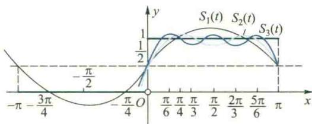
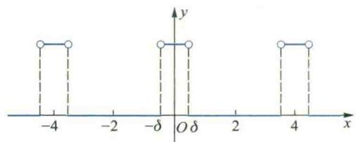
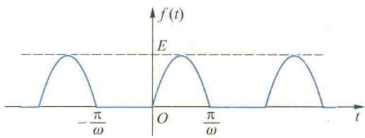

import ExerciseTrigger from '@/components/exercises/ExerciseTrigger.astro';
import QRCodeVideo from '@/components/QRCodeVideo.astro';

import Guide from '@/components/Guide.astro';
import Knowledge from '@/components/Knowledge.astro';
import Example from '@/components/Example.astro';
import Analysis from '@/components/Analysis.astro';
import Solution from '@/components/Solution.astro';
import Variant from '@/components/Variant.astro';
import Note from '@/components/Note.astro';
import Block from '@/components/Block.astro';
import Method from '@/components/Method.astro';
import Exercise from '@/components/Exercise.astro';

本节讨论另一类在理论上和应用中都有重要价值的函数项级数——Fourier 级数. Fourier 级数是一种三角级数, 三角级数的一般形式为

$$
\frac {a _ {0}}{2} + \sum_ {n = 1} ^ {\infty} \left(a _ {n} \cos n x + b _ {n} \sin n x\right),\tag{4.1}
$$

其中系数 $a_{0}, a_{n}, b_{n}$ ( $n=1,2,\cdots$ ) 都是实常数. 由于三角级数的通项是三角函数（正弦和余弦函数），因此，它是研究周期性物理现象的重要数学工具. 本节主要讨论怎样将一个已知函数表示为三角级数的问题，也就是将函数展开为 Fourier 级数的问题.

## 4.1 周期函数与三角级数

在科学技术中,常常会遇到各种各样的周期现象.周期现象在数学上可用周期函数来近似描述.最简单的周期函数是正弦(或余弦)函数

$$
y = A \sin (\omega x + \varphi),
$$

它们描述了物理中的所谓简谐振动问题,其中 A, $\omega$ 和 $\varphi$ 分别叫做振幅、频率和初位相.它的周期 $T=\frac{2\pi}{\omega}$ , 当 $\omega=1$ 时, $T=2\pi$ , 因此, 又称之为正弦波或谐波.

考虑如下一列正弦函数：

$$
A _ {1} \sin (x + \varphi_ {1}), A _ {2} \sin (2 x + \varphi_ {2}), \dots , A _ {n} \sin (n x + \varphi_ {n}), \dots ,
$$

它们的共同周期为 $2\pi$ 易见，两个周期为 $2\pi$ 的正弦函数的叠加仍是一个周期为 $2\pi$ 的周期函数.一般地， $n$ 个周期为 $2\pi$ 的正弦函数与常数 $A_0$ 之和

$$
S _ {n} (x) = A _ {0} + \sum_ {k = 1} ^ {n} A _ {k} \sin (k x + \varphi_ {k})
$$

(称为 n 次三角多项式) 也是一个以 $2\pi$ 为周期的周期函数. 如果 $\lim_{n\to\infty}S_n(x)=S(x)$ ，也就是说，由一周期为 $2\pi$ 的正弦函数列所构成的级数

$$
A _ {0} + \sum_ {n = 1} ^ {\infty} A _ {n} \sin (n x + \varphi_ {n})
$$

收敛于 $S(x)$ ，那么和函数 $S(x)$ 还是以 $2\pi$ 为周期的周期函数.

现在自然要提如下相反的问题:能否把一个给定的以 $2\pi$ 为周期的周期函数 $f(x)$ 表示(展开)成一列正弦函数之和呢?也就是表达式

$$
f (x) = A _ {0} + \sum_ {n = 1} ^ {\infty} A _ {n} \sin (n x + \varphi_ {n})\tag{4.2}
$$

能否成立呢？如果能，那么，就可以通过简单的正弦函数来研究复杂的周期函数$f(x)$ 的性质,用 n 次三角多项式来任意逼近周期函数 $f(x)$ . 在物理上, 就可以用简单的正弦波的叠加来研究各种复杂的周期现象, 这是一件非常有意义的事情. 实际上, 早在 1807 年, 法国数学家和物理学家 Fourier 在研究热传导问题时就研究并解决了这个问题, 后人因此称之为把函数 $f(x)$ 展开为 Fourier 级数. 下面就来讨论这个问题. 由于

$$
A _ {n} \sin (n x + \varphi_ {n}) = A _ {n} (\sin n x \cos \varphi_ {n} + \cos n x \sin \varphi_ {n}) = a _ {n} \cos n x + b _ {n} \sin n x,
$$

其中 $a_{n}=A_{n}\sin\varphi_{n}, b_{n}=A_{n}\cos\varphi_{n}$ ( $n=1,2,\cdots$ ). 为与今后得到的系数公式统一起见，记 $A_{0}=\frac{a_{0}}{2}$ ，那么(4.2)式右端的级数就变成三角级数(4.1)的形式了. 因此，上面的问题就变为能否将一个周期为 $2\pi$ 的周期函数 $f(x)$ 展开为形如(4.1)式的三角级数. 为了研究这类问题，也需要解决两个问题：

(1) $f(x)$ 满足什么条件时,才能展开成三角级数(4.1)?

（2）如果 $f(x)$ 能展开成三角级数，展开式中的系数 $a_{0},a_{n},b_{n}\quad(n=1,2,\cdots)$ 如何计算？

## 4.2 三角函数系的正交性与 Fourier 级数

首先讨论问题(2).我们知道,三角级数(4.1)是由函数系

$$
\{1, \cos x, \sin x, \cos 2 x, \sin 2 x, \dots , \cos n x, \sin n x, \dots \}
$$

构成的,通常称之为三角函数系.这个函数系有一个非常重要的性质:其中任意两个不同函数的乘积在 $[-π,π]$ 上的积分等于零,而任一函数的平方在 $[-π,π]$ 上的积分都不等于零.即 $\forall m,n\in N_{+}$ ,

$$
\begin{array}{r l} & \int_ {- \pi} ^ {\pi} \cos n x \mathrm{d} x = 0, \quad \int_ {- \pi} ^ {\pi} \sin n x \mathrm{d} x = 0; \\ & \int_ {- \pi} ^ {\pi} \cos m x \cos n x \mathrm{d} x = 0, \quad \int_ {- \pi} ^ {\pi} \sin m x \sin n x \mathrm{d} x = 0 (m \neq n), \quad \int_ {- \pi} ^ {\pi} \sin m x \cos n x \mathrm{d} x = 0; \\ & \int_ {- \pi} ^ {\pi} \cos^ {2} n x \mathrm{d} x = \int_ {- \pi} ^ {\pi} \sin^ {2} n x \mathrm{d} x = \pi , \quad \int_ {- \pi} ^ {\pi} 1 ^ {2} \mathrm{d} x = 2 \pi . \end{array}
$$

读者不难用积分法直接证明上述等式.而且,根据三角函数的周期性,它们在长为一

个周期的任何区间 $[a,a+2\pi]$ （a为常数）上都成立.

一般地, 若 $f, g \in \mathcal{R}[a, b]$ , 且 $\int_{a}^{b} f(x) g(x) \, dx = 0$ , 则称函数 f 与 g 在 $[a, b]$ 上正交. 设 $\{f_n\}$ 是区间 $[a, b]$ 上的一个函数列, 若其中任意两个不同的函数在 $[a, b]$ 上正交, 且 $\int_{a}^{b} f_n^2(x) \, dx \neq 0 (n = 1, 2, \cdots)$ , 则称 $\{f_n\}$ 是 $[a, b]$ 上的正交函数系. 三角函数系的上述性质表明, 它在长为一个周期的任何区间 $[a, a + 2\pi]$ 上都构成一个正交函数系. 两个函数正交的概念是两个向量正交的推广.

<QRCodeVideo id="7.4.1" title="怎样理解函数的正交性概念." url="HTTP://2D.HEP.CN/1254052/45" />

利用三角函数的正交性可以解决问题(2).设f是以 $2\pi$ 为周期的可积函数,由于周期性,只要在 $[-π,π]$ 上讨论就可以了.假定f在 $[-π,π]$ 上能展开为三角级数,即

$$
f (x) = \frac {a _ {0}}{2} + \sum_ {n = 1} ^ {\infty} \left(a _ {n} \cos n x + b _ {n} \sin n x\right),\tag{4.3}
$$

并且假定右端级数在 $\left[-\pi,\pi\right]$ 上一致收敛于f.在(4.3)式两端同乘 $\cos kx\quad(k=0,1,2,\cdots)$ ，并在 $\left[-\pi,\pi\right]$ 上逐项积分，得

$$
\int_ {- \pi} ^ {\pi} f (x) \cos k x \mathrm{d} x = \frac {a _ {0}}{2} \int_ {- \pi} ^ {\pi} \cos k x \mathrm{d} x + \sum_ {n = 1} ^ {\infty} \left(a _ {n} \int_ {- \pi} ^ {\pi} \cos n x \cos k x \mathrm{d} x + b _ {n} \int_ {- \pi} ^ {\pi} \sin n x \cos k x \mathrm{d} x\right).
$$

根据正交性, 当 k=0 时,

$$
\int_ {- \pi} ^ {\pi} f (x) \mathrm{d} x = \frac {a _ {0}}{2} \int_ {- \pi} ^ {\pi} \mathrm{d} x = \pi a _ {0},
$$

从而得

$$
a _ {0} = \frac {1}{\pi} \int_ {- \pi} ^ {\pi} f (x) \mathrm{d} x;
$$

当 $k \neq 0$ 时，

$$
\int_ {- \pi} ^ {\pi} f (x) \cos k x \mathrm{d} x = a _ {k} \int_ {- \pi} ^ {\pi} \cos^ {2} k x \mathrm{d} x = \pi a _ {k},
$$

从而得

$$
a _ {k} = \frac {1}{\pi} \int_ {- \pi} ^ {\pi} f (x) \cos k x \mathrm{d} x \quad (k = 1, 2, \dots).
$$

类似地,用 $\sin kx$ 同乘(4.3)式两端,并逐项积分可得

$$
b _ {k} = \frac {1}{\pi} \int_ {- \pi} ^ {\pi} f (x) \sin k x \mathrm{d} x \quad (k = 1, 2, \dots).
$$

将上面的结果合并起来就得到系数公式：

$$
\begin{array}{l l} a _ {k} = \frac {1}{\pi} \int_ {- \pi} ^ {\pi} f (x) \cos k x \mathrm{d} x & (k = 0, 1, 2, \dots), \\ b _ {k} = \frac {1}{\pi} \int_ {- \pi} ^ {\pi} f (x) \sin k x \mathrm{d} x & (k = 1, 2, \dots). \end{array}\tag{4.4}
$$

称(4.4)式为 Euler-Fourier 公式, 系数由这个公式确定的三角级数称为 f 的 Fourier 级数, 这些系数称为 f 的 Fourier 系数.

系数公式(4.4)是在f能展开为(4.3)式并且右端的三角级数一致收敛于f的条件下求得的,但仅从公式本身来看,只要f在 $\left[-\pi,\pi\right]$ 上可积,就可以按此公式计算出系数 $a_{k}$ 与 $b_{k}$ ,并唯一地写出f的Fourier级数,即

$$
f (x) \sim \frac {a _ {0}}{2} + \sum_ {n = 1} ^ {\infty} \left(a _ {n} \cos n x + b _ {n} \sin n x\right).
$$

至于这个级数是否收敛;如果收敛,是否收敛于f的问题还需要进一步研究.一旦证明了该级数收敛,而且收敛于f之后,就可以把上式中的符号“\~”换成等号“=”.因此,下面我们来研究问题(1).

## 4.3 周期函数的 Fourier 展开

函数的 Fourier 级数的收敛性问题是一个相当复杂的理论问题,至今还没有便于

应用的判别敛散性的充要条件,下面不加证明地给出一个应用较为广泛的充分条件.为此,先说明什么叫分段单调函数.设有函数 $f:[a,b]\rightarrow R$ ,如果在 $[a,b]$ 内插入n-1个分点

$$
a = x _ {0} <   x _ {1} <   x _ {2} <   \dots <   x _ {n - 1} <   x _ {n} = b
$$

能使 $f$ 在每个开子区间 $(x_{k - 1},x_k)$ 内都单调，那么就称 $f$ 在 $[a,b]$ 上分段单调（图7.5）.

图7.5

Dirichlet 定理 设函数 f 在 $[-π, π]$ 上分段单调, 而且除有限个第一类间断点外都是连续的, 那么它的 Fourier 级数在 $[-π, π]$ 上收敛, 且其和函数为

$S(x) = \left\{ \begin{array}{ll}f(x), & x\text{是} f\text{的连续点},\\ \frac{f(x - 0) + f(x + 0)}{2}, & x\text{是} f\text{的间断点},\\ \frac{f(-\pi + 0) + f(\pi - 0)}{2}, & x = \pm \pi . \end{array} \right.$

在上述定理中,虽然并非对 $\left[-\pi,\pi\right]$ 上的每个点注意：由Dirichlet定理易见：(1)将函数 $f$ 展开为Fourier级数的条件比展开为Taylor级数的条件要弱得多；(2)只要函数 $f$ 满足Dirichlet条件，不论 $x$ 是连续点还是间断点，它的Fourier级数都收敛，但其和函数不一定等于该点的函数值，在间断点处仅等于 $f$ 在该点处左、右极限的算术平均值.

$x, f(x)$ 的 Fourier 级数都收敛于 $f(x)$ 自身, 但为方便起见, 常把定理中的三种收敛情形都说成是 $f$ 的 Fourier 级数在 $[- \pi, \pi]$ 上收敛于 $f$ , 或者 $f$ 在 $[- \pi, \pi]$ 上被展开为 Fourier 级数.

定理中的条件称为Dirichlet条件，它是判别收敛性的一个充分条件.在实际应用中，很多函数都能满足这个条件

还应当指出的是,虽然定理中的f仅定义在 $[-π,π]$ 上,但由于Fourier级数的各项是以 $2\pi$ 为周期的函数,所以它的和函数也是以 $2\pi$ 为周期的函数.只要将 f 按照周期 $2\pi$ 向左右两侧作周期延拓,即在每个区间 $\left[(2n-1)\pi,(2n+1)\pi\right)(n=\pm1,\pm2,\cdots)$ 上重复取它在 $[-π,\pi)$ 上的值,那么它的 Fourier 级数就在整个数轴上都收敛于 f 了,即有

$$
f (x) = \frac {a _ {0}}{2} + \sum_ {n = 1} ^ {\infty} \left(a _ {n} \cos n x + b _ {n} \sin n x\right), \quad x \in (- \infty , + \infty).
$$

此时,就说f在整个数轴上被展开为Fourier级数,上式右端的级数也称为f在 $(-∞,+∞)$ 上的Fourier展开式.

特别地,如果f在 $[-π,π]$ 上是奇函数,那么由于 $f(x)\cos nx$ 也是奇函数,而 $f(x)\sin nx$ 是偶函数,所以

函数 f 的 Fourier 级数与函数 f 的 Fourier 展开式是两个不同的概念. 前者是指系数由公式 (4.4) 确定的三角级数, 并不要求该级数收敛于 f, 而后者则要求该级数收敛, 且在连续点收敛于 f.

$$
a _ {n} = \frac {1}{\pi} \int_ {- \pi} ^ {\pi} f (x) \cos n x \mathrm{d} x = 0 \quad (n = 0, 1, 2, \dots),
$$

$$
b _ {n} = \frac {1}{\pi} \int_ {- \pi} ^ {\pi} f (x) \sin n x \mathrm{d} x = \frac {2}{\pi} \int_ {0} ^ {\pi} f (x) \sin n x \mathrm{d} x \quad (n = 1, 2, \dots).
$$

从而,它的 Fourier 展开式变为

$$
f (x) = \sum_ {n = 1} ^ {\infty} b _ {n} \sin n x, \quad x \in (- \infty , + \infty).
$$

由此可见,奇函数的 Fourier 展开式只含正弦项,称这种级数为 f 的 Fourier 正弦级数.
类似可知,如果f在 $[-π,π]$ 上是偶函数,那么它的Fourier展开式中只含余弦项.即

$$
f (x) = \frac {a _ {0}}{2} + \sum_ {n = 1} ^ {\infty} a _ {n} \cos n x, \quad x \in (- \infty , + \infty),
$$

其中

$$
a _ {n} = \frac {2}{\pi} \int_ {0} ^ {\pi} f (x) \cos n x \mathrm{d} x \quad (n = 0, 1, 2, \dots),
$$

称它为 $f$ 的Fourier余弦级数.

<Example title="例 4.1">
设 f 是以 $2\pi$ 为周期的函数, 它在 $(-π, π]$ 上的定义为

$$
f (x) = \left\{ \begin{array}{l l} 0, & - \pi <   x <   0, \\ x, & 0 \leqslant x \leqslant \pi . \end{array} \right.
$$

求 $f$ 的Fourier展开式.

<Solution title="解">
函数 $f$ 的图像如图7.6所示. 显然, 它在 $[- \pi, \pi]$ 上满足Dirichlet条件. 根据系数公式(4.4)得

<figure class="vp-figure">
  
  <figcaption>图7.6</figcaption>
</figure>

$$
a _ {0} = \frac {1}{\pi} \int_ {- \pi} ^ {\pi} f (x) \mathrm{d} x = \frac {1}{\pi} \int_ {0} ^ {\pi} x \mathrm{d} x = \frac {\pi}{2},
$$

$$
a _ {n} = \frac {1}{\pi} \int_ {- \pi} ^ {\pi} f (x) \cos n x \mathrm{d} x = \frac {1}{\pi} \int_ {0} ^ {\pi} x \cos n x \mathrm{d} x
$$

$= \frac{1}{\pi}\left[\frac{x\sin nx}{n}\bigg|_{0}^{\pi} - \int_{0}^{\pi}\frac{\sin nx}{n}\mathrm{d}x\right] = \frac{(-1)^{n} - 1}{n^{2}\pi} = \left\{ \begin{array}{ll} - \frac{2}{n^{2}\pi}, & n\text{为奇数，}\\ 0, & n\text{为偶数，} \end{array} \right.$

$$
b _ {n} = \frac {1}{\pi} \int_ {- \pi} ^ {\pi} f (x) \sin n x \mathrm{d} x = \frac {1}{\pi} \int_ {0} ^ {\pi} x \sin n x \mathrm{d} x
$$

$$
= \frac {1}{\pi} \left[ \frac {- x \cos n x}{n} \Bigg | _ {0} ^ {\pi} + \frac {1}{n} \int_ {0} ^ {\pi} \cos n x \mathrm{d} x \right] = \frac {(- 1) ^ {n + 1}}{n} = \left\{ \begin{array}{l l} \frac {1}{n}, & n \text {为奇数,} \\ - \frac {1}{n}, & n \text {为偶数.} \end{array} \right.
$$

因此,根据 Dirichlet 定理,当 $x \in (-\pi, \pi)$ 时,

$$
\begin{array}{r l} f (x) & = \frac {\pi}{4} - \left(\frac {2}{\pi} \cos x - \sin x\right) - \frac {\sin 2 x}{2} - \left(\frac {2}{3 ^ {2} \pi} \cos 3 x - \frac {1}{3} \sin 3 x\right) - \dots \\ & = \frac {\pi}{4} - \sum_ {k = 1} ^ {\infty} \left[ \frac {2}{(2 k - 1) ^ {2} \pi} \cos (2 k - 1) x + \frac {(- 1) ^ {k}}{k} \sin k x \right]. \end{array}
$$

当 $x=\pm\pi$ 时, f 的 Fourier 级数收敛于

$$
\frac {1}{2} [ f (- \pi + 0) + f (\pi - 0) ] = \frac {\pi}{2}.
$$

易见,在整个数轴上,函数f的Fourier级数除了在点 $x=n\pi$ ( $n=\pm1,\pm3,\pm5,\cdots$ )处收敛于 $\frac{\pi}{2}$ 外,在其余各点x处都收敛于 $f(x)$ .
</Solution>
</Example>

画出例 4.1 中函数 $f(x)$ 的 Fourier 级数的和函数的图像，并与 $f(x)$ 的图像加以比较，指出它们之间有何不同.

在此例中,由于f的Fourier级数在 $x=n\pi$ ( $n=\pm1,\pm3,\pm5,\cdots$ )处收敛于 $\frac{\pi}{2}$ ,将它们代入f的Fourier级数,便得到了一个常数项级数的和,即

$$
\sum_ {n = 1} ^ {\infty} \frac {1}{(2 n - 1) ^ {2}} = \frac {\pi^ {2}}{8}.
$$

<Example title="例 4.2">
设 $f(x)$ 的周期为 $2\pi$ ，它在 $[-π, π)$ 上的定义为

$$
f (x) = \left\{ \begin{array}{l l} 0, & - \pi \leqslant x <   0, \\ 1, & 0 \leqslant x <   \pi , \end{array} \right.
$$

求 $f(x)$ 的 Fourier 级数及此 Fourier 级数的和函数 $S(x)$ .

<Solution title="解">
显然 f 满足 Dirichlet 条件, 根据系数公式(4.4),

$$
a _ {0} = \frac {1}{\pi} \int_ {- \pi} ^ {\pi} f (x) \mathrm{d} x = \frac {1}{\pi} \int_ {0} ^ {\pi} \mathrm{d} x = 1,
$$

$$
a _ {n} = \frac {1}{\pi} \int_ {- \pi} ^ {\pi} f (x) \cos n x \mathrm{d} x = \frac {1}{\pi} \int_ {0} ^ {\pi} \cos n x \mathrm{d} x = 0 \quad (n = 1, 2, \dots),
$$

$b_{n}=\frac{1}{\pi}\int_{-\pi}^{\pi}f(x)\sin nx\mathrm{d}x=\frac{1}{\pi}\int_{0}^{\pi}\sin nx\mathrm{d}x=\frac{1-(-1)^{n}}{n\pi}=\left\{\begin{aligned}&\frac{2}{n\pi},&n 为奇数,\\ &0,&n 为偶数.\end{aligned}\right.$

所以， $f(x)$ 的Foruier级数为 $\frac{1}{2} +\frac{2}{\pi}\sum_{k = 1}^{\infty}\frac{\sin(2k - 1)x}{2k - 1}$ 根据Dirichlet定理，它在 $[- \pi ,\pi ]$ 上收敛于和函数

$$
S (x) = \left\{ \begin{array}{l l} 0, & - \pi <   x <   0, \\ 1, & 0 <   x <   \pi , \\ \frac {1}{2}, & x = 0, \pm \pi . \end{array} \right.
$$

由于 $f(x)$ 是以 $2\pi$ 为周期的函数,所以它的 Fourier 级数在 $(-∞,+∞)$ 上除去 $x=n\pi (n=0,±1,±2,\cdots)$ 的点处都收敛于 $f(x)$ ,在点 $x=n\pi$ 处收敛于 $\frac{1}{2}$ .

前面已经指出，在Dirichlet定理中， $f(x)$ 的Fourier级数并非处处收敛于 $f(x)$ ，更不一定一致收敛于 $f(x)$ ，这种情况在上面两个例子中也可以很清楚地看到。例如，在例4.2中 $f(x)$ 的Fourier级数的前三个部分和为

$$
\begin{array}{l} S _ {1} (x) = \frac {1}{2} + \frac {2}{\pi} \sin x, \quad S _ {2} (x) = \frac {1}{2} + \frac {2}{\pi} \left(\sin x + \frac {\sin 3 x}{3}\right), \\ S _ {3} (x) = \frac {1}{2} + \frac {2}{\pi} \left(\sin x + \frac {\sin 3 x}{3} + \frac {\sin 5 x}{5}\right). \end{array}
$$

从它们的图像(图7.7)易见,虽然从局部上看,在某些点处(如 $x=0,\pm\pi$ 等) $S_{n}(x)$ 与 $f(x)$ 的值相差甚大,可能等于 $\frac{1}{2}$ ,但是从整体上看,随着n的增大, $S_{n}(x)$ 的图像越来越逼近于 $f(x)$ 的图像，因此， $S_{n}(x)$ 不失为是对 $f(x)$ 的一种很好的逼近！为了从

数量关系上讨论这种逼近,人们采用 $\left(\int_{-\pi}^{\pi}\left[f(x)-S_{n}(x)\right]^{2}\mathrm{d}x\right)^{\frac{1}{2}}$ 来刻画它们之间的误差.粗略地说,就是用在 $[-π,\pi]$ 上各点处 $S_{n}(x)$ 近似代替 $f(x)$ 产生的误差 $|f(x)-S_{n}(x)|$ 的平方在 $[-π,\pi]$ 上无限累加后再开方来度量.这就是所谓的平均

<figure class="vp-figure">
  
  <figcaption>图7.7</figcaption>
</figure>

平方逼近,简称均方逼近.因此,将函数f展开为它的Fourier级数,实际上就是用f的Fourier三角多项式来均方逼近f.可以证明,在所有的三角多项式中,f的Fourier三角多项式是对f的最佳均方逼近.

<QRCodeVideo id="7.4.2" title="怎样理解函数Fourier级数的均方逼近." url="HTTP://2D.HEP.CN/1254052/46" />
</Solution>
</Example>

<Example title="例 4.3">
设 f 是以 $2\pi$ 为周期的函数, 它在 $[-π, π)$ 上的定义为

$$
f (x) = \left\{ \begin{array}{l l} - \frac {A}{\pi} x, & - \pi \leqslant x <   0, \\ \frac {A}{\pi} x, & 0 \leqslant x <   \pi , \end{array} \right.
$$

求 $f$ 的Fourier展开式，其中 $A$ 为常数

<Solution title="解">
函数 $f$ 的图像如图7.8所示, 电子学中称之为三角波. 显然, 它在 $[- \pi, \pi]$ 上满足Dirichlet条件(以后所给函数均满足此条件, 不再一一说明).

<figure class="vp-figure">
  
  <figcaption>图7.8</figcaption>
</figure>

由于它是偶函数,所以 $b_{n}=0\ (n=1,2,\cdots)$ . 而

$$
a _ {0} = \frac {2}{\pi} \int_ {0} ^ {\pi} f (x) \mathrm{d} x = \frac {2}{\pi} \int_ {0} ^ {\pi} \frac {A}{\pi} x \mathrm{d} x = A,
$$

$$
a _ {n} = \frac {2}{\pi} \int_ {0} ^ {\pi} f (x) \cos n x \mathrm{d} x = \frac {2}{\pi} \int_ {0} ^ {\pi} \frac {A}{\pi} x \cos n x \mathrm{d} x = \frac {2 A}{\pi^ {2}} \left[ \frac {x \sin n x}{n} \right| _ {0} ^ {\pi} - \int_ {0} ^ {\pi} \frac {\sin n x}{n} \mathrm{d} x ]
$$

$= \frac{2A}{n^2\pi^2} [(-1)^n - 1] = \left\{ \begin{array}{ll}0, & n\text{为偶数},\\ -\frac{4A}{n^2\pi^2}, & n\text{为奇数}. \end{array} \right.$

从而得 $f$ 的Fourier展开式为

$$
f (x) = \frac {A}{2} - \frac {4 A}{\pi^ {2}} \sum_ {k = 1} ^ {\infty} \frac {\cos (2 k - 1) x}{(2 k - 1) ^ {2}}, \quad x \in (- \infty , + \infty).
$$
</Solution>
</Example>

下面讨论周期为 $2l$ （ $l$ 为任意实数）的函数如何展开为 Fourier 级数的问题. 设 $f$ 是周期为 $2l$ 的函数，并且在 $[-l, l]$ 上满足 Dirichlet 条件. 为了求得它的 Fourier 展开式,我们先通过变量代换将该问题转化为周期为 $2\pi$ 函数的 Fourier 展开问题.令 $x=\frac{l}{\pi}t$ , 则 $f(x)=f\left(\frac{l}{\pi}t\right)$ . 若记 $g(t)=f\left(\frac{l}{\pi}t\right)$ , 不难验证, g 就是一个周期为 $2\pi$ 的函数, 并且在 $[-π, π]$ 上满足 Dirichlet 条件. 根据 Dirichlet 定理, 它的 Fourier 级数在 $[-π, π]$ 上收敛于 g （此处收敛的含义也包含该定理中的三种情形）, 即

$$
g (t) = \frac {a _ {0}}{2} + \sum_ {n = 1} ^ {\infty} (a _ {n} \cos n t + b _ {n} \sin n t),
$$

其中

$$
a _ {n} = \frac {1}{\pi} \int_ {- \pi} ^ {\pi} f \left(\frac {l}{\pi} t\right) \cos n t \mathrm{d} t \quad (n = 0, 1, 2, \dots),
$$

$$
b _ {n} = \frac {1}{\pi} \int_ {- \pi} ^ {\pi} f \left(\frac {l}{\pi} t\right) \sin n t \mathrm{d} t \quad (n = 1, 2, \dots).
$$

再将变量换回到 x 便得 f 在 $[-l, l]$ 上的 Fourier 展开式

$$
f (x) = \frac {a _ {0}}{2} + \sum_ {n = 1} ^ {\infty} \left(a _ {n} \cos \frac {n \pi x}{l} + b _ {n} \sin \frac {n \pi x}{l}\right),\tag{4.5}
$$

其中系数 $a_{n}$ 与 $b_{n}$ 可由下面的公式求得

$$
\left\{ \begin{array}{l l} a _ {n} = \frac {1}{l} \int_ {- l} ^ {l} f (x) \cos \frac {n \pi x}{l} \mathrm{d} x & (n = 0, 1, 2, \dots), \\ b _ {n} = \frac {1}{l} \int_ {- l} ^ {l} f (x) \sin \frac {n \pi x}{l} \mathrm{d} x & (n = 1, 2, \dots). \end{array} \right.\tag{4.6}
$$

若 $f$ 定义在有限区间 $[-l, l]$ 上，关于对 $f$ 作周期延拓以及 $f$ 为奇函数或偶函数的情形如何展开等问题与 $f$ 为以 $2\pi$ 为周期的函数类似，不再一一重述.

<Example title="例 4.4">
将以 4 为周期, 在 $[-2,2]$ 上定义为

$$
f (x) = \left\{ \begin{array}{l l} \frac {1}{2 \delta}, & | x | <   \delta , \\ 0, & \delta \leqslant | x | \leqslant 2 \end{array} \right.
$$

的函数 $f$ 展开为Fourier级数.

<Solution title="解">
f 的图像如图 7.9 所示, 电子学中称之为矩形脉冲.

由于它是偶函数,所以 $b_{n}=0\quad(n=1,2,\cdots)$ ,而

$$
a _ {0} = \frac {2}{l} \int_ {0} ^ {l} f (x) \mathrm{d} x = \int_ {0} ^ {\delta} \frac {1}{2 \delta} \mathrm{d} x = \frac {1}{2},
$$

<figure class="vp-figure">
  
  <figcaption>图7.9</figcaption>
</figure>

$$
a _ {n} = \frac {2}{l} \int_ {0} ^ {l} f (x) \cos \frac {n \pi x}{l} \mathrm{d} x = \int_ {0} ^ {\delta} \frac {1}{2 \delta} \cos \frac {n \pi x}{2} \mathrm{d} x = \frac {1}{n \pi \delta} \sin \frac {n \pi \delta}{2} (n = 1, 2, \dots).
$$

因此，当 $x \in [-2, -\delta) \cup (-\delta, \delta) \cup (\delta, 2]$ 时，

$$
f (x) = \frac {1}{4} + \frac {1}{\pi \delta} \sum_ {n = 1} ^ {\infty} \frac {1}{n} \sin \frac {n \pi \delta}{2} \cos \frac {n \pi x}{2};
$$

当 $x = \pm \delta$ 时，它的Fourier级数收敛于 $\frac{1}{4\delta}$
</Solution>
</Example>

## 4.4 定义在 $[0, l]$ 上函数的Fourier展开

设函数 $f$ 定义在区间 $[0, l]$ 上，周期为 $2l$ ，并且满足Dirichlet条件。为了求它的Fourier展开式，将它任意延拓到区间 $[-l, 0)$ 上，即在 $[-l, 0)$ 上对函数 $f$ 作任意补充定义，得到一个定义在 $[-l, l]$ 上的辅助函数 $F$ ，使得 $F$ 在 $[-l, l]$ 上满足Dirichlet条件，并且在 $[0, l]$ 上等于 $f$ 。只要我们能将 $F$ 在 $[-l, l]$ 上展开为Fourier级数，那么就得到 $f$ 在 $[0, l]$ 上的Fourier展开式。

在理论上,延拓的方式有无穷多种,可以根据问题不同的要求采用不同的延拓方式,但常用的是下面两种:

### 1. 偶延拓

如果要求将 f 在 $[0, l]$ 上展开成 Fourier 余弦级数, 可采用偶延拓的方式, 就是使 F 是 $[-l, l]$ 上的偶函数, 即

$$
F (x) = \left\{ \begin{array}{l l} f (x), & 0 \leqslant x \leqslant l, \\ f (- x), & - l \leqslant x <   0. \end{array} \right.
$$

<QRCodeVideo url="HTTP://2D.HEP.CN/1254052/47" />

将 F 在 $[-l, l]$ 上展开为 Fourier 级数, 得

$$
b _ {n} = 0 \quad (n = 1, 2, \dots),
$$

$$
a _ {n} = \frac {2}{l} \int_ {0} ^ {l} f (x) \cos \frac {n \pi x}{l} \mathrm{d} x \quad (n = 0, 1, 2, \dots).
$$

二维码7.4.3函数展开为Fourier级数的方法.

从而可知

$$
f (x) = \frac {a _ {0}}{2} + \sum_ {n = 1} ^ {\infty} a _ {n} \cos \frac {n \pi x}{l}
$$

就是f在 $[0,l]$ 上的Fourier余弦展开式.

### 2. 奇延拓

如果要求将 $f$ 在 $[0, l]$ 上展开为Fourier正弦级数，可采用奇延拓的方式，就是使 $F$ 是 $[-l, l]$ 上的奇函数，即

$$
F (x) = \left\{ \begin{array}{l l} f (x), & 0 <   x \leqslant l, \\ - f (- x), & - l \leqslant x <   0. \end{array} \right.
$$

根据奇函数的定义,必须有 $f(0)=0$ .如果f不满足这个条件,那么首先应当改变它在x=0的值,使它符合这个要求,然后再将F在 $[-l,l]$ 上展开,得

$$
a _ {n} = 0 \quad (n = 0, 1, 2, \dots),
$$

$$
b _ {n} = \frac {2}{l} \int_ {0} ^ {l} f (x) \sin \frac {n \pi x}{l} \mathrm{d} x \quad (n = 1, 2, \dots).
$$

从而可知， $f$ 在 $[0,l]$ 上的Fourier正弦展开式就是

$$
f (x) = \sum_ {n = 1} ^ {\infty} b _ {n} \sin \frac {n \pi x}{l}.
$$

从上面讨论可见,无论是偶延拓还是奇延拓,在计算展开式的系数时,只用到f 在 $[0,l]$ 上的值.所以,在解题过程中并不需要具体作出辅助函数F,只要指明采用哪一种延拓方式就够了.

<Example title="例 4.5">
将函数

$$
f (x) = \left\{ \begin{array}{l l} x, & 0 \leqslant x \leqslant 1, \\ 2 - x, & 1 <   x \leqslant 2 \end{array} \right.
$$

在 $[0,2]$ 上展开为周期为4的Fourier正弦级数.

<Solution title="解">
根据要求,本题应采用奇延拓.因此有

$$
a _ {n} = 0 \quad (n = 0, 1, 2, \dots),
$$

$$
\begin{array}{r l} b _ {n} & = \int_ {0} ^ {2} f (x) \sin \frac {n \pi x}{2} \mathrm{d} x = \int_ {0} ^ {1} x \sin \frac {n \pi x}{2} \mathrm{d} x + \int_ {1} ^ {2} (2 - x) \sin \frac {n \pi x}{2} \mathrm{d} x \\ & = - \frac {2}{n \pi} \left(x \cos \frac {n \pi x}{2} \right| _ {0} ^ {1} - \int_ {0} ^ {1} \cos \frac {n \pi x}{2} \mathrm{d} x) - \frac {4}{n \pi} \cos \frac {n \pi x}{2} \Bigg | _ {1} ^ {2} + \frac {2}{n \pi} \left(x \cos \frac {n \pi x}{2} \right| _ {1} ^ {2} - \int_ {1} ^ {2} \cos \frac {n \pi x}{2} \mathrm{d} x) \end{array}
$$

$$
= \frac {8}{n ^ {2} \pi^ {2}} \sin \frac {n \pi}{2} = \left\{ \begin{array}{c c} (- 1) ^ {k} \frac {8}{n ^ {2} \pi^ {2}}, & n = 2 k + 1, \\ 0, & n = 2 k \end{array} \right. (k = 0, 1, 2, \dots).
$$

从而得

<QRCodeVideo url="HTTP://2D.HEP.CN/1254052/48" />

$$
f (x) = \frac {8}{\pi^ {2}} \sum_ {k = 0} ^ {\infty} \frac {(- 1) ^ {k}}{(2 k + 1) ^ {2}} \sin \frac {(2 k + 1) \pi x}{2}, \quad x \in [ 0, 2 ].
$$
</Solution>
</Example>

## \* 4.5 Fourier 级数的复数形式

在实际应用中, 将 Fourier 级数化成复数形式更为方便.

二维码7.4.4将函数展开为Fourier级数与Taylor级数有哪些不同.

设 $f$ 是在 $[-l, l]$ 上满足Dirichlet条件、周期为 $2l$ 的函数，那么，它可以展开为形

如(4.5)式的 Fourier 级数, 系数 $a_{n}$ 与 $b_{n}$ 由(4.6)式确定. 令 $\omega=\frac{\pi}{l}$ , 则由 Euler 公式,

$$
\cos \frac {n \pi x}{l} = \cos n \omega x = \frac {1}{2} (\mathrm{e} ^ {\mathrm{i} n \omega x} + \mathrm{e} ^ {- \mathrm{i} n \omega x}),
$$

$$
\sin \frac {n \pi x}{l} = \sin n \omega x = \frac {1}{2 \mathrm{i}} (\mathrm{e} ^ {\mathrm{i} n \omega x} - \mathrm{e} ^ {- \mathrm{i} n \omega x}).
$$

代入(4.5)式得

$$
\begin{array}{r l} f (x) & = \frac {a _ {0}}{2} + \sum_ {n = 1} ^ {+ \infty} \left[ \frac {a _ {n}}{2} (\mathrm{e} ^ {\mathrm{i} n \omega x} + \mathrm{e} ^ {- \mathrm{i} n \omega x}) - \frac {b _ {n} \mathrm{i}}{2} (\mathrm{e} ^ {\mathrm{i} n \omega x} - \mathrm{e} ^ {- \mathrm{i} n \omega x}) \right] \\ & = \frac {a _ {0}}{2} + \sum_ {n = 1} ^ {+ \infty} \left(\frac {a _ {n} - \mathrm{i} b _ {n}}{2} \mathrm{e} ^ {\mathrm{i} n \omega x} + \frac {a _ {n} + \mathrm{i} b _ {n}}{2} \mathrm{e} ^ {- \mathrm{i} n \omega x}\right). \end{array}
$$

把上式中各项系数分别记成

$$
C _ {0} = \frac {a _ {0}}{2}, \quad C _ {n} = \frac {a _ {n} - \mathrm{i} b _ {n}}{2}, \quad C _ {- n} = \frac {a _ {n} + \mathrm{i} b _ {n}}{2} (n = 1, 2, \dots),
$$

那么， $f$ 的Fourier展开式就可以写成更简洁的复数形式：

$$
f (x) = \sum_ {n = 0} ^ {+ \infty} C _ {n} \mathrm{e} ^ {\mathrm{i} n \omega x} + \sum_ {n = 1} ^ {+ \infty} C _ {- n} \mathrm{e} ^ {- \mathrm{i} n \omega x} = \sum_ {n = - \infty} ^ {+ \infty} C _ {n} \mathrm{e} ^ {\mathrm{i} n \omega x},\tag{4.7}
$$

其中

$$
C _ {0} = \frac {a _ {0}}{2} = \frac {1}{2 l} \int_ {- l} ^ {l} f (x) \mathrm{d} x,
$$

$$
\begin{array}{r l} C _ {\pm n} & = \frac {a _ {n} \mp \mathrm{i} b _ {n}}{2} = \frac {1}{2 l} \int_ {- l} ^ {l} f (x) (\cos n \omega x \mp \mathrm{i} \sin n \omega x) \mathrm{d} x \\ & = \frac {1}{2 l} \int_ {- l} ^ {l} f (x) \mathrm{e} ^ {\mp \mathrm{i} n \omega x} \mathrm{d} x \quad (n = 1, 2, \dots), \end{array}
$$

也能写成统一的形式

$$
C _ {n} = \frac {1}{2 l} \int_ {- l} ^ {l} f (x) \mathrm{e} ^ {- \mathrm{i} n \omega x} \mathrm{d} x \quad (n = 0, \pm 1, \pm 2, \dots).\tag{4.8}
$$

函数 $f$ 的Fourier级数的复数形式与实数形式没有本质上的差异, 但应用上常常更为方便. 例如, 在电子技术中, 可以利用它来作频谱分析. 本节开始就曾指出, 为了研究复杂的周期现象, 常常将一个描写该周期现象的周期函数 $f$ 展开为Fourier级数. 在物理上就是将一个复杂的周期波 $f$ (非正弦波) 分解为一系列不同频率的简单正弦波(谐波)的叠加, 这些正弦波的频率通常称为 $f$ 的频率成分. 在工程应用中, 经常需要分析各种频率成分的正弦波振幅的大小, 称之为频谱分析.

在 $f$ 的Fourier展开式中， $\frac{a_0}{2}$ 称为非正弦波 $f$ 的直流分量，与 $f$ 同频率的正弦波$a_{1}\cos \omega x + b_{1}\sin \omega x$ 称为基波，而 $a_{n}\cos n\omega x + b_{n}\sin n\omega x = A_{n}\sin (n\omega x + \varphi_{n})$ （其中 $A_{n} = \sqrt{a_{n}^{2} + b_{n}^{2}}$ ）称为 $n$ 阶谐波.在复数形式(4.7)中，由于

$$
\mid C _ {n} \mid = \mid C _ {- n} \mid = \frac {1}{2} \sqrt {a _ {n} ^ {2} + b _ {n} ^ {2}} = \frac {1}{2} A _ {n},
$$

因此,系数 $C_{n}$ 与 $C_{-n}$ 直接反映了 n 阶谐波振幅 $A_{n}$ 的大小.通常称 $A_{n}$ 为周期波(或信号)f 的振幅频谱,简称为频谱.在作频谱分析时,根据各阶谐波的振幅与频率之间的函数关系画出相应的频谱图.例如,考察例 4.4 中的矩形脉冲,将它的 Fourier 级数与 Fourier 系数化成复数形式,得

$$
C _ {0} = \frac {a _ {0}}{2} = \frac {1}{4},
$$

$$
C _ {n} = \frac {a _ {n} - \mathrm{i} b _ {n}}{2} = \frac {1}{2 n \pi \delta} \sin \frac {n \pi \delta}{2} (n = \pm 1, \pm 2, \dots),
$$

$$
f (x) = \frac {1}{4} + \frac {1}{2 \pi \delta} \sum_ {\substack {n = - \infty \\ (n \neq 0)}} ^ {+ \infty} \frac {1}{n} \sin \frac {n \pi \delta}{2} e ^ {i n \omega x}, \quad x \in [ - 2, 2 ] \setminus \{- \delta , \delta \}.
$$

有了 $C_n$ ，就容易画出它的频谱图.取脉冲宽度 $2\delta = \frac{T}{3}$ 即 $\delta = \frac{T}{6} = \frac{2}{3}$ （本题中 $T = 4$ )，则

$$
\mid C _ {n} \mid = \frac {3}{4 \pi \mid n \mid} \left| \sin \frac {n \pi}{3} \right| (n = \pm 1, \pm 2, \dots).
$$

列表如下：

<table><tr><td>n</td><td>0</td><td>1</td><td>2</td><td>3</td><td>4</td><td>5</td><td>6</td><td>7</td><td>...</td></tr><tr><td> $|C_n|$ </td><td> $\frac{1}{4}$ (直流分量)</td><td> $\frac{3\sqrt{3}}{8\pi}$ </td><td> $\frac{3\sqrt{3}}{8\pi} \cdot \frac{1}{2}$ </td><td>0</td><td> $\frac{3\sqrt{3}}{8\pi} \cdot \frac{1}{4}$ </td><td> $\frac{3\sqrt{3}}{8\pi} \cdot \frac{1}{5}$ </td><td>0</td><td> $\frac{3\sqrt{3}}{8\pi} \cdot \frac{1}{7}$ </td><td>...</td></tr></table>

画出矩形脉冲的频谱图如图7.10所示,它是一条一条离散的谱线.随着谐波阶数n的增大,振幅很快减小,并且当 $n\to\infty$ 时趋于0.

<Example title="例 4.6">
设 f 是以 $T=\frac{2\pi}{\omega}$ 为周期的函数, 它在 $\left[-\frac{\pi}{\omega},\frac{\pi}{\omega}\right]$ 上定义为

图7.10

$$
f (x) = \left\{ \begin{array}{l l} 0, & - \frac {\pi}{\omega} \leqslant t <   0, \\ E \sin \omega t, & 0 \leqslant t \leqslant \frac {\pi}{\omega}, \end{array} \right.
$$

求 $f$ 复数形式的Fourier展开式.

<Solution title="解">
函数 f 的图像如图 7.11 所示. 电子学中它表示一个交变电压 $E \sin \omega t$ 经整流后所得到的周期波形, 称为半波整流.

<figure class="vp-figure">
  
  <figcaption>图7.11</figcaption>
</figure>

由系数公式(4.8)得

$$
C _ {0} = \frac {1}{2 \cdot \frac {\pi}{\omega}} \int_ {- \frac {\pi}{\omega}} ^ {\frac {\pi}{\omega}} f (t) \mathrm{d} t = \frac {\omega}{2 \pi} \int_ {0} ^ {\frac {\pi}{\omega}} E \sin \omega t \mathrm{d} t = \frac {\omega E}{2 \pi} \left(- \frac {\cos \omega t}{\omega}\right) \Bigg | _ {0} ^ {\frac {\pi}{\omega}} = \frac {E}{\pi},
$$

$$
C _ {n} = \frac {1}{2 \cdot \frac {\pi}{\omega}} \int_ {- \frac {\pi}{\omega}} ^ {\frac {\pi}{\omega}} f (t) \mathrm{e} ^ {- \mathrm{i} n \omega t} \mathrm{d} t = \frac {\omega E}{2 \pi} \int_ {0} ^ {\frac {\pi}{\omega}} \sin \omega t \mathrm{e} ^ {- \mathrm{i} n \omega t} \mathrm{d} t \quad (n = \pm 1, \pm 2, \dots).
$$

当 $n \neq \pm 1$ 时，利用Euler公式上式又可化为

$$
\begin{array}{r l} C _ {n} & = \frac {\omega E}{4 \pi \mathrm{i}} \int_ {0} ^ {\frac {\pi}{\omega}} \left[ \mathrm{e} ^ {- \mathrm{i} (n - 1) \omega t} - \mathrm{e} ^ {- \mathrm{i} (n + 1) \omega t} \right] \mathrm{d} t = \frac {E}{4 \pi} \left[ \frac {\mathrm{e} ^ {- \mathrm{i} (n - 1) \omega t}}{n - 1} \Bigg | _ {0} ^ {\frac {\pi}{\omega}} - \frac {\mathrm{e} ^ {- \mathrm{i} (n + 1) \omega t}}{n + 1} \Bigg | _ {0} ^ {\frac {\pi}{\omega}} \right] \\ & = \frac {E}{2 \pi} \cdot \frac {(- 1) ^ {n - 1} - 1}{n ^ {2} - 1} = \left\{ \begin{array}{l l} - \frac {E}{\pi} \cdot \frac {1}{(2 k) ^ {2} - 1}, & n = 2 k, \\ 0, & n = 2 k + 1 \end{array} \right. (k = \pm 1, \pm 2, \dots). \end{array}
$$

而

$$
\begin{array}{r l} C _ {\pm 1} & = \frac {\omega E}{2 \pi} \int_ {0} ^ {\frac {\pi}{\omega}} \sin \omega t e ^ {\mp i \omega t} d t = \frac {\omega E}{2 \pi} \int_ {0} ^ {\frac {\pi}{\omega}} (\sin \omega t \cos \omega t \mp i \sin^ {2} \omega t) d t \\ & = \frac {\omega E}{2 \pi} \left[ \left(- \frac {\cos 2 \omega t}{4 \omega}\right) \Bigg | _ {0} ^ {\frac {\pi}{\omega}} \mp i \left(\frac {t}{2} - \frac {\sin 2 \omega t}{4 \omega}\right) \Bigg | _ {0} ^ {\frac {\pi}{\omega}} \right] = \mp \frac {E}{4} i. \end{array}
$$

因此,我们有

$$
\begin{aligned} f(t) & = \frac {E}{\pi} -\frac {E \mathrm{i}}{4}\mathrm{e} ^ {\mathrm{i} \omega t} + \frac {E \mathrm{i}}{4}\mathrm{e}^{-\mathrm{i} \omega t} - \frac {E}{\pi}\sum_{\substack{k = -\infty \\ k\neq 0}}^{+\infty}\frac{1}{(2k)^{2} - 1}\mathrm{e}^{2k\omega t \mathrm{i}}\\ & = \frac {E}{\pi} +\frac {E}{2}\sin \omega t - \frac {E}{\pi}\sum_{\substack{k = -\infty \\ k\neq 0}}^{+\infty}\frac{1}{4k^{2} - 1}\mathrm{e}^{2k\omega t \mathrm{i}},\quad t\in (-\infty , + \infty). \end{aligned}
$$

与矩形脉冲类似,读者不难对半波整流画出相应的频谱图,进行频谱分析.
</Solution>
</Example>

<Block title="习题7.4">
**（A）**

1. 什么叫做正交函数系？证明函数系

$$
\{\sin \omega t, \sin 2 \omega t, \dots , \sin n \omega t, \dots \}, \quad t \in \left[ 0, \frac {T}{2} \right], \quad \omega = \frac {2 \pi}{T}
$$

是所给区间上的正交函数系.

2. 函数 $f$ 满足什么样的条件就存在着相应的Fourier级数？ $f$ 的Fourier级数一定收敛吗？若收敛，一定收敛于 $f$ 本身吗？

3. 设函数 $f$ 在区间 $[a, b] (a, b \in \mathbb{R})$ 上满足Dirichlet条件，如何求 $f$ 在 $[a, b]$ 上的Fourier展开式？试写出它的Fourier系数公式.

4. 设 $S(x)$ 是周期为 $2\pi$ 的函数 $f(x)$ 的Fourier级数的和函数. $f(x)$ 在一个周期内的表达式为

$$
f (x) = \left\{ \begin{array}{l l} 0, & 2 <   | x | \leqslant \pi , \\ x, & | x | \leqslant 2, \end{array} \right.
$$

写出 $S(x)$ 在 $[- \pi, \pi]$ 上的表达式，并求 $S(\pi), S\left(\frac{3}{2} \pi\right)$ 与 $S(-10)$ 的值.

5. 求下列函数的 Fourier 展开式, 它们在一个周期内分别定义为

(1) $f(x)=x^{2},- \pi <x \leqslant \pi;$

$$
(2) f (x) = 2 \sin \frac {x}{3}, - \pi \leqslant x <   \pi ;
$$

(3) $f(x)=\mathrm{e}^{x}+1,-\pi\leqslant x<\pi;$

$$
(4) f (x) = \left\{ \begin{array}{l l} 1, & 0 \leqslant x \leqslant \pi , \\ 0, & - \pi <   x <   0; \end{array} \right.
$$

(5) $f(x)=\left|x\right|,-\pi\leqslant x\leqslant\pi.$

6. 把下列函数展开为 Fourier 级数, 它们在一个周期内的定义分别为

(1) $f(x) = x(l - x), x \in [-l, l)$ ; (2) $f(x) = 1 - |x|, x \in [-1, 1]$ ;

(3) $f(x)=\left\{\begin{aligned}&2-x,&x\in[0,4],\\&x-6,&x\in(4,8);\end{aligned}\right.$ (4) $f(x)=\left\{\begin{aligned}&1+\cos\pi x,&x\in(-1,1),\\&0,&x\in[-2,-1]\cup[1,2];\end{aligned}\right.$

(5) $f(x) = \left[ \begin{array}{ll}\pi x + x^2, & -\pi \leqslant x <   0,\\ \pi x - x^2, & 0\leqslant x <   \pi . \end{array} \right.$

7. 将下列函数展开为指定的 Fourier 级数：

(1) $f(x)=\frac{1}{2}(\pi-x),x\in[0,\pi]$ ，正弦级数；

(2) $f(x)=\left\{\begin{aligned}&0,&x\in\left[0,\frac{\pi}{2}\right),\\ &\pi-x,&x\in\left[\frac{\pi}{2},\pi\right],\end{aligned}\right.$ 余弦级数；

$$
\left[ \frac {3}{2} x, \quad x \in \left[ 0, \frac {\pi}{3} \right], \right.
$$

(3) $f(x) = \left\{ \begin{array}{ll}\frac{\pi}{2}, & x\in \left(\frac{\pi}{3},\frac{2\pi}{3}\right],\\ \frac{3}{2} (\pi -x), & x\in \left[\frac{2\pi}{3},\pi \right], \end{array} \right.$ 正弦级数；

(4) $f(x)=x-1,x\in[0,2]$ ，余弦级数，并求常数项级数 $\sum_{n=1}^{\infty}\frac{1}{n^{2}}$ 的和.

8. 证明: 下列展开式在 $[0, \pi]$ 上成立:
(1) $x(\pi - x) = \frac{\pi^2}{6} - \sum_{n=1}^{\infty} \frac{\cos 2nx}{n^2}$ ; (2) $x(\pi - x) = \frac{8}{\pi} \sum_{n=1}^{\infty} \frac{\sin(2n-1)x}{(2n-1)^3}$ .

9. 利用上题的结论证明：
(1) $\sum_{n=1}^{\infty}\frac{(-1)^{n-1}}{n^{2}}=\frac{\pi^{2}}{12};$ (2) $\sum_{n=1}^{\infty}\frac{(-1)^{n-1}}{(2n-1)^{3}}=\frac{\pi^{3}}{32}.$

10. 将下列函数展开为复数形式的 Fourier 级数, 并画出它们的频谱图.

(1) 锯齿波 $f(t)=\frac{h}{T}t, t \in [0, T)$ ，周期为 T；

(2) 全波整流波 $f(t)=\left|E\sin\omega t\right|$ , $t\in\left[-\frac{\pi}{\omega},\frac{\pi}{\omega}\right]$ ，周期为 $\frac{2\pi}{\omega}$ .

**（B）**

1. 设 $f$ 在 $[- \pi, \pi]$ 上可积，证明 Bessel 不等式

$$
\frac {a _ {0} ^ {2}}{2} + \sum_ {n = 1} ^ {\infty} (a _ {n} ^ {2} + b _ {n} ^ {2}) \leqslant \frac {1}{\pi} \int_ {- \pi} ^ {\pi} f ^ {2} (x) \mathrm{d} x
$$

成立,其中 $a_{0}, a_{n}$ 与 $b_{n}$ ( $n=1,2,\cdots$ ) 是 f 在 $[-π, π]$ 上的 Fourier 系数.

2. 设 $f$ 在 $[- \pi, \pi]$ 上的 Fourier 级数一致收敛于 $f$ , 并且 $f$ 在 $[- \pi, \pi]$ 上平方可积, 证明 Parseval 等式

$$
\frac {a _ {0} ^ {2}}{2} + \sum_ {n = 1} ^ {\infty} (a _ {n} ^ {2} + b _ {n} ^ {2}) = \frac {1}{\pi} \int_ {- \pi} ^ {\pi} f ^ {2} (x) \mathrm{d} x
$$

成立，其中 $a_0, a_n$ 与 $b_n$ 是 $f$ 在 $[- \pi, \pi]$ 上的Fourier系数.
</Block>

<ExerciseTrigger chapter={7} section="7.4" title="7.4 Fourier级数 课后真题与自测练习" />
