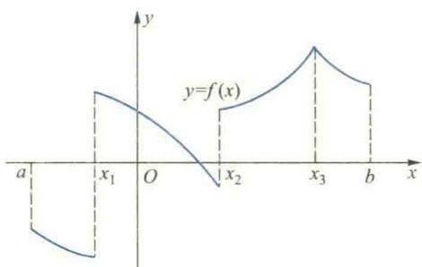
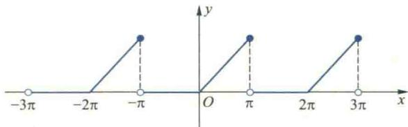
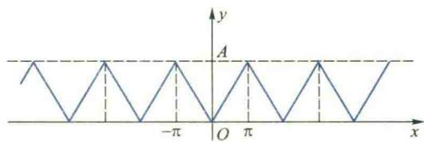
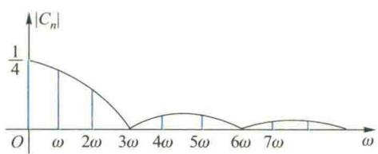

import ExerciseTrigger from '@/components/exercises/ExerciseTrigger.astro';
import QRCodeVideo from '@/components/QRCodeVideo.astro';

import Guide from '@/components/Guide.astro';
import Knowledge from '@/components/Knowledge.astro';
import Example from '@/components/Example.astro';
import Analysis from '@/components/Analysis.astro';
import Solution from '@/components/Solution.astro';
import Variant from '@/components/Variant.astro';
import Note from '@/components/Note.astro';
import SideNote from '@/components/SideNote.astro';
import Block from '@/components/Block.astro';
import Method from '@/components/Method.astro';
import Exercise from '@/components/Exercise.astro';

本节讨论另一类在理论和应用中都有重要价值的函数项级数——Fourier 级数。Fourier 级数是一种三角级数，三角级数的一般形式为

$$

\frac{a_0}{2} + \sum_{n=1}^{\infty} (a_n \cos nx + b_n \sin nx) \tag{4.1}

$$

其中系数 $a_0, a_n, b_n \, (n = 1, 2, \cdots)$ 都是实数。由于三角级数的通项是三角函数（正弦和余弦函数），因此，它是研究周期性物理现象的重要数学工具。本节主要讨论怎样将一个已知函数表示为三角级数的问题，也就是将函数展开为 Fourier 级数的问题。

## 4.1 周期函数与三角级数

在科学技术中，常常会遇到各种各样的周期现象。周期现象在数学上可用周期函数来近似描述。最简单的周期函数是正弦（或余弦）函数

$$

y = A \sin(\omega x + \varphi)

$$

它们描述了物理中的所谓简谐振动问题，其中 $A, \omega$ 和 $\varphi$ 分别叫做振幅、频率和初相。它的周期 $T = \frac{2\pi}{\omega}$，当 $\omega = 1$ 时，$T = 2\pi$，因此，又称之为正弦波或谐波。

考虑下列正弦函数：

$$

A_1 \sin(x + \varphi_1), A_2 \sin(2x + \varphi_2), \cdots, A_n \sin(nx + \varphi_n), \cdots

$$

它们的共同周期为 $2\pi$。易见，两个周期为 $2\pi$ 的正弦函数的叠加仍是一个周期为 $2\pi$ 的周期函数。一般地，$n$ 个周期为 $2\pi$ 的正弦函数与常数 $A_0$ 之和

$$

S_n(x) = A_0 + \sum_{k=1}^{n} A_k \sin(kx + \varphi_k)

$$

（称为 $n$ 次三角多项式）也是一个以 $2\pi$ 为周期的周期函数。如果 $\lim_{n \to \infty} S_n(x) = S(x)$，也就是说，由一周期为 $2\pi$ 的正弦函数列所构成的级数

$$

A_0 + \sum_{n=1}^{\infty} A_n \sin(nx + \varphi_n)

$$

收敛于 $S(x)$，那么和函数 $S(x)$ 还是以 $2\pi$ 为周期的周期函数。

现在自然要提出如下相反的问题：能否把一个给定的以 $2\pi$ 为周期的周期函数 $f(x)$ 表示（展开）成一列正弦函数之和呢？也就是表达式

$$

f(x) = A_0 + \sum_{n=1}^{\infty} A_n \sin(nx + \varphi_n) \tag{4.2}

$$

能否成立呢？如果能，那么，就可以通过简单的正弦函数来研究复杂的周期函数 $f(x)$ 的性质，用 $n$ 次三角多项式来任意逼近周期函数 $f(x)$。在物理上，就可以用简单的正弦波的叠加来研究各种复杂的周期现象，这是一件非常有意义的事情。实际上，早在 1807 年，法国数学家和物理学家 Fourier 在研究热传导问题时就研究并解决了这个问题，后人因此称之为把函数 $f(x)$ 展开为 Fourier 级数。

由于 $A_n \sin(nx + \varphi_n) = A_n(\sin nx \cos \varphi_n + \cos nx \sin \varphi_n) = a_n \cos nx + b_n \sin nx$，其中 $a_n = A_n \sin \varphi_n, b_n = A_n \cos \varphi_n \, (n = 1, 2, \cdots)$。为与今后得到的系数公式统一起来，记 $a_0 = \frac{a_0}{2}$，那么 (4.2) 式右端的级数就变成三角级数 (4.1) 的形式了。因此，上面的问题就变为能否将一个周期为 $2\pi$ 的周期函数 $f(x)$ 展开为形如 (4.1) 式的三角级数。为了研究这类问题，也需要解决两个问题：

1. $f(x)$ 满足什么条件时，才能展开成三角级数？
2. 如果 $f(x)$ 能展开成三角级数，展开式中的系数 $a_0, a_n, b_n \, (n = 1, 2, \cdots)$ 如何计算？

## 4.2 三角函数系的正交性与 Fourier 级数

首先讨论问题 (2)。我们知道，三角级数 (4.1) 是由函数系

$$

\{1, \cos x, \sin x, \cos 2x, \sin 2x, \cdots, \cos nx, \sin nx, \cdots\}

$$

构成的，通常称之为三角函数系。这个函数系有一个非常重要的性质：其中任意两个不同函数的乘积在 $[-\pi, \pi]$ 上的积分等于零，而任一函数的平方在 $[-\pi, \pi]$ 上的积分都不等于零。即 $\forall m, n \in \mathbb{N}_+$，

$$

\int_{-\pi}^{\pi} \cos nx \, dx = 0, \quad \int_{-\pi}^{\pi} \sin nx \, dx = 0;

$$

$$
\int_{-\pi}^{\pi} \cos mx \cos nx \, dx = 0, \quad \int_{-\pi}^{\pi} \sin mx \sin nx \, dx = 0 \quad (m \neq n), \quad \int_{-\pi}^{\pi} \sin mx \cos nx \, dx = 0;

$$

$$
\int_{-\pi}^{\pi} \cos^2 nx \, dx = \int_{-\pi}^{\pi} \sin^2 nx \, dx = \pi, \quad \int_{-\pi}^{\pi} 1^2 \, dx = 2\pi.

$$

<QRCodeVideo id="7.4.1" title="怎样理解函数的正交性概念" url="#" />

读者不难用积分法直接证明上述等式。而且，根据三角函数的周期性，它们在长为一个周期的任何区间 $[a, a + 2\pi]$ （$a$ 为常数）上都成立。

<Knowledge title="正交函数系定义">
一般地，若 $f, g \in \mathscr{R}[a, b]$，且 $\int_{a}^{b} f(x)g(x) \, dx = 0$，则称函数 $f$ 与 $g$ 在 $[a, b]$ 上正交。设 $\{f_n\}$ 是区间 $[a, b]$ 上的一个函数列，若其中任意两个不同的函数在 $[a, b]$ 上正交，且 $\int_{a}^{b} f_n^2(x) \, dx \neq 0 \, (n = 1, 2, \cdots)$，则称 $\{f_n\}$ 是 $[a, b]$ 上的正交函数系。三角函数系的上述性质表明，它在长为一个周期的任何区间 $[a, a + 2\pi]$ 上都构成一个正交函数系。两个函数正交的概念是两个向量正交的推广。
</Knowledge>

利用三角函数的正交性可以解决问题 (2)。设 $f$ 是以 $2\pi$ 为周期的可积函数，由于周期性，只要在 $[-\pi, \pi]$ 上讨论就可以了。假定 $f$ 在 $[-\pi, \pi]$ 上能展开为三角级数，即

$$

f(x) = \frac{a_0}{2} + \sum_{n=1}^{\infty} (a_n \cos nx + b_n \sin nx) \tag{4.3}

$$

并且假定右端级数在 $[-\pi, \pi]$ 上一致收敛于 $f$。在 (4.3) 式两端同乘 $\cos kx \, (k = 0, 1, 2, \cdots)$，并在 $[-\pi, \pi]$ 上逐项积分，得

$$

\int_{-\pi}^{\pi} f(x) \cos kx \, dx = \frac{a_0}{2} \int_{-\pi}^{\pi} \cos kx \, dx + \sum_{n=1}^{\infty} \left( a_n \int_{-\pi}^{\pi} \cos nx \cos kx \, dx + b_n \int_{-\pi}^{\pi} \sin nx \cos kx \, dx \right).

$$

根据正交性，当 $k = 0$ 时，

$$

\int_{-\pi}^{\pi} f(x) \, dx = \frac{a_0}{2} \int_{-\pi}^{\pi} \, dx = \pi a_0,

$$

从而得

$$

a_0 = \frac{1}{\pi} \int_{-\pi}^{\pi} f(x) \, dx;

$$

当 $k \neq 0$ 时，

$$

\int_{-\pi}^{\pi} f(x) \cos kx \, dx = a_k \int_{-\pi}^{\pi} \cos^2 kx \, dx = \pi a_k,

$$

从而得

$$

a_k = \frac{1}{\pi} \int_{-\pi}^{\pi} f(x) \cos kx \, dx \quad (k = 1, 2, \cdots).

$$

类似地，用 $\sin kx$ 同乘 (4.3) 式两端，并逐项积分可得

$$

b_k = \frac{1}{\pi} \int_{-\pi}^{\pi} f(x) \sin kx \, dx \quad (k = 1, 2, \cdots).

$$

将上面的结果结合起来就得到系数公式：

$$

\begin{aligned}
a_k &= \frac{1}{\pi} \int_{-\pi}^{\pi} f(x) \cos kx \, dx \quad (k = 0, 1, 2, \cdots), \\
b_k &= \frac{1}{\pi} \int_{-\pi}^{\pi} f(x) \sin kx \, dx \quad (k = 1, 2, \cdots).
\end{aligned} \tag{4.4}

$$

称 (4.4) 式为 **Euler-Fourier 公式**，系数由这个公式确定的三角级数称为 $f$ 的 **Fourier 级数**，这些系数称为 $f$ 的 **Fourier 系数**。

系数公式 (4.4) 是在 $f$ 能展开为 (4.3) 式并且右端的三角级数一致收敛于 $f$ 的条件下求得的，但仅从公式本身来看，只要 $f$ 在 $[-\pi, \pi]$ 上可积，就可以按此公式计算出系数 $a_k$ 与 $b_k$，并唯一地写出 $f$ 的 Fourier 级数，即

$$

f(x) \sim \frac{a_0}{2} + \sum_{n=1}^{\infty} (a_n \cos nx + b_n \sin nx).

$$

至于这个级数是否收敛；如果收敛，是否收敛于 $f$ 的问题还需要进一步研究。一旦证明了该级数收敛，而且收敛于 $f$ 之后，就可以把上式中的符号 “$\sim$” 换成等号 “$=$”。因此，下面我们来研究问题 (1)。

## 4.3 周期函数的 Fourier 展开

函数的 Fourier 级数的收敛性问题是一个相当复杂的理论问题，至今还没有便于应用的判别敛散性的充要条件，下面不加证明地给出一个应用较为广泛的充分条件。为此，先说明什么叫分段单调函数。设有函数 $f: [a, b] \to \mathbb{R}$，如果在 $[a, b]$ 内插入 $n-1$ 个分点

$$

a = x_0 < x_1 < x_2 < \cdots < x_{n-1} < x_n = b,

$$

能使 $f$ 在每个开区间 $(x_{k-1}, x_k)$ 内都单调，那么就称 $f$ 在 $[a, b]$ 上分段单调（图 7.5）。

<figure class="vp-figure">
  
  <figcaption>图 7.5 分段单调函数示意图</figcaption>
</figure>

<Knowledge title="Dirichlet 定理">
设函数 $f$ 在 $[-\pi, \pi]$ 上分段单调，而且除有限个第一类间断点外都是连续的，那么它的 Fourier 级数在 $[-\pi, \pi]$ 上收敛，且其函数为

$$

S(x) = \begin{cases} 
f(x), & x \text{ 是 } f \text{ 的连续点}, \\ 
\displaystyle\frac{f(x - 0) + f(x + 0)}{2}, & x \text{ 是 } f \text{ 的间断点}, \\ 
\displaystyle\frac{f(-\pi + 0) + f(\pi - 0)}{2}, & x = \pm \pi. 
\end{cases}

$$

</Knowledge>

<SideNote title="注意">
由 Dirichlet 定理易见：(1) 将函数 $f$ 展开为 Fourier 级数的条件比展开为 Taylor 级数的条件要弱得多；(2) 只要函数 $f$ 满足 Dirichlet 条件，不论 $x$ 是连续点还是间断点，它的 Fourier 级数都收敛，但其函数不一定等于该函数的数值，在间断点处仅等于 $f$ 在该点处左、右极限的算术平均值。
</SideNote>

在上述定理中，虽然并非对 $[-\pi, \pi]$ 上的每个点 $x$，$f(x)$ 的 Fourier 级数都收敛于 $f(x)$ 自身，但为方便起见，常把定理中的三种收敛情形都说成是 $f$ 的 Fourier 级数在 $[-\pi, \pi]$ 上收敛于 $f$，或者 $f$ 在 $[-\pi, \pi]$ 上被展开为 Fourier 级数。

定理中的条件称为 **Dirichlet 条件**，它是判别收敛性的一个充分条件。在实际应用中，许多函数都能满足这个条件。

还应当指出的是，虽然定理中的 $f$ 仅定义在 $[-\pi, \pi]$ 上，但由于 Fourier 级数的各项是以 $2\pi$ 为周期的函数，所以它的和函数也是以 $2\pi$ 为周期的函数。只要将 $f$ 按照周期 $2\pi$ 向左右两侧作周期延拓，即在每个区间 $[(2n-1)\pi, (2n+1)\pi] \, (n = \pm 1, \pm 2, \cdots)$ 上重复取它在 $[-\pi, \pi]$ 上的值，那么它的 Fourier 级数就在整个数轴上都收敛于 $f$ 了，即

$$

f(x) = \frac{a_0}{2} + \sum_{n=1}^{\infty} (a_n \cos nx + b_n \sin nx), \quad x \in (-\infty, +\infty).

$$

此时，就说 $f$ 在整个数轴上被展开为 Fourier 级数，上式右端的级数也称为 $f$ 在 $(-\infty, +\infty)$ 上的 **Fourier 展开式**。

<SideNote title="注意">
函数 $f$ 的 Fourier 级数与函数 $f$ 的 Fourier 展开式是两个不同的概念。前者是指系数公式 (4.4) 确定的三角级数，并不要求该级数收敛于 $f$；而后者则要求该级数收敛，且在连续点收敛于 $f$。
</SideNote>

特别地，如果 $f$ 在 $[-\pi, \pi]$ 上是奇函数，那么由于 $f(x)\cos nx$ 也是奇函数，而 $f(x)\sin nx$ 是偶函数，所以

$$

a_n = \frac{1}{\pi} \int_{-\pi}^{\pi} f(x) \cos nx \, dx = 0 \quad (n = 0, 1, 2, \cdots),

$$

$$
b_n = \frac{1}{\pi} \int_{-\pi}^{\pi} f(x) \sin nx \, dx = \frac{2}{\pi} \int_{0}^{\pi} f(x) \sin nx \, dx \quad (n = 1, 2, \cdots).

$$

从而，它的 Fourier 展开式变为

$$

f(x) = \sum_{n=1}^{\infty} b_n \sin nx, \quad x \in (-\infty, +\infty).

$$

由此可见，奇函数的 Fourier 展开式只含正弦项，称这种级数为 $f$ 的 **Fourier 正弦级数**。

类似可知，如果 $f$ 在 $[-\pi, \pi]$ 上是偶函数，那么它的 Fourier 展开式中只含余弦项。即

$$

f(x) = \frac{a_0}{2} + \sum_{n=1}^{\infty} a_n \cos nx, \quad x \in (-\infty, +\infty),

$$

其中

$$

a_n = \frac{2}{\pi} \int_{0}^{\pi} f(x) \cos nx \, dx \quad (n = 0, 1, 2, \cdots).

$$

称它为 $f$ 的 **Fourier 余弦级数**。

<Example title="例 4.1">
设 $f$ 是以 $2\pi$ 为周期的函数，它在 $[-\pi, \pi]$ 上的定义为

$$

f(x) = \begin{cases} 
0, & -\pi < x < 0, \\ 
x, & 0 \le x \le \pi. 
\end{cases}

$$

求 $f$ 的 Fourier 展开式。
</Example>

<Solution title="解">
函数 $f$ 的图像如图 7.6 所示。显然，它在 $[-\pi, \pi]$ 上满足 Dirichlet 条件。根据系数公式 (4.4) 得

<figure class="vp-figure">
  
  <figcaption>图 7.6 周期三角波函数图像</figcaption>
</figure>

$$

a_0 = \frac{1}{\pi} \int_{-\pi}^{\pi} f(x) \, dx = \frac{1}{\pi} \int_{0}^{\pi} x \, dx = \frac{\pi}{2},

$$

$$
\begin{aligned}
a_n &= \frac{1}{\pi} \int_{-\pi}^{\pi} f(x) \cos nx \, dx = \frac{1}{\pi} \int_{0}^{\pi} x \cos nx \, dx \\
&= \frac{1}{\pi} \left[ \left. \frac{x \sin nx}{n} \right|_{0}^{\pi} - \int_{0}^{\pi} \frac{\sin nx}{n} \, dx \right] = \frac{(-1)^n - 1}{n^2 \pi} = \begin{cases} 
-\displaystyle\frac{2}{n^2 \pi}, & n \text{ 为奇数}, \\ 
0, & n \text{ 为偶数}, 
\end{cases}
\end{aligned}

$$

$$
\begin{aligned}
b_n &= \frac{1}{\pi} \int_{-\pi}^{\pi} f(x) \sin nx \, dx = \frac{1}{\pi} \int_{0}^{\pi} x \sin nx \, dx \\
&= \frac{1}{\pi} \left[ \left. -\frac{x \cos nx}{n} \right|_{0}^{\pi} + \int_{0}^{\pi} \frac{\cos nx}{n} \, dx \right] = \frac{(-1)^{n+1}}{n} = \begin{cases} 
\displaystyle\frac{1}{n}, & n \text{ 为奇数}, \\ 
-\displaystyle\frac{1}{n}, & n \text{ 为偶数}. 
\end{cases}
\end{aligned}

$$

因此，根据 Dirichlet 定理，当 $x \in (-\pi, \pi)$ 时，

$$

\begin{aligned}
f(x) &= \frac{\pi}{4} - \left( \frac{2}{\pi} \cos x + \sin x \right) - \frac{\sin 2x}{2} - \left( \frac{2}{3^2 \pi} \cos 3x - \frac{1}{3} \sin 3x \right) - \cdots \\
&= \frac{\pi}{4} - \sum_{k=1}^{\infty} \left[ \frac{2}{(2k-1)^2 \pi} \cos (2k-1)x + \frac{(-1)^k}{k} \sin kx \right].
\end{aligned}

$$

当 $x = \pm \pi$ 时，$f$ 的 Fourier 级数收敛于

$$

\frac{1}{2} [f(-\pi + 0) + f(\pi - 0)] = \frac{\pi}{2}.

$$

易见，在整个数轴上，函数 $f$ 的 Fourier 级数除了在点 $x = n\pi \, (n = \pm 1, \pm 3, \pm 5, \cdots)$ 处收敛于 $\frac{\pi}{2}$ 外，在其各点 $x$ 处都收敛于 $f(x)$。
</Solution>

<SideNote title="想一想">
画出例 4.1 中函数 $f(x)$ 的 Fourier 级数的和函数的图像，并与 $f(x)$ 的图像加以比较，指出它们之间有何不同。
</SideNote>

在此例中，由于 $f$ 的 Fourier 级数在 $x = n\pi \, (n = \pm 1, \pm 3, \pm 5, \cdots)$ 处收敛于 $\frac{\pi}{2}$，将它们代入 $f$ 的 Fourier 级数，便得到了一个常数项级数的和，即

<Example title="例 4.2 阶跃函数的 Fourier 级数">

设 $f(x)$ 的周期为 $2\pi$，它在 $[-\pi, \pi]$ 上的定义为

$$

f(x) = \begin{cases} 0, & -\pi \leqslant x < 0, \\ 1, & 0 \leqslant x < \pi, \end{cases}

$$

求 $f(x)$ 的 Fourier 级数及此 Fourier 级数的和函数 $S(x)$。

<Solution title="解">

显然 $f$ 满足 Dirichlet 条件，根据系数公式，有

$$

\begin{aligned}
& a_0 = \frac{1}{\pi} \int_{-\pi}^{\pi} f(x) \, dx = \frac{1}{\pi} \int_{0}^{\pi} dx = 1, \\
& a_n = \frac{1}{\pi} \int_{-\pi}^{\pi} f(x) \cos nx \, dx = \frac{1}{\pi} \int_{0}^{\pi} \cos nx \, dx = 0 \quad (n = 1, 2, \cdots), \\
& b_n = \frac{1}{\pi} \int_{-\pi}^{\pi} f(x) \sin nx \, dx = \frac{1}{\pi} \int_{0}^{\pi} \sin nx \, dx = \frac{1 - (-1)^n}{n\pi} = \begin{cases} \frac{2}{n\pi}, & n \text{ 为奇数}, \\ 0, & n \text{ 为偶数}. \end{cases}
\end{aligned}

$$

所以，$f(x)$ 的 Fourier 级数为 $\frac{1}{2} + \frac{2}{\pi} \sum_{k=1}^{\infty} \frac{\sin(2k-1)x}{2k-1}$。根据 Dirichlet 定理，它在 $[-\pi, \pi]$ 上收敛于和函数

$$

S(x) = \begin{cases} 0, & -\pi < x < 0, \\ 1, & 0 < x < \pi, \\ \frac{1}{2}, & x = 0, \pm\pi. \end{cases}

$$

由于 $f(x)$ 是以 $2\pi$ 为周期的函数，所以它的 Fourier 级数在 $(-\infty, +\infty)$ 上除去 $x = n\pi \, (n = 0, \pm 1, \pm 2, \cdots)$ 的点处都收敛于 $f(x)$，在点 $x = n\pi$ 处收敛于 $\frac{1}{2}$。

</Solution>
</Example>

前面已经指出，在 Dirichlet 定理中，$f(x)$ 的 Fourier 级数并非处处收敛于 $f(x)$，更不一定一致收敛于 $f(x)$，这种情况在上面两个例图中也可以很清楚地看到。例如，在例 4.2 中 $f(x)$ 的 Fourier 级数的前三个部分和为

$$

S_1(x) = \frac{1}{2} + \frac{2}{\pi}\sin x, \quad S_2(x) = \frac{1}{2} + \frac{2}{\pi}\left(\sin x + \frac{\sin 3x}{3}\right),

$$

$$
S_3(x) = \frac{1}{2} + \frac{2}{\pi}\left(\sin x + \frac{\sin 3x}{3} + \frac{\sin 5x}{5}\right).

$$

从它们的图像（图 7.7）易见，虽然从局部上看，在某些点处（如 $x = 0, \pm\pi$ 等）$S_n(x)$ 与 $f(x)$ 的值相差甚大，可能等于 $\frac{1}{2}$，但是从整体上看，随着 $n$ 的增大，$S_n(x)$ 的图像越来越逼近于 $f(x)$ 的图像，因此，$S_n(x)$ 不失为对 $f(x)$ 的一种很好的逼近！为了从数量关系上讨论这种逼近，人们采用

$$

\left( \int_{-\pi}^{\pi} [f(x) - S_n(x)]^2 dx \right)^{\frac{1}{2}}

$$

来刻画它们之间的误差。粗略地说，就是用 $[-\pi, \pi]$ 上各点处 $S_n(x)$ 近代代替 $f(x)$ 产生的误差 $|f(x) - S_n(x)|$ 的平方在 $[-\pi, \pi]$ 上无限累加后再开方来度量。这就是所谓的**平均平方逼近**，简称**均方逼近**。因此，将函数 $f$ 展开为它的 Fourier 级数，实际上就是用 $f$ 的 Fourier 三角多项式来均方逼近 $f$。可以证明，在所有的三角多项式中，$f$ 的 Fourier 三角多项式是对 $f$ 的最佳均方逼近。

<figure class="vp-figure">
  
  <figcaption>图 7.7</figcaption>
</figure>

<QRCodeVideo id="7.4.2" title="怎样理解函数 Fourier 级数的均方逼近" url="#" />

<Example title="例 4.3 三角波的 Fourier 展开式">

设 $f$ 是以 $2\pi$ 为周期的函数，它在 $[-\pi, \pi]$ 上的定义为

$$

f(x) = \begin{cases} -\frac{A}{\pi}x, & -\pi \leqslant x < 0, \\ \frac{A}{\pi}x, & 0 \leqslant x < \pi, \end{cases}

$$

求 $f$ 的 Fourier 展开式，其中 $A$ 为常数。

<Solution title="解">

函数 $f$ 的图像如图 7.8 所示，电子学中称之为**三角波**。显然，它在 $[-\pi, \pi]$ 上满足 Dirichlet 条件（以后所给函数均满足此条件，不再一一说明）。

<figure class="vp-figure">
  
  <figcaption>图 7.8</figcaption>
</figure>

由于它是偶函数，所以 $b_n = 0 \, (n = 1, 2, \cdots)$。而

$$

\begin{aligned}
& a_0 = \frac{2}{\pi} \int_{0}^{\pi} f(x) dx = \frac{2}{\pi} \int_{0}^{\pi} \frac{A}{\pi} x dx = A, \\
& a_n = \frac{2}{\pi} \int_{0}^{\pi} f(x) \cos nx \, dx = \frac{2}{\pi} \int_{0}^{\pi} \frac{A}{\pi} x \cos nx \, dx = \frac{2A}{\pi^2} \left[ \left. \frac{x \sin nx}{n} \right|_0^\pi - \int_0^\pi \frac{\sin nx}{n} dx \right] \\
& \quad = \frac{2A}{n^2\pi^2} [(-1)^n - 1] = \begin{cases} 0, & n \text{ 为偶数}, \\ -\frac{4A}{n^2\pi^2}, & n \text{ 为奇数}. \end{cases}
\end{aligned}

$$

从而得 $f$ 的 Fourier 展开式为

$$

f(x) = \frac{A}{2} - \frac{4A}{\pi^2} \sum_{k=1}^{\infty} \frac{\cos(2k-1)x}{(2k-1)^2}, \quad x \in (-\infty, +\infty).

$$

</Solution>
</Example>

下面讨论周期为 $2l$（$l$ 为任意实数）的函数如何展开为 Fourier 级数的问题。设 $f$ 是周期为 $2l$ 的函数，并且在 $[-l, l]$ 上满足 Dirichlet 条件。为了求得它的 Fourier 展开式，我们先通过变量代换将该问题转化为周期为 $2\pi$ 函数的 Fourier 展开问题。令 $x = \frac{l}{\pi}t$，则 $f(x) = f\left(\frac{l}{\pi}t\right)$。若记 $g(t) = f\left(\frac{l}{\pi}t\right)$，不难验证，$g$ 就是一个周期为 $2\pi$ 的函数，并在 $[-\pi, \pi]$ 上满足 Dirichlet 条件。根据 Dirichlet 定理，它的 Fourier 级数在 $[-\pi, \pi]$ 上收敛于 $g$（此处收敛的含义也包含该定理中的三种情形），即

$$

g(t) = \frac{a_0}{2} + \sum_{n=1}^{\infty} (a_n \cos nt + b_n \sin nt),

$$

其中

$$

\begin{aligned}
a_n &= \frac{1}{\pi} \int_{-\pi}^{\pi} g(t) \cos nt \, dt = \frac{1}{\pi} \int_{-\pi}^{\pi} f\left(\frac{l}{\pi}t\right) \cos nt \, dt \quad (n = 0, 1, 2, \cdots), \\
b_n &= \frac{1}{\pi} \int_{-\pi}^{\pi} g(t) \sin nt \, dt = \frac{1}{\pi} \int_{-\pi}^{\pi} f\left(\frac{l}{\pi}t\right) \sin nt \, dt \quad (n = 1, 2, \cdots).
\end{aligned}

$$

再将变量换回到 $x$ 便得 $f$ 在 $[-l, l]$ 上的 Fourier 展开式

$$

f(x) = \frac{a_0}{2} + \sum_{n=1}^{\infty} \left( a_n \cos \frac{n\pi x}{l} + b_n \sin \frac{n\pi x}{l} \right), \tag{4.5}

$$

其中系数 $a_n$ 与 $b_n$ 可由下面的公式求得：

$$

\begin{cases}
a_n = \frac{1}{l} \int_{-l}^{l} f(x) \cos \frac{n\pi x}{l} dx \quad (n = 0, 1, 2, \cdots), \\
b_n = \frac{1}{l} \int_{-l}^{l} f(x) \sin \frac{n\pi x}{l} dx \quad (n = 1, 2, \cdots).
\end{cases} \tag{4.6}

$$

若 $f$ 定义在有限区间 $[-l, l]$ 上，关于 $f$ 作周期延拓以及 $f$ 为奇函数或偶函数的情形如何展开等问题与 $f$ 为以 $2\pi$ 为周期的函数类似，不再一一重述。

<Example title="例 4.4 矩形脉冲的 Fourier 级数">

将以 $4$ 为周期，在 $[-2, 2]$ 上定义为

$$

f(x) = \begin{cases} \frac{1}{2\delta}, & |x| < \delta, \\ 0, & \delta \leqslant |x| \leqslant 2 \end{cases}

$$

的函数 $f$ 展开为 Fourier 级数。

<Solution title="解">

$f$ 的图像如图 7.9 所示，电子学中称之为**矩形脉冲**。

<figure class="vp-figure">
  
  <figcaption>图 7.9</figcaption>
</figure>

由于它是偶函数，所以 $b_n = 0 \, (n = 1, 2, \cdots)$，而

$$

a_0 = \frac{2}{l} \int_{0}^{l} f(x) dx = \int_{0}^{\delta} \frac{1}{2\delta} dx = \frac{1}{2},

$$

$$
a_n = \frac{2}{l} \int_{0}^{l} f(x) \cos \frac{n\pi x}{l} dx = \int_{0}^{\delta} \frac{1}{2\delta} \cos \frac{n\pi x}{2} dx = \frac{1}{n\pi\delta} \sin \frac{n\pi\delta}{2} \quad (n = 1, 2, \cdots).

$$

因此，当 $x \in [-2, -\delta) \cup (-\delta, \delta) \cup (\delta, 2]$ 时，

$$

f(x) = \frac{1}{4} + \frac{1}{\pi\delta} \sum_{n=1}^{\infty} \frac{1}{n} \sin \frac{n\pi\delta}{2} \cos \frac{n\pi x}{2};

$$

当 $x = \pm\delta$ 时，它的 Fourier 级数收敛于 $\frac{1}{4\delta}$。

</Solution>
</Example>

### 4.4 定义在 $[0, l]$ 上函数的 Fourier 展开

设函数 $f$ 定义在区间 $[0, l]$ 上，周期为 $2l$，并且满足 Dirichlet 条件。为了求得它的 Fourier 展开式，将它任意延拓到区间 $[-l, 0]$ 上，即在 $[-l, 0]$ 上对函数 $f$ 作任意补充定义，得到一个定义在 $[-l, l]$ 上的辅助函数 $F$，使得 $F$ 在 $[-l, l]$ 上满足 Dirichlet 条件，并且在 $[0, l]$ 上等于 $f$。只要我们能将 $F$ 在 $[-l, l]$ 上展开为 Fourier 级数，那么就得到 $f$ 在 $[0, l]$ 上的 Fourier 展开式。

在理论上，延拓的方式有无穷多种，可以根据问题不同的要求采用不同的延拓方式，但常用的是下面两种：

#### 1. 偶延拓
如果要求将 $f$ 在 $[0, l]$ 上展开成 Fourier 余弦级数，可采用偶延拓的方式，就是使 $F$ 是 $[-l, l]$ 上的偶函数，即

$$

F(x) = \begin{cases} f(x), & 0 \leqslant x \leqslant l, \\ f(-x), & -l \leqslant x < 0. \end{cases}

$$

将 $F$ 在 $[-l, l]$ 上展开为 Fourier 级数，得

$$

b_n = 0 \quad (n = 1, 2, \cdots), \quad a_n = \frac{2}{l} \int_{0}^{l} f(x) \cos \frac{n\pi x}{l} dx.

$$

<QRCodeVideo id="7.4.3" title="函数展开为 Fourier 级数方法" url="#" />

从而可知

$$

f(x) = \frac{a_0}{2} + \sum_{n=1}^{\infty} a_n \cos \frac{n\pi x}{l}

$$

就是 $f$ 在 $[0, l]$ 上的 Fourier 余弦展开式。

#### 2. 奇延拓
如果要求将 $f$ 在 $[0, l]$ 上展开为 Fourier 正弦级数，可采用奇延拓的方式，就是使 $F$ 是 $[-l, l]$ 上的奇函数，即

$$

F(x) = \begin{cases} f(x), & 0 < x \leqslant l, \\ -f(-x), & -l \leqslant x < 0. \end{cases}

$$

根据奇函数的定义，必须有 $f(0) = 0$。如果不满足这个条件，那么首先应当改变它在 $x = 0$ 的值，使它符合这个要求，然后再将 $F$ 在 $[-l, l]$ 上展开，得

$$

a_n = 0 \quad (n = 0, 1, 2, \cdots), \quad b_n = \frac{2}{l} \int_{0}^{l} f(x) \sin \frac{n\pi x}{l} dx.

$$

从而可知 $f$ 在 $[0, l]$ 上的 Fourier 正弦展开式就是

$$

f(x) = \sum_{n=1}^{\infty} b_n \sin \frac{n\pi x}{l}.

$$

从上面讨论可见，无论是偶延拓还是奇延拓，在计算展开式的系数时，只用到 $f$ 在 $[0, l]$ 上的值。所以，在解题过程中并不需要具体作出辅助函数 $F$，只要指明采用哪一种延拓方式就够了。

<Example title="例 4.5 奇延拓求正弦级数">

将函数

$$

f(x) = \begin{cases} x, & 0 \leqslant x \leqslant 1, \\ 2-x, & 1 < x \leqslant 2 \end{cases}

$$

在 $[0, 2]$ 上展开为周期为 $4$ 的 Fourier 正弦级数。

<Solution title="解">

根据要求，本题应应用奇延拓。因此有

$$

a_n = 0 \quad (n = 0, 1, 2, \cdots),

$$

$$
\begin{aligned}
b_n &= \int_{0}^{2} f(x) \sin \frac{n\pi x}{2} dx = \int_{0}^{1} x \sin \frac{n\pi x}{2} dx + \int_{1}^{2} (2-x) \sin \frac{n\pi x}{2} dx \\
&= -\frac{2}{n\pi} \left( \left. x\cos\frac{n\pi x}{2} \right|_0^1 - \int_0^1 \cos\frac{n\pi x}{2} dx \right) - \frac{4}{n\pi} \cos\frac{n\pi x}{2} \Big|_1^2 + \frac{2}{n\pi} \left( \left. x\cos\frac{n\pi x}{2} \right|_1^2 - \int_1^2 \cos\frac{n\pi x}{2} dx \right) \\
&= \frac{8}{n^2\pi^2} \sin \frac{n\pi}{2} = \begin{cases} \frac{8}{(2k+1)^2\pi^2} (-1)^k, & n = 2k+1, \\ 0, & n = 2k. \end{cases} \quad (k = 0, 1, 2, \cdots)
\end{aligned}

$$

从而得

$$

f(x) = \frac{8}{\pi^2} \sum_{k=0}^{\infty} \frac{(-1)^k}{(2k+1)^2} \sin \frac{(2k+1)\pi x}{2}, \quad x \in [0, 2].

$$

</Solution>
</Example>

<QRCodeVideo id="7.4.4" title="将函数展开为 Fourier 级数与 Taylor 级数有哪些不同" url="#" />

令 $\omega = \frac{\pi}{l}$，则由 Euler 公式：

$$

\cos \frac{n\pi x}{l} = \cos n\omega x = \frac{1}{2}\left(e^{in\omega x} + e^{-in\omega x}\right), \quad \sin \frac{n\pi x}{l} = \sin n\omega x = \frac{1}{2i}\left(e^{in\omega x} - e^{-in\omega x}\right)

$$

代入 Fourier 级数的三角函数形式中，得：

$$

f(x) = \frac{a_0}{2} + \sum_{n=1}^{+\infty} \left[ \frac{a_n}{2}\left(e^{in\omega x} + e^{-in\omega x}\right) - \frac{b_n i}{2}\left(e^{in\omega x} - e^{-in\omega x}\right) \right] = \frac{a_0}{2} + \sum_{n=1}^{+\infty} \left( \frac{a_n - i b_n}{2} e^{in\omega x} + \frac{a_n + i b_n}{2} e^{-in\omega x} \right)

$$

把上式中各项系数分别记成：

$$

C_0 = \frac{a_0}{2}, \quad C_n = \frac{a_n - i b_n}{2}, \quad C_{-n} = \frac{a_n + i b_n}{2} \quad (n = 1, 2, \cdots)

$$

那么，$f$ 的 Fourier 展开式就可以写成更简洁的复数形式：

$$

f(x) = \sum_{n=0}^{+\infty} C_n e^{in\omega x} + \sum_{n=1}^{+\infty} C_{-n} e^{-in\omega x} = \sum_{n=-\infty}^{+\infty} C_n e^{in\omega x} \tag{4.7}

$$

其中：

$$

\begin{aligned}
C_0 &= \frac{a_0}{2} = \frac{1}{2l} \int_{-l}^{l} f(x) \, dx \\
C_{\pm n} &= \frac{a_n \mp i b_n}{2} = \frac{1}{2l} \int_{-l}^{l} f(x) (\cos n\omega x \mp i \sin n\omega x) \, dx = \frac{1}{2l} \int_{-l}^{l} f(x) e^{\mp in\omega x} \, dx \quad (n = 1, 2, \cdots)
\end{aligned}

$$

也能写成统一的形式：

$$

C_n = \frac{1}{2l} \int_{-l}^{l} f(x) e^{-in\omega x} \, dx \quad (n = 0, \pm 1, \pm 2, \cdots) \tag{4.8}

$$

函数 $f$ 的 Fourier 级数的复数形式与实数形式没有本质上的差异，但应用上常常更为方便。例如，在电子技术中，可以利用它来作频谱分析。本节开始就曾指出，为了研究复杂的周期现象，常常将一个描写该周期现象的周期函数 $f$ 展开为 Fourier 级数。在物理上就是将一个复杂的周期波 $f$（非正弦波）分解为一系列不同频率的简单正弦波（谐波）的叠加，这些正弦波的频率通常称为 $f$ 的频率成分。在工程应用中，经常需要分析各种频率成分的正弦波振幅的大小，称之为频谱分析。

在 $f$ 的 Fourier 展开式中，$\frac{a_0}{2}$ 称为非正弦波 $f$ 的直流分量，与 $f$ 同频率的正弦波 $a_1 \cos \omega x + b_1 \sin \omega x$ 称为基波，而 $a_n \cos n\omega x + b_n \sin n\omega x = A_n \sin(n\omega x + \varphi_n)$（其中 $A_n = \sqrt{a_n^2 + b_n^2}$）称为 $n$ 阶谐波。在复数形式 (4.7) 中，由于：

$$

|C_n| = |C_{-n}| = \frac{1}{2}\sqrt{a_n^2 + b_n^2} = \frac{1}{2}A_n

$$

因此，系数 $C_n$ 与 $C_{-n}$ 直接反映了 $n$ 阶谐波振幅 $A_n$ 的大小。通常称 $A_n$ 为周期波（或信号）$f$ 的振幅频谱，简称为频谱。在作频谱分析时，根据各阶谐波的振幅与频率之间的函数关系画出相应的频谱图。例如，考察例 4.4 中的矩形脉冲，将它的 Fourier 级数与 Fourier 系数化成复数形式，得：

$$

\begin{aligned}
C_0 &= \frac{a_0}{2} = \frac{1}{4} \\
C_n &= \frac{a_n - i b_n}{2} = \frac{1}{2n\pi \delta} \sin \frac{n\pi \delta}{2} \quad (n = \pm 1, \pm 2, \cdots) \\
f(x) &= \frac{1}{4} + \frac{1}{2n\pi \delta} \sum_{\substack{n=-\infty \\ (n \neq 0)}}^{+\infty} \frac{1}{n} \sin \frac{n\pi \delta}{2} e^{in\omega x}, \quad x \in [-2, 2] \setminus [-\delta, \delta]
\end{aligned}

$$

有了 $C_n$，就容易画出它的频谱图。取脉冲宽度 $2\delta = \frac{T}{3}$，即 $\delta = \frac{T}{6} = \frac{2}{3}$（本题中 $T = 4$），则：

$$

|C_n| = \left| \frac{3}{4\pi |n|} \sin \frac{n\pi}{3} \right| \quad (n = \pm 1, \pm 2, \cdots)

$$

列表如下：

| $n$ | $0$ | $1$ | $2$ | $3$ | $4$ | $5$ | $6$ | $7$ | $\cdots$ |
| :---: | :---: | :---: | :---: | :---: | :---: | :---: | :---: | :---: | :---: |
| $|C_n|$ | $\frac{1}{4}$ (直流分量) | $\frac{3\sqrt{3}}{8\pi}$ | $\frac{3\sqrt{3}}{8\pi}$ | $\frac{1}{2}$ | $0$ | $\frac{3\sqrt{3}}{8\pi}$ | $\frac{1}{4}$ | $\frac{3\sqrt{3}}{8\pi}$ | $\cdots$ |

画出矩形脉冲的频谱图如图 7.10 所示，它是一条一条离散的谱线。随着谐波阶数 $n$ 的增大，振幅很快减小，并且当 $n \to \infty$ 时趋于 $0$。

<figure class="vp-figure">
  
  <figcaption>图 7.10 矩形脉冲的离散频谱图</figcaption>
</figure>

<Example title="例 4.6 半波整流函数的 Fourier 级数">

设 $f$ 是以 $T = \frac{2\pi}{\omega}$ 为周期的函数，它在 $\left[-\frac{\pi}{\omega}, \frac{\pi}{\omega}\right]$ 上定义为：

$$

f(x) = \begin{cases}
0, & -\frac{\pi}{\omega} \le t < 0, \\
E\sin \omega t, & 0 \le t \le \frac{\pi}{\omega},
\end{cases}

$$

求 $f$ 复数形式的 Fourier 展开式。

</Example>

<Solution title="解">

函数 $f$ 的图像如图 7.11 所示。电子学中它表示一个交变电压 $E\sin \omega t$ 经整流后所得到的周期波形，称为半波整流。

<figure class="vp-figure">
  
  <figcaption>图 7.11 半波整流波形图</figcaption>
</figure>

由系数公式 (4.8) 得：

$$

\begin{aligned}
C_0 &= \frac{1}{2 \cdot \frac{\pi}{\omega}} \int_{0}^{\frac{\pi}{\omega}} f(t) \, dt = \frac{\omega}{2\pi} \int_{0}^{\frac{\pi}{\omega}} E\sin \omega t \, dt = \frac{\omega E}{2\pi} \left( -\frac{\cos \omega t}{\omega} \right)\Bigg|_0^{\frac{\pi}{\omega}} = \frac{E}{\pi} \\
C_n &= \frac{1}{2 \cdot \frac{\pi}{\omega}} \int_{0}^{\frac{\pi}{\omega}} f(t) e^{-in\omega t} \, dt = \frac{\omega E}{2\pi} \int_{0}^{\frac{\pi}{\omega}} \sin \omega t \, e^{-in\omega t} \, dt \quad (n = \pm 1, \pm 2, \cdots)
\end{aligned}

$$

当 $n \neq \pm 1$ 时，利用 Euler 公式上式又可化为：

$$

\begin{aligned}
C_n &= \frac{\omega E}{4\pi i} \int_{0}^{\frac{\pi}{\omega}} \left[ e^{-i(n-1)\omega t} - e^{-i(n+1)\omega t} \right] dt = \frac{E}{4\pi i} \left[ \frac{e^{-i(n-1)\omega t}}{n-1} - \frac{e^{-i(n+1)\omega t}}{n+1} \right]_0^{\frac{\pi}{\omega}} \\
&= \frac{E}{2\pi} \cdot \frac{(-1)^{n-1} - 1}{n^2 - 1} = \begin{cases}
-\frac{E}{\pi} \frac{1}{(2k)^2 - 1}, & n = 2k, \\
0, & n = 2k + 1
\end{cases} \quad (k = \pm 1, \pm 2, \cdots)
\end{aligned}

$$

而当 $n = \pm 1$ 时：

$$

C_{\pm 1} = \frac{\omega E}{2\pi} \int_{0}^{\frac{\pi}{\omega}} \sin \omega t \, e^{\mp i\omega t} \, dt = \frac{\omega E}{2\pi} \int_{0}^{\frac{\pi}{\omega}} (\sin \omega t \cos \omega t \mp i \sin^2 \omega t) \, dt = \mp \frac{E}{4} i

$$

因此，我们有：

$$

\begin{aligned}
f(t) &= \frac{E}{\pi} - \frac{E i}{4} e^{i\omega t} + \frac{E i}{4} e^{-i\omega t} - \frac{E}{\pi} \sum_{\substack{k=-\infty \\ k \neq 0}}^{+\infty} \frac{1}{(2k)^2 - 1} e^{2k\omega ti} \\
&= \frac{E}{\pi} + \frac{E}{2}\sin \omega t - \frac{E}{\pi} \sum_{\substack{k=-\infty \\ k \neq 0}}^{+\infty} \frac{1}{4k^2 - 1} e^{2k\omega ti}, \quad t \in (-\infty, +\infty)
\end{aligned}

$$

与矩形脉冲类似，读者不难对半波整流画出相应的频谱图，进行频谱分析。

</Solution>

<ExerciseTrigger chapter={7} section="7.4" title="7.4 Fourier级数 课后真题与自测练习" />
