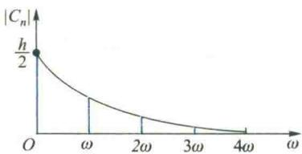
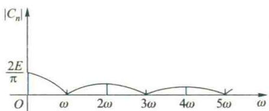

import Guide from '@/components/Guide.astro';
import Knowledge from '@/components/Knowledge.astro';
import Example from '@/components/Example.astro';
import Analysis from '@/components/Analysis.astro';
import Solution from '@/components/Solution.astro';
import Variant from '@/components/Variant.astro';
import Note from '@/components/Note.astro';
import Block from '@/components/Block.astro';
import Method from '@/components/Method.astro';
import Exercise from '@/components/Exercise.astro';

<Block title="习题7.1 答案">
**（A）**

2. (1) $\sum_{n=1}^{\infty} \frac{2}{n(n+1)} = 2$ ; (2) $\sum_{n=1}^{\infty} \frac{2}{3^n} = 1$ .

3.（1）收敛， $S=\frac{4q-6}{(q-1)(q-3)}$ ;（2）收敛， $\frac{1}{3}$ ;（3）收敛， $1-\sqrt{2}$ ;（4）发散. 6.8.

8.（1）发散；（2）发散；（3）发散；（4）x=0时收敛， $x\neq0$ 时发散．9. $i+\frac{i}{11}$ 点钟 $(i=1,2,\cdots,11)$ .

11. (1) 否; (2) 否, 可考虑 $a_{n} = \frac{(-1)^{n}}{\sqrt{n}}$ 与 $b_{n} = \frac{(-1)^{n}}{\sqrt{n}} + \frac{1}{n}$ ; (3) 否; (4) 否; (5) 否; (6) 是.

12.（1）收敛；（2）发散；（3） $\alpha >\frac{1}{2}$ 时收敛， $\alpha \leqslant \frac{1}{2}$ 时发散；（4）收敛；（5）收敛；

(6) 收敛；(7) 发散；(8) 收敛；(9) 收敛；(10) 收敛；(11) x &lt; e 时收敛， $x \geqslant e$ 时发散；

(12) 发散；(13) 发散；(14) $\alpha \neq 1$ 时收敛， $\alpha = 1$ 时发散.

14.（1）绝对收敛；（2）条件收敛；（3）条件收敛（当 $n\to \infty$ 时 $\frac{1}{n - \ln n}\sim \frac{1}{n}$ ，当 $x > 1$ 时 $\frac{\mathrm{d}}{\mathrm{d}x}\left(\frac{1}{x - \ln x}\right) <   0$ ）；

(4) 条件收敛；(5) 绝对收敛；(6) $\left|x\right|<1$ 时绝对收敛，x=-1 时条件收敛，其他情况发散.

15.（1）发散；（2）收敛；（3）收敛；（4）发散.

16. (1) $|a| < 1$ 时绝对收敛， $|a| > 1$ 时发散；(2) $a = b$ 时条件收敛， $a \neq b$ 时发散.

17. 0.841 7. 18. (1) 绝对收敛; (2) 绝对收敛; (3) 条件收敛; (4) 条件收敛.

1. 注意 $\frac{a_{n+1}}{a_1} = \frac{a_{n+1}}{a_n} \cdot \frac{a_n}{a_{n-1}} \cdot \cdots \cdot \frac{a_2}{a_1}$ .

2. 由极限定义, 若 q>1, 则对于满足 $q-\varepsilon=r>1$ 的正数 $\varepsilon$ , 存在正整数 $N_{0}$ , 使当 $n>N_{0}$ 时有 $\frac{-\ln a_{n}}{\ln n}>r$ .

3. 利用 Taylor 公式及 $f''(x)$ 在 x=0 的某一邻域内有界.

4.（1）收敛；（2）发散；（3） $\alpha\leqslant1$ 时收敛， $\alpha>1$ 时发散；（4）发散；（5）收敛；

(6) $|x|<1$ 时绝对收敛,x=-1时条件收敛,其他情况发散.

## 习题7.2

**（A）**

2. $-\frac{x^2}{x^2 + 2}$ . 3. (1) $(- \infty, -2) \cup [0, +\infty)$ ; (2) $(- \infty, +\infty)$ ; (3) $(-2, 2)$ ; (4) $(0, +\infty)$ .

5.（1）对 $\frac{1}{1 + x} = \sum_{n=0}^{\infty} (-x)^n$ 利用定理2.4.

(2) 先证明 $\sum_{n=0}^{\infty}(n+1)x^{n}$ 在 $\left|x\right|\leqslant q$ (0 &lt; q &lt; 1) 上一致收敛, 再对 $\frac{1}{1-x}=\sum_{n=0}^{\infty}x^{n}$ 利用定理 2.5.
**（B）**

5. 先证明 $u > 0$ 时 $\mathrm{e}^u > \frac{u^2}{2}$ 成立，从而有 $\mathrm{e}^{-u} < \frac{2}{u^2}$ ，再利用 $M$ 判别准则.

6. 利用 $|u_n(x)| \leqslant \max \{|u_n(a)|, |u_n(b)|\} \leqslant |u_n(a)| + |u_n(b)|$ .

## 习题7.3

**（A）**

3. 例如, 研究 $a_{n}=\frac{2+(-1)^{n}}{n}$ .

4. 收敛域: (1) $x = 0$ ; (2) $-\infty < x < +\infty$ ; (3) $-1 < x \leqslant 1$ ; (4) $-4 \leqslant x < 0$ ; (5) $|x| < \sqrt{e}$ ; (6) $-\frac{2}{3} \leqslant x < -\frac{1}{3}$ ; (7) $(- \infty, + \infty)$ ; (8) $\left(-\frac{1}{\sqrt{2}}, \frac{1}{\sqrt{2}}\right)$ ; (9) $(- \sqrt{e}, \sqrt{e})$ ; (10) $(-5, 3)$ .

6. (1) $\sum_{n=0}^{\infty} \frac{(-1)^n}{n!} x^{2n+1}, -\infty < x < +\infty$ ; (2) $\sum_{n=1}^{\infty} (-1)^{n-1} \frac{2^{2n-1}}{(2n)!} x^{2n}, -\infty < x < +\infty$ ;

(3) $\sum_{n=0}^{\infty} \frac{1}{(2n)!4^n} x^{2n}, -\infty < x < +\infty$ ; (4) $x + \sum_{n=1}^{\infty} \frac{1 \cdot 3 \cdot \cdots \cdot (2n-1)}{2^n \cdot n! (2n+1)} x^{2n+1}, |x| \leqslant 1$ ;

(5) $\frac{1}{\sqrt{2}} + \frac{1}{\sqrt{2}} \sum_{n=1}^{\infty} \frac{1 \cdot 3 \cdot \cdots \cdot (2n - 1)}{n!4^n} x^n, -2 \leqslant x < 2;$

(6) $\sum_{n=0}^{\infty} \frac{1 + (-1)^{n+1} 2^n}{3} x^n, |x| < \frac{1}{2}$ ; (7) $-\sum_{n=1}^{\infty} \frac{2^n + 1}{n} x^n, -\frac{1}{2} \leqslant x < \frac{1}{2}$ ;

(8) $3 + 3\sum_{n = 1}^{\infty}\frac{1\cdot(1 - 3)\cdot(1 - 6)\cdot\cdots\cdot[1 - 3(n - 1)]}{81^{n}\cdot n!} x^{3n},|x| <   3.$

7. 利用 $f(x)$ 的 Maclaurin 展开式, $f^{(2m)}(0)=0$ , $f^{(2m+1)}(0)=(-1)^{m-1}\frac{(2m+1)!}{(m-1)!}$ ( $m=1,2,\cdots$ ).

8. (1) $\sum_{n=0}^{\infty} \frac{e}{n!}(x - 2)^n, -\infty < x < +\infty$ ; (2) $\sum_{n=0}^{\infty} \frac{\sqrt{2}}{2} (-1)^{\frac{n(n+1)}{2}} \frac{1}{n!} \left(x - \frac{\pi}{4}\right)^n, -\infty < x < +\infty$ ;

(3) $\sum_{n=1}^{\infty} \frac{(-1)^{n-1}}{n}(x-1)^n, 0 < x \leqslant 2;$ (4) $\sum_{n=0}^{\infty} (-1)^n \left( \frac{3}{2^{n+1}} - \frac{2}{3^{n+1}} \right)(x-5)^n, |x-5| < 2;$

(5) $\sum_{n=1}^{\infty} (-1)^{n+1} \frac{n}{3^{n+1}} (x - 3)^{n-1}, 0 < x < 6;$ (6) $\sum_{n=0}^{\infty} \frac{\sqrt{2}}{2} (-1)^{\frac{n(n+1)}{2}} \frac{2^n}{n!} x^n, -\infty < x < +\infty;$ (7) $\sum_{n=1}^{\infty} \frac{1}{4n + 1} x^{4n+1}, |x| < 1;$ (8) $\sum_{n=1}^{\infty} nx^{2n-1}, |x| < 1.$

9. (1) $\frac{2}{(1 - x)^3}, |x| < 1$ ; (2) $\frac{x(x - 1)}{(x + 1)^3}, |x| < 1$ ; (3) $\left\{ \begin{array}{ll} 1 + \left(\frac{1}{x} - 1\right) \ln (1 - x), & |x| < 1, x \neq 0, \\ 0, & x = 0; \end{array} \right.$

(4) $x\arctan \frac{x}{3}, |x| \leqslant 3; (5)\frac{1 + x}{(1 - x)^2}, |x| < 1; (6)\left\{ \begin{array}{ll} -\frac{1}{x}\ln \left(1 - \frac{x}{2}\right), & -2 \leqslant x < 2, x \neq 0, \\ \frac{1}{2}, & x = 0. \end{array} \right.$

10. (1) $\sqrt{2} \ln (\sqrt{2} + 1)$ ; (2) $\frac{5}{16} - \frac{3}{8} \ln 2$ ; (3) $\frac{22}{27}$ ; (4) 4. 11. (2) $\frac{1}{5}$ .

13. (1) 2.718 28; (2) 0.998 46; (3) 0.763 54; (4) 0.250 49.

14. $e^{x}\cos x=1+x-\frac{1}{3}x^{3}-\frac{1}{6}x^{4}-\frac{1}{30}x^{5}+\cdots$ $(-∞<x<+\infty)$ , $e^{x}\sin x=x+x^{2}+\frac{1}{3}x^{3}-\frac{1}{30}x^{5}+\cdots$ $(-∞<x<+\infty)$ .
16. $\frac{1+i}{i^{4}}(i^{2}+6i+6)$ .

## 习题7.4

**（A）**

4. $S(x) = \left\{ \begin{array}{ll} - 1, & x = -2,\\ x, & |x| <   2,\\ 1, & x = 2,\\ 0, & 2 <   |x| \leqslant \pi , \end{array} \right.$ $S(\pi) = 0,S\left(\frac{3}{2}\pi\right) = -\frac{\pi}{2},S(-10) = 0.$

5. (1) $f(x) = \frac{\pi^2}{3} + \sum_{n=1}^{\infty} (-1)^n \frac{4}{n^2} \cos nx, |x| \leqslant \pi;$

(2) $f(x) = \frac{18\sqrt{3}}{\pi}\sum_{n=1}^{\infty}(-1)^{n-1}\frac{n}{9n^{2}-1}\sin nx, |x| < \pi;$

(3) $f(x) = 1 + \frac{\operatorname{sh}\pi}{\pi} + \frac{2\operatorname{sh}\pi}{\pi}\sum_{n=1}^{\infty}\frac{(-1)^n}{1 + n^2} (\cos nx - n\sin nx), |x| < \pi;$

(4) $f(x) = \frac{1}{2} + \frac{2}{\pi} \sum_{n=1}^{\infty} \frac{1}{2n - 1} \sin(2n - 1)x, 0 < |x| < \pi;$

(5) $f(x) = \frac{\pi}{2} -\frac{4}{\pi}\sum_{n = 1}^{\infty}\frac{1}{(2n - 1)^{2}}\cos (2n - 1)x,\quad |x|\leqslant \pi .$

6. (1) $f(x) = -\frac{1}{3} l^2 + \frac{2l^2}{\pi} \sum_{n=1}^{\infty} (-1)^{n-1} \left( \frac{2}{n^2\pi} \cos \frac{n\pi x}{l} + \frac{1}{n} \sin \frac{n\pi x}{l} \right), |x| < l;$

(2) $f(x) = \frac{1}{2} + \frac{4}{\pi^2} \sum_{n=1}^{\infty} \frac{1}{(2n-1)^2} \cos(2n-1)\pi x, |x| \leqslant 1;$

$$
(3) f (x) = \frac {1 6}{\pi^ {2}} \sum_ {n = 1} ^ {\infty} \frac {1}{(2 n - 1) ^ {2}} \cos \frac {(2 n - 1) \pi x}{4}, 0 \leqslant x \leqslant 8;
$$

$$
(4) f (x) = \frac {1}{2} + \frac {8}{\pi} \sum_ {n = 1} ^ {\infty} (- 1) ^ {n - 1} \frac {1}{(2 n - 1) [ 4 - (2 n - 1) ^ {2} ]} \cos \frac {(2 n - 1) \pi x}{2}, | x | \leqslant 2;
$$

$$
(5) f (x) = \frac {8}{\pi} \sum_ {n = 1} ^ {\infty} \frac {1}{(2 n - 1) ^ {3}} \sin (2 n - 1) x, | x | \leqslant \pi .
$$

$$
7. (1) f (x) = \sum_ {n = 1} ^ {\infty} \frac {1}{n} \sin n x, 0 <   x \leqslant \pi ;
$$

$$
f (x) = \frac {\pi}{8} - \sum_ {n = 1} ^ {\infty} \left[ \frac {1}{n} \sin \frac {n \pi}{2} + \frac {2}{n ^ {2} \pi} \left((- 1) ^ {n} - \cos \frac {n \pi}{2}\right) \right] \cos n x, 0 \leqslant x <   \frac {\pi}{2}, \frac {\pi}{2} <   x \leqslant \pi ;
$$

$$
(3) f (x) = \frac {6}{\pi} \sum_ {n = 1} ^ {\infty} (- 1) ^ {n - 1} \frac {1}{(2 n - 1) ^ {2}} \cos \frac {(2 n - 1) \pi}{6} \sin (2 n - 1) x, 0 \leqslant x \leqslant \pi ;
$$

$$
(4) f (x) = - \frac {8}{\pi^ {2}} \sum_ {n = 1} ^ {\infty} \frac {1}{(2 n - 1) ^ {2}} \cos \frac {(2 n - 1) \pi x}{2}, 0 \leqslant x \leqslant 2, \sum_ {n = 1} ^ {\infty} \frac {1}{n ^ {2}} = \frac {\pi^ {2}}{6}.
$$

$$
10. (1)f(t) = \frac{h}{2} +\sum_{\substack{n = -\infty \\ n\neq 0}}^{+\infty}\frac{hi}{2n\pi}\mathrm{e}^{\mathrm{i}n\omega t}\left(\omega = \frac{2\pi}{T}\right).
$$

<table><tr><td>n</td><td>0</td><td>1</td><td>2</td><td>3</td><td>4</td><td>...</td></tr><tr><td> $|C_n|$ </td><td> $\frac{h}{2}$ </td><td> $\frac{h}{2\pi}$ </td><td> $\frac{h}{2\pi} \cdot \frac{1}{2}$ </td><td> $\frac{h}{2\pi} \cdot \frac{1}{3}$ </td><td> $\frac{h}{2\pi} \cdot \frac{1}{4}$ </td><td>...</td></tr></table>

$$
(2)f(t) = \frac{2E}{\pi} -\frac{2E}{\pi}\sum_{\substack{n = -\infty \\ n\neq 0}}^{+\infty}\frac{1}{4n^{2} - 1}\mathrm{e}^{\mathrm{i}2n\omega t}.
$$

<table><tr><td>n</td><td>0</td><td>1</td><td>2</td><td>3</td><td>4</td><td>5</td><td>...</td></tr><tr><td> $|C_n|$ </td><td> $\frac{2E}{\pi}$ </td><td>0</td><td> $\frac{2E}{\pi} \cdot \frac{1}{3}$ </td><td>0</td><td> $\frac{2E}{\pi} \cdot \frac{1}{15}$ </td><td>0</td><td>...</td></tr></table>

  
(第10(1)题图)

  
(第10(2)题图)

**（B）**

1. 利用 $\int_{-\pi}^{\pi}\left[f(x) - S_n(x)\right]^2\mathrm{d}x\geqslant 0$ ，其中 $S_{n}(x) = \frac{a_{0}}{2} +\sum_{k = 1}^{n}(a_{k}\cos kx + b_{k}\sin kx).$

2. 证明 $\lim_{n\to \infty}\int_{-\pi}^{\pi}[f(x) - S_n(x)]^2\mathrm{d}x = 0$ ，其中 $S_{n}(x)$ 同上题

## 第7章习题

1. (1) (D); (2) (D); (3) (D); (4) (C); (5) (C); (6) (B); (7) (D); (8) (C); (9) (C); (10) (A); (11) (C).

2. 提示: 三个儿子按题中比例分 17 只羊, 还剩下 $\left[1-\left(\frac{1}{2}+\frac{1}{3}+\frac{1}{9}\right)\right]\times17=\frac{17}{18}$ 只, 按同样的比例再分, 还剩下 $\frac{1}{18}\times\frac{17}{18}$ . 如此继续分下去, 以至无穷. 这样, 大儿子分得的羊数应为

$$
S = \frac {1 7}{2} \bigg (1 + \frac {1}{1 8} + \frac {1}{1 8 ^ {2}} + \dots + \frac {1}{1 8 ^ {n}} + \dots \bigg) = \frac {1 7}{2} \times \frac {1}{1 - \frac {1}{1 8}} = 9 (\text {   只   }).
$$

同样可得二儿子分得6只，三儿子分得2只.

3. 10天末的残留量为 $0.05[1 + 0.9 + (0.9)^2 + \dots + (0.9)^{10}] = 0.05 \times \frac{1 - (0.9)^{11}}{1 - 0.9} \approx 0.3431(\mathrm{mg})$ . 长期服用，残留量维持在 $0.5\mathrm{mg}$ 的水平. 每天服用 $0.045\mathrm{mg}$ , 残留量即可降低 $10\%$ .

4.（1）收敛；（2）收敛.

5.（1）提示： $\left|x_{n + 1} - x_n\right| = \left|f(x_n) - f(x_{n - 1})\right| = \left|f'(\xi_1)(x_n - x_{n - 1})\right|\leqslant \frac{1}{2}\left|(x_n - x_{n - 1})\right|\leqslant \dots \leqslant$

$\frac{1}{2^{n-1}}\left|(x_{n}-x_{n-1})\right|$ ;(2)f(x)是压缩映射,有唯一的不动点,而方程 $x-f(x)=0$ 在[0,2]上有一个零点.

6. 提示： $\left|a_{n}b_{n}\right|\leqslant\frac{1}{2}(a_{n}^{2}+b_{n}^{2})$ . 7. 收敛.

8. 提示: $(a_{2} - a_{1}) + (a_{3} - a_{2}) + \cdots + (a_{n} - a_{n-1}) = a_{n} - a_{1}$ , 当 $n \to \infty$ 有极限, 则 $\{a_{n}\}$ 有界, 即 $|a_{n}| \leqslant M$ , 从而 $|a_{n}b_{n}| \leqslant M|b_{n}|$ .

9. 提示： $\left|u_{n+1}-u_{n}\right|=\left|f(u_{n})-f(u_{n-1})\right|=\left|f'(\xi_{n})\right|\left|u_{n}-u_{n-1}\right|\leqslant h\left|u_{n}-u_{n-1}\right|\leqslant\cdots\leqslant h^{n}\left|u_{1}-u_{0}\right|$

10. 提示: $a_{n} \xlongequal{nx=t} \frac{\int_{0}^{n} f(t) \, dt}{n}$ , $a_{n}^{2} = \frac{1}{n^{2}} \left( \int_{0}^{n} f(t) \, dt \right)^{2} \leqslant \frac{1}{n^{2}} \int_{0}^{n} 1^{2} \, dt \cdot \int_{0}^{n} f^{2}(t) \, dt \leqslant \frac{1}{n} \int_{0}^{+\infty} f^{2}(t) \, dt.$

11. $p \leqslant 0$ 时收敛域为 $(-2, 2), 0 < p \leqslant 1$ 时收敛域为 $[-2, 2), p > 1$ 时收敛域为 $[-2, 2]$ .

12. $\frac{\pi}{4} + \sum_{n=0}^{\infty} (-1)^{n} \frac{x^{2n+1}}{2n+1}, -1 \leqslant x < 1.$

$$
x + \sum_ {n = 1} ^ {\infty} (- 1) ^ {n} \frac {(2 n - 1) ! !}{(2 n) ! !} \frac {x ^ {2 n + 1}}{2 n + 1}, - 1 \leqslant x \leqslant 1. \quad 1 4. \frac {- 2 ^ {n - 2} n !}{n - 2},
$$

15. 收敛域为 $(- \infty, + \infty)$ ，和函数为 $\frac{1}{4} (e^x + e^{-x}) + \frac{1}{2}\cos x$ . 提示：对幂级数两边求导数，得到和函数满足

的微分方程 $S^{(4)}(x)-S(x)=0.$

16. ch x. 17. $\frac{4}{\pi} \sum_{n=1}^{\infty} \frac{(-1)^{n-1}}{(2n-1)^2} \sin(2n-1)x, (-\infty, +\infty)$ .

$$
\frac {4}{3} \pi^ {2} + 4 \sum_ {n = 1} ^ {\infty} \frac {\cos n x}{n ^ {2}} - 4 \pi \sum_ {n = 1} ^ {\infty} \frac {\sin n x}{n}, (0, 2 \pi); \frac {\pi^ {2}}{6}, \frac {\pi^ {2}}{1 2}, \frac {\pi^ {2}}{8}.
$$

19. 提示: 将 $f(x)=k$ （常数）在 $[0,\pi]$ 上展成 Fourier 正弦级数.

20. $\frac{4}{\pi}\sum_{k = 0}^{\infty}\frac{(-1)^{k}}{2k + 1}\cos (2k + 1)x.$

## 综合练习题

$\frac{1}{15}\pi^4$ 将 $\frac{1}{\mathrm{e}^x - 1}$ 展成 $\mathrm{e}^{-x}(x > 0)$ 的幂级数.利用逐项求积分的方法，并利用 $f(x) = |x|$ 的Parseval等式求级数 $\sum_{n=1}^{\infty}\frac{1}{n^4}$ 的和.
</Block>
