import Guide from '@/components/Guide.astro';
import Knowledge from '@/components/Knowledge.astro';
import Example from '@/components/Example.astro';
import Analysis from '@/components/Analysis.astro';
import Solution from '@/components/Solution.astro';
import Variant from '@/components/Variant.astro';
import Note from '@/components/Note.astro';
import SideNote from '@/components/SideNote.astro';
import Block from '@/components/Block.astro';
import Method from '@/components/Method.astro';

## 附录1 函数的参数表示与极坐标表示

一般情况下，我们建立的函数都是在平面直角坐标系下，将因变量 $y$ 直接表示为自变量 $x$ 的函数 $y = f(x)$ 或利用二元方程 $F(x, y) = 0$ 来建立（隐函数）。然而在许多实际问题的研究中，有时直接建立 $x$ 与 $y$ 的关系比较困难，而需通过另一变量（称为参变量）来建立变量 $x$ 与 $y$ 间的关系，或者在所谓极坐标系下来建立函数关系更为方便。

---

### 一、函数的参数表示

设质点在平面上做某种运动，根据运动规律，我们可以引入另一变量 $t$，分别建立 $x$ 与 $t$ 以及 $y$ 与 $t$ 的函数关系 $x = x(t), y = y(t)$，而把 $y$ 与 $x$ 间的函数关系通过变量 $t$ 间接地表示为

$$
\begin{cases}
x = x(t), \\
y = y(t),
\end{cases} \quad t \in D. \tag{1.1}
$$

称此式为 $y$ 与 $x$ 函数关系的参数表示式，它也是这个函数所表示曲线的方程，称为此曲线的参数方程。$t$ 称为参变量，也称为参数，$t$ 的取值范围 $D$ 称为参数区间。

<Example title="旋轮线（摆线）方程">

一火车在直线轨道上行驶，若车轮在直线轨道上无滑动地滚动，则称车轮边缘上任一确定点 $P$ 的运动轨迹为旋轮线或摆线。试建立它的方程。
</Example>

<Solution title="解">

选取平面直角坐标系使直线轨道为 $x$ 轴，调整车轮的位置，使运动开始时点 $P$ 正好是车轮与轨道的切点，并取此切点为坐标原点 $O$（图 1.1）。此时，点 $P$ 与点 $O$ 重合，轮心 $C$ 与切点 $P$ 的连线 $CP$ 与轨道垂直。车轮滚动时，点 $P$ 在摆线上运动。当车轮转动了圆心角 $t$，即 $CP$ 与 $CN$ 的夹角为 $t$ 时，点 $P$ 的坐标设为 $(x, y)$。要求摆线的方程，就是要求点 $P$ 的坐标 $x$ 与 $y$ 所满足的关系式。这里要把 $x$ 与 $y$ 直接建立联系是比较困难的，我们把它们通过转角 $t$ 来间接建立联系。设车轮半径为 $a$，在图 1.1 中注意到车轮滚动中，$\widehat{ON}$ 的长度等于弧长 $\widehat{NP}$，易见

$$
\begin{aligned}
x &= OM = ON - MN = \widehat{PN} - PQ = at - a \sin t, \\
y &= MP = NC - QC = a - a \cos t.
\end{aligned}
$$

<figure class="vp-figure">
  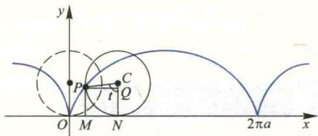
  <figcaption>图 1.1 旋轮线（摆线）</figcaption>
</figure>

这样一来，我们通过变量 $t$ 把 $x$ 与 $y$ 联系了起来。从而知方程

$$
\begin{cases}
x = a(t - \sin t), \\
y = a(1 - \cos t),
\end{cases} \quad t \in (-\infty, +\infty) \tag{1.2}
$$

就是摆线的参数方程，也就是 $y$ 与 $x$ 函数关系的参数表达式。$t \in [0, 2\pi]$ 对应于摆线的一拱。
</Solution>

<Example title="椭圆的参数方程">

设椭圆的两半轴长分别为 $a$ 与 $b$，求它的参数方程。
</Example>

<Solution title="解">

在平面解析几何中，已知两半轴长分别为 $a$ 与 $b$ 的椭圆标准方程为

$$
\frac{x^2}{a^2} + \frac{y^2}{b^2} = 1.
$$

令

$$
\frac{x^2}{a^2} = \cos^2 t,
$$

从而

$$
\frac{y^2}{b^2} = 1 - \cos^2 t = \sin^2 t.
$$

于是可得此椭圆的参数方程为

$$
\begin{cases}
x = a \cos t, \\
y = b \sin t,
\end{cases} \quad 0 \le t \le 2\pi. \tag{1.3}
$$
它也就是椭圆上动点坐标 $y$ 与 $x$ 函数关系的参数表示式。
</Solution>

<SideNote title="注意">

应当指出，同一条曲线，由于参数选取不同，可以有不同的参数方程。例如，对于圆圆 $x^2 + y^2 = a^2$，若取参数 $t$ 为圆心角，则它的参数方程为

$$
\begin{cases}
x = a \cos t, \\
y = a \sin t,
\end{cases} \quad 0 \le t \le 2\pi.
$$

若取 $t = x$，则上半圆与下半圆的参数方程分别为

$$
\begin{cases}
x = t, \\
y = \sqrt{a^2 - t^2},
\end{cases} (-a \le t \le a), \quad \text{和} \quad 
\begin{cases}
x = t, \\
y = -\sqrt{a^2 - t^2},
\end{cases} (-a < t < a).
$$
</SideNote>

---

### 二、函数的极坐标表示

在平面直角坐标系中，我们建立了平面上的点 $P$ 与二元有序数组 $(x, y)$ 之间的一一对应关系。建立这种对应关系的坐标系除了 Descartes 直角坐标系外，还有其他的坐标系，其中常见的是下面讲到的极坐标系。

在平面上取一个定点 $O$，称为极点，从该点引一条具有长度单位的半直线 $Ox$，称为极轴，通常极轴水平向右，与平面直角坐标系中的 $x$ 轴一致，这样就在此平面上建立了极坐标系。

对平面上任意一点 $P$，将线段 $OP$ 的长度记为 $\rho$，称为极径，从极轴 $Ox$ 开始按逆时针方向旋转到射线 $OP$ 的转角记作 $\varphi$，称为极角。如果点 $P$ 就是极点 $O$，则其极径 $\rho = 0$，极角 $\varphi$ 可以取任意值。如果限制 $\varphi \in [0, 2\pi), \rho \ge 0$，那么除极点外，平面上任一点 $P$ 便有唯一的有序数组 $(\rho, \varphi)$ 与之对应；反之，任给一数组 $(\rho, \varphi)$，以 $\varphi$ 为极角，$\rho$ 为极径，必有唯一的点与之对应。因此，我们把 $(\rho, \varphi)$ 称为点 $P$ 的极坐标。规定从极轴 $Ox$ 出发按逆时针方向旋转到射线 $OP$ 的角 $\varphi$ 取正值，而按顺时针旋转时 $\varphi$ 取负值。有时为了方便，也可将 $\varphi$ 限制在 $[-\pi, \pi]$。例如，点 $P\left(1, \frac{5}{4}\pi\right)$ 有时也可表示为 $\left(1, -\frac{3}{4}\pi\right)$（如图 1.2）。

<figure class="vp-figure">
  
  <figcaption>图 1.2</figcaption>
</figure>

在极坐标系中，$\rho = a$（常数）是一个方程，满足该方程的所有点到极点 $O$ 的距离都等于常数 $a$，而极角 $\varphi$ 可以取 $[0, 2\pi)$ 上的任一值，因此 $\rho = a$ 表示圆心在极点 $O$，半径为 $a$ 的圆周；类似分析，$\varphi = b$ 表示从极点出发、转角为 $b$ 的射线（如图 1.3）。

<figure class="vp-figure">
  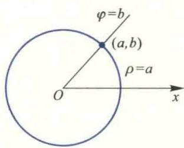
  <figcaption>图 1.3</figcaption>
</figure>

以极点 $O$ 为原点，极轴 $Ox$ 为 $x$ 轴正向，建立平面直角坐标系 $xOy$，则平面上的点 $P$ 同时具有直角坐标 $(x, y)$ 和极坐标 $(\rho, \varphi)$，且它们具有如下关系（图 1.4）：

$$
\begin{cases}
x = \rho \cos \varphi, \\
y = \rho \sin \varphi,
\end{cases} \quad \text{或} \quad 
\begin{cases}
\rho = \sqrt{x^2 + y^2}, \\
\tan \varphi = \frac{y}{x}.
\end{cases} \tag{1.4}
$$
<figure class="vp-figure">
  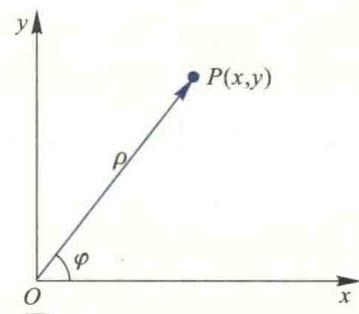
  <figcaption>图 1.4</figcaption>
</figure>

该式称为直角坐标与极坐标的转换公式。在以后应用中，我们可以根据需要，把在直角坐标系下给出的函数关系或方程转换为极坐标形式，也可把极坐标系下给出的函数关系或方程转化为直角坐标形式。

<Example title="方程转换与双纽线草图">

将方程 $(x^2 + y^2)^2 = 2a^2(x^2 - y^2)$ 转换为极坐标方程，并作出它的草图。
</Example>

<Solution title="解">

将直角坐标与极坐标的转换公式代入方程，得

$$
\rho^4 = 2a^2 \rho^2(\cos^2 \varphi - \sin^2 \varphi),
$$

即

$$
\rho^2 = 2a^2 \cos 2\varphi. \tag{1.5}
$$

在上面的方程中，由于 $\cos 2\varphi$ 关于 $\varphi$ 是偶函数，故此方程的图像关于极轴对称；又由于将 $\varphi$ 换成 $\varphi + \pi$ 后方程不改变，所以图像也关于极点对称。因此，我们只需要使用类似于直角坐标系中的描点法画出该方程在 $xOy$ 平面第一象限 $\{(\rho, \varphi) \mid \rho \ge 0, 0 \le \varphi \le \frac{\pi}{2}\}$ 中的图像，由对称性便可得到整个图像。由该方程容易算出下列数据：

| $\varphi$ | $0$ | $\frac{\pi}{6}$ | $\frac{\pi}{4}$ | $\left(\frac{\pi}{4}, \frac{\pi}{2}\right)$ |
| :---: | :---: | :---: | :---: | :---: |
| $\rho$ | $\sqrt{2}a$ | $a$ | $0$ | 无实根 |

对于表中 $(\rho, \varphi)$ 的每组数据，在平面上确定对应的点，用曲线连接，不难画出第一象限中的图像，再由对称性便得到方程的图像如图 1.5 所示。此曲线称为双纽线。

<figure class="vp-figure">
  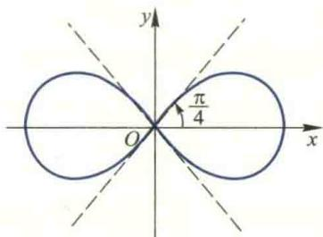
  <figcaption>图 1.5 双纽线</figcaption>
</figure>
</Solution>

<Example title="例 1.4 极坐标下的函数关系与作图">

将由极坐标给出的函数关系

$$
\rho = 2a \cos \varphi, \quad -\frac{\pi}{2} \le \varphi \le \frac{\pi}{2}
$$

转换成直角坐标，并作图。
</Example>

<Solution title="解">

由直角坐标与极坐标的转换公式 $\rho = \sqrt{x^2 + y^2}, x = \rho \cos \varphi$，两边同乘 $\rho$ 得 $\rho^2 = 2a \rho \cos \varphi$，代入得

$
x^2 + y^2 = 2ax, \quad \text{即} \quad (x - a)^2 + y^2 = a^2.
$

此方程表示以 $(a, 0)$ 为圆心、$a$ 为半径的圆周。
</Solution>

<Knowledge title="附录 2 常见曲线及其方程">

本附录系统整理了工科数学分析与高等数学中常见的平面曲线，涵盖幂函数、多项式、三角与反三角函数、超越函数、摆线族、螺线族、玫瑰线族以及各类著名几何曲线。各类曲线分别给出其直角坐标方程、参数方程或极坐标方程及典型特征图形。

</Knowledge>

---

### 一、 初等代数、指数与对数曲线

<Knowledge title="1. 幂函数">

曲线方程：$y = x^\alpha \quad (\alpha \text{ 是常数}, \alpha \ge 0, -\infty < x < ++\infty; \alpha < 0, -\infty < x < +\infty \text{ 且 } x \neq 0)$

<figure class="vp-figure">

<figcaption>图 1：幂函数曲线群 ($y=x^2, y=x, y=x^{1/2}, y=x^3, y=x^{-1}$)</figcaption>
</figure>
</Knowledge>

<Knowledge title="2. 指数函数">

曲线方程：$y = a^x \quad (a > 0, a \neq 1), (-\infty < x < +\infty)$

<figure class="vp-figure">
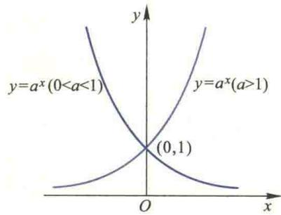
<figcaption>图 2：指数函数曲线 ($a>1$ 与 $0<a<1$)</figcaption>
</figure>
</Knowledge>

<Knowledge title="3. 对数函数">

曲线方程：$y = \log_a x \quad (a > 0, a \neq 1), (x > 0)$

<figure class="vp-figure">
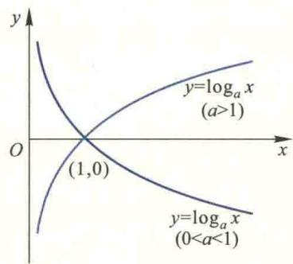
<figcaption>图 3：对数函数曲线 ($a>1$ 与 $0<a<1$)</figcaption>
</figure>
</Knowledge>

---

### 二、 三角函数与反三角函数曲线

<Knowledge title="4. 正弦函数">

曲线方程：$y = \sin x \quad (-\infty < x < +\infty)$

<figure class="vp-figure">
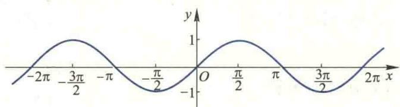
<figcaption>图 4：正弦曲线</figcaption>
</figure>
</Knowledge>

<Knowledge title="5. 余弦函数">

曲线方程：$y = \cos x \quad (-\infty < x < +\infty)$

<figure class="vp-figure">

<figcaption>图 5：余弦曲线</figcaption>
</figure>
</Knowledge>

<Knowledge title="6. 正切函数">

曲线方程：$y = \tan x \quad \left(x \neq k\pi + \frac{\pi}{2}, k \in \mathbb{Z}\right)$

<figure class="vp-figure">
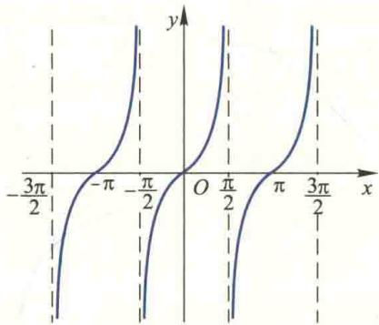
<figcaption>图 6：正切曲线</figcaption>
</figure>
</Knowledge>

<Knowledge title="7. 余切函数">

曲线方程：$y = \cot x \quad (x \neq k\pi, k \in \mathbb{Z})$

<figure class="vp-figure">

<figcaption>图 7：余切曲线</figcaption>
</figure>
</Knowledge>

<Knowledge title="8. 正割函数">

曲线方程：$y = \sec x = \frac{1}{\cos x} \quad \left(x \neq k\pi + \frac{\pi}{2}, k \in \mathbb{Z}\right)$

<figure class="vp-figure">
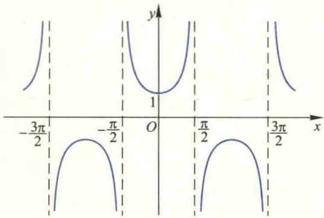
<figcaption>图 8：正割曲线</figcaption>
</figure>
</Knowledge>

<Knowledge title="9. 余割函数">

曲线方程：$y = \csc x = \frac{1}{\sin x} \quad (x \neq k\pi, k \in \mathbb{Z})$

<figure class="vp-figure">

<figcaption>图 9：余割曲线</figcaption>
</figure>
</Knowledge>

---

### 三、 代数曲线与超越曲线（续）

<Knowledge title="10. 半立方抛物线（Neil抛物线）">

曲线方程：$y^2 = ax^3 \quad (a > 0)$

<figure class="vp-figure">

<figcaption>图 10：半立方抛物线</figcaption>
</figure>
</Knowledge>

<Knowledge title="11. 箕舌线（Witch of Agnesi）">

曲线方程：$y = \frac{8a^3}{x^2 + 4a^2}$

<figure class="vp-figure">

<figcaption>图 11：箕舌线</figcaption>
</figure>
</Knowledge>

<Knowledge title="12. 概率曲线（高斯曲线）">

曲线方程：$y = e^{-x^2}$

<figure class="vp-figure">

<figcaption>图 12：概率曲线</figcaption>
</figure>
</Knowledge>

<Knowledge title="13. 悬链线（Catenary）">

曲线方程：$y = \frac{a}{2}\left(e^{\frac{x}{a}} + e^{-\frac{x}{a}}\right) = a \cosh \frac{x}{a}$

<figure class="vp-figure">

<figcaption>图 13：悬链线</figcaption>
</figure>
</Knowledge>

<Knowledge title="14. 摆线（Cycloid）">

参数方程：

$$
\begin{cases}
x = a(\theta - \sin \theta) \\
y = a(1 - \cos \theta)
\end{cases}
$$

直角坐标方程：

$$
x = a \arccos \frac{a-y}{a} \mp \sqrt{2ay - y^2}
$$

<figure class="vp-figure">

<figcaption>图 14：摆线及其生成几何</figcaption>
</figure>
</Knowledge>

<Knowledge title="15. 蔓叶线（Cissoid of Diocles）">

直角坐标方程：$y^2(2a - x) = x^3$

<figure class="vp-figure">
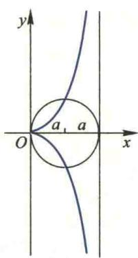
<figcaption>图 15：蔓叶线</figcaption>
</figure>
</Knowledge>

<Knowledge title="16. 星形线（Astroide）">

参数方程：

$$
\begin{cases}
x = a \cos^3 \theta \\
y = a \sin^3 \theta
\end{cases}
$$

直角坐标方程：$x^{\frac{2}{3}} + y^{\frac{2}{3}} = a^{\frac{2}{3}}$

<figure class="vp-figure">

<figcaption>图 16：星形线</figcaption>
</figure>
</Knowledge>

<Knowledge title="17. 心形线（Cardioid）">

极坐标方程：$\rho = a(1 - \cos \theta)$
直角坐标方程：$(x^2 + y^2 + ax)^2 = a^2(x^2 + y^2)$

<figure class="vp-figure">

<figcaption>图 17：心形线</figcaption>
</figure>
</Knowledge>

<Knowledge title="18. 笛卡儿叶形线（Folium of Descartes）">

直角坐标方程：$x^3 + y^3 - 3axy = 0$

<figure class="vp-figure">

<figcaption>图 18：笛卡儿叶形线</figcaption>
</figure>
</Knowledge>

<Knowledge title="19. 一般抛物线">

曲线方程：$x^{\frac{1}{2}} + y^{\frac{1}{2}} = a^{\frac{1}{2}}$

<figure class="vp-figure">
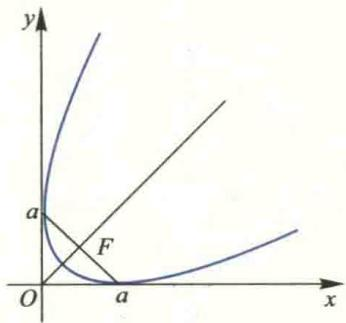
<figcaption>图 19：根式抛物线</figcaption>
</figure>
</Knowledge>

---

### 四、 螺线与玫瑰线族

<Knowledge title="20. 阿基米德螺线（Archimedean Spiral）">

极坐标方程：$\rho = a\theta$

<figure class="vp-figure">
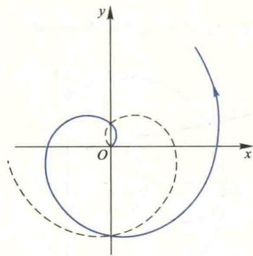
<figcaption>图 20：阿基米德螺线</figcaption>
</figure>
</Knowledge>

<Knowledge title="21. 对数螺线（Logarithmic Spiral）">

极坐标方程：$\rho = e^{a\theta}$

<figure class="vp-figure">

<figcaption>图 21：对数螺线</figcaption>
</figure>
</Knowledge>

<Knowledge title="22. 双曲螺线（Hyperbolic Spiral）">

极坐标方程：$\rho\theta = a$

<figure class="vp-figure">
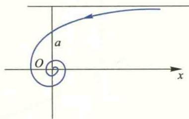
<figcaption>图 22：双曲螺线</figcaption>
</figure>
</Knowledge>

<Knowledge title="23. 对称双纽线（Lemniscate of Bernoulli）">

极坐标方程：$\rho^2 = a^2 \cos 2\theta$
直角坐标方程：$(x^2 + y^2)^2 = a^2(x^2 - y^2)$

<figure class="vp-figure">

<figcaption>图 23：伯努利双纽线（余弦型）</figcaption>
</figure>
</Knowledge>

<Knowledge title="24. 另一类双纽线">

极坐标方程：$\rho^2 = a^2 \sin 2\theta$
直角坐标方程：$(x^2 + y^2)^2 = 2a^2xy$

<figure class="vp-figure">
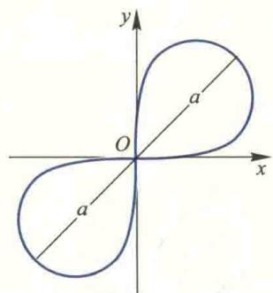
<figcaption>图 24：双纽线（正弦型）</figcaption>
</figure>
</Knowledge>

<Knowledge title="25. 三叶玫瑰线（余弦型）">

极坐标方程：$\rho = a \cos 3\theta$

<figure class="vp-figure">
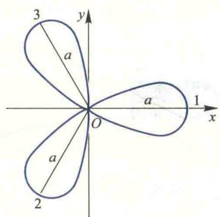
<figcaption>图 25：三叶玫瑰线 ($\rho = a\cos 3\theta$)</figcaption>
</figure>
</Knowledge>

<Knowledge title="26. 三叶玫瑰线（正弦型）">

极坐标方程：$\rho = a \sin 3\theta$

<figure class="vp-figure">

<figcaption>图 26：三叶玫瑰线 ($\rho = a\sin 3\theta$)</figcaption>
</figure>
</Knowledge>
