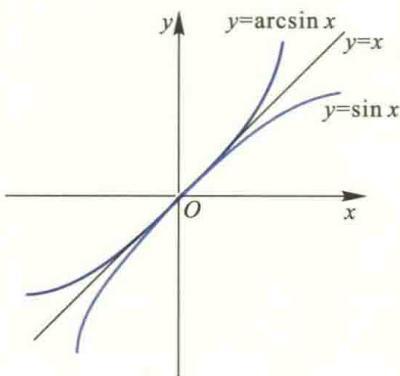
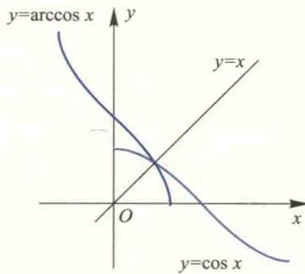
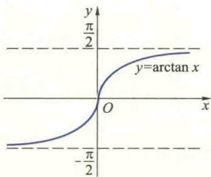
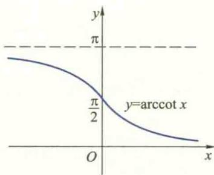
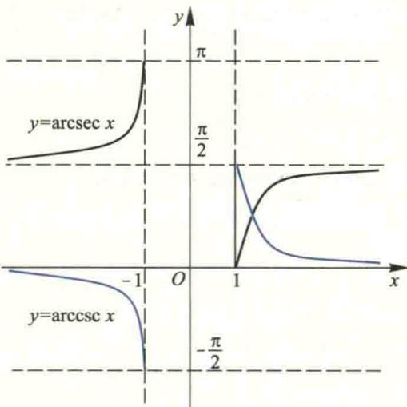

import Guide from '@/components/Guide.astro';
import Knowledge from '@/components/Knowledge.astro';
import Example from '@/components/Example.astro';
import Analysis from '@/components/Analysis.astro';
import Solution from '@/components/Solution.astro';
import Variant from '@/components/Variant.astro';
import Note from '@/components/Note.astro';
import Block from '@/components/Block.astro';
import Method from '@/components/Method.astro';
import Exercise from '@/components/Exercise.astro';

## 附录 3 常用的三角函数公式

## 一、三角函数的和差与积的关系式

1. $2\sin \alpha\cos \beta=\sin (\alpha+\beta)+\sin (\alpha-\beta)$ .

2. $2\cos\alpha\sin\beta=\sin(\alpha+\beta)-\sin(\alpha-\beta)$ .

3. $2\cos\alpha\cos\beta=\cos(\alpha+\beta)+\cos(\alpha-\beta)$ .

4. $-2\sin\alpha\sin\beta=\cos(\alpha+\beta)-\cos(\alpha-\beta)$ .

5. $\sin\alpha+\sin\beta=2\sin\frac{\alpha+\beta}{2}\cos\frac{\alpha-\beta}{2}.$

6. $\sin\alpha-\sin\beta=2\cos\frac{\alpha+\beta}{2}\sin\frac{\alpha-\beta}{2}.$

7. $\cos\alpha+\cos\beta=2\cos\frac{\alpha+\beta}{2}\cos\frac{\alpha-\beta}{2}.$

8. $\cos\alpha-\cos\beta=-2\sin\frac{\alpha+\beta}{2}\sin\frac{\alpha-\beta}{2}.$

## 二、倍角公式与半角公式

1. $\sin^{2}\alpha=\frac{1}{2}(1-\cos2\alpha)$ .

2. $\cos^{2}\alpha=\frac{1}{2}(1+\cos2\alpha)$ .

3. $\sin\alpha=\frac{2\tan\frac{\alpha}{2}}{1+\tan^{2}\frac{\alpha}{2}}.$

4. $\cos\alpha=\frac{1-\tan^{2}\frac{\alpha}{2}}{1+\tan^{2}\frac{\alpha}{2}}.$

## 附录 4 反三角函数定义及其图形

反三角函数是一类基本初等函数,是三角函数中的反正弦函数、反余弦函数、反正切函数、反余切函数、反正割函数、反余割函数的统称.

## 一、反三角函数的概念

### 1. 反正弦函数

正弦函数 $y = \sin x$ 在整个定义域区间 $(- \infty, + \infty)$ 上不是单调函数，但是在 $\left[-\frac{\pi}{2}, \frac{\pi}{2}\right]$ 上是严格单调增函数，因此它在此区间上存在反函数，它的反函数称为反正弦函数，记作 $x = \arcsin y$ . 习惯上，用 $x$ 表示自变量， $y$ 表示因变量，所以反正弦函数写为 $y = \arcsin x$ ，其定义域为 $x \in [-1, 1]$ ，值域为 $y \in \left[-\frac{\pi}{2}, \frac{\pi}{2}\right]$ . 反正弦函数的图像和正弦函数在 $\left[-\frac{\pi}{2}, \frac{\pi}{2}\right]$ 上的图像关于直线 $y = x$ 对称，如图4.1.

<Note>
反正弦函数只对正弦函数 $y = \sin x$ 的 $x \in \left[-\frac{\pi}{2}, \frac{\pi}{2}\right]$ 区间成立, 这里截取的是正弦函数靠近原点的一个单调区间, 称该区间为正弦函数的主值区间.
</Note>

### 2. 反余弦函数

余弦函数 $y=\cos x$ 限制在 $x\in[0,\pi]$ 上是严格单调减函数, 因此在此区间上存在反函数,称为反余弦函数,记为 $y=\arccos x$ , 其中定义域为 $x\in[-1,1]$ , 值域为 $y\in[0,\pi]$ .
反余弦函数及余弦函数的图像如图4.2.

  
图4.1

  
图4.2

### 3. 反正切函数

正切函数 $y=\tan x$ 限制在 $x\in\left(-\frac{\pi}{2},\frac{\pi}{2}\right)$ 上是严格单调增函数, 因此在此区间上存在反函数, 称为反正切函数, 记为 $y=\arctan x$ , 其中定义域为 $x\in(-\infty,+\infty)$ , 值域为 $y\in\left(-\frac{\pi}{2},\frac{\pi}{2}\right)$ . 反正切函数的图像如图4.3. 显然, 反正切函数有两条渐近线 $y=-\frac{\pi}{2}$ 和 $y=\frac{\pi}{2}$ .

### 4. 反余切函数

余切函数 $y=\cot x$ 限制在 $x\in(0,\pi)$ 上是严格单调减函数，因此在此区间上存在反函数，称为反余切函数，记为 $y=\operatorname{arccot}x$ ，其定义域为 $x\in(-\infty,+\infty)$ ，值域为 $y\in(0,\pi)$ 。反余切函数的图像如图4.4。反余切函数有两条渐近线 y=0 和 $y=\pi$ 。

  
图 4.3

  
图4.4

### 5. 反正割函数

正割函数 $y = \sec x$ 限制在 $x\in \left[0,\frac{\pi}{2}\right)\cup \left(\frac{\pi}{2},\pi \right]$ 上的反函数称为反正割函数，记为 $y = \operatorname{arcsec} x$ ，其定义域为 $x \in (-\infty, -1] \cup [1, +\infty)$ ，值域为 $y \in \left[0, \frac{\pi}{2}\right) \cup \left(\frac{\pi}{2}, \pi\right]$ . 反正割函数的图像如图4.5中的黑色曲线.

### 6. 反余割函数

余割函数 $y = \csc x$ 限制在 $x \in \left[-\frac{\pi}{2}, 0\right) \cup \left(0, \frac{\pi}{2}\right]$ 上的反函数称为反余割函数，记为 $y = \operatorname{arccsc} x$ ，其定义域为 $x \in (-\infty, -1] \cup [1, +\infty)$ ，值域为 $y \in \left[-\frac{\pi}{2}, 0\right) \cup \left(0, \frac{\pi}{2}\right]$ . 反余割函数的图像如图4.5中的蓝色曲线.

  
图4.5

## 二、反三角函数间的运算关系

### 1. 余角关系

(1) $\arccos x = \frac{\pi}{2} - \arcsin x$ ;

(2) $\operatorname{arccot} x = \frac{\pi}{2} - \arctan x$ ;

(3) $\operatorname{arccsc} x = \frac{\pi}{2} - \operatorname{arcsec} x$ .

### 2. 负数关系

(1) $\arcsin(-x)=-\arcsin x;$

(2) $\arccos (-x) = \pi -\arccos x;$

(3) $\arctan(-x)=-\arctan x;$

(4) $\operatorname{arccot}(-x)=\pi-\operatorname{arccot}x;$

(5) $\operatorname{arcsec}(-x) = \pi - \operatorname{arcsec} x$ ;

(6) $\operatorname{arccsc}(-x) = -\operatorname{arccsc} x$ .

### 3. 倒数关系

(1) $\arccos \frac{1}{x} = \operatorname{arcsec} x$ ;

(2) $\arcsin \frac{1}{x} = \operatorname{arccsc} x$ ;

(3) $\arctan\frac{1}{x}=\frac{\pi}{2}-\arctan x=\operatorname{arccot}x,\quad x>0;$

(4) $\arctan\frac{1}{x}=-\frac{\pi}{2}-\arctan x=-\pi+\operatorname{arccot}x,\quad x<0;$

(5) $\operatorname{arccot} \frac{1}{x} = \frac{\pi}{2} - \operatorname{arccot} x = \arctan x, \quad x > 0$ ;

(6) $\operatorname{arccot} \frac{1}{x} = \frac{3\pi}{2} - \operatorname{arccot} x = \pi + \arctan x, \quad x < 0;$

(7) arcsec $\frac{1}{x}$ =arccos x;

(8) $\operatorname{arccsc} \frac{1}{x} = \arcsin x$ .

### 4. 转化关系

(1) $\arccos x = \arcsin \sqrt{1 - x^2}, 0 \leqslant x \leqslant 1$ ;

(2) $\arctan x = \arcsin \frac{x}{\sqrt{1 + x^2}};$

(3) $\arcsin x = 2\arctan \frac{x}{1 + \sqrt{1 - x^2}};$

(4) $\arccos x = 2\arctan \frac{\sqrt{1 - x^2}}{1 + x}, -1 < x \leqslant 1;$

(5) $\arctan x = 2\arctan \frac{x}{1 + \sqrt{1 + x^2}}.$
