import Guide from '@/components/Guide.astro';
import Knowledge from '@/components/Knowledge.astro';
import Example from '@/components/Example.astro';
import Analysis from '@/components/Analysis.astro';
import Solution from '@/components/Solution.astro';
import Variant from '@/components/Variant.astro';
import Note from '@/components/Note.astro';
import Block from '@/components/Block.astro';
import Method from '@/components/Method.astro';

## 附录 部分曲面和空间立体的图形

为了增强读者的空间想象能力,便于计算多元函数的积分,我们选择了部分曲面和空间立体的图形附在下面,供查阅和选用.

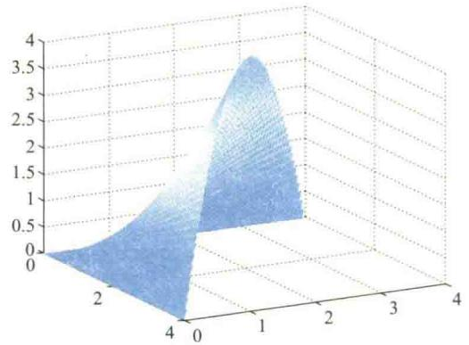

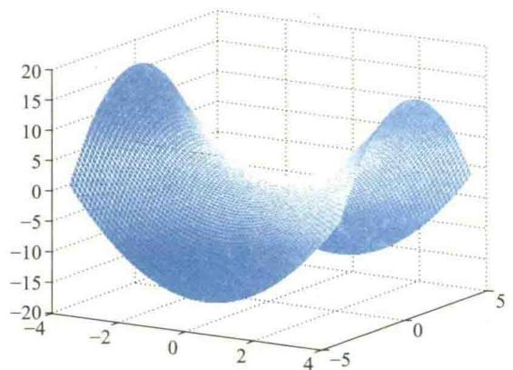

3. $z = x^{2} + y^{3}$

4. $z=\ln(x^{2}+y^{2}-1)$  

5. $z=e^{-y}\cos x$  

$$

z = \frac {x y (x ^ {2} - y ^ {2})}{x ^ {2} + y ^ {2}}

$$

7. $z=\cos(x-y)$  

$$

f (x, y) = \frac {\sin (x ^ {2} + y ^ {2})}{x ^ {2} + y ^ {2}} (- 4 \leqslant x \leqslant 4, - 4 \leqslant y \leqslant 4)

$$

9. 由 $x^{2} + y^{2} = R^{2}, x^{2} + z^{2} = R^{2}$ 所围成立体在第一卦限的图形.

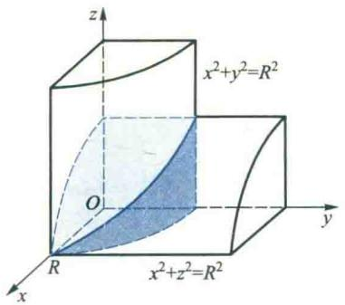

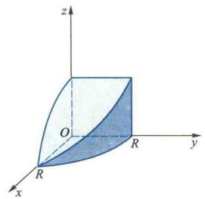

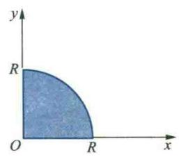

10. 由 $x^{2} + y^{2} + z^{2} = R^{2}, z = \sqrt{x^{2} + y^{2}}, y = x, y = 2x, z = 0$ 在第一卦限部分所围成立体的图形.

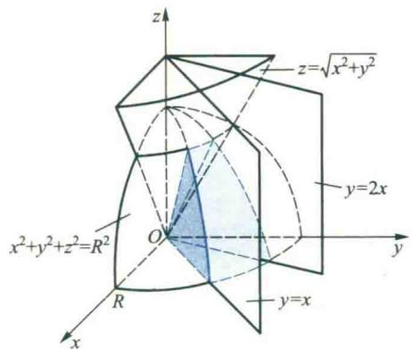

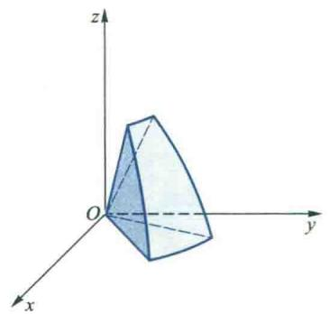

11. 由 $x^{2} + y^{2} + z^{2} = R^{2}, z = \sqrt{x^{2} + y^{2}}, y = x, x = 0, z = 0$ 在第一卦限部分所围成立体的图形.

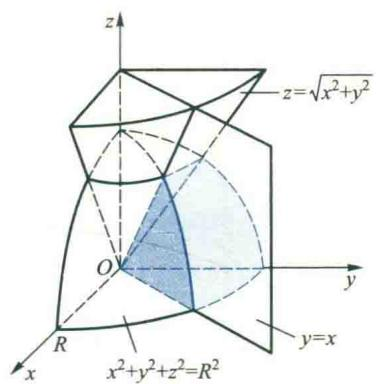

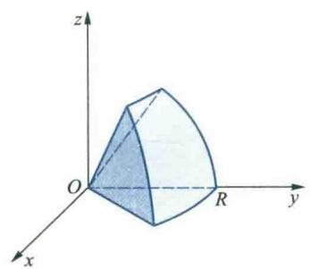

12. 由曲面 $x^{2} + y^{2} + z^{2} = R^{2}$ 与 $x^{2} + y^{2} = 2ax$ 所围成立体在第一卦限的图形, 其中 $R = 2a$ .

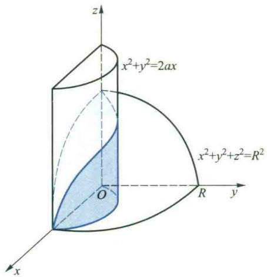

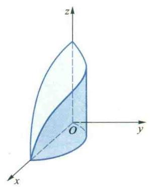

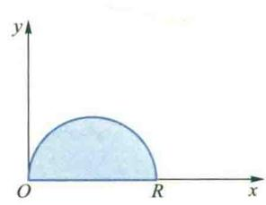

13. 由曲面 $x^{2} + y^{2} + z^{2} = R^{2}$ 与 $x^{2} + y^{2} = 2ax$ 所围成立体在第一卦限的图形, 其中 $R > 2a$ .

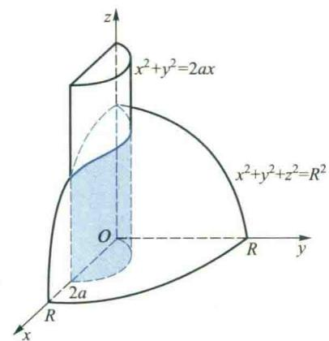

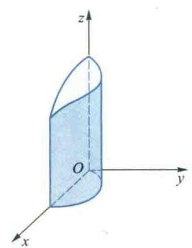

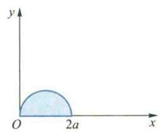

14. 由曲面 $x^{2} + y^{2} + z^{2} = R^{2}$ 与 $x^{2} + y^{2} = 2ax$ 所围成立体在第一卦限的图形, 其中 $\sqrt{2} a < R < 2a$ .

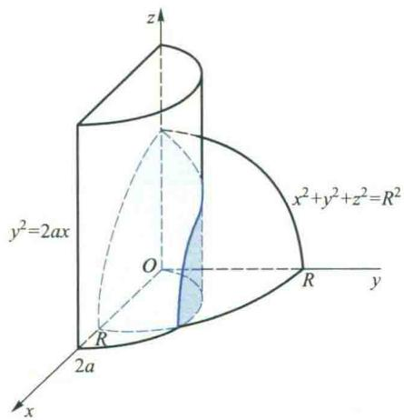

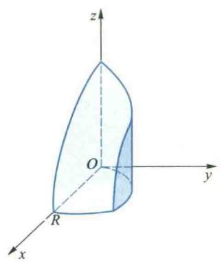

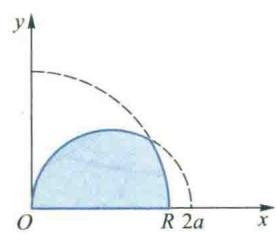

15. 由曲面 $x^{2} + y^{2} + z^{2} = R^{2}$ 与 $x^{2} + y^{2} = 2ax$ 所围成立体在第一卦限的图形, 其中 $R \leqslant \sqrt{2} a$ .

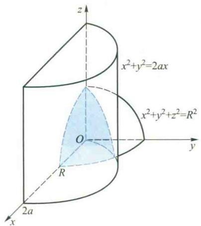

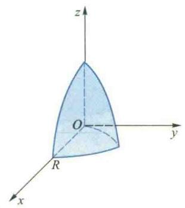

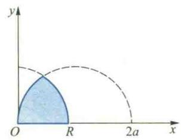

16. 由 $z=\sqrt{x^{2}+y^{2}}$ , z=1, z=2 所围成的立体图形.

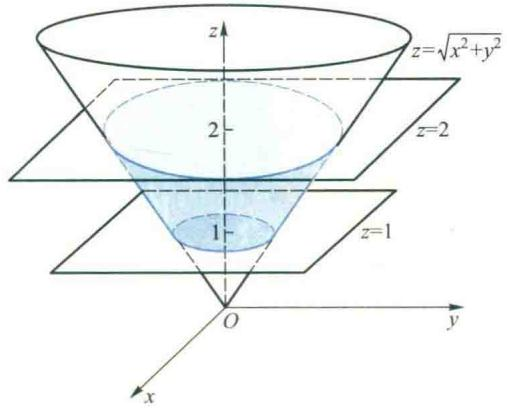

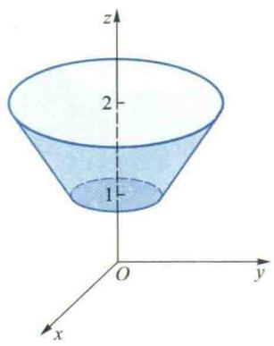

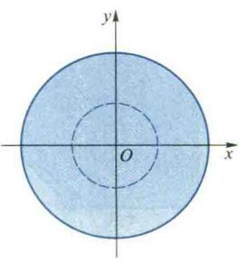

17. 由 $z = \sqrt{x^2 + y^2}, x + y = 1, x = 0, y = 0, z = 0$ 围成的立体图形.

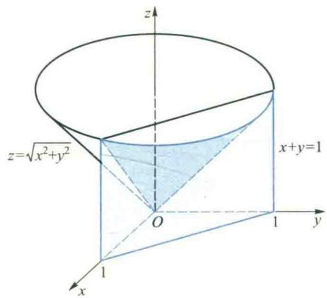

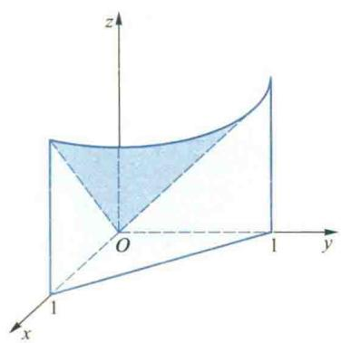

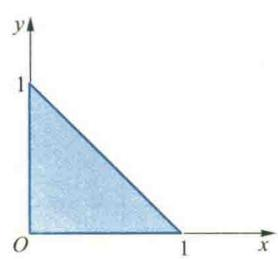

18. 由 $z = \sqrt{x^2 + y^2}, x^2 + y^2 = 2x, z = 0$ 所围成立体在第一卦限中的图形.

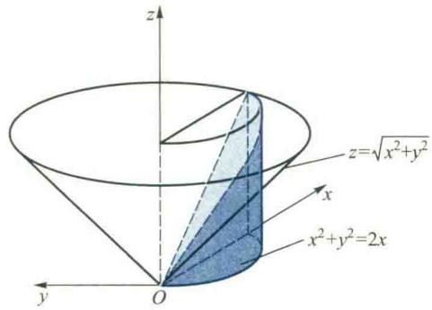

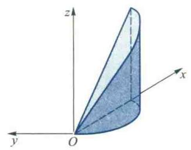

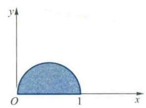

19. 由 $z = x^{2} + y^{2}, x = 1, y = 1$ 与 $x = 0, y = 0, z = 0$ 所围成立体的图形.

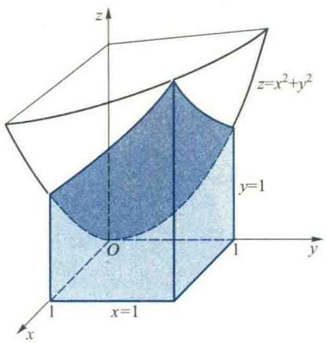

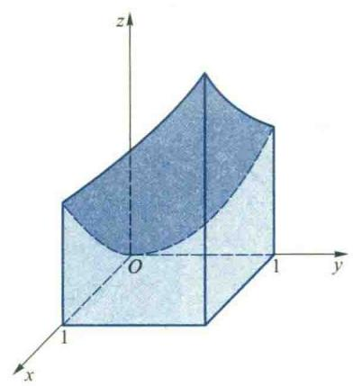

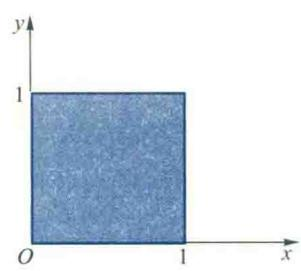

20. 由 $x^{2} + z^{2} = a^{2}, x + y = a, x = 0, y = 0, z = 0$ 在第一卦限围成立体的图形.

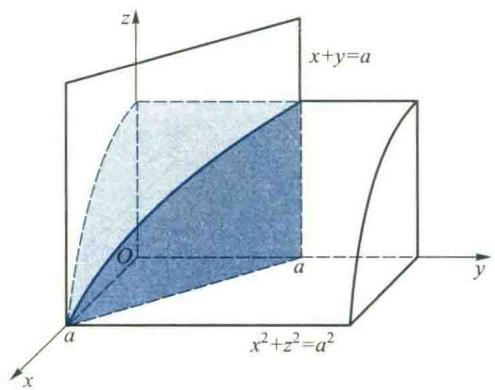

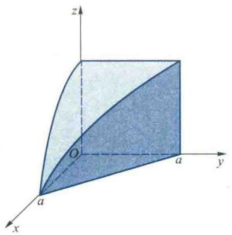

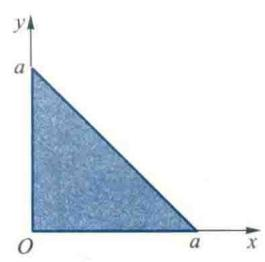

21. 由 $z = 1 - y^2, x + y = 1, x = 0, y = 0, z = 0$ 在第一卦限所围成立体的图形.

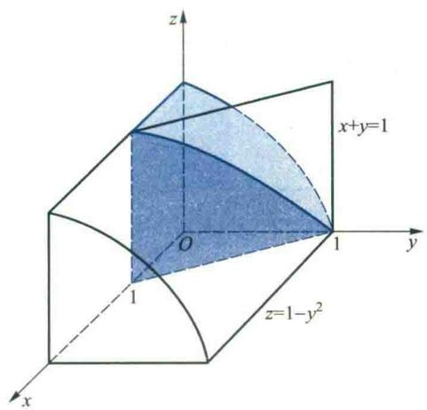

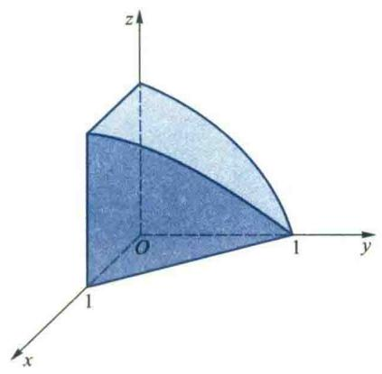

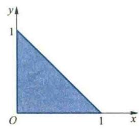

22. 由 $z = x^{2} + y^{2}, z = 1 - x^{2}$ 所围成的立体在第一卦限的图形.

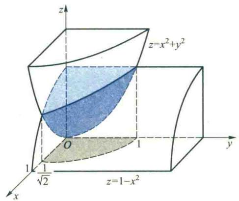

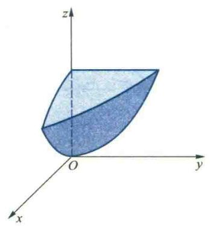

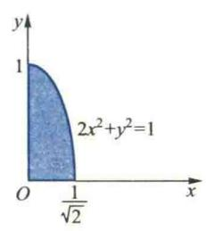

23. 由 $y=x^{2}, z=1-y^{2}, z=0$ 所围成立体的图形.

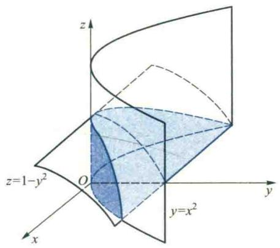

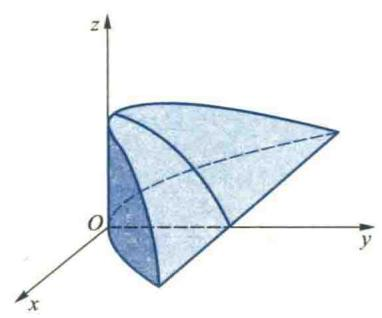

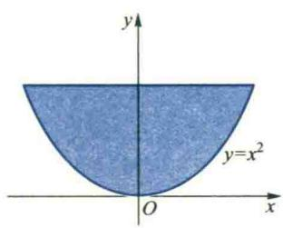

24. 由曲面 $z = xy, x + y = 1$ 与 $z = 0$ 所围成的立体图形.

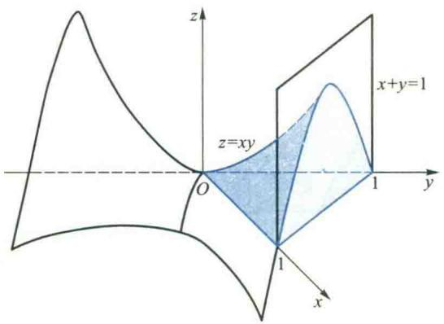

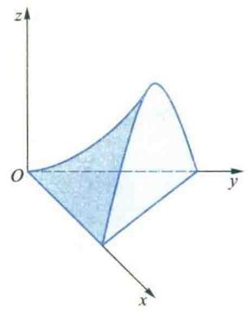

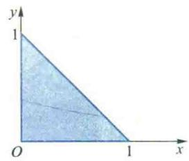

25. 由 $z = x^{2} - y^{2}, z = 0, x = 1$ 所围成立体的图形.

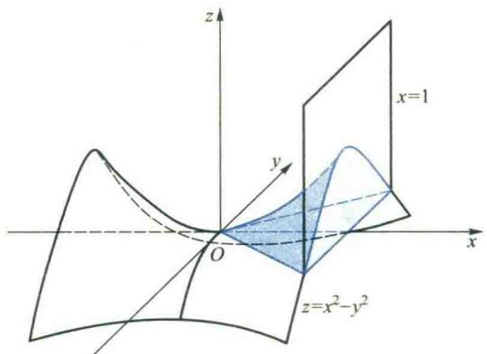

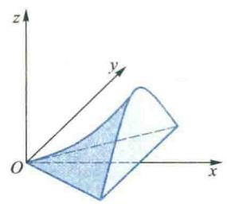

