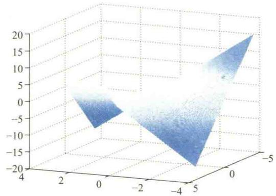
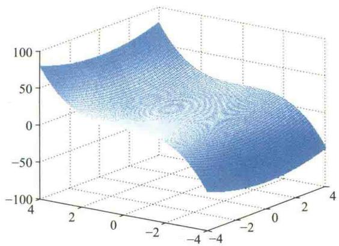
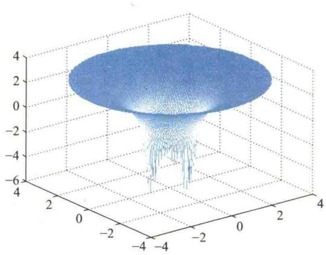
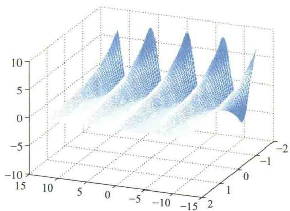
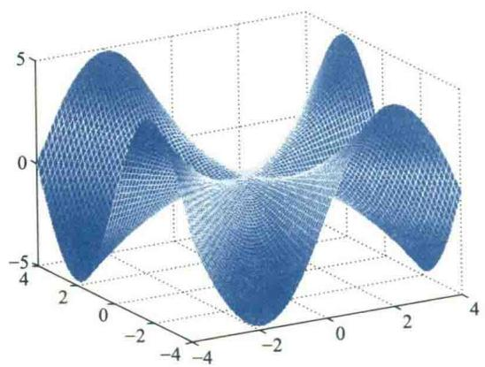
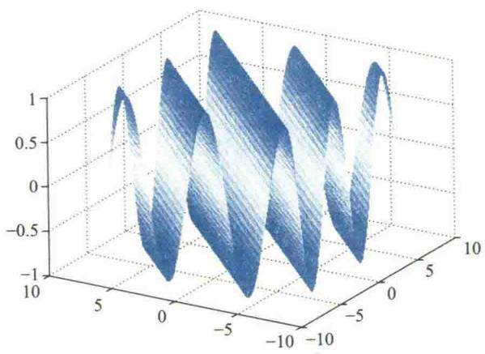
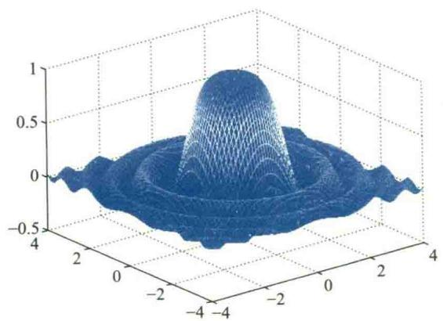
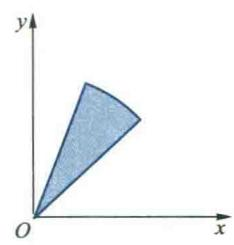
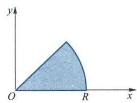

import Guide from '@/components/Guide.astro';
import Knowledge from '@/components/Knowledge.astro';
import Example from '@/components/Example.astro';
import Analysis from '@/components/Analysis.astro';
import Solution from '@/components/Solution.astro';
import Variant from '@/components/Variant.astro';
import Note from '@/components/Note.astro';
import SideNote from '@/components/SideNote.astro';
import Block from '@/components/Block.astro';
import Method from '@/components/Method.astro';

为了增强读者的空间想象力，便于计算多元函数的积分，本附录列出了部分曲面和空间立体的图形，供查阅和选用。

<Knowledge title="1. 双曲抛物面（马鞍面） $z = xy$">
<SideNote title="几何特征">
图形呈马鞍形，原点 $(0,0,0)$ 为其鞍点。在原点处，曲面沿不同方向向上或向下弯曲。
</SideNote>

<figure class="vp-figure">

<figcaption>图 1：$z = xy$ 的两种不同视角曲面图形（含马鞍点特性）</figcaption>
</figure>
</Knowledge>

<Knowledge title="2. 双曲抛物面 $z = x^2 - y^2$">
<SideNote title="几何特征">
平行于 $xz$ 平面的截线为抛物线（开口向上），平行于 $yz$ 平面的截线为抛物线（开口向下）。
</SideNote>

<figure class="vp-figure">

<figcaption>图 2：双曲抛物面 $z = x^2 - y^2$</figcaption>
</figure>
</Knowledge>

<Knowledge title="3. 三次曲面 $z = x^2 + y^3$">
<figure class="vp-figure">

<figcaption>图 3：三次曲面 $z = x^2 + y^3$</figcaption>
</figure>
</Knowledge>

<Knowledge title="4. 对数曲面 $z = \ln(x^2 + y^2 - 1)$">
<SideNote title="定义域说明">
要求 $x^2 + y^2 > 1$，即在单位圆外部才有定义。当趋近于边界 $x^2 + y^2 = 1$ 时，$z \to -\infty$。
</SideNote>

<figure class="vp-figure">

<figcaption>图 4：对数曲面 $z = \ln(x^2 + y^2 - 1)$</figcaption>
</figure>
</Knowledge>

<Knowledge title="5. 复合三角曲面 $z = e^{-y} \cos x$">
<figure class="vp-figure">

<figcaption>图 5：$z = e^{-y} \cos x$</figcaption>
</figure>
</Knowledge>

<Knowledge title="6. 有理分式曲面 $z = \frac{xy(x^2 - y^2)}{x^2 + y^2}$">
<figure class="vp-figure">

<figcaption>图 6：$z = \frac{xy(x^2 - y^2)}{x^2 + y^2}$</figcaption>
</figure>
</Knowledge>

<Knowledge title="7. 余弦曲面 $z = \cos(x - y)$">
<figure class="vp-figure">

<figcaption>图 7：$z = \cos(x - y)$</figcaption>
</figure>
</Knowledge>

<Knowledge title="8. 帽状曲面 $f(x,y) = \frac{\sin(x^2 + y^2)}{x^2 + y^2}$">
<SideNote title="边界条件">
$-4 \leqslant x \leqslant 4$, $-4 \leqslant y \leqslant 4$
</SideNote>

<figure class="vp-figure">

<figcaption>图 8：帽状曲面 $f(x,y) = \frac{\sin(x^2 + y^2)}{x^2 + y^2}$</figcaption>
</figure>
</Knowledge>

<Knowledge title="9. 由 $x^2 + y^2 = R^2, x^2 + z^2 = R^2$ 所围成立体在第一卦限的图形">
<SideNote title="几何意义">
该立体由两个直交圆柱面在第一卦限内相交而成。
</SideNote>

<figure class="vp-figure">

<figcaption>图 9：两圆柱面相交在第一卦限的立体及投影</figcaption>
</figure>
</Knowledge>

<Knowledge title="10. 由 $x^2 + y^2 + z^2 = R^2, z = \sqrt{x^2 + y^2}, y = x, y = 2x, z = 0$ 在第一卦限部分所围成立体图形">
<figure class="vp-figure">

<figcaption>图 10：球面、圆锥面与平面相交的复合立体图形</figcaption>
</figure>
</Knowledge>

<Knowledge title="11. 由 $x^2 + y^2 + z^2 = R^2, z = \sqrt{x^2 + y^2}, y = x, x = 0, z = 0$ 在第一卦限部分所围成立体图形">
<figure class="vp-figure">

<figcaption>图 11：扇形空间立体及坐标面投影</figcaption>
</figure>
</Knowledge>

<Knowledge title="12. 由曲面 $x^2 + y^2 + z^2 = R^2$ 与 $x^2 + y^2 = 2ax$ 所围成立体在第一卦限的图形（其中 $R = 2a$）">
<figure class="vp-figure">

<figcaption>图 12：当 $R = 2a$ 时球面与圆柱面相贯体</figcaption>
</figure>
</Knowledge>

<Knowledge title="13. 由曲面 $x^2 + y^2 + z^2 = R^2$ 与 $x^2 + y^2 = 2ax$ 所围成立体在第一卦限的图形（其中 $R > 2a$）">
<figure class="vp-figure">
 2a 时的相贯立体" />
<figcaption>图 13：当 $R > 2a$ 时球面与圆柱面相贯体</figcaption>
</figure>
</Knowledge>

<Knowledge title="14. 由曲面 $x^2 + y^2 + z^2 = R^2$ 与 $x^2 + y^2 = 2ax$ 所围成立体在第一卦限的图形（其中 $\sqrt{2}a < R < 2a$）">
<figure class="vp-figure">

<figcaption>图 14：当 $\sqrt{2}a < R < 2a$ 时相贯立体图形</figcaption>
</figure>
</Knowledge>

<Knowledge title="15. 由曲面 $x^2 + y^2 + z^2 = R^2$ 与 $x^2 + y^2 = 2ax$ 所围成立体在第一卦限的图形（其中 $R \leqslant \sqrt{2}a$）">
<figure class="vp-figure">

<figcaption>图 15：当 $R \leqslant \sqrt{2}a$ 时相贯立体图形</figcaption>
</figure>
</Knowledge>

<Knowledge title="16. 由 $z = \sqrt{x^2 + y^2}, z = 1, z = 2$ 所围成的立体图形">
<SideNote title="几何特征">
这是一个截顶圆锥体（圆台形空腔或实体），由上下两个平行平面与圆锥面截得。
</SideNote>

<figure class="vp-figure">

<figcaption>图 16：圆锥台立体图形及其俯视投影</figcaption>
</figure>
</Knowledge>

<Knowledge title="17. 由 $z = \sqrt{x^2 + y^2}, x + y = 1, x = 0, y = 0, z = 0$ 围成的立体图形">
<figure class="vp-figure">

<figcaption>图 17：圆锥面与边界平面所围成的三维立体及其底平面投影</figcaption>
</figure>
</Knowledge>
