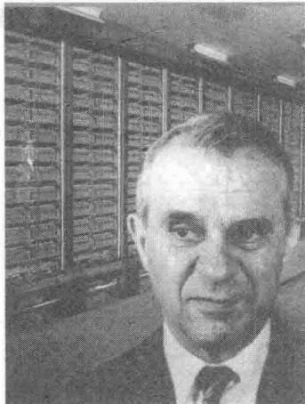

import Guide from '@/components/Guide.astro';
import Knowledge from '@/components/Knowledge.astro';
import Example from '@/components/Example.astro';
import Analysis from '@/components/Analysis.astro';
import Solution from '@/components/Solution.astro';
import Variant from '@/components/Variant.astro';
import Note from '@/components/Note.astro';
import Block from '@/components/Block.astro';
import Method from '@/components/Method.astro';
import Exercise from '@/components/Exercise.astro';

1949年夏末，哈佛大学教授列昂惕夫（Wassily Leontief）正在小心地将最后一部分穿孔卡片插入大学的MarkⅡ计算机。这些卡片包含了美国经济的信息，包括美国劳动统计局两年紧张工作所得到的总共25万多条信息。列昂惕夫把美国经济分解为500个部门，例如煤炭工业、汽车工业、交通系统，等等。对每个部门，他写出了一个描述该部门的产出如何分配给其他经济部门的线性方程。由于当时最大的计算机之一的MarkⅡ还不能处理所得到的包含500个未知数的500个方程的方程组，列昂惕夫只好把问题简化为包含42个未知数的42个方程的方程组。

为解列昂惕夫的 42 个方程，编写 Mark II 计算机程序需要几个月的工作，他急于知道计算机解这个问题需要多长时间。Mark II 计算机运算了 56 个小时，才得到最后的答案。我们将在 1.6 节和 2.6 节中讨论这个解的性质。

列昂惕夫获得了1973年诺贝尔经济学奖，他打开了经济数学建模的新时代的大门。1949年在哈佛的工作标志着应用计算机分析大规模数学模型的开始。从那以后，许多其他领域中的研究者应用计算机来分析数学模型。由于所涉及的数据数量庞大，这些模型通常是线性的，即它们是用线性方程组描述的。

线性代数在应用中的重要性随着计算机功能的增强而迅速增加，而每一代新的硬件和软件引发了对计算机能力的更大需求。因此，计算机科学就通过并行处理和大规模计算的爆炸性增长与线性代数密切联系在一起。

科学家和工程师正在研究大量极其复杂的问题，这在几十年前是不可想象的。今天，线性代数对许多科学技术和商业领域中的学生的重要性可以说超过了大学其他数学课程。本书中的材料是在许多有趣领域中作进一步研究的基础。这里举出几个例子，以后将列举其他一些领域。

\- 石油探测。当勘探船寻找海底石油储藏时，它的计算机每天要解几千个线性方程组。方程组的地震数据从气喷枪的爆炸引起水下冲击波获得。这些冲击波引起海底岩石的震动，并通过用几英里长的电缆拖在船后的地震测波器采集数据。

\- 线性规划。许多重要的管理决策是在线性规划模型的基础上做出的，这些模型包含几百个变量，例如，航运业使用线性规划调度航班、监视飞机的飞行位置，或计划维修和机场运作。

\- 电路．工程师使用仿真软件来设计电路和微芯片，它们包含数百万个晶体管．这样的软件技术依赖于线性代数方法与线性方程组.

线性方程组是线性代数的核心，本章使用它通过简单而具体的设置来引入线性代数的许多重要概念。1.1节和1.2节介绍求解线性方程组的一个系统方法，这个算法在全书的计算中都会用到。1.3节和1.4节指出线性方程组等价于向量方程与矩阵方程。这种等价性把向量的线性组合问题化为线性方程组的问题。线性表示、线性无关和线性变换的基本概念将在本章后半部分研究，它们在整本书中起着关键的作用，并使我们体会到线性代数的魅力和威力。
