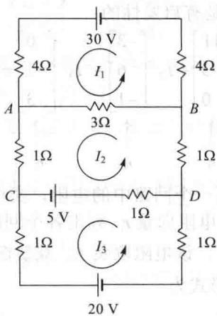
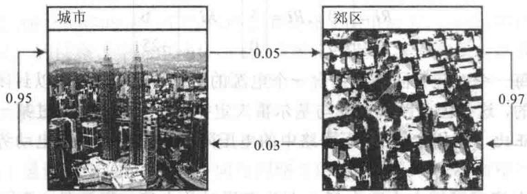
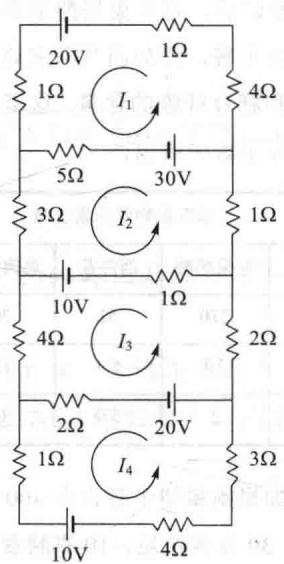
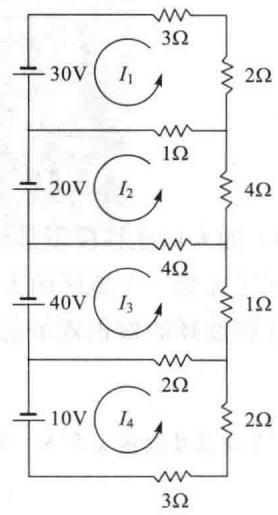
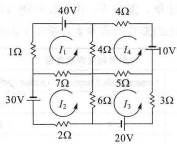
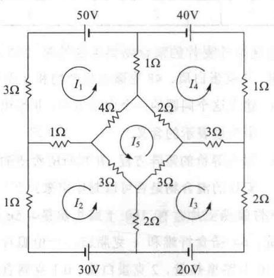
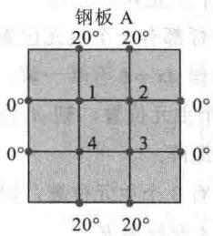
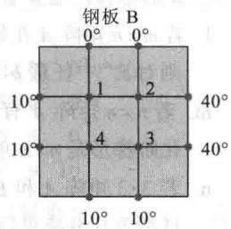

import Knowledge from '@/components/Knowledge.astro';
import Example from '@/components/Example.astro';
import Note from '@/components/Note.astro';
import Solution from '@/components/Solution.astro';
import Block from '@/components/Block.astro';

本节中的数学模型是线性的，也就是说，借助线性方程（通常利用向量或矩阵形式）来描述一个问题。第一个模型讨论营养，实际上代表线性规划问题的一般技术。第二个模型来自电学。第三个模型引进线性差分方程的概念，此概念是研究动力系统的有力工具，在工程、生态学、通信和管理科学中都有广泛应用。线性模型的重要性在于当涉及的变量被保持在合理的范围时，自然现象通常是线性或接近线性的。同时，线性模型比复杂的非线性模型更容易使用计算机运算来处理。

在阅读每一个模型时，注意线性模型如何体现所研究问题的相关性质.

## 构造有营养的减肥食谱

一种在20世纪80年代很流行的食谱称为剑桥食谱，是经过多年研究编制出来的。这是由Alan H. Howard博士领导的科学家团队经过8年对过度肥胖病人的临床研究，在剑桥大学完成的。这种低热量的粉状食品精确地平衡了碳水化合物、高质量的蛋白质和脂肪，并配合维生素、矿物质、微量元素和电解质。近年来，数百万人应用这一食谱实现了快速和有效的减肥。

为得到所希望的数量和比例的营养，Howard博士在食谱中加入了多种食品。每种食品供应了多种人体所需要的成分，然而没有按正确的比例。例如，脱脂牛奶是蛋白质的主要来源但包含过多的钙，因此大豆粉用来作为蛋白质的来源，它包含较少量的钙。然而，大豆粉包含过多的脂肪，因而加上乳清，因它含脂肪较少。然而乳清又含有过多的碳水化合物……

下例说明这个问题小规模的情形. 表 1-6 是该食谱中的 3 种食物以及 100 克每种食物成分含有某些营养素的数量.

表 1-6

<table><tr><td rowspan="2">营养素(克)</td><td colspan="3">每100克成分所含营养素</td><td rowspan="2">剑桥食谱每天供应量(克)</td></tr><tr><td>脱脂牛奶</td><td>大豆粉</td><td>乳清</td></tr><tr><td>蛋白质</td><td>36</td><td>51</td><td>13</td><td>33</td></tr><tr><td>碳水化合物</td><td>52</td><td>34</td><td>74</td><td>45</td></tr><tr><td>脂肪</td><td>0</td><td>7</td><td>1.1</td><td>3</td></tr></table>

<Example title="例 1">
求出脱脂牛奶、大豆粉和乳清的某种组合，使该食谱每天能供给表 1-6 中规定的蛋白质、碳水化合物和脂肪的含量.

<Solution title="解">
设 $x_{1}, x_{2}$ 和 $x_{3}$ 分别表示这些食物的数量（以 100 克为单位）。导出方程的一种方法是对每种营养素分别列出方程。例如，乘积

$$

\{x _ {1} \text {单位的脱脂牛奶} \} \{\text {每单位脱脂牛奶所含蛋白质} \}

$$

给出 $x_{1}$ 单位脱脂牛奶供给的蛋白质. 类似地加上大豆粉和乳清所含蛋白质, 就应该等于我们所需的蛋白质. 类似的计算对每种成分都可进行.

更有效的方法（概念上更为简单）是考虑每种食物的“营养素向量”而建立向量方程。 $x_{1}$ 单位的脱脂牛奶供给的营养素是下列标量乘法：

$$

\left\{ \begin{array}{l} {\text {   标量   }} \\ {\text {   脱脂牛奶   }} \end{array} \right. \cdot \left\{ \begin{array}{l} {\text {   向量   }} \\ {\text {   每单位脱脂   }} \\ {\text {   牛奶的营养素   }} \end{array} \right\} = x _ {1} a _ {1}\tag{1}

$$

其中 $a_{1}$ 是表 1-6 的第一列. 设 $a_{2}$ 和 $a_{3}$ 分别为大豆粉和乳清的对应向量, b 为表示所需要的营养素总量的向量（表中最后一列）. 则 $x_{2}a_{2}$ 和 $x_{3}a_{3}$ 分别给出由 $x_{2}$ 单位大豆粉和 $x_{3}$ 单位乳清给出的营养素. 所以所需的方程为

$$

x _ {1} \boldsymbol {a} _ {1} + x _ {2} \boldsymbol {a} _ {2} + x _ {3} \boldsymbol {a} _ {3} = \boldsymbol {b}\tag{2}

$$

把对应的方程组的增广矩阵行化简得

$$

\left[ \begin{array}{c c c c} 3 6 & 5 1 & 1 3 & 3 3 \\ 5 2 & 3 4 & 7 4 & 4 5 \\ 0 & 7 & 1. 1 & 3 \end{array} \right] \sim \dots \sim \left[ \begin{array}{c c c c} 1 & 0 & 0 & 0. 2 7 7 \\ 0 & 1 & 0 & 0. 3 9 2 \\ 0 & 0 & 1 & 0. 2 3 3 \end{array} \right]

$$

精确到 3 位小数，该食谱需要 0.277 单位脱脂牛奶、0.392 单位大豆粉、0.233 单位乳清，这样就可供给所需要的蛋白质、碳水化合物与脂肪。

重要的是，求出的 $x_{1}, x_{2}$ 和 $x_{3}$ 的值是非负的，这使求出的解有实际意义。（你如何用-0.233单位乳清？）由于对许多营养素都有要求，因此可能使用多种食物，以得到有“非负解”的方程组。因而为了得到这样的解，需要观察各种方程。事实上，剑桥食谱的制造者应用了33种食物来供给31种营养素。

由食谱构造问题产生线性方程（2），是因为由食物供给的营养素可写成一个向量的数量倍，如（1）式所示。即某种食物供给的营养素与加入食谱中的此种食物的数量成比例，同时，混合物中的营养素是各种食物中营养素之和。

设计某种特殊的人类或牲畜的食谱问题是经常遇到的，这通常被看作是线性规划技术。我们构造向量方程的方法常常可以使这些问题的求解得到简化。
</Solution>
</Example>

## 线性方程与电路网络

电路网络中的电流可由线性方程组描述. 电源（例如电池）促使电荷在网络中流动. 当电流通过电阻（例如灯泡、电动机等），一部分电压被“用掉”；由欧姆定律，这种“电压降”等于

$$

V = R I

$$

其中 V 以伏特量度，电阻 R 以欧姆量度（用 $\Omega$ 表示），电流 I 用安培量度.

图 1-47 中的网络包含 3 条闭合回路. 在回路 1,2,3 中流过的电流分别用 $I_{1}, I_{2}$ 和 $I_{3}$ 表示. 回路电流的指定方向是任意取定的. 若某一电流求出来是负值, 则表示实际电流方向与图中所选择的方向相反. 若所示的电流方向是由电池（+）的正极（长边）指向负极（短边), 则电压为正, 否则电压为负.

  

图 1-47

回路中电流服从下列定律.

## 基尔霍夫电压定律

围绕一条回路同一方向的电压降 $RI$ 的代数和等于围绕该回路的同一方向电动势的代数和.

<Example title="例 2">
确定图 1-47 中网络中的回路电流.

<Solution title="解">
对回路1，电流 $I_{1}$ 通过3个电阻，总电压降为

$$

4 I _ {1} + 4 I _ {1} + 3 I _ {1} = (4 + 4 + 3) I _ {1} = 1 1 I _ {1}

$$

回路2的电流流过回路1的一部分，即 $A$ 与 $B$ 之间的短分支，对应的RI电压降为 $3I_{2}$ 伏特．然而，回路1中分支AB之间的电流方向与回路2中该分支的电流方向相反，因此回路1中总的RI电压降为 $11I_{1} - 3I_{2}$ ，因回路1中的电动势为 $+30$ 伏特，故基尔霍夫电压定律给出

$$

1 1 I _ {1} - 3 I _ {2} = 3 0

$$

对回路2，方程为

$$

- 3 I _ {1} + 6 I _ {2} - I _ {3} = 5

$$

项 $-3I_{1}$ 来自回路1通过分支 $AB$ （电流方向与回路2的电流方向相反，故电压取负值）的电流，项 $6I_{2}$ 是回路2中所有电阻的和乘以回路电流. 项 $-I_{3} = -1 \cdot I_{3}$ 是由回路3的电流通过 $CD$ 分支1欧姆电阻引起的，与回路2电流方向相反. 回路3的方程为

$$

- I _ {2} + 3 I _ {3} = - 2 5

$$
</Solution>
</Example>

<Note>
分支 $CD$ 上的5伏特电池同时属于回路2与回路3，但对回路3，它是-5伏特，因它的方向与回路3所选择的方向相反.

所以这些电流可由解下列方程组得出：

$$

\begin{array}{r l} 1 1 I _ {1} - 3 I _ {2} & = 3 0 \\ - 3 I _ {1} + 6 I _ {2} - I _ {3} & = 5 \\ - I _ {2} + 3 I _ {3} & = - 2 5 \end{array}\tag{3}

$$

对增广矩阵作行变换得到解为 $I_{1}=3$ 安培， $I_{2}=1$ 安培， $I_{3}=-8$ 安培， $I_{3}$ 的负值表示回路 3 的实际电流方向与图 1-47 中所示相反.

把方程组（3）看作向量方程是有启发性的：

$$

\begin{array}{c c c c} I _ {1} & \left[ \begin{array}{l} 1 1 \\ - 3 \\ 0 \end{array} \right] + I _ {2} & \left[ \begin{array}{l} - 3 \\ 6 \\ - 1 \end{array} \right] + & I _ {3} & \left[ \begin{array}{l} 0 \\ - 1 \\ 3 \end{array} \right] = \left[ \begin{array}{l} 3 0 \\ 5 \\ - 2 5 \end{array} \right] \\ & \uparrow & \uparrow & \uparrow \\ & r _ {1} & r _ {2} & r _ {3} \\ & & & v \end{array}\tag{4}

$$

每个向量的第一个元素是在第一个回路中的电阻，类似地第二个、第三个元素分别是在第二、第三个回路中的电阻。第一个电阻向量 $r_1$ 列出各个回路中电流 $I_1$ 流过的电阻。当 $I_1$ 流过该电阻的方向与另一回路方向相反时，该电阻取负值。观察图 1-47，看看如何计算 $r_1$ 中的元素；然后同样求出 $r_2$ 和 $r_3$ 。（4）的矩阵形式为

$$

R \pmb {i} = \pmb {\nu}, \text {其中} R = \left[ \begin{array}{l l l} \pmb {r} _ {1} & \pmb {r} _ {2} & \pmb {r} _ {3} \end{array} \right], \pmb {i} = \left[ \begin{array}{l} I _ {1} \\ I _ {2} \\ I _ {3} \end{array} \right]

$$

该形式给出欧姆定律的矩阵形式. 若所有回路电流都选取同一方向, 则 $R$ 的非主对角线元素全部都是负值.

矩阵方程 $Ri = \nu$ 表明这个模型的线性. 例如, 若电压向量加倍, 则电流向量也加倍; 同时, 叠加原理也成立. 即方程 (4) 的解是下列方程的解的和:

$$

R \boldsymbol {i} = \left[ \begin{array}{c} 3 0 \\ 0 \\ 0 \end{array} \right], R \boldsymbol {i} = \left[ \begin{array}{c} 0 \\ 5 \\ 0 \end{array} \right], R \boldsymbol {i} = \left[ \begin{array}{c} 0 \\ 0 \\ - 2 5 \end{array} \right]

$$

这三个方程中的每一个对应于回路仅包含一个电源的网络（其他电源代以封闭该回路的导线）。电流模型是线性的，这是因为欧姆定律与基尔霍夫定律都是线性的：通过某一电阻的电压降与通过它的电流成正比（欧姆定律），而回路中的电压降的和等于回路中电动势的和（基尔霍夫定律）。

网络中回路电流可以决定电路中每一个分支通过的电流。若仅有一个回路电流通过该分支，例如图1-47中从 $B$ 到 $D$ 的分支，则通过该分支的电流等于回路电流。若有多个回路电流通过该分支，如从 $A$ 到 $B$ 的分支，则通过该分支的电流是各回路电流的代数和（基尔霍夫电流定律）。例如，通过分支 $AB$ 的电流为 $I_{1} - I_{2} = 3 - 1 = 2$ 安培，方向与 $I_{1}$ 相同。分支 $CD$ 中的电流为 $I_{2} + I_{3} = 9$ 安培。
</Note>

## 差分方程

在生态学、经济学和工程技术等领域中，需要研究随时间变化的动力系统，这种系统通常在离散的时刻测量，得到一个向量序列 $x_{0}, x_{1}, x_{2}, \cdots$ 。向量 $x_{k}$ 的各个元素给出该系统在第 k 次测量中的状态的信息。

如果有矩阵 A 使 $x_{1}=Ax_{0}, x_{2}=Ax_{1}$ ，一般地，

$$

\boldsymbol {x} _ {k + 1} = A \boldsymbol {x} _ {k}, \quad k = 0, 1, 2, \dots\tag{5}

$$

则（5）式称为线性差分方程（或递归关系）。给定这样一种关系，我们可由已知的 $x_{0}$ 计算 $x_{1}, x_{2}$ ，等等。4.8节与4.9节以及第5章的若干节将推导求 $x_{k}$ 的公式，并确定k无限增大时 $x_{k}$ 的变化情况。下列讨论说明导致差分方程问题产生的原因。

地理学家对人口的迁移很有兴趣. 这里我们考虑人口在某一城市与它的周边地区之间迁移的简单模型.

固定一个初始年，例如说，2014年，用 $r_{0}$ 和 $s_{0}$ 分别表示该年城市和郊区的人口数。令 $x_{0}$ 表示人口向量

$$

\pmb {x} _ {0} = \left[ \begin{array}{l} r _ {0} \\ s _ {0} \end{array} \right] \begin{array}{l} 2 0 1 4 \text {年城市人口 } \\ 2 0 1 4 \text {年郊区人口 } \end{array}

$$

对 2015 年与以后各年，把人口向量表示为

$$

\boldsymbol {x} _ {1} = \left[ \begin{array}{l} r _ {1} \\ s _ {1} \end{array} \right], \boldsymbol {x} _ {2} = \left[ \begin{array}{l} r _ {2} \\ s _ {2} \end{array} \right], \boldsymbol {x} _ {3} = \left[ \begin{array}{l} r _ {3} \\ s _ {3} \end{array} \right], \dots

$$

我们的目的是在数学上表示出这些向量的关系.

设人口统计学的研究说明每年约有 5% 的城市人口移居郊区（其他 95% 留在城市），而 3% 的郊区人口移居城市（其他 97% 留在郊区）。见图 1-48.

  

图 1-48 每年城市与郊区人口迁移的百分比

一年后，原来城市中的人口 $r_0$ 在城市和郊区的分布为

$$

\left[ \begin{array}{l} 0. 9 5 r _ {0} \\ 0. 0 5 r _ {0} \end{array} \right] = r _ {0} \left[ \begin{array}{l} 0. 9 5 \\ 0. 0 5 \end{array} \right] \text {留在城市迁到郊区}\tag{6}

$$

郊区2014年的人口 $s_0$ 一年后的分布为

图式位置

$$

s _ {0} \left[ \begin{array}{l} 0. 0 3 \\ 0. 9 7 \end{array} \right] \text {移到城市} \text {留在郊区}\tag{7}

$$

（6）和（7）中的向量组成2015年的全部人口 ① ，于是

$$

\left[ \begin{array}{l} r _ {1} \\ s _ {1} \end{array} \right] = r _ {0} \left[ \begin{array}{l} 0. 9 5 \\ 0. 0 5 \end{array} \right] + s _ {0} \left[ \begin{array}{l} 0. 0 3 \\ 0. 9 7 \end{array} \right] = \left[ \begin{array}{l l} 0. 9 5 & 0. 0 3 \\ 0. 0 5 & 0. 9 7 \end{array} \right] \left[ \begin{array}{l} r _ {0} \\ s _ {0} \end{array} \right]

$$

$$

\boldsymbol {x} _ {1} = M \boldsymbol {x} _ {0}\tag{8}

$$

其中 $M$ 是移民矩阵，由下表确定：

$$

\begin{array}{r l} & {\text {由：城市 郊区 移至：}} \\ & {\left[ \begin{array}{l l} {0. 9 5} & {0. 0 3} \\ {0. 0 5} & {0. 9 7} \end{array} \right] \text {城市}} \\ & {\text {郊区}} \end{array}

$$

方程(8)表示人口由2014年到2015年的变化情况. 若移民比例保持常数, 则由2014年到2015年的改变为

$$

\boldsymbol {x} _ {2} = M \boldsymbol {x} _ {1}

$$

由 2016 年到 2017 年以及以后各年的变化都是类似的. 一般地

$$

\boldsymbol {x} _ {k + 1} = M \boldsymbol {x} _ {k}, k = 0, 1, 2, \dots\tag{9}

$$

向量序列 $\{x_{0}, x_{1}, x_{2}, \cdots\}$ 描述了若干年中城市、郊区人口变化的状况.

<Example title="例 3">
设 2014 年城市人口为 600 000，郊区人口为 400 000，求上述区域 2015 年和 2016 年的人口.

解 2014 年的人口为 $x_{0}=\begin{bmatrix}600\ 000\\ 400\ 000\end{bmatrix}$ ，对 2015 年，

$$

\boldsymbol {x} _ {1} = \left[ \begin{array}{l l} 0. 9 5 & 0. 0 3 \\ 0. 0 5 & 0. 9 7 \end{array} \right] \left[ \begin{array}{l l} 6 0 0 & 0 0 0 \\ 4 0 0 & 0 0 0 \end{array} \right] = \left[ \begin{array}{l l} 5 8 2 & 0 0 0 \\ 4 1 8 & 0 0 0 \end{array} \right]

$$

对 2016 年，

$$

\boldsymbol {x} _ {2} = M \boldsymbol {x} _ {1} = \left[ \begin{array}{l l} 0. 9 5 & 0. 0 3 \\ 0. 0 5 & 0. 9 7 \end{array} \right] \left[ \begin{array}{l} 5 8 2 0 0 0 \\ 4 1 8 0 0 0 \end{array} \right] = \left[ \begin{array}{l} 5 6 5 4 4 0 \\ 4 3 4 5 6 0 \end{array} \right]

$$

式（9）的人口迁移模型是线性的，因为对应的 $x_{k} \mapsto x_{k+1}$ 是线性变换。这依赖于两个事实：从一个地区迁往另一个地区的人口与该地区原有的人口成正比，如（6）式和（7）式所示，而这些人口迁移选择的累积效果是不同区域的人口迁移的叠加。
</Example>

<Block title="练习题">

求出矩阵 A 以及向量 x 和 b，使例 1 中的问题成为解方程 Ax = b

</Block>

<Block title="习题1.10">

1. 一种早餐麦片的包装罐通常列出每份食用量包含的卡路里、蛋白质、碳水化合物与脂肪的量。两种常见的麦片的营养素含量如下表所示。

<table><tr><td colspan="3">每份食物营养素含量</td></tr><tr><td>营养素</td><td>General Mills Cheerios</td><td>Quaker 100%天然麦片</td></tr><tr><td>卡路里</td><td>110</td><td>130</td></tr><tr><td>蛋白质(克)</td><td>4</td><td>3</td></tr><tr><td>碳水化合物(克)</td><td>20</td><td>18</td></tr><tr><td>脂肪(克)</td><td>2</td><td>5</td></tr></table>

设这两种麦片的混合物要求含热量 295 卡路里、9 克蛋白质、48 克碳水化合物和 8 克脂肪.

a. 建立这个问题的一个向量方程，并给出方程中变量表示的含义.

b. 写出等价的矩阵方程，并判断所希望的两种麦片的混合物是否可以制作出来.

2. 一份脆燕麦片含有 160 卡路里热量、5g 蛋白质、6g 膳食纤维和 1 克脂肪，一份脆片含有 110 卡路里热量、2 克蛋白质、0.1 克膳食纤维和 0.4 克脂肪.

a. 列出矩阵 $B$ 及向量 $\pmb{u}$ ，使 $Bu$ 给出3份脆燕麦片和2份脆片所含热量、蛋白质、膳食纤维与脂肪的量.

b. [M] 设你希望一种麦片含蛋白质多于脆片但含脂肪少于脆燕麦片。是否可能混合两种麦片，使它含有 130 卡路里热量、3.20 克蛋白质、2.46 克膳食纤维、0.64 克脂肪？如果可能，如何混合？

3. 上过营养课后，对苹果奶酪情有独钟的 Annie 决定改善午餐，增加西兰花和鸡肉罐头来提高蛋白质和膳食纤维的含量。这道习题的食物营养信息在下表中给出。

每份食物营养素含量

<table><tr><td>营养素</td><td>苹果奶酪</td><td>西兰花</td><td>鸡肉罐头</td><td>贝类</td></tr><tr><td>卡路里</td><td>270</td><td>51</td><td>70</td><td>260</td></tr><tr><td>蛋白质(克)</td><td>10</td><td>5.4</td><td>15</td><td>9</td></tr><tr><td>膳食纤维(克)</td><td>2</td><td>5.0</td><td>0</td><td>5</td></tr></table>

a. [M] 如果她希望午餐含有 400 卡路里，但要获取 30 克蛋白质、10 克膳食纤维，求苹果奶酪、西兰花和鸡肉罐头之间的比例.

b. [M]她发现（a）中西兰花的比例过高，于是决定用全麦面和白切达奶酪取代传统的苹果奶酪，每种食物的比例为多少能达到和（a）一样的结果？

4. 剑桥食谱除例 1 中列出的营养素外，每天还供给 0.8 克钙。在剑桥食谱中的三种食物每单位（100 克）供给的钙为：脱脂牛奶 1.26 克，大豆粉 0.19 克，乳清 0.8 克。该食谱中的另一种成分是大豆蛋白质，它每单位供给的营养素为：80 克蛋白质，0 克碳水化合物，3.4 克脂肪和 0.18 克钙。

a. 列出矩阵方程，它的解确定脱脂牛奶、大豆粉、乳清与大豆蛋白质的量，使得这种混合物正好含剑桥食谱中所需各种营养素的量。叙述方程中各个变量表示的含义。

b. [M] 解（a）中的方程，讨论你的答案.

习题 5\~8 中，写出矩阵方程以确定回路电流. [M] 若能使用 MATLAB 或其他矩阵程序，则解出这些方程.

5.

6.

7.

8.  

9. 在某区域中，每年有大约 $7\%$ 的城市人口迁往郊区，大约 $5\%$ 的郊区人口迁往城市。2015年，有800000人居住在城市，500000人居住在郊区。列出差分方程描述这些情况，以 $\pmb{x}_0$ 表示2015年的初始人口，然后估计2017年居住在城市和郊区的人口（忽略影响居民人口的其他因素）。

10. 在某区域中，每年大约有 $6\%$ 的城市人口迁往郊区而 $4\%$ 的郊区人口迁往城市。在2015年，城市有1000000居民，郊区有800000居民。列出差分方程描述这些情况，其中 $\pmb{x_0}$ 是2015年初始人口。估计两年后即2017年居住在城市和郊区的人口。

11. 在2012年年初，加利福尼亚的人口为38041430，居住在美国其他各州的人口为275872610。该年有748252人由加利福尼亚迁出该州，而493641人从美国其他地区迁往加利福尼亚。

a. 建立该问题的移民矩阵，精确到5位有效数字。说明如何产生移民矩阵。

b. [M] 计算 2022 年加利福尼亚和美国其他地区的预计人口数，假设迁移率在 10 年内不会改变。（不考虑出生、死亡或到加利福尼的潜在移民和美国之外的移民。）

12. [M] 堪萨斯州 Wichita 市的 Budget Rent A Car 公司有一个车队共 500 辆车, 分布在 3 个地点. 在一个地点租的车可以在 3 个地点的任何一个交还. 这些车归还的比例在下面的矩阵中列出. 设星期一有 295 辆车在机场出租, 55 辆车在东区出租, 150 辆车在西区出租, 星期三这些车将会在三个地点如何分布?

出租地：机场东区西区 归还到： $\begin{bmatrix}0.97&0.05&0.10\\ 0.00&0.90&0.05\\ 0.03&0.05&0.85\end{bmatrix}$ 机场

东区

西区

13. [M] 设 M 与 $x_{0}$ 如例 3.

a. 计算人口向量 $x_{k}, k=1,2,\cdots,20$ ，你发现了什么规律？

b. 对初始人口为城市 350 000，郊区 650 000，重复（a），你发现了什么规律？

14. [M]研究钢板上边界温度的变化如何影响钢板内部区域的温度.

a. 首先，估计图中钢板的 4 个点处的温度 $T_{1}, T_{2}, T_{3}, T_{4}$ . 每种情况下 $T_{k}$ 的值近似等于最靠近它的 4 个点处温度的平均值. 参阅 1.1 节的习题 33 和 34，在那里求得相应的温度值为 (20, 27.5, 30, 22.5)（以度为单位），这些数据与你在图 a 和 b 中求出的值有什么关系？

b. 不做计算，猜想在（a）中边界温度都乘以 3 时钢板内部 4 个点的温度．检验你的猜想．

c. 最后，猜想边界上 8 个温度与内部 4 个点的温度的相应关系.

  

a)

  

b)

</Block>

<Block title="练习题答案">

$$

A = \left[ \begin{array}{l l l} 3 6 & 5 1 & 1 3 \\ 5 2 & 3 4 & 7 4 \\ 0 & 7 & 1. 1 \end{array} \right], \boldsymbol {x} = \left[ \begin{array}{l} x _ {1} \\ x _ {2} \\ x _ {3} \end{array} \right], \boldsymbol {b} = \left[ \begin{array}{l} 3 3 \\ 4 5 \\ 3 \end{array} \right]

$$

</Block>
