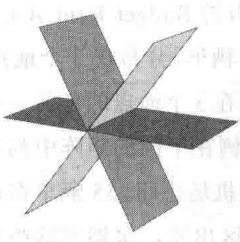
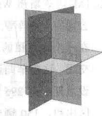
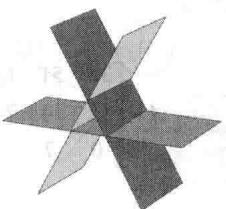
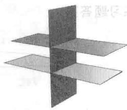
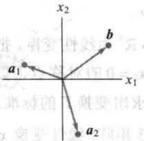
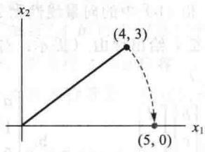

import Guide from '@/components/Guide.astro';
import Knowledge from '@/components/Knowledge.astro';
import Example from '@/components/Example.astro';
import Analysis from '@/components/Analysis.astro';
import Solution from '@/components/Solution.astro';
import Variant from '@/components/Variant.astro';
import Note from '@/components/Note.astro';
import Block from '@/components/Block.astro';
import Method from '@/components/Method.astro';
import Exercise from '@/components/Exercise.astro';

1. 标出每个命题的真假，给出理由。（若是真的，举出适当的事实或定理；若是假的，说明原因或举出反例。）

a. 每个矩阵行等价于唯一的阶梯形矩阵.
b. 含有 n 个未知数的 n 个方程至多有 $\dot{n}$ 个解.

c. 若线性方程组有两个不同的解，则它必有无穷多个解.

d. 若线性方程组没有自由变量，则它有唯一解.

e. 若增广矩阵 $[A\ b]$ 由初等行变换变为 $[C\ d]$ ，则方程 $Ax = b$ 与 $Cx = d$ 有相同解集.

f. 若方程组 Ax = b 有多于一个解，则 Ax = 0 也是.

g. 若 $A$ 是 $m \times n$ 矩阵，且对某个 $\pmb{b}$ ，方程 $Ax = b$ 相容，则 $A$ 的各列生成 $\mathbb{R}^m$ .

h. 若增广矩阵 $[A\ b]$ 可由初等行变换化为简化阶梯形，则方程 $Ax = b$ 相容.

i. 若矩阵 $A$ 和 $B$ 行等价，则它们有相同的简化阶梯形.

j. 方程 $Ax = 0$ 有平凡解当且仅当它没有自由变量.

k. 若 $A$ 是 $m \times n$ 矩阵，方程 $Ax = b$ 对 $\mathbb{R}^m$ 中任意 $b$ 都相容，则 $A$ 有 $m$ 个主元列.

1. 若 $m \times n$ 矩阵 $A$ 在每一行都有一个主元位置，则对 $\mathbb{R}^m$ 中任意 $\pmb{b}$ ，方程 $Ax = b$ 有唯一解。

m. 若 $n \times n$ 矩阵 $A$ 有 $n$ 个主元位置，则 $A$ 的简化阶梯形是 $n \times n$ 单位矩阵.

n. 若 $3 \times 3$ 矩阵 A 和 B 都有 3 个主元位置，则通过初等行变换可以将 A 变换为 B.

0. 若 A 是 $m \times n$ 矩阵，方程 Ax = b 有至少两个不同的解，且如果方程 Ax = c 相容，则方程 Ax = c 有多个解.

p. 若 $A$ 和 $B$ 是行等价的 $m \times n$ 矩阵，且 $A$ 的列生成 $\mathbb{R}^m$ ，则 $B$ 的列也生成 $\mathbb{R}^m$ .

q. 若 $\mathbb{R}^3$ 中向量集 $S = \{\pmb{v}_1, \pmb{v}_2, \pmb{v}_3\}$ 中任意一个向量都不是其他向量的倍数，则 $S$ 线性无关.

r. 若 $\{u,v,w\}$ 是线性无关集，则 u,v 和 w 不在 $R^{2}$ 中.

s. 在某些情况下，4个向量可能生成 $\mathbb{R}^5$ t. $u$ 和 $v$ 属于 $\mathbb{R}^m$ ，则 $-u$ 属于 $\operatorname{Span}\{u, v\}$ .

u. 若 u, v 和 w 是 $R^{2}$ 中的非零向量，则 u 是 u 和 v 的线性组合.

v. 若 w 是 $R^{n}$ 中 u 和 v 的线性组合，则 u 是 v 和 w 的线性组合.

w. 设 $v_{1}, v_{2}, v_{3}$ 是 $R^{5}$ 中的非零向量， $v_{2}$ 不是 $v_{1}$ 的倍数， $v_{3}$ 不是 $v_{1}$ 和 $v_{2}$ 的线性组合，则 $\{v_{1}, v_{2}, v_{3}\}$ 线性无关.

x. 线性变换是函数.

y. 若 $A$ 是 $6 \times 5$ 矩阵，则线性变换 $x \mapsto Ax$ 不能将 $\mathbb{R}^5$ 映上到 $\mathbb{R}^6$ .

z. 若 A 是有 m 个主元列的 $m \times n$ 矩阵，则线性变换 $x \mapsto Ax$ 是一对一映射.

2. 设 a 和 b 表示实数. 叙述（线性）方程 ax = b 的解集的各种可能情况. （提示：解的数目依赖于 a 和 b.）

3. 一个线性方程 $ax + by + cz = d$ 的解 $(x, y, z)$ 可以表示为 $\mathbb{R}^3$ 中的一个平面，其中 $a, b, c$ 不全为零。构造有三个线性方程的方程组表示图 a 相交于一条直线，图 b 相交于一点，图 c 没有交点。图形如下所示。

a）三个平面交于一条直线 b）三个平面交于一点

4. 三个未知量三个方程的线性方程组的系数矩阵的每一列都有一个主元位置，说明方程组为什么有唯一解.

5. 确定 h 和 k 的值，使下列方程组的解集（i）是空集，（ii）包含唯一的解，（iii）包含无穷多个解.
a. $x_{1}+3x_{2}=k$ b. $-2x_{1}+hx_{2}=1$ $4x_{1} + hx_{2} = 8$ $6x_{1} + kx_{2} = -2$

6. 确定下列方程组是否相容：

$$
\begin{array}{l} 4 x _ {1} - 2 x _ {2} + 7 x _ {3} = - 5 \\ 8 x _ {1} - 3 x _ {2} + 1 0 x _ {3} = - 3 \end{array}
$$

a. 定义适当的向量，把问题重述为线性组合的形式，再解此问题.
b. 定义适当的矩阵，用 “A 的列” 重述此问题.
c. 利用（b）中矩阵定义适当的线性变换 T，用 T 的术语重述此问题.

7. 考虑下列问题，确定方程组是否对任意的 $b_{1}, b_{2}, b_{3}$ 相容.

$$
\begin{array}{r l} & 2 x _ {1} - 4 x _ {2} - 2 x _ {3} = b _ {1} \\ & - 5 x _ {1} + x _ {2} + x _ {3} = b _ {2} \\ & 7 x _ {1} - 5 x _ {2} - 3 x _ {3} = b _ {3} \end{array}
$$

a. 定义适当的向量，用 $Span\{\nu_{1}, \nu_{2}, \nu_{3}\}$ 的术语重述此问题，然后解此问题.
b. 定义适当的矩阵 A，用 “A 的列” 重述此问题.
c. 用（b）中矩阵定义适当的线性变换 T，用 T 的术语重述此问题.

8. 使用 1.2 节例 1 的记号描述矩阵 A 可能的阶梯形.
a. A 是 $2 \times 3$ 矩阵，其列生成 $R^{2}$ .
b. A 是 $3 \times 3$ 矩阵，其列生成 $R^{3}$ .

9. 将向量 $\begin{bmatrix} 5 \\ 6 \end{bmatrix}$ 表示为两个向量的和，其中一个在直线 $\{(x, y): y = 2x\}$ 上，另一个在直线 $\{(x, y): y = x / 2\}$ 上.

10. 设 $a_{1}, a_{2}$ 和 b 是 $R^{2}$ 中的向量，如下图所示，令 $A = [a_{1} \quad a_{2}]$ 。方程 Ax = b 是否有解？如果有解，解是否唯一？给出解释。

11. 构造一个 $2 \times 3$ 矩阵 $A$ ，不是阶梯形，使得 $Ax = 0$ 的解是 $\mathbb{R}^3$ 中的一条直线.

12. 构造一个 $2 \times 3$ 矩阵 $A$ ，不是阶梯形，使得 $Ax = 0$ 的解是 $\mathbb{R}^3$ 中的一个平面.

13. 写出一个 $3 \times 3$ 矩阵 $A$ 的简化阶梯形，使得 $A$ 的前两列是主元列，且 $A\begin{bmatrix} 3 \\ -2 \\ 1 \end{bmatrix} = \begin{bmatrix} 0 \\ 0 \\ 0 \end{bmatrix}$ .

14. 求 $a$ 的值使得 $\left\{\begin{bmatrix} 1 \\ a \end{bmatrix}, \begin{bmatrix} a \\ a + 2 \end{bmatrix}\right\}$ 是线性无关集.

15. 设（a）和（b）中的向量线性无关，数 $a, \cdots, f$ 有何特征？给出理由。（提示：对（b）使用一个定理。）

a.

$$
\left[ \begin{array}{l} a \\ 0 \\ 0 \end{array} \right], \left[ \begin{array}{l} b \\ c \\ 0 \end{array} \right], \left[ \begin{array}{l} d \\ e \\ f \end{array} \right]
$$

b.

$$
\left[ \begin{array}{c} a \\ 1 \\ 0 \\ 0 \end{array} \right], \left[ \begin{array}{c} b \\ c \\ 1 \\ 0 \end{array} \right], \left[ \begin{array}{c} d \\ e \\ f \\ 1 \end{array} \right]
$$

16. 使用 1.7 节定理 7 解释为什么矩阵 A 的列线性无关.

$$
A = \left[ \begin{array}{c c c c} 1 & 0 & 0 & 0 \\ 2 & 5 & 0 & 0 \\ 3 & 6 & 8 & 0 \\ 4 & 7 & 9 & 1 0 \end{array} \right]
$$

17. 说明为什么 $\mathbb{R}^5$ 中的向量集 $\{\pmb{v}_1, \pmb{v}_2, \pmb{v}_3, \pmb{v}_4\}$ 一定是线性无关的，其中 $\{\pmb{v}_1, \pmb{v}_2, \pmb{v}_3\}$ 线性无关，且 $\pmb{v}_4$ 不属于 $\operatorname{Span}\{\pmb{v}_1, \pmb{v}_2, \pmb{v}_3\}$ .

18. 设 $\{\pmb{v}_1, \pmb{v}_2\}$ 是 $\mathbb{R}^n$ 中的线性无关向量集，证明 $\{\pmb{v}_1, \pmb{v}_1 + \pmb{v}_2\}$ 也线性无关.

19. 设 $v_{1}, v_{2}, v_{3}$ 是 $R^{3}$ 中一条直线上的三个不同点，这条直线不一定经过原点，证明 $\{v_{1}, v_{2}, v_{3}\}$ 线性相关.

20. 设 $T: \mathbb{R}^n \to \mathbb{R}^m$ 是线性变换， $T(\pmb{u}) = \pmb{v}$ ，证明

$$
T (- \boldsymbol {u}) = - \boldsymbol {v}.
$$

21. 设 $T: \mathbb{R}^3 \to \mathbb{R}^3$ 为线性变换，把每个向量变为它关于平面 $x_2 = 0$ 的对称点，即 $T(x_1, x_2, x_3) = (x_1, -x_2, x_3)$ ，求出变换 $T$ 的标准矩阵。

22. 设 $A$ 是 $3 \times 3$ 矩阵, 线性变换 $x \mapsto Ax$ 把 $\mathbb{R}^3$ 映上到 $\mathbb{R}^3$ , 说明为什么这个变换是一对一的.

23. 吉温斯旋转是由 $\mathbb{R}^n \to \mathbb{R}^n$ 的一种线性变换，在计算机程序里用来在一个向量中产生一个零元素（通常是矩阵的一列）。 $\mathbb{R}^2$ 中的一个吉温斯旋转（见图1-49）的标准矩阵有形式

$$
\left[ \begin{array}{c c} a & - b \\ b & a \end{array} \right], \quad a ^ {2} + b ^ {2} = 1
$$

求出 a 与 b 把 $\begin{bmatrix}4\\ 3\end{bmatrix}$ 旋转到 $\begin{bmatrix}5\\ 0\end{bmatrix}$ .

  
图1-49 $\mathbb{R}^2$ 中的吉温斯旋转

24. 下列方程是 $R^{3}$ 中的吉温斯旋转，求出 a 和 b.

$$
\left[ \begin{array}{c c c} a & 0 & - b \\ 0 & 1 & 0 \\ b & 0 & a \end{array} \right] \left[ \begin{array}{l} 2 \\ 3 \\ 4 \end{array} \right] = \left[ \begin{array}{c} 2 \sqrt {5} \\ 3 \\ 0 \end{array} \right], a ^ {2} + b ^ {2} = 1
$$

25. 一幢大的公寓建筑使用模块建筑技术。每层楼的建筑设计从3种设计中选择。A设计每层有18个公寓，包括3个三室单元、7个两室单元和8个一室单元；B设计每层有4个三室单元、4个两室单元和8个一室单元；C设计每层有5个三室单元、3个两室单元和9个一室单元。设该建筑有 $x_{1}$ 层采取A设计， $x_{2}$ 层采取B设计， $x_{3}$ 层采取C设计。

a. 向量 $x_{1}\begin{bmatrix}3\\ 7\\ 8\end{bmatrix}$ 的实际意义是什么？

b. 写出向量的线性组合表示该建筑所包含的三室、两室和一室单元的总数.

c. [M] 是否可能设计该建筑物，使恰有 66 个三室单元、74 个两室单元和 136 个一室单元？若可能的话，是否有多种方法？说明你的答案.
