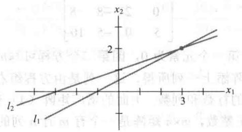
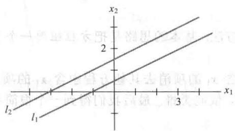
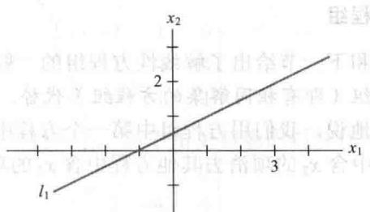
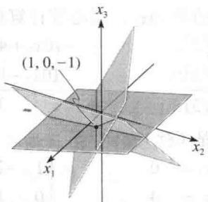
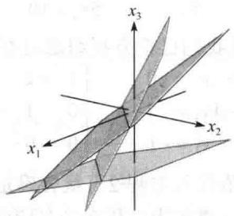
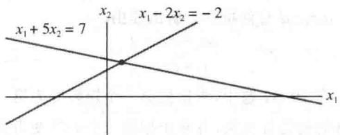
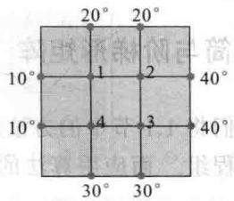
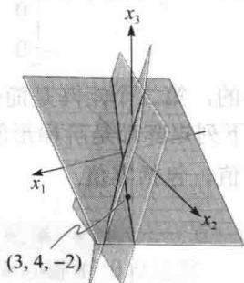

import Knowledge from '@/components/Knowledge.astro';
import Example from '@/components/Example.astro';
import Note from '@/components/Note.astro';
import Solution from '@/components/Solution.astro';
import Block from '@/components/Block.astro';

包含变量 $x_{1}, x_{2}, \cdots, x_{n}$ 的线性方程是形如

$$

a _ {1} x _ {1} + a _ {2} x _ {2} + \dots + a _ {n} x _ {n} = b\tag{1}

$$

的方程，其中 b 与系数 $a_{1}, a_{2}, \cdots, a_{n}$ 是实数或复数，通常是已知数。下标 n 可以是任意正整数。在本书的例题中，n 通常在 2 与 5 之间。在实际问题中，n 可以是 50、5000 或更大。

方程

$$

4 x _ {1} - 5 x _ {2} + 2 = x _ {1} \text {和} x _ {2} = 2 (\sqrt {6} - x _ {1}) + x _ {3}

$$

都是线性方程，因为它们可以化为

$$

3 x _ {1} - 5 x _ {2} = - 2 \text {和} 2 x _ {1} + x _ {2} - x _ {3} = 2 \sqrt {6}

$$

方程

$$

4 x _ {1} - 5 x _ {2} = x _ {1} x _ {2} \text {和} x _ {2} = 2 \sqrt {x _ {1}} - 6

$$

都不是线性方程，因为第一个方程中包含 $x_{1}x_{2}$ ，第二个方程中包含 $\sqrt{x_1}$

线性方程组是由一个或几个包含相同变量 $x_{1}, x_{2}, \cdots, x_{n}$ 的线性方程组成的。例如，

$$

\begin{array}{r l} 2 x _ {1} - x _ {2} + 1. 5 x _ {3} & = 8 \\ x _ {1} & - 4 x _ {3} = - 7 \end{array}\tag{2}

$$

线性方程组的解是一组数 $(s_{1},s_{2},\cdots,s_{n})$ ，用这组数分别代替 $x_{1},x_{2},\cdots,x_{n}$ 时所有方程的两边相等。例如，方程组（2）有一组解(5，6.5，3)，这是因为，在（2）中用这些值代替 $x_{1},x_{2},x_{3}$ 时，方程组变成等式8=8和-7=-7。

方程组所有可能的解的集合称为线性方程组的解集. 若两个线性方程组有相同的解集, 则这两个线性方程组称为等价的. 也就是说, 第一个方程组的每个解都是第二个方程组的解, 第二个方程组的每个解都是第一个方程组的解.

求包含两个变量的两个线性方程组成的方程组的解，等价于求两条直线的交点。一个典型的例子是

$$

\begin{array}{r l} & x _ {1} - 2 x _ {2} = - 1 \\ & - x _ {1} + 3 x _ {2} = 3 \end{array}

$$

这两个方程的图形都是直线，分别用 $l_{1}$ 和 $l_{2}$ 表示，数对 $(x_{1}, x_{2})$ 满足这两个方程当且仅当点 $(x_{1}, x_{2})$ 是这两条直线的交点。容易验证，这个方程组有唯一的解(3, 2)，如图1-1所示。

当然，两条直线不一定交于一个点，它们可能平行，也可能重合，重合的两条直线上的每个点都是交点。图1-2是与下面两个方程组对应的图形：

$$

\begin{array}{r l} x _ {1} - 2 x _ {2} & = - 1 \\ - x _ {1} + 2 x _ {2} & = 3 \end{array}

$$

$$

x _ {1} - 2 x _ {2} = - 1

$$

$$

- x _ {1} + 2 x _ {2} = 1

$$

  

图1-1 有唯一解

星野古卦英籍

a）无解  

  

图1-2  

b）无穷多解

图 1-1 和图 1-2 说明线性方程组的下列一般事实，这将在 1.2 节证明.

线性方程组的解有下列三种情况：

1. 无解.

2. 有唯一解.

3. 有无穷多解.

我们称一个线性方程组是相容的，若它有一个解或无穷多个解；称它是不相容的，若它无解.

## 矩阵记号

一个线性方程组包含的主要信息可以用一个称为矩阵的紧凑的矩形阵列表示. 给出方程组

$$

\begin{array}{r l} x _ {1} - 2 x _ {2} + x _ {3} = & 0 \\ 2 x _ {2} - 8 x _ {3} = & 8 \\ 5 x _ {1} - 5 x _ {3} = & 1 0 \end{array}\tag{3}

$$

把每一个变量的系数写在对齐的一列中，矩阵

$$

\left[ \begin{array}{r r r} 1 & - 2 & 1 \\ 0 & 2 & - 8 \\ 5 & 0 & - 5 \end{array} \right]

$$

称为方程组（3）的系数矩阵，而

$$

- \left[ \begin{array}{r r r r} 1 & - 2 & 1 & 0 \\ 0 & 2 & - 8 & 8 \\ 5 & 0 & - 5 & 1 0 \end{array} \right]\tag{4}

$$

称为它的增广矩阵.（第二行第一个元素为0，因第二个方程可写成 $0\cdot x_{1}+2x_{2}-8x_{3}=8$ ）方程组的增广矩阵是把它的系数矩阵添上一列所得，这一列是由方程组右边的常数组成的.

矩阵的维数说明它包含的行数和列数. 上面的增广矩阵（4）有3行4列，称为 $3 \times 4$ （读作3行4列）矩阵. 若 $m, n$ 是正整数， $m \times n$ 矩阵是一个有 $m$ 行 $n$ 列的数的矩形阵列.（行数写在前面.）矩阵记号为解方程组带来方便.

<Solution title="解">
线性方程组

本节和下一节给出了解线性方程组的一般方法. 基本的思路是把方程组用一个更容易解的等价方程组（即有相同解集的方程组）代替.

粗略地说，我们用方程组中第一个方程中含 $x_{1}$ 的项消去其他方程中含 $x_{1}$ 的项。然后用第二个方程中含 $x_{2}$ 的项消去其他方程中含 $x_{2}$ 的项，依此类推。最后我们得到一个很简单的等价方程组。

用来化简线性方程组的三种基本变换是：把某个方程换成它与另一方程的倍数的和；交换两个方程的位置；把某一方程的所有项乘以一个非零常数。在例1之后，我们将说明经过这三种变换为什么不改变方程组的解集。
</Solution>

<Example title="例 1">
解方程组（3）.

<Solution title="解">
我们在消去未知数的同时用方程组与相应的矩阵形式表示出来以便比较.

$$

\begin{array}{r l} x _ {1} - 2 x _ {2} + x _ {3} & = 0 \\ 2 x _ {2} - 8 x _ {3} & = 8 \\ 5 x _ {1} - 5 x _ {3} & = 1 0 \end{array}

$$

$$

\left[ \begin{array}{r r r r} 1 & - 2 & 1 & 0 \\ 0 & 2 & - 8 & 8 \\ 5 & 0 & - 5 & 1 0 \end{array} \right]

$$

保留第一个方程中的 $x_{1}$ ，把其他方程中的 $x_{1}$ 消去。为此，把第一个方程乘以-5，加到第三个方程上。熟练之后可以通过心算完成：

$$

\begin{array}{r l r} {- 5 \cdot [ \text {方程} 1 ]:} & & {- 5 x _ {1} + 1 0 x _ {2} - 5 x _ {3} = 0} \\ {+ [ \text {方程} 3 ]:} & & {5 x _ {1} \qquad - 5 x _ {3} = - 9} \\ {\hline [ \text {新方程} 3 ]:} & & {1 0 x _ {2} - 1 0 x _ {3} = 1 0} \end{array}

$$

把原来的第三个方程用所得新方程代替：

$$

\begin{array}{r l} x _ {1} - 2 x _ {2} + & x _ {3} = 0 \\ 2 x _ {2} - & 8 x _ {3} = 8 \\ 1 0 x _ {2} - 1 0 x _ {3} = 1 0 \end{array}

$$

$$

\left[ \begin{array}{c c c c} 1 & - 2 & 1 & 0 \\ 0 & 2 & - 8 & 8 \\ 0 & 1 0 & - 1 0 & 1 0 \end{array} \right]

$$

其次，把方程2乘以 $1 / 2$ ，使 $x_{2}$ 的系数变成1.（这步计算可以简化下一步中的运算.)

$$

\begin{array}{r l} x _ {1} - 2 x _ {2} + & x _ {3} = 0 \\ x _ {2} - 4 x _ {3} = & 4 \\ 1 0 x _ {2} - 1 0 x _ {3} = 1 0 \end{array}

$$

$$

\left[ \begin{array}{c c c c} 1 & - 2 & 1 & 0 \\ 0 & 1 & - 4 & 4 \\ 0 & 1 0 & - 1 0 & 1 0 \end{array} \right]

$$

利用方程2中的 $x_{2}$ 项消去方程3中的项 $10x_{2}$ ，用心算计算如下：

$$

\begin{array}{r l} & {- 1 0 \cdot [ \text {方程} 2 ]:} \\ & {\quad + [ \text {方程} 3 ]:} \\ & {\quad \overline {{[ \text {新方程} 3 ] :}}} \end{array}

$$

$$

\begin{array}{r l} & - 1 0 x _ {2} + 4 0 x _ {3} = - 4 0 \\ & \frac {1 0 x _ {2} - 1 0 x _ {3} = 1 0}{3 0 x _ {3} = - 3 0} \end{array}

$$

计算结果可以写作之前的第三个方程（行）：

$$

\begin{array}{r l} x _ {1} - 2 x _ {2} + x _ {3} = & 0 \\ x _ {2} - 4 x _ {3} = & 4 \\ 3 0 x _ {3} = & - 3 0 \end{array}

$$

$$

\left[ \begin{array}{c c c c} 1 & - 2 & 1 & 0 \\ 0 & 1 & - 4 & 4 \\ 0 & 0 & 3 0 & - 3 0 \end{array} \right]

$$

现在，将方程3乘以 $\frac{1}{30}$ 以得到1作为 $x_{3}$ 的系数.（这步计算可以简化下一步中的运算.)

$$

\begin{array}{r l} - x _ {1} - 2 x _ {2} + & x _ {3} = 0 \\ x _ {2} - 4 x _ {3} = & 4 \\ x _ {3} = - 1 \end{array}

$$

$$

\left[ \begin{array}{c c c c} 1 & - 2 & 1 & 0 \\ 0 & 1 & - 4 & 4 \\ 0 & 0 & 1 & - 1 \end{array} \right]

$$

新的方程组是三角形形式（直观的术语三角形将在下一节中用更精确的词替代）：

$$

\begin{array}{r l} - x _ {1} - 2 x _ {2} + & x _ {3} = 0 \\ x _ {2} - 4 x _ {3} = & 4 \\ x _ {3} = - 1 \end{array}

$$

$$

\left[ \begin{array}{c c c c} 1 & - 2 & 1 & 0 \\ 0 & 1 & - 4 & 4 \\ 0 & 0 & 1 & - 1 \end{array} \right]

$$

现在我们想消去第一个方程中的项 $-2x_{2}$ ，不过先利用方程3中的 $x_{3}$ 消去第一个方程中的项 $x_{3}$ 和第二个方程中的项 $-4x_{3}$ 更为有效。这两个运算如下：

$$

\begin{array}{r l r l r l} {4 \cdot [ \text { 方程3 } ]:} & {4 x _ {3} = - 4} & & {- 1 \cdot [ \text { 方程3 } ]:} & & {- x _ {3} = 1} \\ {+ [ \text { 方程2 } ]:} & {x _ {2} - 4 x _ {3} = 4} & & {+ [ \text { 方程1 } ]:} & & {x _ {1} - 2 x _ {2} + x _ {3} = 0} \\ {\hline [ \text { 新方程2 } ]:} & {x _ {2}} & & {[ \text { 新方程1 } ]:} & & {x _ {1} - 2 x _ {2}} & & {= 1} \end{array}

$$

这两次变换的结果如下：

$$

\begin{array}{r l} x _ {1} - 2 x _ {2} & = 1 \\ x _ {2} & = 0 \\ x _ {3} & = - 1 \end{array}

$$

$$

\left[ \begin{array}{c c c c} 1 & - 2 & 0 & 1 \\ 0 & 1 & 0 & 0 \\ 0 & 0 & 1 & - 1 \end{array} \right]

$$

现在，在方程3中 $x_{3}$ 的一列中只剩一项，我们回头来用第二个方程中的 $x_{2}$ 项消去它上面的 $-2x_{2}$ 项．因为之前处理了 $x_{3}$ ，故现在的运算不再包含 $x_{3}$ 把方程2的2倍加到方程1，得到方程组：

$$

\left\{ \begin{array}{c c c c} x _ {1} & = & 1 \\ x _ {2} & = & 0 \\ x _ {3} & = & - 1 \end{array} \right. \quad \left[ \begin{array}{c c c c} 1 & 0 & 0 & 1 \\ 0 & 1 & 0 & 0 \\ 0 & 0 & 1 & - 1 \end{array} \right]

$$

我们已经得出结果：原方程组的唯一解是 $(1,0, - 1)$ ，我们做了这么多计算，最好还是检验一下结果．为证明 $(1,0, - 1)$ 是方程组的解，把这些值代入原方程组的左边并作计算：

$$

\begin{array}{r l} 1 (1) - 2 (0) + 1 (- 1) & = 1 - 0 - 1 = 0 \\ 2 (0) - 8 (- 1) & = 0 + 8 = 8 \\ 5 (1) \quad - 5 (- 1) & = 5 + 5 = 1 0 \end{array}

$$

结果与原方程组右边相同，所以 $(1,0, - 1)$ 是原方程组的解（见图1-3）.

  

图 1-3 每个方程确定三维空间中的一个平面. 点(1, 0, -1)落在三个平面上

例 1 说明了线性方程的变换对应于增广矩阵的行变换. 前面所讲的三种基本变换对应于增广矩阵的下列变换.
</Solution>
</Example>

## 初等行变换

1.（倍加变换）把某一行换成它本身与另一行的倍数的和。

2.（对换变换）把两行对换.

3.（倍乘变换）把某一行的所有元素乘以同一个非零数.

行变换可施行于任何矩阵，不仅仅是对于线性方程组的增广矩阵。我们称两个矩阵为行等价的，若其中一个矩阵可以经一系列初等行变换成为另一个矩阵。

重要的一点是行变换是可逆的。若两行被对换，则再次对换它们就会还原为原来的状态。若某行乘以非零常数 $c$ ，则将所得的行乘以 $1 / c$ 就得出原来的行。最后，考虑涉及两行的倍加变换，例如第一行和第二行。假设把第一行的 $c$ 倍加到第二行得到新的第二行，那么“逆”变换就是把第一行的 $-c$ 倍加到（新的）第二行上就得到原来的第二行。见本节末习题29\~32。

此时，我们更关注对一个线性方程组的增广矩阵进行行变换。假设一个线性方程组经过行变换变成另一个新的方程组，考虑每一种行变换，容易看出，原方程组的任何一个解仍是新的方程组的一个解。反之，因原方程组也可由新方程组经行变换得出，故新方程组的每个解也是原方程组的解。这就证明了下列事实。

若两个线性方程组的增广矩阵是行等价的，则它们具有相同的解集.

虽然例 1 看起来很长，但经过一些练习你还是可以很快掌握的。本书中习题的行变换通常是很简单的，因而你可以集中精力理解其中的思想和概念。当然你必须熟练掌握这些行变换，因为整本书都要用到它们。

本节的其他部分将介绍如何利用行变换来确定线性方程组解集的情况，而无须完全求出解来。存在与唯一性问题

在1.2节中，我们将会知道为什么一个线性方程组的解集可能不包含任何解、一个解或无

穷多个解. 为确定某个线性方程组的解集属于哪种情况, 我们提出以下两个问题.

线性方程组的两个基本问题

1. 方程组是否相容，即它是否至少有一个解？

2. 若它有解，它是否只有一个解，即解是否唯一？

这两个问题将在整本书中以各种形式出现。本节与下节中，我们将说明如何通过增广矩阵的行变换来回答这些问题。

<Example title="例 2">
确定下列方程组是否有解：

$$

\begin{array}{r l} x _ {1} - 2 x _ {2} + x _ {3} & = 0 \\ 2 x _ {2} - 8 x _ {3} & = 8 \\ 5 x _ {1} - 5 x _ {3} & = 1 0 \end{array}

$$

<Solution title="解">
这就是例1中的方程组. 设我们已把方程组通过行变换变成三角形

$$

\begin{array}{r l} x _ {1} - 2 x _ {2} + x _ {3} = & 0 \\ x _ {2} - 4 x _ {3} = & 4 \\ x _ {3} = - 1 \end{array} \quad \left[ \begin{array}{c c c c} 1 & - 2 & 1 & 0 \\ 0 & 1 & - 4 & 4 \\ 0 & 0 & 1 & - 1 \end{array} \right]

$$

这时我们已经确定了 $x_{3}$ ，若把 $x_{3}$ 的值代入方程2，就会确定 $x_{2}$ ，因而可由方程1确定 $x_{1}$ ，所以解是存在的，即该方程组是相容的。（事实上，因为 $x_{3}$ 只有一个可能的值，所以 $x_{2}$ 由方程2唯一确定，而 $x_{1}$ 由方程1唯一确定，所以解是唯一的。）
</Solution>
</Example>

<Example title="例 3">
确定下列方程组是否相容:

$$

\begin{array}{r l} & x _ {2} - 4 x _ {3} = 8 \\ & 2 x _ {1} - 3 x _ {2} + 2 x _ {3} = 1 \\ & 4 x _ {1} - 8 x _ {2} + 1 2 x _ {3} = 1 \end{array}\tag{5}

$$

<Solution title="解">
增广矩阵为

$$

\left[ \begin{array}{r r r r} 0 & 1 & - 4 & 8 \\ 2 & - 3 & 2 & 1 \\ 4 & - 8 & 1 2 & 1 \end{array} \right]

$$

为从第一个方程得到 $x_{1}$ ，对换第1行与第2行：

$$

\left[ \begin{array}{c c c c} 2 & - 3 & 2 & 1 \\ 0 & 1 & - 4 & 8 \\ 4 & - 8 & 1 2 & 1 \end{array} \right]

$$

图区

为消去第三个方程的项 $4x_{1}$ ，把第1行的-2倍加到第3行：

$$

\left[ \begin{array}{c c c c} 2 & - 3 & 2 & 1 \\ 0 & 1 & - 4 & 8 \\ 0 & - 2 & 8 & - 1 \end{array} \right]\tag{6}

$$

接下来，用第二个方程的 $x_{2}$ 项消去第三个方程的 $-2x_{2}$ 项，把第2行的2倍加到第3行上：

$$

\left[ \begin{array}{c c c c} 2 & - 3 & 2 & 1 \\ 0 & 1 & - 4 & 8 \\ 0 & 0 & 0 & 1 5 \end{array} \right]\tag{7}

$$

现在增广矩阵已成为三角形形式. 为理解这个矩阵, 将其化为方程表示:

$$

\begin{array}{r l} 2 x _ {1} - 3 x _ {2} + 2 x _ {3} & = 1 \\ x _ {2} - 4 x _ {3} & = 8 \\ 0 & = 1 5 \end{array}\tag{8}

$$

方程 $0 = 15$ 是 $0x_{1} + 0x_{2} + 0x_{3} = 15$ 的简写。这个三角形线性方程组显然是矛盾的，所以满足（8）的未知数 $x_{1}, x_{2}, x_{3}$ 的值是不可能存在的，因等式 $0 = 15$ 不可能成立。由于（8）和（5）有同样的解集，故原方程组是不相容的（即无解），见图1-4。

  

图1-4 该方程组是不相容的，因为没有同时落在三个平面上的点
</Solution>
</Example>

<Note>
（7）的增广矩阵，它的最后一行在三角形不相容方程组中是典型的.

数值计算的注解 在实际问题中线性方程组是通过计算机求解的. 对于方阵, 计算机程序基本上是应用这里以及 1.2 节的消去法, 稍做修正以改进精确度.

工商业中的大量线性代数问题运用浮点运算求解，数表示为小数形式： $\pm 0.d_{1} \cdots d_{p} \times 10^{r}$ ，其中 $r$ 是整数，而小数点右边的数位 $p$ 通常为8至16位。这种数的算术运算一般是有误差的，因为其结果必须四舍五入（或舍去）为存储时需要的数位。“舍入误差”在输入像1/3这样的数时也会产生，因为它必须用近似的有限位小数表示。幸运的是，浮点运算中的不精确性很少引起严重问题。本书中关于数值计算的注解将会提醒你注意这些问题。
</Note>

<Block title="练习题">

本书中练习题应该在做习题之前完成，它们的解答在每一节习题之后给出.

1. 用语言叙述解每个方程组时下一步应做的初等行变换（a 中可能有不止一个答案）

$$

\begin{array}{r l r} \text {a.} & x _ {1} + 4 x _ {2} - 2 x _ {3} + 8 x _ {4} = 1 2 \\ & x _ {2} - 7 x _ {3} + 2 x _ {4} = - 4 \\ & 5 x _ {3} - x _ {4} = 7 \\ & x _ {3} + 3 x _ {4} = - 5 \end{array} \quad \begin{array}{r l r} \text {b.} & x _ {1} - 3 x _ {2} + 5 x _ {3} - 2 x _ {4} = 0 \\ & x _ {2} + 8 x _ {3} & = - 4 \\ & 2 x _ {3} & = 3 \\ & x _ {4} = 1 \end{array}

$$

2. 某线性方程组的增广矩阵已经由行变换化为以下形式. 确定方程组是否是相容的.

$$

\left[ \begin{array}{c c c c} 1 & 5 & 2 & - 6 \\ 0 & 4 & - 7 & 2 \\ 0 & 0 & 5 & 0 \end{array} \right]

$$

3.(3, 4, -2)是否为下列方程组的解：

$$

\begin{array}{r l} & 5 x _ {1} - x _ {2} + 2 x _ {3} = 7 \\ & - 2 x _ {1} + 6 x _ {2} + 9 x _ {3} = 0 \\ & - 7 x _ {1} + 5 x _ {2} - 3 x _ {3} = - 7 \end{array}

$$

4. 当 $h$ 和 $k$ 取何值时下列方程组相容？

$$

\begin{array}{r l} 2 x _ {1} - & x _ {2} = h \\ - 6 x _ {1} + 3 x _ {2} = k \end{array}

$$

</Block>

<Block title="习题1.1">

利用对方程或增广矩阵的初等行变换解 1～4 题中的方程组. 依照本节中给出的消去过程.

行变换化成如下所示,继续进行适当的行变换并说明原方程组的解集.

$$

\begin{array}{r l} 1. & x _ {1} + 5 x _ {2} = 7 \\ & - 2 x _ {1} - 7 x _ {2} = - 5 \\ 2. & 2 x _ {1} + 4 x _ {2} = - 4 \\ & 5 x _ {1} + 7 x _ {2} = 1 1 \end{array}

$$

7.

$$

\left[ \begin{array}{c c c c} 1 & 7 & 3 & - 4 \\ 0 & 1 & - 1 & 3 \\ 0 & 0 & 0 & 1 \\ 0 & 0 & 1 & - 2 \end{array} \right]

$$

3. 求在直线 $x_{1}+5x_{2}=7$ 和 $x_{1}-2x_{2}=-2$ 上的点 $(x_{1},x_{2})$ ，见下图.

8.

$$

\left[ \begin{array}{c c c c} 1 & - 4 & 9 & 0 \\ 0 & 1 & 7 & 0 \\ 0 & 0 & 2 & 0 \end{array} \right]

$$

9.

$$

\left[ \begin{array}{c c c c c} 1 & - 1 & 0 & 0 & - 4 \\ 0 & 1 & - 3 & 0 & - 7 \\ 0 & 0 & 1 & - 3 & - 1 \\ 0 & 0 & 0 & 2 & 4 \end{array} \right]

$$

4. 求直线 $x_{1}-5x_{2}=1$ 与 $3x_{1}-7x_{2}=5$ 的交点.

习题 5 和 6 中的矩阵是某个线性方程组的增广矩阵. 说明在解方程组时下一步应进行的初等行变换.

10.

$$

\left[ \begin{array}{c c c c c} 1 & - 2 & 0 & 3 & - 2 \\ 0 & 1 & 0 & - 4 & 7 \\ 0 & 0 & 1 & 0 & 6 \\ 0 & 0 & 0 & 1 & - 3 \end{array} \right]

$$

5.

$$

\left[ \begin{array}{c c c c c} 1 & - 4 & 5 & 0 & 7 \\ 0 & 1 & - 3 & 0 & 6 \\ 0 & 0 & 1 & 0 & 2 \\ 0 & 0 & 0 & 1 & - 5 \end{array} \right]

$$

解 11\~14 题的方程组：

6.

$$

\left[ \begin{array}{c c c c c} 1 & - 6 & 4 & 0 & - 1 \\ 0 & 2 & - 7 & 0 & 4 \\ 0 & 0 & 1 & 2 & - 3 \\ 0 & 0 & 3 & 1 & 6 \end{array} \right]

$$

11.

12.

$$

\begin{array}{r l} & x _ {2} + 5 x _ {3} = - 5 \\ & x _ {1} + 3 x _ {2} + 5 x _ {3} = - 2 \\ & 3 x _ {1} + 7 x _ {2} + 7 x _ {3} = 6 \\ & x _ {1} = 3 x _ {2} + 4 x _ {3} = - 4 \\ & 3 x _ {1} - 7 x _ {2} + 7 x _ {3} = - 8 \\ & - 4 x _ {1} + 6 x _ {2} - x _ {3} = 7 \end{array}

$$

习题 7\~10 中某个线性方程组的增广矩阵已由

13.

$$

\begin{array}{r l} x _ {1} & - 3 x _ {3} = 8 \\ 2 x _ {1} + 2 x _ {2} + 9 x _ {3} = 7 \\ x _ {2} + 5 x _ {3} = - 2 \end{array}

$$

14. $x_{1} - 3x_{2} = 5$ $-x_{1} + x_{2} + 5x_{3} = 2$ $x_{2} + x_{3} = 0$

确定 15\~16 题中的方程组是否相容, 不必解出方程组.

15. $x_{1} + 3x_{3} = 2$ $x_{2} - 3x_{4} = 3$ $-2x_{2} + 3x_{3} + 2x_{4} = 1$ $3x_{1} + 7x_{4} = -5$ 16. $x_{1} - 2x_{4} = -3$ $2x_{2} + 2x_{3} = 0$ $x_{3} + 3x_{4} = 1$ $-2x_{1} + 3x_{2} + 2x_{3} + x_{4} = 5$

17. 三条直线 $x_{1} - 4x_{2} = 1, 2x_{1} - x_{2} = -3$ 和 $-x_{1} - 3x_{2} = 4$ 是否有一个交点？请解释.

18. 三条直线 $x_{1} + 2x_{2} + x_{3} = 4, x_{2} - x_{3} = 1$ 和 $x_{1} + 3x_{2} = 0$ 是否至少有一个交点？请解释.

在 19\~22 题中, 确定 h 的值使矩阵是某个相容线性方程组的增广矩阵:

$$

\begin{array}{l} 1 9. \left[ \begin{array}{c c c} 1 & h & 4 \\ 3 & 6 & 8 \end{array} \right] \\ 2 0. \left[ \begin{array}{c c c} 1 & h & - 3 \\ - 2 & 4 & 6 \end{array} \right] \\ 2 1. \left[ \begin{array}{c c c} 1 & 3 & - 2 \\ - 4 & h & 8 \end{array} \right] \\ 2 2. \left[ \begin{array}{c c c} 2 & - 3 & h \\ - 6 & 9 & 5 \end{array} \right] \end{array}

$$

在 23 和 24 题中，本节的重要命题或是被直接引用，略为改述（但依然成立），或被错误修改。判断每个命题的真假并给出理由。（若判断为真，指出教材中相似命题的出处，或者参考定义或定理。若判断为假，指出引用或用错的命题出处，或举例说明。）类似的真/假问题会在本教材的许多章节中出现。

23. a. 每个初等行变换为可逆的.

b. $5 \times 6$ 矩阵有 6 行.

c. 包含 n 个变量 $x_{1}, x_{2}, \cdots, x_{n}$ 的线性方程组的解集是一组数 $(s_{1}, s_{2}, \cdots, s_{n})$ ，当用这组数代替 $x_{1}, x_{2}, \cdots, x_{n}$ 时，方程组中每个方程成为恒等式.

d. 线性方程组的两个基本问题涉及存在性和

唯一性.

24. a. 对增广矩阵的初等行变换不会改变相关的线性方程组的解集.

b. 两个矩阵是行等价的，若它们有相同的行数.

c. 不相容线性方程组有一个或更多解.

d. 两个线性方程组是等价的，若它们有相同的解集.

25. 求出包含 g, h 和 k 的方程，使以下矩阵是相容方程组的增广矩阵.

$$

\left[ \begin{array}{r r r r} 1 & - 4 & 7 & g \\ 0 & 3 & - 5 & h \\ - 2 & 5 & - 9 & k \end{array} \right]

$$

26. 给解集为 $x_{1} = -2, x_{2} = 1, x_{3} = 0$ 的线性方程组构造三个不同的增广矩阵.

27. 设下面的方程组对所有 f 和 g 的可能取值都是相容的，则系数 c 和 d 有何特性？给出理由.

$$

\begin{array}{l} x _ {1} + 3 x _ {2} = f \\ c x _ {1} + d x _ {2} = g \end{array}

$$

28. 设 $a, b, c, d$ 为常数， $a$ 不为零，下面的方程组对所有 $f$ 和 $g$ 的可能取值都是相容的，则系数 $a, b, c, d$ 有何特性？给出理由。

$$

\begin{array}{l} a x _ {1} + b x _ {2} = f \\ c x _ {1} + d x _ {2} = g \end{array}

$$

在 29\~32 题中, 求出把第一个矩阵变为第二个矩阵的初等行变换, 并求出把第二个矩阵变为第一个矩阵的逆行变换.

29.

$$

\left[ \begin{array}{c c c} 0 & - 2 & 5 \\ 1 & 4 & - 7 \\ 3 & - 1 & 6 \end{array} \right], \left[ \begin{array}{c c c} 1 & 4 & - 7 \\ 0 & - 2 & 5 \\ 3 & - 1 & 6 \end{array} \right]

$$

30.

$$

\left[ \begin{array}{r r r} 1 & 3 & - 4 \\ 0 & - 2 & 6 \\ 0 & - 5 & 9 \end{array} \right], \left[ \begin{array}{r r r} 1 & 3 & - 4 \\ 0 & 1 & - 3 \\ 0 & - 5 & 9 \end{array} \right]

$$

31.

$$

\left[ \begin{array}{c c c c} 1 & - 2 & 1 & 0 \\ 0 & 5 & - 2 & 8 \\ 4 & - 1 & 3 & - 6 \end{array} \right], \left[ \begin{array}{c c c c} 1 & - 2 & 1 & 0 \\ 0 & 5 & - 2 & 8 \\ 0 & 7 & - 1 & - 6 \end{array} \right]

$$

32.

$$

\left[ \begin{array}{c c c c} 1 & 2 & - 5 & 0 \\ 0 & 1 & - 3 & - 2 \\ 0 & - 3 & 9 & 5 \end{array} \right], \left[ \begin{array}{c c c c} 1 & 2 & - 5 & 0 \\ 0 & 1 & - 3 & - 2 \\ 0 & 0 & 0 & - 1 \end{array} \right]

$$

热传导的研究中，重要问题是确定某块平板的稳态温度分布，假设已知边界上的温度分布。假设右图中的平板代表一个金属梁的截面，忽略垂直于该截面方向上的热传导，设 $T_{1},T_{2},\cdots,T_{4}$ 表示图中4个内部结点的温度。某一结点的温度近似地等于4个与它最接近的结点（上、下、左、右）的平均值 ① ，例如

$$

T _ {1} = (1 0 + 2 0 + T _ {2} + T _ {4}) / 4 \text {或} 4 T _ {1} - T _ {2} - T _ {4} = 3 0

$$

33. 写出温度 $T_{1}, T_{2}, \cdots, T_{4}$ 所满足的方程组.

34. 解习题 33 中写出的方程组。（提示：为快速计算，在对换变换之前先对换第 1 行和第 4 行。）

</Block>

<Block title="练习题答案">

1. a. 手工计算时，最好是把方程 3 与 4 对换。另一种办法是把方程 3 乘以 1/5，或把方程 4 化为它与方程 3 的 -1/5 倍的和（不要利用方程 2 中的 $x_{2}$ 项消去方程 1 中的 $4x_{2}$ ，而要等到得到三角形矩阵且 $x_{3}, x_{4}$ 项已从前两个方程消去之后）。

b. 方程组是三角形. 进一步的简化可利用第四个方程中的 $x_{4}$ 项消去它上面的各个 $x_{4}$ 项, 现在适当的步骤是把方程 4 的 2 倍加到方程 1 上 (此后再把方程 3 乘以 $1/2$ , 再消去其他的 $x_{3}$ 项).

2. 对应于该增广矩阵的方程组是

$$

\begin{array}{r l} x _ {1} + 5 x _ {2} + 2 x _ {3} & = - 6 \\ 4 x _ {2} - 7 x _ {3} & = 2 \\ 5 x _ {3} & = 0 \end{array}

$$

由第三个方程得到 $x_{3} = 0$ ，这当然是允许的．消去前两个方程中的 $x_{3}$ 项，我们可以继续求出方程组关于 $x_{1}$ 和 $x_{2}$ 的唯一解．因此解是存在且唯一的．注意比较本题与例3.

$$

x _ {1} = 3, x _ {2} = 4

$$

和 $x_{3} = -2$ 代入方程组，求得

$$

\begin{array}{r l} & 5 (3) - (4) + 2 (- 2) = 1 5 - 4 - 4 = 7 \\ & - 2 (3) + 6 (4) + 9 (- 2) = - 6 + 2 4 - 1 8 = 0 \\ & - 7 (3) + 5 (4) - 3 (- 2) = - 2 1 + 2 0 + 6 = 5 \end{array}

$$

虽然前两个方程满足了，但不满足第三个，所以(3,4,-2)不是方程组的解.注意代入时使用了括号.建议你这么做是为了避免错误，见图1-5.

4. 第二个方程代以它与第一个方程的 3 倍的和，方程组化为

$$

\begin{array}{r l} 2 x _ {1} - x _ {2} & = h \\ 0 & = k + 3 h \end{array}

$$

若 $k + 3h$ 非零，该方程组无解。所以方程组对任意满足 $k + 3h = 0$ 的 $h$ 和 $k$ 的值有解。

图1-5 因为 $(3,4, - 2)$ 满足前两个方程，所以它落在前两个平面的交线上．因为(3,4,-2)不满足所有三个方程，所以它没有落在三个平面上

</Block>
