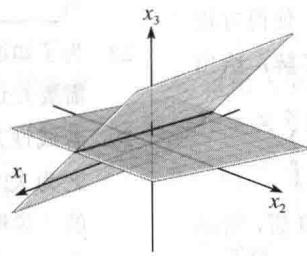

import Guide from '@/components/Guide.astro';
import Knowledge from '@/components/Knowledge.astro';
import Example from '@/components/Example.astro';
import Analysis from '@/components/Analysis.astro';
import Solution from '@/components/Solution.astro';
import Variant from '@/components/Variant.astro';
import Note from '@/components/Note.astro';
import Block from '@/components/Block.astro';
import Method from '@/components/Method.astro';
import Exercise from '@/components/Exercise.astro';

本节我们将 1.1 节中的方法进一步精化，变成行化简算法（也称行消去法），它可用来解任意线性方程组。而应用算法的第一部分，我们可以回答 1.1 节中提出的基本存在与唯一性问题。

这种算法可用于任意矩阵，不管它是否为某一方程组的增广矩阵。所以本节的第一部分讨论任意矩阵。首先我们引入两类重要的矩阵，它们包含1.1节中的“三角形”矩阵，在以下的定义中，矩阵中非零行或列指矩阵中至少包含一个非零元素的行或列；非零行的先导元素是指该行中最左边的非零元素。

定义 一个矩阵称为阶梯形（或行阶梯形），若它有以下三个性质：

1. 每一非零行都在每一零行之上.

2. 某一行的先导元素所在的列位于前一行先导元素的右边.

3. 某一先导元素所在列下方元素都是零.

若一个阶梯形矩阵还满足以下性质，则称它为简化阶梯形（或简化行阶梯形）.

4. 每一非零行的先导元素是 1.

5. 每一先导元素 1 是该元素所在列的唯一非零元素.

若一个矩阵具有阶梯形（简化阶梯形），就称它为阶梯形（简化阶梯形）矩阵。性质2说明先导元素构成阶梯形。性质3其实是性质2的推论，不过我们把它列出来以示强调。

1.1节中的“三角形”矩阵，如

$$
\left[ \begin{array}{c c c c} {2} & {- 3} & {2} & {1} \\ {0} & {1} & {- 4} & {8} \\ {0} & {0} & {0} & {5 / 2} \end{array} \right] \text {和} \left[ \begin{array}{c c c c} {1} & {0} & {0} & {2 9} \\ {0} & {1} & {0} & {1 6} \\ {0} & {0} & {1} & {3} \end{array} \right]
$$

都是阶梯形的，第二个矩阵是简化阶梯形的。再举更多的例子。

<Example title="例 1">
下列矩阵都是阶梯形的. 先导元素用 ■ 表示, 它们可取任意的非零值, 在 \* 位置的元素可取任意值, 包括零值.

$$
\left[ \begin{array}{c c c c} \blacksquare & * & * & * \\ 0 & \blacksquare & * & * \\ 0 & 0 & 0 & 0 \\ 0 & 0 & 0 & 0 \end{array} \right]
$$

$$
\left[ \begin{array}{c c c c c c c c c} 0 & \blacksquare & * & * & * & * & * & * & * \\ 0 & 0 & 0 & \blacksquare & * & * & * & * & * \\ 0 & 0 & 0 & 0 & \blacksquare & * & * & * & * \\ 0 & 0 & 0 & 0 & 0 & \blacksquare & * & * & * \\ 0 & 0 & 0 & 0 & 0 & 0 & 0 & 0 \end{array} \right]
$$

下列矩阵是简化阶梯形的，因先导元素都是1，且在每个先导元素1的上、下各元素都是0.

$$
\left[ \begin{array}{c c c c} 1 & 0 & * & * \\ 0 & 1 & * & * \\ 0 & 0 & 0 & 0 \\ 0 & 0 & 0 & 0 \end{array} \right]
$$

$$
\left[ \begin{array}{c c c c c c c c c} 0 & 1 & * & 0 & 0 & 0 & * & * & 0 & * \\ 0 & 0 & 0 & 1 & 0 & 0 & * & * & 0 & * \\ 0 & 0 & 0 & 0 & 1 & 0 & * & * & 0 & * \\ 0 & 0 & 0 & 0 & 0 & 1 & * & * & 0 & * \\ 0 & 0 & 0 & 0 & 0 & 0 & 0 & 0 & 1 & * \end{array} \right]
$$

任何非零矩阵都可以行化简（即用初等行变换）变为阶梯形矩阵，但用不同的方法可化为不同的阶梯形矩阵。然而，一个矩阵只能化为唯一的简化阶梯形矩阵。下列定理将在书末附录A中给出证明。
</Example>

<Knowledge title="定理 1 简化阶梯形矩阵的唯一性">
每个矩阵行等价于唯一的简化阶梯形矩阵.

若矩阵 $A$ 行等价于阶梯形矩阵 $U$ ，则称 $U$ 为 $A$ 的阶梯形（或行阶梯形）；若 $U$ 是简化阶梯形，则称 $U$ 为 $A$ 的简化阶梯形。大部分矩阵程序用 RREF 作为简化（行）阶梯形的缩写，有些用 REF 作为（行）阶梯形的缩写。
</Knowledge>

## 主元位置

当矩阵经行变换化为阶梯形后，经进一步的行变换将矩阵化为简化阶梯形时，先导元素的位置并不改变。因简化阶梯形是唯一的，故当给定矩阵化为任何一个阶梯形时，先导元素总是在相同的位置上。这些先导元素对应于简化阶梯形中的先导元素1。

定义 矩阵中的主元位置是 A 中对应于它的阶梯形中先导元素 1 的位置. 主元列是 A 的含有主元位置的列.

在例 1 中，符号（■）对应主元位置。前四章中的许多基本概念都与矩阵中的主元位置有联系。

<Example title="例 2">
把下列矩阵 A 用行变换化为阶梯形，并确定主元列.

$$
A = \left[ \begin{array}{r r r r r} 0 & - 3 & - 6 & 4 & 9 \\ - 1 & - 2 & - 1 & 3 & 1 \\ - 2 & - 3 & 0 & 3 & - 1 \\ 1 & 4 & 5 & - 9 & - 7 \end{array} \right]
$$

<Solution title="解">
利用 1.1 节的方法. 最左边的非零列的第一个元素就是第一个主元位置. 这个位置必须放一个非零元, 即主元. 最好将第一行与第四行对换, 这样可以避免分数运算.

$$
\left[ \begin{array}{r r r r r} {1 \leftarrow 4} & {5} & {- 9} & {- 7} \\ {- 1} & {- 2} & {- 1} & {3} & {1} \\ {- 2} & {- 3} & {0} & {3} & {- 1} \\ {0} & {- 3} & {- 6} & {4} & {9} \end{array} \right]
$$

把第一行的倍数加到其他各行，以使主元1下面各元素变成0.第二行的主元位置必须尽量靠

左，即在第二列. 我们选择这里的 2 作为第二个主元.

$$
\left[ \begin{array}{c c c c c} {1} & {4} & {\sqrt [ \text {主元} ]{5}} & {- 9} & {- 7} \\ {0 ^ {-}} & {2} & {\leftarrow 4} & {- 6} & {- 6} \\ {0} & {5} & {1 0} & {- 1 5} & {- 1 5} \\ {0} & {- 3} & {- 6} & {4} & {9} \end{array} \right]\tag{1}
$$

把第二行的-5/2倍加到第三行，3/2倍加到第四行.

$$
\left[ \begin{array}{c c c c c} 1 & 4 & 5 & - 9 & - 7 \\ 0 & 2 & 4 & - 6 & - 6 \\ 0 & 0 & 0 & 0 & 0 \\ 0 & 0 & 0 & - 5 & 0 \end{array} \right]\tag{2}
$$

（2）中的矩阵与1.1节所遇到的不同，这里没有办法在第三列中找到先导元素！我们不能利用第一行或第二行，否则会破坏已产生的阶梯形的先导元素的排列。然而若我们对换第三行和第四行，则可在第四列产生先导元素。

$$
\left[ \begin{array}{c c c c c} 1 & 4 & 5 & - 9 & - 7 \\ 0 & 2 & 4 & - 6 & - 6 \\ 0 & 0 & 0 & - 5 & 0 \\ 0 & 0 & 0 & 0 & 0 \end{array} \right] _ {\text {主元列}}
$$

一般形式：

$$
\left[ \begin{array}{c c c c c} \blacksquare & * & * & * & * \\ 0 & \blacksquare & * & * & * \\ 0 & 0 & 0 & \blacksquare & * \\ 0 & 0 & 0 & 0 & 0 \end{array} \right]
$$

此矩阵已是阶梯形，第一、二、四列是主元列.

$$
A = \left[ \begin{array}{c c c c c} 0 & - 3 & - 6 & 4 & 9 \\ - 1 & - 2 & - 1 & 3 & 1 \\ - 2 & - 3 & 0 & 3 & - 1 \\ 1 & 4 & 5 & - 9 & - 7 \\ \uparrow & \uparrow & & \uparrow & \end{array} \right] \text {主元列}
$$

主元位置

(3)

如例 2 所示，主元就是在主元位置上的非零元素，用来通过行变换把下面的元素化为 0. 例 2 中的主元是 1, 2 和 -5. 注意这些元素与矩阵 A 中同一位置的元素不相同，如（3）式所示.
</Solution>
</Example>

根据例 2, 我们给出一个有效的算法, 变换矩阵成阶梯形或简化阶梯形. 认真掌握这一算法将使你获益匪浅.

## 行化简算法

下列算法包含四个步骤，它产生一个阶梯形矩阵，第五步产生简化阶梯形矩阵。我们用一个实例来说明这一算法。

<Example title="例 3">
用初等行变换把下列矩阵先化为阶梯形，再化为简化阶梯形.

$$
\left[ \begin{array}{r r r r r r} 0 & 3 & - 6 & 6 & 4 & - 5 \\ 3 & - 7 & 8 & - 5 & 8 & 9 \\ 3 & - 9 & 1 2 & - 9 & 6 & 1 5 \end{array} \right]
$$

<Solution title="解">
第一步，由最左的非零列开始. 这是一个主元列. 主元位置在该列顶端.

$$
\left[ \begin{array}{r r r r r r} 0 & 3 & - 6 & 6 & 4 & - 5 \\ 3 & - 7 & 8 & - 5 & 8 & 9 \\ 3 & - 9 & 1 2 & - 9 & 6 & 1 5 \end{array} \right]
$$

第二步，在主元列中选取一个非零元素作为主元。若有必要的话，对换两行使这个元素移到主元位置上。

对换第一、三两行（也可对换第一、二两行）：

$$
\left[ \begin{array}{c c c c c c} 3 & - 9 & 1 2 & - 9 & 6 & 1 5 \\ 3 & - 7 & 8 & - 5 & 8 & 9 \\ 0 & 3 & - 6 & 6 & 4 & - 5 \end{array} \right]
$$

第三步，用倍加行变换将主元下面的元素变成0.

我们当然可以把第一行除以主元3. 但这里第一列有两个3，我们只需把第一行的-1倍加到第二行.

$$
\left[ \begin{array}{c c c c c c} 3 & - 9 & 1 2 & - 9 & 6 & 1 5 \\ 0 & 2 & - 4 & 4 & 2 & - 6 \\ 0 & 3 & - 6 & 6 & 4 & - 5 \end{array} \right]
$$

第四步，暂时不管包含主元位置的行以及它上面的各行，对剩下的子矩阵使用上述的三个步骤直到没有非零行需要处理为止.

暂时不看第一行，第一步指出，第二列是下一个主元列；第二步，我们选择该列中“顶端”的元素作为主元.

$$
\left[ \begin{array}{c c c c c c} 3 & - 9 & 1 2 & - 9 & 6 & 1 5 \\ 0 & 2 & - 4 & 4 & 2 & - 6 \\ 0 & 3 & - 6 & 6 & 4 & - 5 \end{array} \right]
$$

对第三步，我们可先把子矩阵的“顶行”除以主元2. 不过也可以把这一行的-3/2倍加到下面

的一行. 这就得到

$$
\left[ \begin{array}{c c c c c c} 3 & - 9 & 1 2 & - 9 & 6 & 1 5 \\ 0 & 2 & - 4 & 4 & 2 & - 6 \\ - 0 & 0 & 0 & 0 & 1 & 4 \end{array} \right]
$$

暂时不看第二个主元所在的行，我们剩下一个只有一行的新子矩阵.

$$
\left[ \begin{array}{c c c c c c} 3 & - 9 & 1 2 & - 9 & 6 & 1 5 \\ 0 & 2 & - 4 & 4 & 2 & - 6 \\ 0 & 0 & 0 & 0 & 1 \leftarrow & 4 \end{array} \right] _ {\text {主元}}
$$

新的子矩阵已不需要处理了，我们已得到整个矩阵的阶梯形。若需要简化阶梯形，则进行下一个步骤。

第五步，由最右边的主元开始，把每个主元上方的各元素变成0.若某个主元不是1，用倍乘变换将它变成1.

最右边的主元在第三行. 将它上面的各元素变成 0, 这可通过将第三行的适当倍数加到第二行和第一行来实现.

$$
\left[ \begin{array}{c c c c c c} {3} & {- 9} & {1 2} & {- 9} & {0} & {- 9} \\ {0} & {2} & {- 4} & {4} & {0} & {- 1 4} \\ {0} & {0} & {0} & {0} & {1} & {4} \end{array} \right] \leftarrow \text {行} 1 + (- 6) \cdot \text {行} 3   \leftarrow \text {行} 2 + (- 2) \cdot \text {行} 3
$$

下一个主元在第二行，将这行除以这个主元.

$$
\left[ \begin{array}{c c c c c c} 3 & - 9 & 1 2 & - 9 & 0 & - 9 \\ 0 & 1 & - 2 & 2 & 0 & - 7 \\ 0 & 0 & 0 & 0 & 1 & 4 \end{array} \right] \leftarrow \text {行乘以} 1 / 2
$$

将第二行的9倍加到第一行.

$$
\left[ \begin{array}{c c c c c c} {3} & {0} & {- 6} & {9} & {0} & {- 7 2} \\ {0} & {1} & {- 2} & {2} & {0} & {- 7} \\ {0} & {0} & {0} & {0} & {1} & {4} \end{array} \right] \leftarrow \text {行} 1 + 9 \cdot \text {行} 2
$$

最后将第一行除以主元3.

$$
\left[ \begin{array}{c c c c c c} 1 & 0 & - 2 & 3 & 0 & - 2 4 \\ 0 & 1 & - 2 & 2 & 0 & - 7 \\ 0 & 0 & 0 & 0 & 1 & 4 \end{array} \right] \xleftarrow {\text {行乘以} 1 / 3}
$$

这就是原矩阵的简化阶梯形.

第一至四步称为行化简算法的向前步骤，产生唯一的简化阶梯形的第五步称为向后步骤.

数值计算的注解 在第二步中，计算机程序通常选择一列中绝对值最大的元素作为主元。这种方法通常称为部分主元法，可以减少计算中的舍入误差。
</Solution>
</Example>

## 线性方程组的解

行化简算法应用于方程组的增广矩阵时，可以得出线性方程组解集的一种显式表示法.

例如，设某个线性方程组的增广矩阵已经化为等价的简化阶梯形

$$
\left[ \begin{array}{c c c c} 1 & 0 & - 5 & 1 \\ 0 & 1 & 1 & 4 \\ 0 & 0 & 0 & 0 \end{array} \right]
$$

因为增广矩阵有 4 列，所以有 3 个变量，对应的线性方程组是

$$
\begin{array}{r l} x _ {1} & - 5 x _ {3} = 1 \\ & x _ {2} + x _ {3} = 4 \\ & 0 = 0 \end{array}\tag{4}
$$

对应于主元列的变量 $x_{1}$ 和 $x_{2}$ 称为基本变量。其他变量（如 $x_{3}$ ）称为自由变量。

只要一个线性方程组是相容的，如方程组（4），其解集就可以显式表示，只需把方程的简化形式解出来再用自由变量表示基本变量即可。由于简化阶梯形使每个基本变量仅包含在一个方程中，因此这是很容易的。在方程组（4）中，我们可由第1个方程解出 $x_{1}$ ，由第2个方程解出 $x_{2}$ （第3个方程对未知数没有任何限制，可以不管它）。

$$
\left\{ \begin{array}{l l} x _ {1} = 1 + 5 x _ {3} \\ x _ {2} = 4 - x _ {3} \\ x _ {3} \text {是自由变量} \end{array} \right.\tag{5}
$$

我们说 $x_{3}$ 是自由变量，是指它可取任意的值。当 $x_{3}$ 的值选定后，由（5）中的前两个方程就可以确定 $x_{1}$ 和 $x_{2}$ 的值。例如，当 $x_{3} = 0$ ，得出解（1，4，0）；当 $x_{3} = 1$ ，得出解（6，3，1）。 $x_{3}$ 的不同选择确定了方程组的不同的解，方程组的每个解由 $x_{3}$ 的值的选择来确定。

（5）式给出的解称为方程组的通解，因为它给出了所有解的显式表示.

<Example title="例 4">
求线性方程组的通解，该方程组的增广矩阵已经化为

$$
\left[ \begin{array}{c c c c c c} 1 & 6 & 2 & - 5 & - 2 & - 4 \\ 0 & 0 & 2 & - 8 & - 1 & 3 \\ 0 & 0 & 0 & 0 & 1 & 7 \end{array} \right]
$$

<Solution title="解">
该矩阵已是阶梯形，但我们在解出基本变量前仍需把它化为简化阶梯形。记号“\~”表示它前面和后面的两个矩阵是行等价的（译者注：该记号在中文教科书中并不通用）。

$$
\left[ \begin{array}{c c c c c c} 1 & 6 & 2 & - 5 & - 2 & - 4 \\ 0 & 0 & 2 & - 8 & - 1 & 3 \\ 0 & 0 & 0 & 0 & 1 & 7 \end{array} \right] \sim \left[ \begin{array}{c c c c c c} 1 & 6 & 2 & - 5 & 0 & 1 0 \\ 0 & 0 & 2 & - 8 & 0 & 1 0 \\ 0 & 0 & 0 & 0 & 1 & 7 \end{array} \right]
$$

$$
\sim \left[ \begin{array}{c c c c c c} 1 & 6 & 2 & - 5 & 0 & 1 0 \\ 0 & 0 & 1 & - 4 & 0 & 5 \\ 0 & 0 & 0 & 0 & 1 & 7 \end{array} \right] \sim \left[ \begin{array}{c c c c c c} 1 & 6 & 0 & \underline {{3}} & 0 & 0 \\ 0 & 0 & 1 & - 4 & 0 & 5 \\ 0 & 0 & 0 & 0 & 1 & 7 \end{array} \right]
$$

增广矩阵有 6 列，所以原方程组有 5 个变量，对应的方程组为

$$
\begin{array}{r l} x _ {1} + 6 x _ {2} & + 3 x _ {4} = 0 \\ x _ {3} - 4 x _ {4} & = 5 \\ x _ {5} = 7 \end{array}\tag{6}
$$

矩阵的主元列是第1、3、5列，所以基本变量为 $x_{1}$ ， $x_{3}$ ， $x_{5}$ ，剩下的变量 $x_{2}$ 和 $x_{4}$ 为自由变量.解出基本变量，我们得到通解为

$$
\left\{ \begin{array}{l} x _ {1} = - 6 x _ {2} - 3 x _ {4} \\ x _ {2} \text {为自由变量} \\ x _ {3} = 5 + 4 x _ {4} \\ x _ {4} \text {为自由变量} \\ x _ {5} = 7 \end{array} \right.\tag{十}
$$

(7)
</Solution>
</Example>

由方程组（6）的第3个方程， $x_{5}$ 的值是确定的.

## 解集的参数表示

解集的表示式（5）和（7）称为解集的参数表示，其中自由变量作为参数。解方程组就是要求出解集的这种参数表示或确定它无解。

当一个方程组是相容的且具有自由变量时，它的解集具有多种参数表示。例如，在方程组（4）中，我们可以把方程2的5倍加到方程1，得等价方程组

$$
\begin{array}{r l} x _ {1} + 5 x _ {2} & = 2 1 \\ x _ {2} + x _ {3} & = 4 \end{array}
$$

这时可把 $x_{2}$ 看作参数，用 $x_{2}$ 表示 $x_{1}$ 和 $x_{3}$ ，得到解集的第一种表示法。不过，我们总是约定使用自由变量作为参数来表示解集（本书末尾的习题解答也采用这一约定）。

当方程组不相容时，解集是空集，而无论方程组是否有自由变量。此时，解集无参数表示。回代

考虑下列方程组，它的增广矩阵已是阶梯形，但还不是简化阶梯形：

$$
\begin{array}{r l} x _ {1} - 7 x _ {2} + 2 x _ {3} - 5 x _ {4} + 8 x _ {5} & = 1 0 \\ x _ {2} - 3 x _ {3} + 3 x _ {4} + x _ {5} & = - 5 \\ x _ {4} - x _ {5} & = 4 \end{array}
$$

计算机程序通常用回代法解此方程组，而不是求它的简化阶梯形。也就是说，程序先解第3个方程，用 $x_{5}$ 表示 $x_{4}$ ，并把此表达式代入第2个方程，从中解出 $x_{2}$ ，最后把 $x_{2}$ 和 $x_{4}$ 的表达式代入第1个方程解出 $x_{1}$ 。

我们的矩阵算法（即行化简算法的向后步骤，它求出简化阶梯形）与回代法所需的算术运算次数相同。但矩阵算法通常减少了手算时出错的可能性。强烈建议你仅使用简化阶梯形来解方程组！与本书配合的学习指导书给出一些好的建议帮助你更快、更准确地解方程组。

数值计算的注解 一般地，行化简算法的向前步骤比向后步骤需要更多运算。解方程组的算法通常用浮算来衡量。一个浮算（flop 或浮点运算）就是两个浮点实数进行一次算术运算（+，-，\*，/）。对一个 $n \times (n + 1)$ 矩阵，化简为阶梯形大约需要 $2n^{3} / 3 + n^{2} / 2 - 7n / 6$ 次浮算（当 $n$ 相当大，比如说 $n \geqslant 30$ 时，大约是 $2n^{3} / 3$ 次浮算），而进一步化为简化阶梯形大约最多只需 $n^{2}$ 次浮算。

## 存在与唯一性问题

虽然非简化的阶梯形并不适于解线性方程组，但这种形式对于回答1.1节中提出的两个基本问题已经足够了.

<Example title="例 5">
确定下列线性方程组的解是否存在且唯一.

$$
\begin{array}{r l} & 3 x _ {2} - 6 x _ {3} + 6 x _ {4} + 4 x _ {5} = - 5 \\ & 3 x _ {1} - 7 x _ {2} + 8 x _ {3} - 5 x _ {4} + 8 x _ {5} = 9 \\ & 3 x _ {1} - 9 x _ {2} + 1 2 x _ {3} - 9 x _ {4} + 6 x _ {5} = 1 5 \end{array}\tag{图2-2}
$$

<Solution title="解">
该方程组的增广矩阵在例3中化简为

$$
\left[ \begin{array}{c c c c c c} 3 & - 9 & 1 2 & - 9 & 6 & 1 5 \\ 0 & 2 & - 4 & 4 & 2 & - 6 \\ 0 & 0 & 0 & 0 & 1 & 4 \end{array} \right]\tag{8}
$$

基本变量是 $x_{1}, x_{2}$ 和 $x_{5}$ ，自由变量是 $x_{3}$ 和 $x_{4}$ 。这里没有类似 0=1 的造成不相容方程组的方程，所以可用回代法求解。但解的存在性在方程（8）中已经清楚了。同时，解不是唯一的，因为有自由变量存在。 $x_{3}$ 和 $x_{4}$ 的每一种选择都确定一组解，所以此方程组有无穷多组解。

当一个方程组化为阶梯形且不包含形如 $0 = b$ （其中 $b \neq 0$ ）的方程时，每个非零方程包含一个基本变量，它的系数非零。或者这些基本变量已完全确定（此时无自由变量），或者至少有一个基本变量可用一个或多个自由变量表示。对前一种情形，有唯一的解；对后一种情形，有无穷多个解（对应于自由变量的每一个选择都有一个解）。

上述讨论证明了以下定理.
</Solution>
</Example>

<Knowledge title="定理 2 存在与唯一性定理">
线性方程组相容的充要条件是增广矩阵的最右列不是主元列。也就是说，增广矩阵的阶梯形没有形如

$$
[ 0 \dots 0 b ], b \neq 0
$$

的行. 若线性方程组相容, 则它的解集可能有两种情形: (i) 当没有自由变量时, 有唯一解; (ii) 若至少有一个自由变量, 则有无穷多解.

以下是求解线性方程组的步骤.
</Knowledge>

## 应用行化简算法解线性方程组

1. 写出方程组的增广矩阵.

2. 应用行化简算法把增广矩阵化为阶梯形. 确定方程组是否相容. 如果没有解则停止; 否则进行下一步.

3. 继续行化简算法得到它的简化阶梯形.

4. 写出由第 3 步所得矩阵对应的方程组.

5. 把第 4 步所得的每个非零方程改写为用任意自由变量表示其基本变量的形式.

<Block title="练习题">
1. 求出下列增广矩阵对应的方程组的通解.

$$
\left[ \begin{array}{c c c c} 1 & - 3 & - 5 & 0 \\ 0 & 1 & - 1 & - 1 \end{array} \right]
$$

2. 求出下列方程组的通解.

$$
\begin{array}{r l} & x _ {1} - 2 x _ {2} - x _ {3} + 3 x _ {4} = 0 \\ & - 2 x _ {1} + 4 x _ {2} + 5 x _ {3} - 5 x _ {4} = 3 \\ & 3 x _ {1} - 6 x _ {2} - 6 x _ {3} + 8 x _ {4} = 2 \end{array}
$$

3. 假设一个方程组的 $4 \times 7$ 系数矩阵有 4 个主元. 这个方程组是相容的吗? 如果它是相容的, 有多少解? 习题 1.2

在习题 1\~2 中，确定哪些矩阵是简化阶梯形，哪些仅是阶梯形.

1. a.

$$
\left[ \begin{array}{c c c c} 1 & 0 & 0 & 0 \\ 0 & 1 & 0 & 0 \\ 0 & 0 & 1 & 1 \end{array} \right]
$$

b.

$$
\left[ \begin{array}{c c c c} 1 & 0 & 1 & 0 \\ 0 & 1 & 1 & 0 \\ 0 & 0 & 0 & 1 \end{array} \right]
$$

c.

d.

$$
\left[ \begin{array}{c c c c c} 1 & 1 & 0 & 1 & 1 \\ 0 & 2 & 0 & 2 & 2 \\ 0 & 0 & 0 & 3 & 3 \\ 0 & 0 & 0 & 0 & 4 \end{array} \right]
$$

7.

$$
\left[ \begin{array}{c c c c} 1 & 3 & 4 & 7 \\ 3 & 9 & 7 & 6 \end{array} \right]
$$

2. a.

8.

5. 给出一个非零 $2 \times 2$ 矩阵可能的阶梯形，用例 1 中的符号 ■，\* 和 0 表示.

6. 对一个非零 $3 \times 2$ 矩阵，重复习题 5.

b.

在习题 7\~14 中, 给出线性方程组的增广矩阵, 求其通解.

$$
\left[ \begin{array}{c c c c} 1 & 1 & 0 & 0 \\ 0 & 1 & 1 & 0 \\ 0 & 0 & 1 & 1 \end{array} \right]
$$

$$
\left[ \begin{array}{c c c c} 1 & 4 & 0 & 7 \\ 2 & 7 & 0 & 1 0 \end{array} \right]
$$

$$
\left[ \begin{array}{c c c c} 1 & 1 & 0 & 1 \\ 0 & 0 & 1 & 1 \\ 0 & 0 & 0 & 0 \end{array} \right]
$$

$$
\left[ \begin{array}{c c c c c} 0 & 1 & 1 & 1 & 1 \\ 0 & 0 & 2 & 2 & 2 \\ 0 & 0 & 0 & 0 & 3 \\ 0 & 0 & 0 & 0 & 0 \end{array} \right]
$$

9.

$$
\left[ \begin{array}{c c c c} 0 & 1 & - 6 & 5 \\ 1 & - 2 & 7 & - 6 \end{array} \right]
$$

c.

$$
1 0. \left[ \begin{array}{r r r r} 1 & - 2 & - 1 & 3 \\ - 3 & - 6 & - 2 & 2 \end{array} \right]
$$

$$
\left[ \begin{array}{c c c c} 1 & 0 & 0 & 0 \\ 1 & 1 & 0 & 0 \\ 0 & 1 & 1 & 0 \\ 0 & 0 & 1 & 1 \end{array} \right]
$$

d.

11.

$$
\left[ \begin{array}{r r r r} 3 & - 4 & 2 & 0 \\ - 9 & 1 2 & - 6 & 0 \\ - 6 & 8 & - 4 & 0 \end{array} \right]
$$

行化简习题3\~4中的矩阵为简化阶梯形. 在最终的矩阵和原始矩阵中圈出主元位置, 指出主元列.

12.

$$
\left[ \begin{array}{r r r r r} 1 & - 7 & 0 & 6 & 5 \\ 0 & 0 & 1 & - 2 & - 3 \\ - 1 & 7 & - 4 & 2 & 7 \end{array} \right]
$$

3.

$$
\left[ \begin{array}{c c c c} 1 & 2 & 3 & 4 \\ 4 & 5 & 6 & 7 \\ 6 & 7 & 8 & 9 \end{array} \right]
$$

4.

$$
\left[ \begin{array}{c c c c} 1 & 3 & 5 & 7 \\ 3 & 5 & 7 & 9 \\ 5 & 7 & 9 & 1 \end{array} \right]
$$

13.

$$
\left[ \begin{array}{c c c c c c} 1 & - 3 & 0 & - 1 & 0 & - 2 \\ 0 & 1 & 0 & 0 & - 4 & 1 \\ 0 & 0 & 0 & 1 & 9 & 4 \\ 0 & 0 & 0 & 0 & 0 & 0 \end{array} \right]
$$

14.

$$
\left[ \begin{array}{c c c c c c} 1 & 2 & - 5 & - 6 & 0 & - 5 \\ 0 & 1 & - 6 & - 3 & 0 & 2 \\ 0 & 0 & 0 & 0 & 1 & 0 \\ 0 & 0 & 0 & 0 & 0 & 0 \end{array} \right]
$$

习题 15\~16 使用例 1 中阶梯形矩阵的符号给出线性方程组的增广矩阵，判断每个矩阵对应的方程组是否相容。如果方程组相容，判断解是否唯一。

15. a.

$$
\left[ \begin{array}{c c c c} \blacksquare & * & * & * \\ 0 & \blacksquare & * & * \\ 0 & 0 & \blacksquare & 0 \end{array} \right]
$$

b.

$$
\left[ \begin{array}{c c c c c} 0 & \blacksquare & * & * & * \\ 0 & 0 & \blacksquare & * & * \\ 0 & 0 & 0 & 0 & \blacksquare \end{array} \right]
$$

16. a.

$$
\left[ \begin{array}{c c c} \blacksquare & * & * \\ 0 & \blacksquare & * \\ 0 & 0 & 0 \end{array} \right]
$$

b.

$$
\left[ \begin{array}{c c c c c} \blacksquare & * & * & * & * \\ 0 & 0 & \blacksquare & * & * \\ 0 & 0 & 0 & \blacksquare & * \end{array} \right]
$$

在习题 17\~18 中，确定 h 的值，使得所给矩阵是一个相容线性方程组的增广矩阵.

$$
\left[ \begin{array}{c c c} 2 & 3 & h \\ 4 & 6 & 7 \end{array} \right]
$$

$$
\left[ \begin{array}{c c c} 1 & - 3 & - 2 \\ 5 & h & - 7 \end{array} \right]
$$

在习题 19\~20 中，确定 h 和 k 的值，使得方程组（a）无解，（b）有唯一解，（c）有多解，给出每种情况的答案.
19. $x_{1} + hx_{2} = 2$ 20. $x_{1} + 3x_{2} = 2$ $4x_{1} + 8x_{2} = k$ $3x_{1} + hx_{2} = k$

在习题 21\~22 中，判断每个命题的真假，给出理由.

21. a. 某些矩阵只要用不同的行变换次序就可行化简为不止一个简化阶梯形矩阵.
b. 行化简算法只能用于线性方程组的增广矩阵.
c. 线性方程组中的基本变量是系数矩阵中主元列对应的变量.

d. 求线性方程组的解集的参数表示就是解这个方程组.

e. 若某个增广矩阵的阶梯形的一行是[0 0 0 5 0]，则对应的线性方程组是不相容的.

22. a. 矩阵的阶梯形是唯一的.

b. 若增广矩阵的每一列都包含一个主元，则相应的方程组是相容的.

c. 化简矩阵为阶梯形被称为行化简过程的向前步骤.

d. 当方程组具有自由变量时，解集一定包含许多解.

e. 方程组的通解是所有解的一个显式表示.

23. 设一个方程组的 $3 \times 5$ 系数矩阵有 3 个主元列. 该方程组是否相容，为什么？

24. 设一个线性方程组的 $3 \times 5$ 增广矩阵的第 5 列是主元列. 该方程组是否相容, 为什么?

25. 设一个线性方程组的系数矩阵每行有一个主元位置，说明为什么方程组是相容的.

26. 设包含 3 个变量的 3 个方程的线性方程组的系数矩阵每列有一个主元. 说明为什么方程组有唯一解.

27. 利用主元列的概念重述定理2的最后一句：“若线性方程组是相容的，则解是唯一的当且仅当\_\_\_\_。”

28. 为了知道一个方程组是相容的且具有唯一解，你需要知道它的增广矩阵的主元列的什么情况？

29. 若线性方程组的方程个数少于未知数个数，称之为欠定方程组。设一个欠定方程组是相容的，说明它为什么会有无穷多解。

30. 给出一个含有 3 个未知数和 2 个方程的不相容的欠定方程组的例子.

31. 若线性方程组的方程个数多于未知数个数，称之为超定方程组。这样的方程组是否是相容的？用一个含2个未知数和3个方程的方程组说明你的答案。

32. 设一个 $n \times (n + 1)$ 矩阵用行化简算法化为简化阶梯形。当 $n = 30$ 和 $n = 300$ 时总的运算（浮算）次数中向后步骤占了多少比例？

设实验数据用平面上一些点表示。这些数据的插值多项式是其图像通过这些点的一个多项式。在科学工作中，这样的多项式可用来估计已知数据点之间的一些数值。另一个应用是在计算机屏幕绘制图形图像. 求这种插值多项式的一种方法是解线性方程组.

33. 求数据（1,12），（2,15），（3,16）的插值多项式 $p(t) = a_0 + a_1t + a_2t^2$ . 即求 $a_0, a_1, a_2$ 使下式成立.

$$
\begin{array}{r l} & a _ {0} + a _ {1} (1) + a _ {2} (1) ^ {2} = 1 2 \\ & a _ {0} + a _ {1} (2) + a _ {2} (2) ^ {2} = 1 5 \\ & a _ {0} + a _ {1} (3) + a _ {2} (3) ^ {2} = 1 6 \end{array}
$$

34. [M]在一次风洞实验中，空气对飞机的阻力在

不同速度下为
</Block>

<Block title="练习题答案">
速度(100ft/s) 0 2 4 6 8 10

空气阻力(100lb) 0 2.90 14.8 39.6 74.3 119 求这些数据的插值多项式，估计飞机速度为750ft/s时的空气阻力. 用

$$
p (t) = a _ {0} + a _ {1} t + a _ {2} t ^ {2} + a _ {3} t ^ {3} + a _ {4} t ^ {4} + a _ {5} t ^ {5}
$$

若你用低于 5 次的多项式去计算, 结果如何?
(例如, 试用 3 次多项式.)

1. 增广矩阵的简化阶梯形和相应的方程组是

$$
\left[ \begin{array}{c c c c} {1} & {0} & {- 8} & {- 3} \\ {0} & {1} & {- 1} & {- 1} \end{array} \right] \text {和} \begin{array}{r l} {x _ {1}} & {- 8 x _ {3} = - 3} \\ {x _ {2} -} & {x _ {3} = - 1} \end{array}
$$

基本变量是 $x_{1}$ 与 $x_{2}$ ，通解为（见图1-6）：

$$
\left\{ \begin{array}{l l} x _ {1} = - 3 + 8 x _ {3} \\ x _ {2} = - 1 + x _ {3} \\ x _ {3} \text {是自由变量} \end{array} \right.
$$

<figure class="vp-figure">
  
  <figcaption>图1-6 方程组的通解是空间中两个平面相交的直线</figcaption>
</figure>

注意：要点是一般解要描述每个变量，参数要明显标出．下面的写法是不正确的：

$$
\left\{ \begin{array}{l} x _ {1} = - 3 + 8 x _ {3} \\ x _ {2} = - 1 + x _ {3} \\ x _ {3} = 1 + x _ {2} \end{array} \right.
$$

不正确的解

在这种写法中，似乎 $x_{2}$ 和 $x_{3}$ 都是自由变量，这当然是不对的.

2. 行化简方程组的增广矩阵，得

$$
\left[ \begin{array}{r r r r r} 1 & - 2 & - 1 & 3 & 0 \\ - 2 & 4 & 5 & - 5 & 3 \\ 3 & - 6 & - 6 & 8 & 2 \end{array} \right] \sim \left[ \begin{array}{r r r r r} 1 & - 2 & - 1 & 3 & 0 \\ 0 & 0 & 3 & 1 & 3 \\ 0 & 0 & - 3 & - 1 & 2 \end{array} \right] \sim \left[ \begin{array}{r r r r r} 1 & - 2 & - 1 & 3 & 0 \\ 0 & 0 & 3 & 1 & 3 \\ 0 & 0 & 0 & 0 & 5 \end{array} \right]
$$

所得阶梯形矩阵说明方程组是不相容的，因它的最右列是主元列；第3行对应于方程0=5，因此不必再进行任何行变换。注意，自由变量在此问题中并不起作用，因为方程组是不相容的。

3. 由于系数矩阵有 4 个主元，因此系数矩阵的每行有一个主元。这意味着系数矩阵是行简化的，它没有 0 行，因此相应的行简化增广矩阵没有形如 $[00 \cdots 0b]$ 的行，其中 $b$ 是一个非零数。由定理 2 知，方程组是相容的。此外，因为系数矩阵有 7 列且仅有 4 个主元列，所以将有 3 个自由变量构成无穷多解。
</Block>
