import Guide from '@/components/Guide.astro';
import Knowledge from '@/components/Knowledge.astro';
import Example from '@/components/Example.astro';
import Analysis from '@/components/Analysis.astro';
import Solution from '@/components/Solution.astro';
import Variant from '@/components/Variant.astro';
import Note from '@/components/Note.astro';
import Block from '@/components/Block.astro';
import Method from '@/components/Method.astro';
import Exercise from '@/components/Exercise.astro';

线性方程组的重要性质都可用向量概念与符号来描述。本节把通常的方程组与向量方程联系起来。名词向量出现在各种数学和物理教科书中，在第4章我们将讨论“向量空间”。在此之前，我们用向量表示一组有序数。这种简单的思想使得我们能够尽快地将它们应用于有趣和重要的问题。

## $\mathbb{R}^2$ 中的向量

$$
\left[ \begin{array}{c} \text {   口   } \\ \text {   合   } \end{array} \right]
$$

仅含一列的矩阵称为列向量，或简称向量。包含两个元素的向量如下所示。

$$
\boldsymbol {u} = \left[ \begin{array}{c} 3 \\ - 1 \end{array} \right], \boldsymbol {v} = \left[ \begin{array}{c} 0. 2 \\ 0. 3 \end{array} \right], \boldsymbol {w} = \left[ \begin{array}{c} w _ {1} \\ w _ {2} \end{array} \right]
$$

其中 $w_{1}$ 和 $w_{2}$ 是任意实数. 所有两个元素的向量的集记为 $R^{2}$ ，R 表示向量中的元素是实数，而指数 2 表示每个向量包含两个元素.

$\mathbb{R}^2$ 中两个向量相等当且仅当其对应元素相等. 因此, $\begin{bmatrix} 4 \\ 7 \end{bmatrix}$ 和 $\begin{bmatrix} 7 \\ 4 \end{bmatrix}$ 是不相等的, 因为 $\mathbb{R}^2$ 中的向量是实数的有序对.

给定 $\mathbb{R}^2$ 中两个向量 $\pmb{u}$ 和 $\pmb{v}$ ，它们的和 $u + v$ 是把 $\pmb{u}$ 和 $\pmb{v}$ 对应元素相加所得的向量。例如，

$$
\left[ \begin{array}{c} 1 \\ - 2 \end{array} \right] + \left[ \begin{array}{c} 2 \\ 5 \end{array} \right] = \left[ \begin{array}{c} 1 + 2 \\ - 2 + 5 \end{array} \right] = \left[ \begin{array}{c} 3 \\ 3 \end{array} \right]
$$

给定向量 u 和实数 c，u 与 c 的标量乘法（或数乘）是把 u 的每个元素乘以 c，所得向量记为 cu。例如，

若 $u=\begin{bmatrix}3\\ -1\end{bmatrix}, c=5$ ，则 $cu=5\begin{bmatrix}3\\ -1\end{bmatrix}=\begin{bmatrix}15\\ -5\end{bmatrix}$

cu 中的数 c 称为标量（或数）.

向量加法与标量乘法也可以组合起来，如下例所示.

<Example title="例 1">
给定 $\pmb{u} = \begin{bmatrix} 1 \\ -2 \end{bmatrix}$ 和 $\pmb{v} = \begin{bmatrix} 2 \\ -5 \end{bmatrix}$ ，求 $4\pmb{u}$ ， $(-3)\pmb{v}$ 以及 $4\pmb{u} + (-3)\pmb{v}$ .

<Solution title="解">
$$
4 \boldsymbol {u} = \left[ \begin{array}{c} 4 \\ - 8 \end{array} \right], (- 3) \boldsymbol {v} = \left[ \begin{array}{c} - 6 \\ 1 5 \end{array} \right]
$$

$$
4 \boldsymbol {u} + (- 3) \boldsymbol {v} = \left[ \begin{array}{c} 4 \\ - 8 \end{array} \right] + \left[ \begin{array}{c} - 6 \\ 1 5 \end{array} \right] = \left[ \begin{array}{c} - 2 \\ 7 \end{array} \right]
$$

有时为了方便（以及节省篇幅），我们把列向量 $\left[ \begin{array}{c}3\\ -1 \end{array} \right]$ 写成（3，-1）的形式。这时，用圆括弧表示向量，并在两个元素之间加上逗号，以便区别向量（3，-1）与 $1\times 2$ 行矩阵[3-1]，后者使用方括号且两元素之间无逗号。于是

$$
\left[ \begin{array}{c} 3 \\ - 1 \end{array} \right] \neq [ 3 - 1 ]
$$

因为这两个矩阵的维数不同，尽管它们有相同的元素.

$\mathbb{R}^2$ 的几何表示

考虑平面上的直角坐标系. 因为平面上每个点由实数的有序对确定, 所以可把几何点 $(a, b)$ 与列向量 $\begin{bmatrix} a \\ b \end{bmatrix}$ 等同. 因此我们可把 $\mathbb{R}^2$ 看作平面上所有点的集合, 见图1-7.

向量 $\begin{bmatrix}3\\ -1\end{bmatrix}$ 的几何表示是一条由原点（0,0）指向点（3,-1）的有向线段（用箭头画出），见图1-8.在这种情况下，在箭头方向上的单个点本身并不重要 ① .

<figure class="vp-figure">
  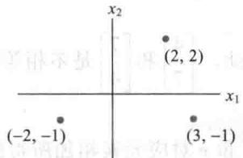
  <figcaption>图 1-7 用点表示向量</figcaption>
</figure>

<figure class="vp-figure">
  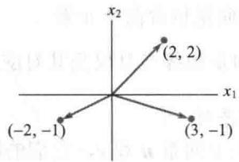
  <figcaption>图 1-8 用箭头表示向量</figcaption>
</figure>

两个向量的和也有很有用的几何意义. 下列规则可用解析几何的知识证明.

向量加法的平行四边形法则

若 $\mathbb{R}^2$ 中向量 $\pmb{u}$ 和 $\pmb{v}$ 用平面上的点表示，则 $u + v$ 对应于以 $\pmb{u},\pmb{0}$ 和 $\pmb{v}$ 为三个顶点的平行四边形的第4个顶点，见图1-9.

<figure class="vp-figure">
  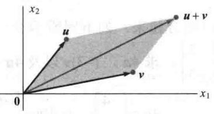
  <figcaption>图1-9 平行四边形法则</figcaption>
</figure>
</Solution>
</Example>

<Example title="例 2">
向量 $\pmb{u} = \begin{bmatrix} 2 \\ 2 \end{bmatrix}, \pmb{v} = \begin{bmatrix} -6 \\ 1 \end{bmatrix}$ 和 $\pmb{u} + \pmb{v} = \begin{bmatrix} -4 \\ 3 \end{bmatrix}$ ，如图1-10所示.

<figure class="vp-figure">
  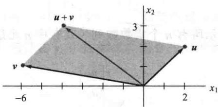
  <figcaption>图1-10</figcaption>
</figure>
</Example>

<Example title="例 3">
设 $\pmb{u} = \begin{bmatrix} 3 \\ -1 \end{bmatrix}$ ，在图上表示向量 $\pmb{u}, 2\pmb{u}$ 和 $-\frac{2}{3}\pmb{u}$ .

<Solution title="解">
见图 1-11，其中表示出向量 u， $2u=\begin{bmatrix}6\\ -2\end{bmatrix}$ 和 $-\frac{2}{3}u=\begin{bmatrix}-2\\ 2/3\end{bmatrix}$ . 2u 表示的箭头长度是 u 表示的箭头长度的 2 倍，指向相同的方向； $-\frac{2}{3}u$ 表示的箭头长度是 u 表示的箭头长度的 2/3 倍且指向相反的方向. 一般地，cu 表示的箭头长度是 u 表示的箭头长度的 $|c|$ 倍. [回忆由（0,0）到 $(a,b)$ 的线段长度为 $\sqrt{a^{2}+b^{2}}$ ，我们将在第 6 章做进一步的讨论.]

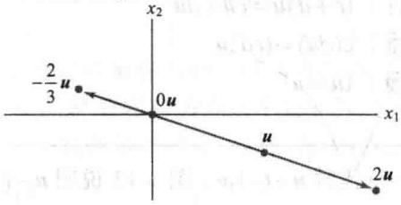  
$\pmb{u}$ 的倍数

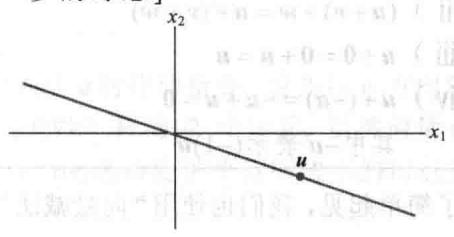  
$\pmb{u}$ 的所有倍数的集合  
图 1-11
</Solution>
</Example>

## $\mathbb{R}^3$ 中的向量

$\mathbb{R}^3$ 中的向量是 $3 \times 1$ 列矩阵，有3个元素。它们表示三维坐标空间中的点，或起点为原点的箭头。图1-12表示向量 $\pmb{a} = \begin{bmatrix} 2 \\ 3 \\ 4 \end{bmatrix}$ 与 $2\pmb{a}$

<figure class="vp-figure">
  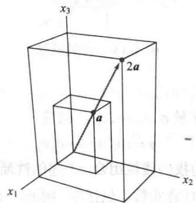
  <figcaption>图1-12 $\mathbb{R}^3$ 中向量的标量乘法</figcaption>
</figure>

## $\mathbb{R}^n$ 中的向量

若 $n$ 是正整数，则 $\mathbb{R}^n$ 表示所有 $n$ 个实数数列（或有序 $n$ 元组）的集合，通常写成 $n \times 1$ 列矩阵的形式，如

$$
\boldsymbol {u} = \left[ \begin{array}{c} u _ {1} \\ u _ {2} \\ \vdots \\ u _ {n} \end{array} \right]
$$

所有元素都是零的向量称为零向量，用0表示（0中元素的个数可由上下文确定）

$\mathbb{R}^n$ 中向量相等以及向量加法与标量乘法运算类似于 $\mathbb{R}^2$ 中的定义. 向量运算有下列性质, 它们可直接由实数的相应性质证明. 见本节末的练习题1与习题33和34.

## $\mathbb{R}^n$ 中向量的代数性质

对 $\mathbb{R}^n$ 中一切向量 $u, v, w$ 以及标量 $c$ 和 $d$ :  
(i) $u + v = v + u$ (V) $c(u + v) = cu + cv$ (ii) $(u + v) + w = u + (v + w)$ (vi) $(c + d)u = cu + du$ (iii) $u + 0 = 0 + u = u$ (vii) $c(du) = (cd)u$ (iv) $u + (-u) = -u + u = 0$ (viii) $1u = u$ 其中 $-u$ 表示 $(-1)u$

为了简单起见，我们也使用“向量减法”，用 $\pmb{u} - \pmb{v}$ 代替 $u + (-1)\pmb{v}$ ，图1-13说明 $\pmb{u} - \pmb{v}$ 是 $\pmb{u}$ 和 $-\pmb{v}$ 的和.

<figure class="vp-figure">
  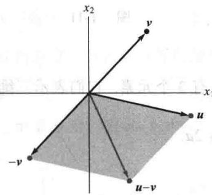
  <figcaption>图 1-13 向量减法</figcaption>
</figure>

## 线性组合

给定 $R^{n}$ 中向量 $v_{1}, v_{2}, \cdots, v_{p}$ 和标量 $c_{1}, c_{2}, \cdots, c_{p}$ ，向量

$$
\boldsymbol {y} = c _ {1} \boldsymbol {v} _ {1} + \dots + c _ {p} \boldsymbol {v} _ {p}
$$

称为向量 $v_{1}, v_{2}, \cdots, v_{p}$ 以 $c_{1}, c_{2}, \cdots, c_{p}$ 为权的线性组合. 上述的性质(ii)使我们在计算这样的线性组合时不必加上括号. 线性组合中的权可为任意实数，包括零. 例如，下列向量都是 $v_{1}$ 和 $v_{2}$ 的线性组合：

$$
\sqrt {3} \boldsymbol {v} _ {1} + \boldsymbol {v} _ {2}, \frac {1}{2} \boldsymbol {v} _ {1} \left(= \frac {1}{2} \boldsymbol {v} _ {1} + 0 \boldsymbol {v} _ {2}\right), \mathbf {0} (= 0 \boldsymbol {v} _ {1} + 0 \boldsymbol {v} _ {2})
$$

<Example title="例 4">
图1-14选择性给出向量 $\pmb{v}_{1} = \begin{bmatrix} -1\\ 1 \end{bmatrix}$ 和 $\pmb{v}_2 = \begin{bmatrix} 2\\ 1 \end{bmatrix}$ 的某些线性组合.（注：图中平行网格线是通过 $\pmb{v}_{1}$ 和 $\pmb{v}_{2}$ 的整数倍画出的.）估计由 $\pmb{v}_{1}$ 和 $\pmb{v}_{2}$ 的线性组合生成的向量 $\pmb{u}$ 和 $\pmb{w}$

<figure class="vp-figure">
  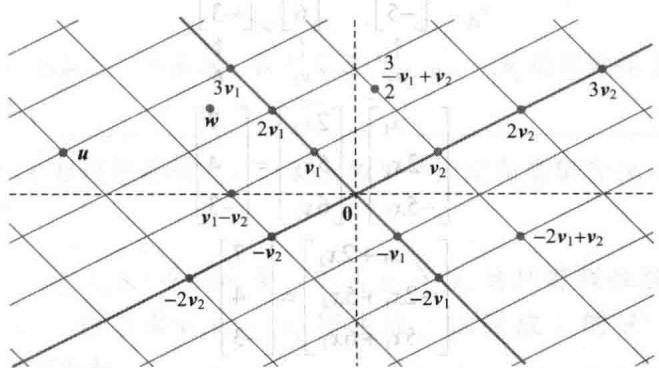
  <figcaption>图1-14 $\pmb{v}_{1}$ 与 $\pmb{v}_{2}$ 的线性组合</figcaption>
</figure>

<Solution title="解">
平行四边形法则说明 $\pmb{u}$ 是 $3\nu_{1}$ 与 $-2\nu_{2}$ 的和，即

$$
\boldsymbol {u} = 3 \boldsymbol {v} _ {1} - 2 \boldsymbol {v} _ {2}
$$

这个 u 的表达式可以解释为经过两条直线路径从原点到达 u 的移动指令。首先在 $v_{1}$ 方向移动 3 个单元到达 $3v_{1}$ ，然后在 $v_{2}$ 方向（平行于经过 $v_{2}$ 和 0 的直线）移动 -2 个单元。虽然向量 w 不在网格线上，但它在两条线的正中间，在由 $(5/2)v_{1}$ 和 $(-1/2)v_{2}$ 所确定的平行四边形的顶点处（见图 1-15），因此

$$
\boldsymbol {w} = \frac {5}{2} \boldsymbol {v} _ {1} - \frac {1}{2} \boldsymbol {v} _ {2}
$$

$$
\Sigma = \gamma , E = \text {注}
$$

<figure class="vp-figure">
  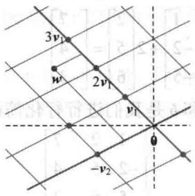
  <figcaption>图 1-15</figcaption>
</figure>

下面的例子把线性组合与 1.1 节、1.2 节的存在性问题联系起来.
</Solution>
</Example>

<Example title="例 5">
设 $\pmb{a}_{1} = \begin{bmatrix} 1 \\ -2 \\ -5 \end{bmatrix}$ , $\pmb{a}_{2} = \begin{bmatrix} 2 \\ 5 \\ 6 \end{bmatrix}$ , $\pmb{b} = \begin{bmatrix} 7 \\ 4 \\ -3 \end{bmatrix}$ , 确定 $\pmb{b}$ 能否写成 $\pmb{a}_{1}$ 和 $\pmb{a}_{2}$ 的线性组合, 也就是说, 确定是否存在权 $x_{1}$ 和 $x_{2}$ 使

$$
x _ {1} \boldsymbol {a} _ {1} + x _ {2} \boldsymbol {a} _ {2} = \boldsymbol {b}\tag{1}
$$

若向量方程（1）有解，求它的解.

<Solution title="解">
根据向量加法和标量乘法的定义把向量方程

$$
\begin{array}{r l} & x _ {1} \left[ \begin{array}{c} 1 \\ - 2 \\ - 5 \end{array} \right] + x _ {2} \left[ \begin{array}{c} 2 \\ 5 \\ 6 \end{array} \right] = \left[ \begin{array}{c} 7 \\ 4 \\ - 3 \end{array} \right] \\ & \uparrow \\ & a _ {1} \quad \uparrow \\ & a _ {2} \quad \uparrow \\ & b \end{array}
$$

写成

$$
\left[ \begin{array}{c} x _ {1} \\ - 2 x _ {1} \\ - 5 x _ {1} \end{array} \right] + \left[ \begin{array}{l} 2 x _ {2} \\ 5 x _ {2} \\ 6 x _ {2} \end{array} \right] = \left[ \begin{array}{c} 7 \\ 4 \\ - 3 \end{array} \right]
$$

或

$$
\left[ \begin{array}{c} x _ {1} + 2 x _ {2} \\ - 2 x _ {1} + 5 x _ {2} \\ - 5 x _ {1} + 6 x _ {2} \end{array} \right] = \left[ \begin{array}{c} 7 \\ 4 \\ - 3 \end{array} \right]\tag{2}
$$

（2）式左右两边的向量相等当且仅当它们的对应元素相等. 即 $x_{1}$ 和 $x_{2}$ 满足向量方程（1）当且仅当 $x_{1}$ 和 $x_{2}$ 满足方程组

$$
\begin{array}{r l} x _ {1} + 2 x _ {2} & = 7 \\ - 2 x _ {1} + 5 x _ {2} & = 4 \\ - 5 x _ {1} + 6 x _ {2} & = - 3 \end{array}\tag{3}
$$

我们用行化简算法将上述线性方程组的增广矩阵化简，以此解方程组 ① ：

$$
\left[ \begin{array}{r r r} 1 & 2 & 7 \\ - 2 & 5 & 4 \\ - 5 & 6 & - 3 \end{array} \right] \sim \left[ \begin{array}{r r r} 1 & 2 & 7 \\ 0 & 9 & 1 8 \\ 0 & 1 6 & 3 2 \end{array} \right] \sim \left[ \begin{array}{r r r} 1 & 2 & 7 \\ 0 & 1 & 2 \\ 0 & 1 6 & 3 2 \end{array} \right] \sim \left[ \begin{array}{r r r} 1 & 0 & 3 \\ 0 & 1 & 2 \\ 0 & 0 & 0 \end{array} \right]
$$

（3）的解是 $x_{1} = 3, x_{2} = 2$ ，因此 $\pmb{b}$ 是 $\pmb{a}_{1}$ 与 $\pmb{a}_{2}$ 的线性组合，权为 $x_{1} = 3$ 和 $x_{2} = 2$ ，即

$$
3 \left[ \begin{array}{c} 1 \\ - 2 \\ - 5 \end{array} \right] + 2 \left[ \begin{array}{l} 2 \\ 5 \\ 6 \end{array} \right] = \left[ \begin{array}{c} 7 \\ 4 \\ - 3 \end{array} \right]
$$
</Solution>
</Example>

例 5 中原来的向量 $a_{1}$ ， $a_{2}$ 和 b 是我们进行行化简的增广矩阵的列：

$$
\left[ \begin{array}{c c c} 1 & 2 & 7 \\ - 2 & 5 & 4 \\ - 5 & 6 & - 3 \\ \uparrow & \uparrow & \uparrow \\ a _ {1} & a _ {2} & b \end{array} \right]
$$

为简洁起见，我们将此矩阵写成另一形式，即

$$
\left[ \begin{array}{c c c} \boldsymbol {a} _ {1} & \boldsymbol {a} _ {2} & \boldsymbol {b} \end{array} \right]\tag{4}
$$

这样，由向量方程（1）可以直接写出增广矩阵而不必经过例5中的中间步骤。按它们在（1）中出现的次序排列，就得到矩阵（4）。

由上述讨论可以得到以下结论.

向量方程

$$
x _ {1} \boldsymbol {a} _ {1} + x _ {2} \boldsymbol {a} _ {2} + \dots + x _ {n} \boldsymbol {a} _ {n} = \boldsymbol {b}
$$

和增广矩阵为

$$
\left[ \begin{array}{c c c c c} \boldsymbol {a} _ {1} & \boldsymbol {a} _ {2} & \dots & \boldsymbol {a} _ {n} & \boldsymbol {b} \end{array} \right]\tag{5}
$$

的线性方程组有相同的解集．特别地，b 可表示为 $a_{1}, a_{2}, \cdots, a_{n}$ 的线性组合当且仅当对应于（5）式的线性方程组有解.

线性代数的一个主要思想是研究可以表示为某一固定向量集合 $\{v_{1}, v_{2}, \cdots, v_{p}\}$ 的线性组合的所有向量.

定义 若 $v_{1}, v_{2}, \cdots, v_{p}$ 是 $R^{n}$ 中的向量，则 $v_{1}, v_{2}, \cdots, v_{p}$ 的所有线性组合所成的集合用记号 $\operatorname{Span}\{v_{1}, v_{2}, \cdots, v_{p}\}$ 表示，称为由 $v_{1}, v_{2}, \cdots, v_{p}$ 所生成（或张成）的 $R^{n}$ 的子集．也就是说， $\operatorname{Span}\{v_{1}, v_{2}, \cdots, v_{p}\}$ 是所有形如

$$
c _ {1} \boldsymbol {v} _ {1} + c _ {2} \boldsymbol {v} _ {2} + \dots + c _ {p} \boldsymbol {v} _ {p}
$$

的向量的集合，其中 $c_{1}, c_{2}, \cdots, c_{p}$ 为标量.

要判断向量 b 是否属于 $\operatorname{Span}\{\nu_{1},\nu_{2},\cdots,\nu_{p}\}$ ，就是判断向量方程

$$
x _ {1} \pmb {\nu} _ {1} + x _ {2} \pmb {\nu} _ {2} + \dots + x _ {p} \pmb {\nu} _ {p} = \pmb {b}
$$

是否有解，或等价地，判断增广矩阵为 $[\pmb{v}_1\pmb{v}_2\dots \pmb{v}_p\pmb{b}]$ 的线性方程组是否有解.

$\operatorname{Span}\{\nu_{1},\nu_{2},\cdots,\nu_{p}\}$ 包含 $\nu_{1}$ 的所有倍数，这是因为 $cv_{1}=cv_{1}+0\nu_{2}+\cdots+0\nu_{p}$ 。特别地，它一定包含零向量。

Span $\{\pmb{v}\}$ 与Span $\{\pmb{u},\pmb{v}\}$ 的几何解释

设 $\pmb{\nu}$ 是 $\mathbb{R}^3$ 中的向量，那么 $\operatorname{Span}\{\pmb{\nu}\}$ 就是 $\pmb{\nu}$ 的所有标量倍数的集合，也就是 $\mathbb{R}^3$ 中通过 $\pmb{\nu}$ 和0的直线上所有点的集合，见图1-16.

若 $\pmb{u}$ 和 $\pmb{v}$ 是 $\mathbb{R}^3$ 中的非零向量， $\pmb{v}$ 不是 $\pmb{u}$ 的倍数，则 $\operatorname{Span}\{\pmb{u},\pmb{v}\}$ 是 $\mathbb{R}^3$ 中包含 $\pmb{u}$ ， $\pmb{v}$ 和 $\pmb{0}$ 的平面。特别地， $\operatorname{Span}\{\pmb{u},\pmb{v}\}$ 包含 $\mathbb{R}^3$ 中通过 $\pmb{u}$ 与 $\pmb{0}$ 的直线，也包含通过 $\pmb{v}$ 与 $\pmb{0}$ 的直线（见图1-17）。

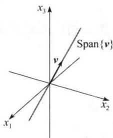

<figure class="vp-figure">
  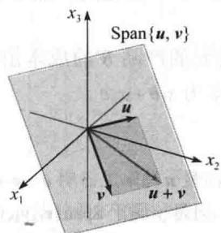
  <figcaption>图1-16 Span $\{\pmb{v}\}$ 是通过原点的直线</figcaption>
</figure>
图1-17 Span $\{\pmb {u},\pmb {v}\}$ 是通过原点的平面

<Example title="例 6">
设 $\pmb{a}_{1} = \begin{bmatrix} 1 \\ -2 \\ 3 \end{bmatrix}$ , $\pmb{a}_{2} = \begin{bmatrix} 5 \\ -13 \\ -3 \end{bmatrix}$ , $\pmb{b} = \begin{bmatrix} -3 \\ 8 \\ 1 \end{bmatrix}$ , 则 $\operatorname{Span}\{\pmb{a}_1, \pmb{a}_2\}$ 是 $\mathbb{R}^3$ 中通过原点的一个平面, 问

b 是否在该平面内？

<Solution title="解">
方程 $x_{1}a_{1} + x_{2}a_{2} = b$ 是否有解？为回答此问题，把增广矩阵 $[a_{1}, a_{2}, b]$ 进行行化简：

$$
\left[ \begin{array}{r r r} 1 & 5 & - 3 \\ - 2 & - 1 3 & 8 \\ 3 & - 3 & 1 \end{array} \right] \sim \left[ \begin{array}{r r r} 1 & 5 & - 3 \\ 0 & - 3 & 2 \\ 0 & - 1 8 & 1 0 \end{array} \right] \sim \left[ \begin{array}{r r r} 1 & 5 & - 3 \\ 0 & - 3 & 2 \\ 0 & 0 & - 2 \end{array} \right]
$$

第3个方程为 $0 = -2$ ，它说明方程组无解.向量方程 $x_{1}\pmb{a}_{1} + x_{2}\pmb{a}_{2} = \pmb{b}$ 无解，故 $\pmb{b}$ 不属于 $\operatorname {Span}\{\pmb {a}_1,\pmb {a}_2\}$
</Solution>
</Example>

## 应用中的线性组合

本节最后一个例子说明标量乘法与线性组合在某个量（例如“成本”）被分解成若干部分时的一个应用。这个例子的基本原理是，生产某种产品的单位成本已知时，可求出生产若干个单位的成本。

$$
\{\text { 单位数量 } \} \times \{\text { 每单位成本 } \} = \{\text { 总成本 } \}
$$

<Example title="例 7">
某公司生产两种产品，对于1美元价值的产品 $B$ ，公司需耗费0.45美元材料，0.25美元劳动，0.15美元管理费用．对1美元价值的产品 $C$ ，公司耗费0.40美元材料，0.30美元劳动，0.15美元管理费用．设

$$
\pmb {b} = \left[ \begin{array}{l} 0. 4 5 \\ 0. 2 5 \\ 0. 1 5 \end{array} \right], \pmb {c} = \left[ \begin{array}{l} 0. 4 0 \\ 0. 3 0 \\ 0. 1 5 \end{array} \right]
$$

则 b 和 c 称为两种产品的 “单位美元产出成本”

a. 向量100b的经济解释是什么？

b. 设公司希望生产 $x_{1}$ 美元产品 $B$ 和 $x_{2}$ 美元产品 $C$ . 给出描述该公司花费的各部分成本（材料，劳动，管理费用）的向量.

<Solution title="解">
a. 我们有

$$
1 0 0 \boldsymbol {b} = 1 0 0 \left[ \begin{array}{l} 0. 4 5 \\ 0. 2 5 \\ 0. 1 5 \end{array} \right] = \left[ \begin{array}{l} 4 5 \\ 2 5 \\ 1 5 \end{array} \right]
$$

向量100b列出生产100美元的产品B需要的各种成本，即45美元材料、25美元劳动、15美元管理费用.

b. 生产 $x_{1}$ 美元的产品 $B$ 的成本由向量 $x_{1}b$ 给出，生产 $x_{2}$ 美元的产品 $C$ 的成本由向量 $x_{2}c$ 给出。因此总的成本为 $x_{1}b + x_{2}c$ 。
</Solution>
</Example>

<Block title="练习题">
1. 对 $R^{n}$ 中的任意向量 u 与 v，证明 $u + v = v + u$ .

2. $h$ 取什么值时，向量 $\pmb{y}$ 属于 $\operatorname{Span}\{\nu_1, \nu_2, \nu_3\}$ ？设

$$
\boldsymbol {v} _ {1} = \left[ \begin{array}{l} 1 \\ - 1 \\ - 2 \end{array} \right], \boldsymbol {v} _ {2} = \left[ \begin{array}{l} 5 \\ - 4 \\ - 7 \end{array} \right], \boldsymbol {v} _ {3} = \left[ \begin{array}{l} - 3 \\ 1 \\ 0 \end{array} \right], \boldsymbol {y} = \left[ \begin{array}{l} - 4 \\ 3 \\ h \end{array} \right]
$$

3. 假设 $w_{1}, w_{2}, w_{3}$ , $\pmb{u}$ 和 $\pmb{v} \in \mathbb{R}^{n}$ , 并且 $\pmb{u}, \pmb{v} \in \operatorname{Span}\{\pmb{w}_{1}, w_{2}, w_{3}\}$ . 证明 $\pmb{u} + \pmb{v} \in \operatorname{Span}\{\pmb{w}_{1}, w_{2}, w_{3}\}$ . (提示: 此问题要求使用向量集合张成的定义. 做练习之前可先复习前面的定义.)
</Block>

<Block title="习题1.3">
在习题 1 和 2 中，计算 $u + v$ 与 u - 2v.

$$
1. \quad \boldsymbol {u} = \left[ \begin{array}{c} - 1 \\ 2 \end{array} \right], \boldsymbol {v} = \left[ \begin{array}{c} - 3 \\ - 1 \end{array} \right]
$$

$$
2. \quad \boldsymbol {u} = \left[ \begin{array}{l} 3 \\ 2 \end{array} \right], \boldsymbol {v} = \left[ \begin{array}{l} 2 \\ - 1 \end{array} \right]
$$

在习题3和4中，用箭头在 $xy$ 平面上表示下列向量： $\pmb {u},\pmb {v}, - \pmb {v}, - 2\pmb {v},\pmb {u} + \pmb {v},\pmb {u} - \pmb {v},\pmb {u} - 2\pmb{v}$ ，注意 $\pmb {u} - \pmb{v}$ 是三个顶点为 $\pmb {u},\pmb{0}$ 和- $\pmb{v}$ 的平行四边形的另一个顶点.

3. u 与 v 如习题 1.

4. u 与 v 如习题 2.

在习题 5 和 6 中, 写出等价于所给向量方程的线性方程组.

$$
x _ {1} \left[ \begin{array}{c} 6 \\ - 1 \\ 5 \end{array} \right] + x _ {2} \left[ \begin{array}{c} - 3 \\ 4 \\ 0 \end{array} \right] = \left[ \begin{array}{c} 1 \\ - 7 \\ - 5 \end{array} \right]
$$

$$
6. x _ {1} \left[ \begin{array}{c} - 2 \\ 3 \end{array} \right] + x _ {2} \left[ \begin{array}{l} 8 \\ 5 \end{array} \right] + x _ {3} \left[ \begin{array}{c} 1 \\ - 6 \end{array} \right] = \left[ \begin{array}{l} 0 \\ 0 \end{array} \right]
$$

利用下图把习题7和8中的向量用 $\pmb{u}$ 和 $\pmb{v}$ 的线性组合表示． $\mathbb{R}^2$ 中的任意向量是否一定是向量 $\pmb{u}$ 和 $\pmb{v}$ 的线性组合？

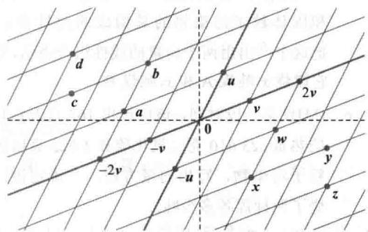

7. 向量 $a, b, c, d$ 8. 向量 $w, x, y, z$

在习题 9 和 10 中写出等价于给出的方程组的向量方程.

9.

$$
x _ {2} + 5 x _ {3} = 0
$$

$$
4 x _ {1} + x _ {2} + 3 x _ {3} = 9
$$

$$
4 x _ {1} + 6 x _ {2} - x _ {3} = 0
$$

$$
x _ {1} - 7 x _ {2} + 2 x _ {3} = 2
$$

$$
- x _ {1} + 3 x _ {2} - 8 x _ {3} = 0
$$

$$
8 x _ {1} + 6 x _ {2} - 5 x _ {3} = 1 5
$$

在习题 11 和 12 中，确定 b 是否是 $a_{1}, a_{2}, a_{3}$ 的

线性组合.

$$
\boldsymbol {a} _ {1} = \left[ \begin{array}{l} 1 \\ - 2 \\ 0 \end{array} \right], \boldsymbol {a} _ {2} = \left[ \begin{array}{l} 0 \\ 1 \\ 2 \end{array} \right], \boldsymbol {a} _ {3} = \left[ \begin{array}{l} 5 \\ - 6 \\ 8 \end{array} \right], \boldsymbol {b} = \left[ \begin{array}{l} 2 \\ - 1 \\ 6 \end{array} \right]
$$

$$
\boldsymbol {a} _ {1} = \left[ \begin{array}{c} 1 \\ - 2 \\ 2 \end{array} \right], \boldsymbol {a} _ {2} = \left[ \begin{array}{l} 0 \\ 5 \\ 5 \end{array} \right], \boldsymbol {a} _ {3} = \left[ \begin{array}{l} 2 \\ 0 \\ 8 \end{array} \right], \boldsymbol {b} = \left[ \begin{array}{l} - 5 \\ 1 1 \\ - 7 \end{array} \right]
$$

在习题 13 和 14 中, 确定 b 是否是矩阵 A 的各列向量的线性组合.

$$
A = \left[ \begin{array}{r r r} 1 & - 4 & 2 \\ 0 & 3 & 5 \\ - 2 & 8 & - 4 \end{array} \right], \boldsymbol {b} = \left[ \begin{array}{l} 3 \\ - 7 \\ - 3 \end{array} \right]
$$

$$
A = \left[ \begin{array}{r r r} 1 & - 2 & - 6 \\ 0 & 3 & 7 \\ 1 & - 2 & 5 \end{array} \right], \boldsymbol {b} = \left[ \begin{array}{l} 1 1 \\ - 5 \\ 9 \end{array} \right]
$$

在习题15和16中，写出属于 $\operatorname{Span}\{\nu_1, \nu_2\}$ 的5个向量以及用来生成这些向量的 $\nu_1, \nu_2$ 的权，并写出这些向量的3个元素。不用画图。

15. $v_{1}=\begin{bmatrix}7\\ 1\\ -6\end{bmatrix},v_{2}=\begin{bmatrix}-5\\ 3\\ 0\end{bmatrix}$

16. $v_{1}=\begin{bmatrix}3\\ 0\\ 2\end{bmatrix},v_{2}=\begin{bmatrix}-2\\ 0\\ 3\end{bmatrix}$

17. 设 $a_{1}=\begin{bmatrix}1\\ 4\\ -2\end{bmatrix}$ ， $a_{2}=\begin{bmatrix}-2\\ -3\\ 7\end{bmatrix}$ ， $b=\begin{bmatrix}4\\ 1\\ h\end{bmatrix}$ ，当 h 取何值时 b 在 $a_{1}$ 和 $a_{2}$ 生成的平面内？

18. 设 $v_{1}=\begin{bmatrix}1\\ 0\\ -2\end{bmatrix},v_{2}=\begin{bmatrix}-3\\ 1\\ 8\end{bmatrix},y=\begin{bmatrix}h\\ -5\\ -3\end{bmatrix}$ ，当 h 取何值时 y 在 $v_{1}$ 和 $v_{2}$ 生成的平面内？

19. 对下面的向量，给出 $\operatorname{Span}\{\nu_1, \nu_2\}$ 的几何解释.

$$
\boldsymbol {v} _ {1} = \left[ \begin{array}{c} 8 \\ 2 \\ - 6 \end{array} \right], \boldsymbol {v} _ {2} = \left[ \begin{array}{c} 1 2 \\ 3 \\ - 9 \end{array} \right]
$$

20. 对习题 16 中的向量，给出 Span $\{v_{1}, v_{2}\}$ 的几何解释.

21. 设 $u=\begin{bmatrix}2\\ -1\end{bmatrix}, v=\begin{bmatrix}2\\ 1\end{bmatrix}$ ，证明：对所有 h 和 k， $\begin{bmatrix}h\\ k\end{bmatrix}$ 属于 Span $\{u,v\}$ .

22. 构造一 $3 \times 3$ 无零元素的矩阵 $A$ 和 $\mathbb{R}^3$ 中的一个向量 $\pmb{b}$ ，使得 $\pmb{b}$ 不属于 $A$ 的列向量的生成集。在习题23和24中，判断下列命题的真假，给出理由。

23. a. 向量 $\left[ \begin{array}{c} -4 \\ 3 \end{array} \right]$ 的另一种写法是[-4 3].  
b. 平面上对应于 $\left[ \begin{array}{c} -2 \\ 5 \end{array} \right]$ 和 $\left[ \begin{array}{c} -5 \\ 2 \end{array} \right]$ 的两点位于通过原点的一条直线上.  
c. 向量 $\frac{1}{2} v_1$ 是向量 $v_1$ 和 $v_2$ 的线性组合.  
d. 增广矩阵为 $[a_1, a_2, a_3, b]$ 的线性方程组的解集与向量方程 $x_1 a_1 + x_2 a_2 + x_3 a_3 = b$ 的解集相同.

e. 集 $\operatorname{Span}\{\pmb{u},\pmb{v}\}$ 总是表示通过原点的一个平面.

24. a. 任意5个实数组成的数列是 $R^{5}$ 中的一个向量.
b. 向量 u 等于向量 u-v 与向量 v 之和.
c. 在线性组合 $c_{1}v_{1} + c_{2}v_{2} + \cdots + c_{p}v_{p}$ 中，权 $c_{1}, c_{2}, \cdots, c_{p}$ 不能全为 0.
d. 当 u 和 v 是非零向量时，Span $\{u,v\}$ 包含通过 u 与原点的直线.
e. 对应于增广矩阵 $[a_{1}, a_{2}, a_{3}, b]$ 的线性方程组是否有解的问题等价于 b 是否属于 Span $\{a_{1}, a_{2}, a_{3}\}$ 的问题.

25. 设 $A=\begin{bmatrix}1&0&-4\\ 0&3&-2\\ -2&6&3\end{bmatrix}, b=\begin{bmatrix}4\\ 1\\ -4\end{bmatrix}$ . 以 $a_{1}, a_{2}, a_{3}$ 表示
A 的各列，并设 $W = \text{Span}\{a_{1}, a_{2}, a_{3}\}$ .
a. b 是否属于 $\{a_{1}, a_{2}, a_{3}\}$ ？在 $\{a_{1}, a_{2}, a_{3}\}$ 中有多少个向量？
b. b 是否属于 W? W 中有多少个向量？
c. 证明： $a_{1}$ 属于 W （提示：不必作行变换）.

26. 设 $A = \begin{bmatrix} 2 & 0 & 6 \\ -1 & 8 & 5 \\ 1 & -2 & 1 \end{bmatrix}$ , $\pmb{b} = \begin{bmatrix} 10 \\ 3 \\ 3 \end{bmatrix}$ , $W$ 为 $A$ 的列向

量的所有线性组合的集合.
a. b 是否属于 W ?
b. 证明 A 的第 3 列属于 W

27. 某矿业公司有两个矿，#1矿每天生产20吨铜和550公斤银，#2矿每天生产30吨铜和500公斤银。设 $v_{1}=\begin{bmatrix}20\\ 550\end{bmatrix},v_{2}=\begin{bmatrix}30\\ 500\end{bmatrix}$ ，则 $v_{1}$ 和 $v_{2}$ 分别表示#1矿与#2矿的“日产出”。
a. 向量 $5v_{1}$ 有什么实际意义？
b. 设该公司的#1矿生产 $x_{1}$ 天，#2矿生产 $x_{2}$ 天，写出表示该公司生产150吨铜与2825公斤银时各矿生产天数的向量方程。不必解方程。
c. [M] 解 (b). 中的方程

c. [M]解（b）中的方程.

28. 某蒸汽厂烧两种煤：无烟煤（A）和烟煤（B）.
每吨煤 A 燃烧产生 27.6 百万焦耳的热量、3100 克二氧化硫和 250 克固体粒子污染物。每吨煤 B 燃烧产生 30.2 百万焦耳的热量、6400 克二氧化硫和 360 克固体粒子污染物。
a. 若该厂燃烧 $x_{1}$ 吨煤 A 和 $x_{2}$ 吨煤 B，它产出多少热量？
b. 设该厂的产出可用它产出的热量、二氧化硫和固体粒子污染物的量构成的向量表示。把这个产出用两个向量的线性组合表示，设它燃烧 $x_{1}$ 吨煤 A 和 $x_{2}$ 吨煤 B。
c. [M]设某一段时间，该厂产出162百万焦耳的热量、23610克二氧化硫和1623克固体粒子污染物，写出向量方程，并确定该厂烧了两种煤各多少吨。

29. 设 $v_{1}, v_{2}, \cdots, v_{k}$ 是 $R^{3}$ 中的点，且对 $j = 1, 2, \cdots, k$ 在点 $v_{j}$ 有质量为 $m_{j}$ 的物体。物理学家称这些物体为质点。这个质点系的总质量为 $m = m_{1} + m_{2} + \cdots + m_{k}$ 质点系的重心（或质心）是 $\overline{v} = \frac{1}{m}(m_{1}v_{1} + m_{2}v_{2} + \cdots + m_{k}v_{k})$

计算由下列质点组成的质点系的重心（见下图）：

<table><tr><td>点</td><td>质量</td></tr><tr><td> $v_1 = (5, -4, 3)$ </td><td>2 克</td></tr><tr><td> $v_2 = (4, 3, -2)$ </td><td>5 克</td></tr><tr><td> $v_3 = (-4, -3, -1)$ </td><td>2 克</td></tr><tr><td> $v_4 = (-9, 8, 6)$ </td><td>1 克</td></tr></table>

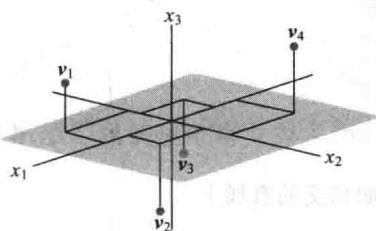

30. 设 v 为习题 29 中的一组质点 $v_{1}, \cdots, v_{k}$ 的质心，v 是否属于 Span $\{v_{1}, \cdots, v_{k}\}$ ？给出理由.

31. 一块密度和厚度均匀的三角形薄板，其三个顶点分别是 $\pmb{v}_{1} = (0,1),\pmb{v}_{2} = (8,1),\pmb{v}_{3} = (2,4)$ ，如下图所示，且其质量为3克.

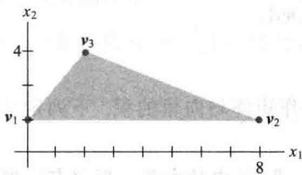

a. 求这块薄板的质心坐标 $(x, y)$ . 这块薄板的“平衡点”与在三个顶点上有1克质量的薄板的质心相重合.

b. 如何在三个顶点上分布额外的 6 克物质, 使得薄板的平衡点定位在点 (2,2) 上? (提示: 设 $w_{1}, w_{2}, w_{3}$ 分别表示加在三个顶点上的质量, 则 $w_{1} + w_{2} + w_{3} = 6$ .)

32. 考虑 $\mathbb{R}^2$ 中的向量 $\pmb{v}_1, \pmb{v}_2, \pmb{v}_3$ 和 $\pmb{b}$ ，如下图所示。方程 $x_1\pmb{v}_1 + x_2\pmb{v}_2 + x_3\pmb{v}_3 = \pmb{b}$ 是否有解？解是否唯一？使用图形给出解释。

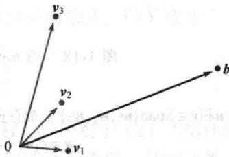

33. 设 $\boldsymbol{u}=(u_{1},u_{2},\cdots,u_{n}),\boldsymbol{v}=(v_{1},v_{2},\cdots,v_{n}),\boldsymbol{w}=(w_{1},w_{2},\cdots,w_{n})$ ，证明 $R^{n}$ 的下列代数性质：
a. $(\boldsymbol{u}+\boldsymbol{v})+\boldsymbol{w}=\boldsymbol{u}+(\boldsymbol{v}+\boldsymbol{w})$ .
b. $c(\boldsymbol{u}+\boldsymbol{v})=cu+cv$ ，其中c为任意数.

34. 设 $\boldsymbol{u}=(u_{1},u_{2},\cdots,u_{n})$ ，证明 $R^{n}$ 的下列代数性质：
a. $u + (-u) = (-u) + u = 0$ .
b. $c(du) = (cd)u$ ，其中c,d为任意数.
</Block>

<Block title="练习题答案">
1. 取 $R^{n}$ 中任意向量 $\boldsymbol{u}=(u_{1},u_{2},\cdots,u_{n}),\quad\boldsymbol{v}=(v_{1},v_{2},\cdots,v_{n})$

$u+v=(u_{1}+v_{1},u_{2}+v_{2},\cdots,u_{n}+v_{n})$ 向量加法的定义 $=(v_{1}+u_{1},v_{2}+u_{2},\cdots,v_{n}+u_{n})$ R中加法交换律 $=v+u$ 向量加法的定义

2. 向量 y 属于 $\operatorname{Span}\left\{\nu_{1}, \nu_{2}, \nu_{3}\right\}$ 当且仅当存在数 $x_{1}, x_{2}, x_{3}$ ，使得

$$
x _ {1} \left[ \begin{array}{l} 1 \\ - 1 \\ - 2 \end{array} \right] + x _ {2} \left[ \begin{array}{l} 5 \\ - 4 \\ - 7 \end{array} \right] + x _ {3} \left[ \begin{array}{c} - 3 \\ 1 \\ 0 \end{array} \right] = \left[ \begin{array}{c} - 4 \\ 3 \\ h \end{array} \right]
$$

该向量方程等价于含3个未知数的3个方程组成的方程组．化简这个方程组的增广矩阵，得

$$
\left[ \begin{array}{r r r r} 1 & 5 & - 3 & - 4 \\ - 1 & - 4 & 1 & 3 \\ - 2 & - 7 & 0 & h \end{array} \right] \sim \left[ \begin{array}{r r r r} 1 & 5 & - 3 & - 4 \\ 0 & 1 & - 2 & - 1 \\ 0 & 3 & - 6 & h - 8 \end{array} \right] \sim \left[ \begin{array}{r r r r} 1 & 5 & - 3 & - 4 \\ 0 & 1 & - 2 & - 1 \\ 0 & 0 & 0 & h - 5 \end{array} \right]
$$

当且仅当第4列没有主元时，方程组是相容的，也就是说，h-5必须为0. 因此当且仅当h=5时，y属于 $Span\{v_{1}, v_{2}, v_{3}\}$ . 见图1-18.

记住：方程组中有自由变量并不能保证方程组有解.

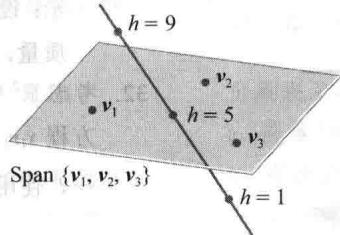

图1-18 当 $h = 5$ 时，点 $\left[ \begin{array}{c} -4\\ 3\\ h \end{array} \right]$ 位于与平面相交的直线上

3. 由于向量 $\pmb{u}$ 和 $\pmb{v} \in \mathrm{Span}\{\pmb{w}_1, \pmb{w}_2, \pmb{w}_3\}$ ，故存在标量 $c_1, c_2, c_3$ 和 $d_1, d_2, d_3$ ，使得

$$
\boldsymbol {u} = c _ {1} \boldsymbol {w} _ {1} + c _ {2} \boldsymbol {w} _ {2} + c _ {3} \boldsymbol {w} _ {3}, \quad \boldsymbol {v} = d _ {1} \boldsymbol {w} _ {1} + d _ {2} \boldsymbol {w} _ {2} + d _ {3} \boldsymbol {w} _ {3}
$$

有

$$
\begin{array}{r l} \boldsymbol {u} + \boldsymbol {v} & = c _ {1} \boldsymbol {w} _ {1} + c _ {2} \boldsymbol {w} _ {2} + c _ {3} \boldsymbol {w} _ {3} + d _ {1} \boldsymbol {w} _ {1} + d _ {2} \boldsymbol {w} _ {2} + d _ {3} \boldsymbol {w} _ {3} \\ & = (c _ {1} + d _ {1}) \boldsymbol {w} _ {1} + (c _ {2} + d _ {2}) \boldsymbol {w} _ {2} + (c _ {3} + d _ {3}) \boldsymbol {w} _ {3} \end{array}
$$

因为 $c_{1} + d_{1}, c_{2} + d_{2}, c_{3} + d_{3}$ 也是标量，所以 $\pmb{u} + \pmb{v} \in \mathrm{Span}\{\pmb{w}_{1}, \pmb{w}_{2}, \pmb{w}_{3}\}$ .
</Block>
