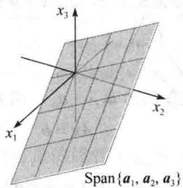
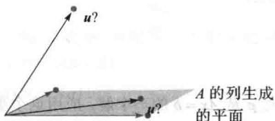

import Guide from '@/components/Guide.astro';
import Knowledge from '@/components/Knowledge.astro';
import Example from '@/components/Example.astro';
import Analysis from '@/components/Analysis.astro';
import Solution from '@/components/Solution.astro';
import Variant from '@/components/Variant.astro';
import Note from '@/components/Note.astro';
import Block from '@/components/Block.astro';
import Method from '@/components/Method.astro';
import Exercise from '@/components/Exercise.astro';

线性代数中的一个基本思想是把向量的线性组合看作矩阵与向量的积. 下列定义允许我们将 1.3 节的某些概念用新的方法表述出来.

定义 若 A 是 $m \times n$ 矩阵，它的各列为 $a_{1}, \cdots, a_{n}$ . 若 x 是 $R^{n}$ 中的向量，则 A 与 x 的积（记为 Ax）就是 A 的各列以 x 中对应元素为权的线性组合，即

$$
A \pmb {x} = [ \pmb {a} _ {1} \quad \pmb {a} _ {2} \quad \dots \quad \pmb {a} _ {n} ] \left[ \begin{array}{c} x _ {1} \\ x _ {2} \\ \vdots \\ x _ {n} \end{array} \right] = x _ {1} \pmb {a} _ {1} + x _ {2} \pmb {a} _ {2} + \dots + x _ {n} \pmb {a} _ {n}
$$

Ax 仅当 A 的列数等于 x 中的元素个数时才有定义.

<Example title="例 1">
a.

$$
\left[ \begin{array}{r r r} 1 & 2 & - 1 \\ 0 & - 5 & 3 \end{array} \right] \left[ \begin{array}{l} 4 \\ 3 \\ 7 \end{array} \right] = 4 \left[ \begin{array}{l} 1 \\ 0 \end{array} \right] + 3 \left[ \begin{array}{l} 2 \\ - 5 \end{array} \right] + 7 \left[ \begin{array}{l} - 1 \\ 3 \end{array} \right] = \left[ \begin{array}{l} 4 \\ 0 \end{array} \right] + \left[ \begin{array}{l} 6 \\ - 1 5 \end{array} \right] + \left[ \begin{array}{l} - 7 \\ 2 1 \end{array} \right] = \left[ \begin{array}{l} 3 \\ 6 \end{array} \right]
$$

b.

$$
\left[ \begin{array}{l l} 2 & - 3 \\ 8 & 0 \\ - 5 & 2 \end{array} \right] \left[ \begin{array}{l} 4 \\ 7 \end{array} \right] = 4 \left[ \begin{array}{l} 2 \\ 8 \\ - 5 \end{array} \right] + 7 \left[ \begin{array}{l} - 3 \\ 0 \\ 2 \end{array} \right] = \left[ \begin{array}{l} 8 \\ 3 2 \\ - 2 0 \end{array} \right] + \left[ \begin{array}{l} - 2 1 \\ 0 \\ 1 4 \end{array} \right] = \left[ \begin{array}{l} - 1 3 \\ 3 2 \\ - 6 \end{array} \right]
$$
</Example>

<Example title="例 2">
对 $R^{m}$ 中的 $v_{1}, v_{2}, v_{3}$ ，把线性组合 $3v_{1}-5v_{2}+7v_{3}$ 表示为矩阵乘向量的形式.

<Solution title="解">
把 $v_{1}, v_{2}, v_{3}$ 排列成矩阵 A，把数 3，-5，7 排列成向量 x，即

$$
3 \pmb {v} _ {1} - 5 \pmb {v} _ {2} + 7 \pmb {v} _ {3} = \left[ \begin{array}{l l l} \pmb {v} _ {1} & \pmb {v} _ {2} & \pmb {v} _ {3} \end{array} \right] \left[ \begin{array}{c} 3 \\ - 5 \\ 7 \end{array} \right] = A \pmb {x}
$$

在1.3节中我们学习了将线性方程组写成包含向量的线性组合的向量方程.例如，方程组

$$
\begin{array}{r l} x _ {1} + 2 x _ {2} - & x _ {3} = 4 \\ - 5 x _ {2} + 3 x _ {3} = 1 \end{array}\tag{1}
$$

等价于

$$
x _ {1} \left[ \begin{array}{l} 1 \\ 0 \end{array} \right] + x _ {2} \left[ \begin{array}{c} 2 \\ - 5 \end{array} \right] + x _ {3} \left[ \begin{array}{c} - 1 \\ 3 \end{array} \right] = \left[ \begin{array}{l} 4 \\ 1 \end{array} \right]\tag{2}
$$

如例2所示，我们也可将方程左边的线性组合写成矩阵乘向量的形式，（2）成为

$$
\left[ \begin{array}{c c c} 1 & 2 & - 1 \\ 0 & - 5 & 3 \end{array} \right] \left[ \begin{array}{l} x _ {1} \\ x _ {2} \\ x _ {3} \end{array} \right] = \left[ \begin{array}{l} 4 \\ 1 \end{array} \right]\tag{3}
$$

方程（3）有形式 Ax=b，我们称这样的方程为矩阵方程，以区别于（2）式那样的向量方程。注意（3）中的矩阵仅是方程（1）中的系数矩阵。类似的计算说明，任何线性方程组或类似于（2）式的向量方程都可以写成等价的形式为 Ax=b 的矩阵方程，这一简单的观点将在本书中重复使用。

下面是正式的结果.
</Solution>
</Example>

<Knowledge title="定理 3">
若 A 是 $m \times n$ 矩阵，它的各列为 $a_{1}, \cdots, a_{n}$ ，而 b 属于 $R^{m}$ ，则矩阵方程

$$
A \boldsymbol {x} = \boldsymbol {b}\tag{4}
$$

与向量方程

$$
x _ {1} \boldsymbol {a} _ {1} + x _ {2} \boldsymbol {a} _ {2} + \dots + x _ {n} \boldsymbol {a} _ {n} = \boldsymbol {b}\tag{5}
$$

有相同的解集. 它又与增广矩阵为

$$
\left[ \begin{array}{l l l l l} \boldsymbol {a} _ {1} & \boldsymbol {a} _ {2} & \dots & \boldsymbol {a} _ {n} & \boldsymbol {b} \end{array} \right]\tag{6}
$$

的线性方程组有相同的解集.
</Knowledge>

<Knowledge title="定理 3">
给出了研究线性代数问题的一个有力工具，使我们现在可将线性方程组用三种不同但彼此等价的观点来研究：作为矩阵方程、作为向量方程或作为线性方程组。当构造实际生活中某个问题的数学模型时，我们可自由地选择任何一种最自然的观点。于是我们可在方便的时候由一种观点转向另一种观点。任何情况下，矩阵方程（4）、向量方程（5）以及线性方程组都用相同方法来解——用行化简算法来化简增广矩阵（6）。其他解法将在以后讨论。

解的存在性

Ax 的定义直接导致下列有用的事实.

方程 Ax=b 有解当且仅当 b 是 A 的各列的线性组合.

在 1.3 节中，我们考虑了存在性问题，即“b 是否属于 Span $\{a_{1},\cdots,a_{n}\}$ ？”等价地，“Ax=b

是否相容？”. 一个更困难的问题是要确定方程 Ax=b 对任意的 b 是否有解.
</Knowledge>

<Example title="例 3">
设 $A = \begin{bmatrix} 1 & 3 & 4 \\ -4 & 2 & -6 \\ -3 & -2 & -7 \end{bmatrix}$ , $\pmb{b} = \begin{bmatrix} b_1 \\ b_2 \\ b_3 \end{bmatrix}$ . 方程 $Ax = b$ 是否对一切可能的 $b_1, b_2, b_3$ 有解？

<Solution title="解">
把 Ax=b 的增广矩阵进行行化简：

$$
\left[ \begin{array}{r r r r} 1 & 3 & 4 & b _ {1} \\ - 4 & 2 & - 6 & b _ {2} \\ - 3 & - 2 & - 7 & b _ {3} \end{array} \right] \sim \left[ \begin{array}{r r r r} 1 & 3 & 4 & b _ {1} \\ 0 & 1 4 & 1 0 & b _ {2} + 4 b _ {1} \\ 0 & 7 & 5 & b _ {3} + 3 b _ {1} \end{array} \right] \sim \left[ \begin{array}{r r r r} 1 & 3 & 4 & b _ {1} \\ 0 & 1 4 & 1 0 & b _ {2} + 4 b _ {1} \\ 0 & 0 & 0 & b _ {3} + 3 b _ {1} - \frac {1}{2} (b _ {2} + 4 b _ {1}) \end{array} \right]
$$

第 4 列的第 3 个元素为 $b_{1}-\frac{1}{2}b_{2}+b_{3}$ . 方程 Ax=b 并不是对一切的 b 都相容，因为 $b_{1}-\frac{1}{2}b_{2}+b_{3}$ 可能不为零.

例 3 中的简化矩阵描述了使方程 Ax=b 相容的所有 b 的集合：b 必须满足

$$
b _ {1} - \frac {1}{2} b _ {2} + b _ {3} = 0
$$

这是 $\mathbb{R}^3$ 中一个通过原点的平面，这个平面就是 $A$ 的3列的所有线性组合的集合，见图1-19.

<figure class="vp-figure">
  
  <figcaption>图 1-19 $A=\left[a_{1}\quad a_{2}\quad a_{3}\right]$ 的各列生成通过原点的平面</figcaption>
</figure>

例 3 中的方程 Ax=b 并非对所有的 b 都相容，这是因为 A 的阶梯形含有零行。假如 A 在所有三行都有主元，我们就不必注意增广列的计算，因为这时增广矩阵的阶梯形不可能产生如 [0 0 0 1] 的行。

在下一定理中，当我们说“A的列生成 $R^{m}$ ”时，意思是说 $R^{m}$ 中的每个向量b都是A的列的线性组合。一般地， $R^{m}$ 中向量集 $\{v_{1},\cdots,v_{p}\}$ 生成 $R^{m}$ 的意思是说， $R^{m}$ 中的每个向量都是 $v_{1},\cdots,v_{p}$ 的线性组合，即 $Span\{v_{1},\cdots,v_{p}\}=R^{m}$ 。
</Solution>
</Example>

<Knowledge title="定理 4">
设 A 是 $m \times n$ 矩阵，则下列命题是逻辑上等价的。也就是说，对某个 A，它们都成立或者都不成立。

a. 对 $R^{m}$ 中每个 b，方程 Ax = b 有解.

b. $R^{m}$ 中的每个 b 都是 A 的列的一个线性组合.

c. A 的各列生成 $R^{m}$ .

d. A 在每一行都有一个主元位置.

定理 4 是本章中最有用的定理之一. 命题（a）、（b）和（c）等价是根据 Ax 的定义和一组向量生成 $R^{m}$ 空间的含义而得到的. 再根据例 3 后面的讨论得到命题（a）和（d）等价. 定理的完整证明在本节末尾给出. 在习题中给出应用定理 4 的例子.
</Knowledge>

定理 4 讨论的是系数矩阵, 而非增广矩阵. 若增广矩阵 [A b] 在每一行都有主元

位置，那么方程 Ax=b 可能相容，也可能不相容.

## $Ax$ 的计算

例1中的计算是根据矩阵 $A$ 与向量 $\pmb{x}$ 的乘积的定义. 下面的例子给出手工计算 $Ax$ 的元素的一种更有效的方法.

<Example title="例 4">
计算 $Ax$ ，其中 $A = \begin{bmatrix} 2 & 3 & 4 \\ -1 & 5 & -3 \\ 6 & -2 & 8 \end{bmatrix}$ ， $\pmb{x} = \begin{bmatrix} x_1 \\ x_2 \\ x_3 \end{bmatrix}$ .

<Solution title="解">
由定义，

$$
\left[ \begin{array}{r r r} 2 & 3 & 4 \\ - 1 & 5 & - 3 \\ 6 & - 2 & 8 \end{array} \right] \left[ \begin{array}{l} x _ {1} \\ x _ {2} \\ x _ {3} \end{array} \right] = x _ {1} \left[ \begin{array}{l} 2 \\ - 1 \\ 6 \end{array} \right] + x _ {2} \left[ \begin{array}{l} 3 \\ 5 \\ - 2 \end{array} \right] + x _ {3} \left[ \begin{array}{l} 4 \\ - 3 \\ 8 \end{array} \right]
$$

$$
= \left[ \begin{array}{c} 2 x _ {1} \\ - x _ {1} \\ 6 x _ {1} \end{array} \right] + \left[ \begin{array}{c} 3 x _ {2} \\ 5 x _ {2} \\ - 2 x _ {2} \end{array} \right] + \left[ \begin{array}{c} 4 x _ {3} \\ - 3 x _ {3} \\ 8 x _ {3} \end{array} \right] = \left[ \begin{array}{c} 2 x _ {1} + 3 x _ {2} + 4 x _ {3} \\ - x _ {1} + 5 x _ {2} - 3 x _ {3} \\ 6 x _ {1} - 2 x _ {2} + 8 x _ {3} \end{array} \right]\tag{7}
$$

矩阵 Ax 的第一个元素是 A 的第一行与 x 中相应元素乘积之和（有时称为点积），即

$$
\left[ \begin{array}{l l l} 2 & 3 & 4 \\ & & \\ & & \end{array} \right] \left[ \begin{array}{l} x _ {1} \\ x _ {2} \\ x _ {3} \end{array} \right] = \left[ \begin{array}{l} 2 x _ {1} + 3 x _ {2} + 4 x _ {3} \\ & & \\ & & \end{array} \right]
$$

此矩阵说明如何直接计算 Ax 中的第一个元素，而不必像（7）中那样写出所有运算步骤。类似地，Ax 中的第二个元素可以直接把 A 的第二行各元素与 x 中对应元素相乘再求和得出：

$$
\left[ \begin{array}{l l l} - 1 & 5 & - 3 \end{array} \right] \left[ \begin{array}{l} x _ {1} \\ x _ {2} \\ x _ {3} \end{array} \right] = \left[ \begin{array}{l} - x _ {1} + 5 x _ {2} - 3 x _ {3} \end{array} \right]
$$

类似地，Ax 中的第三个元素可由 A 的第三行与 x 的元素算出.
</Solution>
</Example>

## 计算 Ax 的行-向量规则

若乘积 $Ax$ 有定义，则 $Ax$ 中的第 $i$ 个元素是 $A$ 的第 $i$ 行元素与 $\pmb{x}$ 的相应元素乘积之和.

<Example title="例 5">
a.

$$
\left[ \begin{array}{c c c} 1 & 2 & - 1 \\ 0 & - 5 & 3 \end{array} \right] \left[ \begin{array}{l} 4 \\ 3 \\ 7 \end{array} \right] = \left[ \begin{array}{l} 1 \cdot 4 + 2 \cdot 3 + (- 1) \cdot 7 \\ 0 \cdot 4 + (- 5) \cdot 3 + 3 \cdot 7 \end{array} \right] = \left[ \begin{array}{l} 3 \\ 6 \end{array} \right]
$$

b.

$$
\left[ \begin{array}{c c} 2 & - 3 \\ 8 & 0 \\ - 5 & 2 \end{array} \right] \left[ \begin{array}{l} 4 \\ 7 \end{array} \right] = \left[ \begin{array}{c} 2 \cdot 4 + (- 3) \cdot 7 \\ 8 \cdot 4 + 0 \cdot 7 \\ (- 5) \cdot 4 + 2 \cdot 7 \end{array} \right] = \left[ \begin{array}{c} - 1 3 \\ 3 2 \\ - 6 \end{array} \right]
$$

c.

$$
\left[ \begin{array}{l l l} 1 & 0 & 0 \\ 0 & 1 & 0 \\ 0 & 0 & 1 \end{array} \right] \left[ \begin{array}{l} r \\ s \\ t \end{array} \right] = \left[ \begin{array}{l} 1 \cdot r + 0 \cdot s + 0 \cdot t \\ 0 \cdot r + 1 \cdot s + 0 \cdot t \\ 0 \cdot r + 0 \cdot s + 1 \cdot t \end{array} \right] = \left[ \begin{array}{l} r \\ s \\ t \end{array} \right]
$$

由定义，例5（c）中的矩阵的主对角线上元素为1，其他位置上元素为0，这个矩阵称为单位矩阵，并记为 $I$ （c）中的计算说明，对任意 $\mathbb{R}^3$ 中的 $x$ ， $Ix = x$ .类似地，有 $n\times n$ 单位矩阵，有时记为 $I_{n}$ ，如（c）中所示，对任意 $\mathbb{R}^n$ 中的 $x$ ， $I_{n}x = x$
</Example>

## 矩阵-向量积 $Ax$ 的性质

下面定理中的事实是重要的，在本书里经常使用，它们的证明依赖于 $Ax$ 的定义及 $\mathbb{R}^n$ 的代数性质.

<Knowledge title="定理 5">
若 $A$ 是 $m \times n$ 矩阵， $\pmb{u}$ 和 $\pmb{v}$ 是 $\mathbb{R}^n$ 中向量， $c$ 是标量，则

a. $A(\boldsymbol{u}+\boldsymbol{v})=A\boldsymbol{u}+A\boldsymbol{v}$

b. $A(c\boldsymbol{u}) = c(A\boldsymbol{u})$ .

<Solution title="证明">
为简单起见，取 $n = 3$ ， $A = [a_{1}, a_{2}, a_{3}], u, v$ 为 $\mathbb{R}^{3}$ 中的向量（一般情况的证明类似）。对 $i = 1, 2, 3$ ，设 $u_{i}$ 和 $v_{i}$ 分别为 $\pmb{u}$ 和 $\pmb{v}$ 的第 $i$ 个元素。为证明（a），把 $A(u + v)$ 作为 $A$ 的各列以 $u + v$ 的各元素为权的线性组合来计算。

$$
\begin{array}{r l} A (\pmb {u} + \pmb {v}) & = [ \pmb {a} _ {1} \quad \pmb {a} _ {2} \quad \pmb {a} _ {3} ] \left[ \begin{array}{l} u _ {1} + v _ {1} \\ u _ {2} + v _ {2} \\ u _ {3} + v _ {3} \end{array} \right] \\ & = (u _ {1} + v _ {1}) \pmb {a} _ {1} + (u _ {2} + v _ {2}) \pmb {a} _ {2} + (u _ {3} + v _ {3}) \pmb {a} _ {3} \\ & = (u _ {1} \pmb {a} _ {1} + u _ {2} \pmb {a} _ {2} + u _ {3} \pmb {a} _ {3}) + (v _ {1} \pmb {a} _ {1} + v _ {2} \pmb {a} _ {2} + v _ {3} \pmb {a} _ {3}) \\ & = A \pmb {u} + A \pmb {v} \end{array}
$$

为证明（b），把 $A(c\pmb{u})$ 作为 $A$ 的各列以 $c\pmb{u}$ 的各元素为权的线性组合来计算.

$$
\begin{array}{r l} A (c \boldsymbol {u}) & = [ \boldsymbol {a} _ {1} \quad \boldsymbol {a} _ {2} \quad \boldsymbol {a} _ {3} ] \left[ \begin{array}{l} c u _ {1} \\ c u _ {2} \\ c u _ {3} \end{array} \right] = (c u _ {1}) \boldsymbol {a} _ {1} + (c u _ {2}) \boldsymbol {a} _ {2} + (c u _ {3}) \boldsymbol {a} _ {3} \\ & = c (u _ {1} \boldsymbol {a} _ {1}) + c (u _ {2} \boldsymbol {a} _ {2}) + c (u _ {3} \boldsymbol {a} _ {3}) \\ & = c (u _ {1} \boldsymbol {a} _ {1} + u _ {2} \boldsymbol {a} _ {2} + u _ {3} \boldsymbol {a} _ {3}) \\ & = c (A \boldsymbol {u}) \end{array}
$$

数值计算的注解 为使计算 $Ax$ 的计算机算法最优化，一系列的计算对存储在相连的存储单元中的数据进行。矩阵计算中最广泛运用的算法是用 Fortran 语言写成的，它把矩阵作为若干列来存储，这样的算法把 $Ax$ 作为 $A$ 的列的线性组合来计算。对比而言，若程序用通用的 C 语言来写，它把矩阵按行存储，Ax 就必须用另一种规则计算，这种算法使用 A 的行.

定理 4 的证明 如定理 4 后面所指出的，命题（a）、（b）和（c）逻辑上等价。因此，这里只需证明（对任意矩阵 A）命题（a）和（d）同时为真，或同时为假，就可以建立四个命题的等价性。

设 $U$ 为 $A$ 的阶梯形. 给定 $\mathbb{R}^m$ 中的 $\pmb{b}$ , 我们可把增广矩阵 $[A\ \pmb{b}]$ 行化简为增广矩阵 $[U\ \pmb{d}]$ , 这里 $\pmb{d}$ 是 $\mathbb{R}^m$ 中的某个向量.

$$
[ A \quad b ] \sim \dots \sim [ U \quad d ]
$$

若（d）成立，则 $U$ 的每一行包含一个主元位置而在增广列中不可能有主元。故对任意 $\pmb{b}$ ， $Ax = \pmb{b}$ 有解，（a）成立。若（d）不成立，则 $U$ 的最后一行都是0。设 $\pmb{d}$ 是最后一个元素为1的向量，于是 $[U\ \pmb{d}]$ 代表一个不相容的方程组。因行变换是可逆的，故 $[U\ \pmb{d}]$ 可变换为形如 $[A\ \pmb{b}]$ 的矩阵，所得方程组 $Ax = \pmb{b}$ 也是不相容的，（a）也不成立。
</Solution>
</Knowledge>

<Block title="练习题">
1. 设 $A = \begin{bmatrix} 1 & 5 & -2 & 0 \\ -3 & 1 & 9 & -5 \\ 4 & -8 & -1 & 7 \end{bmatrix}$ , $\pmb{p} = \begin{bmatrix} 3 \\ -2 \\ 0 \\ -4 \end{bmatrix}$ , $\pmb{b} = \begin{bmatrix} -7 \\ 9 \\ 0 \end{bmatrix}$ , 可以证明 $\pmb{p}$ 是 $Ax = b$ 的一个解. 应用这个事实把 $\pmb{b}$ 表示为 $A$ 的列的线性组合.

2. 设 $A = \begin{bmatrix} 2 & 5 \\ 3 & 1 \end{bmatrix}$ , $\pmb{u} = \begin{bmatrix} 4 \\ -1 \end{bmatrix}$ , $\pmb{v} = \begin{bmatrix} -3 \\ 5 \end{bmatrix}$ , 通过计算 $A(\pmb{u} + \pmb{v})$ 和 $A\pmb{u} + A\pmb{v}$ 来验证定理5（a）.

3. 构造一个 $3 \times 3$ 的矩阵 $A$ 且向量 $\pmb{b}$ 和 $\pmb{c} \in \mathbb{R}^3$ ，使得 $Ax = b$ 有一个解，但 $Ax = c$ 无解。
</Block>

<Block title="习题1.4">
计算习题 1\~4 中的乘积: (a) 像例 1 那样使用定义, (b) 使用计算 Ax 的行-向量规则. 若某个乘积没有定义, 加以说明.

1.

$$
\left[ \begin{array}{c c} - 4 & 2 \\ 1 & 6 \\ 0 & 1 \end{array} \right] \left[ \begin{array}{c} 3 \\ - 2 \\ 7 \end{array} \right]
$$

2.

$$
\left[ \begin{array}{c} 2 \\ 6 \\ - 1 \end{array} \right] \left[ \begin{array}{c} 5 \\ - 1 \end{array} \right]
$$

3.

6.

$$
\left[ \begin{array}{c c} 6 & 5 \\ - 4 & - 3 \\ 7 & 6 \end{array} \right] \left[ \begin{array}{c} 2 \\ - 3 \end{array} \right]
$$

4.

$$
\left[ \begin{array}{r r} 7 & - 3 \\ 2 & 1 \\ 9 & - 6 \\ - 3 & 2 \end{array} \right] \left[ \begin{array}{l} - 2 \\ - 5 \end{array} \right] = \left[ \begin{array}{r} 1 \\ - 9 \\ 1 2 \\ - 4 \end{array} \right]
$$

$$
\left[ \begin{array}{c c c} 8 & 3 & - 4 \\ 5 & 1 & 2 \end{array} \right] \left[ \begin{array}{l} 1 \\ 1 \\ 1 \end{array} \right]
$$

7.

在习题 5\~8 中，使用 Ax 的定义把矩阵方程写成向量方程，反之亦然.

$$
x _ {1} \left[ \begin{array}{r} 4 \\ - 1 \\ 7 \\ - 4 \end{array} \right] + x _ {2} \left[ \begin{array}{r} - 5 \\ 3 \\ - 5 \\ 1 \end{array} \right] + x _ {3} \left[ \begin{array}{r} 7 \\ - 8 \\ 0 \\ 2 \end{array} \right] = \left[ \begin{array}{r} 6 \\ - 8 \\ 0 \\ - 7 \end{array} \right]
$$

8.

$$
z _ {1} \left[ \begin{array}{l} 4 \\ - 2 \end{array} \right] + z _ {2} \left[ \begin{array}{l} - 4 \\ 5 \end{array} \right] + z _ {3} \left[ \begin{array}{l} - 5 \\ 4 \end{array} \right] + z _ {4} \left[ \begin{array}{l} 3 \\ 0 \end{array} \right] = \left[ \begin{array}{l} 4 \\ 1 3 \end{array} \right]
$$

在习题 9\~10 中，将方程组写成向量方程和矩阵方程.

5.

$$
\left[ \begin{array}{r r r r} 5 & 1 & - 8 & 4 \\ - 2 & - 7 & 3 & - 5 \end{array} \right] \left[ \begin{array}{c} 5 \\ - 1 \\ 3 \\ - 2 \end{array} \right] = \left[ \begin{array}{l} - 8 \\ 1 6 \end{array} \right]
$$

$$
3 x _ {1} + x _ {2} - 5 x _ {3} = 9
$$

$$
x _ {2} + 4 x _ {3} = 0
$$

$$
8 x _ {1} - x _ {2} = 4
$$

$$
5 x _ {1} + 4 x _ {2} = 1
$$

$$
x _ {1} - 3 x _ {2} = 2
$$

在习题 11\~12 中，给定 A 和 b，写出对应于矩阵方程 Ax = b 的增广矩阵并求解，将解表示成向量形式.

11. $A=\begin{bmatrix}1&2&4\\ 0&1&5\\ -2&-4&-3\end{bmatrix},\boldsymbol{b}=\begin{bmatrix}-2\\ 2\\ 9\end{bmatrix}$

12. $A=\begin{bmatrix}1&2&1\\ -3&-1&2\\ 0&5&3\end{bmatrix},\boldsymbol{b}=\begin{bmatrix}0\\ 1\\ -1\end{bmatrix}$

13. 设 $u=\begin{bmatrix}0\\ 4\\ 4\end{bmatrix}$ ， $A=\begin{bmatrix}3&-5\\ -2&6\\ 1&1\end{bmatrix}$ ，u 是否在由 A 的列所生成的 $R^{3}$ 的子集中？（见图 1-20.）为什么？

<figure class="vp-figure">
  
  <figcaption>图1-20 $\pmb{u}$ 在何处</figcaption>
</figure>

14. 设 $u=\begin{bmatrix}2\\ -3\\ 2\end{bmatrix}, A=\begin{bmatrix}5&8&7\\ 0&1&-1\\ 1&3&0\end{bmatrix}$ ，u 是否在由 A 的列所生成的 $R^{3}$ 的子集中？为什么？

15. 设 $A=\begin{bmatrix}2&-1\\ -6&3\end{bmatrix},b=\begin{bmatrix}b_{1}\\ b_{2}\end{bmatrix}$ ，证明方程 Ax=b 不是对一切 b 都相容，并说明使 Ax=b 相容的所有向量 b 的集合.

16. 设 $A = \begin{bmatrix} 1 & -3 & -4 \\ -3 & 2 & 6 \\ 5 & -1 & -8 \end{bmatrix}$ ， $b = \begin{bmatrix} b_{1} \\ b_{2} \\ b_{3} \end{bmatrix}$ ，重复 15 题.

习题 17\~20 用到下面的矩阵 A 和 B，给出答案并说明用到的定理.

$$
A = \left[ \begin{array}{r r r r} 1 & 3 & 0 & 3 \\ - 1 & - 1 & - 1 & 1 \\ 0 & - 4 & 2 & - 8 \\ 2 & 0 & 3 & - 1 \end{array} \right] B = \left[ \begin{array}{r r r r} 1 & 3 & - 2 & 2 \\ 0 & 1 & 1 & - 5 \\ 1 & 2 & - 3 & 7 \\ - 2 & - 8 & 2 & - 1 \end{array} \right]
$$

17. A 中有多少行包含主元位置？方程 Ax=b 是否对 $R^{4}$ 中的每个 b 都有解？

18. $B$ 的列是否可以生成 $\mathbb{R}^4$ ？方程 $Bx = y$ 是否对 $\mathbb{R}^4$ 中的每个 $y$ 都有解？

19. $\mathbb{R}^4$ 中的每个向量都可以写成矩阵 $A$ 的列的线性组合吗？ $A$ 的列是否可以生成 $\mathbb{R}^4$ ？

20. $\mathbb{R}^4$ 中的每个向量都可以写成矩阵 $B$ 的列的线性组合吗？ $B$ 的列是否可以生成 $\mathbb{R}^3$ ？

21. 设 $v_{1}=\begin{bmatrix}1\\ 0\\ -1\\ 0\end{bmatrix},v_{2}=\begin{bmatrix}0\\ -1\\ 0\\ 1\end{bmatrix},v_{3}=\begin{bmatrix}1\\ 0\\ 0\\ -1\end{bmatrix},\{v_{1},v_{2},v_{3}\}$ 是
否生成 $R^{4}$ ? 为什么?

22. 设 $v_{1}=\begin{bmatrix}0\\ 0\\ -2\end{bmatrix},v_{2}=\begin{bmatrix}0\\ -3\\ 8\end{bmatrix},v_{3}=\begin{bmatrix}4\\ -1\\ -5\end{bmatrix},\{v_{1},v_{2},v_{3}\}$ 是
否生成 $R^{3}$ ？为什么？
习题 23\~24 中，判断各命题的真假，给出理由.

23. a. 方程 Ax=b 称为向量方程.
b. 向量 b 是矩阵 A 的列的线性组合当且仅当方程 Ax=b 至少有一个解.
c. 方程 Ax=b 相容，若增广矩阵 $[A \ b]$ 的每一行有一个主元位置.
d. 乘积 Ax 的第一个元素是乘积的和.
e. 若 $m \times n$ 矩阵 A 的列生成 $R^{m}$ ，则对 $R^{m}$ 中任意的 b，方程 Ax=b 相容.
f. 若 A 是 $m \times n$ 矩阵，且方程 Ax=b 对 $R^{m}$ 中某个 b 是不相容的，则 A 不能在每一行都有一个主元位置.

24. a. 每个矩阵方程 Ax=b 对应于一个有相同解集的向量方程.
b. 向量的任何线性组合总可以写成 Ax 的形式，其中 A 是适当的矩阵，x 是适当的向量.

c. 增广矩阵为 $[a_1, a_2, a_3, b]$ 的线性方程组的解集与方程 $Ax = b$ 的解集相同，其中 $A = [a_1, a_2, a_3]$ .

d. 若方程 Ax=b 不相容，则 b 不属于 A 的列生成的集合.
e. 若增广矩阵 $[A \ b]$ 在每一行有一个主元位置，则方程 Ax=b 不相容.

f. 若 A 是 $m \times n$ 矩阵，它的列不生成 $R^{m}$ ，则对 $R^{m}$ 中某个 b，方程 Ax = b 不相容.

25. 由等式 $\left[ \begin{array}{rrr}4 & -3 & 1\\ 5 & -2 & 5\\ -6 & 2 & -3 \end{array} \right]\left[ \begin{array}{r}-3\\ -1\\ 2 \end{array} \right] = \left[ \begin{array}{r}-7\\ -3\\ 10 \end{array} \right]$ 求出标量

$c_{1}, c_{2}, c_{3}$ （不用行变换），使得

$$
\left[ \begin{array}{l} - 7 \\ - 3 \\ 1 0 \end{array} \right] = c _ {1} \left[ \begin{array}{c} 4 \\ 5 \\ - 6 \end{array} \right] + c _ {2} \left[ \begin{array}{l} - 3 \\ - 2 \\ 2 \end{array} \right] + c _ {3} \left[ \begin{array}{l} 1 \\ 5 \\ - 3 \end{array} \right]
$$

26. 设 $u=\begin{bmatrix}7\\ 2\\ 5\end{bmatrix},v=\begin{bmatrix}3\\ 1\\ 3\end{bmatrix},w=\begin{bmatrix}6\\ 1\\ 0\end{bmatrix}$ ，已知 $3u-5v-w=0$ ，
解方程（不用行变换） $\begin{bmatrix}7&3\\ 2&1\\ 5&3\end{bmatrix}\begin{bmatrix}x_{1}\\ x_{2}\end{bmatrix}=\begin{bmatrix}6\\ 1\\ 0\end{bmatrix}.$

27. 设 $q_{1}, q_{2}, q_{3}$ 和 v 是 $R^{5}$ 中的向量， $x_{1}, x_{2}, x_{3}$ 是标量，将向量方程 $x_{1}q_{1} + x_{2}q_{2} + x_{3}q_{3} = v$ 写成一个矩阵方程，注意你选用的符号.

28. 使用符号 $v_{1}, v_{2}, \cdots$ 表示向量， $c_{1}, c_{2}, \cdots$ 表示标量，重写下面的（数值）矩阵方程为向量方程。给出每个符号表示的意义。矩阵方程如下：

$$
\left[ \begin{array}{c c c c c} - 3 & 5 & - 4 & 9 & 7 \\ 5 & 8 & 1 & - 2 & - 4 \end{array} \right] \left[ \begin{array}{c} - 3 \\ 1 \\ 2 \\ - 1 \\ 2 \end{array} \right] = \left[ \begin{array}{c} 8 \\ - 1 \end{array} \right]
$$

29. 构造一个 $3 \times 3$ 非阶梯形矩阵，使得矩阵的列可以生成 $\mathbb{R}^3$ 。说明你构造的矩阵具有这种性质。

30. 构造一个 $3 \times 3$ 非阶梯形矩阵，使得矩阵的列不可以生成 $\mathbb{R}^3$ 。说明你构造的矩阵具有这种性质。

31. 设 $A$ 是 $3 \times 2$ 矩阵, 说明为什么方程 $Ax = b$ 不可能对所有 $\mathbb{R}^3$ 中的向量 $b$ 都是相容的. 推广你的结论到任意行数多于列数的矩阵 $A$ .

32. $\mathbb{R}^4$ 中的3个向量能否生成整个 $\mathbb{R}^4$ ？说明理由。当 $n < m$ 时， $\mathbb{R}^m$ 中的 $n$ 个向量能否生成 $\mathbb{R}^m$ ？

33. 设 $A$ 是 $4 \times 3$ 矩阵， $\pmb{b}$ 是 $\mathbb{R}^4$ 中的任一向量，且 $Ax = b$ 有唯一解。由此可知 $A$ 的简化阶梯形是怎样的？给出理由。

34. 设 $A$ 是 $3 \times 3$ 矩阵， $\pmb{b}$ 是 $\mathbb{R}^3$ 中的任一向量，且 $Ax = b$ 有唯一解。说明为什么 $A$ 的列一定可以生成 $\mathbb{R}^3$ 。

35. 设 A 是 $3 \times 4$ 矩阵， $y_{1}, y_{2}$ 为 $R^{3}$ 中的向量， $w = y_{1} + y_{2}$ . 设对 $R^{4}$ 中的向量 $x_{1}$ 和 $x_{2}$ ， $y_{1} = Ax_{1}$ ， $y_{2} = Ax_{2}$ . 为什么方程 Ax = w 相容？（注： $x_{1}$ 和 $x_{2}$ 是向量而不是向量中的数值元素）

36. 设 $A$ 是 $5 \times 3$ 矩阵， $y$ 是 $\mathbb{R}^3$ 中的向量， $z$ 是 $\mathbb{R}^5$ 中的向量。又设 $Ay = z$ ，什么事实使你断定方程 $Ax = 4z$ 是相容的？

[M]习题37\~40中，确定矩阵各列能否生成 $\mathbb{R}^4$

37.

$$
\left[ \begin{array}{r r r r} 7 & 2 & - 5 & 8 \\ - 5 & - 3 & 4 & - 9 \\ 6 & 1 0 & - 2 & 7 \\ - 7 & 9 & 2 & 1 5 \end{array} \right]
$$

38.

$$
\left[ \begin{array}{r r r r} 5 & - 7 & - 4 & 9 \\ 6 & - 8 & - 7 & 5 \\ 4 & - 4 & - 9 & - 9 \\ - 9 & 1 1 & 1 6 & 7 \end{array} \right]
$$

39.

$$
\left[ \begin{array}{r r r r r} 1 2 & - 7 & 1 1 & - 9 & 5 \\ - 9 & 4 & - 8 & 7 & - 3 \\ - 6 & 1 1 & - 7 & 3 & - 9 \\ 4 & - 6 & 1 0 & - 5 & 1 2 \end{array} \right]
$$

40.

$$
\left[ \begin{array}{r r r r r} 8 & 1 1 & - 6 & - 7 & 1 3 \\ - 7 & - 8 & 5 & 6 & - 9 \\ 1 1 & 7 & - 7 & - 9 & - 6 \\ - 3 & 4 & 1 & 8 & 7 \end{array} \right]
$$

41. [M]在习题39中去掉矩阵的某一列，使剩下的各列仍然可以生成 $\mathbb{R}^4$

42. [M]在习题 40 中去掉矩阵的某一列, 使剩下的各列仍然可以生成 $\mathbb{R}^4$ . 能否去掉更多的列?
</Block>

<Block title="练习题答案">
1. 矩阵方程 $\begin{bmatrix} 1 & 5 & -2 & 0 \\ -3 & 1 & 9 & -5 \\ 4 & -8 & -1 & 7 \end{bmatrix} \begin{bmatrix} 3 \\ -2 \\ 0 \\ -4 \end{bmatrix} = \begin{bmatrix} -7 \\ 9 \\ 0 \end{bmatrix}$ 等价于向量方程 $3 \begin{bmatrix} 1 \\ -3 \\ 4 \end{bmatrix} - 2 \begin{bmatrix} 5 \\ 1 \\ -8 \end{bmatrix} + 0 \begin{bmatrix} -2 \\ 9 \\ -1 \end{bmatrix} - 4 \begin{bmatrix} 0 \\ -5 \\ 7 \end{bmatrix} = \begin{bmatrix} -7 \\ 9 \\ 0 \end{bmatrix}$ ，它表示 b 是 A 的各列的线性组合.

2. $u + v = \begin{bmatrix} 4 \\ -1 \end{bmatrix} + \begin{bmatrix} -3 \\ 5 \end{bmatrix} = \begin{bmatrix} 1 \\ 4 \end{bmatrix}$

$$
A (\boldsymbol {u} + \boldsymbol {v}) = \left[ \begin{array}{l l} 2 & 5 \\ 3 & 1 \end{array} \right] \left[ \begin{array}{l} 1 \\ 4 \end{array} \right] = \left[ \begin{array}{l} 2 + 2 0 \\ 3 + 4 \end{array} \right] = \left[ \begin{array}{l} 2 2 \\ 7 \end{array} \right]
$$

$$
A \boldsymbol {u} + A \boldsymbol {v} = \left[ \begin{array}{l l} 2 & 5 \\ 3 & 1 \end{array} \right] \left[ \begin{array}{l} 4 \\ - 1 \end{array} \right] + \left[ \begin{array}{l l} 2 & 5 \\ 3 & 1 \end{array} \right] \left[ \begin{array}{l} - 3 \\ 5 \end{array} \right] = \left[ \begin{array}{l} 3 \\ 1 1 \end{array} \right] + \left[ \begin{array}{l} 1 9 \\ - 4 \end{array} \right] = \left[ \begin{array}{l} 2 2 \\ 7 \end{array} \right]
$$

注：事实上，练习题3有无穷多正确的解。当创建满足特定准则的矩阵时，经常直接创建简化阶梯形的矩阵。下面是一个可能的解：

3. 设 $A = \begin{bmatrix} 1 & 0 & 1 \\ 0 & 1 & 1 \\ 0 & 0 & 1 \end{bmatrix}, \boldsymbol{b} = \begin{bmatrix} 3 \\ 2 \\ 0 \end{bmatrix}, \boldsymbol{c} = \begin{bmatrix} 3 \\ 2 \\ 1 \end{bmatrix}$ . 对应于 $Ax = b$ 的增广矩阵的简化阶梯形为 $\begin{bmatrix} 1 & 0 & 1 & 3 \\ 0 & 1 & 1 & 2 \\ 0 & 0 & 0 & 0 \end{bmatrix}$ . 它是相容的，因此 $Ax = b$ 有解. 对应于 $Ax = c$ 的增广矩阵的简化阶梯形为 $\begin{bmatrix} 1 & 0 & 1 & 3 \\ 0 & 1 & 1 & 2 \\ 0 & 0 & 0 & 1 \end{bmatrix}$ . 它是不相容的，因此 $Ax = c$ 无解.
</Block>
