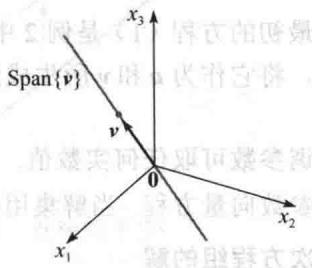
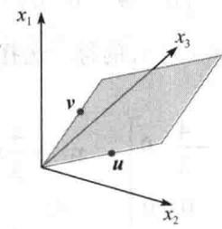
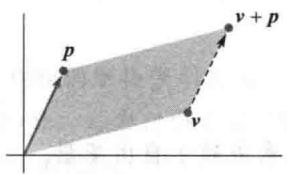
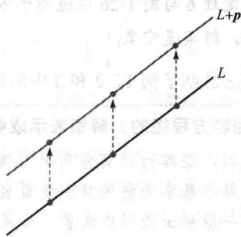
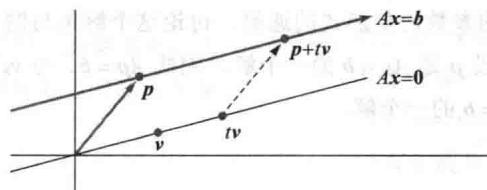
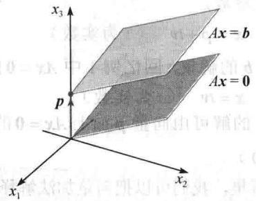
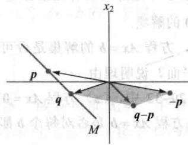

import Knowledge from '@/components/Knowledge.astro';
import Example from '@/components/Example.astro';
import Note from '@/components/Note.astro';
import Solution from '@/components/Solution.astro';
import Block from '@/components/Block.astro';

线性方程组的解集是线性代数研究的重要对象，它们出现在许多不同的问题中。本节使用向量符号给出这样的解集的显式表示以及几何解释。

## 齐次线性方程组

线性方程组称为齐次的，若它可写成 $Ax = 0$ 的形式，其中 $A$ 是 $m \times n$ 矩阵而 0 是 $\mathbb{R}^m$ 中的零向量。这样的方程组至少有一个解，即 $x = 0$ （ $\mathbb{R}^n$ 中的零向量），这个解称为它的平凡解。对给定方程 $Ax = 0$ ，重要的是它是否有非平凡解，即满足 $Ax = 0$ 的非零向量 $x$ 。由1.2节解的存在与唯一性定理（定理2）得出以下事实。

齐次方程 Ax=0 有非平凡解当且仅当方程至少有一个自由变量.

<Example title="例 1">
确定下列齐次方程组是否有非平凡解，并描述它的解集.

$$

\begin{array}{r l} & 3 x _ {1} + 5 x _ {2} - 4 x _ {3} = 0 \\ & - 3 x _ {1} - 2 x _ {2} + 4 x _ {3} = 0 \\ & 6 x _ {1} + x _ {2} - 8 x _ {3} = 0 \end{array}

$$

<Solution title="解">
令 A 为该方程组的系数矩阵，用行化简法把增广矩阵 $[A\ 0]$ 化为阶梯形：

(1)

$$

\left[ \begin{array}{r r r r} 3 & 5 & - 4 & 0 \\ - 3 & - 2 & 4 & 0 \\ 6 & 1 & - 8 & 0 \end{array} \right] \sim \left[ \begin{array}{r r r r} 3 & 5 & - 4 & 0 \\ 0 & 3 & 0 & 0 \\ 0 & - 9 & 0 & 0 \end{array} \right] \sim \left[ \begin{array}{r r r r} 3 & 5 & - 4 & 0 \\ 0 & 3 & 0 & 0 \\ 0 & 0 & 0 & 0 \end{array} \right]

$$

因 $x_{3}$ 是自由变量，故 $Ax = 0$ 有非平凡解（对 $x_{3}$ 的每一选择都有一个解）。为描述解集，继续把 $[A, 0]$ 化为简化阶梯形：

$$

\left[ \begin{array}{c c c c} 1 & 0 & - \frac {4}{3} & 0 \\ 0 & 1 & 0 & 0 \\ 0 & 0 & 0 & 0 \end{array} \right] \quad \begin{array}{l l} x _ {1} & - \frac {4}{3} x _ {3} = 0 \\ x _ {2} & = 0 \\ 0 & = 0 \end{array}

$$

出基本变量 $x_{1}$ 和 $x_{2}$ 得 $x_{1} = \frac{4}{3} x_{3}, x_{2} = 0, x_{3}$ 是自由变量. $Ax = 0$ 的通解有向量形式

$$

\pmb {x} = \left[ \begin{array}{c} x _ {1} \\ x _ {2} \\ x _ {3} \end{array} \right] = \left[ \begin{array}{c} \frac {4}{3} x _ {3} \\ 0 \\ x _ {3} \end{array} \right] = x _ {3} \left[ \begin{array}{c} \frac {4}{3} \\ 0 \\ 1 \end{array} \right] = x _ {3} \pmb {\nu},

$$

$$

\boldsymbol {v} = \left[ \begin{array}{l} \frac {4}{3} \\ 0 \\ 1 \end{array} \right]

$$

这里 $x_{3}$ 由通解向量的表达式中作为公因子提出来。这说明本例中 $Ax = 0$ 的每一个解都是 $\pmb{v}$ 的倍数。平凡解可由 $x_{3} = 0$ 得到。几何意义下，解集是 $\mathbb{R}^3$ 中通过0的直线，见图1-21。
</Solution>
</Example>

<Note>
非平凡解向量 x 可能有些零元素，只要不是所有元素都是 0 就行.

</Note>

<Example title="例 2">
单一方程也可看作简单的方程组. 描述下列齐次 “方程组” 的解集.

图 1-21

$$

1 0 x _ {1} - 3 x _ {2} - 2 x _ {3} = 0

$$

<Solution title="解">
这里无须矩阵记号. 用自由变量表示基本变量 $x_{1}$ . 通解为

$$

a = \gamma

$$

$$

x _ {1} = 0. 3 x _ {2} + 0. 2 x _ {3}

$$

$x_{2}$ 和 $x_{3}$ 为自由变量. 写成向量形式, 通解为

$$

\boldsymbol {x} = \left[ \begin{array}{l} x _ {1} \\ x _ {2} \\ x _ {3} \end{array} \right] = \left[ \begin{array}{c c c} 0. 3 x _ {2} + 0. 2 x _ {3} \\ & x _ {2} \\ & x _ {3} \end{array} \right] = \left[ \begin{array}{c} 0. 3 x _ {2} \\ & x _ {2} \\ & 0 \end{array} \right] + \left[ \begin{array}{c} 0. 2 x _ {3} \\ & 0 \\ & x _ {3} \end{array} \right]

$$

$$

= x _ {2} \left[ \begin{array}{c} 0. 3 \\ 1 \\ 0 \\ \uparrow \end{array} \right] + x _ {3} \left[ \begin{array}{c} 0. 2 \\ 0 \\ 1 \\ \uparrow \end{array} \right] (x _ {2}, x _ {3} \text {为自由变量})\tag{2}

$$

计算表明, 方程(1)的每个解都是向量 u 和 v 的线性组合, 如(2)式所示. 即解集为 $\operatorname{Span}\{u,v\}$ . 因为 u 和 v 都不是对方的倍数, 故解集是通过原点的一个平面. 见图 1-22.

  

图 1-22

例 1 和例 2 以及后面的练习说明齐次方程 Ax=0 总可表示为 Span $\{v_{1},\cdots,v_{p}\}$ ，其中 $v_{1},\cdots,v_{p}$ 是适当的解向量。若唯一解是零向量，则解集就是 Span $\{0\}$ 。若方程 Ax=0 仅有一个自由变量，则解集是通过原点的一条直线，见图 1-21。若有两个或更多个自由变量，那么图 1-22 中通过原点的平面就给出 Ax=0 的解集的一个很好的图形说明。注意，类似的图可用来解释 Span $\{u,v\}$ ，即使 u,v 并不是 Ax=0 的解，见 1.3 节图 1-17。
</Solution>
</Example>

## 参数向量形式

最初的方程（1）是例2中的平面的隐式描述，解此方程就是要找这个平面的显式描述，就是说，将它作为 $\pmb{u}$ 和 $\pmb{v}$ 所生成的子集。方程（2）称为平面的参数向量方程，有时也可写为

$$

\pmb {x} = s \pmb {u} + t \pmb {v} \quad (s, t \text {为实数})

$$

来强调参数可取任何实数值. 例1中, 方程 $x = x_{3}v$ ( $x_{3}$ 是自由变量) 或 $x = tv$ ( $t$ 为实数) 是直线的参数向量方程. 当解集用向量显式表示为如例1和例2时, 我们称之为解的参数向量形式. 非齐次方程组的解

当非齐次线性方程组有许多解时，通解一般可表示为参数向量形式，即由一个向量加上满足对应的齐次方程的一些向量的任意线性组合的形式.

<Example title="例 3">
描述 $Ax = b$ 的解，其中

$$

A = \left[ \begin{array}{r r r} 3 & 5 & - 4 \\ - 3 & - 2 & 4 \\ 6 & 1 & - 8 \end{array} \right], \boldsymbol {b} = \left[ \begin{array}{l} 7 \\ - 1 \\ - 4 \end{array} \right]

$$

<Solution title="解">
这里 $A$ 就是例1的系数矩阵. 对 $[A, b]$ 作行变换得

$$

\left[ \begin{array}{r r r r} 3 & 5 & - 4 & 7 \\ - 3 & - 2 & 4 & - 1 \\ 6 & 1 & - 8 & - 4 \end{array} \right] \sim \left[ \begin{array}{c c c c} 1 & 0 & - \frac {4}{3} & - 1 \\ 0 & 1 & 0 & 2 \\ 0 & 0 & 0 & 0 \end{array} \right] \quad x _ {1} \quad - \frac {4}{3} x _ {3} = - 1 x _ {2} \quad = 2 0 = 0

$$

所以 $x_{1} = -1 + \frac{4}{3} x_{3}, x_{2} = 2, x_{3}$ 为自由变量， $Ax = b$ 的通解可写成向量形式

$$

\pmb {x} = \left[ \begin{array}{c} x _ {1} \\ x _ {2} \\ x _ {3} \end{array} \right] = \left[ \begin{array}{c} - 1 + \frac {4}{3} x _ {3} \\ 2 \\ x _ {3} \end{array} \right] = \left[ \begin{array}{c} - 1 \\ 2 \\ 0 \end{array} \right] + \left[ \begin{array}{c} \frac {4}{3} x _ {3} \\ 0 \\ x _ {3} \end{array} \right] = \left[ \begin{array}{c} - 1 \\ 2 \\ 0 \end{array} \right] + x _ {3} \left[ \begin{array}{c} \frac {4}{3} \\ 0 \\ 1 \\ \uparrow \\ p \end{array} \right]

$$

方程 $x = p + x_{3}v$ ，或用 t 表示一般参数，

$$

\pmb {x} = \pmb {p} + t \pmb {v} \quad (t \text {为实数})\tag{3}

$$

就是用参数向量形式表示的 Ax=b 的解集. 回忆例 1 中 Ax=0 的解集有参数向量形式

$$

\pmb {x} = t \pmb {v} \quad (t \text {为实数})\tag{4}

$$

（v 与（3）中的 v 相同），故 Ax=b 的解可由向量 p 加上 Ax=0 的解得到，向量 p 本身也是 Ax=b 的一个特解（在（3）中对应 t=0）。

为了从几何上描述 Ax=b 的解集，我们可以把向量加法解释为平移。给定 $R^{2}$ 或 $R^{3}$ 中的向量 v 与 p，把 p 加上 v 的结果就是把 v 沿着平行于通过 p 与 0 的直线移动，我们称 v 被平移 p 到 $v+p$ ，见图 1-23。若 $R^{2}$ 或 $R^{3}$ 中直线 L 上每一点被平移 p，就得到一条平行于 L 的直线，见图 1-24。

  

图 1-23 v 加上 p，使 v 平移到 $v + p$  

图1-24 直线的平移

设 L 是通过 0 与 v 的直线，由方程（4）表示。L 的每个点加上 p 得到由方程（3）表示的平移后的直线。注意 p 也在方程（3）中的直线上。称（3）为通过 p 平行于 v 的直线方程。于是 Ax = b 的解集是一条通过 p 而平行于 Ax = 0 的解集的直线。图 1-25 说明了这一结论。

  

图1-25 $Ax = b$ 与 $Ax = 0$ 的解集平行

图1-25中 $Ax = b$ 和 $Ax = 0$ 的解集之间的关系可以推广到任意相容的方程 $Ax = b$ ，虽然当自由变量有多个时解集将多于一条直线．下列定理给出了这一结论，证明见习题25.
</Solution>
</Example>

<Knowledge title="定理 6">
设方程 $Ax = b$ 对某个 $\pmb{b}$ 是相容的， $\pmb{p}$ 为一个特解，则 $Ax = b$ 的解集是所有形如

$w = p + v_{h}$ 的向量的集，其中 $v_{h}$ 是齐次方程 Ax = 0 的任意一个解.

定理 6 说明若 Ax=b 有解，则解集可由 Ax=0 的解集平移向量 p 得到，p 是 Ax=b 的任意一个特解，图 1-26 说明了当有两个自由变量时的情形。即使当 n>3 时，相容方程组 Ax=b （ $b\neq0$ ）的解集也可想象为一个非零点或一条不通过原点的线或平面。

  

图1-26 $Ax = b$ 与 $Ax = 0$ 的解集平行
</Knowledge>

<Note>
定理6与图1-26仅适用于方程 $Ax = b$ 至少有一个非零解 $\pmb{p}$ 的前提下. 当 $Ax = b$ 无解时, 解集是空集.

下列算法总结了例 1、2 和 3 中的计算.

把（相容方程组的）解集表示成参数向量形式

1. 把增广矩阵行化简为简化阶梯形.

2. 把每个基本变量用自由变量表示.

3. 把一般解 x 表示成向量，如果有自由变量，其元素依赖于自由变量.

4. 把 x 分解为向量（元素为常数）的线性组合，用自由变量作为参数.
</Note>

<Block title="练习题">

1. 下列两个方程都确定了 $\mathbb{R}^3$ 中的一个平面，这两个平面是否相交？如果相交的话，描述它们的交集。

$$

x _ {1} + 4 x _ {2} - 5 x _ {3} = 0

$$

$$

2 x _ {1} - x _ {2} + 8 x _ {3} = 9

$$

2. 写出方程 $10x_{1} - 3x_{2} - 2x_{3} = 7$ 的参数向量形式的通解，讨论这个解集与例2中的解集的关系.

3. 证明定理6的第一部分：假设 $\pmb{p}$ 是 $Ax = b$ 的一个解，因此 $Ap = b$ 。令 $\nu_{h}$ 是齐次方程 $Ax = 0$ 的任意解， $w = p + \nu_{h}$ 。证明 $\pmb{w}$ 也是 $Ax = b$ 的一个解。

</Block>

<Block title="习题1.5">

在习题 1\~4 中，确定方程组是否有非平凡解，使用尽可能少的行运算.

$$

\begin{array}{r l r} {3.} & {- 3 x _ {1} + 5 x _ {2} - 7 x _ {3} = 0} & {4. \quad - 5 x _ {1} + 7 x _ {2} + 9 x _ {3} = 0} \\ & {- 6 x _ {1} + 7 x _ {2} + x _ {3} = 0} & {x _ {1} - 2 x _ {2} + 6 x _ {3} = 0} \end{array}

$$

$$

- 2 x _ {1} - 7 x _ {2} + x _ {3} = 0 \quad - 2 x _ {1} + x _ {2} - 4 x _ {3} = 0

$$

在习题 5～6 中，用例 1、2 的方法把给出的各线性方程组的解集用参数向量形式表示出来.

5.

$$

\begin{array}{r l} & x _ {1} + 3 x _ {2} + x _ {3} = 0 \\ & - 4 x _ {1} - 9 x _ {2} + 2 x _ {3} = 0 \\ & - 3 x _ {2} - 6 x _ {3} = 0 \end{array}

$$

6.

$$

\begin{array}{r l} & x _ {1} + 3 x _ {2} - 5 x _ {3} = 0 \\ & x _ {1} + 4 x _ {2} - 8 x _ {3} = 0 \\ & - 3 x _ {1} - 7 x _ {2} + 9 x _ {3} = 0 \end{array}

$$

在习题 7\~12 中，把方程 Ax=0 的解用参数向量形式表示出来，其中 A 行等价于给定的矩阵.

7.

$$

\left[ \begin{array}{c c c c} 1 & 3 & - 3 & 7 \\ 0 & 1 & - 4 & 5 \end{array} \right]

$$

8.

$$

\left[ \begin{array}{c c c c} 1 & - 2 & - 9 & 5 \\ 0 & 1 & 2 & - 6 \end{array} \right]

$$

9.

$$

\left[ \begin{array}{r r r} 3 & - 9 & 6 \\ - 1 & 3 & - 2 \end{array} \right]

$$

10.

$$

\left[ \begin{array}{c c c c} 1 & 3 & 0 & - 4 \\ 2 & 6 & 0 & - 8 \end{array} \right]

$$

11.

$$

\left[ \begin{array}{c c c c c c} 1 & - 4 & - 2 & 0 & 3 & - 5 \\ 0 & 0 & 1 & 0 & 0 & - 1 \\ 0 & 0 & 0 & 0 & 1 & - 4 \\ 0 & 0 & 0 & 0 & 0 & 0 \end{array} \right]

$$

12.

$$

\left[ \begin{array}{c c c c c c} 1 & 5 & 2 & - 6 & 9 & 0 \\ 0 & 0 & 1 & - 7 & 4 & - 8 \\ 0 & 0 & 0 & 0 & 0 & 1 \\ 0 & 0 & 0 & 0 & 0 & 0 \end{array} \right]

$$

13. 设某线性方程组的解集表示为 $x_{1} = 5 + 4x_{3}, x_{2} = -2 - 7x_{3}, x_{3}$ 为自由变量。用向量把它表示成 $\mathbb{R}^3$ 中的直线。

14. 设某线性方程组的解集表示为 $x_{1} = 3x_{4}, x_{2} = 8 + x_{4}, x_{3} = 2 - 5x_{4}, x_{4}$ 为自由变量。用向量把它表示成 $\mathbb{R}^4$ 中的直线。

15. 用例3的方法以参数向量形式表示下列方程组的解. 给出该解集的几何解释并与习题5的解集做比较.

$$

\begin{array}{r l} x _ {1} + 3 x _ {2} + & x _ {3} = 1 \\ - 4 x _ {1} - 9 x _ {2} + 2 x _ {3} = - 1 \\ - 3 x _ {2} - 6 x _ {3} = - 3 \end{array}

$$

16. 和习题 15 一样，把下列方程组的解集表示为参数向量形式，给出几何解释并与习题 6 的解集做比较.

$$

\begin{array}{r l} x _ {1} + 3 x _ {2} - 5 x _ {3} & = 4 \\ x _ {1} + 4 x _ {2} - 8 x _ {3} & = 7 \\ - 3 x _ {1} - 7 x _ {2} + 9 x _ {3} & = - 6 \end{array}

$$

17. 说明和比较 $x_{1} + 9x_{2} - 4x_{3} = 0$ 与 $x_{1} + 9x_{2} - 4x_{3} = -2$ 的解集.

18. 说明和比较 $x_{1} - 3x_{2} + 5x_{3} = 0$ 与 $x_{1} - 3x_{2} + 5x_{3} = 4$ 的解集.

在习题 19\~20 中，求出通过 a 且平行于 b 的直线的参数方程.

$$

1 9. \quad \boldsymbol {a} = \left[ \begin{array}{c} - 2 \\ 0 \end{array} \right], \boldsymbol {b} = \left[ \begin{array}{c} - 5 \\ 3 \end{array} \right] \quad 2 0. \quad \boldsymbol {a} = \left[ \begin{array}{c} - 3 \\ - 4 \end{array} \right], \boldsymbol {b} = \left[ \begin{array}{c} - 7 \\ 8 \end{array} \right]

$$

在习题 21\~22 中，求出通过 p 与 q 的直线 M 的方程。（提示：M 平行于向量 q-p。见图 1-27.）

  

图1-27 通过 $\pmb{p}$ 与 $\pmb{q}$ 的直线

21. $p=\begin{bmatrix}2\\ -5\end{bmatrix},q=\begin{bmatrix}-3\\ 1\end{bmatrix}$ 22. $p=\begin{bmatrix}-6\\ 3\end{bmatrix},q=\begin{bmatrix}0\\ -4\end{bmatrix}$

在习题 23 和 24 中，判断每个命题的真假，并给出理由.

23. a. 齐次方程总是相容的.

b. 方程 Ax = 0 给出它的解集的显式表达式.

c. 齐次方程 Ax=0 当且仅当方程至少有一个自由变量时有平凡解.

d. 方程 $x = p + tv$ 描述了一条直线，它通过 v 且平行于 p .

e. 方程 Ax=b 的解集是所有形如 $w=p+v_{h}$ 的向量的集，其中 $v_{h}$ 是方程 Ax=0 的任意一解.

24. a. 若 $x$ 是 $Ax = 0$ 的非平凡解，则 $x$ 的每个元素不等于零.

b. 方程 $x = x_{2}u + x_{3}v, x_{2}, x_{3}$ 是自由变量（u 和 v 没有倍数关系），表示经过原点的平面.

c. 方程 Ax=b 是齐次的当且仅当零向量是它的解.

d. 把一个向量加上 p 就是把该向量沿平行于 p 的方向移动.

e. 方程 Ax=b 的解集可由平移 Ax=0 的解集得到.

25. 证明定理6的第二部分：假设 $w$ 是 $Ax = b$ 的任意解。定义 $\pmb{v}_h = w - p$ 。证明 $\pmb{v}_h$ 是 $Ax = 0$ 的一个解。这说明 $Ax = b$ 的任何解有 $w = p + v_h$ 的形式，其中 $p$ 是 $Ax = b$ 的特解， $\pmb{v}_h$ 是 $Ax = 0$ 的解。

26. 设 Ax=b 有解，说明为什么当 Ax=0 仅有平凡解时，Ax=b 的解是唯一的.

27. 设 $A$ 是 $3 \times 3$ 零矩阵（所有元素都是零），求方程 $Ax = 0$ 的解集.

28. 若 $b \neq 0$ ，方程 Ax = b 的解集是否可能是通过原点的平面？说明理由.

在习题 29\~32 中，（a）方程 Ax = 0 是否有非平凡解？（b）方程 Ax = b 是否对每个 b 都至少有一个解？

29. A 是 $3 \times 3$ 矩阵，有 3 个主元位置.

30. $A$ 是 $3 \times 3$ 矩阵，有2个主元位置.

31. A 是 $3 \times 2$ 矩阵，有 2 个主元位置.

32. A 是 $2 \times 4$ 矩阵，有 2 个主元位置.

33. 给定 $A = \begin{bmatrix} -2 & -6 \\ 7 & 21 \\ -3 & -9 \end{bmatrix}$ ，用观察法求 $Ax = 0$ 的一个非平凡解。（提示：把方程 $Ax = 0$ 写成向量方程形式。）

34. 给定 $A = \begin{bmatrix} 4 & -6 \\ -8 & 12 \\ 6 & -9 \end{bmatrix}$ ，用观察法求 $Ax = 0$ 的一个

非平凡解.

35. 构造一 $3 \times 3$ 非零矩阵 $A$ ，使向量 $\begin{bmatrix} 1 \\ 1 \\ 1 \end{bmatrix}$ 是 $Ax = 0$ 的一个解.

36. 构造一 $3 \times 3$ 非零矩阵 $A$ , 使向量 $\left[ \begin{array}{c}1 \\ -2 \\ 1 \end{array} \right]$ 是 $Ax = 0$ 的一个解.

37. 构造一 $2 \times 2$ 矩阵 $A$ , 使方程 $Ax = 0$ 的解集是一条经过点 (4,1) 和原点的 $\mathbb{R}^2$ 中的直线. 随后, 在 $\mathbb{R}^2$ 中找一向量 $b$ 使 $Ax = b$ 的解集不是 $\mathbb{R}^2$ 中平行于 $Ax = 0$ 的解集的直线. 为什么这与定理6没有矛盾?

38. 设 A 是 $3 \times 3$ 矩阵，y 是 $R^{3}$ 中的一个向量，且方程 Ax = y 无解。讨论是否存在 $R^{3}$ 中的一个向量 z，使方程 Ax = z 有唯一解。

39. 设 A 是 $m \times n$ 矩阵，u 是 $R^{n}$ 中满足 Ax = 0 的向量。证明对任一数 c，向量 cu 也满足 Ax = 0。（即证明 $A(cu) = 0$ 。）

40. 设 $A$ 是 $m \times n$ 矩阵， $\pmb{u}$ 和 $\pmb{v}$ 是 $\mathbb{R}^n$ 中满足 $Av = 0$ 和 $Au = 0$ 的向量。解释为什么 $A(u + v)$ 一定是零向量，以及对每一对标量 $c$ 和 $d$ ，为什么 $A(cv + du) = 0$ 。

</Block>

<Block title="练习题答案">

1. 行化简增广矩阵：

$$

\begin{array}{r l} & {\left[ \begin{array}{c c c c} 1 & 4 & - 5 & 0 \\ 2 & - 1 & 8 & 9 \end{array} \right] \sim \left[ \begin{array}{c c c c} 1 & 4 & - 5 & 0 \\ 0 & - 9 & 1 8 & 9 \end{array} \right] \sim \left[ \begin{array}{c c c c} 1 & 0 & 3 & 4 \\ 0 & 1 & - 2 & - 1 \end{array} \right]} \\ & {x _ {1} + 3 x _ {3} = 4} \\ & {x _ {2} - 2 x _ {3} = - 1} \end{array}

$$

因此 $x_{1} = 4 - 3x_{3}, x_{2} = -1 + 2x_{3}, x_{3}$ 为自由变量. 通解的向量形式为

$$

\begin{array}{r l} \left[ \begin{array}{c} x _ {1} \\ x _ {2} \\ x _ {3} \end{array} \right] & = \left[ \begin{array}{c} 4 - 3 x _ {3} \\ - 1 + 2 x _ {3} \\ x _ {3} \end{array} \right] = \left[ \begin{array}{c} 4 \\ - 1 \\ 0 \end{array} \right] + x _ {3} \left[ \begin{array}{c} - 3 \\ 2 \\ 1 \end{array} \right] \\ & \uparrow \\ & p \end{array}

$$

两个平面的交是通过 p 平行于 v 的直线.

2. 增广矩阵 $[10 - 3 - 2 - 7]$ 行等价于 $[1 - 0.3 - 0.2 - 0.7]$ ，故通解为 $x_{1} = 0.7 + 0.3x_{2} + 0.2x_{3}$ ， $x_{2}$ 和 $x_{3}$ 是自由变量。即

$$

\boldsymbol {x} = \left[ \begin{array}{l} x _ {1} \\ x _ {2} \\ x _ {3} \end{array} \right] = \left[ \begin{array}{c c c} 0. 7 + 0. 3 x _ {2} + 0. 2 x _ {3} \\ & x _ {2} \\ & x _ {3} \end{array} \right] = \left[ \begin{array}{l} 0. 7 \\ 0 \\ 0 \end{array} \right] + x _ {2} \left[ \begin{array}{c} 0. 3 \\ 1 \\ 0 \end{array} \right] + x _ {3} \left[ \begin{array}{l} 0. 2 \\ 0 \\ 1 \end{array} \right]

$$

非齐次方程 Ax=b 的解集是平移过的平面 $p + \text{Span}\{u, v\}$ ，它经过 p 且平行于例 2 中的齐次方程的解集。

3. 利用 1.4 节定理 5，知 $A(p + v_{h}) = Ap + Av_{h} = b + 0 = b$ ，因此 $p + v_{h}$ 是 Ax = b 的一个解.

</Block>
