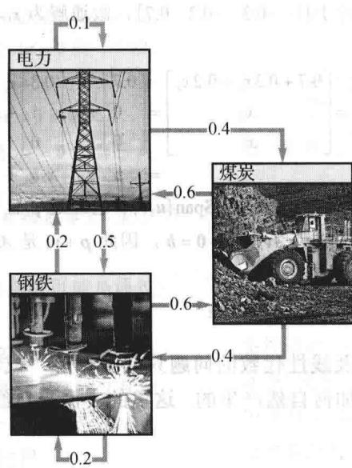
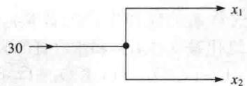
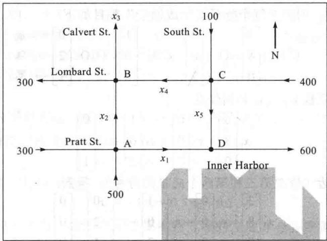
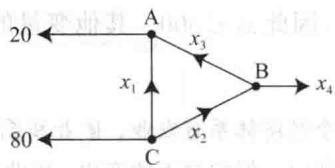
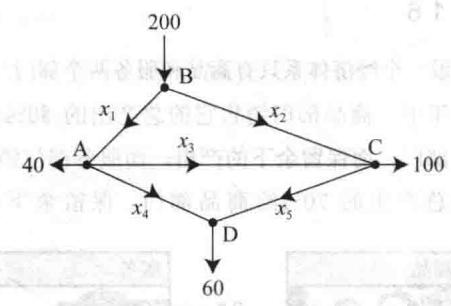
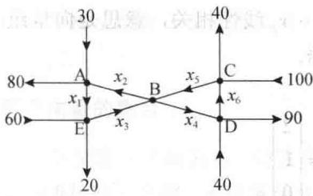
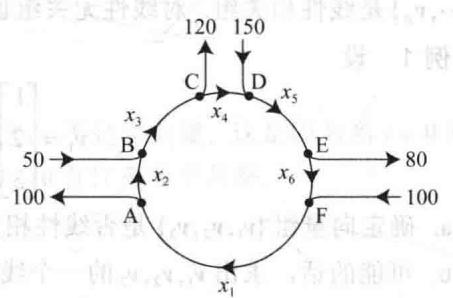

import Guide from '@/components/Guide.astro';
import Knowledge from '@/components/Knowledge.astro';
import Example from '@/components/Example.astro';
import Analysis from '@/components/Analysis.astro';
import Solution from '@/components/Solution.astro';
import Variant from '@/components/Variant.astro';
import Note from '@/components/Note.astro';
import Block from '@/components/Block.astro';
import Method from '@/components/Method.astro';
import Exercise from '@/components/Exercise.astro';

你也许希望现实生活中涉及线性代数的问题只有唯一解，或者可能无解。本节的意图是要说明有多个解的线性方程组是如何自然产生的。这里的实例来自经济学、化学和网络流。

## 经济学中的齐次线性方程组

本章介绍性实例中提到的 500 个变量的 500 个方程组成的方程组现称为列昂惕夫 “投入-产出”（或 “生产”）模型。 ① 2.6 节将详细讨论这个模型，那时我们有更多的理论和更好的符号。目前，我们先看一个简单的 “交易模型”，这个模型也是由列昂惕夫提出的。

假设一个国家的经济体系可以划分为许多部门，如各种制造、交通、娱乐和服务业。假设我们知道每个部门的年度总产出，并精确知道该总产出是如何在其他经济部门进行分配或“交易”的。称一个部门产出的总货币价值为该产出的价格。列昂惕夫证明了下面的结论。

存在能够指派给各个部门总产出的平衡价格，使得每个部门的总收入恰等于它的总支出。下面的例子说明如何求平衡价格。

<Example title="例 1">
假设一个经济体系由煤炭、电力（电源）和钢铁三个部门组成，各部门之间的分配如表 1-1 所示，其中每一列中的数表示该部门总产出所占的比例.

表 1-1 一个简单的经济问题

<table><tr><td colspan="3">部门的产出分配</td><td rowspan="2">采购部门</td></tr><tr><td>煤炭</td><td>电力</td><td>钢铁</td></tr><tr><td>0.0</td><td>0.4</td><td>0.6</td><td>煤炭</td></tr><tr><td>0.6</td><td>0.1</td><td>0.2</td><td>电力</td></tr><tr><td>0.4</td><td>0.5</td><td>0.2</td><td>钢铁</td></tr></table>

如表 1-1 的第二列，将电力的总产出分配如下：40%给煤炭部门，50%给钢铁部门，剩下10%给电力部门。（电力部门把这10%作为运转费用。）因所有产出都必须分配，故每一列的百分比之和等于1.

用符号 $p_{C}, p_{E}, p_{S}$ 分别表示煤炭、电力和钢铁部门年度总产出的价格（即货币价值）。如果可能，求出平衡价格使每个部门的收支平衡。

<Solution title="解">
某一部门所在的一列表示它的产出的去向，它所在的一行表示它从哪些部门获得了投入。例如，表1-1的第一行说明煤炭部门接受（采购）40%的电力产出和60%的钢铁产出。因为相应部门的总产出价格为 $p_{E}$ 和 $p_{S}$ ，故煤炭部门必须支付电力部门0.4 $p_{E}$ 美元，支付钢铁部门0.6 $p_{S}$ 美元。因此煤炭部门的总支出是 $0.4p_{E} + 0.6p_{S}$ 美元。为使煤炭部门的总收入 $p_{C}$ 等于它的总支出，有

$$
p _ {\mathrm{C}} = 0. 4 p _ {\mathrm{E}} + 0. 6 p _ {\mathrm{S}}\tag{1}
$$

交易表的第二行说明电力部门的支出有 $0.6p_{\mathrm{C}}$ 美元采购煤炭， $0.1p_{\mathrm{E}}$ 美元采购电力， $0.2p_{\mathrm{s}}$ 美元采购钢铁。因此电力部门的收支平衡条件是

$$
p _ {\mathrm{E}} = 0. 6 p _ {\mathrm{C}} + 0. 1 p _ {\mathrm{E}} + 0. 2 p _ {\mathrm{S}}\tag{2}
$$

最后，交易表的第三行导出最后的条件：

$$
p _ {\mathrm{S}} = 0. 4 p _ {\mathrm{C}} + 0. 5 p _ {\mathrm{E}} + 0. 2 p _ {\mathrm{S}}\tag{3}
$$

为求解方程组（1）、（2）、（3），将所有未知量移到方程的左边并合并同类项。（例如，在方程（2）的左边将 $p_{\mathrm{E}} - 0.1p_{\mathrm{E}}$ 写成 $0.9p_{\mathrm{E}}$ .）

$$
\begin{array}{r l} & p _ {\mathrm{C}} - 0. 4 p _ {\mathrm{E}} - 0. 6 p _ {\mathrm{S}} = 0 \\ & - 0. 6 p _ {\mathrm{C}} + 0. 9 p _ {\mathrm{E}} - 0. 2 p _ {\mathrm{S}} = 0 \\ & - 0. 4 p _ {\mathrm{C}} - 0. 5 p _ {\mathrm{E}} + 0. 8 p _ {\mathrm{S}} = 0 \end{array}
$$

接下来进行行化简．为简明起见，数值舍入到小数点后两位.

$$
\left[ \begin{array}{r r r r} 1 & - 0. 4 & - 0. 6 & 0 \\ - 0. 6 & 0. 9 & - 0. 2 & 0 \\ - 0. 4 & - 0. 5 & 0. 8 & 0 \end{array} \right] \sim \left[ \begin{array}{r r r r} 1 & - 0. 4 & - 0. 6 & 0 \\ 0 & 0. 6 6 & - 0. 5 6 & 0 \\ 0 & - 0. 6 6 & 0. 5 6 & 0 \end{array} \right] \sim \left[ \begin{array}{r r r r} 1 & - 0. 4 & - 0. 6 & 0 \\ 0 & 0. 6 6 & - 0. 5 6 & 0 \\ 0 & 0 & 0 & 0 \end{array} \right]
$$

$$
\sim \left[ \begin{array}{c c c c} 1 & - 0. 4 & - 0. 6 0 & 0 \\ 0 & 1 & - 0. 8 5 & 0 \\ 0 & 0 & 0 & 0 \end{array} \right] \sim \left[ \begin{array}{c c c c} 1 & 0 & - 0. 9 4 & 0 \\ 0 & 1 & - 0. 8 5 & 0 \\ 0 & 0 & 0 & 0 \end{array} \right]
$$

通解是 $p_{\mathrm{C}} = 0.94p_{\mathrm{S}}, p_{\mathrm{E}} = 0.85p_{\mathrm{S}}$ ， $p_{\mathrm{S}}$ 为自由变量。这个经济问题的平衡价格向量为

$$
\boldsymbol {p} = \left[ \begin{array}{l} p _ {\mathrm{C}} \\ p _ {\mathrm{E}} \\ p _ {\mathrm{S}} \end{array} \right] = \left[ \begin{array}{c} 0. 9 4 p _ {\mathrm{s}} \\ 0. 8 5 p _ {\mathrm{s}} \\ p _ {\mathrm{s}} \end{array} \right] = p _ {\mathrm{s}} \left[ \begin{array}{l} 0. 9 4 \\ 0. 8 5 \\ 1 \end{array} \right]
$$

任意（非负） $p_{s}$ 取值可以算出平衡价格的一种取值。例如，如果取 $p_{s}$ 为100（或1亿美元），那么 $p_{c}=94, p_{E}=85$ 。即如果煤炭部门的产出价格是9400万美元，电力部门的产出价格是8500万美元，钢铁部门的产出价格是1亿美元，那么每个部门的总收入和总支出将会相等。
</Solution>
</Example>

## 配平化学方程式

化学方程式描述了化学反应的物质消耗和生产的数量。例如，当丙烷气体燃烧时，丙烷 $\left(\mathrm{C}_{3}\mathrm{H}_{8}\right)$ 与氧气 $\left(\mathrm{O}_{2}\right)$ 结合生成二氧化碳 $\left(\mathrm{CO}_{2}\right)$ 和水 $\left(\mathrm{H}_{2}\mathrm{O}\right)$ ，化学方程式如下所示：

$$
(x _ {1}) \mathrm{C} _ {3} \mathrm{H} _ {8} + (x _ {2}) \mathrm{O} _ {2} \rightarrow (x _ {3}) \mathrm{CO} _ {2} + (x _ {4}) \mathrm{H} _ {2} \mathrm{O}\tag{4}
$$

为“配平”这个方程式，化学家必须找到 $x_{1},\cdots,x_{4}$ 的全体数量，使得方程式左边碳（C）、氢（H）、氧（O）原子的总数等于右边相应原子的总数（因为在化学反应中原子既不会被破坏，也不会被创造）。

配平化学方程式的一个系统方法是建立描述化学反应中每种类型原子数目的向量方程。由于方程式（4）包含三种类型的原子（碳、氢、氧），因此给（4）式的每一种反应物和生成物构造一个属于 $\mathbb{R}^3$ 的向量，列出“每个分子的组成原子”数目如下：

$$
\mathrm{C} _ {3} \mathrm{H} _ {8}: \left[ \begin{array}{l} 3 \\ 8 \\ 0 \end{array} \right], \mathrm{O} _ {2}: \left[ \begin{array}{l} 0 \\ 0 \\ 2 \end{array} \right], \mathrm{CO} _ {2}: \left[ \begin{array}{l} 1 \\ 0 \\ 2 \end{array} \right], \mathrm{H} _ {2} \mathrm{O}: \left[ \begin{array}{l} 0 \\ 2 \\ 1 \end{array} \right] \xleftarrow {\text {碳}}
$$

要配平方程式（4），系数 $x_{1},\cdots,x_{4}$ 必须满足

$$
x _ {1} \left[ \begin{array}{l} 3 \\ 8 \\ 0 \end{array} \right] + x _ {2} \left[ \begin{array}{l} 0 \\ 0 \\ 2 \end{array} \right] = x _ {3} \left[ \begin{array}{l} 1 \\ 0 \\ 2 \end{array} \right] + x _ {4} \left[ \begin{array}{l} 0 \\ 2 \\ 1 \end{array} \right]
$$

将全部项移到等式左边（修改第三和第四个向量的符号），得到：

$$
x _ {1} \left[ \begin{array}{l} 3 \\ 8 \\ 0 \end{array} \right] + x _ {2} \left[ \begin{array}{l} 0 \\ 0 \\ 2 \end{array} \right] + x _ {3} \left[ \begin{array}{c} - 1 \\ 0 \\ - 2 \end{array} \right] + x _ {4} \left[ \begin{array}{c} 0 \\ - 2 \\ - 1 \end{array} \right] = \left[ \begin{array}{l} 0 \\ 0 \\ 0 \end{array} \right]
$$

行化简该方程组的增广矩阵得到通解

$$
x _ {1} = \frac {1}{4} x _ {4}, x _ {2} = \frac {5}{4} x _ {4}, x _ {3} = \frac {3}{4} x _ {4}, x _ {4} \text {   是自由变量   }
$$

因为化学方程式的系数应为整数，故取 $x_{4} = 4$ ，那么 $x_{1} = 1, x_{2} = 5, x_{3} = 3$ 。配平的方程式为

$$
\mathrm{C} _ {3} \mathrm{H} _ {8} + 5 \mathrm{O} _ {2} \rightarrow 3 \mathrm{CO} _ {2} + 4 \mathrm{H} _ {2} \mathrm{O}
$$

如果方程式中的每个系数乘两倍（比如说），该方程式仍然是配平的。然而在一般情形下，化学家倾向于使用全体系数尽可能小的数来配平方程式。

## 网络流

当科学家、工程师或经济学家研究一些网络中的流时自然会推导出线性方程组。例如，城市规划和交通工程人员监控一个网格状的市区道路的交通流量模式；电气工程师计算流经电路的电流；经济学家分析通过分销商和零售商的网络从制造商到顾客的产品销售。许多网络中的

方程组涉及成百甚至上千的变量和方程.

一个网络包含一组称为接合点或节点的点集，并由称为分支的线或弧连接部分或全部的节点。流的方向在每个分支上有标示，流量（速度）也有显示或用变量标记。

网络流的基本假设是网络的总流入量等于总流出量，且流经一个节点的总输入等于总输出。例如，图1-28显示30个单元经过一个分支流入一个节点， $x_{1}$ 和 $x_{2}$ 标记该节点经过其他分支的流出。因为流量在每个节点中是守恒的，我们有 $x_{1} + x_{2} = 30$ 。类似地，每个节点的流量可以用一个方程描述。网络分析的问题就是确定当局部信息（如网络的输入和输出）已知时每一分支的流量。

<figure class="vp-figure">
  
  <figcaption>图1-28 一个节点</figcaption>
</figure>

<Example title="例 2">
图 1-29 中的网络是巴尔的摩市区一些单行道在一个下午早些时候（以每小时车辆数目计算）的交通流量。计算该网络的车流量。

<figure class="vp-figure">
  
  <figcaption>图 1-29 巴尔的摩道路</figcaption>
</figure>

<Solution title="解">
写出该流量的方程组，并求其通解．如图1-29所示，标记道路交叉口（节点）和未知的分支流量．在每个交叉口，令其车辆驶入数目等于车辆驶出数目.

<table><tr><td>交叉口</td><td>车辆驶入数目</td><td></td><td>车辆驶出数目</td></tr><tr><td>A</td><td>300+500</td><td>=</td><td> $x_{1} + x_{2}$ </td></tr><tr><td>B</td><td> $x_{2} + x_{4}$ </td><td>=</td><td> $300 + x_{3}$ </td></tr><tr><td>C</td><td>100+400</td><td>=</td><td> $x_{4} + x_{5}$ </td></tr><tr><td>D</td><td> $x_{1} + x_{5}$ </td><td>=</td><td>600</td></tr></table>

并且，网络中的总流入量（500+300+100+400）等于总流出量（300+x₃+600），经简化得 $x_{3}=400$ 。
该方程与上面四个方程联立并重排后得到下面的方程组：

$$
\begin{array}{r l} x _ {1} + x _ {2} & = 8 0 0 \\ x _ {2} - x _ {3} + x _ {4} & = 3 0 0 \\ x _ {4} + x _ {5} = 5 0 0 \\ x _ {1} + x _ {5} = 6 0 0 \\ x _ {3} & = 4 0 0 \end{array}
$$

行化简相应的增广矩阵得到

$$
\begin{array}{r l r l r l} {x _ {1}} & & & & {+ x _ {5}} & {= 6 0 0} \\ & {x _ {2}} & & & {- x _ {5}} & {= 2 0 0} \\ & & {x _ {3}} & & & {= 4 0 0} \\ & & & {x _ {4}} & {+ x _ {5}} & {= 5 0 0} \end{array}
$$

该网络的车流量为

$$
\left\{ \begin{array}{l} x _ {1} = 6 0 0 - x _ {5} \\ x _ {2} = 2 0 0 + x _ {5} \\ x _ {3} = 4 0 0 \\ x _ {4} = 5 0 0 - x _ {5} \\ x _ {5} \text {是自由变量} \end{array} \right.
$$

网络分支中的一个负流量对应于模型中显示方向相反的流量。由于本问题中的道路是单行线，因此这里不允许有负值变量。这种情况给变量的可能取值增加了某种限制。例如，因为 $x_{4}$ 不能取负值，因此 $x_{5} \leqslant 500$ 。其他变量的约束在练习题2中有考虑。
</Solution>
</Example>

<Block title="练习题">
1. 假设一个经济体系有农业、矿业和制造业三个部门。农业部门销售它的产出的 $5\%$ 给矿业部门， $30\%$ 给制造业部门，保留余下的产出。矿业部门销售它的产出的 $20\%$ 给农业部门， $70\%$ 给制造业部门，保留余下的产出。制造业部门销售它的产出的 $20\%$ 给农业部门， $30\%$ 给矿业部门，保留余下的产出。构建该经济体系的交易表，表中的列给出各个部门的产出如何分配给其他部门。

2. 考虑例 2 中的网络流. 确定 $x_{1}$ 和 $x_{2}$ 的可能取值范围. （提示：在例中 $x_{5} \leqslant 500$ . 这对 $x_{1}$ 和 $x_{2}$ 意味着什么？同时 $x_{5} \geqslant 0$ .）
</Block>

<Block title="习题1.6">
1. 假设一个经济体系只有商品和服务两个部门。在每一年中，商品部门销售它的总产出的 80% 给服务部门，而保留余下的产出，而服务部门销售它的总产出的 70% 给商品部门，保留余下的产出．找出商品和服务部门的年度产出的平衡价格，使得每一部门的收支平衡.

2. 找出例 1 中经济的另一组平衡价格。假设同样的经济体系中使用日元而不是美元来衡量各部门的产出值，讨论这个问题会有什么变化。

3. 考虑一个由燃料动力、化学金属和机器三个部门构成的经济体系。化学金属部门销售 30% 的产出给燃料动力部门和 50% 的产出给机器部门，保留余下的产出。燃料动力部门销售 80% 的产出给化学金属部门和 10% 的产出给机器部门，保留余下的产出. 机器部门销售 $40\%$ 的产出给化学金属部门和 $40\%$ 的产出给燃料动力部门，保留余下的产出.

a. 构建该经济体系的交易表.

b. 建立方程组表示各部门收支平衡的条件. 写出对应的增广矩阵以便行化简求平衡价格.

c. [M] 找出当机器部门产出的价格是 100 个单位时的一组平衡价格.

4. 假设一个经济体系有四个部门，分别是农业（A）、能源（E）、制造（M）和运输（T）部门。部门 A 销售产出的 10% 给部门 E 和 25% 给部门 M 并保留余下的产出。部门 E 销售产出的 30% 给部门 A、35% 给部门 M 和 25% 给部门 T 并保留余下的产出。部门 M 销售产出的 30% 给部门 A、15% 给部门 E 和 40% 给部门 T 并保留余下的产出。部门 T 销售产出的 20% 给部门 A、10% 给部门 E 和 30% 给部门 M 并保留余下的产出。

a. 写出该经济体系的交易表.

b. [M] 找出该经济体系的一组平衡价格.

习题 5\~10 使用本节讨论的向量方程的方法配平化学方程式.

5. 硫化硼与水剧烈反应生成硼酸和硫化氢气体（臭蛋味）。未配平的化学反应式为

$$
\mathrm{B} _ {2} \mathrm{S} _ {3} + \mathrm{H} _ {2} \mathrm{O} \rightarrow \mathrm{H} _ {3} \mathrm{BO} _ {3} + \mathrm{H} _ {2} \mathrm{S}
$$

（对每一化合物，构建一向量列出硼、硫、氢和氧的原子数。）

6. 磷酸钠和硝酸钡反应生成磷酸钡和硝酸钠的未配平方程为

$$
\mathrm{Na} _ {3} \mathrm{PO} _ {4} + \mathrm{Ba} (\mathrm{NO} _ {3}) _ {2} \rightarrow \mathrm{Ba} _ {3} (\mathrm{PO} _ {4}) _ {2} + \mathrm{NaNO} _ {3}
$$

（对每一化合物，构造一向量列出钠、磷、氧、钡和氮的原子数.）

7. Alka-Seltzer 碱性苏打包含碳酸氢钠( $NaHCO_{3}$ )和柠檬酸( $H_{3}C_{6}H_{5}O_{7}$ ). 当一颗药片溶解在水中时，会发生化学反应生成柠檬酸钠、水和二氧化

碳（气体）：

$$
\mathrm{NaHCO} _ {3} + \mathrm{H} _ {3} \mathrm{C} _ {6} \mathrm{H} _ {5} \mathrm{O} _ {7} \rightarrow \mathrm{Na} _ {3} \mathrm{C} _ {6} \mathrm{H} _ {5} \mathrm{O} _ {7} + \mathrm{H} _ {2} \mathrm{O} + \mathrm{CO} _ {2}
$$

8. 高锰酸钾和硫酸锰在水中反应生成二氧化锰、硫酸钾和硫酸的反应为

$KMnO_{4} + MnSO_{4} + H_{2}O \rightarrow MnO_{2} + K_{2}SO_{4} + H_{2}SO_{4}$ （对每一化合物，构造一向量列出钾、锰、氧、硫和氢的原子数。）

9. [M] 如果可能，使用精确的算术或合理的计算格式配平如下的化学反应方程式：

$$
\mathrm{PbN} _ {6} + \mathrm{CrMn} _ {2} \mathrm{O} _ {8} \rightarrow \mathrm{Pb} _ {3} \mathrm{O} _ {4} + \mathrm{Cr} _ {2} \mathrm{O} _ {3} + \mathrm{MnO} _ {2} + \mathrm{NO}
$$

10. [M]下面的化学反应可以在工业过程中应用，如砷（ $\mathrm{AsH}_{3}$ ）的生产。配平下面的方程式。 $\mathrm{MnS} + \mathrm{As}_{2}\mathrm{Cr}_{10}\mathrm{O}_{35} + \mathrm{H}_{2}\mathrm{SO}_{4} \rightarrow \mathrm{HMnO}_{4} + \mathrm{AsH}_{3} + \mathrm{CrS}_{3}\mathrm{O}_{12} + \mathrm{H}_{2}\mathrm{O}$

11. 求下图中网络流量的通解. 假设流量都是非负的, $x_{3}$ 可能的最大值是什么?

12. a. 求下图中高速公路网络的交通流量的通解.
(流量以车辆数/分钟计算.)
b. 求 $x_{4}$ 交通封闭时的交通流量的通解.
c. 当 $x_{4}=0$ 时， $x_{1}$ 的最小值是什么？

13. a. 求下图中网络流量的通解.

b. 假设流量必须以标示的方向流动，求分支 $x_{2}, x_{3}, x_{4}, x_{5}$ 的流量的最小值.

能值.

14. 英格兰的交叉路通常被设计成单行的“环行路”，如下图所示．假设流量必须以标示的方向流动，求网络流量的通解并求 $x_{6}$ 的最小可

</Block>

<Block title="练习题答案">
1. 将比例用小数表示。由于要考虑所有的产出，故每列的元素之和等于 1。这种情况有助于填补空缺的元素。

<table><tr><td colspan="3">部门的产出分配</td><td rowspan="2">采购部门</td></tr><tr><td>农业</td><td>矿业</td><td>制造业</td></tr><tr><td>0.65</td><td>0.20</td><td>0.20</td><td>农业</td></tr><tr><td>0.05</td><td>0.10</td><td>0.30</td><td>矿业</td></tr><tr><td>0.30</td><td>0.70</td><td>0.50</td><td>制造业</td></tr></table>

2. 因 $x_{5} \leqslant 500$ ，由 $x_{1}$ 和 $x_{2}$ 的方程 D 和 A 得到 $x_{1} \geqslant 100$ 和 $x_{2} \leqslant 700$ 。由 $x_{5} \geqslant 0$ 得到 $x_{1} \leqslant 600$ 和 $x_{2} \geqslant 200$ 。因此 $100 \leqslant x_{1} \leqslant 600$ 和 $200 \leqslant x_{2} \leqslant 700$ 。
</Block>
