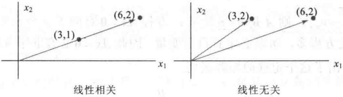
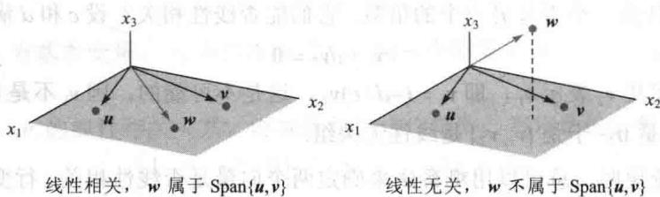
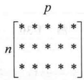
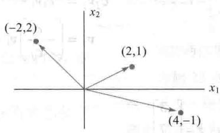
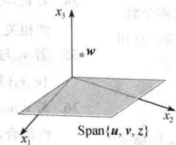

import Guide from '@/components/Guide.astro';
import Knowledge from '@/components/Knowledge.astro';
import Example from '@/components/Example.astro';
import Analysis from '@/components/Analysis.astro';
import Solution from '@/components/Solution.astro';
import Variant from '@/components/Variant.astro';
import Note from '@/components/Note.astro';
import Block from '@/components/Block.astro';
import Method from '@/components/Method.astro';
import Exercise from '@/components/Exercise.astro';

1.5 节的齐次线性方程组也可从另一观点研究，即把它们写成向量方程。这时，重点从 Ax = 0 的未知解转向出现在向量方程中的向量。

例如，考虑方程

$$
x _ {1} \left[ \begin{array}{l} 1 \\ 2 \\ 3 \end{array} \right] + x _ {2} \left[ \begin{array}{l} 4 \\ 5 \\ 6 \end{array} \right] + x _ {3} \left[ \begin{array}{l} 2 \\ 1 \\ 0 \end{array} \right] = \left[ \begin{array}{l} 0 \\ 0 \\ 0 \end{array} \right]\tag{1}
$$

此方程当然有平凡解，即 $x_{1} = x_{2} = x_{3} = 0$ ，如1.5节，主要问题是平凡解是否是唯一解.

定义 $R^{n}$ 中一组向量 $\{v_{1},\cdots,v_{p}\}$ 称为线性无关的，若向量方程

$$
x _ {1} \boldsymbol {v} _ {1} + x _ {2} \boldsymbol {v} _ {2} + \dots + x _ {p} \boldsymbol {v} _ {p} = \mathbf {0}
$$

仅有平凡解. 向量组（集） $\{v_{1},\cdots,v_{p}\}$ 称为线性相关的，若存在不全为零的权 $c_{1},\cdots,c_{p}$ ，使

$$
c _ {1} \boldsymbol {v} _ {1} + c _ {2} \boldsymbol {v} _ {2} + \dots + c _ {p} \boldsymbol {v} _ {p} = \mathbf {0}\tag{2}
$$

方程（2）称为向量 $v_{1},\cdots,v_{p}$ 之间的线性相关关系，其中权不全为零。一组向量线性相关当且仅当它不是线性无关的。为简单起见，我们也可说 $v_{1}, \cdots, v_{p}$ 线性相关，意思是向量组（集） $\{v_{1}, \cdots, v_{p}\}$ 是线性相关组。对线性无关组也使用类似的术语。

<Example title="例 1">
设

$$
\boldsymbol {v} _ {1} = \left[ \begin{array}{l} 1 \\ 2 \\ 3 \end{array} \right], \quad \boldsymbol {v} _ {2} = \left[ \begin{array}{l} 4 \\ 5 \\ 6 \end{array} \right], \quad \boldsymbol {v} _ {3} = \left[ \begin{array}{l} 2 \\ 1 \\ 0 \end{array} \right]
$$

a. 确定向量组 $\{v_{1}, v_{2}, v_{3}\}$ 是否线性相关.

b. 可能的话，求出 $v_{1}, v_{2}, v_{3}$ 的一个线性相关关系.

<Solution title="解">
a. 我们需要确定方程（1）是否有非平凡解。把相应的增广矩阵进行行变换，得

$$
\left[ \begin{array}{c c c c} 1 & 4 & 2 & 0 \\ 2 & 5 & 1 & 0 \\ 3 & 6 & 0 & 0 \end{array} \right] \sim \left[ \begin{array}{c c c c} 1 & 4 & 2 & 0 \\ 0 & - 3 & - 3 & 0 \\ 0 & 0 & 0 & 0 \end{array} \right]
$$

显然， $x_{1}$ 和 $x_{2}$ 为基本变量， $x_{3}$ 为自由变量。 $x_{3}$ 的每个非零值确定（1）的一组非平凡解，因此 $v_{1}, v_{2}, v_{3}$ 线性相关。

b. 为求出 $v_{1}, v_{2}, v_{3}$ 的线性相关关系，继续行化简增广矩阵，写出新的方程组：

$$
\left[ \begin{array}{c c c c} 1 & 0 & - 2 & 0 \\ 0 & 1 & 1 & 0 \\ 0 & 0 & 0 & 0 \end{array} \right] \quad x _ {1} \quad - 2 x _ {3} = 0 x _ {2} + x _ {3} = 0 0 = 0
$$

故 $x_{1} = 2x_{3}, x_{2} = -x_{3}, x_{3}$ 为自由变量. 选取 $x_{3}$ 的一个非零值, 比如 $x_{3} = 5$ , 则 $x_{1} = 10, x_{2} = -5$ , 把这些值代入 (2) 得

$$
1 0 \boldsymbol {v} _ {1} - 5 \boldsymbol {v} _ {2} + 5 \boldsymbol {v} _ {3} = \mathbf {0}
$$

这是 $v_{1}$ ， $v_{2}$ 和 $v_{3}$ 的一个（无穷多个之中的一个）可能的线性相关关系.

矩阵各列的线性无关

设我们不考虑向量组而是考虑矩阵 $A=\left[a_{1}\cdots a_{n}\right]$ ，矩阵方程 Ax=0 可以写成

$$
x _ {1} \boldsymbol {a} _ {1} + x _ {2} \boldsymbol {a} _ {2} + \dots + x _ {n} \boldsymbol {a} _ {n} = \mathbf {0}
$$

$A$ 的各列之间的每一个线性相关关系对应于方程 $Ax = 0$ 的一个非平凡解。因此我们有下列重要事实。

矩阵 A 的各列线性无关，当且仅当方程 Ax = 0 仅有平凡解.

(3)
</Solution>
</Example>

<Example title="例 2">
确定矩阵 $A = \begin{bmatrix} 0 & 1 & 4 \\ 1 & 2 & -1 \\ 5 & 8 & 0 \end{bmatrix}$ 的各列是否线性无关.

<Solution title="解">
为研究 Ax=0，把增广矩阵进行行化简：

$$
\left[ \begin{array}{c c c c} 0 & 1 & 4 & 0 \\ 1 & 2 & - 1 & 0 \\ 5 & 8 & 0 & 0 \end{array} \right] \sim \left[ \begin{array}{c c c c} 1 & 2 & - 1 & 0 \\ 0 & 1 & 4 & 0 \\ 0 & - 2 & 5 & 0 \end{array} \right] \sim \left[ \begin{array}{c c c c} 1 & 2 & - 1 & 0 \\ 0 & 1 & 4 & 0 \\ 0 & 0 & 1 3 & 0 \end{array} \right]
$$

  
图1-30

此时，方程显然有3个基本变量，没有自由变量，因此方程 $Ax = 0$ 仅有平凡解， $A$ 的各列是线性无关的.
</Solution>
</Example>

## 一个或两个向量的集合

仅含一个向量（比如说 $\pmb{v}$ ）的集合线性无关当且仅当 $\pmb{v}$ 不是零向量．这是因为当 $v\neq 0$ 时向量方程 $x_{1}\pmb {v} = \pmb{0}$ 仅有平凡解．零向量是线性相关的，因 $x_{1}\mathbf{0} = \mathbf{0}$ 有许多非平凡解.

下列例子说明两个向量线性相关的情况.

<Example title="例 3">
确定下列向量组是否线性无关.

a. $v_{1}=\begin{bmatrix}3\\ 1\end{bmatrix},\quad v_{2}=\begin{bmatrix}6\\ 2\end{bmatrix}$ b. $v_{1}=\begin{bmatrix}3\\ 2\end{bmatrix},\quad v_{2}=\begin{bmatrix}6\\ 2\end{bmatrix}$

<Solution title="解">
a. 注意 $v_{2}$ 是 $v_{1}$ 的倍数，即 $v_{2}=2v_{1}$ . 因此 $-2v_{1}+v_{2}=0$ ，这表明 $\{v_{1},v_{2}\}$ 线性相关.

b. $\pmb{v}_{1}$ 和 $\pmb{v}_{2}$ 的任意一个不是另一个的倍数. 它们能否线性相关？设 $c$ 和 $d$ 满足

$$
c \pmb {v} _ {1} + d \pmb {v} _ {2} = \mathbf {0}
$$

若 $c \neq 0$ ，则可用 $\pmb{v}_2$ 表示 $\pmb{v}_1$ ，即 $\pmb{v}_1 = (-d / c)\pmb{v}_2$ ，这是不可能的，因 $\pmb{v}_1$ 不是 $\pmb{v}_2$ 的倍数。故 $c$ 必是零。类似地 $d$ 必是 0，于是 $\{\pmb{v}_1, \pmb{v}_2\}$ 是线性无关组。

例 3 中的讨论说明，总可以用观察法来确定两个向量是否线性相关。行变换是不必要的，只要看一个向量是否是另一个向量的倍数即可（这个方法只能用于两个向量的情况）。

两个向量的集合 $\{\pmb{v}_1, \pmb{v}_2\}$ 线性相关，当且仅当其中一个向量是另一个向量的倍数。这个集合线性无关，当且仅当其中任一个向量都不是另一个向量的倍数。

从几何意义上看, 两个向量线性相关, 当且仅当它们落在通过原点的同一条直线上. 图 1-30 表示例 3 中两组向量的情况.
</Solution>
</Example>

## 两个或更多个向量的集合

下面定理的证明类似于例 3 的思路. 详细的证明在本节末给出.

<Knowledge title="定理 7 线性相关集的特征">
两个或更多个向量的集合 $S=\{v_{1},\cdots,v_{p}\}$ 线性相关，当且仅当 S 中至少有一个向量是其他向量的线性组合。事实上，若 S 线性相关，且 $v_{1}\neq0$ ，则某个 $v_{j}(j>1)$ 是它前面向量 $v_{1},\cdots,v_{j-1}$ 的线性组合。
</Knowledge>

<Note>
定理 7 没有说在线性相关集中每一个向量都是它前面的向量的线性组合. 线性相关集中某个向量可能不是其他向量的线性组合. 见练习题 1 (c).
</Note>

<Example title="例 4">
设 $\pmb{u} = \begin{bmatrix} 3 \\ 1 \\ 0 \end{bmatrix}, \pmb{v} = \begin{bmatrix} 1 \\ 6 \\ 0 \end{bmatrix}$ ，描述由 $\pmb{u}$ 和 $\pmb{v}$ 生成的集合，并说明向量 $\pmb{w}$ 属于 $\operatorname{Span}\{\pmb{u}, \pmb{v}\}$ 当且仅当 $\{\pmb{u}, \pmb{v}, \pmb{w}\}$ 线性相关.

<Solution title="解">
向量 $\pmb{u}$ 和 $\pmb{v}$ 是线性无关的，因为它们之中任何一个都不是另一个的倍数，所以它们生成 $\mathbb{R}^3$ 中一个平面（见1.3节）。事实上， $\operatorname{Span}\{\pmb{u},\pmb{v}\}$ 就是 $x_{1}x_{2}$ 平面（即 $x_{3} = 0$ ）。若 $\pmb{w}$ 是 $\pmb{u}$ 和 $\pmb{v}$ 的线性组合，则由定理7知 $\{\pmb{u},\pmb{v},\pmb{w}\}$ 线性相关。反之，设 $\{\pmb{u},\pmb{v},\pmb{w}\}$ 线性相关，则由定理7知， $\{\pmb{u},\pmb{v},\pmb{w}\}$ 中某一向量是它前面向量的线性组合（因 $\pmb{u} \neq \pmb{0}$ ），这个向量必是 $\pmb{w}$ ，因为 $\pmb{v}$ 不是 $\pmb{u}$ 的倍数。因而 $\pmb{w}$ 属于 $\operatorname{Span}\{\pmb{u},\pmb{v}\}$ ，见图1-31。

  
图1-31 $\mathbb{R}^3$ 中的线性相关性
</Solution>
</Example>

<Example title="例 4">
可推广到 $R^{3}$ 中任意集合 $\{u,v,w\}$ ，其中 u 与 v 线性无关。这时集合 $\{u,v,w\}$ 线性相关当且仅当 w 在 u 和 v 所生成的平面上。

下面两个定理说明了线性相关的一些条件. 定理8在今后各章中是一个关键的结果.
</Example>

<Knowledge title="定理 8">
若一个向量组的向量个数超过每个向量的元素个数,那么这个向量组线性相关. 就是说, $\mathbb{R}^n$ 中任意向量组 $\{\pmb{v}_1,\dots ,\pmb{v}_p\}$ 当 $p > n$ 时线性相关.

<Solution title="证明">
设 $A=\left[v_{1}\cdots v_{p}\right]$ ，则 A 是 $n \times p$ 矩阵，方程 Ax=0 对应于 p 个未知量的 n 个方程。若 p > n，则未知量比方程多，所以必定有自由变量。因此 Ax=0 必有非平凡解，所以 A 的各列线性相关。图 1-32 给出了这个定理的矩阵说明。

  
图1-32 若 $p > n$ ，矩阵各列线性相关
</Solution>
</Knowledge>

<Note>
定理 8 没有涉及向量组中向量个数不超过每个向量中元素个数的情形.
</Note>

<Example title="例 5">
由定理8，向量 $\begin{bmatrix} 2 \\ 1 \end{bmatrix}, \begin{bmatrix} 4 \\ -1 \end{bmatrix}, \begin{bmatrix} -2 \\ 2 \end{bmatrix}$ 线性相关，这是因为每个向量仅有2个元素而向量组

有 3 个向量. 注意: 其中任何一个向量并不是另一向量的倍数. 见图 1-33.

  
图1-33 $\mathbb{R}^2$ 中的线性相关集
</Example>

<Knowledge title="定理 9">
若 $R^{n}$ 中向量组 $S=\{v_{1},\cdots,v_{p}\}$ 包含零向量，则它线性相关.

$$
\text {   甲   } (\text {   乙   })
$$

<Solution title="证明">
把这些向量重新编号，我们可设 $v_{1}=0$ ，于是方程 $1\cdot v_{1}+0\cdot v_{2}+\cdots+0\cdot v_{p}=0$ 证明了 S 线性相关.

$$
\left\{ \begin{array}{l} \text {   小   } \text {   小   } \text {   小   } \text {   小   } \text {   小   } \end{array} \right\}
$$
</Solution>
</Knowledge>

<Example title="例 6">
用观察法确定下列向量组是否线性相关.

a.

$$
\left[ \begin{array}{l} 1 \\ 7 \\ 6 \end{array} \right], \left[ \begin{array}{l} 2 \\ 0 \\ 9 \end{array} \right], \left[ \begin{array}{l} 3 \\ 1 \\ 5 \end{array} \right], \left[ \begin{array}{l} 4 \\ 1 \\ 8 \end{array} \right]
$$

b.

$$
\left[ \begin{array}{l} 2 \\ 3 \\ 5 \end{array} \right], \left[ \begin{array}{l} 0 \\ 0 \\ 0 \end{array} \right], \left[ \begin{array}{l} 1 \\ 1 \\ 8 \end{array} \right]
$$

c.

$$
\left[ \begin{array}{c} - 2 \\ 4 \\ 6 \\ 1 0 \end{array} \right], \left[ \begin{array}{c} 3 \\ - 6 \\ - 9 \\ 1 5 \end{array} \right]
$$

<Solution title="解">
a. 这个向量组包含 4 个向量，每个向量仅有 3 个元素，因此由定理 8 它们线性相关.

b. 定理 8 不能应用，因为向量个数不超过每个向量中的元素个数。因该组中有零向量，故根据定理 9，它线性相关。

c. 比较两个向量的对应元素，第2个向量看来是第一个向量的-3/2倍。这个关系对前三对元素成立，但对第4对元素不成立。因此，这两个向量中任意一个不是另一个的倍数，因此是线性无关的。

一般地，必须把每一节完整地读几遍才能理解像线性相关这样的重要概念。学习指导书中这一节的注解有助于你掌握线性代数中的这一重要思想。例如，下面的证明值得一读，因为它指出如何应用线性无关的定义。
</Solution>
</Example>

<Knowledge title="定理 7 线性相关集的特征">
的证明 若 S 中某个 $v_{j}$ 是其他向量的线性组合，那么把方程两边减去 $v_{j}$ 就产生一个线性相关关系，其中 $v_{j}$ 的权为 $(-1)$ 。例如，若 $v_{1}=c_{2}v_{2}+c_{3}v_{3}$ ，那么

$$
\mathbf {0} = (- 1) \boldsymbol {v} _ {1} + c _ {2} \boldsymbol {v} _ {2} + c _ {3} \boldsymbol {v} _ {3} + 0 \boldsymbol {v} _ {4} + \dots + 0 \boldsymbol {v} _ {p}
$$

于是 S 线性相关.

反之，设 S 线性相关。若 $v_{1}$ 为零，则它是 S 中其他向量的一个（平凡）线性组合。若 $v_{1}$ 不为零，存在 $c_{1}, \cdots, c_{p}$ 不全为零，使得

$$
c _ {1} \boldsymbol {v} _ {1} + c _ {2} \boldsymbol {v} _ {2} + \dots + c _ {p} \boldsymbol {v} _ {p} = \mathbf {0}
$$

设 $j$ 是使 $c_{j} \neq 0$ 的最大下标. 若 $j = 1$ , 则 $c_{1} \pmb{v}_{1} = \mathbf{0}$ , 这是不可能的, 因为 $\pmb{v}_{1} \neq \mathbf{0}$ . 故 $j > 1$ , 且

$$
c _ {1} \boldsymbol {v} _ {1} + \dots + c _ {j} \boldsymbol {v} _ {j} + 0 \boldsymbol {v} _ {j + 1} + \dots + 0 \boldsymbol {v} _ {p} = \mathbf {0}
$$

$$
c _ {j} \boldsymbol {\nu} _ {j} = - c _ {1} \boldsymbol {\nu} _ {1} - \dots - c _ {j - 1} \boldsymbol {\nu} _ {j - 1}
$$

$$
\boldsymbol {v} _ {j} = \left(- \frac {c _ {1}}{c _ {j}}\right) \boldsymbol {v} _ {1} + \dots + \left(- \frac {c _ {j - 1}}{c _ {j}}\right) \boldsymbol {v} _ {j - 1}
$$
</Knowledge>

<Block title="练习题">
1. 设 $u=\begin{bmatrix}3\\ 2\\ -4\end{bmatrix}$ ， $v=\begin{bmatrix}-6\\ 1\\ 7\end{bmatrix}$ ， $w=\begin{bmatrix}0\\ -5\\ 2\end{bmatrix}$ ， $z=\begin{bmatrix}3\\ 7\\ -5\end{bmatrix}$ .

a. 集合 $\{u, v\}, \{u, w\}, \{u, z\}, \{v, w\}, \{v, z\}$ 和 $\{w, z\}$ 都是线性无关的吗？为什么？

b. 上面（a）的答案是否蕴涵着 $\{u,v,w,z\}$ 也线性无关？

c. 为确定 $\{u, v, w, z\}$ 是否线性相关，是否有必要验证 $w$ 是 $u, v, z$ 的线性组合？

d. $\{u, v, w, z\}$ 是否线性相关？

2. 假设 $\{\pmb{v}_1, \pmb{v}_2, \pmb{v}_3\}$ 是 $\mathbb{R}^n$ 中向量的线性相关集，并且 $\pmb{v}_4 \in \mathbb{R}^n$ 。证明 $\{\pmb{v}_1, \pmb{v}_2, \pmb{v}_3, \pmb{v}_4\}$ 是线性相关集。

习题 1\~4 中, 确定向量组是否线性相关, 给出理由.

1.

$$
\left[ \begin{array}{c} 5 \\ 0 \\ 0 \end{array} \right], \left[ \begin{array}{c} 7 \\ 2 \\ - 6 \end{array} \right], \left[ \begin{array}{c} 9 \\ 4 \\ - 8 \end{array} \right]
$$

2.

$$
\left[ \begin{array}{c} 0 \\ 0 \\ 2 \end{array} \right], \left[ \begin{array}{c} 0 \\ 5 \\ - 8 \end{array} \right], \left[ \begin{array}{c} - 3 \\ 4 \\ 1 \end{array} \right]
$$

3.

$$
\left[ \begin{array}{c} 1 \\ - 3 \end{array} \right], \left[ \begin{array}{c} - 3 \\ 9 \end{array} \right]
$$

4.

$$
\left[ \begin{array}{c} - 1 \\ 4 \end{array} \right], \left[ \begin{array}{c} - 2 \\ - 8 \end{array} \right]
$$

习题 5\~8 中, 确定给定矩阵的各列是否构成线性无关集, 给出理由.

5.

$$
\left[ \begin{array}{r r r} 0 & - 8 & 5 \\ 3 & - 7 & 4 \\ - 1 & 5 & - 4 \\ 1 & - 3 & 2 \end{array} \right]
$$

6.

$$
\left[ \begin{array}{r r r} - 4 & - 3 & 0 \\ 0 & - 1 & 4 \\ 1 & 0 & 3 \\ 5 & 4 & 6 \end{array} \right]
$$

7.

$$
\left[ \begin{array}{r r r r} 1 & 4 & - 3 & 0 \\ - 2 & - 7 & 5 & 1 \\ - 4 & - 5 & 7 & 5 \end{array} \right]
$$

8.

$$
\left[ \begin{array}{r r r r} 1 & - 3 & 3 & - 2 \\ - 3 & 7 & - 1 & 2 \\ 0 & 1 & - 4 & 3 \end{array} \right]
$$

习题 9\~10 中，（a）对 h 的什么值， $v_{3}$ 属于 Span $\{v_{1},v_{2}\}$ ？（b）对 h 的什么值， $\{v_{1},v_{2},v_{3}\}$ 线性相关？给出理由.

9.

$$
\boldsymbol {v} _ {1} = \left[ \begin{array}{c} 1 \\ - 3 \\ 2 \end{array} \right], \boldsymbol {v} _ {2} = \left[ \begin{array}{c} - 3 \\ 9 \\ - 6 \end{array} \right], \boldsymbol {v} _ {3} = \left[ \begin{array}{c} 5 \\ - 7 \\ h \end{array} \right]
$$

$$
\boldsymbol {v} _ {1} = \left[ \begin{array}{c} 1 \\ - 5 \\ - 3 \end{array} \right], \boldsymbol {v} _ {2} = \left[ \begin{array}{c} - 2 \\ 1 0 \\ 6 \end{array} \right], \boldsymbol {v} _ {3} = \left[ \begin{array}{c} 2 \\ - 9 \\ h \end{array} \right]
$$

10.

习题 11\~14 中，求出 h 的值，使向量组线性相关。给出理由。

11.

$$
\left[ \begin{array}{c} 1 \\ - 1 \\ 4 \end{array} \right], \left[ \begin{array}{c} 3 \\ - 5 \\ 7 \end{array} \right], \left[ \begin{array}{c} - 1 \\ 5 \\ h \end{array} \right]
$$

12.

$$
\left[ \begin{array}{c} 2 \\ - 4 \\ 1 \end{array} \right], \left[ \begin{array}{c} - 6 \\ 7 \\ - 3 \end{array} \right], \left[ \begin{array}{c} 8 \\ h \\ 4 \end{array} \right]
$$

13.

$$
\left[ \begin{array}{c} 1 \\ 5 \\ - 3 \end{array} \right], \left[ \begin{array}{c} - 2 \\ - 9 \\ 6 \end{array} \right], \left[ \begin{array}{c} 3 \\ h \\ - 9 \end{array} \right]
$$

14.

$$
\left[ \begin{array}{c} 1 \\ - 1 \\ 3 \end{array} \right], \left[ \begin{array}{c} - 5 \\ 7 \\ 8 \end{array} \right], \left[ \begin{array}{c} 1 \\ 1 \\ h \end{array} \right]
$$

习题 15\~20 中,通过观察判断向量组是否线性无关,给出理由.

15.

$$
\left[ \begin{array}{l} 5 \\ 1 \end{array} \right], \left[ \begin{array}{l} 2 \\ 8 \end{array} \right], \left[ \begin{array}{l} 1 \\ 3 \end{array} \right], \left[ \begin{array}{c} - 1 \\ 7 \end{array} \right]
$$

16.

$$
\left[ \begin{array}{c} 4 \\ - 2 \\ 6 \end{array} \right], \left[ \begin{array}{c} 6 \\ - 3 \\ 9 \end{array} \right]
$$

17.

$$
\left[ \begin{array}{c} 3 \\ 5 \\ - 1 \end{array} \right], \left[ \begin{array}{c} 0 \\ 0 \\ 0 \end{array} \right], \left[ \begin{array}{c} - 6 \\ 5 \\ 4 \end{array} \right]
$$

18.

$$
\left[ \begin{array}{l} 4 \\ 4 \end{array} \right], \left[ \begin{array}{c} - 1 \\ 3 \end{array} \right], \left[ \begin{array}{l} 2 \\ 5 \end{array} \right], \left[ \begin{array}{l} 8 \\ 1 \end{array} \right]
$$

19.

$$
\left[ \begin{array}{c} - 8 \\ 1 2 \\ - 4 \end{array} \right], \left[ \begin{array}{c} 2 \\ - 3 \\ - 1 \end{array} \right]
$$

20.

$$
\left[ \begin{array}{r} 1 \\ 4 \\ - 7 \end{array} \right], \left[ \begin{array}{r} - 2 \\ 5 \\ 3 \end{array} \right], \left[ \begin{array}{l} 0 \\ 0 \\ 0 \end{array} \right]
$$

习题 21\~22 中，判断每个命题的真假。仔细读课文，说明你的理由。

21. a. 若方程 Ax = 0 有平凡解，则矩阵 A 的各列线性无关.

b. 若 S 是线性相关集，则 S 中每个向量是其他向量的线性组合.

c. 任意 $4 \times 5$ 矩阵的各列线性相关.

d. 若 $x$ 和 $y$ 线性无关，而 $\{x, y, z\}$ 线性相关，则 $z$ 属于 $\operatorname{Span}\{x, y\}$ .

22. a. 两个向量是线性相关的当且仅当它们位于过原点的一条直线上.
b. 某个向量组的向量个数少于每个向量所含元素个数，则向量组线性无关.
c. 若 u 和 v 线性无关，而 w 属于 Span $\{u,v\}$ ，则 $\{x,v,w\}$ 线性相关.
d. 若 $R^{n}$ 中一个向量组线性相关，则此向量组包含的向量个数大于每个向量的元素个数.
习题 23\~26 中，给出矩阵可能的阶梯形．使用

1.2节例1中的记号.

23. A 是 $3 \times 3$ 矩阵，各列线性无关.

24. A 是 $2 \times 2$ 矩阵，两列线性相关.

25. A 是 $4 \times 2$ 矩阵， $A = [a_{1} \quad a_{2}]$ ， $a_{2}$ 不是 $a_{1}$ 的倍数.

26. $A$ 是 $4 \times 3$ 矩阵， $A = [a_1, a_2, a_3]$ ， $\{a_1, a_2\}$ 线性无关， $a_3$ 不属于 $\operatorname{Span}\{a_1, a_2\}$ .

27. 一 $7 \times 5$ 矩阵如果各列线性无关，则它有多少个主元列？为什么？

28. 一 $5 \times 7$ 矩阵如果其列生成 $\mathbb{R}^5$ ，则它有多少个主元列？为什么？

29. 构造 $3 \times 2$ 矩阵 $A$ 和 $B$ ，使 $Ax = 0$ 仅有平凡解， $Bx = 0$ 有非平凡解.

30. a. 填空：“若 A 是 $m \times n$ 矩阵，则 A 的各列线性无关，当且仅当 A 有 \_\_\_\_ 个主元列.”
b. 说明命题（a）为什么是真的.

习题 31\~32 中，不使用行变换求解。（提示：将 Ax=0 写成向量方程。）

31. 给定 $A = \begin{bmatrix} 2 & 3 & 5 \\ -5 & 1 & -4 \\ -3 & -1 & -4 \\ 1 & 0 & 1 \end{bmatrix}$ ，观察到第3列是前两列之和。求出 $Ax = 0$ 的一个非平凡解。

32. 给定 $A = \begin{bmatrix} 4 & 1 & 6 \\ -7 & 5 & 3 \\ 9 & -3 & 3 \end{bmatrix}$ ，观察到第1列加上第2列的两倍等于第3列。求 $Ax = 0$ 的一个非平凡解。

习题 33\~38 的每个命题是（在任何情形下）真或（至少一种情形下）假。若是假，举例说明该命题不是永远为真。这样的例子称为该命题的一个反例。若是真，给出理由（一个特例不能说明该命题总是真的）。这里你必须做比习题 21\~22 更多的工作。

33. 若 $v_{1}, \cdots, v_{4}$ 属于 $R^{4}$ ， $v_{3} = 2v_{1} + v_{2}$ ，则 $\{v_{1}, v_{2}, v_{3}, v_{4}\}$ 线性相关.

34. 若 $v_{1}, \cdots, v_{4}$ 属于 $R^{4}$ ，且 $v_{3} = 0$ ，则 $\{v_{1}, v_{2}, v_{3}, v_{4}\}$ 线性相关.

35. 若 $\pmb{v}_1$ 与 $\pmb{v}_2$ 属于 $\mathbb{R}^4$ ， $\pmb{v}_2$ 不是 $\pmb{v}_1$ 的倍数，则 $\{\pmb{v}_1, \pmb{v}_2\}$ 线性无关.

36. 若 $\pmb{\nu}_{1},\pmb{\nu}_{2},\pmb{\nu}_{3},\pmb{\nu}_{4}$ 属于 $\mathbb{R}^4$ ，而 $\pmb{\nu}_{3}$ 不是 $\pmb{\nu}_{1},\pmb{\nu}_{2},\pmb{\nu}_{4}$ 的线性组合，则 $\{\pmb{\nu}_1,\pmb{\nu}_2,\pmb{\nu}_3,\pmb{\nu}_4\}$ 线性无关.

37. 若 $v_{1}, \cdots, v_{4}$ 属于 $R^{4}$ ， $\{v_{1}, v_{2}, v_{3}\}$ 线性相关，则 $\{v_{1}, v_{2}, v_{3}, v_{4}\}$ 也线性相关.

38. 若 $v_{1}, \cdots, v_{4}$ 是 $R^{4}$ 中线性无关向量，则 $\{v_{1}, v_{2}, v_{3}\}$ 也线性无关。（提示：考虑方程 $x_{1}v_{1} + x_{2}v_{2} + x_{3}v_{3} + 0 \cdot v_{4} = 0$ ）

39. 设 $A$ 是 $m \times n$ 矩阵，且对 $\mathbb{R}^m$ 中所有 $\pmb{b}$ ，方程 $Ax = b$ 至多只有一个解。应用线性无关的定义说明 $A$ 的各列必定线性无关。

40. 设 $m \times n$ 矩阵 $A$ 有 $n$ 个主元列。说明为什么对 $\mathbb{R}^m$ 中每个 $b$ ，方程 $Ax = b$ 至多有一个解。（提示：说明为什么 $Ax = b$ 不能有无穷多个解。）[M]习题41\~42中，用 $A$ 中尽可能多的列构造矩阵 $B$ ，使方程 $Bx = 0$ 仅有平凡解。解方程 $Bx = 0$ 来证明你的结论。

41. $A=\begin{bmatrix}8&-3&0&-7&2\\ -9&4&5&11&-7\\ 6&-2&2&-4&4\\ 5&-1&7&0&10\end{bmatrix}$

$$
4 2. A = \left[ \begin{array}{c c c c c c} 1 2 & 1 0 & - 6 & - 3 & 7 & 1 0 \\ - 7 & - 6 & 4 & 7 & - 9 & 5 \\ 9 & 9 & - 9 & - 5 & 5 & - 1 \\ - 4 & - 3 & 1 & 6 & - 8 & 9 \\ 8 & 7 & - 5 & - 9 & 1 1 & - 8 \end{array} \right]
$$

B 的构造中使用的列 v，确定 v 是否属于 B 的各列所生成的集（说明你的计算）.

44. [M] 对习题 42 中的矩阵 A 和 B 重复习题 43 中的工作，说明你发现了什么.

43. [M] 对习题 41 中的矩阵 A 和 B，选择 A 中未在
</Block>

<Block title="练习题答案">
1. a. 是，每一种情况下，任一个向量都不是另一个的倍数。所以每个向量组都线性无关。

b. 否，(a) 中的观察并不说明 $\{u,v,w,z\}$ 线性无关.

c. 否，检验线性无关性时，去检验某个特定向量是否是其他向量的线性组合不是好方法。有可能某一向量不是其他向量的线性组合而整个向量组仍然线性相关。本题中，w 不是 u, v, z 的线性组合。
d. 是，由定理 8，向量个数（4）超过元素的个数（3）。

$$
\text {   一   } \text {   二   } \text {   三   } \text {   五   }
$$

2. 对集合 $\{v_{1}, v_{2}, v_{3}\}$ 应用线性相关的定义意味着存在非零标量 $c_{1}, c_{2}, c_{3}$ ，使得 $c_{1}v_{1} + c_{2}v_{2} + c_{3}v_{3} = 0$ 。添加 $0v_{4} = 0$ 到方程两边。

$$
c _ {1} \boldsymbol {v} _ {1} + c _ {2} \boldsymbol {v} _ {2} + c _ {3} \boldsymbol {v} _ {3} + 0 \boldsymbol {v} _ {4} = \mathbf {0}
$$

因为 $c_{1}, c_{2}, c_{3}$ 和 0 不全为零，所以 $\{\pmb{v}_{1}, \pmb{v}_{2}, \pmb{v}_{3}, \pmb{v}_{4}\}$ 满足线性相关集的定义.
</Block>
