import Knowledge from '@/components/Knowledge.astro';
import Example from '@/components/Example.astro';
import Note from '@/components/Note.astro';
import Solution from '@/components/Solution.astro';
import Block from '@/components/Block.astro';

矩阵方程 Ax=b 和对应的向量方程 $x_{1}a_{1}+\cdots+x_{n}a_{n}=b$ 之间的差别仅仅是记号上的不同。然而，矩阵方程 Ax=b 出现在线性代数和应用（例如计算机图形、信号传递等）中并不仅仅是直接与向量的线性组合问题有关。通常的情况是把矩阵 A 当作一种对象，它通过乘法“作用”于向量 x，产生的新向量称为 Ax。

例如，方程

$$

\begin{array}{r l} & {\left[ \begin{array}{l l l l} {4} & {- 3} & {1} & {3} \\ {2} & {0} & {5} & {1} \end{array} \right] \left[ \begin{array}{l} {1} \\ {1} \\ {1} \\ {1} \end{array} \right] = \left[ \begin{array}{l} {5} \\ {8} \end{array} \right] \text {和} \left[ \begin{array}{l l l l} {4} & {- 3} & {1} & {3} \\ {2} & {0} & {5} & {1} \end{array} \right] \left[ \begin{array}{l} {1} \\ {4} \\ {- 1} \\ {3} \end{array} \right] = \left[ \begin{array}{l} {0} \\ {0} \end{array} \right]} \\ & {\quad \uparrow \qquad \qquad \qquad \qquad \qquad \qquad \qquad \qquad \qquad \qquad \qquad \qquad \qquad \qquad \qquad \qquad \qquad \qquad \qquad \qquad \qquad \qquad \qquad \qquad \qquad \qquad \qquad \qquad \qquad \qquad \qquad \qquad \qquad \qquad A} \\ & {\qquad \qquad \qquad x \qquad b \qquad A \qquad u \qquad 0} \end{array}

$$

乘以矩阵 A 后，将 x 变成 b，将 u 变成零向量，见图 1-34.

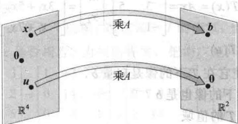  

图 1-34 通过矩阵乘法变换向量

由这个新观点，解方程 Ax=b 就是要求出 $R^{4}$ 中所有经过乘以 A 的 “作用” 后变为 $R^{2}$ 中 b 的向量 x.

由 x 到 Ax 的对应是由一个向量集到另一个向量集的函数。这个概念推广了通常的函数概念，通常的函数是把一个实数变为另一个实数的规则。

由 $\mathbb{R}^n$ 到 $\mathbb{R}^m$ 的一个变换（或称函数、映射） $T$ 是一个规则，它把 $\mathbb{R}^n$ 中每个向量 $x$ 对应以 $\mathbb{R}^m$ 中的一个向量 $T(x)$ 。集 $\mathbb{R}^n$ 称为 $T$ 的定义域，而 $\mathbb{R}^m$ 称为 $T$ 的余定义域（或取值空间）。符号 $T: \mathbb{R}^n \to \mathbb{R}^m$ 说明 $T$ 的定义域是 $\mathbb{R}^n$ 而余定义域是 $\mathbb{R}^m$ 。对于 $\mathbb{R}^n$ 中向量 $x, \mathbb{R}^m$ 中向量 $T(x)$ 称为 $x$ （在 $T$ 作用下）的像。所有像 $T(x)$ 的集合称为 $T$ 的值域。见图1-35。

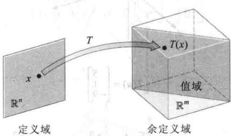  

图1-35 $T:\mathbb{R}^n\to \mathbb{R}^m$ 的定义域、余定义域和值域

本节的新名词是非常重要的，因为矩阵乘法的动态观点对理解线性代数和建立时变物理系统的数学模型起着关键作用。这样的动力系统将在1.10节、4.8节、4.9节以及第5章进行讨论。

## 矩阵变换

本节余下的内容研究有关矩阵乘法的映射．对 $\mathbb{R}^n$ 中每个 $x, T(x)$ 由 $Ax$ 计算得到，其中 $A$ 是 $m \times n$ 矩阵．为简单起见，有时将这样一个矩阵变换记为 $x \to Ax$ ．注意当 $A$ 有 $n$ 列时， $T$ 的定义域为 $\mathbb{R}^n$ ，而当 $A$ 的每个列有 $m$ 个元素时， $T$ 的余定义域为 $\mathbb{R}^m$ ． $T$ 的值域为 $A$ 的列的所有线性组合的集合，因为每个像 $T(x)$ 有 $Ax$ 的形式．

<Example title="例 1">
设 $A = \begin{bmatrix} 1 & -3 \\ 3 & 5 \\ -1 & 7 \end{bmatrix}, \boldsymbol{u} = \begin{bmatrix} 2 \\ -1 \end{bmatrix}, \boldsymbol{b} = \begin{bmatrix} 3 \\ 2 \\ -5 \end{bmatrix}, \boldsymbol{c} = \begin{bmatrix} 3 \\ 2 \\ 5 \end{bmatrix}$ ，定义变换 $T: \mathbb{R}^2 \to \mathbb{R}^3$ 为 $T(\boldsymbol{x}) = A\boldsymbol{x}$ ，于是

$$

T (\boldsymbol {x}) = A \boldsymbol {x} = \left[ \begin{array}{c c} 1 & - 3 \\ 3 & 5 \\ - 1 & 7 \end{array} \right] \left[ \begin{array}{l} x _ {1} \\ x _ {2} \end{array} \right] = \left[ \begin{array}{c} x _ {1} - 3 x _ {2} \\ 3 x _ {1} + 5 x _ {2} \\ - x _ {1} + 7 x _ {2} \end{array} \right]

$$

a. 求 $\pmb{u}$ 在变换 $T$ 下的像 $T(\pmb{u})$ .

b. 求 $R^{2}$ 中的向量 x，使它在 T 下的像是向量 b.

c. 是否有其他向量在 T 下的像也是 b？

d. 确定 c 是否属于变换 T 的值域.

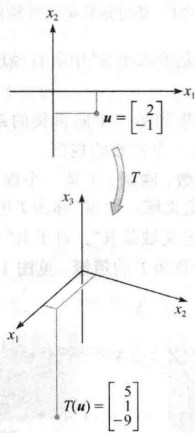

<Solution title="解">
a. 计算

$$

T (\boldsymbol {u}) = A \boldsymbol {u} = \left[ \begin{array}{c c} 1 & - 3 \\ 3 & 5 \\ - 1 & 7 \end{array} \right] \left[ \begin{array}{l} 2 \\ - 1 \end{array} \right] = \left[ \begin{array}{l} 5 \\ 1 \\ - 9 \end{array} \right]

$$

b. 解 $T(\pmb{x}) = \pmb{b}$ ，即解 $Ax = b$ ，或

$$

\left[ \begin{array}{c c} 1 & - 3 \\ 3 & 5 \\ - 1 & 7 \end{array} \right] \left[ \begin{array}{l} x _ {1} \\ x _ {2} \end{array} \right] = \left[ \begin{array}{c} 3 \\ 2 \\ - 5 \end{array} \right]\tag{1}

$$

应用 1.4 节的方法，把增广矩阵进行行化简：

$$

\left[ \begin{array}{r r r} 1 & - 3 & 3 \\ 3 & 5 & 2 \\ - 1 & 7 & - 5 \end{array} \right] \sim \left[ \begin{array}{r r r} 1 & - 3 & 3 \\ 0 & 1 4 & - 7 \\ 0 & 4 & - 2 \end{array} \right] \sim \left[ \begin{array}{r r r} 1 & - 3 & 3 \\ 0 & 1 & - 0. 5 \\ 0 & 0 & 0 \end{array} \right] \sim \left[ \begin{array}{r r r} 1 & 0 & 1. 5 \\ 0 & 1 & - 0. 5 \\ 0 & 0 & 0 \end{array} \right]\tag{2}

$$

因此 $x_{1} = 1.5, x_{2} = -0.5, \pmb{x} = \begin{bmatrix} 1.5 \\ -0.5 \end{bmatrix}$ ，这个向量 $\pmb{x}$ 在 $T$ 下的像是给定的向量 $\pmb{b}$ .

c. 对任意 x，若它在 T 下的像是 b，它必满足（1）．由（2）知方程（1）的解是唯一的，所以仅有一个 x 使它的像是 b．

d. 若向量 c 是 $R^{2}$ 中某个 x 在 T 下的像，则它属于 T 的值域，也就是说，对某个 x, $c = T(x)$ . 这就是说，要问方程组 Ax = c 是否相容. 为找出答案，把增广矩阵进行行化简：

$$

\left[ \begin{array}{r r r} 1 & - 3 & 3 \\ 3 & 5 & 2 \\ - 1 & 7 & 5 \end{array} \right] \sim \left[ \begin{array}{r r r} 1 & - 3 & 3 \\ 0 & 1 4 & - 7 \\ 0 & 4 & 8 \end{array} \right] \sim \left[ \begin{array}{r r r} 1 & - 3 & 3 \\ 0 & 1 & 2 \\ 0 & 1 4 & - 7 \end{array} \right] \sim \left[ \begin{array}{r r r} 1 & - 3 & 3 \\ 0 & 1 & 2 \\ 0 & 0 & - 3 5 \end{array} \right]

$$

第 3 个方程是 0 = -35，说明方程组不相容，因此 c 不属于 T 的值域.
</Solution>
</Example>

<Example title="例 1">
（c）的问题是线性方程组的唯一性问题，可以用矩阵变换的语言表述：b 是否是 $R^{n}$ 中唯一的 x 的像？类似地，例 1（d）是存在性问题：是否存在 $R^{n}$ 中的 x 使它的像为 c？

下面两个矩阵变换有很明确的几何意义，它们加强了矩阵作为向量变换的动态观点.2.7节包含了其他有关计算机图形学的有趣例子.
</Example>

<Example title="例 2">
若 $A = \begin{bmatrix} 1 & 0 & 0\\ 0 & 1 & 0\\ 0 & 0 & 0 \end{bmatrix}$ ，则变换 $\pmb {x}\mapsto A\pmb{x}$ 把 $\mathbb{R}^3$ 中的点投影到 $x_{1}x_{2}$ 坐标平面上，因为

$$

\left[ \begin{array}{l} x _ {1} \\ x _ {2} \\ x _ {3} \end{array} \right] \mapsto \left[ \begin{array}{l l l} 1 & 0 & 0 \\ 0 & 1 & 0 \\ 0 & 0 & 0 \end{array} \right] \left[ \begin{array}{l} x _ {1} \\ x _ {2} \\ x _ {3} \end{array} \right] = \left[ \begin{array}{l} x _ {1} \\ x _ {2} \\ 0 \end{array} \right]

$$

见图 1-36.

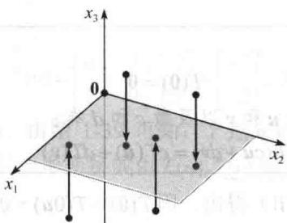  

图1-36 投影变换
</Example>

<Example title="例 3">
设 $A = \begin{bmatrix} 1 & 3 \\ 0 & 1 \end{bmatrix}$ ，变换 $T: \mathbb{R}^2 \to \mathbb{R}^2$ 定义为 $T(\pmb{x}) = A\pmb{x}$ ，称为剪切变换。可以说明，若 $T$ 作用于图1-37的 $2 \times 2$ 正方形的各点，则像的集构成带阴影的平行四边形。关键的思想是证明 $T$ 将线段映射成为线段（如习题27所示），然后验证正方形的4个顶点映射成平行四边形的4个顶点。例如，点 $\pmb{u} = \begin{bmatrix} 0 \\ 2 \end{bmatrix}$ 的像为 $T(\pmb{u}) = \begin{bmatrix} 1 & 3 \\ 0 & 1 \end{bmatrix} \begin{bmatrix} 0 \\ 2 \end{bmatrix} = \begin{bmatrix} 6 \\ 2 \end{bmatrix}, \begin{bmatrix} 2 \\ 2 \end{bmatrix}$ 的像为 $\begin{bmatrix} 1 & 3 \\ 0 & 1 \end{bmatrix} \begin{bmatrix} 2 \\ 2 \end{bmatrix} = \begin{bmatrix} 8 \\ 2 \end{bmatrix}$ 。 $T$ 将正方形变形，正方形的底保持不变，而正方形的顶拉向右边。剪切变换出现在物理学、地质学与晶体学中。

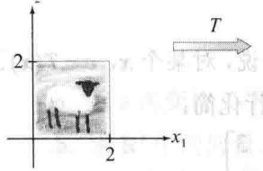

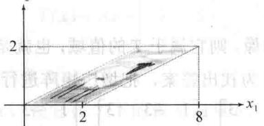

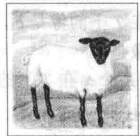  

图1-37 剪切变换  

绵羊

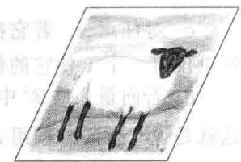  

剪切变换后的绵羊
</Example>

## 线性变换

1.4节定理5表明，若 $A$ 是 $m\times n$ 矩阵，则变换 $\pmb {x}\mapsto A\pmb{x}$ 有以下性质：

$$

A (\boldsymbol {u} + \boldsymbol {v}) = A \boldsymbol {u} + A \boldsymbol {v}, A (c \boldsymbol {u}) = c A \boldsymbol {u}

$$

u,v 是 $R^{n}$ 中任意向量，c 是任意数。这些性质若用函数记号来表示，就得到线性代数中最重要的一类变换。

定义 变换（或映射） $T$ 称为线性的，若

(i) 对 T 的定义域中一切 u, v， $T(u + v) = T(u) + T(v)$ .

（ii）对 T 的定义域中一切 u 和数 c， $T(cu)=cT(u)$ .

每个矩阵变换都是线性变换. 非矩阵变换的线性变换的重要例子将在第 4、5 章中讨论.

线性变换保持向量的加法运算与标量乘法运算. 性质（i）说明先将 $\mathbb{R}^n$ 中的 $\pmb{u}$ 和 $\pmb{v}$ 相加然后再作用以 $T$ 的结果 $T(\pmb{u} + \pmb{v})$ 等于先把 $T$ 作用于 $\pmb{u}$ 和 $\pmb{v}$ 然后将 $\mathbb{R}^m$ 中的 $T(\pmb{u})$ 和 $T(\pmb{v})$ 相加. 由这两个性质容易推出下列性质：

若 $T$ 是线性变换，则

$$

T (\mathbf {0}) = \mathbf {0}\tag{3}

$$

且对 T 的定义域中一切向量 u 和 v 以及数 c 和 d 有：

$$

T (c \boldsymbol {u} + d \boldsymbol {v}) = c T (\boldsymbol {u}) + d T (\boldsymbol {v})\tag{4}

$$

性质（3）由定义中的条件（ii）得出，因 $T(\mathbf{0})=T(0\mathbf{u})=0T(\mathbf{u})=\mathbf{0}$ .性质（4）由（i）和（ii）推出：

$$

T (c \boldsymbol {u} + d \boldsymbol {v}) = T (c \boldsymbol {u}) + T (d \boldsymbol {v}) = c T (\boldsymbol {u}) + d T (\boldsymbol {v})

$$

对于所有 u,v 和 c,d，若一个变换满足（4），它必是线性的。（取 c=d=1 可得（i），取 d=0 可得（ii）.）重复应用（4）得出有用的推广：

$$

T \left(c _ {1} \boldsymbol {v} _ {1} + \dots + c _ {p} \boldsymbol {v} _ {p}\right) = c _ {1} T (\boldsymbol {v} _ {1}) + \dots + c _ {p} T (\boldsymbol {v} _ {p})\tag{5}

$$

在工程和物理中，（5）式称为叠加原理。设想 $v_{1}, v_{2}, \cdots, v_{p}$ 为进入某个系统的信号， $T(v_{1}), \cdots, T(v_{p})$ 为系统对这些信号的响应。系统满足叠加原理，若某一输入可表示为这些信号的线性组合，则系统的响应是对各个信号的响应的同样的线性组合。我们将在第4章研究这一思想。

<Example title="例 4">
给定数 $r$ ，定义 $T: \mathbb{R}^2 \to \mathbb{R}^2$ 为 $T(x) = rx$ 。当 $0 \leqslant r \leqslant 1$ 时， $T$ 称为压缩变换；当 $r > 1$ 时，

T 称为拉伸变换. 设 r=3，证明 T 是线性变换.

<Solution title="解">
设 u, v 属于 $R^{2}$ ，c, d 为数，则

$$

\begin{array}{r l} {T (c \pmb {u} + d \pmb {v}) = 3 (c \pmb {u} + d \pmb {v})} & {\quad T \text {的定义}} \\ {= 3 c \pmb {u} + 3 d \pmb {v}} \\ {= c (3 \pmb {u}) + d (3 \pmb {v})} & {\quad \text {向量运算}} \\ {= c T (\pmb {u}) + d T (\pmb {v})} \end{array}

$$

因满足（4），于是 $T$ 是线性变换．见图1-38.

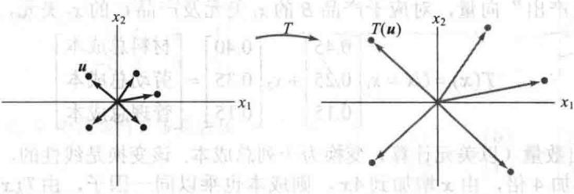  

图1-38 拉伸变换
</Solution>
</Example>

<Example title="例 5">
定义线性变换 $T: \mathbb{R}^2 \to \mathbb{R}^2$ 为

$$

T (\boldsymbol {x}) = \left[ \begin{array}{c c} 0 & - 1 \\ 1 & 0 \end{array} \right] \left[ \begin{array}{l} x _ {1} \\ x _ {2} \end{array} \right] = \left[ \begin{array}{c} - x _ {2} \\ x _ {1} \end{array} \right]

$$

图区

求出 $u=\begin{bmatrix}4\\ 1\end{bmatrix},v=\begin{bmatrix}2\\ 3\end{bmatrix}$ 和 $u+v=\begin{bmatrix}6\\ 4\end{bmatrix}$ 在 T 下的像.

$$

\left[ \begin{array}{c c} 0 & 1 \\ 1 - & 0 \end{array} \right] =

$$

<Solution title="解">
$$

T (\boldsymbol {u}) = \left[ \begin{array}{c c} 0 & - 1 \\ 1 & 0 \end{array} \right] \left[ \begin{array}{l} 4 \\ 1 \end{array} \right] = \left[ \begin{array}{l} - 1 \\ 4 \end{array} \right], T (\boldsymbol {v}) = \left[ \begin{array}{c c} 0 & - 1 \\ 1 & 0 \end{array} \right] \left[ \begin{array}{l} 2 \\ 3 \end{array} \right] = \left[ \begin{array}{l} - 3 \\ 2 \end{array} \right], T (\boldsymbol {u} + \boldsymbol {v}) = \left[ \begin{array}{c c} 0 & - 1 \\ 1 & 0 \end{array} \right] \left[ \begin{array}{l} 6 \\ 4 \end{array} \right] = \left[ \begin{array}{l} - 4 \\ 6 \end{array} \right]

$$
</Solution>
</Example>

<Note>
$T(\boldsymbol{u}+\boldsymbol{v})$ 等于 $T(\boldsymbol{u})+T(\boldsymbol{v})$ 。由图1-39可知，T把u,v和 $u+v$ 绕原点逆时针旋转 $90^{\circ}$ 。事实上，T把由u和v确定的平行四边形变换成由 $T(\boldsymbol{u}),T(\boldsymbol{v})$ 确定的平行四边形（见习题28）。

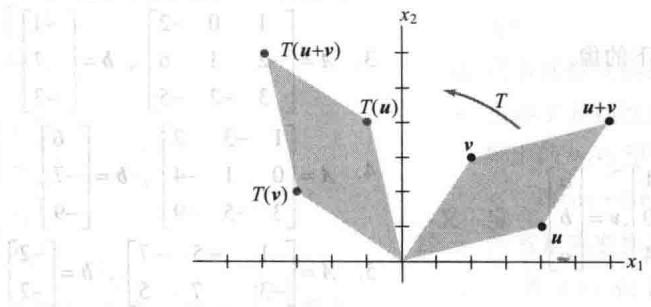  

图1-39 旋转变换

最后的例子不是几何的，它说明线性变换如何把某一类型的数据变成另一种类型的数据.
</Note>

<Example title="例 6">
某公司生产两种产品 B 和 C. 使用 1.3 节例 7 中的数据，我们构造 “单位成本” 矩阵 U = [b c]，它的各列描述 “每美元产出成本”：

$$

U = \left[ \begin{array}{l l} 0. 4 5 & 0. 4 0 \\ 0. 2 5 & 0. 3 5 \\ 0. 1 5 & 0. 1 5 \end{array} \right] \begin{array}{l} \text { 材料 } \\ \text { 劳动 } \\ \text { 管理 } \end{array}

$$

设 $x = (x_{1}, x_{2})$ 为“产出”向量，对应于产品 $B$ 的 $x_{1}$ 美元及产品 $C$ 的 $x_{2}$ 美元，定义 $T: \mathbb{R}^{2} \to \mathbb{R}^{3}$ 为

$$

T (\pmb {x}) = U \pmb {x} = x _ {1} \left[ \begin{array}{l} 0. 4 5 \\ 0. 2 5 \\ 0. 1 5 \end{array} \right] + x _ {2} \left[ \begin{array}{l} 0. 4 0 \\ 0. 3 5 \\ 0. 1 5 \end{array} \right] = \left[ \begin{array}{l} \text {材料总成本} \\ \text {劳动总成本} \\ \text {管理总成本} \end{array} \right]

$$

变换 T 将一列产出数量（以美元计算）变换为一列总成本。该变换是线性的，体现在两方面：

1. 若产量增加 4 倍，由 x 增加到 4x，则成本也乘以同一因子，由 $T(x)$ 增加到 $4T(x)$ .

2. 若 x 和 y 为产出向量，则对应于产出向量 $x + y$ 的总成本恰好等于成本向量 $T(x)$ 和 $T(y)$ 之和.
</Example>

<Block title="练习题">

1. 设 $T: \mathbb{R}^5 \to \mathbb{R}^2, T(x) = Ax, A$ 为某个矩阵， $x$ 属于 $\mathbb{R}^5$ ， $A$ 应有几行几列？

2. 设 $A = \begin{bmatrix} 1 & 0 \\ 0 & -1 \end{bmatrix}$ , 给出变换 $x \mapsto Ax$ 的几何解释.

3. 由0到向量 $\pmb{u}$ 的线段是形如 $t\pmb{u}$ 的点的集合，其中 $0 \leqslant t \leqslant 1$ 。证明线性变换 $T$ 把这个线段变为0到 $T(\pmb{u})$ 的线段。

</Block>

<Block title="习题1.8">

1. 设 $A = \begin{bmatrix} 2 & 0 \\ 0 & 2 \end{bmatrix}$ ，定义 $T: \mathbb{R}^2 \to \mathbb{R}^2$ 为 $T(\pmb{x}) = A\pmb{x}$ ，求出 $\pmb{u} = \begin{bmatrix} 1 \\ -3 \end{bmatrix}$ 与 $\pmb{v} = \begin{bmatrix} a \\ b \end{bmatrix}$ 在 $T$ 下的像.

2. 设 $A = \begin{bmatrix} \frac{1}{2} & 0 & 0 \\ 0 & \frac{1}{2} & 0 \\ 0 & 0 & \frac{1}{2} \end{bmatrix}, \boldsymbol{u} = \begin{bmatrix} 1 \\ 0 \\ -4 \end{bmatrix}, \boldsymbol{v} = \begin{bmatrix} a \\ b \\ c \end{bmatrix}$ , 定义

$T:\mathbb{R}^{3}\rightarrow\mathbb{R}^{3}$ 为 $T(\boldsymbol{x})=Ax,$ 求 $T(\boldsymbol{u})$ 和 $T(\boldsymbol{v})$ .

习题 3\~6 中，定义 $T(x)=Ax$ ，求出向量 x 使它在 T

下的像为 b，并判断 x 是否唯一.

$$

A = \left[ \begin{array}{r r r} 1 & 0 & - 2 \\ - 2 & 1 & 6 \\ 3 & - 2 & - 5 \end{array} \right], \boldsymbol {b} = \left[ \begin{array}{c} - 1 \\ 7 \\ - 3 \end{array} \right]

$$

$$

A = \left[ \begin{array}{c c c} 1 & - 3 & 2 \\ 0 & 1 & - 4 \\ 3 & - 5 & - 9 \end{array} \right], \boldsymbol {b} = \left[ \begin{array}{c} 6 \\ - 7 \\ - 9 \end{array} \right]

$$

$$

A = \left[ \begin{array}{c c c} 1 & - 5 & - 7 \\ - 3 & 7 & 5 \end{array} \right], \boldsymbol {b} = \left[ \begin{array}{l} - 2 \\ - 2 \end{array} \right]

$$

$$

A = \left[ \begin{array}{r r r} 1 & - 2 & 1 \\ 3 & - 4 & 5 \\ 0 & 1 & 1 \\ - 3 & 5 & - 4 \end{array} \right], \boldsymbol {b} = \left[ \begin{array}{l} 1 \\ 9 \\ 3 \\ - 6 \end{array} \right]

$$

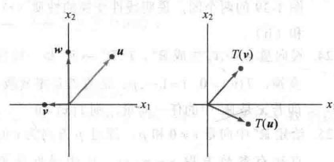

7. 设 A 是 $6 \times 5$ 矩阵，为了定义 $T: R^{a} \rightarrow R^{b}$ ， $T(x) = Ax$ ，a 与 b 应为多少？

8. 为了定义从 $\mathbb{R}^4$ 到 $\mathbb{R}^5$ 的映射 $T(x) = Ax$ ，矩阵 $A$ 应有几行几列？

习题 9\~10 中，对于给定矩阵 A，求出 $R^{4}$ 中所有 x，它在变换 $x \mapsto Ax$ 下映射为零向量.

9. $A=\begin{bmatrix}1&-4&7&-5\\ 0&1&-4&3\\ 2&-6&6&-4\end{bmatrix}$ 10. $A=\begin{bmatrix}1&3&9&2\\ 1&0&3&-4\\ 0&1&2&3\\ -2&3&0&5\end{bmatrix}$

11. 设 $b=\begin{bmatrix}-1\\ 1\\ 0\end{bmatrix}$ ，A 为习题 9 中的矩阵，b 是否属于线性变换 $x \mapsto Ax$ 的值域？为什么？

12. 设 $b=\begin{bmatrix}-1\\3\\-1\\4\end{bmatrix}$ ，A 为习题 10 中的矩阵，b 是否属于

线性变换 $x \mapsto Ax$ 的值域？为什么？

习题 13\~16 中，在直角坐标系下标出向量 $u=\begin{bmatrix}5\\ 2\end{bmatrix},v=\begin{bmatrix}-2\\ 4\end{bmatrix}$ 和它们在变换 T 下的像（每题画一个图），给出变换 T 对 $R^{2}$ 中向量 x 的作用的几何描述.

13. $T(\boldsymbol{x})=\begin{bmatrix}-1&0\\0&-1\end{bmatrix}\begin{bmatrix}x_{1}\\x_{2}\end{bmatrix}$

14. $T(\boldsymbol{x})=\begin{bmatrix}\frac{1}{2}&0\\0&\frac{1}{2}\end{bmatrix}\begin{bmatrix}x_{1}\\x_{2}\end{bmatrix}$

15. $T(\boldsymbol{x})=\begin{bmatrix}0&0\\ 0&1\end{bmatrix}\begin{bmatrix}x_{1}\\ x_{2}\end{bmatrix}$

16. $T(x)=\begin{bmatrix}0&1\\ 1&0\end{bmatrix}\begin{bmatrix}x_{1}\\ x_{2}\end{bmatrix}$

17. 设 $T: \mathbb{R}^2 \to \mathbb{R}^2$ 是线性变换，把 $\pmb{u} = \begin{bmatrix} 5 \\ 2 \end{bmatrix}$ 变为 $\begin{bmatrix} 2 \\ 1 \end{bmatrix}$ ，把 $\pmb{v} = \begin{bmatrix} 1 \\ 3 \end{bmatrix}$ 变为 $\begin{bmatrix} -1 \\ 3 \end{bmatrix}$ . 利用 $T$ 是线性变换的事实求出向量 3u, 2v, $3u + 2v$ 在 T 下的像.

18. 下图给出向量 $u, v, w$ 以及在线性变换 $T: \mathbb{R}^2 \to \mathbb{R}^2$ 的作用下 $T(u)$ 和 $T(v)$ 的像。画出 $T(w)$ 的像。（提示：首先将 $w$ 写成 $u$ 和 $v$ 的线性组合。）

19. 设 $e_{1}=\begin{bmatrix}1\\ 0\end{bmatrix},e_{2}=\begin{bmatrix}0\\ 1\end{bmatrix},y_{1}=\begin{bmatrix}2\\ 5\end{bmatrix},y_{2}=\begin{bmatrix}-1\\ 6\end{bmatrix},T:\mathbb{R}^{2}\rightarrow\mathbb{R}^{2}$ 是线性变换，把 $e_{1}$ 变为 $y_{1}$ ，把 $e_{2}$ 变为 $y_{2}$ 。求 $\begin{bmatrix}5\\ -3\end{bmatrix}$ 和 $\begin{bmatrix}x_{1}\\ x_{2}\end{bmatrix}$ 的像。

20. 设 $x=\begin{bmatrix}x_{1}\\x_{2}\end{bmatrix},v_{1}=\begin{bmatrix}-2\\5\end{bmatrix},v_{2}=\begin{bmatrix}7\\-3\end{bmatrix},T:\mathbb{R}^{2}\rightarrow\mathbb{R}^{2}$ 是线性变换，把 x 映射为 $x_{1}v_{1}+x_{2}v_{2}$ 。求矩阵 A，使得对每个 x， $T(x)=Ax$ 。

习题 21\~22 中，判断每个命题的真假，并说明理由.

21. a. 线性变换是一种特殊的函数.

b. 若 A 是 $3 \times 5$ 矩阵，T 是由 $T(x) = Ax$ 定义的变换，则 A 的定义域是 $R^{3}$ .

c. 若 A 是 $m \times n$ 矩阵，则变换 $x \mapsto Ax$ 的值域是 $R^{m}$ .

d. 所有线性变换都是矩阵变换.

e. 变换 T 是线性的，当且仅当对任意 T 的定义域中的 $v_{1}, v_{2}$ 和所有数 $c_{1}, c_{2}$ 都有

$$

T (c _ {1} \pmb {\nu} _ {1} + c _ {2} \pmb {\nu} _ {2}) = c _ {1} T (\pmb {\nu} _ {1}) + c _ {2} T (\pmb {\nu} _ {2})

$$

22. a. 所有矩阵变换都是线性变换.

b. 变换 $x \mapsto Ax$ 的余定义域是 $A$ 的列的所有线性组合所构成的集合.

c. 若 $T: \mathbb{R}^n \to \mathbb{R}^m$ 是线性变换， $c$ 在 $\mathbb{R}^m$ 中，则唯一性问题是：“ $c$ 是否在 $T$ 的值域中？”

d. 线性变换保持向量加法和标量乘法运算.

e. 叠加原理是线性变换的物理描述.

23. 设 $T: \mathbb{R}^2 \to \mathbb{R}^2$ 是把点映射为它关于 $x_1$ 轴的对称点的线性变换（参见练习题2）。画出类似图1-39的两个图，说明线性变换的性质（i）和（ii）.

24. 设向量 $v_{1}, \cdots, v_{p}$ 生成 $R^{n}$ ， $T: R^{n} \rightarrow R^{n}$ 是一线性变换， $T(v_{i}) = 0, i = 1, \cdots, p$ 。证明 T 是零变换，即若 x 是 $R^{n}$ 中的任一向量，则 $T(x) = 0$ 。

25. 给定 $\mathbb{R}^n$ 中向量 $v \neq 0$ 和 $p$ ，通过 $p$ 方向为 $v$ 的直线有参数方程 $x = p + tv$ 。证明线性变换 $T: \mathbb{R}^n \to \mathbb{R}^m$ 把此直线映射到另一条直线或一点（称为退化直线）上。

26. 设 u, v 为 $R^{3}$ 中线性无关向量，P 是通过 u, v 和 0 的平面，P 的参数方程为 $x = su + tv (s, t \text{ 为实数})$ .

证明任意线性变换 $T: R^{3} \rightarrow R^{3}$ 把 P 映射到通过 0 的一个平面，或通过 0 的一条直线，或仅是 $R^{3}$ 中的原点。为了使平面 P 的像是平面， $T(u)$ 和 $T(v)$ 应满足什么条件？

27. a. 证明通过 $\mathbb{R}^n$ 中向量 $p$ 和 $q$ 的直线可写成参数方程 $x = (1 - t)p + tq$ 。（参阅1.5节的习题21和22中的图。）b. 由 $p$ 到 $q$ 的线段可表示为所有形如 $(1 - t)p + tq$ （ $0 \leqslant t \leqslant 1$ ）的点的集合（如下图所示）。证明任意一个线性变换 $T$ 把此线段映射为一条线段或一个单独的点。

$$

(t = 1) q \quad (1 - t) p + t q

$$

28. 设 $\pmb{u}$ 和 $\pmb{v}$ 是 $\mathbb{R}^n$ 中的向量，可以证明，由 $\pmb{u}$ 和 $\pmb{v}$ 所确定的平行四边形内所有点的集 $P$ 可表示为 $a\pmb{u} + b\pmb{v}$ ， $0 \leqslant a \leqslant 1, 0 \leqslant b \leqslant 1$ 。设 $T: \mathbb{R}^n \to \mathbb{R}^m$ 为线性变换，说明为什么 $P$ 内一点在 $T$ 下的像是在由 $T(\pmb{u})$ 和 $T(\pmb{v})$ 确定的平行四边形内。

29. 定义 $f: \mathbb{R} \to \mathbb{R}$ 为 $f(x) = mx + b$ . a. 证明当 $\pmb{b} = 0$ 时， $f$ 是线性变换. b. 求出线性变换的一个性质，使得当 $b \neq 0$ 时， $f$ 不满足该性质. c. 为什么称 $f$ 为线性函数？

30. 仿射变换 $T: \mathbb{R}^n \to \mathbb{R}^m$ 有形式 $T(x) = Ax + b, A$ 为 $m \times n$ 矩阵， $b$ 属于 $\mathbb{R}^m$ 。证明当 $b \neq 0$ 时， $T$ 不是线性变换（仿射变换在计算机图形学中很重要）。

31. 设 $T: \mathbb{R}^n \to \mathbb{R}^m$ 为线性变换，设 $\{\pmb{v}_1, \pmb{v}_2, \pmb{v}_3\}$ 为 $\mathbb{R}^n$ 中线性相关集，说明为什么集 $\{T(\pmb{v}_1), T(\pmb{v}_2), T(\pmb{v}_3)\}$ 线性相关. 习题 32\~36 中，将列向量写成行的形式，如 $\pmb{x} = (x_1, x_2)$ ， $T(\pmb{x}) = T(x_1, x_2)$ .

32. 证明由 $T(x_{1},x_{2}) = (4x_{1} - 2x_{2},3|x_{2}|)$ 定义的变换 $T$ 不是线性的.

33. 证明由 $T(x_{1}, x_{2}) = (2x_{1} - 3x_{2}, x_{1} + 4, 5x_{2})$ 定义的变换 $T$ 不是线性的.

34. 设 $T: \mathbb{R}^n \to \mathbb{R}^m$ 为线性变换. 证明: 若 $T$ 把两个线性无关向量映射为线性相关集, 则方程 $T(x) = 0$ 有非平凡解. (提示: 设 $\mathbb{R}^n$ 中 $u$ 和 $v$ 线性无关, 但 $T(u)$ 和 $T(v)$ 线性相关. 则 $c_1 T(u) + c_2 T(v) = 0$ 对某个不全为零的权 $c_1$ 和 $c_2$ 成立, 然后使用这一方程.)

35. 设 $T: \mathbb{R}^3 \to \mathbb{R}^3$ 为一变换，它将向量 $\pmb{x} = (x_1, x_2, x_3)$ 映射为关于平面 $x_3 = 0$ 对称的点 $T(\pmb{x}) = T(x_1, x_2, -x_3)$ ，证明 $T$ 是一线性变换。（思路参见例4.）

36. 设 $T: R^{3} \rightarrow R^{3}$ 为一变换，它将向量 $\boldsymbol{x} = (x_{1}, x_{2}, x_{3})$ 映射到平面 $x_{2} = 0$ 上，即 $T(\boldsymbol{x}) = T(x_{1}, 0, x_{3})$ ，证明 T 是一线性变换.

[M]习题37\~38中，给定矩阵确定了一个线性变换 $T$ ，求出使 $T(x) = 0$ 的所有 $\pmb{x}$ ：

37.

$$

\left[ \begin{array}{r r r r} 4 & - 2 & 5 & - 5 \\ - 9 & 7 & - 8 & 0 \\ - 6 & 4 & 5 & 3 \\ 5 & - 3 & 8 & - 4 \end{array} \right]

$$

38.

$$

\left[ \begin{array}{r r r r} - 9 & - 4 & - 9 & 4 \\ 5 & - 8 & - 7 & 6 \\ 7 & 1 1 & 1 6 & - 9 \\ 9 & - 7 & - 4 & 5 \end{array} \right]

$$

39. [M] 设 $b = \begin{bmatrix} 7 \\ 5 \\ 9 \\ 7 \end{bmatrix}$ ，A 为习题 37 中的矩阵，b 是否属于变换 $x \mapsto Ax$ 的值域？若是，求出在变换 T 下像为 b 的 x。

40. [M] 设 $b = \begin{bmatrix} -7 \\ -7 \\ 13 \\ -5 \end{bmatrix}$ ，设 A 为习题 38 中的矩阵，b 是否属于变换 $x \mapsto Ax$ 的值域？若是，求出在变换 T 下像为 b 的 x。

</Block>

<Block title="练习题答案">

1. A 必须有 5 列，Ax 才有定义。A 必须有 2 行，T 的余定义域才能是 $R^{2}$ 。

2. 在坐标系中任意取一点（向量）看看会发生什么。例如（4，1）映射为（4，-1）。变换 $x \mapsto Ax$ 把点映射为它关于 $x$ 轴（或 $x_{1}$ 轴）的对称点。见图1-40。

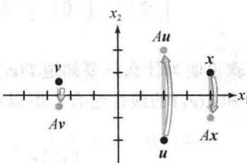  

变换 $x \mapsto Ax$  

图 1-40

3. 设 $x = t u, 0 \leqslant t \leqslant 1$ . 因 $T$ 是线性变换，故 $T(t u) = t T(u)$ ，它是连接 0 和 $T(u)$ 的线段上的点.

</Block>
