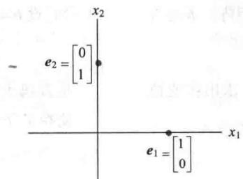
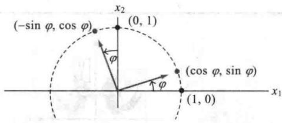
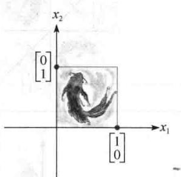
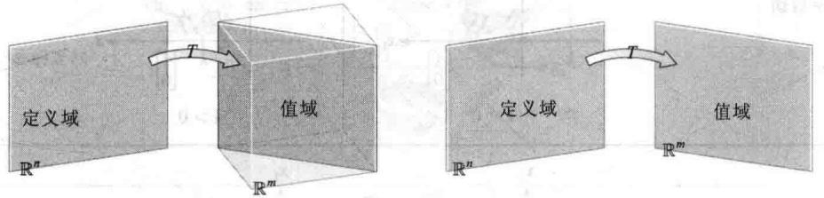
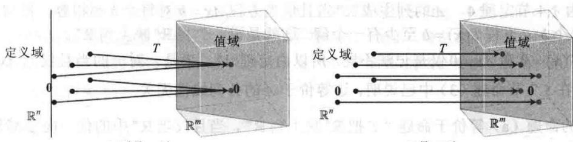
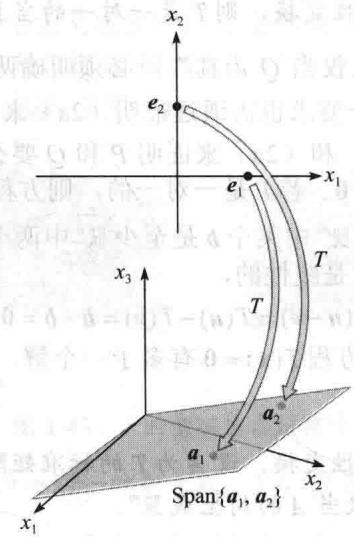
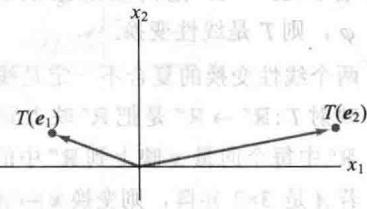
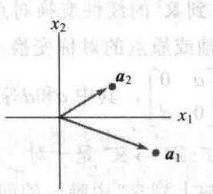
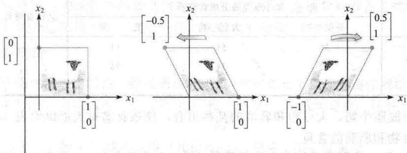

import Guide from '@/components/Guide.astro';
import Knowledge from '@/components/Knowledge.astro';
import Example from '@/components/Example.astro';
import Analysis from '@/components/Analysis.astro';
import Solution from '@/components/Solution.astro';
import Variant from '@/components/Variant.astro';
import Note from '@/components/Note.astro';
import Block from '@/components/Block.astro';
import Method from '@/components/Method.astro';
import Exercise from '@/components/Exercise.astro';

当一个线性变换 $T$ 是由几何中提出来或用语言叙述时，我们通常希望有关于 $T(\pmb{x})$ 的公式。下面的讨论指出，从 $\mathbb{R}^n$ 到 $\mathbb{R}^m$ 的每一个线性变换实际上都是一个矩阵变换 $\pmb{x} \mapsto A\pmb{x}$ ，而且变换 $T$ 的重要性质都归结为 $A$ 的性质。寻找矩阵 $A$ 的关键是了解 $T$ 完全由它对 $n \times n$ 单位矩阵 $I_n$ 的各列的作用所决定。

<Example title="例 1">
$I_{2} = \begin{bmatrix} 1 & 0\\ 0 & 1 \end{bmatrix}$ 的两列是 $\pmb {e}_1 = \begin{bmatrix} 1\\ 0 \end{bmatrix}$ 和 $\pmb {e}_2 = \begin{bmatrix} 0\\ 1 \end{bmatrix}$ ，设 $T$ 是 $\mathbb{R}^2$ 到 $\mathbb{R}^3$ 的线性变换，满足

$$
T \left(\boldsymbol {e} _ {1}\right) = \left[ \begin{array}{c} 5 \\ - 7 \\ 2 \end{array} \right], T \left(\boldsymbol {e} _ {2}\right) = \left[ \begin{array}{c} - 3 \\ 8 \\ 0 \end{array} \right]
$$

在此条件下求出 $R^{2}$ 中任意向量 x 的像的公式.

<Solution title="解">
写出

$$
\boldsymbol {x} = \left[ \begin{array}{l} x _ {1} \\ x _ {2} \end{array} \right] = x _ {1} \left[ \begin{array}{l} 1 \\ 0 \end{array} \right] + x _ {2} \left[ \begin{array}{l} 0 \\ 1 \end{array} \right] = x _ {1} \boldsymbol {e} _ {1} + x _ {2} \boldsymbol {e} _ {2}\tag{1}
$$

因为 $T$ 是线性变换，所以

$$
T (\boldsymbol {x}) = x _ {1} T \left(\boldsymbol {e} _ {1}\right) + x _ {2} T \left(\boldsymbol {e} _ {2}\right) = x _ {1} \left[ \begin{array}{c} 5 \\ - 7 \\ 2 \end{array} \right] + x _ {2} \left[ \begin{array}{c} - 3 \\ 8 \\ 0 \end{array} \right] = \left[ \begin{array}{c} 5 x _ {1} - 3 x _ {2} \\ - 7 x _ {1} + 8 x _ {2} \\ 2 x _ {1} + 0 \end{array} \right]\tag{2}
$$

由方程（1）到方程（2）的步骤说明为什么只要知道 $T(\boldsymbol{e}_{1})$ 和 $T(\boldsymbol{e}_{2})$ 就可由任意x确定 $T(x)$ .此外，因（2）把 $T(x)$ 表示为 $T(\boldsymbol{e}_{1})$ 和 $T(\boldsymbol{e}_{2})$ 的线性组合，所以可把这些向量作为矩阵A的各列，而把（2）式写成

$$
T (\pmb {x}) = \left[ T (\pmb {e} _ {1}) T (\pmb {e} _ {2}) \right] \left[ \begin{array}{l} x _ {1} \\ x _ {2} \end{array} \right] = A \pmb {x}
$$
</Solution>
</Example>

<Knowledge title="定理 10">
设 $T: R^{n} \rightarrow R^{m}$ 为线性变换，则存在唯一的矩阵 A，使得对 $R^{n}$ 中一切 x，

$$
T (\boldsymbol {x}) = A \boldsymbol {x}
$$

事实上， $A$ 是 $m \times n$ 矩阵，它的第 $j$ 列是向量 $T(\pmb{e}_j)$ ，其中 $\pmb{e}_j$ 是 $\mathbb{R}^n$ 中单位矩阵 $\pmb{I}_n$ 的第 $j$ 列：

$$
A = \left[ T (\boldsymbol {e} _ {1}) \dots T (\boldsymbol {e} _ {n}) \right]\tag{3}
$$

<Solution title="证明">
记 $x = I_{n}x = [e_{1} \cdots e_{n}]x = x_{1}e_{1} + \cdots + x_{n}e_{n}$ ，由于 T 是线性变换，知

$$
T (\boldsymbol {x}) = T (x _ {1} \boldsymbol {e} _ {1} + \dots + x _ {n} \boldsymbol {e} _ {n}) = x _ {1} T (\boldsymbol {e} _ {1}) + \dots + x _ {n} T (\boldsymbol {e} _ {n})
$$

$$
= \left[ T (\pmb {e} _ {1}) \dots T (\pmb {e} _ {n}) \right] \left[ \begin{array}{c} x _ {1} \\ \vdots \\ x _ {n} \end{array} \right] = A \pmb {x}
$$

A 的唯一性在习题 33 中研究.

（3）中的矩阵 A 称为线性变换 T 的标准矩阵.

现在我们知道，由 $\mathbb{R}^n$ 到 $\mathbb{R}^m$ 的每个线性变换都可看作是矩阵变换，反之亦然。术语线性变换强调映射的性质，而矩阵变换描述这样的映射如何实现。如下面两例所示。
</Solution>
</Knowledge>

<Example title="例 2">
对拉伸变换 $T(x)=3x$ ，其中 $x \in R^{2}$ ，求标准矩阵 A.

<Solution title="解">
写出

$$
\begin{array}{r l} & {T (\pmb {e} _ {1}) = 3 \pmb {e} _ {1} = \left[ \begin{array}{l} {3} \\ {0} \end{array} \right] \text {和} T (\pmb {e} _ {2}) = 3 \pmb {e} _ {2} = \left[ \begin{array}{l} {0} \\ {3} \end{array} \right]} \\ & {\qquad \qquad \qquad \qquad \qquad \qquad \qquad \qquad \qquad \qquad \qquad \qquad \qquad \qquad \qquad \qquad \qquad A = \left[ \begin{array}{l l} {3} & {0} \\ {0} & {3} \end{array} \right]} \end{array}
$$
</Solution>
</Example>

<Example title="例 3">
设 $T:\mathbb{R}^2\to \mathbb{R}^2$ 为把 $\mathbb{R}^2$ 中每一个点绕原点逆时针旋转正角度 $\varphi$ 的变换．我们可以从几何上证明这个变换是线性变换（见1.8节图1-39）．求出这个变换的标准矩阵.

<Solution title="解">
$\begin{bmatrix}1\\ 0\end{bmatrix}$ 旋转成为 $\begin{bmatrix}\cos\varphi\\ \sin\varphi\end{bmatrix}$ ， $\begin{bmatrix}0\\ 1\end{bmatrix}$ 旋转成为 $\begin{bmatrix}-\sin\varphi\\\cos\varphi\end{bmatrix}$ ，见图 1-41.

<figure class="vp-figure">
  
  <figcaption>图1-41 旋转变换</figcaption>
</figure>

由定理10，

$$
A = \left[ \begin{array}{c c} \cos \varphi & - \sin \varphi \\ \sin \varphi & \cos \varphi \end{array} \right]
$$

1.8节例5是这个变换的特殊情形，其中 $\varphi = \pi /2$
</Solution>
</Example>

## $\mathbb{R}^2$ 中的几何线性变换

例 2 和例 3 说明了几何中的线性变换, 表 1-2\~1-5 说明了其他常见的平面几何线性变换. 因这些变换都是线性的, 故它们完全由它们对 $I_{2}$ 的各列的作用确定, 而不是仅表示 $e_{1}$ 和 $e_{2}$ 的像, 下列各表说明了这些变换对单位正方形的作用（见图 1-42）.

<figure class="vp-figure">
  
  <figcaption>图1-42 单位正方形</figcaption>
</figure>

其他的变换可以通过表 1-2\~1-5 所列出的变换通过复合构造出来，即一个变换之后再作另一个变换。例如，作一个水平剪切变换后再作一个关于 $x_{2}$ 轴的对称变换。2.1节将证明，线性变

换的复合仍是线性的（见习题36）

表 1-2 对称

<table><tr><td>变换</td><td>单位正方形的像</td><td>标准矩阵</td></tr><tr><td>关于 $x_1$ 轴的对称</td><td></td><td> $\begin{bmatrix} 1 & 0 \\ 0 & -1 \end{bmatrix}$ </td></tr><tr><td>关于 $x_2$ 轴的对称</td><td></td><td> $\begin{bmatrix} -1 & 0 \\ 0 & 1 \end{bmatrix}$ </td></tr><tr><td>关于直线 $x_2 = x_1$ 的对称</td><td></td><td> $\begin{bmatrix} 0 & 1 \\ 1 & 0 \end{bmatrix}$ </td></tr><tr><td>关于直线 $x_2 = -x_1$ 的对称</td><td>[X, Z776]</td><td> $\begin{bmatrix} 0 & -1 \\ -1 & 0 \end{bmatrix}$ </td></tr><tr><td>关于原点的对称</td><td></td><td> $\begin{bmatrix} -1 & 0 \\ 0 & -1 \end{bmatrix}$ </td></tr></table>

表 1-3 收缩与拉伸

<table><tr><td>变换</td><td colspan="2">单位正方形的像</td><td>标准矩阵</td></tr><tr><td rowspan="2">水平收缩与拉伸</td><td></td><td></td><td rowspan="2"></td></tr><tr><td>0 &lt; k &lt; 1</td><td>k &gt; 1</td></tr><tr><td>垂直收缩与拉伸</td><td></td><td></td><td> $\begin{bmatrix} 1 & 0 \\ 0 & k \end{bmatrix}$ </td></tr><tr><td colspan="4">表1-4 剪切变换</td></tr><tr><td>变换</td><td colspan="2">单位正方形的像</td><td>标准矩阵</td></tr><tr><td rowspan="2">水平剪切</td><td></td><td></td><td rowspan="2"> $\begin{bmatrix} 1 & k \\ 0 & 1 \end{bmatrix}$ </td></tr><tr><td>k &lt; 0</td><td>k &gt; 0</td></tr><tr><td>垂直剪切</td><td></td><td></td><td> $\begin{bmatrix} 1 & 0 \\ k & 1 \end{bmatrix}$ </td></tr></table>

表 1-5 投影

<table><tr><td>变换</td><td>单位正方形的像</td><td>标准矩阵</td></tr><tr><td>投影到 $x_1$ 轴上</td><td></td><td> $\begin{bmatrix} 1 & 0 \\ 0 & 0 \end{bmatrix}$ </td></tr><tr><td>投影到 $x_2$ 轴上</td><td></td><td> $\begin{bmatrix} 0 & 0 \\ 0 & 1 \end{bmatrix}$ </td></tr></table>

## 存在与唯一性问题

线性变换的概念给出一种新的了解以前提到的存在与唯一性问题的观点，下列两个定义给出与变换有关的术语.

定义 映射 $T: \mathbb{R}^n \to \mathbb{R}^m$ 称为到 $\mathbb{R}^m$ 上的映射，若 $\mathbb{R}^m$ 中每个 $b$ 是 $\mathbb{R}^n$ 中至少一个 $x$ 的像。（也称为满射。）

等价地，当 $T$ 的值域是整个余定义域 $\mathbb{R}^m$ 时， $T$ 是到 $\mathbb{R}^m$ 上的。也就是说，若对 $\mathbb{R}^m$ 中每个 $\pmb{b}$ ，方程 $T(\pmb{x}) = \pmb{b}$ 至少有一个解。“ $T$ 是否把 $\mathbb{R}^n$ 映到 $\mathbb{R}^m$ 上？”是存在性问题。映射 $T$ 不是到 $\mathbb{R}^m$ 上的，若 $\mathbb{R}^m$ 中有某个 $\pmb{b}$ 使方程 $T(\pmb{x}) = \pmb{b}$ 无解。见图1-43。

  
$T$ 不是到 $\mathbb{R}^m$ 上的  
$T$ 是到 $\mathbb{R}^m$ 上的  
图1-43 $T$ 的值域是否是整个 $\mathbb{R}^m$

定义 映射 $T: \mathbb{R}^n \to \mathbb{R}^m$ 称为一对一映射（或1:1），若 $\mathbb{R}^m$ 中每个 $b$ 是 $\mathbb{R}^n$ 中至多一个 $x$ 的像。（也称为单射。）

等价地， $T$ 是一对一的，若对 $\mathbb{R}^m$ 中每个 $\pmb{b}$ ，方程 $T(x) = b$ 有唯一的解或没有解。“ $T$ 是否是一对一的？”是唯一性问题。映射 $T$ 不是一对一的，若 $\mathbb{R}^m$ 中某个 $\pmb{b}$ 是 $\mathbb{R}^n$ 中多个向量的像。若没

有这样的 b，T 就是一对一的。见图 1-44。

  
$T$ 不是一对一  
$T$ 是一对一  
图1-44 是否每个 $\pmb{b}$ 是至多一个向量的像

表 1-5 中的投影变换不是一对一的，也不能将 $R^{2}$ 映上到 $R^{2}$ 。表 1-2、1-3 和 1-4 中的变换是一对一的，能将 $R^{2}$ 映上到 $R^{2}$ 。其他可能性在下面的两个例子中给出。

例 4 及随后的定理说明了关于一对一映射与映上映射的函数性质是如何与本章以前的一些概念关联起来的.

<Example title="例 4">
设 $T$ 是线性变换，它的标准矩阵为

$$
A = \left[ \begin{array}{c c c c} 1 & - 4 & 8 & 1 \\ 0 & 2 & - 1 & 3 \\ 0 & 0 & 0 & 5 \end{array} \right]
$$

$T$ 是否把 $\mathbb{R}^4$ 映上到 $\mathbb{R}^3$ ? $T$ 是否是一对一映射?

<Solution title="解">
因 $A$ 已经是阶梯形，故可以立即看出， $A$ 在每一行有主元位置，由1.4节定理4，对 $\mathbb{R}^3$ 中每个 $b$ ，方程 $Ax = b$ 相容。换句话说，线性变换 $T$ 将 $\mathbb{R}^4$ （它的定义域）映射到 $\mathbb{R}^3$ 上。然而因方程 $Ax = b$ 有一个自由变量（因为有4个变量，而仅有3个基本变量），每个 $b$ 都有多个 $x$ 的像，所以 $T$ 不是一对一的。
</Solution>
</Example>

<Knowledge title="定理 11">
设 $T: R^{n} \rightarrow R^{m}$ 为线性变换，则 T 是一对一的当且仅当方程 Ax = 0 仅有平凡解.
</Knowledge>

要证明定理“P 为真当且仅当 Q 为真”，必须明确两点：（1）若 P 为真，则 Q 为真。（2）若 Q 为真，则 P 为真。第二个要求也需通过证明（2a）来满足：若 P 为假，则 Q 为假（这称作换位推理）。该证明使用（1）和（2a）来证明 P 和 Q 要么均为真要么均为假。

<Solution title="证明">
因 $T$ 是线性的，故 $T(\mathbf{0}) = \mathbf{0}$ 。若 $T$ 是一对一的，则方程 $T(x) = \mathbf{0}$ 至多有一个解，因此仅有平凡解。若 $T$ 不是一对一的，则 $\mathbb{R}^m$ 中某个 $\pmb{b}$ 是至少 $\mathbb{R}^n$ 中两个相异向量（比如说是 $\pmb{u}$ 和 $\pmb{v}$ ）的像，即 $T(\pmb{u}) = \pmb{b}, T(\pmb{v}) = \pmb{b}$ 。于是因 $T$ 是线性的，

$$
T (\boldsymbol {u} - \boldsymbol {v}) = T (\boldsymbol {u}) - T (\boldsymbol {v}) = \boldsymbol {b} - \boldsymbol {b} = \mathbf {0}
$$

向量 u-v 不是零，因 $u \neq v$ 。因此方程 $T(x) = 0$ 有多于一个解。因而定理中两个条件同时成立或同时不成立。
</Solution>

<Knowledge title="定理 12">
设 $T: R^{n} \rightarrow R^{m}$ 是线性变换，设 A 为 T 的标准矩阵，则

a. T 把 $R^{n}$ 映上到 $R^{m}$ ，当且仅当 A 的列生成 $R^{m}$ .

b. T 是一对一的，当且仅当 A 的列线性无关.
</Knowledge>

“当且仅当”语句可以关联在一起．例如，若知“P当且仅当Q”和“Q当且仅当R”，

则可推出“ $P$ 当且仅当 $R$ ”．该策略在本证明中反复运用.

<Solution title="证明">
a. 由 1.4 节定理 4, A 的列生成 $\mathbb{R}^m$ 当且仅当方程 $Ax = b$ 对每个 $b$ 都相容，换句话说，当且仅当对每个 $b$ ，方程 $T(x) = b$ 至少有一个解。这就是说， $T$ 将 $\mathbb{R}^n$ 映上到 $\mathbb{R}^m$ 。

b. 方程 $T(x) = 0$ 和 $Ax = 0$ 仅是记法不同。所以由定理11， $T$ 是一对一的当且仅当 $Ax = 0$ 仅有平凡解。这在1.7节命题（3）中已说明，这等价于 $A$ 的各列线性无关。

定理12的命题（a）等价于命题“ $T$ 把 $\mathbb{R}^n$ 映上到 $\mathbb{R}^m$ ，当且仅当 $\mathbb{R}^m$ 中的任一向量都是 $A$ 的列的一个线性组合。”参见1.4节定理4.

下例以及习题中，我们把列向量写成行的形式，如 $\boldsymbol{x}=(x_{1},x_{2})$ ，将 $T(\boldsymbol{x})$ 写成 $T(x_{1},x_{2})$ ，以代替更正式的 $T((x_{1},x_{2}))$ 。
</Solution>

<Example title="例 5">
设 $T(x_{1}, x_{2}) = (3x_{1} + x_{2}, 5x_{1} + 7x_{2}, x_{1} + 3x_{2})$ ，证明 T 是一对一线性变换。T 是否将 $R^{2}$ 映上到 $R^{3}$ ?

<Solution title="解">
当 x 和 $T(x)$ 写成列向量时，容易通过检查 Ax 中每个元素的行向量计算看出 T 的标准矩阵.

$$
T (\boldsymbol {x}) = \left[ \begin{array}{l l} 3 x _ {1} + & x _ {2} \\ 5 x _ {1} + 7 x _ {2} \\ & x _ {1} + 3 x _ {2} \end{array} \right] = \left[ \begin{array}{l l}? & ? \\ ? & ? \\ ? & ? \end{array} \right] \left[ \begin{array}{l} x _ {1} \\ x _ {2} \end{array} \right] = \left[ \begin{array}{l l} 3 & 1 \\ 5 & 7 \\ 1 & 3 \end{array} \right] \left[ \begin{array}{l} x _ {1} \\ x _ {2} \end{array} \right]\tag{4}
$$

故 $T$ 的确是线性变换，它的标准矩阵如（4）所示。 $A$ 的列是线性无关的，因为它们互相之间不是倍数关系。由定理12（b）， $T$ 是一对一的。为确定 $T$ 是否是从 $\mathbb{R}^2$ 到 $\mathbb{R}^3$ 的映上映射，观察 $A$ 的各列生成的向量集。因 $A$ 是 $3 \times 2$ 矩阵，由定理4可知， $A$ 的列生成 $\mathbb{R}^3$ 当且仅当 $A$ 有3个主元位置。这是不可能的，因 $A$ 仅有2列。所以 $A$ 的各列不能生成 $\mathbb{R}^3$ ，对应的线性变换不是映上到 $\mathbb{R}^3$ 的。如图1-45所示。

<figure class="vp-figure">
  
  <figcaption>图1-45 变换 $T$ 不是映上到 $\mathbb{R}^3$ 的</figcaption>
</figure>
</Solution>
</Example>

<Block title="练习题">
1. 设 $T: R^{2} \rightarrow R^{2}$ 为一个线性变换，它先作水平剪切变换，将 $e_{2}$ 映射为 $e_{2} - 0.5e_{1}$ （但 $e_{1}$ 不变），然后再作关于 $x_{2}$ 轴的对称变换。假设 T 是线性的，求它的标准矩阵。（提示：确定 $e_{1}$ 和 $e_{2}$ 的像的最终位置。）

2. 若 $A$ 是有 5 个主元的 $7 \times 5$ 矩阵. 设 $T(x) = Ax$ 是一个 $\mathbb{R}^5$ 到 $\mathbb{R}^7$ 的线性变换. $T$ 是一个一对一线性变换吗？是映上到 $\mathbb{R}^7$ 吗？
</Block>

<Block title="习题1.9">
在习题 1\~10 中，设 T 是线性变换，求出 T 的标准矩阵.

1. $T:\mathbb{R}^2\to \mathbb{R}^4$ ， $T(\pmb {e}_1) = (3,1,3,1), T(\pmb {e}_2) = (-5,2,0,0),$ 其中 $\pmb {e}_1 = (1,0),\pmb {e}_2 = (0,1).$

2. $T:\mathbb{R}^3\to \mathbb{R}^2$ ， $T(\pmb {e}_1) = (1,3)$ ， $T(\pmb {e}_2) = (4, - 7),T(\pmb {e}_3) =$ $(-5,4)$ ，其中 $\pmb {e}_1,\pmb {e}_2,\pmb {e}_3$ 是 $3\times 3$ 单位矩阵的列.

3. $T: R^{2} \rightarrow R^{2}$ 将点绕原点逆时针旋转 $3\pi/2$ 弧度.

4. $T: R^{2} \rightarrow R^{2}$ 将点绕原点顺时针旋转 $-\frac{\pi}{4}$ 弧度. (提示: $T(e_{1}) = (1/\sqrt{2}, -1/\sqrt{2})$ .)

5. $T: \mathbb{R}^2 \to \mathbb{R}^2$ 是垂直剪切变换，将 $\pmb{e}_1$ 映射为 $\pmb{e}_1 - 2\pmb{e}_2$ 而保持向量 $\pmb{e}_2$ 不变.

6. $T: R^{2} \rightarrow R^{2}$ 是水平剪切变换，将 $e_{2}$ 映为 $e_{2} + 3e_{1}$ 而保持向量 $e_{1}$ 不变.

7. $T: \mathbb{R}^2 \to \mathbb{R}^2$ 先绕原点顺时针旋转 $-3\pi / 4$ 弧度，再关于水平 $x_1$ 轴作对称变换。（提示： $T(e_1) = (-1 / \sqrt{2}, 1 / \sqrt{2})$ ）

8. $T: R^{2} \rightarrow R^{2}$ 先关于水平 $x_{1}$ 轴作对称变换，再关于直线 $x_{2} = x_{1}$ 作对称变换.

9. $T: R^{2} \rightarrow R^{2}$ 先作水平剪切变换，将 $e_{2}$ 映为 $e_{2} - 2e_{1}$ 而保持向量 $e_{1}$ 不变，再关于直线 $x_{2} = -x_{1}$ 作对称变换.

10. $T: R^{2} \rightarrow R^{2}$ 先关于水平 $x_{2}$ 轴作对称变换，再绕原点顺时针旋转 $\pi/2$ 弧度.

11. 线性变换 $T: \mathbb{R}^2 \to \mathbb{R}^2$ 先关于 $x_1$ 轴作对称变换，再关于 $x_2$ 轴作对称变换。证明 $T$ 也可被描述为一个绕原点旋转的线性变换。旋转的角度是多少？

12. 证明：习题8中的变换只不过是一个绕原点的旋转。旋转的角度是多少？

13. 由线性变换 $T: \mathbb{R}^2 \to \mathbb{R}^2$ 得到的 $T(\pmb{e}_1), T(\pmb{e}_2)$ 向量如下图所示，画出向量 $T(2,1)$ 的示意图.

14. 线性变换 $T: \mathbb{R}^2 \to \mathbb{R}^2$ 的标准矩阵是 $A = [a_1, a_2]$ ，其中 $a_1$ 和 $a_2$ 如下图所示，画出 $\begin{bmatrix} -1 \\ 3 \end{bmatrix}$ 在变换 $T$ 下的像.

习题 15\~16 中，填上矩阵中未写出的元素，假设方程对变量的所有值都成立.

$$
\left[ \begin{array}{c c c}? & ? & ? \\ ? & ? & ? \\ ? & ? & ? \end{array} \right] \left[ \begin{array}{l} x _ {1} \\ x _ {2} \\ x _ {3} \end{array} \right] = \left[ \begin{array}{c} 3 x _ {1} - 2 x _ {3} \\ 4 x _ {1} \\ x _ {1} - x _ {2} + x _ {3} \end{array} \right]
$$

16.

$$
\left[ \begin{array}{l l}? & ? \\ ? & ? \\ ? & ? \end{array} \right] \left[ \begin{array}{l} x _ {1} \\ x _ {2} \end{array} \right] = \left[ \begin{array}{c} x _ {1} - x _ {2} \\ - 2 x _ {1} + x _ {2} \\ x _ {1} \end{array} \right]
$$

习题 17\~20 中，通过求出映射相应的矩阵，证明 T 是线性变换。注意 $x_{1}, x_{2}, \cdots$ 是向量中的元素而非向量。

17. $T(x_{1},x_{2},x_{3},x_{4}) = (0,x_{1} + x_{2},x_{2} + x_{3},x_{3} + x_{4})$

18. $T(x_{1},x_{2})=(2x_{2}-3x_{1},x_{1}-4x_{2},0,x_{2})$

19. $T(x_{1},x_{2},x_{3})=(x_{1}-5x_{2}+4x_{3},x_{2}-6x_{3})$

20. $T(x_{1},x_{2},x_{3},x_{4})=2x_{1}+3x_{3}-4x_{4}\quad(T:\mathbb{R}^{4}\rightarrow\mathbb{R})$

21. 设 $T: \mathbb{R}^2 \to \mathbb{R}^2$ 为使 $T(x_1, x_2) = (x_1 + x_2, 4x_1 + 5x_2)$ 的线性变换，求出 $\pmb{x}$ ，使 $T(\pmb{x}) = (3,8)$ .

22. 设 $T: R^{2} \rightarrow R^{3}$ 为线性变换， $T(x_{1}, x_{2}) = (x_{1} - 2x_{2}, -x_{1} + 3x_{2}, 3x_{1} - 2x_{2})$ ，求出 x，使 $T(x) = (-1, 4, 9)$ .
习题 23\~24 中，判断各个命题的真假，给出理由.

23. a. 线性变换 $T: \mathbb{R}^n \to \mathbb{R}^m$ 完全由它对 $n \times n$ 单位矩阵 $I_n$ 的列的作用确定.
b. 若 $T: \mathbb{R}^2 \to \mathbb{R}^2$ 把向量绕原点旋转一角度 $\varphi$ ，则 $T$ 是线性变换.
c. 两个线性变换的复合不一定是线性变换.
d. 映射 $T: \mathbb{R}^n \to \mathbb{R}^m$ 是把 $\mathbb{R}^n$ 映上到 $\mathbb{R}^m$ 的，若 $\mathbb{R}^n$ 中每个向量 $x$ 映上到 $\mathbb{R}^m$ 中的某个向量.
e. 若 $A$ 是 $3 \times 2$ 矩阵，则变换 $x \mapsto Ax$ 不是一对一的.

24. a. 每个从 $\mathbb{R}^n$ 到 $\mathbb{R}^m$ 的线性变换不都是矩阵变换.
b. 从 $\mathbb{R}^n$ 到 $\mathbb{R}^m$ 的线性变换 $T: \mathbb{R}^n \to \mathbb{R}^m$ 的标准矩阵的各列是 $n \times n$ 单位矩阵的各列的像.
c. 从 $\mathbb{R}^2$ 到 $\mathbb{R}^2$ 的线性变换对点作关于水平轴、垂直轴或原点的对称变换, 其标准矩阵的形式是 $\begin{bmatrix} a & 0 \\ 0 & d \end{bmatrix}$ , 其中 $a$ 和 $d$ 等于 $\pm 1$ .
d. 映射 $T: \mathbb{R}^n \to \mathbb{R}^m$ 是一对一的, 若 $\mathbb{R}^n$ 中每个向量映上到 $\mathbb{R}^m$ 中唯一的向量.
e. 若 $A$ 是 $3 \times 2$ 矩阵, 则变换 $x \mapsto Ax$ 不能将 $\mathbb{R}^2$ 映上到 $\mathbb{R}^3$ .
习题 25\~28 中, 判断给定的线性变换是否是 (a) 一对一的, (b) 满射, 给出理由.

37.

25. 习题 17 中的线性变换.

26. 习题 2 中的线性变换.

27. 习题 19 中的线性变换.

39.

28. 习题 14 中的线性变换.

习题 29\~30 中，使用 1.2 节例 1 的符号给出线性变换 T 的标准矩阵可能的阶梯形.

29. $T:\mathbb{R}^3\to \mathbb{R}^4$ 是一对一的.

30. $T:\mathbb{R}^4\to \mathbb{R}^3$ 是满射.

40.

31. 设 $T: \mathbb{R}^n \to \mathbb{R}^m$ 为线性变换， $A$ 为它的标准矩阵，完成下面的命题：“T 是一对一的当且仅当 A 有 \_\_\_\_ 个主元列”。说明该命题为何是真的。（提示：参看 1.7 节的习题。）

32. 设 $T: \mathbb{R}^n \to \mathbb{R}^m$ 为线性变换， $A$ 为它的标准矩阵，完成下列命题：“ $T$ 把 $\mathbb{R}^n$ 映上到 $\mathbb{R}^m$ ，当且仅当 $A$ 有 \_\_\_\_ 个主元列”。根据哪些定理可以确定此命题为真？

33. 证明定理 10 中 A 的唯一性. 设 $T: R^{n} \rightarrow R^{m}$ 为线性变换, 对某个 $m \times n$ 矩阵 B, 有 $T(x) = Bx$ . 证明若 A 是 T 的标准矩阵, 则 A = B. (提示: 证明 A 和 B 有相同的列.)

34. 问题 “线性变换 T 是否是满射？” 为什么就是存在性问题？

35. 若线性变换 $T: \mathbb{R}^n \to \mathbb{R}^m$ 把 $\mathbb{R}^n$ 映上到 $\mathbb{R}^m$ ，你能否给出 $m$ 和 $n$ 之间的一个关系？若 $T$ 是一对一的，你能否给出 $m$ 和 $n$ 之间的关系？

36. 设 $S: \mathbb{R}^p \to \mathbb{R}^n, T: \mathbb{R}^n \to \mathbb{R}^m$ 都是线性变换。证明映射 $\pmb{x} \mapsto T(S(\pmb{x}))$ 是(从 $\mathbb{R}^p$ 到 $\mathbb{R}^m$ 的)线性变换。（提示：计算 $T(S(c\pmb{u} + dv)), \pmb{u}, \pmb{v}$ 属于 $\mathbb{R}^p$ ， $c, d$ 为数。给出每一步计算的理由，说明为何这一计算给出所需的结论。）

[M]习题37\~40中，设 $T$ 是给定的标准矩阵的线性变换.在习题37\~38中，判断 $T$ 是否是一对一映射，在习题39\~40中，判断 $T$ 是否把 $\mathbb{R}^5$ 映上到 $\mathbb{R}^5$ ，给出理由.

$$
\left[ \begin{array}{r r r r} - 5 & 1 0 & - 5 & 4 \\ 8 & 3 & - 4 & 7 \\ 4 & - 9 & 5 & - 3 \\ - 3 & - 2 & 5 & 4 \end{array} \right]
$$

38.

$$
\left[ \begin{array}{c c c c} 7 & 5 & 4 & - 9 \\ 1 0 & 6 & 1 6 & - 4 \\ 1 2 & 8 & 1 2 & 7 \\ - 8 & - 6 & - 2 & 5 \end{array} \right]
$$

$$
\left[ \begin{array}{r r r r r} 4 & - 7 & 3 & 7 & 5 \\ 6 & - 8 & 5 & 1 2 & - 8 \\ - 7 & 1 0 & - 8 & - 9 & 1 4 \\ 3 & - 5 & 4 & 2 & - 6 \\ - 5 & 6 & - 6 & - 7 & 3 \end{array} \right]
$$

$$
\left[ \begin{array}{r r r r r} 9 & 1 3 & 5 & 6 & - 1 \\ 1 4 & 1 5 & - 7 & - 6 & 4 \\ - 8 & - 9 & 1 2 & - 5 & - 9 \\ - 5 & - 6 & - 8 & 9 & 8 \\ 1 3 & 1 4 & 1 5 & 2 & 1 1 \end{array} \right]
$$
</Block>

<Block title="练习题答案">
1. 看看 $e_1$ 和 $e_2$ 变成什么。见图 1-46。首先， $e_1$ 不受剪切变换的影响，而后它被对称变换变为 $-e_1$ ，所以 $T(e_1) = -e_1$ 。其次， $e_2$ 被剪切变换变为 $e_2 - 0.5e_1$ 。因为关于 $x_2$ 轴的对称变换把 $e_1$ 变为 $-e_1$ ，而 $e_2$ 不变，所以向量 $e_2 - 0.5e_1$ 变为 $e_2 + 0.5e_1$ 。所以 $T(e_2) = e_2 + 0.5e_1$ ，于是 $T$ 的标准矩阵为

$$
\left[ \begin{array}{l l} T (\boldsymbol {e} _ {1}) & T (\boldsymbol {e} _ {2}) \end{array} \right] = \left[ \begin{array}{l l} - \boldsymbol {e} _ {1} & \boldsymbol {e} _ {2} + 0. 5 \boldsymbol {e} _ {1} \end{array} \right] = \left[ \begin{array}{c c} - 1 & 0. 5 \\ 0 & 1 \end{array} \right]
$$

剪切变换  
  
关于 $x_{2}$ 轴的对称变换  
图1-46 两个变换的复合

2. $T$ 的标准矩阵表示是矩阵 $A$ . 因为 $A$ 有 5 列且有 5 个主元, 每列有一个主元, 所以各列是线性无关的. 由定理 12, $T$ 是一对一的. 因为 $A$ 有 7 行且只有 5 个主元, 每行没有一个主元. 因此 $A$ 的列不能生成 $\mathbb{R}^7$ . 由定理 12, $T$ 不是满射.
</Block>
