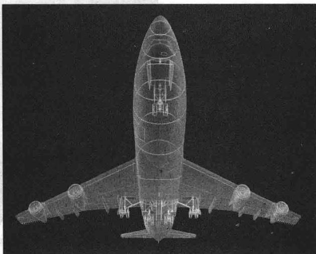
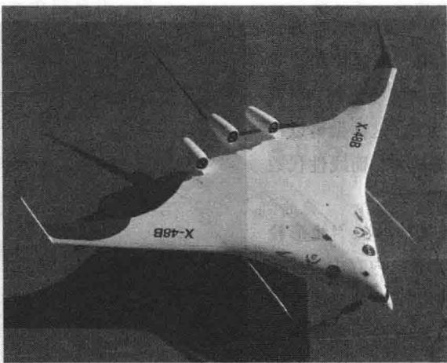

import Knowledge from '@/components/Knowledge.astro';
import Example from '@/components/Example.astro';
import Note from '@/components/Note.astro';
import Solution from '@/components/Solution.astro';
import Block from '@/components/Block.astro';

为了设计下一代的商业和军用飞机，波音公司幻影工作室的工程师们使用三维建模和计算流体动力学。他们在建造实际的模型之前，研究一个虚拟的模型周围的空气流动，这样做可以很大程度地缩短设计周期，降低成本，而线性代数在这个过程中起了关键的作用。

虚拟的飞机模型的设计从数学的“线形轮廓”模型开始，它仅存储在计算机内存中，并可显示在图形显示终端。（波音777的模型如右图所示。）这个数学模型组织和影响设计及制造飞机外部和内部的每一个过程。计算流体动力学分析主要考虑的是飞机外部表层的设计。

虽然飞机精巧的外表看上去是光滑的，但其

表面的几何曲面是十分复杂的。除了机翼和机身，飞机上还有引擎机舱、水平尾翼、狭板、襟翼、副翼。空气在这些结构上的流动决定了飞机在天空中如何运动。描述气流的方程很复杂，它们必须考虑到引擎的吸气量、引擎的排气量和机翼留下的尾迹。为了研究气流，工程师们需要飞机表面的精确描述。

用计算机建立飞机外表的模型首先在原来的线形轮廓模型上添加三维的立方体格子。这些立方体有的处于飞机的内部，有的在外部，有的和飞机的表面相交。计算机选出这些相交的立方体，并进一步细分，保留仍然和飞机表面相交的立方体。这种细分过程一直进行下去，直到立方体非常精细。一个典型的网格可以含有400 000多个立方体。

研究飞机表面的气流的过程包含反复求解大型的线性方程组 Ax=b，涉及的方程和变量个数达到 200 万个。向量 b 随来自网格的数据和前面的方程的解而改变。利用现在商业上买得到的最快的计算机，幻影工作组求解一个气流问题要用数小时至数天的时间。工作组分析方程组的解之后，会对飞机的外表稍微进行修改，整个过程又再重新开始，计算流体动力学的分析有可能要进行数千遍。

本章给出协助求解这样大规模方程组的两个重要的概念：

\- 分块矩阵：一个典型的计算流体动力学的方程组会有“稀疏”的系数矩阵，矩阵中有许多零元素。将变量正确地分组会产生有许多零方块的分块矩阵。2.4节介绍了这种矩阵及其应用。

\- 矩阵分解：即使使用分块矩阵，这样的方程组还是相当复杂。为了进一步简化计算，波音的计算流体动力学软件使用了对系数矩阵进行 LU 分解的方法. 2.5 节将讨论 LU 和其他有用的矩阵分解. 关于分解的更详细内容在本书后面出现.

为了分析气流问题的解,工程师们希望将飞机表面的气流显示出来.他们利用计算机图形以及线性代数作为图形的引擎.飞机外表的线形轮廓模型作为许多矩阵数据存储.图像在计算机屏幕上被渲染显示后,工程师们可以改变图像的大小,对局部区域进行缩放,以及对图像进行旋转以看到在视图中被隐藏的部位.这里的每个操作都是通过适当的矩阵乘法运算来实现的.2.7节解释了其中的基本思想.图2-1为波音公司为机翼做设计.

  

图 2-1 现代计算流体动力学给机翼的设计带来了革命性变化. 波音公司正在为 2020 年或更早的混合机翼和机身的新飞机做设计

当学会矩阵的代数运算后，我们分析和解方程的能力将会大大提高。本章中的定义和定理给出一些基本的工具来处理涉及两个或更多个矩阵的线性代数问题。对方阵而言，2.3节的逆矩阵定理把许多以前学过的概念联系在一起。2.4节与2.5节研究分块矩阵和矩阵分解，它们在线性代数的应用很广。2.6节和2.7节给出了矩阵代数在经济学和计算机图形学中的两个有趣应用。
