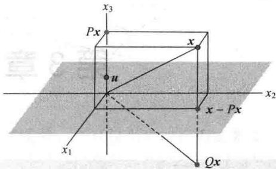

import Knowledge from '@/components/Knowledge.astro';
import Example from '@/components/Example.astro';
import Note from '@/components/Note.astro';
import Solution from '@/components/Solution.astro';
import Block from '@/components/Block.astro';

1. 设在以下命题中提到的矩阵有适当的维数. 标出各个命题的真假, 给出理由.

a. 若 A 和 B 都是 $m \times n$ 矩阵, 则 $AB^{T}$ 和 $A^{T}B$ 都有定义.

b. 若 AB = C 而 C 有 2 列, 则 A 有 2 列.

c. 将矩阵 B 以对角元素非零的对角矩阵 A 左乘, 等于对 B 的各行进行标量乘法.

d. 若 BC = BD，则 C = D.

e. 若 AC = 0，则 A = 0 或 C = 0.

f. 若 A、B 都是 $n \times n$ 矩阵，则 $(A + B)(A - B) = A^{2} - B^{2}$ .

g. 一个初等 $n \times n$ 矩阵有 n 或 $n + 1$ 个非零元素.

h. 初等矩阵的转置也是初等矩阵.

i. 初等矩阵必定是方阵.

j. 每个方阵是初等矩阵的积.

k. 若 A 是 $3 \times 3$ 矩阵，有 3 个主元位置，则存在初等方阵 $E_{1}, \cdots, E_{p}$ 使 $E_{p} \cdots E_{1} A = I$ .

1. 若 AB = I，则 A 可逆.

m. 若 A 和 B 是可逆方阵，则 AB 可逆且 $(AB)^{-1} = A^{-1}B^{-1}$ .

n. 若 AB = BA 且 A 可逆，则 $A^{-1}B = BA^{-1}$ .

o. 若 A 可逆且 $r \neq 0$ ，则 $(rA)^{-1} = rA^{-1}$ .

p. 若 A 是 $3 \times 3$ 矩阵且方程 $Ax = \begin{bmatrix} 1 \\ 0 \\ 0 \end{bmatrix}$ 有唯一解，

则 A 可逆.

2. 求矩阵 C 使 $C^{-1}=\begin{bmatrix}4 & 5 \\ 6 & 7\end{bmatrix}$ .

3. 设 $A=\begin{bmatrix}0&0&0\\ 1&0&0\\ 0&1&0\end{bmatrix}$ ，证明 $A^{3}=0$ 。利用矩阵代数计算乘积 $(I-A)(I+A+A^{2})$ 。

4. 设对某个 $n > 1$ 有 $A^n = 0$ ，求 $I - A$ 的逆.

5. 设 $n \times n$ 矩阵 $A$ 满足方程 $A^2 - 2A + I = 0$ ，证明： $A^3 = 3A - 2I$ ， $A^4 = 4A - 3I$ 。

6. 设 $A = \begin{bmatrix} 1 & 0 \\ 0 & -1 \end{bmatrix}, B = \begin{bmatrix} 0 & 1 \\ 1 & 0 \end{bmatrix}$ ，它们是 Pauli spin 矩阵，在量子力学的电子旋转研究中有应用。证明： $A^2 = I$ ， $B^2 = I$ ，且 $AB = -BA$ 。矩阵满足 $AB = -BA$ 称为负交换的。

$$

A = \left[ \begin{array}{c c c} 1 & 3 & 8 \\ 2 & 4 & 1 1 \\ 1 & 2 & 5 \end{array} \right], B = \left[ \begin{array}{c c} - 3 & 5 \\ 1 & 5 \\ 3 & 4 \end{array} \right]

$$

$$

A ^ {- 1} B

$$

$$

A ^ {- 1}

$$

$$

A ^ {- 1} B

$$

$$

A X = B

$$

8. 求矩阵 A 使变换 $x \mapsto Ax$ 把 $\begin{bmatrix} 1 \\ 3 \end{bmatrix}$ 和 $\begin{bmatrix} 2 \\ 7 \end{bmatrix}$ 分别映射为 $\begin{bmatrix} 1 \\ 1 \end{bmatrix}$ 和 $\begin{bmatrix} 3 \\ 1 \end{bmatrix}$ . （提示：写个包含矩阵 A 的方程，并把它解出来.）

9. 设 $AB = \begin{bmatrix} 5 & 4 \\ -2 & 3 \end{bmatrix}, B = \begin{bmatrix} 7 & 3 \\ 2 & 1 \end{bmatrix}$ ，求 A.

10. 设 $A$ 可逆. 说明为什么 $A^{\mathrm{T}}A$ 也可逆, 然后证明 $A^{-1} = (A^{\mathrm{T}}A)^{-1}A^{\mathrm{T}}$ .

11. 设 $x_{1}, \cdots, x_{n}$ 为固定的数。下列矩阵称为范德蒙德矩阵，在信号处理、纠错码以及多项式插值中都有应用。

$$

V = \left[ \begin{array}{c c c c c} 1 & x _ {1} & x _ {1} ^ {2} & \dots & x _ {1} ^ {n - 1} \\ 1 & x _ {2} & x _ {2} ^ {2} & \dots & x _ {2} ^ {n - 1} \\ \vdots & \vdots & \vdots & & \vdots \\ 1 & x _ {n} & x _ {n} ^ {2} & \dots & x _ {n} ^ {n - 1} \end{array} \right]

$$

给定 $R^{n}$ 中 $y=(y_{1},y_{2},\cdots,y_{n})$ ，设 $R^{n}$ 中 $c=(c_{0},c_{1},\cdots,c_{n-1})$ 满足 Vc=y，定义多项式 $p(t)=c_{0}+c_{1}t+c_{2}t^{2}+\cdots+c_{n-1}t^{n-1}$

a. 证明 $p(x_1) = y_1, p(x_2) = y_2, \dots, p(x_n) = y_n$ . 称 $p(t)$ 为点 $(x_1, y_1), \dots, (x_n, y_n)$ 的插值多项式，因 $p(t)$ 的图像通过这些点.

b. 设 $x_{1}, x_{2}, \cdots, x_{n}$ 为相异的数，证明 V 的列是线性无关的。（提示：一个 n-1 次多项式有多少个零点？）

c. 证明：若 $x_{1}, \cdots, x_{n}$ 为相异的数，而 $y_{1}, \cdots, y_{n}$ 是任意数，则存在一个过点 $(x_{1}, y_{1}), \cdots, (x_{n}, y_{n})$

且次数 $\leqslant n - 1$ 次的插值多项式.

12. 设 $A = LU$ ，其中 $L$ 是可逆下三角矩阵， $U$ 是上三角矩阵，说明为什么 $A$ 的第一列是 $L$ 的第一列的倍数。 $A$ 的第二列和 $L$ 的列有何关系？

13. 给定 $\pmb{u}$ 属于 $\mathbb{R}^n$ ， $\pmb{u}^{\mathrm{T}}\pmb{u} = 1$ ，设 $P = \pmb{u}\pmb{u}^{\mathrm{T}}$ (外积)，而 $Q = I - 2P$ ，证明：a. $P^2 = P$ b. $P^{\mathrm{T}} = P$ c. $Q^2 = I$

变换 $x \mapsto Px$ 称为一个投影， $x \mapsto Qx$ 称为豪斯霍尔德反射。这样的反射在计算机程序中用来在一个向量（通常是矩阵的列）中产生更多的零。

14. 设 $u=\begin{bmatrix}0\\ 0\\ 1\end{bmatrix}$ 和 $x=\begin{bmatrix}1\\ 5\\ 3\end{bmatrix}$ ，确定如习题 13 中的 P 和 Q 并计算 Px 和 Qx。图 2-29 说明 Qx 是 x 关于 $x_{1}x_{2}$ 平面的反射。

15. 设 $C = E_{3}E_{2}E_{1}B$ ，其中 $E_{1}, E_{2}, E_{3}$ 是初等矩阵，说明为什么 $C$ 行等价于 $B$ .

16. 设 A 是 $n \times n$ 奇异矩阵，如何构造一个 $n \times n$ 非零矩阵 B 使 AB = 0？

17. 设 A 是一 $6 \times 4$ 矩阵，B 是一 $4 \times 6$ 矩阵，证明 $6 \times 6$ 矩阵 AB 不可逆.

  

图 2-29 关于平面 $x_{3}=0$ 的豪斯霍尔德反射

18. 设 A 是 $5 \times 3$ 矩阵，存在 $3 \times 5$ 矩阵 C 使得 $CA = I_{3}$ .

又设对 $R^{5}$ 中某个 b，方程 Ax = b 有至少一个解，证明方程的解是唯一的.

19. [M]某些动力系统可借助矩阵的幂来研究，如下所示。给定下列矩阵 A 与 B，确定当 k 增加时（例如 $k=2,\cdots,16$ ） $A^{k}$ 与 $B^{k}$ 有何变化。识别 A 和 B 有什么特点？研究类似矩阵的幂，提出关于这类矩阵的猜想。

$$

A = \left[ \begin{array}{l l l} 0. 4 & 0. 2 & 0. 3 \\ 0. 3 & 0. 6 & 0. 3 \\ 0. 3 & 0. 2 & 0. 4 \end{array} \right], B = \left[ \begin{array}{l l l} 0 & 0. 2 & 0. 3 \\ 0. 1 & 0. 6 & 0. 3 \\ 0. 9 & 0. 2 & 0. 4 \end{array} \right]

$$

20. [M] 设 $A_{n}$ 为 $n \times n$ 矩阵，主对角线各元素为 0 而其他元素为 1。对 $n = 4,5,6$ 计算 $A_{n}^{-1}$ ，对值更大的 $n$ ，提出关于一般的 $A_{n}^{-1}$ 的猜想。
