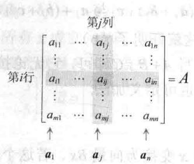
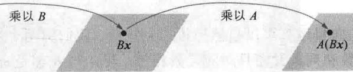
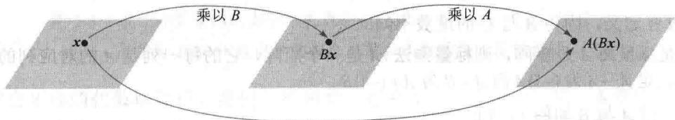

import Guide from '@/components/Guide.astro';
import Knowledge from '@/components/Knowledge.astro';
import Example from '@/components/Example.astro';
import Analysis from '@/components/Analysis.astro';
import Solution from '@/components/Solution.astro';
import Variant from '@/components/Variant.astro';
import Note from '@/components/Note.astro';
import Block from '@/components/Block.astro';
import Method from '@/components/Method.astro';
import Exercise from '@/components/Exercise.astro';

若 A 是 $m \times n$ 矩阵，即有 m 行 n 列的矩阵，则 A 的第 i 行第 j 列的元素用 $a_{ij}$ 表示，称为 A 的 $(i, j)$ 元素，见图 2-2. 例如，（3,2）元素是在第 3 行第 2 列的数 $a_{32}$ . A 的各列是 $R^{m}$ 中的向量，用黑体字母 $a_{1}, \cdots, a_{n}$ 表示，写作 $A = [a_{1} \quad a_{2} \quad \cdots \quad a_{n}]$ . 注意 $a_{ij}$ 是第 j 个列向量 $a_{j}$ （从上面算起）的第 i 个元素.

$m \times n$ 矩阵 $A = [a_{ij}]$ 的对角线元素是 $a_{11}, a_{22}, a_{33}, \cdots$ ，它们组成 $A$ 的主对角线。对角矩阵是一个方阵，它的非对角线元素全是 0，例如 $n \times n$ 单位矩阵 $I_n$ 。元素全是零的 $m \times n$ 矩阵称为零矩阵，用 0 表示。零矩阵的维数通常可由上下文知道，否则我们就用 $0_{m \times n}$ 表示。

  
图2-2 矩阵记号

## 和与标量乘法

前面叙述过的向量运算可以自然地推广到矩阵。我们称两个矩阵相等，若它们有相同的维数（即有相同的行数和列数），而且对应元素相等。若 $A$ 与 $B$ 都是 $m \times n$ 矩阵，则和 $A + B$ 也是 $m \times n$ 矩阵，它的各列是 $A$ 与 $B$ 对应列之和。因列的向量加法是对应元素相加，故 $A + B$ 的每个元素也就是 $A$ 与 $B$ 的对应元素相加。仅当 $A$ 与 $B$ 有相同维数， $A + B$ 才有定义。

<Example title="例 1">
设

则

$$
\begin{array}{l} A = \left[ \begin{array}{c c c} 4 & 0 & 5 \\ - 1 & 3 & 2 \end{array} \right], B = \left[ \begin{array}{c c c} 1 & 1 & 1 \\ 3 & 5 & 7 \end{array} \right], C = \left[ \begin{array}{c c} 2 & - 3 \\ 0 & 1 \end{array} \right] \\ A + B = \left[ \begin{array}{c c c} 5 & 1 & 6 \\ 2 & 8 & 9 \end{array} \right] \end{array}
$$

但 $A+C$ 没有定义，因为 A 与 C 的维数不同.

若 $r$ 是标量而 $A$ 是矩阵，则标量乘法 $rA$ 是一个矩阵，它的每一列是 $A$ 的对应列的 $r$ 倍。与向量相同，定义 $-A$ 为 $(-1)A$ 而 $A - B$ 为 $A + (-1)B$ 。
</Example>

<Example title="例 2">
设 $A$ 与 $B$ 如例1，则

$$
\begin{array}{r l} & 2 B = 2 \left[ \begin{array}{l l l} 1 & 1 & 1 \\ 3 & 5 & 7 \end{array} \right] = \left[ \begin{array}{l l l} 2 & 2 & 2 \\ 6 & 1 0 & 1 4 \end{array} \right] \\ & A - 2 B = \left[ \begin{array}{l l l} 4 & 0 & 5 \\ - 1 & 3 & 2 \end{array} \right] - \left[ \begin{array}{l l l} 2 & 2 & 2 \\ 6 & 1 0 & 1 4 \end{array} \right] = \left[ \begin{array}{l l l} 2 & - 2 & 3 \\ - 7 & - 7 & - 1 2 \end{array} \right] \end{array}
$$

在例2中，计算 $A - 2B$ 时，不必化为 $A + (-1)2B$ ，因为通常的代数法则对矩阵的和与标量乘法仍适用，如下列定理所示.
</Example>

<Knowledge title="定理 1">
设 $A, B, C$ 是相同维数的矩阵， $r$ 与 $s$ 为数，则有
a. $A + B = B + A$ b. $(A + B) + C = A + (B + C)$ c. $A + 0 = A$ d. $r(A + B) = rA + rB$ e. $(r + s)A = rA + sA$ f. $r(sA) = (rs)A$

为证明定理1的各个等式，只需证明左端矩阵和右端矩阵有相同维数且对应各列相等。维数是无问题的，因 $A, B, C$ 的维数相同。而由向量的类似性质，立即知道两端的对应各列相等。例如，若 $A, B, C$ 的第 $j$ 列分别是 $\pmb{a}_j, \pmb{b}_j, \pmb{c}_j$ ，则 $(A + B) + C$ 与 $A + (B + C)$ 的第 $j$ 列分别是

$$
(\pmb {a} _ {j} + \pmb {b} _ {j}) + \pmb {c} _ {j} \text {与} \pmb {a} _ {j} + (\pmb {b} _ {j} + \pmb {c} _ {j})
$$

因对每个 $j$ ，这两个向量和相等，这就证明了（b）.

由于加法的结合律，我们只要写 $A + B + C$ 即可，它无论按 $(A + B) + C$ 或 $A + (B + C)$ 计算都得同一结果。同样对四个或更多矩阵也可定义加法。
</Knowledge>

## 矩阵乘法

当把矩阵 B 乘以向量 x，它将 x 变换为向量 Bx。若这个向量又乘以矩阵 A，则得到的向量是 $A(Bx)$ ，见图 2-3。

  
图2-3 先乘以 $B$ 再乘以 $A$

于是 $A(Bx)$ 是由 $\pmb{x}$ 经复合映射变换所得，此映射是1.8节所研究的线性变换。我们的目的是将此复合映射表示为乘以一个矩阵的变换，此矩阵记为 $AB$ ，即

$$
A (B \boldsymbol {x}) = (A B) \boldsymbol {x}\tag{1}
$$

见图 2-4.

  
乘以 $AB$  
图2-4 乘以 $AB$

若 A 是 $m \times n$ 矩阵，B 是 $n \times p$ 矩阵，x 属于 $R^{p}$ ，用 $b_{1}, \cdots, b_{p}$ 表示 B 的各列，而 x 的元素为 $x_{1}, \cdots, x_{p}$ ，则

$$
B \boldsymbol {x} = x _ {1} \boldsymbol {b} _ {1} + \dots + x _ {p} \boldsymbol {b} _ {p}
$$

由乘以 $A$ 的线性性质，

$$
A (B \boldsymbol {x}) = A \left(x _ {1} \boldsymbol {b} _ {1}\right) + \dots + A \left(x _ {p} \boldsymbol {b} _ {p}\right) = x _ {1} A \boldsymbol {b} _ {1} + \dots + x _ {p} A \boldsymbol {b} _ {p}
$$

向量 $A(Bx)$ 是向量 $Ab_{1},\cdots,Ab_{p}$ 的线性组合，以 x 的元素为权。若我们把这些向量表示成一个矩阵的各列，就有

$$
A (B \boldsymbol {x}) = [ A \boldsymbol {b} _ {1} \quad A \boldsymbol {b} _ {2} \quad \dots \quad A \boldsymbol {b} _ {p} ] \boldsymbol {x}
$$

于是乘以矩阵 $[Ab_{1} Ab_{2}\dots Ab_{p}]$ 把 $x$ 变换为 $A(Bx)$ ，这便找到了所需要的矩阵.

定义 若 A 是 $m \times n$ 矩阵，B 是 $n \times p$ 矩阵，B 的列是 $b_{1}, \cdots, b_{p}$ ，则乘积 AB 是 $m \times p$ 矩阵，它的各列是 $Ab_{1}, \cdots, Ab_{p}$ ，即

$$
A B = A \left[ \begin{array}{l l l l} \boldsymbol {b} _ {1} & \boldsymbol {b} _ {2} & \dots & \boldsymbol {b} _ {p} \end{array} \right] = \left[ \begin{array}{l l l l} A \boldsymbol {b} _ {1} & A \boldsymbol {b} _ {2} & \dots & A \boldsymbol {b} _ {p} \end{array} \right]
$$

这个定义使（1）式对 $\mathbb{R}^p$ 中所有 $x$ 成立。方程（1）证明图2-4中的复合映射是线性变换，它的标准矩阵是 $AB$ 。矩阵乘法对应于线性变换的复合。

<Example title="例 3">
计算 AB，其中 $A=\begin{bmatrix}2 & 3 \\ 1 & -5\end{bmatrix}$ ， $B=\begin{bmatrix}4 & 3 & 6 \\ 1 & -2 & 3\end{bmatrix}$ .

解写 $B = [\pmb{b}_1\pmb{b}_2\pmb{b}_3]$ ，计算

$$
\begin{array}{r l} A \pmb {b} _ {1} & = \left[ \begin{array}{c c} 2 & 3 \\ 1 & - 5 \end{array} \right] \left[ \begin{array}{c} 4 \\ 1 \end{array} \right], A \pmb {b} _ {2} = \left[ \begin{array}{c c} 2 & 3 \\ 1 & - 5 \end{array} \right] \left[ \begin{array}{c} 3 \\ - 2 \end{array} \right], A \pmb {b} _ {3} = \left[ \begin{array}{c c} 2 & 3 \\ 1 & - 5 \end{array} \right] \left[ \begin{array}{c} 6 \\ 3 \end{array} \right] \\ & = \left[ \begin{array}{c} 1 1 \\ - 1 \end{array} \right] = \left[ \begin{array}{c} 0 \\ 1 3 \end{array} \right] = \left[ \begin{array}{c} 2 1 \\ - 9 \end{array} \right] \\ & \downarrow \quad \downarrow \quad \downarrow \end{array}
$$

因此

$$
\begin{array}{r l} A B = A [ \boldsymbol {b} _ {1} & \boldsymbol {b} _ {2} \quad \boldsymbol {b} _ {3} ] = \left[ \begin{array}{c c c} 1 1 & 0 & 2 1 \\ - 1 & 1 3 & - 9 \end{array} \right] \\ & \uparrow \quad \uparrow \quad \uparrow \\ & A \boldsymbol {b} _ {1} A \boldsymbol {b} _ {2} A \boldsymbol {b} _ {3} \end{array}
$$
</Example>

<Note>
由 $AB$ 的定义，它的第一列 $Ab_{1}$ 是 $A$ 的各列用 $\pmb{b}_{1}$ 的各元素为权的线性组合。其他各列也是这样。

AB 的每一列都是 A 的各列的线性组合，以 B 的对应列的元素为权.

显然， $A$ 的列数必须等于 $B$ 的行数，才能使线性组合 $Ab_{1}$ 有定义。由定义知， $AB$ 的行数等于 $A$ 的行数，列数等于 $B$ 的列数。
</Note>

<Example title="例 4">
若 $A$ 是 $3 \times 5$ 矩阵， $B$ 是 $5 \times 2$ 矩阵， $AB$ 和 $BA$ 是否有定义？若有定义，是什么矩阵？

<Solution title="解">
因 A 有 5 列，B 有 5 行，故乘积 AB 有定义且是 $3 \times 2$ 矩阵：

$$
\begin{array}{r l} & {\left[ \begin{array}{c c c c c} {*} & {*} & {*} & {*} & {*} \\ {*} & {*} & {*} & {*} & {*} \\ {*} & {*} & {*} & {*} & {*} \end{array} \right] \left[ \begin{array}{c c} {*} & {*} \\ {*} & {*} \\ {*} & {*} \\ {*} & {*} \\ {*} & {*} \end{array} \right] = \left[ \begin{array}{c c} {*} & {*} \\ {*} & {*} \\ {*} & {*} \\ {*} & {*} \end{array} \right]} \\ & {3 \times 5 \quad \text {相同}} \\ & {\quad A B \text {的维数}} \end{array}
$$

乘积 $BA$ 没有定义，因 $B$ 有2列， $A$ 有3行.

AB 的定义对理论与应用是重要的，但下列法则给出了更有效的计算 AB 的各元素的方法.

计算 $AB$ 的行列法则

若乘积 $AB$ 有定义，则 $AB$ 的第 $i$ 行第 $j$ 列的元素是 $A$ 的第 $i$ 行与 $B$ 的第 $j$ 列对应元素乘积之

美国

和. 若 $(AB)_{ij}$ 表示 $AB$ 的 $(i,j)$ 元素， $A$ 为 $m \times n$ 矩阵，则

$$
(A B) _ {i j} = a _ {i 1} b _ {1 j} + a _ {i 2} b _ {2 j} + \dots + a _ {i n} b _ {n j}
$$

为证明这一法则，设 $B = [b_{1} \cdots b_{p}]$ ，AB 的第 j 列是 $Ab_{j}$ ，我们可用 1.4 节的计算 Ax 的行向量法则计算 $Ab_{j}$ 。 $Ab_{j}$ 的第 i 个元素是 A 的第 i 行与向量 $b_{j}$ 的对应元素之积，这恰好是上述规则中计算 AB 的 $(i, j)$ 元素的方法。
</Solution>
</Example>

<Example title="例 5">
使用行列法则计算例 3 中矩阵 AB 的两个元素，观察其中涉及的数会使你更好地理解计算 AB 的两种方法的结果相同.

<Solution title="解">
要找出 AB 的第 1 行第 3 列的元素，考虑 A 的第 1 行和 B 的第 3 列，把对应元素相乘再加起来，如下所示：

$$
A B = \rightarrow \left[\begin{array}{l l}2&3\\1&- 5\end{array}\right]\left[\begin{array}{l l l}4&3&6\\1&- 2&3\end{array}\right] = \left[\begin{array}{l l l}\square&\square&2 (6) + 3 (3)\\\square&\square&\square\end{array}\right] = \left[\begin{array}{l l l}\square&\square&2 1\\\square&\square&\square\end{array}\right]
$$

对 $AB$ 第2行第2列的元素，用 $A$ 的第2行和 $B$ 的第2列：

$$
\rightarrow \left[\begin{array}{c c}2&3\\1&- 5\end{array}\right]\left[\begin{array}{c c c}4&3&6\\1&- 2&3\end{array}\right] = \left[\begin{array}{c c c}\square&\square&2 1\\\square&1 (3) + - 5 (- 2)&\square\end{array}\right] = \left[\begin{array}{c c c}\square&\square&2 1\\\square&1 3&\square\end{array}\right]
$$
</Solution>
</Example>

<Example title="例 6">
求 $AB$ 的第2行，其中

$$
A = \left[ \begin{array}{c c c} 2 & - 5 & 0 \\ - 1 & 3 & - 4 \\ 6 & - 8 & - 7 \\ - 3 & 0 & 9 \end{array} \right], B = \left[ \begin{array}{c c} 4 & - 6 \\ 7 & 1 \\ 3 & 2 \end{array} \right]
$$

<Solution title="解">
由行列法则， $AB$ 的第2行是由 $A$ 的第2行和 $B$ 的各列相乘所得：

$$
\rightarrow \left[\begin{array}{r r r}2&- 5&0\\- 1&3&- 4\\6&- 8&- 7\\- 3&0&9\end{array}\right]\left[\begin{array}{c c}4&- 6\\7&1\\3&2\end{array}\right] = \left[\begin{array}{c c}\square&\square\\- 4 + 2 1 - 1 2&6 + 3 - 8\\\square&\square\\\square&\square\end{array}\right] = \left[\begin{array}{c c}\square&\square\\5&1\\\square&\square\\\square&\square\end{array}\right]
$$
</Solution>
</Example>

<Note>
由例6可知，计算 $AB$ 的第2行时，我们仅需把 $A$ 的第2行写在 $B$ 的左边，得

$$
[ - 1 \quad 3 \quad - 4 ] \left[ \begin{array}{c c} 4 & - 6 \\ 7 & 1 \\ 3 & 2 \end{array} \right] = [ 5 \quad 1 ]
$$

这在一般情况下也是正确的，可由计算 $AB$ 的行列法则得出。记 $\operatorname{row}_i(A)$ 表示矩阵 $A$ 的第 $i$ 行，则

$$
\operatorname{row} _ {i} (A B) = \operatorname{row} _ {i} (A) \cdot B\tag{2}
$$
</Note>

## 矩阵乘法的性质

下列定理列出了矩阵乘法的重要性质，其中 $I_{m}$ 表示 $m \times m$ 单位矩阵，对 $\mathbb{R}^{m}$ 中的一切 $x$ ， $I_{m} x = x$ .

<Knowledge title="定理 2">
设 A 为 $m \times n$ 矩阵，B 和 C 的维数使下列各式的乘积有定义.

a. $A(BC) = (AB)C$ （乘法结合律）b. $A(B + C) = AB + AC$ （乘法左分配律）c. $(B + C)A = BA + CA$ （乘法右分配律）

d. $r(AB) = (rA)B = A(rB)$ ， $r$ 为任意数  
e. $I_{m}A = A = AI_{n}$ （矩阵乘法的恒等式）

<Solution title="证明">
性质（b）～（e）在习题中证明. 性质（a）是由于矩阵乘法对应于线性变换（是函数）的复合，而函数的复合是可结合的. 这里给出（a）的另一个基于矩阵乘积的“列定义”的证明. 设

$$
C = \left[ \begin{array}{c c c} \boldsymbol {c} _ {1} & \dots & \boldsymbol {c} _ {p} \end{array} \right]
$$

由矩阵乘法的定义，

$$
\begin{array}{r l} B C & = \left[ \begin{array}{l l l} B \boldsymbol {c} _ {1} & \dots & B \boldsymbol {c} _ {p} \end{array} \right] \\ A (B C) & = \left[ \begin{array}{l l l} A (B \boldsymbol {c} _ {1}) & \dots & A (B \boldsymbol {c} _ {p}) \end{array} \right] \end{array}
$$

由（1）知， $AB$ 的定义使得对一切 $\pmb{x}$ 有 $A(Bx) = (AB)x$ ，所以

$$
A (B C) = \left[ (A B) \boldsymbol {c} _ {1} \dots (A B) \boldsymbol {c} _ {p} \right] = (A B) C
$$

定理 1 和定理 2 中的结合律和分配律说明，基本上矩阵表达式中的括号可像实数运算中那样插入和去除。特别地，我们可把乘积写成 ABC，不管按 $A(BC)$ 或 $(AB)C^{\ominus}$ 计算都相同。类似地，四个矩阵 ABCD 的乘积可按 $A(BCD)$ ， $(ABC)D$ 或 $A(BC)D$ 计算，等等。计算乘积时不管怎样结合都行，但左右顺序必须保持不变。

乘积中的左右顺序是重要的，因为一般来说 $AB$ 与 $BA$ 并不相同。这并不奇怪，因 $AB$ 的列是 $A$ 的各列的线性组合，而 $BA$ 的各列是 $B$ 的各列的线性组合。乘积 $AB$ 的因子的位置需要这样强调，即 $A$ 被 $B$ 右乘，或 $B$ 被 $A$ 左乘。若 $AB = BA$ ，我们称 $A$ 和 $B$ 彼此可交换。
</Solution>
</Knowledge>

<Example title="例 7">
设 $A = \begin{bmatrix} 5 & 1 \\ 3 & -2 \end{bmatrix}$ 和 $B = \begin{bmatrix} 2 & 0 \\ 4 & 3 \end{bmatrix}$ ，证明它们不可交换，即证明 $AB \neq BA$ 。

<Solution title="解">
$$
A B = \left[ \begin{array}{c c} 5 & 1 \\ 3 & - 2 \end{array} \right] \left[ \begin{array}{c c} 2 & 0 \\ 4 & 3 \end{array} \right] = \left[ \begin{array}{c c} 1 4 & 3 \\ - 2 & - 6 \end{array} \right]
$$

$$
B A = \left[ \begin{array}{l l} 2 & 0 \\ 4 & 3 \end{array} \right] \left[ \begin{array}{c c} 5 & 1 \\ 3 & - 2 \end{array} \right] = \left[ \begin{array}{c c} 1 0 & 2 \\ 2 9 & - 2 \end{array} \right]
$$

例 7 表明乘法一般不可交换是矩阵代数与普通实数代数的重要差别, 具体例子参阅习题 9\~12.
</Solution>
</Example>

<Note>
1. 一般情况下， $AB \neq BA$ .

2. 消去律对矩阵乘法不成立，即若 AB = AC，一般情况下，B = C 并不成立。（见习题 10.）

3. 若乘积 $AB$ 是零矩阵, 一般情况下, 不能断定 $A = 0$ 或 $B = 0$ . (见习题12.)
</Note>

## 矩阵的乘幂

若 A 是 $n \times n$ 矩阵，k 是正整数，则 $A^{k}$ 表示 k 个 A 的乘积：

$$
A ^ {k} = \underbrace {A \cdots A} _ {k \text {个}}
$$

若 $A$ 不是零矩阵，且 $\pmb{x}$ 属于 $\mathbb{R}^n$ ，则 $A^{k}\pmb{x}$ 表示 $\pmb{x}$ 被 $A$ 连续左乘 $k$ 次. 若 $k = 0$ ，则 $A^0\pmb{x}$ 就是 $\pmb{x}$ 本身. 因此 $A^0$ 被解释为单位矩阵. 矩阵乘幂在理论和应用中都很有用处（见2.6节、4.9节及本书后面的内容）.

## 矩阵的转置

给定 $m \times n$ 矩阵 $A$ ，则 $A$ 的转置是一个 $n \times m$ 矩阵，用 $A^{\mathrm{T}}$ 表示，它的列是由 $A$ 的对应行构成的。

<Example title="例 8">
设

$$
A = \left[ \begin{array}{l l} a & b \\ c & d \end{array} \right], B = \left[ \begin{array}{c c} - 5 & 2 \\ 1 & - 3 \\ 0 & 4 \end{array} \right], C = \left[ \begin{array}{r r r r} 1 & 1 & 1 & 1 \\ - 3 & 5 & - 2 & 7 \end{array} \right]
$$

则

$$
A ^ {\mathrm{T}} = \left[ \begin{array}{l l} a & c \\ b & d \end{array} \right], B ^ {\mathrm{T}} = \left[ \begin{array}{l l l} - 5 & 1 & 0 \\ 2 & - 3 & 4 \end{array} \right], C ^ {\mathrm{T}} = \left[ \begin{array}{l l} 1 & - 3 \\ 1 & 5 \\ 1 & - 2 \\ 1 & 7 \end{array} \right]
$$
</Example>

<Knowledge title="定理 3">
设 $A$ 与 $B$ 表示矩阵，其维数使下列和与积有定义，则

a. $(A^{\mathrm{T}})^{\mathrm{T}} = A$

b. $(A + B)^{\mathrm{T}} = A^{\mathrm{T}} + B^{\mathrm{T}}$

c. 对任意数 r， $(rA)^{\mathrm{T}} = rA^{\mathrm{T}}$ .

d. $(AB)^{\mathrm{T}} = B^{\mathrm{T}}A^{\mathrm{T}}$

(a)～(c)的证明是直接的，这里省略．(d)的证明见习题33.通常 $(AB)^{T}$ 不等于 $A^{T}B^{T}$ ，即使乘积 $A^{T}B^{T}$ 是有定义的．定理3(d)可推广到多于两个矩阵的乘积，叙述如下：

若干个矩阵的乘积的转置等于它们的转置的乘积，但相乘的顺序相反.

习题中包括说明这些性质的例子.
</Knowledge>

## 数值计算的注解

1. 在计算机上求出 $AB$ 的最快方法依赖于计算机在内存中存储矩阵的方式。标准的高性能算法（如 LAPACK）中按列计算 $AB$ ，正如我们所定义的那样。（一个用 C++ 语言写成的 LAPACK 版本是按行计算 $AB$ 。）

2. AB 的定义使我们可以在计算机上用并行算法计算，B 的列可单独或分组分配给不同的处理器，因此可以同时计算 AB 的各列.

<Block title="练习题">
1. 因 $\mathbb{R}^n$ 中向量可以看作 $n \times 1$ 矩阵，故转置矩阵的性质也适用于向量。令

$A = \begin{bmatrix} 1 & -3 \\ -2 & 4 \end{bmatrix}$ 和 $x = \begin{bmatrix} 5 \\ 3 \end{bmatrix}$

计算 $(Ax)^{\mathrm{T}}, x^{\mathrm{T}}A^{\mathrm{T}}, xx^{\mathrm{T}}$ 和 $x^{\mathrm{T}}x$ . $A^{\mathrm{T}}x^{\mathrm{T}}$ 是否有定义？

2. 设 A 为 $4 \times 4$ 矩阵，x 是 $R^{4}$ 中向量。计算 $A^{2}x$ 的最快方法是什么？计算乘法的次数。

3. 假设 $A$ 是一个 $m \times n$ 矩阵，所有行是相同的。 $B$ 是一个 $n \times p$ 矩阵，所有列是相同的。 $AB$ 中的元素是怎样的呢？
</Block>

<Block title="习题2.1">
习题 1\~2 中，计算矩阵的和或乘积。若乘积没有定义，则说明理由。设

$$
A = \left[ \begin{array}{c c c} 2 & 0 & - 1 \\ 4 & - 5 & 2 \end{array} \right], B = \left[ \begin{array}{c c c} 7 & - 5 & 1 \\ 1 & - 4 & - 3 \end{array} \right],
$$

$$
C = \left[ \begin{array}{c c} 1 & 2 \\ - 2 & 1 \end{array} \right], D = \left[ \begin{array}{c c} 3 & 5 \\ - 1 & 4 \end{array} \right], E = \left[ \begin{array}{c} - 5 \\ 3 \end{array} \right]
$$

1. -2A, B-2A, AC, CD

2. $A + 2B, 3C - E, CB, EB$

下面的习题中, 假设每个矩阵表达式是有定义的, 即矩阵（和向量）的维数是相互匹配的.

3. 设 $A=\begin{bmatrix}4 & -1 \\ 5 & -2\end{bmatrix}$ ，计算 $3I_{2}-A$ 及 $(3I_{2})A$ .

4. 计算 $A - 5I_{3}$ 及 $(5I_{3})A$ ，其中

$$
A = \left[ \begin{array}{r r r} 9 & - 1 & 3 \\ - 8 & 7 & - 6 \\ - 4 & 1 & 8 \end{array} \right]
$$

习题 5\~6 中，用两种方法计算乘积 AB：（a）根据定义分别计算 $Ab_{1}$ 及 $Ab_{2}$ ；（b）利用计算 AB 的行列法则.

5. $A=\begin{bmatrix}-1 & 2 \\ 5 & 4 \\ 2 & -3\end{bmatrix}$ , $B=\begin{bmatrix}3 & -2 \\ -2 & 1\end{bmatrix}$

6. $A=\begin{bmatrix}4 & -2 \\ -3 & 0 \\ 3 & 5\end{bmatrix}, B=\begin{bmatrix}1 & 3 \\ 2 & -1\end{bmatrix}$

7. 若 A 是 $5 \times 3$ 矩阵，乘积 AB 是 $5 \times 7$ 矩阵，B 的维数是多少？

8. 若 BC 是 $3 \times 4$ 矩阵，B 有几行？

9. 设 $A=\begin{bmatrix}2 & 5 \\ -3 & 1\end{bmatrix}$ 和 $B=\begin{bmatrix}4 & -5 \\ 3 & k\end{bmatrix}$ ，k 取什么值时 AB=BA?

10. 设 $A=\begin{bmatrix}2 & -3 \\ -4 & 6\end{bmatrix}, B=\begin{bmatrix}8 & 4 \\ 5 & 5\end{bmatrix}, C=\begin{bmatrix}5 & -2 \\ 3 & 1\end{bmatrix}$ ，证明 AB=AC 但 $B \neq C$ .

11. 设 $A = \begin{bmatrix} 1 & 1 & 1 \\ 1 & 2 & 3 \\ 1 & 4 & 5 \end{bmatrix}, D = \begin{bmatrix} 2 & 0 & 0 \\ 0 & 3 & 0 \\ 0 & 0 & 5 \end{bmatrix}$ ，计算 $AD$ 和 $DA$ ，说明当 $A$ 右乘或左乘以 $D$ 时， $A$ 的行或列如何变化。求 $3 \times 3$ 矩阵 $B$ ，不是单位矩阵或零矩阵，使 $AB = BA$ 。

12. 设 $A = \begin{bmatrix} 3 & -6 \\ -1 & 2 \end{bmatrix}$ ，求 $2 \times 2$ 矩阵 $B$ 使 $AB = 0$ ，要求 $B$ 有两个不相同的非零列.

13. 设 $r_{1}, \cdots, r_{p}$ 为 $R^{n}$ 中向量，Q 为 $m \times n$ 矩阵，把矩阵 $[Qr_{1} \cdots Qr_{p}]$ 写成两个矩阵的乘积（任何一个矩阵都不是单位矩阵）.

14. 设 $U$ 是 1.8 节例 6 所描述的 $3 \times 2$ 成本矩阵。 $U$ 的第一列给出生产产品 B 每美元产出的成本，而第二列给出生产产品 C 每美元产出的成本。（成本分为材料、劳动和管理。）设 $\pmb{q}_{1}$ 是 $\mathbb{R}^{2}$ 中向量，给出一年第一季度生产产品 B 和 C（以美元计算）的产出， $\pmb{q}_{2}, \pmb{q}_{3}, \pmb{q}_{4}$ 是类似的向量，分别给出一年第二、三和四季度生产产品 B 和 C 的产出。给出矩阵 $UQ$ 中的数据的经济解释，其中 $Q = [\pmb{q}_{1}, \pmb{q}_{2}, \pmb{q}_{3}, \pmb{q}_{4}]$ 。

习题 15\~16 中的矩阵 A, B, C 使所说的加法和

乘法运算能够进行. 标出每个命题的真假, 给出理由.

15. a. 若 $A, B$ 为 $2 \times 2$ 矩阵，它们的列分别为 $\pmb{a}_1$ ， $\pmb{a}_2$ 和 $\pmb{b}_1, \pmb{b}_2$ ，则 $AB = [\pmb{a}_1\pmb{b}_1 \pmb{a}_2\pmb{b}_2]$ 。
b. $AB$ 的每一列是 $B$ 的列的线性组合，并以 $A$ 的对应列作为权。
c. $AB + AC = A(B + C)$ 。
d. $A^{\mathrm{T}} + B^{\mathrm{T}} = (A + B)^{\mathrm{T}}$ 。

e. 矩阵的乘积的转置等于相同顺序它们的转置的乘积.

16. a. 若 A 与 B 为 $3 \times 3$ 矩阵， $B = [b_{1} \quad b_{2} \quad b_{3}]$ ，则 $AB = [Ab_{1} + Ab_{2} + Ab_{3}]$ .
b. AB 的第 2 行是 A 的第 2 行被 B 右乘.
c. $(AB)C = (AC)B$ .
d. $(AB)^{\mathrm{T}} = A^{\mathrm{T}}B^{\mathrm{T}}$ .
e. 矩阵和的转置等于它们的转置的和.

17. 若 $A=\begin{bmatrix}1 & -2 \\ -2 & 5\end{bmatrix}$ 和 $AB=\begin{bmatrix}-1 & 2 & -1 \\ 6 & -9 & 3\end{bmatrix}$ ，确定 B 的第一列与第二列.

18. 设 $B$ 的前两列 $\pmb{b}_1$ 和 $\pmb{b}_2$ 相等. 那么 $AB$ 的各列如何（设 $AB$ 有定义）？为什么？

19. 设 $B$ 的第3列是前2列的和，那么 $AB$ 的第3列如何？为什么？

20. 设 $B$ 的第2列全是零, 那么 $AB$ 的第2列如何?

21. 设 $AB$ 的最后一列全是零, 但 $B$ 本身没有零列, 那么 $A$ 的各列如何?

22. 若 $B$ 的各列线性相关, 证明 $AB$ 的各列也线性相关.

23. 设 $CA = I_{n}$ ( $n \times n$ 单位矩阵), 证明方程 $Ax = 0$ 只有平凡解. 解释为什么 $A$ 的列数不可以多于行数.

24. 设 $AD = I_{m}$ （ $m \times m$ 单位矩阵），证明：对任意 $R^{m}$ 中的 b，方程 Ax = b 有解。（提示：利用方程 ADb = b。）解释为什么 A 的行数不可以多于列数。

25. 设 A 是 $m \times n$ 矩阵，存在 $n \times m$ 矩阵 C 和 D，使 $CA = I_{n}$ 和 $AD = I_{m}$ . 证明 m = n 和 C = D. （提示：利用乘积 CAD.）

26. 设 A 是 $3 \times n$ 矩阵，其列生成 $R^{3}$ ，解释如何构造一个 $n \times 3$ 矩阵 D，使得 $AD = I_{3}$ 习题 27 和 28 中，把 $R^{n}$ 中向量看作 $n \times 1$ 矩阵，对 $\mathbb{R}^n$ 中 $u, v$ ，矩阵乘积 $u^{\mathrm{T}}v$ 是 $1 \times 1$ 矩阵，称为 $u$ 和 $v$ 的数量积或内积，它通常写作实数而省略括号。矩阵乘积 $uv^{\mathrm{T}}$ 是 $n \times n$ 矩阵，称为 $u$ 和 $v$ 的外积。这些乘积 $u^{\mathrm{T}}v$ 和 $uv^{\mathrm{T}}$ 以后将用到。

27. 设 $u=\begin{bmatrix}-2\\3\\-4\end{bmatrix},v=\begin{bmatrix}a\\b\\c\end{bmatrix}$ ，计算 $u^{T}v, v^{T}u, uv^{T}$ 和 $vu^{T}$ .

28. 若 $\pmb{u}$ 和 $\pmb{v}$ 属于 $\mathbb{R}^n$ ， $\pmb{u}^{\mathrm{T}}\pmb{v}$ 和 $\pmb{v}^{\mathrm{T}}\pmb{u}$ 有什么关系？ $\pmb{uv}^{\mathrm{T}}$ 和 $\pmb{vu}^{\mathrm{T}}$ 有什么关系？

29. 证明定理 2（b）和 2（c）。应用行列法则， $A(B+C)$ 的 $(i,j)$ 元素可写成 $a_{i1}(b_{1j}+c_{1j})+\cdots+a_{in}(b_{nj}+c_{nj})$ 或 $\sum_{k=1}^{n}a_{ik}(b_{kj}+c_{kj})$

30. 证明定理 2（d）.（提示： $(rA)B$ 的 $(i,j)$ 元素是 $(ra_{i1})b_{1j} + \cdots + (ra_{in})b_{nj}$ .）

31. 证明 $I_{m}A = A, A$ 为 $m \times n$ 矩阵。假设对所有 $\mathbb{R}^{m}$ 中的 $\pmb{x}$ ，有 $I_{m}\pmb{x} = \pmb{x}$ 。

32. 证明 $AI_{n} = A, A$ 为 $m \times n$ 矩阵。（提示：应用 $AI_{n}$ 的（列）定义。）

33. 证明定理 3(d). (提示: 考虑 $(AB)^{\mathrm{T}}$ 的第 j 行.)

34. 给出 $(ABx)^{\mathrm{T}}$ 的公式，其中 $x$ 是向量， $A$ 和 $B$ 是适当维数的矩阵.

35. [M]读矩阵程序的文件，写出产生下列矩阵的命令（不要键入矩阵的任何一个元素）.
a. $5 \times 6$ 的零矩阵.
b. $3 \times 5$ 的矩阵，其元素都是 1.
c. $6 \times 6$ 单位矩阵.
d. $5 \times 5$ 对角矩阵，对角元素是 3, 5, 7, 2, 4.

检验矩阵代数的新思想或做猜想的一个有用的方法是使用随机选择的矩阵进行计算。用一些矩阵验证一个性质并不能证明在一般情况下这个性质是成立的，但这样做有助于对性质的理解。如果该性质是假的，你会在一些计算之后发现。

36. [M] 写出生成 $6 \times 4$ 矩阵且其元素为随机数的命令，这些随机数在什么范围内？说出如何生成随机 $3 \times 3$ 矩阵，它的元素为整数且在-9和9之间。（若 $x$ 是随机数，满足 $0 < x < 1$ ，则 $-9.5 <$

$$
1 9 (x - 0. 5) <   9. 5.)
$$

37. [M] 构造一个 $4 \times 4$ 随机矩阵 $A$ ，检验 $(A + I) \cdot (A - I) = A^2 - I$ 是否成立。最好的办法是计算 $(A + I)(A - I) - (A^2 - I)$ 并证明它等于零矩阵。对三个随机矩阵进行检验。然后对三对随机 $4 \times 4$ 矩阵用同样方法检验 $(A + B)(A - B) = A^2 - B^2$ 是否成立。

39. [M] 设

$$
S = \left[ \begin{array}{c c c c c} 0 & 1 & 0 & 0 & 0 \\ 0 & 0 & 1 & 0 & 0 \\ 0 & 0 & 0 & 1 & 0 \\ 0 & 0 & 0 & 0 & 1 \\ 0 & 0 & 0 & 0 & 0 \end{array} \right]
$$

对 $k=2,\cdots,6$ ，计算 $S^{k}$ .

38. [M]用至少三对随机 $4 \times 4$ 矩阵 $A$ 和 $B$ 检验等式 $(A + B)^{\mathrm{T}} = A^{\mathrm{T}} + B^{\mathrm{T}}$ 和 $(AB)^{\mathrm{T}} = A^{\mathrm{T}}B^{\mathrm{T}}$ 是否成立.（见习题37.）（注：多数矩阵程序用 $A'$ 表示 $A^{\mathrm{T}}$ .）

40. [M] 叙述当你计算 $A^{5}$ , $A^{10}$ , $A^{20}$ 和 $A^{30}$ 时发生的情况:

$$
A = \left[ \begin{array}{l l l} 1 / 6 & 1 / 2 & 1 / 3 \\ 1 / 2 & 1 / 4 & 1 / 4 \\ 1 / 3 & 1 / 4 & 5 / 1 2 \end{array} \right]
$$

上
</Block>

<Block title="练习题答案">
1. $Ax = \begin{bmatrix} 1 & -3 \\ -2 & 4 \end{bmatrix} \begin{bmatrix} 5 \\ 3 \end{bmatrix} = \begin{bmatrix} -4 \\ 2 \end{bmatrix}$ , 所以 $(Ax)^{\mathrm{T}} = [-4, 2]$ . 同样

$$
\boldsymbol {x} ^ {\mathrm{T}} \boldsymbol {A} ^ {\mathrm{T}} = [ 5 3 ] \left[ \begin{array}{c c} 1 & - 2 \\ - 3 & 4 \end{array} \right] = [ - 4 2 ]
$$

如定理3（d）所说， $(Ax)^{\mathrm{T}}$ 和 $x^{\mathrm{T}}A^{\mathrm{T}}$ 相等.其次，

$$
\boldsymbol {x} \boldsymbol {x} ^ {\mathrm{T}} = \left[ \begin{array}{l} 5 \\ 3 \end{array} \right] \left[ \begin{array}{l l} 5 & 3 \end{array} \right] = \left[ \begin{array}{l l} 2 5 & 1 5 \\ 1 5 & 9 \end{array} \right]
$$

$$
\boldsymbol {x} ^ {\mathrm{T}} \boldsymbol {x} = \left[ \begin{array}{l l} 5 & 3 \end{array} \right] \left[ \begin{array}{l} 5 \\ 3 \end{array} \right] = [ 2 5 + 9 ] = 3 4
$$

如 $x^{T}x$ 的 $1\times1$ 矩阵通常不写括号. 最后, $A^{T}x^{T}$ 没有定义, 因 $x^{T}$ 没有 2 行与 $A^{T}$ 的 2 列配合.

2. 最快的方法是按 $A(Ax)$ 计算 $A^2 x$ . 计算 $Ax$ 需要 16 次乘法, 每个元素需要 4 次. 计算 $A(Ax)$ 还需 16 次. 计算 $A^2$ 需要 64 次乘法, 因 $A^2$ 有 16 个元素, 每个需 4 次. 之后 $A^2 x$ 还需 16 次乘法, 总共需 80 次.

3. 通过矩阵乘法定义知 $AB = [Ab_{1} \quad Ab_{2} \quad \cdots \quad Ab_{n}] = [Ab_{1} \quad Ab_{1} \quad \cdots \quad Ab_{1}]$ ，因此 $AB$ 各列是相同的。回忆 $\operatorname{row}_i(AB) = \operatorname{row}_i(A) \cdot B$ 。因 $A$ 的所有行相同，故 $AB$ 的所有行相同。综上所述， $AB$ 的所有元素是相同的。
</Block>
