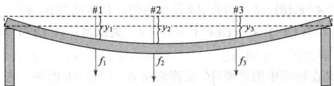
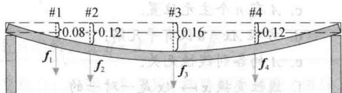

import Knowledge from '@/components/Knowledge.astro';
import Example from '@/components/Example.astro';
import Note from '@/components/Note.astro';
import Solution from '@/components/Solution.astro';
import Block from '@/components/Block.astro';

矩阵代数提供了对矩阵方程进行运算的工具以及许多与普通的实数代数相似的有用公式.本节研究矩阵中与非零数的倒数（即乘法逆）类似的问题.

回顾实数5的乘法逆是 $1 / 5$ 或 $5^{-1}$ ，它满足方程

$$

5 ^ {- 1} \cdot 5 = 1   \text { 和 }   5 \cdot 5 ^ {- 1} = 1

$$

矩阵对逆的一般化也要求两个方程同时成立，并避免使用斜线记号表示除法，因为矩阵乘法不是可交换的。进一步，完全的一般化是可能的，当且仅当有关矩阵是方阵。

一个 $n \times n$ 矩阵 $A$ 是可逆的，若存在一个 $n \times n$ 矩阵 $C$ 使

$$

C A = I \quad \text {且} \quad A C = I

$$

其中 $I = I_{n}$ 是 $n \times n$ 单位矩阵. 这时称 $C$ 是 $A$ 的逆. 实际上, $C$ 由 $A$ 唯一确定, 因为若 $B$ 是另一个 $A$ 的逆, 那么将有 $B = BI = B(AC) = (BA)C = IC = C$ . 于是, 若 $A$ 可逆, 它的逆是唯一的, 我们将它记为 $A^{-1}$ , 于是

$$

A ^ {- 1} A = I \quad \text {且} \quad A A ^ {- 1} = I

$$

不可逆矩阵有时称为奇异矩阵，而可逆矩阵也称为非奇异矩阵.

<Example title="例 1">
若 $A = \begin{bmatrix} 2 & 5 \\ -3 & -7 \end{bmatrix}, C = \begin{bmatrix} -7 & -5 \\ 3 & 2 \end{bmatrix}$ ，则

$$

A C = \left[ \begin{array}{c c} 2 & 5 \\ - 3 & - 7 \end{array} \right] \left[ \begin{array}{c c} - 7 & - 5 \\ 3 & 2 \end{array} \right] = \left[ \begin{array}{c c} 1 & 0 \\ 0 & 1 \end{array} \right]

$$

$$

C A = \left[ \begin{array}{c c} - 7 & - 5 \\ 3 & 2 \end{array} \right] \left[ \begin{array}{c c} 2 & 5 \\ - 3 & - 7 \end{array} \right] = \left[ \begin{array}{c c} 1 & 0 \\ 0 & 1 \end{array} \right]

$$

所以 $C = A^{-1}$ .

这里给出 $2 \times 2$ 矩阵可逆的检验方法，同时给出一个简单的公式给出它的逆矩阵.
</Example>

<Knowledge title="定理 4">
设 $A = \begin{bmatrix} a & b \\ c & d \end{bmatrix}$ . 若 $ad - bc \neq 0$ ，则 $A$ 可逆且

$$

A ^ {- 1} = \frac {1}{a d - b c} \left[ \begin{array}{c c} d & - b \\ - c & a \end{array} \right]

$$

若 $ad - bc = 0$ ，则 $A$ 不可逆.

定理4的简单证明见习题25与26.数 $ad - bc$ 称为 $A$ 的行列式，记为

$$

\det A = a d - b c

$$

定理 4 说明， $2 \times 2$ 矩阵 A 可逆，当且仅当 $\det A \neq 0$ .
</Knowledge>

<Example title="例 2">
求 $A = \begin{bmatrix} 3 & 4 \\ 5 & 6 \end{bmatrix}$ 的逆.

<Solution title="解">
因为 $\operatorname{det} A = 3(6) - 4(5) = -2 \neq 0$ ，所以 $A$ 可逆且

$$

A ^ {- 1} = \frac {1}{- 2} \left[ \begin{array}{l l} 6 & - 4 \\ - 5 & 3 \end{array} \right] = \left[ \begin{array}{l l} 6 / (- 2) & - 4 / (- 2) \\ - 5 / (- 2) & 3 / (- 2) \end{array} \right] = \left[ \begin{array}{l l} - 3 & 2 \\ 5 / 2 & - 3 / 2 \end{array} \right]

$$

可逆矩阵在线性代数中是很重要的——主要用在代数计算和公式推导中，如下述定理所示。有时逆矩阵在实际应用中也会出现，如下面例3所示。
</Solution>
</Example>

<Knowledge title="定理 5">
若 A 是可逆 $n \times n$ 矩阵，则对每一 $R^{n}$ 中的 b，方程 Ax = b 有唯一解 $x = A^{-1}b$ .

<Solution title="证明">
取 $\mathbb{R}^n$ 中任意一个 $b$ ，方程 $Ax = b$ 有解，这是因为若以 $A^{-1}b$ 代替 $x$ ，有 $Ax = A(A^{-1}b) = (AA^{-1})b = Ib = b$ ，所以 $A^{-1}b$ 是解。为证明解是唯一的，我们证明若 $u$ 是一个解，则 $u$ 必是 $A^{-1}b$ 。事实上，若 $Au = b$ ，则两边同乘 $A^{-1}$ 得

$$

A ^ {- 1} A \boldsymbol {u} = A ^ {- 1} \boldsymbol {b}, I \boldsymbol {u} = A ^ {- 1} \boldsymbol {b}, \boldsymbol {u} = A ^ {- 1} \boldsymbol {b}

$$
</Solution>
</Knowledge>

<Example title="例 3">
一条水平的弹性梁的两端支柱在点1，2，3受力作用，如图2-5所示.设 $\mathbb{R}^3$ 中的 $f$ 表示它在这三点受的力， $y$ 为梁在这三点的形变．利用物理学中的胡克定律，可以证明

$$

\mathbf {y} = D \mathbf {f}

$$

其中 $D$ 称为弹性矩阵. 它的逆称为刚性矩阵. 说明 $D$ 与 $D^{-1}$ 各列的物理意义.

  

图2-5 弹性梁的形变

<Solution title="解">
记 $I_{3} = [e_{1}, e_{2}, e_{3}]$ ，有 $D = DI_{3} = [De_{1}, De_{2}, De_{3}]$ 。向量 $\pmb{e}_{1} = (1,0,0)$ 表示 1 单位力向下作用于点 1（其他两点的力为零）， $De_{1}$ （即 $D$ 的第一列）表示在点 1 处施加 1 单位力产生的梁的形变。类似地，可以说明 $D$ 的第二和第三列。

为研究刚性矩阵 $D^{-1}$ ，注意到方程 $\pmb{f} = D^{-1}\pmb{y}$ 计算形变向量 $\pmb{y}$ 给定时的力向量 $\pmb{f}$ 。记 $D^{-1} = D^{-1}I_3 = \left[D^{-1}\pmb{e}_1\quad D^{-1}\pmb{e}_2\quad D^{-1}\pmb{e}_3\right]$ 。现把 $\pmb{e}_1$ 作为形变向量，于是 $D^{-1}\pmb{e}_1$ 给出产生这个形变的力。因此， $D^{-1}$ 的第一列表示为了使点1的形变为1单位而其他两点形变为0所需要作用的力。类似地， $D^{-1}$ 的第二和第三列分别表示为了在点2和3产生1单位的形变所需要作用的力。在每一列中，其中一点或两点作用的力必须为负值（指向上），以在指定的点产生单位形变而其他点没有形变。若弹性用每磅力产生的形变的英寸数衡量，则刚性矩阵的元素是每英寸形变所需力的磅数。

定理5的公式很少用来解方程 $Ax = b$ ，因为 $[A, b]$ 的行化简通常更快（当计算有舍入误差时，行化简也更精确）．一个可能的例外是 $2 \times 2$ 矩阵．这时用 $A^{-1}$ 的公式进行心算会更容易，如下例所示.
</Solution>
</Example>

<Example title="例 4">
用例2中矩阵 $A$ 的逆矩阵解方程组

$$

\begin{array}{l} 3 x _ {1} + 4 x _ {2} = 3 \\ 5 x _ {1} + 6 x _ {2} = 7 \end{array}

$$

<Solution title="解">
该方程组就是 $Ax = b$ ，所以

$$

\boldsymbol {x} = A ^ {- 1} \boldsymbol {b} = \left[ \begin{array}{c c} - 3 & 2 \\ 5 / 2 & - 3 / 2 \end{array} \right] \left[ \begin{array}{l} 3 \\ 7 \end{array} \right] = \left[ \begin{array}{l} 5 \\ - 3 \end{array} \right]

$$

下列定理给出可逆矩阵的三个有用事实.
</Solution>
</Example>

<Knowledge title="定理 6">
a. 若 A 是可逆矩阵，则 $A^{-1}$ 也可逆而且 $(A^{-1})^{-1}=A$ .

b. 若 A 和 B 都是 $n \times n$ 可逆矩阵，则 AB 也可逆，且其逆是 A 和 B 的逆矩阵按相反顺序的乘积，即

$$

(A B) ^ {- 1} = B ^ {- 1} A ^ {- 1}

$$

c. 若 A 可逆，则 $A^{T}$ 也可逆，且其逆是 $A^{-1}$ 的转置，即 $(A^{\mathrm{T}})^{-1} = (A^{-1})^{\mathrm{T}}$ .

<Solution title="证明">
为证明（a），我们需要找矩阵 $C$ 使

$$

A ^ {- 1} C = I \quad \text {且} \quad C A ^ {- 1} = I

$$

显然 $A$ 满足这些方程. 因此 $A^{-1}$ 可逆且 $A$ 是它的逆. 下一步, 为证明 (b), 我们应用乘法结合律:

$$

(A B) (B ^ {- 1} A ^ {- 1}) = A (B B ^ {- 1}) A ^ {- 1} = A I A ^ {- 1} = A A ^ {- 1} = I

$$

类似地，可以证明 $(B^{-1}A^{-1})(AB) = I$ ，因此 $AB$ 是可逆的，且其逆为 $B^{-1}A^{-1}$ 。对于（c），利用定理3（d），公式从右向左，有 $(A^{-1})^{\mathrm{T}}A^{\mathrm{T}} = (AA^{-1})^{\mathrm{T}} = I^{\mathrm{T}} = I$ 。类似地， $A^{\mathrm{T}}(A^{-1})^{\mathrm{T}} = I^{\mathrm{T}} = I$ 。因此 $A^{\mathrm{T}}$ 是可逆的，其逆是 $(A^{-1})^{\mathrm{T}}$
</Solution>
</Knowledge>

<Note>
（b）说明定义在证明中的重要性．定理表明 $B^{-1}A^{-1}$ 是 $AB$ 的逆，这一点通过证明 $B^{-1}A^{-1}$ 满足 $AB$ 的逆的定义来明确．现在， $AB$ 的逆是左乘（或右乘） $AB$ 的矩阵，乘积是单位矩阵 $I$ ．因此证明由 $B^{-1}A^{-1}$ 具有这种性质来完成.
</Note>

<Knowledge title="定理 6">
（b）的下列推广以后要用到.

若干个 $n \times n$ 可逆矩阵的积也是可逆的，其逆等于这些矩阵的逆按相反顺序的乘积.

在可逆矩阵与矩阵的行变换之间有一种重要的联系，它引出了计算逆矩阵的一种方法。可以看到，可逆矩阵行等价于单位矩阵，而我们可通过观察 $A$ 行化简为 $I$ 这一过程求出 $A^{-1}$ 。初等矩阵

把单位矩阵进行一次初等行变换，就得到初等矩阵。下列例子说明三种初等矩阵。
</Knowledge>

<Example title="例 5">
设

$$

E _ {1} = \left[ \begin{array}{c c c} 1 & 0 & 0 \\ 0 & 1 & 0 \\ - 4 & 0 & 1 \end{array} \right], E _ {2} = \left[ \begin{array}{c c c} 0 & 1 & 0 \\ 1 & 0 & 0 \\ 0 & 0 & 1 \end{array} \right], E _ {3} = \left[ \begin{array}{c c c} 1 & 0 & 0 \\ 0 & 1 & 0 \\ 0 & 0 & 5 \end{array} \right], A = \left[ \begin{array}{c c c} a & b & c \\ d & e & f \\ g & h & i \end{array} \right]

$$

计算 $E_{1}A$ , $E_{2}A$ 与 $E_{3}A$ ，说明这些乘积可由 A 进行初等行变换得到.

<Solution title="解">
我们有

$$

E _ {1} A = \left[ \begin{array}{c c c} a & b & c \\ d & e & f \\ g - 4 a & h - 4 b & i - 4 c \end{array} \right], E _ {2} A = \left[ \begin{array}{c c c} d & e & f \\ a & b & c \\ g & h & i \end{array} \right], E _ {3} A = \left[ \begin{array}{c c c} a & b & c \\ d & e & f \\ 5 g & 5 h & 5 i \end{array} \right]

$$

把 A 的第 1 行的 -4 倍加到第 3 行得 $E_{1}A$ （这是倍加行变换），交换 A 的第 1 行与第 2 行得 $E_{2}A$ ，把 A 的第 3 行乘以 5 得 $E_{3}A$ 。

把 $3 \times n$ 矩阵左乘以（即在左边相乘）例5中的 $E_{1}$ 也有相同的结果，即把第1行的-4倍加到第3行。特别地， $E_{1}I = E_{1}$ ，我们看到， $E_{1}$ 本身是把单位矩阵以同一行变换作用所得。于是例5说明了下列关于初等矩阵的一般事实，见习题27和28。

若对 $m \times n$ 矩阵 A 进行某种初等行变换，所得矩阵可写成 EA，其中 E 是 $m \times m$ 矩阵，是由 $I_{m}$ 进行同一行变换所得.

因为行变换是可逆的，如在1.1节所示，故初等矩阵也是可逆的。若 $E$ 是由 $I$ 进行行变换所得，则有同一类型的另一行变换把 $E$ 变回 $I$ 。因此，有初等矩阵 $F$ 使 $FE = I$ 。因为 $E$ 和 $F$ 对应于互逆的变换，所以也有 $EF = I$ 。

每个初等矩阵 E 是可逆的，E 的逆是一个同类型的初等矩阵，它把 E 变回 I.
</Solution>
</Example>

<Example title="例 6">
求 $E_{1} = \left[ \begin{array}{ccc}1 & 0 & 0\\ 0 & 1 & 0\\ -4 & 0 & 1 \end{array} \right]$ 的逆.

<Solution title="解">
为把 $E_{1}$ 变成 $I$ ，把第1行的4倍加到第3行，这相应于初等矩阵

$$

E _ {1} ^ {- 1} = \left[ \begin{array}{c c c} 1 & 0 & 0 \\ 0 & 1 & 0 \\ + 4 & 0 & 1 \end{array} \right]

$$

下列定理给出了判断矩阵可逆的方法，也给出计算逆矩阵的方法.
</Solution>
</Example>

<Knowledge title="定理 7">
$n \times n$ 矩阵 A 是可逆的，当且仅当 A 行等价于 $I_{n}$ ，这时，把 A 化简为 $I_{n}$ 的一系列初等行变换同时把 $I_{n}$ 变成 $A^{-1}$ .
</Knowledge>

<Note>
第1章中关于定理11的证明的注释“ $P$ 当且仅当 $Q$ ”等价于两个语句：“若 $P$ 则 $Q$ ”和“若 $Q$ 则 $P$ ”。第二个语句称为第一个语句的逆，并解释了本证明第二段中的词语反之。
</Note>

<Solution title="证明">
设 A 是可逆矩阵，则对任意 b，方程 Ax=b 有解（定理 5），A 在每一行有一个主元位置（1.4 节定理 4）。因 A 是方阵，故这 n 个主元位置必在对角线上，就是说 A 的简化阶梯形是 $I_{n}$ ，即 $A \sim I_{n}$ 。

反之，若 $A \sim I_{n}$ ，则因为每一步行化简对应于左乘一个初等矩阵，所以存在初等矩阵 $E_{1}, \cdots, E_{p}$ 使

$$

A \sim E _ {1} A \sim E _ {2} (E _ {1} A) \sim \dots \sim E _ {p} (E _ {p - 1} \dots E _ {1} A) = I _ {n}

$$

即

$$

E _ {p} E _ {p - 1} \dots E _ {1} A = I _ {n}\tag{1}

$$

因为 $E_{p}\cdots E_{1}$ 是可逆矩阵的乘积，因此也是可逆矩阵，由（1）式推出

$$

\begin{array}{r l} & (E _ {p} \dots E _ {1}) ^ {- 1} (E _ {p} \dots E _ {1}) A = (E _ {p} \dots E _ {1}) ^ {- 1} I _ {n} \\ & A = (E _ {p} \dots E _ {1}) ^ {- 1} \end{array}

$$

于是 $A$ 是可逆的，它是可逆矩阵的逆（定理6）．同样有

$$

A ^ {- 1} = \left[ \left(E _ {p} \dots E _ {1}\right) ^ {- 1} \right] ^ {- 1} = E _ {p} \dots E _ {1}

$$

于是 $A^{-1}=E_{p}\cdots E_{1}\cdot I_{n}$ ，这就是说， $A^{-1}$ 可由依次以 $E_{1},\cdots,E_{p}$ 作用于 $I_{n}$ 而得到，它们就是（1）式中把 A 变为 $I_{n}$ 的同一行变换序列.

求 $A^{-1}$ 的算法

若我们把 $A$ 和 $I$ 排在一起构成增广矩阵 $[A, I]$ ，则对此矩阵进行行变换时， $A$ 和 $I$ 受到同一变换。由定理7，要么有一系列的行变换把 $A$ 变成 $I$ ，同时把 $I$ 变成 $A^{-1}$ ，要么 $A$ 是不可逆的。

求 $A^{-1}$ 的算法

把增广矩阵 $[A I]$ 进行行化简. 若 $A$ 行等价于 $I$ , 则 $[A I]$ 行等价于 $[I A^{-1}]$ , 否则 $A$ 没有逆.
</Solution>

<Example title="例 7">
求矩阵 $A = \begin{bmatrix} 0 & 1 & 2 \\ 1 & 0 & 3 \\ 4 & -3 & 8 \end{bmatrix}$ 的逆，假如它存在.

<Solution title="解">
$$

\begin{array}{r l} [ A I ] & = \left[ \begin{array}{c c c c c c} 0 & 1 & 2 & 1 & 0 & 0 \\ 1 & 0 & 3 & 0 & 1 & 0 \\ 4 & - 3 & 8 & 0 & 0 & 1 \end{array} \right] \sim \left[ \begin{array}{c c c c c c} 1 & 0 & 3 & 0 & 1 & 0 \\ 0 & 1 & 2 & 1 & 0 & 0 \\ 4 & - 3 & 8 & 0 & 0 & 1 \end{array} \right] \\ & \sim \left[ \begin{array}{c c c c c c} 1 & 0 & 3 & 0 & 1 & 0 \\ 0 & 1 & 2 & 1 & 0 & 0 \\ 0 & - 3 & - 4 & 0 & - 4 & 1 \end{array} \right] \sim \left[ \begin{array}{c c c c c c} 1 & 0 & 3 & 0 & 1 & 0 \\ 0 & 1 & 2 & 1 & 0 & 0 \\ 0 & 0 & 2 & 3 & - 4 & 1 \end{array} \right] \\ & \sim \left[ \begin{array}{c c c c c c} 1 & 0 & 3 & 0 & 1 & 0 \\ 0 & 1 & 2 & 1 & 0 & 0 \\ 0 & 0 & 1 & 3 / 2 & - 2 & 1 / 2 \end{array} \right] \sim \left[ \begin{array}{c c c c c c} 1 & 0 & 0 & - 9 / 2 & 7 & - 3 / 2 \\ 0 & 1 & 0 & - 2 & 4 & - 1 \\ 0 & 0 & 1 & 3 / 2 & - 2 & 1 / 2 \end{array} \right] \end{array}

$$

因为 $A \sim I$ ，由定理7知 $A$ 可逆，且

$$

A ^ {- 1} = \left[ \begin{array}{c c c} - 9 / 2 & 7 & - 3 / 2 \\ - 2 & 4 & - 1 \\ 3 / 2 & - 2 & 1 / 2 \end{array} \right]

$$

最好把答案验证一下：

$$

A A ^ {- 1} = \left[ \begin{array}{c c c} 0 & 1 & 2 \\ 1 & 0 & 3 \\ 4 & - 3 & 8 \end{array} \right] \left[ \begin{array}{c c c} - 9 / 2 & 7 & - 3 / 2 \\ - 2 & 4 & - 1 \\ 3 / 2 & - 2 & 1 / 2 \end{array} \right] = \left[ \begin{array}{c c c} 1 & 0 & 0 \\ 0 & 1 & 0 \\ 0 & 0 & 1 \end{array} \right]

$$

因 A 可逆，故不必验证 $A^{-1}A = I$ .

逆矩阵的另一个观点

用 $e_{1},\cdots,e_{n}$ 表示 $I_{n}$ 的各列. 则把 [A I] 行化简为 $[I A^{-1}]$ 的过程可看作解 n 个方程组

$$

A \boldsymbol {x} = \boldsymbol {e} _ {1}, A \boldsymbol {x} = \boldsymbol {e} _ {2}, \dots , A \boldsymbol {x} = \boldsymbol {e} _ {n}\tag{2}

$$

其中这些方程组的“增广列”都放在 $A$ 的右边，以构成矩阵

$$

[ A \quad e _ {1} \quad e _ {2} \quad \dots \quad e _ {n} ] = [ A I ]

$$

方程 $AA^{-1} = I$ 及矩阵乘法的定义说明 $A^{-1}$ 的列正好是方程组（2）的解。这一点是很有用的，因为在某些应用问题中，只需要 $A^{-1}$ 的一列或两列。这时只需要解（2）中的相应方程组即可。

数值计算的注解 在实际应用中,很少计算 $A^{-1}$ ,除非需要 $A^{-1}$ 的元素. 计算 $A^{-1}$ 和 $A^{-1}b$ 总共需要的运算次数大约是用行化简解方程 Ax=b 的 3 倍,而且行化简可能更为精确.
</Solution>
</Example>

<Block title="练习题">

1. 应用行列式判断以下矩阵是否可逆：

a. $\begin{bmatrix}3 & -9 \\ 2 & 6\end{bmatrix}$ b. $\begin{bmatrix}4 & -9 \\ 0 & 5\end{bmatrix}$ c. $\begin{bmatrix}6 & -9 \\ -4 & 6\end{bmatrix}$

2. 求 $A=\begin{bmatrix}1&-2&-1\\ -1&5&6\\ 5&-4&5\end{bmatrix}$ 的逆矩阵，假如它存在.

3. 若 A 是可逆矩阵，证明 5A 是可逆矩阵.

</Block>

<Block title="习题2.2">
求习题 1\~4 中矩阵的逆.

1. $\begin{bmatrix}8 & 6 \\ 5 & 4\end{bmatrix}$ 2. $\begin{bmatrix}3 & 2 \\ 7 & 4\end{bmatrix}$ 3. $\begin{bmatrix}8 & 5 \\ -7 & -5\end{bmatrix}$ 4. $\begin{bmatrix}3 & -4 \\ 7 & -8\end{bmatrix}$

5. 用习题1求出的逆矩阵解下列方程组： $8x_{1}+6x_{2}=2$ $5x_{1}+4x_{2}=-1$

6. 用习题3求出的逆矩阵解下列方程组： $8x_{1}+5x_{2}=-9$ $-7x_{1}-5x_{2}=11$

7. 设 $A = \begin{bmatrix} 1 & 2 \\ 5 & 12 \end{bmatrix}$ , $\pmb{b}_1 = \begin{bmatrix} -1 \\ 3 \end{bmatrix}$ , $\pmb{b}_2 = \begin{bmatrix} 1 \\ -5 \end{bmatrix}$ , $\pmb{b}_3 = \begin{bmatrix} 2 \\ 6 \end{bmatrix}$ , $\pmb{b}_4 = \begin{bmatrix} 3 \\ 5 \end{bmatrix}$ .

a. 求 $A^{-1}$ 且用它解下列四个方程组： $Ax = b_{1}, Ax = b_{2}, Ax = b_{3}, Ax = b_{4}$

b. （a）中的四个方程可利用同样的行变换求解，这是因为系数矩阵是相同的。利用对增广矩阵 $[A b_1 b_2 b_3 b_4]$ 做行化简的方法，解（a）中的四个方程。

8. 利用矩阵代数证明: 若 A 是可逆矩阵, 且矩阵 D 满足 AD = I, 则 $D = A^{-1}$ .

习题 9 和习题 10 中，标出命题的真假，给出

理由.

9. a. 为了使矩阵 B 为 A 的逆，AB = I 及 BA = I 都必须为真.

b. 若 A, B 是可逆 $n \times n$ 矩阵，则 $A^{-1}B^{-1}$ 是 AB 的逆.

c. 若 $A=\begin{bmatrix}a & b \\ c & d\end{bmatrix}$ 且 $ab-cd\neq0$ ，则 A 可逆.

d. 若 A 是可逆 $n \times n$ 矩阵，则方程 Ax = b 对 $R^{n}$ 中任意 b 相容.

e. 每个初等矩阵都可逆.

10. a. 若干个可逆 $n \times n$ 矩阵之积可逆，且其逆为这些矩阵的逆按相同顺序的乘积.

b. 若 A 可逆，则 $A^{-1}$ 的逆就是 A 本身.

c. 若 $A = \begin{bmatrix} a & b \\ c & d \end{bmatrix}$ 且 ad = bc，则 A 不可逆.

d. 若 A 可行化简为单位矩阵，则 A 必可逆.

e. 若 A 可逆，则把 A 化简为单位矩阵 $I_{n}$ 的行变换也将 $A^{-1}$ 化简为 $I_{n}$ .

11. 设 $A$ 为可逆 $n \times n$ 矩阵， $B$ 为 $n \times p$ 矩阵，证明方程 $AX = B$ 有唯一解 $A^{-1}B$ .

12. 设 A 为可逆 $n \times n$ 矩阵，B 为 $n \times p$ 矩阵，解释为什么 $A^{-1}B$ 可由行化简求得：

若 $[A-B] \sim \cdots \sim [I-X]$ ，则 $X = A^{-1}B$ 若 A 是大于 $2 \times 2$ 的矩阵，则 $[A B]$ 的行化简比计算 $A^{-1}$ 和 $A^{-1}B$ 要快得多.

13. 设 AB = AC，其中 B 与 C 为 $n \times p$ 矩阵，A 可逆.

证明 B = C. 若 A 不可逆，是否仍有 B = C?

14. 设 $(B - C)D = 0$ ，其中 $B$ 与 $C$ 为 $m \times n$ 矩阵， $D$ 可逆。证明 $B = C$ 。

15. 设 $A, B, C$ 为可逆 $n \times n$ 矩阵，找一个矩阵 $D$ 满足 $(ABC)D = I$ 及 $D(ABC) = I$ 从而证明 $ABC$ 也可逆.

16. 设 $A, B$ 是 $n \times n$ 矩阵， $B$ 可逆， $AB$ 也可逆。证明 $A$ 可逆。（提示：令 $C = AB$ ，从此式求出 $A$ 。）

17. 设 A, B, C 是方阵，B 可逆，解方程 AB = BC 求

18. 设 $P$ 可逆， $A = PBP^{-1}$ ，用 $A$ 表示 $B$ .

19. 设 $A, B, C$ 是 $n \times n$ 可逆矩阵，方程 $C^{-1}(A + X)B^{-1} = I_n$ 是否有解 $X$ ？若有，求解。

20. 设 A, B, X 是 $n \times n$ 矩阵，A, X, A - AX 可逆，假设 $(A - AX)^{-1} = X^{-1}B$ (3)

a. 说明为什么 B 是可逆的.

b. 由（3）式求 X．如果需要对矩阵求逆，请说明为什么该矩阵是可逆的.

21. 说明若 $n \times n$ 矩阵 $A$ 为可逆的，则它的各列线性无关.

22. 说明若 $n \times n$ 矩阵 $A$ 为可逆，则它的各列生成 $\mathbb{R}^n$ 。（提示：复习1.4节定理4.）

23. 设 A 为 $n \times n$ 矩阵，方程 Ax = 0 仅有平凡解，说明为什么 A 有 n 个主元列且 A 行等价于 $I_{n}$ . 由定理 7，这说明 A 必定可逆（本题与 24 题将在 2.3 节用到）.

24. 设 A 为 $n \times n$ 矩阵，方程 Ax = b 对任意 $R^{n}$ 中的 b 有解，证明 A 必可逆。（提示：A 是否行等价于 $I_{n}$ ？）

习题25和习题26对 $A = \begin{bmatrix} a & b \\ c & d \end{bmatrix}$ 证明定理4.

25. 若 $ad - bc = 0$ ，则方程 $Ax = 0$ 有多于一个解。为什么这说明 $A$ 不可逆？（提示：首先考虑 $a = b = 0$ ）。其次，若 $a, b$ 不全为 0，考虑向量 $\pmb{x} = \begin{bmatrix} -b \\ a \end{bmatrix}$ 。）

26. 证明：若 $ad - bc \neq 0$ ，则计算 $A^{-1}$ 的公式成立。习题27和习题28证明例5下面的框中有关初等矩阵的命题的特殊情况。此处 $A$ 是 $3 \times 3$ 矩阵，

$I=I_{3}$ .（一般的证明将需要更多的符号.）

27. a. 利用 2.1 节方程（1）证明对 $i = 1,2,3$ ，有 $\mathrm{row}_i(A) = \mathrm{row}_i(I) \cdot A$ .

b. 证明：若交换 A 的第 1 行和第 2 行，则结果可以写成 EA，其中 E 是由 I 交换第 1 行和第 2 行所得的初等矩阵.

c. 证明：若 A 的第 3 行乘以 5，则结果可以写成 EA，其中 E 是由 I 的第 3 行乘以 5 所得的初等矩阵.

28. 证明: 若 A 的第 3 行换成 $\mathrm{row}_{3}(A)-4\cdot\mathrm{row}_{1}(A)$ ，则结果可以写成 EA，其中 E 是由 I 的第 3 行换成 $\mathrm{row}_{3}(I)-4\cdot\mathrm{row}_{1}(A)$ 所得的初等矩阵.

求出习题 29\~32 的矩阵的逆，若它们存在. 使用本节介绍的算法.

$$

\left[ \begin{array}{c c} 1 & 2 \\ 4 & 7 \end{array} \right]

$$

$$

\left[ \begin{array}{c c} 5 & 1 0 \\ 4 & 7 \end{array} \right]

$$

31. $\begin{bmatrix} 1 & 0 & -2 \\ -3 & 1 & 4 \\ 2 & -3 & 4 \end{bmatrix}$

32.

$$

\left[ \begin{array}{r r r} 1 & - 2 & 1 \\ - 4 & - 7 & 3 \\ - 2 & 6 & - 4 \end{array} \right].

$$

33. 利用本节的算法求矩阵 $\begin{bmatrix}1&0&0\\ 1&1&0\\ 1&1&1\end{bmatrix}$ 和 $\begin{bmatrix}1&0&0&0\\ 1&1&0&0\\ 1&1&1&0\\ 1&1&1&1\end{bmatrix}$ 的逆. 设 A 是相应的 $n \times n$ 矩阵，B 是它的逆，

猜想 B 的形式，然后证明 AB = I 和 BA = I.

34. 重复 33 题的方法猜想 $A = \begin{bmatrix} 1 & 0 & 0 & \cdots & 0 \\ 1 & 2 & 0 & & 0 \\ 1 & 2 & 3 & & 0 \\ \vdots & & & \ddots & \vdots \\ 1 & 2 & 3 & \cdots & n \end{bmatrix}$ 的逆 $B$ ，证明你的猜想是正确的。

35. 设 $A = \begin{bmatrix} -2 & -7 & -9 \\ 2 & 5 & 6 \\ 1 & 3 & 4 \end{bmatrix}$ , 求出 $A^{-1}$ 的第3列而不计算其他列.

36. [M] 设 $A = \begin{bmatrix} -25 & -9 & -27 \\ 546 & 180 & 537 \\ 154 & 50 & 149 \end{bmatrix}$ ，求出 $A^{-1}$ 的第 2 列和第 3 列而不计算第 1 列.

37. 设 $A=\begin{bmatrix}1 & 2 \\ 1 & 3 \\ 1 & 5\end{bmatrix}$ ，只使用 1, -1 和 0 作为元素（通过试错）构造一个 $2 \times 3$ 矩阵 C，使得 $CA = I_{2}$ ，计算 AC 并使 $AC \neq I_{3}$ .

38. 设 $A = \begin{bmatrix} 1 & 1 & 1 & 0 \\ 0 & 1 & 1 & 1 \end{bmatrix}$ , 只使用 1 和 0 作为元素构造一个 $4 \times 2$ 矩阵 $D$ , 使得 $AD = I_2$ . 是否存在 $4 \times 2$ 矩阵 $C$ , 使得 $CA = I_4$ ? 为什么?

39. [M] 设 $D = \begin{bmatrix} 0.005 & 0.002 & 0.001 \\ 0.002 & 0.004 & 0.002 \\ 0.001 & 0.002 & 0.005 \end{bmatrix}$ 是一个弹性矩阵，弹性的单位是英寸/磅。设在例 3 的图 2-5 中，在点 1, 2, 3 分别有 30, 50 和 20 磅的力作用，求相应的形变。

40.[M]计算习题39中 $D$ 的刚性矩阵 $D^{-1}$ ，求出在点 3 处引起 0.04 英寸 ① 形变所需要的作用力，设其他两点处的形变为 0.

41. [M] 设 $D = \begin{bmatrix} 0.0040 & 0.0030 & 0.0010 & 0.0005 \\ 0.0030 & 0.0050 & 0.0030 & 0.0010 \\ 0.0010 & 0.0030 & 0.0050 & 0.0030 \\ 0.0005 & 0.0010 & 0.0030 & 0.0040 \end{bmatrix}$ 为

一个有四个受力点的弹性梁的弹性矩阵，单位为厘米/牛顿。在四个受力点处测得形变分别为0.08, 0.12, 0.16与0.12厘米，确定在这四个点上的作用力。

  

习题41和习题42中弹性梁的形变

42. [M]对习题 41 中的 D，确定一组力，它在梁的第 2 个点上引起形变 0.24 厘米，在其他三个点上引起的形变为 0。这个答案与 $D^{-1}$ 的元素有什么关系？（提示：先考虑在第 2 个点上引起 1 厘米形变的问题。）

</Block>

<Block title="练习题答案">

1. a. $\det\begin{bmatrix}3&-9\\ 2&6\end{bmatrix}=3\times6-(-9)\times2=18+18=36$ ，行列式不等于零，故矩阵可逆.

b. $\det\begin{bmatrix}4 & -9 \\ 0 & 5\end{bmatrix}=4\times5-(-9)\times0=20\neq0$ ，矩阵可逆.

c. $\det\begin{bmatrix}6 & -9 \\ -4 & 6\end{bmatrix}=6\times6-(-9)\times(-4)=36-36=0$ ，矩阵不可逆.

$$

A I ] \sim \left[ \begin{array}{r r r r r r} 1 & - 2 & - 1 & 1 & 0 & 0 \\ - 1 & 5 & 6 & 0 & 1 & 0 \\ 5 & - 4 & 5 & 0 & 0 & 1 \end{array} \right] \sim \left[ \begin{array}{r r r r r r} 1 & - 2 & - 1 & 1 & 0 & 0 \\ 0 & 3 & 5 & 1 & 1 & 0 \\ 0 & 6 & 1 0 & - 5 & 0 & 1 \end{array} \right] \sim \left[ \begin{array}{r r r r r r} 1 & - 2 & - 1 & 1 & 0 & 0 \\ 0 & 3 & 5 & 1 & 1 & 0 \\ 0 & 0 & 0 & - 7 & - 2 & 1 \end{array} \right]

$$

故 $[A I]$ 是行等价于 $[B D]$ 形式的矩阵，其中 $B$ 是方阵，有一个零行。进一步的行变换不可能将 $B$ 变为 $I$ ，因此我们停止， $A$ 没有逆。

3. 因为 $A$ 可逆，故存在一个矩阵 $C$ 使得 $AC = I = CA$ 。我们的目的是找矩阵 $D$ 使得 $(5A)D = I = D(5A)$ 。设 $D = \frac{1}{5} C$ 。通过2.1节定理2知 $(5A) \cdot \left(\frac{1}{5} C\right) = (5) \cdot \left(\frac{1}{5}\right) \cdot (AC) = 1 \cdot \overline{I} = I, \left(\frac{1}{5} C\right)(5A) = \left(\frac{1}{5}\right)(5)(CA) = 1 \cdot I = I.$ 所以 $\frac{1}{5} C$ 是 $A$ 的逆，即证明 $5A$ 可逆。

</Block>
