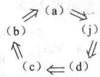
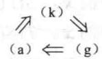
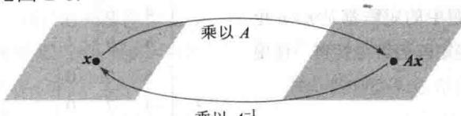

import Guide from '@/components/Guide.astro';
import Knowledge from '@/components/Knowledge.astro';
import Example from '@/components/Example.astro';
import Analysis from '@/components/Analysis.astro';
import Solution from '@/components/Solution.astro';
import Variant from '@/components/Variant.astro';
import Note from '@/components/Note.astro';
import Block from '@/components/Block.astro';
import Method from '@/components/Method.astro';
import Exercise from '@/components/Exercise.astro';

本节复习第1章引入的大部分重要概念，并且与 $n$ 个未知量 $n$ 个方程的方程组以及方阵联系起来，主要结论是定理8.

<Knowledge title="定理 8 可逆矩阵定理">
设 A 为 $n \times n$ 矩阵，则下列命题是等价的，即对某一特定的 A，它们同时为真或同时为假.
a. A 是可逆矩阵.
b. A 行等价于 $n \times n$ 单位矩阵.
c. A 有 n 个主元位置.
d. 方程 Ax = 0 仅有平凡解.
e. A 的各列线性无关.
f. 线性变换 $x \mapsto Ax$ 是一对一的.
g. 对 $R^{n}$ 中任意 b，方程 Ax = b 至少有一个解.
h. A 的各列生成 $R^{n}$ .
i. 线性变换 $x \mapsto Ax$ 把 $R^{n}$ 映上到 $R^{n}$ .
j. 存在 $n \times n$ 矩阵 C 使 CA = I.
k. 存在 $n \times n$ 矩阵 D 使 AD = I.
l. $A^{T}$ 是可逆矩阵.

首先，我们需要某些记号。若命题（a）为真蕴涵命题（j）也真，则称（a）蕴涵（j），记为 $(\mathbf{a})\Rightarrow (\mathbf{j})$ 。我们将按图2-6中蕴涵的“循环”来证明这些命题的等价性，即这五个命题之一为真可推出其他命题也真，然后把其他命题链接进这个循环。

  
图 2-6

<Solution title="证明">
若（a）为真，则 $A^{-1}$ 可作为（j）中的 $C$ ，故 $(\mathbf{a}) \Rightarrow (\mathbf{j})$ 。其次，由2.1节习题23（请参阅该习题）， $(\mathbf{j}) \Rightarrow (\mathbf{d})$ 。又由2.2节习题23可知 $(\mathbf{d}) \Rightarrow (\mathbf{c})$ 。若 $A$ 是方阵且有 $n$ 个主元位置，则主元必定在主对角线上，在这种情况下， $A$ 的简化阶梯形是 $I_{n}$ ，因此 $(\mathbf{c}) \Rightarrow (\mathbf{b})$ 。同时由2.2节定理7知 $(\mathbf{b}) \Rightarrow (\mathbf{a})$ 。至此完成图2-6中的证明循环。

其次，由于 $A^{-1}$ 可作为 $D$ ，故（a） $\Rightarrow$ （k）。又由2.1节习题24知（k） $\Rightarrow$ （g），而由2.2节习题24有（g） $\Rightarrow$ （a），因此（g）和（k）被链接进这个循环。再根据1.4节定理4和1.9节定理12（a），对任一矩阵来说，（g）、（h）和（i）是等价的。因此，通过（g）使（h）和（i）被链接进这个循环。
</Solution>
</Knowledge>

因（d）、（e）、（f）对任一矩阵 $A$ 是等价的（参见1.7节及1.9节定理12（b))，而（d）在这个循环之中，所以（e）和（f）也在这个循环中．最后，由2.2节定理6（c）有 $(\mathrm{a})\Rightarrow (1)$ 再根据同一个定理，将 $A$ 和 $A^{\mathrm{T}}$ 互换后得到 $(1)\Rightarrow (\mathrm{a})$ ，见图2-7．这就完成了定理8的证明.■

由2.2节定理5，定理8中命题（g）也可写成“方程 $Ax = b$ 对任意 $\mathbb{R}^n$ 中的 $b$ 有唯一解”。这

个命题当然也蕴涵（b），因此也蕴涵 $A$ 为可逆阵.

$$
(g) \Longleftrightarrow (h) \Longleftrightarrow (i)
$$

(d) $\Longleftrightarrow$ (e) $\Longleftrightarrow$ (f)

(a) $\Longleftrightarrow$ (1)

图2-7

下列事实由定理8及2.2节习题8推出.

设 A 和 B 为方阵，若 AB = I，则 A 和 B 都是可逆的，且 $B = A^{-1}$ ， $A = B^{-1}$ .

可逆矩阵定理将所有 $n \times n$ 矩阵分为两个不相交集合：可逆（非奇异）矩阵和不可逆（奇异）矩阵。定理中每个命题给出了 $n \times n$ 可逆矩阵的一个性质。定理中每个命题的否命题给出了 $n \times n$ 奇异矩阵的一个性质。例如，每个 $n \times n$ 奇异矩阵不行等价于 $I_{n}$ ，没有 $n$ 个主元位置，它的各列线性相关。其他的否命题在习题中考虑。

例 1 应用可逆矩阵定理来判断 A 是否可逆:

$$
A = \left[ \begin{array}{r r r} 1 & 0 & - 2 \\ 3 & 1 & - 2 \\ - 5 & - 1 & 9 \end{array} \right]
$$

<Solution title="解">
$$
A \sim \left[ \begin{array}{c c c} 1 & 0 & - 2 \\ 0 & 1 & 4 \\ 0 & - 1 & - 1 \end{array} \right] \sim \left[ \begin{array}{c c c} 1 & 0 & - 2 \\ 0 & 1 & 4 \\ 0 & 0 & 3 \end{array} \right]
$$

所以 A 有 3 个主元位置，根据可逆矩阵定理命题（c），A 是可逆的.

可逆矩阵定理的作用在于它给出了许多重要概念间的联系，例如，将矩阵 $A$ 的列的线性无关性与形如 $Ax = b$ 的解的存在性关联起来。但是必须强调，可逆矩阵定理仅能用于方阵。例如，若一个 $4 \times 3$ 矩阵的列线性无关，我们不能用可逆矩阵定理断定形如 $Ax = b$ 的方程的解的存在性或不存在性。
</Solution>

## 可逆线性变换

回忆2.1节矩阵乘法对应于线性变换的复合．当矩阵 $A$ 可逆时，方程 $A^{-1}Ax = x$ 可看作关于线性变换的一个命题，见图2-8.

  
乘以 $A^{-1}$  
图2-8 $A^{-1}$ 把 $Ax$ 变回 $\pmb{x}$

线性变换 $T: \mathbb{R}^n \to \mathbb{R}^n$ 称为可逆的，若存在函数 $S: \mathbb{R}^n \to \mathbb{R}^n$ 使得

$$
\text { 对所有 } \mathbb {R} ^ {n} \text { 中的 } x, S (T (x)) = x\tag{1}
$$

$$
\text { 对所有 } \mathbb {R} ^ {n} \text { 中的 } x, T (S (x)) = x\tag{2}
$$

下列定理说明若这样的 S 存在，则它是唯一的而且必是线性变换。我们称 S 是 T 的逆，把它写成 $T^{-1}$

<Knowledge title="定理 9">
设 $T: R^{n} \rightarrow R^{n}$ 为线性变换，A 为 T 的标准矩阵。则 T 可逆当且仅当 A 是可逆矩阵。这时由 $S(x) = A^{-1}x$ 定义的线性变换 S 是满足（1）和（2）的唯一函数。
</Knowledge>

<Note>
参见定理7的证明的注释.
</Note>

<Solution title="证明">
设 $T$ 是可逆的，则（2）说明 $T$ 是从 $\mathbb{R}^n$ 映上到 $\mathbb{R}^n$ 的映射，因若 $\pmb{b}$ 属于 $\mathbb{R}^n$ ， $\pmb{x} = S(\pmb{b})$ 则 $T(\pmb{x}) = T(S(\pmb{b})) = \pmb{b}$ ，所以每个 $\pmb{b}$ 属于 $T$ 的值域。于是由可逆矩阵定理命题（i）， $A$ 为可逆的。反之，若 $A$ 是可逆的，令 $S(\pmb{x}) = A^{-1}\pmb{x}$ ，则 $S$ 是线性变换，且显然 $S$ 满足（1）和（2）。例如

$$
S (T (\boldsymbol {x})) = S (A \boldsymbol {x}) = A ^ {- 1} (A \boldsymbol {x}) = \boldsymbol {x}
$$

于是 $T$ 是可逆的. $S$ 的唯一性的证明见习题39.
</Solution>

<Example title="例 2">
设 $T: R^{n} \rightarrow R^{n}$ 是一对一线性变换，则 T 会如何？

<Solution title="解">
$T$ 的标准矩阵 $A$ 的列是线性无关的（根据1.9节定理12），所以根据可逆矩阵定理， $A$ 是可逆的，而且 $T$ 把 $\mathbb{R}^n$ 映上到 $\mathbb{R}^n$ 。同时，根据定理9， $T$ 为可逆。

数值计算的注解 实际工作中，你将会遇到“接近奇异的”或者病态矩阵——一个可逆矩阵，当它的某些元素稍微改变就变成奇异矩阵。在这种情况下，行化简可能由于舍入误差产生少于 $n$ 个主元位置。另外，有时舍入误差也可能使奇异矩阵变成是可逆的。

某些矩阵程序会对一个方阵计算它的条件数, 条件数越大, 矩阵越接近于奇异. 单位矩阵的条件数是 1, 奇异矩阵的条件数为无穷大. 在极端情况下, 矩阵程序可能无法区别奇异矩阵与病态矩阵.

习题 41\~45 说明当条件数大时，矩阵计算可能产生明显的错误.
</Solution>
</Example>

<Block title="练习题">
1. 确定 $A = \begin{bmatrix} 2 & 3 & 4 \\ 2 & 3 & 4 \\ 2 & 3 & 4 \end{bmatrix}$ 是否可逆.

2. 设对某个 $n \times n$ 矩阵 $A$ ，可逆矩阵定理命题（g）不成立。那么形如 $Ax = b$ 的方程会如何？

3. 设 A, B 是 $n \times n$ 矩阵，方程 ABx = 0 有非平凡解，那么矩阵 AB 会如何？
</Block>

<Block title="习题2.3">
除非另有说明，本习题中的矩阵都是 $n \times n$ 矩阵。确定习题1\~10中哪些矩阵为可逆矩阵。使用尽可能少的计算。验证你的结论。

$$
\left[ \begin{array}{c c} - 4 & 6 \\ 6 & - 9 \end{array} \right]
$$

1.

$$
\left[ \begin{array}{c c} 5 & 7 \\ - 3 & - 6 \end{array} \right]
$$

3.

$$
\left[ \begin{array}{r r r} 5 & 0 & 0 \\ - 3 & - 7 & 0 \\ 8 & 5 & - 1 \end{array} \right]
$$

$$
\left[ \begin{array}{c c c} - 7 & 0 & 4 \\ 3 & 0 & - 1 \\ 2 & 0 & 9 \end{array} \right]
$$

$$
\left[ \begin{array}{r r r} 0 & 3 & - 5 \\ 1 & 0 & 2 \\ - 4 & - 9 & 7 \end{array} \right]
$$

$$
\left[ \begin{array}{r r r} 1 & - 5 & - 4 \\ 0 & 3 & 4 \\ - 3 & 6 & 0 \end{array} \right]
$$

$$
\left[ \begin{array}{r r r r} - 1 & - 3 & 0 & 1 \\ 3 & 5 & 8 & - 3 \\ - 2 & - 6 & 3 & 2 \\ 0 & - 1 & 2 & 1 \end{array} \right]
$$

$$
\left[ \begin{array}{c c c c} 1 & 3 & 7 & 4 \\ 0 & 5 & 9 & 6 \\ 0 & 0 & 2 & 8 \\ 0 & 0 & 0 & 1 0 \end{array} \right]
$$

9. [M] $\begin{bmatrix} 4 & 0 & -7 & -7 \\ -6 & 1 & 11 & 9 \\ 7 & -5 & 10 & 19 \\ -1 & 2 & 3 & -1 \end{bmatrix}$

$$
1 0. [ \mathrm{M} ] \left[ \begin{array}{c c c c c} 5 & 3 & 1 & 7 & 9 \\ 6 & 4 & 2 & 8 & - 8 \\ 7 & 5 & 3 & 1 0 & 9 \\ 9 & 6 & 4 & - 9 & - 5 \\ 8 & 5 & 2 & 1 1 & 4 \end{array} \right]
$$

习题 11\~12 中，矩阵都是 $n \times n$ 的．习题的每个部分都是形如“若&lt;命题 1>，则&lt;命题 2>”的蕴涵式，如果当&lt;命题 1>为真时&lt;命题 2>总是为真，标记该蕴涵式为真．如果有一个例子给出&lt;命题 2>为假但&lt;命题 1>为真，则标记该蕴涵式为假．验证你的结论．

11. a. 若方程 Ax=0 仅有平凡解，则 A 行等价于 $n \times n$ 单位矩阵.
b. 若 A 的各列生成 $R^{n}$ ，则它的列线性无关.
c. 若 A 是 $n \times n$ 矩阵，则对 $R^{n}$ 中每个 b，方程 Ax=b 至少有一个解.

d. 若方程 Ax=0 有非平凡解，则 A 的主元位置少于 n 个.

e. 若 $A^{T}$ 不可逆，则 A 也不可逆.

12. a. 若存在 $n \times n$ 矩阵 $D$ 使得 $AD = I$ ，那么也存在 $n \times n$ 矩阵 $C$ ，使得 $CA = I$ .

b. 若 $A$ 的各列线性无关，则 $A$ 的各列生成 $\mathbb{R}^n$ .

c. 若对每个 $\mathbb{R}^n$ 中的 $b$ ，方程 $Ax = b$ 至少有一个解，则对每个 $b$ ，解是唯一的.

d. 如果线性变换 $(x) \mapsto Ax$ 是 $\mathbb{R}^n \to \mathbb{R}^n$ 的满射，则 $A$ 有 $n$ 个主元位置.

e. 若存在 $\mathbb{R}^n$ 中的 $b$ ，使得方程 $Ax = b$ 不相容，则 $x \mapsto Ax$ 不是一对一的.

13. 若一个 $m \times n$ 矩阵的主对角线以下元素全为 0，则称之为上三角矩阵（如习题 8）。什么时候一个上三角矩阵是可逆的？验证你的答案。

14. 若一个 $m \times n$ 矩阵的主对角线以上元素全为 0，则称之为下三角矩阵（如习题3）。什么时候一个下三角矩阵是可逆的？验证你的答案。

15. 有两列相同的方阵是否可逆？为什么？

16. 一个 $5 \times 5$ 矩阵的各列不生成 $\mathbb{R}^5$ ，它是否可能可逆？为什么？

17. 若 $n \times n$ 矩阵 $A$ 可逆，则 $A^{-1}$ 的各列线性无关，说明为什么.

18. 若 $C$ 是 $6 \times 6$ 矩阵，对 $\mathbb{R}^6$ 中的每一 $\pmb{\nu}$ ，方程 $Cx = \pmb{\nu}$ 相容，是否可能对某个 $\pmb{\nu}$ ，方程 $Cx = \pmb{\nu}$ 有多个解？为什么？

19. 若 $7 \times 7$ 矩阵 $D$ 的各列线性无关，关于方程 $D\mathbf{x} = \mathbf{b}$ 的解会如何？为什么？

20. 若 $n \times n$ 矩阵 $E$ 和 $F$ 满足性质 $EF = I$ ，则 $E$ 和 $F$ 是可交换的。说明这是为什么。

21. 若方程 $Gx = y$ 对 $\mathbb{R}^n$ 中某个 $y$ 有多个解， $n \times n$ 矩阵 $G$ 的各列能否生成 $\mathbb{R}^n$ ？为什么？

22. 设 $H$ 是 $n \times n$ 矩阵. 若方程 $Hx = c$ 对 $\mathbb{R}^n$ 中的某个 $c$ 不相容, 方程 $Hx = 0$ 会如何? 为什么?

23. 若 $n \times n$ 矩阵 $K$ 不能行化简为 $I_{n}$ ， $K$ 的列会如何？为什么？

24. 若 $L$ 是 $n \times n$ 矩阵且方程组 $Lx = 0$ 有平凡解， $L$ 的各列可以张成 $\mathbb{R}^n$ 吗？为什么？

25. 验证例 1 前面框内的命题.

26. 说明为什么当 $A$ 的各列线性无关时， $A^2$ 的各列可以生成 $\mathbb{R}^n$ .

27. 设 A 和 B 是 $n \times n$ 矩阵. 证明: 若 AB 可逆, 则 A 也可逆. 不能使用定理 6(b), 因为不能假定 A 和 B 是可逆的. (提示: 存在一个矩阵 W 使得 ABW = I. 为什么?)

28. 设 $A$ 和 $B$ 是 $n \times n$ 矩阵. 证明: 若 $AB$ 可逆, 则 $B$ 也可逆.

29. 若 $A$ 是 $n \times n$ 矩阵，方程 $Ax = b$ 对 $\mathbb{R}^n$ 中的某些 $b$ 有多个解，则变换 $x \mapsto Ax$ 不是一对一的。其他关于这个变换的结论会如何？验证你的答案。

30. 若 $A$ 是 $n \times n$ 矩阵，变换 $\pmb{x} \mapsto A\pmb{x}$ 是一对一的，其他关于这个变换的结论会如何？验证你的答案.

31. 设 $A$ 是 $n \times n$ 矩阵，对 $\mathbb{R}^n$ 中的每个 $b$ ，方程 $Ax = b$ 至少有一个解，不用定理5或8，说明为什么每个方程 $Ax = b$ 事实上恰好有一个解.

32. 设 $A$ 是 $n \times n$ 矩阵，方程 $Ax = 0$ 仅有平凡解。不用可逆矩阵定理，说明对 $\mathbb{R}^n$ 中的每个 $b$ ，方程 $Ax = b$ 必有一个解。

习题33和习题34中， $T$ 是由 $\mathbb{R}^2$ 到 $\mathbb{R}^2$ 内的线性变换，说明 $T$ 可逆并求出 $T^{-1}$

33. $T(x_{1},x_{2})=(-5x_{1}+9x_{2},4x_{1}-7x_{2})$

34. $T(x_{1},x_{2}) = (6x_{1} - 8x_{2}, - 5x_{1} + 7x_{2})$

35. 设 $T: \mathbb{R}^n \to \mathbb{R}^n$ 为可逆线性变换，说明为什么 $T$ 既是一对一的又是映上到 $\mathbb{R}^n$ 的。利用方程（1）和（2），运用一个或多个定理给出第二种解释。

36. 设 $T$ 是将 $\mathbb{R}^n$ 映上到 $\mathbb{R}^n$ 的线性变换，证明 $T^{-1}$ 存在且它将 $\mathbb{R}^n$ 映上到 $\mathbb{R}^n$ 。 $T^{-1}$ 是否是一对一的？

37. 设 $T$ 和 $U$ 是 $\mathbb{R}^n$ 到 $\mathbb{R}^n$ 的线性变换，对 $\mathbb{R}^n$ 中的所有 $\pmb{x}$ ，有 $T(U(\pmb{x})) = \pmb{x}$ 。对 $\mathbb{R}^n$ 中的所有 $\pmb{x}$ ， $U(T(\pmb{x})) = \pmb{x}$ 是否成立？为什么？

38. 设 $T: \mathbb{R}^n \to \mathbb{R}^n$ 为线性变换，对 $\mathbb{R}^n$ 中一对不同的 $\pmb{u}$ 和 $\pmb{v}$ ，有 $T(\pmb{u}) = T(\pmb{v})$ 。 $T$ 能否将 $\mathbb{R}^n$ 映上到 $\mathbb{R}^n$ ？为什么？

39. 设 $T: \mathbb{R}^n \to \mathbb{R}^n$ 为可逆线性变换，设 $S$ 和 $U$ 为 $\mathbb{R}^n$ 到 $\mathbb{R}^n$ 的函数，对一切 $\mathbb{R}^n$ 中的 $x$ ，有 $S(T(x)) = x$ 和 $U(T(x)) = x$ 。证明对 $\mathbb{R}^n$ 中一切 $v$ ，有 $U(v) = S(v)$ 。这将证明 $T$ 有唯一的逆，如定理9所说的那样。（提示：给定 $\mathbb{R}^n$ 中任意 $v$ ，我们说对某个 $x$ 有 $v = T(x)$ 。为什么？计算 $S(v)$ 和 $U(v)$ 。）

40. 设 $T$ 和 $S$ 满足可逆方程（1）和（2），其中 $T$ 是线性变换。直接证明 $S$ 是线性变换。（提示：给定 $\mathbb{R}^n$ 中的 $\pmb{u},\pmb{v}$ ，设 $\pmb{x} = S(\pmb{u})$ ， $\pmb{y} = S(\pmb{v})$ ，则 $T(\pmb{x}) = \pmb{u}$ ， $T(\pmb{y}) = \pmb{v}$ 。为什么？把 $S$ 作用于方程 $T(\pmb{x}) + T(\pmb{y}) = T(\pmb{x} + \pmb{y})$ 的两边。同样，证明 $T(c\pmb{x}) = cT(\pmb{x})$ 。）

41.[M]设某一实验得出下列方程组：

$$
\begin{array}{l} 4. 5 x _ {1} + 3. 1 x _ {2} = 1 9. 2 4 9 \\ 1. 6 x _ {1} + 1. 1 x _ {2} = 6. 8 4 3 \end{array}\tag{3}
$$

a. 解方程组（3），同时解下面的方程组（4），它是由（3）的右边四舍五入到2位小数所得。在每种情形下，求出准确解。

$$
\begin{array}{l} 4. 5 x _ {1} + 3. 1 x _ {2} = 1 9. 2 5 \\ 1. 6 x _ {1} + 1. 1 x _ {2} = 6. 8 4 \end{array}\tag{4}
$$

b.（4）的各元素与（3）的对应元素的误差不超过 $0.05\%$ .求把（4）的解作为（3）的解的近似值时的相对误差.

c. 用你的矩阵程序求出（3）中系数矩阵的条件数.

习题 42\~44 说明如何使用矩阵 A 的条件数来估计方程 Ax=b 的计算解的精确度。若 A 和 b 的元素大约精确到 r 位有效数字，而 A 的条件数约为 $10^{k}$ （k 为正整数），则 Ax=b 的计算解大约精确到至少 r-k 位有效数字。

42. [M]求出习题9中矩阵 $A$ 的条件数. 构造 $\mathbb{R}^4$ 中随机向量 $\pmb{x}$ , 计算 $b = Ax$ , 然后用你的矩阵程序计算方程 $Ax = b$ 的解 $x_1$ . $x_1$ 和 $\pmb{x}$ 有几位数字相同? 找出你的矩阵程序准确存储的数字位数, 用 $x_1$ 代替准确解 $\pmb{x}$ 时有多少位精确数字被丢失?

43.[M]对习题10中的矩阵重复习题42.

44. [M] 对适当的 b 解 Ax = b，以求得五阶希尔伯特

(Hilbert) 矩阵的逆的第 5 列.

$$
A = \left[ \begin{array}{l l l l l} 1 & 1 / 2 & 1 / 3 & 1 / 4 & 1 / 5 \\ 1 / 2 & 1 / 3 & 1 / 4 & 1 / 5 & 1 / 6 \\ 1 / 3 & 1 / 4 & 1 / 5 & 1 / 6 & 1 / 7 \\ 1 / 4 & 1 / 5 & 1 / 6 & 1 / 7 & 1 / 8 \\ 1 / 5 & 1 / 6 & 1 / 7 & 1 / 8 & 1 / 9 \end{array} \right]
$$

字？请说明．（注：准确解为（630，-12600，56700，-88200，44100）.）

45. [M]某些矩阵程序（如 MATLAB）有命令可生成各阶希尔伯特矩阵。若可能，用求逆命令求出 12 阶或更高阶的希尔伯特矩阵 A 的逆，计算 $AA^{-1}$ 并报告你的结果。

你希望求出的解 $\pmb{x}$ 的元素有多少位准确数
</Block>

<Block title="练习题答案">
1. $A$ 的各列显然线性相关，因为第2列与第3列是第1列的倍数。因此由可逆矩阵定理， $A$ 不是可逆的。
2. 若（g）不成立，则方程 $Ax = b$ 对 $\mathbb{R}^n$ 中至少一个 $b$ 为不相容。

3. 应用可逆矩阵定理于矩阵 $AB$ ，假设 $AB$ 可逆，则由命题（d）得到： $ABx = 0$ 仅有平凡解，这与所给条件相矛盾，因此 $AB$ 不是可逆的。
</Block>
