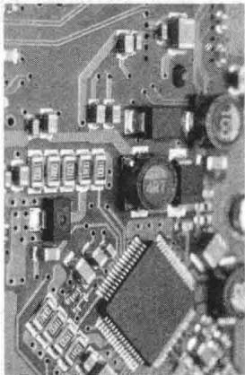
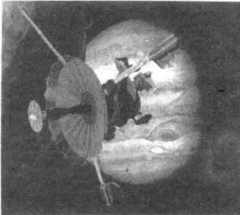

import Guide from '@/components/Guide.astro';
import Knowledge from '@/components/Knowledge.astro';
import Example from '@/components/Example.astro';
import Analysis from '@/components/Analysis.astro';
import Solution from '@/components/Solution.astro';
import Variant from '@/components/Variant.astro';
import Note from '@/components/Note.astro';
import Block from '@/components/Block.astro';
import Method from '@/components/Method.astro';
import Exercise from '@/components/Exercise.astro';

我们既可以把矩阵看作一个数的矩形表，也可以把它看作一组列向量，后面这种看法起了很重要的作用，因而，我们想考虑 $A$ 的其他分块，把它用水平线和竖直线分成几块，如下面例1所示。分块矩阵也出现在线性代数的现代应用中，因为这些记号简化了许多讨论，并使矩阵分析中许多本质的结构显露出来，如本章关于飞机设计的介绍性示例中所示。本节提供一个复习矩阵代数和使用可逆矩阵定理的机会。

<Example title="例 1">
矩阵

$$
A = \left[ \begin{array}{c c c c c c} 3 & 0 & - 1 & 5 & 9 & - 2 \\ - 5 & 2 & 4 & 0 & - 3 & 1 \\ \hline - 8 & - 6 & 3 & 1 & 7 & - 4 \end{array} \right]
$$

也可写成 $2 \times 3$ 分块矩阵

$$
A = \left[ \begin{array}{c c c} A _ {1 1} & A _ {1 2} & A _ {1 3} \\ A _ {2 1} & A _ {2 2} & A _ {2 3} \end{array} \right]
$$

的形状，它的元素是分块（或子矩阵）

$$
\begin{array}{l} A _ {1 1} = \left[ \begin{array}{c c c} 3 & 0 & - 1 \\ - 5 & 2 & 4 \end{array} \right], \qquad A _ {1 2} = \left[ \begin{array}{c c} 5 & 9 \\ 0 & - 3 \end{array} \right], \qquad A _ {1 3} = \left[ \begin{array}{c} - 2 \\ 1 \end{array} \right] \\ A _ {2 1} = [ - 8 & - 6 & 3 ], \qquad A _ {2 2} = [ 1 & 7 ], \qquad A _ {2 3} = [ - 4 ] \end{array}
$$
</Example>

<Example title="例 2">
当某一矩阵 $A$ 出现在物理问题的数学模型中时，例如，电子网络、传输系统或大公司等，会很自然地把 $A$ 看作一个分块矩阵。例如，若一个微型计算机电路板主要由3块超大规模的集成电路芯片组成，如图2-9所示，那么该电路板的矩阵可以写成一般形式

  
图 2-9

$$
A = \left[ \begin{array}{c c c} A _ {1 1} & A _ {1 2} & A _ {1 3} \\ \hline A _ {2 1} & A _ {2 2} & A _ {2 3} \\ \hline A _ {3 1} & A _ {3 2} & A _ {3 3} \end{array} \right]
$$

A 的 “对角” 线上的子矩阵（即 $A_{11}, A_{22}$ 和 $A_{33}$ ）是有关三块超大规模集成电路本身的矩阵，而其他子矩阵则与这三块芯片之间的相互联系有关.
</Example>

## 加法与标量乘法

若矩阵 $A$ 与 $B$ 有相同维数且以同样方式分块，则自然有矩阵的和 $A + B$ 也以同样方式分块。这时 $A + B$ 的每一块恰好是 $A$ 和 $B$ 对应分块的（矩阵）和。分块矩阵乘以一个数也可以逐块计算。

## 分块矩阵的乘法

分块矩阵也可用通常的行列法则进行乘法运算，就如每一块都是数一样，只要对于乘积 $AB$ ， $A$ 的列的分法与 $B$ 的行的分法一致.

<Example title="例 3">
设

$$
A = \left[ \begin{array}{c c c c c} 2 & - 3 & 1 & 0 & - 4 \\ 1 & 5 & - 2 & 3 & - 1 \\ \hline 0 & - 4 & - 2 & 7 & - 1 \end{array} \right] = \left[ \begin{array}{c c} A _ {1 1} & A _ {1 2} \\ A _ {2 1} & A _ {2 2} \end{array} \right], B = \left[ \begin{array}{c c} 6 & 4 \\ - 2 & 1 \\ - 3 & 7 \\ \hline - 1 & 3 \\ 5 & 2 \end{array} \right] = \left[ \begin{array}{c} B _ {1} \\ B _ {2} \end{array} \right]
$$

$A$ 的5列被分成3列一组和2列一组. $B$ 的5行按同样方法分块——被分成3行一组和2行一组．我们称 $A$ 和 $B$ 的分块是与分块乘法相一致的． $AB$ 的乘积可以被写成

$$
A B = \left[ \begin{array}{l l} A _ {1 1} & A _ {1 2} \\ A _ {2 1} & A _ {2 2} \end{array} \right] \left[ \begin{array}{l} B _ {1} \\ B _ {2} \end{array} \right] = \left[ \begin{array}{l} A _ {1 1} B _ {1} + A _ {1 2} B _ {2} \\ A _ {2 1} B _ {1} + A _ {2 2} B _ {2} \end{array} \right] = \left[ \begin{array}{l l} - 5 & 4 \\ - 6 & 2 \\ \hline 2 & 1 \end{array} \right]
$$

重要的是，对于 $AB$ 的表达式中的小乘积，每一项应把来自 $A$ 的子矩阵写在左边，因矩阵乘法是不可交换的。例如

$$
A _ {1 1} B _ {1} = \left[ \begin{array}{c c c} 2 & - 3 & 1 \\ 1 & 5 & - 2 \end{array} \right] \left[ \begin{array}{c c} 6 & 4 \\ - 2 & 1 \\ - 3 & 7 \end{array} \right] = \left[ \begin{array}{c c} 1 5 & 1 2 \\ 2 & - 5 \end{array} \right]
$$

$$
A _ {1 2} B _ {2} = \left[ \begin{array}{l l} 0 & - 4 \\ 3 & - 1 \end{array} \right] \left[ \begin{array}{l l} - 1 & 3 \\ 5 & 2 \end{array} \right] = \left[ \begin{array}{l l} - 2 0 & - 8 \\ - 8 & 7 \end{array} \right]
$$

因此 $AB$ 的最上面一块是

$$
A _ {1 1} B _ {1} + A _ {1 2} B _ {2} = \left[ \begin{array}{c c} 1 5 & 1 2 \\ 2 & - 5 \end{array} \right] + \left[ \begin{array}{c c} - 2 0 & - 8 \\ - 8 & 7 \end{array} \right] = \left[ \begin{array}{c c} - 5 & 4 \\ - 6 & 2 \end{array} \right]
$$

分块矩阵乘法的行列法则给出了两个矩阵乘积的最一般观点. 下面每一个有关矩阵乘积的观点已经使用简单的矩阵分块的思想讨论过: (1) 使用 $A$ 的列来给出 $Ax$ 的定义; (2) $AB$ 的列的定义；（3）计算 $AB$ 的行列法则；（4） $A$ 的行与矩阵 $B$ 的乘积作为 $AB$ 的行。在下面的定理10中仍然应用分块的思想给出 $AB$ 的第5种观点。

下面的例子为定理10做准备. 符号 $\operatorname{col}_k(A)$ 表示 $A$ 的第 $k$ 列, $\operatorname{row}_k(B)$ 表示 $B$ 的第 $k$ 行.
</Example>

<Example title="例 4">
设 $A = \begin{bmatrix} -3 & 1 & 2 \\ 1 & -4 & 5 \end{bmatrix}$ 和 $B = \begin{bmatrix} a & b \\ c & d \\ e & f \end{bmatrix}$ . 验证

$$
A B = \operatorname{col} _ {1} (A) \operatorname{row} _ {1} (B) + \operatorname{col} _ {2} (A) \operatorname{row} _ {2} (B) + \operatorname{col} _ {3} (A) \operatorname{row} _ {3} (B)
$$

<Solution title="解">
上面的每一项都是外积（见2.1节习题27和28），由计算矩阵乘积的行列法则，有

$$
\operatorname{col} _ {1} (A) \operatorname{row} _ {1} (B) = \left[ \begin{array}{c} - 3 \\ 1 \end{array} \right] [ a \quad b ] = \left[ \begin{array}{c c} - 3 a & - 3 b \\ a & b \end{array} \right]
$$

$$
\operatorname{col} _ {2} (A) \operatorname{row} _ {2} (B) = \left[ \begin{array}{c} 1 \\ - 4 \end{array} \right] [ c d ] = \left[ \begin{array}{c c} c & d \\ - 4 c & - 4 d \end{array} \right]
$$

$$
\operatorname{col} _ {3} (A) \operatorname{row} _ {3} (B) = \left[ \begin{array}{l} 2 \\ 5 \end{array} \right] [ e f ] = \left[ \begin{array}{l l} 2 e & 2 f \\ 5 e & 5 f \end{array} \right]
$$

于是

$$
\sum_ {k = 1} ^ {3} \operatorname{col} _ {k} (A) \operatorname{row} _ {k} (B) = \left[ \begin{array}{l l} - 3 a + c + 2 e & - 3 b + d + 2 f \\ a - 4 c + 5 e & b - 4 d + 5 f \end{array} \right]
$$

这个矩阵恰好就是 $AB$ 。注意 $AB$ 的（1,1）元素是三个外积的（1,1）元素之和， $AB$ 的（1,2）元素是三个外积的（1,2）元素之和，等等。
</Solution>
</Example>

<Knowledge title="定理 10 AB的列行展开">
若 $A$ 是 $m \times n$ 矩阵， $B$ 是 $n \times p$ 矩阵，则

$$
\begin{array}{r l} A B & = \left[ \mathrm{col} _ {1} (A) \quad \mathrm{col} _ {2} (A) \quad \dots \quad \mathrm{col} _ {n} (A) \right] \left[ \begin{array}{c} \mathrm{row} _ {1} (B) \\ \mathrm{row} _ {2} (B) \\ \vdots \\ \mathrm{row} _ {n} (B) \end{array} \right] \\ & = \mathrm{col} _ {1} (A) \mathrm{row} _ {1} (B) + \dots + \mathrm{col} _ {n} (A) \mathrm{row} _ {n} (B) \end{array}\tag{1}
$$

<Solution title="证明">
对每个行指标 $i$ 和列指标 $j$ ，乘积 $\operatorname{col}_k(A)\operatorname{row}_k(B)$ 的 $(i,j)$ 元素是 $\operatorname{col}_k(A)$ 中元素 $a_{ik}$ 与 $\operatorname{row}_k(B)$ 中元素 $b_{kj}$ 的积。因此在（1）的和中， $(i,j)$ 元素为

$$
\begin{array}{l} a _ {i 1} b _ {1 j} + a _ {i 2} b _ {2 j} + \dots + a _ {i n} b _ {n j} \\ (k = 1) \quad (k = 2) \quad (k = n) \end{array}
$$

根据行列法则，该和恰好是 AB 的 $(i,j)$ 元素.

分块矩阵的逆

下例说明分块矩阵的逆的求法.
</Solution>
</Knowledge>

<Example title="例 5">
形如 $A = \begin{bmatrix} A_{11} & A_{22} \\ 0 & A_{22} \end{bmatrix}$ 的矩阵称为分块上三角矩阵. 设 $A_{11}$ 是 $p \times p$ 矩阵, $A_{22}$ 是 $q \times q$ 矩阵, 且 $A$ 为可逆矩阵. 求 $A^{-1}$ 的表达式.

<Solution title="解">
用 $B$ 表示 $A^{-1}$ 且把它分块，使得

$$
\left[ \begin{array}{c c} A _ {1 1} & A _ {1 2} \\ 0 & A _ {2 2} \end{array} \right] \left[ \begin{array}{c c} B _ {1 1} & B _ {1 2} \\ B _ {2 1} & B _ {2 2} \end{array} \right] = \left[ \begin{array}{c c} I _ {p} & 0 \\ 0 & I _ {q} \end{array} \right]\tag{2}
$$

这个矩阵方程包含了 4 个有关未知子矩阵 $B_{11}, \cdots, B_{22}$ 的方程. 计算（2）式左边的乘积，使每一项与右边单位矩阵中相应的块相等，得

$$
A _ {1 1} B _ {1 1} + A _ {1 2} B _ {2 1} = I _ {p}\tag{3}
$$

$$
A _ {1 1} B _ {1 2} + A _ {1 2} B _ {2 2} = 0\tag{4}
$$

$$
A _ {2 2} B _ {2 1} = 0\tag{5}
$$

$$
A _ {2 2} B _ {2 2} = I _ {q}\tag{6}
$$

方程（6）本身并不能说明 $A_{22}$ 可逆. 但应用可逆矩阵定理及 $A_{22}$ 是方阵的事实，可以断定 $A_{22}$ 可逆且 $B_{22} = A_{22}^{-1}$ . 现在我们利用（5）式求得

$$
B _ {2 1} = A _ {2 2} ^ {- 1} 0 = 0
$$

因此（3）式简化为

$$
A _ {1 1} B _ {1 1} + 0 = I _ {p}
$$

因 $A_{11}$ 是方阵，这说明 $A_{11}$ 是可逆的，且 $B_{11} = A_{11}^{-1}$ 。最后由（4），

$$
A _ {1 1} B _ {1 2} = - A _ {1 2} B _ {2 2} = - A _ {1 2} A _ {2 2} ^ {- 1} \quad \text {和} \quad B _ {1 2} = - A _ {1 1} ^ {- 1} A _ {1 2} A _ {2 2} ^ {- 1}
$$

于是

$$
A ^ {- 1} = \left[ \begin{array}{c c} A _ {1 1} & A _ {1 2} \\ 0 & A _ {2 2} \end{array} \right] ^ {- 1} = \left[ \begin{array}{c c} A _ {1 1} ^ {- 1} & - A _ {1 1} ^ {- 1} A _ {1 2} A _ {2 2} ^ {- 1} \\ 0 & A _ {2 2} ^ {- 1} \end{array} \right]
$$

分块对角矩阵是一个分块矩阵，除了主对角线上各分块外，其余全是零分块。这样的一个矩阵是可逆的当且仅当主对角线上各分块都是可逆的。见习题13和14。
</Solution>
</Example>

## 数值计算的注解

1. 当矩阵太大时，不适于存储在高速计算机内存中，分块矩阵允许计算机一次处理两到三块子矩阵。例如，最近关于线性规划的工作中，一个研究团队把矩阵分为 837 行和 51 列以简化问题。解这个问题在 Cray 超级计算机上大约需要 4 分钟 ① 。

2. 对于某些高速计算机，特别是具有向量传输技术的计算机，当把矩阵分块后再进行矩阵运算更有效 ③ .

3. 高性能数值计算的线性代数专业软件 LAPACK 广泛使用分块矩阵进行计算.

下面的习题给出了运用矩阵代数的练习，表明了应用中的典型计算.

<Block title="练习题">
1. 证明 $\begin{bmatrix} I & 0 \\ A & I \end{bmatrix}$ 可逆并求出它的逆.

2. 计算 $X^{T}X$ ，其中 X 分块为 $[X_{1}, X_{2}]$ .
</Block>

<Block title="习题2.4">
习题 1\~9 中, 假设这些矩阵的分块适于分块乘法, 计算习题 1\~4 的乘积.

1. $\begin{bmatrix} I & 0 \\ E & I \end{bmatrix} \begin{bmatrix} A & B \\ C & D \end{bmatrix}$

2. $\begin{bmatrix} E & 0 \\ 0 & F \end{bmatrix} \begin{bmatrix} A & B \\ C & D \end{bmatrix}$

3. $\begin{bmatrix} 0 & I \\ I & 0 \end{bmatrix} \begin{bmatrix} W & X \\ Y & Z \end{bmatrix}$

4. $\begin{bmatrix} I & 0 \\ -X & I \end{bmatrix} \begin{bmatrix} A & B \\ C & D \end{bmatrix}$

习题 5\~8 中，用 A, B, C 求出 X, Y, Z 的表达式，写出你的理由。在这当中你需要对矩阵的维数做假设以得到一个公式。（提示：计算左边的乘积并使它等于右边。）

5. $\begin{bmatrix} A & B \\ C & 0 \end{bmatrix} \begin{bmatrix} I & 0 \\ X & Y \end{bmatrix} = \begin{bmatrix} 0 & I \\ Z & 0 \end{bmatrix}$

6. $\begin{bmatrix} X & 0 \\ Y & Z \end{bmatrix} \begin{bmatrix} A & 0 \\ B & C \end{bmatrix} = \begin{bmatrix} I & 0 \\ 0 & I \end{bmatrix}$

7. $\begin{bmatrix} X & 0 & 0 \\ Y & 0 & I \end{bmatrix} \begin{bmatrix} A & Z \\ 0 & 0 \\ B & I \end{bmatrix} = \begin{bmatrix} I & 0 \\ 0 & I \end{bmatrix}$

8. $\begin{bmatrix} A & B \\ 0 & I \end{bmatrix} \begin{bmatrix} X & Y & Z \\ 0 & 0 & I \end{bmatrix} = \begin{bmatrix} I & 0 & 0 \\ 0 & 0 & I \end{bmatrix}$

9. 设 $A_{11}$ 是可逆矩阵，求出矩阵 X 和 Y 使下列乘积有所说的形式，并计算 $B_{22}$ 。（提示：计算左边的乘积使它等于右边。）

$$
\left[ \begin{array}{c c c} I & 0 & 0 \\ X & I & 0 \\ Y & 0 & I \end{array} \right] \left[ \begin{array}{l l} A _ {1 1} & A _ {1 2} \\ A _ {2 1} & A _ {2 2} \\ A _ {3 1} & A _ {3 2} \end{array} \right] = \left[ \begin{array}{l l} B _ {1 1} & B _ {1 2} \\ 0 & B _ {2 2} \\ 0 & B _ {3 2} \end{array} \right]
$$

10. 设 $\begin{bmatrix} I & 0 & 0 \\ C & I & 0 \\ A & B & I \end{bmatrix}$ 的逆为 $\begin{bmatrix} I & 0 & 0 \\ Z & I & 0 \\ X & Y & I \end{bmatrix}$ ，求 X, Y, Z.

在习题 11\~12 中，标出各个命题的真假。验证你的结论。

11. a. 若 $A = \left[A_{1} A_{2}\right], B = \left[B_{1} B_{2}\right], A_{1}$ 和 $A_{2}$ 的维数分别与 $B_{1}$ 和 $B_{2}$ 的维数相同，则

$$
A + B = \left[ A _ {1} + B _ {1} \quad A _ {2} + B _ {2} \right].
$$

b. 若 $A=\begin{bmatrix}A_{11}&A_{12}\\ A_{21}&A_{22}\end{bmatrix},B=\begin{bmatrix}B_{1}\\ B_{2}\end{bmatrix}$ ，则 A 和 B 的分块适合于分块乘法.

12. a. 矩阵向量的乘积 Ax 的定义是分块乘积的特殊情况.
b. 若 $A_{1}, A_{2}, B_{1}$ 和 $B_{2}$ 是 $n \times n$ 矩阵， $A = \begin{bmatrix} A_{1} \\ A_{2} \end{bmatrix}$ ，且 $B = [B_{1} \quad B_{2}]$ ，则乘积 BA 有定义，但 AB 无定义.

13. 设 $A = \begin{bmatrix} B & 0 \\ 0 & C \end{bmatrix}$ ，其中 $B$ 和 $C$ 是方阵，证明 $A$ 可逆当且仅当 $B$ 和 $C$ 都可逆.

14. 证明：例5中的分块上三角矩阵 $A$ 可逆，当且仅当 $A_{11}$ 和 $A_{22}$ 都可逆。（提示：若 $A_{11}$ 和 $A_{22}$ 都可逆，例5中 $A^{-1}$ 的表达式给出 $A$ 的逆矩阵。）这个事实对许多估计矩阵特征值的计算机程序是很重要的。特征值在第5章讨论。

15. 设 $A_{11}$ 可逆. 求出 $X$ 与 $Y$ 使得

$$
\left[ \begin{array}{l l} A _ {1 1} & A _ {1 2} \\ A _ {2 1} & A _ {2 2} \end{array} \right] = \left[ \begin{array}{l l} I & 0 \\ X & I \end{array} \right] \left[ \begin{array}{l l} A _ {1 1} & 0 \\ 0 & S \end{array} \right] \left[ \begin{array}{l l} I & Y \\ 0 & I \end{array} \right]\tag{7}
$$

其中矩阵 $S = A_{22} - A_{21}A_{11}^{-1}A_{12}$ 称为 $A_{11}$ 的舒尔补. 类似地，若 $A_{22}$ 可逆，则矩阵 $A_{11} - A_{12}A_{22}^{-1}A_{21}$ 称为 $A_{22}$ 的舒尔补. 这样的表达式在系统工程理论或其他地方经常出现.

16. 设（7）式左边的分块矩阵 A 可逆，而 $A_{11}$ 可逆。证明 $A_{11}$ 的舒尔补 S 也是可逆的。（提示：（7）的右边的外面两个因子总是可逆的，证明这一点。）当 A 和 $A_{11}$ 都可逆，（7）导出用 $S^{-1}, A_{11}^{-1}$ 及 A 的其他元素计算 $A^{-1}$ 的一个公式。

17. 当太空卫星发射之后，为使卫星在精确计算过的轨道上运行，需要校正它的位置。如图2-10所示。雷达屏幕给出一组向量 $x_{1},\cdots,x_{k}$ ，它们给出卫星在不同时间里的位置与计划轨道的比较。设 $X_{k}$ 表示矩阵 $[x_{1}\cdots x_{k}]$ ，矩阵 $G_{k}=X_{k}X_{k}^{T}$ 需要在雷达分析数据时计算出来。当 $x_{k+1}$ 到达时，新的 $G_{k+1}$ 必须计算出来。因数据向量高速到达，所以计算负担很重。分块矩阵的计算起了很大作用。计算 $G_{k}$ 和 $G_{k+1}$ 的列行展开，叙述从 $G_{k}$ 如何计算 $G_{k+1}$ 。

  
图 2-10 伽利略探测卫星于 1989 年 10 月 18 日发射，在 1995 年 11 月初到达接近木星的轨道

18. 设 $X$ 是 $m \times n$ 矩阵，且 $X^{\mathrm{T}} X$ 可逆，又设 $M = I_{m} - X(X^{\mathrm{T}} X)^{-1} X^{\mathrm{T}}$ 。增加一列 $\pmb{x}_{0}$ 于这组数据，构成矩阵 $W = [X - \pmb{x}_{0}]$ ，计算 $W^{\mathrm{T}} W$ 。它的（1,1）元素是 $X^{\mathrm{T}} X$ ，证明 $X^{\mathrm{T}} X$ 的舒尔补（习题15）是 $\pmb{x}_{0}^{\mathrm{T}} M \pmb{x}_{0}$ 。可以证明数 $(\pmb{x}_{0}^{\mathrm{T}} M \pmb{x}_{0})^{-1}$ 是 $(W^{\mathrm{T}} W)^{-1}$ 的（2,2）元素。在适当假设下，这个数有一个有用的统计解释。

在研究物理系统的工程控制中，一组标准的微分方程用拉普拉斯变换转成下列线性方程组：

$$
\left[ \begin{array}{c c} A - s I _ {n} & B \\ C & I _ {m} \end{array} \right] \left[ \begin{array}{l} \boldsymbol {x} \\ \boldsymbol {u} \end{array} \right] = \left[ \begin{array}{l} \boldsymbol {0} \\ \boldsymbol {y} \end{array} \right]\tag{8}
$$

其中 A, B, C 分别为 $n \times n, n \times m, m \times n$ 矩阵，s 是一个变量。 $R^{m}$ 中向量 u 是系统的“输入”， $R^{m}$ 中的向量 y 是“输出”， $R^{n}$ 中向量 x 是“状态”向量。（实际上，向量 x, u, y 都是 s 的函数，但忽略这一事实并不影响习题 19 和 20 的代数计算。）

19. 假设 $A - sI_{n}$ 是可逆的，把（8）看作两个矩阵方程的方程组。把第一个方程的解 $\pmb{x}$ 代入第二个方程，结果是形如 $W(s)\pmb{u} = \pmb{y}$ 的方程，其中 $W(s)$ 是依赖于 $s$ 的矩阵，称为系统的传递函数，因为它把输入 $\pmb{u}$ 变换成输出 $\pmb{y}$ 。求出 $W(s)$ ，叙述它如何与（8）左边分块的系统矩阵相关联。见习题15。

20. 设习题 19 中的传递函数 $W(s)$ 对某个 $s$ 可逆，可以证明，逆传递函数 $W(s)^{-1}$ 把输出转换为输入，是 $A - BC - sI_n$ 对于下列矩阵的舒尔补。求

出此舒尔补，见习题15.

$$
\left[ \begin{array}{c c} A - B C - s I _ {n} & B \\ - C & I _ {m} \end{array} \right]
$$

21. a. 证明 $A^2 = I$ ，其中 $A = \begin{bmatrix} 1 & 0 \\ 3 & -1 \end{bmatrix}$ .

b. 利用分块矩阵证明 $M^2 = I$ ，其中

$$
M = \left[ \begin{array}{c c c c} 1 & 0 & 0 & 0 \\ 3 & - 1 & 0 & 0 \\ 1 & 0 & - 1 & 0 \\ 0 & 1 & - 3 & 1 \end{array} \right]
$$

22. 推广习题 21（a）的思想，构造一个 $5 \times 5$ 矩阵 $M=\begin{bmatrix}A&0\\ C&D\end{bmatrix}$ ，使得 $M^{2}=I$ 。令C是 $2\times3$ 非零矩阵，验证你构造的矩阵满足要求。

23. 应用分块矩阵和归纳法证明两个下三角矩阵的乘积仍是下三角矩阵。（提示：一个 $(k + 1) \times (k + 1)$ 下三角矩阵 $A_{1}$ 可以写成以下形式，其中 $a$ 是标量， $\pmb{v}$ 是 $\mathbb{R}^k$ 中的向量， $A$ 是 $k \times k$ 下三角矩阵，参见“学习指导”）

$$
A _ {1} = \left[ \begin{array}{c c} a & \mathbf {0} ^ {\mathrm{T}} \\ \boldsymbol {v} & A \end{array} \right]
$$

24. 用分块矩阵归纳证明对 $n = 2,3,\dots$ ，下面的 $n\times n$ 矩阵 $A$ 是可逆的，其逆为 $B$ ：

$$
A = \left[ \begin{array}{c c c c c} 1 & 0 & 0 & \dots & 0 \\ 1 & 1 & 0 & & 0 \\ 1 & 1 & 1 & & 0 \\ \vdots & & & \ddots & \\ 1 & 1 & 1 & \dots & 1 \end{array} \right], B = \left[ \begin{array}{c c c c c} 1 & 0 & 0 & \dots & 0 \\ - 1 & 1 & 0 & & 0 \\ 0 & - 1 & 1 & & 0 \\ \vdots & & \ddots & \ddots & \\ 0 & & \dots & - 1 & 1 \end{array} \right]
$$

归纳证明时，首先假设 A 和 B 是 $(k+1)\times(k+1)$ 矩阵，将 A 和 B 按类似习题 23 的方式进行分块.

25. 不使用行化简，求矩阵 $A=\begin{bmatrix}1&2&0&0&0\\ 3&5&0&0&0\\ 0&0&2&0&0\\ 0&0&0&7&8\\ 0&0&0&5&6\end{bmatrix}$ 的逆.

26. [M]对于分块运算，必须能够访问或录入大矩阵的子矩阵。叙述你的矩阵程序中实现下列功能的命令。设 $A$ 是 $20 \times 30$ 矩阵。

a. 显示 A 的从第 5 行到第 10 行和第 15 列到第 20 列的子矩阵.

b. 把 $5 \times 10$ 矩阵 B 从第 10 行第 20 列开始插入 A.

c. 建立形如 $B = \begin{bmatrix} A & 0 \\ 0 & A^{\mathrm{T}} \end{bmatrix}$ 的 $50 \times 50$ 矩阵。（注：有可能不需要用命令说明 $B$ 中的零分块矩阵。）

27. [M]设由于内存或维数限制，矩阵程序不可能存储多于32行32列的矩阵，假设某个项目涉

1. 若 $\begin{bmatrix} I & 0 \\ A & I \end{bmatrix}$ 可逆，则它的逆有 $\begin{bmatrix} W & X \\ Y & Z \end{bmatrix}$ 的形式．计算及 $50 \times 50$ 矩阵 A 和 B，叙述你的矩阵程序中需要完成下列功能的命令.

$$
A + B
$$
</Block>

<Block title="练习题答案">
c. 对 $R^{50}$ 中某个向量 b，解方程 Ax=b，假设 A 可分块为 $2 \times 2$ 分块矩阵 $[A_{ij}]$ ，其中 $A_{11}$ 是可逆 $20 \times 20$ 矩阵， $A_{22}$ 是可逆 $30 \times 30$ 矩阵， $A_{12}$ 是零矩阵。（提示：用适当的小方程组来解，不使用矩阵的逆。）

$$
\left[ \begin{array}{l l} I & 0 \\ A & I \end{array} \right] \left[ \begin{array}{l l} W & X \\ Y & Z \end{array} \right] = \left[ \begin{array}{c c} W & X \\ A W + Y & A X + Z \end{array} \right]
$$

所以 $W, X, Y, Z$ 满足 $W = I, X = 0, AW + Y = 0, AX + Z = I$ . 由此 $Y = -A$ 及 $Z = I$ ，因此

$$
\left[ \begin{array}{l l} I & 0 \\ A & I \end{array} \right] \left[ \begin{array}{l l} I & 0 \\ - A & I \end{array} \right] = \left[ \begin{array}{l l} I & 0 \\ 0 & I \end{array} \right]
$$

将左边两个矩阵对调，等式仍成立，所以所给分块矩阵为可逆阵，它的逆是 $\left[ \begin{array}{cc}I & 0\\ -A & I \end{array} \right]$ （也可以用可逆矩阵定理）.

2. $X^{\mathrm{T}}X = \left[ \begin{array}{c}X_{1}^{\mathrm{T}}\\ X_{2}^{\mathrm{T}} \end{array} \right]\left[X_{1},X_{2}\right] = \left[ \begin{array}{ll}X_{1}^{\mathrm{T}}X_{1} & X_{1}^{\mathrm{T}}X_{2}\\ X_{2}^{\mathrm{T}}X_{1} & X_{2}^{\mathrm{T}}X_{2} \end{array} \right].$ $X^{\mathrm{T}}$ 的分块和 $X$ 的分块是适于乘法的，因 $X^{\mathrm{T}}$ 的列数等于 $X$ 的行数． $X^{\mathrm{T}}X$ 的分块常用于矩阵计算的计算机算法.
</Block>
