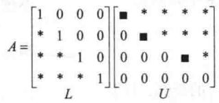
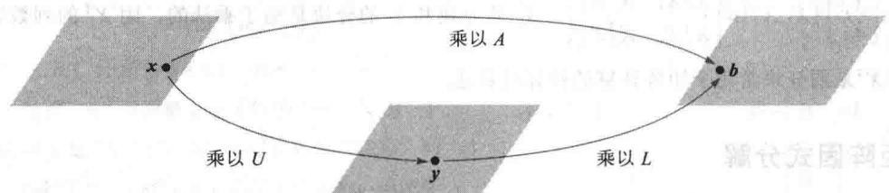
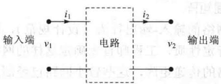
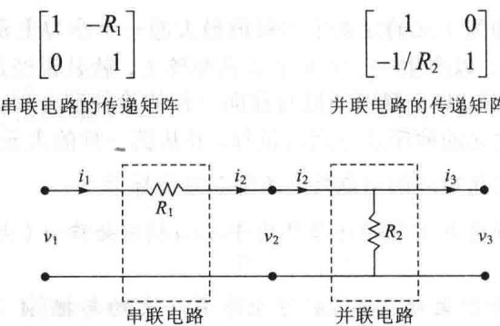
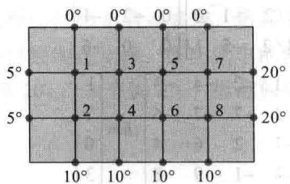

import Guide from '@/components/Guide.astro';
import Knowledge from '@/components/Knowledge.astro';
import Example from '@/components/Example.astro';
import Analysis from '@/components/Analysis.astro';
import Solution from '@/components/Solution.astro';
import Variant from '@/components/Variant.astro';
import Note from '@/components/Note.astro';
import Block from '@/components/Block.astro';
import Method from '@/components/Method.astro';
import Exercise from '@/components/Exercise.astro';

矩阵 $A$ 的因式分解是把 $A$ 表示为两个或更多个矩阵的乘积。矩阵乘法是数据的综合（把两个或更多个线性变换的作用结合成一个矩阵），矩阵因式分解是数据的分解。在计算机科学的语言中，将 $A$ 表示为矩阵的乘积是对 $A$ 中数据的预处理，把这些数据组成两个或更多部分，这种结构可能更有用，或者更便于计算。

矩阵的因式分解以及以后的线性变换的因式分解将在文中许多关键地方出现。本节主要讨论一种在许多重要的计算机程序的核心部分出现的因式分解，例如在本章的介绍性示例中描述的气流问题。某些其他的因式分解在习题中介绍。

## LU 分解

下面所述的 LU 分解在一些工业与商业问题中很常见，用于求解一系列具有相同系数矩阵

的线性方程（见习题32）：

$$
A \boldsymbol {x} = \boldsymbol {b} _ {1}, \quad A \boldsymbol {x} = \boldsymbol {b} _ {2}, \dots , A \boldsymbol {x} = \boldsymbol {b} _ {p}\tag{1}
$$

在 5.8 节中，逆幂法通过逐个求解一系列形如（1）中的方程来估计矩阵的特征值.

当 $A$ 可逆时，可计算 $A^{-1}$ ，然后计算 $A^{-1}b_{1}$ ， $A^{-1}b_{2}$ ，等等。然而，在实践中，（1）中第一个方程是由行化简解出的，并同时得出 $A$ 的 LU 分解，因而（1）中剩下的方程由 LU 分解求解。

首先，设 A 是 $m \times n$ 矩阵，它可以行化简为阶梯形而不必行对换（此后，我们将处理一般情形），则 A 可写成形式 A = LU，L 是 $m \times m$ 下三角矩阵，主对角线元素全是 1，U 是 A 的一个 $m \times n$ 阶梯形矩阵。例如，见图 2-11。这样一个分解称为 LU 分解，矩阵 L 是可逆的，称为单位下三角矩阵。

<figure class="vp-figure">
  
  <figcaption>图2-11 LU分解</figcaption>
</figure>

在研究如何构造 $L$ 和 $U$ 之前，我们将看看它们为什么这么有用。当 $A = LU$ 时，方程 $Ax = b$ 可写成 $L(Ux) = b$ 。把 $Ux$ 写成 $y$ ，可以由解下面一对方程来求解 $x$ ：

$$
\boxed { \begin{array}{l} L \mathbf {y} = \mathbf {b} \\ U \mathbf {x} = \mathbf {y} \end{array} }\tag{2}
$$

首先解 $Ly = b$ 求得 $y$ ，然后解 $Ux = y$ 求得 $x$ ，见图2-12.每个方程都比较容易解，因 $L$ 和 $U$ 都是三角矩阵.

<figure class="vp-figure">
  
  <figcaption>图2-12 映射 $x\mapsto Ax$ 的因式分解</figcaption>
</figure>

<Example title="例 1">
可以证明

$$
A = \left[ \begin{array}{r r r r} 3 & - 7 & - 2 & 2 \\ - 3 & 5 & 1 & 0 \\ 6 & - 4 & 0 & - 5 \\ - 9 & 5 & - 5 & 1 2 \end{array} \right] = \left[ \begin{array}{r r r r} 1 & 0 & 0 & 0 \\ - 1 & 1 & 0 & 0 \\ 2 & - 5 & 1 & 0 \\ - 3 & 8 & 3 & 1 \end{array} \right] \left[ \begin{array}{r r r r} 3 & - 7 & - 2 & 2 \\ 0 & - 2 & - 1 & 2 \\ 0 & 0 & - 1 & 1 \\ 0 & 0 & 0 & - 1 \end{array} \right] = L U
$$

应用 A 的 LU 分解来解 Ax=b，其中 $b=\begin{bmatrix}-9\\5\\7\\11\end{bmatrix}$ .

<Solution title="解">
解 Ly=b 仅需 6 次乘法和 6 次加法，因为这些运算仅需对第 5 列进行。（在 L 的每个主元下的零会在行变换的选取中自动产生。）

$$
[ L \quad \boldsymbol {b} ] = \left[ \begin{array}{r r r r r} 1 & 0 & 0 & 0 & - 9 \\ - 1 & 1 & 0 & 0 & 5 \\ 2 & - 5 & 1 & 0 & 7 \\ - 3 & 8 & 3 & 1 & 1 1 \end{array} \right] \sim \left[ \begin{array}{r r r r r} 1 & 0 & 0 & 0 & - 9 \\ 0 & 1 & 0 & 0 & - 4 \\ 0 & 0 & 1 & 0 & 5 \\ 0 & 0 & 0 & 1 & 1 \end{array} \right] = [ I \quad \boldsymbol {y} ]
$$

对 $Ux = y$ ，行化简的“向后”步骤需要4次除法、6次乘法和6次加法。（例如，把 $[U - y]$ 的第4列变成零需要对第4行作1次除法和3次乘法-加法，以把第4行的倍数加到上面各行。）

$$
[ U \quad \mathbf {y} ] = \left[ \begin{array}{r r r r r} 3 & - 7 & - 2 & 2 & - 9 \\ 0 & - 2 & - 1 & 2 & - 4 \\ 0 & 0 & - 1 & 1 & 5 \\ 0 & 0 & 0 & - 1 & 1 \end{array} \right] \sim \left[ \begin{array}{r r r r r} 1 & 0 & 0 & 0 & 3 \\ 0 & 1 & 0 & 0 & 4 \\ 0 & 0 & 1 & 0 & - 6 \\ 0 & 0 & 0 & 1 & - 1 \end{array} \right], \quad \mathbf {x} = \left[ \begin{array}{l} 3 \\ 4 \\ - 6 \\ - 1 \end{array} \right]
$$

为求 x 需 28 次算术运算, 或“浮算”(浮点运算), 不包括求 L 和 U 的运算在内. 相反, $[A \quad b]$ 行化简为 $[I \quad x]$ 需 62 次运算.

LU分解的计算效率依赖于如何求 $L$ 和 $U$ 。下面的算法证明，把 $A$ 行化简为阶梯形 $U$ 的运算同时也求出 $L$ 而基本上不需要额外的运算，因而也求出 LU 分解。在第一次行化简后， $L$ 和 $U$ 就可用来解系数矩阵为 $A$ 的额外方程。
</Solution>
</Example>

## LU 分解算法

设 A 可以化为阶梯形 U，化简过程中仅用行倍加变换，即把一行的倍数加于它下面的另一行。这样，存在单位下三角初等矩阵 $E_{1}, \cdots, E_{p}$ 使

$$
E _ {p} \dots E _ {1} A = U\tag{3}
$$

于是

$$
A = \left(E _ {p} \dots E _ {1}\right) ^ {- 1} U = L U
$$

其中

$$
L = (E _ {p} \dots E _ {1}) ^ {- 1}\tag{4}
$$

可以证明，单位下三角矩阵的乘积和逆也是单位下三角矩阵。（例如见习题19.）于是 $L$ 是单位下三角矩阵.

（3）中的行变换，它把 A 化为 U，所以也把（4）中的 L 化为 I，这是因为

$$
E _ {p} \dots E _ {1} L = (E _ {p} \dots E _ {1}) (E _ {p} \dots E _ {1}) ^ {- 1} = I
$$

这一点是构造 L 的关键.

## LU 分解的算法

1. 如果可能的话，用一系列的行倍加变换把 A 化为阶梯形 U.

2. 填充 L 的元素使相同的行变换把 L 变为 I.

第 1 步并不总是可能的，但当它可能时，上述讨论指出 LU 分解存在。例 2 将说明如何实现第 2 步。根据上面的说明，L 要满足使用与（3）中相同的 $E_{1}, \cdots, E_{p}$ ，有

$$
(E _ {p} \dots E _ {1}) L = I
$$

于是，根据可逆矩阵定理，L 是可逆的， $(E_{p}\cdots E_{1})=L^{-1}$ 。由（3）， $L^{-1}A=U$ ，且 A=LU ，所以步骤2可求出所要的L。

<Example title="例 2">
求下列矩阵的 LU 分解:

$$
A = \left[ \begin{array}{r r r r r} 2 & 4 & - 1 & 5 & - 2 \\ - 4 & - 5 & 3 & - 8 & 1 \\ 2 & - 5 & - 4 & 1 & 8 \\ - 6 & 0 & 7 & - 3 & 1 \end{array} \right]
$$

<Solution title="解">
因 A 有 4 行, 故 L 应为 $4 \times 4$ 矩阵. L 的第一列应该是 A 的第一列除以它的第一行主元元素:

$$
L = \left[ \begin{array}{c c c c} 1 & 0 & 0 & 0 \\ - 2 & 1 & 0 & 0 \\ 1 & & 1 & 0 \\ - 3 & & & 1 \end{array} \right]
$$

比较 A 和 L 的第一列. 把 A 的第一列的后三个元素变成零的行变换同时也将 L 的第一列的后三个元素变成 0，同样的道理对 L 的其他各列也是成立的，让我们看一下 A 行化简为阶梯形 U 的过程. 即每个矩阵中标出的元素用于确定把 A 变成 U 的行变换顺序. （见（5）中标出的元素.）

$$
A = \left[ \begin{array}{r r r r r} 2 & 4 & - 1 & 5 & - 2 \\ - 4 & - 5 & 3 & - 8 & 1 \\ 2 & - 5 & - 4 & 1 & 8 \\ - 6 & 0 & 7 & - 3 & 1 \end{array} \right] \sim \left[ \begin{array}{r r r r r} 2 & 4 & - 1 & 5 & - 2 \\ 0 & 3 & 1 & 2 & - 3 \\ 0 & - 9 & - 3 & - 4 & 1 0 \\ 0 & 1 2 & 4 & 1 2 & - 5 \end{array} \right] = A _ {1}\tag{5}
$$

$$
\sim A _ {2} = \left[ \begin{array}{c c c c c} 2 & 4 & - 1 & 5 & - 2 \\ 0 & 3 & 1 & 2 & - 3 \\ 0 & 0 & 0 & 2 & 1 \\ 0 & 0 & 0 & 4 & 7 \end{array} \right] \sim \left[ \begin{array}{c c c c c} 2 & 4 & - 1 & 5 & - 2 \\ 0 & 3 & 1 & 2 & - 3 \\ 0 & 0 & 0 & 2 & 1 \\ 0 & 0 & 0 & 0 & 5 \end{array} \right] = U
$$

上式中标出的元素确定了将 $A$ 化为 $U$ 的行化简. 在每个主元列, 把标出的元素除以主元后将结果放入 $L$ :

$$
\begin{array}{c c c c} \left[ \begin{array}{l} - 2 \\ - 4 \\ 2 \\ - 6 \end{array} \right] & \left[ \begin{array}{l} 3 \\ - 9 \\ 1 2 \end{array} \right] & \left[ \begin{array}{l} 2 \\ 4 \end{array} \right] & [ 5 ] \\ \div 2 & \div 3 & \div 2 & \div 5 \\ \downarrow & \downarrow & \downarrow & \downarrow \end{array}
$$

$$
\left[ \begin{array}{c c c c} 1 & & & \\ - 2 & 1 & & \\ 1 & - 3 & 1 & \\ - 3 & 4 & 2 & 1 \end{array} \right], L = \left[ \begin{array}{c c c c} 1 & 0 & 0 & 0 \\ - 2 & 1 & 0 & 0 \\ 1 & - 3 & 1 & 0 \\ - 3 & 4 & 2 & 1 \end{array} \right]
$$

容易证明，所求出的 L 和 U 满足 LU = A.

在实际工作中，行对换几乎总是必要的，因为部分主元法可以用来提高精确度。（回忆这种算法总是选择一列中可以作为主元的元素中绝对值最大的一个作为主元。）为了处理行对换，上述的LU分解可以稍做改变，以产生一个置换下三角矩阵 $L$ ，就是说经过行的置换后它成为（单位）下三角矩阵．所得的置换LU分解可通过与前面一样的途径解方程 $Ax = b$ ，只要在把 $[L - b]$ 化简为 $[I - y]$ 时按照 $L$ 中主元的顺序从左到右进行，并从第一列的主元开始．介绍LU分解的参考书通常包含 $L$ 为置换下三角矩阵的可能性．详见学习指导书.

数值计算的注解 下列运算次数的计算适用于 $n \times n$ 稠密矩阵 $A$ （大部分元素非零）， $n$ 相当大，例如 $n \geqslant 30$ .

1. 计算 A 的 LU 分解大约需要 $2n^{3}/3$ 次浮算（大约与把 [A b] 行化简的次数相同），而求 $A^{-1}$ 大约需要 $2n^{3}$ 次浮算.

2. 解 $Ly = b$ 和 $Ux = y$ 大约需要 $2n^2$ 次浮算，因任意 $n \times n$ 三角方程组可以用大约 $n^2$ 次浮算解出.

3. 把 b 乘以 $A^{-1}$ 也需要 $2n^{2}$ 次浮算，但结果可能不如由 L 和 U 得出的精确（由于计算 $A^{-1}$ 及 $A^{-1}b$ 的舍入误差）.

4. 若 $A$ 是稀疏矩阵（大部分元素为 0），则 $L$ 和 $U$ 可能也是稀疏的，然而 $A^{-1}$ 很可能是稠密的。这时，用 LU 分解来解方程 $Ax = b$ 很可能比用 $A^{-1}$ 快很多，见习题 31。
</Solution>
</Example>

## 电子工程中的矩阵因式分解

矩阵因式分解会在构造具有某些性质的电子网络中碰到. 下列讨论仅是矩阵因式分解与电路设计之间联系的一个大概.

设图2-13中的方框表示某种电路，具有输入与输出.用 $\left[ \begin{array}{l}v_{1}\\ i_{1} \end{array} \right]$ 表示输入电压与电流（电压 $v$ 以伏特为单位，电流 $i$ 以安培为单位），输出电压与电流为 $\left[ \begin{array}{l}v_{2}\\ i_{2} \end{array} \right]$ .通常，变换 $\left[ \begin{array}{l}v_1\\ i_1 \end{array} \right]\mapsto \left[ \begin{array}{l}v_{2}\\ i_{2} \end{array} \right]$ 为线性的，也就是说，存在矩阵 $A$ ，称为传递矩阵，使得

$$
\left[ \begin{array}{c} v _ {2} \\ i _ {2} \end{array} \right] = A \left[ \begin{array}{c} v _ {1} \\ i _ {1} \end{array} \right]
$$

<figure class="vp-figure">
  
  <figcaption>图 2-13 具有输入端与输出端的电路</figcaption>
</figure>

图 2-14 表示梯级网络，它有两个回路（也可以更多）串联起来，所以第一个电路的输出是第二个电路的输入。图 2-14 左边的电路称为串联电路，电阻为 $R_{1}$ （单位为欧姆），右端电路称为并联电路，电阻为 $R_{2}$ 。应用欧姆定律，可以证明串联电路与并联电路的传递矩阵分别为

<figure class="vp-figure">
  
  <figcaption>图 2-14 梯级电路</figcaption>
</figure>

<Example title="例 3">
a. 计算图 2-14 中梯级网络的传递矩阵.

b. 设计一个传递矩阵为 $\begin{bmatrix} 1 & -8 \\ -0.5 & 5 \end{bmatrix}$ 的梯级网络.

a. 设 $A_{1}$ 和 $A_{2}$ 分别为串联电路与并联电路的传递矩阵，则输入向量 x 首先变换为 $A_{1}x$ ，然后变为 $A_{2}(A_{1}x)$ 。两个电路的串联对应于线性变换的复合，所以梯级网络的传递矩阵为（注意顺序）

$$
A _ {2} A _ {1} = \left[ \begin{array}{c c} 1 & 0 \\ - 1 / R _ {2} & 1 \end{array} \right] \left[ \begin{array}{c c} 1 & - R _ {1} \\ 0 & 1 \end{array} \right] = \left[ \begin{array}{c c} 1 & - R _ {1} \\ - 1 / R _ {2} & 1 + R _ {1} / R _ {2} \end{array} \right]\tag{6}
$$

b. 为把矩阵 $\begin{bmatrix} 1 & -8 \\ -0.5 & 5 \end{bmatrix}$ 分解成两个传递矩阵的乘积，如（6）式，我们让图2-14中的 $R_{1}$ 和 $R_{2}$ 满足

$$
\left[ \begin{array}{c c} 1 & - R _ {1} \\ - 1 / R _ {2} & 1 + R _ {1} / R _ {2} \end{array} \right] = \left[ \begin{array}{c c} 1 & - 8 \\ - 0. 5 & 5 \end{array} \right]
$$

由（1,2）元素， $R_{1}=8$ 欧姆，由（2,1）元素， $1/R_{2}=0.5$ ，而 $R_{2}=2$ 欧姆。对电阻的这些值，图2-14中的网络有所需的传递矩阵。

网络的传递矩阵总结了网络的输入-输出行为（设计规范），而不必去了解内部电路。为了物理上建立网络，并使它有特定性质，工程师首先确定这样的网络是否可实现。然后尝试把传递矩阵分解为对应于较小回路的传递矩阵，这些较小回路已经制造出来。在交流电的情况下，传递矩阵的元素通常是有理复值函数（见2.4节习题19和20，3.3节例2）。标准问题是要找一个使用最少电子元件的最小实现。
</Example>

<Block title="练习题">
求矩阵 $A=\begin{bmatrix}2&-4&-2&3\\ 6&-9&-5&8\\ 2&-7&-3&9\\ 4&-2&-2&-1\\ -6&3&3&4\end{bmatrix}$ 的 LU 分解.

（注： $A$ 仅有3个主元列，故例2的方法将仅产生 $L$ 的前三列． $L$ 的余下两列由 $I_{5}$ 得到.）
</Block>

<Block title="习题2.5">
习题 1\~6 中，用所给的 A 的 LU 分解来解方程 Ax=b．在习题 1\~2 中，用通常的行化简解方程 Ax=b．

1.

$$
A = \left[ \begin{array}{r r r} 3 & - 7 & - 2 \\ - 3 & 5 & 1 \\ 6 & - 4 & 0 \end{array} \right], \boldsymbol {b} = \left[ \begin{array}{c} - 7 \\ 5 \\ 2 \end{array} \right]
$$

$$
A = \left[ \begin{array}{r r r} 1 & 0 & 0 \\ - 1 & 1 & 0 \\ 2 & - 5 & 1 \end{array} \right] \left[ \begin{array}{r r r} 3 & - 7 & - 2 \\ 0 & - 2 & - 1 \\ 0 & 0 & - 1 \end{array} \right]
$$

2.

$$
A = \left[ \begin{array}{r r r} 4 & 3 & - 5 \\ - 4 & - 5 & 7 \\ 8 & 6 & - 8 \end{array} \right], \boldsymbol {b} = \left[ \begin{array}{l} 2 \\ - 4 \\ 6 \end{array} \right]
$$

$$
A = \left[ \begin{array}{r r r} 1 & 0 & 0 \\ - 1 & 1 & 0 \\ 2 & 0 & 1 \end{array} \right] \left[ \begin{array}{r r r} 4 & 3 & - 5 \\ 0 & - 2 & 2 \\ 0 & 0 & 2 \end{array} \right]
$$

3.

$$
A = \left[ \begin{array}{r r r} 2 & - 1 & 2 \\ - 6 & 0 & - 2 \\ 8 & - 1 & 5 \end{array} \right], \boldsymbol {b} = \left[ \begin{array}{l} 1 \\ 0 \\ 4 \end{array} \right]
$$

$$
A = \left[ \begin{array}{r r r} 1 & 0 & 0 \\ - 3 & 1 & 0 \\ 4 & - 1 & 1 \end{array} \right] \left[ \begin{array}{r r r} 2 & - 1 & 2 \\ 0 & - 3 & 4 \\ 0 & 0 & 1 \end{array} \right]
$$

4.

$$
A = \left[ \begin{array}{c c c} 2 & - 2 & 4 \\ 1 & - 3 & 1 \\ 3 & 7 & 5 \end{array} \right], \boldsymbol {b} = \left[ \begin{array}{c} 0 \\ - 5 \\ 7 \end{array} \right]
$$

$$
A = \left[ \begin{array}{c c c} 1 & 0 & 0 \\ 1 / 2 & 1 & 0 \\ 3 / 2 & - 5 & 1 \end{array} \right] \left[ \begin{array}{c c c} 2 & - 2 & 4 \\ 0 & - 2 & - 1 \\ 0 & 0 & - 6 \end{array} \right]
$$

5.

$$
A = \left[ \begin{array}{r r r r} 1 & - 2 & - 4 & - 3 \\ 2 & - 7 & - 7 & - 6 \\ - 1 & 2 & 6 & 4 \\ - 4 & - 1 & 9 & 8 \end{array} \right], \boldsymbol {b} = \left[ \begin{array}{l} 1 \\ 7 \\ 0 \\ 3 \end{array} \right]
$$

$$
A = \left[ \begin{array}{c c c c} 1 & 0 & 0 & 0 \\ 2 & 1 & 0 & 0 \\ - 1 & 0 & 1 & 0 \\ - 4 & 3 & - 5 & 1 \end{array} \right] \left[ \begin{array}{c c c c} 1 & - 2 & - 4 & - 3 \\ 0 & - 3 & 1 & 0 \\ 0 & 0 & 2 & 1 \\ 0 & 0 & 0 & 1 \end{array} \right]
$$

6.

$$
A = \left[ \begin{array}{r r r r} 1 & 3 & 4 & 0 \\ - 3 & - 6 & - 7 & 2 \\ 3 & 3 & 0 & - 4 \\ - 5 & - 3 & 2 & 9 \end{array} \right], \boldsymbol {b} = \left[ \begin{array}{l} 1 \\ - 2 \\ - 1 \\ 2 \end{array} \right]
$$

$$
A = \left[ \begin{array}{r r r r} 1 & 0 & 0 & 0 \\ - 3 & 1 & 0 & 0 \\ 3 & - 2 & 1 & 0 \\ - 5 & 4 & - 1 & 1 \end{array} \right] \left[ \begin{array}{r r r r} 1 & 3 & 4 & 0 \\ 0 & 3 & 5 & 2 \\ 0 & 0 & - 2 & 0 \\ 0 & 0 & 0 & 1 \end{array} \right]
$$

求习题 7\~16 中矩阵的 LU 分解（L 为单位下三角矩阵）。注意 MATLAB 通常给出置换 LU 分解，因为它用部分主元法来提高精确度。

7.

$$
\left[ \begin{array}{c c} 2 & 5 \\ - 3 & - 4 \end{array} \right]
$$

8.

$$
\left[ \begin{array}{c c} 6 & 9 \\ 4 & 5 \end{array} \right]
$$

9.

$$
\left[ \begin{array}{r r r} 3 & - 1 & 2 \\ - 3 & - 2 & 1 0 \\ 9 & - 5 & 6 \end{array} \right]
$$

10.

$$
\left[ \begin{array}{c c c} - 5 & 3 & 4 \\ 1 0 & - 8 & - 9 \\ 1 5 & 1 & 2 \end{array} \right]
$$

11.

$$
\left[ \begin{array}{r r r} 3 & - 6 & 3 \\ 6 & - 7 & 2 \\ - 1 & 7 & 0 \end{array} \right]
$$

12.

$$
\left[ \begin{array}{r r r} 2 & - 4 & 2 \\ 1 & 5 & - 4 \\ - 6 & - 2 & 4 \end{array} \right]
$$

13.

$$
\left[ \begin{array}{r r r r} 1 & 3 & - 5 & - 3 \\ - 1 & - 5 & 8 & 4 \\ 4 & 2 & - 5 & - 7 \\ - 2 & - 4 & 7 & 5 \end{array} \right]
$$

14.

$$
\left[ \begin{array}{r r r r} 1 & 4 & - 1 & 5 \\ 3 & 7 & - 2 & 9 \\ - 2 & - 3 & 1 & - 4 \\ - 1 & 6 & - 1 & 7 \end{array} \right]
$$

15.

$$
\left[ \begin{array}{r r r r} 2 & - 4 & 4 & - 2 \\ 6 & - 9 & 7 & - 3 \\ - 1 & - 4 & 8 & 0 \end{array} \right]
$$

16.

$$
\left[ \begin{array}{r r r} 2 & - 6 & 6 \\ - 4 & 5 & - 7 \\ 3 & 5 & - 1 \\ - 6 & 4 & - 8 \\ 8 & - 3 & 9 \end{array} \right]
$$

17. 当 A 可逆时, MATLAB 利用分解 A = LU (L 可能是置换下三角矩阵) 来求 $A^{-1}$ , 即 $A^{-1} = U^{-1} L^{-1}$ . 用这种方法求习题 2 中 A 的逆（对 L 和 U 应用 2.2 节求逆的算法）.

18. 如 17 题，求习题 3 中 A 的逆.

19. 设 A 为下三角 $n \times n$ 矩阵，对角线上元素非零.
证明 A 可逆且 $A^{-1}$ 是下三角矩阵. [提示：说明为什么 A 可仅用倍加变换和倍乘变换变为 I.

（主元在何处？）接着说明为什么化简 A 的行变换把 A 变为 I 的同时把 I 变为下三角矩阵.]

20. 设 A 的 LU 分解为 A = LU．说明为什么 A 可仅用行倍加变换行化简为 U．（这里给出的条件是文中所证明的结论，而这里的结论是文中给出的条件。）

21. 设 A = BC，B 为可逆。证明：任意一系列把 B 化为 I 的行变换也将 A 化为 C。其逆不真，因零矩阵可分解为 $0 = B \cdot 0$ 。

习题 22\~26 介绍某些广泛应用的矩阵因式分解法，有些在本书后面的章节中讨论.

22.（简化 LU 分解）设 A 如练习题，求出 $5 \times 3$ 矩阵 B 及 $3 \times 4$ 矩阵 C，使得 A = BC。推广这一想法到 A 是 $m \times n$ 矩阵的情形，且 A = LU，U 仅有 3 个非零行。

23.（秩分解）设 $m \times n$ 矩阵 $A$ 有因式分解 $A = CD$ ，其中 $C$ 是 $m \times 4$ 矩阵， $D$ 是 $4 \times n$ 矩阵。a. 证明 $A$ 是 4 个外积的和。（见 2.4 节。b. 设 $m = 400$ 和 $n = 100$ ，说明为什么计算机程序员倾向于用两个矩阵 $C$ 和 $D$ 来存储矩阵 $A$ 的数据。

24.（QR分解）设 $A = QR$ ，其中 $Q$ 和 $R$ 都是 $n \times n$ 矩阵， $R$ 是可逆上三角矩阵， $Q$ 满足 $Q^{\mathrm{T}}Q = I$ 。证明对任意属于 $\mathbb{R}^n$ 的 $\pmb{b}$ ，方程 $Ax = b$ 有唯一解，并叙述求解的算法。

25.（奇异值分解）设 $A=UDV^{T}$ ，其中 U, V 是 $n \times n$ 矩阵， $U^{T}U = I, V^{T}V = I$ ，D 是对角矩阵，主对角线上元素 $\sigma_{1}, \sigma_{2}, \cdots, \sigma_{n}$ 为正数。证明 A 可逆，并给出 $A^{-1}$ 的一个表达式。

26.（谱分解）设 $3 \times 3$ 矩阵 $A$ 可因式分解为 $A = PDP^{-1}$ ，其中 $P$ 是可逆 $3 \times 3$ 矩阵， $D$ 是对角矩阵

$$
D = \left[ \begin{array}{c c c} 1 & 0 & 0 \\ 0 & 1 / 2 & 0 \\ 0 & 0 & 1 / 3 \end{array} \right]
$$

证明在计算 A 的高次幂时，这种分解是有用的。使用 P 及 D 的元素求出 $A^{2}, A^{3}$ 和 $A^{k}$ （k 为正整数）的较为简单的公式。

27. 设计两个不同的梯级网络，使其输入为 12 伏特与 6 安培时输出为 9 伏特与 4 安培.

28. 证明：若三个并联电路（电阻为 $R_{1}, R_{2}, R_{3}$ ）串联在一起，所得网络与一个单一的并联电路有相同的传递矩阵。求该电路的电阻的表达式。

29. a. 计算下图的网络的传递矩阵.

<table><tr><td>i1</td><td>i2</td><td>i3</td><td>i4</td></tr><tr><td>v1</td><td>R1</td><td>R2</td><td>R3</td></tr></table>

b. 设 $A=\begin{bmatrix}4/3 & -12 \\ -1/4 & 3\end{bmatrix}$ ，设计梯级网络，使它的传递矩阵为 A，利用 A 的适当的矩阵因式分解.

30. 在习题 29 中，求出 A 的另一因式分解并用以设计传递矩阵为 A 的另一梯级网络.

31. [M]对下图中平板的稳态传热问题的解可近似地用方程 Ax=b 的解来逼近，其中 $b=(5,15,0,10,0,10,20,30)$ .

$$
A = \left[ \begin{array}{c c c c c c c c} 4 & - 1 & - 1 & & & & & \\ - 1 & 4 & 0 & - 1 & & & & \\ - 1 & 0 & 4 & - 1 & - 1 & & & \\ & - 1 & - 1 & 4 & 0 & - 1 & & \\ & & - 1 & 0 & 4 & - 1 & - 1 & \\ & & & - 1 & - 1 & 4 & 0 & - 1 \\ & & & & - 1 & 0 & 4 & - 1 \\ & & & & & - 1 & - 1 & 4 \end{array} \right]
$$

（参阅1.1节习题33.） $A$ 中未写出的元素为0.A的非零元素都位于主对角线相邻的一条带中．这样的带状矩阵在许多应用中出现，往往非常大（有数千的行和列但相对窄的带）.

a. 使用例 2 的方法求 A 的 LU 分解, 注意两个因子都是带状矩阵（有两条非零对角线在主对角线之上或之下）. 计算 LU-A 来检验你的结果.

b. 使用 LU 分解解 Ax = b

c. 求出 $A^{-1}$ , 注意 $A^{-1}$ 是稠密矩阵, 无带状结构. 当 $A$ 很大时, $L$ 和 $U$ 可以存储在比 $A^{-1}$ 小得多的空间内. 这个事实是更多使用 $A$ 的 LU 分解而不用 $A^{-1}$ 本身的一个原因.

32. [M]下列带状矩阵 A 可用来估计一根梁中的非稳态热传导，其中梁上的各点 $p_{1}, \cdots, p_{4}$ 的温度随时间变化。

$$
\begin{array}{c c c c c c} \Delta x & \Delta x \\ \hline & p _ {1} & p _ {2} & p _ {3} & p _ {4} & p _ {5} \end{array}
$$

矩阵中的常数 C 依赖于梁的物理性质， $\Delta x$ 为各点之间距离，时间间隔 $\Delta t$ 的长度是两次温度测量的间隔. 设对 $k=0,1,2,\cdots,\mathbb{R}^{5}$ 中向量 $t_{k}$ 表示在 $k\Delta t$ 时刻各点的温度. 若梁的两端保持在 $0^{\circ}$ ，则温度向量满足方程 $At_{k+1}=t_{k}\quad(k=0,1,\cdots)$ ，其中

$$
A = \left[ \begin{array}{c c c c c} (1 + 2 C) & - C & & & \\ - C & (1 + 2 C) & - C & & \\ & - C & (1 + 2 C) & - C & \\ & & - C & (1 + 2 C) & - C \\ & & & - C & (1 + 2 C) \end{array} \right]
$$

a. 求出当 $C = 1$ 时 $A$ 的LU分解. 有三条非零对角线的矩阵称为三对角矩阵, 因子 $L$ 和 $U$ 为双对角矩阵.

b. 设 C=1 及 $t_{0}=(10,12,12,12,10)$ ，应用 A 的 LU 分解求温度分布 $t_{1}, t_{2}, t_{3}$ 和 $t_{4}$ .
</Block>

<Block title="练习题答案">
$$
A = \left[ \begin{array}{r r r r} 2 & - 4 & - 2 & 3 \\ 6 & - 9 & - 5 & 8 \\ 2 & - 7 & - 3 & 9 \\ 4 & - 2 & - 2 & - 1 \\ - 6 & 3 & 3 & 4 \end{array} \right] \sim \left[ \begin{array}{r r r r} 2 & - 4 & - 2 & 3 \\ 0 & 3 & 1 & - 1 \\ 0 & - 3 & - 1 & 6 \\ 0 & 6 & 2 & - 7 \\ 0 & - 9 & - 3 & 1 3 \end{array} \right] \sim \left[ \begin{array}{r r r r} 2 & - 4 & - 2 & 3 \\ 0 & 3 & 1 & - 1 \\ 0 & 0 & 0 & 5 \\ 0 & 0 & 0 & - 5 \\ 0 & 0 & 0 & 1 0 \end{array} \right] \sim \left[ \begin{array}{r r r r} 2 & - 4 & - 2 & 3 \\ 0 & 3 & 1 & - 1 \\ 0 & 0 & 0 & 5 \\ 0 & 0 & 0 & 0 \\ 0 & 0 & 0 & 0 \end{array} \right] = U
$$

把每一个标出的列除以它顶端的主元，所得的列构成 $L$ 前三列的下半部分，这就使 $L$ 化为 $I$ 的变换对应于 $A$ 化为 $U$ 的变换。用 $I_{5}$ 的后两列作为 $L$ 的后两列，使它成为单位下三角矩阵。

$$
\begin{array}{c c c} \left[ \begin{array}{c} 2 \\ 6 \\ 2 \\ 4 \\ - 6 \end{array} \right] & \left[ \begin{array}{c} 3 \\ - 3 \\ 6 \\ - 9 \end{array} \right] & \left[ \begin{array}{c} 5 \\ - 5 \\ 1 0 \end{array} \right] \\ \div 2 & \div 3 & \div 5 \\ \downarrow & \downarrow & \downarrow \end{array}
$$

$$
\left[ \begin{array}{c c c c} 1 & & & \\ 3 & 1 & & \\ 1 & - 1 & 1 & \dots \\ 2 & 2 & - 1 & \\ - 3 & - 3 & 2 \end{array} \right], L = \left[ \begin{array}{c c c c c} 1 & 0 & 0 & 0 & 0 \\ 3 & 1 & \underline {{0}} & 0 & 0 \\ 1 & - 1 & 1 & 0 & 0 \\ 2 & 2 & - 1 & 1 & 0 \\ - 3 & - 3 & 2 & 0 & 1 \end{array} \right]
$$
</Block>
