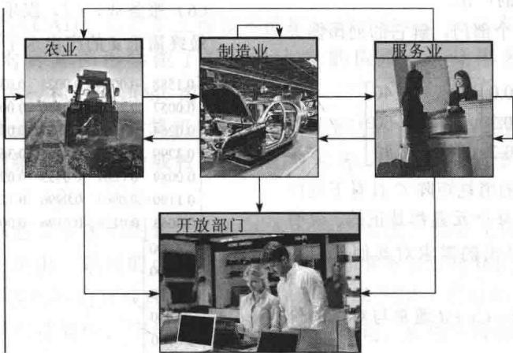

import Guide from '@/components/Guide.astro';
import Knowledge from '@/components/Knowledge.astro';
import Example from '@/components/Example.astro';
import Analysis from '@/components/Analysis.astro';
import Solution from '@/components/Solution.astro';
import Variant from '@/components/Variant.astro';
import Note from '@/components/Note.astro';
import Block from '@/components/Block.astro';
import Method from '@/components/Method.astro';
import Exercise from '@/components/Exercise.astro';

在华西里·列昂惕夫（Wassily Leontief）获得诺贝尔奖的工作中，线性代数起着重要的作用，如第1章开始所提到的。本节所叙述的经济模型是现在世界各国广泛使用的模型的基础。

设某国的经济体系分为 $n$ 个部门，这些部门生产商品和服务。设 $\pmb{x}$ 为 $\mathbb{R}^n$ 中产出向量，它列出了每一部门一年中的产出。同时，设经济体系的另一部分（称为开放部门）不生产商品或服务，仅仅消费商品或服务，设 $\pmb{d}$ 为最终需求向量（或最终需求账单），它列出经济体系中的各种非生产部门所需求的商品或服务。此向量代表消费者需求、政府消费、超额生产、出口或其他外部需求。

由于各部门生产商品以满足消费者需求，生产者本身创造了中间需求，需要这些产品作为生产部门的投入。部门之间的关系是很复杂的，而生产和最后需求之间的联系也还不清楚。列昂惕夫思考是否存在某一生产水平 $x$ 恰好满足这一生产水平的总需求（ $x$ 称为供给），从而

$$
\{\text {总产出}   x \} = \{\text {中间需求} \} + \{\text {最终需求}   d \}\tag{1}
$$

列昂惕夫的投入产出模型的基本假设是，对每个部门， $\mathbb{R}$ 中有一个单位消费向量，它列出了该部门的单位产出所需的投入。所有的投入与产出都以百万美元作为单位，而不用具体的单位（如吨等）（假设商品和服务的价格为常数）。

作为一个简单的例子，设经济体系由三个部门组成——制造业、农业和服务业。单位消费向量 $c_{1}, c_{2}, c_{3}$ 如表2-1所示。

表 2-1 每单位产出消费的投入

<table><tr><td>购买自</td><td>制造业</td><td>农业</td><td>服务业</td></tr><tr><td>制造业</td><td>0.50</td><td>0.40</td><td>0.20</td></tr><tr><td>农业</td><td>0.20</td><td>0.30</td><td>0.10</td></tr><tr><td>服务业</td><td>0.10</td><td>0.10</td><td>0.30</td></tr><tr><td></td><td> $\uparrow$  $c_1$ </td><td> $\uparrow$  $c_2$ </td><td> $\uparrow$  $c_3$ </td></tr></table>

<Example title="例 1">
如果制造业决定生产 100 单位产品，它将消费多少？

<Solution title="解">
计算

$$
1 0 0 \boldsymbol {c} _ {1} = 1 0 0 \left[ \begin{array}{l} 0. 5 0 \\ 0. 2 0 \\ 0. 1 0 \end{array} \right] = \left[ \begin{array}{l} 5 0 \\ 2 0 \\ 1 0 \end{array} \right]
$$

为生产 100 单位产品，制造业需要消费制造业其他部门的 50 单位产品，20 单位农业产品，10 单位服务业产品.

若制造业决定生产 $x_{1}$ 单位产出，则在生产的过程中消费掉的中间需求是 $x_{1}c_{1}$ . 类似地，若 $x_{2}$ 和 $x_{3}$ 表示农业和服务业的计划产出，则 $x_{2}c_{2}$ 和 $x_{3}c_{3}$ 为它们所对应的中间需求. 三个部门的中间需求为

$$
\{\mathrm{中间需求} \} = x _ {1} c _ {1} + x _ {2} c _ {2} + x _ {3} c _ {3} = C x\tag{2}
$$

其中 C 是消耗矩阵 $\left[c_{1}\quad c_{2}\quad c_{3}\right]$ ，即

$$
C = \left[ \begin{array}{l l l} 0. 5 0 & 0. 4 0 & 0. 2 0 \\ 0. 2 0 & 0. 3 0 & 0. 1 0 \\ 0. 1 0 & 0. 1 0 & 0. 3 0 \end{array} \right]\tag{3}
$$

方程（1）和（2）产生列昂惕夫模型.

列昂惕夫投入产出模型或生产方程

$$
\begin{array}{r l r} {\pmb {x}} & {=} & {C \pmb {x} \qquad + \qquad \pmb {d}} \\ {\text {总产出}} & {} & {\text {中间需求} \qquad \qquad \text {最终需求}} \end{array}\tag{4}
$$

可把（4）重写为

$$
I \boldsymbol {x} - C \boldsymbol {x} = \boldsymbol {d}
$$

$$
(I - C) \boldsymbol {x} = \boldsymbol {d}\tag{5}
$$
</Solution>
</Example>

<Example title="例 2">
考虑消耗矩阵为（3）的经济体系. 假设最终需求是制造业 50 单位，农业 30 单位，服务业 20 单位，求生产水平 x.

<Solution title="解">
（5）中系数矩阵为

$$
I - C = \left[ \begin{array}{l l l} 1 & 0 & 0 \\ 0 & 1 & 0 \\ 0 & 0 & 1 \end{array} \right] - \left[ \begin{array}{l l l} 0. 5 & 0. 4 & 0. 2 \\ 0. 2 & 0. 3 & 0. 1 \\ 0. 1 & 0. 1 & 0. 3 \end{array} \right] = \left[ \begin{array}{r r r} 0. 5 & - 0. 4 & - 0. 2 \\ - 0. 2 & 0. 7 & - 0. 1 \\ - 0. 1 & - 0. 1 & 0. 7 \end{array} \right]
$$

为解方程（5），对增广矩阵作行变换：

$$
\left[ \begin{array}{r r r r} 0. 5 & - 0. 4 & - 0. 2 & 5 0 \\ - 0. 2 & 0. 7 & - 0. 1 & 3 0 \\ - 0. 1 & - 0. 1 & 0. 7 & 2 0 \end{array} \right] \sim \left[ \begin{array}{r r r r} 5 & - 4 & - 2 & 5 0 0 \\ - 2 & 7 & - 1 & 3 0 0 \\ - 1 & - 1 & 7 & 2 0 0 \end{array} \right] \sim \dots \sim \left[ \begin{array}{r r r r} 1 & 0 & 0 & 2 2 6 \\ 0 & 1 & 0 & 1 1 9 \\ 0 & 0 & 1 & 7 8 \end{array} \right]
$$

最后一列四舍五入到整数，制造业需生产约226单位，农业119单位，服务业78单位。若矩阵 $I - C$ 可逆，则可应用2.2节定理5，用 $I - C$ 代替 $A$ ，由方程 $(I - C)x = d$ 得出 $\pmb {x} = (I - C)^{-1}\pmb {d}$ .下列定理说明，在大部分的实际情况中， $I - C$ 是可逆的，而且产出向量 $\pmb{x}$ 是经济上可行的，亦即 $\pmb{x}$ 中的元素是非负的。

在此定理中，列的和表示矩阵中某一列元素的和。在通常情况下，某一消耗矩阵的列的和是小于1的，因为一个部门要生产一单位产出所需投入的总价值应该小于1。
</Solution>
</Example>

<Knowledge title="定理 11">
设 C 为某一经济体系的消耗矩阵，d 为最终需求。若 C 和 d 的元素非负，C 的每一列的和小于 1，则 $(I-C)^{-1}$ 存在，产出向量

$$
\boldsymbol {x} = (I - C) ^ {- 1} \boldsymbol {d}
$$

有非负元素，且是下列方程的唯一解：

$$
\boldsymbol {x} = C \boldsymbol {x} + \boldsymbol {d}
$$

下面的讨论说明定理成立的理由，且给出一种计算 $(I-C)^{-1}$ 的新方法.

$(I - C)^{-1}$ 的公式

假设由 d 表示的需求在年初提供给各种工业，它们制定产业水平为 x=d 的计划，它将恰好满足最终需求. 由于这些工业准备产出为 d，它们将提出对原料及其他投入的要求. 这就创造出对投入的中间需求 Cd.

为满足附加需求 $Cd$ ，这些工业需要额外的投入为 $C(Cd) = C^2 d$ ，当然，它又创造出第二轮的中间需求，当要满足这些需求时，它们又创造出第三轮需求，即 $C(C^2 d) = C^3 d$ ，等等.

理论上，这个过程可无限延续下去，虽然实际上这样一系列事件不可能一直发生下去。我们可把这一假设的情形表示如表2-2所示。

表 2-2

<table><tr><td></td><td>要满足的需求</td><td>为满足此需求需要的投入</td></tr><tr><td>最终需求</td><td> $d$ </td><td> $Cd$ </td></tr><tr><td>中间需求</td><td></td><td></td></tr><tr><td>第一轮</td><td> $Cd$ </td><td> $C(Cd) = C^{2}d$ </td></tr><tr><td>第二轮</td><td> $C^{2}d$ </td><td> $C(C^{2}d) = C^{3}d$ </td></tr><tr><td>第三轮</td><td> $C^{3}d$ </td><td> $C(C^{3}d) = C^{4}d$ </td></tr><tr><td></td><td> $\vdots$ </td><td> $\vdots$ </td></tr></table>

满足所有这些需求的产出水平 $x$ 是

$$
\boldsymbol {x} = \boldsymbol {d} + C \boldsymbol {d} + C ^ {2} \boldsymbol {d} + C ^ {3} \boldsymbol {d} + \dots = (I + C + C ^ {2} + C ^ {3} + \dots) \boldsymbol {d}\tag{6}
$$

为了使（6）有意义，我们使用下列代数恒等式：

$$
(I - C) (I + C + C ^ {2} + \dots + C ^ {m}) = I - C ^ {m + 1}\tag{7}
$$

可以证明，若 C 的列的和都严格小于 1，则 I-C 是可逆的，当 m 趋于无穷时 $C^{m}$ 趋于 0，而 $I-C^{m+1} \rightarrow I$ 。（这有点类似于当正数 t 小于 1 时，随着 m 增大， $t^{m} \rightarrow 0$ ）应用（7），我们有当 C 的列的和小于 1 时， $(I-C)^{-1} \approx I + C + C^{2} + C^{3} + \cdots + C^{m}$ （8）

我们将（8）解释为当 $m$ 充分大时，右边可以任意接近于 $(I - C)^{-1}$

在实际的投入产出模型中，消耗矩阵的幂迅速趋于0，故（8）实际上给出一种计算 $(I - C)^{-1}$ 的方法。类似地，对任意 $d$ ，向量 $C^m d$ 迅速地趋于零向量，而（6）给出实际解 $(I - C)x = d$ 的方法。若 $C$ 和 $d$ 中的元素是非负的，则（6）说明 $x$ 中的元素也是非负的。
</Knowledge>

## $(I-C)^{-1}$ 中元素的经济重要性

$(I - C)^{-1}$ 中的元素是有意义的，因为它们可用来预计当最终需求 $d$ 改变时，产出向量 $\pmb{x}$ 如何改变。事实上， $(I - C)^{-1}$ 第 $j$ 列的元素表示当第 $j$ 个部门的最终需求增加1单位时，各部门需要增加产出的数量。见习题8。

数值计算的注解 在任何应用问题中（不仅是经济学），方程 $Ax = b$ 总可以写成 $(I - C)x = b$ 的形式，其中 $C = I - A$ 。若方程组很大而且稀疏（大部分元素为0），可能 $C$ 的各列元素的绝对值之和小于1，这时 $C^m \to 0$ 。若 $C^m$ 趋向于零足够迅速，则（6）和（8）可以用来作为解方程 $Ax = b$ 的实际方法，也可用来求 $A^{-1}$ 。

<Block title="练习题">
设某一经济体系有两个部门：商品和服务。商品部门的单位产出需要0.2单位商品和0.5单位服务的投入，服务部门的单位产出需要0.4单位商品和0.3单位服务的投入。最终需求是20单位商品和30单位服务。列出列昂惕夫投入产出模型的方程。
</Block>

<Block title="习题2.6">

习题 1\~4 讨论一个经济体系，它分为制造业、农业和服务业三个部门，见上图。制造业产出每单位需要 0.10 单位制造业产品，0.30 单位农业产品和 0.30 单位服务产品投入。农业每单位产出需要 0.20 单位它自己的产出，0.60 单位制造业产出，0.10 单位服务产出。服务业每单位产出消耗 0.10 单位服务，0.60 单位制造业产品，但不消耗农业产出。

1. 构造此经济体系的消耗矩阵, 若农业要生产 100 单位产出, 产生的中间需求是什么?

2. 为了满足最终需求为 18 单位农业产品（对其他部门无最终需求），总的产出水平应为多少（不要计算逆矩阵）.

3. 为了满足最终需求为 18 单位制造业产品（对其他部门无最终需求），总的产出水平应为多少（不要计算逆矩阵）.

4. 为了满足最终需求为 18 单位制造业产品，18 单位农业产品，0 单位服务，总的产出水平应为多少.

5. 考虑生产模型 $x = Cx + d$ ，该经济体系有两个部

门，其中

$$
C = \left[ \begin{array}{l l} 0. 0 & 0. 5 \\ 0. 6 & 0. 2 \end{array} \right], \quad d = \left[ \begin{array}{l} 5 0 \\ 3 0 \end{array} \right]
$$

应用逆矩阵来确定最终需求.

6. 重复习题5，取 $C = \begin{bmatrix} 0.1 & 0.6 \\ 0.5 & 0.2 \end{bmatrix}$ ， $\pmb{d} = \begin{bmatrix} 18 \\ 11 \end{bmatrix}$ .

7. 设 C 和 d 如习题 5.
a. 为满足最终需求为部门 1 的 1 单位产品，产出水平应为多少？
b. 用逆矩阵求出最终需求为 $\begin{bmatrix}51\\30\end{bmatrix}$ 时的总产出水平.
c. 应用事实 $\begin{bmatrix}51\\30\end{bmatrix}=\begin{bmatrix}50\\30\end{bmatrix}+\begin{bmatrix}1\\0\end{bmatrix}$ 说明（a）和（b）
的答案以及与习题 5 的答案有何关系.

8. 设 C 为 $n \times n$ 消耗矩阵, 它的列的和小于 1. 设 x 为满足最终需求 d 的产出向量, $\Delta x$ 为满足不同的最终需求 $\Delta d$ 的产出向量.

a. 证明：若最终需求由 $d$ 改变为 $d + \Delta d$ ，则新的产出水平必须为 $x + \Delta x$ ，于是 $\Delta x$ 给出需求改变 $\Delta d$ 时产出必须改变的量.

b. 设 $\Delta d$ 为 $\mathbb{R}^n$ 中第1个元素为1其他元素为0的向量，说明为什么对应的产出 $\Delta x$ 是 $(I - C)^{-1}$ 的第1列。这表明 $(I - C)^{-1}$ 的第1列给出当第1部门的最终需求增加1单位时，其他部门需要增加的产出。

9. 设某一经济体系有 3 个部门，解它的列昂惕夫方程，其中

$$
C = \left[ \begin{array}{l l l} 0. 2 & 0. 2 & 0. 0 \\ 0. 3 & 0. 1 & 0. 3 \\ 0. 1 & 0. 0 & 0. 2 \end{array} \right], \quad \boldsymbol {d} = \left[ \begin{array}{l} 4 0 \\ 6 0 \\ 8 0 \end{array} \right]
$$

10. 美国经济在 1972 年的消耗矩阵 C 具有下列性质：矩阵 $(I-C)^{-1}$ 的每个元素都是正的。说明仅增加某一部门的产出的需求对其他部门的影响是什么。

11. 列昂惕夫产出方程 $x = Cx + d$ 通常与对偶的价格方程

$$
\boldsymbol {p} = C ^ {\mathrm{T}} \boldsymbol {p} + \boldsymbol {v}
$$

联系在一起，其中 p 为价格向量，它的元素列出各部门产出的单位价格，v 是增值向量，它的元素是每单位产出附加的价值（增值包括工资、利润、折旧等）。经济中重要的事实是国内生产总值（GDP）可用两种方式表示：

$$
\{\mathrm{国内生产总值} \} = p ^ {\mathrm{T}} d = v ^ {\mathrm{T}} x
$$

证明第二个等式.（提示：用两种方式计算 $p^{T}x$ .）

12. 设 C 为消耗矩阵，当 $m \to \infty$ 时 $C^{m} \to 0$ 。对 $m = 1, 2, \cdots$ ，令 $D_{m} = I + C + \cdots + C^{m}$ ，求出把 $D_{m}$ 和 $D_{m+1}$ 联系的差分方程，从而得出由（8）计

算 $(I-C)^{-1}$ 的迭代算法.
</Block>

<Block title="练习题答案">
13.[M]下面的消耗矩阵 C 是基于 1958 年美国经济的投入产出数据，其中把 81 个部门合并成 7 个大的部门：（1）非金属家用及个人产品，（2）最终金属产品（如汽车），（3）基础金属产品及矿业，（4）基础非金属产品与农业，（5）能源，（6）服务业，（7）娱乐与其他产品。 ③ 求出满足最终需求 d 的产出水平（单位：百万美元）。

$$
\begin{array}{r l} & C = \left[ \begin{array}{l l l l l l l} 0. 1 5 8 8 & 0. 0 0 6 4 & 0. 0 0 2 5 & 0. 0 3 0 4 & 0. 0 0 1 4 & 0. 0 0 8 3 & 0. 1 5 9 4 \\ 0. 0 0 5 7 & 0. 2 6 4 5 & 0. 0 4 3 6 & 0. 0 0 9 9 & 0. 0 0 8 3 & 0. 0 2 0 1 & 0. 3 4 1 3 \\ 0. 0 2 6 4 & 0. 1 5 0 6 & 0. 3 5 5 7 & 0. 0 1 3 9 & 0. 0 1 4 2 & 0. 0 0 7 0 & 0. 0 2 3 6 \\ 0. 3 2 9 9 & 0. 0 5 6 5 & 0. 0 4 9 5 & 0. 3 6 3 6 & 0. 0 2 0 4 & 0. 0 4 8 3 & 0. 0 6 4 9 \\ 0. 0 0 8 9 & 0. 0 0 8 1 & 0. 0 3 3 3 & 0. 0 2 9 5 & \text {   } \quad \text {   } \quad \text {   } \quad \text {   } \quad \text {   } \quad \text {   } \quad \text {   } \quad \text {   } \quad \text {   } \quad \text {   } \quad \text {   } \quad \text {   } \end{array} \right], \\ & d = \left[ \begin{array}{l} \text {   } \\ \text {   } \\ \text {   } \\ \text {   } \\ \text {   } \\ \text {   } \\ \text {   } \\ \text {   } \\ \text {   } \\ \text {   } \\ \text {   } \\ \text {   } \\ \text {   } \\ \text {   } \\ \text {   } \\ \text {   } \\ \text {   } \\ \text {    } \\ \text {   } \\ \text {   } \\ \text {   } \\ \text {   } \\ \text {   } \\ \text {   } \\ \text {   } \\ \text {   } \\ \text {   } \\ \text {   } \\ \text {   } \\ \text {   } \\ \text {   } \\ \text {   } \\ \text {   } \\ \text {   } \\ \end{array} \right] \\ & \end{array}
$$

14. [M]习题 13 中的需求向量是 1958 年数据. 但列昂惕夫在讨论中应用了一个接近 1964 年的数据:

$d=(99\ 640,75\ 548,14\ 444,33\ 501,23\ 527,$ 263 985, 6 526)

求出满足此需求的产出水平.

15. [M]用方程(6)解习题 13, 设 $\boldsymbol{x}^{(0)} = \boldsymbol{d}$ , 对 k = 1, 2, …, 计算 $\boldsymbol{x}^{(k)} = \boldsymbol{d} + C\boldsymbol{x}^{(k-1)}$ . 需要多少步才能得到有 4 位有效数字的答案?

已给下列数据：

<table><tr><td rowspan="2">购买自</td><td colspan="2">每单位产出所需投入</td><td rowspan="2">外部需求</td></tr><tr><td>商品</td><td>服务</td></tr><tr><td>商品</td><td>0.2</td><td>0.4</td><td>20</td></tr><tr><td>服务</td><td>0.5</td><td>0.3</td><td>30</td></tr></table>

列昂惕夫投入产出模型为 $x = Cx + d$ ，其中

$$
C = \left[ \begin{array}{l l} 0. 2 & 0. 4 \\ 0. 5 & 0. 3 \end{array} \right], \qquad d = \left[ \begin{array}{l} 2 0 \\ 3 0 \end{array} \right]
$$
</Block>
