import Guide from '@/components/Guide.astro';
import Knowledge from '@/components/Knowledge.astro';
import Example from '@/components/Example.astro';
import Analysis from '@/components/Analysis.astro';
import Solution from '@/components/Solution.astro';
import Variant from '@/components/Variant.astro';
import Note from '@/components/Note.astro';
import Block from '@/components/Block.astro';
import Method from '@/components/Method.astro';
import Exercise from '@/components/Exercise.astro';

计算机图形是在计算机屏幕上显示或活动的图像。计算机图形学的应用广泛，发展迅速。例如，计算机辅助设计（CAD）是许多工程技术的组成部分之一，比如本章介绍中提到的飞机设计过程。娱乐行业对计算图形学做了最引人入胜的应用——从黑客帝国的特技效果到PlayStation 4电脑娱乐系统和Xbox One游戏机游戏。

绝大多数工业或商业的交互式计算机软件在屏幕上应用计算机图形显示以及其他功能，如数据的图形显示、桌面编辑以及商业或教育用的幻灯片等。因此，任何学习计算机语言的学生至少要学会如何应用二维（2D）图形。

本节考虑用来操纵和显示图形图像的一些基本的数学方法，例如飞机的线形轮廓模型。这样的一个图像（图片）是由一系列的点和曲线，以及如何填充由直线和曲线所围成的封闭区域的信息组成。通常，曲线用短的直线段逼近，而图形在数学上用一系列的点来定义。

在最简单的二维图形符号中，字母用于在屏幕上做标记。某些字母作为线框对象存储，其他有弯曲部分的字母还要将曲线的数学公式也存储进去。

<Example title="例 1">
图 2-15 中的大写字母 N 由 8 个点或顶点确定. 这些点的坐标可存储在一个数据矩阵 D 中.

$$
\begin{array}{r l} & {\text {顶点} \quad 1 \quad 2 \quad 3 \quad 4 \quad 5 \quad 6 \quad 7 \quad 8} \\ & {x \text {坐标} \left[ \begin{array}{l l l l l l l l} {0} & {0. 5} & {0. 5} & {6} & {6} & {5. 5} & {5. 5} & {0} \\ {0} & {0} & {6. 4 2} & {0} & {8} & {8} & {1. 5 8} & {8} \end{array} \right] = D} \end{array}
$$

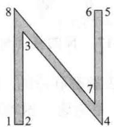  
图2-15 常规的N

除 D 以外，还要说明哪些顶点用线相连，但我们省略这些细节.

图形对象使用一组直线线段描述的主要原因是，计算机图形学中标准变换把线段映射成为其他线段。（例如，见1.8节习题27.）当描述这些对象的顶点被变换以后，它们的图像可以用适当的直线连接起来以得到原来对象的完整图像。
</Example>

<Example title="例 2">
给定 $A = \begin{bmatrix} 1 & 0.25 \\ 0 & 1 \end{bmatrix}$ 描述剪切变换 $\pmb{x} \mapsto A\pmb{x}$ 对例1中字母N的作用.

<Solution title="解">
由矩阵乘法的定义，乘积 AD 的各列给出字母 N 各顶点的像.

$$
A D = \left[ \begin{array}{c c c c c c c c} 0 & 0. 5 & 2. 1 0 5 & 6 & 8 & 7. 5 & 5. 8 9 5 & 2 \\ 0 & 0 & 6. 4 2 0 & 0 & 8 & 8 & 1. 5 8 0 & 8 \end{array} \right]
$$

变换过的顶点画在图 2-16 中，同时还画上相应于原来图形中连线的线段.

图 2-16 中斜体的 N 看来有些太宽，为此，我们用倍乘变换作用于点的 x 坐标使它变窄.

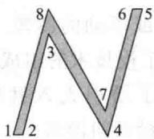  
图2-16 斜体的N
</Solution>
</Example>

<Example title="例 3">
先作如例2的剪切变换，然后再把 $x$ 坐标乘以一个因子0.75，求此复合变换的矩阵.解 把每个点的 $x$ 坐标乘以0.75的矩阵为

$$
S = \left[ \begin{array}{l l} 0. 7 5 & 0 \\ 0 & 1 \end{array} \right]
$$

所以复合变换的矩阵是

$$
S A = \left[ \begin{array}{l l} 0. 7 5 & 0 \\ 0 & 1 \end{array} \right] \left[ \begin{array}{l l} 1 & 0. 2 5 \\ 0 & 1 \end{array} \right] = \left[ \begin{array}{l l} 0. 7 5 & 0. 1 8 7 5 \\ 0 & 1 \end{array} \right]
$$

复合变换的结果如图 2-17 所示.

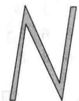  
图2-17 N的复合变换

计算机图形学中的数学是与矩阵乘法紧密联系的。但是，屏幕上的物体的平移并不直接对应于矩阵乘法，因为平移并非线性变换。避免这一困难的标准办法是引入所谓的齐次坐标。
</Example>

## 齐次坐标

$\mathbb{R}^2$ 中每个点 $(x,y)$ 可以对应于 $\mathbb{R}^3$ 中的点 $(x,y,1)$ ，它们位于 $xy$ 平面上方1单位的平面上。我们称 $(x,y)$ 有齐次坐标 $(x,y,1)$ 。例如，点 $(0,0)$ 的齐次坐标为 $(0,0,1)$ 。点的齐次坐标不能相加，也不能乘以数，但它们可以乘以 $3\times 3$ 矩阵来做变换。

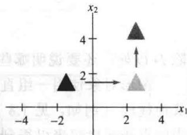  
沿 $\begin{bmatrix}4\\ 3\end{bmatrix}$ 方向平移

<Example title="例 4">
形如 $(x, y) \mapsto (x + h, y + k)$ 的平移可以用齐次坐标写成 $(x, y, 1) \mapsto (x + h, y + k, 1)$ ，这个变换可用矩阵乘法来实现：

$$
\left[ \begin{array}{c c c} 1 & 0 & h \\ 0 & 1 & k \\ 0 & 0 & 1 \end{array} \right] \left[ \begin{array}{l} x \\ y \\ 1 \end{array} \right] = \left[ \begin{array}{c} x + h \\ y + k \\ 1 \end{array} \right]
$$
</Example>

<Example title="例 5">
$\mathbb{R}^2$ 中任意线性变换可以通过齐次坐标乘以分块矩阵 $\begin{bmatrix} A & 0 \\ 0 & 1 \end{bmatrix}$ 实现，其中 $A$ 是 $2 \times 2$ 矩阵.典型的例子是：

$$
\left[ \begin{array}{c c c} \cos \varphi & - \sin \varphi & 0 \\ \sin \varphi & \cos \varphi & 0 \\ 0 & 0 & 1 \end{array} \right], \quad \left[ \begin{array}{c c c} 0 & 1 & 0 \\ 1 & 0 & 0 \\ 0 & 0 & 1 \end{array} \right]
$$

绕原点逆时针旋转角度 $\varphi$ 关于 $y = x$ 的对称

$$
\left[ \begin{array}{c c c} s & 0 & 0 \\ 0 & t & 0 \\ 0 & 0 & 1 \end{array} \right]
$$

x 乘以 s
y 乘以 t

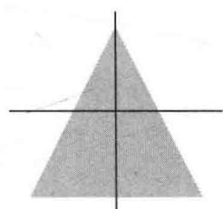  
原图
</Example>

## 复合变换

图形在计算机屏幕上的移动通常需要两个或多个基本变换. 这些变换的复合相应于在使用齐次坐标时进行矩阵相乘.

<Example title="例 6">
求出 $3 \times 3$ 矩阵，对应于先乘以 0.3 的倍乘变换，然后旋转 $90^{\circ}$ ，最后对图形的每个点的坐标加上 $(-0.5, 2)$ 做平移。见图 2-18。

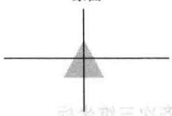

<Solution title="解">
当 $\varphi = \pi / 2$ 时， $\sin \varphi = 1, \cos \varphi = 0$ 。由例4和例5，我们有

$$
\left[ \begin{array}{c} {x} \\ {y} \\ {1} \end{array} \right] \xrightarrow {\text {缩小}} \left[ \begin{array}{c c c} {0. 3} & {0} & {0} \\ {0} & {0. 3} & {0} \\ {0} & {0} & {1} \end{array} \right] \left[ \begin{array}{c} {x} \\ {y} \\ {1} \end{array} \right]
$$

缩小后的图  
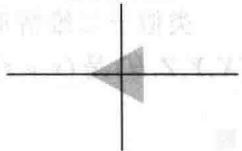

$$
\xrightarrow {\text {旋转}} \left[ \begin{array}{c c c} 0 & - 1 & 0 \\ 1 & 0 & 0 \\ 0 & 0 & 1 \end{array} \right] \left[ \begin{array}{c c c} 0. 3 & 0 & 0 \\ 0 & 0. 3 & 0 \\ 0 & 0 & 1 \end{array} \right] \left[ \begin{array}{c} x \\ y \\ 1 \end{array} \right]
$$

平移

$$
\left[ \begin{array}{c c c} 1 & 0 & - 0. 5 \\ 0 & 1 & 2 \\ 0 & 0 & 1 \end{array} \right] \left[ \begin{array}{c c c} 0 & - 1 & 0 \\ 1 & 0 & 0 \\ 0 & 0 & 1 \end{array} \right] \left[ \begin{array}{c c c} 0. 3 & 0 & 0 \\ 0 & 0. 3 & 0 \\ 0 & 0 & 1 \end{array} \right] \left[ \begin{array}{l} x \\ y \\ 1 \end{array} \right]
$$

旋转后的图  
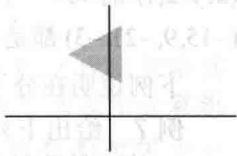  
平移后的图  
图2-18

所以复合变换的矩阵为

$$
\left[ \begin{array}{l l l} 1 & 0 & - 0. 5 \\ 0 & 1 & 2 \\ 0 & 0 & 1 \end{array} \right] \left[ \begin{array}{l l l} 0 & - 1 & 0 \\ 1 & 0 & 0 \\ 0 & 0 & 1 \end{array} \right] \left[ \begin{array}{l l l} 0. 3 & 0 & 0 \\ 0 & 0. 3 & 0 \\ 0 & 0 & 1 \end{array} \right] = \left[ \begin{array}{l l l} 0 & - 1 & - 0. 5 \\ 1 & 0 & 2 \\ 0 & 0 & 1 \end{array} \right] \left[ \begin{array}{l l l} 0. 3 & 0 & 0 \\ 0 & 0. 3 & 0 \\ 0 & 0 & 1 \end{array} \right] = \left[ \begin{array}{l l l} 0 & - 0. 3 & - 0. 5 \\ 0. 3 & 0 & 2 \\ 0 & 0 & 1 \end{array} \right]
$$
</Solution>
</Example>

## 三维计算机图形学

计算机图形学的最新和最激动人心的应用是分子建模。对三维图形学，生物学家可观察到模拟的蛋白质分子，并用以研究药物分子。生物学家可以旋转和平移一种实验药物的分子使它们附着于蛋白质分子。研究形象化的潜在的化学反应的能力对现代药物和癌症研究是很重要的。事实上，药物设计的进展依赖于计算机图形学构造有真实感的分子和它们的交互作用的仿真的

能力.

现在的分子建模的研究集中于虚拟现实，即一种环境，研究者在其中可以看到并且感觉药物分子渗入蛋白质分子。在图2-19中，这样的有实体感的反馈是由能够将力量可视化的远程控制器提供的。另一种虚拟现实的设计包括用一个头盔和手套来感觉头、手和手指的运动。头盔包含两个细小的计算机屏幕，每个眼睛一个，将此可视环境变得更为真实，这是对工程师、科学家与数学家更大的挑战。我们这里考虑的数学打开了这方面研究的大门。

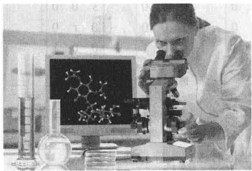  
图 2-19 虚拟现实中的分子建模

## 齐次三维坐标

类似于二维情形，我们称 $(x,y,z,1)$ 是 $\mathbb{R}^3$ 中点 $(x,y,z)$ 的齐次坐标．一般地，若 $H\neq 0$ ，则 $(X,Y,Z,H)$ 是 $(x,y,z)$ 的齐次坐标，且

$$
x = \frac {X}{H}, y = \frac {Y}{H}, z = \frac {Z}{H}\tag{1}
$$

$(x, y, z, 1)$ 的每一个非零的标量乘法得到一组 $(x, y, z)$ 的齐次坐标。例如 $(10, -6, 14, 2)$ 和 $(-15, 9, -21, -3)$ 都是 $(5, -3, 7)$ 的齐次坐标。

下例说明在分子建模中把一个药物分子移入蛋白质分子的变换.

<Example title="例 7">
给出下列变换的 $4 \times 4$ 矩阵.

a. 绕 $y$ 轴旋转 $30^{\circ}$ （习惯上，正角是从旋转轴（本例中是 $y$ 轴）的正半轴向原点看过去的逆时针方向的角）.

b. 沿向量 $p=(-6,4,5)$ 的方向平移.

<Solution title="解">
a. 首先构造 $3 \times 3$ 矩阵用于旋转. 向量 $\pmb{e}_{1}$ 向负 $z$ 轴旋转到 $(\cos 30^{\circ}, 0, -\sin 30^{\circ}) = (\sqrt{3} / 2, 0, -0.5)$ , 向量 $\pmb{e}_{2}$ 不变, $\pmb{e}_{3}$ 向正 $x$ 轴旋转到 $(\sin 30^{\circ}, 0, \cos 30^{\circ}) = (0.5, 0, \sqrt{3} / 2)$ . 见图2-20. 由1.9节, 这个旋转变换的标准矩阵为

$$
A = \left[ \begin{array}{c c c} \sqrt {3} / 2 & 0 & 0. 5 \\ 0 & 1 & 0 \\ - 0. 5 & 0 & \sqrt {3} / 2 \end{array} \right]
$$

所以齐次坐标的旋转矩阵为

$$
A = \left[ \begin{array}{c c c c} \sqrt {3} / 2 & 0 & 0. 5 & 0 \\ 0 & 1 & 0 & 0 \\ - 0. 5 & 0 & \sqrt {3} / 2 & 0 \\ 0 & 0 & 0 & 1 \end{array} \right]
$$

b. 我们希望 $(x, y, z, 1)$ 映射到 $(x - 6, y + 4, z + 5, 1)$ ，所求矩阵为

$$
\left[ \begin{array}{c c c c} 1 & 0 & 0 & - 6 \\ 0 & 1 & 0 & 4 \\ 0 & 0 & 1 & 5 \\ 0 & 0 & 0 & 1 \end{array} \right]
$$

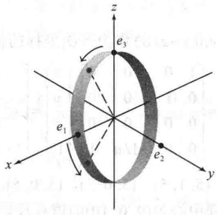  
图2-20
</Solution>
</Example>

## 透视投影

三维物体在二维计算机屏幕上的表示方法是把它投影在一个可视平面上。（我们忽略其他重要步骤，例如选择可视平面显示在屏幕上的部分。）为简单起见，设 $xy$ 平面表示计算机屏幕，假设某一观察者的眼睛向正 $z$ 轴看去，眼睛的位置是 $(0,0,d)$ 。透视投影把每个点 $(x,y,z)$ 映射为点 $(x^{*},y^{*},0)$ ，使这两点与观察者的眼睛位置（称为透视中心）在一条直线上，见图2-21（a）。

图 2-21a 中 xz 平面上的三角形画在（b）（显示线段长度）中，由相似三角形知

$$
\frac {x ^ {*}}{d} = \frac {x}{d - z}, x ^ {*} = \frac {d x}{d - z} = \frac {x}{1 - z / d}
$$

类似地，

$$
y ^ {*} = \frac {y}{1 - z / d}
$$

使用齐次坐标，可用矩阵表示透视投影，记此矩阵为 $P.(x,y,z,1)$ 映射为

$$
\left(\frac {x}{1 - z / d}, \frac {y}{1 - z / d}, 0, 1\right)
$$

比较式解释的结论

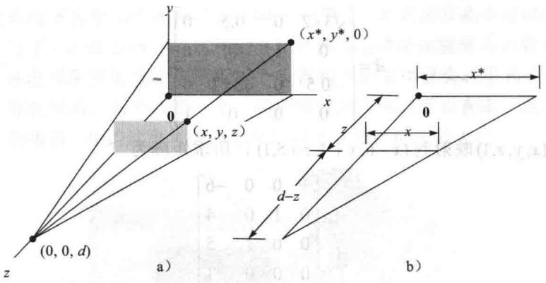  
图 2-21 由 $(x,y,z)$ 到 $(x^{*},y^{*},0)$ 的透视投影

把这个坐标乘以 $1 - z / d$ ，可用 $(x,y,0,1 - z / d)$ 作为齐次坐标的像.现在容易求出 $P$ .事实上

$$
P \left[ \begin{array}{l} x \\ y \\ z \\ 1 \end{array} \right] = \left[ \begin{array}{c c c c} 1 & 0 & 0 & 0 \\ 0 & 1 & 0 & 0 \\ 0 & 0 & 0 & 0 \\ 0 & 0 & - 1 / d & 1 \end{array} \right] \left[ \begin{array}{l} x \\ y \\ z \\ 1 \end{array} \right] = \left[ \begin{array}{c} x \\ y \\ 0 \\ 1 - z / d \end{array} \right]
$$

<Example title="例 8">
设 S 是顶点为 $(3,1,5)$ ， $(5,1,5)$ ， $(5,0,5)$ ， $(3,0,5)$ ， $(3,1,4)$ ， $(5,1,4)$ 及 $(3,0,4)$ 的长方体，如图 2-22 所示，求 S 在透视中心为 $(0,0,10)$ 的透视投影下的像.

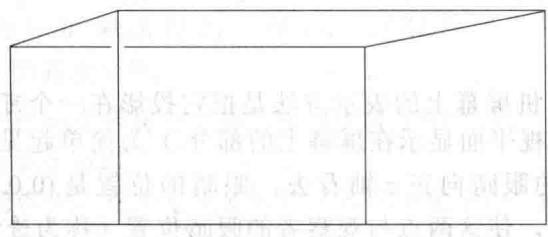  
图2-22 透视投影下的 $S$

<Solution title="解">
设 P 为投影矩阵，D 为使用齐次坐标的 S 的数据矩阵，则 S 的像的数据矩阵为

$$
P D = \left[ \begin{array}{c c c c} 1 & 0 & 0 & 0 \\ 0 & 1 & 0 & 0 \\ 0 & 0 & 0 & 0 \\ 0 & 0 & - 1 / 1 0 & 1 \end{array} \right] \left[ \begin{array}{c c c c c c c c} 3 & 5 & 5 & 3 & 3 & 5 & 5 & 3 \\ 1 & 1 & 0 & 0 & 1 & 1 & 0 & 0 \\ 5 & 5 & 5 & 5 & 4 & 4 & 4 & 4 \\ 1 & 1 & 1 & 1 & 1 & 1 & 1 & 1 \end{array} \right] = \left[ \begin{array}{c c c c c c c c} 3 & 5 & 5 & 3 & 3 & 5 & 5 & 3 \\ 1 & 1 & 0 & 0 & 1 & 1 & 0 & 0 \\ 0 & 0 & 0 & 0 & 0 & 0 & 0 & 0 \\ 0. 5 & 0. 5 & 0. 5 & 0. 5 & 0. 6 & 0. 6 & 0. 6 & 0. 6 \end{array} \right]
$$

为得到 $\mathbb{R}^3$ 坐标，使用例7前面的（1）式，把每一列的前3个元素除以第4行的对应元素，得到

$$
\left[ \begin{array}{c c c c c c c c} 6 & 1 0 & 1 0 & 6 & 5 & 8. 3 & 8. 3 & 5 \\ 2 & 2 & 0 & 0 & 1. 7 & 1. 7 & 0 & 0 \\ 0 & 0 & 0 & 0 & 0 & 0 & 0 & 0 \end{array} \right]
$$

本教材的网页上有计算机图形学的有趣应用，包括对透视投影的进一步讨论。网上的一个计算机项目与简单的动画有关。

数值计算的注解 图形化三维物体的连续移动需要计算大量的 $4 \times 4$ 矩阵，特别地，当渲染曲面使其光滑时，可使它更有实体感，并有适当的光线。高档图形工作站有 $4 \times 4$ 矩阵运算及图形算法嵌入于芯片和电路中，这样的工作站可以每秒做数十亿次矩阵乘法以实现三维游戏程序中有真实感的颜色的变化。
</Solution>
</Example>

## 进一步阅读

James D. Foley, Andries van Dam, Steven K. Feiner, and John F. Hughes, Computer Graphics: Principles and Practice, 3rd ed. (Boston, MA: Addison-Wesley, 2002), Chapters 5 and 6.

<Block title="练习题">
图形绕 $\mathbb{R}^2$ 中一点 $p$ 的旋转是这样实现的：首先把图形平移 $-p$ ，然后绕原点旋转，最后平移回去 $p$ 见图2-23.使用齐次坐标构造绕点(-2,6)旋转- $30^{\circ}$ 的 $3\times 3$ 矩阵.

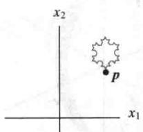  
a）原图

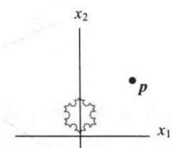  
b）朝原点平移-p

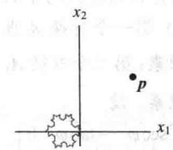  
c）绕原点旋转

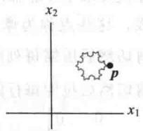  
d）平移回去 $\pmb{p}$  
图 2-23 图形绕点 p 旋转
</Block>

<Block title="习题2.7">
1. 哪一个 $3 \times 3$ 矩阵对 $\mathbb{R}^2$ 齐次坐标的作用与例2中的剪切变换矩阵 $A$ 相同？

2. 用矩阵乘法求出由数据矩阵 $D = \begin{bmatrix} 5 & 2 & 4 \\ 0 & 2 & 3 \end{bmatrix}$ 确定的三角形在关于 $y$ 轴的对称变换下的像. 画出原来的三角形和它的像.

习题 3\~8 中，求出产生所述复合二维变换的 $3 \times 3$ 矩阵，用齐次坐标.

3. 先沿(3,1)方向平移，然后绕原点旋转 $45^{\circ}$ .

4. 先沿 $(-2,3)$ 方向平移，然后把x坐标乘0.8，y坐标乘1.2.

5. 先关于 $x$ 轴对称，然后绕原点旋转 $30^{\circ}$

6. 先绕原点旋转 $30^{\circ}$ ，再关于 $x$ 轴对称。

7. 绕点(6,8)旋转 $60^{\circ}$ .

8. 绕点(3,7)旋转 $45^{\circ}$ .

9. $2 \times 200$ 的数据矩阵 $D$ 包含 200 个点的坐标。要把这些点用 $2 \times 2$ 的任意矩阵 $A$ 和 $B$ 变换，需要多少次乘法？考虑两种方法 $A(BD)$ 和 $(AB)D$ ，讨论你的结果对计算机图形学计算的含义。

10. 考虑下列几何二维变换：D 是拉伸变换（x 轴坐标与 y 轴坐标同时乘一个数），R 是旋转变换，T 是平移变换。D 是否与 R 可交换？即是否对 $R^{2}$ 中一切 x 有 $D(R(x)) = R(D(x))$ ？D 是否与 T 可交换？R 是否与 T 可交换？

11. 计算机屏幕上的一个旋转变化有时可用两个剪切-拉伸变换的复合来实现，这样可以加快计算从而确定某一图像如何以屏幕像素显示在计算机屏幕上。（屏幕由按行和列排列的小的点组成，这些点称为像素。）第一个变换 $A_{1}$ 垂直地剪切然后压缩每列的像素；第二个变换 $A_{2}$ 水平剪切然后拉伸每行的像素。设

$$
A _ {1} = \left[ \begin{array}{c c c} 1 & 0 & 0 \\ \sin \varphi & \cos \varphi & 0 \\ 0 & 0 & 1 \end{array} \right], A _ {2} = \left[ \begin{array}{c c c} \sec \varphi & - \tan \varphi & 0 \\ 0 & 1 & 0 \\ 0 & 0 & 1 \end{array} \right]
$$

证明：这两个变换的复合是 $\mathbb{R}^2$ 中的旋转变换.

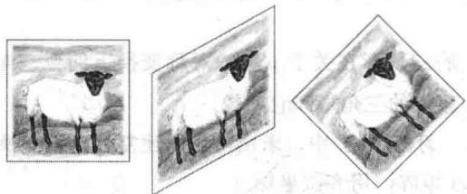

12. $\mathbb{R}^2$ 中的旋转变换通常需要4次乘法，计算下面的乘积，证明：一个旋转矩阵可以分解为三个剪切变换的乘积（每一个剪切变换只需作一次乘法）.

$$
\left[ \begin{array}{c c c} 1 & - \tan \varphi / 2 & 0 \\ 0 & 1 & 0 \\ 0 & 0 & 1 \end{array} \right] \left[ \begin{array}{c c c} 1 & 0 & 0 \\ \sin \varphi & 1 & 0 \\ 0 & 0 & 1 \end{array} \right] \left[ \begin{array}{c c c} 1 & - \tan \varphi / 2 & 0 \\ 0 & 1 & 0 \\ 0 & 0 & 1 \end{array} \right]
$$

13. 通常二维计算机图形的齐次坐标变换涉及形如 $\left[ \begin{array}{cc}A & p\\ \mathbf{0}^{\mathrm{T}} & 1 \end{array} \right]$ 的 $3\times 3$ 矩阵，其中 $A$ 为 $2\times 2$ 矩阵， $p$ 是 $\mathbb{R}^2$ 中的向量。证明这样一个变换等同于在 $\mathbb{R}^2$ 中的一个线性变换之后再作一个平移。（提示：求出包含分块矩阵的一个适当的矩阵因式分解。）

14. 证明：习题7中的变换等价于绕原点的一个旋转之后再沿方向 $p$ 平移，求出向量 $p$ .

15. $\mathbb{R}^3$ 中什么向量有齐次坐标 $(1 / 2, -1 / 4, 1 / 8, 1 / 24)$ ?

16. $(1, -2, 3, 4)$ 与 $(10, -20, 30, 40)$ 是 $\mathbb{R}^3$ 中同一个点的齐次坐标吗？为什么？

17. 给出一个 $4 \times 4$ 矩阵，它将 $\mathbb{R}^3$ 中的点绕 $x$ 轴逆时针旋转 $60^\circ$ .

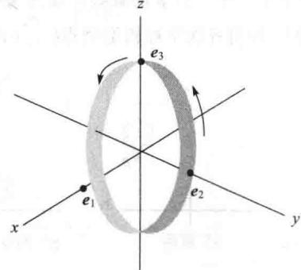

18. 给出 $4 \times 4$ 矩阵，它将 $\mathbb{R}^3$ 中的点绕 $z$ 轴旋转 $-30^\circ$ ，然后沿 $p = (5, -2, 1)$ 方向平移.

19. 设 S 是顶点为 $(4.2,1.2,4)$ ， $(6,4,2)$ ， $(2,2,6)$ 的三角形，求出透视中心在 $(0,0,10)$ 处时 S 的透视投影的像.

20. 设 S 是顶点为 $(9,3,-5)$ ， $(12,8,2)$ ， $(1.8,2.7,1)$ 的三角形，求出透视中心在 $(0,0,10)$ 处时 S 的透视投影的像.

习题 21 和习题 22 考虑在计算机图形学中显示颜色的设置方法. 计算机屏幕上的颜色是由3个数 $(R,G,B)$ 确定的，它列出电子枪射击到屏幕上的红、绿、蓝荧光点的能量的大小。（第4个数说明颜色的亮度或强度）

21. [M] 观察者在屏幕上看到的实际颜色是由屏幕上荧光点的数量与类型决定的。每个计算机显示器制造商必须在数据 (R, G, B) 和使用三原色 X, Y, Z 的国际 CIE 颜色标准之间转换。一种对持续时间短暂的荧光的转换是

$$
\left[ \begin{array}{l l l} 0. 6 1 & 0. 2 9 & 0. 1 5 0 \\ 0. 3 5 & 0. 5 9 & 0. 0 6 3 \\ 0. 0 4 & 0. 1 2 & 0. 7 8 7 \end{array} \right] \left[ \begin{array}{l} R \\ G \\ B \end{array} \right] = \left[ \begin{array}{l} X \\ Y \\ Z \end{array} \right]
$$

计算机程序将传送颜色信息光束到屏幕上，使用标准 CIE 数据 $(X,Y,Z)$ . 求把这些数据转换为屏幕电子枪所需的 $(R,G,B)$ 数据的方程.

22. [M]商业电视的信号广播用向量 $(Y,I,Q)$ 描述每一种颜色. 若屏幕是黑白的, 则只使用 Y 坐标. (它给出比用 CIE 颜色数据更好的单色图像.) YIQ 与 “标准” 的 RGB 颜色的对应关系是

$$
\left[ \begin{array}{l} Y \\ I \\ Q \end{array} \right] = \left[ \begin{array}{c c c} 0. 2 9 9 & 0. 5 8 7 & 0. 1 1 4 \\ 0. 5 9 6 & - 0. 2 7 5 & - 0. 3 2 1 \\ 0. 2 1 2 & - 0. 5 2 8 & 0. 3 1 1 \end{array} \right] \left[ \begin{array}{l} R \\ G \\ B \end{array} \right]
$$

（显示器制造商将改变矩阵元素使之适合它的RGB屏幕.）求出由电视台发送的YIQ数据转换为电视机屏幕所需的RGB数据的方程.
</Block>

<Block title="练习题答案">
从右向左将这三个变换对应的矩阵组合在一起 使用 $p = (-2,6), \cos(-30^\circ) = \sqrt{3}/2, \sin(-30^\circ) = -0.5$ ，我们有

$$
\begin{array}{r} {\text {平移}   p \qquad \qquad \text {绕原点旋转} \qquad \qquad \text {平移} - p} \\ {\left[ \begin{array}{c c c} {1} & {0} & {- 2} \\ {0} & {1} & {6} \\ {0} & {0} & {1} \end{array} \right] \left[ \begin{array}{c c c} {\sqrt {3} / 2} & {1 / 2} & {0} \\ {- 1 / 2} & {\sqrt {3} / 2} & {0} \\ {0} & {0} & {1} \end{array} \right] \left[ \begin{array}{c c c} {1} & {0} & {2} \\ {0} & {1} & {- 6} \\ {0} & {0} & {1} \end{array} \right] = \left[ \begin{array}{c c c} {\sqrt {3} / 2} & {1 / 2} & {\sqrt {3} - 5} \\ {- 1 / 2} & {\sqrt {3} / 2} & {- 3 \sqrt {3} + 5} \\ {0} & {0} & {1} \end{array} \right]} \end{array}
$$
</Block>
