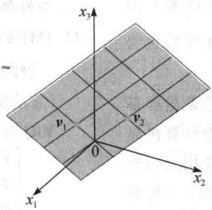
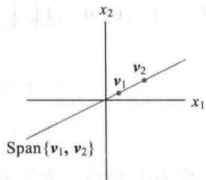
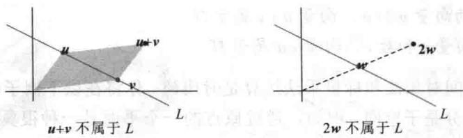
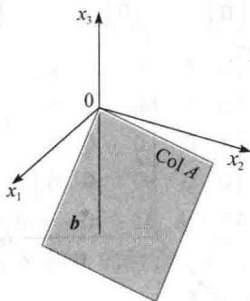
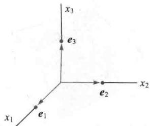
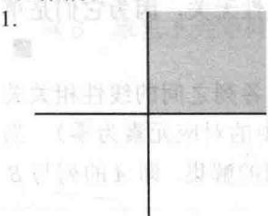
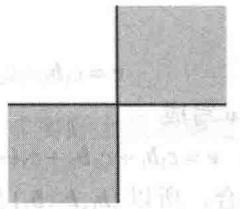
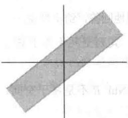
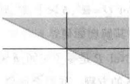

import Guide from '@/components/Guide.astro';
import Knowledge from '@/components/Knowledge.astro';
import Example from '@/components/Example.astro';
import Analysis from '@/components/Analysis.astro';
import Solution from '@/components/Solution.astro';
import Variant from '@/components/Variant.astro';
import Note from '@/components/Note.astro';
import Block from '@/components/Block.astro';
import Method from '@/components/Method.astro';
import Exercise from '@/components/Exercise.astro';

本节讨论 $R^{n}$ 中重要的向量子集，称为子空间。通常子空间与某个矩阵 A 有关，它们提供了关于方程 Ax = b 的有用信息。本节的概念和术语将在本书以下部分经常出现。 ①

定义 $R^{n}$ 中的一个子空间是 $R^{n}$ 中的集合 H，具有以下三个性质：

a. 零向量属于 H.

b. 对 H 中任意的向量 u 和 v，向量 $u + v$ 属于 H.

c. 对 H 中任意向量 u 和数 c，向量 cu 属于 H.

换句话说，子空间对加法和标量乘法运算是封闭的。你将在以下例子中看到，第1章中所讨论的向量集合大部分是子空间。例如，通过原点的一个平面是一种很典型的子空间，可以看

作例 1 中子空间的一种实例. 见图 2-24.

  
图 2-24 Span $\{v_{1}, v_{2}\}$ 是通过原点的平面

<Example title="例 1">
若 $\pmb{v}_{1}$ 和 $\pmb{v}_{2}$ 是 $\mathbb{R}^n$ 中的向量， $H = \mathrm{Span}\{\pmb{v}_1, \pmb{v}_2\}$ ，则 $H$ 是 $\mathbb{R}^n$ 的子空间。为证明这一点，注意零向量属于 $H$ （因 $0\pmb{v}_{1} + 0\pmb{v}_{2}$ 是 $\pmb{v}_{1}$ 和 $\pmb{v}_{2}$ 的线性组合），现取 $H$ 中任意两个向量，比如说

$$
\boldsymbol {u} = s _ {1} \boldsymbol {v} _ {1} + s _ {2} \boldsymbol {v} _ {2}, \boldsymbol {v} = t _ {1} \boldsymbol {v} _ {1} + t _ {2} \boldsymbol {v} _ {2},
$$

那么

$$
\boldsymbol {u} + \boldsymbol {v} = (s _ {1} + t _ {1}) \boldsymbol {v} _ {1} + (s _ {2} + t _ {2}) \boldsymbol {v} _ {2}
$$

这证明了 $u+v$ 是 $v_{1}$ 和 $v_{2}$ 的线性组合，因此属于 H．同样，对任意数 c，向量 cu 属于 H，因为 $cu = c(s_{1}v_{1} + s_{2}v_{2}) = (cs_{1})v_{1} + (cs_{2})v_{2}$ .

若 $v_{1}$ 不等于零而 $v_{2}$ 是 $v_{1}$ 的倍数，则 $v_{1}$ 和 $v_{2}$ 仅生成通过原点的直线。所以通过原点的直线是子空间的另一个例子。见图 2-25。

  
图2-25 $\pmb{\nu}_{1}\neq 0,\pmb{\nu}_{2} = k\pmb{\nu}_{1}$
</Example>

<Example title="例 2">
不通过原点的一条直线 $L$ 不是子空间，因它不包括原点，同样，图2-26说明 $L$ 在加法或标量乘法下不是封闭的.

  
图2-26
</Example>

<Example title="例 3">
设 $v_{1},\cdots,v_{p}$ 属于 $R^{n}$ ， $v_{1},\cdots,v_{p}$ 的所有线性组合是 $R^{n}$ 的子空间，这一结论的证明与例 1

中类似，我们称 $Span\{\nu_{1},\cdots,\nu_{p}\}$ 为由 $\nu_{1},\cdots,\nu_{p}$ 生成（或张成）的子空间.
</Example>

<Note>
$\mathbb{R}^n$ 是它本身的子空间，因为三个性质都满足。另一个特殊的子空间是仅含零向量的集合，它也满足子空间的条件，称为零子空间。

矩阵的列空间与零空间

应用中， $\mathbb{R}^n$ 的子空间通常出现在以下两种情况中，它们都与矩阵有关.

定义 矩阵 A 的列空间是 A 的各列的线性组合的集合，记作 Col A.

若 $A = [a_{1} \cdots a_{n}]$ ，它们各列属于 $R^{m}$ ，则 Col A 和 Span $\{a_{1}, \cdots, a_{n}\}$ 相同，例 4 说明 $m \times n$ 矩阵的列空间是 $R^{m}$ 的子空间。注意，仅当 A 的列生成 $R^{m}$ 时，Col A 等于 $R^{m}$ 。否则，Col A 仅是 $R^{m}$ 的一部分。
</Note>

<Example title="例 4">
设 $A = \begin{bmatrix} 1 & -3 & -4 \\ -4 & 6 & -2 \\ -3 & 7 & 6 \end{bmatrix}, \boldsymbol{b} = \begin{bmatrix} 3 \\ 3 \\ -4 \end{bmatrix}$ ，确定 $\pmb{b}$ 是否属于 $A$ 的列空间.

<Solution title="解">
向量 b 是 A 的各列的线性组合，当且仅当 b 可写成 Ax 的形式，其中 x 属于 $R^{3}$ ，也就是说，当且仅当方程 Ax = b 有解。把增广矩阵 [A b] 进行行化简：

$$
\left[ \begin{array}{r r r r} 1 & - 3 & - 4 & 3 \\ - 4 & 6 & - 2 & 3 \\ - 3 & 7 & 6 & - 4 \end{array} \right] \sim \left[ \begin{array}{r r r r} 1 & - 3 & - 4 & 3 \\ 0 & - 6 & - 1 8 & 1 5 \\ 0 & - 2 & - 6 & 5 \end{array} \right] \sim \left[ \begin{array}{r r r r} 1 & - 3 & - 4 & 3 \\ 0 & - 6 & - 1 8 & 1 5 \\ 0 & 0 & 0 & 0 \end{array} \right]
$$

可知 Ax=b 相容，从而 b 属于 Col A.

例 4 的解答说明，当线性方程组写成 Ax=b 的形式时，A 的列空间是所有使方程组有解的向量 b 的集合.

定义 矩阵 A 的零空间是齐次方程 Ax = 0 的所有解的集合，记为 Nul A.

当 $A$ 有 $n$ 列时， $Ax = 0$ 的解属于 $\mathbb{R}^n$ ， $A$ 的零空间是 $\mathbb{R}^n$ 的子集。事实上， $\operatorname{Nul} A$ 具有 $\mathbb{R}^n$ 的子空间的性质。
</Solution>
</Example>

<Knowledge title="定理 12">
$m \times n$ 矩阵 A 的零空间是 $R^{n}$ 的子空间. 等价地, n 个未知数的 m 个齐次线性方程的方程组 Ax = 0 的所有解的集合是 $R^{n}$ 的子空间.

<Solution title="证明">
零向量属于Nul $A$ （因 $A0 = 0$ ）．为证明Nul $A$ 满足其他两个性质，取Nul $A$ 中两个向

量 $\pmb{u}$ 和 $\pmb{v}$ ，即设 $A\pmb{u} = \mathbf{0}$ 和 $A\pmb{v} = \mathbf{0}$ 。那么由矩阵乘法的性质，

$$
A (\boldsymbol {u} + \boldsymbol {v}) = A \boldsymbol {u} + A \boldsymbol {v} = \mathbf {0} + \mathbf {0} = \mathbf {0}
$$

于是 $u+v$ 满足 Ax=0，所以 $u+v$ 属于 Nul A．同样，对任意数 c， $A(cu)=c(Au)=c(0)=0$ ，这就证明了 cu 也属于 Nul A.

为检验给定向量 v 是否属于 Nul A，只要计算 Av，看它是否为零向量。因 Nul A 是用其中每个向量必须满足的一个条件来描述的，所以说零空间是隐式定义的。相反，列空间是显式定义的，因 Col A 中的向量可由 A 的各列（利用线性组合）构造出来。为了建立 Nul A 的显式描述，解 Ax=0 这个方程，把解写成参数向量形式。（见下面的例 6。） ①
</Solution>
</Knowledge>

## 子空间的基

因为子空间一般含有无穷多个向量，故子空间中的问题最好能够通过研究生成这个子空间的一个小的有限集合来解决，这个集合越小越好.可以证明，最小可能的生成集合必是线性无关的.

定义 $\mathbb{R}^n$ 中子空间 $H$ 的一组基是 $H$ 中一个线性无关集，它生成 $H$ .

<Example title="例 5">
可逆 $n \times n$ 矩阵的各列构成 $R^{n}$ 的一组基，因为它们线性无关，而且生成 $R^{n}$ ，这由逆矩阵定理可知。一个这样的矩阵是 $n \times n$ 单位矩阵，它的各列用 $e_{1}, \cdots, e_{n}$ 表示：

$$
\boldsymbol {e} _ {1} = \left[ \begin{array}{l} 1 \\ 0 \\ \vdots \\ 0 \end{array} \right], \boldsymbol {e} _ {2} = \left[ \begin{array}{l} 0 \\ 1 \\ \vdots \\ 0 \end{array} \right], \dots , \boldsymbol {e} _ {n} = \left[ \begin{array}{l} 0 \\ \vdots \\ 0 \\ 1 \end{array} \right]
$$

$\{e_{1},\cdots,e_{n}\}$ 称为 $R^{n}$ 的标准基. 见图 2-27.

  
图2-27 $\mathbb{R}^3$ 的标准基

下例说明，求出方程 Ax=0 的解集的参数向量形式实际上就是确定 Nul A 的基，这一事实将在第 5 章应用.
</Example>

<Example title="例 6">
求出下列矩阵的零空间的基.

$$
A = \left[ \begin{array}{r r r r r} - 3 & 6 & - 1 & 1 & - 7 \\ 1 & - 2 & 2 & 3 & - 1 \\ 2 & - 4 & 5 & 8 & - 4 \end{array} \right]
$$

<Solution title="解">
首先把方程 Ax = 0 的解写成参数向量形式:

$$
[ A \quad \mathbf {0} ] \sim \left[ \begin{array}{c c c c c c} 1 & - 2 & 0 & - 1 & 3 & 0 \\ 0 & 0 & 1 & 2 & - 2 & 0 \\ 0 & 0 & 0 & 0 & 0 & 0 \end{array} \right], \quad x _ {1} - 2 x _ {2} \quad - x _ {4} + 3 x _ {5} = 0 \quad x _ {3} + 2 x _ {4} - 2 x _ {5} = 0 \quad 0 = 0
$$

通解为 $x_{1} = 2x_{2} + x_{4} - 3x_{5}, x_{3} = -2x_{4} + 2x_{5}, x_{2}, x_{4}, x_{5}$ 为自由变量.

$$
\left[ \begin{array}{c} x _ {1} \\ x _ {2} \\ x _ {3} \\ x _ {4} \\ x _ {5} \end{array} \right] = \left[ \begin{array}{c} 2 x _ {2} + x _ {4} - 3 x _ {5} \\ x _ {2} \\ - 2 x _ {4} + 2 x _ {5} \\ x _ {4} \\ x _ {5} \end{array} \right] = x _ {2} \left[ \begin{array}{c} 2 \\ 1 \\ 0 \\ 0 \\ 0 \end{array} \right] + x _ {4} \left[ \begin{array}{c} 1 \\ 0 \\ - 2 \\ 1 \\ 0 \end{array} \right] + x _ {5} \left[ \begin{array}{c} - 3 \\ 0 \\ 2 \\ 0 \\ 1 \end{array} \right]\tag{1}
$$

$$
= x _ {2} \boldsymbol {u} + x _ {4} \boldsymbol {v} + x _ {5} \boldsymbol {w}
$$

方程（1）说明Nul $A$ 与 $\pmb {u},\pmb {v},\pmb{w}$ 的所有线性组合的集合是一致的，即 $\{\pmb {u},\pmb {v},\pmb{w}\}$ 生成Nul $A$ ，事实上， $\pmb {u},\pmb {v},\pmb{w}$ 的构造保证了它们线性无关，因为（1）式说明，

$$
\mathbf {0} = x _ {2} \mathbf {u} + x _ {4} \mathbf {v} + x _ {5} \mathbf {w}
$$

仅当权 $x_{2}, x_{4}, x_{5}$ 等于零时成立。（观察向量 $x_{2}u + x_{4}v + x_{5}w$ 的第2，4，5个元素。）因此 $\{u, v, w\}$ 是Nul $A$ 的一组基。

求矩阵的列空间的基比求零空间的基容易. 然而, 这个方法需要一些说明, 我们从一个简单情形开始.
</Solution>
</Example>

<Example title="例 7">
求下列矩阵的列空间的基:

$$
B = \left[ \begin{array}{c c c c c} 1 & 0 & - 3 & 5 & 0 \\ 0 & 1 & 2 & - 1 & 0 \\ 0 & 0 & 0 & 0 & 1 \\ 0 & 0 & 0 & 0 & 0 \end{array} \right]
$$

<Solution title="解">
用 $b_{1},\cdots,b_{5}$ 表示 B 的列，注意 $b_{3}=-3b_{1}+2b_{2},b_{4}=5b_{1}-b_{2}$ . $b_{3}$ 和 $b_{4}$ 是主元列的组合，这意味着 $b_{1},\cdots,b_{5}$ 的任意组合实际上仅是 $b_{1},b_{2}$ 和 $b_{5}$ 的组合. 事实上，若 v 是 Col B 的任意向量，比如说，

$$
\boldsymbol {v} = c _ {1} \boldsymbol {b} _ {1} + c _ {2} \boldsymbol {b} _ {2} + c _ {3} \boldsymbol {b} _ {3} + c _ {4} \boldsymbol {b} _ {4} + c _ {5} \boldsymbol {b} _ {5}
$$

则把 $b_{3}$ 和 $b_{4}$ 代入，可把 v 写成

$$
\boldsymbol {v} = c _ {1} \boldsymbol {b} _ {1} + c _ {2} \boldsymbol {b} _ {2} + c _ {3} (- 3 \boldsymbol {b} _ {1} + 2 \boldsymbol {b} _ {2}) + c _ {4} (5 \boldsymbol {b} _ {1} - \boldsymbol {b} _ {2}) + c _ {5} \boldsymbol {b} _ {5}
$$

它是 $b_{1},b_{2}$ 和 $b_{5}$ 的线性组合，所以 $\{b_{1},b_{2},b_{3}\}$ 生成Col B．又 $b_{1},b_{2}$ 和 $b_{5}$ 为线性无关，因为它们是单位矩阵的列，所以B的主元列构成Col B的基.

例 7 中的矩阵 B 是简化阶梯形. 为处理一个一般的矩阵 A，回顾 A 的各列之间的线性相关关系可表示为形式 Ax = 0（若某些列不含在特殊的线性相关关系中，则 x 中的对应元素为零）. 当 A 行化简为阶梯形 B 时，它的列虽然改变，但方程 Ax = 0 和 Bx = 0 有相同的解集. 即 A 的列与 B 的列有相同的线性相关关系.
</Solution>
</Example>

<Example title="例 8">
可以证明矩阵

$$
A = \left[ \begin{array}{l l l l} \boldsymbol {a} _ {1} & \boldsymbol {a} _ {2} & \dots & \boldsymbol {a} _ {5} \end{array} \right] = \left[ \begin{array}{r r r r r} 1 & 3 & 3 & 2 & - 9 \\ - 2 & - 2 & 2 & - 8 & 2 \\ 2 & 3 & 0 & 7 & 1 \\ 3 & 4 & - 1 & 1 1 & - 8 \end{array} \right]
$$

行等价于例 7 中的矩阵 B. 求 Col A 的一组基.

<Solution title="解">
由例7， $A$ 的主元列是第1，2，5列．同时有 $\pmb{b}_3 = -3\pmb{b}_1 + 2\pmb{b}_2$ 和 $\pmb{b}_4 = 5\pmb{b}_1 - \pmb{b}_2$ ，因行变换不影响矩阵的列之间的线性相关关系，故有

$$
\pmb {a} _ {3} = - 3 \pmb {a} _ {1} + 2 \pmb {a} _ {2} \text {和} \pmb {a} _ {4} = 5 \pmb {a} _ {1} - \pmb {a} _ {2}
$$

经验证这是成立的！由例7的讨论，生成 $A$ 的列空间不需要用 $\pmb{a}_3$ 和 $\pmb{a}_4$ 。同样， $\{\pmb{a}_1, \pmb{a}_2, \pmb{a}_5\}$ 必是线性无关的，因 $\pmb{a}_1, \pmb{a}_2, \pmb{a}_5$ 之间的任意线性相关关系必然也使 $\pmb{b}_1, \pmb{b}_2, \pmb{b}_5$ 有同样的关系。因 $\{\pmb{b}_1, \pmb{b}_2, \pmb{b}_5\}$ 线性无关， $\{\pmb{a}_1, \pmb{a}_2, \pmb{a}_5\}$ 也线性无关，因此是Col $A$ 的一组基。

例 8 的讨论可以用来证明下列定理.
</Solution>
</Example>

<Knowledge title="定理 13">
矩阵 A 的主元列构成 A 的列空间的基.
</Knowledge>

<Note>
小心，要用 $A$ 的主元列本身作为 $\operatorname{Col} A$ 的基，阶梯形 $B$ 的列通常并不在 $A$ 的列空间内。（例如在例7和例8中， $B$ 的列的最后一行都是零，不可能生成 $A$ 的列。）
</Note>

<Block title="练习题">
1. 设 $A = \begin{bmatrix} 1 & -1 & 5 \\ 2 & 0 & 7 \\ -3 & -5 & -3 \end{bmatrix}$ , $\pmb{u} = \begin{bmatrix} -7 \\ 3 \\ 2 \end{bmatrix}$ . $\pmb{u}$ 是否属于Nul $A$ ? $\pmb{u}$ 是否属于Col $A$ ? 给出理由.

2. 设 $A = \begin{bmatrix} 0 & 1 & 0 \\ 0 & 0 & 1 \\ 0 & 0 & 0 \end{bmatrix}$ ，求 $\operatorname{Nul} A$ 中的一个向量和 $\operatorname{Col} A$ 中的一个向量.

3. 设一个 $n \times n$ 矩阵 $A$ 是可逆的，则 $\operatorname{Nul} A$ 和 $\operatorname{Col} A$ 会如何？
</Block>

<Block title="习题2.8">
习题 1\~4 画的是 $R^{2}$ 中的子集. 假设这些集合包含边界线，说明这些集 H 不是 $R^{2}$ 的子空间的理由.（例如，找出 H 中两个向量，它们的和不属于 H，或求出 H 中一个向量，它的倍数不属于 H. 画出图形.）

2.

3.

4.

5. $v_{1}=\begin{bmatrix}2\\ 3\\ -5\end{bmatrix},v_{2}=\begin{bmatrix}-4\\ -5\\ 8\end{bmatrix},w=\begin{bmatrix}8\\ 2\\ -9\end{bmatrix}$ ，确定 w 是否属于

$\mathbb{R}^3$ 的由 $\pmb{\nu}_{1}$ 和 $\pmb{\nu}_{2}$ 生成的子空间.

$$
\boldsymbol {v} _ {1} = \left[ \begin{array}{r} 1 \\ - 2 \\ 4 \\ 3 \end{array} \right], \boldsymbol {v} _ {2} = \left[ \begin{array}{r} 4 \\ - 7 \\ 9 \\ 7 \end{array} \right], \boldsymbol {v} _ {3} = \left[ \begin{array}{r} 5 \\ - 8 \\ 6 \\ 5 \end{array} \right], \boldsymbol {u} = \left[ \begin{array}{r} - 4 \\ 1 0 \\ - 7 \\ - 5 \end{array} \right]
$$

$\pmb{u}$ 是否属于 $\mathbb{R}^4$ 中由 $\{\pmb{v}_1, \pmb{v}_2, \pmb{v}_3\}$ 生成的子空间.

7. $v_{1}=\begin{bmatrix}2\\ -8\\ 6\end{bmatrix},v_{2}=\begin{bmatrix}-3\\ 8\\ -7\end{bmatrix},v_{3}=\begin{bmatrix}-4\\ 6\\ -7\end{bmatrix},p=\begin{bmatrix}6\\ -10\\ 11\end{bmatrix},A=[v_{1}v_{2}v_{3}]\cdot$ a. $\{v_{1},v_{2},v_{3}\}$ 中有多少个向量？
b. Col A 中有多少个向量？
c. p 是否属于 Col A? 为什么？

8. 设 $v_{1}=\begin{bmatrix}-3\\0\\6\end{bmatrix},v_{2}=\begin{bmatrix}-2\\2\\3\end{bmatrix},v_{3}=\begin{bmatrix}0\\-6\\3\end{bmatrix},p=\begin{bmatrix}1\\14\\-9\end{bmatrix}$ ，确定

p 是否属于 Col A，其中 $A = [v_{1} v_{2} v_{3}]$ .

9. A 和 p 如习题 7，判断 p 是否属于 Nul A.

10. $u=\begin{bmatrix}-2\\3\\1\end{bmatrix}$ ，A 如习题 8，确定 u 是否属于 Nul A.

习题 11\~12 给出整数 p 和 q 使 Nul A 是 $R^{p}$ 的子空间，Col A 是 $R^{q}$ 的子空间.

11. $A=\begin{bmatrix}3&2&1&-5\\ -9&-4&1&7\\ 9&2&-5&1\end{bmatrix}$

12.

$$
A = \left[ \begin{array}{c c c} 1 & 2 & 3 \\ 4 & 5 & 7 \\ - 5 & - 1 & 0 \\ 2 & 7 & 1 1 \end{array} \right]
$$

13. A 如习题 11, 求 Nul A 和 Col A 中的一个非零向量.

14. $A$ 如习题 12，求 $\operatorname{Nul} A$ 和 $\operatorname{Col} A$ 中的一个非零向量.

习题 15\~20 中，确定哪个集是 $R^{2}$ 或 $R^{3}$ 的基. 验证你的答案.

15.

$$
\left[ \begin{array}{c} 5 \\ - 2 \end{array} \right], \left[ \begin{array}{c} 1 0 \\ - 3 \end{array} \right]
$$

16.

$$
\left[ \begin{array}{c} - 4 \\ 6 \end{array} \right], \left[ \begin{array}{c} 2 \\ - 3 \end{array} \right]
$$

17.

$$
\left[ \begin{array}{c} 0 \\ 1 \\ - 2 \end{array} \right], \left[ \begin{array}{c} 5 \\ - 7 \\ 4 \end{array} \right], \left[ \begin{array}{c} 6 \\ 3 \\ 5 \end{array} \right]
$$

18.

$$
\left[ \begin{array}{c} 1 \\ 1 \\ - 2 \end{array} \right], \left[ \begin{array}{c} - 5 \\ - 1 \\ 2 \end{array} \right], \left[ \begin{array}{c} 7 \\ 0 \\ - 5 \end{array} \right]
$$

19.

$$
\left[ \begin{array}{c} 3 \\ - 8 \\ 1 \end{array} \right], \left[ \begin{array}{c} 6 \\ 2 \\ - 5 \end{array} \right]
$$

20.

$$
\left[ \begin{array}{c} 1 \\ - 6 \\ - 7 \end{array} \right], \left[ \begin{array}{c} 3 \\ - 4 \\ 7 \end{array} \right], \left[ \begin{array}{c} - 2 \\ 7 \\ 5 \end{array} \right], \left[ \begin{array}{c} 0 \\ 8 \\ 9 \end{array} \right]
$$

在习题 21 和习题 22 中, 标出每个命题的真假. 验证你的答案.

21. a. $\mathbb{R}^n$ 的一个子空间是任一集 $H$ 满足（i）零向量属于 $H$ ，（ii） $\pmb{u},\pmb{v}$ 和 $\pmb {u} + \pmb{v}$ 属于 $H$ ，（iii） $c$ 是数，cu属于 $H$ ：

b. 若 $v_{1},\cdots,v_{p}$ 属于 $R^{n}$ ，则 Span $\{v_{1},\cdots,v_{p}\}$ 等价于矩阵 $[v_{1}\cdots v_{p}]$ 的列空间.

c. 一个 $m$ 行齐次线性方程组有 $n$ 个未知量，其全体解组成的集合是 $\mathbb{R}^m$ 的一个子空间.

d. 一个 $n \times n$ 可逆矩阵的列构成 $\mathbb{R}^n$ 的一组基.  
e. 行变换不改变矩阵的列之间的线性相关关系.

22. a. $R^{n}$ 中的子集 H 是一个子空间, 若零向量属于 H.
b. 给定 $R^{n}$ 中的向量 $v_{1}, \cdots, v_{p}$ ，这些向量的所有线性组合所构成的集合是 $R^{n}$ 的一个子空间.

c. 一个 $m \times n$ 矩阵的零空间是 $\mathbb{R}^n$ 的子空间.

d. 矩阵 A 的列空间是 Ax=b 的解的集合.

e. 若 B 是矩阵 A 的阶梯形, 则 B 的主元列构成 Col A 的一组基.

习题 23\~26 中，给出矩阵 A 和 A 的阶梯形，求出 Col A 和 Nul A 的基.

$$
A = \left[ \begin{array}{l l l l} 4 & 5 & 9 & - 2 \\ 6 & 5 & 1 & 1 2 \\ 3 & 4 & 8 & - 3 \end{array} \right] \sim \left[ \begin{array}{l l l l} 1 & 2 & 6 & - 5 \\ 0 & 1 & 5 & - 6 \\ 0 & 0 & 0 & 0 \end{array} \right]
$$

$$
A = \left[ \begin{array}{r r r r} - 3 & 9 & - 2 & - 7 \\ 2 & - 6 & 4 & 8 \\ 3 & - 9 & - 2 & 2 \end{array} \right] \sim \left[ \begin{array}{r r r r} 1 & - 3 & 6 & 9 \\ 0 & 0 & 4 & 5 \\ 0 & 0 & 0 & 0 \end{array} \right]
$$

$$
2 5. A = \left[ \begin{array}{r r r r r} 1 & 4 & 8 & - 3 & - 7 \\ - 1 & 2 & 7 & 3 & 4 \\ - 2 & 2 & 9 & 5 & 5 \\ 3 & 6 & 9 & - 5 & - 2 \end{array} \right] \sim \left[ \begin{array}{r r r r r} 1 & 4 & 8 & 0 & 5 \\ 0 & 2 & 5 & 0 & - 1 \\ 0 & 0 & 0 & 1 & 4 \\ 0 & 0 & 0 & 0 & 0 \end{array} \right]
$$

$$
2 6. A = \left[ \begin{array}{r r r r r} 3 & - 1 & 7 & 3 & 9 \\ - 2 & 2 & - 2 & 7 & 5 \\ - 5 & 9 & 3 & 3 & 4 \\ - 2 & 6 & 6 & 3 & 7 \end{array} \right] \sim \left[ \begin{array}{r r r r r} 3 & - 1 & 7 & 0 & 6 \\ 0 & 2 & 4 & 0 & 3 \\ 0 & 0 & 0 & 1 & 1 \\ 0 & 0 & 0 & 0 & 0 \end{array} \right]
$$

27. 构造一个 $3 \times 3$ 矩阵 $A$ 和一个非零向量 $\pmb{b}$ , 其中 $\pmb{b}$ 属于 $\operatorname{Col} A$ 但与 $A$ 的任一列都不同.

28. 构造一个 $3 \times 3$ 矩阵 $A$ 和一个非零向量 $\pmb{b}$ ，其中 $\pmb{b}$ 不属于 Col $A$ .

29. 构造一个 $3 \times 3$ 矩阵 $A$ 和一个非零向量 $\pmb{b}$ ，其中 $\pmb{b}$ 属于Nul $A$ .

30. 设矩阵 $A = [a_{1} \cdots a_{p}]$ 的各列线性无关,说明为什么 $\{a_{1}, \cdots, a_{p}\}$ 是 Col A 的一组基.

习题 31\~36 中, 尽可能全面地回答, 给出理由.

31. 设 $F$ 是 $5 \times 5$ 矩阵，其列空间不等于 $\mathbb{R}^5$ ，则Nul $F$ 会如何？

32. 若 R 是 $6 \times 6$ 矩阵，Nul R 不是零子空间，则 Col R 会如何？

33. 若 $Q$ 是 $4 \times 4$ 矩阵， $\operatorname{Col} Q = \mathbb{R}^4, b$ 属于 $\mathbb{R}^4$ ，则对形如 $Qx = b$ 的方程，其解会如何？

34. 若 $P$ 是 $5 \times 5$ 矩阵，Nul $P$ 是零子空间, $\pmb{b}$ 属于 $\mathbb{R}^5$ ，则对形如 $Px = b$ 的方程，其解会如何？

35. 若 $B$ 是 $5 \times 4$ 矩阵，有线性无关的列，则Nul $B$ 会如何？

36. 若 $m \times n$ 矩阵 $A$ 的各列构成 $\mathbb{R}^m$ 的一组基，则该矩阵的形状会如何？

[M]习题37和习题38中，求出给定矩阵 $A$ 的列空间和零空间．验证你的答案.

$$
A = \left[ \begin{array}{r r r r r} 3 & - 5 & 0 & - 1 & 3 \\ - 7 & 9 & - 4 & 9 & - 1 1 \\ - 5 & 7 & - 2 & 5 & - 7 \\ 3 & - 7 & - 3 & 4 & 0 \end{array} \right]
$$

$$
A = \left[ \begin{array}{c c c c c} 5 & 2 & 0 & - 8 & - 8 \\ 4 & 1 & 2 & - 8 & - 9 \\ 5 & 1 & 3 & 5 & 1 9 \\ - 8 & - 5 & 6 & 8 & 5 \end{array} \right]
$$

1. 为确定 $\pmb{u}$ 是否属于Nul $A$ ，只需计算
</Block>

<Block title="练习题答案">
$$
A \boldsymbol {u} = \left[ \begin{array}{r r r} 1 & - 1 & 5 \\ 2 & 0 & 7 \\ - 3 & - 5 & - 3 \end{array} \right] \left[ \begin{array}{c} - 7 \\ 3 \\ 2 \end{array} \right] = \left[ \begin{array}{l} 0 \\ 0 \\ 0 \end{array} \right]
$$

结果显示 $\pmb{u}$ 属于Nul $A$ .要确定 $\pmb{u}$ 是否属于Col $A$ 需要做更多的工作.化简增广矩阵[A u]为阶梯形来判断方程 $Ax = u$ 是否相容：

$$
\left[ \begin{array}{r r r r} 1 & - 1 & 5 & - 7 \\ 2 & 0 & 7 & 3 \\ - 3 & - 5 & - 3 & 2 \end{array} \right] \sim \left[ \begin{array}{r r r r} 1 & - 1 & 5 & - 7 \\ 0 & 2 & - 3 & 1 7 \\ 0 & - 8 & 1 2 & - 1 9 \end{array} \right] \sim \left[ \begin{array}{r r r r} 1 & - 1 & 5 & - 7 \\ 0 & 2 & - 3 & 1 7 \\ 0 & 0 & 0 & 4 9 \end{array} \right]
$$

方程 Ax = u 无解，因此 u 不属于 Col A.

2. 与练习题1相比，求Nul $A$ 的一个向量比判定一个给定的向量是否属于Nul $A$ 需要做更多的工作。但是，由于 $A$ 已经是阶梯形，因此方程 $Ax = 0$ 给出如果 $x = (x_{1}, x_{2}, x_{3})$ ，则 $x_{2} = 0, x_{3} = 0, x_{1}$ 是自由变量。因此，Nul $A$ 的一个基是 $\pmb{v} = (1, 0, 0)$ 。求Col $A$ 的一个向量是简单的，因为 $A$ 中的每一列都属于Col $A$ 。此外，同一个向量 $\pmb{v}$ 既属于Nul $A$ ，又属于Col $A$ 。对大部分 $n \times n$ 矩阵而言， $\mathbb{R}^{n}$ 中只有零向量是既属于Nul $A$ ，又属于Col $A$ 。

3. 如果 $A$ 是可逆的，则根据可逆矩阵定理， $A$ 的各列生成 $\mathbb{R}^n$ 。由定义可知，任何矩阵的列总是可以生成该矩阵的列空间，因此这里 $\operatorname{Col} A$ 就是全部的 $\mathbb{R}^n$ 。用符号表示就是 $\operatorname{Col} A = \mathbb{R}^n$ 。同时，因为 $A$ 是可逆的，故方程 $Ax = 0$ 只有平凡解。这意味着 $\operatorname{Nul} A$ 是零子空间，用符号表示就是 $\operatorname{Nul} A = \{\mathbf{0}\}$ 。
</Block>
