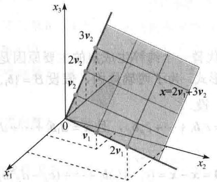
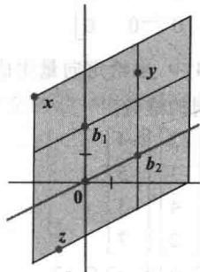
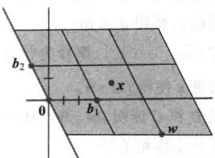
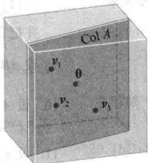
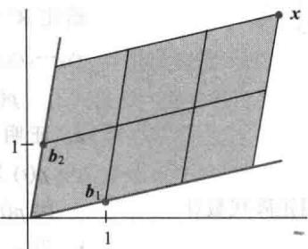

import Guide from '@/components/Guide.astro';
import Knowledge from '@/components/Knowledge.astro';
import Example from '@/components/Example.astro';
import Analysis from '@/components/Analysis.astro';
import Solution from '@/components/Solution.astro';
import Variant from '@/components/Variant.astro';
import Note from '@/components/Note.astro';
import Block from '@/components/Block.astro';
import Method from '@/components/Method.astro';
import Exercise from '@/components/Exercise.astro';

本节从坐标系的概念开始对子空间和子空间的基继续加以讨论. 下面的定义和例子使一个有用的新术语——维数显得非常自然，至少对 $\mathbb{R}^3$ 的子空间是这样.

## 坐标系

选择子空间 H 的一个基代替一个纯粹生成集的主要原因是，H 中的每个向量可以被表示为基向量的线性组合的唯一形式。为了明确原因，假设 $B=\{b_{1},\cdots,b_{p}\}$ 是 H 的基，H 中的一个向量 x 可以由两种方式生成，设

$$
\pmb {x} = c _ {1} \pmb {b} _ {1} + \dots + c _ {p} \pmb {b} _ {p}, \text {且} \pmb {x} = d _ {1} \pmb {b} _ {1} + \dots + d _ {p} \pmb {b} _ {p}\tag{1}
$$

则相减得到

$$
\mathbf {0} = \boldsymbol {x} - \boldsymbol {x} = (c _ {1} - d _ {1}) \boldsymbol {b} _ {1} + \dots + (c _ {p} - d _ {p}) \boldsymbol {b} _ {p}\tag{2}
$$

因为 B 是线性无关的，故（2）中的权必全为零．亦即对 $1 \leqslant j \leqslant p, c_{j} = d_{j}$ ，（1）式中的两种表示实际上是相同的.

定义 假设 $B=\{b_{1},\cdots,b_{p}\}$ 是子空间 H 的一组基. 对 H 中的每一个向量 x，相对于基 B 的坐标是使 $x=c_{1}b_{1}+\cdots+c_{p}b_{p}$ 成立的权 $c_{1},\cdots,c_{p}$ ，且 $R^{p}$ 中的向量

$$
[ \boldsymbol {x} ] _ {\mathcal {B}} = \left[ \begin{array}{c} c _ {1} \\ \vdots \\ c _ {p} \end{array} \right]
$$

称为 x （相对于 B ）的坐标向量，或 x 的 B-坐标向量.

<Example title="例 1">
设 $\pmb{v}_{1} = \begin{bmatrix} 3 \\ 6 \\ 2 \end{bmatrix}, \pmb{v}_{2} = \begin{bmatrix} -1 \\ 0 \\ 1 \end{bmatrix}, \pmb{x} = \begin{bmatrix} 3 \\ 12 \\ 7 \end{bmatrix}, \mathcal{B} = \{\pmb{v}_{1}, \pmb{v}_{2}\}$ . 则因 $\pmb{v}_{1}, \pmb{v}_{2}$ 线性无关，故 $\mathcal{B}$ 是 $H = \operatorname{Span}\{\pmb{v}_{1}, \pmb{v}_{2}\}$ 的基. 判断 $\pmb{x}$ 是否在 $H$ 中，如果是，求 $\pmb{x}$ 相对于基 $\mathcal{B}$ 的坐标向量.

<Solution title="解">
如果 x 在 H 中，则下面的向量方程是相容的：

$$
c _ {1} \left[ \begin{array}{l} 3 \\ 6 \\ 2 \end{array} \right] + c _ {2} \left[ \begin{array}{c} - 1 \\ 0 \\ 1 \end{array} \right] = \left[ \begin{array}{l} 3 \\ 1 2 \\ 7 \end{array} \right]
$$

如果数 $c_{1}, c_{2}$ 存在，则它们是 $\pmb{x}$ 的 $\mathcal{B}$ -坐标。由行变换得

$$
\left[ \begin{array}{c c c} 3 & - 1 & 3 \\ 6 & 0 & 1 2 \\ 2 & 1 & 7 \end{array} \right] \sim \left[ \begin{array}{c c c} 1 & 0 & 2 \\ 0 & 1 & 3 \\ 0 & 0 & 0 \end{array} \right]
$$

于是 $c_{1} = 2, c_{2} = 3, [\pmb{x}]_{B} = \begin{bmatrix} 2 \\ 3 \end{bmatrix}$ . 基 $\mathcal{B}$ 确定 $H$ 上的一个“坐标系”，如图2-28中的格子所示.

<figure class="vp-figure">
  
  <figcaption>图2-28 $\mathbb{R}^3$ 中平面 $H$ 的一个坐标系</figcaption>
</figure>
</Solution>
</Example>

意到虽然 $H$ 中的点也在 $\mathbb{R}^3$ 中，但它们完全由属于 $\mathbb{R}^2$ 的坐标向量确定。图2-28中的平面上的格子使 $H$ 看起来像 $\mathbb{R}^2$ 。映射 $x\mapsto [x]_B$ 是 $H$ 和 $\mathbb{R}^2$ 之间保持线性组合关系的一一映射。我们称这种映射是同构的，且 $H$ 与 $\mathbb{R}^2$ 同构。

一般地，如果 $B=\{b_{1},\cdots,b_{p}\}$ 是 H 的基，则映射 $x\mapsto[x]_{B}$ 是使 H 和 $R^{p}$ 的形态一样的一一映射（尽管 H 中的向量可能有多于 p 个元素）。（详细的讨论见 4.4 节。）

## 子空间的维数

可以证明，若子空间 $H$ 有一组基包含 $p$ 个向量，则 $H$ 的每个基都正好包含 $p$ 个向量。（见习题27和28.）于是下列定义是有意义的.

定义 非零子空间 $H$ 的维数（用 $\dim H$ 表示）是 $H$ 的任意一个基的向量个数. 零子空间

\{0\} 的维数定义为零.

$\mathbb{R}^n$ 空间维数为 $n$ ， $\mathbb{R}^n$ 的每个基由 $n$ 个向量组成． $\mathbb{R}^3$ 中一个经过0的平面是二维的，一条经过0的直线是一维的.

<Example title="例 2">
回忆 2.8 节例 6 中矩阵 A 的零空间有一个基包含 3 个向量。因此这里 Nul A 的维数为 3。观察到每个基向量对应于方程 Ax = 0 的一个自由变量。我们的构造方法总是以这种方式产生一个基。因此，要确定 Nul A 的维数，只需求出 Ax = 0 中的自由变量个数。

定义 矩阵 A 的秩（记为 rank A）是 A 的列空间的维数.

因为 A 的主元列形成 Col A 的一个基，故 A 的秩正好是 A 的主元列的个数.
</Example>

<Example title="例 3">
确定矩阵的秩：

$$
A = \left[ \begin{array}{c c c c c} 2 & 5 & - 3 & - 4 & 8 \\ 4 & 7 & - 4 & - 3 & 9 \\ 6 & 9 & - 5 & 2 & 4 \\ 0 & - 9 & 6 & 5 & - 6 \end{array} \right]
$$

<Solution title="解">
化简 $A$ 成阶梯行：

$$
A \sim \left[ \begin{array}{c c c c c} {2} & {5} & {- 3} & {- 4} & {8} \\ {0} & {- 3} & {2} & {5} & {- 7} \\ {0} & {- 6} & {4} & {1 4} & {- 2 0} \\ {0} & {- 9} & {6} & {5} & {- 6} \end{array} \right] \sim \dots \sim \left[ \begin{array}{c c c c c} {2} & {5} & {- 3} & {- 4} & {8} \\ {0} & {- 3} & {2} & {5} & {- 7} \\ {0} & {0} & {0} & {4} & {- 6} \\ {0} & {0} & {0} & {0} & {0} \end{array} \right]
$$

矩阵 A 有 3 个主元列，因此 rank A = 3.

从例 3 的行化简可见在 Ax=0 中有两个自由变量，这是因为 A 的五列中有两列不是主元列。（非主元列对应于 Ax=0 中的自由变量。）由于主元列的个数加上非主元列的个数正好是 A 的列数，因此 Col A 和 Nul A 的维数有如下有用的关系。（详细内容见 4.6 节的秩定理。）
</Solution>
</Example>

<Knowledge title="定理 14 秩定理">
如果一矩阵 A 有 n 列，则 $\operatorname{rank} A + \dim \operatorname{Nul} A = n$ .

下面的定理在应用中很重要，并在第5章和第6章中用到。该定理（在4.5节中证明）当然是很显明的，若你想到 $p$ 维子空间同构于 $\mathbb{R}^p$ 。由可逆矩阵定理知， $\mathbb{R}^p$ 中的 $p$ 个向量线性无关当且仅当这 $p$ 个向量也生成 $\mathbb{R}^p$ 。
</Knowledge>

<Knowledge title="定理 15 基定理">
设 $H$ 是 $\mathbb{R}^n$ 的 $p$ 维子空间， $H$ 中的任何恰好由 $p$ 个元素组成的线性无关集构成 $H$ 的一个基。并且， $H$ 中任何生成 $H$ 的 $p$ 个向量集也构成 $H$ 的一个基。
</Knowledge>

## 秩与可逆矩阵定理

各种与矩阵相关的向量空间的概念为可逆矩阵定理提供了更多的命题. 下面给出 2.3 节原定理的后续命题.

定理（可逆矩阵定理（续））

设 A 是一 $n \times n$ 矩阵，则下面的每个命题与 A 是可逆矩阵的命题等价：

<Solution title="证明">
根据线性无关和生成的概念，命题（m）逻辑上与命题（e）和（h）等价．其他五个命题通过简单推导以如下关系与定理以前的命题相关联：

$$
(g) \Rightarrow (n) \Rightarrow (o) \Rightarrow (p) \Rightarrow (r) \Rightarrow (q) \Rightarrow (d)
$$

命题（g）认为方程 Ax=b 对每一属于 $R^{n}$ 的 b 有至少一个解，由此可以推出（n），因为 Col A 确实是所有 b 的集合，满足方程 Ax=b 相容的条件。命题（n） $\Rightarrow$ （o） $\Rightarrow$ （p）是因为维数和秩的定义。如果 A 的秩是 n，即 A 的列数，则根据秩定理得 dim Nul A=0，因而 Nul A=\{0\}。于是有 (p) $\Rightarrow$ （r） $\Rightarrow$ （q）。同时，由命题（q）推出方程 Ax=0 只有平凡解，即命题（d）。因为已知命题（d）和（g）与 A 是可逆矩阵的命题等价，从而定理证毕。

数值计算的注解 本教材中讨论的许多算法有助于概念的理解和手工进行简单的计算. 然而这些算法通常不适于处理现实生活中的大规模问题.

计算秩的算法是一个很好的例子. 表面上看将矩阵化简为阶梯形后数主元是很容易的事情. 但除非是对元素精确指定的矩阵进行算术运算, 行运算可以明显改变一个矩阵的秩. 例如, 假如矩阵 $\begin{bmatrix} 5 & 7 \\ 5 & x \end{bmatrix}$ 中 $x$ 的值在计算机中不是存为 7 , 那么它的秩可能是 1 或 2 , 这取决于计算机是否视 $x - 7$ 为零.

在实际应用中，通常使用 A 的奇异值分解来有效地确定矩阵 A 的秩，在 7.4 节中将会讨论.
</Solution>

<Block title="练习题">
1. 确定由向量 $v_{1}, v_{2}, v_{3}$ 生成的 $R^{3}$ 的子空间 H 的维数。（首先找 H 的基。）

$$
\boldsymbol {v} _ {1} = \left[ \begin{array}{c} 2 \\ - 8 \\ 6 \end{array} \right], \boldsymbol {v} _ {2} = \left[ \begin{array}{c} 3 \\ - 7 \\ - 1 \end{array} \right], \boldsymbol {v} _ {3} = \left[ \begin{array}{c} - 1 \\ 6 \\ - 7 \end{array} \right]
$$

2. $\mathbb{R}^2$ 的基 $\mathcal{B} = \left\{\left[ \begin{array}{c}1\\ 0.2 \end{array} \right],\left[ \begin{array}{c}0.2\\ 1 \end{array} \right]\right\}$ ，若 $[\pmb {x}]_B = \left[ \begin{array}{c}3\\ 2 \end{array} \right]$ ， $\pmb{x}$ 是什么？

3. $\mathbb{R}^3$ 是否可能包含四维子空间？为什么？
</Block>

<Block title="习题2.9">
习题 1\~2 给出坐标向量 $[x]_{B}$ 和基 B，求向量 x. $[y]_{B}$ 和 $[z]_{B}$ . 像练习题 2 一样用图示说明你的答案.

$$
\mathcal {B} = \left\{\left[ \begin{array}{l} 1 \\ 1 \end{array} \right], \left[ \begin{array}{c} 2 \\ - 1 \end{array} \right] \right\}, [ \boldsymbol {x} ] _ {\mathcal {B}} = \left[ \begin{array}{l} 3 \\ 2 \end{array} \right]
$$

2. $\mathcal{B}=\left\{\begin{bmatrix}-2\\1\end{bmatrix}, \begin{bmatrix}3\\1\end{bmatrix}\right\}$ ， $[\pmb{x}]_{\mathcal{B}}=\begin{bmatrix}-1\\3\end{bmatrix}$

习题 3\~6 中，向量 x 属于一个基为 $B=\{b_{1},b_{2}\}$ 的子空间 H，求出 x 相对于 B 的坐标向量.

3. $b_{1}=\begin{bmatrix}1\\ -4\end{bmatrix},b_{2}=\begin{bmatrix}-2\\ 7\end{bmatrix},x=\begin{bmatrix}-3\\ 7\end{bmatrix}$

4. $b_{1}=\begin{bmatrix}1\\ -3\end{bmatrix},b_{2}=\begin{bmatrix}-3\\ 5\end{bmatrix},x=\begin{bmatrix}-7\\ 5\end{bmatrix}$

习题 9\~12 给出矩阵 A 及其阶梯形, 求 Col A 和 Nul A 的基, 并求其维数.

$$
\boldsymbol {b} _ {1} = \left[ \begin{array}{c} 1 \\ 5 \\ - 3 \end{array} \right], \boldsymbol {b} _ {2} = \left[ \begin{array}{c} - 3 \\ - 7 \\ 5 \end{array} \right], \boldsymbol {x} = \left[ \begin{array}{c} 4 \\ 1 0 \\ - 7 \end{array} \right]
$$

$$
A = \left[ \begin{array}{r r r r} 1 & - 3 & 2 & - 4 \\ - 3 & 9 & - 1 & 5 \\ 2 & - 6 & 4 & - 3 \\ - 4 & 1 2 & 2 & 7 \end{array} \right] \sim \left[ \begin{array}{r r r r} 1 & - 3 & 2 & - 4 \\ 0 & 0 & 5 & - 7 \\ 0 & 0 & 0 & 5 \\ 0 & 0 & 0 & 0 \end{array} \right]
$$

$$
\boldsymbol {b} _ {1} = \left[ \begin{array}{c} - 3 \\ 1 \\ - 4 \end{array} \right], \boldsymbol {b} _ {2} = \left[ \begin{array}{c} 7 \\ 5 \\ - 6 \end{array} \right], \boldsymbol {x} = \left[ \begin{array}{c} 1 1 \\ 0 \\ 7 \end{array} \right]
$$

$$
A = \left[ \begin{array}{r r r r r} 1 & - 2 & 9 & 5 & 4 \\ 1 & - 1 & 6 & 5 & - 3 \\ - 2 & 0 & - 6 & 1 & - 2 \\ 4 & 1 & 9 & 1 & - 9 \end{array} \right]
$$

7. 设 $b_{1}=\begin{bmatrix}3\\ 0\end{bmatrix},b_{2}=\begin{bmatrix}-1\\ 2\end{bmatrix},w=\begin{bmatrix}7\\ -2\end{bmatrix},x=\begin{bmatrix}4\\ 1\end{bmatrix},B=\{b_{1},b_{2}\}$ .
使用图形估算 $[w]_{B}$ 和 $[x]_{B}$ . 用你估算的 $[x]_{B}$ 和 $\{b_{1},b_{2}\}$ 计算x来验证 $[x]_{B}$ .

$$
\sim \left[ \begin{array}{c c c c c} 1 & - 2 & 9 & 5 & 4 \\ 0 & 1 & - 3 & 0 & - 7 \\ 0 & 0 & 0 & 1 & - 2 \\ 0 & 0 & 0 & 0 & 0 \end{array} \right]
$$

$$
A = \left[ \begin{array}{r r r r r} 1 & 2 & - 5 & 0 & - 1 \\ 2 & 5 & - 8 & 4 & 3 \\ - 3 & - 9 & 9 & - 7 & - 2 \\ 3 & 1 0 & - 7 & 1 1 & 7 \end{array} \right]
$$

8. 设 $b_{1}=\begin{bmatrix}0\\ 2\end{bmatrix},b_{2}=\begin{bmatrix}2\\ 1\end{bmatrix},x=\begin{bmatrix}-2\\ 3\end{bmatrix},y=\begin{bmatrix}2\\ 4\end{bmatrix},z=\begin{bmatrix}-1\\ -2.5\end{bmatrix},$ $B=\{b_{1},b_{2}\}$ . 使用图形估算 $[x]_{B},[y]_{B}$ 和 $[z]_{B}$ . 用你估算的 $[y]_{B},[z]_{B}$ 和 $\{b_{1},b_{2}\}$ 计算 y 和 z 来验证

$$
\sim \left[ \begin{array}{c c c c c} 1 & 2 & - 5 & 0 & - 1 \\ 0 & 1 & 2 & 4 & 5 \\ 0 & 0 & 0 & 1 & 2 \\ 0 & 0 & 0 & 0 & 0 \end{array} \right]
$$

12.

$$
A = \left[ \begin{array}{r r r r r} 1 & 2 & - 4 & 3 & 3 \\ 5 & 1 0 & - 9 & - 7 & 8 \\ 4 & 8 & - 9 & - 2 & 7 \\ - 2 & - 4 & 5 & 0 & - 6 \end{array} \right]
$$

$$
\sim \left[ \begin{array}{c c c c c} 1 & 2 & - 4 & 3 & 3 \\ 0 & 0 & 1 & - 2 & 0 \\ 0 & 0 & 0 & 0 & - 5 \\ 0 & 0 & 0 & 0 & 0 \end{array} \right]
$$

习题 13\~14 中, 求给定向量生成的子空间的一个基及该子空间的维数.

13.

$$
\left[ \begin{array}{r} 1 \\ - 3 \\ 2 \\ - 4 \end{array} \right], \left[ \begin{array}{r} - 3 \\ 9 \\ - 6 \\ 1 2 \end{array} \right], \left[ \begin{array}{r} 2 \\ - 1 \\ 4 \\ 2 \end{array} \right], \left[ \begin{array}{r} - 4 \\ 5 \\ - 3 \\ 7 \end{array} \right]
$$

14.

$$
\left[ \begin{array}{c} 1 \\ - 1 \\ - 2 \\ 5 \end{array} \right], \left[ \begin{array}{c} 2 \\ - 3 \\ - 1 \\ 6 \end{array} \right], \left[ \begin{array}{c} 0 \\ 2 \\ - 6 \\ 8 \end{array} \right], \left[ \begin{array}{c} - 1 \\ 4 \\ - 7 \\ 7 \end{array} \right], \left[ \begin{array}{c} 3 \\ - 8 \\ 9 \\ - 5 \end{array} \right]
$$

15. 设一 $3 \times 5$ 矩阵 $A$ 有三个主元列. 是否 $\operatorname{Col} A = \mathbb{R}^3$ ? 是否 $\operatorname{Nul} A = \mathbb{R}^2$ ? 解释原因.

16. 设一 $4 \times 7$ 矩阵 $A$ 有三个主元列. 是否 $\operatorname{Col} A = \mathbb{R}^3$ ? $\operatorname{Nul} A$ 的维数是多少? 解释原因. 习题 17\~18 中, 标出每个命题的真假, 给出理由. 这里 $A$ 是 $m \times n$ 矩阵.

17. a. 若 $B=\{v_{1},\cdots,v_{p}\}$ 是子空间 H 的一个基， $x=c_{1}v_{1}+\cdots+c_{p}v_{p}$ ，则 $c_{1},\cdots,c_{p}$ 是 x 相对于基 B 的坐标.
b. $R^{n}$ 中的每一直线都是 $R^{n}$ 的一维子空间.
c. Col A 的维数是 A 的主元列的个数.
d. Col A 和 Nul A 的维数之和等于 A 的列数.
e. 若 p 个向量生成 $R^{n}$ 中的 p 维子空间 H，则这 p 个向量构成 H 的基.

18. a. 若 B 是子空间 H 的一个基，则 H 中的每个向量可以写成 B 中向量的唯一线性组合形式.
b. 若 $B = \{v_{1}, \cdots, v_{p}\}$ 是 $R^{n}$ 的子空间 H 的一个基，则映射 $x \mapsto [x]_{B}$ 使 H 和 $R^{p}$ 一样.
c. Nul A 的维数是方程 Ax = 0 中的变量个数.

d. $A$ 的列空间的维数是 $\operatorname{rank} A$ .

e. 若 $H$ 是 $\mathbb{R}^n$ 中的 $p$ 维子空间，则 $H$ 中的 $p$ 个线性无关向量组成的集合构成 $H$ 的基. 在习题19\~24中，验证每个答案或构造.

19. 若 Ax=0 的解空间有一个由 3 个向量组成的基，A 为 $5 \times 7$ 矩阵，A 的秩是多少？

20. 若 $4 \times 5$ 矩阵的零空间是三维的，它的秩是多少？

21. 一个 $7 \times 6$ 矩阵 $A$ 的秩是 4, $Ax = 0$ 的解空间维数是多少?

22. 证明：若 dim Span $\{v_{1},\cdots,v_{5}\}=4$ ，则 $R^{n}$ 中的向量集 $\{v_{1},\cdots,v_{5}\}$ 线性无关.

23. 可能的话，构造一个 dim Nul A = 2 和 dim Col A = 2 的 $3 \times 4$ 矩阵.

24. 构造一个秩等于 1 的 $4 \times 3$ 矩阵.

25. 设一 $n \times p$ 矩阵 $A$ 的列空间是 $p$ 维的，解释为什么 $A$ 的列向量一定线性无关.

26. 假设矩阵 $A$ 的第 1、3、5 和 6 列向量线性无关（但不必是主元列）且 $A$ 的秩是 4，解释为什么这 4 个列向量一定是 $A$ 的列空间的一个基.

27. 假设向量 $b_{1}, \ldots, b_{p}$ 生成一个子空间 W，令 $\{a_{1}, \cdots, a_{q}\}$ 是任一 W 中包含多于 p 个向量的向量集。完成下面的论述，证明 $\{a_{1}, \cdots, a_{q}\}$ 一定是线性相关的。首先记 $B = [b_{1} \cdots b_{p}]$ ， $A = [a_{1} \cdots a_{q}]$ 。
a. 解释为什么对每一向量 $a_{j}$ ，存在一个 $R^{p}$ 中的向量 $c_{j}$ 使得 $a_{j} = Bc_{j}$ .
b. 设 $C = [c_{1} \cdots c_{q}]$ ，解释为什么存在一个非零向量 u 使得 Cu = 0.
c. 使用 B 和 C 证明 Au = 0，从而证明 A 的列向量是线性相关的.

28. 使用习题 27 证明：如果 A 和 B 是 $R^{n}$ 中一子空间 W 的基，则 A 不可能包含比 B 更多的向量，相反，B 也不可能包含比 A 更多的向量.

29. [M] 设 $H = \operatorname{Span}\{\pmb{v}_1, \pmb{v}_2\}, \mathcal{B} = \{\pmb{v}_1, \pmb{v}_2\}$ , 证明 $\pmb{x}$ 属于 $H$ , 并求 $\pmb{x}$ 相对 $\mathcal{B}$ 的坐标向量.

$$
\boldsymbol {v} _ {1} = \left[ \begin{array}{l} 1 1 \\ - 5 \\ 1 0 \\ 7 \end{array} \right], \boldsymbol {v} _ {2} = \left[ \begin{array}{l} 1 4 \\ - 8 \\ 1 3 \\ 1 0 \end{array} \right], \boldsymbol {x} = \left[ \begin{array}{l} 1 9 \\ - 1 3 \\ 1 8 \\ 1 5 \end{array} \right]
$$

$$
\boldsymbol {v} _ {1} = \left[ \begin{array}{c} - 6 \\ 4 \\ - 9 \\ 4 \end{array} \right], \boldsymbol {v} _ {2} = \left[ \begin{array}{c} 8 \\ - 3 \\ 7 \\ - 3 \end{array} \right], \boldsymbol {v} _ {3} = \left[ \begin{array}{c} - 9 \\ 5 \\ - 8 \\ 3 \end{array} \right], \boldsymbol {x} = \left[ \begin{array}{c} 4 \\ 7 \\ - 8 \\ 3 \end{array} \right]
$$

30. [M] 设 $H = \operatorname{Span}\{\pmb{v}_1, \pmb{v}_2, \pmb{v}_3\}, \mathcal{B} = \{\pmb{v}_1, \pmb{v}_2, \pmb{v}_3\}$ , 证明 $\mathcal{B}$ 是 $H$ 的基, $\pmb{x}$ 属于 $H$ , 并求 $\pmb{x}$ 相对 $\mathcal{B}$ 的坐标向量.
</Block>

<Block title="练习题答案">
1. 构造 $A = \left[ \begin{array}{lll} \pmb{v}_1 & \pmb{v}_2 & \pmb{v}_3 \end{array} \right]$ ，使由 $\pmb{v}_1, \pmb{v}_2, \pmb{v}_3$ 生成的子空间是 $A$ 的列空间。这一空间的一组基是 $A$ 的主元列。

$$
A = \left[ \begin{array}{r r r} 2 & 3 & - 1 \\ - 8 & - 7 & 6 \\ 6 & - 1 & - 7 \end{array} \right] \sim \left[ \begin{array}{r r r} 2 & 3 & - 1 \\ 0 & 5 & 2 \\ 0 & - 1 0 & - 4 \end{array} \right] \sim \left[ \begin{array}{r r r} 2 & 3 & - 1 \\ 0 & 5 & 2 \\ 0 & 0 & 0 \end{array} \right]
$$

由此 A 的前两列是主元列，并构成 H 的基，所以 $\dim H = 2$ .

2. 若 $[\pmb{x}]_B = \begin{bmatrix} 3 \\ 2 \end{bmatrix}$ ，则 $\pmb{x}$ 是基向量的线性组合，权为3和2.

$$
\boldsymbol {x} = 3 \boldsymbol {b} _ {1} + 2 \boldsymbol {b} _ {2} = 3 \left[ \begin{array}{c} 1 \\ 0. 2 \end{array} \right] + 2 \left[ \begin{array}{c} 0. 2 \\ 1 \end{array} \right] = \left[ \begin{array}{c} 3. 4 \\ 2. 6 \end{array} \right]
$$

基 $\{\pmb{b}_1, \pmb{b}_2\}$ 确定 $\mathbb{R}^2$ 的坐标系，在图中用格子表示。注意 $x$ 在 $\pmb{b}_1$ 方向是3个单位，在 $\pmb{b}_2$ 方向是2个单位。

3. 四维子空间包含一个有 4 个线性无关向量的基，这在 $\mathbb{R}^3$ 中是不可能的。因 $\mathbb{R}^3$ 中任意线性无关集不超过 3 个向量。 $\mathbb{R}^3$ 中任意子空间的维数不超过 3，空间 $\mathbb{R}^3$ 本身是 $\mathbb{R}^3$ 仅有的三维子空间。其他子空间的维数为 2，1 或 0。
</Block>
