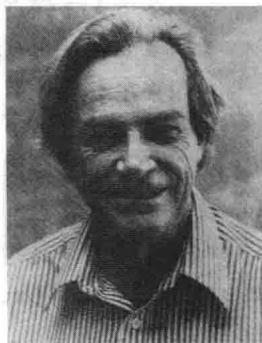

import Guide from '@/components/Guide.astro';
import Knowledge from '@/components/Knowledge.astro';
import Example from '@/components/Example.astro';
import Analysis from '@/components/Analysis.astro';
import Solution from '@/components/Solution.astro';
import Variant from '@/components/Variant.astro';
import Note from '@/components/Note.astro';
import Block from '@/components/Block.astro';
import Method from '@/components/Method.astro';
import Exercise from '@/components/Exercise.astro';

诺贝尔物理奖获得者理查德·费曼在他的自传《别闹了，费曼先生》中，述说了他曾在普林斯顿研究生公寓观察蚂蚁一事。他在悬挂的绳子上放置一个纸船，通过轮渡来研究蚂蚁的寻食行为，蚂蚁很难找到涂有食饵糖的地方。当一个蚂蚁爬上纸船后，费曼就将蚂蚁航运到有食饵糖的地方，等蚂蚁获取食物往回搬并爬上纸船后，费曼又将蚂蚁运回到蚂蚁当初上船的地方。如此以同样方式反复多次，等蚂蚁学会了轮渡之后，费曼更改了轮渡返航的登陆地点，结果使得这群蚂蚁在返回时出现混乱。这说明它们的“学习”是由创造踪迹和跟随踪迹两部分构成的。费曼又通过地上的载玻片证明了这个猜想。一旦蚂蚁在载玻片上留下

了踪迹，他就在载玻片上重新设置，即重新设置了蚂蚁踪迹的路径。果然，蚂蚁沿着新的踪迹移动，也就是说，蚂蚁是沿着费曼希望的路线移动的。

费曼又用丝网组成的球面来做进一步的研究。假设一个蚂蚁在球面上沿着独立的路线行走并且在每个交叉口处都要做出选择，即向左走还是向右走。如果把一些蚂蚁放在球面上，并把同蚂蚁数量具有相等份数的食饵放置在球面上各处，每一只蚂蚁是独立地找到属于自己的那份食物还是沿着其他蚂蚁的踪迹找到其他蚂蚁的食物？哪种可能性更大？

为了记录下蚂蚁的实际行踪，也为了和其他人进行交流，我们可以用多种方法很容易地把球面分割成许多小块。一种简单的方法是仿照地图用经度和纬度分别作为坐标 $x$ 和 $y$ ，虽然这并不能真实地反映整个球面。赤道附近处两者比较一致，两极附近的扭曲就很大了。两极区域的像比赤道附近类似区域的像大很多。为了与地图的这种不同区域的差别相应，极点附近的一只蚂蚁的像应该比赤道附近的像大。那么问题是，大多少呢？

令人惊奇的是，蚂蚁路径和区域扭曲问题都可以通过计算行列式得到很好的解释，行列式正是本章的主题。行列式有很多应用，比如早在1900年，行列式的应用就曾被托马斯·米尔（Thomas Muir）的四卷论著所论述过。随着矩阵理论的广泛应用，研究的重点发生了变化，行列式在当时的许多很重要的应用在今天好像显得无足轻重了，不过至今行列式本身仍扮演着很重要的角色。除了在3.1节中引入行列式外，本章还将学习两个重要内容：首先是对第5章学习起着重要作用的3.2节，介绍了方阵可逆性的判别标准；其次是3.3节，解释行列式是如何测度一个线性变换对图形面积的改变量的。当局部地应用时，这一意义回答了两极附近的地图的扩张比例问题。这种思想以雅可比式在多元微积分

中扮演着重要角色.

>>>
