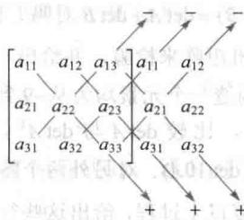

import Knowledge from '@/components/Knowledge.astro';
import Example from '@/components/Example.astro';
import Note from '@/components/Note.astro';
import Solution from '@/components/Solution.astro';
import Block from '@/components/Block.astro';

针对2.2节中的结论，我们回顾一个 $2 \times 2$ 矩阵是可逆的，当且仅当它的行列式非零。为了将这个有用的结果推广到更大的矩阵，需要对 $n \times n$ 矩阵的行列式给出一个定义。我们可以通过观察对一个可逆的 $3 \times 3$ 矩阵 $A$ 做行化简时会出现什么结果来发现 $3 \times 3$ 矩阵的行列式的定义。

考虑 $A = [a_{ij}], a_{11} \neq 0$ 。 $A$ 的第二行和第三行都乘以 $a_{11}$ ，然后再分别减去第一行适当的倍数，则 $A$ 行等价于下面两个矩阵：

$$

\left[ \begin{array}{c c c} a _ {1 1} & a _ {1 2} & a _ {1 3} \\ a _ {1 1} a _ {2 1} & a _ {1 1} a _ {2 2} & a _ {1 1} a _ {2 3} \\ a _ {1 1} a _ {3 1} & a _ {1 1} a _ {3 2} & a _ {1 1} a _ {3 3} \end{array} \right] \sim \left[ \begin{array}{c c c} a _ {1 1} & a _ {1 2} & a _ {1 3} \\ 0 & a _ {1 1} a _ {2 2} - a _ {1 2} a _ {2 1} & a _ {1 1} a _ {2 3} - a _ {1 3} a _ {2 1} \\ 0 & a _ {1 1} a _ {3 2} - a _ {1 2} a _ {3 1} & a _ {1 1} a _ {3 3} - a _ {1 3} a _ {3 1} \end{array} \right]\tag{1}

$$

由于 $A$ 可逆，故（1）式右边矩阵中（2,2）元素和（3,2）元素不同时为0.不妨假设（2,2）元素不等于零（否则，可以做一个行对换变成这种情形）．第三行乘以 $a_{11}a_{22} - a_{12}a_{21}$ ，再对这个新的第三行加上第二行乘以 $-(a_{11}a_{32} - a_{12}a_{31})$ ，这样就有

$$

A \sim \left[ \begin{array}{c c c} a _ {1 1} & a _ {1 2} & a _ {1 3} \\ 0 & a _ {1 1} a _ {2 2} - a _ {1 2} a _ {2 1} & a _ {1 1} a _ {2 3} - a _ {1 3} a _ {2 1} \\ 0 & 0 & a _ {1 1} \Delta \end{array} \right]

$$

其中

$$

\Delta = a _ {1 1} a _ {2 2} a _ {3 3} + a _ {1 2} a _ {2 3} a _ {3 1} + a _ {1 3} a _ {2 1} a _ {3 2} - a _ {1 1} a _ {2 3} a _ {3 2} - a _ {1 2} a _ {2 1} a _ {3 3} - a _ {1 3} a _ {2 2} a _ {3 1}\tag{2}

$$

由于 $A$ 可逆，故 $\Delta$ 一定不等于零。反之亦然，我们将在3.2节中看到这个结论。我们称（2）式中的 $\Delta$ 为 $3\times 3$ 矩阵 $A$ 的行列式。

回忆 $2 \times 2$ 矩阵 $A = [a_{ij}]$ 的行列式，即 $\operatorname{det} A = a_{11}a_{22} - a_{12}a_{21}$ 。对 $1 \times 1$ 矩阵，如 $A = [a_{11}]$ ，定义 $\operatorname{det} A = a_{11}$ 。为了将行列式的定义推广到更大的矩阵，我们将利用 $2 \times 2$ 行列式来重写上面叙述的 $3 \times 3$ 行列式 $\Delta$ 。因为 $\Delta$ 中的项可以写成

$$

\begin{array}{r l} & \left(a _ {1 1} a _ {2 2} a _ {3 3} - a _ {1 1} a _ {2 3} a _ {3 2}\right) - \left(a _ {1 2} a _ {2 1} a _ {3 3} - a _ {1 2} a _ {2 3} a _ {3 1}\right) + \left(a _ {1 3} a _ {2 1} a _ {3 2} - a _ {1 3} a _ {2 2} a _ {3 1}\right) \\ & \Delta = a _ {1 1} \cdot \det \left[ \begin{array}{l l} a _ {2 2} & a _ {2 3} \\ a _ {3 2} & a _ {3 3} \end{array} \right] - a _ {1 2} \cdot \det \left[ \begin{array}{l l} a _ {2 1} & a _ {2 3} \\ a _ {3 1} & a _ {3 3} \end{array} \right] + a _ {1 3} \cdot \det \left[ \begin{array}{l l} a _ {2 1} & a _ {2 2} \\ a _ {3 1} & a _ {3 2} \end{array} \right] \end{array}

$$

为了简单，可写成

$$

\Delta = a _ {1 1} \cdot \det A _ {1 1} - a _ {1 2} \cdot \det A _ {1 2} + a _ {1 3} \cdot \det A _ {1 3}\tag{3}

$$

其中 $A_{11}$ ， $A_{12}$ 和 $A_{13}$ 由 $A$ 中删去第一行和三列中之一列而得到。对任意方阵 $A$ ，令 $A_{ij}$ 表示通过删去 $A$ 中第 $i$ 行和第 $j$ 列而得到的子矩阵，比如，若

$$

A = \left[ \begin{array}{c c c c} 1 & - 2 & 5 & 0 \\ 2 & 0 & 4 & - 1 \\ 3 & 1 & 0 & 7 \\ 0 & 4 & - 2 & 0 \end{array} \right]

$$

则 $A_{32}$ 通过删去第三行和第二列而得到

$$

\left[ \begin{array}{c c c c} 1 & - 2 & 5 & 0 \\ 2 & 0 & 4 & - 1 \\ 3 & 1 & 0 & 7 \\ 0 & 4 & - 2 & 0 \end{array} \right]

$$

即

$$

A _ {3 2} = \left[ \begin{array}{c c c} 1 & 5 & 0 \\ 2 & 4 & - 1 \\ 0 & - 2 & 0 \end{array} \right]

$$

现在我们可以给出行列式的一个递归定义. 当 $n = 3$ 时, 像上面的 (3) 式, $\operatorname{det} A$ 由 $2 \times 2$ 子矩阵 $A_{1j}$ 的行列式来定义. 当 $n = 4$ 时, $\operatorname{det} \bar{A}$ 由 $3 \times 3$ 子矩阵 $A_{1j}$ 的行列式来定义. 一般情形下, 一个 $n \times n$ 行列式由 $(n - 1) \times (n - 1)$ 子矩阵的行列式来定义.

定义 当 $n \geqslant 2$ ， $n \times n$ 矩阵 $A = [a_{ij}]$ 的行列式是形如 $\pm a_{1j} \det A_{1j}$ 的 n 个项的和，其中加号和减号交替出现，元素 $a_{11}, a_{12}, \cdots, a_{1n}$ 来自 A 的第一行，用符号表示为

$$

\begin{array}{r l} \det A & = a _ {1 1} \cdot \det A _ {1 1} - a _ {1 2} \cdot \det A _ {1 2} + \dots + (- 1) ^ {1 + n} a _ {1 n} \cdot \det A _ {1 n} \\ & = \sum_ {j = 1} ^ {n} (- 1) ^ {1 + j} a _ {1 j} \det A _ {1 j} \end{array}

$$

<Example title="例 1">
计算行列式 $\operatorname{det} A$ ，其中

$$

A = \left[ \begin{array}{c c c} 1 & 5 & 0 \\ 2 & 4 & - 1 \\ 0 & - 2 & 0 \end{array} \right]

$$

<Solution title="解">
计算 $\operatorname{det} A = a_{11} \cdot \operatorname{det} A_{11} - a_{12} \cdot \operatorname{det} A_{12} + a_{13} \cdot \operatorname{det} A_{13}$ .

$$

\begin{array}{r l} \det A & = 1 \cdot \det \left[ \begin{array}{c c} 4 & - 1 \\ - 2 & 0 \end{array} \right] - 5 \cdot \det \left[ \begin{array}{c c} 2 & - 1 \\ 0 & 0 \end{array} \right] + 0 \cdot \det \left[ \begin{array}{c c} 2 & 4 \\ 0 & - 2 \end{array} \right] \\ & = 1 (0 - 2) - 5 (0 - 0) + 0 (- 4 - 0) = - 2 \end{array}

$$

方阵的行列式的另一个常用记号是利用一对竖线代替括号. 这样, 例 1 中的运算可以写成

$$

\det A = 1 \cdot \left| \begin{array}{c c} 4 & - 1 \\ - 2 & 0 \end{array} \right| - 5 \cdot \left| \begin{array}{c c} 2 & - 1 \\ 0 & 0 \end{array} \right| + 0 \cdot \left| \begin{array}{c c} 2 & 4 \\ 0 & - 2 \end{array} \right| = \dots = - 2

$$

为了叙述下一个定理，将 $\det A$ 的定义用稍微不同的形式写出更方便。给定 $A = [a_{ij}]$ ，A 的 $(i, j)$ 余因子 $C_{ij}$ 由下式给出：

$$

\begin{array}{r l} & C _ {i j} = (- 1) ^ {i + j} \det A _ {i j} \\ & \det A = a _ {1 1} \cdot C _ {1 1} + a _ {1 2} \cdot C _ {1 2} + \dots + a _ {1 n} \cdot C _ {1 n} \end{array}\tag{4}

$$

这个公式称为按 $A$ 的第一行的余因子展开式. 为了避免冗长的陈述, 我们省略下面基本定理的证明.
</Solution>
</Example>

<Knowledge title="定理 1">
$n \times n$ 矩阵 A 的行列式可按任意行或列的余因子展开式来计算. 按第 i 行展开用(4)

式给出的余因子写法：

$$

\det A = a _ {i 1} C _ {i 1} + a _ {i 2} C _ {i 2} + \dots + a _ {i n} C _ {i n}

$$

按第 $j$ 列的余因子展开式为

$$

\det A = a _ {1 j} C _ {1 j} + a _ {2 j} C _ {2 j} + \dots + a _ {n j} C _ {n j}

$$

$(i,j)$ 余因子中加号或减号取决于 $a_{ij}$ 在矩阵中的位置，而与 $a_{ij}$ 本身的符号无关. 因子 $(-1)^{i+j}$ 可确定下面符号的棋盘模式：

$$

\left[ \begin{array}{c c c c} + & - & + & \dots \\ - & + & - \\ + & - & + \\ \vdots & & & \ddots \end{array} \right]

$$
</Knowledge>

<Example title="例 2">
利用按第三行的余因子展开式求 $\operatorname{det} A$ ，其中

$$

A = \left[ \begin{array}{c c c} 1 & 5 & 0 \\ 2 & 4 & - 1 \\ 0 & - 2 & 0 \end{array} \right]

$$

<Solution title="解">
计算

$$

\begin{array}{r l} \det A & = a _ {3 1} C _ {3 1} + a _ {3 2} C _ {3 2} + a _ {3 3} C _ {3 3} \\ & = (- 1) ^ {3 + 1} a _ {3 1} \det A _ {3 1} + (- 1) ^ {3 + 2} a _ {3 2} \det A _ {3 2} + (- 1) ^ {3 + 3} a _ {3 3} \det A _ {3 3} \\ & = 0 \left| \begin{array}{c c} 5 & 0 \\ 4 & - 1 \end{array} \right| - (- 2) \left| \begin{array}{c c} 1 & 0 \\ 2 & - 1 \end{array} \right| + 0 \left| \begin{array}{c c} 1 & 5 \\ 2 & 4 \end{array} \right| = 0 + 2 (- 1) + 0 = - 2 \end{array}

$$
</Solution>
</Example>

<Knowledge title="定理 1">
有助于计算包含有许多零的行列式．例如，如果某行多数元素为零，则按此行的余因子展开式就会有许多项为零，这些项中的余因子就不需计算．同理对多数元素为零的某列也是这样.
</Knowledge>

<Example title="例 3">
计算 $\operatorname{det} A$ ，其中

$$

A = \left[ \begin{array}{c c c c c} 3 & - 7 & 8 & 9 & - 6 \\ 0 & 2 & - 5 & 7 & 3 \\ 0 & 0 & 1 & 5 & 0 \\ 0 & 0 & 2 & 4 & - 1 \\ 0 & 0 & 0 & - 2 & 0 \end{array} \right]

$$

<Solution title="解">
按 $A$ 的第一列的余因子展开式中，除第一项外均为零，从而

$$

\det A = 3 \cdot \left[ \begin{array}{c c c c} 2 & - 5 & 7 & 3 \\ 0 & 1 & 5 & 0 \\ 0 & 2 & 4 & - 1 \\ 0 & 0 & - 2 & 0 \end{array} \right] - 0 \cdot C _ {2 1} + 0 \cdot C _ {3 1} - 0 \cdot C _ {4 1} + 0 \cdot C _ {5 1}

$$

接下来在余因子展开式中省略零项，再利用第一列零的优势，按第一列展开这个 $4 \times 4$ 行列式，有

$$

\det A = 3 \cdot 2 \cdot \left[ \begin{array}{c c c} 1 & 5 & 0 \\ 2 & 4 & - 1 \\ 0 & - 2 & 0 \end{array} \right]

$$

这个 $3 \times 3$ 行列式已在例 1 中算出结果为 -2，从而 $\det A = 3 \cdot 2 \cdot (-2) = -12$

例 3 中的矩阵接近三角阵，此例中的方法容易用来证明下面的定理.
</Solution>
</Example>

<Knowledge title="定理 2">
若 A 为三角阵，则 $\det A$ 等于 A 的主对角线上元素的乘积.

当某行或某列全为零时，例3中找零的策略效果特别好。在这种情形下，按这一行或列的余因子展开式是一些零的和，从而此行列式为零。但不幸的是，大多数的余因子展开式并不是这样快能求值的。

数值计算的注解 按现在的标准来说，一个 $25 \times 25$ 矩阵还是小的。但是用余因子展开式来计算一个 $25 \times 25$ 行列式是不可行的。一般对 $n \times n$ 行列式而言，余因子展开式需要计算超过 $n!$ 个乘法运算， $25!$ 近似于 $1.5 \times 10^{25}$ 。

若一个超级计算机每秒钟能够完成 1 万亿次乘法运算，则用这种方法计算一个 $25 \times 25$ 行列式将需运行 50 万年。幸运的是，稍候我们就会发现快速计算的方法。

在习题 19\~38 中，多数是 $2 \times 2$ 情形的矩阵，揭示了行列式的一些重要性质。习题 33\~36 的结果将用来在下一节导出 $n \times n$ 矩阵的与之相似的性质。
</Knowledge>

<Block title="练习题">

计算

$$

\left| \begin{array}{r r r r} 5 & - 7 & 2 & 2 \\ 0 & 3 & 0 & - 4 \\ - 5 & - 8 & 0 & 3 \\ 0 & 5 & 0 & - 6 \end{array} \right|

$$

</Block>

<Block title="习题3.1">

利用第一行的余因子展开式计算习题 1\~8 中的行列式. 按第二列的余因子展开式再次计算习题 1\~4 中的行列式.

1.

$$

\left| \begin{array}{c c c} 3 & 0 & 4 \\ 2 & 3 & 2 \\ 0 & 5 & - 1 \end{array} \right|

$$

2.

$$

\left| \begin{array}{c c c} 0 & 4 & 1 \\ 5 & - 3 & 0 \\ 2 & 3 & 1 \end{array} \right|

$$

3.

$$

\left| \begin{array}{c c c} 2 & - 2 & 3 \\ 3 & 1 & 2 \\ 1 & 3 & - 1 \end{array} \right|

$$

4.

$$

\left| \begin{array}{c c c} 1 & 2 & 4 \\ 3 & 1 & 1 \\ 2 & 4 & 2 \end{array} \right|

$$

5.

$$

\left| \begin{array}{c c c} 2 & 3 & - 3 \\ 4 & 0 & 3 \\ 6 & 1 & 5 \end{array} \right|

$$

6.

$$

\left| \begin{array}{c c c} 5 & - 2 & 2 \\ 0 & 3 & - 3 \\ 2 & - 4 & 7 \end{array} \right|

$$

$$

\left| \begin{array}{c c c} 4 & 3 & 0 \\ 6 & 5 & 2 \\ 9 & 7 & 3 \end{array} \right|

$$

7.

8.

$$

\left| \begin{array}{c c c} 4 & 1 & 2 \\ 4 & 0 & 3 \\ 3 & - 2 & 5 \end{array} \right|

$$

利用余因子展开式计算习题 9\~14 中的行列

式，在每一步，选择使得计算量最少的行和列.

9.

$$

\left| \begin{array}{c c c c} 4 & 0 & 0 & 5 \\ 1 & 7 & 2 & - 5 \\ 3 & 0 & 0 & 0 \\ 8 & 3 & 1 & 7 \end{array} \right|

$$

$$

1 0. \left| \begin{array}{c c c c} 1 & - 2 & 5 & 2 \\ 0 & 0 & 3 & 0 \\ 2 & - 4 & - 3 & 5 \\ 2 & 0 & 3 & 5 \end{array} \right|

$$

11.

$$

\left| \begin{array}{c c c c} 3 & 5 & - 6 & 4 \\ 0 & - 2 & 3 & - 3 \\ 0 & 0 & 1 & 5 \\ 0 & 0 & 0 & 3 \end{array} \right|

$$

12.

$$

\left| \begin{array}{r r r r} 3 & 0 & 0 & 0 \\ 7 & - 2 & 0 & 0 \\ 2 & 6 & 3 & 0 \\ 3 & - 8 & 4 & - 3 \end{array} \right|

$$

13.

$$

\left| \begin{array}{c c c c c} 4 & 0 & - 7 & 3 & - 5 \\ 0 & 0 & 2 & 0 & 0 \\ 7 & 3 & - 6 & 4 & - 8 \\ 5 & 0 & 5 & 2 & - 3 \\ 0 & 0 & 9 & - 1 & 2 \end{array} \right|

$$

14.

$$

\left| \begin{array}{c c c c c} 6 & 3 & 2 & 4 & 0 \\ 9 & 0 & - 4 & 1 & 0 \\ 8 & - 5 & 6 & 7 & 1 \\ 2 & 0 & 0 & 0 & 0 \\ 4 & 2 & 3 & 2 & 0 \end{array} \right|

$$

一个 $3 \times 3$ 行列式的展开式可由下列方法记忆：

在矩阵的右边分别再写出矩阵的前两列，通过先算出六个对角线上数字的乘积,然后箭头向下的三个对角线上数字的乘积相加再减去箭头向上的三个对角线上数字的乘积就算出了这个行列式.用此法计算习题15\~18中的行列式.

注意：这种方法不能推广到 $4 \times 4$ 或更大的矩阵.

15.

$$

\left| \begin{array}{c c c} 1 & 0 & 4 \\ 2 & 3 & 2 \\ 0 & 5 & - 2 \end{array} \right|

$$

16.

$$

\left| \begin{array}{c c c} 0 & 3 & 1 \\ 4 & - 5 & 0 \\ 3 & 4 & 1 \end{array} \right|

$$

17.

$$

\left| \begin{array}{c c c} 2 & - 3 & 3 \\ 3 & 2 & 2 \\ 1 & 3 & - 1 \end{array} \right|

$$

18.

$$

\left| \begin{array}{c c c} 1 & 3 & 4 \\ 2 & 3 & 1 \\ 3 & 3 & 2 \end{array} \right|

$$

在习题 19\~24 中, 考察矩阵的行列式在初等行变换下的变化. 对每一个情形, 说出是何种行变换, 再说出此变换对这个行列式有何影响.

19.

$$

\left[ \begin{array}{l l} a & b \\ c & d \end{array} \right], \left[ \begin{array}{l l} c & d \\ a & b \end{array} \right] 2 0. \left[ \begin{array}{l l} a & b \\ c & d \end{array} \right], \left[ \begin{array}{c c} a + k c & b + k d \\ c & d \end{array} \right]

$$

21.

$$

\left[ \begin{array}{c c} a & b \\ c & d \end{array} \right], \left[ \begin{array}{c c} a & b \\ k c & k d \end{array} \right]

$$

22.

$$

\left[ \begin{array}{l l} 3 & 2 \\ 5 & 4 \end{array} \right], \left[ \begin{array}{c c} 3 & 2 \\ 5 + 3 k & 4 + 2 k \end{array} \right]

$$

23.

$$

\left[ \begin{array}{c c c} a & b & c \\ 3 & 2 & 1 \\ 4 & 5 & 6 \end{array} \right], \left[ \begin{array}{c c c} 3 & 2 & 1 \\ a & b & c \\ 4 & 5 & 6 \end{array} \right]

$$

24.

$$

\left[ \begin{array}{r r r} 1 & 0 & 1 \\ - 3 & 4 & - 4 \\ 2 & - 3 & 1 \end{array} \right], \left[ \begin{array}{r r r} k & 0 & k \\ - 3 & 4 & - 4 \\ 2 & - 3 & 1 \end{array} \right]

$$

计算习题 25\~30 给出的初等矩阵的行列式(见 2.2 节).

25.

$$

\left[ \begin{array}{c c c} 1 & 0 & 0 \\ 0 & 1 & 0 \\ 0 & k & 1 \end{array} \right]

$$

26.

$$

\left[ \begin{array}{c c c} 0 & 0 & 1 \\ 0 & 1 & 0 \\ 1 & 0 & 0 \end{array} \right]

$$

27.

$$

\left[ \begin{array}{c c c} 1 & 0 & 0 \\ 0 & 1 & 0 \\ k & 0 & 1 \end{array} \right]

$$

28.

$$

\left[ \begin{array}{c c c} k & 0 & 0 \\ 0 & 1 & 0 \\ 0 & 0 & 1 \end{array} \right]

$$

29.

$$

\left[ \begin{array}{c c c} 1 & 0 & 0 \\ 0 & k & 0 \\ 0 & 0 & 1 \end{array} \right]

$$

30.

$$

\left[ \begin{array}{c c c} 0 & 1 & 0 \\ 1 & 0 & 0 \\ 0 & 0 & 1 \end{array} \right]

$$

利用习题 25\~28 回答习题 31 和习题 32 中的问题，给出答案的理由.

31. 初等矩阵经过行替代（即行倍加），其行列式是什么？

32. 对角线上某元素乘 k 的初等矩阵的行列式是什么？

在习题 33\~36 中，证明 $\det EA = (\det E)(\det A)$ ，其中 E 为给出的初等矩阵， $A = \begin{bmatrix} a & b \\ c & d \end{bmatrix}$ .

33. $\begin{bmatrix} 1 & k \\ 0 & 1 \end{bmatrix}$

34.

$$

\left[ \begin{array}{c c} 1 & 0 \\ k & 1 \end{array} \right]

$$

35.

$$

\left[ \begin{array}{c c} 0 & 1 \\ 1 & 0 \end{array} \right]

$$

36.

$$

\left[ \begin{array}{c c} 1 & 0 \\ 0 & k \end{array} \right]

$$

37. $A = \begin{bmatrix} 3 & 1 \\ 4 & 2 \end{bmatrix}$ , 写出 $5A$ . $\operatorname{det} 5A = 5 \operatorname{det} A$ 吗?

38. $A = \begin{bmatrix} a & b \\ c & d \end{bmatrix}$ , $k$ 为一个数，找出 $\operatorname{det} kA$ 与 $k$ 和 $\operatorname{det} A$ 相联系的公式.

在习题 39 和习题 40 中，A 为 $n \times n$ 矩阵，标出每个命题的真假，验证每个回答.

39. a. 一个 $n \times n$ 行列式由 $(n - 1) \times (n - 1)$ 子矩阵的行列式所定义.

b. 矩阵 A 的 $(i,j)$ 余因子是 A 中划掉第 i 行和第 j 列所得到的矩阵 $A_{ij}$ .

40. a. det A 按某列的余因子展开式等于其按某行的余因子展开式.

b. 三角形矩阵的行列式等于主对角线上元素之和.

41. 若 $u=\begin{bmatrix}3\\ 0\end{bmatrix},v=\begin{bmatrix}1\\ 2\end{bmatrix}$ ，计算由 u,v,u+v 和 0 构成的平行四边形的面积，再计算 [u,v] 的行列式. 二者相比较, 结果如何? 将 $\pmb{v}$ 的第一个数字换成任意数 $x$ , 重复考虑上面的问题, 画一个图并解释你的发现.

42. 令 $\pmb{u} = \begin{bmatrix} a \\ b \end{bmatrix}$ , $\pmb{v} = \begin{bmatrix} c \\ 0 \end{bmatrix}$ , 其中 $a, b, c$ 是正数（为了简单起见），计算由 $\pmb{u}, \pmb{v}, \pmb{u} + \pmb{v}$ 和 $\mathbf{0}$ 构成的平行四边形的面积，再计算 $[\pmb{u}, \pmb{v}]$ 和 $[\pmb{v}, \pmb{u}]$ 的行列式。画一个图并解释你的发现。

43. [M]构造一个元素为从-9到9的整数的随机 $4 \times 4$ 矩阵。 $\det A^{-1}$ 与 $\det A$ 关系如何？用随机的 $n \times n$ 整数矩阵来检验 $(n = 4,5,6)$ ，并做出猜想。

注：万一遇到 $\operatorname{det} A = 0$ 的情形，先化简矩阵 $A$ 成阶梯形的情形，再讨论你的发现.

</Block>

<Block title="练习题答案">

44. [M] $\det AB = (\det A)(\det B)$ 对吗？为看到结果是否正确，随意给出两个 $5 \times 5$ 矩阵 A, B，计算 $\det AB - (\det A \det B)$ 。对另外 3 对不同的 $n \times n$ 矩阵，重复上述计算，报告你的结论。

45. [M] $\operatorname{det}(A + B) = \operatorname{det} A + \operatorname{det} B$ 对吗？像44题一样用4对随机矩阵来检验，并给出一个猜想.

46. [M]随意构造一个元素均为从-9到9的整数的 $4 \times 4$ 矩阵，比较 $\det A$ 与 $\det A^{\mathrm{T}}$ ， $\det(-A)$ ， $\det(2A)$ 和 $\det(10A)$ 。对另外两个随机的 $4 \times 4$ 整数矩阵重复以上过程，给出这些行列式之间关系的一个猜想。（参考2.1节习题36。）用几个随机的 $5 \times 5$ 和 $6 \times 6$ 整数矩阵来检验你的猜想，若有必要，修正你的猜想，报告你的结果。

充分利用 0. 开始先按第 3 列的余因子展开式得到 $3 \times 3$ 矩阵，对此再按第一列展开：

$$

\left| \begin{array}{r r r r} 5 & - 7 & 2 & 2 \\ 0 & 3 & 0 & - 4 \\ - 5 & - 8 & 0 & 3 \\ 0 & 5 & 0 & - 6 \end{array} \right| = (- 1) ^ {1 + 3} \cdot 2 \left| \begin{array}{r r r} 0 & 3 & - 4 \\ - 5 & - 8 & 3 \\ 0 & 5 & - 6 \end{array} \right| = 2 \cdot (- 1) ^ {2 + 1} (- 5) \left| \begin{array}{l l} 3 & - 4 \\ 5 & - 6 \end{array} \right| = 2 0

$$

计算中倒数第2步中的 $(-1)^{2 + 1}$ 是由 $3\times 3$ 行列式中-5的(2,1)位置决定的.

</Block>
