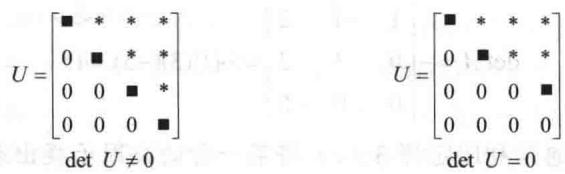

import Guide from '@/components/Guide.astro';
import Knowledge from '@/components/Knowledge.astro';
import Example from '@/components/Example.astro';
import Analysis from '@/components/Analysis.astro';
import Solution from '@/components/Solution.astro';
import Variant from '@/components/Variant.astro';
import Note from '@/components/Note.astro';
import Block from '@/components/Block.astro';
import Method from '@/components/Method.astro';
import Exercise from '@/components/Exercise.astro';

行列式的奥秘在于进行行变换时它如何变化. 下列定理推广了 3.1 节中习题 19\~24 的结果, 其证明在本节末尾.

<Knowledge title="定理 3 行变换">
令 A 是一个方阵.

a. 若 A 的某一行的倍数加到另一行得矩阵 B，则 $\det B = \det A$ .

b. 若 $A$ 的两行互换得矩阵 $B$ ，则 $\operatorname{det} B = -\operatorname{det} A$ .

c. 若 A 的某行乘以 k 倍得到矩阵 B，则 $\det B = k \cdot \det A$ .

下列例子展示了如何利用定理 3 来有效地计算行列式.
</Knowledge>

<Example title="例 1">
计算 $\det A$ ，其中 $A=\begin{bmatrix}1&-4&2\\ -2&8&-9\\ -1&7&0\end{bmatrix}$ .

<Solution title="解">
思路是先将 $A$ 化简成阶梯形，再利用三角形矩阵的行列式等于对角线上元素之积的知

识. 针对第一列的前两次行倍加均不改变行列式的值:

$$
\det A = \left| \begin{array}{r r r} 1 & - 4 & 2 \\ - 2 & 8 & - 9 \\ - 1 & 7 & 0 \end{array} \right| = \left| \begin{array}{r r r} 1 & - 4 & 2 \\ 0 & 0 & - 5 \\ - 1 & 7 & 0 \end{array} \right| = \left| \begin{array}{r r r} 1 & - 4 & 2 \\ 0 & 0 & - 5 \\ 0 & 3 & 2 \end{array} \right|
$$

交换第2行与第3行使行列式取反号，即

$$
\det A = - \left| \begin{array}{c c c} 1 & - 4 & 2 \\ 0 & 3 & 2 \\ 0 & 0 & - 5 \end{array} \right| = - (1) (3) (- 5) = 1 5
$$

手工计算行列式时，通常利用定理3（c）将某一行的公因子提出来，如

$$
\left| \begin{array}{c c c} * & * & * \\ 5 k & - 2 k & 3 k \\ * & * & * \end{array} \right| = k \left| \begin{array}{c c c} * & * & * \\ 5 & - 2 & 3 \\ * & * & * \end{array} \right|
$$

其中用星号标记的元素不变. 在下例中用此方法.
</Solution>
</Example>

<Example title="例 2">
计算 $\operatorname{det} A$ ，其中 $A = \begin{bmatrix} 2 & -8 & 6 & 8 \\ 3 & -9 & 5 & 10 \\ -3 & 0 & 1 & -2 \\ 1 & -4 & 0 & 6 \end{bmatrix}$ .

<Solution title="解">
为简化计算, 设法使左上角为 1. 可将第 1 行与第 4 行交换, 也可由第 1 行提出因子 2, 再对第 1 列做行倍加:

$$
\det A = 2 \left| \begin{array}{r r r r} 1 & - 4 & 3 & 4 \\ 3 & - 9 & 5 & 1 0 \\ - 3 & 0 & 1 & - 2 \\ 1 & - 4 & 0 & 6 \end{array} \right| = 2 \left| \begin{array}{r r r r} 1 & - 4 & 3 & 4 \\ 0 & 3 & - 4 & - 2 \\ 0 & - 1 2 & 1 0 & 1 0 \\ 0 & 0 & - 3 & 2 \end{array} \right|
$$

然后，可再从第3行中提出2，或利用第2列中的3作为一个主元。此处我们用后者，将第2行的4倍加到第3行：

$$
\det A = 2 \left| \begin{array}{c c c c} 1 & - 4 & 3 & 4 \\ 0 & 3 & - 4 & - 2 \\ 0 & 0 & - 6 & 2 \\ 0 & 0 & - 3 & 2 \end{array} \right|
$$

最后，将-1/2倍的第3行加到第4行，再计算这个“三角形”行列式得

$$
\det A = 2 \left| \begin{array}{c c c c} 1 & - 4 & 3 & 4 \\ 0 & 3 & - 4 & - 2 \\ 0 & 0 & - 6 & 2 \\ 0 & 0 & 0 & 1 \end{array} \right| = 2 \cdot (1) \cdot (3) \cdot (- 6) \cdot (1) = - 3 6
$$

若一个方阵 $A$ 通过行倍加和行交换化简为阶梯形 $U$ （这总是可以做到的，见1.2节行化简算法），且此过程经过了 $r$ 次行交换，则定理3表明

$$
\det A = (- 1) ^ {r} \det U
$$

由于 U 是阶梯形，故它是三角阵，因此 $\det U$ 是主对角线上的元素 $u_{11}, \cdots, u_{nn}$ 的乘积。若 A 可逆，则元素 $u_{ii}$ 都是主元（因为 $A \sim I_{n}$ 且 $u_{ii}$ 没有被倍乘变为 1）。否则，至少有 $u_{nn}$ 等于零，乘积 $u_{11} \cdots u_{nn}$ 为零。见图 3-1。

  
图 3-1 标准的阶梯形方阵

从而有以下公式：

$$
\det A = \left\{ \begin{array}{l l} (- 1) ^ {r} \cdot (U \text {的主元乘积}) & \text {当} A \text {可逆} \\ 0 & \text {当} A \text {不可逆} \end{array} \right.\tag{1}
$$
</Solution>
</Example>

<Note>
意到下列有趣的情形：尽管上述中的阶梯形 $U$ 是不唯一的（因为它并没有经过完全的行简化），主元也不是唯一的，但除了差一个负号外，这些主元的乘积是唯一的.

公式（1）不但给出 $\det A$ 的一个具体的解释，还证明了本节的主要定理：
</Note>

<Knowledge title="定理 4">
方阵 A 是可逆的当且仅当 $\det A \neq 0$ .
</Knowledge>

<Knowledge title="定理 4">
把语句 “ $\det A \neq 0$ ” 增加到可逆矩阵定理中。一个有用的推论是若 A 的列是线性相关的，则 $\det A = 0$ 。而且若 A 的行是线性相关的，则 $\det A = 0$ 。（A 的行是 $A^{T}$ 的列，由 $A^{T}$ 的列线性相关可推出 $A^{T}$ 是奇异的。当 $A^{T}$ 是奇异矩阵时，由可逆矩阵定理可知，A 也是奇异的。）在实际问题中，当两行或两列是相同的或者一行或一列是零时，则线性相关是显然的。
</Knowledge>

<Example title="例 3">
计算 $\operatorname{det} A$ ， $A = \begin{bmatrix} 3 & -1 & 2 & -5 \\ 0 & 5 & -3 & -6 \\ -6 & 7 & -7 & 4 \\ -5 & -8 & 0 & 9 \end{bmatrix}$ .

<Solution title="解">
将 2 倍的第 1 行加到第 3 行，得

$$
\det A = \det \left[ \begin{array}{r r r r} 3 & - 1 & 2 & - 5 \\ 0 & 5 & - 3 & - 6 \\ 0 & 5 & - 3 & - 6 \\ - 5 & - 8 & 0 & 9 \end{array} \right] = 0
$$

这是因为上面矩阵的第2行和第3行相等.

数值计算的注解

1. 对一般的矩阵 A，许多计算 $\det A$ 的计算机程序使用上面公式（1）的方法.

2. 可以证明一个 $n \times n$ 行列式利用行变换展开大约需要 $2n^{3} / 3$ 次算术运算, 任何现代微型计算机可以在不到一秒钟内计算一个 $25 \times 25$ 行列式, 因为仅需大约 10000 次运算.

充分利用出现的多个零，利用特别的指令，计算机还可以处理大的“稀疏”矩阵。当然，零元素可加快手算过程。下例的计算中结合了行变换的优势和3.1节中余因子展开中利用零元素的技巧。
</Solution>
</Example>

<Example title="例 4">
计算 $\operatorname{det} A$ ， $A = \begin{bmatrix} 0 & 1 & 2 & -1 \\ 2 & 5 & -7 & 3 \\ 0 & 3 & 6 & 2 \\ -2 & -5 & 4 & -2 \end{bmatrix}$ .

<Solution title="解">
开始最好是利用第1列中的2作为一个主元，消去下面的-2，再利用余因子展开式化简成低一阶的行列式，然后再运用行倍加变换．因此

$$
\det A = \left| \begin{array}{c c c c} 0 & 1 & 2 & - 1 \\ 2 & 5 & - 7 & 3 \\ 0 & 3 & 6 & 2 \\ 0 & 0 & - 3 & 1 \end{array} \right| = - 2 \left| \begin{array}{c c c} 1 & 2 & - 1 \\ 3 & 6 & 2 \\ 0 & - 3 & 1 \end{array} \right| = - 2 \left| \begin{array}{c c c} 1 & 2 & - 1 \\ 0 & 0 & 5 \\ 0 & - 3 & 1 \end{array} \right|
$$

交换第2行与第3行得到一个“三角形行列式”。另一种方法是按第1列的余因子展开式：

$$
\det A = (- 2) \cdot (1) \left[ \begin{array}{c c} 0 & 5 \\ - 3 & 1 \end{array} \right] = - 2 \cdot (1 5) = - 3 0
$$
</Solution>
</Example>

## 列变换

类似于前面已经考虑过的行变换，我们可以对矩阵的列实行变换，下一个定理证明行列式的列变换与行变换具有相同的效果.

<Note>
数学归纳原理表述为：令 $P(n)$ 对每个自然数 $n$ 成立或不成立。假设 $P(1)$ 成立，则 $P(n)$ 对所有 $n \geqslant 1$ 的情形成立。对每个自然数 $k$ ，若 $P(k)$ 成立，则 $P(k + 1)$ 成立。用数学归纳原理证明下述定理。
</Note>

<Knowledge title="定理 5">
若 $A$ 为一个 $n \times n$ 矩阵，则 $\operatorname{det} A^{\mathrm{T}} = \operatorname{det} A$ .

<Solution title="证明">
当 $n = 1$ 时，定理显然成立. 假设定理对 $k \times k$ 行列式成立. 令 $n = k + 1$ ，则 $A$ 中 $a_{1j}$ 的余因子等于 $A^{\mathrm{T}}$ 中 $a_{j1}$ 的余因子，这是因为这些余因子是由 $k \times k$ 行列式表示的. 所以 $\operatorname{det} A$ 沿着第一行的余因子展开式等于 $\operatorname{det} A^{\mathrm{T}}$ 沿第一列的余因子展开式，即 $\operatorname{det} A = \operatorname{det} A^{\mathrm{T}}$ . 于是定理对 $n = k + 1$ 也成立，即定理对一个 $n$ 成立就可以推出对 $n + 1$ 成立. 由数学归纳原理，定理对任意 $n \geqslant 1$ 均成立.

因为定理5成立，所以当把定理3中出现的“行”字变成“列”字时，定理3中每一个命题均成立。为证此性质，只需针对 $A^{\mathrm{T}}$ 应用原来的定理3。对 $A^{\mathrm{T}}$ 的一个行变换相当于对 $A$ 的一个列变换。

列变换对理论和手工计算都是很有用的. 然而, 为了简单, 在数值计算中, 我们仅采用行变换.
</Solution>
</Knowledge>

## 行列式与矩阵乘积

下列有用定理的证明放在本节末尾，其应用放在习题中.

<Knowledge title="定理 6 乘法的性质">
若 A 和 B 均为 $n \times n$ 矩阵，则 $\det AB = (\det A)(\det B)$ .
</Knowledge>

<Example title="例 5">
对 $A = \begin{bmatrix} 6 & 1 \\ 3 & 2 \end{bmatrix}$ , $B = \begin{bmatrix} 4 & 3 \\ 1 & 2 \end{bmatrix}$ , 验证定理6.

<Solution title="解">
$$
A B = \left[ \begin{array}{l l} 6 & 1 \\ 3 & 2 \end{array} \right] \left[ \begin{array}{l l} 4 & 3 \\ 1 & 2 \end{array} \right] = \left[ \begin{array}{l l} 2 5 & 2 0 \\ 1 4 & 1 3 \end{array} \right]
$$

$$
\det A B = 2 5 \cdot 1 3 - 2 0 \cdot 1 4 = 3 2 5 - 2 8 0 = 4 5
$$

由于 $\operatorname{det} A = 9$ ， $\operatorname{det} B = 5$ ，故

$$
(\det A) (\det B) = 9 \cdot 5 = 4 5 = \det A B
$$
</Solution>
</Example>

<Note>
通常一个错误的观点是定理6对矩阵的和也有类似的结果。然而，一般而言， $\operatorname{det}(A + B)$ 不等于 $\operatorname{det} A + \operatorname{det} B$ 。
</Note>

## 行列式函数的一个线性性质

若 $A$ 为 $n \times n$ 矩阵，可以将 $\operatorname{det} A$ 看作 $A$ 中 $n$ 个列向量的函数。我们将证明如果 $A$ 中除了一列之外都是固定的向量，则 $\operatorname{det} A$ 是那个可变列向量的线性函数。

假设 A 的第 j 列允许有变化，A 可写成

$$
A = \left[ \begin{array}{l l l l l l} \boldsymbol {a} _ {1} & \dots & \boldsymbol {a} _ {j - 1} & \boldsymbol {x} & \boldsymbol {a} _ {j + 1} & \dots & \boldsymbol {a} _ {n} \end{array} \right]
$$

定义由 $\mathbb{R}^n$ 到 $\mathbb{R}$ 的变换 $T$ 为

$$
T (\boldsymbol {x}) = \det [ \boldsymbol {a} _ {1} \dots \boldsymbol {a} _ {j - 1} \boldsymbol {x} \boldsymbol {a} _ {j + 1} \dots \boldsymbol {a} _ {n} ]
$$

则有

$$
T (c \pmb {x}) = c T (\pmb {x}), \text {对任意常数} c \text {和} \mathbb {R} ^ {n} \text {中任意} \pmb {x} \text {成立}\tag{2}
$$

$$
T (\pmb {u} + \pmb {v}) = T (\pmb {u}) + T (\pmb {v}), \text {对} \mathbb {R} ^ {n} \text {中所有} \pmb {u}, \pmb {v} \text {成立}\tag{3}
$$

性质（2）即定理3（c）应用到 $A$ 的列。（3）的一个证明可由det $A$ 按第 $j$ 列的余因子展开式来完成（见习题43）。行列式的这个线性性质有许多有用的推论，将会在高级的课程学习中研究.

## 定理3和定理6的证明

借助于2.2节中讨论的初等矩阵，证明定理3是方便的。我们称一个初等矩阵 $E$ 是一个行倍加(矩阵)，如果 $E$ 是由单位矩阵 $I$ 经一行加另一行的倍数而得到；称 $E$ 是一个交换，如果 $E$ 是由交换 $I$ 的两行而得到；称 $E$ 是一个 $r$ 倍乘，如果 $E$ 是由 $I$ 的某一行乘以一个非零数而得到。用这些术语，定理3可重新叙述如下：

若 $A$ 是一个 $n \times n$ 矩阵， $E$ 是一个 $n \times n$ 初等矩阵，则

$$
\det E A = (\det E) (\det A)
$$

其中

$$
\det E = \left\{ \begin{array}{l l} 1 & \text { 若 } E \text { 是一个行倍加 } \\ - 1 & \text { 若 } E \text { 是一个交换 } \\ r & \text { 若 } E \text { 是一个 } r \text { 倍乘 } \end{array} \right.
$$

定理3的证明 针对 $A$ 的行或列的大小用归纳法. $2 \times 2$ 矩阵的情形在3.1节的习题33\~36中已证. 假设该定理对 $k \times k$ 矩阵的行列式成立, $k \geqslant 2$ , 令 $n = k + 1$ , $A$ 为 $n \times n$ 矩阵. $E$ 对 $A$ 的作用涉及两行或一行. 所以我们可以按在 $E$ 的作用下没有被改变的一行展开detEA, 比如说第 $i$ 行. 令 $A_{ij}$ （分别地, $B_{ij}$ ）是由 $A$ （分别地, EA）中划掉第 $i$ 行第 $j$ 列得到的矩阵, 则 $B_{ij}$ 的行由 $A_{ij}$ 的行通过实行与 $E$ 作用于 $A$ 相同类型的初等行变换得到. 由于这些子矩阵仅仅是 $k \times k$ 矩阵, 因此归纳假设蕴涵

$$
\det B _ {i j} = \alpha \cdot \det A _ {i j}
$$

其中 $\alpha = 1, -1$ 或 $r$ ，依 $E$ 的类型而定．detEA沿第 $i$ 行的余因子展开式是

$$
\begin{array}{r l} \det E A & = a _ {i 1} (- 1) ^ {i + 1} \det B _ {i 1} + \dots + a _ {i n} (- 1) ^ {i + n} \det B _ {i n} \\ & = \alpha a _ {i 1} (- 1) ^ {i + 1} \det A _ {i 1} + \dots + \alpha a _ {i n} (- 1) ^ {i + n} \det A _ {i n} \\ & = \alpha \cdot \det A \end{array}
$$

特别地，取 $A = I_{n}$ ，则 $\operatorname{det}E = 1, - 1$ 或 $r$ ，依赖于 $E$ 的类型而定.于是定理对 $n = 2$ 成立．定理对 $n$ 成立蕴涵对 $n + 1$ 时也成立．由归纳法原理，定理对 $n\geqslant 2$ 均成立．对 $n = 1$ 时，定理显然成立.

定理 6 的证明 若 A 不可逆，则由 2.3 节中习题 27，AB 也不可逆。在此情形下，由定理 4，因 det A 和 det A·det B 均为零，故 det AB = (det A)(det B) 成立。若 A 可逆，则由可逆矩阵定理，A 与单位矩阵 $I_{n}$ 行等价，所以存在初等矩阵 $E_{1}, \cdots, E_{p}$ 使得

$$
A = E _ {p} E _ {p - 1} \dots E _ {1} I _ {n} = E _ {p} E _ {p - 1} \dots E _ {1}
$$

为了简单，用 $|A|$ 表示 $\operatorname{det} A$ 。反复应用定理3，如上面所重新描述的那样，得

$$
\begin{array}{r l} \left| A B \right| & = \left| E _ {p} \dots E _ {1} B \right| = \left| E _ {p} \right| \cdot \left| E _ {p - 1} \dots E _ {1} B \right| = \dots \\ & = \left| E _ {p} \right| \dots \left| E _ {1} \right| \cdot | B | = \dots = \left| E _ {p} \dots E _ {1} \right| \cdot | B | \\ & = | A | | B | \end{array}
$$

<Block title="练习题">
1. 用尽可能少的步骤计算 $\begin{vmatrix} 1 & -3 & 1 & -2 \\ 2 & -5 & -1 & -2 \\ 0 & -4 & 5 & 1 \\ -3 & 10 & -6 & 8 \end{vmatrix}$ .

2. 用一个行列式来确定向量 $v_{1}, v_{2}, v_{3}$ 是否线性无关，这里

$$
\boldsymbol {v} _ {1} = \left[ \begin{array}{c} 5 \\ - 7 \\ 9 \end{array} \right], \boldsymbol {v} _ {2} = \left[ \begin{array}{c} - 3 \\ 3 \\ - 5 \end{array} \right], \boldsymbol {v} _ {3} = \left[ \begin{array}{c} 2 \\ - 7 \\ 5 \end{array} \right]
$$

3. 设 A 是一个 $n \times n$ 矩阵，满足 $A^{2} = I$ 。证明 $\det A = \pm 1$
</Block>

<Block title="习题3.2">
在习题 1\~4 中, 每个方程说明行列式的一个性质. 叙述这些性质.

1.

$$
\left| \begin{array}{r r r} 0 & 5 & - 2 \\ 1 & - 3 & 6 \\ 4 & - 1 & 8 \end{array} \right| = - \left| \begin{array}{r r r} 1 & - 3 & 6 \\ 0 & 5 & - 2 \\ 4 & - 1 & 8 \end{array} \right|
$$

2.

$$
\left| \begin{array}{c c c} 1 & 2 & 2 \\ 0 & 3 & - 4 \\ 3 & 7 & 4 \end{array} \right| = \left| \begin{array}{c c c} 1 & 2 & 2 \\ 0 & 3 & - 4 \\ 0 & 1 & - 2 \end{array} \right|
$$

3.

$$
\left| \begin{array}{c c c} 3 & - 6 & 9 \\ 3 & 5 & - 5 \\ 1 & 3 & 3 \end{array} \right| = 3 \left| \begin{array}{c c c} 1 & - 2 & 3 \\ 3 & 5 & - 5 \\ 1 & 3 & 3 \end{array} \right|
$$

4.

$$
\left| \begin{array}{c c c} 1 & 3 & - 4 \\ 2 & 0 & - 3 \\ 3 & - 5 & 2 \end{array} \right| = \left| \begin{array}{c c c} 1 & 3 & - 4 \\ 0 & - 6 & 5 \\ 3 & - 5 & 2 \end{array} \right|
$$

在习题 5\~10 中，通过行化简成阶梯形求行列式的值.

5.

$$
\left| \begin{array}{r r r} 1 & 5 & - 4 \\ - 1 & - 4 & 5 \\ - 2 & - 8 & 7 \end{array} \right|
$$

6.

$$
\left| \begin{array}{c c c} 3 & 3 & - 3 \\ 3 & 4 & - 4 \\ 2 & - 3 & - 5 \end{array} \right|
$$

7.

$$
\left| \begin{array}{r r r r} 1 & 3 & 0 & 2 \\ - 2 & - 5 & 7 & 4 \\ 3 & 5 & 2 & 1 \\ 1 & - 1 & 2 & - 3 \end{array} \right|
$$

8.

$$
\left| \begin{array}{c c c c} 1 & 3 & 2 & - 4 \\ 0 & 1 & 2 & - 5 \\ 2 & 7 & 6 & - 3 \\ - 3 & - 1 0 & - 7 & 2 \end{array} \right|
$$

9.

$$
\left| \begin{array}{r r r r} 1 & - 1 & - 3 & 0 \\ 0 & 1 & 5 & 4 \\ - 1 & 0 & 5 & 3 \\ 3 & - 3 & - 2 & 3 \end{array} \right|
$$

10.

$$
\left| \begin{array}{r r r r r} 1 & 3 & - 1 & 0 & - 2 \\ 0 & 2 & - 4 & - 2 & - 6 \\ - 2 & - 6 & 2 & 3 & 1 0 \\ 1 & 5 & - 6 & 2 & - 3 \\ 0 & 2 & - 4 & 5 & 9 \end{array} \right|
$$

在习题 11\~14 中, 结合行化简和余因子展开的方法计算行列式的值.

11.

$$
\left| \begin{array}{c c c c} 3 & 4 & - 3 & - 1 \\ 3 & 0 & 1 & - 3 \\ - 6 & 0 & - 4 & 3 \\ 6 & 8 & - 4 & - 1 \end{array} \right|
$$

12.

$$
\left[ \begin{array}{c c c c} - 1 & 2 & 3 & 0 \\ 3 & 4 & 3 & 0 \\ 1 1 & 4 & 6 & 6 \\ 4 & 2 & 4 & 3 \end{array} \right]
$$

(k, təb) (E, r., - )

13.

$$
\left| \begin{array}{r r r r} 2 & 5 & 4 & 1 \\ 4 & 7 & 6 & 2 \\ 6 & - 2 & - 4 & 0 \\ - 6 & 7 & 7 & 0 \end{array} \right|
$$

14.

$$
\left[ \begin{array}{r r r r} 1 & 5 & 4 & 1 \\ 0 & - 2 & - 4 & 0 \\ 3 & 5 & 4 & 1 \\ - 6 & 5 & 5 & 0 \end{array} \right]
$$

求习题 15\~20 中的行列式，已知 $\begin{vmatrix} a & b & c \\ d & e & f \\ g & h & i \end{vmatrix} = 7$ .

15.

$$
\left| \begin{array}{c c c} a & b & c \\ d & e & f \\ 3 g & 3 h & 3 i \end{array} \right|
$$

16.

$$
\left| \begin{array}{c c c} a & b & c \\ 5 d & 5 e & 5 f \\ g & h & i \end{array} \right|
$$

17.

$$
\left| \begin{array}{c c c} a + d & b + e & c + f \\ d & e & f \\ g & h & i \end{array} \right|
$$

18.

$$
\left| \begin{array}{c c c} d & e & f \\ a & b & c \\ g & h & i \end{array} \right|
$$

19.

$$
\left| \begin{array}{c c c} a & b & c \\ 2 d + a & 2 e + b & 2 f + c \\ g & h & i \end{array} \right|
$$

20.

$$
\left| \begin{array}{c c c} a & b & c \\ d + 3 g & e + 3 h & f + 3 i \\ g & h & i \end{array} \right|
$$

在习题 21\~23 中, 利用行列式检验这些矩阵是否可逆.

21.

$$
\left[ \begin{array}{c c c} 2 & 6 & 0 \\ 1 & 3 & 2 \\ 3 & 9 & 2 \end{array} \right]
$$

22.

$$
\left[ \begin{array}{c c c} 5 & 1 & - 1 \\ 1 & - 3 & - 2 \\ 0 & 5 & 3 \end{array} \right]
$$

23.

$$
\left[ \begin{array}{r r r r} 2 & 0 & 0 & 6 \\ 1 & - 7 & - 5 & 0 \\ 3 & 8 & 6 & 0 \\ 0 & 7 & 5 & 4 \end{array} \right]
$$

在习题 24\~26 中, 利用行列式判断每组向量是否线性无关.

24.

$$
\left[ \begin{array}{c} 4 \\ 6 \\ 2 \end{array} \right], \left[ \begin{array}{c} - 7 \\ 0 \\ 7 \end{array} \right], \left[ \begin{array}{c} - 3 \\ - 5 \\ - 2 \end{array} \right]
$$

25.

$$
\left[ \begin{array}{c} 7 \\ - 4 \\ - 6 \end{array} \right], \quad \left[ \begin{array}{c} - 8 \\ 5 \\ 7 \end{array} \right], \quad \left[ \begin{array}{c} 7 \\ 0 \\ - 5 \end{array} \right]
$$

26.

$$
\left[ \begin{array}{r} 3 \\ 5 \\ - 6 \\ 4 \end{array} \right], \left[ \begin{array}{r} 2 \\ - 6 \\ 0 \\ 7 \end{array} \right], \left[ \begin{array}{r} - 2 \\ - 1 \\ 3 \\ 0 \end{array} \right], \left[ \begin{array}{r} 0 \\ 0 \\ 0 \\ - 2 \end{array} \right]
$$

在习题 27 和习题 28 中，A,B 均为 $n \times n$ 矩阵，标出每个命题的真假，给出理由.

27. a. 矩阵的行倍加变换不影响矩阵的行列式.
b. 矩阵 A 的行列式是 A 的任意一个阶梯形 U 中主元之积再乘以 $(-1)^{r}$ ，其中 r 是 A 经行化简成 U 时做的行交换的次数.
c. 若 A 的列是线性相关的，则 $\det A = 0$ .
d. $\det(A+B)=\det A+\det B$

28. a. 如果连续作了两次行交换，则新的行列式等于原来的行列式.
b. A 的行列式等于其对角线元素之积.

c. 若 $\det A$ 为零，则其两行或两列相同，或者一行或一列为零.
d. $\det A^{-1}=(-1)\det A$ .

29. 计算 $\operatorname{det} B^4$ ，其中 $B = \begin{bmatrix} 1 & 0 & 1 \\ 1 & 1 & 2 \\ 1 & 2 & 1 \end{bmatrix}$ .

30. 利用定理 3（但不用定理 4）来证明，若方阵 A 的两行相等，则 $\det A = 0$ 。此结论对两列相等的情形也成立，为什么？
对习题 31\~36，在你的解释中指出用到的一个合适的定理。

31. 证明：如果 $A$ 可逆，则 $\operatorname{det} A^{-1} = \frac{1}{\operatorname{det} A}$ .

32. 假设 $A$ 为方阵，且 $\operatorname{det} A^3 = 0$ ，解释为什么 $A$ 不可能是可逆的.

33. 若 $A, B$ 均为方阵，证明：即使 $AB$ 与 $BA$ 可能不相等， $\operatorname{det} AB = \operatorname{det} BA$ 也总是成立的.

34. 若 A, P 均为方阵，P 可逆，证明 $\det(PAP^{-1}) = \det A$ .

35. 假设 $U$ 为方阵，满足 $U^{\mathrm{T}}U = I$ ，证明 $\operatorname{det} U = \pm 1$

36. 若 $A$ 为一个 $n \times n$ 矩阵，试找出一个计算 $\operatorname{det}(rA)$ 的公式.

在习题 37 和习题 38 中，验证 $\det AB = (\det A) + (\det B)$ .（不要使用定理 6.）

37. $A = \begin{bmatrix} 3 & 0\\ 6 & 1 \end{bmatrix},B = \begin{bmatrix} 2 & 0\\ 5 & 4 \end{bmatrix}$

38. $A=\begin{bmatrix}3 & 6 \\ -1 & -2\end{bmatrix}, B=\begin{bmatrix}4 & 3 \\ -1 & -3\end{bmatrix}$

39. 若 A, B 均为 $3 \times 3$ 矩阵，且 $\det A = -3, \det B = 4$ .
利用（文中或上面习题中的）行列式性质计算
a. $\det AB$ b. $\det 5A$ c. $\det B^{T}$ d. $\det A^{-1}$ e. $\det A^{3}$

40. 若 A, B 均为 $4 \times 4$ 矩阵，det A = -3, det B = -1，计算
a. det AB b. det $B^{5}$ c. det 2A
d. det $A^{T}BA$ e. det $B^{-1}AB$

41. 验证 $\det A = \det B + \det C$ ，其中 $A=\begin{bmatrix}a+e & b+f \\ c & d\end{bmatrix}, B=\begin{bmatrix}a & b \\ c & d\end{bmatrix}, C=\begin{bmatrix}e & f \\ c & d\end{bmatrix}$

42. 设 $A = \begin{bmatrix} 1 & 0 \\ 0 & 1 \end{bmatrix}$ , $B = \begin{bmatrix} a & b \\ c & d \end{bmatrix}$ , 证明 $\operatorname{det}(A + B) = \operatorname{det} A + \operatorname{det} B$ , 当且仅当 $a + d = 0$ .

43. 验证 $\det A = \det B + \det C$ ，其中 $A=\begin{bmatrix}a_{11}&a_{12}&u_{1}+v_{1}\\ a_{21}&a_{22}&u_{2}+v_{2}\\ a_{31}&a_{32}&u_{3}+v_{3}\end{bmatrix},$ $B=\begin{bmatrix}a_{11}&a_{12}&u_{1}\\ a_{21}&a_{22}&u_{2}\\ a_{31}&a_{32}&u_{3}\end{bmatrix},C=\begin{bmatrix}a_{11}&a_{12}&v_{1}\\ a_{21}&a_{22}&v_{2}\\ a_{31}&a_{32}&v_{3}\end{bmatrix}$

注意 A 与 $B + C$ 并不相同.

44. 矩阵 $A$ 右乘一个初等矩阵 $E$ 对 $A$ 的列的影响与左乘一个初等矩阵对行的影响相同. 使用定理5和定理3以及 $E^{\mathrm{T}}$ 仍为初等矩阵这个明显的事实证明 $\operatorname{det} AE = (\operatorname{det} E)(\operatorname{det} A)$ ，要求不能使用定理6.

45. [M]对几个随机选取的 $4 \times 5$ 矩阵和 $5 \times 6$ 矩阵，计算 $\operatorname{det} A^{\mathrm{T}} A$ 和 $\operatorname{det} AA^{\mathrm{T}}$ 。当 $A$ 的列数大于行数时，对 $A^{\mathrm{T}} A$ 和 $AA^{\mathrm{T}}$ 会是如何？

46. [M]如果 $\operatorname{det} A$ 接近于零，矩阵 $A$ 是接近奇异的吗？用下面接近奇异的 $4 \times 4$ 矩阵 $A$ 进行实验.

$$
A = \left[ \begin{array}{r r r r} 4 & 0 & - 7 & - 7 \\ - 6 & 1 & 1 1 & 9 \\ 7 & - 5 & 1 0 & 1 9 \\ - 1 & 2 & 3 & - 1 \end{array} \right]
$$

计算 A，10A，0.1A 的行列式。作为对比，计算这些矩阵的条件数。当 A 为 $4 \times 4$ 单位矩阵时，重复这些计算，讨论你的结论。
</Block>

<Block title="练习题答案">
1. 做行倍加变换，在第一列生成零，接着产生一个零行.

$$
\left| \begin{array}{r r r r} 1 & - 3 & 1 & - 2 \\ 2 & - 5 & - 1 & - 2 \\ 0 & - 4 & 5 & 1 \\ - 3 & 1 0 & - 6 & 8 \end{array} \right| = \left| \begin{array}{r r r r} 1 & - 3 & 1 & - 2 \\ 0 & 1 & - 3 & 2 \\ 0 & - 4 & 5 & 1 \\ 0 & 1 & - 3 & 2 \end{array} \right| = \left| \begin{array}{r r r r} 1 & - 3 & 1 & - 2 \\ 0 & 1 & - 3 & 2 \\ 0 & - 4 & 5 & 1 \\ 0 & 0 & 0 & 0 \end{array} \right| = 0
$$

$$
\begin{array}{r l} 2. \det [ \boldsymbol {v} _ {1} \quad \boldsymbol {v} _ {2} \quad \boldsymbol {v} _ {3} ] & = \left| \begin{array}{c c c} 5 & - 3 & 2 \\ - 7 & 3 & - 7 \\ 9 & - 5 & 5 \end{array} \right| = \left| \begin{array}{c c c} 5 & - 3 & 2 \\ - 2 & 0 & - 5 \\ 9 & - 5 & 5 \end{array} \right| \\ & = - (- 3) \left| \begin{array}{c c} - 2 & - 5 \\ 9 & 5 \end{array} \right| - (- 5) \left| \begin{array}{c c} 5 & 2 \\ - 2 & - 5 \end{array} \right| \\ & = 3 \cdot (3 5) + 5 \cdot (- 2 1) = 0 \end{array}
$$

第1行加到第2行

按第2列的余因子展开式

由定理4，矩阵 $[\pmb{v}_1\pmb{v}_2\pmb{v}_3]$ 不可逆．由可逆矩阵定理，这三列是线性相关的.

3. 由 $\operatorname{det} I = 1$ 及定理6， $\operatorname{det}(AA) = (\operatorname{det} A)(\operatorname{det} A)$ . 可得

$$
1 = \det I = \det A ^ {2} = \det (A A) = (\det A) (\det A) = (\det A) ^ {2}
$$

对上式两边开平方得 $\det A = \pm 1$ .
</Block>
