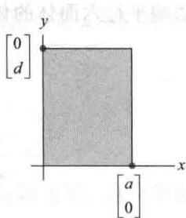
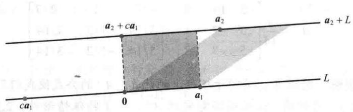
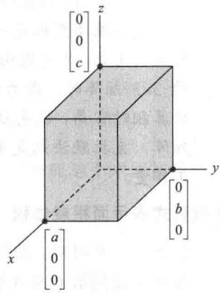
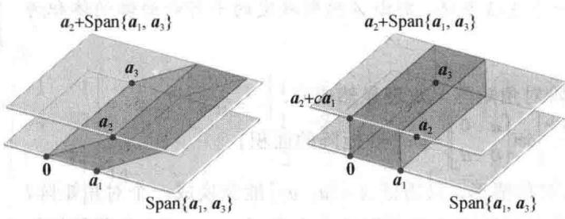
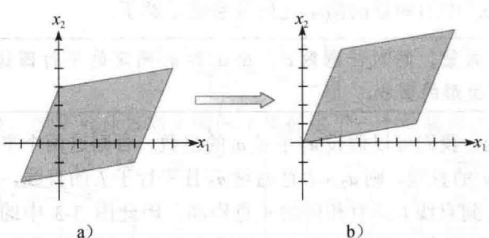
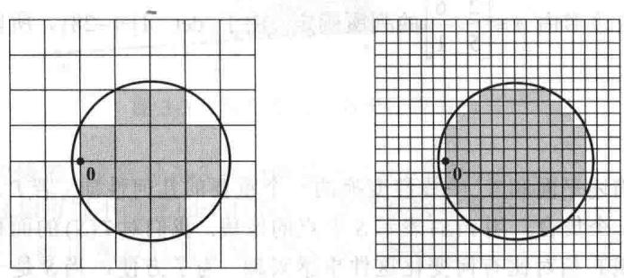
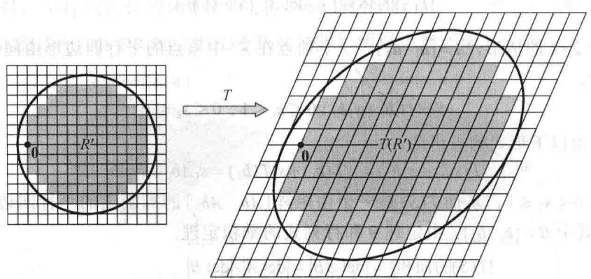
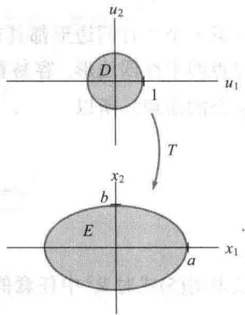
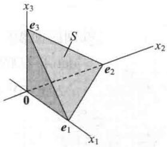
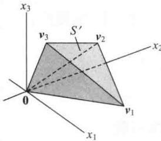

import Guide from '@/components/Guide.astro';
import Knowledge from '@/components/Knowledge.astro';
import Example from '@/components/Example.astro';
import Analysis from '@/components/Analysis.astro';
import Solution from '@/components/Solution.astro';
import Variant from '@/components/Variant.astro';
import Note from '@/components/Note.astro';
import Block from '@/components/Block.astro';
import Method from '@/components/Method.astro';
import Exercise from '@/components/Exercise.astro';

本节应用前面几节的理论得到一些重要且有理论意义的公式以及行列式的几何解释.

## 克拉默法则

克拉默法则在各种理论计算中是必需的. 例如, 它被用来研究 $Ax = b$ 的解受 $\pmb{b}$ 中元素的变化而受到什么样的影响. 然而, 这个公式对手工运算是没有多大效果的, 除非是 $2 \times 2$ 或 $3 \times 3$ 矩阵: 对任意 $n \times n$ 矩阵 $A$ 和任意的 $\mathbb{R}^n$ 中向量 $\pmb{b}$ , 令 $A_i(\pmb{b})$ 表示 $A$ 中第 $i$ 列由向量 $\pmb{b}$ 替换得到的矩阵:

$$
A _ {i} (\pmb {b}) = [ \pmb {a} _ {1} \dots \pmb {b} \dots \pmb {a} _ {n} ]
$$

<Knowledge title="定理 7 克拉默法则">
设 A 是一个可逆的 $n \times n$ 矩阵，对 $R^{n}$ 中任意向量 b，方程 Ax = b 的唯一解可由下式给出：

$$
x _ {i} = \frac {\det A _ {i} (\boldsymbol {b})}{\det A}, i = 1, 2, \dots , n\tag{1}
$$

<Solution title="证明">
用 $a_1, \cdots, a_n$ 表示 $A$ 的列，用 $e_1, \cdots, e_n$ 表示 $n \times n$ 单位阵 $I$ 的列。若 $Ax = b$ ，则由矩阵乘法的定义有

$$
\begin{array}{r l} A \cdot I _ {i} (\boldsymbol {x}) & = A [ \boldsymbol {e} _ {1} \dots \boldsymbol {x} \dots \boldsymbol {e} _ {n} ] = [ A \boldsymbol {e} _ {1} \dots A \boldsymbol {x} \dots A \boldsymbol {e} _ {n} ] \\ & = [ \boldsymbol {a} _ {1} \dots \boldsymbol {b} \dots \boldsymbol {a} _ {n} ] = A _ {i} (\boldsymbol {b}) \end{array}
$$

由行列式的乘法性质，

$$
(\det A) (\det I _ {i} (\boldsymbol {x})) = \det A _ {i} (\boldsymbol {b})
$$

左边第二个行列式为 $x_{i}$ （沿第 $i$ 行作余因子展开），从而 $(\det A)x_{i} = \det A_{i}(\pmb{b})$ 由于 $A$ 可逆，从而 $\operatorname{det} A \neq 0$ ，于是证明了(1)式.
</Solution>
</Knowledge>

<Example title="例 1">
利用克拉默法则解方程组

$$
\begin{array}{r l} & 3 x _ {1} - 2 x _ {2} = 6 \\ & - 5 x _ {1} + 4 x _ {2} = 8 \end{array}
$$

<Solution title="解">
视此方程组为 Ax=b 型，利用上面引入的记号，

$$
A = \left[ \begin{array}{c c} 3 & - 2 \\ - 5 & 4 \end{array} \right], A _ {1} (\boldsymbol {b}) = \left[ \begin{array}{c c} 6 & - 2 \\ 8 & 4 \end{array} \right], A _ {2} (\boldsymbol {b}) = \left[ \begin{array}{c c} 3 & 6 \\ - 5 & 8 \end{array} \right]
$$

由于 $\operatorname{det} A = 2$ ，故此方程组有唯一解。由克拉默法则，有

$$
x _ {1} = \frac {\det A _ {1} (\pmb {b})}{\det A} = \frac {2 4 + 1 6}{2} = 2 0
$$

$$
x _ {2} = \frac {\det A _ {2} (\pmb {b})}{\det A} = \frac {2 4 + 3 0}{2} = 2 7
$$
</Solution>
</Example>

## 在工程上的应用

许多工程上的问题（特别是在电子工程和控制论中）能用拉普拉斯变换进行分析。这种技巧将一个适当的线性微分方程组转变为一个线性代数方程组，它的系数含有一个参数。下一个例子说明可能出现的代数方程组类型。

<Example title="例 2">
考虑下列方程组，其中 $s$ 是一个未定的参数。确定 $s$ 的值，使得这个方程组有唯一解，并利用克拉默法则写出这个解。

$$
\begin{array}{l} 3 s x _ {1} - 2 x _ {2} = 4 \\ - 6 x _ {1} + s x _ {2} = 1 \end{array}
$$

<Solution title="解">
视此方程组为 $Ax = b$ 型，则

$$
A = \left[ \begin{array}{c c} 3 s & - 2 \\ - 6 & s \end{array} \right], A _ {1} (\boldsymbol {b}) = \left[ \begin{array}{c c} 4 & - 2 \\ 1 & s \end{array} \right], A _ {2} (\boldsymbol {b}) = \left[ \begin{array}{c c} 3 s & 4 \\ - 6 & 1 \end{array} \right]
$$

由于 $\operatorname{det} A = 3s^2 - 12 = 3(s + 2)(s - 2)$ ，当 $s \neq \pm 2$ 时，这个方程组有唯一解。对这样的 $s$ ，方程组的解为 $(x_1, x_2)$ ，其中

$$
\begin{array}{l} x _ {1} = \frac {\det A _ {1} (\pmb {b})}{\det A} = \frac {4 s + 2}{3 (s + 2) (s - 2)} \\ x _ {2} = \frac {\det A _ {2} (\pmb {b})}{\det A} = \frac {3 s + 2 4}{3 (s + 2) (s - 2)} = \frac {s + 8}{(s + 2) (s - 2)} \end{array}
$$
</Solution>
</Example>

## 一个求 $A^{-1}$ 的公式

克拉默法则可以容易地导出一个求 $n \times n$ 矩阵 $A$ 的逆的一般公式. $A^{-1}$ 的第 $j$ 列是一个向量 $x$ , 满足

$$
A \boldsymbol {x} = \boldsymbol {e} _ {j}
$$

其中 $e_{j}$ 是单位矩阵的第 j 列，x 的第 i 个元素是 $A^{-1}$ 中的 $(i, j)$ 元素。由克拉默法则，

$$
\{A ^ {- 1} \mathrm{中} (i, j) \mathrm{元素} \} = x _ {i} = \frac {\det A _ {i} (\pmb {e} _ {j})}{\det A}\tag{2}
$$

回顾 $A_{ji}$ 表示 $A$ 的子矩阵，它由 $A$ 去掉第 $j$ 行和第 $i$ 列得到。 $A_{i}(\pmb{e}_{j})$ 按第 $i$ 列的余因子展开式为

$$
\det A _ {i} \left(\boldsymbol {e} _ {j}\right) = (- 1) ^ {i + j} \det A _ {j i} = C _ {j i}\tag{3}
$$

其中 $C_{ji}$ 是 $A$ 的一个余因子. 由（2）， $A^{-1}$ 的 $(i, j)$ 元素等于余因子 $C_{ji}$ 除以 $\det A$ 。（注意： $C_{ji}$ 的下标是 $(i, j)$ 的颠倒。）于是

$$
A ^ {- 1} = \frac {1}{\det A} \left[ \begin{array}{c c c c} C _ {1 1} & C _ {2 1} & \dots & C _ {n 1} \\ C _ {1 2} & C _ {2 2} & \dots & C _ {n 2} \\ \vdots & \vdots & & \vdots \\ C _ {1 n} & C _ {2 n} & \dots & C _ {n n} \end{array} \right]\tag{4}
$$

公式（4）右边的余因子的矩阵称为 A 的伴随矩阵，记为 adj A。（伴随这个术语在后面的线性变换课程中还有另一层意思。）下一个定理简单复述（4）式.

<Knowledge title="定理 8 逆矩阵公式">
设 $A$ 是一个可逆的 $n \times n$ 矩阵，则 $A^{-1} = \frac{1}{\det A} \operatorname{adj} A$ .
</Knowledge>

<Example title="例 3">
求矩阵 $A = \begin{bmatrix} 2 & 1 & 3 \\ 1 & -1 & 1 \\ 1 & 4 & -2 \end{bmatrix}$ 的逆.

<Solution title="解">
9 个余因子为

$$
C _ {1 1} = + \left| \begin{array}{c c} - 1 & 1 \\ 4 & - 2 \end{array} \right| = - 2, \quad C _ {1 2} = - \left| \begin{array}{c c} 1 & 1 \\ 1 & - 2 \end{array} \right| = 3, \quad C _ {1 3} = + \left| \begin{array}{c c} 1 & - 1 \\ 1 & 4 \end{array} \right| = 5
$$

$$
C _ {2 1} = - \left| \begin{array}{c c} 1 & 3 \\ 4 & - 2 \end{array} \right| = 1 4, \quad C _ {2 2} = + \left| \begin{array}{c c} 2 & 3 \\ 1 & - 2 \end{array} \right| = - 7, \quad C _ {2 3} = - \left| \begin{array}{c c} 2 & 1 \\ 1 & 4 \end{array} \right| = - 7
$$

$$
C _ {3 1} = + \left| \begin{array}{c c} 1 & 3 \\ - 1 & 1 \end{array} \right| = 4,
$$

$$
C _ {3 2} = - \left| \begin{array}{l l} 2 & 3 \\ 1 & 1 \end{array} \right| = 1,
$$

$$
C _ {3 3} = + \left| \begin{array}{c c} 2 & 1 \\ 1 & - 1 \end{array} \right| = - 3
$$

伴随矩阵是余因子的矩阵的转置（例如， $C_{12}$ 去到(2,1)位置），从而

$$
\operatorname{adj} A = \left[ \begin{array}{c c c} - 2 & 1 4 & 4 \\ 3 & - 7 & 1 \\ 5 & - 7 & - 3 \end{array} \right]
$$

我们可以直接计算 $\det A$ ，但下列计算对上面的结果提供了一个检验并计算出 $\det A$ 的方法：

$$
(\mathrm{adj} A) \cdot A = \left[ \begin{array}{r r r} - 2 & 1 4 & 4 \\ 3 & - 7 & 1 \\ 5 & - 7 & - 3 \end{array} \right] \left[ \begin{array}{r r r} 2 & 1 & 3 \\ 1 & - 1 & 1 \\ 1 & 4 & - 2 \end{array} \right] = \left[ \begin{array}{r r r} 1 4 & 0 & 0 \\ 0 & 1 4 & 0 \\ 0 & 0 & 1 4 \end{array} \right] = 1 4 I
$$

由于 $(\mathrm{adj}A)\cdot A = 14I$ ，由定理8得 $\operatorname {det}A = 14$ ，且

$$
A ^ {- 1} = \frac {1}{1 4} \left[ \begin{array}{c c c} - 2 & 1 4 & 4 \\ 3 & - 7 & 1 \\ 5 & - 7 & - 3 \end{array} \right] = \left[ \begin{array}{c c c} - 1 / 7 & 1 & 2 / 7 \\ 3 / 1 4 & - 1 / 2 & 1 / 1 4 \\ 5 / 1 4 & - 1 / 2 & - 3 / 1 4 \end{array} \right]
$$

数值计算的注解 定理8主要用于理论上的计算. $A^{-1}$ 的公式使我们不用实际计算出 $A^{-1}$ 就可以推导出 $A^{-1}$ 的性质. 如果确实需要求 $A^{-1}$ , 除了特殊情形外, 2.2节中的算法给出了一个计算 $A^{-1}$ 的很好的方法.

克拉默法则也是一个理论工具，它可用来研究当 b 或 A 中某元素改变时，Ax = b 的解如何变化。（可能由于取得 b 或 A 中的元素时存在误差。）当 A 是一个具有复数元素的 $3 \times 3$ 矩阵时，因为涉及复数的四则计算， $[A \ b]$ 的行化简可能很麻烦，而行列式的计算相对容易，故克拉默法则有时在手算时被选用。对一个很大的 $n \times n$ （实数或复数）矩阵，克拉默法则是无效的。仅计算一个行列式就大约与用行化简解 Ax = b 有相同的工作量。
</Solution>
</Example>

## 用行列式表示面积或体积

在下一个应用中，我们证明在本章介绍中阐述的行列式的几何解释。尽管 $\mathbb{R}^n$ 中长度和距离的一般讨论直到第6章才给出，但我们在这里假设 $\mathbb{R}^2$ 和 $\mathbb{R}^3$ 中通常的欧几里得长度、面积、体积已经是清楚的。

<Knowledge title="定理 9">
若 $A$ 是一个 $2 \times 2$ 矩阵，则由 $A$ 的列确定的平行四边形的面积为 $|\det A|$ 。若 $A$ 是一个 $3 \times 3$ 矩阵，则由 $A$ 的列确定的平行六面体的体积为 $|\det A|$ 。

<Solution title="证明">
若 A 为 2 阶对角矩阵，定理显然成立.

$$
\left| \det \left[ \begin{array}{c c} {a} & {0} \\ {0} & {d} \end{array} \right] \right| = \left| a d \right| = \{\text { 矩阵的面积 } \}
$$

见图3-2. 若 $A$ 不为对角情形，只需证 $A = [a_{1}, a_{2}]$ 能变换成一个对角矩阵，变换时既不改变相应的平行四边形面积又不改变 $\left|\det A\right|$ . 由3.2节我们知

图 3-2 面积=|ad|  
道，当行列式的两列交换或一列的倍数加到另一列上时，行列式的绝对值不改变。同时容易看到，这样的运算足以将 $A$ 变换成对角矩阵。由于列交换不会改变对应的平行四边形，所以只需证明下列应用于 $\mathbb{R}^2$ 和 $\mathbb{R}^3$ 中的向量的简单几何现象就足够了。

<table><tr><td>设 $a_{1}$ 和 $a_{2}$ 为非零向量,则对任意数c,由 $a_{1}$ 和 $a_{2}$ 确定的平行四边形的面积等于由 $a_{1}$ 和 $a_{2}+ca_{1}$ 确定的平行四边形的面积.</td></tr></table>

为了证明这个结论，我们可以假设 $a_2$ 不是 $a_1$ 的倍数，否则这两个平行四边形将退化成面积为0.若 $L$ 是通过0和 $a_1$ 的直线，则 $a_2 + L$ 是通过 $a_2$ 且平行于 $L$ 的直线， $a_2 + ca_1$ 在此直线上，见图3-3.点 $a_2$ 和 $a_2 + ca_1$ 到直线 $L$ 具有相同的垂直距离，因此图3-3中的两个平行四边形具有相同的底边，即由0到 $a_1$ 的线段，所以这两个平行四边形具有相同的面积，这就完成了 $\mathbb{R}^2$ 的情形的证明.

<figure class="vp-figure">
  
  <figcaption>图 3-3 两个等面积的平行四边形</figcaption>
</figure>

类似可证明 $\mathbb{R}^3$ 的情形. 定理对 $3 \times 3$ 对角阵显然成立, 见图3-4. 任意一个 $3 \times 3$ 矩阵 $A$ 均可用不改变 $|\det A|$ 的列变换变换成对角矩阵 (考虑在 $A^{\mathrm{T}}$ 上做行变换), 所以只需证明这些变换不影响由 $A$ 的列确定的平行六面体的体积就行了.

图3-5中用阴影给出一个平行六面体，它具有两个倾斜的侧面，其体积等于在平面 $\operatorname{Span}\{\pmb{a}_1, \pmb{a}_3\}$ 上的底面的面积乘以 $\pmb{a}_2$ 到 $\operatorname{Span}\{\pmb{a}_1, \pmb{a}_3\}$ 的垂直距离。任意向量 $\pmb{a}_2 + c\pmb{a}_1$ 到 $\operatorname{Span}\{\pmb{a}_1, \pmb{a}_3\}$ 的距离与 $\pmb{a}_2$ 到 $\operatorname{Span}\{\pmb{a}_1, \pmb{a}_3\}$ 的距离相同，这是因为 $\pmb{a}_2 + c\pmb{a}_1$ 位于平行于 $\operatorname{Span}\{\pmb{a}_1, \pmb{a}_3\}$ 的平面 $\pmb{a}_2 + \operatorname{Span}\{\pmb{a}_1, \pmb{a}_3\}$ 上，所以当 $[\pmb{a}_1, \pmb{a}_2, \pmb{a}_3]$ 变为 $[\pmb{a}_1, \pmb{a}_2 + c\pmb{a}_1, \pmb{a}_3]$ 时，平行六面体的体积不变。于是列的倍加变换不影响平行六面体的体积。由于列的交换也不影响体积，所以定理证

<figure class="vp-figure">
  
  <figcaption>图3-4 体积 $= |a b c|$</figcaption>
</figure>

<figure class="vp-figure">
  
  <figcaption>图3-5 两个等体积的平行六面体</figcaption>
</figure>
</Solution>
</Knowledge>

<Example title="例 4">
计算由点 $(-2,-2)$ , $(0,3)$ , $(4,-1)$ 和 $(6,4)$ 确定的平行四边形的面积. 见图 3-6a.

<figure class="vp-figure">
  
  <figcaption>图3-6 平移一个平行四边形不改变其面积</figcaption>
</figure>

<Solution title="解">
先将此平行四边形平移到使原点作为其某一顶点的情形. 例如, 将每个顶点坐标减去顶点 $(-2, -2)$ . 这样, 新的平行四边形面积与原平行四边形面积相同, 其顶点为

$$
(0, 0), (2, 5), (6, 1) \text {和} (8, 6)
$$

见图 3-6b. 此平行四边形由 $A=\begin{bmatrix}2 & 6 \\ 5 & 1\end{bmatrix}$ 的列所确定. 由于 $\left|\det A\right|=-28$ ，所以所求的平行四边形的面积为 28.
</Solution>
</Example>

## 线性变换

行列式可用于描述平面和 $\mathbb{R}^3$ 中线性变换的一个重要的几何性质. 若 $T$ 是一个线性变换, $S$ 是 $T$ 的定义域内的一个集合, 用 $T(S)$ 表示 $S$ 中点的像集. 我们对 $T(S)$ 的面积（体积）与原来的集合 $S$ 的面积（体积）相对比有何变化这件事感兴趣. 为了方便, 当 $S$ 是一个边界为平行四边形的区域时, 我们就用 $S$ 表示一个平行四边形.

<Knowledge title="定理 10">
设 $T: \mathbb{R}^2 \to \mathbb{R}^2$ 是由一个 $2 \times 2$ 矩阵 $A$ 确定的线性变换，若 $S$ 是 $\mathbb{R}^2$ 中一个平行四边形，则

$$
\{T (S) \text {的面积} \} = \left| \det A \right| \cdot \{S \text {的面积} \}\tag{5}
$$

若 $T$ 是一个由 $3 \times 3$ 矩阵 $A$ 确定的线性变换，而 $S$ 是 $R^3$ 中的一个平行六面体，则

$$
\{T (S) \text {的体积} \} = \left| \det A \right| \cdot \{S \text {的体积} \}\tag{6}
$$

<Solution title="证明">
考虑 $2 \times 2$ 的情形, $A = [a_{1} a_{2}]$ . 一个顶点在 $\mathbb{R}^{2}$ 中原点的平行四边形由向量 $\pmb{b}_{1}$ 和 $\pmb{b}_{2}$ 确定, 具有以下形式:

$$
S = \{s _ {1} \pmb {b} _ {1} + s _ {2} \pmb {b} _ {2}: 0 \leqslant s _ {1} \leqslant 1, 0 \leqslant s _ {2} \leqslant 1 \}
$$

$S$ 在 $T$ 下的像由以下形式的点组成：

$$
T (s _ {1} \boldsymbol {b} _ {1} + s _ {2} \boldsymbol {b} _ {2}) = s _ {1} T (\boldsymbol {b} _ {1}) + s _ {2} T (\boldsymbol {b} _ {2}) = s _ {1} A \boldsymbol {b} _ {1} + s _ {2} A \boldsymbol {b} _ {2}
$$

其中 $0 \leqslant s_1 \leqslant 1, 0 \leqslant s_2 \leqslant 1$ ，从而 $T(S)$ 是一个由矩阵 $[Ab_1, Ab_2]$ 的列确定的平行四边形。这个矩阵可写成 $AB$ ，其中 $B = [b_1, b_2]$ 。由定理9和行列式的乘积定理，

$$
\begin{array}{r l} \{T (S) \text {的面积} \} & = \left| \det A B \right| = \left| \det A \right| \cdot \left| \det B \right| \\ & = \left| \det A \right| \cdot \{S \text {的面积} \} \end{array}\tag{7}
$$

任意一个平行四边形都具有形式 $p + S$ ，其中 $\pmb{p}$ 是一个向量， $S$ 是一个和上面一样有一个顶点在原点的平行四边形。容易看出 $T$ 将 $\pmb{p} + S$ 变换为 $T(\pmb{p}) + T(S)$ （见习题26）。由于平移不改变一个集合的面积，所以

$$
\begin{array}{r l} \{T (\pmb {p} + S) \text {的面积} \} & = \{T (\pmb {p}) + T (S) \text {的面积} \} \\ & = \{T (S) \text {的面积} \} \quad \text {平移} \\ & = \left| \det A \right| \cdot \{S \text {的面积} \} \quad \text {由(7)} \\ & = \left| \det A \right| \cdot \{\pmb {p} + S \text {的面积} \} \quad \text {平移} \end{array}
$$

这表明(5)式对 $R^{2}$ 中任意的平行四边形均成立。(6)式在 $3 \times 3$ 情形的证明是类似的.

当我们尝试把定理10推广到 $\mathbb{R}^2$ 和 $\mathbb{R}^3$ 中不是由直线或平面所围的区域时，必须面对如何定义和计算这个区域的面积或体积的问题。这是一个在微积分中研究的问题，我们仅仅对 $\mathbb{R}^2$ 情形给出基本思想。若 $R$ 是一个有有限面积的平面区域，则 $R$ 可由其内部的小正方形方格来近似。通过使这些正方形充分小， $R$ 的面积可由这些小正方形的面积之和充分地逼近。见图3-7。

<figure class="vp-figure">
  
  <figcaption>图 3-7 由正方形近似一个平面区域. 近似的程度随格子变细小而改进</figcaption>
</figure>

若 $T$ 是一个由 $2 \times 2$ 矩阵 $A$ 确定的线性变换, 则平面区域 $R$ 在 $T$ 下的像由 $R$ 中小正方形的像来近似. 定理10的证明说明每一个这样的像是一个平行四边形, 它的面积是 $|\det A|$ 乘以这个正方形的面积. 若 $R'$ 是 $R$ 中这些正方形的并集, 则 $T(R')$ 的面积是 $|\det A|$ 乘以 $R'$ 的面积, 见图3-8. $T(R')$ 的面积也逼近 $T(R)$ 的面积. 当这个过程无限进行下去时, 就可以得到下面推广的定理10的证明.

<figure class="vp-figure">
  
  <figcaption>图3-8 $T(R)$ 由平行四边形的并集近似</figcaption>
</figure>

定理 10 的结论对 $R^{2}$ 中任意具有有限面积的区域或 $R^{3}$ 中具有有限体积的区域均成立.
</Solution>
</Knowledge>

<Example title="例 5">
若 $a, b$ 是正数，求由方程为 $\frac{x_1^2}{a^2} + \frac{x_2^2}{b^2} = 1$ 的椭圆为边界的区域 $E$ 的面积.

<Solution title="解">
我们断言 $E$ 是单位圆盘 $D$ 在线性变换 $T$ 下的像. 这里 $T$ 由矩阵 $A = \begin{bmatrix} a & 0 \\ 0 & b \end{bmatrix}$ 确定，这是因为若 $\pmb{u} = \begin{bmatrix} u_1 \\ u_2 \end{bmatrix}$ ， $\pmb{x} = \begin{bmatrix} x_1 \\ x_2 \end{bmatrix}$ ，且 $\pmb{x} = A\pmb{u}$ ，则

$$
u _ {1} = \frac {x _ {1}}{a}, u _ {2} = \frac {x _ {2}}{b}
$$

从而得 u 在此单位圆盘内，即满足 $u_{1}^{2} + u_{2}^{2} \leqslant 1$ ，当且仅当 x 在 E 内，即满足 $(x_{1}/a)^{2} + (x_{2}/b)^{2} \leqslant 1$ 。由定理 10 的推广，

$$
\begin{array}{r l} & {\{\text {椭圆的面积} \} = \{T (D) \text {的面积} \}} \\ & {\quad = \left| \det A \right| \cdot \{D \text {的面积} \}} \\ & {\quad = a \cdot b \cdot \pi \cdot (1) ^ {2} = \pi a b} \end{array}
$$
</Solution>
</Example>

<Block title="练习题">
设 $S$ 为由向量 $\pmb{b}_1 = \begin{bmatrix} 1 \\ 3 \end{bmatrix}$ 和 $\pmb{b}_2 = \begin{bmatrix} 5 \\ 1 \end{bmatrix}$ 确定的平行四边形，令 $A = \begin{bmatrix} 1 & -0.1 \\ 0 & 2 \end{bmatrix}$ . 计算 $S$ 在映射 $\pmb{x} \to A\pmb{x}$ 下的像的面积.
</Block>

<Block title="习题3.3">
利用克拉默法则求习题1\~6中方程组的解.  
1. $5x_{1} + 7x_{2} = 3$ 2. $4x_{1} + x_{2} = 6$ $2x_{1} + 4x_{2} = 1$ $3x_{1} + 2x_{2} = 7$ 3. $3x_{1} - 2x_{2} = 3$ 4. $-5x_{1} + 2x_{2} = 9$ $-4x_{1} + 6x_{2} = -5$ $3x_{1} - x_{2} = -4$ 5. $x_{1} + x_{2} = 3$ 6. $x_{1} + 3x_{2} + x_{3} = 4$ $-3x_{1} + 2x_{3} = 0$ $-x_{1} + 2x_{3} = 2$ $x_{2} - 2x_{3} = 2$ $3x_{1} + x_{2} = 2$

在习题 7\~10 中，确定参数 s 的值，使方程组有唯一解，并求出该解.
7. $6sx_{1} + 4x_{2} = 5$ 8. $3sx_{1} + 5x_{2} = 3$ $9x_{1} + 2sx_{2} = -2$ $12x_{1} + 5sx_{2} = 2$ 9. $sx_{1} + 2sx_{2} = -1$ 10. $sx_{1} - 2x_{2} = 1$ $3x_{1} + 6sx_{2} = 4$ $4sx_{1} + 4sx_{2} = 2$

在习题 11\~16 中，求给出矩阵的伴随矩阵，然后利用定理 8 给出矩阵的逆矩阵.
11. $\begin{bmatrix}0&-2&-1\\5&0&0\\-1&1&1\end{bmatrix}$ 12. $\begin{bmatrix}1&1&3\\-2&2&1\\0&1&1\end{bmatrix}$ 13. $\begin{bmatrix}3&5&4\\1&0&1\\2&1&1\end{bmatrix}$ 14. $\begin{bmatrix}1&-1&2\\0&2&1\\2&0&4\end{bmatrix}$ 15. $\begin{bmatrix}5&0&0\\-1&1&0\\-2&3&-1\end{bmatrix}$ 16. $\begin{bmatrix}1&2&4\\0&-3&1\\0&0&-2\end{bmatrix}$

17. 证明：若 $A$ 是 $2 \times 2$ 矩阵，则对 $A^{-1}$ ，定理8与

2.2节中定理4给出相同的公式.

18. 假设 $A$ 中所有元素均为整数，且 $\operatorname{det} A = 1$ 。解释为什么 $A^{-1}$ 中所有元素也是整数。在习题19\~22中，分别求出给定顶点的平行四边形的面积。

19. $(0,0),(5,2),(6,4),(11,6)$

20. $(0,0),(-2,4),(4,-5),(2,-1)$

21. $(-2,0),(0,3),(1,3),(-1,0)$

22. $(0, -2)$ , $(5, -2)$ , $(-3, 1)$ , $(2, 1)$

23. 求一个顶点在原点且相邻顶点在 $(1,0,-3)$ , $(1,2,4)$ , $(5,1,0)$ 的平行六面体的体积.

24. 求一个顶点在原点且相邻顶点在 $(1,3,0)$ ， $(-2,0,2)$ ， $(-1,3,-1)$ 的平行六面体的体积.

25. 利用体积的概念解释为什么 $3 \times 3$ 矩阵 A 的行列式为零，当且仅当 A 不可逆。要求不利用 3.2 节中的定理 4。（提示：考虑 A 的列。）

26. 令 $T: \mathbb{R}^m \to \mathbb{R}^n$ 为线性变换， $\pmb{p}$ 为 $\mathbb{R}^m$ 中一个向量， $S$ 为 $\mathbb{R}^m$ 中集合，证明： $\pmb{p} + S$ 在 $T$ 下的像等于 $\mathbb{R}^n$ 中平移的集合 $T(\pmb{p}) + T(S)$ .

27. 令 $S$ 是由向量 $\pmb{b}_1 = \begin{bmatrix} -2 \\ 3 \end{bmatrix}$ 和 $\pmb{b}_2 = \begin{bmatrix} -2 \\ 5 \end{bmatrix}$ 确定的平行四边形， $A = \begin{bmatrix} 6 & -3 \\ -3 & 2 \end{bmatrix}$ ，求 $S$ 在映射 $\pmb{x} \to Ax$

下像的面积.

28. 对 $b_{1}=\begin{bmatrix}4\\ -7\end{bmatrix},\quad b_{2}=\begin{bmatrix}0\\ 1\end{bmatrix},\quad A=\begin{bmatrix}5&2\\ 1&1\end{bmatrix}$ ，重复 27 题.

29. 求 $R^{2}$ 中顶点为 0, $v_{1}$ , $v_{2}$ 的三角形的面积公式.

30. 令 R 是顶点为 $(x_{1}, y_{1}), (x_{2}, y_{2}), (x_{3}, y_{3})$ 的三角形. 证明: $\left\{\text{三角形的面积}\right\} = \frac{1}{2} \left| \det\begin{bmatrix} x_{1} & y_{1} & 1 \\ x_{2} & y_{2} & 1 \\ x_{3} & y_{3} & 1 \end{bmatrix} \right|$ .
（提示：通过减去一个顶点向量，将 R 平移到原点，再利用习题 29.）

31. 令 $T: \mathbb{R}^3 \to \mathbb{R}^3$ 是由矩阵 $A = \begin{bmatrix} a & 0 & 0 \\ 0 & b & 0 \\ 0 & 0 & c \end{bmatrix}$ 确定的线性变换，其中 $a, b, c$ 为正数。令 $S$ 为单位球体，其边界曲面方程为 $x_1^2 + x_2^2 + x_3^2 = 1$ 。
a. 证明： $T(S)$ 的边界为椭球面，方程为 $\frac{x_1^2}{a^2} + \frac{x_2^2}{b^2} + \frac{x_3^2}{c^2} = 1$ 。
b. 利用单位球体体积为 $\frac{4}{3}\pi$ 的事实确定边界为(a)中椭球面的区域的体积。

32. 令 S 是 $R^{3}$ 中具有顶点 0, $e_{1}, e_{2}, e_{3}$ 的四面体， $S'$ 为具有顶点 0, $v_{1}, v_{2}, v_{3}$ 的四面体，见下面的图形.

a. 描述一个将 S 映射到 $S'$ 上的线性变换.

b. 利用 $\{S'$ 的体积 $\} = \frac{1}{3}\left\{\text{底面积}\right\} \cdot \left\{\text{高}\right\}$ 这个事实给出一个四面体 $S'$ 的体积公式.

33. [M]任取一个 $4 \times 4$ 矩阵, 检验定理8中的逆矩阵公式. 利用你的矩阵程序计算所有的 $3 \times 3$ 子矩阵的余因子, 构造伴随矩阵, 令 $B = (\operatorname{adj} A) / (\det A)$ . 计算 $B - \operatorname{inv}(A)$ , 其中 $\operatorname{inv}(A)$ 是由矩阵程序计算出的 $A$ 的逆. 使用浮点运算保留最大可能的小数位. 报告你的结论.

34. [M]任取一个 $4 \times 4$ 矩阵 $A$ 和一个 $4 \times 1$ 向量 $\pmb{b}$ , 检验克拉默法则. 求 $Ax = b$ 的解并与 $A^{-1}b$ 中元素相比较. 利用克拉默法则, 对你的计算机程序, 写出输出 $\pmb{x}$ 中第二个元素的指令.

35. [M]在 MATLAB 中，对一个任意取的 $30 \times 30$ 的矩阵 $A$ ，使用 flops 命令统计出计算 $A^{-1}$ 所需要的浮点运算的次数。将这个数与计算 (adj A)/(det A) 所需的浮点运算次数相比较。
</Block>

<Block title="练习题答案">
$S$ 的面积为 $\left|\det \begin{bmatrix} 1 & 5 \\ 3 & 1 \end{bmatrix}\right| = 14, \det A = 2$ 。由定理10， $S$ 在映射 $x \to Ax$ 下的像的面积为 $\left|\det A\right| \cdot \{S$ 的面积 $\} = 2 \cdot 14 = 28$ .
</Block>
