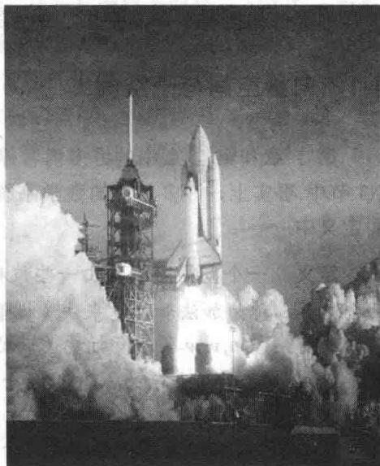
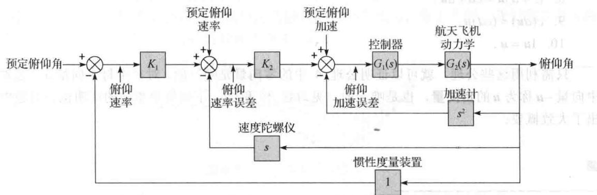

import Guide from '@/components/Guide.astro';
import Knowledge from '@/components/Knowledge.astro';
import Example from '@/components/Example.astro';
import Analysis from '@/components/Analysis.astro';
import Solution from '@/components/Solution.astro';
import Variant from '@/components/Variant.astro';
import Note from '@/components/Note.astro';
import Block from '@/components/Block.astro';
import Method from '@/components/Method.astro';
import Exercise from '@/components/Exercise.astro';

1981年4月，在清凉的棕榈星期日（复活节前的星期日）的早晨，12层楼高、75吨重的美国哥伦比亚号航天飞机壮观地飞离发射台。作为十年集中研究和开发的成果，这架美国第一架航天飞机是控制系统工程设计的最好的例子，涉及工程学的许多分支——航空、化学、电子、液压以及机械工程。

航天飞机的控制系统对飞行是绝对关键的。由于航天飞机是一个不稳定的空中机体，在大气层飞行时它需要不间断地用计算机监控。飞行控制系统不断地向空气动力控制表面和44个小推进器喷口发送命令。图4-1展示了一个典型的闭环反馈系统，它用来控制航天飞机在飞行时的俯仰角（即头部圆锥体的仰角）。符号 $\otimes$ 表示这里来自各种各样的传感器的信号被添加到沿此图顶部传递的计算机信号中。

从数学的角度看，一个工程学系统的输入和输出信号都是函数，如图4-1所示，这些函数的加法和标量乘法在应用中是

非常重要的. 在 4.1 节和 4.8 节中我们将会看到, 函数的这两个运算具有完全类似于 $\mathbb{R}^n$ 中向量的加法和标量乘法的代数性质. 由于这个原因, 所有可能的输入 (函数) 的集合称为一个向量空间. 系统工程学的数学基础依赖于函数的向量空间, 因此本章把 $\mathbb{R}^n$ 中向量的理论推广到包括这些函数. 后面我们将看到其他向量空间如何出现在工程学、物理学和统计学中.

  
图 4-1 航天飞机的俯仰角控制系统（来源：改编自 Space Shuttle GN&C  
Operations Manual, Rockwell International, 1988.)

在第1章和第2章中种植的数学种子在这一章中生长并且开始开花。当我们把 $\mathbb{R}^n$ 仅仅看作自然地出现在应用问题中的各种向量空间之一时，线性代数的魅力和威力将更清楚地显露出来。实际上，研究向量空间与研究 $\mathbb{R}^n$ 本身并没有多大不同，因为我们可以利用 $\mathbb{R}^2$ 和 $\mathbb{R}^3$ 中的几何经验使许多几何概念直观化。

在 4.1 节中给出一些基本定义之后，一般向量空间的框架逐步展开并贯穿于全章. 4.3\~4.5 节的一个目标是表明其他向量空间是如何类似于 $R^{n}$ 的. 4.6 节讨论的秩是本章的高潮之一，利用向量空间的术语将矩阵的重要知识连在一起. 4.8 节将本章的理论应用到离散信号和差分方程，它们用于像航天飞机中用到的数字控制系统. 4.9 节中的马尔可夫（Markov）链与本章中理论性较强的部分相比有了质的变化，它为第 5 章中出现的概念提供了较好的例子.
