import Guide from '@/components/Guide.astro';
import Knowledge from '@/components/Knowledge.astro';
import Example from '@/components/Example.astro';
import Analysis from '@/components/Analysis.astro';
import Solution from '@/components/Solution.astro';
import Variant from '@/components/Variant.astro';
import Note from '@/components/Note.astro';
import Block from '@/components/Block.astro';
import Method from '@/components/Method.astro';
import Exercise from '@/components/Exercise.astro';

第1章和第2章中的许多内容停留在 $\mathbb{R}^n$ 的一些简单且明显的代数性质上，这些性质列在1.3节中.事实上，许多其他的数学系统具有与 $\mathbb{R}^n$ 中相同的性质，这些具体而有趣的性质列在下面定义中.

定义 一个向量空间是由一些被称为向量的对象构成的非空集合 $V$ ，在这个集合上定义了两个运算，称为加法和标量乘法（标量取实数），服从以下公理（或法则） $^{\ominus}$ ，这些公理必须对 $V$ 中所有向量 $\pmb{u}, \pmb{v}, \pmb{w}$ 及所有标量（或称数） $c$ 和 $d$ 均成立。

1. $u, v$ 之和（表示为 $u + v$ ）属于 $V$ .

2. $u + v = v + u$ .

3. $(\boldsymbol{u}+\boldsymbol{v})+\boldsymbol{w}=\boldsymbol{u}+(\boldsymbol{v}+\boldsymbol{w})$

4. V 中存在一个零向量 0，使得 $u + 0 = u$ .

5. 对 V 中每个向量 u，存在 V 中一个向量 -u，使得 $\boldsymbol{u} + (-\boldsymbol{u}) = \boldsymbol{0}$ .

6. u 与标量 c 的标量乘法（记为 cu）属于 V.

7. $c(\pmb {u} + \pmb {v}) = c\pmb {u} + c\pmb {v}$

8. $(c + d)\pmb {u} = c\pmb {u} + d\pmb{u}$

9. $c(d\boldsymbol{u})=(cd)\boldsymbol{u}$ .

10. $1u = u$ .

只需利用这些公理，就可以证明公理4中的零向量是唯一的。对 $V$ 中每个向量 $\pmb{u}$ ，公理5中向量 $-\pmb{u}$ 称为 $\pmb{u}$ 的负向量，也是唯一的，见习题25和26。下列简单事实的证明也在习题中给出了大致概要：

对 $V$ 中每个向量 $\pmb{u}$ 和任意标量 $c$ ，有

$$
0 \boldsymbol {u} = \boldsymbol {0}\tag{1}
$$

$$
c \mathbf {0} = \mathbf {0}\tag{2}
$$

$$
- \boldsymbol {u} = (- 1) \boldsymbol {u}\tag{3}
$$

<Example title="例 1">
空间 $R^{n}$ （ $n \geqslant 1$ ）为向量空间的首要的例子。 $R^{3}$ 的几何直觉可以帮助我们使本章的许多概念清晰化并且直观化。
</Example>

<Example title="例 2">
设 $V$ 是三维空间中所有有向线段的集合，如果其中两个向量方向相同且长度相等，则二者视为相等。由平行四边形法则定义加法（见1.3节），且对 $V$ 中每个向量 $\pmb{v}$ ，定义 $cv$ 为长度等于 $|c|$ 乘以 $\pmb{v}$ 的长度的有向线段。若 $c \geqslant 0$ ，则 $cv$ 与 $\pmb{v}$ 同向，否则与 $\pmb{v}$ 反向（见图4-2）。证明 $V$ 是一个向量空间。这个空间是物理学中变力问题中一个常用的模型。

<Solution title="解">
$V$ 的定义是按几何方式定义的，只用到长度和方向的概念，没有涉及 $xyz$ 坐标系。一个零长度的有向线段就是一个单点，表示零向量。 $\pmb{v}$ 的负向量为 $(-1)\pmb{v}$ ，所以公理1，4，5，6，10显然成立。剩下的可用几何方法证明，比如图4-3、图4-4。

<figure class="vp-figure">
  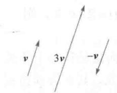
  <figcaption>图 4-2</figcaption>
</figure>

<figure class="vp-figure">
  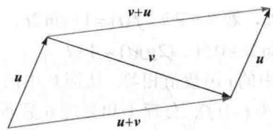
  <figcaption>图4-3 $\pmb {u} + \pmb {v} = \pmb {v} + \pmb{u}$</figcaption>
</figure>

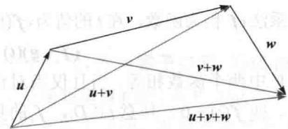  
图 4-4 $(\boldsymbol{u}+\boldsymbol{v})+\boldsymbol{w}=\boldsymbol{u}+(\boldsymbol{v}+\boldsymbol{w})$
</Solution>
</Example>

<Example title="例 3">
设 S 是数的双向无穷序列空间（通常写成行而不写成列）：

$$
\{y _ {k} \} = (\dots , y _ {- 2}, y _ {- 1}, y _ {0}, y _ {1}, y _ {2}, \dots)
$$

若 $\{z_k\}$ 是 $\mathbb{S}$ 中的另一个元素，则和 $\{y_k\} +\{z_k\}$ 是序列 $\{y_{k} + z_{k}\}$ ，它由 $\{y_k\}$ 与 $\{z_k\}$ 对应项之和构成.数乘 $c\{y_k\}$ 是序列 $\{cy_k\}$ .用与 $\mathbb{R}^n$ 中相同的方法可以证明向量空间的那些公理.

S中的元素来源于工程学，例如，每当一个信号在离散时间上被测量（或被采样）时，它就可被看作S中的一个元素。这样的信号可以是电的、机械的、光的，等等。在本章“介绍性实例”中提到的航天飞机的大控制系统就使用离散或“数字”信号。为了方便，我们称S为（离散时间）信号空间。一个信号可以直观地由图4-5表示。

<figure class="vp-figure">
  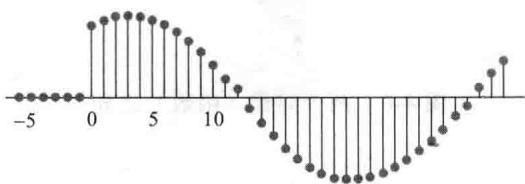
  <figcaption>图 4-5 一个离散时间信号</figcaption>
</figure>

$$
\boldsymbol {p} (t) = a _ {0} + a _ {1} t + a _ {2} t ^ {2} + \dots + a _ {n} t ^ {n}
$$
</Example>

<Example title="例 4">
对 $n \geqslant 0$ ，次数最高为 $n$ 的多项式集合 $\mathbb{P}_n$ 由形如下列的多项式组成：

(4)

其中系数 $a_0, \dots, a_n$ 和变量 $t$ 均为实数。 $p$ 的次数是（4）中系数不为零的项中 $t$ 的最高幂。若 $\pmb{p}(t) = a_0 \neq 0$ ，则 $p$ 的次数为零。若所有系数均为零，则 $\pmb{p}$ 称为零多项式。零多项式包含在 $\mathbb{P}_n$ 中，尽管它的次数没有定义。

若 p 由（4）式给出，且 $q(t)=b_{0}+b_{1}t+\cdots+b_{n}t^{n}$ ，则 $p+q$ 定义为

$$
\begin{array}{r l} (\boldsymbol {p} + \boldsymbol {q}) (t) & = \boldsymbol {p} (t) + \boldsymbol {q} (t) \\ & = (a _ {0} + b _ {0}) + (a _ {1} + b _ {1}) t + \dots + (a _ {n} + b _ {n}) t ^ {n} \end{array}
$$

标量乘法 $cp$ 定义为

$$
(c \boldsymbol {p}) (t) = c \boldsymbol {p} (t) = c a _ {0} + (c a _ {1}) t + \dots + (c a _ {n}) t ^ {n}
$$

这些定义满足公理1和公理6，这是因为 $p + q$ 和 $cp$ 均为次数不超过 $n$ 的多项式。公理2、3和公理7\~10由实数性质验证。显然，零多项式可以作为公理4中的零向量。最后， $(-1)p$ 作为 $p$ 的负向量，所以满足公理5，于是 $\mathbb{P}_n$ 是一个向量空间。

对不同的 n，向量空间 $P_{n}$ 用于（比如说）统计数据的趋势分析中，这在 6.8 节中讨论.
</Example>

<Example title="例 5">
设 $V$ 是定义在集合 $\mathbb{D}$ 上的全体实值函数的集合（典型地， $\mathbb{D}$ 为实数集或实轴上的区间）。用通常方式定义加法 $(f + g)$ 仍为函数，在 $\mathbb{D}$ 中 $t$ 处的值为 $f(t) + g(t)$ 。同样，对标量 $c$ 和 $V$ 中的 $f$ ，标量乘法 $cf$ 仍为函数，在 $t$ 的值为 $cf(t)$ 。例如，若 $\mathbb{D} = \mathbb{R}$ ， $f(t) = 1 + \sin 2t$ ， $g(t) = 2 + 0.5t$ ，则

$$
(f + g) (t) = 3 + \sin 2 t + 0. 5 t, (2 g) (t) = 4 + t
$$

$V$ 中两个函数相等，当且仅当对任意 $\mathbb{D}$ 中的 $t$ 函数值相等。从而 $V$ 中的零向量是恒等于零的函数，即 $f(t) = 0$ ，任意 $t \in D$ ， $f$ 的负向量为 $(-1)f$ 。公理1和公理6显然成立，其余公理由实数性质得证，所以 $V$ 为一个向量空间。

把例5中的向量空间 $V$ 中每个函数看作一个独立的个体是很重要的，如同在向量空间中的一个“点”或向量那样。两个向量 $\pmb{f}$ 与 $\pmb{g}$ 的和（ $\pmb{f}$ 与 $\pmb{g}$ 为 $V$ 中的函数，即向量空间中的元素）可以通过图4-6给予直观解释，因为这样可以帮助你将 $\mathbb{R}^n$ 中建立的几何直觉上升到一般向量空间，“学习指南”可以帮你接受更一般的观点。

<figure class="vp-figure">
  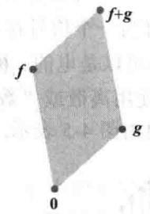
  <figcaption>图4-6 两个向量（函数）之和</figcaption>
</figure>
</Example>

## 子空间

在许多问题中，一个向量空间是由一个大的向量空间中适当的向量的子集所构成。在此情形下，向量空间的10个公理中只需要验证三个，其余的自然成立。

定义 向量空间 $V$ 的一个子空间是 $V$ 的一个满足以下三个性质的子集 $H$ ：

a. V 中的零向量在 H 中.

b. H 对向量加法封闭，即对 H 中任意向量 u, v，和 $u + v$ 仍在 H 中.

c. $H$ 对标量乘法封闭，即对 $H$ 中任意向量 $\pmb{u}$ 和任意标量 $c$ ，向量 $cu$ 仍在 $H$ 中.

性质（a）、（b）、（c）保证 $V$ 的子空间 $H$ 本身对 $V$ 中定义的向量空间运算而言是一个向量空间。为证此结论，注意到（a）、（b）、（c）分别是公理1、4、6。公理2和3及公理7\~10自然成立，这是因为它们对 $V$ 中所有元素均成立，自然包括 $H$ 中的元素。公理5在 $H$ 中也成立，因为若 $\pmb{u}$ 在 $H$ 中，则由（c）知， $(-1)\pmb{u}$ 也在 $H$ 中，同时，从本节等式（3）知， $(-1)\pmb{u}$ 即公理5中的 $-\pmb{u}$ 。

这样每个子空间都是一个向量空间。反之，每个向量空间是一个子空间（针对本身或其他更大的空间而言）。对两个向量空间，若其中一个在另一个内部，此时子空间这个词被使用，而 $V$ 的子空间是将 $V$ 看作更大的空间（见图4-7）。

<figure class="vp-figure">
  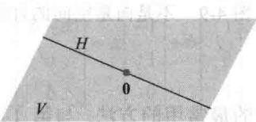
  <figcaption>图4-7 $V$ 的一个子空间</figcaption>
</figure>

<Example title="例 6">
向量空间 $V$ 中仅由零向量组成的集合是 $V$ 的一个子空间，称为零子空间，写成 $\{\mathbf{0}\}$ .
</Example>

<Example title="例 7">
令 P 为全体实系数多项式的集合，P 中运算的定义与函数运算相同，则 P 是定义在 R 上的全体实值函数的空间的一个子空间。再者，对每个 $n \geqslant 0, P_{n}$ 是 P 的子空间，因为 $P_{n}$ 是 P 的子集，它包含零多项式，且 $P_{n}$ 中两个多项式之和仍在 $P_{n}$ 中，数乘以 $P_{n}$ 中一个多项式仍在 $P_{n}$ 中。
</Example>

<Example title="例 8">
向量空间 $\mathbb{R}^2$ 不是 $\mathbb{R}^3$ 的子空间，因为 $\mathbb{R}^2$ 甚至不是 $\mathbb{R}^3$ 的子集（ $\mathbb{R}^3$ 中的向量有3个元素，而 $\mathbb{R}^2$ 中的向量仅有两个元素）．集合

$$
H = \left\{\left[ \begin{array}{l} {s} \\ {t} \\ {0} \end{array} \right]: s, t \text {是实数} \right\}
$$

是 $\mathbb{R}^3$ 的一个子集，尽管从逻辑上讲它与 $\mathbb{R}^2$ 不同，但实际上很像 $\mathbb{R}^2$ ，见图4-8.证明 $H$ 是 $\mathbb{R}^3$ 的一个子空间.

<figure class="vp-figure">
  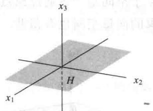
  <figcaption>图4-8 作为 $\mathbb{R}^3$ 的子空间的 $x_{1}x_{2}$ 平面</figcaption>
</figure>

<Solution title="解">
零向量在 H 中，且对向量的加法和标量乘法，H 是封闭的，这是因为对 H 中的向量而言，那些运算产生的向量中的第 3 个元素仍为零（从而属于 H），所以 H 是 $R^{3}$ 的一个子空间.
</Solution>
</Example>

<Example title="例 9">
$\mathbb{R}^3$ 中一个不通过原点的平面不是 $\mathbb{R}^3$ 中子空间，这是因为此平面不包含 $\mathbb{R}^3$ 中的零向量. 类似地， $\mathbb{R}^2$ 中一条不通过原点的直线（如图4-9所示）也不是 $\mathbb{R}^2$ 的子空间.

<figure class="vp-figure">
  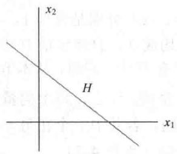
  <figcaption>图4-9 不是向量空间的直线</figcaption>
</figure>
</Example>

## 由一个集合生成的子空间

下一个例子说明了描述子空间的最常用的方法. 与第 1 章中相同, 线性组合这个词表示一些向量的任意标量乘法之和, $\text{Span}\{\nu_1, \cdots, \nu_p\}$ 表示所有可以表示成 $\nu_1, \cdots, \nu_p$ 的线性组合的向量集合.

<Example title="例 10">
给定向量空间 V 中向量 $v_{1}, v_{2}$ ，令 $H = \text{Span}\{v_{1}, v_{2}\}$ ，证明 H 是 V 的一个子空间.

<Solution title="解">
由于 $\mathbf{0} = 0\pmb{v}_1 + 0\pmb{v}_2$ ，所以零向量在 $H$ 中．为证 $H$ 对加法封闭，任取 $H$ 中两个向量，比如

$$
\boldsymbol {u} = s _ {1} \boldsymbol {v} _ {1} + s _ {2} \boldsymbol {v} _ {2}, \boldsymbol {w} = t _ {1} \boldsymbol {v} _ {1} + t _ {2} \boldsymbol {v} _ {2}
$$

对向量空间 $V$ ，由公理2、3和8知，

$$
\begin{array}{r l} \boldsymbol {u} + \boldsymbol {w} & = (s _ {1} \boldsymbol {v} _ {1} + s _ {2} \boldsymbol {v} _ {2}) + (t _ {1} \boldsymbol {v} _ {1} + t _ {2} \boldsymbol {v} _ {2}) \\ & = (s _ {1} + t _ {1}) \boldsymbol {v} _ {1} + (s _ {2} + t _ {2}) \boldsymbol {v} _ {2} \end{array}
$$

所以 $u+w$ 在 H 中. 进一步, 若 c 是任意标量, 则由公理 7 和 9 知,

$$
c \boldsymbol {u} = c (s _ {1} \boldsymbol {v} _ {1} + s _ {2} \boldsymbol {v} _ {2}) = (c s _ {1}) \boldsymbol {v} _ {1} + (c s _ {2}) \boldsymbol {v} _ {2}
$$

这证明 $\pmb{c}\pmb{u}$ 在 $H$ 中，从而 $H$ 对标量乘法封闭，从而 $H$ 是 $V$ 的一个子空间.

在 4.5 节中，我们将证明 $R^{3}$ 的每一个非零子空间除了 $R^{3}$ 本身之外，要么是 $Span\{v_{1}, v_{2}\}$ ，这里 $v_{1}, v_{2}$ 是某线性无关的两个向量，要么是 $Span\{v\}$ ， $v \neq 0$ 。对第一种情形，此子空间是一个通过原点的平面；对第二种情形，子空间是一条通过原点的直线（见图 4-10）。记住这些几何图形是有好处的，甚至对一个抽象的向量空间也有帮助。

<figure class="vp-figure">
  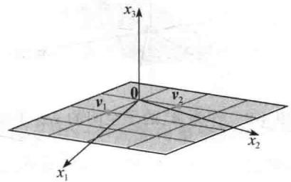
  <figcaption>图4-10 一个子空间的例子</figcaption>
</figure>

例 10 中的讨论可以很容易地推广从而证明下面的定理.
</Solution>
</Example>

<Knowledge title="定理 1">
若 $v_{1},\cdots,v_{p}$ 在向量空间 V 中，则 Span $\{v_{1},\cdots,v_{p}\}$ 是 V 的一个子空间.

我们称 $\operatorname{Span}\{\boldsymbol{v}_{1},\cdots,\boldsymbol{v}_{p}\}$ 是由 $\{\boldsymbol{v}_{1},\cdots,\boldsymbol{v}_{p}\}$ 生成（或张成）的子空间。给定 V 的任一子空间 H，H 的生成（或张成）集是集合 $\{\boldsymbol{v}_{1},\cdots,\boldsymbol{v}_{p}\}\subset H$ ，满足 $H=\operatorname{Span}\{\boldsymbol{v}_{1},\cdots,\boldsymbol{v}_{p}\}$ 。

下例说明如何使用定理 1.
</Knowledge>

<Example title="例 11">
令 H 是所有形如 $(a-3b,b-a,a,b)$ 的向量的集合，其中 a,b 是任意数，即

$$
H = \{(a - 3 b, b - a, a, b): a, b \in \mathbb {R} \}
$$

<Solution title="证明">
$H$ 是 $\mathbb{R}^4$ 的一个子空间.
</Solution>

<Solution title="解">
将 H 中向量写成列向量，则 H 中任意向量具有如下形式：

$$
\left[ \begin{array}{c} a - 3 b \\ b - a \\ a \\ b \end{array} \right] = a \left[ \begin{array}{c} 1 \\ - 1 \\ 1 \\ 0 \end{array} \right] + b \left[ \begin{array}{c} - 3 \\ 1 \\ 0 \\ 1 \end{array} \right]
$$

这个计算表明 $H = \operatorname{Span}\{\nu_{1}, \nu_{2}\}$ ，其中 $\nu_{1}, \nu_{2}$ 标示如上，从而由定理 1 知 H 是 $R^{4}$ 的一个子空间。
</Solution>
</Example>

<Example title="例 11">
展示了一个有用的技巧，用来表示作为某些向量的线性组合的集合的子空间 H。若 $H = \operatorname{Span}\{\nu_{1}, \cdots, \nu_{p}\}$ ，则可把这个生成集中的向量 $\nu_{1}, \cdots, \nu_{p}$ 看作“柄”，它们使我们能够掌握这个子空间 H。H 中无穷多个向量的运算经常被化简成生成集中的有限多个向量的运算。
</Example>

<Example title="例 12">
问 $h$ 取何值时， $y$ 在由 $\pmb{v}_1, \pmb{v}_2, \pmb{v}_3$ 生成的 $\mathbb{R}^3$ 的子空间中？其中

$$
\boldsymbol {v} _ {1} = \left[ \begin{array}{l} 1 \\ - 1 \\ - 2 \end{array} \right], \boldsymbol {v} _ {2} = \left[ \begin{array}{l} 5 \\ - 4 \\ - 7 \end{array} \right], \boldsymbol {v} _ {3} = \left[ \begin{array}{l} - 3 \\ 1 \\ 0 \end{array} \right], \boldsymbol {y} = \left[ \begin{array}{l} - 4 \\ 3 \\ h \end{array} \right]
$$

<Solution title="解">
此问题是 1.3 节中的练习题 2，这里用子空间这个词还不如用 Span $\{v_{1}, v_{2}, v_{3}\}$ 。此处 y 在 Span $\{v_{1}, v_{2}, v_{3}\}$ 中当且仅当 h=5。这个解法现在值得复习一下，可以复习 1.3 节中习题 11\~16 和习题 19\~21。

虽然本章中许多向量空间是 $\mathbb{R}^n$ 的子空间，但牢记那些抽象理论用在其他向量空间仍成立是很重要的。函数的向量空间起源于许多应用，这些空间在后面的章节将受到关注。
</Solution>
</Example>

<Block title="练习题">
1. 通过证明标量乘法不封闭，证明 $\mathbb{R}^2$ 中所有形如 $(3s, 2 + 5s)$ 的点集 $H$ 不能构成一个向量空间。（找出 $H$ 中一个特殊向量 $\pmb{u}$ 和数 $c$ ，使 $cu$ 不在 $H$ 中。）

2. 令 $W = \operatorname{Span}\{\pmb{v}_1, \dots, \pmb{v}_p\}$ ，其中 $\pmb{v}_1, \dots, \pmb{v}_p$ 在向量空间 $V$ 中，证明 $\pmb{v}_k$ 在 $W$ 中， $1 \leqslant k \leqslant p$ 。（提示：先写一个能证明 $\pmb{v}_1$ 在 $W$ 中的方程，再类似证明一般情形。）

3. $n \times n$ 矩阵 $A$ 是对称的，如果 $A^{\mathrm{T}} = A$ 。设 $S$ 是所有 $3 \times 3$ 对称矩阵的集合。证明 $S$ 是 $M_{3 \times 3}$ 的子空间， $M_{3 \times 3}$ 是 $3 \times 3$ 矩阵的向量空间。
</Block>

<Block title="习题4.1">
1. 令 $V$ 是 $xy$ 平面中的第一象限，即 $V = \left\{\begin{array}{l} x \\ y \end{array}\right. x \geqslant 0, y \geqslant 0$ a. 若 $u, v$ 在 $V$ 中，那么 $u + v$ 在 $V$ 中吗？为什么？
b. 找出 $V$ 中一个特殊向量 $u$ 和一个特殊数 $c$ ，使得 $cu$ 不在 $V$ 中。（这足以说明 $V$ 不是一个向量空间。）

2. 令 W 是 xy 平面中第一象限与第三象限的并集，
即 $W=\left\{\begin{bmatrix}x\\ y\end{bmatrix}:xy\geqslant0\right\}$ .
a. 若 u 在 W 中，c 为任意数，cu 在 W 中吗？
为什么？
b. 求 W 中特殊向量 u, v，使得 $u + v$ 不在 W 中。
这足以说明 W 不是一个向量空间.

3. 令 $H$ 是 $xy$ 平面上所有单位圆内和圆上的点集，即 $H = \left\{\left[ \begin{array}{c}x\\ y \end{array} \right]:x^2 +y^2\leqslant 1\right\}$ ，找出一个特殊的例子，即两个向量或者是一个向量与一个数，证明 $H$ 不是 $\mathbb{R}^2$ 中的一个子空间.

4. 构造一个几何图形说明为什么 $\mathbb{R}^2$ 中一条不过原点的直线对向量的加法不封闭. 在习题5\~8中， $n$ 取适当的值，判定给出的集合是否为 $\mathbb{P}_n$ 的子空间，验证你的答案.

5. 所有形如 $p(t) = at^2$ 的多项式，其中 $a \in \mathbb{R}$ .

6. 所有形如 $p(t) = a + t^2$ 的多项式，其中 $a \in \mathbb{R}$ .

7. 所有次数最多是 3 的整系数多项式.

8. $\mathbb{P}_n$ 中所有使得 $p(0) = 0$ 的多项式.  
9. 令 $H$ 为所有形如 $\left[ \begin{array}{c}s\\ 3s\\ 2s \end{array} \right]$ 的向量集，求 $\mathbb{R}^3$ 中一个向量 $\pmb{\nu}$ ，使得 $H = \mathrm{Span}\{\pmb{\nu}\}$ . 为什么这样能证明 $H$ 是 $\mathbb{R}^3$ 的一个子空间？  
10. 令 $H$ 为所有形如 $\left[ \begin{array}{c}2t\\ 0\\ -t \end{array} \right]$ 的向量集，其中 $t$ 是任意实数. 证明 $H$ 是 $\mathbb{R}^3$ 的一个子空间.（利用习题

9 的方法.)

11. 令 $W$ 是所有形如 $\begin{bmatrix} 5b + 2c \\ b \\ c \end{bmatrix}$ 的向量集，其中 $b, c$ 是任意数，求向量 $\pmb{u}, \pmb{v}$ 使得 $W = \operatorname{Span}\{\pmb{u}, \pmb{v}\}$ . 为什么这样能证明 $W$ 是 $\mathbb{R}^3$ 的一个子空间？

12. 令 W 是所有形如 $\begin{bmatrix} s + 3t \\ s - t \\ 2s - t \\ 4t \end{bmatrix}$ 的向量集，证明 W 是 $R^{4}$ 的一个子空间。（利用习题 11 的方法。）

13. 令 $\pmb{v}_{1} = \begin{bmatrix} 1 \\ 0 \\ -1 \end{bmatrix}$ , $\pmb{v}_{2} = \begin{bmatrix} 2 \\ 1 \\ 3 \end{bmatrix}$ , $\pmb{v}_{3} = \begin{bmatrix} 4 \\ 2 \\ 6 \end{bmatrix}$ , $\pmb{w} = \begin{bmatrix} 3 \\ 1 \\ 2 \end{bmatrix}$ .

a. $w$ 在 $\{\pmb{v}_{1},\pmb{v}_{2},\pmb{v}_{3}\}$ 中吗？ $\{\pmb{v}_{1},\pmb{v}_{2},\pmb{v}_{3}\}$ 中有多少个向量？

b. $\operatorname{Span}\{\pmb{v}_{1},\pmb{v}_{2},\pmb{v}_{3}\}$ 中有多少个向量？

c. $w$ 在由 $\{\pmb{v}_{1},\pmb{v}_{2},\pmb{v}_{3}\}$ 生成的子空间中吗？为什么？

14. 令 $v_{1}, v_{2}, v_{3}$ 与习题 13 中相同， $w = \begin{bmatrix} 8 \\ 4 \\ 7 \end{bmatrix}$ . w 在由 $\{v_{1}, v_{2}, v_{3}\}$ 生成的子空间中吗？为什么？

在习题 15\~18 中，令 W 表示已给形式的所有向量的集合，其中 a, b, c 表示任意实数。在每种情形下，要么给出生成 W 的向量集合 S，要么给出一个例子证明 W 不是一个向量空间。

15. $\begin{bmatrix} 3a + b \\ 4 \\ a - 5b \end{bmatrix}$ 16. $\begin{bmatrix} -a + 1 \\ a - 6b \\ 2b + a \end{bmatrix}$ 17. $\begin{bmatrix} a - b \\ b - c \\ c - a \\ b \end{bmatrix}$ 18. $\begin{bmatrix} 4a + 3b \\ 0 \\ a + b + c \\ c - 2a \end{bmatrix}$

19. 一个物体 m 挂在弹簧的末端，若向下拉动物体再放开，这个物体-弹簧系统开始振动，物体从其静止位置的位移 y 由下列形式的函数给出：

$$
y (t) = c _ {1} \cos \omega t + c _ {2} \sin \omega t
$$

其中 $\omega$ 是一个常数，它与弹簧及物体有关。（见下图。）证明由（5）式给出（其中 $\omega$ 固定， $c_{1}, c_{2}$ 任意）的所有函数的集合是一个向量空间。

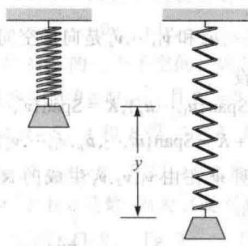

20. 定义在 $\mathbb{R}$ 中闭区间 $[a, b]$ 上的全体实值连续函数的集合记为 $C[a, b]$ ，此集合是定义在 $[a, b]$ 上的全体实值函数的向量空间的一个子空间.

a. 关于连续函数，需要证明什么结论才能说明 $C[a, b]$ 如命题所说的确实是一个子空间？（这些结论在微积分中经常讨论）.

b. 证明 $\{\pmb{f} \in C[a, b] : \pmb{f}(a) = \pmb{f}(b)\}$ 是 $C[a, b]$ 的一个子空间.

对固定的正整数 $m, n$ ，在通常的矩阵加法运算和实数乘法运算之下，所有 $m \times n$ 矩阵的集合 $M_{m \times n}$ 是一个向量空间.

21. 判断形如 $\begin{bmatrix} a & b \\ 0 & d \end{bmatrix}$ 的全体矩阵的集合 $H$ 是否是 $M_{2 \times 2}$ 的一个子空间.

22. 令 $F$ 是一个固定的 $3 \times 2$ 矩阵，令 $H$ 是 $M_{2 \times 4}$ 中所有使得 $FA = 0$ （ $M_{3 \times 4}$ 中的零矩阵）的矩阵 $A$ 构成的集合，判断 $H$ 是否是 $M_{2 \times 4}$ 的一个子空间.

在习题23和习题24中，判断每个命题的真假，给出理由.

23. a. 若 $f$ 是 $\mathbb{R}$ 上所有实值函数的向量空间 $V$ 中的一个函数，且对某个 $t$ 有 $f(t) = 0$ ，则 $f$ 是 $V$ 中的零向量.

1. 在三维空间中，一个向量是一个箭头（有向线段）.

对向量空间 V 的一个子集 H，若零向量在 H 中，则 H 是 V 的一个子空间.

d. 一个子空间仍是一个向量空间.

e. 模拟信号被用在航天飞机的主控系统中，这在本章“介绍性实例”中有提到.

24. a. 一个向量是一个向量空间中任意一个元素.

b. 若 $\pmb{u}$ 是向量空间 $V$ 中一个向量，则 $(-1)\pmb{u}$ 与 $\pmb{u}$ 的负向量相同.

c. 一个向量空间仍是一个子空间.

d. $\mathbb{R}^2$ 是 $\mathbb{R}^3$ 的一个子空间.

e. 一个向量空间 V 的一个子集 H 如果满足以下条件：（i）V 的零向量在 H 中，（ii）u, v 和 $u + v$ 在 H 中，（iii）c 是一个标量，cu 在 H 中，则 H 是 V 的一个子空间.

习题 25\~29 给出向量空间 V 的公理如何用来证明写在向量空间定义后面的基本性质，用合适的公理序号填空。由公理 2、4 和 5 可知，对所有 u， $0 + u = u$ 和 $-u + u = 0$ 均成立。

25. 完成下面关于零向量是唯一的证明。假设 w 在 V 中，具有性质：对 V 中所有 u， $u + w = w + u = u$ 。特别地， $0 + w = 0$ ，但由公理 \_\_\_\_， $0 + w = w$ ，从而 w = 0 + w = 0。

26. 完成下面关于 -u 是 V 中唯一满足 $u + (-u) = 0$ 的向量的证明. 假设 w 满足 $u + w = 0$ ，用 -u 加到两边，则有 $(-u)+[u+w]=(-u)+0$ $[(-u)+u]+w=(-u)+0$ 这是由公理 \_\_\_\_ (a) $0+w=(-u)+0$ 这是由公理 \_\_\_\_ (b)
w=-u 这是由公理 \_\_\_\_ (c)

27. 在下列证明 0u=0 对任意 V 中的 u 成立的过程中，填写漏掉的公理序号.
0u=0 对 V 中每个 u 成立 $0u=(0+0)u=0u+0u$ 这是由公理 \_\_\_\_ (a)
两边加 0u 的负向量： $0u+(-0u)=[0u+0u]+(-0u)$ $0u+(-0u)=0u+[0u+(-0u)]$ 这是由公理 \_\_\_\_ (b) $0=0u+0$ 这是由公理 \_\_\_\_ (c)

0=0u 这是由公理\_\_\_\_(d)

28. 在下列证明 $c\mathbf{0} = \mathbf{0}$ 对任意数 $c$ 成立的过程中，填写漏掉的公理序号： $c\mathbf{0} = c(\mathbf{0} + \mathbf{0})$ 这是由公理\_\_\_\_（a） $= c\mathbf{0} + c\mathbf{0}$ 这是由公理\_\_\_\_（b）两边加 $c\mathbf{0}$ 的负向量： $c\mathbf{0} + (-c\mathbf{0}) = [c\mathbf{0} + c\mathbf{0}] + (-c\mathbf{0})$ $c\mathbf{0} + (-c\mathbf{0}) = c\mathbf{0} + [c\mathbf{0} + (-c\mathbf{0})]$ 这是由公理\_\_\_\_（c） $\mathbf{0} = c\mathbf{0} + \mathbf{0}$ 这是由公理\_\_\_\_（d） $\mathbf{0} = c\mathbf{0}$ 这是由公理\_\_\_\_（e）

29. 证明 $(-1)\pmb {u} = -\pmb{u}$ . （提示： $\pmb {u} + (-1)\pmb {u} = \pmb{0}$ ，用习题27和习题26中某些公理和结论.)

30. 假设对某非零数 $c, c\pmb{u} = \mathbf{0}$ , 证明 $\pmb{u} = \mathbf{0}$ . 说出你用到的公理和性质.

31. 令 $\pmb{u},\pmb{v}$ 是向量空间 $V$ 中的向量， $H$ 是 $V$ 中任意一个包含 $\pmb{u}$ 和 $\pmb{v}$ 的子空间。解释为什么 $H$ 也包含 $\operatorname{Span}\{\pmb{u},\pmb{v}\}$ ，这说明 $\operatorname{Span}\{\pmb{u},\pmb{v}\}$ 是包含 $\pmb{u}$ 和 $\pmb{v}$ 的 $V$ 中最小子空间。

32. 令 $H$ 和 $K$ 是向量空间 $V$ 的子空间， $H$ 和 $K$ 的交集写作 $H \cap K$ ，是 $V$ 中既属于 $H$ 又属于 $K$ 的元素 $\pmb{\nu}$ 的集合。证明 $H \cap K$ 是 $V$ 的一个子空间。

(见下图.)在 $R^{2}$ 中给出一个例子，证明一般而言，两个子空间的并集不是一个子空间.

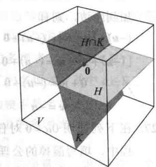

33. 给定向量空间 $V$ 的子空间 $H$ 和 $K$ , $H$ 和 $K$ 的和（记

为 $H + K$ ）是 $V$ 中可以写成两个向量（一个向量在 $H$ 中，另一个向量在 $K$ 中）之和的所有向量的集合，即
</Block>

<Block title="练习题答案">
$H+K=\{w:w=u+v, 其中 u\in H,v\in K\}$ a. 证明 $H + K$ 是 V 的子空间.
b. 证明 H 是 $H + K$ 的子空间，K 是 $H + K$ 的子空间.

34. 假设 $u_{1},\cdots,u_{p}$ 和 $v_{1},\cdots,v_{q}$ 是向量空间 V 中的向量，并设 $H = \text{Span}\left\{\boldsymbol{u}_{1}, \cdots, \boldsymbol{u}_{p}\right\}, K = \text{Span}\left\{\boldsymbol{v}_{1}, \cdots, \boldsymbol{v}_{q}\right\}$ 证明 $H + K = \text{Span}\left\{\boldsymbol{u}_{1}, \cdots, \boldsymbol{u}_{p}, \boldsymbol{v}_{1}, \cdots, \boldsymbol{v}_{q}\right\}$ .

35. [M] 证明 w 在由 $v_{1}, v_{2}, v_{3}$ 生成的 $R^{4}$ 的子空间中，其中

$$
\boldsymbol {w} = \left[ \begin{array}{c} 9 \\ - 4 \\ - 4 \\ 7 \end{array} \right], \boldsymbol {v} _ {1} = \left[ \begin{array}{c} 8 \\ - 4 \\ - 3 \\ 9 \end{array} \right], \boldsymbol {v} _ {2} = \left[ \begin{array}{c} - 4 \\ 3 \\ - 2 \\ - 8 \end{array} \right], \boldsymbol {v} _ {3} = \left[ \begin{array}{c} - 7 \\ 6 \\ - 5 \\ - 1 8 \end{array} \right]
$$

36. [M] 判定 y 是否在由 A 的列生成的 $R^{4}$ 的子空间中，其中

$$
\boldsymbol {y} = \left[ \begin{array}{r} - 4 \\ - 8 \\ 6 \\ - 5 \end{array} \right], A = \left[ \begin{array}{r r r} 3 & - 5 & - 9 \\ 8 & 7 & - 6 \\ - 5 & - 8 & 3 \\ 2 & - 2 & - 9 \end{array} \right]
$$

37. [M] 向量空间 $H = \operatorname{Span}\{1, \cos^2 t, \cos^4 t, \cos^6 t\}$ 至少包含两个有趣的函数，它们在以后的习题中用到：

$$
\begin{array}{l} \boldsymbol {f} (t) = 1 - 8 \cos^ {2} t + 8 \cos^ {4} t \\ \boldsymbol {g} (t) = - 1 + 1 8 \cos^ {2} t - 4 8 \cos^ {4} t + 3 2 \cos^ {6} t \end{array}
$$

对 $0 \leqslant t \leqslant 2\pi$ ，研究 $f$ 的图像，对 $f(t)$ 推测一个简单的公式。通过绘图比较 $1 + f(t)$ 与你的 $f(t)$ 的公式，验证你的猜测。（你将会看到常函数1。）对 $\pmb{g}$ 重复你的研究。

38. [M] 对下列函数，重复习题 37:

$$
\begin{array}{l} \boldsymbol {f} (t) = 3 \sin t - 4 \sin^ {3} t \\ \boldsymbol {g} (t) = 1 - 8 \sin^ {2} t + 8 \sin^ {4} t \\ \boldsymbol {h} (t) = 5 \sin t - 2 0 \sin^ {3} t + 1 6 \sin^ {5} t \end{array}
$$

它们均在向量空间 $Span\{1,\sin t,\sin^{2}t,\cdots,\sin^{5}t\}$ 中.

1. 任取 $H$ 中的 $\pmb{u}$ ，比如取 $\pmb{u} = \begin{bmatrix} 3 \\ 7 \end{bmatrix}$ ，任取 $c \neq 1$ ，比如取 $c = 2$ ，则 $c\pmb{u} = \begin{bmatrix} 6 \\ 14 \end{bmatrix}$ . 如果它在 $H$ 中，则存在某个 $s$ 使得

$$
\left[ \begin{array}{c} 3 s \\ 2 + 5 s \end{array} \right] = \left[ \begin{array}{c} 6 \\ 1 4 \end{array} \right]
$$

则 $s = 2$ 同时 $s = 12 / 5$ ，而这是不可能的，所以 $2u$ 不在 $H$ 中， $H$ 不是一个向量空间.

2. $v_{1}=1v_{1}+0v_{2}+\cdots+0v_{p}$ ，这表明 $v_{1}$ 是 $v_{1},\cdots,v_{p}$ 的一个线性组合，所以 $v_{1}$ 在 W 中。一般 $v_{k}$ 也在 W 中，这是因为 $v_{k}=0v_{1}+\cdots+0v_{k-1}+1v_{k}+0v_{k+1}+\cdots+0v_{p}$ 。

3. 子集 $S$ 是 $M_{3 \times 3}$ 的一个子空间，因为它满足下面列出的子空间定义中的所有三个要求：

a. $3 \times 3$ 零矩阵 $\mathbf{0} \in M_{3 \times 3}$ ，且 $\mathbf{0}^{\mathrm{T}} = \mathbf{0}$ ，零矩阵是对称的，因此 $\mathbf{0} \in S$ .

b. 设 $A, B \in S$ . $A$ 和 $B$ 是 $3 \times 3$ 对称矩阵，因此 $A^{\mathrm{T}} = A, B^{\mathrm{T}} = B$ 。由矩阵转置的性质， $(A + B)^{\mathrm{T}} = A^{\mathrm{T}} + B^{\mathrm{T}} = A + B$ 。所以 $A + B$ 是对称的，因此 $A + B \in S$ 。

c. 设 $A \in S$ 且 $c$ 是数. 因为 $A$ 是对称的, 故由对称矩阵的性质, $(cA)^{\mathrm{T}} = c(A^{\mathrm{T}}) = cA$ . 于是 $cA$ 也是对称矩阵, 因此 $cA \in S$ .
</Block>
