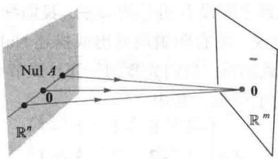
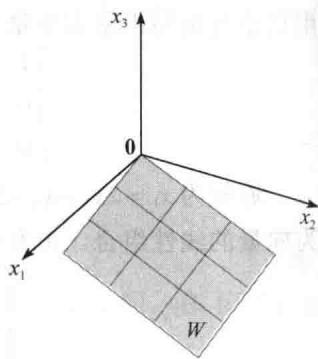
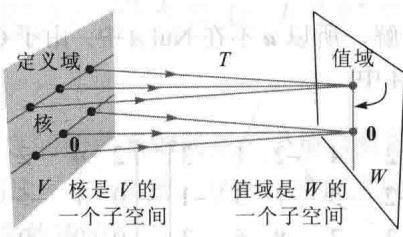

import Guide from '@/components/Guide.astro';
import Knowledge from '@/components/Knowledge.astro';
import Example from '@/components/Example.astro';
import Analysis from '@/components/Analysis.astro';
import Solution from '@/components/Solution.astro';
import Variant from '@/components/Variant.astro';
import Note from '@/components/Note.astro';
import Block from '@/components/Block.astro';
import Method from '@/components/Method.astro';
import Exercise from '@/components/Exercise.astro';

在线性代数的应用中， $\mathbb{R}^n$ 的子空间通常由以下两种方式产生：（1）作为齐次线性方程组的解集；（2）作为某些确定向量的线性组合的集合。本节中，我们比较和构造这两类子空间，体验子空间的概念。事实上，正如你将要看到的，我们从1.3节以来一直与子空间打交道，这里的主要新特征是术语。本节包括对线性变换的值域与核的讨论。

矩阵的零空间

考虑下列齐次方程组：

$$
\begin{array}{r l} & x _ {1} - 3 x _ {2} - 2 x _ {3} = 0 \\ & - 5 x _ {1} + 9 x _ {2} + x _ {3} = 0 \end{array}\tag{1}
$$

用矩阵的形式，此方程组可写成 Ax = 0，其中

$$
A = \left[ \begin{array}{c c c} 1 & - 3 & - 2 \\ - 5 & 9 & 1 \end{array} \right]\tag{2}
$$

所有满足（1）的 x 的集合称为方程组（1）的解集，通常将这个解集直接与矩阵 A 和方程 Ax = 0 联系起来是方便的。我们称满足 Ax = 0 的所有 x 的集合为矩阵 A 的零空间。

定义 矩阵 A 的零空间写成 Nul A，是齐次方程 Ax = 0 的全体解的集合。用集合符号表示，即

$$
\operatorname{Nul} A = \{\boldsymbol {x}: \boldsymbol {x} \in \mathbb {R} ^ {n}, A \boldsymbol {x} = \boldsymbol {0} \}
$$

Nul $A$ 的更进一步的描述为 $\mathbb{R}^n$ 中通过线性变换 $x \mapsto Ax$ 映射到 $\mathbb{R}^m$ 中的零向量的全体向量 $x$ 的集合，见图4-11.

  
图4-11

<Example title="例 1">
设 $A$ 为（2）式中所示的矩阵，令 $\pmb{u} = \begin{bmatrix} 5 \\ 3 \\ -2 \end{bmatrix}$ ，确定 $\pmb{u}$ 是否属于 $A$ 的零空间.

<Solution title="解">
为验证 $\pmb{u}$ 是否满足 $A\pmb{u} = \pmb{0}$ ，简单计算

$$
A \boldsymbol {u} = \left[ \begin{array}{r r r} 1 & - 3 & - 2 \\ - 5 & 9 & 1 \end{array} \right] \left[ \begin{array}{l} 5 \\ 3 \\ - 2 \end{array} \right] = \left[ \begin{array}{r r} 5 - 9 + 4 \\ - 2 5 + 2 7 - 2 \end{array} \right] = \left[ \begin{array}{l} 0 \\ 0 \end{array} \right]
$$

所以 $u \in Nul A$ .

空间这个词用在零空间上是合适的，因为一个矩阵的零空间是一个向量空间，在下列定理中会见到.
</Solution>
</Example>

<Knowledge title="定理 2">
$m \times n$ 矩阵 A 的零空间是 $R^{n}$ 的一个子空间. 等价地, m 个方程、n 个未知数的齐次线性方程组 Ax = 0 的全体解的集合是 $R^{n}$ 的一个子空间.

<Solution title="证明">
由于 $A$ 有 $n$ 个列，故 $\operatorname{Nul} A$ 当然是 $\mathbb{R}^n$ 的一个子集，我们必须证明 $\operatorname{Nul} A$ 满足子空间的3个性质。0当然在 $\operatorname{Nul} A$ 中，其次令 $\pmb{u}$ 和 $\pmb{v}$ 表示 $\operatorname{Nul} A$ 中任意两个向量，则

$$
A \boldsymbol {u} = \mathbf {0}, A \boldsymbol {v} = \mathbf {0}
$$

为证 $\pmb{u} + \pmb{v}$ 在Nul $A$ 中，必须证 $A(\pmb {u} + \pmb {v}) = \mathbf{0}$ ，利用矩阵乘法的性质，有

$$
A (\boldsymbol {u} + \boldsymbol {v}) = A \boldsymbol {u} + A \boldsymbol {v} = \mathbf {0} + \mathbf {0} = \mathbf {0}
$$

从而 $\pmb{u} + \pmb{v}\in \mathrm{Nul}A$ ，于是Nul $A$ 对向量加法是封闭的．最后，若 $c$ 是任意一个数，则

$$
A (c \boldsymbol {u}) = c (A \boldsymbol {u}) = c (\boldsymbol {0}) = \boldsymbol {0}
$$

从而 $cu \in \operatorname{Nul} A$ ，于是 $\operatorname{Nul} A$ 是 $\mathbb{R}^n$ 的一个子空间.
</Solution>
</Knowledge>

<Example title="例 2">
令 H 是 $R^{4}$ 中坐标 a, b, c, d 满足方程 $a - 2b + 5c = d$ 且 c - a = b 的所有向量的集合，证明 H 是 $R^{4}$ 的一个子空间.

<Solution title="解">
通过重新调整描述 $H$ 的元素的方程组，我们发现 $H$ 即下列齐次线性方程组的解集：

$$
\begin{array}{r l} a - 2 b + 5 c - d & = 0 \\ - a - b + c & = 0 \end{array}
$$

由定理 2, H 是 $R^{4}$ 的一个子空间.

定义集合 H 的线性方程组是齐次的这个条件是很重要的，否则，其解集不能确定一个子空间（因为零向量不是非齐次方程组的解），而且在某些情形下，解集可能是空集.

Nul A 的一个显式刻画

Nul A 中的向量与 A 中的元素之间没有明显的关系. 我们称 Nul A 被隐式地定义, 这是由于它被一个必须要检验的条件所定义. 没有明确地列出或描述 Nul A 中的元素. 然而, 当我们解出方程 Ax = 0, 就得到 Nul A 的显式刻画. 我们先复习一下 1.5 节中已有的解题步骤.
</Solution>
</Example>

<Example title="例 3">
求矩阵 $A$ 的零空间的生成集，其中

$$
A = \left[ \begin{array}{r r r r r} - 3 & 6 & - 1 & 1 & - 7 \\ 1 & - 2 & 2 & 3 & - 1 \\ 2 & - 4 & 5 & 8 & - 4 \end{array} \right]
$$

<Solution title="解">
第一步是求 Ax=0 的关于自由变量的通解. 通过行化简增广矩阵 [A 0] 为简化阶梯形用自由变量写出基本变量:

$$
\left[ \begin{array}{c c c c c c} 1 & - 2 & 0 & - 1 & 3 & 0 \\ 0 & 0 & 1 & 2 & - 2 & 0 \\ 0 & 0 & 0 & 0 & 0 & 0 \end{array} \right] \quad x _ {1} - 2 x _ {2} \quad - x _ {4} + 3 x _ {5} = 0 \quad x _ {3} + 2 x _ {4} - 2 x _ {5} = 0 \quad 0 = 0
$$

通解为 $x_{1} = 2x_{2} + x_{4} - 3x_{5}, x_{3} = -2x_{4} + 2x_{5}, x_{2}, x_{4}, x_{5}$ 是自由变量。其次，将通解给出的向量分解为向量的线性组合，用自由变量作权，即

$$
\left[ \begin{array}{l} x _ {1} \\ x _ {2} \\ x _ {3} \\ x _ {4} \\ x _ {5} \end{array} \right] = \left[ \begin{array}{c} 2 x _ {2} + x _ {4} - 3 x _ {5} \\ x _ {2} \\ - 2 x _ {4} + 2 x _ {5} \\ x _ {4} \\ x _ {5} \end{array} \right] = x _ {2} \left[ \begin{array}{l} 2 \\ 1 \\ 0 \\ 0 \\ 0 \end{array} \right] + x _ {4} \left[ \begin{array}{c} 1 \\ 0 \\ - 2 \\ 1 \\ 0 \end{array} \right] + x _ {5} \left[ \begin{array}{l} - 3 \\ 0 \\ 2 \\ 0 \\ 1 \end{array} \right]
$$

$$
= x _ {2} \pmb {u} + x _ {4} \pmb {v} + x _ {5} \pmb {w}\tag{3}
$$

u, v 和 w 的每一个线性组合都是 Nul A 中的一个元素，反之亦然。从而 $\{u, v, w\}$ 是 Nul A 的一个生成集。

关于例 3 的解应该得到以下两点事实，它们对所有此类问题均适合，我们将在后面用到。

1. 由例3中的方法产生的生成集必然是线性无关的，这是因为自由变量是生成向量上的权。比如，观察（3）式中解向量的第2，4，5个元素，注意到只有当权 $x_{2}, x_{4}, x_{5}$ 全为零时 $x_{2}u + x_{4}v + x_{5}w$ 为零。

2. Nul A 包含非零向量时，它的生成集中向量的个数等于方程 Ax = 0 中自由变量的个数。矩阵的列空间

与矩阵相关的另一个重要的子空间是它的列空间。与零空间不同，列空间可以由向量的线性组合显式定义。

定义 $m \times n$ 矩阵 A 的列空间（记为 Col A）是由 A 的列的所有线性组合组成的集合。若 $A = [a_{1}, \cdots, a_{n}]$ ，则 $\operatorname{Col} A = \operatorname{Span}\{a_{1}, \cdots, a_{n}\}$ 。

由于 $\operatorname{Col} A = \operatorname{Span}\{\boldsymbol{a}_{1}, \cdots, \boldsymbol{a}_{n}\}$ 是一个子空间，由定理 1 及 Col A 的定义和 A 的列在 $R^{m}$ 中这一事实得到以下定理.
</Solution>
</Example>

<Knowledge title="定理 3">
$m \times n$ 矩阵 $A$ 的列空间是 $\mathbb{R}^m$ 的一个子空间.
</Knowledge>

<Note>
意到 $\operatorname{Col} A$ 中一个典型向量可写成 $Ax$ 的形式，其中 $x$ 为某向量，这是因为记号 $Ax$ 表示 $A$ 的列向量的一个线性组合，即

$$
\operatorname{Col} A = \{\boldsymbol {b}: \boldsymbol {b} = A \boldsymbol {x}, \boldsymbol {x} \in \mathbb {R} ^ {n} \}
$$

代表 Col A 中向量的记号 Ax 也表明 Col A 是线性变换 $x \mapsto Ax$ 的值域，我们将在本节的最后讨论这个问题.
</Note>

<Example title="例 4">
求一个矩阵 $A$ ，使得 $W = \operatorname{Col} A$ .

$$
W = \left\{\left[ \begin{array}{l} 6 a - b \\ a + b \\ - 7 a \end{array} \right]: a, b \in \mathbb {R} \right\}
$$

<Solution title="解">
首先将 W 写成线性组合的集合:

$$
W = \left\{a \left[ \begin{array}{c} 6 \\ 1 \\ - 7 \end{array} \right] + b \left[ \begin{array}{c} - 1 \\ 1 \\ 0 \end{array} \right]: a, b \in \mathbb {R} \right\} = \operatorname{Span} \left\{\left[ \begin{array}{c} 6 \\ 1 \\ - 7 \end{array} \right], \left[ \begin{array}{c} - 1 \\ 1 \\ 0 \end{array} \right] \right\}
$$

其次，用生成集中的向量作为 $A$ 的列. 令 $A = \begin{bmatrix} 6 & -1 \\ 1 & 1 \\ -7 & 0 \end{bmatrix}$ ，则 $W = \operatorname{Col} A$

A 为所求矩阵.

回顾1.4节中的定理4， $A$ 的列生成 $\mathbb{R}^m$ 当且仅当方程 $Ax = b$ 对任一个 $\pmb{b}$ 有解．我们可以按下列方式重述这一事实.

$m \times n$ 矩阵 $A$ 的列空间等于 $\mathbb{R}^m$ 当且仅当方程 $Ax = b$ 对 $\mathbb{R}^m$ 中每个 $b$ 有一个解.

NuIA 与 ColA 之间的对比

一个矩阵的零空间和列空间之间的关系如何是一个很自然的问题。事实上，这两个空间是很不一样的，从例5\~7中将看到这一点。然而，这两个空间之间的一个令人感到意外的关联将出现在4.6节中，这需要用到更多的理论。
</Solution>
</Example>

<Example title="例 5">
令 $A = \begin{bmatrix} 2 & 4 & -2 & 1 \\ -2 & -5 & 7 & 3 \\ 3 & 7 & -8 & 6 \end{bmatrix}$ .

a. 若 $A$ 的列空间是 $\mathbb{R}^k$ 的一个子空间， $k$ 是多少？

b. 若 $A$ 的零空间是 $\mathbb{R}^k$ 的一个子空间， $k$ 是多少？

<Solution title="解">
a. A 的每一列含有 3 个数，所以 Col A 是 $R^{3}$ 的一个子空间，其中 k = 3.

b. 使得 $Ax$ 有定义的一个向量 $\pmb{x}$ 必须有4个元素，所以Nul $A$ 是 $\mathbb{R}^4$ 的一个子空间，其中 $k = 4$ ：

当一个矩阵不是方阵时，比如例5中的矩阵，Nul $A$ 中的向量与Col $A$ 中的向量分别在完全不同的“域”中.例如，我们已讨论过 $\mathbb{R}^3$ 中向量的线性组合不能产生 $\mathbb{R}^4$ 中的一个向量.当 $A$ 为方阵时，Nul $A$ 和Col $A$ 确实都具有零向量，并且在特殊情形下它们可能具有一些相同的非零向量.
</Solution>
</Example>

<Example title="例 6">
对例 5 中的 A，分别找出 Col A 和 Nul A 中的一个非零向量.

<Solution title="解">
容易找到 $\operatorname{Col} A$ 中的一个向量. $A$ 的任一个列都可以，比如 $\left[ \begin{array}{c}2\\ -2\\ 3 \end{array} \right]$ .为了找到Nul $A$ 中的一个非零向量，将增广矩阵[A0]行化简，得

$$
[ A \quad 0 ] \sim \left[ \begin{array}{c c c c c} 1 & 0 & 9 & 0 & 0 \\ 0 & 1 & - 5 & 0 & 0 \\ 0 & 0 & 0 & 1 & 0 \end{array} \right]
$$

从而若 x 满足 Ax=0，则 $x_{1}=-9x_{3},x_{2}=5x_{3},x_{4}=0,x_{3}$ 是自由变量。 $x_{3}$ 取一个非零值，比如 $x_{3}=1$ ，我们得到 Nul A 中一个向量，即 $x=(-9,5,1,0)$ 。
</Solution>
</Example>

<Example title="例 7">
对例 5 中的 A，令 $u=\begin{bmatrix}3\\ -2\\ -1\\ 0\end{bmatrix},v=\begin{bmatrix}3\\ -1\\ 3\end{bmatrix}.$

a. 判定 $\pmb{u}$ 是否在Nul $A$ 中． $\pmb{u}$ 是否在Col $A$ 中？

b. 判定 $\pmb{\nu}$ 是否在Col $A$ 中， $\pmb{\nu}$ 是否在Nul $A$ 中？

<Solution title="解">
a. 这里不需要 Nul A 的一个显式刻画，简单地计算乘积 Au.

$$
A \boldsymbol {u} = \left[ \begin{array}{r r r r} 2 & 4 & - 2 & 1 \\ - 2 & - 5 & 7 & 3 \\ 3 & 7 & - 8 & 6 \end{array} \right] \left[ \begin{array}{c} 3 \\ - 2 \\ - 1 \\ 0 \end{array} \right] = \left[ \begin{array}{c} 0 \\ - 3 \\ 3 \end{array} \right] \neq \left[ \begin{array}{c} 0 \\ 0 \\ 0 \end{array} \right]
$$

显然， $\pmb{u}$ 不是 $Ax = 0$ 的一个解，所以 $\pmb{u}$ 不在 $\operatorname{Nul} A$ 中。由于 $\operatorname{Col} A$ 是 $\mathbb{R}^3$ 的一个子空间， $\pmb{u}$ 具有4个元素，故 $\pmb{u}$ 不可能在 $\operatorname{Col} A$ 中。

b. 将 $[A, v]$ 化简成阶梯形：

$$
[ A \quad \boldsymbol {v} ] = \left[ \begin{array}{r r r r r} 2 & 4 & - 2 & 1 & 3 \\ - 2 & - 5 & 7 & 3 & - 1 \\ 3 & 7 & - 8 & 6 & 3 \end{array} \right] \sim \left[ \begin{array}{r r r r r} 2 & 4 & - 2 & 1 & 3 \\ 0 & 1 & - 5 & - 4 & - 2 \\ 0 & 0 & 0 & 1 7 & 1 \end{array} \right]
$$
</Solution>
</Example>

由此可见，方程 Ax = v 是相容的，所以 v 在 Col A 中。由于 Nul A 是 $R^{4}$ 的子空间，v 具有 3 个元素，故 v 不可能在 Nul A 中。

表4-1可以作为我们已经学过的关于Nul $A$ 与Col $A$ 的一个总结.其中的第8条是1.9节中定理11和定理12（a）的另一种形式.

表 4-1 对 $m \times  n$ 矩阵 $A$ , Nul $A$ 与 Col $A$ 之间的对比

<table><tr><td>Nul A</td><td>Col A</td></tr><tr><td>1. Nul A 是  $\mathbb{R}^{n}$  的一个子空间.2. Nul A 是隐式定义的,即仅给出了一个 Nul A 中向量必须满足的条件( $Ax = 0$ ).3. 求 Nul A 中的向量需要时间,需要对 [A 0] 作行变换.4. Nul A 与 A 的元素之间没有明显的关系.5. Nul A 中的一个典型向量 v 具有  $Av = 0$  的性质.6. 给定一个特定的向量 v ,容易判断 v 是否在 Nul A 中.仅需计算 Av.7. Nul A = \{0\} 当且仅当方程 Ax = 0 仅有一个平凡解.8. Nul A = \{0\} 当且仅当线性变换 x ↦ Ax 是一对一的.</td><td>1. Col A 是  $\mathbb{R}^{m}$  的一个子空间.2. Col A 是显式定义的,即明确指出如何构建 Col A 中的向量.3. 容易求出 Col A 中的向量. A 的列就是 Col A 中的向量,其余的可由 A 的列表示出来.4. Col A 与 A 的元素之间有明显的关系,因为 A 的列就在 Col A 中.5. Col A 中一个典型向量 v 具有方程 Ax = v 是相容的性质.6. 给定一个特定的向量 v ,弄清 v 是否在 Col A 中需要时间,需要对 [A v] 作行变换.7. Col A =  $\mathbb{R}^{m}$  当且仅当方程 Ax = b 对每一个 b ∈  $\mathbb{R}^{m}$  有一个解.8. Col A =  $\mathbb{R}^{m}$  当且仅当线性变换 x ↦ Ax 将  $\mathbb{R}^{n}$  映上到  $\mathbb{R}^{m}$ .</td></tr></table>

## 线性变换的核与值域

我们经常需要用线性变换而不是矩阵来描述除 $\mathbb{R}^n$ 以外的向量空间的子空间。为了更准确，将1.8节中给出的定义进行推广。

定义 由向量空间 $V$ 映射到向量空间 $W$ 内的线性变换 $T$ 是一个规则，它将 $V$ 中每个向量 $x$ 映射成 $W$ 中唯一向量 $T(x)$ ，且满足：

(i) $T(\boldsymbol{u}+\boldsymbol{v})=T(\boldsymbol{u})+T(\boldsymbol{v})$ ，对 V 中所有 u,v 均成立.

(ii) $T(c\pmb {u}) = cT(\pmb {u})$ ，对 $V$ 中所有 $\pmb{u}$ 及所有数 $c$ 均成立.

线性变换 T 的核（或零空间）是 V 中所有满足 $T(u)=0$ 的向量 u 的集合（0 为 W 中的零向量）。T 的值域是 W 中所有具有形式 $T(x)$ （任意 $x\in V$ ）的向量的集合。如果 T 是由一个矩阵变换得到的，比如对某矩阵 A, $T(x)=Ax$ ，则 T 的核与值域恰好是前面定义的 A 的零空间和列空间。

不难证明 $T$ 的核是 $V$ 的一个子空间. 证明在本质上与定理2相同. $T$ 的值域也是 $W$ 的一个子空间. 见图4-12和习题30.

  
图 4-12 与线性变换相关的子空间

在应用中，一个子空间往往由一个适当的线性变换的核或值域产生。比如，一个齐次线性微分方程的全部解的集合被判明是一个线性变换的核。典型地，这样一个线性变换用关于一个函数的一阶或高阶导数描述。解释这个结论将使我们远离主题，所以我们仅给出两个例子，第一个例子解释微分运算为什么是一个线性变换。

<Example title="例 8 需要微积分的知识">
令 V 是定义在区间 $[a,b]$ 上的所有连续可导的实函数 f 构成的向量空间，令 W 是 $[a,b]$ 上所有连续函数构成的向量空间 C[a,b]，且令 $D:V \rightarrow W$ 是将 V 中 f 变为其导数 $f'$ 的变换。由微积分中两个简单的微分法则有

$$
D (f + g) = D (f) + D (g), \quad D (c f) = c D (f)
$$

于是， $D$ 是一个线性变换．可以证明 $D$ 的核是 $[a,b]$ 上的常函数的集合， $D$ 的值域是 $[a,b]$ 上所有连续函数的集合 $W$ ：
</Example>

<Example title="例 9 需要微积分的知识">
微分方程

$$
y ^ {\prime \prime} + \omega^ {2} y = 0\tag{4}
$$

其中 $\omega$ 是常数，常常用来描述物理系统的一个变化过程，比如负重弹簧的振动、摆的运动以及电感-电容电路中的电压。（4）的解集恰好是将函数 $y = f(t)$ 映成函数 $f''(t) + \omega^2 f(t)$ 的线性变换

的核. 寻找这个向量空间的一个显式刻画是微分方程中的一个问题. 其解集是 4.1 节习题 19 中所说的空间.
</Example>

<Block title="练习题">
1. 令 $W = \left\{\begin{bmatrix} a \\ b \\ c \end{bmatrix}: a - 3b - c = 0\right\}$ ，用两种不同的方法证明 $W$ 是 $\mathbb{R}^3$ 的一个子空间。（用两个定理。）

2. 令 $A = \begin{bmatrix} 7 & -3 & 5 \\ -4 & 1 & -5 \\ -5 & 2 & -4 \end{bmatrix}$ , $\pmb{v} = \begin{bmatrix} 2 \\ 1 \\ -1 \end{bmatrix}$ , $\pmb{w} = \begin{bmatrix} 7 \\ 6 \\ -3 \end{bmatrix}$ , 假设已知方程 $Ax = v$ 和 $Ax = w$ 都是相容的, 关于方程

$Ax = v + w$ ，你能得出什么结论？

3. 设 A 是一个 $n \times n$ 矩阵. 如果 Col A = Nul A. 证明 $Nul A^{2} = R^{n}$ .
</Block>

<Block title="习题4.2">
1. 判定 $w=\begin{bmatrix}1\\ 3\\ -4\end{bmatrix}$ 是否在 Nul A 中，其中

$$
A = \left[ \begin{array}{c c c} 3 & - 5 & - 3 \\ 6 & - 2 & 0 \\ - 8 & 4 & 1 \end{array} \right]
$$

它不是一个向量空间.

$$
\left\{\left[ \begin{array}{l} a \\ b \\ c \end{array} \right]: a + b + c = 2 \right\}
$$

2. 判定 $w=\begin{bmatrix}5\\ -3\\ 2\end{bmatrix}$ 是否在 Nul A 中，其中

8.

$$
\left\{\left[ \begin{array}{l} r \\ s \\ t \end{array} \right]: 5 r - 1 = s + 2 t \right\}
$$

$$
A = \left[ \begin{array}{c c c} 5 & 2 1 & 1 9 \\ 1 3 & 2 3 & 2 \\ 8 & 1 4 & 1 \end{array} \right]
$$

9.

$$
\left\{\left[ \begin{array}{l} a \\ b \\ c \\ d \end{array} \right]: \begin{array}{l} a - 2 b = 4 c \\ 2 a = c + 3 d \end{array} \right\}
$$

在习题 3\~6 中，通过求出张成零空间的向量，求出 Nul A 的一个显式表示.

3. $A=\begin{bmatrix}1&3&5&0\\ 0&1&4&-2\end{bmatrix}$

4. $A=\begin{bmatrix}1&-6&4&0\\ 0&0&2&0\end{bmatrix}$

$$
\left\{\left[ \begin{array}{l} a \\ b \\ c \\ d \end{array} \right] \vdots \begin{array}{l} a + 3 b = c \\ b + c + a = d \end{array} \right\}
$$

5. $A=\begin{bmatrix}1&-2&0&4&0\\ 0&0&1&-9&0\\ 0&0&0&0&1\end{bmatrix}$

6. $A=\begin{bmatrix}1&5&-4&-3&1\\ 0&1&-2&1&0\\ 0&0&0&0&0\end{bmatrix}$

在习题 7\~14 中，或者利用一个适当的定理证明给出的集合 W 是一个向量空间，或者举例说明

11. $\left\{\begin{bmatrix}b-2d\\ 5+d\\ b+3d\\ d-\end{bmatrix}\right:$ : b,d为实数

12. $\left\{\begin{bmatrix}b-5d\\ 2b\\ 2d+1\\ d\end{bmatrix}:b,d$ 为实数

13. $\left\{\begin{bmatrix}c-6d\\ d\\ c\end{bmatrix}:c,d$ 为实数 $\right\}$

14. $\left\{\begin{bmatrix}-a+2b\\ a-2b\\ 3a-6b\end{bmatrix}:a,b$ 为实数 $\right\}$

在习题15和习题16中，求 $A$ 使得给出的集合为Col $A$ 15. $\left\{\begin{array}{l}2s + 3t\\ r + s - 2t\\ 4r + s\\ 3r - s - t \end{array}\right]:r,s,t$ 为实数  
16. $\left\{\begin{array}{l}b - c\\ 2b + c + d\\ 5c - 4d\\ d \end{array}\right]:b,c,d$ 为实数

对习题 17\~20 中的矩阵，(a) 求 k 使得 Nul A 是 $R^{k}$ 的一个子空间，(b) 求 k 使得 Col A 是 $R^{k}$ 的一个子空间.

17. $A=\begin{bmatrix}2 & -6 \\ -1 & 3 \\ -4 & 12 \\ 3 & -9\end{bmatrix}$

18. $A=\begin{bmatrix}7&-2&0\\ -2&0&-5\\ 0&-5&7\\ -5&7&-2\end{bmatrix}$

19. $A = \left[ \begin{array}{cccc}4 & 5 & -2 & 6 & 0\\ 1 & 1 & 0 & 1 & 0 \end{array} \right]$

20. $A = \left[1 - 390 - 5\right]$

21. 对习题 17 中的 A，分别求出 Nul A 和 Col A 中的一个非零向量.

22. 对习题 3 中的 A，分别求出 Nul A 和 Col A 中的一个非零向量.

23. 令 $A = \begin{bmatrix} -6 & 12 \\ -3 & 6 \end{bmatrix}, w = \begin{bmatrix} 2 \\ 1 \end{bmatrix}$ ，判断 $w$ 是否在 $\operatorname{Col} A$ 中， $w$ 是否在 $\operatorname{Nul} A$ 中.

24. 令 $A = \begin{bmatrix} -8 & -2 & -9 \\ 6 & 4 & 8 \\ 4 & 0 & 4 \end{bmatrix}, w = \begin{bmatrix} 2 \\ 1 \\ -2 \end{bmatrix}$ ，判定 $\pmb{w}$ 是否在 Col $A$ 中， $\pmb{w}$ 是否在 Nul $A$ 中。在习题25和习题26中， $A$ 表示一个 $m \times n$ 矩阵。对每个命题判断真假，给出理由。

25. a. A 的零空间是方程 Ax = 0 的解集.
b. $m \times n$ 矩阵的零空间包含在 $R^{m}$ 中.
c. A 的列空间是映射 $x \mapsto Ax$ 的值域.
d. 若方程 Ax = b 是相容的，则 Col A 就是 $R^{m}$ .
e. 一个线性变换的核是一个向量空间.
f. Col A 是对某 x 所有能写成 Ax 的向量的集合.

26. a. 零空间是向量空间.
b. $m \times n$ 矩阵的列空间包含在 $R^{m}$ 中.
c. Col A 是 Ax = b 的所有解的集合.
d. Nul A 是映射 $x \mapsto Ax$ 的核.
e. 一个线性变换的值域是一个向量空间.
f. 一个齐次线性微分方程的所有解的集合是一个线性变换的核.

27. 可以证明下列方程组的一组解为 $x_{1} = 3, x_{2} = 2, x_{3} = -1$ 。利用本节中的理论解释为什么 $x_{1} = 30, x_{2} = 20, x_{3} = -10$ 是另一组解（观察这两组解之间的关系，不要作另外的计算）. $x_{1} - 3x_{2} - 3x_{3} = 0$ $-2x_{1} + 4x_{2} + 2x_{3} = 0$ $-x_{1} + 5x_{2} + 7x_{3} = 0$

28. 考察下列两个方程组： $5x_{1} + x_{2} - 3x_{3} = 0$ $5x_{1} + x_{2} - 3x_{3} = 0$ $-9x_{1} + 2x_{2} + 5x_{3} = 1$ $-9x_{1} + 2x_{2} + 5x_{3} = 5$ $4x_{1} + x_{2} - 6x_{3} = 9$ $4x_{1} + x_{2} - 6x_{3} = 45$ 可以证明第一个方程组有解，利用这个事实和本节中的理论解释为什么第二个方程组一定也有解。（不要作行变换。）

29. 定理 3 的证明如下：给定一个 $m \times n$ 矩阵 A，Col A 中任一元素均为形如 Ax, $x \in R^{n}$ 的形式。令 Ax 和 Aw 分别为 Col A 中任意两个向量。

a. 解释为什么零向量在 Col A 中.
b. 证明向量 Ax + Aw 在 Col A 中.
c. 给定一数 c，证明 $c(Ax)$ 在 Col A 中.

30. 令 $T: V \to W$ 是一个从向量空间 $V$ 到向量空间 $W$ 中的线性变换，证明 $T$ 的值域是 $W$ 的一个子空间。（提示：值域中的典型元素具有形式 $T(x)$ 和 $T(w)$ ，其中 $x, w$ 属于 $V$ 。）

31. 定义 $T: \mathbb{P}_2 \to \mathbb{R}^2$ 为 $T(\pmb{p}) = \begin{bmatrix} \pmb{p}(0) \\ \pmb{p}(1) \end{bmatrix}$ . 比如，若 $\pmb{p}(t) = 3 + 5t + 7t^2$ , 则 $T(\pmb{p}) = \begin{bmatrix} 3 \\ 15 \end{bmatrix}$ .

a. 证明 $T$ 是一个线性变换.（提示：对 $\mathbb{P}_2$ 中的任意多项式 $\pmb{p},\pmb{q}$ ，计算 $T(\pmb {p} + \pmb {q})$ 和 $T(\mathbf{cp})$ 。b. 求 $\mathbb{P}_2$ 中的一个多项式 $\pmb{p}$ 使之生成 $T$ 的核并刻画 $T$ 的值域.

32. 由 $T(\pmb{p}) = \begin{bmatrix} \pmb{p}(0) \\ \pmb{p}(0) \end{bmatrix}$ 定义一个线性变换 $T: \mathbb{P}_2 \to \mathbb{R}^2$ . 求 $\mathbb{P}_2$ 中多项式 $\pmb{p}_1$ 和 $\pmb{p}_2$ ，使之生成 $T$ 的核并刻画 $T$ 的值域.

33. 令 $M_{2 \times 2}$ 是所有 $2 \times 2$ 矩阵组成的向量空间，定义 $T: M_{2 \times 2} \rightarrow M_{2 \times 2}$ 为 $T(A) = A + A^{\mathrm{T}}$ ，其中

$$
A = \left[ \begin{array}{c c} a & b \\ c & d \end{array} \right]
$$

a. 证明 T 是一个线性变换.

b. 设 B 是 $M_{2 \times 2}$ 中任一个满足 $B^{T} = B$ 的矩阵，求 $M_{2 \times 2}$ 中的矩阵 A 使得 $T(A) = B$ .

c. 证明 T 的值域是 $M_{2 \times 2}$ 中满足性质 $B^{T} = B$ 的 B 的集合.

d. 给出 T 的核.

34.（需要微积分的知识）定义 $T: C[0,1] \to C[0,1]$ 如下：对 $f \in C[0,1]$ ，令 $T(f)$ 是 $f$ 的满足 $F(0) = 0$ 的原函数 $F$ 。证明 $T$ 是一个线性变换并刻画 $T$ 的核。（见4.1节习题20的记号。）

35. 令 V 和 W 为向量空间, 令 $T: V \rightarrow W$ 是一个线性变换. 给定 V 的一子空间 U, 令 $T(U)$ 表示所有形如 $T(x)$ 的像的集合, 其中 x 在 U 中. 证明 $T(U)$ 是 W 的一个子空间.

36. 已知 $T: V \to W$ 与习题35中相同，给定 $W$ 的一子空间 $Z$ ，令 $U$ 是 $V$ 中所有使得 $T(x)$ 在 $Z$ 中的 $x$ 的集合。证明 $U$ 是 $V$ 的一个子空间。

37. [M] 判定 w 是否在 A 的列空间中，是否在 A 的零空间中，或同时在两个空间中，其中

$$
\boldsymbol {w} = \left[ \begin{array}{c} 1 \\ 1 \\ - 1 \\ - 3 \end{array} \right], A = \left[ \begin{array}{r r r r} 7 & 6 & - 4 & 1 \\ - 5 & - 1 & 0 & - 2 \\ 9 & - 1 1 & 7 & - 3 \\ 1 9 & - 9 & 7 & 1 \end{array} \right]
$$

38. [M] 判定 $w$ 是否在 $A$ 的列空间中，是否在 $A$ 的零空间中，或同时在两个空间中，其中

$$
\boldsymbol {w} = \left[ \begin{array}{l} 1 \\ 2 \\ 1 \\ 0 \end{array} \right], A = \left[ \begin{array}{r r r r} - 8 & 5 & - 2 & 0 \\ - 5 & 2 & 1 & - 2 \\ 1 0 & - 8 & 6 & - 3 \\ 3 & - 2 & 1 & 0 \end{array} \right]
$$

39. [M] 令 $a_1, \cdots, a_5$ 表示矩阵 $A$ 的列，其中

$$
A = \left[ \begin{array}{c c c c c} 5 & 1 & 2 & 2 & 0 \\ 3 & 3 & 2 & - 1 & - 1 2 \\ 8 & 4 & 4 & - 5 & 1 2 \\ 2 & 1 & 1 & 0 & - 2 \end{array} \right], B = [ \boldsymbol {a} _ {1} \quad \boldsymbol {a} _ {2} \quad \boldsymbol {a} _ {4} ]
$$

a. 解释为什么 $a_{3}$ 和 $a_{5}$ 在 B 的列空间中.

c. 令 $T: \mathbb{R}^5 \to \mathbb{R}^4$ 定义为 $T(x) = Ax$ ，解释为什么 $T$ 既不是一一的又不是到上的。

40. [M] 令 $H = \mathrm{Span}\{\nu_1, \nu_2\}, K = \mathrm{Span}\{\nu_3, \nu_4\}$ ，其中

$$
\boldsymbol {v} _ {1} = \left[ \begin{array}{l} 5 \\ 3 \\ 8 \end{array} \right], \boldsymbol {v} _ {2} = \left[ \begin{array}{l} 1 \\ 3 \\ 4 \end{array} \right], \boldsymbol {v} _ {3} = \left[ \begin{array}{l} 2 \\ - 1 \\ 5 \end{array} \right], \boldsymbol {v} _ {4} = \left[ \begin{array}{l} 0 \\ - 1 2 \\ - 2 8 \end{array} \right]
$$

则 $H$ 和 $K$ 是 $\mathbb{R}^3$ 的子空间. 事实上, $H$ 和 $K$ 是 $\mathbb{R}^3$ 中通过原点的平面, 二者相交于一条过原点的直线. 求一个非零向量 $\pmb{w}$ , 使之生成这条直线. (提示: $\pmb{w}$ 可写成 $c_1\pmb{v}_1 + c_2\pmb{v}_2$ , 也可写成 $c_3\pmb{v}_3 + c_4\pmb{v}_4$ . 为求 $\pmb{w}$ , 对未知的 $c_j$ ( $j = 1,2,3,4$ ), 解方程 $c_1\pmb{v}_1 + c_2\pmb{v}_2 = c_3\pmb{v}_3 + c_4\pmb{v}_4$ .)
</Block>

<Block title="练习题答案">
1. 方法 1: 因为 $W$ 是一个齐次线性方程组的全部解的集合, 故由定理 2, $W$ 是 $\mathbb{R}^3$ 的一子空间 (其中方程组仅有一个方程). 等价地, $W$ 是 $1 \times 3$ 矩阵 $A = [1 - 3 - 1]$ 的零空间.

方法2：以 $b, c$ 为自由变量解方程 $a - 3b - c = 0$ 。任意解具有形式 $\begin{bmatrix} 3b + c \\ b \\ c \end{bmatrix}$ ，其中 $b, c$ 是任意常数，且

$$
\begin{array}{r l} & {\left[ \begin{array}{c} 3 b + c \\ b \\ c \end{array} \right] = b \left[ \begin{array}{l} 3 \\ 1 \\ 0 \end{array} \right] + c \left[ \begin{array}{l} 1 \\ 0 \\ 1 \end{array} \right]} \\ & {\quad \uparrow \quad \quad \quad \quad \quad \quad \quad \quad \quad \quad \quad \quad \quad \quad \quad \quad \quad \quad \quad \quad \quad \quad \quad \quad \quad \quad \quad \quad \quad \quad \quad \quad \quad \quad \quad \quad \quad \quad \quad \quad \quad \quad \quad \quad \quad \quad \quad \quad \quad \quad \text {   } v _ {1} \text {   } v _ {2}} \end{array}
$$

计算表明 $W = \operatorname{Span}\{\nu_1, \nu_2\}$ ，从而由定理1知 $W$ 是 $\mathbb{R}^3$ 的一个子空间。我们还可以以 $a, c$ 或 $a, b$ 为自由变量解方程 $a - 3b - c = 0$ ，得到 $W$ 作为两个向量的线性组合的集合的不同刻画。

2. $\pmb{v}$ 和 $\pmb{w}$ 都在 Col $A$ 中. 因 Col $A$ 是一个向量空间, 故 $\pmb{v} + \pmb{w}$ 一定在 Col $A$ 中, 即方程 $Ax = v + w$ 是相容的.  
3. 设任一向量 $\pmb{x} \in \mathbb{R}^n$ . $Ax \in \operatorname{Col} A$ , 这是因为它是 $A$ 的列的线性组合. 因为 Col $A = \operatorname{Nul} A$ , 故向量 $Ax$ 也是属于 $\operatorname{Nul} A$ . 因此 $A^2 x = A(Ax) = 0$ , 即 $\forall x \in \mathbb{R}^n$ , $x \in \operatorname{Nul} A^2$ .
</Block>
